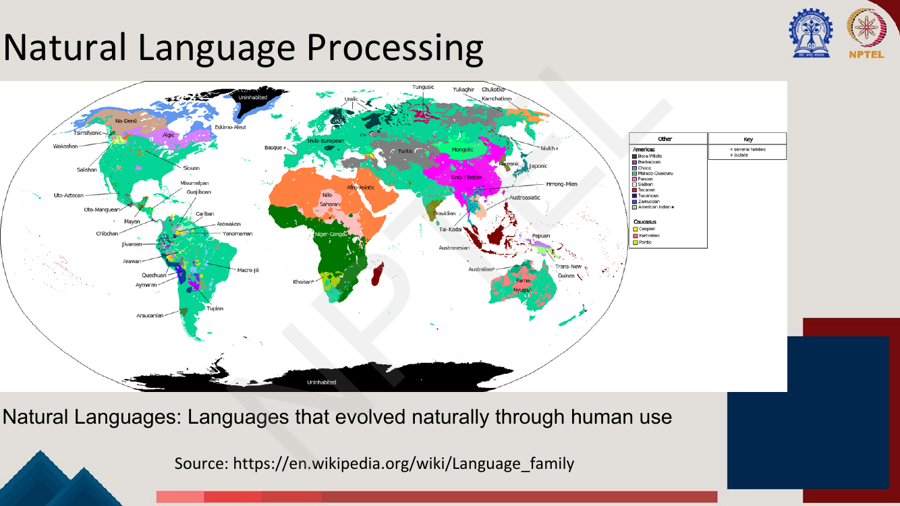
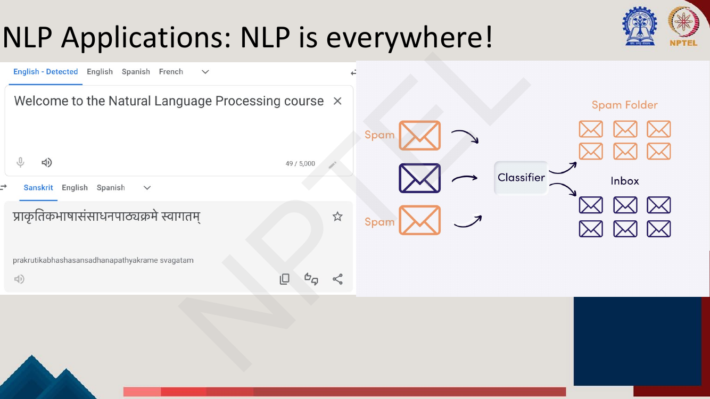
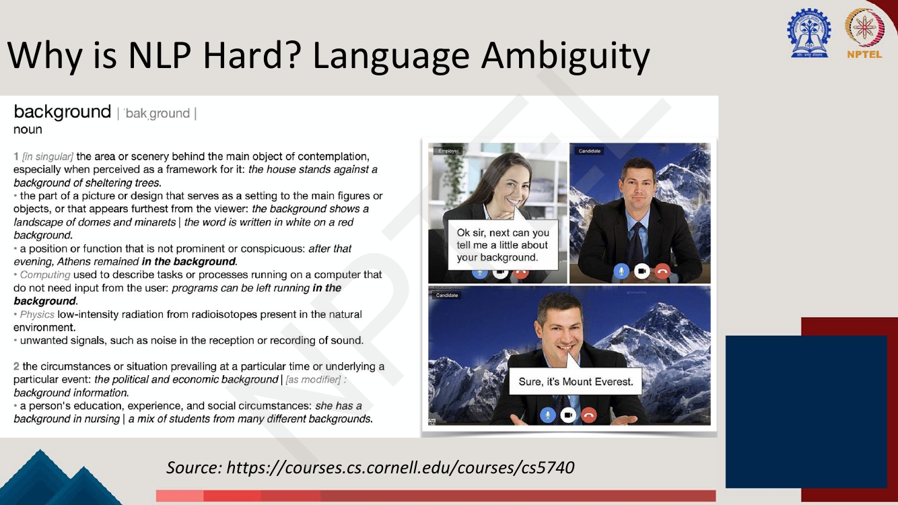
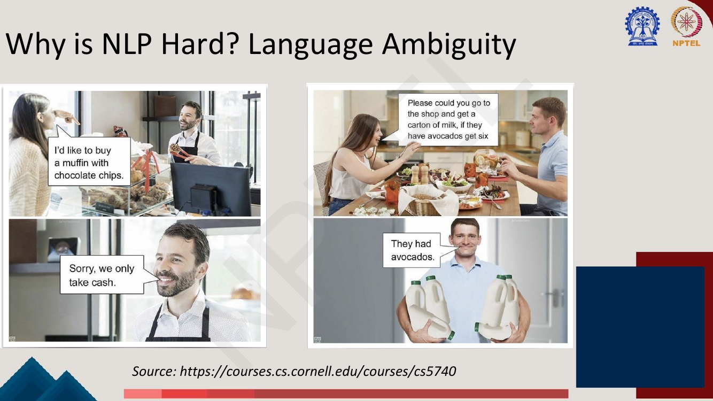
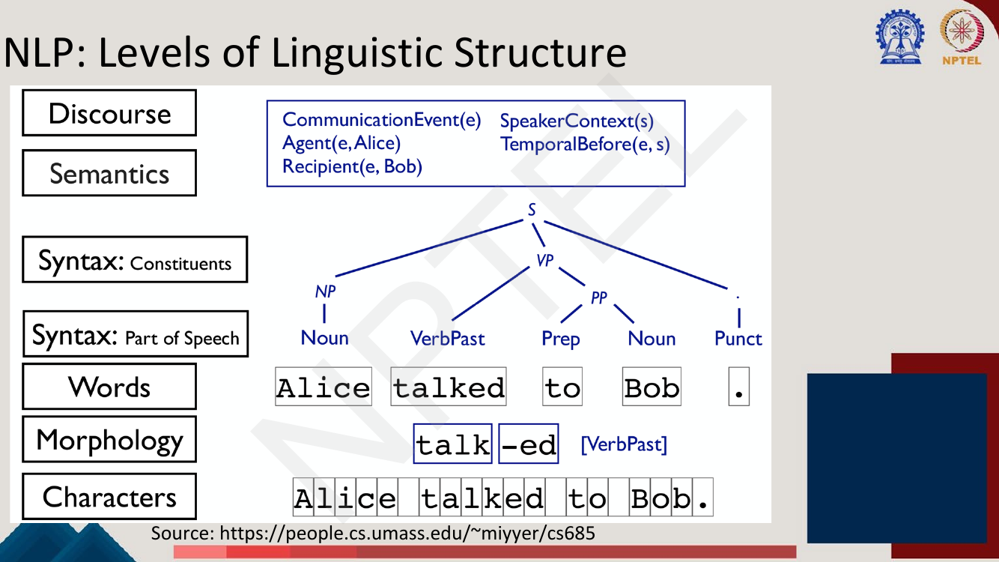
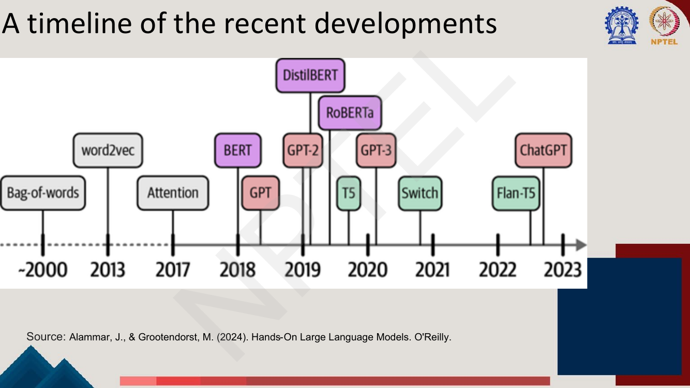

# Lec 1 — Introduction to NLP

> **Source:** `Week1.pdf` pp. 1–25 · **Week 1** · **Playlist:** Lec 1
> **Prereqs:** none
> **Feeds into:** [Lec 2 — Text Processing and Tokenization](02-text-processing-tokenization.md), [Lec 5 — NLP Tasks and Paradigms](05-nlp-tasks-and-paradigms.md)

## Why this lecture exists

Every other lecture in this course is a technique. This one is the problem statement, and without it
the techniques look arbitrary.

Two things get established. First, *why natural language resists computation at all*: not because text
is long or noisy, but because almost every utterance has more than one licensed reading, and the
machinery that picks the right one is world knowledge the computer does not have. Ambiguity is the
reason NLP is a research field rather than a parsing exercise. Second, *how the field has repeatedly
changed its mind* about what a solution looks like — hand-written grammars, then counting, then
learned representations, then pretrain-and-fine-tune, then pretrain-and-prompt, and now "phrase every
task as text generation and let one model do it".

That last arc is the spine of the remaining 59 chapters. Fix it now and everything that follows has a
place to sit.

## The ideas

### What NLP is

A **natural language** is one that evolved naturally through human use — as opposed to a designed
language like Python or predicate logic. The deck opens with a world map of language families to make
the scale concrete: thousands of them, none designed by anyone.


*Fig. — Notice the count and spread: almost all of these languages have far less text available than English, which is the motivation for the multilingual work in [Lec 15](../week-03/15-cross-lingual-representations.md) and [Lec 30](../week-06/30-domain-and-multilingual-pretraining.md). Page 4 of `Week1.pdf`.*

The deck's definition has two halves and a framing sentence:

- **Making computers understand what we write (or speak)** — the comprehension half.
- **Making computers write (and speak)** — the generation half.

> *"The field of NLP attempts to design, implement and test systems that process natural languages for
> practical applications."*

Two phrases carry weight. **Design, implement and test** — NLP is an engineering discipline with an
empirical evaluation culture, not a theory of language. **Practical applications** — the field is
defined by what it is for, which is why the next five slides are an application montage.

### NLP is everywhere

Pages 6–11 are that montage, with no text beyond the titles. Enumerate what they show: an MCQ can ask
"which of these is a sequence-labelling application", and the list previews the second half of the
course.

| On the slide | The task | Covered in |
|---|---|---|
| Google Translate, English → Sanskrit | **Machine translation** | [Lec 18](../week-04/18-seq2seq-and-attention.md) |
| Mail sorted into Spam / Inbox by a classifier | **Text classification** | [Lec 5](05-nlp-tasks-and-paradigms.md) |
| Google search + AI Overview, "Who is the tallest living person?" | **QA**, **retrieval**, **summarisation** | [Lec 31](../week-07/31-question-answering-1.md), [Lec 55](../week-11/55-retrieval-augmented-generation.md) |
| PersonaChat dialogue; ChatGPT "explain it like I'm five / like an adult" | **Dialogue**, **controllable generation** | [Lec 33](../week-07/33-dialogue-systems-1.md) |
| Search-box autocomplete, "What can I eat if I have a pea…nut allergy?" | **Language modelling** | [Lec 3](03-ngram-lm-1.md) |
| News text with Alibaba/Baidu/Tencent tagged ORG, 45% PERCENT, 2017 DATE | **Named entity recognition** | [Lec 17](../week-04/17-rnn-applications.md) |


*Fig. — Two of the oldest NLP products on one page: translation (generation) and spam filtering (classification). They sit at opposite ends of the task taxonomy of [Lec 5](05-nlp-tasks-and-paradigms.md). Page 6.*

The autocomplete slide is quietly the most important. Predicting the greyed-out continuation of a
half-typed query *is* the **language modelling** task that Lectures 3 and 4 formalise and that every
model from GPT onward is trained on — the course's central objective, shown as a consumer feature.


*Fig. — The same task types reappear in every domain; what changes is the vocabulary and the amount of labelled data. Hence domain-specific pretraining, e.g. SciBERT in [Lec 30](../week-06/30-domain-and-multilingual-pretraining.md). Page 11.*

Page 11 specialises those tasks by **domain**: **customer support** (QA over very long e-manuals),
**legal** (clause span extraction from contracts — governing law, covenant not to sue, perpetual
licence), **financial** (NER over annual reports — *cash and cash equivalents*, *impairment loss*),
and **biomedical** (NER, relation extraction and QA, with NCBI-disease, BC2GM, EU-ADR, ChemProt and
BioASQ 5b/6b named on the slide).

### Why NLP is hard: ambiguity

This is the lecture's thesis, and the sentence to carry out of it is the deck's own red box:

> **In natural languages, ambiguity is the rule, not an exception.**

**Ambiguity** means a single surface form — a word, a phrase, a sentence — licenses more than one
structure or meaning, and nothing in the string itself tells you which was intended. Humans resolve it
so fast they do not notice it happening; a computer must do it explicitly, from evidence. It is not
one phenomenon: it occurs at every level of linguistic structure, and knowing which level an example
belongs to is standard exam fodder.

#### Lexical ambiguity — one word, many senses

The deck's example is **background**. The employer asks "tell me a little about your background"; the
candidate, sitting in front of a Mount Everest virtual background, answers "Sure, it's Mount Everest."


*Fig. — The left column is a real dictionary entry: one orthographic word, roughly eight listed senses. The right shows that picking the wrong one needs only a plausible competing context. Page 12.*

Two sub-cases to keep apart:

- **Polysemy** — one word, several *related* senses (`background` = scenery / a person's history / a
  computing mode).
- **Homonymy** — unrelated words sharing a form (`bank` = riverside / financial institution; `saw` =
  past of *see* / the cutting tool and verb).

Choosing among them is **word sense disambiguation**, the oldest named problem in NLP.

#### Syntactic ambiguity — one string, many parses


*Fig. — Left is **PP-attachment**: does* with chocolate chips *modify* muffin *or* buy*? Right is a **discourse/ellipsis** ambiguity:* get six *of what — avocados, or cartons of milk? Both readings are grammatical; only world knowledge separates them. Page 13.*

**Prepositional-phrase attachment** is the canonical structural ambiguity and the one you compute with
below. In `buy a muffin with chocolate chips` the PP can attach to:

```
(a) NP attachment — the muffin has chips:
    buy [ a muffin [ with chocolate chips ] ]

(b) VP attachment — chips are the instrument of buying:
    [ buy [ a muffin ] ] [ with chocolate chips ]
```

Grammar permits both. Only the fact that bakeries take cash rules (b) out — and that fact is nowhere
in the sentence.

#### The deck's worked example: two levels at once


*Fig. — The computer makes two different errors in two turns. First it reads "saw" as the cutting verb (lexical). Corrected, it still reads "with a banana" as an instrument of seeing (syntactic). Getting one level right does not get you the other. Example courtesy Dr. Monojit Choudhury. Page 14.*

1. **Turn 1.** The computer resolves `saw` to the verb *to saw* (cut) and attaches `with a banana` as
   the instrument → "I cut a monkey using a banana". Hence "That's gruesome!".
2. **Turn 2.** Rahul's correction fixes only the *word sense*: `saw` = past tense of *see*.
3. **Turn 3.** The computer accepts the new sense but keeps the instrument attachment → "what else did
   you see with the banana?"

Lexical and syntactic ambiguity are **independent**, so the readings multiply. N1 counts them.

#### Semantic, pragmatic and discourse ambiguity

- **Scope** — *Every student read a book*: one book shared, or one each?
- **Referential (anaphora)** — *The city council denied the demonstrators a permit because they feared
  violence.* Who is *they*? Swap *feared* for *advocated* and the answer flips. (The Winograd schema:
  semantics plus world knowledge, not syntax.)
- **Ellipsis / discourse** — the avocado slide: *get six* omits its noun, recoverable only from the
  preceding discourse. He recovered the wrong one.
- **Pragmatic** — *Can you pass the salt?* is a question in form, a request in function.

### The levels of linguistic structure

Near-certain MCQ material. **Read the levels off the slide exactly**: the deck's list is not the
classical textbook list — it starts at *characters* rather than *phonology*, and it does not name
*pragmatics* as a separate band.


*Fig. — Read bottom-up: characters → morphemes → words → POS tags → constituents → predicate-argument semantics → discourse context. Each level is the input to the next. Memorise the order. Page 15.*

The deck's seven levels, bottom to top, with its running example `Alice talked to Bob.`:

| # | Level (deck's name) | What it is | The slide's example | Representative task |
|---|---|---|---|---|
| 1 | **Characters** | raw orthographic symbols | `A l i c e _ t a l k e d …` | character-level models, OCR correction |
| 2 | **Morphology** | structure *inside* words; morphemes | `talk` + `-ed` → `[VerbPast]` | lemmatisation, subword tokenization ([Lec 2](02-text-processing-tokenization.md)) |
| 3 | **Words** | the token sequence | `Alice` `talked` `to` `Bob` `.` | tokenization, word segmentation |
| 4 | **Syntax: Part of Speech** | grammatical category of each token | `Noun, VerbPast, Prep, Noun, Punct` | POS tagging |
| 5 | **Syntax: Constituents** | how words group into phrases | `S → NP VP .` ; `VP → VerbPast PP` ; `PP → Prep Noun` | parsing, PP-attachment |
| 6 | **Semantics** | literal meaning as predicates and arguments | `CommunicationEvent(e)`, `Agent(e, Alice)`, `Recipient(e, Bob)` | semantic role labelling |
| 7 | **Discourse** | meaning across utterances and relative to the speaker | `SpeakerContext(s)`, `TemporalBefore(e, s)` | coreference, dialogue state |

Two observations. **The levels form a pipeline** — each is computed over the output of the one below,
which is why a tokenization error ([Lec 2](02-text-processing-tokenization.md)) poisons everything
above it. And **ambiguity lives at every level**: morphology (`unlockable` = *un-lockable* or
*unlock-able*), words (Chinese and Thai have no spaces, so segmentation is itself ambiguous), POS
(`back` in *Janet will back the bill* — verb or noun?), constituents (PP attachment), semantics
(scope), discourse (anaphora).

### NLP paradigms: the task view

The deck's standing engineering move — **map a messy linguistic problem onto an ML problem whose shape
you already know**:

| Problem | ML paradigm |
|---|---|
| Sentiment analysis, news article grouping | **Text classification** |
| Named entity recognition, code-mixing | **Sequence labelling** |
| Machine translation, summarisation, chatbots | **Text generation** |

[Lec 5](05-nlp-tasks-and-paradigms.md) defines each formally and gives their evaluation metrics; here
you need the three names and one example of each. The important observation — and the reason page 21
exists — is that this three-way split is itself historical: by the end of the course all three
collapse into the third.

### The historical arc: how a task gets solved


*Fig. — Five eras, each with specific systems named. The stages alternate above and below the bar, so read the bar left to right rather than the page top to bottom. Source: Kamath et al., "Large Language Models: A Deep Dive" (2024). Page 17.*

| Era | Paradigm | How you solve a new task | Systems the deck names |
|---|---|---|---|
| **1950s–1980s** | Syntactic / grammar-based (**rule-based**) | hand-write a grammar and a lexicon | Chomsky's *Syntactic Structures*; **ELIZA**; **SHRDLU** |
| **1980s–2000s** | Expert systems and **statistical models** | hand-write rules + ontologies; then estimate probabilities from a corpus | rules-and-ontology systems; **n-grams combined with ML algorithms** |
| **2000s–2010s** | **Neural models and dense representations** | learn a dense vector per word, feed it to a network | **Bengio** et al.'s dense vector representation; **Mikolov** et al.'s RNN language models; pretrained word embeddings |
| **2010s–2020s** | The **deep learning revolution** | pretrain a big model, then **fine-tune** on your task | **word2vec**, **GloVe**; transfer learning via pretrain-and-fine-tune; **attention** (Bahdanau et al.); **Transformers** (Vaswani et al.); **BERT**, **GPT** |
| **2020s–now** | **Era of LLMs** | write a **prompt**; train nothing | **GPT-2, GPT-3.5, GPT-4**; **RLHF** for alignment to human values (safety, groundedness); open-source LLMs and frameworks |

What to extract is not the dates but **where the human effort moves**:

| Paradigm | Human writes | Machine learns |
|---|---|---|
| Rule-based | the rules themselves | nothing |
| Statistical / classical ML | the **features** | the weights on those features |
| Deep learning | the **architecture** | the features *and* the weights |
| Pretrain → fine-tune | the **objective** + a small labelled set | everything else, from unlabelled text |
| Pretrain → prompt | the **prompt** | nothing at inference time |

That four-stage naming (feature engineering → architecture engineering → objective engineering →
prompt engineering) is Liu et al.'s, not the deck's, but it is the clearest summary of the deck's five
eras. Pretrain-then-fine-tune is developed in [Lec 26](../week-06/26-pretraining-and-elmo.md);
pretrain-then-prompt in [Lec 41](../week-09/41-prompting-1.md). Here they are only timeline points.

### Why deep learning? Sparse features vs learned representations

The one technical slide, and it answers "what did deep learning actually change for NLP?" The answer
is **not** "more layers" — it is **representation learning**.


*Fig. — Two encodings of exactly the same three facts (current word = "dog", previous word = "the", previous POS tag = "DET"). Top: a vector of length ~millions with three or four ones. Bottom: three short dense vectors, looked up and concatenated — all coordinates informative. Source: Goldberg & Hirst (2017). Page 18.*

| | Sparse (classical) | Dense (neural) |
|---|---|---|
| Dimension | one slot per feature; with conjunctions, $\lvert V\rvert^2$ or worse | a few hundred, fixed |
| Occupancy | a handful of non-zeros | every coordinate carries signal |
| Where features come from | a human writes them, including every conjunction (`w=dog & pt=DET`) | learned from data |
| Similarity of `dog` and `cat` | **zero** — distinct indices are orthogonal | high — nearby vectors |
| Unseen combination at test time | weight is 0; no prediction | nearest-neighbour behaviour generalises |

The decisive row is the fourth. In a one-hot encoding, `dog` and `cat` are different coordinates, so a
model that learned something about `the dog` has learned *nothing* about `the cat`. Dense vectors
place similar words near each other, so evidence is shared automatically. That sharing is what
"representation learning" buys, and it is why [Lec 11–14](../week-03/11-word-representation.md) spend
four lectures on how to learn those vectors. Page 19 drives it home with a POS-tagging stack over
`Janet will back the bill`: the dense vectors are the **input layer**, and everything above them —
RNN, softmax over tags, argmax — is what Weeks 2–5 build ([Lec 17](../week-04/17-rnn-applications.md)).

### The recent-developments timeline


*Fig. — Colour-coded by architecture family: grey = pre-Transformer, purple = encoder-only (BERT line), red = decoder-only (GPT line), green = encoder-decoder (T5 line). That three-family split is exactly the taxonomy of [Lec 26](../week-06/26-pretraining-and-elmo.md). Source: Alammar & Grootendorst (2024). Page 20.*

| Year (as drawn) | Model / idea | Family | Covered in |
|---|---|---|---|
| ~2000 | **Bag-of-words** | pre-neural | Lec 11 |
| 2013 | **word2vec** | static embeddings | Lec 12 |
| 2017 | **Attention** (the Transformer) | — | Lec 21–24 |
| 2018 | **BERT** | encoder-only | Lec 27 |
| 2018 | **GPT** | decoder-only | Lec 29 |
| 2019 | **GPT-2** | decoder-only | Lec 29 |
| 2019 | **DistilBERT** | encoder-only, distilled | Lec 50 |
| 2019 | **RoBERTa** | encoder-only | Lec 28 |
| 2019–20 | **T5** | encoder-decoder | Lec 28 |
| 2020 | **GPT-3** | decoder-only | Lec 29 |
| 2021 | **Switch** (sparse MoE) | encoder-decoder | Lec 25 |
| 2022 | **Flan-T5** | encoder-decoder, instruction-tuned | Lec 37 |
| 2023 | **ChatGPT** | decoder-only, RLHF | Lec 38–39 |

Read it as three overlapping stories: *representations* improve (bag-of-words → word2vec), then
*architectures* (attention/Transformer), then *scale plus alignment* (GPT-3 → Flan-T5 → ChatGPT).

### The destination: "just use generation"

![Slide "Change of NLP paradigms: Just use generation!" — prompt boxes for Summarization, Sentiment Analysis and Question Answering above a dashed line, and Natural Language Inference below it, all feeding one box labelled T0, which emits the text outputs "Graffiti artist Banksy is believed to be behind […]", "4", "Arizona Cardinals" and "Yes"](../../assets/pages/lec01/p-021.png)
*Fig. — Every task is phrased as a natural-language prompt and answered as natural-language text by **one** model. The dashed line separates tasks T0 was trained on from a held-out task (NLI) it has never seen and still answers: **zero-shot task generalization**. Sanh et al., ICLR 2022. Page 21.*

The move, stated precisely, because it is the course's thesis:

1. In the classification paradigm, sentiment analysis needs a 5-way softmax head, its own labelled
   dataset and its own model. Change the label set and you retrain.
2. In the generation paradigm, you append *"On a scale of 1 to 5, I would give this a"* and let the
   model **generate the next token**. The output `4` is a string, not a class index.
3. Because the task description is itself text, a model trained on a *mixture* of such prompts can
   answer a prompt for a task it was never trained on — the NLI example below the dashed line. That is
   **zero-shot task generalization**.

So the three paradigms of page 16 do not stay parallel: classification and sequence labelling get
absorbed into generation. This is why the second half of the course is about instruction tuning, RLHF
and prompting rather than task-specific architectures — once the interface is text, improving the
single model improves every task at once.

### The course as a map

| Block | Weeks | Content | Chapters |
|---|---|---|---|
| **Background** | 1–3 | Introduction to NLP; deep learning and representation learning; word representation (Word2Vec, GloVe, FastText, multilingual) | Lec 1–15 |
| **Models and Architectures** | 4–5 | RNNs, LSTMs, sequence-to-sequence; attention in RNNs and self-attention in Transformers | Lec 16–25 |
| **Methods** | 6 | Pretraining: self-supervised objectives, ELMo, BERT, GPT, T5, BART, fine-tuning | Lec 26–30 |
| **Tasks** | 7 | QA, summarisation, dialogue; domain- and language-specific applications | Lec 31–35 |
| **Methods (LLMs)** | 8–11 | Instruction fine-tuning, RLHF, alignment; in-context learning and chain-of-thought; PEFT, LoRA, QLoRA; long context and RAG | Lec 36–55 |
| **Conclusion** | 12 | Analysis and interpretability, ethical considerations | Lec 56–60 |

## Worked numericals

No "Try this problem" pages occur in pages 1–25 — this is a motivational opening lecture and the deck
sets no exercises. The numericals below are the genuinely quantitative work this material supports:
counting readings, counting parses, and resolving an ambiguity from counts.

### N1. Counting the readings of the deck's own sentence (page 14)
**Given:** `I saw a monkey with a banana.` Two sources of ambiguity: the word `saw` has two senses, and
the prepositional phrase `with a banana` has two attachment sites.
**Find:** the number of distinct readings, and the bracketing of each.

1. **Lexical dimension.** `saw` is either (i) the past tense of *see* or (ii) the verb *to saw* (cut).
   That is 2 options.
2. **Syntactic dimension.** `with a banana` attaches either to the NP `a monkey` or to the VP as an
   instrument. That is 2 options.
3. The choices are **independent**, so the readings multiply: $2 \times 2 = 4$.

| # | Sense of `saw` | Attachment | Bracketing | Reading |
|---|---|---|---|---|
| 1 | *see* (past) | NP | `[VP saw [NP a monkey [PP with a banana]]]` | I observed a monkey holding a banana. |
| 2 | *see* (past) | VP | `[VP [VP saw [NP a monkey]] [PP with a banana]]` | Using a banana, I observed a monkey. |
| 3 | *saw* (cut) | NP | `[VP saw [NP a monkey [PP with a banana]]]` | I cut a monkey holding a banana. |
| 4 | *saw* (cut) | VP | `[VP [VP saw [NP a monkey]] [PP with a banana]]` | I cut a monkey using a banana. |

4. The slide's dialogue walks reading 4 → (after correction) reading 2. The intended reading was 1.

**Answer:** **4 readings.** Note that the two bracketings repeat across the senses — the *tree* is
blind to word sense, which is exactly why fixing the sense in turn 2 did not fix the attachment in
turn 3.

### N2. The combinatorial explosion of PP attachment (Catalan numbers)
**Given:** a sentence of the form `V NP PP₁ PP₂ … PPₙ` — a verb, its object, and $n$ prepositional
phrases in a row, e.g. `I saw the man on the hill with the telescope` ($n = 2$).
**Find:** the number of distinct attachment structures as a function of $n$.

1. The head `V` is followed by $n+1$ right-hand sisters (`NP`, `PP₁`, …, `PPₙ`), so the phrase is
   built from $m = n + 2$ items in fixed left-to-right order.
2. Each parse is one way of fully bracketing those $m$ items into a binary tree, and the number of
   binary bracketings of $m$ ordered items is the **Catalan number** $C_{m-1}$.
3. So the number of readings is
   $$C_{n+1}, \qquad C_k = \frac{(2k)!}{k!\,(k+1)!} = \frac{1}{k+1}\binom{2k}{k}.$$
4. Compute with the recurrence $C_{k+1} = C_k \cdot \dfrac{2(2k+1)}{k+2}$ from $C_0 = 1$:
   $C_1 = 1\cdot\frac{2}{2} = 1$; $C_2 = 1\cdot\frac{6}{3} = 2$; $C_3 = 2\cdot\frac{10}{4} = 5$;
   $C_4 = 5\cdot\frac{14}{5} = 14$; $C_5 = 14\cdot\frac{18}{6} = 42$; $C_6 = 42\cdot\frac{22}{7} = 132$;
   $C_7 = 132\cdot\frac{26}{8} = 429$; $C_8 = 429\cdot\frac{30}{9} = 1430$.
5. Tabulating (readings $= C_{n+1}$):

| $n$ (number of PPs) | 1 | 2 | 3 | 4 | 5 | 6 | 7 |
|---|---|---|---|---|---|---|---|
| **distinct parses** | 2 | 5 | 14 | 42 | 132 | 429 | 1430 |

6. Check against N1: `saw a monkey with a banana` has 1 PP → $C_2 = 2$ attachments ✓. And
   `saw the man on the hill with the telescope` → $C_3 = 5$ parses.

**Answer:** $C_{n+1}$, i.e. **2, 5, 14, 42, 132, 429, 1430** for $n = 1 \ldots 7$. Growth is roughly
$4^n/n^{3/2}$ — a seven-PP sentence has over fourteen hundred grammatical parses, of which a human
notices exactly one. *That* is why NLP is hard, and why every modern system is a probabilistic ranker
rather than a grammar.

### N3. Resolving a PP attachment from corpus counts
**Given:** a treebank contains 500 sentences matching `see NP with NP`. In 120 the PP attaches to the
verb (instrument reading); in 380 it attaches to the object noun. Among V-attached cases the head noun
of the PP is `banana` with probability $0.005$; among N-attached cases, $0.050$.
**Find:** $P(\text{V-attach} \mid \text{head} = \texttt{banana})$.

1. Priors: $P(\text{V}) = 120/500 = 0.24$, $P(\text{N}) = 380/500 = 0.76$. Check: they sum to 1 ✓
2. Joint, V-attach: $0.24 \times 0.005 = 0.0012$.
3. Joint, N-attach: $0.76 \times 0.050 = 0.038$.
4. Evidence: $0.0012 + 0.038 = 0.0392$.
5. $P(\text{V} \mid \texttt{banana}) = 0.0012/0.0392 = 0.0306$; hence $P(\text{N} \mid \texttt{banana}) = 0.9694$.

**Answer:** $P(\text{V-attach}) \approx \mathbf{0.031}$, $P(\text{N-attach}) \approx \mathbf{0.969}$ —
the monkey has the banana. Notice what did the work: the prior alone favoured N-attach only 0.76 to
0.24; the lexical evidence (bananas are things you hold, not things you see *with*) pushed it to 97%.
Statistical NLP is this computation, scaled up.

### N4. How many POS taggings does a short sentence have?
**Given:** `Janet will back the bill` (page 19), with candidate tags per token: `Janet` 1 (NNP), `will`
3 (MD, NN, VB), `back` 5 (VB, NN, RB, JJ, VBP), `the` 1 (DT), `bill` 3 (NN, VB, VBP).
**Find:** the number of complete tag sequences, and how many a bigram tagger must score.

1. Tags are chosen per position, so the count is the product: $1 \times 3 \times 5 \times 1 \times 3 = 45$.
2. Exactly one is correct — `NNP MD VB DT NN`, as the slide shows.
3. A bigram (first-order) tagger scores one transition per adjacent tag pair instead of enumerating:
   $1\cdot3 + 3\cdot5 + 5\cdot1 + 1\cdot3 = 3 + 15 + 5 + 3 = 26$.
4. The gap grows fast: a 20-word sentence averaging 2 tags per word has $2^{20} = 1{,}048{,}576$
   taggings but only $19 \times 2 \times 2 = 76$ transitions.

**Answer:** **45 complete taggings, 26 bigram transitions** — the argument for dynamic programming
over enumeration in sequence labelling ([Lec 17](../week-04/17-rnn-applications.md)).

## Code

This lecture is conceptual, so there is no algorithm to implement. What can be made concrete is the
arithmetic above — the parse explosion, the Bayesian disambiguation, and page 18's sparse-vs-dense
argument.

```python
import numpy as np

# --- 1. How fast does PP-attachment ambiguity explode? -------------------
# A head followed by m right-hand sisters has C_{m-1} binary bracketings,
# where C_k is the k-th Catalan number.  "V NP PP_1..PP_n" has m = n + 2
# items, so the number of readings is C_{n+1}.
def catalan(k):
    c = 1                                   # C_0 = 1
    for i in range(k):
        c = c * 2 * (2 * i + 1) // (i + 2)  # C_{i+1} = C_i * 2(2i+1)/(i+2)
    return c

print(" n PPs | readings")
for n in range(1, 9):
    print(f"   {n:2d}  |  {catalan(n + 1):6d}")

# --- 2. Resolving one ambiguity with counts (N3) -------------------------
prior = {"V-attach": 120 / 500, "N-attach": 380 / 500}   # treebank counts
lik   = {"V-attach": 0.005,     "N-attach": 0.050}       # P(head="banana" | attachment)
joint = {k: prior[k] * lik[k] for k in prior}
Z = sum(joint.values())
print("\nprior  ", {k: round(v, 4) for k, v in prior.items()})
print("joint  ", {k: round(v, 6) for k, v in joint.items()})
print("post   ", {k: round(v / Z, 4) for k, v in joint.items()})

# --- 3. Sparse one-hot features vs dense embeddings (page 18) ------------
V = 50_000                      # word vocabulary
T = 45                          # POS tagset
# sparse: indicators for w, prev-word, prev-tag, plus the conjunctions the
# slide draws (w&pt, w&pw) -- conjunctions are what make it explode
sparse_dim = V + V + T + V * T + V * T + V * V
dense_dim  = 100 + 100 + 20     # w-emb + pw-emb + ptag-emb, concatenated
print(f"\nsparse feature dimension : {sparse_dim:,}  (3 non-zeros)")
print(f"dense  feature dimension : {dense_dim:,}  (all non-zero)")
print(f"compression factor       : {sparse_dim / dense_dim:,.0f}x")

# why dense wins: one-hot vectors are orthogonal, embeddings are not
rng = np.random.default_rng(0)
onehot = np.zeros((2, V)); onehot[0, 11] = 1; onehot[1, 12] = 1   # "dog", "cat"
dog = rng.normal(size=100)
cat = dog + 0.25 * rng.normal(size=100)                           # a near neighbour
cos = lambda a, b: float(a @ b / (np.linalg.norm(a) * np.linalg.norm(b)))
print(f"\ncos(one-hot dog, one-hot cat) = {cos(onehot[0], onehot[1]):.4f}")
print(f"cos(dense   dog, dense   cat) = {cos(dog, cat):.4f}")
```

Printed output:

```
 n PPs | readings
    1  |       2
    2  |       5
    3  |      14
    4  |      42
    5  |     132
    6  |     429
    7  |    1430
    8  |    4862

prior   {'V-attach': 0.24, 'N-attach': 0.76}
joint   {'V-attach': 0.0012, 'N-attach': 0.038}
post    {'V-attach': 0.0306, 'N-attach': 0.9694}

sparse feature dimension : 2,504,600,045  (3 non-zeros)
dense  feature dimension : 220  (all non-zero)
compression factor       : 11,384,546x

cos(one-hot dog, one-hot cat) = 0.0000
cos(dense   dog, dense   cat) = 0.9714
```

The parse counts match N2 and the posterior matches N3. The last two lines are the whole "Why Deep
Learning?" argument in two numbers: **one-hot features for `dog` and `cat` have cosine similarity
exactly 0**, so no evidence transfers between them, while dense vectors share almost everything. The
11-million-fold blow-up comes mostly from the conjunction features — a human writing those by hand is
enumerating a space they can never finish, and that enumeration is what representation learning
replaces.

## Exam pack

### Must-memorise

| Item | Exactly this |
|---|---|
| Natural language | a language that **evolved naturally through human use** |
| NLP, the deck's definition | making computers **understand** what we write/speak, and making computers **write/speak**; systems that **design, implement and test** processing of natural languages for **practical applications** |
| Why NLP is hard | **language ambiguity** |
| The deck's slogan | *"In natural languages, ambiguity is the rule, not an exception"* |
| Levels of linguistic structure (deck's list, bottom → top) | **Characters → Morphology → Words → Syntax: Part of Speech → Syntax: Constituents → Semantics → Discourse** (7 levels) |
| Deck's example for the levels | `Alice talked to Bob.`; morphology `talk + -ed → [VerbPast]`; semantics `CommunicationEvent(e), Agent(e, Alice), Recipient(e, Bob)`; discourse `SpeakerContext(s), TemporalBefore(e, s)` |
| The three ML paradigms | sentiment/news grouping → **text classification**; NER/code-mixing → **sequence labelling**; MT/summarisation/chatbots → **text generation** |
| Five historical eras | 1950s–80s grammar/rule-based → 1980s–2000s expert systems + statistical → 2000s–2010s neural + dense representations → 2010s–2020s deep learning revolution → 2020s–now era of LLMs |
| First-era systems | Chomsky's *Syntactic Structures*, **ELIZA**, **SHRDLU** |
| What deep learning changed | **feature engineering → representation learning**: dense vectors replace hand-written sparse indicator features |
| Sparse vs dense, key property | one-hot `dog` and `cat` are **orthogonal** (similarity 0); dense embeddings are close, so evidence generalises |
| Page 21's thesis | **"Just use generation!"** — every task phrased as a text prompt, answered by one model; held-out tasks work via **zero-shot task generalization** (T0, Sanh et al., ICLR 2022) |
| PP-attachment parse count | $C_{n+1}$ for $n$ PPs, where $C_k = \frac{1}{k+1}\binom{2k}{k}$ |

### Numbers worth knowing

| Quantity | Value |
|---|---|
| Levels of linguistic structure on the slide | **7** |
| ML paradigms on page 16 | **3** |
| Eras on the historical timeline | **5** |
| Bag-of-words | ~2000 |
| word2vec | **2013** |
| Attention / Transformer | **2017** |
| BERT, GPT | **2018** |
| GPT-2, DistilBERT, RoBERTa | **2019** |
| T5 | 2019–2020 (drawn between the ticks) |
| GPT-3 | **2020** |
| Switch Transformer | **2021** |
| Flan-T5 | **2022** |
| ChatGPT | **2023** |
| T0 paper | Sanh et al., *Multitask Prompted Training Enables Zero-Shot Task Generalization*, **ICLR 2022** |
| Parses for 1 / 2 / 3 / 4 PPs | 2 / 5 / 14 / 42 |
| Deck's four reference texts | Jurafsky & Martin SLP3 (Aug 2024 manuscript); Alammar & Grootendorst (2024); Goldberg & Hirst (2017); Kamath et al. (2024) |

### Likely MCQ traps

- **"Which of the following is NOT a level of linguistic structure?"** On *this* deck the seven are
  Characters, Morphology, Words, Syntax (POS), Syntax (Constituents), Semantics, Discourse.
  **Phonology and pragmatics are *not* on the slide**, though textbooks include them — read the
  question's framing. Safe discriminator: *tokenization*, *parsing*, *translation* are **tasks**.
- **Morphology vs syntax.** `talk + -ed` is **morphology** (structure *inside* a word); `Noun VerbPast
  Prep Noun` is **syntax** (structure *between* words) — even though the morpheme `-ed` yields a
  tense, which sounds syntactic.
- **Semantics vs discourse.** `Agent(e, Alice)` is **semantics** — who did what to whom *in this
  sentence*. `SpeakerContext(s)` and `TemporalBefore(e, s)` are **discourse** — relating the sentence
  to the speaker and to other utterances. Cross-sentence coreference is discourse.
- **Polysemy vs homonymy.** Polysemy = related senses of one word (`background`); homonymy = unrelated
  words sharing a form (`bank`). Both are *lexical* ambiguity.
- **"PP-attachment is a semantic ambiguity."** No — it is **syntactic** (two different trees). It is
  *resolved* using semantics and world knowledge, which is the source of the confusion.
- **"Which paradigm came first?"** Rule-based / grammar-based (1950s–80s), **before** statistical.
  ELIZA and SHRDLU are **rule-based**, not statistical or neural, despite being conversational.
- **"Deep learning for NLP means more layers."** The deck's claim is narrower and is the examinable
  one: it replaced **hand-engineered sparse features** with **learned dense representations**.
- **"Dense representations are compressed one-hot vectors."** They are *learned*, not compressed — a
  random projection of one-hots is dense too and helps nothing. What matters is that similar words end
  up near each other.
- **Timeline off-by-one.** Attention/Transformer is **2017**; BERT and GPT are **2018**. Putting BERT
  in 2017 or attention in 2018 is the classic slip.
- **"Zero-shot generalization means training on the task without labels."** No — in the T0 figure NLI
  is **below the dashed line**: it was not in the training mixture at all. The model generalises
  because the *task description* is itself text.
- **Treating classification / sequence labelling / generation as permanent categories.** Page 16
  presents three; page 21 collapses them into one. "What is the modern paradigm?" → **generation**.

### Self-test

1. Give the deck's two-part definition of NLP.
2. List the seven levels of linguistic structure in the deck's order, bottom to top.
3. Which level does splitting `talked` into `talk` + `-ed` belong to? Which level is `Recipient(e, Bob)`?
4. `I saw a monkey with a banana.` Name the two *independent* ambiguities and give the total readings.
5. A sentence has the form `V NP PP₁ PP₂ PP₃`. How many attachment structures does it have?
6. Map each to a paradigm: (a) sentiment analysis, (b) named entity recognition, (c) summarisation.
7. Put in chronological order: BERT, word2vec, ChatGPT, the Transformer, GPT-3.
8. In one sentence, what did deep learning change about how NLP features are obtained?
9. Why does a one-hot feature for `dog` teach a model nothing about `cat`?
10. In the T0 figure, what does the dashed line separate, and what is the name for what happens below it?
11. Which of these are rule-based systems: ELIZA, word2vec, SHRDLU, RoBERTa?
12. *Get a carton of milk; if they have avocados get six.* Which level of ambiguity is this, and why is it not syntactic?

<details><summary>Answers</summary>

1. Making computers **understand** what we write or speak, and making computers **write and speak** — designing, implementing and testing systems that process natural languages for practical applications.
2. Characters, Morphology, Words, Syntax: Part of Speech, Syntax: Constituents, Semantics, Discourse.
3. `talk + -ed` is **morphology**; `Recipient(e, Bob)` is **semantics** (the discourse items on that slide are `SpeakerContext(s)` and `TemporalBefore(e, s)`).
4. Lexical: `saw` = past of *see* vs. the cutting verb. Syntactic: `with a banana` attaches to the NP `a monkey` or to the VP as an instrument. $2 \times 2 = \mathbf{4}$ readings.
5. $n = 3$, so $C_4 = \mathbf{14}$.
6. (a) text classification, (b) sequence labelling, (c) text generation.
7. word2vec (2013) → Transformer/attention (2017) → BERT (2018) → GPT-3 (2020) → ChatGPT (2023).
8. Features stopped being hand-written sparse indicators and became dense vectors **learned from data** — feature engineering became representation learning.
9. One-hot vectors for distinct words occupy distinct coordinates and are orthogonal (cosine 0), so a weight learned for the `dog` coordinate contributes nothing at the `cat` coordinate.
10. It separates the tasks T0 was trained on (summarisation, sentiment, QA) from a held-out task (natural language inference) it was never trained on. Answering the held-out task is **zero-shot task generalization**.
11. **ELIZA** and **SHRDLU**. word2vec is a neural embedding model (2013); RoBERTa is a pretrained Transformer encoder (2019).
12. **Discourse** (ellipsis): `get six` omits its head noun, and recovering it needs the preceding utterance plus world knowledge. It is not syntactic because both recoveries give the same parse tree — the ambiguity is in what the elided noun *refers to*.

</details>

## Beyond the slides

**Gap:** The levels diagram starts at *Characters* and stops at *Discourse*, omitting
**phonetics/phonology** at the bottom and **pragmatics** between semantics and discourse.
**Why it matters:** Nearly every NLP textbook — Jurafsky & Martin included, the deck's own reference —
lists phonology → morphology → syntax → semantics → pragmatics → discourse. If an exam question is set
from a textbook rather than this slide, *pragmatics* will be a valid option and *characters* may not
be. This deck's list is a **text-processing** stack (it begins at characters because text, not speech,
is the input); the classical one is a **linguistics** stack. Pragmatics is the level at which *"Can you
pass the salt?"* is a request rather than a question about your abilities.

**Gap:** Ambiguity is presented as the *problem*, but the deck never says how the field decided to
*solve* it.
**Why it matters:** The answer is the most important methodological idea in the course: **rank the
readings by probability and take the most likely one**. Rule-based systems tried to eliminate
ambiguity by writing tighter grammars, which fails because the ambiguity is real — all 1430 parses of
a seven-PP sentence are grammatical. Statistical NLP accepts all of them and scores them, which is
exactly N3. Everything from n-gram models ([Lec 3](03-ngram-lm-1.md)) to a modern LLM is a machine for
assigning probabilities to competing readings.

**Gap:** The timeline names *n-grams combined with ML algorithms* for the statistical era but never
says what made the statistical turn work.
**Why it matters:** The enabling conditions were **annotated corpora** (the Penn Treebank, 1993) and
cheap computation, not a new theory — and the pattern repeats. Each shift on the deck's timeline is
driven by a data or compute change as much as by an algorithm. The pretrain-and-fine-tune era in
[Lec 26](../week-06/26-pretraining-and-elmo.md) is the clearest case: the algorithm (language
modelling) was decades old; what changed was web-scale unlabelled text.

**Gap:** The deck says "Era of LLMs" but never says what makes a language model *large*, or why scale
alone produced the qualitative change on page 21.
**Why it matters:** The jump from "fine-tune per task" to "prompt one model" was an *empirical*
discovery: above a certain scale, models began following instructions they were never trained to
follow. The quantitative statement is the scaling laws of [Lec 51](../week-11/51-scaling-laws.md); the
mechanism is [Lec 42](../week-09/42-why-icl-works.md). Until then, treat "just use generation" as an
observed fact about large models, not something that follows from the architecture.

**Gap:** No mention of the costs — data bias, hallucination, energy, or the fact that the map on page
4 shows thousands of languages for which essentially none of this works.
**Why it matters:** [Lec 59](../week-12/59-trustworthy-llms-taxonomy.md) is entirely about this, and
the course's multilingual thread ([Lec 15](../week-03/15-cross-lingual-representations.md),
[Lec 30](../week-06/30-domain-and-multilingual-pretraining.md)) exists because the paradigm the
timeline celebrates is overwhelmingly an English-language achievement.

## Cut from the slides

Dropped pages 1–3 (title, agenda, instructor contact details and TA names) — administrative, not
examinable. Page 5's definition is kept verbatim because it is the one quotable sentence in the
lecture. Pages 6–10 are five consecutive "NLP is everywhere!" montages with no text beyond the title;
rather than reproduce five screenshots, they are compressed into one application table plus one
representative figure, with every application they show named. Page 19 (the POS-tagging stack) is
mentioned in a sentence but not expanded — the RNN, the softmax and the argmax belong to
[Lec 16–17](../week-04/16-rnn-language-models.md). Pages 24 (references) and 25 ("Thank You") carry no
content beyond the four citations, which are in the Numbers table. Nothing about ambiguity, the levels
of linguistic structure, the paradigm timelines or the "just use generation" argument was dropped —
those are this chapter's core and are covered in full. There are **no "Try this problem" pages** in
pages 1–25.
