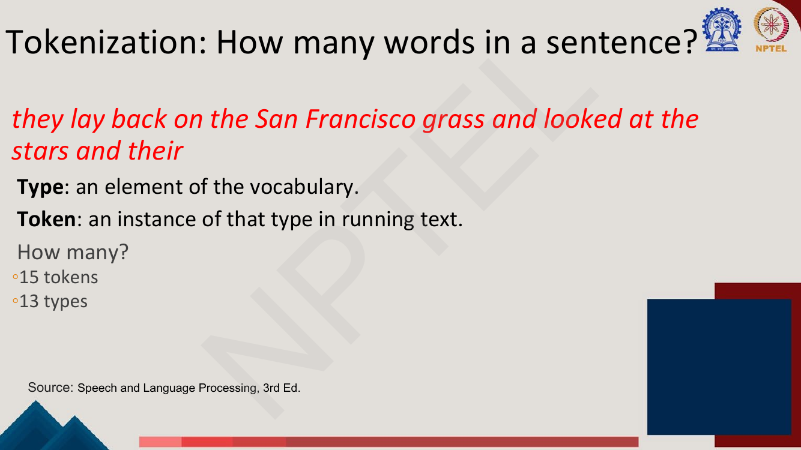
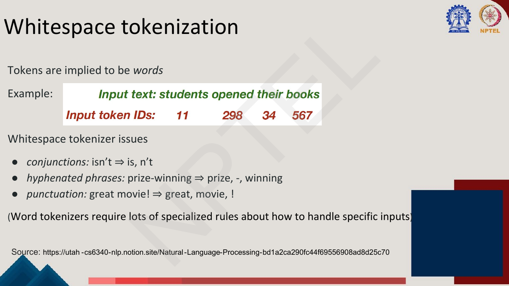
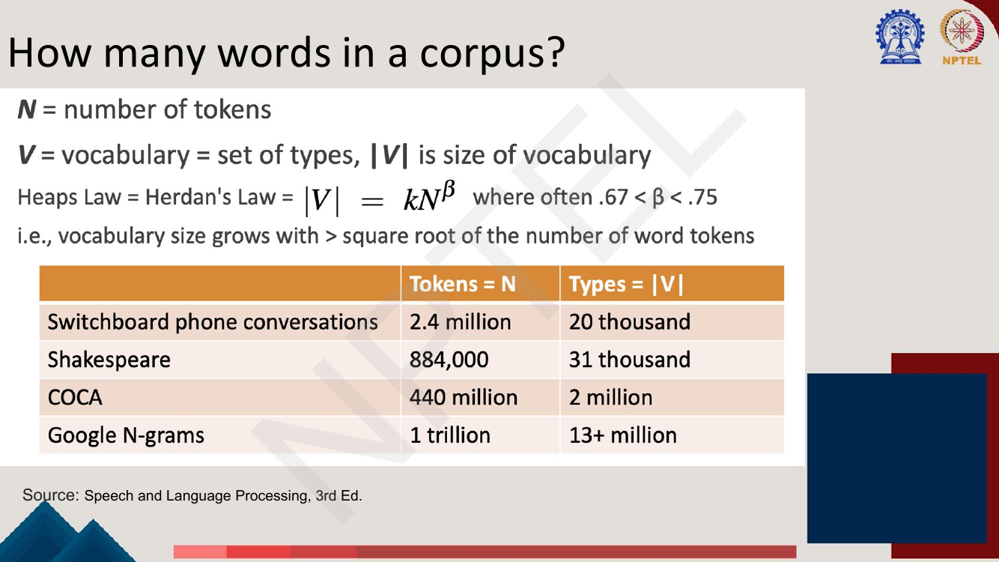
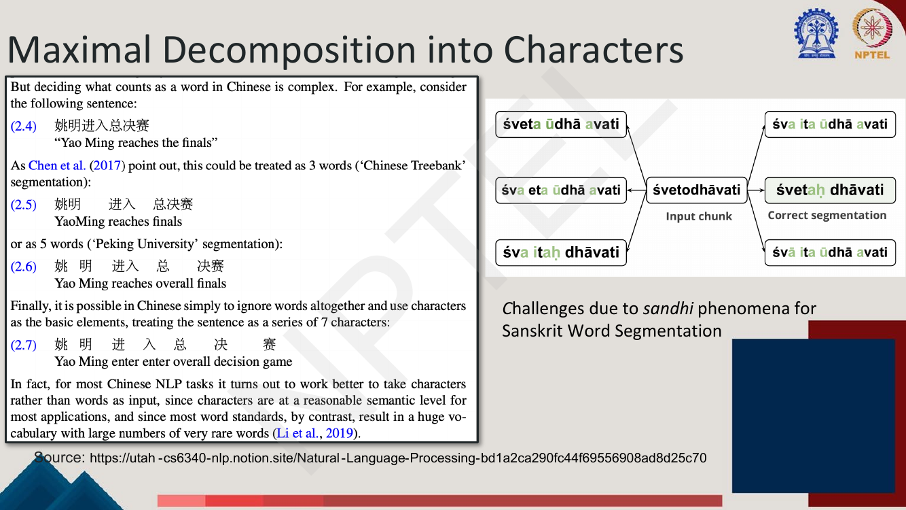
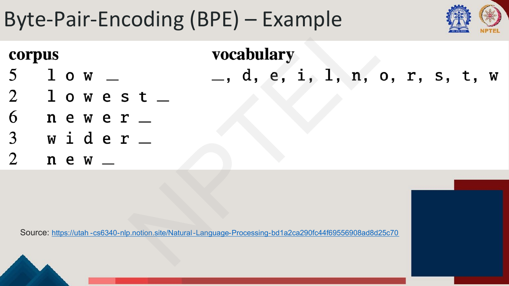
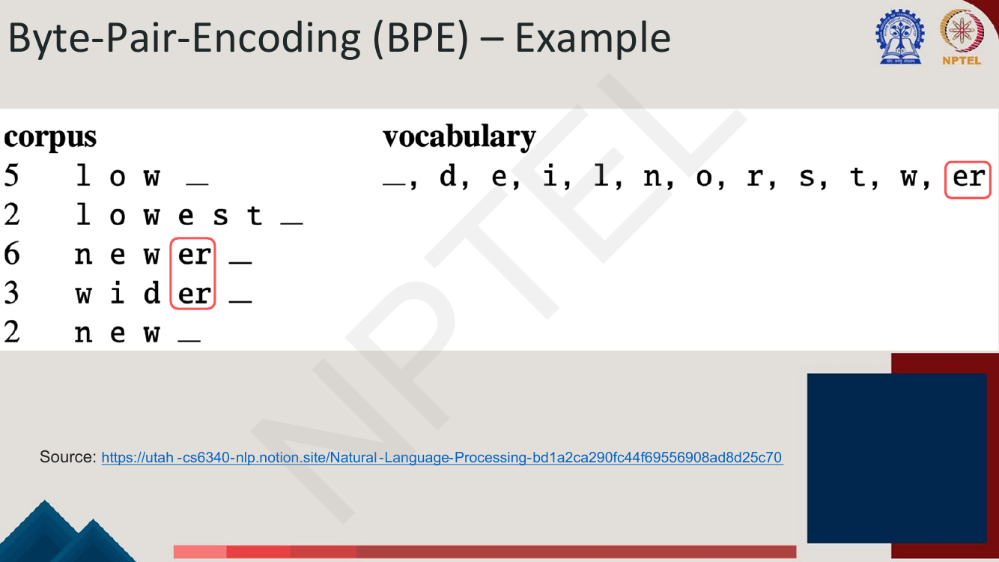
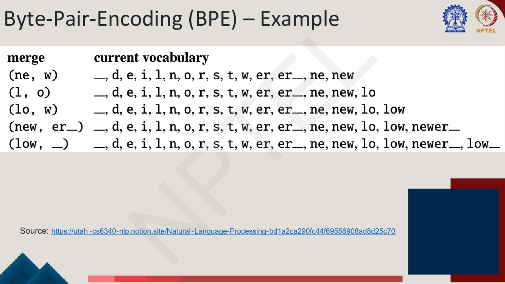
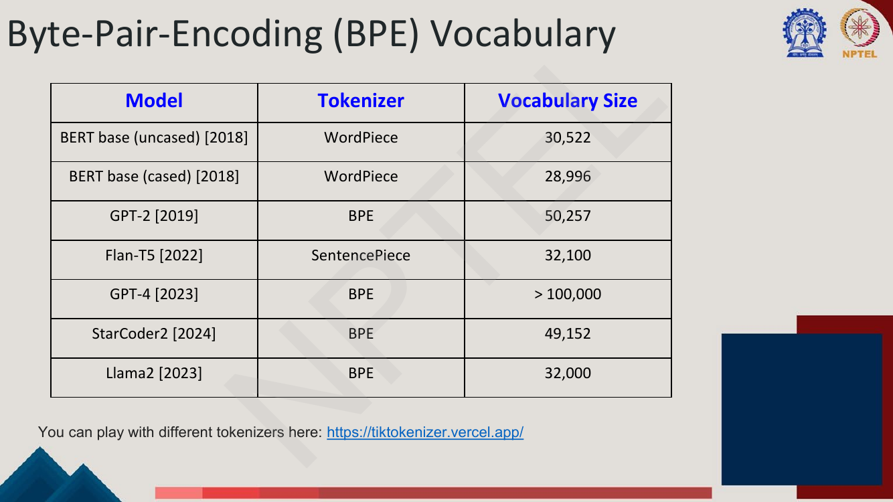
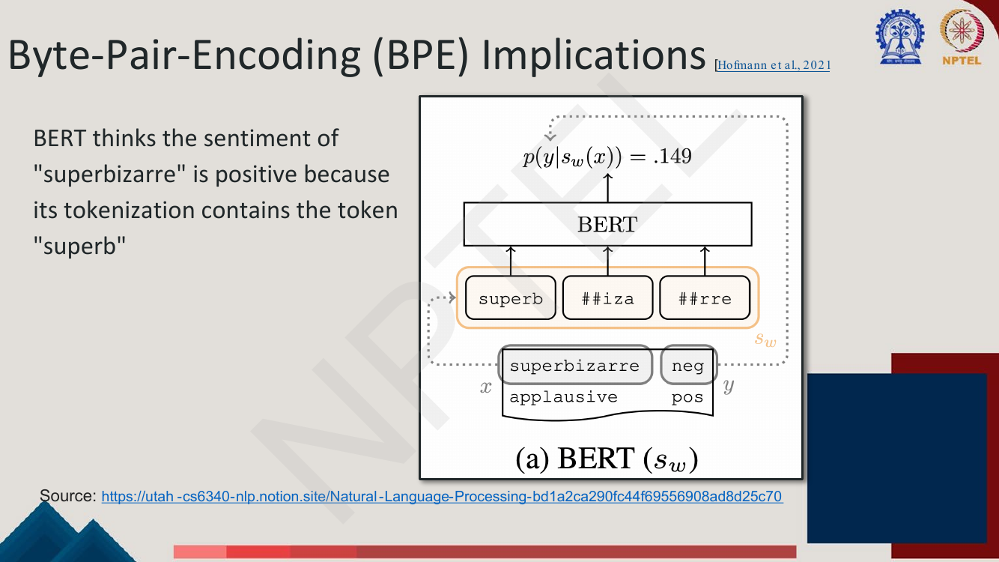
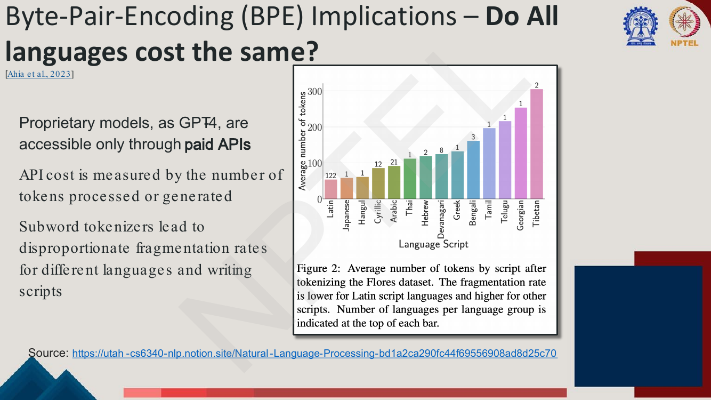

# Lec 2 — Text Processing Basics and Tokenization

> **Source:** `Week1.pdf` pp. 26–54 · **Week 1** · **Playlist:** Lec 2
> **Prereqs:** [Lec 1 — Introduction to NLP](01-intro-to-nlp.md)
> **Feeds into:** [Lec 3 — N-gram Language Models I](03-ngram-lm-1.md), [Lec 14 — fastText and Beyond Words](../week-03/14-fasttext-and-beyond-words.md), [Lec 30 — Domain and Multilingual Pretraining](../week-06/30-domain-and-multilingual-pretraining.md)

## Why this lecture exists

Lecture 1 promised that computers would process natural language. Before any model can touch a
sentence, something has to chop that sentence into discrete pieces and give each piece an integer ID,
because neural networks consume index vectors, not characters. That chopping step is **tokenization**,
and it happens to every piece of text in every NLP system you will build.

The lecture's real content is that tokenization is *not obvious*. "Split on spaces" fails immediately
on `isn't`, `prize-winning` and `great movie!`. Splitting into characters throws away everything a word
means. And whatever you choose, a test sentence will eventually contain a word your vocabulary has
never seen. The resolution — learn the units from the data itself, as **subwords**, using **byte-pair
encoding** — is what every modern model does, and it is this chapter's centrepiece.

## The ideas

### How many words in a sentence? Types and tokens

Every NLP pipeline has the same front end: raw text goes in, the model consumes integers —
`students opened their books` becomes `11, 298, 34, 567`. The tokenizer is that bridge, and it fixes
the **vocabulary** $V$. Since $|V|$ is the number of rows in the embedding table and of outputs in the
final softmax, tokenization is an architectural decision, not a preprocessing detail. Two definitions
to state exactly:

- **Type** — an element of the vocabulary. A distinct word form.
- **Token** — an instance of that type in running text.


*Fig. — 15 tokens, 13 types; the gap of 2 is the repetitions of "the" and "and". The sentence is also a trap: is "San Francisco" one word or two? Page 29.*

So "word" is not well defined. The deck's whitespace slide names three more failures, to which case
should be added:

| Phenomenon | Example | Whitespace gives | The problem |
|---|---|---|---|
| **Clitics / contractions** | `isn't` | `is`, `n't` | `n't` is a real negation morpheme; split it wrong and you lose the negation |
| **Hyphenation** | `prize-winning` | `prize`, `-`, `winning` | one adjective becomes three tokens, one of them punctuation |
| **Punctuation** | `great movie!` | `great`, `movie`, `!` | without a rule, `movie!` and `movie` are *different types* |
| **Case** | `The` vs `the` | two types | same word, two embeddings, half the data each |


*Fig. — The parenthetical is the whole argument: "Word tokenizers require lots of specialized rules about how to handle specific inputs." Every rule is hand-written, language-specific, and eventually wrong. BPE replaces the pile of rules with an algorithm. Page 33.*

### Corpora: where the words come from

Words do not appear out of nowhere. A text is produced by **a specific writer(s), at a specific time,
in a specific variety, of a specific language, for a specific function** — the deck's own five-item
phrasing. From it follow the **dimensions along which corpora vary**:

| Dimension | What the deck says |
|---|---|
| **Language** | 7097 languages in the world |
| **Variety** | e.g. African American Language varieties; Twitter forms like `iont` (= "I don't") |
| **Code switching** | two languages in one utterance — Spanish/English *"Por primera vez veo a @username actually being hateful!"*; Hindi/English *"dost tha or rahega … dont worry"* |
| **Genre** | newswire, fiction, scientific articles, Wikipedia |
| **Author demographics** | the writer's age, gender, ethnicity |

A tokenizer learned on English Wikipedia fragments Hindi–English tweets badly, because the units it
learned are not the units that text is made of — the same mechanism as the cost disparity on page 51.

### How many words in a corpus? Heaps' law

Writing $N$ for the number of tokens and $|V|$ for the number of types:

$$|V| = kN^{\beta}, \qquad \text{typically } 0.67 < \beta < 0.75$$

This is **Heaps' law** (= **Herdan's law**): *vocabulary grows faster than the square root of the token
count but slower than linearly.* Since $\beta < 1$ you see new words at a decreasing rate — but never
stop seeing them.


*Fig. — Switchboard 2.4M tokens / 20k types; Shakespeare 884,000 / 31k; COCA 440M / 2M; Google N-grams 1 trillion / 13+ million. Shakespeare has **more** types than Switchboard in a **third** the tokens — written literature is lexically far richer than telephone speech. **A fixed word vocabulary can never cover a real corpus**: no embedding table has 13 million rows. Page 30.*

### The out-of-vocabulary problem and `<UNK>`

**Out-of-vocabulary (OOV)** words are words seen very rarely during training, or not at all. A
**closed-vocabulary model** is one unable to produce word forms unseen in the training data.

The historical fix is `<UNK>`: at training time rare word types are replaced with a single new type
`UNK`; at test time any token outside the vocabulary is also replaced by `UNK`. But **you should not
generate `UNK`** — a model emitting `<unk>` is useless as output. The deck's limitations, which is the
examinable list:

1. **`UNK`s give no features for novel words** that could be useful anchors of meaning.
   "Antidepressant" and "Lligwy" become the same symbol, though the first is decomposable.
2. **For languages with more productive morphology than English, removing rare words is infeasible** —
   Turkish, Finnish, Sanskrit and the Indian languages generate word forms combinatorially.
3. **You lose a lot of information in texts with many rare words or entities.** The deck's example,
   *"… referred to as "Hen Gapel Lligwy" ("hen" being the Welsh word for "old" and "capel" meaning
   "chapel")"*, becomes *"… as " Hen `<unk>` `<unk>` " (" hen " being the Welsh word for " old " and
   "`<unk>` " meaning " chapel ")"* — a sentence that now contradicts itself.

### The opposite extreme: maximal decomposition into characters

If a word vocabulary is too coarse, why not make every character a token? Then $|V|$ is a few dozen
symbols and there is **never** an OOV.


*Fig. — Two arguments. Left: the same Chinese sentence is 3 words (Chinese Treebank), 5 words (Peking University) or 7 characters depending on the standard, and for most Chinese NLP tasks **characters work better**, since word standards produce huge vocabularies of very rare words. Right: Sanskrit `sandhi` fuses word boundaries, so `śvetodhāvati` has six plausible segmentations and only one is correct. Page 36.*

So characters are genuinely right for *some* languages. As a universal default they fail for the
opposite reason to words: $|V|$ ≈ 100 and OOV is **zero**, but sequences get ~4–5× longer and no
single token means anything, so the model must compose meaning from scratch every time. Neither
extreme works. **Subwords are the compromise.**

### Preprocessing / text normalization

The traditional toolkit, as the deck lists it:

| Operation | What it does | Example | Lossy? |
|---|---|---|---|
| **Lemmatization** | determines that two words share a root despite surface differences | `sang`, `sung`, `sings` → `sing` | **yes** — tense and number destroyed |
| **Stemming** | strips suffixes from the end of the word, without a dictionary | `winning` → `win`; `universal` → `univers` | **yes**, and it can produce non-words |
| **Sentence segmentation** | breaks a text into individual sentences | `Dr. Smith left. He returned.` → 2 | mostly not, but `.` is ambiguous |
| **Stopword removal** | removes commonly used words | drop `a`, `the`, `is`, `are` | **yes** — fatal for syntax or negation |
| **Casing** | lowercase everything, or not | `Apple` → `apple` | **yes** — `US` vs `us` |

Two sentences from the deck to reproduce verbatim. **"With pretrained language models, besides casing,
we do none of the other steps"** — modern pipelines keep the raw string, because the model can learn
that `sang` and `sing` are related and destroying the distinction only loses information; casing stays
a real choice, and BERT ships cased *and* uncased. **"After text normalization, most tokenizers are
irreversible — we cannot recover the raw text definitively from the tokenized output"** — every lossy
row above is a many-to-one map.

### The redefinition of tokenization

The pivot of the lecture, and the deck gives two causes:

- **A scientific result** — the 2016 demonstration (Sennrich et al.) that subword segmentation improves
  machine translation performance.
- **A technical requirement** — neural language models need a **fixed-size vocabulary**, because the
  softmax has a fixed number of outputs and Heaps' law says a word vocabulary has no fixed size.

> **"Tokenization" is now the task of segmenting a sentence into non-typographically (and
> non-linguistically) motivated units, which are often smaller than classical tokens, and therefore
> often called sub-words.**

With it comes a renaming: the old typographic tokens are now **pre-tokens**, and what used to be called
tokenization is now **pre-tokenization**. "Non-typographically and non-linguistically motivated" is the
phrase to memorise — a subword boundary need align with neither a space nor a morpheme.

### Subwords can be arbitrary substrings

Subwords are *expected* to be meaningful, and often are: `-est` and `-er` are **morphemes**, the
smallest meaning-bearing units of a language, and `unlikeliest` has the morphemes `{un-, likely, -est}`.
**Morphology** studies how words are built from morphemes; **word forms** are a word's variations
expressing tense, case, number, gender. But the deck's heading is the honest version: **subwords can be
arbitrary substrings.** BPE is a compression algorithm and nothing in it knows what a morpheme is. What
you do get is the OOV guarantee — an unseen word like `lower` is representable by known units
`{low, er}`, and in the worst case by its characters.

### Byte-pair encoding (BPE)

> **Main idea: use data to automatically tell what the tokens should be.**

Coined by Gage et al. (1994) as a *compression* algorithm; adapted to word segmentation by Sennrich et
al. (2016). BPE has exactly two components, and keeping them apart is the first thing to get right. The
**token learner** runs once on the training corpus: raw train corpus ⇒ **vocabulary**, plus an *ordered*
merge list. The **token segmenter** runs on every sentence at train and test time: raw sentences ⇒
tokens in the vocabulary.

#### The token learner, as an algorithm

1. **Pre-tokenize** the corpus into words, appending a special end-of-word symbol `_` to each word.
2. **Initialize** the vocabulary with the set of all individual characters.
3. **Count** adjacent token pairs and choose the pair $(A,B)$ that is most frequently adjacent,
   *respecting word boundaries* — never count a pair spanning two words.
4. **Add** the merged symbol $AB$ to the vocabulary.
5. **Replace** every occurrence of the adjacent pair $A\,B$ in the corpus with $AB$.
6. **Repeat** steps 3–5 until $k$ merges are done.

The final vocabulary is **all $k$ new symbols plus the initial characters**, so

$$|V| = |\text{characters}| + k$$

Three details that carry marks. The **end-of-word marker `_`** distinguishes a word-final `er` (in
`newer`) from a word-internal one (in `person`). **"Respect word boundaries"** means counting happens
within pre-tokens only, so `the cat` never yields `(e, c)`. And **what is $k$?** The deck's answer:
*an open research question.*

#### The deck's worked example, merge by merge


*Fig. — The number at the left of each row is the **frequency of that word type**, not a line number; every pair count is weighted by it. Initial $\lvert V\rvert = 11$. Page 42.*

Counting every adjacent pair weighted by word frequency (full table in N1), the leaders at step 1 are
`(e,r)` and `(r,_)` at **9** each, then `(w,e)`, `(n,e)`, `(e,w)` at 8, then `(l,o)`, `(o,w)`, `(w,_)`
at 7. The two leaders **tie**; the deck takes `(e,r)`. Ties are broken arbitrarily (in practice by
first occurrence), so BPE is deterministic only once you fix a tie-breaking rule.


*Fig. — Merge 1 applied. Only the two `er`-bearing types changed; `low_`, `lowest_` and `new_` contain no `e` followed by `r`. Page 43.*

Pages 44 and 45 then show merge 2 `(er, _)` and merge 3 `(n, e)`, and the rest is summarised in one
table:


*Fig. — The left column is the **ordered merge list**, the learner's real output; the segmenter replays it exactly. Final vocabulary: 11 characters + 8 merges = 19 tokens. Page 46.*

The complete sequence, with the count that won each round (verified in the Code section):

| # | Merge | Count | New symbol | Note |
|---|---|---|---|---|
| 1 | `(e, r)` | 9 | `er` | tied with `(r, _)` |
| 2 | `(er, _)` | 9 | `er_` | |
| 3 | `(n, e)` | 8 | `ne` | tied with `(e, w)` |
| 4 | `(ne, w)` | 8 | `new` | only possible because merge 3 made `ne` |
| 5 | `(l, o)` | 7 | `lo` | tied with `(o, w)` |
| 6 | `(lo, w)` | 7 | `low` | |
| 7 | `(new, er_)` | 6 | `newer_` | a whole word becomes one token |
| 8 | `(low, _)` | 5 | `low_` | |

**Final vocabulary (19 tokens):** `_, d, e, i, l, n, o, r, s, t, w, er, er_, ne, new, lo, low, newer_,
low_`

Two things the exam likes: **frequent whole words get absorbed into single tokens** (`newer_`, `low_`),
and **the merges cascade** — merge 4 consumed the symbol merge 3 created, which is why order is
load-bearing.

#### The token segmenter, and why order is everything

> The segmenter **just runs on the test data the merges we have learned from the training data,
> greedily, in the order we learned them.**

Concretely: segment each test word into characters (plus `_`), apply the **first** merge rule everywhere
(replace every `e`,`r` with `er`), then the **second** (replace every `er`,`_` with `er_`), and so on
through all $k$ rules.

**The ordering is the algorithm, not an implementation detail** — the most examinable subtlety in the
chapter. The segmenter does *not* do longest-match against the vocabulary and does *not* re-count
frequencies at test time; it replays a fixed script. So a string always segments the same way whatever
sentence it sits in (BPE segmentation is **context-free and deterministic**), and shipping a BPE
tokenizer means shipping the merges *as an ordered list*, not a set. Note the asymmetry too: the
frequencies came from the *training* corpus, so a word common in your test data but rare in training
gets shredded.

#### The resulting vocabularies


*Fig. — Every number and tokenizer name here is MCQ-able. Note the two BERTs: the **uncased** model has the **larger** vocabulary (30,522 > 28,996) despite making fewer distinctions. StarCoder2, a code model, needs 49,152 because source code has its own token distribution. A 50k subword vocabulary covers a corpus whose *word* vocabulary would run to millions of types — that compression is the point. Page 48.*

### What BPE implies


*Fig. — `superbizarre` → `superb`, `##iza`, `##rre`. The model sees the strongly positive `superb` first and gives the correct (negative) label only probability **0.149**. The `##` prefix is WordPiece's "continues the previous piece" marker. The tokenizer makes a *semantic* commitment the model cannot undo; a morphologically aware split (`super-`, `bizarre`) would have been right. Hofmann et al., 2021. Page 50.*


*Fig. — The same sentences measured in tokens: Latin ≈ 60, Tibetan ≈ 310, a **5× gap**. The small number above each bar is how many languages are in that script group (122 Latin, 8 Devanagari, 1 Tibetan). Ahia et al., 2023. Page 51.*

The deck's "Do all languages cost the same?" argument has three steps: proprietary models such as GPT-4
are accessible **only through paid APIs**; **API cost is measured by the number of tokens processed or
generated**; and subword tokenizers produce **disproportionate fragmentation rates for different
languages and writing scripts**. So the same meaning costs up to 5× more in Tibetan than in English,
and since context windows are measured in tokens, speakers of under-represented scripts also get less
usable context. The cause: the learner saw mostly English, so its merges encode English substrings and
everything else falls back toward characters. Extending the vocabulary to fix this is
[Lec 30](../week-06/30-domain-and-multilingual-pretraining.md)'s subject.

### Other subword encoding schemes

| Scheme | Reference | The one-line distinction |
|---|---|---|
| **BPE** | Gage et al. 1994; Sennrich et al. 2016 | merge the **most frequent** adjacent pair |
| **WordPiece** | Schuster et al., ICASSP **2012** | merge by **likelihood** as measured by a language model, **not** by frequency |
| **SentencePiece** | Kudo et al., **2018** | subword tokenization **without pre-tokenization** — for languages that don't separate words with spaces — though pre-tokenization usually improves performance |

**BPE vs WordPiece is a classic MCQ.** Both are greedy bottom-up mergers differing only in the score:
BPE picks $\arg\max_{(A,B)}\text{count}(A,B)$, while WordPiece picks the pair whose merge most
increases the likelihood of the training data under a unigram LM, which in practice means
$\dfrac{\text{count}(A,B)}{\text{count}(A)\,\text{count}(B)}$. So two individually *rare* symbols
that always co-occur beat two common symbols that merely co-occur often — which is why WordPiece
produces more morpheme-like pieces and `##`-prefixed continuations. **SentencePiece's claim is different
in kind**: it is about the *input*, not the merge rule. Treating the raw sentence including spaces as
the unit, it needs no language-specific pre-tokenizer, which makes it standard for multilingual models
and for Chinese, Japanese and Thai.

### Where this goes next

[Lec 3](03-ngram-lm-1.md)'s $|V|$ comes from here, and [Lec 4](04-ngram-lm-2-smoothing-perplexity.md)
flags that perplexity is defined *per token*, so models with different tokenizations have incomparable
perplexities. [Lec 14](../week-03/14-fasttext-and-beyond-words.md) solves the same OOV problem
differently — fastText sums a word's character n-gram embeddings rather than segmenting it, so there is
no merge list — and [Lec 30](../week-06/30-domain-and-multilingual-pretraining.md) covers extending a
trained vocabulary to a new language.

## Worked numericals

No "Try this problem" page appears in pages 26–54; the deck's own worked example (pages 42–46) is
reproduced in full as N1.

### N1. Run BPE by hand on the deck's corpus (pages 42–46)
**Given:** corpus `low_` ×5, `lowest_` ×2, `newer_` ×6, `wider_` ×3, `new_` ×2, with `_` the
end-of-word marker. $k = 8$ merges.
**Find:** each merge with its winning count, and the final vocabulary.

1. **Initial vocabulary** = distinct characters $\{$`_`,`d`,`e`,`i`,`l`,`n`,`o`,`r`,`s`,`t`,`w`$\}$,
   so $|V| = 11$.
2. **Step 1** (weight each pair by its word's frequency): $(e,r)=6+3=9$; $(r,\_)=6+3=9$;
   $(w,e)=2+6=8$; $(n,e)=6+2=8$; $(e,w)=6+2=8$; $(l,o)=(o,w)=5+2=7$; $(w,\_)=5+2=7$;
   $(w,i)=(i,d)=(d,e)=3$; $(e,s)=(s,t)=(t,\_)=2$. Max 9, tied; deck takes **`(e,r)` → `er`**.
   Corpus becomes `low_`×5, `lowest_`×2, `n e w er _`×6, `w i d er _`×3, `new_`×2.
3. **Step 2:** the new pair $(er,\_)=6+3=9$ beats $(n,e)=8$, $(e,w)=8$, $(l,o)=(o,w)=(w,\_)=7$,
   $(w,er)=6$. Merge **`(er,_)` → `er_`**, count 9.
4. **Step 3:** $(n,e)=8$ ties with $(e,w)=8$; the 7s are next. Merge **`(n,e)` → `ne`**, count 8.
5. **Step 4:** `ne` now exists, so $(ne,w)=6+2=8$ is the new maximum. Merge **`(ne,w)` → `new`**,
   count 8.
6. **Step 5:** $(l,o)=7$ ties with $(o,w)=7$; note $(w,\_)$ has **dropped to 5**, because the `w` of
   `n e w _` was absorbed into `new`. Merge **`(l,o)` → `lo`**, count 7.
7. **Step 6:** $(lo,w)=5+2=7$ is the maximum. Merge **`(lo,w)` → `low`**, count 7.
8. **Step 7:** $(new,er\_)=6$ beats $(low,\_)=5$. Merge **`(new,er_)` → `newer_`**, count 6.
9. **Step 8:** $(low,\_)=5$ is the maximum. Merge **`(low,_)` → `low_`**, count 5.
10. **Size check:** $11 + 8 = 19$.

**Answer:** merges in order `(e,r), (er,_), (n,e), (ne,w), (l,o), (lo,w), (new,er_), (low,_)` with
counts $9,9,8,8,7,7,6,5$. Final vocabulary (19):
`_, d, e, i, l, n, o, r, s, t, w, er, er_, ne, new, lo, low, newer_, low_`. Residual corpus
`low_`×5, `low e s t _`×2, `newer_`×6, `w i d er_`×3, `new _`×2 — matching the deck.

### N2. Segment *new* words with the learned merges, in order
**Given:** the 8-merge list from N1.
**Find:** the segmentation of `lower`, `newest` and `wide`, none of which is in the training corpus.

1. `lower` → `l o w e r _`. Merge 1 `(e,r)`: `l o w er _`. Merge 2 `(er,_)`: `l o w er_`.
2. Merges 3–4 (`(n,e)`, `(ne,w)`): no match. Merge 5 `(l,o)`: `lo w er_`. Merge 6 `(lo,w)`: `low er_`.
3. Merge 7 `(new,er_)`: no match. Merge 8 `(low,_)`: no match — `low` is followed by `er_`, not `_`.
   **`lower` → `low` + `er_`, 2 tokens**, with a morphologically sensible split, despite never being
   seen.
4. `newest` → `n e w e s t _`. Merges 1–2: no match. Merge 3 `(n,e)`: `ne w e s t _`. Merge 4 `(ne,w)`:
   `new e s t _`. Merges 5–8: no match. **`newest` → `new e s t _`, 5 tokens** — the suffix `-est`
   stayed loose characters because `lowest_` occurred only twice, too rare to win a merge.
5. `wide` → `w i d e _`. **No merge applies at all** → 5 tokens, even though `wider_` was in the corpus
   three times: $(w,i)$ and $(i,d)$ never got above count 3.
6. **Why order matters:** take merges `(a,b)`, `(ab,c)`, `(c,d)` and the string `abcd`. In order you
   get `ab c d` → `abc d` → rule 3 cannot fire, `c` is inside `abc`. Run rule 3 first and you get
   `ab cd` — a different segmentation from the same vocabulary.

**Answer:** `lower` → 2 tokens, `newest` → 5, `wide` → 5. Every unseen word is representable, but
**how well** depends entirely on which merges the training corpus happened to pay for.

### N3. Type/token ratio
**Given:** (a) the deck's sentence (page 29) `they lay back on the San Francisco grass and looked at
the stars and their`; (b) the N1 corpus as running text: `low`×5, `lowest`×2, `newer`×6, `wider`×3,
`new`×2.
**Find:** the type/token ratio $\text{TTR} = |V|/N$ in each case.

1. (a) $N = 15$ tokens. Repeats: `the` twice and `and` twice, so $|V| = 15 - 2 = 13$.
2. $\text{TTR}_a = 13/15 = \mathbf{0.867}$.
3. (b) $N = 5+2+6+3+2 = 18$ tokens; $|V| = 5$ types.
4. $\text{TTR}_b = 5/18 = \mathbf{0.278}$.
5. By Heaps, $|V| = kN^{0.7}$, so $\text{TTR} = kN^{-0.3}$ — it *decays* with length.

**Answer:** 0.867 and 0.278. **TTR is not comparable across texts of different lengths**: it falls as
$N^{-0.3}$, so a short text always looks lexically richer than a long one.

### N4. Heaps' law on the deck's corpus table (page 30)
**Given:** $|V| = kN^{\beta}$ with $\beta = 0.7$. Shakespeare: $N = 884{,}000$, $|V| = 31{,}000$.
**Find:** $k$; the vocabulary if the corpus doubled; and whether the fit predicts COCA.

1. $\log_{10} 884000 = 5.9465$; $\times 0.7 = 4.1626$; $10^{4.1626} = 14{,}538$.
2. $k = 31000 / 14538 = \mathbf{2.132}$.
3. **Doubling $N$** scales $|V|$ by $2^{0.7}$: $\log_{10}2 = 0.30103$, $\times 0.7 = 0.21072$,
   $10^{0.21072} = 1.6245$.
4. New $|V| = 31000 \times 1.6245 = \mathbf{50{,}360}$ — doubling the corpus gives only **+62%**
   vocabulary.
5. **COCA check:** $\log_{10}(4.40\times10^{8}) = 8.6435$; $\times 0.7 = 6.0504$;
   $10^{6.0504} = 1.123\times10^{6}$. Predicted $|V| = 2.132 \times 1.123\times10^{6} = 2.39$ million
   against 2 million observed — within 20%, from parameters fitted on a different corpus.
6. **Where it breaks:** the same fit gives $5.4\times10^{8}$ types for the 1-trillion-token Google
   corpus against 13 million observed. $k$ and $\beta$ describe growth *within* a corpus, not across.

**Answer:** $k = 2.13$; doubling the corpus multiplies $|V|$ by $2^{0.7} = 1.62$; COCA predicted 2.39M
vs 2M observed. **A fixed word vocabulary can never keep up** — the argument for subwords.

### N5. Character- vs word- vs subword-level token counts (page 49)
**Given:** the deck's sentence `Have the bards who preceded me left any theme unsung?`, which the slide
reports as **13 tokens, 53 characters** under the GPT-3.5/GPT-4 BPE tokenizer.
**Find:** the three token counts, the compression ratio, and the embedding-table cost of each.

1. **Character level:** 53 tokens (44 if you strip the 9 spaces); vocabulary ≈ 100.
2. **Word level (whitespace):** Have, the, bards, who, preceded, me, left, any, theme, `unsung?` =
   **10 tokens**; vocabulary unbounded, ~$10^6$ for full English coverage.
3. **BPE:** **13 tokens** — at least one word is split (`unsung` → `uns` + `ung`); vocabulary > 100,000.
4. **Characters per token:** $53/13 = \mathbf{4.08}$ for BPE, $53/10 = 5.3$ for words, $1$ for
   characters. The ~4 chars/token figure is the standard English rule of thumb.
5. **Sequence-length penalty vs word level:** $13/10 = 1.3\times$. Attention costs $O(T^2)$, so that is
   a $1.3^2 = 1.69\times$ compute penalty — the price of never having an OOV.
6. **Embedding table** at $d = 768$, 4 bytes/float: characters $100\times768\times4 = 0.3$ MB (but with
   ~16× the attention compute); BPE-50k $= 153.6$ MB; words at $10^6$ types $= 3072$ MB $= 3.07$ GB,
   input embeddings alone, doubled by the output softmax.

**Answer:** 53 / 10 / 13 tokens at character / word / BPE level, i.e. 4.08 characters per BPE token.
**BPE buys a 3-GB-to-154-MB embedding table and zero OOV for a 30% longer sequence** — which is why
every model on page 48 uses a 30k–100k subword vocabulary.

## Code

A from-scratch BPE token learner and segmenter in pure Python, on the deck's corpus. The output below
is real and matches N1 and N2 merge for merge.

```python
from collections import Counter

# --- the deck's corpus (p. 42): word -> frequency, '_' is the end-of-word marker
corpus = {('l','o','w','_'): 5, ('l','o','w','e','s','t','_'): 2,
          ('n','e','w','e','r','_'): 6, ('w','i','d','e','r','_'): 3,
          ('n','e','w','_'): 2}
vocab = sorted({ch for w in corpus for ch in w})
print("initial vocabulary:", ", ".join(vocab), f"  (|V| = {len(vocab)})")

def pair_counts(corpus):
    c = Counter()
    for word, f in corpus.items():
        for a, b in zip(word, word[1:]):   # adjacent pairs, never across word boundaries
            c[(a, b)] += f
    return c

merges = []                                # ORDERED list -- the segmenter depends on this
for step in range(1, 9):                   # k = 8 merges
    counts = pair_counts(corpus)
    best, n = max(counts.items(), key=lambda kv: kv[1])   # ties -> first seen
    merges.append(best)
    new_sym = best[0] + best[1]
    vocab.append(new_sym)
    nxt = {}
    for word, f in corpus.items():         # rewrite every word, replacing the pair
        out, i = [], 0
        while i < len(word):
            if i < len(word)-1 and (word[i], word[i+1]) == best:
                out.append(new_sym); i += 2
            else:
                out.append(word[i]); i += 1
        nxt[tuple(out)] = f
    corpus = nxt
    ties = [p for p, v in counts.items() if v == n]
    print(f"merge {step}: {best} count={n}"
          + (f"  [tie with {[p for p in ties if p != best]}]" if len(ties) > 1 else "")
          + f"  -> add '{new_sym}'")

print("\nfinal vocabulary:", ", ".join(vocab), f"  (|V| = {len(vocab)})")

def segment(word, merges):
    """Token segmenter: apply the learned merges IN THE ORDER THEY WERE LEARNED."""
    sym = list(word) + ['_']
    for a, b in merges:
        out, i = [], 0
        while i < len(sym):
            if i < len(sym)-1 and sym[i] == a and sym[i+1] == b:
                out.append(a+b); i += 2
            else:
                out.append(sym[i]); i += 1
        sym = out
    return sym

for w in ["lower", "newest", "low", "wide", "newer"]:
    print(f"segment({w!r}) -> {segment(w, merges)}")
```

Real output:

```
initial vocabulary: _, d, e, i, l, n, o, r, s, t, w   (|V| = 11)
merge 1: ('e', 'r') count=9  [tie with [('r', '_')]]  -> add 'er'
merge 2: ('er', '_') count=9  -> add 'er_'
merge 3: ('n', 'e') count=8  [tie with [('e', 'w')]]  -> add 'ne'
merge 4: ('ne', 'w') count=8  -> add 'new'
merge 5: ('l', 'o') count=7  [tie with [('o', 'w')]]  -> add 'lo'
merge 6: ('lo', 'w') count=7  -> add 'low'
merge 7: ('new', 'er_') count=6  -> add 'newer_'
merge 8: ('low', '_') count=5  -> add 'low_'

final vocabulary: _, d, e, i, l, n, o, r, s, t, w, er, er_, ne, new, lo, low, newer_, low_   (|V| = 19)
segment('lower') -> ['low', 'er_']
segment('newest') -> ['new', 'e', 's', 't', '_']
segment('low') -> ['low_']
segment('wide') -> ['w', 'i', 'd', 'e', '_']
segment('newer') -> ['newer_']
```

Three things to read off it. **The ties are real** — three of eight merges were decided by the
tie-break, so a different implementation could produce a different vocabulary from the same corpus.
**`low` and `newer` collapse to one token each**, because they were frequent enough for the merges to
consume them whole. And **`wide` gets no merges at all** despite `wider_` appearing 3 times: a word's
sub-structure is learned only if its pairs out-compete every other pair in the corpus, which is why
rare words stay fragmented.

## Exam pack

### Must-memorise

| Item | Exactly this |
|---|---|
| Type / Token | an element of the vocabulary / an instance of that type in running text |
| Heaps' = Herdan's law | $\lvert V\rvert = kN^{\beta}$, often $0.67 < \beta < 0.75$; grows with **more than** $\sqrt{N}$ |
| A text is produced by | a specific writer(s), at a specific time, in a specific variety, of a specific language, for a specific function |
| Corpora vary by | language, variety, code switching, genre, author demographics |
| OOV / closed vocabulary | seen very rarely or not at all in training / unable to produce unseen word forms |
| `<UNK>` limits | never **generate** it; no features for novel words; infeasible for morphologically rich languages; destroys rare-word-heavy text |
| Why tokenization was redefined | (1) the 2016 result that subword segmentation improves MT; (2) neural LMs need a **fixed-size vocabulary** |
| New definition | segmenting into **non-typographically and non-linguistically motivated** units, usually smaller than classical tokens; the old units are now **pre-tokens**, the old step **pre-tokenization** |
| Morpheme | smallest meaning-bearing unit; `unlikeliest` = {un-, likely, -est} |
| BPE main idea | **use data to automatically tell what the tokens should be** |
| BPE two parts | **token learner** (corpus ⇒ vocabulary) and **token segmenter** (sentences ⇒ tokens) |
| BPE learner step 3 | choose the **2 most frequently adjacent** tokens, **respecting word boundaries** |
| BPE vocabulary size | $\lvert V\rvert = \lvert\text{initial characters}\rvert + k$ |
| BPE segmenter | replays the learned merges **greedily, in the order they were learned** |
| Choice of $k$ | an **open research question** |
| BPE vs WordPiece | BPE merges the most **frequent** pair; WordPiece merges the pair that most increases the **likelihood** of the training data |
| SentencePiece | subword tokenization **without pre-tokenization**, for languages without spaces |
| After normalization | most tokenizers are **irreversible**; with pretrained LMs we do **no** normalization except casing |

### Numbers worth knowing

| Quantity | Value |
|---|---|
| Deck's sentence | 15 tokens / 13 types |
| Languages in the world | 7097 |
| Heaps exponent | $0.67 < \beta < 0.75$ |
| Switchboard / Shakespeare | 2.4M tokens, 20k types / 884,000 tokens, 31k types |
| COCA / Google N-grams | 440M, 2M types / 1 trillion, 13+ million types |
| Deck's BPE example | 11 characters, 8 merges, final $\lvert V\rvert = 19$ |
| First merge | `(e, r)`, count 9 (tied with `(r, _)`) |
| BERT base uncased / cased (WordPiece, 2018) | **30,522** / **28,996** |
| GPT-2 (BPE, 2019) | **50,257** |
| Flan-T5 (SentencePiece, 2022) | **32,100** |
| GPT-4 (BPE, 2023) | **> 100,000** |
| StarCoder2 (BPE, 2024) / Llama2 (BPE, 2023) | **49,152** / **32,000** |
| WordPiece / SentencePiece | Schuster et al. 2012 / Kudo et al. 2018 |
| BPE origin / NLP adaptation | Gage et al. 1994 / Sennrich et al. 2016 |
| `superbizarre` correct-label probability | 0.149 |
| Fragmentation gap (Ahia et al. 2023) | Latin ≈ 60 tokens vs Tibetan ≈ 310 on the same FLORES sentences |
| Deck's subword example | 13 tokens, 53 characters ≈ 4.1 chars/token |

### Likely MCQ traps

- **"BPE and WordPiece both merge the most frequent pair."** No. BPE uses **frequency**; WordPiece uses
  the **increase in training-data likelihood**. The single most likely MCQ here.
- **"SentencePiece differs from BPE by its merge criterion."** No — its distinguishing property is that
  it needs **no pre-tokenization**. It can run BPE *or* unigram-LM internally.
- **"The BPE segmenter picks the longest matching token in the vocabulary."** No; it replays the merge
  list **in learned order**. Longest-match is WordPiece's *inference* heuristic.
- **"Merge order doesn't matter, the vocabulary is the same."** The vocabulary alone cannot segment; you
  must ship the ordered merge list.
- **"Heaps' law says vocabulary grows linearly."** Sublinear ($\beta<1$) but faster than $\sqrt{N}$
  (since $\beta>0.5$).
- **"BPE eliminates OOV, so every word is one token."** It eliminates *unrepresentable* words, not
  *fragmentation*; a rare word may become 8 pieces.
- **Forgetting the characters in $\lvert V\rvert$.** Final $|V|$ = characters + $k$ merges, not $k$.
- **"Pair counts can span word boundaries."** They cannot — which is also why the `_` marker exists.
- **"`<UNK>` should be generated at test time."** Never generate it; it may be consumed as input.
- **"Modern pretrained models still lemmatize and remove stopwords."** The deck says the opposite:
  besides casing, none of those steps are done.
- **"Lemmatization and stemming are the same."** Lemmatization maps to a dictionary root
  (`sang`→`sing`); stemming blindly strips suffixes and may produce non-words (`universal`→`univers`).

### Self-test

1. Give the type and token counts for `the cat sat on the mat and the cat left`.
2. State the BPE token-learner algorithm in six steps.
3. A corpus has 60 distinct characters and you run BPE for 31,940 merges. What is $|V|$?
4. Why does BPE append an end-of-word symbol to each word?
5. The learned merge list is `(a,b), (ab,c), (c,d)`. Segment `abcd` (ignore the end marker).
6. Name the two reasons the deck gives for redefining "tokenization" into subwords.
7. A 1M-token corpus yields 25,000 types. Assuming $\beta = 0.7$, how many types would 8M tokens yield?
8. State the one-sentence difference between BPE and WordPiece.
9. Why did BERT read `superbizarre` as positive, and what probability did it give the correct label?
10. Which normalization step do we still perform with pretrained language models, and which do we not?

<details><summary>Answers</summary>

1. 10 tokens; 7 types (the, cat, sat, on, mat, and, left) — `the` occurs 3 times and `cat` twice, so $10-2-1=7$. TTR $= 0.7$.
2. Pre-tokenize and append `_`; initialize $V$ with all characters; count adjacent pairs respecting word boundaries and pick the most frequent $(A,B)$; add $AB$ to $V$; replace every occurrence of $A\,B$ with $AB$; repeat until $k$ merges are done.
3. $60 + 31{,}940 = 32{,}000$ — Llama2's vocabulary size.
4. So that a word-final subword is a different token from the same string word-internally (`er` in `newer_` vs in `person`), and so that frequent whole words can be absorbed into single tokens.
5. `ab c d` → `abc d` → `(c,d)` cannot fire, `c` is inside `abc`. Result `abc` + `d`: the third rule was starved by the second, which is exactly why order matters.
6. (i) the 2016 scientific result that subword segmentation improves machine translation; (ii) the technical requirement of a fixed-size vocabulary for neural language models.
7. $|V|$ scales by $8^{0.7}$: $\log_{10}8 = 0.9031$, $\times 0.7 = 0.6322$, $10^{0.6322} = 4.287$. So $25{,}000 \times 4.287 \approx \mathbf{107{,}000}$ types.
8. BPE merges the **most frequent** pair; WordPiece merges the pair that most increases the **likelihood of the training data** under a language model.
9. It splits as `superb`, `##iza`, `##rre`, and the strongly positive `superb` dominated; the correct negative label got probability **0.149**.
10. We still make a **casing** decision; we do **not** lemmatize, stem, remove stopwords or otherwise normalize.

</details>

## Beyond the slides

**Gap:** The deck names WordPiece and SentencePiece but not the **Unigram LM** tokenizer (Kudo, 2018).
**Why it matters:** The third member of the standard trio, it works *backwards*: start from a large
candidate vocabulary and iteratively **prune** the tokens whose removal hurts corpus likelihood least,
keeping a probability per token. Being probabilistic it can produce *several* segmentations of a word,
enabling **subword regularization** (a different segmentation each epoch, as augmentation). Note that
SentencePiece is the *library* while BPE and Unigram LM are *algorithms* it can run — easy to get
backwards.

**Gap:** The deck says "byte-pair encoding" but never explains what the **byte** is doing there.
**Why it matters:** GPT-2 onward run BPE over **UTF-8 bytes**, not Unicode characters, so the initial
vocabulary is exactly 256 symbols and *every possible string* — any emoji, any script — is
representable with zero OOV and no character list to enumerate in advance. Hence GPT-2's 50,257 =
50,000 merges + 256 bytes + 1 end-of-text token.

**Gap:** Nothing is said about **special tokens**.
**Why it matters:** Every real vocabulary reserves slots for `[CLS]`, `[SEP]`, `[MASK]`, `[PAD]`,
`<|endoftext|>`. They are added by hand *after* BPE runs, never learned, and are counted in the
published vocabulary sizes. `[CLS]` and `[MASK]` are load-bearing in
[Lec 27](../week-06/27-bert-masked-lm.md).

**Gap:** BPE tokenizers are notoriously bad at **numbers**, which the deck never mentions.
**Why it matters:** `2024` may be one token while `2025` is two (`20` + `25`), so arithmetic becomes
sensitive to how digits happened to merge — a documented cause of LLM arithmetic errors. Llama and
others therefore force every digit to be its own token.

## Cut from the slides

The agenda page (27), the Jurafsky reference page (53) and the closing "Thank you" page (54) carry no
content; so does the pipeline diagram on page 28, compressed to two sentences since its only message is
that text becomes integer IDs. Pages 42–46 are a five-page incremental build of one worked example:
pages 44 and 45 (merge 2 producing `er_`, merge 3 producing `ne`) are not shown as images, but both
merges appear in the merge table and are worked in N1, so only duplicated slide chrome was dropped.
Page 35's `<UNK>` example is quoted as text rather than shown, because the sentence itself is the point.
The `tiktokenizer.vercel.app` playground (page 48) and HuggingFace pre-tokenizers repository (page 38)
links are named rather than reproduced; page 32's code-switching strings are kept verbatim because they
are quotable MCQ material. No concept from the page range was omitted. Material owned elsewhere —
n-gram language modelling ([Lec 3](03-ngram-lm-1.md)), perplexity's tokenizer dependence
([Lec 4](04-ngram-lm-2-smoothing-perplexity.md)), fastText's subword n-grams
([Lec 14](../week-03/14-fasttext-and-beyond-words.md)) and multilingual vocabulary extension
([Lec 30](../week-06/30-domain-and-multilingual-pretraining.md)) — gets one sentence and a link, never
a re-derivation.
