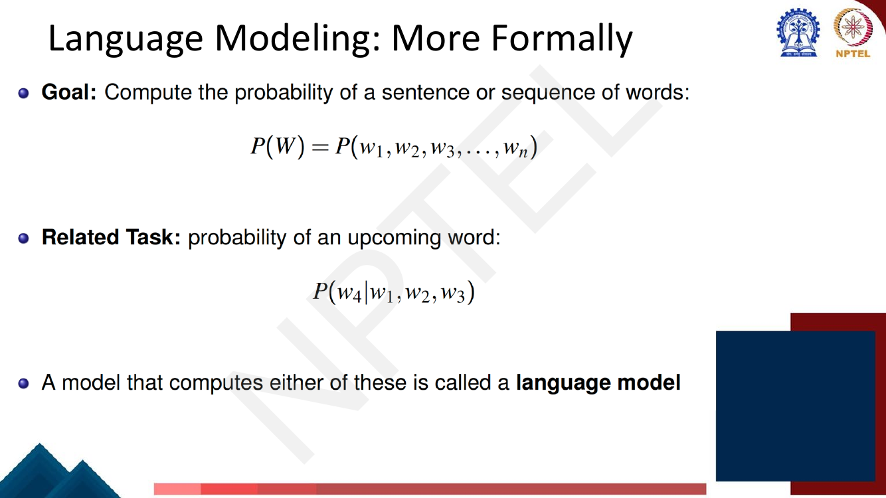
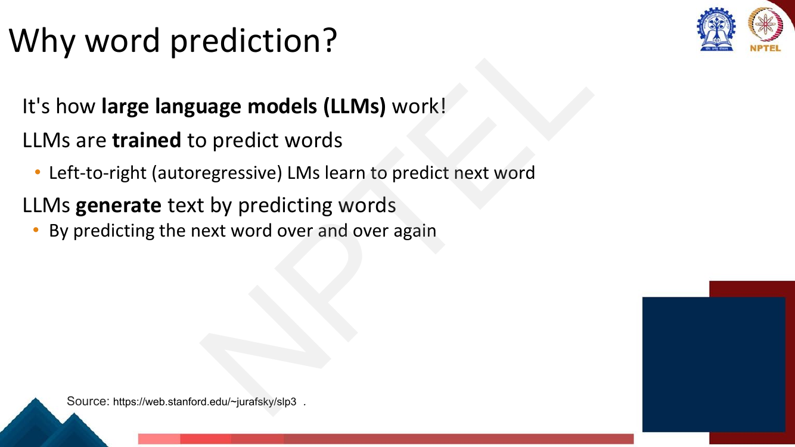
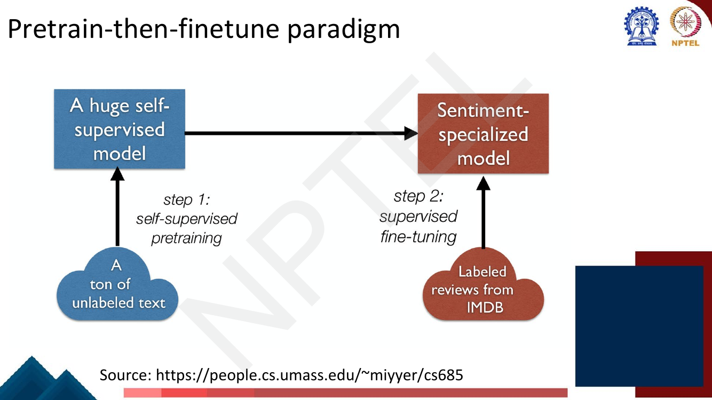
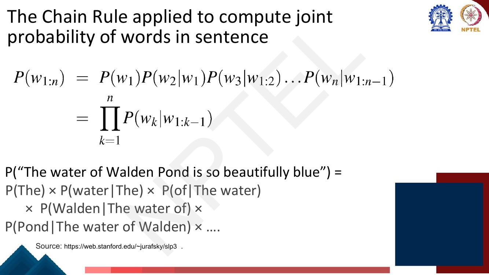
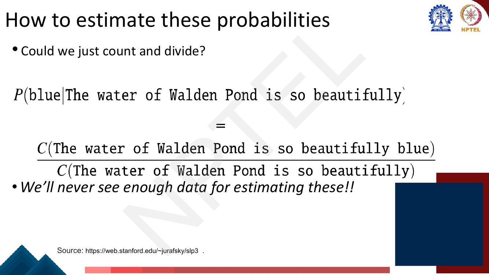
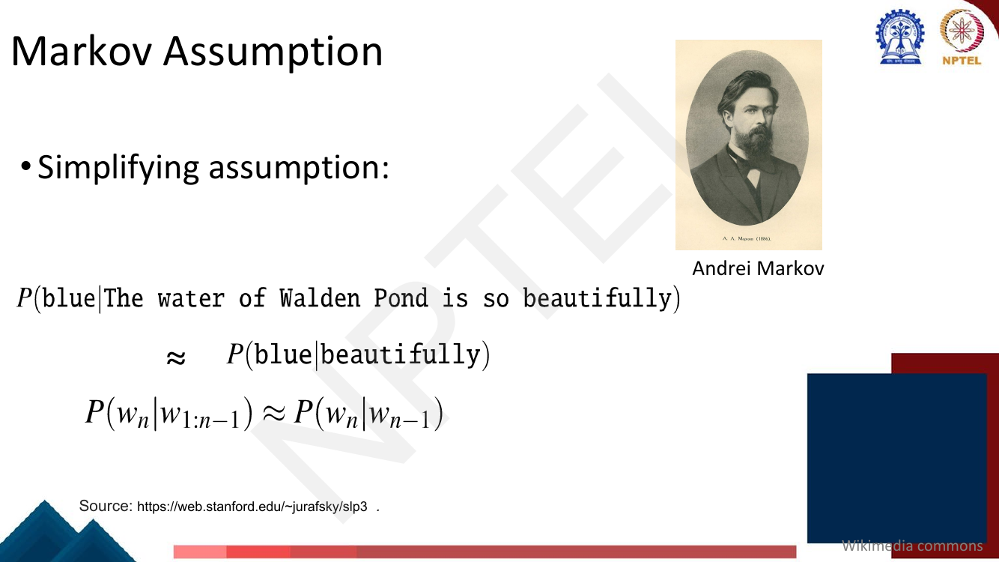
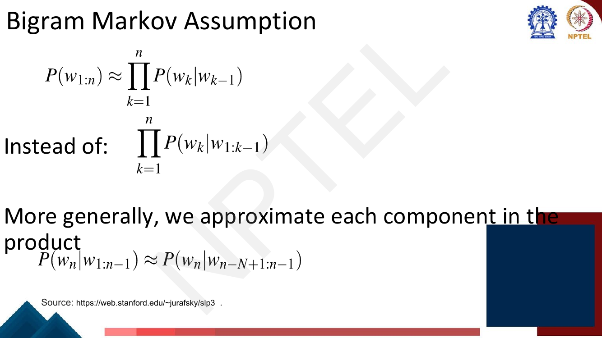
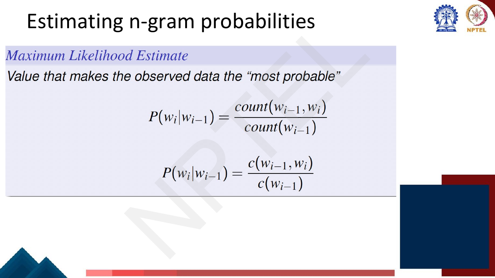
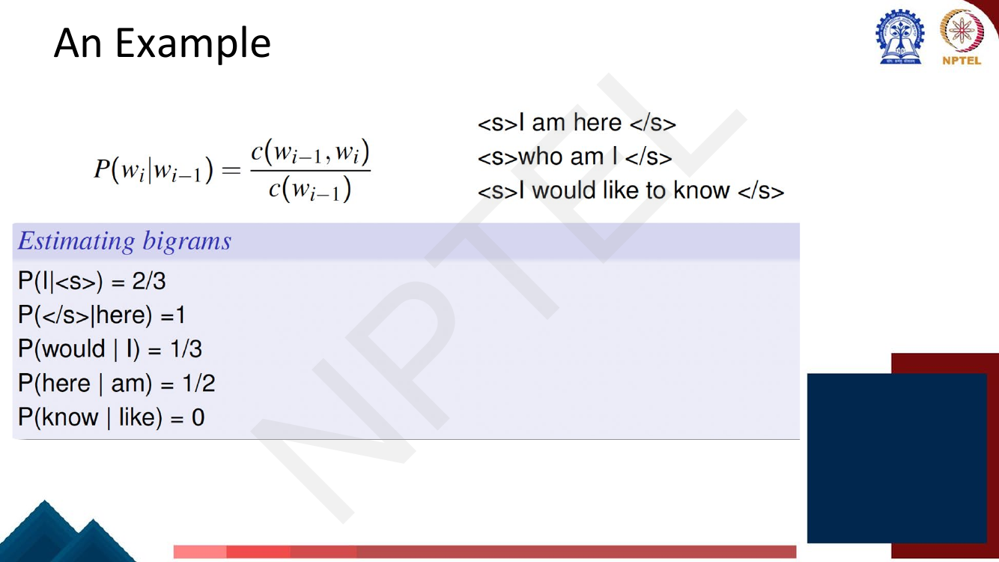
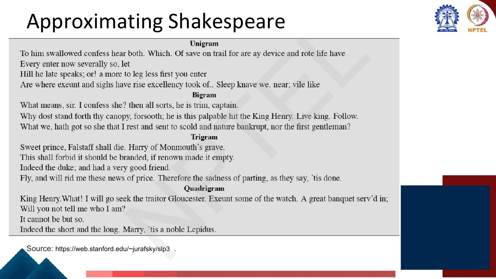

# Lec 3 — N-gram Language Models I: The Task, the Chain Rule and Counting

> **Source:** `Week1.pdf` pp. 55–82 · **Week 1** · **Playlist:** Lec 3
> **Prereqs:** [Lec 2 — Text Processing and Tokenization](02-text-processing-tokenization.md)
> **Feeds into:** [Lec 4 — N-gram Language Models II: Smoothing and Perplexity](04-ngram-lm-2-smoothing-perplexity.md), [Lec 16 — RNN Language Models](../week-04/16-rnn-language-models.md), [Lec 26 — Pretraining and ELMo](../week-06/26-pretraining-and-elmo.md)

## Why this lecture exists

Lecture 2 turned a stream of characters into a sequence of tokens. That is the input format, not a
model — nothing so far assigns a *score* to a piece of text. This lecture introduces the one task that
the remaining 57 lectures all come back to: **given some words, predict the next one**, and
equivalently, assign a probability to a whole sentence.

It matters far beyond spell-checking. Every large language model in this course — GPT, BERT, LLaMA —
is trained on exactly this objective, which is why the deck's own title slide shouts "LM in LLMs!!".
The task is also **self-supervised**: the correct answer is the next word, which is already sitting in
the corpus, so no human has to label anything and the method scales to the entire internet.

The lecture then builds the simplest honest model of it — count n-grams and divide — and shows both
why that works and where it falls apart.

## The ideas

### Language modelling is next-word prediction

The deck opens with *"The water of Walden Pond is beautifully ..."* and two columns: `blue`, `green`,
`clear` on one side, `*refrigerator`, `*that` on the other (page 57). The point is that this is not a
yes/no problem — several continuations are fine and you want a **distribution over the whole
vocabulary**, not one prediction.

So a **language model (LM)** is a system that does either of two things, which turn out to be the
same thing:

- assigns a probability to each possible **next word** given the words so far;
- assigns a probability to a **whole sentence** or word sequence.

The deck's formal statement (page 65):

$$P(W) = P(w_1, w_2, w_3, \ldots, w_T)$$

is the goal — the joint probability of the sequence — and the related task is the conditional

$$P(w_n \mid w_1, w_2, \ldots, w_{n-1})$$

the probability of an upcoming word given its history. **A model that computes either of these is
called a language model.** Hold on to the word "either": the chain rule below shows that one gives you
the other for free.


*Fig. — Memorise both lines. The exam will ask "what is a language model?" and the acceptable answer is the pair, not just next-word prediction. Page 65.*

### Why word prediction matters

The deck lists three motivations, and the third is the one the course is really about.

| Application | How the LM is used |
|---|---|
| **Grammar / spell checking** | "Their are two midterms" → the LM scores `There are two midterms` far higher. The error is a real word, so a dictionary cannot catch it; only a model of *sequences* can. |
| **Speech recognition** | "I will be back soonish" and "I will be bassoon dish" sound nearly identical. The LM breaks the tie by asking which word sequence is more probable English. |
| **Large language models** | LLMs *are* trained to predict words. Left-to-right (**autoregressive**) LMs learn to predict the next word, and generate text by doing it over and over again. |


*Fig. — This slide is the hinge of the whole course. Everything from Lec 26 onward is a different architecture fitted to this same objective. Page 60.*

### Language modelling as self-supervision

Two slides of motivation sit here that properly belong to later lectures, and the reason is a single
claim the deck puts in a title: **language modelling forms the core of most self-supervised NLP
approaches** (pages 63–64).


*Fig. — Step 1 is language modelling; step 2 is a small supervised task. Pages 63–64 repeat this diagram with step 1 boxed alone. Page 61.*

**Self-supervised** means the training labels are extracted from the input itself rather than supplied
by an annotator. For an LM the label at position $t$ is simply $w_t$, the word that is already there.
That single property is why pretraining scales: labelled data is expensive and finite, raw text is
free and effectively unlimited, so you can throw $10^{12}$ tokens at step 1 and only a few thousand
labelled examples at step 2.

Two paradigms follow, and both have the *same* step 1 — this lecture's task:

- **Pretrain-then-finetune** — pretrain on raw text, then update the weights on a small labelled
  dataset for your task. Owned by [Lec 26](../week-06/26-pretraining-and-elmo.md).
- **Pretrain-then-prompt** — pretrain, then *describe* the task in text (`Translate English to
  French: sea otter => loutre de mer; cheese =>`) and let the model continue it, with no weight
  updates at all. Owned by [Lec 41](../week-09/41-prompting-1.md).

### The chain rule of probability

How do you get the joint $P(W)$? Not directly — you decompose it into next-word predictions. Start
from the definition of conditional probability:

$$P(B \mid A) = \frac{P(A,B)}{P(A)} \quad\Longrightarrow\quad P(A,B) = P(A)\,P(B\mid A)$$

Apply it repeatedly. For four variables, peel one off at a time:

$$P(A,B,C,D) = P(A)\,P(B\mid A)\,P(C \mid A,B)\,P(D\mid A,B,C)$$

In general, for a sequence of $T$ words:

$$P(w_1, \ldots, w_T) = P(w_1)\,P(w_2\mid w_1)\,P(w_3 \mid w_1 w_2)\cdots P(w_T \mid w_1 \ldots w_{T-1}) = \prod_{t=1}^{T} P(w_t \mid w_1 \ldots w_{t-1})$$

This is **exact**, not an approximation. No independence has been assumed. It is pure algebra, and it
is why "predict the next word" and "score a sentence" are the same problem: multiply the next-word
probabilities together and you have the sentence probability.


*Fig. — Notice each factor's conditioning context is one word longer than the last. That growth is the whole problem. Page 68.*

### Why the chain rule alone is unusable

Each conditional is a probability you have to get from somewhere. The obvious route is counting:

$$P(\text{blue}\mid\text{The water of Walden Pond is so beautifully}) = \frac{C(\text{The water of Walden Pond is so beautifully blue})}{C(\text{The water of Walden Pond is so beautifully})}$$


*Fig. — Both counts are almost certainly zero in any corpus you will ever have, and $0/0$ is not a probability. Page 69.*

The deck's verdict: **"We'll never see enough data for estimating these!!"** The reason, made precise,
is the examinable point:

1. **The context grows without bound.** By word 30 you are conditioning on a 29-word history.
2. **Long sequences are essentially unique.** Most 9-word sequences have never been written down
   before, so their count is 0 and the ratio is $0/0$.
3. **More data cannot fix it.** With $\lvert V\rvert = 20{,}000$ there are $20{,}000^9 \approx 5\times
   10^{38}$ possible 9-word sequences; the entire written output of humanity is perhaps $10^{13}$
   words. You are short by twenty-five orders of magnitude, not by a factor of ten.

So the chain rule is correct and useless. You must shorten the conditioning context.

### The Markov assumption

**Andrei Markov's** simplifying assumption: the next word depends only on the last few words, not on
the entire history.

$$P(\text{blue} \mid \text{The water of Walden Pond is so beautifully}) \approx P(\text{blue}\mid\text{beautifully})$$


*Fig. — The approximation sign is doing real work. This is a deliberate, known-wrong modelling choice made so that estimation becomes possible. Page 70.*

Substituting back into the chain rule gives the **bigram model**:

$$P(w_1 \ldots w_T) \approx \prod_{t=1}^{T} P(w_t \mid w_{t-1})$$

instead of the exact $\prod_{t} P(w_t \mid w_{1:t-1})$. More generally, keep the previous $n-1$ words:

$$\boxed{\;P(w_i \mid w_1 \ldots w_{i-1}) \;\approx\; P(w_i \mid w_{i-n+1} \ldots w_{i-1})\;}$$


*Fig. — **Notation warning:** the deck writes the n-gram order as $N$ and the sentence length as $n$. These notes use $n$ for the order and $T$ for the length, per the book's notation table. Page 71.*

That gives a family of models, indexed by how much context you keep:

| Model | $n$ | Conditional | Context used | Parameters |
|---|---|---|---|---|
| **Unigram** | 1 | $P(w_i)$ | none — bag of words | $\lvert V\rvert$ |
| **Bigram** | 2 | $P(w_i \mid w_{i-1})$ | 1 previous word | $\lvert V\rvert^2$ |
| **Trigram** | 3 | $P(w_i \mid w_{i-2}w_{i-1})$ | 2 previous words | $\lvert V\rvert^3$ |
| **4-gram** | 4 | $P(w_i \mid w_{i-3}w_{i-2}w_{i-1})$ | 3 previous words | $\lvert V\rvert^4$ |
| **$n$-gram** | $n$ | $P(w_i \mid w_{i-n+1}\ldots w_{i-1})$ | $n-1$ previous words | $\lvert V\rvert^n$ |

An **n-gram** is just a contiguous run of $n$ tokens. A bigram model is a *first-order* Markov model
(one word of memory); a trigram model is second-order. The off-by-one is a classic MCQ trap: a trigram
model conditions on **two** words, not three.

### Estimating the probabilities: maximum likelihood by counting

With the context bounded you can finally count. The **maximum likelihood estimate (MLE)** is, in the
deck's phrase, the "value that makes the observed data the most probable":

$$P(w_i \mid w_{i-1}) = \frac{C(w_{i-1}, w_i)}{C(w_{i-1})}$$


*Fig. — Two typographic variants of the same formula, `count(·)` and `c(·)`. The book uses $C(\cdot)$ throughout. Page 77.*

**Why is that ratio the MLE?** Fix a context $h = w_{i-1}$ and let $\theta_w = P(w \mid h)$ be the
unknown parameters, with $\sum_w \theta_w = 1$. Every time $h$ occurs in the corpus the next word is
drawn from $\theta$, so the log-likelihood of the corpus restricted to this context is

$$\mathcal{L}(\theta) = \sum_{w \in V} C(h, w)\,\log \theta_w$$

Maximise it subject to the constraint using a Lagrange multiplier $\lambda$:

$$\frac{\partial}{\partial \theta_w}\left[\sum_{w'} C(h,w')\log\theta_{w'} - \lambda\Big(\sum_{w'}\theta_{w'} - 1\Big)\right] = \frac{C(h,w)}{\theta_w} - \lambda = 0 \;\Longrightarrow\; \theta_w = \frac{C(h,w)}{\lambda}$$

Now impose $\sum_w \theta_w = 1$: that forces $\lambda = \sum_w C(h,w) = C(h)$, since every occurrence
of $h$ is followed by exactly one word. Therefore

$$\hat\theta_w = \frac{C(h,w)}{C(h)}$$

The MLE **is** the relative frequency: *for a multinomial, the maximum-likelihood estimate of a
probability is the observed proportion.* Nothing cleverer is going on.

Two practical details:

- **Sentence boundaries.** Add `<s>` at the start and `</s>` at the end of every sentence. `<s>` gives
  the first real word a context to condition on; `</s>` lets the model assign probability to *stopping*,
  without which the probabilities over all sentences would not sum to 1.
- $C(w_{i-1})$ in the denominator is the count of $w_{i-1}$ **as a left context**. For a corpus where
  every sentence ends in `</s>`, that equals its token count for every word except `</s>` itself.

### The deck's worked estimation example


*Fig. — The format of the exam question. Note the last line: $P(\text{know}\mid\text{like}) = 0$, because `like` is only ever followed by `to`. That zero is Lec 4's entire subject. Page 79.*

The full count and probability tables are built by hand in **N2** below and reproduced by the code
block. Check the deck's five answers against them — they all agree.

### Computing a sentence's probability, and doing it in log space

Once you have the table, a sentence's probability is a product along the chain:

$$P(\texttt{<s> I want english food </s>}) = P(\text{I}\mid\texttt{<s>}) \times P(\text{want}\mid\text{I}) \times P(\text{english}\mid\text{want}) \times P(\text{food}\mid\text{english}) \times P(\texttt{</s>}\mid\text{food})$$


*Fig. — The deck's only "practical issues" slide, and it is examinable twice over: the underflow reason and the log identity. Page 80.*

Every factor is below 1, so the product shrinks geometrically. At an average per-word probability of
$10^{-3}$, a 50-word sentence gives $P(W) = 10^{-150}$ — representable in float64 (smallest normal
$\approx 2.2\times10^{-308}$) — but a 150-word paragraph gives $10^{-450}$, which underflows to
exactly 0. Every long text then looks equally impossible.

The fix is to add logs instead of multiplying probabilities:

$$\log P(W) = \sum_{t=1}^{T} \log P(w_t \mid w_{t-n+1} \ldots w_{t-1})$$

which for the deck's four-factor case is

$$\log(p_1 \times p_2 \times p_3 \times p_4) = \log p_1 + \log p_2 + \log p_3 + \log p_4$$

Two benefits, both named on the slide: it **avoids underflow** (a log-probability of $-450$ is an
ordinary float) and **adding is faster than multiplying**. A third, unnamed: logs are monotonic, so
comparing $\log P$ values ranks sentences in exactly the same order as comparing $P$ values.

### Approximating Shakespeare

Train a unigram, bigram, trigram and 4-gram model on the complete works of Shakespeare and generate
text from each. The progression shows exactly what each order buys you.


*Fig. — Read the four blocks top to bottom. The vocabulary is Shakespearean at every order; only the *structure* changes. Page 74.*

| Order | Sample | What it captured |
|---|---|---|
| Unigram | *"To him swallowed confess hear both. Which. Of save on trail for are ay device and rote life have"* | Word frequencies only. No syntax at all. |
| Bigram | *"What means, sir. I confess she? then all sorts, he is trim, captain."* | Local collocations — adjacent pairs are plausible, but the sentence wanders. |
| Trigram | *"Sweet prince, Falstaff shall die. Harry of Monmouth's grave."* | Short phrases are now genuinely well-formed. |
| 4-gram | *"King Henry. What! I will go seek the traitor Gloucester. Exeunt some of the watch."* | Looks like Shakespeare — because by this point it largely **is** Shakespeare, copied verbatim. |

That last row carries the lesson. Shakespeare's corpus is about 884,000 tokens over ~29,000 word
types, so of the $29{,}000^2 \approx 844$ million possible bigrams only about 300,000 occur —
**99.96% of the bigram table is zero**. At 4-gram order most contexts have exactly one observed
continuation, so generation degenerates into regurgitating training sentences. **Increasing $n$
improves fluency and destroys generalisation at the same time**, and the crossover arrives fast.

### Problems with n-gram models


*Fig. — The agreement is between `soups` and `were`, eight words apart. No practical n-gram order reaches that far. Page 75.*

| Problem | What goes wrong |
|---|---|
| **Limited context / long-distance dependencies** | *"The soups that I made from that new cookbook I bought yesterday **were** amazingly delicious."* The subject–verb agreement spans 8 words. A 5-gram sees `cookbook I bought yesterday` and has no idea the subject was plural. |
| **No generalisation to similar words** | Seeing *"delicious soup"* a thousand times tells the model nothing about *"tasty soup"*. Words are atomic symbols with no notion of similarity — fixed by embeddings in [Lec 11](../week-03/11-word-representation.md). |
| **Sparsity** | Most n-grams in held-out text were never seen in training, so their MLE is 0, and one zero factor kills the whole sentence probability. |
| **Storage** | The table has $\lvert V\rvert^n$ cells — $1.25\times10^{14}$ for a trigram model at $\lvert V\rvert = 50{,}000$ (see **N6**). |

The deck's stated solution is **large language models**: they handle much longer contexts (using
embedding spaces rather than exact string matching) and model synonymy far better.

### So why study n-gram models at all?

Because every hard problem in modern language modelling shows up here first, in a form you can compute
by hand. The deck's page 76 calls n-grams "a nice clear paradigm that lets us introduce many of the
important issues for large language models" and lists four: **training and test sets**, the
**perplexity** metric, **sampling** to generate sentences, and **interpolation and backoff**. All four
are [Lec 4](04-ngram-lm-2-smoothing-perplexity.md)'s — that slide is effectively the next lecture's
syllabus.

Beyond that pedagogical role, n-grams are cheap: training is one counting pass with no gradients,
lookup is $O(1)$, and the model is completely interpretable — you can point at the exact counts behind
any number. They still run inside keyboards and spell-checkers.

### The cliffhanger

$P(\text{know}\mid\text{like}) = 0$ on page 79 was not an accident of a tiny corpus. **Maximum
likelihood assigns probability zero to every n-gram it did not observe**, held-out text always
contains n-grams the training corpus missed, and one zero factor in the product zeroes the entire
sentence. An unsmoothed n-gram model therefore calls almost every real sentence impossible.
[Lec 4](04-ngram-lm-2-smoothing-perplexity.md) opens by fixing this.

## Worked numericals

### N1. The deck's own example (page 78)
**Given:** a corpus $\mathcal{C}$ in which the bigram probability $P(\text{paper}\mid\text{question}) = 0.3$ and $C(\text{question}) = 600$.
**Find:** the frequency of the pair (question, paper).

1. The MLE definition is $P(\text{paper}\mid\text{question}) = \dfrac{C(\text{question},\text{paper})}{C(\text{question})}$.
2. Rearrange: $C(\text{question},\text{paper}) = P(\text{paper}\mid\text{question}) \times C(\text{question})$.
3. $= 0.3 \times 600 = 180$.
4. Sanity check: 180 of the 600 occurrences of `question` are followed by `paper`; the other 420 are
   followed by something else, so the remaining continuations share probability $0.7$.

**Answer:** $C(\text{question},\text{paper}) = \mathbf{180}$. This agrees with the deck's own solution
on the same page. ([Lec 4](04-ngram-lm-2-smoothing-perplexity.md) reuses these numbers with
$\lvert V\rvert = 1210$ to show what smoothing does to them.)

### N2. Build the bigram count table and probability table by hand (page 79)
**Given:** the corpus
```
<s> I am here </s>
<s> who am I </s>
<s> I would like to know </s>
```
**Find:** all unigram counts, the bigram count table, the bigram probability table, and the deck's five
quoted probabilities.

1. **Token counts.** The three sentences have $5 + 5 + 7 = 17$ tokens including the boundary markers.

   | $w$ | `<s>` | I | am | here | `</s>` | who | would | like | to | know |
   |---|---|---|---|---|---|---|---|---|---|---|
   | $C(w)$ | 3 | 3 | 2 | 1 | 3 | 1 | 1 | 1 | 1 | 1 |

   Check: $3+3+2+1+3+1+1+1+1+1 = 17$ ✓

2. **List the bigrams.** $4 + 4 + 6 = 14$ of them.
   - S1: (`<s>`,I) (I,am) (am,here) (here,`</s>`)
   - S2: (`<s>`,who) (who,am) (am,I) (I,`</s>`)
   - S3: (`<s>`,I) (I,would) (would,like) (like,to) (to,know) (know,`</s>`)

3. **Count table** $C(w_{i-1}, w_i)$ — rows are the context, columns the next word. Only the nine
   non-empty rows are shown; every unlisted cell is 0.

   | $w_{i-1}\backslash w_i$ | `</s>` | I | am | here | know | like | to | who | would | row sum $= C(w_{i-1})$ |
   |---|---|---|---|---|---|---|---|---|---|---|
   | `<s>` | 0 | **2** | 0 | 0 | 0 | 0 | 0 | **1** | 0 | 3 |
   | I | **1** | 0 | **1** | 0 | 0 | 0 | 0 | 0 | **1** | 3 |
   | am | 0 | **1** | 0 | **1** | 0 | 0 | 0 | 0 | 0 | 2 |
   | here | **1** | 0 | 0 | 0 | 0 | 0 | 0 | 0 | 0 | 1 |
   | know | **1** | 0 | 0 | 0 | 0 | 0 | 0 | 0 | 0 | 1 |
   | like | 0 | 0 | 0 | 0 | 0 | 0 | **1** | 0 | 0 | 1 |
   | to | 0 | 0 | 0 | 0 | **1** | 0 | 0 | 0 | 0 | 1 |
   | who | 0 | 0 | **1** | 0 | 0 | 0 | 0 | 0 | 0 | 1 |
   | would | 0 | 0 | 0 | 0 | 0 | **1** | 0 | 0 | 0 | 1 |

   The row sums total $3+3+2+1+1+1+1+1+1 = 14$ ✓, the number of bigrams.

4. **Probability table.** Divide each row by its row sum.

   | $w_{i-1}\backslash w_i$ | `</s>` | I | am | here | know | like | to | who | would |
   |---|---|---|---|---|---|---|---|---|---|
   | `<s>` | 0 | 0.667 | 0 | 0 | 0 | 0 | 0 | 0.333 | 0 |
   | I | 0.333 | 0 | 0.333 | 0 | 0 | 0 | 0 | 0 | 0.333 |
   | am | 0 | 0.5 | 0 | 0.5 | 0 | 0 | 0 | 0 | 0 |
   | here | 1.0 | 0 | 0 | 0 | 0 | 0 | 0 | 0 | 0 |
   | know | 1.0 | 0 | 0 | 0 | 0 | 0 | 0 | 0 | 0 |
   | like | 0 | 0 | 0 | 0 | 0 | 0 | 1.0 | 0 | 0 |
   | to | 0 | 0 | 0 | 0 | 1.0 | 0 | 0 | 0 | 0 |
   | who | 0 | 0 | 1.0 | 0 | 0 | 0 | 0 | 0 | 0 |
   | would | 0 | 0 | 0 | 0 | 0 | 1.0 | 0 | 0 | 0 |

   **Every row sums to exactly 1.** That is the check to run in an exam before you write anything else
   down.

5. **The deck's five values**, read off the table:
   $P(\text{I}\mid\texttt{<s>}) = 2/3$; $P(\texttt{</s>}\mid\text{here}) = 1/1 = 1$;
   $P(\text{would}\mid\text{I}) = 1/3$; $P(\text{here}\mid\text{am}) = 1/2$;
   $P(\text{know}\mid\text{like}) = 0/1 = 0$.

**Answer:** all five match the deck. Note that 73 of the 81 cells of the $9\times 9$ sub-table are
zero — **90% sparsity on a 17-token corpus**.

### N3. Chain rule vs bigram on a 5-word sentence, with parameter counts
**Given:** the sentence `The water of Walden Pond`, $T = 5$, and a vocabulary of $\lvert V\rvert = 20{,}000$.
**Find:** the exact chain-rule expansion, the bigram approximation, and how many parameters each needs.

1. **Exact (chain rule), 5 factors:**
   $$P(W) = P(\text{The})\,P(\text{water}\mid\text{The})\,P(\text{of}\mid\text{The water})\,P(\text{Walden}\mid\text{The water of})\,P(\text{Pond}\mid\text{The water of Walden})$$
   The histories have lengths 0, 1, 2, 3, 4.
2. **Bigram approximation, also 5 factors**, each with a 1-word history (`<s>` supplies the first):
   $$P(W) \approx P(\text{The}\mid\texttt{<s>})\,P(\text{water}\mid\text{The})\,P(\text{of}\mid\text{water})\,P(\text{Walden}\mid\text{of})\,P(\text{Pond}\mid\text{Walden})$$
   Only the second factor is shared between the two expansions.
3. **Parameters for the exact model.** To score *any* 5-word sentence you need a distribution for every
   history of length 0 through 4: $\lvert V\rvert + \lvert V\rvert^2 + \lvert V\rvert^3 + \lvert V\rvert^4 + \lvert V\rvert^5$.
   The last term dominates: $20{,}000^5 = (2\times10^4)^5 = 2^5 \times 10^{20} = 3.2\times10^{21}$.
4. **Parameters for the bigram model:** $\lvert V\rvert^2 = (2\times10^4)^2 = 4\times10^{8}$.
5. **Ratio:** $\dfrac{3.2\times10^{21}}{4\times10^{8}} = 8\times10^{12}$.

**Answer:** exact $\approx 3.2\times10^{21}$ parameters, bigram $4\times10^{8}$ — a factor of
$\mathbf{8\times10^{12}}$ fewer. The Markov assumption is wrong about language and still obviously
worth making.

### N4. Sentence probability under bigram vs unigram
**Given:** the tables from **N2**; score the sentence `<s> I am here </s>`.
**Find:** $P(W)$ under the bigram model and under the unigram model, and compare.

1. **Bigram.** Four factors:
   $$P(W) = P(\text{I}\mid\texttt{<s>})\times P(\text{am}\mid\text{I}) \times P(\text{here}\mid\text{am}) \times P(\texttt{</s>}\mid\text{here})$$
2. Read them off: $= \dfrac{2}{3}\times\dfrac{1}{3}\times\dfrac{1}{2}\times 1$.
3. $\dfrac{2}{3}\times\dfrac{1}{3} = \dfrac{2}{9}$; $\;\dfrac{2}{9}\times\dfrac{1}{2} = \dfrac{1}{9}$; $\;\times 1 = \dfrac{1}{9} = 0.1111$.
4. **Unigram.** `<s>` is never predicted, so drop it from the model: $17 - 3 = 14$ predictable tokens.
   $P(\text{I}) = 3/14$, $P(\text{am}) = 2/14$, $P(\text{here}) = 1/14$, $P(\texttt{</s>}) = 3/14$.
5. $P(W) = \dfrac{3}{14}\cdot\dfrac{2}{14}\cdot\dfrac{1}{14}\cdot\dfrac{3}{14} = \dfrac{3\cdot2\cdot1\cdot3}{14^4} = \dfrac{18}{38{,}416}$.
6. $= 0.00046855$.
7. **Ratio:** $\dfrac{1/9}{18/38416} = \dfrac{38{,}416}{162} = 237.1$.

**Answer:** bigram $= 1/9 \approx \mathbf{0.1111}$, unigram $\approx \mathbf{0.00046855}$. The bigram
model finds this sentence **237 times more likely**, because it knows `am` follows `I` and `here`
follows `am` — information the unigram model discards. One word of context bought two orders of
magnitude.

### N5. The same computation in log space
**Given:** the same two models and the same sentence.
**Find:** $\log_{10} P(W)$ by summing logs, and verify it equals the log of the product.

1. **Bigram, term by term** (using $\log_{10}2 = 0.30103$, $\log_{10}3 = 0.47712$):

   | factor | value | $\log_{10}$ |
   |---|---|---|
   | $P(\text{I}\mid\texttt{<s>})$ | $2/3$ | $0.30103 - 0.47712 = -0.17609$ |
   | $P(\text{am}\mid\text{I})$ | $1/3$ | $-0.47712$ |
   | $P(\text{here}\mid\text{am})$ | $1/2$ | $-0.30103$ |
   | $P(\texttt{</s>}\mid\text{here})$ | $1$ | $0$ |
   | **sum** | | $\mathbf{-0.95424}$ |

2. Verify: $10^{-0.95424} = 0.11111 = 1/9$ ✓ — the sum of logs is the log of the product.
3. **Unigram:** $\log_{10}(3/14) = 0.47712 - 1.14613 = -0.66901$ (twice);
   $\log_{10}(2/14) = \log_{10}(1/7) = -0.84510$; $\log_{10}(1/14) = -1.14613$.
4. Sum $= -0.66901 - 0.84510 - 1.14613 - 0.66901 = -3.32924$. Check: $10^{-3.32924} = 4.6855\times10^{-4}$ ✓
5. **Comparison in log space is subtraction:** $-0.95424 - (-3.32924) = 2.37500$, and
   $10^{2.375} = 237.1$ — the same ratio as **N4**, obtained without ever multiplying.

**Answer:** $\log_{10}P_{\text{bi}} = \mathbf{-0.95424}$, $\log_{10}P_{\text{uni}} = \mathbf{-3.32924}$;
the log-difference $2.375$ reproduces the factor of 237. On a real corpus this is the only version that
runs without underflowing.

### N6. How big is an n-gram table?
**Given:** $\lvert V\rvert = 50{,}000$ word types and a training corpus of $10^{9}$ tokens.
**Find:** the number of parameters at each order, the storage at 4 bytes per float, and the fraction of
the trigram table that can possibly be non-zero.

1. **Parameter counts** are $\lvert V\rvert^{n} = (5\times10^{4})^{n}$:

   | $n$ | $\lvert V\rvert^n$ | Storage at 4 B/cell |
   |---|---|---|
   | 1 (unigram) | $5\times10^{4}$ | 200 kB |
   | 2 (bigram) | $2.5\times10^{9}$ | 10 GB |
   | 3 (trigram) | $1.25\times10^{14}$ | 500 TB |
   | 4 (4-gram) | $6.25\times10^{18}$ | 25 EB |

   Working: $(5\times10^4)^2 = 2.5\times10^9$; $(5\times10^4)^3 = 1.25\times10^{14}$;
   $(5\times10^4)^4 = 6.25\times10^{18}$.
2. **How many cells can be non-zero?** A corpus of $10^9$ tokens contains $\approx 10^9$ trigram
   *tokens*, hence at most $10^9$ distinct trigram *types*.
3. Fraction occupied: $\dfrac{10^{9}}{1.25\times10^{14}} = 8\times10^{-6}$.

**Answer:** the trigram table needs $\mathbf{1.25\times10^{14}}$ parameters (500 TB dense) and **at
most 0.0008% of its cells can be non-zero** — so at least 99.9992% of trigrams get MLE exactly 0. This
is why the table is stored sparsely, and why smoothing is not optional.

## Code

```python
import numpy as np
from collections import Counter

# The deck's corpus, page 79. <s> and </s> are real tokens.
corpus = ["<s> I am here </s>",
          "<s> who am I </s>",
          "<s> I would like to know </s>"]
sents = [s.split() for s in corpus]

uni = Counter(w for s in sents for w in s)
bi  = Counter(b for s in sents for b in zip(s, s[1:]))

V = sorted(uni)                       # vocabulary incl. <s>, </s>
ctx = [w for w in V if w != "</s>"]   # words that can be a left context
nxt = [w for w in V if w != "<s>"]    # words that can be predicted

print("C(w):", dict(uni))
print("\ncount table  C(prev, next)")
print("          " + "".join(f"{w:>7}" for w in nxt))
for p in ctx:
    print(f"{p:>8}  " + "".join(f"{bi[(p,w)]:>7}" for w in nxt))

print("\nprobability table  P(next | prev) = C(prev,next)/C(prev)")
print("          " + "".join(f"{w:>7}" for w in nxt))
for p in ctx:
    print(f"{p:>8}  " + "".join(f"{bi[(p,w)]/uni[p]:>7.3f}" for w in nxt))
    assert abs(sum(bi[(p,w)]/uni[p] for w in nxt) - 1.0) < 1e-12   # rows sum to 1

def bigram_logp(sent):
    """log10 P(sent) under the bigram model; sent includes <s> and </s>."""
    t = sent.split()
    return sum(np.log10(bi[(a,b)]/uni[a]) for a, b in zip(t, t[1:]))

def unigram_logp(sent):
    """log10 P(sent); <s> is never predicted, so it is excluded from the model."""
    N = sum(c for w, c in uni.items() if w != "<s>")
    return sum(np.log10(uni[w]/N) for w in sent.split() if w != "<s>")

s = "<s> I am here </s>"
for name, lp in [("bigram ", bigram_logp(s)), ("unigram", unigram_logp(s))]:
    print(f"\n{name}  log10 P = {lp:.6f}   P = {10**lp:.8f}")
print(f"\nbigram / unigram = {10**(bigram_logp(s) - unigram_logp(s)):.1f}x")
```

Real output:

```
C(w): {'<s>': 3, 'I': 3, 'am': 2, 'here': 1, '</s>': 3, 'who': 1, 'would': 1, 'like': 1, 'to': 1, 'know': 1}

count table  C(prev, next)
             </s>      I     am   here   know   like     to    who  would
     <s>        0      2      0      0      0      0      0      1      0
       I        1      0      1      0      0      0      0      0      1
      am        0      1      0      1      0      0      0      0      0
    here        1      0      0      0      0      0      0      0      0
    know        1      0      0      0      0      0      0      0      0
    like        0      0      0      0      0      0      1      0      0
      to        0      0      0      0      1      0      0      0      0
     who        0      0      1      0      0      0      0      0      0
   would        0      0      0      0      0      1      0      0      0

probability table  P(next | prev) = C(prev,next)/C(prev)
             </s>      I     am   here   know   like     to    who  would
     <s>    0.000  0.667  0.000  0.000  0.000  0.000  0.000  0.333  0.000
       I    0.333  0.000  0.333  0.000  0.000  0.000  0.000  0.000  0.333
      am    0.000  0.500  0.000  0.500  0.000  0.000  0.000  0.000  0.000
    here    1.000  0.000  0.000  0.000  0.000  0.000  0.000  0.000  0.000
    know    1.000  0.000  0.000  0.000  0.000  0.000  0.000  0.000  0.000
    like    0.000  0.000  0.000  0.000  0.000  0.000  1.000  0.000  0.000
      to    0.000  0.000  0.000  0.000  1.000  0.000  0.000  0.000  0.000
     who    0.000  0.000  1.000  0.000  0.000  0.000  0.000  0.000  0.000
   would    0.000  0.000  0.000  0.000  0.000  1.000  0.000  0.000  0.000

bigram   log10 P = -0.954243   P = 0.11111111

unigram  log10 P = -3.329240   P = 0.00046855

bigram / unigram = 237.1x
```

Both tables reproduce **N2** cell for cell, and the two log-probabilities reproduce **N5** to five
decimals ($-0.95424$ and $-3.32924$), with the ratio $237.1$ from **N4**. Note the `assert`: it checks
that every row of the probability table sums to 1, which is the invariant that catches almost every
bug in an n-gram implementation. Note also that `bigram_logp` would raise on an unseen bigram —
$\log 0 = -\infty$ — which is the zero-probability problem showing up as a numerical fault rather than
a statistical one.

## Exam pack

### Must-memorise

| Item | Exactly this |
|---|---|
| Language model | a model that assigns a probability to the next word **or** to a whole word sequence |
| LM goal | $P(W) = P(w_1, w_2, \ldots, w_T)$ |
| Related task | $P(w_n \mid w_1 \ldots w_{n-1})$ |
| Conditional probability | $P(B\mid A) = P(A,B)/P(A) \Rightarrow P(A,B) = P(A)P(B\mid A)$ |
| Chain rule | $P(w_1\ldots w_T) = \prod_{t=1}^{T} P(w_t \mid w_1 \ldots w_{t-1})$ — **exact, no assumption** |
| Markov assumption | $P(w_n \mid w_{1:n-1}) \approx P(w_n \mid w_{n-1})$ (bigram) |
| General n-gram | $P(w_i \mid w_1\ldots w_{i-1}) \approx P(w_i \mid w_{i-n+1}\ldots w_{i-1})$ |
| Bigram model | $P(w_1\ldots w_T) \approx \prod_{t=1}^{T} P(w_t \mid w_{t-1})$ |
| MLE for a bigram | $P(w_i \mid w_{i-1}) = \dfrac{C(w_{i-1}, w_i)}{C(w_{i-1})}$ |
| MLE in words | the value that makes the observed data most probable = the **relative frequency** |
| Parameters of an n-gram model | $\lvert V\rvert^{n}$ |
| Context length | an $n$-gram model conditions on $n-1$ words |
| Markov order | bigram = 1st order, trigram = 2nd order |
| Log space | $\log P(W) = \sum_t \log P(w_t \mid \text{context})$; avoids underflow, adding beats multiplying |
| Self-supervised | labels come from the input itself — here, the next word |
| Boundary tokens | `<s>` gives word 1 a context; `</s>` lets the model end a sentence |

### Numbers worth knowing

| Quantity | Value |
|---|---|
| Deck's estimation example (p. 78) | $P = 0.3$, $C(\text{question}) = 600$ → $C(\text{question},\text{paper}) = 180$ |
| Deck's corpus (p. 79) | 3 sentences, 17 tokens, 14 bigrams, 10 types incl. markers |
| Its quoted bigrams | $P(\text{I}\mid\texttt{<s>}) = 2/3$, $P(\texttt{</s>}\mid\text{here}) = 1$, $P(\text{would}\mid\text{I}) = 1/3$, $P(\text{here}\mid\text{am}) = 1/2$, $P(\text{know}\mid\text{like}) = 0$ |
| Shakespeare corpus | ~884,000 tokens, ~29,000 word types, ~844M possible bigrams, ~300k seen → 99.96% zeros |
| Orders shown in "Approximating Shakespeare" | unigram, bigram, trigram, quadrigram (4-gram) |
| Trigram table at $\lvert V\rvert = 50{,}000$ | $1.25\times10^{14}$ cells, 500 TB dense |
| float64 smallest normal | $\approx 2.2\times10^{-308}$ — why products underflow |
| Markov's dates on the slide portrait | A. A. Markov, 1886 |

### Likely MCQ traps

- **"The chain rule is an approximation."** It is not. The chain rule is exact; the **Markov
  assumption** is the approximation. Watch which one the question names.
- **"A trigram model conditions on three previous words."** No — on **two**. An $n$-gram model uses
  $n-1$ words of context. A trigram is a *second-order* Markov model.
- **MLE denominator.** It is $C(w_{i-1})$, the count of the *context* — not the total token count, not
  the number of bigrams, not $C(w_i)$. Inverting the pair, $C(w_{i-1},w_i)/C(w_i)$, gives
  $P(w_{i-1}\mid w_i)$, a different quantity.
- **Unigram model ≠ no model.** It still has $\lvert V\rvert$ parameters and still ranks sentences
  differently — it just ignores word order.
- **Parameter count.** $\lvert V\rvert^{n}$, not $\lvert V\rvert^{n-1}$ and not $n\lvert V\rvert$.
- **"Log space improves accuracy."** The named reasons are **underflow** and **speed**; monotonicity
  means the ranking is unaffected either way.
- **$\log(p_1 p_2) = \log p_1 \log p_2$.** No — it is $\log p_1 + \log p_2$. Products become sums.
- **"Higher $n$ is always better."** Higher $n$ gives more fluent generation but more sparsity and
  worse generalisation; a 4-gram Shakespeare model mostly memorises.
- **Self-supervised vs unsupervised.** Language modelling is **self-supervised**: there *is* a label
  (the next word), it just comes from the data. The deck's prompting slide says "unsupervised
  pretraining" — same thing, older wording.
- **Confusing the deck's $N$ with $n$.** On page 71 the deck writes $P(w_n \mid w_{n-N+1:n-1})$ where
  $N$ is the **order** and $n$ the **position**. These notes use $n$ for the order and $T$ for length.

### Self-test

1. State the two things a language model can compute.
2. Write the chain rule for $P(w_1, w_2, w_3, w_4)$ in full.
3. Is the chain rule exact or approximate? What about the bigram model?
4. Why can't you estimate $P(\text{blue}\mid\text{The water of Walden Pond is so beautifully})$ by counting?
5. $C(\text{the}) = 4800$ and $P(\text{cat}\mid\text{the}) = 0.015$. Find $C(\text{the}, \text{cat})$.
6. From the corpus `<s> a b a </s>` and `<s> b a b </s>`, compute $P(a\mid b)$ and $P(b\mid a)$.
7. How many parameters does a 4-gram model have with $\lvert V\rvert = 10{,}000$?
8. A sentence has bigram factors $0.2$, $0.1$, $0.5$, $0.4$. Give $P(W)$ and $\log_{10} P(W)$.
9. Why do real implementations work in log space?
10. In the "Approximating Shakespeare" slide, why does the 4-gram output look so much like real Shakespeare, and why is that bad news?

<details><summary>Answers</summary>

1. (a) The probability of each potential next word given the history; (b) the probability of a whole sentence / word sequence.
2. $P(w_1)P(w_2\mid w_1)P(w_3\mid w_1 w_2)P(w_4 \mid w_1 w_2 w_3)$.
3. The chain rule is **exact** — it follows from the definition of conditional probability. The bigram model is **approximate**, because it adds the Markov assumption on top.
4. The 8-word context and the 9-word sequence both occur ~0 times in any corpus, so the ratio is $0/0$. Long contexts are essentially unique; no amount of data fixes this.
5. $C(\text{the},\text{cat}) = 0.015 \times 4800 = 72$.
6. Bigrams: S1 gives (`<s>`,a)(a,b)(b,a)(a,`</s>`); S2 gives (`<s>`,b)(b,a)(a,b)(b,`</s>`). So $C(a,b)=2$, $C(a,\texttt{</s>})=1$, giving $C(a)=3$ as a context; and $C(b,a)=2$, $C(b,\texttt{</s>})=1$, giving $C(b)=3$. Hence $P(a\mid b) = 2/3$ and $P(b\mid a) = 2/3$.
7. $10{,}000^4 = 10^{16}$.
8. $P(W) = 0.2\times0.1\times0.5\times0.4 = 0.004$. $\log_{10} 0.004 = \log_{10} 4 - 3 = 0.60206 - 3 = -2.39794$.
9. To avoid **underflow** (the product of many sub-1 numbers falls below the smallest representable float) and because **addition is faster than multiplication**. Logs are monotonic, so rankings are unchanged.
10. Because at 4-gram order most contexts have exactly one observed continuation in an 884k-token corpus, so the model reproduces training text almost verbatim. It is bad news because it means memorisation, not generalisation — the model will fail on any genuinely new context.

</details>

## Beyond the slides

**Gap:** The deck never says what $\lvert V\rvert$ is for a real LM, or that the vocabulary is a
modelling choice rather than a fact about the language.
**Why it matters:** Every parameter count and sparsity argument depends on it. Word-level vocabularies
run $10^4$–$10^6$ and have an open-vocabulary problem; the subword tokenizers of
[Lec 2](02-text-processing-tokenization.md) fix the size at ~32k–128k by construction. When an exam
question hands you $\lvert V\rvert$, it is telling you which choice was made.

**Gap:** The slides show the MLE formula but never justify it, so it reads like a definition.
**Why it matters:** The Lagrange-multiplier derivation above is four lines and generalises everywhere
— it is the same argument behind the softmax-with-cross-entropy objective of every neural LM from
[Lec 16](../week-04/16-rnn-language-models.md) onward. "MLE for a multinomial = relative frequency"
saves you re-deriving it three more times in this course.

**Gap:** `</s>` is used in the examples but its necessity is never argued.
**Why it matters:** Without an end-of-sentence token the model cannot express "the sentence stops
here", and probabilities over sequences of all lengths do not sum to 1 — you get a separate
distribution for each fixed length, so comparing a 5-word and a 12-word sentence is meaningless.
"Why do we add `<s>` and `</s>`?" is a standard question and the normalisation answer earns the mark.

**Gap:** Nothing is said about how n-gram tables are actually stored.
**Why it matters:** N6 makes a dense trigram table 500 TB, yet Google shipped a 5-gram model trained
on $10^{12}$ tokens. Only *observed* n-grams are stored — a hash map or trie keyed by the n-gram, with
low counts pruned. $\lvert V\rvert^n$ is the size of the *parameter space*, not of the file on disk.

## Cut from the slides

Pages 55–56 (title and outline) and 81–82 (the Jurafsky & Martin reference and a blank page) carry no
teachable content; the reference is *Speech and Language Processing*, 3rd edition, Chapter 3. Pages 63
and 64 are the same slide twice, so it appears once. Pages 72 and 73 show unigram and bigram generated
samples separately and page 74 repeats both inside the four-order "Approximating Shakespeare"
comparison — the single comparison table is kept and the two earlier pages folded into it. Pages 57, 76
and 78 are covered in prose and numericals rather than as figures, to stay inside the figure budget.
The pretrain-then-finetune and pretrain-then-prompt paradigms (pages 61–62) are covered only as far as
the self-supervision point goes; the mechanics belong to
[Lec 26](../week-06/26-pretraining-and-elmo.md) and [Lec 41](../week-09/41-prompting-1.md). The
zero-probability consequence of page 79's $P(\text{know}\mid\text{like}) = 0$ is a cliffhanger only —
smoothing, perplexity, train/dev/test hygiene and sampling from n-gram models are all
[Lec 4](04-ngram-lm-2-smoothing-perplexity.md)'s and nothing about them is derived here. There are no
pages titled "Try this problem" in this range; page 78 poses a question and answers it on the same
slide, and is worked as **N1**.
