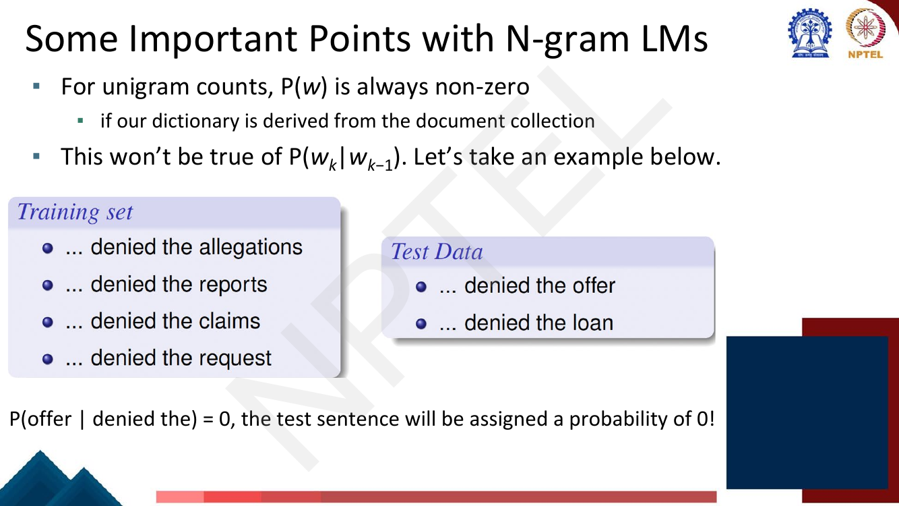
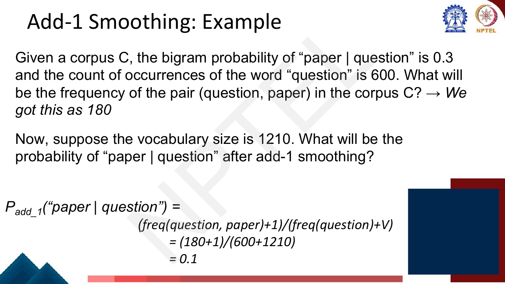

# Lec 4 — N-gram Language Models II: Smoothing and Perplexity

> **Source:** `Week1.pdf` pp. 83–116 · **Week 1** · **Playlist:** Lec 4
> **Prereqs:** [Lec 3 — N-gram Language Models I](03-ngram-lm-1.md)
> **Feeds into:** [Lec 5 — NLP Tasks and Paradigms](05-nlp-tasks-and-paradigms.md), [Lec 16 — RNN Language Models](../week-04/16-rnn-language-models.md), [Lec 26 — Pretraining and ELMo](../week-06/26-pretraining-and-elmo.md)

## Why this lecture exists

Lecture 3 built an n-gram language model by counting. That model has a fatal flaw and no way to tell
whether it is any good — and this lecture fixes both.

The flaw is arithmetic. A single unseen bigram makes one factor of the chain-rule product zero, which
makes the probability of the *entire sentence* zero, no matter how ordinary the rest of it is. Since a
test set always contains word pairs the training corpus never showed, an unsmoothed n-gram model
assigns probability zero to essentially everything. Smoothing is the repair.

The second half answers "is model A better than model B?" without running a translation system to find
out. That answer is **perplexity**, and it is the most reliably examined numerical in the first half
of this course.

## The ideas

### The zero-probability problem

For unigrams you are safe: if the vocabulary is derived from the corpus, every word was seen at least
once, so $P(w) > 0$ always. The moment you condition, that guarantee evaporates.


*Fig. — The deck's example: the training corpus contains "denied the allegations", "denied the reports", "denied the claims", but never "denied the offer". One missing trigram zeroes the whole sentence. Page 85.*

Formally, the chain rule from [Lec 3](03-ngram-lm-1.md) gives

$$P(w_1 \ldots w_T) = \prod_{t=1}^{T} P(w_t \mid w_{t-n+1} \ldots w_{t-1})$$

and a product dies if any factor is 0. Two separate harms follow:

1. **You cannot rank sentences.** Every test sentence containing any unseen n-gram scores 0, so they
   are all equally (in)plausible.
2. **You cannot compute perplexity at all.** Perplexity divides by the probability, so a zero makes it
   infinite.

The cause is that **maximum likelihood estimation assigns zero probability to anything it did not
observe**, and "did not observe" is not the same as "impossible". Smoothing moves a little probability
mass from the things you saw to the things you did not.

### Add-1 (Laplace) smoothing

The simplest repair: pretend you saw every possible n-gram one extra time. For bigrams,

$$P_{\text{add-1}}(w_i \mid w_{i-1}) = \frac{C(w_{i-1}, w_i) + 1}{C(w_{i-1}) + |V|}$$

Two things to understand about the denominator, because this is where marks are lost:

- You add $|V|$, **not** 1, and **not** the number of bigrams actually seen. The reason is
  normalisation: you added 1 to the numerator of every one of the $|V|$ possible continuations of
  $w_{i-1}$, so the denominator must grow by $|V|$ for the probabilities to still sum to 1.
- $|V|$ is the **vocabulary size** — the number of distinct word types, including `<UNK>` if you use
  one ([Lec 2](02-text-processing-tokenization.md)).

The deck works an example that is worth memorising because its structure is exactly the exam's:


*Fig. — Note the two-step structure: recover the raw count from an MLE probability, then re-smooth it. The answer falls from 0.3 to 0.1 — add-1 took two-thirds of the mass away. Page 88.*

That collapse from 0.3 to 0.1 is the point. **Add-1 is far too blunt for language.** The vocabulary is
enormous (here 1210, in reality $10^4$–$10^6$) while the conditioning counts are small, so the $+|V|$
term dominates the denominator and flattens everything toward uniform. It steals far more mass from
observed events than they deserve to lose. Add-1 is the right thing to teach first and the wrong thing
to deploy; it survives in practice mainly for text classification, not for language modelling.

**Add-k** is the obvious generalisation — add a fractional $k$ (say 0.05) instead of 1:

$$P_{\text{add-}k}(w_i \mid w_{i-1}) = \frac{C(w_{i-1}, w_i) + k}{C(w_{i-1}) + k|V|}$$

It softens the damage but does not fix the underlying mis-shape: the discount it applies is the same
regardless of how much evidence you had.

### Backoff and interpolation

A better instinct: when you have little evidence for a long context, **use less context**. The deck
puts it as "condition on less context for contexts you know less about".

**Backoff** — use the trigram if you have good evidence for it; otherwise *fall back* to the bigram;
otherwise the unigram. Only one order is used for any given prediction.

**Interpolation** — always mix all orders together:

$$\hat{P}(w_i \mid w_{i-2} w_{i-1}) = \lambda_1 P(w_i \mid w_{i-2}w_{i-1}) + \lambda_2 P(w_i \mid w_{i-1}) + \lambda_3 P(w_i)$$

with $\sum_j \lambda_j = 1$ so the result is still a probability distribution. The $\lambda$s are
tuned on a **held-out set** — which is one of the reasons the dev set in the next section exists.

The deck notes that **interpolation usually works better than backoff**. The intuition: backoff throws
the lower-order evidence away entirely whenever the higher order fires, while interpolation always
blends it in, so the estimate degrades smoothly rather than switching discontinuously.

### Evaluating a language model: extrinsic vs intrinsic

**Extrinsic (in-vivo)** evaluation puts each model into a real downstream task — machine translation,
speech recognition — and compares task scores. It is the evaluation you actually care about, and it is
expensive, slow, and has to be redone for every new task.

**Intrinsic (in-vitro)** evaluation measures the model directly on held-out text. For language models
that metric is **perplexity**. It is cheap and instant. The deck is careful to warn that it "doesn't
necessarily correspond" to downstream performance — a better perplexity usually but not always means a
better translation system. Know both the metric and that caveat.

### Train, dev and test — the hygiene rules

Three datasets, three jobs, and the slides spend four pages on this because violating it is the most
common way to produce a meaningless result:

| Set | Used for | Rule |
|---|---|---|
| **Training** | estimating the n-gram counts | — |
| **Dev (held-out)** | tuning hyperparameters: $k$, the $\lambda$s, vocabulary cutoffs | tune here as often as you like |
| **Test** | the one final number you report | touch it **once**, or a few times at most |

Two failure modes the deck names explicitly:

- **Training on the test set.** If test sentences leak into training, the LM assigns them artificially
  high probability, the whole test set looks more likely than it is, and the model looks better than
  it really is. This is cheating, usually by accident.
- **Implicitly tuning to the test set.** Even without leakage, if you evaluate on test repeatedly and
  keep the changes that help, you have fitted to it through your own decisions. Hence the dev set.

One more rule: the test set should **reflect the language you will deploy on**. A model tuned on
Shakespeare and tested on Wall Street Journal text will look terrible, and that number tells you about
the mismatch, not about the model.

### Perplexity

The deck builds the intuition over seven pages. Compressed, the chain of reasoning is:

1. A good LM prefers real sentences — it assigns higher probability to frequently observed text than
   to word salad.
2. Sharpen it with the **Shannon game**: how well can you predict the next word? "Once upon a ____".
   A good LM puts high probability on the word that actually comes next. (Unigrams are terrible at
   this, because they ignore the context entirely.)
3. Generalise from one word to the whole test set: the best LM is the one that assigns the highest
   probability to the entire unseen test set.
4. But raw probability is unusable as a metric — it depends on test-set *size*, and gets smaller the
   longer the text, since you are multiplying more numbers below 1. You need something **per word**.
5. So normalise by length and invert:

$$PP(W) = P(w_1 w_2 \ldots w_N)^{-\frac{1}{N}} = \sqrt[N]{\frac{1}{P(w_1 w_2 \ldots w_N)}}$$

![Slide giving perplexity as the inverse probability of the test set normalised by word count, in both the exponent and the N-th-root forms, noting probability range [0,1] and perplexity range [1,∞], and that minimising perplexity is the same as maximising probability](../../assets/pages/lec04/p-101.png)
*Fig. — Both forms are the same expression; the exam may print either. Note the ranges: probability lives in $[0,1]$, perplexity in $[1,\infty]$. **Lower perplexity is better.** Page 101.*

Expanding with the chain rule, and then with the bigram assumption:

$$PP(W) = \sqrt[N]{\prod_{i=1}^{N}\frac{1}{P(w_i \mid w_1 \ldots w_{i-1})}} \;\xrightarrow{\text{bigram}}\; \sqrt[N]{\prod_{i=1}^{N}\frac{1}{P(w_i \mid w_{i-1})}}$$

The inverse, the slides note, comes from perplexity's original definition as a cross-entropy rate in
information theory — specifically $PP(W) = 2^{H(W)}$ where $H$ is the cross-entropy in bits per word.
You do not need the derivation, but the relationship explains why perplexity is exponential and why it
is per-word.

**Minimising perplexity is exactly maximising probability.** They are the same objective; perplexity
is just the version you can compare across test sets of different lengths.

### Perplexity as weighted average branching factor

The interpretation that makes perplexity concrete. The **branching factor** of a language is how many
different words can follow any given word.

Take a language that emits only `{red, blue, green}`, uniformly at random. Any word can be followed by
any of 3, so the branching factor is 3 — and the perplexity is also 3. A model with perplexity 3 is
"as confused as" something choosing uniformly among 3 options at every step.

So perplexity answers: *on average, how many equally likely choices does the model think it has at
each word?* A unigram model on English might have perplexity ~960; a good trigram model ~110; a
modern neural LM far lower. Each is "effectively choosing among that many words" at every position.

The qualifier **weighted average** matters: real distributions are not uniform, so perplexity weights
the branching by the actual probabilities. A model that is usually confident but occasionally wildly
surprised gets punished hard, because the inverse of a tiny probability is a huge number and it enters
the geometric mean.

**Holding the test set constant**, lower perplexity means a better model. Across *different* test sets
or different vocabularies, perplexity numbers are not comparable at all — see Beyond the slides.

## Worked numericals

### N1. The deck's own add-1 example (page 88)
**Given:** $P_{\text{MLE}}(\text{paper} \mid \text{question}) = 0.3$, $C(\text{question}) = 600$, $|V| = 1210$.
**Find:** the raw pair count, then the add-1 smoothed probability.

1. MLE for a bigram is $P = \dfrac{C(\text{question}, \text{paper})}{C(\text{question})}$.
2. So $C(\text{question},\text{paper}) = 0.3 \times 600 = \mathbf{180}$.
3. Add-1: $P_{\text{add-1}} = \dfrac{C(\text{question},\text{paper}) + 1}{C(\text{question}) + |V|} = \dfrac{180 + 1}{600 + 1210}$.
4. $= \dfrac{181}{1810} = \mathbf{0.1}$.
5. Sanity check on the damage: the estimate fell from 0.3 to 0.1, a factor of 3. Add-1 removed
   two-thirds of this bigram's probability mass and redistributed it across 1210 candidate words.

**Answer:** count = 180, $P_{\text{add-1}} = 0.1$. The deck's answer; note the numbers were chosen so
it comes out exactly.

### N2. Perplexity of a bigram model on a short test sentence
**Given:** test sentence `<s> I love NLP </s>`, with $P(\text{I}\mid\texttt{<s>}) = 0.25$,
$P(\text{love}\mid\text{I}) = 0.5$, $P(\text{NLP}\mid\text{love}) = 0.2$,
$P(\texttt{</s>}\mid\text{NLP}) = 0.5$. Count $N = 4$ predicted tokens.
**Find:** the sentence probability and the perplexity.

1. $P(W) = 0.25 \times 0.5 \times 0.2 \times 0.5$.
2. $0.25 \times 0.5 = 0.125$; $\;0.125 \times 0.2 = 0.025$; $\;0.025 \times 0.5 = 0.0125$.
3. $PP(W) = P(W)^{-1/N} = 0.0125^{-1/4}$.
4. $1/0.0125 = 80$.
5. $PP = 80^{1/4} = \sqrt{\sqrt{80}} = \sqrt{8.9443} = 2.9907$.

**Answer:** $P(W) = 0.0125$, $PP \approx \mathbf{2.99}$. The model behaves as though choosing among
about 3 equally likely words at each step.

### N3. Perplexity of a uniform model equals the branching factor
**Given:** a language over a vocabulary of $|V| = 1000$ words; the model is uniform,
$P(w_i \mid \cdot) = 1/1000$ for every word. Test set of $N = 50$ words.
**Find:** the perplexity.

1. $P(W) = (1/1000)^{50} = 1000^{-50}$.
2. $PP = \left(1000^{-50}\right)^{-1/50} = 1000^{50/50} = 1000^1$.
3. $PP = \mathbf{1000}$.
4. Note the test-set length $N$ cancelled completely — as it must, since perplexity is per-word.

**Answer:** $PP = 1000 = |V|$. **A uniform model's perplexity is exactly the vocabulary size**, which
is the worst any sensible model should do and is the ceiling you measure improvements against.

### N4. Add-1 smoothing on a bigram table, and the mass it steals
**Given:** $|V| = 5$ words $\{a,b,c,d,e\}$. After the word `a`, counts are:
$C(a,b)=8$, $C(a,c)=2$, $C(a,d)=0$, $C(a,e)=0$, $C(a,a)=0$, so $C(a) = 10$.
**Find:** MLE and add-1 probabilities for every continuation, and verify both sum to 1.

1. MLE: $P(b\mid a) = 8/10 = 0.8$, $P(c\mid a) = 2/10 = 0.2$, and $P(d\mid a) = P(e\mid a) = P(a\mid a) = 0$.
2. Sum: $0.8 + 0.2 + 0 + 0 + 0 = 1.0$ ✓
3. Add-1 denominator: $C(a) + |V| = 10 + 5 = 15$.
4. $P_{\text{add-1}}(b\mid a) = (8+1)/15 = 9/15 = 0.6$.
5. $P_{\text{add-1}}(c\mid a) = (2+1)/15 = 3/15 = 0.2$.
6. $P_{\text{add-1}}(d\mid a) = P_{\text{add-1}}(e\mid a) = P_{\text{add-1}}(a\mid a) = 1/15 = 0.0667$.
7. Sum: $0.6 + 0.2 + 3(0.0667) = 0.6 + 0.2 + 0.2 = 1.0$ ✓
8. Mass moved: $b$ lost $0.8 - 0.6 = 0.2$; $c$ was unchanged at 0.2; the three unseen words gained
   0.2 in total.

**Answer:** the most frequent continuation lost 25% of its probability (0.8 → 0.6) to three words that
were never observed. With a realistic $|V| = 50{,}000$ instead of 5, $P_{\text{add-1}}(b\mid a)$ would
be $9/50{,}010 \approx 0.00018$ — the observed evidence is annihilated. **This is why add-1 is not
used for language modelling.**

### N5. Comparing two models by perplexity
**Given:** on the same 100-word test set, model A assigns $P_A(W) = 10^{-180}$ and model B assigns
$P_B(W) = 10^{-150}$.
**Find:** both perplexities and which model is better.

1. $PP_A = (10^{-180})^{-1/100} = 10^{180/100} = 10^{1.8} = 63.1$.
2. $PP_B = (10^{-150})^{-1/100} = 10^{150/100} = 10^{1.5} = 31.6$.
3. $PP_B < PP_A$, so **B is better**.
4. Ratio: $63.1/31.6 = 2.0$ — B is effectively choosing among half as many words per position.

**Answer:** $PP_A = 63.1$, $PP_B = 31.6$; **B is the better model**. Note how the comparison required
the same test set: had B been scored on different text, the numbers would be meaningless.

## Code

```python
import numpy as np
from collections import Counter

# --- add-1 smoothing on a tiny corpus -----------------------------------
corpus = "a b a c a b a b a c".split()
V = sorted(set(corpus)); Vsize = len(V)
bigrams = Counter(zip(corpus, corpus[1:]))
unigrams = Counter(corpus)

def p_mle(w_prev, w):
    return bigrams[(w_prev, w)] / unigrams[w_prev] if unigrams[w_prev] else 0.0

def p_add1(w_prev, w):
    return (bigrams[(w_prev, w)] + 1) / (unigrams[w_prev] + Vsize)

print(f"V = {V}  |V| = {Vsize}   C(a) = {unigrams['a']}")
for w in V:
    print(f"  P(  {w} | a )   MLE {p_mle('a', w):.4f}   add-1 {p_add1('a', w):.4f}")
print("  sums:", round(sum(p_mle('a', w) for w in V), 6),
      round(sum(p_add1('a', w) for w in V), 6))
# V = ['a', 'b', 'c']  |V| = 3   C(a) = 5
#   P(  a | a )   MLE 0.0000   add-1 0.1250
#   P(  b | a )   MLE 0.6000   add-1 0.5000
#   P(  c | a )   MLE 0.4000   add-1 0.3750
#   sums: 1.0 1.0                      <- both are still valid distributions

# --- perplexity, matching N2 -------------------------------------------
def perplexity(probs):
    """probs: per-token conditional probabilities of the test set."""
    probs = np.asarray(probs, dtype=float)
    # work in log space: the raw product underflows on any real test set
    return float(np.exp(-np.mean(np.log(probs))))

ps = [0.25, 0.5, 0.2, 0.5]
print(f"\nP(W) = {np.prod(ps):.4f}   PP = {perplexity(ps):.4f}")   # matches N2
# P(W) = 0.0125   PP = 2.9907

# --- N3: a uniform model's perplexity is exactly |V| ---------------------
for Vn in (10, 1000, 50000):
    print(f"uniform over {Vn:>5} words, 50-token test set -> PP = "
          f"{perplexity([1/Vn]*50):.1f}")
# uniform over    10 words, 50-token test set -> PP = 10.0
# uniform over  1000 words, 50-token test set -> PP = 1000.0
# uniform over 50000 words, 50-token test set -> PP = 50000.0

# --- why log space is not optional --------------------------------------
long_test = [0.1] * 400
print("\nnaive product :", np.prod(long_test))        # underflows to exactly 0
print("log-space PP  :", perplexity(long_test))
# naive product : 0.0
# log-space PP  : 10.000000000000002
```

The last block is the practical point: a 400-token test set at $p = 0.1$ per token underflows float64
to exactly zero, which would make perplexity infinite. Every real implementation sums log
probabilities and exponentiates at the end.

## Exam pack

### Must-memorise

| Item | Exactly this |
|---|---|
| Add-1 (Laplace) bigram | $P_{\text{add-1}}(w_i \mid w_{i-1}) = \dfrac{C(w_{i-1},w_i)+1}{C(w_{i-1})+\lvert V\rvert}$ |
| Add-k | $P_{\text{add-}k} = \dfrac{C(w_{i-1},w_i)+k}{C(w_{i-1})+k\lvert V\rvert}$ |
| Why $+\lvert V\rvert$ | you added 1 to each of $\lvert V\rvert$ continuations, so the total must grow by $\lvert V\rvert$ |
| Interpolation | $\hat{P} = \lambda_1 P_{\text{tri}} + \lambda_2 P_{\text{bi}} + \lambda_3 P_{\text{uni}}$, $\sum\lambda_j = 1$ |
| Backoff vs interpolation | backoff uses **one** order; interpolation **mixes all**; interpolation usually works better |
| Perplexity | $PP(W) = P(w_1\ldots w_N)^{-1/N} = \sqrt[N]{\dfrac{1}{P(w_1\ldots w_N)}}$ |
| Perplexity (bigram) | $PP(W) = \sqrt[N]{\prod_{i=1}^{N}\dfrac{1}{P(w_i \mid w_{i-1})}}$ |
| Direction | **lower perplexity is better**; minimising $PP$ ≡ maximising $P$ |
| Ranges | probability $[0,1]$; perplexity $[1,\infty]$ |
| Interpretation | weighted average **branching factor** — effective number of choices per word |
| Uniform model | $PP = \lvert V\rvert$ exactly |
| Cross-entropy link | $PP(W) = 2^{H(W)}$, $H$ in bits per word |
| Extrinsic vs intrinsic | extrinsic = in a real task; intrinsic = perplexity, and it need not track task performance |
| Dev set exists because | repeated testing on the test set implicitly tunes to it |

### Numbers worth knowing

| Quantity | Value |
|---|---|
| Deck's add-1 example | $P$ falls $0.3 \to 0.1$; count 180; $(180{+}1)/(600{+}1210)$ |
| Deck's branching-factor example | $L = \{$red, blue, green$\}$ uniform → branching factor and $PP$ both 3 |
| Typical WSJ perplexities (unigram / bigram / trigram) | ~962 / ~170 / ~109 |
| Perplexity of a uniform model | $\lvert V\rvert$ |
| Minimum possible perplexity | 1 (a model certain of every word) |
| Shannon's visualization method | 1948 |

### Likely MCQ traps

- **"Higher perplexity is better."** No. Perplexity is an *inverse* probability — lower is better. The
  single most common error on this topic.
- **Adding 1 to the denominator instead of $\lvert V\rvert$.** The denominator becomes
  $C(w_{i-1}) + \lvert V\rvert$. Adding 1 breaks normalisation.
- **Using the number of *observed* bigram types as $\lvert V\rvert$.** $\lvert V\rvert$ is the
  vocabulary size (word types), not the bigram count.
- **"Smoothing increases the probability of every n-gram."** No — it *decreases* the probability of
  observed n-grams and increases that of unseen ones. Total mass is conserved at 1.
- **Confusing extrinsic and intrinsic.** Perplexity is **intrinsic**. Running the LM inside a
  translation system is extrinsic.
- **"Lower perplexity guarantees better downstream performance."** The deck explicitly denies this. It
  usually correlates; it does not guarantee.
- **Comparing perplexities across different test sets or vocabularies.** Meaningless. Perplexity is
  only comparable holding the test set *and* the vocabulary fixed — a model with a smaller vocabulary
  can post a lower perplexity while being worse.
- **Forgetting what $N$ counts.** $N$ is the number of tokens whose probability you actually
  multiplied. If you include `</s>` as a predicted token it counts; conventions differ, so read the
  question. Getting $N$ wrong changes the answer.
- **"Backoff and interpolation are the same thing."** Backoff picks one order; interpolation blends
  all of them with weights that sum to 1.
- **"The $\lambda$s in interpolation are learned on the training set."** No — on a held-out/dev set.
  Tuning them on training data would just pick the highest order every time.

### Self-test

1. A bigram $(x,y)$ was never seen; $C(x) = 40$ and $|V| = 2000$. What is $P_{\text{add-1}}(y\mid x)$?
2. State in one sentence why a single unseen bigram zeroes an entire test sentence.
3. A test set of 10 words gets probability $10^{-20}$. What is the perplexity?
4. Which is better, perplexity 45 or perplexity 120? Why?
5. A model is uniform over a 30,000-word vocabulary. What is its perplexity?
6. $C(\text{the}) = 1000$, $C(\text{the, cat}) = 25$, $|V| = 10{,}000$. Give the MLE and add-1 estimates.
7. Why does interpolation usually outperform backoff?
8. Name the metric type (intrinsic/extrinsic) for: (a) perplexity, (b) BLEU score of a translation system using the LM.
9. Why can't you compare the perplexity of an English LM against that of a Hindi LM?
10. Your perplexity on the test set keeps improving as you try new ideas. What methodological mistake might you be making?

<details><summary>Answers</summary>

1. $(0+1)/(40+2000) = 1/2040 = 0.00049$.
2. Sentence probability is a *product* of conditional probabilities, and one zero factor zeroes the product.
3. $PP = (10^{-20})^{-1/10} = 10^{2} = 100$.
4. 45 — perplexity is inverse probability, so lower means the model assigned the test set higher probability.
5. 30,000. A uniform model's perplexity equals the vocabulary size.
6. MLE $= 25/1000 = 0.025$. Add-1 $= (25+1)/(1000+10000) = 26/11000 = 0.00236$ — more than a 10× drop, showing how brutal add-1 is when $|V| \gg C$.
7. Backoff discards lower-order evidence whenever the higher order fires; interpolation always blends it, so estimates degrade smoothly instead of switching discontinuously.
8. (a) intrinsic, (b) extrinsic.
9. Different vocabularies, different tokenizations and different test sets — perplexity is only comparable with all three held fixed.
10. Tuning on the test set. Repeated evaluation and keeping what helps fits the test set through your own choices; that is what the dev set is for.

</details>

## Beyond the slides

**Gap:** The deck stops at add-k, backoff and interpolation, and never mentions **Good-Turing** or
**Kneser-Ney** smoothing.
**Why it matters:** Kneser-Ney is the standard answer to "what smoothing do real n-gram LMs use", and
its idea is genuinely illuminating: estimate a word's unigram probability from *how many distinct
contexts it appears in*, not its raw frequency. "Francisco" is frequent but almost always follows
"San", so it is a poor guess for a novel context. Worth one minute of your time; a plausible MCQ.

**Gap:** Perplexity is presented as if it were comparable between models, but its dependence on
**tokenization and vocabulary** is never stated.
**Why it matters:** A model with a smaller vocabulary, or one using subword tokens
([Lec 2](02-text-processing-tokenization.md)), posts systematically different perplexities for reasons
that have nothing to do with quality. This is exactly why modern LLM papers report
*bits-per-byte* instead. If an exam asks you to compare two models' perplexities, check that the test
set and vocabulary match.

**Gap:** The cross-entropy relationship is named in one parenthetical but never developed.
**Why it matters:** $PP = 2^{H}$ where $H = -\frac{1}{N}\sum_i \log_2 P(w_i \mid \text{context})$ is
the cross-entropy in bits per word. This explains why implementations sum log-probabilities (see the
code block), and it connects perplexity to the cross-entropy loss that every neural LM from
[Lec 16](../week-04/16-rnn-language-models.md) onward is actually trained on. Those are the same
quantity, which is a satisfying thing to realise.

**Gap:** Nothing is said about handling `<UNK>` when computing perplexity.
**Why it matters:** If the test set contains words outside $V$, you must map them to `<UNK>` and
include `<UNK>` in $V$. A model that simply skips unknown words posts an artificially low perplexity —
another reason cross-model comparisons need care.

## Cut from the slides

Dropped the section-divider pages (84, 86) and the closing reference page. Pages 97–103 are a
seven-page incremental build of one idea ("Intuition of perplexity 1…7"); they are compressed into a
single numbered chain plus the two pages that carry the actual formula and the branching-factor
interpretation, rather than reproduced one page at a time. Pages 93–96 (four pages on train/dev/test)
are condensed into one table plus the two named failure modes, which is all the examinable content
they carry. Pages 104–116 cover Shannon's 1948 visualization method, sampling a word from a
distribution, generation from n-gram models, and larger-n behaviour. These are **kept** — they are
this chapter's, not Lec 19's, because [Lec 19](../week-04/19-decoding-strategies.md) owns *neural*
decoding (beam search, top-k, nucleus) and would never pick up ancestral sampling from an n-gram table.
They are compressed into the Shannon-game treatment above plus one line each on larger $n$. Nothing
about smoothing, evaluation or generation was dropped.
