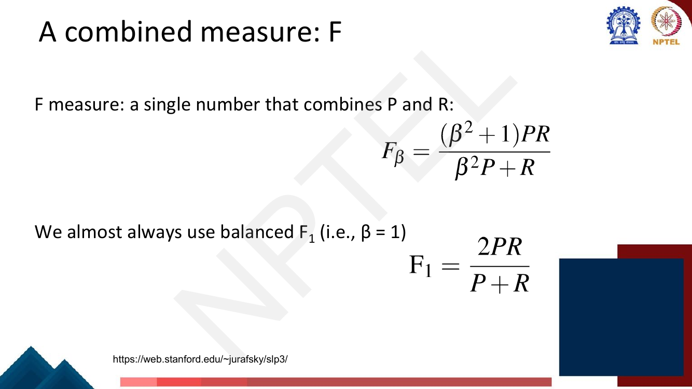
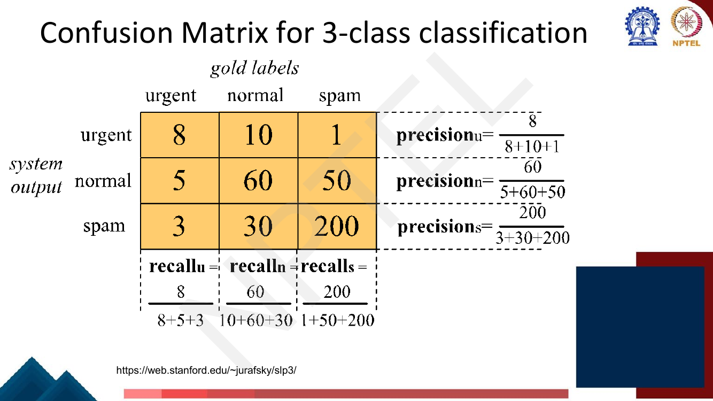
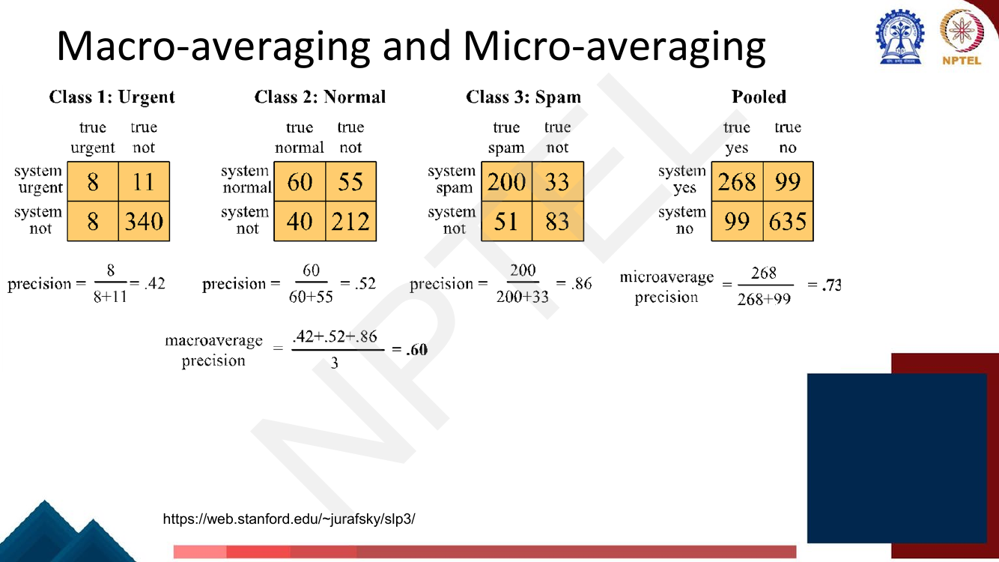
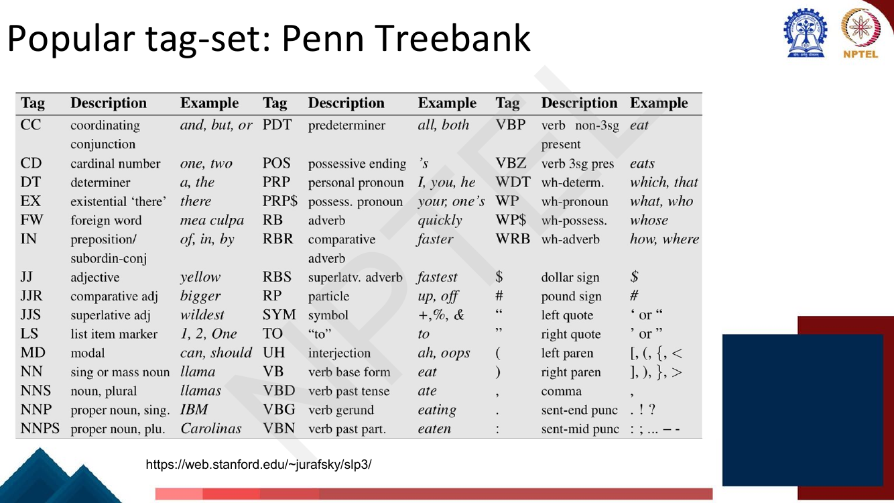
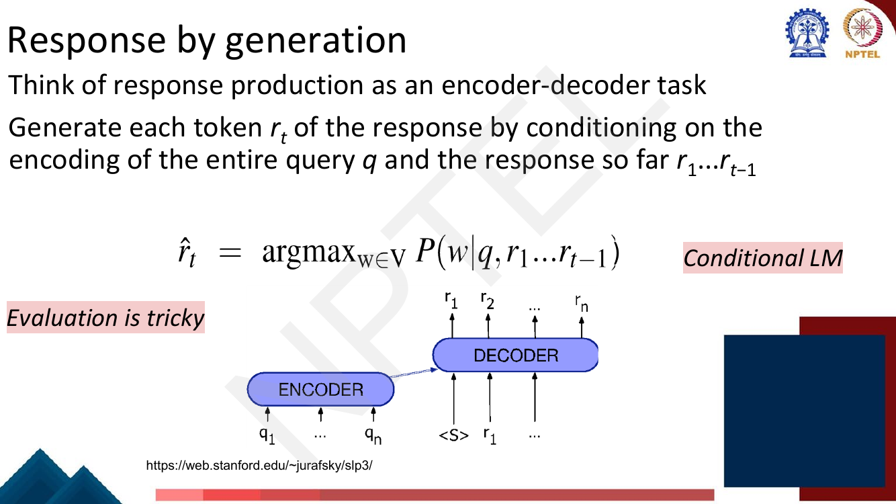
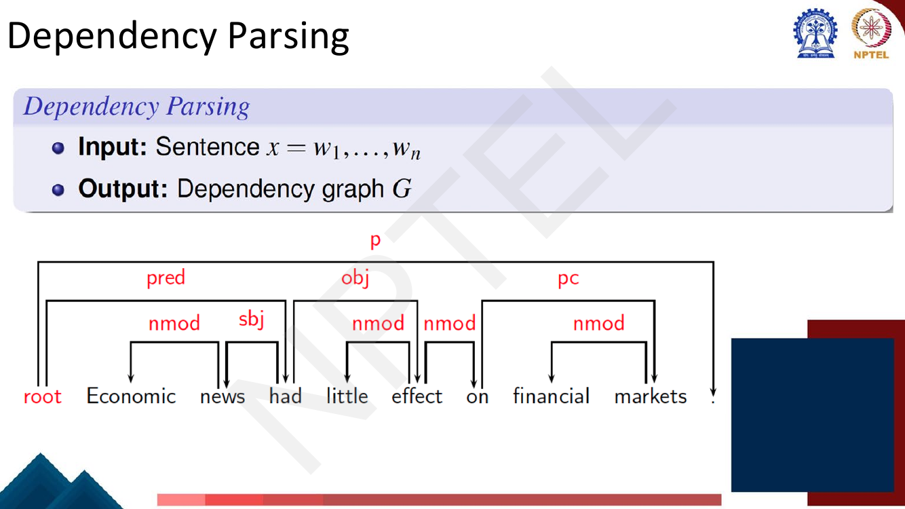
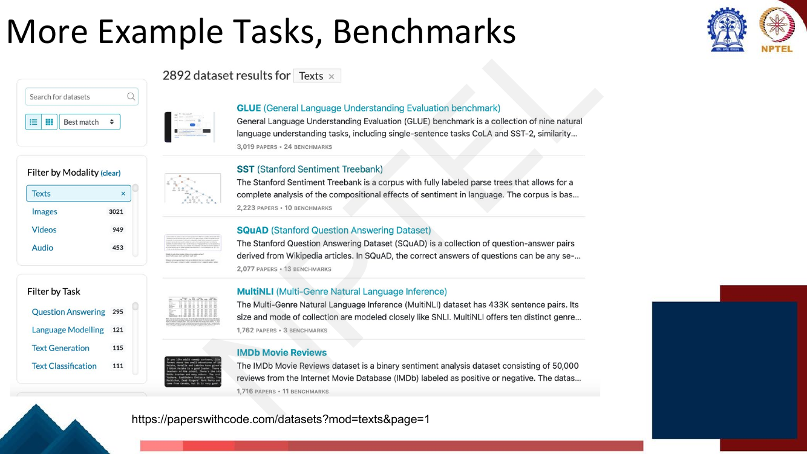

# Lec 5 — NLP Tasks and Paradigms

> **Source:** `Week1.pdf` pp. 117–153 · **Week 1** · **Playlist:** Lec 5
> **Prereqs:** [Lec 1 — Introduction to NLP](01-intro-to-nlp.md)
> **Feeds into:** [Lec 17 — RNN Applications](../week-04/17-rnn-applications.md), [Lec 27 — BERT and Masked LM](../week-06/27-bert-masked-lm.md), [Lec 33 — Dialogue Systems I](../week-07/33-dialogue-systems-1.md)

## Why this lecture exists

Weeks 1–4 of the lecture list read like a catalogue — sentiment, NER, translation, summarization,
chatbots, parsing. Treated as a catalogue they are unlearnable. This lecture replaces the catalogue
with a **map**: almost every NLP problem is one of three or four machine-learning shapes, and once you
know the shape you know what the input is, what the output is, what a model must emit, and which
number you report.

That last part is why this chapter is the metrics reference for the rest of the book. An n-gram model
had perplexity ([Lec 4](04-ngram-lm-2-smoothing-perplexity.md)); a classifier does not. The deck spends
eight pages on accuracy, precision, recall, F-measure and the macro-vs-micro distinction because every
later chapter — BERT fine-tuning, QA, dialogue, instruction tuning — reports those numbers and assumes
you can compute them. The lecturer's own arithmetic on page 132 is the single most mechanically
examinable thing in Week 1.

## The ideas

### The map: NLP problems become ML paradigms

The deck's opening claim (p. 119) is the spine of the whole course: *we generally try to map NLP
problems to various ML paradigms.* Three paradigms carry almost everything, with a fourth for the
cases that do not fit.

| Paradigm | Input | Output | Example tasks (the deck's) | Standard metric |
|---|---|---|---|---|
| **Text classification** | one document $d$ | **one** label $c \in C$, $\lvert C\rvert$ fixed | sentiment analysis, news-article grouping | accuracy; precision / recall / **F1**; macro-F1 |
| **Sequence labeling** | token sequence $w_1 \ldots w_T$ | **$T$** labels, one per token | POS tagging, named-entity recognition, code-mixing | per-token accuracy; **macro-F1** over tags |
| **Text generation** | a context sequence (source sentence, document, dialogue history) | a **new** token sequence, length not known in advance | machine translation, summarization, chatbots | BLEU / ROUGE, perplexity, human judgement |
| **Structured prediction** | a sentence | a **structured object** — a tree or graph | dependency parsing | attachment scores (see *Beyond the slides*) |

The distinction is mechanical if you watch the output. Classification emits **one label for the
whole input**. Sequence labeling emits **one label per token**, so the output length is *tied* to the
input length. Generation emits a sequence whose **length is itself predicted**, so the output space is
unbounded. Structured prediction emits an object with **internal constraints** — a dependency parse
must be a tree, so you cannot pick each edge independently.

The deck also slices tasks by **granularity**, a second axis worth holding onto:

| Level | Tasks named on p. 119 |
|---|---|
| Word / span | word sense disambiguation, entity linking |
| Sentence | sentence similarity, natural language inference |
| Paragraph / document | question answering |

---

### Paradigm 1 — Text classification

#### Formal definition

The deck's definition (p. 123) is short and you should be able to write it verbatim:

> **Input:** a document $d$; a **fixed** set of classes $C = \{c_1, c_2, \ldots, c_J\}$.
> **Output:** a predicted class $c \in C$.

Two words carry the weight. **Fixed** — $C$ is decided before training and cannot grow at test time.
**A** class — exactly one, which is why multi-label problems (an article that is both *sport* and
*politics*) fall outside the definition and get handled as $J$ independent binary classifiers.

#### The running example: sentiment analysis

The deck's examples (p. 121), lifted from Jurafsky & Martin:

| | Review |
|---|---|
| **+** | ...zany characters and richly applied satire, and some great plot twists |
| **−** | It was pathetic. The worst part about it was the boxing scenes... |
| **+** | ...awesome caramel sauce and sweet toasty almonds. I love this place! |
| **−** | ...awful pizza and ridiculously overpriced... |

Here $d$ is the review text and $C = \{+, -\}$. In every case a handful of words
(*zany/great*, *pathetic/worst*, *awesome/love*, *awful/overpriced*) determine the label — which is
why bag-of-words models do respectably here and why this became the standard teaching example.

**Why anyone cares** (p. 122): movies — is this review positive or negative; products — what do people
think of the new iPhone; politics — what do people think of this candidate; **prediction** — forecast
election outcomes or market trends from aggregate sentiment. The last is the commercially interesting
one.

#### Methods

The deck contrasts two routes.

**Rule-based.** Hand-written rules: a lexicon of positive and negative words, a negation handler, a
threshold. Accurate when built by a domain expert and the only option with no labelled data — but
brittle, costly to maintain, and non-transferable across domains (*unpredictable* is negative for a
car, positive for a thriller).

**Supervised machine learning** (p. 124) — the definition the exam wants:

> **Input:** a document $d$; a fixed set of classes $C = \{c_1, \ldots, c_J\}$; **a training set of
> $m$ hand-labelled documents** $(d_1, c_1), \ldots, (d_m, c_m)$.
> **Output:** a learned classifier $\gamma : d \to c$.

The deck's named classifiers: **Naïve Bayes**, **support vector machines**, **neural networks**,
**$k$-nearest neighbours**. The point of the list is that the *paradigm* is independent of the
*model* — the input/output contract is fixed and you swap the box in the middle. Everything from
[Lec 17](../week-04/17-rnn-applications.md) onward swaps that box.

---

### Evaluation for classification

This section is the canonical reference for the rest of this book. The deck sets it up with a running
scenario (p. 125): you are the CEO of the Delicious Pie Company and you build a "Delicious Pie" tweet
detector. **Positive class** = tweets about Delicious Pie Co. **Negative class** = all other tweets.
Binary classification, and — crucially — a *rare* positive class.

#### The 2×2 confusion matrix


*Fig. — Read the layout carefully: **rows are the system's output, columns are the gold standard.** Precision runs along a row, recall runs down a column, accuracy uses the whole table. Page 126.*

Each cell is named by *what the system said* first and *whether it was right* second:

| | gold positive | gold negative |
|---|---|---|
| **system positive** | **TP** — correct detection | **FP** — a **false alarm** (Type I) |
| **system negative** | **FN** — a **miss** (Type II) | **TN** — correct rejection |

TP + FP + FN + TN = the size of the evaluation set; the diagonal is what you got right.

> **A real trap.** This slide puts the *system* on the rows and the *gold* on the columns.
> `sklearn.metrics.confusion_matrix` does the **opposite** — rows are true labels, columns are
> predictions. The matrix on the slide is the transpose of the one your code prints. Read the axis
> labels every single time; if you read them wrong you swap precision and recall.

#### Accuracy, and exactly why it fails

$$\text{Accuracy} = \frac{TP + TN}{TP + FP + FN + TN}$$

The fraction of decisions that were correct. It is the obvious metric and it is the wrong one whenever
the classes are **imbalanced**. The deck's argument (p. 127), which you should be able to reproduce
from memory:

> Imagine we saw **1 million tweets**. **100** of them talked about Delicious Pie Co.; **999,900**
> talked about something else. We could build a dumb classifier that just labels every tweet "not
> about pie". It would get **99.99% accuracy**. Wow! But useless — it doesn't return the comments we
> are looking for.

Generalise it: if 99% of documents are not about $X$, a classifier that always answers "not $X$"
scores 99% accuracy while finding **none** of the documents you wanted. Accuracy is dominated by the
majority class, and when the thing you care about is rare, the majority class is the thing you do not
care about — so the metric's floor (the always-majority baseline) is nearly as high as its ceiling.

The structural fix is **a metric that ignores TN**, the cell the dumb classifier inflates. Precision
and recall are built from TP, FP and FN only; the true-negative count never appears.

#### Precision and recall

$$\text{Precision} = \frac{TP}{TP + FP} \qquad\qquad \text{Recall} = \frac{TP}{TP + FN}$$

- **Precision** — of the things the system *flagged*, what fraction were right? It is computed along
  the **system-positive row**. It protects against **false alarms**. A spam filter needs high
  precision: deleting a real email is unforgivable.
- **Recall** — of the things that *were* positive, what fraction did the system find? It is computed
  down the **gold-positive column**. It protects against **misses**. A disease screen, or a legal
  discovery search, needs high recall: a missed case is unforgivable.

The deck's summary (p. 128): the dumb pie classifier has accuracy 99.99% **but recall = 0**.
*Precision and recall, unlike accuracy, emphasize true positives — finding the things we are supposed
to be looking for.*

**The trade-off.** You can always buy one with the other by moving the decision threshold. Flag
everything → recall = 1, precision ≈ the base rate. Flag only the single most confident item →
precision likely 1, recall ≈ 0. Neither number means anything alone.

#### The F-measure, and why the harmonic mean


*Fig. — Memorise both lines. The $\beta^2$ appears **twice** — once as $\beta^2 + 1$ in the numerator, once multiplying $P$ in the denominator. Getting one of them wrong is the standard arithmetic slip. Page 129.*

$$F_\beta = \frac{(\beta^2 + 1)\,PR}{\beta^2 P + R} \qquad\qquad F_1 = \frac{2PR}{P + R}$$

$F_1$ is the **harmonic mean** of $P$ and $R$ — rewrite it and you can see it:

$$F_1 = \frac{2PR}{P+R} = \frac{2}{\frac{1}{P} + \frac{1}{R}}$$

**Why harmonic and not arithmetic.** The harmonic mean sits close to the *smaller* of its inputs, so
it punishes the weaker of precision and recall. Take a classifier that flags exactly one document and
gets it right, out of 100 true positives:

| | $P$ | $R$ | arithmetic mean | $F_1$ (harmonic) |
|---|---|---|---|---|
| flag one, correct | 1.00 | 0.01 | **0.505** | $\dfrac{2(1)(0.01)}{1.01} = \mathbf{0.0198}$ |
| flag everything | 0.01 | 1.00 | **0.505** | $\mathbf{0.0198}$ |
| balanced | 0.50 | 0.50 | 0.500 | **0.500** |

The arithmetic mean rates the first two systems as highly as a genuinely balanced one — it can be
**gamed by maximising a single number**. $F_1$ rates them 25× worse. That is the whole argument:
$F_1 \le$ arithmetic mean always, with equality only when $P = R$, so you cannot buy a good $F_1$ by
sacrificing one side.

$\beta$ is the knob for *how much more you care about recall than precision*: **recall is weighted
$\beta^2$ times as heavily as precision**.

$\beta = 1$ is balanced ("we almost always use balanced $F_1$"); $\beta < 1$ (e.g. 0.5) weights
**precision** more; $\beta > 1$ (e.g. 2) weights **recall** more. Sanity-check the direction with
limits: as $\beta \to 0$, $F_\beta \to PR/R = P$; as $\beta \to \infty$,
$F_\beta \to \beta^2 PR / \beta^2 P = R$.

#### Multi-class confusion matrices

With $J$ classes the matrix becomes $J \times J$. The deck's example is a 3-class email sorter.


*Fig. — Precision for a class is its diagonal cell over its **row** sum; recall is the diagonal cell over its **column** sum. E.g. $\text{precision}_u = 8/(8{+}10{+}1)$ and $\text{recall}_u = 8/(8{+}5{+}3)$. Total = 367 documents. Page 130.*

The 2×2 pattern generalises. With the deck's row = system orientation, for class $c$:

$$P_c = \frac{M_{cc}}{\sum_j M_{cj}} \;\;(\text{row sum, system said } c), \qquad
R_c = \frac{M_{cc}}{\sum_i M_{ic}} \;\;(\text{column sum, gold is } c)$$

Off-diagonal cells are no longer just "errors" — they say *which* confusion. Here 50 spam messages
were filed as normal and 30 normal as spam, far more actionable than one accuracy number.

#### Macro-averaging vs micro-averaging

You now have three precisions and three recalls and your boss wants one number. Two ways to collapse
them (p. 131):

- **Macro-averaging** — compute the performance **for each class**, then **average over classes**.
- **Micro-averaging** — **collect the decisions for all classes into one pooled confusion matrix**,
  then compute precision and recall from that table.


*Fig. — The lecturer's own arithmetic. Each class gets a one-vs-rest 2×2 table; the pooled table is their cell-wise sum. **Macro = .60, micro = .73** — the gap is the exam question. Page 132.*

Each class gets a one-vs-rest 2×2 table (urgent 8/11/8/340, normal 60/55/40/212, spam 200/33/51/83);
pooling them cell-wise gives 268/99/99/635. Hence micro-$P = 268/367 = .73$ while
macro-$P = (.42+.52+.86)/3 = .60$. N3 rebuilds every one of those numbers.

**The two differ, and the direction of the difference is the lesson.**

- **Micro-averaging is dominated by the frequent classes.** Pooling adds raw counts, so the 251 spam
  documents swamp the 16 urgent ones. The micro number (.73) is essentially the spam number (.86)
  dragged down a little.
- **Macro-averaging treats all classes equally** regardless of how rare they are. Each class
  contributes exactly $1/J$ of the final score, so the catastrophic urgent score (.42) hurts as much
  as the excellent spam score (.86) helps. The macro number (.60) is lower precisely because the rare
  class is handled badly.

**Which to use.** Macro when the **rare classes matter as much as the common ones** — a tagger that
nails `NN` and fails on every rare tag. Micro when you care about **overall decision quality across
the corpus** and a document is a document regardless of class.

One identity worth carrying: in **single-label multi-class** classification every error is
simultaneously an FP for one class and an FN for another, so pooled FP = pooled FN (here both 99).
Therefore **micro-precision = micro-recall = micro-F1 = accuracy** ($268/367 = .730$). Micro-averaging
in this setting tells you nothing accuracy did not. That is a strong reason to report **macro-F1**,
and it is why the deck's very next section does exactly that for POS tagging.

---

### Paradigm 2 — Sequence labeling

#### Parts of speech

The idea that words fall into grammatical categories is ancient: the deck dates it to **Yaska and
Pāṇini, 5th century BCE** and **Aristotle, 4th century BCE**, with the canonical **8 parts of speech**
attributed to **Dionysius Thrax of Alexandria, c. 1st century BCE** — noun, verb, pronoun, preposition,
adverb, conjunction, participle, article. The modern names: **part of speech, word class, POS, POS tag**.

#### Open vs closed class


*Fig. — Note that **Verbs straddles the boundary**: main verbs are open class, auxiliaries (`can`, `had`) are closed. Both boxes end with "… more", so neither list is exhaustive. Page 135.*

**Open class** = **content** words — nouns, main verbs, adjectives, adverbs, interjections, numbers.
New members arrive constantly (*google*, *selfie*), the vocabularies are enormous, and these carry the
topical meaning.

**Closed class** = **function** words — determiners, conjunctions, pronouns, prepositions, particles,
auxiliary verbs. A small fixed inventory that essentially never gains members: you cannot coin a new
preposition. They are short, extremely frequent (the top of any Zipf curve from
[Lec 2](02-text-processing-tokenization.md)), and grammatical rather than topical.

The distinction predicts where a tagger's difficulty lies: closed-class words could almost be listed
in a dictionary, so **the hard part is open-class ambiguity and unseen words**.

#### POS tagging as a task

> **Part-of-speech tagging:** assigning a part-of-speech to each word in a text (p. 136).

Input: $w_1 \ldots w_T$. Output: $t_1 \ldots t_T$ — the sequence-labeling contract exactly, output
length equal to input length.

Why it is not a dictionary lookup: **words often have more than one POS.** The deck's example is
`book` as a **VERB** (*Book that flight*) versus a **NOUN** (*Hand me that book*). Only context
disambiguates.

#### The Penn Treebank tag set


*Fig. — The verb and noun families are where the marks are: **NN** singular/mass, **NNS** plural, **NNP** proper singular, **NNPS** proper plural; **VB** base, **VBD** past, **VBG** gerund, **VBN** past participle, **VBP** non-3sg present, **VBZ** 3sg present. Note `IN` covers prepositions *and* subordinating conjunctions. Page 137.*

The **45** tags are mostly families. Learn the families and the rest follow:

| Family | Tags, with the deck's examples |
|---|---|
| **Nouns** | `NN` sing./mass *llama* · `NNS` plural *llamas* · `NNP` proper sing. *IBM* · `NNPS` proper plural *Carolinas* |
| **Verbs** | `VB` base *eat* · `VBD` past *ate* · `VBG` gerund *eating* · `VBN` past participle *eaten* · `VBP` non-3sg present *eat* · `VBZ` 3sg present *eats* |
| **Adjectives** | `JJ` *yellow* · `JJR` comparative *bigger* · `JJS` superlative *wildest* |
| **Adverbs** | `RB` *quickly* · `RBR` *faster* · `RBS` *fastest* |
| **wh-words** | `WDT` *which, that* · `WP` *what, who* · `WP$` *whose* · `WRB` *how, where* |
| **Pronouns / determiners** | `PRP` *I, he* · `PRP$` *your* · `DT` *a, the* · `PDT` *all, both* · `EX` existential *there* |
| **Function words** | `CC` *and, or* · `IN` preposition **or** subordinating conjunction *of, in, by* · `TO` *to* · `MD` modal *can* · `RP` particle *up, off* · `POS` possessive *'s* |
| **Other** | `CD` *one, two* · `FW` foreign word · `LS` list marker · `SYM` symbol · `UH` *ah, oops* · punctuation `.` `,` `:` `$` `#` |

Punctuation gets its own tags, which is why the set is this large rather than the handful of
traditional word classes.

#### Methods and evaluation

| | The deck's list (p. 138) |
|---|---|
| **Methods** | Hidden Markov Models · Maximum Entropy Markov Models · Conditional Random Fields · **RNNs, Transformers** |
| **Evaluation** | **Accuracy** · **Macro-F1** (giving equal importance to each tag) |

HMM → MEMM → CRF → neural is the history of the task; the neural sequence labelers are
[Lec 17](../week-04/17-rnn-applications.md)'s and the pretrained ones
[Lec 27](../week-06/27-bert-masked-lm.md)'s.

The evaluation line is the payoff from the macro/micro section. **Accuracy** here is per-token
accuracy, misleading in exactly the way the pie detector was: the tag distribution is wildly skewed,
so a tagger can post ~90% accuracy and be useless on rare tags. **Macro-F1 gives equal importance to
each tag**, so a tag seen twenty times counts as much as `NN`. N5 makes this concrete.

> **Note on scope.** When the labels are entity spans rather than single words, the trick is **BIO
> tagging** — encoding Begin/Inside/Outside so a span task becomes a per-token task.
> [Lec 17](../week-04/17-rnn-applications.md) owns it.

---

### Paradigm 3 — Text generation

The output is a sequence the model must produce from scratch. The deck's representative examples:
machine translation, summarization, and — the one it develops — **dialogue**.

#### What a dialogue system must produce

Generating responses (p. 140) that are:

1. **consistent and coherent with the dialogue history**,
2. **interesting and engaging**,
3. **meaningfully progressing the dialogue towards a goal**.

Those three are in tension and none is a quantity you can differentiate — which is why the next slide
says evaluation is tricky.

#### Two kinds of conversational agent

| | **Chatbots** | **(Task-based) dialogue agents** |
|---|---|---|
| Purpose | mimic informal human chatting | interfaces to personal assistants |
| Used for | fun, or even for therapy | cars, robots, appliances; booking flights or restaurants |
| Success = | the conversation itself | the task completed |

#### Chatbot architectures

| Family | Approach | Named system |
|---|---|---|
| **Rule-based** | pattern–action rules | **ELIZA** |
| **Rule-based** | pattern–action rules **+ a mental model** | **PARRY** — *the first system to pass the Turing Test* |
| **Corpus-based** | information retrieval (find and reuse a human response) | **XiaoIce** |
| **Corpus-based** | neural encoder–decoder (generate a new response) | **BlenderBot** |

Memorise the four names with their categories; this is textbook MCQ material. The PARRY claim — first
system to pass the Turing Test — is the deck's own wording.

#### Response by generation


*Fig. — The single most important equation of the generation paradigm. It is a language model ([Lec 3](03-ngram-lm-1.md)) with an **extra conditioning variable** $q$ — hence **conditional LM**. Page 143.*

Think of response production as an **encoder–decoder** task: generate each token $r_t$ of the response
by conditioning on the encoding of the entire query $q$ *and* the response so far $r_1 \ldots r_{t-1}$:

$$\hat{r}_t = \arg\max_{w \in V} P(w \mid q,\, r_1 \ldots r_{t-1})$$

Three things to extract. It is **auto-regressive** — each token conditions on the ones already
emitted, so errors compound. It is a **conditional language model**: strip $q$ and you have the plain
LM of Lec 3, so the entire generation paradigm is "language modelling, conditioned on something". And
$\arg\max$ at each step is **greedy decoding**, the crudest option;
[Lec 19](../week-04/19-decoding-strategies.md) owns beam search, top-$k$ and nucleus sampling.

**Evaluation is tricky** — flagged on the slide, not resolved there. With no single right response,
overlap with one reference answer is a poor signal.
[Lec 35](../week-07/35-text-summarization.md) owns BLEU and ROUGE;
[Lec 33](../week-07/33-dialogue-systems-1.md) owns dialogue-specific evaluation.

---

### Paradigm 4 — Structured prediction

The deck's fourth paradigm, with **dependency parsing** as the example.


*Fig. — Every word gets exactly one incoming arc and the arcs form a tree rooted at `root`. That global constraint is what makes this structured prediction rather than per-token classification. Page 145.*

> **Input:** sentence $x = w_1, \ldots, w_n$. **Output:** a dependency graph $G$.

The output is a set of labelled directed arcs between words — `had → news` labelled `sbj`,
`had → effect` labelled `obj`, `effect → little` labelled `nmod`. You cannot decode token by token
independently, because the arcs must jointly form a valid tree. That constraint defines the paradigm.

---

### Other NLP tasks the deck names

| Task | Input → output | The deck's illustration |
|---|---|---|
| **Word sense disambiguation** | word in context → which sense | `bass`: *electric guitar and **bass** player* (music) vs *the striped **bass** in Lake Mead* (fish). The deck: determine which sense "is invoked in a particular use… by looking at the context" |
| **Entity linking** | mention span → a knowledge-base entry | *Baghdad* in a news article linked to its Wikipedia page |
| **Sentence similarity** | two sentences → similar / not | **Quora Question Pairs**: 400,000+ pairs labelled `is_duplicate` ∈ {0,1} |
| **Question answering** | passage + question → answer span | **SQuAD 2.0**, which includes questions whose ground truth is `<No Answer>`, so a system must learn to abstain |

Map each back to a paradigm: WSD and entity linking are classification over a large label set,
sentence similarity is binary classification over a *pair* of inputs, and SQuAD-style QA is span
prediction — two classifications, start index and end index.


*Fig. — The numbers on this slide are cheap MCQ fodder: **GLUE = nine** NLU tasks, **MultiNLI = 433K** pairs across **ten** genres, **IMDb = 50,000** binary reviews. [Lec 28](../week-06/28-span-tasks-t5-bart.md) owns GLUE. Page 151.*

## Worked numericals

The deck contains **no "Try this problem" pages** in pages 117–153. It does, however, work one example
numerically on page 132, and that is reproduced and extended as N3.

### N1. From a 2×2 confusion matrix to accuracy, precision, recall and F1
**Given:** a "Delicious Pie" tweet detector evaluated on 1,000 tweets.
$TP = 80$, $FP = 20$, $FN = 120$, $TN = 780$.
**Find:** accuracy, precision, recall, $F_1$.

1. Check the total: $80 + 20 + 120 + 780 = 1000$ ✓. Gold positives $= TP + FN = 80 + 120 = 200$;
   system positives $= TP + FP = 80 + 20 = 100$.
2. **Accuracy** $= \dfrac{TP + TN}{TP+FP+FN+TN} = \dfrac{80 + 780}{1000} = \dfrac{860}{1000} = \mathbf{0.860}$.
3. **Precision** $= \dfrac{TP}{TP+FP} = \dfrac{80}{80+20} = \dfrac{80}{100} = \mathbf{0.800}$.
4. **Recall** $= \dfrac{TP}{TP+FN} = \dfrac{80}{80+120} = \dfrac{80}{200} = \mathbf{0.400}$.
5. $F_1 = \dfrac{2PR}{P+R} = \dfrac{2 \times 0.8 \times 0.4}{0.8 + 0.4} = \dfrac{0.64}{1.2} = \mathbf{0.5333}$.
6. Compare with the arithmetic mean $(0.8 + 0.4)/2 = 0.600$. $F_1$ is **lower**, as it always is when
   $P \ne R$.

**Answer:** accuracy 0.860, $P = 0.800$, $R = 0.400$, $F_1 = 0.533$. The 86% accuracy flatters a
detector that misses 60% of the tweets it was built to find.

### N2. The imbalanced-data demonstration — why accuracy alone is useless
**Given:** the deck's scenario (p. 127). 1,000,000 tweets; 100 are about Delicious Pie Co.; 999,900
are not. The classifier is the trivial one: **always predict "not about pie"**.
**Find:** its accuracy, precision, recall and $F_1$.

1. The system never says positive, so $TP = 0$ and $FP = 0$.
2. All 100 true pie tweets are missed: $FN = 100$. All 999,900 others are correctly rejected:
   $TN = 999{,}900$.
3. **Accuracy** $= \dfrac{0 + 999{,}900}{1{,}000{,}000} = 0.9999 = \mathbf{99.99\%}$.
4. **Recall** $= \dfrac{TP}{TP+FN} = \dfrac{0}{0 + 100} = \dfrac{0}{100} = \mathbf{0}$.
5. **Precision** $= \dfrac{0}{0+0}$ — undefined, $0/0$. By the universal convention (and `sklearn`'s
   default with a warning) it is reported as $\mathbf{0}$.
6. $F_1 = \dfrac{2 \times 0 \times 0}{0 + 0}$ — also $0/0$, reported as $\mathbf{0}$.
7. The milder version of the same argument: if **99%** of documents are not about $X$, the
   always-negative classifier scores **99% accuracy** with recall 0. The imbalance ratio sets the
   accuracy; the usefulness is zero either way.

**Answer:** accuracy **99.99%**, recall **0**, precision **0**, $F_1$ **0**. A single classifier that
is simultaneously near-perfect on one metric and worthless on the others — which is the proof that
**accuracy must never be reported alone on imbalanced data**.

### N3. Macro- vs micro-averaging from the deck's 3-class confusion matrix (pages 130 and 132)
**Given:** the email sorter, rows = system output, columns = gold:

| | gold **urgent** | gold **normal** | gold **spam** | row sum |
|---|---|---|---|---|
| sys **urgent** | 8 | 10 | 1 | 19 |
| sys **normal** | 5 | 60 | 50 | 115 |
| sys **spam** | 3 | 30 | 200 | 233 |
| column sum | 16 | 100 | 251 | **367** |

**Find:** per-class $P$, $R$, $F_1$; macro- and micro-averages of each; and which to prefer.

1. **Per-class precision** = diagonal ÷ **row** sum.
   $P_u = 8/19 = 0.4211$; $P_n = 60/115 = 0.5217$; $P_s = 200/233 = 0.8584$.
   (The deck rounds these to .42, .52, .86.)
2. **Per-class recall** = diagonal ÷ **column** sum.
   $R_u = 8/16 = 0.5000$; $R_n = 60/100 = 0.6000$; $R_s = 200/251 = 0.7968$.
3. **Per-class $F_1$** $= 2PR/(P+R)$:
   - $F_u = \dfrac{2(0.4211)(0.5000)}{0.9211} = \dfrac{0.4211}{0.9211} = 0.4571$
   - $F_n = \dfrac{2(0.5217)(0.6000)}{1.1217} = \dfrac{0.6261}{1.1217} = 0.5581$
   - $F_s = \dfrac{2(0.8584)(0.7968)}{1.6552} = \dfrac{1.3680}{1.6552} = 0.8265$
4. **Macro-averages** — plain mean over the three classes:
   - macro-$P = (0.4211 + 0.5217 + 0.8584)/3 = 1.8012/3 = \mathbf{0.6004}$ (the deck's **.60**)
   - macro-$R = (0.5000 + 0.6000 + 0.7968)/3 = 1.8968/3 = \mathbf{0.6323}$
   - macro-$F_1 = (0.4571 + 0.5581 + 0.8265)/3 = 1.8417/3 = \mathbf{0.6139}$
5. **Pool the one-vs-rest tables** for micro-averaging. $TP_c$ is the diagonal; $FP_c$ = rest of the
   row; $FN_c$ = rest of the column:
   - urgent: $TP=8$, $FP = 10+1 = 11$, $FN = 5+3 = 8$
   - normal: $TP=60$, $FP = 5+50 = 55$, $FN = 10+30 = 40$
   - spam: $TP=200$, $FP = 3+30 = 33$, $FN = 1+50 = 51$
   - **pooled:** $TP = 8+60+200 = \mathbf{268}$, $FP = 11+55+33 = \mathbf{99}$, $FN = 8+40+51 = \mathbf{99}$

   These are exactly the four pooled cells on the slide (268, 99, 99, 635).
6. **Micro-averages** from the pooled table:
   - micro-$P = 268/(268+99) = 268/367 = \mathbf{0.7302}$ (the deck's **.73**)
   - micro-$R = 268/(268+99) = 268/367 = \mathbf{0.7302}$
   - micro-$F_1 = \mathbf{0.7302}$, and accuracy $= (8+60+200)/367 = 268/367 = \mathbf{0.7302}$ — all four identical.
7. **Which to prefer.** Micro (.730) is pulled up by **spam**, 251 of the 367 documents (68%) and
   classified well; the 16 urgent documents barely register. Macro (.614) gives urgent a full
   one-third vote and exposes the failure. **Use macro when the rare class matters** — and note that
   micro-$F_1$ here is just accuracy wearing a hat.

**Answer:** macro-$P$ = 0.600, macro-$R$ = 0.632, macro-$F_1$ = 0.614; micro-$P$ = micro-$R$ =
micro-$F_1$ = accuracy = 0.730. **Macro < micro by 0.116**, because the system is worst on the rarest
class. Both of my rounded values agree with the deck's .60 and .73.

### N4. $F_\beta$ at $\beta = 0.5$ and $\beta = 2$ on the same $P$ and $R$
**Given:** $P = 0.8$, $R = 0.4$ (from N1).
**Find:** $F_{0.5}$, $F_1$ and $F_2$, and which of $P$ or $R$ each favours.

1. $F_\beta = \dfrac{(\beta^2 + 1)PR}{\beta^2 P + R}$. Note $PR = 0.8 \times 0.4 = 0.32$.
2. **$\beta = 0.5$:** $\beta^2 = 0.25$.
   Numerator $= (0.25 + 1)(0.32) = 1.25 \times 0.32 = 0.40$.
   Denominator $= 0.25(0.8) + 0.4 = 0.20 + 0.40 = 0.60$.
   $F_{0.5} = 0.40/0.60 = \mathbf{0.6667}$.
3. **$\beta = 1$:** numerator $= 2(0.32) = 0.64$; denominator $= 0.8 + 0.4 = 1.2$;
   $F_1 = \mathbf{0.5333}$.
4. **$\beta = 2$:** $\beta^2 = 4$.
   Numerator $= (4+1)(0.32) = 5 \times 0.32 = 1.60$.
   Denominator $= 4(0.8) + 0.4 = 3.2 + 0.4 = 3.60$.
   $F_2 = 1.60/3.60 = \mathbf{0.4444}$.
5. Interpret. Here $P = 0.8 > R = 0.4$. $F_{0.5}$ (**0.667**) is the *highest* of the three — it leans
   toward the larger number, precision. $F_2$ (**0.444**) is the *lowest* — it leans toward the
   smaller number, recall. $F_1$ sits between them.
6. Check the limits: $F_{\beta \to 0} \to P = 0.8$ and $F_{\beta \to \infty} \to R = 0.4$, and our
   three values 0.667, 0.533, 0.444 do indeed slide monotonically from one toward the other as $\beta$
   grows.

**Answer:** $F_{0.5} = 0.667$ (favours **precision**), $F_1 = 0.533$, $F_2 = 0.444$ (favours
**recall**). **$\beta > 1$ weights recall; $\beta < 1$ weights precision** — recall is weighted
$\beta^2$ times as heavily as precision.

### N5. POS-tagging accuracy, and why the deck also asks for macro-F1
**Given:** a 10-token sentence with Penn Treebank gold tags, and a tagger's output.

| # | 1 | 2 | 3 | 4 | 5 | 6 | 7 | 8 | 9 | 10 |
|---|---|---|---|---|---|---|---|---|---|---|
| token | The | old | man | the | boats | near | the | quiet | harbour | . |
| **gold** | DT | **JJ** | **VBP** | DT | NNS | IN | DT | JJ | NN | . |
| **system** | DT | **NN** | **NN** | DT | NNS | IN | DT | JJ | NN | . |

(*The old* [people] *man the boats* — `man` is a verb. A garden-path sentence, which is why the tagger
falls for it.)
**Find:** per-token accuracy, then the per-tag $F_1$s and macro-$F_1$.

1. Compare position by position: positions 1, 4, 5, 6, 7, 8, 9, 10 match; positions **2** (JJ→NN) and
   **3** (VBP→NN) are wrong.
2. **Accuracy** $= \dfrac{\text{correct tokens}}{\text{total tokens}} = \dfrac{8}{10} = \mathbf{0.80}$, i.e. 80%.
3. Now per tag. For each tag $t$: $TP$ = tokens where gold = system = $t$; $FP$ = system said $t$ but
   gold did not; $FN$ = gold was $t$ but system said otherwise.

| Tag | gold count | system count | TP | FP | FN | $P$ | $R$ | $F_1$ |
|---|---|---|---|---|---|---|---|---|
| DT | 3 | 3 | 3 | 0 | 0 | 1.000 | 1.000 | **1.000** |
| JJ | 2 | 1 | 1 | 0 | 1 | 1.000 | 0.500 | **0.667** |
| VBP | 1 | 0 | 0 | 0 | 1 | 0 (0/0) | 0.000 | **0.000** |
| NNS | 1 | 1 | 1 | 0 | 0 | 1.000 | 1.000 | **1.000** |
| IN | 1 | 1 | 1 | 0 | 0 | 1.000 | 1.000 | **1.000** |
| NN | 1 | 3 | 1 | 2 | 0 | 0.333 | 1.000 | **0.500** |
| `.` | 1 | 1 | 1 | 0 | 0 | 1.000 | 1.000 | **1.000** |

4. Spot-check the two interesting rows. **NN**: the system emitted NN three times (positions 2, 3, 9)
   but only position 9 was really NN, so $P = 1/3 = 0.333$, $R = 1/1 = 1$,
   $F_1 = 2(0.333)(1)/1.333 = 0.500$. **JJ**: gold had two (positions 2, 8), system found one,
   so $P = 1/1 = 1$, $R = 1/2 = 0.5$, $F_1 = 2(1)(0.5)/1.5 = 0.667$.
5. **Macro-$F_1$** $= (1.000 + 0.667 + 0.000 + 1.000 + 1.000 + 0.500 + 1.000)/7 = 5.167/7 = \mathbf{0.738}$.
6. **Micro-$F_1$** = pooled $TP/(TP+FP) = 8/10 = 0.80$ = the accuracy, as always for single-label tagging.

**Answer:** tagging accuracy **80%**, macro-$F_1$ **0.738**. The gap exists because VBP — a tag with
exactly one instance — scored 0 and still counted for a full seventh of the macro score. That is
exactly what the deck means on page 138 by *"Macro-F1 (giving equal importance to each tag)"*.

## Code

Everything above, mechanised. Rows = gold, columns = predicted — the **transpose** of the deck's
layout, matching `sklearn` so the cross-check at the bottom is meaningful.

```python
import numpy as np

# Rows = GOLD, columns = PREDICTED (sklearn's convention).
# The deck (p. 130) prints the TRANSPOSE: rows = system output, columns = gold.
labels = ["urgent", "normal", "spam"]
M = np.array([[  8,   5,   3],      # gold urgent
              [ 10,  60,  30],      # gold normal
              [  1,  50, 200]])     # gold spam

def per_class(M):
    tp = np.diag(M).astype(float)
    fp = M.sum(axis=0) - tp          # predicted c, gold was something else
    fn = M.sum(axis=1) - tp          # gold c, predicted something else
    p  = np.divide(tp, tp + fp, out=np.zeros_like(tp), where=(tp + fp) > 0)
    r  = np.divide(tp, tp + fn, out=np.zeros_like(tp), where=(tp + fn) > 0)
    f1 = np.divide(2 * p * r, p + r, out=np.zeros_like(tp), where=(p + r) > 0)
    return tp, fp, fn, p, r, f1

tp, fp, fn, p, r, f1 = per_class(M)
print(f"{'class':<8}{'TP':>5}{'FP':>5}{'FN':>5}{'P':>8}{'R':>8}{'F1':>8}")
for i, c in enumerate(labels):
    print(f"{c:<8}{tp[i]:5.0f}{fp[i]:5.0f}{fn[i]:5.0f}{p[i]:8.3f}{r[i]:8.3f}{f1[i]:8.3f}")

# macro = unweighted mean over classes; micro = pool all TP/FP/FN, then divide
mi_tp, mi_fp, mi_fn = tp.sum(), fp.sum(), fn.sum()
micro_p = mi_tp / (mi_tp + mi_fp)
micro_r = mi_tp / (mi_tp + mi_fn)
micro_f1 = 2 * micro_p * micro_r / (micro_p + micro_r)
print(f"\npooled TP={mi_tp:.0f}  FP={mi_fp:.0f}  FN={mi_fn:.0f}   N={M.sum()}")
print(f"MACRO  P={p.mean():.4f}  R={r.mean():.4f}  F1={f1.mean():.4f}")
print(f"MICRO  P={micro_p:.4f}  R={micro_r:.4f}  F1={micro_f1:.4f}")
print(f"accuracy = {np.trace(M)/M.sum():.4f}   <- identical to micro-F1")

# F-beta on the binary numbers of N1 / N4
P, R = 0.8, 0.4
for beta in (0.5, 1.0, 2.0):
    fb = (beta**2 + 1) * P * R / (beta**2 * P + R)
    print(f"F_beta  beta={beta:<4} -> {fb:.4f}")
print(f"arithmetic mean of P,R = {(P+R)/2:.4f}  (F1 is lower: harmonic punishes the weaker)")

# --- two-line sklearn cross-check ---------------------------------------
from sklearn.metrics import classification_report
y_true = np.concatenate([[i] * M[i, j] for i in range(3) for j in range(3)])
y_pred = np.concatenate([[j] * M[i, j] for i in range(3) for j in range(3)])
print("\n" + classification_report(y_true, y_pred, target_names=labels, digits=3))
```

Printed output:

```
class      TP   FP   FN       P       R      F1
urgent      8   11    8   0.421   0.500   0.457
normal     60   55   40   0.522   0.600   0.558
spam      200   33   51   0.858   0.797   0.826

pooled TP=268  FP=99  FN=99   N=367
MACRO  P=0.6004  R=0.6323  F1=0.6139
MICRO  P=0.7302  R=0.7302  F1=0.7302
accuracy = 0.7302   <- identical to micro-F1
F_beta  beta=0.5  -> 0.6667
F_beta  beta=1.0  -> 0.5333
F_beta  beta=2.0  -> 0.4444
arithmetic mean of P,R = 0.6000  (F1 is lower: harmonic punishes the weaker)

              precision    recall  f1-score   support

      urgent      0.421     0.500     0.457        16
      normal      0.522     0.600     0.558       100
        spam      0.858     0.797     0.826       251

    accuracy                          0.730       367
   macro avg      0.600     0.632     0.614       367
weighted avg      0.748     0.730     0.737       367
```

Three things to take from the output. The per-class `TP/FP/FN` columns exactly reproduce the deck's
one-vs-rest tables on page 132. `accuracy` and the micro scores are the *same number* — which is why
`sklearn` prints `accuracy` on its own line and offers no `micro avg` row for single-label problems.
And `weighted avg` (0.737) is a third scheme the deck never mentions: macro, weighted by each class's
**support**, so it lands between macro and micro.

## Exam pack

### Must-memorise

| Item | Exactly this |
|---|---|
| The paradigms | text classification · sequence labeling · text generation · structured prediction |
| Classification, formal | input: a document $d$ and a **fixed** class set $C = \{c_1,\ldots,c_J\}$; output: a predicted class $c \in C$ |
| Classification, ML version | add a training set of $m$ hand-labelled docs $(d_1,c_1)\ldots(d_m,c_m)$; output a learned classifier $\gamma : d \to c$ |
| Named classifiers | Naïve Bayes, SVM, neural networks, $k$-NN |
| 2×2 matrix orientation (deck) | **rows = system output, columns = gold standard** (`sklearn` is the transpose) |
| Accuracy | $\dfrac{TP+TN}{TP+FP+FN+TN}$ |
| Precision | $\dfrac{TP}{TP+FP}$ — along the system-positive **row**; guards against false alarms |
| Recall | $\dfrac{TP}{TP+FN}$ — down the gold-positive **column**; guards against misses |
| $F_\beta$ | $\dfrac{(\beta^2+1)PR}{\beta^2 P + R}$ |
| $F_1$ | $\dfrac{2PR}{P+R} = \dfrac{2}{1/P + 1/R}$ — the **harmonic** mean |
| Why harmonic | it sits near the *smaller* of $P,R$, so you cannot game it by maximising one; $F_1 \le$ arithmetic mean, equal only when $P=R$ |
| $\beta$ direction | recall is weighted $\beta^2$ times as heavily as precision; $\beta>1$ favours **recall**, $\beta<1$ favours **precision** |
| Multi-class $P_c$, $R_c$ | $P_c$ = diagonal ÷ **row** sum; $R_c$ = diagonal ÷ **column** sum (deck orientation) |
| Macro-averaging | compute the metric per class, then **average over classes** — all classes count equally |
| Micro-averaging | pool all decisions into **one** confusion matrix, then compute — dominated by frequent classes |
| Single-label identity | pooled FP = pooled FN ⇒ micro-$P$ = micro-$R$ = micro-$F_1$ = **accuracy** |
| Open class | **content** words; gains new members — nouns, main verbs, adjectives, adverbs, interjections, numbers |
| Closed class | **function** words; fixed inventory — determiners, conjunctions, pronouns, prepositions, particles, **auxiliary** verbs |
| POS tagging | assign a part of speech to **each word**; words often have more than one POS (`book` = VERB or NOUN) |
| POS methods | HMM → MEMM → CRF → RNNs, Transformers |
| POS evaluation | **accuracy** and **macro-F1** (equal importance to each tag) |
| Conditional LM for dialogue | $\hat{r}_t = \arg\max_{w \in V} P(w \mid q, r_1 \ldots r_{t-1})$ |
| Dependency parsing | input: sentence $x = w_1,\ldots,w_n$; output: a dependency **graph** $G$ |

### Numbers worth knowing

| Quantity | Value |
|---|---|
| Deck's accuracy demonstration | 1,000,000 tweets · 100 about pie · 999,900 not · **99.99%** accuracy · recall **0** |
| Deck's 3-class matrix | urgent/normal/spam, **367** documents total |
| Per-class precisions (p. 132) | urgent **.42** (8/19) · normal **.52** (60/115) · spam **.86** (200/233) |
| Macro-average precision | **.60** |
| Micro-average precision | **.73** (268/367) |
| Pooled one-vs-rest cells | TP **268**, FP **99**, FN **99**, TN **635** |
| Column (gold) totals | urgent **16**, normal **100**, spam **251** |
| Penn Treebank tag set size | **45** tags |
| Classical parts of speech | **8**, attributed to Dionysius Thrax, c. 1st C. BCE |
| Earliest POS traditions | Yaska & Pāṇini, **5th C. BCE**; Aristotle, **4th C. BCE** |
| First system said to pass the Turing Test | **PARRY** |
| Quora Question Pairs | **400,000+** question pairs, binary `is_duplicate` |
| MultiNLI | **433K** sentence pairs, **10** genres |
| IMDb Movie Reviews | **50,000** binary sentiment reviews |
| GLUE | **nine** NLU tasks |
| Balanced F | $\beta = 1$ — "we almost always use balanced $F_1$" |

### Likely MCQ traps

- **Reading the confusion matrix on the wrong axis.** The deck puts **system output on the rows**;
  `sklearn` puts **true labels on the rows**. Transposing swaps precision and recall. Always read the
  axis labels before computing.
- **Precision vs recall denominators.** Precision divides by $TP + FP$ (everything the system
  flagged); recall divides by $TP + FN$ (everything that was actually positive). Both have $TP$ on
  top; the denominator is the whole distinction.
- **Thinking accuracy is "the" metric.** On imbalanced data the majority-class baseline already scores
  near-perfect accuracy with zero recall. Accuracy is the only one of the four metrics that uses $TN$,
  and $TN$ is the cell imbalance inflates.
- **Using the arithmetic mean for $F_1$.** $F_1$ is the **harmonic** mean. With $P=1.0, R=0.01$ the
  arithmetic mean is 0.505 but $F_1$ is 0.0198.
- **$F_\beta$ direction reversed.** $\beta = 2$ favours **recall**, not precision. Check with the limit
  $\beta \to \infty \Rightarrow F_\beta \to R$.
- **Dropping a $\beta^2$.** $F_\beta = \frac{(\beta^2+1)PR}{\beta^2 P + R}$ — the $\beta^2$ multiplies
  $P$ in the denominator, not $R$. Writing $\beta^2 R$ gives the opposite metric.
- **"Macro and micro always agree."** They agree only when every class has the same support *and* the
  same performance. The whole point of the deck's example is that they differ (.60 vs .73).
- **"Micro-F1 is a richer number than accuracy."** For single-label multi-class it *is* accuracy,
  exactly. Any question implying otherwise is testing this identity.
- **Macro vs weighted average.** Macro gives each class weight $1/J$; `sklearn`'s `weighted avg`
  weights by support and lands between macro and micro (0.737 here). The deck does not mention
  weighted averaging — do not confuse it with macro.
- **Auxiliary verbs are open class.** They are **closed** class. Only *main* verbs are open class; the
  deck's diagram deliberately straddles the Verbs box across the boundary.
- **Numbers and interjections.** Both are **open** class on the deck's slide, which surprises people.
- **Sequence labeling vs classification.** Sequence labeling emits one label *per token*, with output
  length tied to input length. One label for a whole sentence is classification, even if the sentence
  is long.
- **Sequence labeling vs generation.** Both produce sequences; only generation predicts its own
  *length*. POS tagging can never emit 11 tags for a 10-word sentence.
- **Dependency parsing is not sequence labeling.** Its output is a graph with a global tree
  constraint — structured prediction, the deck's fourth paradigm.
- **ELIZA vs PARRY vs XiaoIce vs BlenderBot.** ELIZA and PARRY are **rule-based** (PARRY adds a mental
  model); XiaoIce is **corpus-based IR**; BlenderBot is **corpus-based neural encoder–decoder**.
- **Chatbot vs task-based dialogue agent.** Chatbots mimic informal chatting (fun, therapy);
  task-based agents are assistant interfaces (booking flights, cars, appliances).

### Self-test

1. A classifier gives $TP = 45$, $FP = 15$, $FN = 55$, $TN = 885$. Compute accuracy, precision, recall and $F_1$.
2. Why can precision and recall not be fooled by the always-predict-negative classifier, while accuracy can?
3. $P = 0.6$, $R = 0.9$. Compute $F_1$, $F_{0.5}$ and $F_2$. Which is largest and why?
4. In the deck's 3-class matrix, what are $P$ and $R$ for the `normal` class, and which sum (row or column) does each use?
5. State in one sentence what micro-averaging does differently from macro-averaging, and which one a rare class influences more.
6. A 4-class single-label problem has accuracy 0.82. What is its micro-$F_1$?
7. Classify each as classification / sequence labeling / generation / structured prediction: (a) named entity recognition, (b) summarization, (c) natural language inference, (d) dependency parsing, (e) POS tagging, (f) machine translation.
8. Which of these are closed class: determiners, adjectives, auxiliary verbs, interjections, prepositions, numbers?
9. Give two Penn Treebank tags that both describe nouns and say precisely how they differ. Then do the same for two verb tags.
10. Write the conditional-LM equation for generating the $t$-th token of a dialogue response, and name the variable that distinguishes it from a plain language model.
11. Gold tags `DT NN VBD JJ .`; system outputs `DT NN VBN JJ .`. Give the accuracy and the macro-$F_1$ over the five tags that appear.
12. Why does the deck recommend macro-F1 rather than accuracy for POS tagging?

<details><summary>Answers</summary>

1. Total $= 45+15+55+885 = 1000$. Accuracy $= (45+885)/1000 = 0.930$. $P = 45/60 = 0.750$. $R = 45/100 = 0.450$. $F_1 = 2(0.75)(0.45)/1.20 = 0.675/1.20 = 0.5625$.
2. Because neither uses $TN$. The always-negative classifier wins only by accumulating true negatives; precision and recall are built from $TP$, $FP$ and $FN$ alone, and it has $TP = 0$.
3. $F_1 = 2(0.54)/1.5 = 1.08/1.5 = 0.720$. $F_{0.5} = 1.25(0.54)/(0.25 \times 0.6 + 0.9) = 0.675/1.05 = 0.643$. $F_2 = 5(0.54)/(4 \times 0.6 + 0.9) = 2.70/3.30 = 0.818$. $F_2$ is largest because recall (0.9) exceeds precision (0.6) and $\beta = 2$ weights recall four times as heavily.
4. $P_n = 60/115 = 0.522$ using the **row** sum (everything the system called normal); $R_n = 60/100 = 0.600$ using the **column** sum (everything that really was normal).
5. Micro pools every decision into one confusion matrix before computing, so frequent classes dominate; macro computes per class and then averages, so a rare class influences the score far more under macro.
6. 0.82. For single-label multi-class, micro-$P$ = micro-$R$ = micro-$F_1$ = accuracy.
7. (a) sequence labeling, (b) generation, (c) classification, (d) structured prediction, (e) sequence labeling, (f) generation.
8. Closed: **determiners, auxiliary verbs, prepositions**. Open: adjectives, interjections, numbers.
9. Nouns — `NN` is singular or mass (*llama*), `NNS` is plural (*llamas*); or `NNP` proper singular (*IBM*) vs `NNPS` proper plural (*Carolinas*). Verbs — `VBD` is past tense (*ate*) while `VBN` is past participle (*eaten*); or `VBP` non-3rd-singular present (*eat*) vs `VBZ` 3rd-singular present (*eats*).
10. $\hat{r}_t = \arg\max_{w \in V} P(w \mid q, r_1 \ldots r_{t-1})$. The extra conditioning variable is the **query** $q$ — the encoding of the user's utterance — which is what makes it a *conditional* LM.
11. 4 of 5 correct, accuracy $= 0.80$. Tags present: DT ($F_1 = 1$), NN ($F_1 = 1$), JJ ($F_1 = 1$), `.` ($F_1 = 1$), VBD (gold 1, system 0 ⇒ $P = 0$, $R = 0$, $F_1 = 0$), VBN (gold 0, system 1 ⇒ $F_1 = 0$). Over the five gold tags {DT, NN, VBD, JJ, .}: macro-$F_1 = (1+1+0+1+1)/5 = 0.80$; if you also count the spurious VBN it is $4/6 = 0.667$. State your convention.
12. Because tag frequencies are extremely skewed. Accuracy (= micro-$F_1$) is dominated by the common tags, so a tagger can look excellent while failing on every rare tag; macro-F1 gives equal importance to each tag.

</details>

## Beyond the slides

**Gap:** `sklearn`'s `weighted avg` — a third averaging scheme — is never mentioned, nor is the
`zero_division` convention for $0/0$ precision.
**Why it matters:** you will see `weighted avg` on every `classification_report` you print. It is
macro-averaging with each class weighted by its support, so it always lands between macro and micro
(0.737 in our run). Knowing there are *three* schemes, not two, stops you misreading a paper's reported
"average F1". And a class with zero predictions gives $0/0$ precision; the universal convention is to
report 0, which is what N2 relies on.

**Gap:** The deck jumps from the confusion matrix straight to fixed metrics, never mentioning that
every entry depends on a **decision threshold**.
**Why it matters:** most classifiers output a score, not a label. Sliding the threshold traces out a
precision–recall curve, and the summary of that whole curve — **average precision / area under the
PR curve**, or **ROC-AUC** — is threshold-free. A single $F_1$ is one point on a curve. On imbalanced
data, prefer the PR curve to ROC for the same reason you prefer $F_1$ to accuracy: ROC's false-positive
rate has $TN$ in its denominator.

**Gap:** No evaluation metric is given for structured prediction, even though dependency parsing is
presented as a full paradigm.
**Why it matters:** the standard numbers are **UAS** (unlabelled attachment score — the fraction of
tokens assigned the correct head) and **LAS** (labelled attachment score — correct head *and* correct
arc label). LAS $\le$ UAS always. These are the parsing equivalents of accuracy and are the only
sensible answer if an exam asks how you score a parser.

**Gap:** The deck says "evaluation is tricky" for generation and stops there.
**Why it matters:** this is not a side note but a structural fact — a generation task has no single
correct output, so the entire confusion-matrix apparatus of this chapter is inapplicable. What
replaces it (reference-overlap metrics, model-based metrics, human preference) is the subject of
[Lec 35](../week-07/35-text-summarization.md) and [Lec 33](../week-07/33-dialogue-systems-1.md), and
the difficulty is ultimately why reinforcement learning from human feedback exists at all
([Lec 38](../week-08/38-rlhf-1.md)).

**Gap:** Multi-label classification is excluded by the formal definition but never discussed.
**Why it matters:** many real tasks (topic tagging, toxicity categories) allow several labels at once.
The fix is $J$ independent binary classifiers with a sigmoid each rather than one softmax — and
crucially, in the multi-label setting pooled FP $\ne$ pooled FN, so **micro-F1 is no longer equal to
accuracy** and the identity you memorised above stops holding.

## Cut from the slides

Pages 117, 118, 120, 133, 139, 144, 146 and 152–153 are title, section-divider, concepts-covered and
reference pages carrying no teachable content; the Jurafsky & Martin citation on p. 152 (*Speech and
Language Processing*, 3rd edition, online manuscript released 20 August 2024) is the source of most of
this deck and is recorded here rather than given its own section. Page 141's two-way split of
conversational agents and page 142's architecture list are compressed into two tables. Pages 146–151
("Other NLP Tasks") are compressed into one table plus the benchmarks figure, because each slide is a
single screenshot illustrating a task this book covers properly later — question answering is
[Lec 31](../week-07/31-question-answering-1.md)'s, GLUE is
[Lec 28](../week-06/28-span-tasks-t5-bart.md)'s. Nothing in the evaluation block (pages 125–132) was
compressed; it is reproduced in full and extended, since this chapter is the book's metrics reference.
BIO tagging, neural models for any of these paradigms, BLEU/ROUGE, and dialogue evaluation are
deliberately not taught here — each is another chapter's, as linked in the text.
