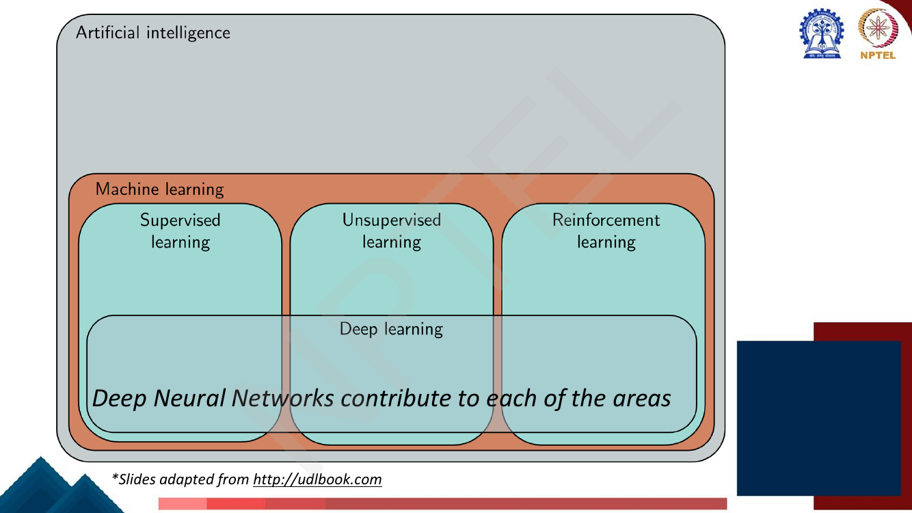
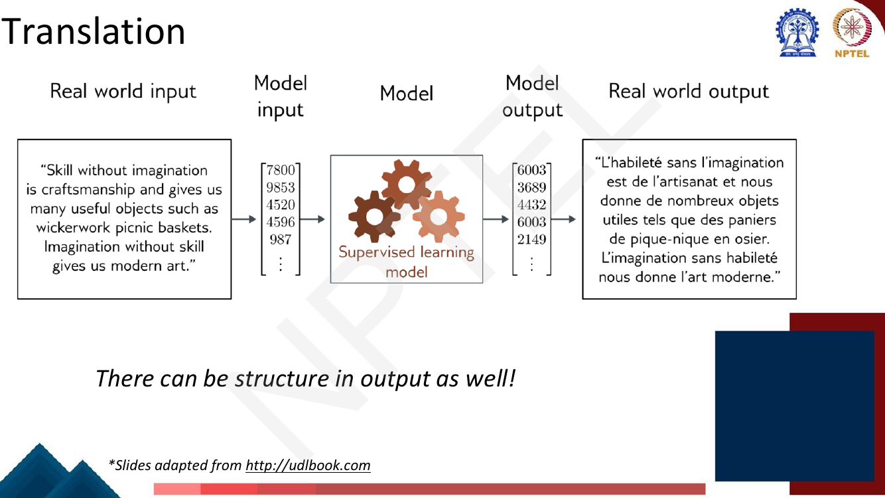
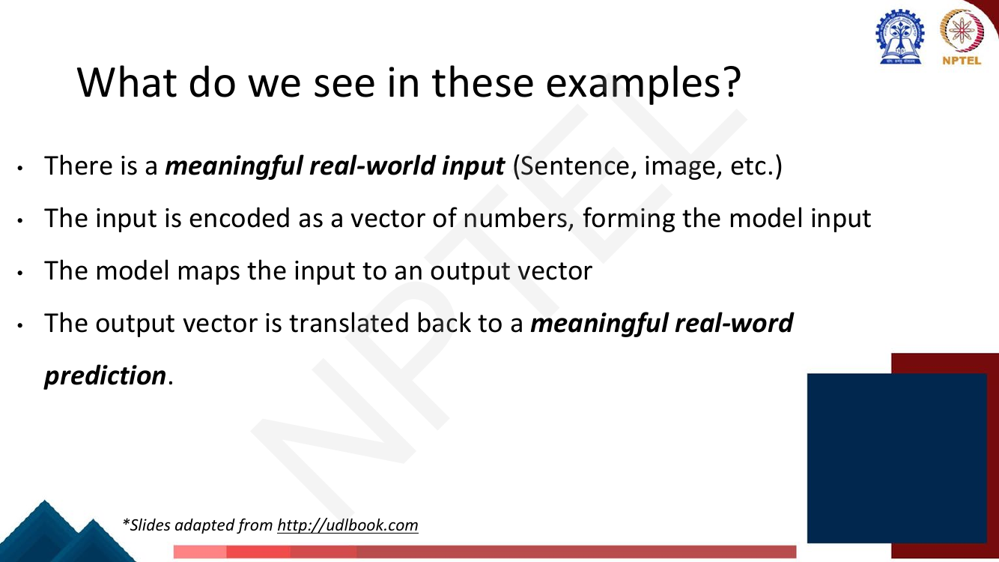
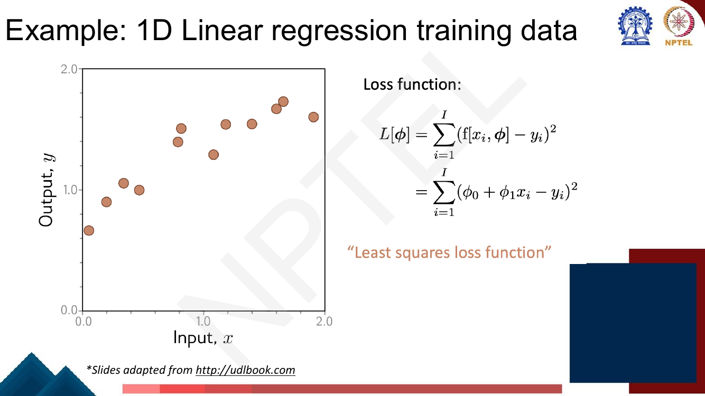
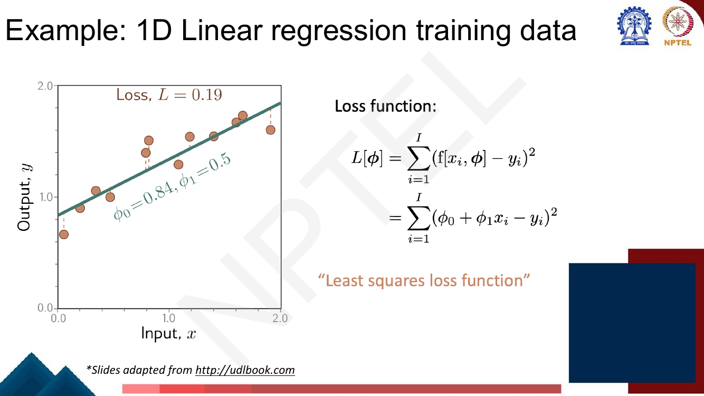
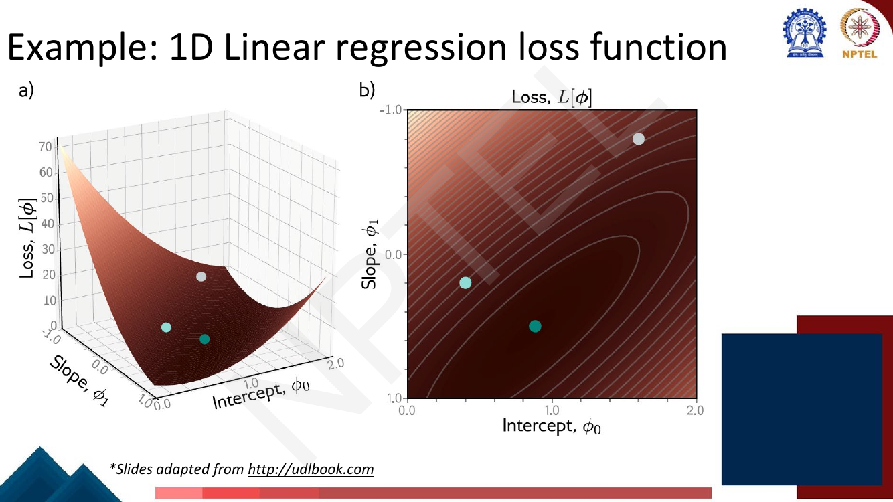
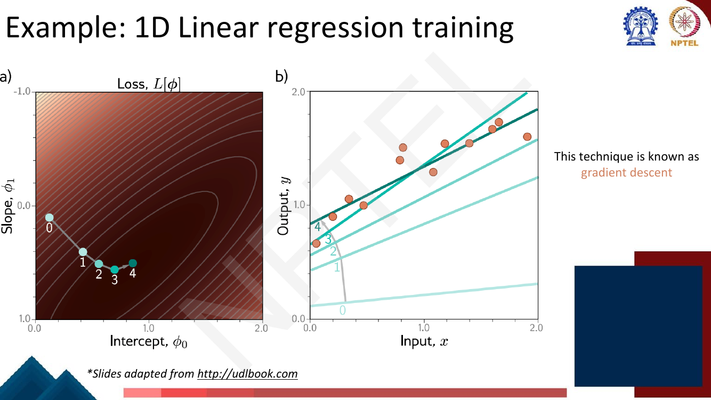

# Lec 6 — Supervised Learning

> **Source:** `Week2.pdf` pp. 1–33 · **Week 2** · **Playlist:** Lec 6
> **Prereqs:** [Lec 1 — Introduction to NLP](../week-01/01-intro-to-nlp.md)
> **Feeds into:** [Lec 7 — Shallow Neural Networks](07-shallow-neural-networks.md), [Lec 9 — Backpropagation](09-backpropagation.md)

## Why this lecture exists

Week 1 built language models by counting. Counting works for n-grams and stops working almost
immediately after: you cannot count your way to a sentiment classifier, a translator or a captioning
system. Everything from here to the end of the course is instead a *parameterised function fitted to
labelled data*, and this lecture is where that recipe is stated once, in full, so the remaining 54
lectures can assume it.

The lecture does two things. It walks a gallery of wildly different tasks — house prices, review
sentiment, image labels, French translation, photo captions — and extracts the single shape they all
share. Then it instantiates that shape in the smallest possible case, 1-D linear regression, and runs
it end to end: model, data, loss, training, testing. Every network in this course is that same
skeleton with a bigger $f$.

## The ideas

### Where supervised learning sits

The deck opens with a nesting diagram built one box at a time over pages 3–6. **Artificial
intelligence** is building systems that simulate intelligent behaviour, across a wide range of
approaches — logic, search, probabilistic reasoning. **Machine learning** is a *subset* of AI that
learns to make decisions by **fitting mathematical models to observed data**; the deck adds a pointed
parenthetical, that ML is "(incorrectly) almost synonymous with AI". Logic and search are AI and are
not ML. Inside ML sit three branches:

| Branch | The deck's definition |
|---|---|
| **Supervised learning** | Define a mapping from input data to an output prediction |
| **Unsupervised learning** | Construct a model from input data **without corresponding output labels** |
| **Reinforcement learning** | Introduces the idea of an **agent** that lives in the world and learns to choose actions leading to high **reward** |

**Deep learning** is then drawn as a band cutting *across all three*, captioned **"Deep Neural
Networks contribute to each of the areas."** That geometry corrects a common misconception: deep
learning is not a fourth sibling of supervised/unsupervised/RL but a *model class* usable inside any
of them — supervised fine-tuning (Lec 36), unsupervised pretraining
([Lec 26](../week-06/26-pretraining-and-elmo.md)) and RL from human feedback
([Lec 38](../week-08/38-rlhf-1.md)) all use the same networks.


*Fig. — Deep learning is drawn **across** the three branches, not beside them. An MCQ asking "is deep learning a type of supervised learning?" is testing exactly this picture. Page 6.*

**Supervised learning** itself (p. 7) is two sentences: *define a mapping from input to output*, and
*learn this mapping from paired input/output data examples*. The word doing the work is **paired** —
unsupervised learning has inputs only; here you have $(\text{input},\text{label})$ couples, and the
labels are what make a loss computable.

### The task gallery

Pages 8–12 show five tasks in an identical five-column layout: *real-world input → model input →
model → model output → real-world output*.

| Task | Input | Output | Problem type | Architecture the deck names |
|---|---|---|---|---|
| **House price** (p. 8) | house facts → $[6000,4,235,2005,1]^\top$ | $[340]$ → "\$340k" | **Univariate regression** (one real-valued output) | Fully connected network |
| **Text classification** (p. 9) | a negative restaurant review → $[8672, 8194, 9804, \ldots]^\top$ | $[0.02, 0.98]^\top$ → "Negative" | **Binary classification** (two discrete classes) | RNN / Transformer |
| **Image classification** (p. 10) | bicycle photo → pixels $[124,140,156,\ldots]^\top$ | $[0.00,0.00,0.01,0.89,\ldots]^\top$ → "Bicycle" | **Multiclass classification** ($>2$ classes) | Convolutional network |
| **Translation** (p. 11) | English paragraph → ids $[7800,9853,4520,\ldots]^\top$ | ids $[6003,3689,4432,\ldots]^\top$ → French text | **Structured output** | — |
| **Image captioning** (p. 12) | photo → pixels $[183,204,231,\ldots]^\top$ | $[1,5593,7532,7924,\ldots]^\top$ → "A Kazakh man on a horse holding a bird of prey" | **Structured output** | — |

![Text classification pipeline: a negative restaurant review becomes token ids, passes through the model, emerges as [0.02, 0.98], and is read back as the label "Negative"](../../assets/pages/lec06/p-009.png)
*Fig. — The output is a probability vector over {Positive, Negative}; 0.98 in the second slot is what "Negative" means numerically. The integers are vocabulary indices from tokenization ([Lec 2](../week-01/02-text-processing-tokenization.md)) — note 8672 appears twice, the same word mapping to the same id. Page 9.*


*Fig. — The deck's point, repeated on the captioning slide: the output need not be one number or one label. It can be a **variable-length sequence with internal structure** — which is why translation needs machinery ([Lec 18](../week-04/18-seq2seq-and-attention.md)) that classification does not. Page 11.*

The two classification entries are worth pinning down because the deck's wording is exam-shaped:
**binary** = two discrete classes, **multiclass** = discrete classes with more than two possible
values, **univariate regression** = one output, real-valued.

### What do we see in these examples?

The lecture's central page; the whole gallery exists to set it up. Four bullets:

1. There is a **meaningful real-world input** (sentence, image, …).
2. The input is **encoded as a vector of numbers**, forming the model input.
3. The **model maps the input vector to an output vector**.
4. The output vector is **translated back to a meaningful real-world prediction**.


*Fig. — Steps 2 and 4 are the encode/decode boundary; everything a neural network does lives strictly between them, in vector space. Page 13.*

Two consequences explain the shape of the rest of the course. **The model only ever sees vectors** —
a sentence is not a mathematical object, $[8672, 8194, \ldots]$ is — so deciding how to turn text into
numbers is a first-class design problem, not preprocessing; it is the whole of Week 3
([Lec 11](../week-03/11-word-representation.md)). And **one framework covers all five tasks**:
regression, classification and sequence generation differ in the *shape* of the output vector and the
*choice* of loss, not in the recipe.

### Supervised learning: notation

Pages 14–18 define the vocabulary on a toy example: input $\mathbf{x}$ is the age and mileage of a
second-hand Toyota Prius, output $y$ is its price, and the model is the equation linking them.

![Slide defining input x as a column vector of age and mileage labelled "structured or tabular data", output y as [price], and the model as y = f[x]](../../assets/pages/lec06/p-017.png)
*Fig. — The deck calls a fixed-length vector of named features **structured** or **tabular** data, in contrast to raw text and pixels. Note the square brackets in $y = \mathrm{f}[\mathbf{x}]$ — see the call-out below. Page 17.*

> **Notation — the deck's symbols vs this book's.** Lectures 6–10 follow Prince's *Understanding Deep
> Learning* ([udlbook.com](https://udlbook.github.io/udlbook/)), which writes parameters as
> $\boldsymbol{\phi}$ and function application with **square brackets**: $\mathbf{y} =
> \mathbf{f}[\mathbf{x}, \boldsymbol{\phi}]$, loss $L[\boldsymbol{\phi}]$, trained parameters
> $\hat{\boldsymbol{\phi}}$. **This book writes $\theta$, round brackets, and $\mathcal{L}$:
> $\mathbf{y} = f(\mathbf{x}; \theta)$, $\mathcal{L}(\theta)$, $\hat{\theta}$.** The square
> brackets are typographic — they distinguish function application from multiplication and carry no
> mathematical meaning. If the exam prints $\boldsymbol{\phi}$, read $\theta$. The deck's $I$ for
> the number of training examples is kept, since Lectures 6–10 use it throughout.

Page 16 contains a deliberate correction that the slides show as a strikethrough:

- ~~Model is a mathematical equation~~
- **Model is a family of equations**

This edit *is* the idea of parameters: $f$ alone is not one function but an indexed collection of
them, one per setting of $\theta$. Picking $\theta$ picks a member of the family.

The definitions, in the deck's words:

| Term | Definition |
|---|---|
| **Supervised learning model** | A mapping from one or more inputs to one or more outputs |
| **Model** | A *family* of equations, with **parameters** $\theta$ that affect the outcome of the equation |
| **Inference** | Computing the outputs from the inputs (i.e. evaluating $f(\mathbf{x};\theta)$ with $\theta$ already fixed) |
| **Training** | Finding parameters that predict outputs "well" from inputs, for a training dataset of input/output pairs |

**Inference is the word to memorise.** In this course "inference" means *running the trained model
forward on an input* — not statistical inference in the sense of estimating a population parameter.

Both arguments of $f(\mathbf{x};\theta)$ matter, at different times: $\mathbf{x}$ varies at
inference with $\theta$ held fixed; $\theta$ varies during training with the dataset held fixed.

### The quadrant: model, loss, training, testing

The deck gives each its own page (18–21). These are the four things you must be able to state for
*any* supervised method in this course.

**Model.** $\mathbf{y} = f(\mathbf{x};\theta)$ — a family of equations indexed by parameters.

**Loss function** (also called the **cost function**). Given a training dataset of $I$ input/output
pairs $\mathcal{D} = \{\mathbf{x}_i, \mathbf{y}_i\}_{i=1}^{I}$, the loss is written in full as

$$\mathcal{L}\big(\theta,\; f(\mathbf{x};\theta),\; \{\mathbf{x}_i,\mathbf{y}_i\}_{i=1}^{I}\big) \quad\text{or for short}\quad \mathcal{L}(\theta)$$

and its defining property, in the deck's own annotation, is that it **returns a scalar that is
smaller when the model maps inputs to outputs better**. Three parts of that sentence are each
examinable:

- **A scalar.** One number for the whole dataset — not per-example, or you could not rank $\theta$s.
- **Smaller is better.** The loss measures *mismatch* ("how bad the model is"), so you minimise it.
- **It depends on the training set.** $\mathcal{L}$ is a function of $\theta$ *only because the data
  is held fixed*. The short form hides the data; it does not make it irrelevant.

![Slide: training dataset of I pairs, and the loss L[φ, f[x,φ], {x_i,y_i}] with "model" and "train data" braced underneath, abbreviated L[φ], annotated "returns a scalar that is smaller when the model maps inputs to outputs better"](../../assets/pages/lec06/p-019.png)
*Fig. — The under-braces are the point: the loss is a function of the model **and** of the training data, and $\mathcal{L}(\theta)$ is shorthand for that whole expression. Page 19.*

**Training.** Find the parameters that minimise the loss:

$$\hat{\theta} = \underset{\theta}{\operatorname{argmin}}\;\big[\mathcal{L}(\theta)\big]$$

Read $\operatorname{argmin}$ carefully: it returns the *argument* achieving the minimum — the best
$\theta$ — not the minimum value. $\min_\theta \mathcal{L}(\theta)$ is the lowest loss;
$\operatorname{argmin}$ is the $\theta$ that attains it.

**Testing.** Run the trained model on a **separate test dataset** of input/output pairs and see how
well it **generalizes**. Training loss says how well you fitted; only test loss says whether you
learned anything.

### The running example: 1-D linear regression

Five consecutive pages run the smallest possible instance of the quadrant end to end.

**The model** (pp. 22–23). One scalar input, one scalar output:

$$y = f(x;\theta) = \theta_0 + \theta_1 x, \qquad \theta = \begin{bmatrix}\theta_0 \\ \theta_1\end{bmatrix}$$

with $\theta_0$ the **y-offset** (intercept) and $\theta_1$ the **slope**. Two parameters; the family
of equations is the set of all straight lines.

Page 23 plots three members of that family — $(0.0, 1.0)$ rising steeply, $(1.2, -0.1)$ nearly flat,
$(1.0, -0.4)$ falling. $\theta$ does not change what the model *is*; it selects which line you get.

**The training data and the loss** (p. 24). A scatter of $I$ points, and the **least squares loss
function**:

$$\mathcal{L}(\theta) = \sum_{i=1}^{I}\big(f(x_i;\theta) - y_i\big)^2 = \sum_{i=1}^{I}\big(\theta_0 + \theta_1 x_i - y_i\big)^2$$

Each term is the squared vertical gap between the line and a data point. Squared rather than absolute
for three reasons: every mismatch becomes **positive**, so errors above and below the line cannot
cancel; the result is **differentiable everywhere**, including at zero error where $|{\cdot}|$ has a
kink, and every method from [Lec 10](10-gradient-descent-and-init.md) onward needs derivatives; and
large errors are penalised **disproportionately** — doubling an error quadruples its contribution,
which pulls the fit hard toward outliers (a genuine weakness, not just a feature).

Note what is *not* in the formula: no $1/I$, no $1/2$. The deck's $\mathcal{L}$ is a **sum**, not a
mean. That does not move $\hat{\theta}$ — scaling by a positive constant leaves the minimiser alone —
but it changes the printed number, so read the question before computing.


*Fig. — The sum runs over data points, and the squared quantity is prediction minus target. Page 24.*

Pages 25–27 plant three candidate lines on that data and print the loss, with dashed vertical lines
showing the residuals being squared:

| Page | $\theta_0$ | $\theta_1$ | Loss $\mathcal{L}$ | What it looks like |
|---|---|---|---|---|
| 25 | 0.4 | 0.2 | **7.11** | too flat, passes below the data |
| 26 | 1.60 | −0.8 | **10.22** | wrong sign of slope — worst of the three |
| 27 | 0.84 | 0.5 | **0.19** | runs through the cloud; best fit |


*Fig. — The loss is the **sum of squares of exactly these dashed segments**. Spread across ~12 points, $\mathcal{L}=0.19$ means a typical residual of about $\sqrt{0.19/12} \approx 0.13$. Page 27.*

**The loss surface** (p. 28). Stop thinking about $x$ and $y$; plot $\mathcal{L}$ as a function of the
*two parameters*. The deck shows it twice — a 3-D surface over $(\theta_0,\theta_1)$ and a 2-D contour
map — with the three candidate fits marked as dots.


*Fig. — The surface is a **convex bowl**: one minimum, no local traps. The contours are ellipses **tilted** rather than axis-aligned, which says $\theta_0$ and $\theta_1$ are coupled — changing the intercept changes which slope is best. The dot nearest the bottom is the $\mathcal{L}=0.19$ fit. Page 28.*

Three things generalise from this picture. **Every point on the surface is a complete line** — a dot
on the contour map *is* a model, so training is a walk on this map and simultaneously a sequence of
lines on the data plot. **The bowl shape is special** to least squares with a linear model:
$\mathcal{L}$ is quadratic in $\theta$, hence an elliptical paraboloid with a unique minimum; deep
networks are nothing like this ([Lec 10](10-gradient-descent-and-init.md)). And **the surface has one
dimension per parameter** — two you can draw, a million you cannot, which is where the pictures stop
and the algebra takes over.

**Training** (p. 29). The deck shows a path labelled 0–4 walking downhill across the contour map,
paired with the corresponding lines sweeping up through the data. The caption names the method:
**this technique is known as gradient descent**.


*Fig. — Read the panels together: step $k$ on the left is line $k$ on the right. Downhill in parameter space is "better fit" in data space — that correspondence is the whole idea of training. Page 29.*

That is as far as this lecture goes. **How** you pick the downhill direction, how big a step to take,
what to do when the surface is not a bowl, and where you start are
[Lec 10](10-gradient-descent-and-init.md); the derivative computation that makes it possible for a
deep network is [Lec 9](09-backpropagation.md). For now: **training means minimising the loss.**

**Testing** (p. 31). Test on a *different* set of paired data and measure performance. The degree to
which test performance matches training performance is **generalization**. The deck names two
failure modes: the model is **too simple** to capture the pattern, or **too complex** and fits to
statistical peculiarities of the data — **overfitting**. That one slide is all this deck says about
overfitting; the full treatment is in the companion vision course's
[overfitting and regularization](../../../GenAIforCV/notes/week-02/10-overfitting-and-regularization.md).

### Possible objections

Page 30 raises two objections to the whole framing and answers both. The answers are the reason the
course exists, so they are quotable:

| Objection | The deck's answer |
|---|---|
| "But you can fit the line model in **closed form**!" | Yes — but we won't be able to do this for more complex models. |
| "But we could **exhaustively try** every slope and intercept combination!" | Yes — but we won't be able to do this when there are a million parameters. |

Both are honest concessions: for 1-D linear regression you genuinely can solve for $\hat{\theta}$
exactly (N2 below) and genuinely can grid-search two parameters. Neither survives scale. **Closed
form** needs $\nabla_\theta \mathcal{L} = 0$ solved analytically, which works while $\mathcal{L}$ is
quadratic in $\theta$; put a nonlinearity inside $f$ — exactly what
[Lec 7](07-shallow-neural-networks.md) does — and there is no closed form. **Exhaustive search**
costs $k^P$ evaluations for $P$ parameters at $k$ values each: the parameter count is the *exponent*,
so the cost explodes long before a million (N5 quantifies it). What is left is iterative,
gradient-guided search, which scales *linearly* in $P$. That is the bargain deep learning makes.

> **Carried over from the vision course.** You met the model/loss/train/test loop, least squares and
> the loss-surface picture in [perceptron](../../../GenAIforCV/notes/week-02/07-perceptron.md) and
> [MLP and activations](../../../GenAIforCV/notes/week-02/08-mlp-and-activations.md), which is why
> this chapter moves fast through them. New here: the deck's vocabulary ($\boldsymbol{\phi}$, "family
> of equations", *inference* as forward evaluation, the "possible objections" framing), and the fact
> that the NPTEL exam is set from *these* slides. Everything after this lecture swaps one box of the
> quadrant and leaves the rest alone — $f$ becomes a shallow net ([Lec 7](07-shallow-neural-networks.md)),
> then a deep one ([Lec 8](08-deep-neural-networks.md)), the gradient comes from backpropagation
> ([Lec 9](09-backpropagation.md)), and the minimisation becomes SGD/Adam
> ([Lec 10](10-gradient-descent-and-init.md)).

## Worked numericals

The deck contains **no "Try this problem" pages** in pages 1–33. All five numericals below use the
deck's own example — 1-D linear regression under the least-squares loss — on a dataset small enough
to work entirely by hand.

**The dataset for N1–N3:**

| $i$ | 1 | 2 | 3 | 4 | 5 |
|---|---|---|---|---|---|
| $x_i$ | 1 | 2 | 3 | 4 | 5 |
| $y_i$ | 2 | 3 | 5 | 6 | 9 |

### N1. Comparing two candidate parameter settings by least-squares loss
**Given:** the model $y = \theta_0 + \theta_1 x$, the five points above, and the loss
$\mathcal{L}(\theta) = \sum_{i=1}^{5}(\theta_0 + \theta_1 x_i - y_i)^2$.
**Find:** $\mathcal{L}$ for candidate **A** $(\theta_0, \theta_1) = (0,\, 2)$ and candidate **B**
$(\theta_0, \theta_1) = (1,\, 1.5)$, and say which line is better.

1. Candidate **A**, predictions $\hat{y}_i = 0 + 2x_i$: $\;2,\,4,\,6,\,8,\,10$.
2. Residuals $\hat{y}_i - y_i$: $\;2{-}2=0$, $4{-}3=1$, $6{-}5=1$, $8{-}6=2$, $10{-}9=1$.
3. Squares: $0,\,1,\,1,\,4,\,1$.
4. $\mathcal{L}_A = 0+1+1+4+1 = \mathbf{7.00}$.
5. Candidate **B**, predictions $\hat{y}_i = 1 + 1.5x_i$: $\;2.5,\,4,\,5.5,\,7,\,8.5$.
6. Residuals: $2.5{-}2=0.5$, $4{-}3=1$, $5.5{-}5=0.5$, $7{-}6=1$, $8.5{-}9=-0.5$.
7. Squares: $0.25,\,1,\,0.25,\,1,\,0.25$.
8. $\mathcal{L}_B = 0.25+1+0.25+1+0.25 = \mathbf{2.75}$.

**Answer:** $\mathcal{L}_A = 7.00$, $\mathcal{L}_B = 2.75$; **B is better**, since smaller loss means
less mismatch. Note A has a *zero* residual at $i=1$ and still loses: the loss is a property of the
whole dataset, never of one lucky point.

### N2. The closed-form least-squares solution, and its loss
**Given:** the same five points.
**Find:** $\hat{\theta} = \operatorname{argmin}_\theta \mathcal{L}(\theta)$ in closed form, and
$\mathcal{L}(\hat{\theta})$.

1. **Set the partial derivatives to zero.** With $e_i = \theta_0 + \theta_1 x_i - y_i$,
   $$\frac{\partial \mathcal{L}}{\partial \theta_0} = \sum_i 2e_i = 0, \qquad \frac{\partial \mathcal{L}}{\partial \theta_1} = \sum_i 2 x_i e_i = 0.$$
2. Dividing by 2 and expanding gives the two **normal equations**:
   $$I\theta_0 + \theta_1\textstyle\sum_i x_i = \sum_i y_i, \qquad \theta_0\sum_i x_i + \theta_1\sum_i x_i^2 = \sum_i x_i y_i.$$
3. Solving the pair:
   $$\hat{\theta}_1 = \frac{I\sum x_iy_i - \sum x_i \sum y_i}{I\sum x_i^2 - \left(\sum x_i\right)^2}, \qquad \hat{\theta}_0 = \bar{y} - \hat{\theta}_1\bar{x}.$$
4. **The sums.** $I = 5$; $\sum x_i = 1{+}2{+}3{+}4{+}5 = 15$; $\sum y_i = 2{+}3{+}5{+}6{+}9 = 25$;
   $\sum x_i^2 = 1{+}4{+}9{+}16{+}25 = 55$;
   $\sum x_iy_i = (1)(2){+}(2)(3){+}(3)(5){+}(4)(6){+}(5)(9) = 2{+}6{+}15{+}24{+}45 = 92$.
5. Numerator: $5(92) - (15)(25) = 460 - 375 = 85$.
6. Denominator: $5(55) - 15^2 = 275 - 225 = 50$.
7. $\hat{\theta}_1 = 85/50 = \mathbf{1.7}$.
8. $\bar{x} = 15/5 = 3$, $\bar{y} = 25/5 = 5$, so $\hat{\theta}_0 = 5 - (1.7)(3) = 5 - 5.1 = \mathbf{-0.1}$.
9. **Loss at the optimum.** Predictions $-0.1 + 1.7x_i$: $\;1.6,\,3.3,\,5.0,\,6.7,\,8.4$.
10. Residuals: $-0.4,\;+0.3,\;0,\;+0.7,\;-0.6$. Squares: $0.16,\,0.09,\,0,\,0.49,\,0.36$.
11. $\mathcal{L}(\hat{\theta}) = 0.16+0.09+0+0.49+0.36 = \mathbf{1.10}$.
12. Check: $1.10 < 2.75 < 7.00$ ✓ — the optimum beats both candidates from N1, as it must.

**Answer:** $\hat{\theta}_0 = -0.1$, $\hat{\theta}_1 = 1.7$, $\mathcal{L}(\hat{\theta}) = 1.10$ —
the deck's first objection in action. Add a nonlinearity to $f$ and step 3 has no solution.

### N3. Train loss vs test loss on held-out points
**Given:** the fitted model $\hat{y} = -0.1 + 1.7x$ from N2 (train loss 1.10 over 5 points) and a
test set $\{(6, 10), (7, 11)\}$.
**Find:** the test loss, and a fair comparison with the training loss.

1. Test prediction at $x=6$: $-0.1 + (1.7)(6) = -0.1 + 10.2 = 10.1$. Residual $10.1 - 10 = 0.1$;
   square $= 0.01$.
2. Test prediction at $x=7$: $-0.1 + (1.7)(7) = -0.1 + 11.9 = 11.8$. Residual $11.8 - 11 = 0.8$;
   square $= 0.64$.
3. $\mathcal{L}_{\text{test}} = 0.01 + 0.64 = \mathbf{0.65}$.
4. **Do not compare 0.65 against 1.10 directly** — the deck's loss is a *sum* and the sets differ in
   size (5 vs 2). Normalise: train $= 1.10/5 = 0.220$, test $= 0.65/2 = 0.325$ per example.
5. $0.325 > 0.220$: performance degrades on unseen data, as usual, but only modestly, so the model
   **generalizes** acceptably.

**Answer:** $\mathcal{L}_{\text{test}} = 0.65$; per-example 0.325 (test) vs 0.220 (train). The raw
sums suggest the opposite — this size-normalisation trap is a favourite.

### N4. Counting parameters
**Given:** four model families.
**Find:** the number of parameters $P$ in each.

1. **1-D linear regression**, $y = \theta_0 + \theta_1 x$: one intercept, one slope. $P = \mathbf{2}$.
2. **House-price model**, $\mathbf{x} \in \mathbb{R}^5$, one real output, linear:
   $y = \theta_0 + \sum_{j=1}^{5}\theta_j x_j$ — five weights plus one bias, $P = 5+1 = \mathbf{6}$.
3. **Prius model**, $\mathbf{x} = [\text{age},\ \text{mileage}]^\top$, one output: $2+1 = \mathbf{3}$.
4. **Linear classifier**, 300-dimensional document vector to 5 classes: a $5\times300$ weight matrix
   plus 5 biases, $P = 1500 + 5 = \mathbf{1505}$.

**Answer:** 2, 6, 3, 1505. General rule for a linear map $D_{\text{in}} \to D_{\text{out}}$:
$P = D_{\text{in}}D_{\text{out}} + D_{\text{out}}$ — **weights plus one bias per output**.
Forgetting the biases is the standard slip.

### N5. Why exhaustive search dies (the deck's second objection, quantified)
**Given:** a grid search that tries $k = 100$ equally spaced values for each of $P$ parameters, on a
machine evaluating $10^9$ losses per second.
**Find:** the cost for $P = 2$, $P = 10$, and the deck's $P = 10^6$.

1. Evaluations needed: $k^P = 100^P = 10^{2P}$.
2. $P = 2$: $100^2 = 10^4 = 10{,}000$ evaluations $\Rightarrow 10^4/10^9 = 10^{-5}$ s. Instant — this
   is why the objection *feels* reasonable for a line.
3. $P = 10$: $100^{10} = 10^{20}$ evaluations $\Rightarrow 10^{20}/10^{9} = 10^{11}$ s.
4. One year $\approx 3.156 \times 10^7$ s, so $10^{11}/(3.156\times10^7) \approx \mathbf{3{,}170}$
   years — for **ten** parameters.
5. $P = 10^6$: $10^{2{,}000{,}000}$ evaluations — for scale, the observable universe holds about
   $10^{80}$ atoms.
6. Contrast: a gradient step costs $O(P)$, so $10^6$ parameters cost ~$10^6$ operations per step and
   a few thousand steps suffice.

**Answer:** $10^{-5}$ s, ~3,170 years, $10^{2{,}000{,}000}$ evaluations. Grid search is
**exponential** in the parameter count; gradient descent is **linear**. That contrast is the deck's
answer to the objection.

## Code

```python
import numpy as np

# Training set: 5 (x, y) pairs  -- the data used in the worked numericals
x = np.array([1.0, 2.0, 3.0, 4.0, 5.0])
y = np.array([2.0, 3.0, 5.0, 6.0, 9.0])
I = len(x)

def loss(t0, t1):
    """Least-squares loss  L(theta) = sum_i (t0 + t1*x_i - y_i)^2  (a SUM, not a mean)."""
    return float(np.sum((t0 + t1 * x - y) ** 2))

# --- 1. probe the loss surface at a few parameter settings ---------------
print("  theta0  theta1      L")
for t0, t1 in [(0.0, 2.0), (1.0, 1.5), (0.0, 1.0), (-0.1, 1.7), (2.0, 0.0)]:
    print(f"  {t0:6.2f}  {t1:6.2f}  {loss(t0, t1):7.3f}")

# --- 2. closed form via the normal equations ----------------------------
Sx, Sy, Sxx, Sxy = x.sum(), y.sum(), (x * x).sum(), (x * y).sum()
t1_hat = (I * Sxy - Sx * Sy) / (I * Sxx - Sx ** 2)
t0_hat = (Sy - t1_hat * Sx) / I
print(f"\nsums: I={I} Sx={Sx} Sy={Sy} Sxx={Sxx} Sxy={Sxy}")
print(f"closed form : theta0 = {t0_hat:.4f}, theta1 = {t1_hat:.4f}, L = {loss(t0_hat, t1_hat):.4f}")

# --- 3. same thing via lstsq, as a cross-check --------------------------
A = np.stack([np.ones_like(x), x], axis=1)   # design matrix; column of 1s carries the intercept
theta, *_ = np.linalg.lstsq(A, y, rcond=None)
print(f"np.linalg.lstsq: theta0 = {theta[0]:.4f}, theta1 = {theta[1]:.4f}")

# --- 4. coarse grid search: the objection the deck raises ---------------
g0 = np.linspace(-1, 1, 5); g1 = np.linspace(1, 3, 5)
G = np.array([[loss(a, b) for b in g1] for a in g0])
print("\nloss on a 5x5 grid (rows theta0 = -1..1, cols theta1 = 1..3):")
print(np.round(G, 2))
i, j = np.unravel_index(G.argmin(), G.shape)
print(f"grid best: theta0={g0[i]:.2f}, theta1={g1[j]:.2f}, L={G[i,j]:.3f}"
      f"   ({G.size} evaluations for 2 parameters)")

# --- 5. train vs test loss ---------------------------------------------
xt, yt = np.array([6.0, 7.0]), np.array([10.0, 11.0])
test = float(np.sum((t0_hat + t1_hat * xt - yt) ** 2))
print(f"\ntrain L = {loss(t0_hat,t1_hat):.3f} over {I} pts -> per-example {loss(t0_hat,t1_hat)/I:.3f}")
print(f"test  L = {test:.3f} over {len(xt)} pts -> per-example {test/len(xt):.3f}")
```

Printed output:

```
  theta0  theta1      L
    0.00    2.00    7.000
    1.00    1.50    2.750
    0.00    1.00   26.000
   -0.10    1.70    1.100
    2.00    0.00   75.000

sums: I=5 Sx=15.0 Sy=25.0 Sxx=55.0 Sxy=92.0
closed form : theta0 = -0.1000, theta1 = 1.7000, L = 1.1000
np.linalg.lstsq: theta0 = -0.1000, theta1 = 1.7000

loss on a 5x5 grid (rows theta0 = -1..1, cols theta1 = 1..3):
[[ 51.    12.75   2.    18.75  63.  ]
 [ 37.25   6.5    3.25  27.5   79.25]
 [ 26.     2.75   7.    38.75  98.  ]
 [ 17.25   1.5   13.25  52.5  119.25]
 [ 11.     2.75  22.    68.75 143.  ]]
grid best: theta0=0.50, theta1=1.50, L=1.500   (25 evaluations for 2 parameters)

train L = 1.100 over 5 pts -> per-example 0.220
test  L = 0.650 over 2 pts -> per-example 0.325
```

The first block is a slice through the **loss surface** of page 28 — the deck's picture read as a
table of numbers. The closed form and `np.linalg.lstsq` agree to four decimals and both match N2 by
hand. The grid search reaches $\mathcal{L} = 1.5$ against the exact 1.10: *close*, and already $5^2$
work for two parameters — the deck's second objection in miniature.

## Exam pack

### Must-memorise

| Item | Exactly this |
|---|---|
| Supervised learning | define a mapping from input to output; **learn it from paired input/output examples** |
| Unsupervised learning | construct a model from input data **without corresponding output labels** |
| Reinforcement learning | an **agent** in the world learning to choose actions leading to high **reward** |
| Machine learning | subset of AI that learns by **fitting mathematical models to observed data** |
| Deep learning's place | a band **across** supervised / unsupervised / RL — "DNNs contribute to each of the areas" |
| Model | a **family of equations**, $\mathbf{y} = f(\mathbf{x};\theta)$ (deck: $\mathbf{f}[\mathbf{x},\boldsymbol{\phi}]$) |
| Inference | computing the outputs from the inputs, with $\theta$ fixed |
| Training | finding parameters that predict outputs well on a training dataset |
| Training set | $\mathcal{D} = \{\mathbf{x}_i, \mathbf{y}_i\}_{i=1}^{I}$, $I$ pairs |
| Loss function (= cost function) | $\mathcal{L}(\theta)$ — returns a **scalar** that is **smaller when the model maps inputs to outputs better** |
| Training, formally | $\hat{\theta} = \operatorname{argmin}_{\theta}\big[\mathcal{L}(\theta)\big]$ |
| Testing | run on a **separate** test dataset of input/output pairs; measure **generalization** |
| 1-D linear regression model | $y = \theta_0 + \theta_1 x$; $\theta_0$ = y-offset, $\theta_1$ = slope; 2 parameters |
| Least-squares loss | $\mathcal{L}(\theta) = \sum_{i=1}^{I}\left(\theta_0 + \theta_1 x_i - y_i\right)^2$ |
| Closed-form slope | $\hat{\theta}_1 = \dfrac{I\sum x_iy_i - \sum x_i\sum y_i}{I\sum x_i^2 - (\sum x_i)^2}$, $\;\hat{\theta}_0 = \bar{y} - \hat{\theta}_1\bar{x}$ |
| Training (the picture) | walking downhill on the loss surface — **gradient descent** |
| Why generalization fails | model **too simple**; or model **too complex** → fits statistical peculiarities → **overfitting** |
| Objection 1 + answer | closed form exists — but not for more complex models |
| Objection 2 + answer | exhaustive search works — but not with a million parameters |
| Linear-layer parameter count | $D_{\text{in}}D_{\text{out}} + D_{\text{out}}$ |

### Numbers worth knowing

| Quantity | Value |
|---|---|
| Deck's three example fits | $(0.4,\,0.2) \to \mathcal{L}=7.11$; $(1.60,\,-0.8) \to \mathcal{L}=10.22$; $(0.84,\,0.5) \to \mathcal{L}=0.19$ |
| Parameters in 1-D linear regression | **2** ($\theta_0$, $\theta_1$) |
| House-price model input | $[6000, 4, 235, 2005, 1]^\top$ → output $[340]$, i.e. \$340k |
| Text-classification output | $[0.02, 0.98]^\top$ → "Negative" |
| Image-classification output | $[0.00, 0.00, 0.01, \mathbf{0.89}, 0.05, \ldots]^\top$ → "Bicycle" |
| Branches of machine learning | **3** (supervised, unsupervised, reinforcement) |
| Common elements in the task gallery | **4** (real-world input → vector → model → vector → real-world output) |
| Loss-surface axes on p. 28 | intercept $\theta_0 \in [0,2]$, slope $\theta_1 \in [-1,1]$, loss up to ~70 |
| Gradient-descent steps shown on p. 29 | **5** (labelled 0–4) |
| Source text | Prince, *Understanding Deep Learning*, Chapters 1–2 |

### Likely MCQ traps

- **"Deep learning is a fourth type of machine learning, alongside supervised/unsupervised/RL."** No.
  The deck draws it as a band *across* all three. Deep networks are a model class, not a learning
  paradigm.
- **"Machine learning and AI are the same thing."** The slide says this equation is made
  "(incorrectly)". ML is a *subset* of AI; logic and search are AI without being ML.
- **"Exhaustive search is impossible in principle."** It is possible and correct, just computationally
  infeasible — $k^P$ grows exponentially in the parameter count.
- **Confusing *inference* with *training*.** Inference = forward evaluation with $\theta$ fixed.
  Training = searching for $\theta$. "Inference" never means "learning the parameters".
- **$\operatorname{argmin}$ vs $\min$.** $\operatorname{argmin}_\theta \mathcal{L}(\theta)$ is the
  best **parameter vector**; $\min_\theta \mathcal{L}(\theta)$ is the best **loss value**. Training
  returns the former.
- **"The loss should be large when the model is good."** Backwards. The loss measures *mismatch*;
  smaller is better; you *minimise* it.
- **Treating the deck's $\mathcal{L}$ as a mean.** It is a plain **sum** over $I$ examples — no
  $1/I$, no $1/2$. It changes the printed number (though not the argmin), and it makes train/test
  losses on different-sized sets non-comparable until you divide (see N3).
- **Binary vs multiclass vs univariate regression.** Two discrete classes = binary. More than two
  discrete classes = multiclass. One real-valued output = univariate regression. The deck labels each
  example explicitly.
- **"Gradient descent is needed because no closed form ever exists."** For 1-D linear regression a
  closed form *does* exist; the deck concedes it. The argument is about *more complex models*.
- **"Overfitting means the model is too simple."** Reversed. Too simple = underfits; too complex =
  fits statistical peculiarities = overfits.
- **Reading the loss surface as data space.** The axes on page 28 are $\theta_0$ and $\theta_1$,
  **not** $x$ and $y$. One point on that plot is an entire line.

### Self-test

1. Give the deck's one-line definition of supervised learning and name the word that distinguishes it
   from unsupervised learning.
2. Is deep learning a subset of supervised learning? Justify from the diagram on page 6.
3. State the four common elements the deck extracts from the task gallery.
4. Write the training objective in symbols, and say in words what $\operatorname{argmin}$ returns.
5. For $y = \theta_0 + \theta_1 x$ with $(\theta_0,\theta_1) = (1, 2)$ and data $\{(1,4),(2,5)\}$,
   compute the least-squares loss.
6. Classify each as binary / multiclass / univariate regression / structured output: predicting a
   house price; labelling a review Positive or Negative; labelling a photo among 1000 object classes;
   translating a sentence.
7. How many parameters does a linear model mapping a 100-dimensional input to 10 outputs have?
8. The deck says you could fit the line in closed form. Why does the course not stop there?
9. Why is the loss surface for 1-D linear regression a bowl with exactly one minimum?
10. Train loss (as a sum) is 20 over 100 examples; test loss (as a sum) is 1.2 over 4 examples. Is the
    model generalizing?

<details><summary>Answers</summary>

1. "Define a mapping from input to output, and learn this mapping from **paired** input/output data
   examples." The distinguishing word is *paired* — unsupervised learning has inputs with no
   corresponding output labels.
2. No. It is drawn as a band spanning all three branches: deep networks contribute to supervised,
   unsupervised *and* reinforcement learning. It is a model class, not a paradigm.
3. A meaningful real-world input; it is encoded as a vector of numbers; the model maps that input
   vector to an output vector; the output vector is translated back to a meaningful real-world
   prediction.
4. $\hat{\theta} = \operatorname{argmin}_\theta[\mathcal{L}(\theta)]$. It returns the *parameter
   values* that achieve the smallest loss, not the loss value itself.
5. Predictions $1+2(1)=3$ and $1+2(2)=5$. Residuals $3-4=-1$ and $5-5=0$. Squares $1$ and $0$.
   $\mathcal{L} = \mathbf{1}$.
6. House price → univariate regression; Positive/Negative → binary classification; 1000 object
   classes → multiclass classification; translation → structured output.
7. $(100)(10) + 10 = \mathbf{1010}$ — a $10\times100$ weight matrix plus 10 biases.
8. Because the closed form only exists for this restricted model family. The moment $f$ contains a
   nonlinearity (Lec 7 onward), $\nabla_\theta\mathcal{L}=0$ has no analytic solution, and you need
   an iterative method that works regardless.
9. Because $\mathcal{L}$ is a sum of squares of terms *linear* in $\theta$, so it is a convex
   quadratic in $(\theta_0,\theta_1)$ — an elliptical paraboloid, with a unique global minimum and no
   local minima.
10. Compare per-example: train $20/100 = 0.2$, test $1.2/4 = 0.3$. The test loss is higher, as
    expected, but by a modest factor, so yes — it is generalizing acceptably. Comparing the raw sums
    (20 vs 1.2) would have been meaningless.

</details>

## Beyond the slides

**Gap:** The deck draws a convex bowl with tilted elliptical contours, and explains neither the bowl
nor the tilt.
**Why it matters:** For $\mathcal{L}(\theta) = \sum_i(\theta_0 + \theta_1x_i - y_i)^2$ the matrix of
second derivatives is the *constant* $2\begin{bmatrix} I & \sum x_i \\ \sum x_i & \sum x_i^2\end{bmatrix}$
— for the N2 data $\begin{bmatrix}10 & 30\\ 30 & 110\end{bmatrix}$, determinant $1100-900 = 200 > 0$
with positive trace, hence positive definite. That *proves* the single minimum. The tilt comes from
the off-diagonal $\sum x_i$: intercept and slope are coupled, so moving one changes the best value of
the other. Centre the inputs ($x_i \leftarrow x_i - \bar{x}$, making $\sum x_i = 0$) and the ellipses
become axis-aligned and gradient descent converges much faster — the simplest instance of **feature
normalisation**. Put one ReLU in $f$ and the Hessian stops being constant, convexity is lost, and
local minima, saddles and plateaus appear, which is why
[Lec 10](10-gradient-descent-and-init.md) needs a whole lecture. The pretty bowl is the exception,
not the rule.

**Gap:** The deck presents least squares as *the* loss and never says where it comes from.
**Why it matters:** Minimising the sum of squared errors is exactly maximum-likelihood estimation
under $y_i = f(x_i;\theta) + \varepsilon_i$ with $\varepsilon_i$ Gaussian of constant variance. That is
why squared error suits regression and *classification* uses cross-entropy instead: a categorical
noise model gives a different loss. Every loss in this course is a negative log-likelihood of
something, which makes the proliferation of losses from Week 6 onward read as variations rather than
arbitrary choices.

**Gap:** Only train and test are mentioned; there is no **validation/dev set**.
**Why it matters:** The three-way split from
[Lec 4](../week-01/04-ngram-lm-2-smoothing-perplexity.md) applies to every model here too:
hyperparameters (learning rate, hidden width, depth) are chosen on a dev set and the test set is
touched once. "A separate test dataset" alone invites the error of tuning on test.

**Gap:** Nothing is said about how the labels $\{y_i\}$ come to exist.
**Why it matters:** "Paired input/output examples" is the premise of the whole lecture, and in NLP
such pairs are expensive. The modern answer is to *manufacture* supervision from raw text — predict
the next word, predict a masked word — i.e. **self-supervised learning**, which is why pretraining
([Lec 26](../week-06/26-pretraining-and-elmo.md)) reshaped the field. Formally these are supervised
problems whose labels were free: the loophole that made large language models possible.

## Cut from the slides

Dropped: page 1 (title), page 2 (two-item outline), page 32 (the reference to Prince's *Understanding
Deep Learning* chapters 1–2, folded into the notation call-out) and page 33 ("Thank you"). Pages 3–6
build the AI/ML/DL nesting diagram one box per slide and pages 14–16 build the "Supervised learning
overview" bullet list the same way; each is given once in its final state — with page 16's
strikethrough edit (*mathematical equation* → *family of equations*) preserved, because that edit is
the slide's teaching point. Pages 8–12's five task diagrams share one layout, so they appear as one
table with two representative figures instead of five near-identical screenshots, and pages 25–27's
three candidate fits as one table of $(\theta_0,\theta_1,\mathcal{L})$ triples plus the best fit's
figure. Nothing conceptual was lost: the task gallery, the four common elements, the full notation,
the quadrant, all five 1-D regression pages, both objections and the testing/generalization slide are
all here. Gradient descent appears only as the name the deck attaches to page 29's picture; the
algorithm is [Lec 10](10-gradient-descent-and-init.md)'s, and hidden units, depth and backpropagation
belong to [Lec 7](07-shallow-neural-networks.md), [Lec 8](08-deep-neural-networks.md) and
[Lec 9](09-backpropagation.md).
