# Lec 7 — Shallow Neural Networks

> **Source:** `Week2.pdf` pp. 34–56 · **Week 2** · **Playlist:** Lec 7
> **Prereqs:** [Lec 6 — Supervised Learning](06-supervised-learning.md)
> **Feeds into:** [Lec 8 — Deep Neural Networks](08-deep-neural-networks.md), [Lec 9 — Backpropagation](09-backpropagation.md)

## Why this lecture exists

Lecture 6 fitted a straight line. A straight line can only express one relationship between input and
output — proportionality — and it takes exactly one input and produces exactly one output. Almost
nothing you care about in NLP looks like that.

This lecture builds the smallest model that escapes all three limits at once. The trick is startling
in how little it takes: compute a few *different* straight lines of the input, bend each one with a
single rule (negatives become zero), then add the bent lines back up with weights. The result is a
function made of straight pieces joined end to end, and you can place those joints anywhere and give
each piece any slope you like. With enough pieces you can trace any curve. That is the shallow neural
network, and the geometry of how it is assembled is the whole content of this lecture.

## The ideas

### What the 1-D linear model cannot do

[Lec 6](06-supervised-learning.md) gave you $y = f(x;\theta) = \theta_0 + \theta_1 x$, two parameters,
fitted by least squares with gradient descent. The deck recaps that on page 36 and then lists its
three failures: it cannot describe input/output relationships that are **not lines**, it cannot take
**multiple inputs**, and it cannot produce **multiple outputs**. The shallow network fixes all three,
and the deck's claim for it (page 37) is bold — "flexible enough to describe arbitrarily complex
input/output mappings", with "as many inputs as we want" and "as many outputs as we want". Hold on to
the first clause: it is made precise on page 50 as the Universal Approximation Theorem, and it is more
fragile than it sounds.

### Notation: the deck's symbols versus ours

This deck is adapted from Prince's *Understanding Deep Learning* (Chapter 3), which writes the
parameter collection as $\boldsymbol{\phi}$ and the model with square brackets, $f[x,\boldsymbol{\phi}]$.
This book uses $\theta$ for parameters and round brackets, $f(x;\theta)$. Inside the deck's equations
there is a second quirk: the **hidden-layer** parameters are written $\theta_{d0}, \theta_{di}$ and
the **output-layer** parameters $\phi_{j0}, \phi_{jd}$ — two different letters for two different
layers, both lumped into $\boldsymbol{\phi}$ when the model is named. Here is the translation, once:

| On the slide | Means | Written here |
|---|---|---|
| $f[x, \boldsymbol{\phi}]$ | the model | $f(x;\theta)$ |
| $\boldsymbol{\phi}$ (bold) | *all* parameters | $\theta$ |
| $\theta_{d0}$ | bias of hidden unit $d$ | $b^{(1)}_d$ |
| $\theta_{di}$ | weight from input $i$ to hidden unit $d$ | $W^{(1)}_{di}$ |
| $\phi_{j0}$ | bias of output $j$ | $b^{(2)}_j$ |
| $\phi_{jd}$ | weight from hidden unit $d$ to output $j$ | $W^{(2)}_{jd}$ |
| $\mathrm{a}[z]$ | activation function | $a(z)$ |
| $D_i$, $D$, $D_o$ | #inputs, #hidden units, #outputs | same |

The exam will print the deck's symbols, so recognise them. Everything from
[Lec 8](08-deep-neural-networks.md) onwards uses the $\mathbf{W}^{(l)}, \mathbf{b}^{(l)}$ form,
because that is the form you can differentiate in [Lec 9](09-backpropagation.md).

### The example shallow network

The deck's running example has **one input, three hidden units, one output**:

$$y = f(x;\theta) = \phi_0 + \phi_1\,a(\theta_{10} + \theta_{11}x) + \phi_2\,a(\theta_{20} + \theta_{21}x) + \phi_3\,a(\theta_{30} + \theta_{31}x)$$

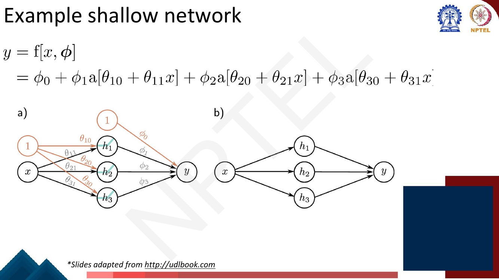
*Fig. — Diagram (a) is the one to study. The orange circles containing "1" are the **bias nodes**: a bias is just a weight on a constant input of 1, which is why $\theta_{10}$ and $\phi_0$ sit on arrows exactly like the other weights. Diagram (b) is the same network drawn the way everyone actually draws it. Page 38.*

That equation is in exactly the form of our translation table:

$$h_d = a\!\left(b^{(1)}_d + W^{(1)}_d x\right) \quad (d = 1,2,3), \qquad y = b^{(2)} + \sum_{d=1}^{3} W^{(2)}_d h_d$$

**Count the parameters.** Three hidden units each need a bias and a weight ($3 \times 2 = 6$); the
output needs a bias and three weights ($4$). Total **10** — the deck states this on page 40 and writes
the set out as $\boldsymbol{\phi} = \{\phi_0,\phi_1,\phi_2,\phi_3,\theta_{10},\theta_{11},\theta_{20},\theta_{21},\theta_{30},\theta_{31}\}$.

Page 40 then repeats the Lec 6 framing without change: the equation is a **family of functions**, the
parameters pick one member out of the family, inference means running the equation forward, and
training means defining a least-squares loss $\mathcal{L}(\theta)$ on a dataset
$\{\mathbf{x}_i, \mathbf{y}_i\}_{i=1}^{I}$ and changing $\theta$ to minimise it. All of that is
[Lec 6](06-supervised-learning.md)'s; nothing about it changes because the model got more complicated.

### The activation function: ReLU

$a(\cdot)$ is the **activation function**. The deck uses one particular choice, the **Rectified Linear
Unit**:

$$a(z) = \mathrm{ReLU}(z) = \begin{cases} 0 & z < 0 \\ z & z \ge 0 \end{cases}$$

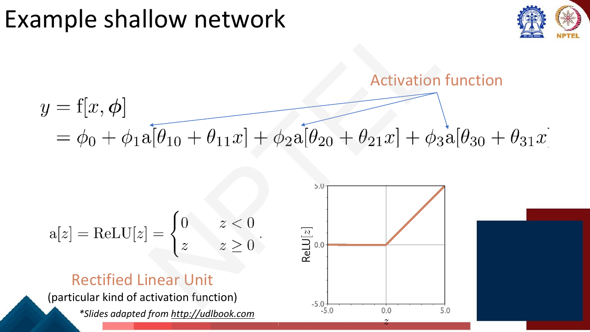
*Fig. — ReLU is itself a two-piece piecewise-linear function with its joint at $z=0$. That single bend is the only non-linearity in the entire network; everything else is addition and multiplication. Page 39.*

Equivalently $a(z) = \max(0, z)$. Two properties are the whole reason it works here:

1. **It is non-linear.** Without it the network would collapse to a single straight line — proved by
   calculation in numerical N4 below.
2. **It is piecewise linear, with exactly one joint, at $z = 0$.** So it bends the function without
   curving it, and you know precisely where the bend is.

The deck says nothing about ReLU's gradient, its failure modes, or the alternatives. Those belong to
[Lec 52](../week-11/52-modern-llms-and-activations.md), which owns the modern catalogue (Leaky ReLU,
GELU, Swish, GLU variants). Here ReLU is a geometric device, not a design choice.

### Hidden units

Page 42 splits the one-line equation into two stages, and this split is the idea of the lecture:

$$y = \phi_0 + \phi_1 h_1 + \phi_2 h_2 + \phi_3 h_3, \qquad \text{where} \quad \begin{aligned} h_1 &= a(\theta_{10} + \theta_{11}x) \\ h_2 &= a(\theta_{20} + \theta_{21}x) \\ h_3 &= a(\theta_{30} + \theta_{31}x) \end{aligned}$$

The $h_d$ are the **hidden units**. "Hidden" because nothing outside the model ever observes them:
they are not inputs you supply and not outputs you read. Note what the second stage is — given the
$h_d$, the output is a *plain linear model* in exactly the sense of Lec 6. **A shallow network is
linear regression performed on features the network invented for itself.** Everything interesting
happens in the first stage, which chooses those features.

### The construction, in four steps

The deck now walks the construction one page at a time. This is the part to reproduce in your head.

**Step 1 — compute three linear functions** (page 43). Three different straight lines of $x$:
$\theta_{10}+\theta_{11}x$, $\theta_{20}+\theta_{21}x$, $\theta_{30}+\theta_{31}x$. Each has its own
intercept and its own slope, so each crosses zero at its own value of $x$. In the deck's example the
first two slope upwards and the third slopes downwards.

**Step 2 — pass each through a ReLU** (page 44). Everywhere a line was negative, it becomes flat zero;
everywhere it was positive, it is untouched. Each line acquires a single bend at the $x$ where it
crossed zero.

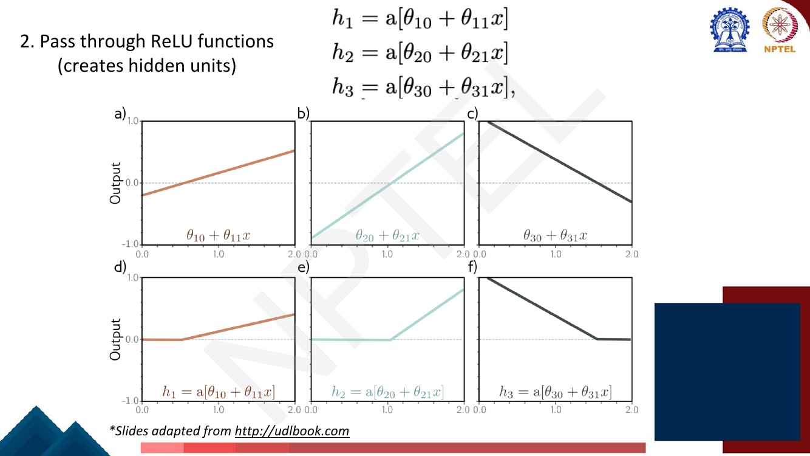
*Fig. — Compare each lower plot to the one above it. The only change is that the negative part has been flattened to zero. $h_1$ and $h_2$ are flat then rising; $h_3$ is falling then flat, because its line had negative slope. The bend sits at a different $x$ for each unit. Page 44.*

**Step 3 — weight the hidden units** (page 45). Multiply $h_d$ by $\phi_d$. Multiplying by a positive
number stretches or shrinks the sloped part; multiplying by a **negative** number flips it over, so a
rising hinge becomes a falling one. The *location* of the bend does not move — $\phi_d$ cannot change
where $h_d$ switches on.

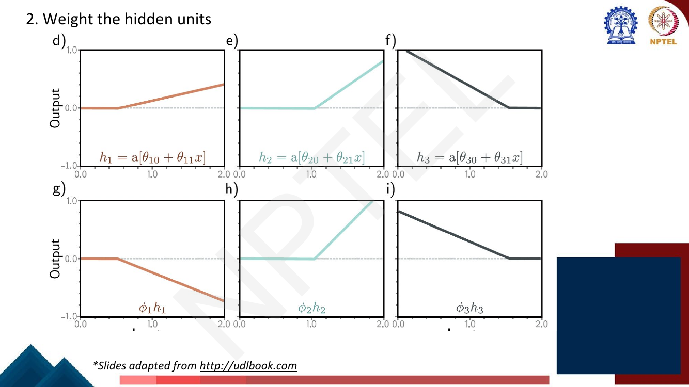
*Fig. — $\phi_1$ is negative here: $h_1$ rose and $\phi_1 h_1$ falls. The kink stays put at the same $x$. This is the division of labour that matters — $\theta$ sets **where** a joint is, $\phi$ sets **how much** the slope changes there. Page 45.*

**Step 4 — sum the weighted hidden units, plus a bias** (page 46). Add the three curves together and
add $\phi_0$. Adding $\phi_0$ shifts the whole result vertically.

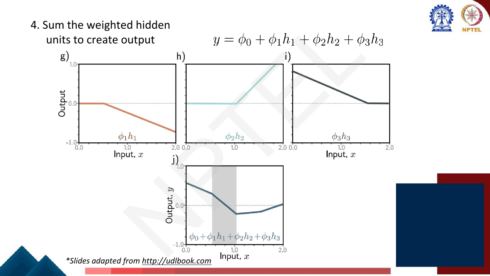
*Fig. — The bottom plot is the network's output. It is continuous — no jumps — but its slope changes abruptly at three places. The shaded band marks one of the linear regions. Page 46.*

### The output is piecewise linear, with one joint per ReLU

Here is the payoff, stated by the deck on page 47: **a shallow network with ReLU computes a piecewise
linear function, with one "joint" per ReLU.**

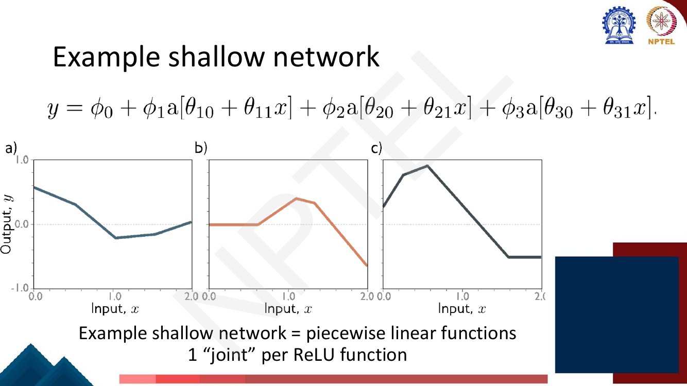
*Fig. — Three parameter settings, three very different shapes, one equation. Count the kinks in each: three (sometimes one falls outside the plotted range or two coincide). Three hidden units, three joints, four straight pieces. Page 47.*

Why, exactly. Fix an $x$. Each hidden unit is in one of two states: **on** (its pre-activation is
positive, so $h_d = b^{(1)}_d + W^{(1)}_d x$) or **off** ($h_d = 0$). Within any range of $x$ over
which no unit changes state, the output is

$$y = b^{(2)} + \sum_{d \,\in\, \text{on}} W^{(2)}_d\!\left(b^{(1)}_d + W^{(1)}_d x\right)$$

which is a sum of linear functions of $x$ — itself linear, with slope
$\sum_{d \in \text{on}} W^{(2)}_d W^{(1)}_d$. So the output is **linear everywhere except where a unit
flips state**. Unit $d$ flips exactly when its pre-activation crosses zero, that is at

$$x_d^{\ast} = -\,\frac{b^{(1)}_d}{W^{(1)}_d}$$

Those $x_d^{\ast}$ are the joints. Three units give three joints and hence (at most) **four linear
regions**. The function is continuous at a joint because ReLU is continuous, but its slope jumps by
$W^{(2)}_d W^{(1)}_d$ as unit $d$ switches on.

Two consequences worth storing:

- $\theta$ (hidden layer) controls **where** the joints are. $\phi$ (output layer) controls **how
  steeply** the slope changes at each one, and the overall vertical offset. Changing $\phi_d$ never
  moves a joint.
- A joint can be pushed outside the input range you care about — the deck's plots often show only two
  visible kinks for three units. The count $H+1$ regions is an **upper bound**.

### Depicting the network as a diagram

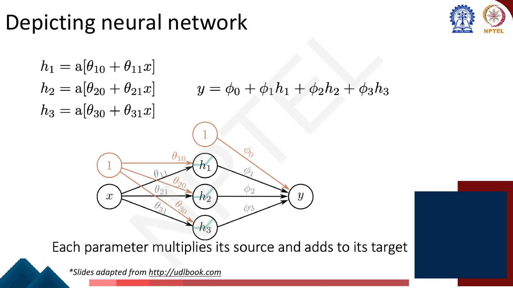
*Fig. — The reading rule, which the deck states explicitly: **each parameter multiplies its source and adds to its target**. Follow $\theta_{21}$: it sits on the arrow from $x$ to $h_2$, so it multiplies $x$ and contributes to $h_2$'s pre-activation. The small coloured hinge drawn inside each $h$ circle is the ReLU. Page 48.*

Every edge is one weight. Every node that is not an input applies its activation function to the sum
arriving at it. There is nothing else in the picture.

### With enough hidden units

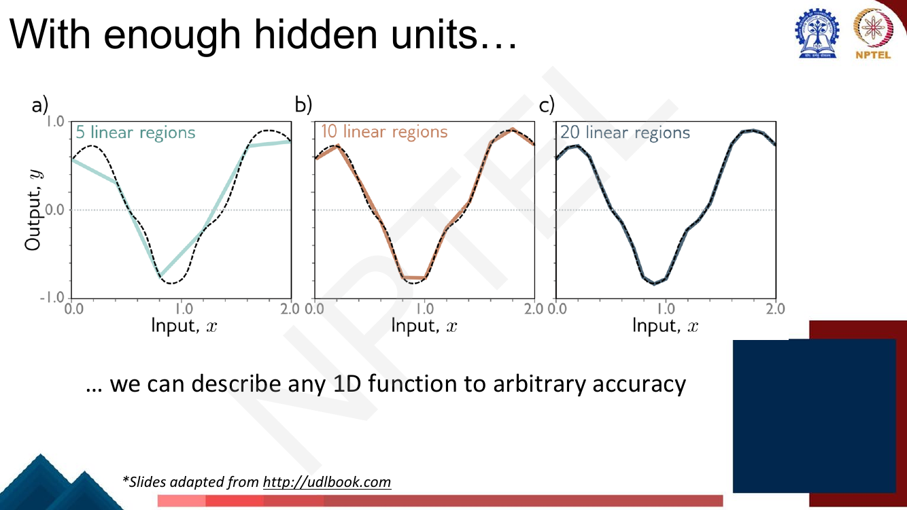
*Fig. — 5, 10, 20 linear regions against the same smooth target. With 20 regions the approximation is visually exact. Those correspond to 4, 9 and 19 hidden units in 1-D. Page 49.*

The argument is a staircase one: any continuous curve on a bounded interval can be traced to within
$\epsilon$ by enough short straight segments, and a shallow network can produce any arrangement of
straight segments. Add units, get more segments, shrink the error. The approximation error does not
plateau — it keeps falling as you add units.

### The Universal Approximation Theorem

The deck gives it in one sentence, quoted exactly (page 50):

> "a formal proof that, with enough hidden units, a shallow neural network can describe any continuous
> function on a compact subset of $\mathbb{R}^D$ to arbitrary precision"

Unpack the three qualifiers, because each is doing work and each is MCQ bait:

| Phrase | What it rules in or out |
|---|---|
| **continuous function** | discontinuous targets are not covered — the network's output is always continuous |
| **compact subset of $\mathbb{R}^D$** | closed and bounded. On an interval like $[0,2]$, yes; on all of $\mathbb{R}$, no |
| **arbitrary precision** | for *any* $\epsilon > 0$ there exists a network with error below $\epsilon$ — not zero error |
| **enough hidden units** | existence only; **no bound on how many** is given |

Now the honest part, which the deck leaves implicit and the exam may well probe. The theorem is an
*existence* result about **representation**. It says a parameter setting exists. It does **not** say:

- **how many hidden units you need.** The required width can grow explosively with the complexity of
  the target function and with the input dimension $D$. "Enough" might mean more units than you can
  store.
- **that gradient descent will find those parameters.** Representability and *learnability* are
  different questions. The loss surface of [Lec 10](10-gradient-descent-and-init.md) is non-convex and
  the optimiser can stop anywhere.
- **that the fitted function will generalise.** A network with enough units to fit any continuous
  function also has enough to fit your training noise exactly. Nothing here bounds test error.
- **that one hidden layer is the efficient way to do it.** This is the gap that
  [Lec 8](08-deep-neural-networks.md) exists to fill. One layer suffices *in principle*; depth is what
  makes it affordable *in practice*, for reasons Lec 8 derives by counting linear regions per
  parameter. Do not take my word for the conclusion — it is Lec 8's to earn.

So UAT is best read as a reassurance that the model class is not secretly too small, and as nothing
more than that.

### More than one output

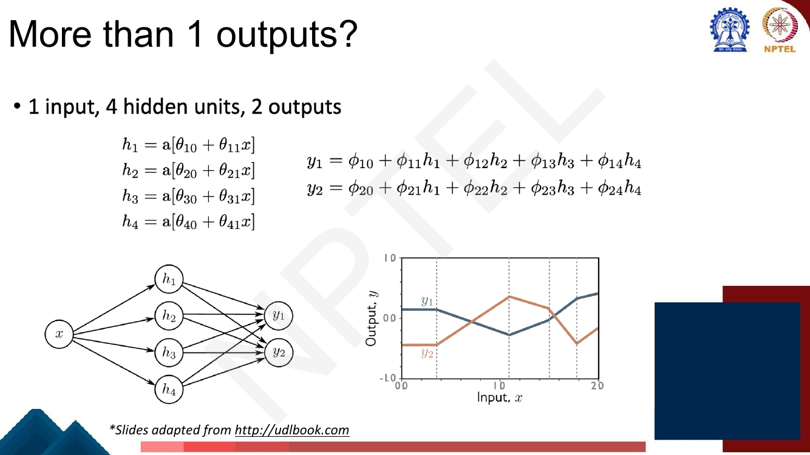
*Fig. — The critical detail is in the plot: the dashed vertical lines are at the **same** $x$ for both curves. $y_1$ and $y_2$ bend in the same places because they are built from the same four hidden units. Only the slope changes at each joint differ. Page 51.*

Nothing new is needed: give each output its own bias and its own set of weights over the *same* hidden
units.

$$y_1 = \phi_{10} + \phi_{11}h_1 + \phi_{12}h_2 + \phi_{13}h_3 + \phi_{14}h_4$$
$$y_2 = \phi_{20} + \phi_{21}h_1 + \phi_{22}h_2 + \phi_{23}h_3 + \phi_{24}h_4$$

**Outputs of one network share their joint locations.** That follows directly from
$x_d^{\ast} = -b^{(1)}_d / W^{(1)}_d$, which mentions only hidden-layer parameters. It is the cheapest
true thing you can say about multi-output networks and a plausible exam question.

### Arbitrary inputs, hidden units and outputs

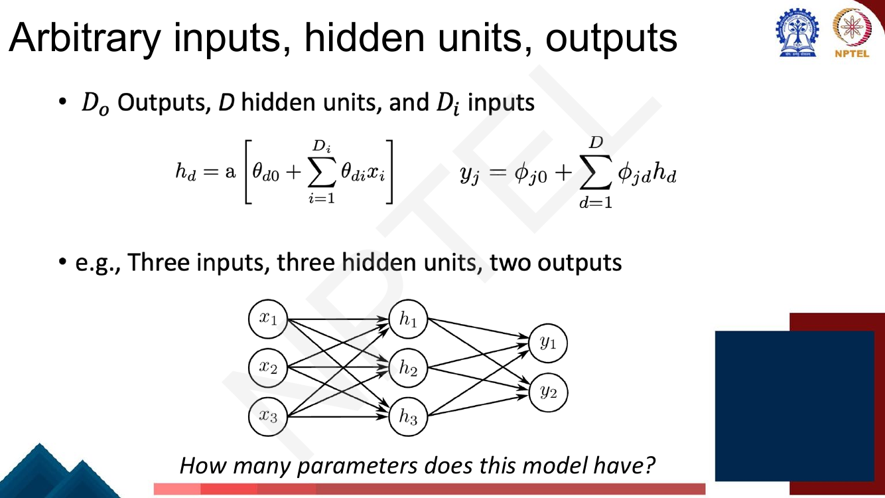
*Fig. — The general form. $D_o$ outputs, $D$ hidden units, $D_i$ inputs. Note the inner sum now runs over inputs, so each hidden unit computes a linear function of the whole input **vector**. The question at the bottom is worked as N3. Page 52.*

$$h_d = a\!\left(\theta_{d0} + \sum_{i=1}^{D_i} \theta_{di} x_i\right), \qquad y_j = \phi_{j0} + \sum_{d=1}^{D} \phi_{jd} h_d$$

In our notation, and in the matrix form you will need from Lec 9 onwards:

$$\mathbf{h} = a\!\left(\mathbf{W}^{(1)}\mathbf{x} + \mathbf{b}^{(1)}\right), \qquad \mathbf{y} = \mathbf{W}^{(2)}\mathbf{h} + \mathbf{b}^{(2)}$$

with $\mathbf{W}^{(1)}$ of shape $D \times D_i$, $\mathbf{b}^{(1)}$ of length $D$, $\mathbf{W}^{(2)}$
of shape $D_o \times D$, $\mathbf{b}^{(2)}$ of length $D_o$. The activation $a(\cdot)$ is applied
**elementwise**. Total parameter count:

$$\underbrace{D(D_i + 1)}_{\text{hidden layer}} + \underbrace{D_o(D + 1)}_{\text{output layer}}$$

With $D_i > 1$ the geometry generalises: each hidden unit's pre-activation is zero on a **hyperplane**
in input space rather than at a point, and the output is piecewise linear over polytope-shaped regions
carved out by those hyperplanes. The $H+1$ region count is specific to one input.

### Regression as the output task

![A pipeline: a house described in words becomes the input vector [6000, 4, 235, 2005, 1], passes through the supervised learning model, emits 340, read back as "Predicted price is $340k"](../../assets/pages/lec07/p-054.png)
*Fig. — The deck's closing summary. Note the two translation steps at the ends — real world to vector, and model number back to a real-world quantity — which are your job, not the network's. The model itself only ever sees $\mathbf{x} \in \mathbb{R}^{D_i}$ and emits $\mathbf{y} \in \mathbb{R}^{D_o}$. Page 54.*

The output layer is a plain weighted sum with **no activation function on it**, so $y_j$ can be any
real number. That is exactly what regression needs, and it is why least squares from Lec 6 is the
natural loss here. Classification needs a squashing function on the output instead; the deck does not
go there in this lecture.

The deck's own summary of what has been built: a model that can "take an arbitrary number of inputs",
"output an arbitrary number of outputs", and "model a function of arbitrary complexity between the
two".

### Nomenclature

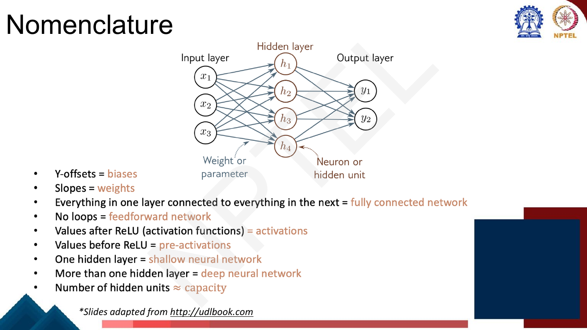
*Fig. — The deck's dedicated vocabulary page. Learn the right-hand column verbatim; this page is a definition MCQ waiting to happen. Page 53.*

| The deck's phrasing | Term |
|---|---|
| Y-offsets | **biases** |
| Slopes | **weights** |
| Everything in one layer connected to everything in the next | **fully connected network** |
| No loops | **feedforward network** |
| Values **after** ReLU (activation functions) | **activations** |
| Values **before** ReLU | **pre-activations** |
| One hidden layer | **shallow neural network** |
| More than one hidden layer | **deep neural network** |
| Number of hidden units | $\approx$ **capacity** |

Plus, from the diagram: **input layer**, **hidden layer**, **output layer**; a node is a **neuron** or
**hidden unit**; an edge is a **weight** or **parameter**.

Three of these are routinely confused. **Pre-activation is before the non-linearity, activation is
after.** **Shallow means exactly one hidden layer** — not "small". And **capacity** is the deck's word
for how complicated a function the model can express, which it ties (approximately) to the number of
hidden units, not to the number of layers.

> You met this material from a vision angle in the companion course:
> [the perceptron](../../../GenAIforCV/notes/week-02/07-perceptron.md) and
> [MLPs and activations](../../../GenAIforCV/notes/week-02/08-mlp-and-activations.md). The mechanics
> are the same. What is new here is the piecewise-linear geometry above, which that course does not
> build — and this lecturer's notation, which the exam uses.

## Worked numericals

### N1. Evaluate the three-hidden-unit shallow network by hand

**Given:** a 1-input, 3-hidden-unit, 1-output ReLU network with

$$h_1 = a(-1 + 2x), \quad h_2 = a(-2 + 2x), \quad h_3 = a(3 - 2x), \qquad y = 0.5 - 2h_1 + 3h_2 + 2h_3$$

So $\theta_{10}=-1, \theta_{11}=2$; $\theta_{20}=-2, \theta_{21}=2$; $\theta_{30}=3, \theta_{31}=-2$;
$\phi_0=0.5, \phi_1=-2, \phi_2=3, \phi_3=2$. (Ten parameters, as page 40 says.)

**Find:** $y$ at $x = 0, 0.25, \ldots, 2$; the joint locations; and the slope in each linear region.

**Step 1 — the three pre-activations and activations.** Compute $z_d$, then clamp negatives to 0.

Take $x = 0.75$ in full: $z_1 = -1 + 2(0.75) = 0.5$; $z_2 = -2 + 1.5 = -0.5$; $z_3 = 3 - 1.5 = 1.5$.
ReLU: $h_1 = 0.5$, $h_2 = 0$ (negative, clamped), $h_3 = 1.5$.

**Step 2 — weight and sum.**
$y = 0.5 + (-2)(0.5) + (3)(0) + (2)(1.5) = 0.5 - 1 + 0 + 3 = 2.5$.

**Step 3 — tabulate.**

| $x$ | $z_1$ | $z_2$ | $z_3$ | $h_1$ | $h_2$ | $h_3$ | $y$ |
|---|---|---|---|---|---|---|---|
| 0.00 | $-1.0$ | $-2.0$ | $3.0$ | 0 | 0 | 3.0 | **6.50** |
| 0.25 | $-0.5$ | $-1.5$ | $2.5$ | 0 | 0 | 2.5 | **5.50** |
| 0.50 | $0.0$ | $-1.0$ | $2.0$ | 0 | 0 | 2.0 | **4.50** |
| 0.75 | $0.5$ | $-0.5$ | $1.5$ | 0.5 | 0 | 1.5 | **2.50** |
| 1.00 | $1.0$ | $0.0$ | $1.0$ | 1.0 | 0 | 1.0 | **0.50** |
| 1.25 | $1.5$ | $0.5$ | $0.5$ | 1.5 | 0.5 | 0.5 | **0.00** |
| 1.50 | $2.0$ | $1.0$ | $0.0$ | 2.0 | 1.0 | 0 | **$-0.50$** |
| 1.75 | $2.5$ | $1.5$ | $-0.5$ | 2.5 | 1.5 | 0 | **0.00** |
| 2.00 | $3.0$ | $2.0$ | $-1.0$ | 3.0 | 2.0 | 0 | **0.50** |

**Step 4 — the joints.** Unit $d$ switches at $x_d^{\ast} = -\theta_{d0}/\theta_{d1}$:

- $x_1^{\ast} = -(-1)/2 = \mathbf{0.5}$  ($h_1$ switches **on**)
- $x_2^{\ast} = -(-2)/2 = \mathbf{1.0}$  ($h_2$ switches **on**)
- $x_3^{\ast} = -3/(-2) = \mathbf{1.5}$  ($h_3$ switches **off** — its weight is negative, so it runs the other way)

**Step 5 — the four slopes.** In each region, slope $= \sum_{d \in \text{on}} \phi_d \theta_{d1}$:

| Region | Units on | Slope |
|---|---|---|
| $x < 0.5$ | $h_3$ | $(2)(-2) = -4$ |
| $0.5 < x < 1.0$ | $h_1, h_3$ | $(-2)(2) + (2)(-2) = -8$ |
| $1.0 < x < 1.5$ | $h_1, h_2, h_3$ | $-4 + (3)(2) + (-4) = -2$ |
| $x > 1.5$ | $h_1, h_2$ | $-4 + 6 = +2$ |

Check against the table: from $x=0$ to $0.5$, $y$ falls $6.5 \to 4.5$, a drop of 2 over 0.5, slope
$-4$ ✓. From 0.5 to 1.0, $4.5 \to 0.5$, slope $-8$ ✓. From 1.0 to 1.5, $0.5 \to -0.5$, slope $-2$ ✓.
From 1.5 to 2.0, $-0.5 \to 0.5$, slope $+2$ ✓.

**Answer:** joints at $x = 0.5, 1.0, 1.5$; four linear regions with slopes $-4, -8, -2, +2$; $y$ runs
$6.5 \to 4.5 \to 0.5 \to -0.5 \to 0.5$ at the joints. Three ReLUs, three joints, four pieces — exactly
the deck's claim on page 47.

### N2. How many linear regions can a shallow network produce in 1-D?

**Given:** one input, $H$ hidden units, ReLU activations.
**Find:** the maximum number of linear regions of the output function.

1. Each hidden unit contributes **one** joint, at $x_d^{\ast} = -b^{(1)}_d / W^{(1)}_d$ — one, because
   ReLU has exactly one bend.
2. $H$ distinct points on the real line cut it into $H + 1$ intervals. (Zero cuts give 1 interval, one
   cut gives 2, and each further cut adds exactly 1.)
3. So the output has at most $\mathbf{H + 1}$ linear regions.
4. "At most", because joints coincide if two units have the same $-b/W$ ratio, and a unit with
   $W^{(1)}_d = 0$ contributes no joint at all.

| $H$ | Max regions |
|---|---|
| 1 | 2 |
| 3 | 4 |
| 4 | 5 |
| 9 | 10 |
| 10 | 11 |
| 19 | 20 |
| 100 | 101 |

**Answer:** $H+1$. Reading the deck's page 49 backwards, its "5 / 10 / 20 linear regions" plots were
produced by shallow networks with **4, 9 and 19** hidden units.

### N3. Parameter count — including the deck's own question (page 52)

**Given:** the general shallow network, $D_i$ inputs, $D$ hidden units, $D_o$ outputs, biases included.
**Find:** the total parameter count, then the deck's specific case.

1. Hidden layer: each of the $D$ units takes $D_i$ weights (one per input) plus 1 bias
   $\Rightarrow D(D_i + 1)$.
2. Output layer: each of the $D_o$ outputs takes $D$ weights (one per hidden unit) plus 1 bias
   $\Rightarrow D_o(D + 1)$.
3. Total: $\;D(D_i + 1) + D_o(D + 1)$.

**The deck's question**, page 52: three inputs, three hidden units, two outputs.

4. Hidden: $3 \times (3 + 1) = 3 \times 4 = 12$.
5. Output: $2 \times (3 + 1) = 2 \times 4 = 8$.
6. Total $= 12 + 8 = \mathbf{20}$.

Two more, as checks on the formula:

| Network ($D_i$–$D$–$D_o$) | Hidden | Output | Total |
|---|---|---|---|
| 1–3–1 (deck, page 38) | $3 \times 2 = 6$ | $1 \times 4 = 4$ | **10** ✓ matches page 40 |
| 1–4–2 (deck, page 51) | $4 \times 2 = 8$ | $2 \times 5 = 10$ | **18** |
| 3–3–2 (deck, page 52) | 12 | 8 | **20** |

**Answer:** $D(D_i+1) + D_o(D+1)$; for the page-52 network, **20 parameters**. The deck poses the
question but does not print an answer, so this is ours to defend — and the 1–3–1 row, which the deck
*does* answer (10), confirms the formula.

### N4. Delete the ReLU and the network collapses to one straight line

**Given:** the N1 network, with $a(z) = z$ (identity) instead of ReLU.
**Find:** the resulting function; compare with N1 at $x = 0, 1, 2$.

1. With no non-linearity, $h_d = \theta_{d0} + \theta_{d1}x$ directly, so
   $y = \phi_0 + \sum_d \phi_d(\theta_{d0} + \theta_{d1}x)$.
2. Group the constant and the $x$ terms:
   $y = \underbrace{\left(\phi_0 + \sum_d \phi_d\theta_{d0}\right)}_{\text{intercept}} + \underbrace{\left(\sum_d \phi_d\theta_{d1}\right)}_{\text{slope}} x$.
3. Intercept: $0.5 + (-2)(-1) + (3)(-2) + (2)(3) = 0.5 + 2 - 6 + 6 = \mathbf{2.5}$.
4. Slope: $(-2)(2) + (3)(2) + (2)(-2) = -4 + 6 - 4 = \mathbf{-2}$.
5. So the whole 10-parameter network is just $y = 2.5 - 2x$ — a **two**-parameter straight line.

| $x$ | with ReLU (N1) | without ReLU |
|---|---|---|
| 0 | 6.5 | 2.5 |
| 1 | 0.5 | 0.5 |
| 2 | 0.5 | $-1.5$ |

6. They agree at $x=1$ by coincidence and disagree everywhere else. The ReLU version has four
   different slopes; the linear version has one.

**Answer:** without the activation function the network computes $y = 2.5 - 2x$, a single line.
Generally, a composition of linear maps is linear — stacking layers without a non-linearity buys you
**nothing** in expressive power, only redundant parameters. This is the single most important reason
the activation function is there, and it is why [Lec 8](08-deep-neural-networks.md)'s depth argument
also depends on it.

### N5. A two-output network, and why its outputs share their joints

**Given:** one input, two hidden units, two outputs:
$h_1 = a(-1 + x)$, $h_2 = a(2 - x)$;
$y_1 = 1 + 2h_1 + h_2$, $y_2 = -1 - h_1 + 3h_2$.
**Find:** both outputs at $x = 0, 1, 2, 3$, and all joint locations.

1. Joints: $x_1^{\ast} = -(-1)/1 = 1$; $x_2^{\ast} = -2/(-1) = 2$. Two units, two joints.
2. $x=0$: $z = (-1, 2) \Rightarrow h = (0, 2)$. $y_1 = 1 + 0 + 2 = \mathbf{3}$;
   $y_2 = -1 - 0 + 6 = \mathbf{5}$.
3. $x=1$: $z = (0, 1) \Rightarrow h = (0, 1)$. $y_1 = 1 + 0 + 1 = \mathbf{2}$;
   $y_2 = -1 - 0 + 3 = \mathbf{2}$.
4. $x=2$: $z = (1, 0) \Rightarrow h = (1, 0)$. $y_1 = 1 + 2 + 0 = \mathbf{3}$;
   $y_2 = -1 - 1 + 0 = \mathbf{-2}$.
5. $x=3$: $z = (2, -1) \Rightarrow h = (2, 0)$. $y_1 = 1 + 4 + 0 = \mathbf{5}$;
   $y_2 = -1 - 2 + 0 = \mathbf{-5}$.
6. Slopes of $y_1$: before $x=1$ only $h_2$ on, slope $(1)(-1) = -1$; between 1 and 2 both on,
   $(2)(1) + (1)(-1) = +1$; after 2 only $h_1$, $(2)(1) = +2$.
7. Slopes of $y_2$: $(3)(-1) = -3$; then $(-1)(1) + (3)(-1) = -4$; then $(-1)(1) = -1$.

**Answer:** $y_1 = 3, 2, 3, 5$ and $y_2 = 5, 2, -2, -5$ at $x = 0,1,2,3$. Both outputs bend at
**$x=1$ and $x=2$ and nowhere else**, even though their slope sequences ($-1, +1, +2$ versus
$-3, -4, -1$) are completely different. Joint positions depend only on the hidden layer, which the
outputs share. Parameter count check: $2(1+1) + 2(2+1) = 4 + 6 = 10$.

## Code

```python
import numpy as np

# --- the exact network of N1 -------------------------------------------
# hidden layer: 1 input -> 3 units.  W1[j], b1[j] give pre-activation z_j
W1 = np.array([ 2.0,  2.0, -2.0])     # hidden weights  (deck: theta_11, theta_21, theta_31)
b1 = np.array([-1.0, -2.0,  3.0])     # hidden biases   (deck: theta_10, theta_20, theta_30)
W2 = np.array([-2.0,  3.0,  2.0])     # output weights  (deck: phi_1, phi_2, phi_3)
b2 = 0.5                              # output bias     (deck: phi_0)

def forward(x):
    z = b1 + W1 * x            # 1. compute three linear functions
    h = np.maximum(z, 0.0)     # 2. pass through ReLU -> hidden units
    return b2 + W2 @ h, z, h   # 3. weight them, 4. sum (+ bias)

print("   x |      z1     z2     z3 |     h1     h2     h3 |      y")
for x in np.arange(0, 2.01, 0.25):
    y, z, h = forward(x)
    print(f"{x:4.2f} | {z[0]:6.2f} {z[1]:6.2f} {z[2]:6.2f} |"
          f" {h[0]:6.2f} {h[1]:6.2f} {h[2]:6.2f} | {y:6.2f}")

# joints: where each pre-activation crosses zero, x = -b1/W1
print("\njoints at x =", -b1 / W1)

# slope in each region = sum of W2[d]*W1[d] over the units that are ON
for lo, hi in [(0, .5), (.5, 1.), (1., 1.5), (1.5, 2.)]:
    on = (b1 + W1 * ((lo + hi) / 2)) > 0
    print(f"  region ({lo},{hi}): units on = {np.flatnonzero(on) + 1},"
          f" slope = {float(W2[on] @ W1[on]):+.1f}")

# --- N4: delete the ReLU and the whole network collapses to one line ----
lin_slope, lin_icpt = float(W2 @ W1), b2 + float(W2 @ b1)
print(f"\nno-ReLU network is the single line y = {lin_icpt} + {lin_slope}*x")
for x in (0.0, 1.0, 2.0):
    print(f"  x={x}:  with ReLU {forward(x)[0]:6.2f}   without {lin_icpt + lin_slope*x:6.2f}")
```

Printed output:

```text
   x |      z1     z2     z3 |     h1     h2     h3 |      y
0.00 |  -1.00  -2.00   3.00 |   0.00   0.00   3.00 |   6.50
0.25 |  -0.50  -1.50   2.50 |   0.00   0.00   2.50 |   5.50
0.50 |   0.00  -1.00   2.00 |   0.00   0.00   2.00 |   4.50
0.75 |   0.50  -0.50   1.50 |   0.50   0.00   1.50 |   2.50
1.00 |   1.00   0.00   1.00 |   1.00   0.00   1.00 |   0.50
1.25 |   1.50   0.50   0.50 |   1.50   0.50   0.50 |   0.00
1.50 |   2.00   1.00   0.00 |   2.00   1.00   0.00 |  -0.50
1.75 |   2.50   1.50  -0.50 |   2.50   1.50   0.00 |   0.00
2.00 |   3.00   2.00  -1.00 |   3.00   2.00   0.00 |   0.50

joints at x = [0.5 1.  1.5]
  region (0,0.5): units on = [3], slope = -4.0
  region (0.5,1.0): units on = [1 3], slope = -8.0
  region (1.0,1.5): units on = [1 2 3], slope = -2.0
  region (1.5,2.0): units on = [1 2], slope = +2.0

no-ReLU network is the single line y = 2.5 + -2.0*x
  x=0.0:  with ReLU   6.50   without   2.50
  x=1.0:  with ReLU   0.50   without   0.50
  x=2.0:  with ReLU   0.50   without  -1.50
```

Every number matches N1 and N4 by hand. Now plot it, because the shape is the point:

```python
xs = np.arange(0, 2.0001, 0.025)
ys = np.array([forward(x)[0] for x in xs])
rows, lo, hi = 19, ys.min(), ys.max()
grid = [[" "] * len(xs) for _ in range(rows)]
for c, y in enumerate(ys):                       # one column per x, one row per y-bin
    grid[int(round((hi - y) / (hi - lo) * (rows - 1)))][c] = "*"
for r, line in enumerate(grid):
    print(f"{hi - r*(hi-lo)/(rows-1):6.2f} |" + "".join(line).rstrip())
print("       +" + "-" * len(xs))
print("        0.0" + " "*17 + "0.5" + " "*17 + "1.0" + " "*17 + "1.5" + " "*17 + "2.0   x")
```

```text
  6.50 |**
  6.11 |  ****
  5.72 |      ****
  5.33 |          ****
  4.94 |              ****
  4.56 |                  ***
  4.17 |                     **
  3.78 |                       **
  3.39 |                         **
  3.00 |                           **
  2.61 |                             **
  2.22 |                               **
  1.83 |                                 **
  1.44 |                                   **
  1.06 |                                     **
  0.67 |                                       **                                       *
  0.28 |                                         ********                       ********
 -0.11 |                                                 ********       ********
 -0.50 |                                                         *******
       +---------------------------------------------------------------------------------
        0.0                 0.5                 1.0                 1.5                 2.0   x
```

Four straight runs with three bends, at $x = 0.5$ (the fall steepens), $x = 1.0$ (it flattens to
slope $-2$), and $x = 1.5$ (it turns upward). That is page 46's bottom plot, reproduced from scratch
with ten numbers.

## Exam pack

### Must-memorise

| Item | Exactly this |
|---|---|
| Example shallow network (deck form) | $y = \phi_0 + \phi_1 a[\theta_{10}+\theta_{11}x] + \phi_2 a[\theta_{20}+\theta_{21}x] + \phi_3 a[\theta_{30}+\theta_{31}x]$ |
| Two-stage form | $h_d = a(\theta_{d0}+\theta_{d1}x)$; $\;y = \phi_0 + \sum_d \phi_d h_d$ |
| ReLU | $a(z) = \mathrm{ReLU}(z) = 0$ if $z<0$, $z$ if $z \ge 0$; equivalently $\max(0,z)$ |
| General form | $h_d = a\big(\theta_{d0}+\sum_{i=1}^{D_i}\theta_{di}x_i\big)$, $\;y_j = \phi_{j0}+\sum_{d=1}^{D}\phi_{jd}h_d$ |
| Matrix form | $\mathbf{h} = a(\mathbf{W}^{(1)}\mathbf{x}+\mathbf{b}^{(1)})$, $\;\mathbf{y} = \mathbf{W}^{(2)}\mathbf{h}+\mathbf{b}^{(2)}$ |
| Parameter count | $D(D_i+1) + D_o(D+1)$ |
| Joint location of unit $d$ | $x_d^{\ast} = -\,b^{(1)}_d / W^{(1)}_d$ |
| Slope in a region | $\sum_{d \in \text{on}} W^{(2)}_d W^{(1)}_d$ |
| Regions in 1-D | at most $H+1$ for $H$ hidden units — **1 joint per ReLU** |
| Universal Approximation Theorem | "with enough hidden units, a shallow neural network can describe any **continuous** function on a **compact subset of $\mathbb{R}^D$** to **arbitrary precision**" |
| What UAT does not give | a width bound, a guarantee that training finds it, or any generalisation claim |
| Shallow vs deep | one hidden layer = shallow; more than one = deep |
| Pre-activation / activation | before / after the activation function |
| Fully connected / feedforward | everything in a layer connects to everything in the next / no loops |
| Capacity | $\approx$ number of hidden units |
| Biases / weights | Y-offsets / slopes |
| Diagram reading rule | each parameter multiplies its source and adds to its target |

### Numbers worth knowing

| Quantity | Value |
|---|---|
| Deck's example network | 1 input, **3** hidden units, 1 output |
| Its parameter count (page 40) | **10** |
| Its joint count / linear regions | 3 joints, **4** regions |
| Multi-output example (page 51) | 1 input, **4** hidden units, **2** outputs → 18 parameters |
| General-form example (page 52) | 3 inputs, 3 hidden units, 2 outputs → **20** parameters |
| Approximation plots (page 49) | **5 / 10 / 20** linear regions (i.e. 4 / 9 / 19 hidden units) |
| Joints per ReLU unit | exactly **1** |
| ReLU's own joint | at $z = 0$ |
| Regression example (page 54) | input $[6000, 4, 235, 2005, 1]$ → output $[340]$, i.e. \$340k |
| Source text | Prince, *Understanding Deep Learning*, **Chapter 3** |

### Likely MCQ traps

- **"Shallow means few hidden units."** No. **Shallow = exactly one hidden layer**, regardless of
  width. A one-layer network with 10,000 units is still shallow.
- **"$H$ hidden units give $H$ linear regions."** No — $H$ **joints**, hence up to $H+1$ **regions**.
  Off-by-one is the designed trap. Page 49's "20 linear regions" means 19 units.
- **"Each ReLU adds two joints."** One. ReLU has a single bend.
- **"Changing the output weights $\phi_d$ moves the joints."** It cannot. Joints are
  $-\theta_{d0}/\theta_{d1}$ — hidden-layer parameters only. $\phi_d$ changes the slope *change* at a
  joint and can flip a hinge upside down.
- **"UAT says a shallow network is as good as a deep one."** It says a shallow network can
  *represent* the function. It is silent on how many units that needs, on whether training will find
  them, and on generalisation — which is exactly why [Lec 8](08-deep-neural-networks.md) exists.
- **"UAT applies to any function."** **Continuous** functions on a **compact** (closed and bounded)
  subset of $\mathbb{R}^D$. Not discontinuous ones, not unbounded domains.
- **"Pre-activation = the output of the activation function."** Backwards. Pre-activation is the
  weighted sum *before* $a(\cdot)$; activation is the value *after*.
- **Forgetting the biases in a parameter count.** $D \cdot D_i + D_o \cdot D$ is wrong. The correct
  count is $D(D_i+1) + D_o(D+1)$.
- **"Without an activation function the network is still non-linear because it has layers."** No — it
  collapses to a single affine function (N4).
- **"The output layer also applies ReLU."** In this regression setup it does **not**. The output is a
  plain weighted sum, free to be negative.
- **"Different outputs of a multi-output network bend in different places."** They share the hidden
  layer, so they share all joint locations.
- **$\phi$ versus $\theta$ on the slide.** $\theta$ with a double subscript is a *hidden*-layer
  parameter; $\phi$ is an *output*-layer one. Bold $\boldsymbol{\phi}$ means the whole collection.

### Self-test

1. A shallow network has 1 input, 7 hidden ReLU units and 1 output. How many joints and how many
   linear regions can its output have, at most?
2. Give the total parameter count for a network with $D_i = 5$, $D = 10$, $D_o = 3$.
3. $h = a(-4 + 2x)$. At which $x$ does this unit switch on, and what is $h$ at $x = 1$ and $x = 5$?
4. State the Universal Approximation Theorem and two things it does **not** guarantee.
5. In the deck's nomenclature, what is the name for the values *before* the activation function? And
   for a network with no loops?
6. A network has $h_1 = a(x - 1)$, $h_2 = a(1 - x)$ and $y = 3 + h_1 + h_2$. Sketch-free: what is
   $y$ at $x = -1, 1, 3$, and how many linear regions does $y$ have?
7. You double every output weight $\phi_d$ and leave $\theta$ alone. What happens to the joint
   locations? To the slopes?
8. Why does a network with identity activations have exactly the same expressive power as linear
   regression?
9. The deck's page-49 middle plot is labelled "10 linear regions". How many hidden units produced it?
10. Two outputs $y_1, y_2$ of one shallow network are plotted against $x$. What must be true about
    where they bend, and why?

<details><summary>Answers</summary>

1. 7 joints, at most 8 linear regions ($H+1$).
2. $10(5+1) + 3(10+1) = 60 + 33 = \mathbf{93}$.
3. Switches on at $x = -(-4)/2 = 2$. At $x=1$: $z = -2$, so $h = 0$. At $x=5$: $z = 6$, so $h = 6$.
4. "With enough hidden units, a shallow neural network can describe any continuous function on a
   compact subset of $\mathbb{R}^D$ to arbitrary precision." It does not say how many units are
   needed, does not guarantee gradient descent finds them, and says nothing about generalisation to
   unseen data. (Nor does it say one layer is *efficient* — see Lec 8.)
5. **Pre-activations**; a **feedforward network**.
6. $x=-1$: $h=(0,2)$, $y = 5$. $x=1$: $h=(0,0)$, $y = 3$. $x=3$: $h=(2,0)$, $y = 5$. Both joints are
   at $x=1$, so they coincide — only **2** linear regions, not 3. (This is the "at most $H+1$" caveat;
   the function is $y = 3 + |x-1|$.)
7. Joints do not move at all. Every slope change doubles, so the function keeps its kink positions and
   gets steeper everywhere relative to the $\phi_0$ offset.
8. A composition of affine maps is affine: $\mathbf{W}^{(2)}(\mathbf{W}^{(1)}\mathbf{x}+\mathbf{b}^{(1)})+\mathbf{b}^{(2)} = (\mathbf{W}^{(2)}\mathbf{W}^{(1)})\mathbf{x} + (\mathbf{W}^{(2)}\mathbf{b}^{(1)}+\mathbf{b}^{(2)})$, which is a single linear model.
9. 9 hidden units ($H+1 = 10$).
10. They must bend at exactly the same $x$ values, because joint locations are
    $-\theta_{d0}/\theta_{d1}$ — functions of the shared hidden layer only. Their slopes between
    joints will generally differ.

</details>

## Beyond the slides

**Gap:** The deck states UAT but never says where it comes from or how old it is.
**Why it matters:** The theorem is due to Cybenko (1989, for sigmoidal activations) and Hornik (1991,
for a broad class of activations); the ReLU case follows from the same machinery. Knowing it is a
1989–91 result reframes it: universal approximation was proved *before* anyone could train these
networks usefully, which is precisely why representability and learnability must be kept separate in
your head. A date-or-author MCQ is cheap to set.

**Gap:** Nothing is said about what happens when $D_i > 1$ — the piecewise-linear picture is only ever
drawn in 1-D.
**Why it matters:** With $D_i$ inputs, each hidden unit's "joint" is the hyperplane
$\mathbf{W}^{(1)}_d\!\cdot\mathbf{x} + b^{(1)}_d = 0$, and $H$ hyperplanes carve input space into
convex polytopes, on each of which the output is a different affine function. The count is no longer
$H+1$ but at most $\sum_{k=0}^{D_i}\binom{H}{k}$ — much larger. Lec 8 compares shallow and deep
networks on exactly this quantity, so having the right mental picture now will save you there.

**Gap:** The deck never notes that a ReLU network's output is **continuous but not differentiable at
the joints**.
**Why it matters:** The derivative of ReLU is undefined at exactly $z=0$. Every framework resolves
this by convention — PyTorch defines $\mathrm{ReLU}'(0) = 0$ — and that convention is what makes
[Lec 9](09-backpropagation.md)'s backward pass well-defined. If an exam asks for $\partial y/\partial x$
at a joint, the honest answer is "undefined; by convention the left derivative is used".

**Gap:** Hidden units can be permanently dead, and parameterisations are massively redundant.
**Why it matters:** If a unit's pre-activation is negative over the whole data range it contributes
nothing and its joint is invisible — so a 100-unit network may behave like a 60-unit one. Separately,
any permutation of the hidden units gives an identical function, so the loss surface has many
equivalent minima. Both facts bear on initialization, which is
[Lec 10](10-gradient-descent-and-init.md)'s subject.

## Cut from the slides

Pages 34, 35, 55 and 56 are the title slide, the three-bullet outline, the references page (Prince,
*Understanding Deep Learning*, Chapter 3) and a blank — the reference is folded into the notation
section above. Page 36 is a verbatim recap of 1-D linear-regression training by gradient descent,
which [Lec 6](06-supervised-learning.md) owns and [Lec 10](10-gradient-descent-and-init.md) develops;
it is compressed to one sentence here rather than re-taught. Page 43 (step 1, three bare straight
lines) is folded into the page-44 figure, which shows the same three lines *and* their ReLUs, so
nothing is lost. Pages 40 and 41 restate the Lec 6 training loop — family of functions, loss,
minimise — against the new model; only the parts that are genuinely new (the 10-parameter set, the
"family of functions" plots) are kept. Page 47 repeats the page-41 plots with the piecewise-linear
caption; shown once. The deck contains no "Try this problem" page, but page 52 ends with the
lecturer's question "How many parameters does this model have?" and gives no answer — that is worked
in full as N3. Nothing conceptual from pages 37–54 has been dropped.
