# Lec 8 — Deep Neural Networks

> **Source:** `Week2.pdf` pp. 57–82 · **Week 2** · **Playlist:** Lec 8
> **Prereqs:** [Lec 7 — Shallow Neural Networks](07-shallow-neural-networks.md)
> **Feeds into:** [Lec 9 — Backpropagation](09-backpropagation.md), [Lec 21 — Intro to Transformers](../week-05/21-intro-to-transformers.md)

## Why this lecture exists

[Lec 7](07-shallow-neural-networks.md) ended on an awkward note. The universal approximation theorem
says a network with **one** hidden layer can approximate any continuous function to any accuracy, given
enough hidden units. If one layer is enough in principle, every deep network ever trained is a waste of
effort — you could flatten it and lose nothing.

This lecture answers that. The answer is not about what a network *can* represent; both shallow and
deep networks represent everything. It is about what a network can represent **per parameter**. A deep
ReLU network carves its input space into exponentially more linear regions than a shallow one with the
same parameter budget, because each layer folds the space the previous layer produced, so regions
*multiply* with depth where they only *add* with width. That single argument is the whole lecture, and
it is the most examinable thing in Week 2.

## The ideas

### A note on notation

This deck follows Prince's *Understanding Deep Learning*, which uses **two** Greek letters at once:
$\theta$ for **hidden-layer** parameters, $\phi$ for **output-layer** parameters, and bold
$\boldsymbol{\phi}$ for the whole collection. Substituting blindly would destroy that distinction, so
(matching [Lec 7](07-shallow-neural-networks.md)) the deck's symbols are kept wherever its equations are
reproduced, and the contract's $f(\mathbf{x};\theta)$, $\mathbf{W}^{(l)}$, $\mathbf{b}^{(l)}$ is used
elsewhere.

| Deck's symbol | What it is | Our symbol |
|---|---|---|
| $\theta_{j0},\ \theta_{j1}$ | bias and weight of hidden unit $j$, layer 1 | $b^{(1)}_j$, $W^{(1)}_{j1}$ |
| $\phi_0,\ \phi_j$ | output bias and output weights | $b^{(2)}$, $W^{(2)}_{1j}$ |
| $\boldsymbol{\phi}$ (bold) | the entire parameter collection | $\theta$ |
| $\psi_{j0},\ \psi_{jk}$ | layer-2 bias and weights of the **combined** network | $b^{(2)}_j$, $W^{(2)}_{jk}$ |
| $\boldsymbol{\beta}_k$, $\boldsymbol{\Omega}_k$ | bias **vector**, weight **matrix** of layer $k$ | $\mathbf{b}^{(k+1)}$, $\mathbf{W}^{(k+1)}$ |
| $\mathrm{a}[\cdot]$ | the activation function (ReLU here) | $\sigma(\cdot)$ |

Standing convention: layer $l$ computes the **pre-activation**
$\mathbf{z}^{(l)} = \mathbf{W}^{(l)}\mathbf{a}^{(l-1)} + \mathbf{b}^{(l)}$ and the **activation**
$\mathbf{a}^{(l)} = \sigma(\mathbf{z}^{(l)})$, with $\mathbf{a}^{(0)} = \mathbf{x}$.

### What "deep" means, and the puzzle

A **deep neural network** is a network with **more than one hidden layer**. Nothing else changes: same
ReLU units, same linear-combine-then-activate recipe as [Lec 7](07-shallow-neural-networks.md).

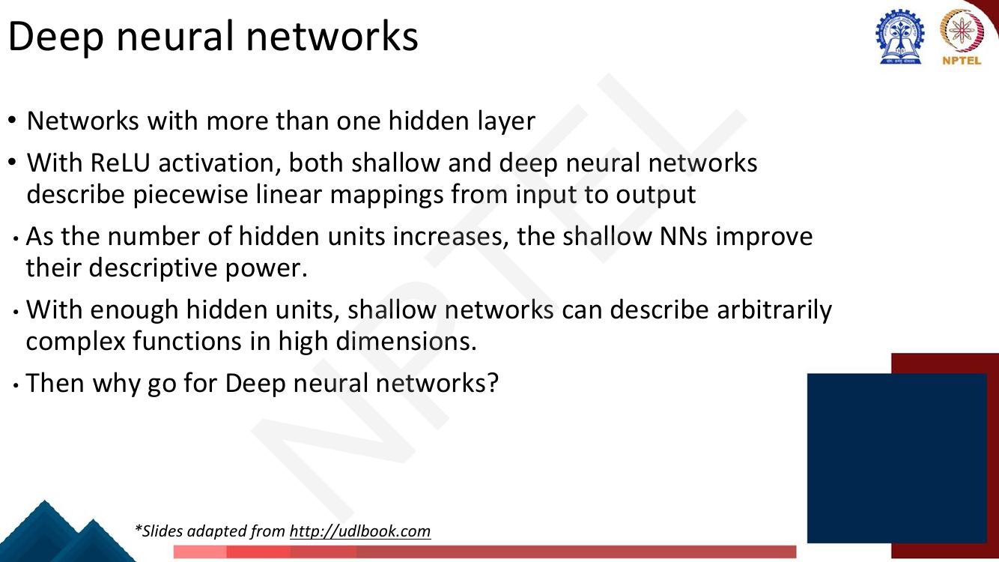
*Fig. — Read the last two bullets together: the deck concedes the shallow case is sufficient before arguing that it is not efficient. Page 59.*

Four facts, all exam-ready. (1) With ReLU, **both shallow and deep networks describe piecewise linear
mappings** — depth does not buy curves, it buys more pieces. (2) A shallow network's descriptive power
grows with its hidden units. (3) With enough units a shallow network describes arbitrarily complex
functions in high dimensions — the universal approximation theorem, derived in
[Lec 7](07-shallow-neural-networks.md). (4) So **why go deep?** The deck's answer, before it is
justified: *deep networks can produce many more linear regions than shallow networks **for the same
number of parameters***.

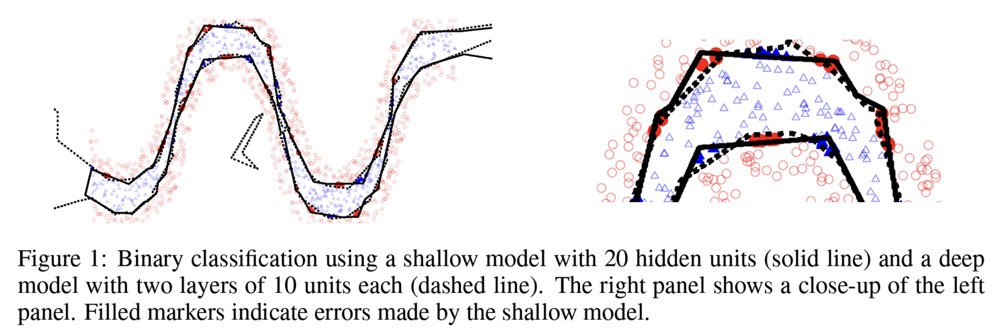
*Fig. — Montufar et al. (2014). Every filled marker is a point the shallow model gets wrong. Note "20 hidden units" versus "two layers of 10" — equal units, so the deep model is the *smaller* of the two in parameters. Page 60.*

### Composing two networks

Take two ordinary shallow networks, each with a scalar input, three ReLU hidden units and a scalar
output — the exact object [Lec 7](07-shallow-neural-networks.md) built:

$$\text{Net 1:}\quad h_j = \mathrm{a}[\theta_{j0} + \theta_{j1}x],\qquad y = \phi_0 + \phi_1 h_1 + \phi_2 h_2 + \phi_3 h_3$$

$$\text{Net 2:}\quad h'_j = \mathrm{a}[\theta'_{j0} + \theta'_{j1}y],\qquad y' = \phi'_0 + \phi'_1 h'_1 + \phi'_2 h'_2 + \phi'_3 h'_3$$

Now **feed network 1's output into network 2's input**, so the composite maps $x \mapsto y \mapsto y'$.

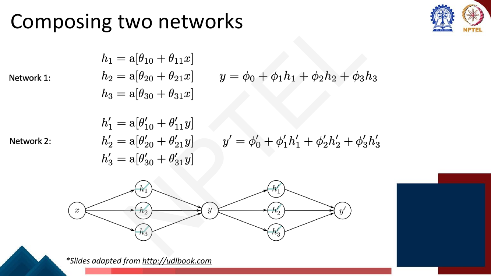
*Fig. — The bottleneck is the point: network 2 sees only the scalar $y$, never $x$. Page 61.*

### Why the regions multiply

Here is the geometric heart of the lecture. Network 1 computes a piecewise linear function of $x$ with,
say, three linear pieces shaped **up, down, up** — it rises across the full output range, comes back
down across the same range, and rises again. Any horizontal line in $y$ therefore crosses it in
**three** places. Network 1 has *folded* the input line onto the $y$ axis three times over.

Network 2 is then applied to $y$, and it has three pieces of its own. But every joint of network 2 sits
at some value of $y$, and each such value is hit at **three different values of $x$**. So each of
network 2's joints reappears three times when you plot $y'$ against $x$:

$$\text{regions}(y' \text{ vs } x) = \text{regions}(y \text{ vs } x) \times \text{regions}(y' \text{ vs } y) = 3 \times 3 = 9$$

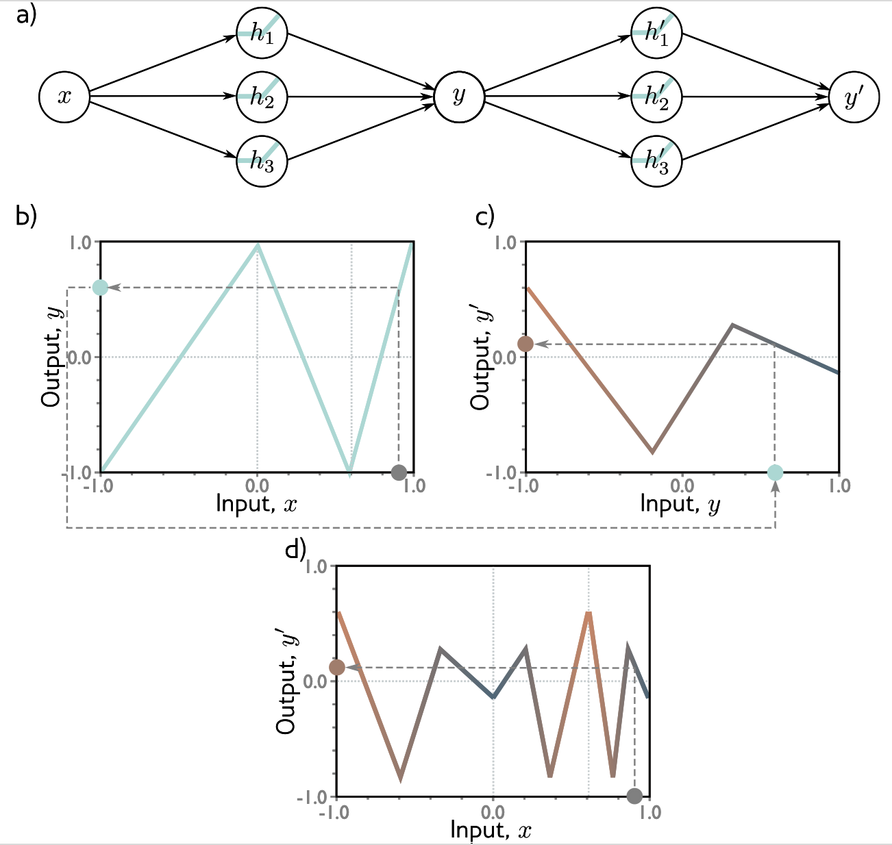
*Fig. — Follow the grey dashed arrows: a value of $x$ in (b) gives a $y$, looked up in (c) to give $y'$. The shape of (c) appears three times in (d), once mirror-imaged because the middle piece of (b) has negative slope. Three pieces times three pieces equals nine. Page 62.*

Say it to yourself in one line: **the second layer's pieces are replicated once per fold produced by
the first layer, so pieces multiply.** Add a third layer and you multiply again. Width, by contrast,
only adds: one more hidden unit in a shallow network adds one more joint, hence one more region.

### Comparing to a shallow network with six hidden units

The composed network uses six hidden units in total, so the fair comparison is a shallow network with
six — and the deck does exactly that.

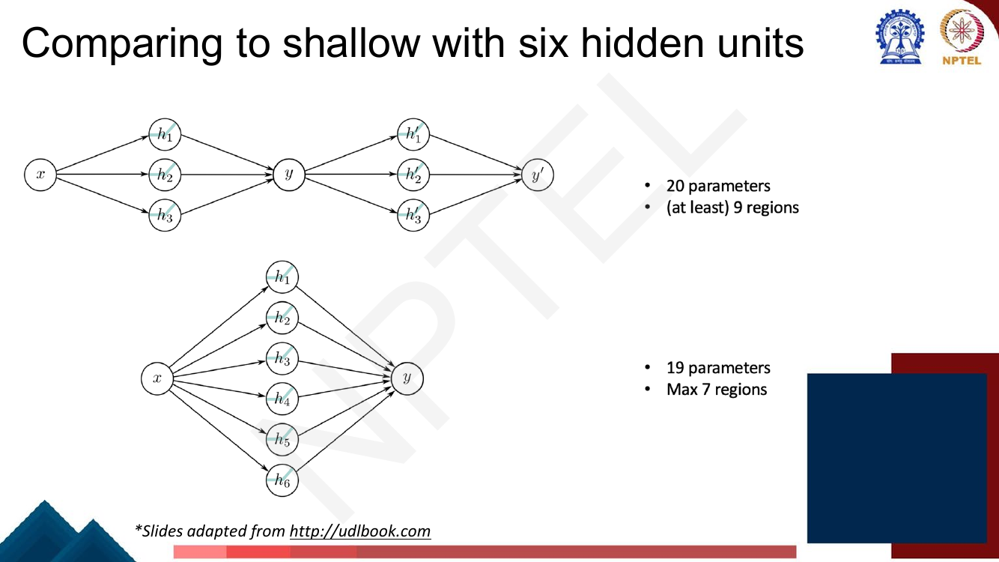
*Fig. — Nearly identical parameter counts, 20 versus 19, but 9 regions versus a hard ceiling of 7. "Max" on the shallow side and "at least" on the deep side is deliberate. Page 63.*

| | Parameters | Linear regions |
|---|---|---|
| Composed, $3+3$ hidden units | $(3{+}3) + (3{+}1) + (3{+}3) + (3{+}1) = 20$ | at least $3 \times 3 = 9$ |
| Shallow, $6$ hidden units | $(6{+}6) + (6{+}1) = 19$ | at most $6 + 1 = 7$ |

**The maximum region count for a shallow network with $H$ hidden units and a one-dimensional input is
$H+1$:** each ReLU contributes one joint on the input line, and $H$ joints cut a line into $H+1$
pieces. Memorise it — half the numericals here run off it.

### Combining two networks into one

The composition *looks* like two networks in series. The deck shows it **is** a single two-layer
network, by substitution alone. Put $y = \phi_0 + \phi_1 h_1 + \phi_2 h_2 + \phi_3 h_3$ into network
2's hidden units:

$$h'_1 = \mathrm{a}[\theta'_{10} + \theta'_{11}y] = \mathrm{a}[\theta'_{10} + \theta'_{11}\phi_0 + \theta'_{11}\phi_1 h_1 + \theta'_{11}\phi_2 h_2 + \theta'_{11}\phi_3 h_3]$$

and identically for $h'_2, h'_3$. Nothing was approximated: $y$ was *eliminated*, so the equality is
exact. Every coefficient on the right is a product of constants, so **rename them**:

$$\boxed{\;\psi_{j0} = \theta'_{j0} + \theta'_{j1}\phi_0, \qquad \psi_{jk} = \theta'_{j1}\phi_k\;} \qquad\Longrightarrow\qquad h'_j = \mathrm{a}\big[\psi_{j0} + \textstyle\sum_{k=1}^{3}\psi_{jk}h_k\big]$$

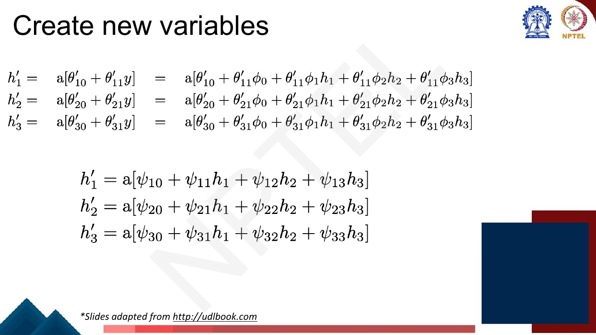
*Fig. — Those two identities are the examinable content of pages 64–65. Page 65.*

Written out, the whole thing is one network with two hidden layers:

$$h_j = \mathrm{a}[\theta_{j0} + \theta_{j1}x], \qquad h'_j = \mathrm{a}\big[\psi_{j0} + \textstyle\sum_k \psi_{jk}h_k\big], \qquad y' = \phi'_0 + \textstyle\sum_j \phi'_j h'_j$$

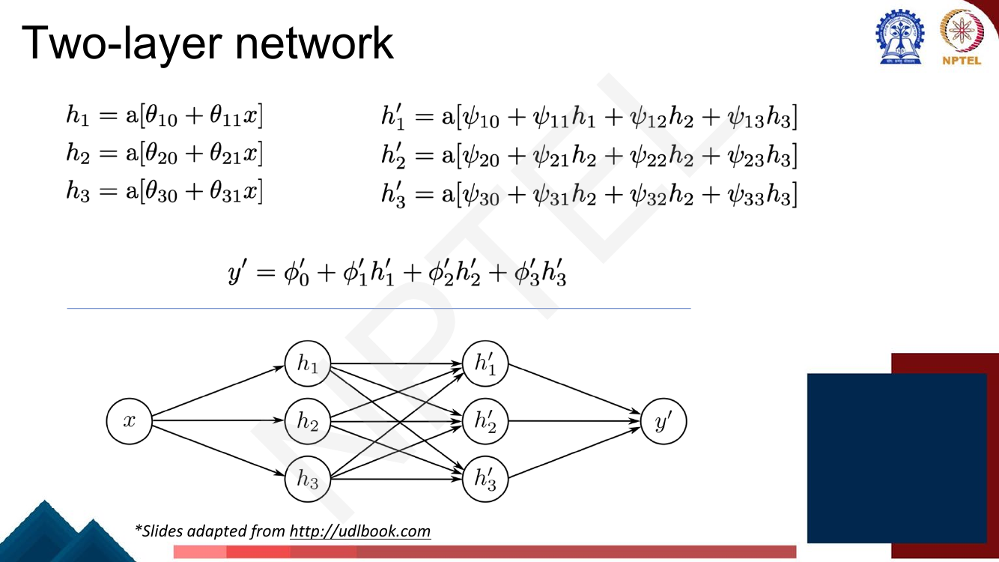
*Fig. — Compare this graph with page 61's. The single-arrow bottleneck through $y$ has become nine arrows between the hidden layers. (The slide has two typos in the $h'_2$ and $h'_3$ rows — it prints $h_2$ where $h_1$ belongs; the $\psi$ subscripts are correct.) Page 66.*

Two payoffs. **Any composition of shallow networks is a deep network** — depth is what you get when
you stop insisting on a bottleneck. But the converse fails: the general two-layer network has nine free
$\psi_{jk}$, while the composed one has $\psi_{jk} = \theta'_{j1}\phi_k$, an outer product, so
$\boldsymbol{\Psi}$ has **rank 1**. The composition is a constrained special case — which is why the
deck writes "at least 9 regions"; a general two-layer network of the same shape has 22 parameters and
reaches 16.

### Networks as composing functions

Look at the **pre-activations of the second hidden layer**, $\psi_{j0} + \sum_k \psi_{jk}h_k$. At that
point in the computation you are looking at a one-layer network with three outputs — exactly the
multi-output shallow network of page 67, which [Lec 7](07-shallow-neural-networks.md) owns.

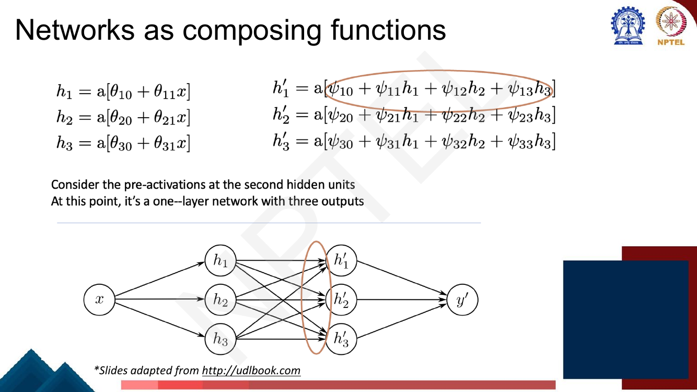
*Fig. — The circled expression is a shallow network's output. Every deep network is a stack of these, read left to right. Pages 68 and 71 (the deck repeats this slide).*

So a deep network is a chain of simple maps:

$$f(\mathbf{x};\theta) \;=\; f_K \circ f_{K-1} \circ \cdots \circ f_2 \circ f_1 (\mathbf{x}), \qquad f_l(\mathbf{a}) = \sigma\big(\mathbf{W}^{(l)}\mathbf{a} + \mathbf{b}^{(l)}\big)$$

with the last map dropping the $\sigma$. Pages 69–70 walk the chain visually: three second-layer
pre-activations, each a shallow network's output; the same three after ReLU, with everything below zero
clipped flat; each scaled by $\phi'_j$; and their sum, the final $y'$ — a jagged function with far more
joints than six units could produce in one layer.

[Lec 9](09-backpropagation.md) differentiates exactly this chain — backpropagation *is* the chain rule
applied to $f_K \circ \cdots \circ f_1$ — and a Transformer block
([Lec 21](../week-05/21-intro-to-transformers.md)) is the same stack with a more interesting $f_l$.

### Hyperparameters

- $K$ **layers** = the **depth** of the network.
- $D_k$ **hidden units per layer** = the **width** of the network.
- These are **hyperparameters** — *chosen before training the network*.
- Retraining with different choices is **hyperparameter optimization** or **hyperparameter search**.

The deck gives this its own page (72); the discriminating phrase for an MCQ is "chosen before
training". The tested distinction: **parameters** are the weights $\mathbf{W}^{(l)}$ and biases $\mathbf{b}^{(l)}$,
learned *during* training by gradient descent ([Lec 10](10-gradient-descent-and-init.md)).
**Hyperparameters** are what you must fix *before* training starts — depth, width, learning rate
$\eta$, batch size. You cannot differentiate the loss with respect to "number of layers", which is why
search, not gradients, is the tool.

### Notation for a general deep network

The deck builds up over three pages: the scalar-input two-layer network in matrix form
($\mathbf{h} = \mathrm{a}[\boldsymbol{\theta}_0 + \boldsymbol{\theta}x]$,
$\mathbf{h}' = \mathrm{a}[\boldsymbol{\psi}_0 + \boldsymbol{\Psi}\mathbf{h}]$,
$y = \phi'_0 + \boldsymbol{\phi}'\mathbf{h}'$), then the general vector-input form:

$$\mathbf{h}_1 = \mathrm{a}[\boldsymbol{\beta}_0 + \boldsymbol{\Omega}_0\mathbf{x}], \qquad \mathbf{h}_2 = \mathrm{a}[\boldsymbol{\beta}_1 + \boldsymbol{\Omega}_1\mathbf{h}_1], \qquad \mathbf{y} = \boldsymbol{\beta}_2 + \boldsymbol{\Omega}_2\mathbf{h}_2$$

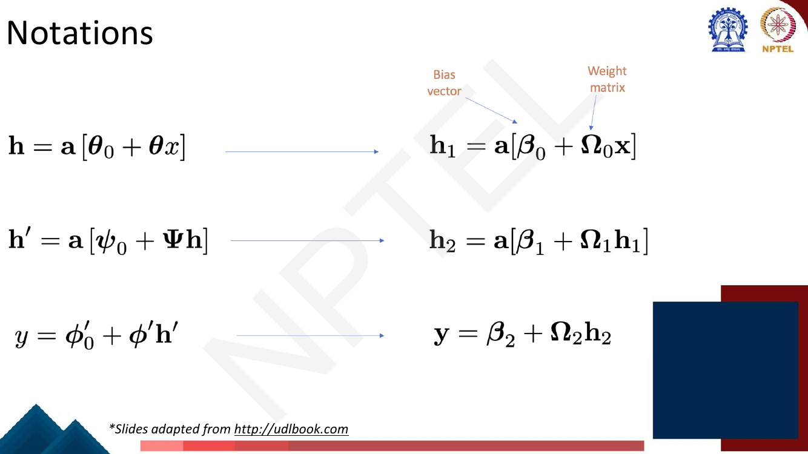
*Fig. — $\boldsymbol{\beta}_k$ is the bias vector and $\boldsymbol{\Omega}_k$ the weight matrix. Watch the index offset: $\mathbf{h}_1$ is produced by $\boldsymbol{\Omega}_0$. Note also that the output line has **no** activation. Pages 73–75.*

In the contract's notation, a general $K$-hidden-layer network is

$$\mathbf{a}^{(0)} = \mathbf{x}, \quad \mathbf{z}^{(l)} = \mathbf{W}^{(l)}\mathbf{a}^{(l-1)} + \mathbf{b}^{(l)}, \quad \mathbf{a}^{(l)} = \sigma(\mathbf{z}^{(l)})\ \ (l = 1,\dots,K), \quad \mathbf{y} = \mathbf{W}^{(K+1)}\mathbf{a}^{(K)} + \mathbf{b}^{(K+1)}$$

with $\mathbf{W}^{(l)} \in \mathbb{R}^{D_l \times D_{l-1}}$, $\mathbf{b}^{(l)} \in \mathbb{R}^{D_l}$,
and $\theta = \{\mathbf{W}^{(l)}, \mathbf{b}^{(l)}\}_{l=1}^{K+1}$.

### The deck's Example

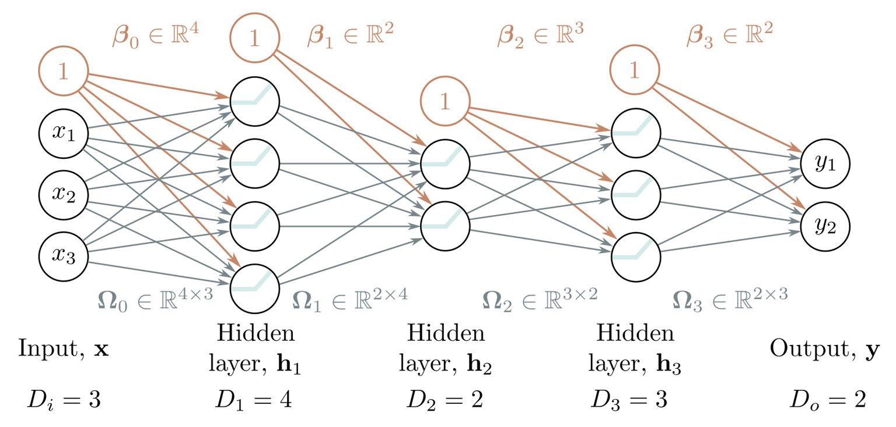
*Fig. — The orange "1" nodes are bias units. Read every matrix shape as (units in this layer) × (units in the previous layer) — the rule that gets parameter-count questions right. $D_i{=}3$, $D_1{=}4$, $D_2{=}2$, $D_3{=}3$, $D_o{=}2$; depth $K = 3$. Page 76.*

The parameter count is worked in **N2** below: 43.

### Shallow vs. deep: the honest comparison

**Ability to approximate different functions?** *Both obey the universal approximation theorem.* The
deck supplies the sceptic's argument itself: one layer is enough, and in a deep network you could
always arrange for the other layers to compute the identity function (page 77). So on raw expressive
power there is nothing to choose between them — and this page is the trap, because expressive power is
**not** the reason to go deep.

### Number of linear regions per parameter — the answer

**Deep networks create many more linear regions per parameter.** Two exact formulas, for a
one-dimensional input:

| Network | Parameters | Maximum linear regions |
|---|---|---|
| Shallow, $H$ hidden units | $3H + 1$ | $H + 1$ |
| Deep, $K$ layers of $D$ units | $3D + 1 + (K-1)(D^2 + D)$ | $(D+1)^K$ |

Regions grow **linearly** in width and **exponentially** in depth. (For a $D_i$-dimensional input the
shallow maximum is Zaslavsky's $\sum_{j=0}^{D_i}\binom{H}{j}$, which reduces to $H+1$ when $D_i=1$.)

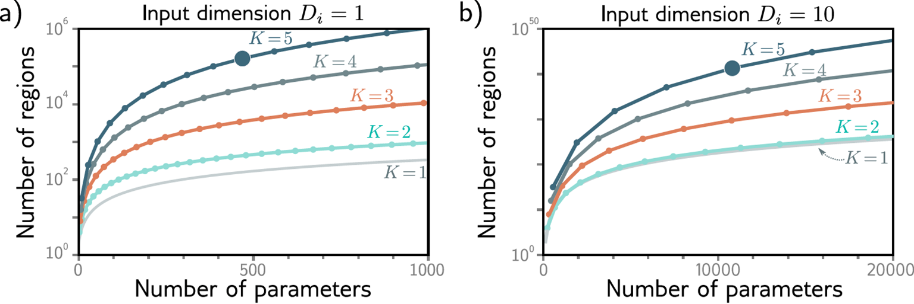
*Fig. — The vertical axis is logarithmic and the curves never cross: at **every** parameter budget, more layers means more regions. The right panel's axis runs to $10^{50}$. Page 79.*

The marked points are the numbers to memorise:

| Input dim | Layers $K$ | Units/layer | Parameters | Linear regions |
|---|---|---|---|---|
| $D_i = 1$ | 5 | 10 | **471** | **161,501** (as printed; see below) |
| $D_i = 10$ | 5 | 50 | **10,801** | **$>10^{40}$** |

Verify the 471: layer 1 is $10{\times}1$ weights plus 10 biases $= 20$; layers 2–5 are
$10{\times}10 + 10 = 110$ each, so $440$; the output is $10 + 1 = 11$. Total $20+440+11 = 471$. ✓

**A disagreement with the slide, flagged.** The formula gives $(D+1)^K = 11^5 = 161{,}051$, which is
also the figure in Prince's book. The slide prints **161,501** — the last two digits transposed.
Nothing in the argument changes, but if an MCQ offers both, the lecturer's slide says 161,501 and the
arithmetic says 161,051.

Either way the comparison is brutal: a shallow network with the same 471 parameters has $H = 156$ units
and at most **157** regions. The deep network gets roughly **1,000×** more structure from an identical
budget.

### The caveats the deck raises

1. **It is not about expressive power.** Both families are universal approximators. The gain is
   *efficiency* — regions per parameter — not reach.
2. **"At least" versus "max".** $H+1$ is a ceiling. $(D+1)^K$ is an upper bound too, but the
   composition argument gives a *lower* bound ("at least 9") that a trained network can beat. In
   practice, randomly initialised deep networks realise far fewer regions than the maximum: the
   capacity is available, not automatic.
3. **Fitting deep models is also faster.** On MNIST-1D with **random labels**, four networks with
   essentially identical parameter counts converge in sharply different numbers of epochs.


*Fig. — "All models train successfully, but deeper models require fewer epochs." The labels are **random**, so this is fitting capacity, not generalisation. Parameter counts match to within 0.6%. Page 80.*

What the deck does **not** claim: that deeper always *generalises* better. Depth brings its own
training pathologies, chiefly vanishing gradients — general case in the
[companion course](../../../GenAIforCV/notes/week-03/13-vanishing-gradients-activations.md), recurrent
case in [Lec 20](../week-04/20-gru-and-lstm.md). The MLP mechanics you met in
[the companion course's MLP chapter](../../../GenAIforCV/notes/week-02/08-mlp-and-activations.md) are
compressed here on purpose; the linear-region material above is new, and is what *this* exam is set
from.

## Worked numericals

**There are no "Try this problem" pages in `Week2.pdf` pp. 57–82.** The deck poses one rhetorical
question (page 59, "Then why go for Deep neural networks?") and answers it on page 60. All five
numericals below are built from the deck's own figures and architectures.

### N1. Linear regions at a matched parameter budget (the chapter's point, numerically)
**Given:** a one-dimensional input. Shallow with $H$ units: $3H+1$ parameters, at most $H+1$ regions.
Deep with $K$ layers of $D$ units: $3D + 1 + (K-1)(D^2+D)$ parameters, at most $(D+1)^K$ regions.
**Find:** region counts at four matched budgets.

1. $D{=}3, K{=}2$: params $= 10 + (9{+}3) = 22$; regions $= 4^2 = 16$. Shallow at 22 params:
   $3H{+}1 = 22 \Rightarrow H = 7$, regions $= 8$.
2. $D{=}5, K{=}3$: params $= 16 + 2(25{+}5) = 76$; regions $= 6^3 = 216$. Shallow: $H = 25$, regions $= 26$.
3. $D{=}10, K{=}5$ (the deck's model): params $= 31 + 4(100{+}10) = 471$; regions $= 11^5 = 161{,}051$.
   Shallow at 469 params: $H = 156$, regions $= 157$.
4. $D{=}50, K{=}5$: params $= 151 + 4(2500{+}50) = 10{,}351$; regions $= 51^5 = 345{,}025{,}251$.
   Shallow: $H = 3450$, regions $= 3451$.

| Budget | Shallow $H$ | Shallow regions | Deep $(K, D)$ | Deep regions | Advantage |
|---|---|---|---|---|---|
| ~22 | 7 | 8 | $(2, 3)$ | 16 | 2× |
| ~76 | 25 | 26 | $(3, 5)$ | 216 | 8.3× |
| 471 | 156 | 157 | $(5, 10)$ | 161,051 | 1,026× |
| ~10,351 | 3450 | 3451 | $(5, 50)$ | 345,025,251 | 99,978× |

**Answer:** shallow regions grow by **1 per 3 parameters**; deep regions **multiply by $(D+1)$ per
layer**. The advantage is not a constant factor — it grows without bound with the budget.

### N2. Parameter count of the deck's Example network, layer by layer (page 76)
**Given:** $D_i = 3$, $D_1 = 4$, $D_2 = 2$, $D_3 = 3$, $D_o = 2$; every layer has a bias.
**Find:** the total number of parameters.

1. Layer 1: $\boldsymbol{\Omega}_0 \in \mathbb{R}^{4\times3} \Rightarrow 12$ weights, $\boldsymbol{\beta}_0 \in \mathbb{R}^4 \Rightarrow 4$ biases $= 16$.
2. Layer 2: $\boldsymbol{\Omega}_1 \in \mathbb{R}^{2\times4} \Rightarrow 8$, $\boldsymbol{\beta}_1 \in \mathbb{R}^2 \Rightarrow 2$ $= 10$.
3. Layer 3: $\boldsymbol{\Omega}_2 \in \mathbb{R}^{3\times2} \Rightarrow 6$, $\boldsymbol{\beta}_2 \in \mathbb{R}^3 \Rightarrow 3$ $= 9$.
4. Output: $\boldsymbol{\Omega}_3 \in \mathbb{R}^{2\times3} \Rightarrow 6$, $\boldsymbol{\beta}_3 \in \mathbb{R}^2 \Rightarrow 2$ $= 8$.
5. Total $= 16 + 10 + 9 + 8$.

**Answer:** **43 parameters** — 32 weights and 11 biases. (Forget the biases and you get 32, which is
the wrong-answer option the exam will offer.)

### N3. A full forward pass by hand
**Given:** a $2 \to 3 \to 2 \to 1$ network with ReLU on both hidden layers and a linear output.
$\mathbf{x} = [1, 2]^\top$, and

$$\mathbf{W}^{(1)} = \begin{bmatrix} 1 & -1 \\ 2 & 1 \\ 0 & 1\end{bmatrix},\; \mathbf{b}^{(1)} = \begin{bmatrix}0.5\\-3\\1\end{bmatrix},\quad \mathbf{W}^{(2)} = \begin{bmatrix}1 & -2 & 1\\ 0 & 1 & -1\end{bmatrix},\; \mathbf{b}^{(2)} = \begin{bmatrix}1\\0\end{bmatrix},\quad \mathbf{W}^{(3)} = \begin{bmatrix}2 & 3\end{bmatrix},\; b^{(3)} = -1$$

**Find:** the output $y$, and the number of parameters.

1. $z^{(1)}_1 = (1)(1) + (-1)(2) + 0.5 = 1 - 2 + 0.5 = -0.5$.
2. $z^{(1)}_2 = (2)(1) + (1)(2) - 3 = 2 + 2 - 3 = 1$.
3. $z^{(1)}_3 = (0)(1) + (1)(2) + 1 = 0 + 2 + 1 = 3$. So $\mathbf{z}^{(1)} = [-0.5, 1, 3]^\top$.
4. ReLU: $\mathbf{a}^{(1)} = [\max(0,-0.5), \max(0,1), \max(0,3)]^\top = [0, 1, 3]^\top$. **Unit 1 is dead** for this input.
5. $z^{(2)}_1 = (1)(0) + (-2)(1) + (1)(3) + 1 = 0 - 2 + 3 + 1 = 2$.
6. $z^{(2)}_2 = (0)(0) + (1)(1) + (-1)(3) + 0 = 0 + 1 - 3 = -2$. So $\mathbf{z}^{(2)} = [2, -2]^\top$.
7. ReLU: $\mathbf{a}^{(2)} = [2, 0]^\top$.
8. Output (linear, no ReLU): $y = (2)(2) + (3)(0) - 1 = 4 + 0 - 1 = 3$.
9. Parameters: $(3{\times}2 + 3) + (2{\times}3 + 2) + (1{\times}2 + 1) = 9 + 8 + 3 = 20$.

**Answer:** $y = \mathbf{3}$, with **20 parameters**. Note step 8: the output layer has **no**
activation — applying ReLU there is the single most common slip in these questions.

### N4. The composition, verified both ways
**Given:** network 1 with $\theta_{\cdot0} = (-0.5,\, 1,\, -1)$, $\theta_{\cdot1} = (1,\, -1,\, 2)$,
$\phi_0 = 0.5$, $\phi = (2,\, 1,\, -1)$; network 2 with $\theta'_{\cdot0} = (0,\, 1,\, -2)$,
$\theta'_{\cdot1} = (1,\, -0.5,\, 1)$, $\phi'_0 = 0$, $\phi' = (1,\, 2,\, -3)$. ReLU throughout.
**Find:** $y'$ at $x = 3$, computed (a) as two networks in series and (b) from the combined
single two-layer network, and check they agree.

**(a) In series.**
1. $h_1 = \mathrm{ReLU}(-0.5 + (1)(3)) = \mathrm{ReLU}(2.5) = 2.5$.
2. $h_2 = \mathrm{ReLU}(1 + (-1)(3)) = \mathrm{ReLU}(-2) = 0$.
3. $h_3 = \mathrm{ReLU}(-1 + (2)(3)) = \mathrm{ReLU}(5) = 5$.
4. $y = 0.5 + (2)(2.5) + (1)(0) + (-1)(5) = 0.5 + 5 + 0 - 5 = 0.5$.
5. $h'_1 = \mathrm{ReLU}(0 + (1)(0.5)) = 0.5$.
6. $h'_2 = \mathrm{ReLU}(1 + (-0.5)(0.5)) = \mathrm{ReLU}(0.75) = 0.75$.
7. $h'_3 = \mathrm{ReLU}(-2 + (1)(0.5)) = \mathrm{ReLU}(-1.5) = 0$.
8. $y' = 0 + (1)(0.5) + (2)(0.75) + (-3)(0) = 0.5 + 1.5 = 2.0$.

**(b) As one two-layer network.** Build $\psi_{j0} = \theta'_{j0} + \theta'_{j1}\phi_0$ and
$\psi_{jk} = \theta'_{j1}\phi_k$:

9. $\psi_{10} = 0 + (1)(0.5) = 0.5$; $(\psi_{11},\psi_{12},\psi_{13}) = (1)(2,1,-1) = (2,1,-1)$.
10. $\psi_{20} = 1 + (-0.5)(0.5) = 0.75$; $(\psi_{2k}) = (-0.5)(2,1,-1) = (-1,-0.5,0.5)$.
11. $\psi_{30} = -2 + (1)(0.5) = -1.5$; $(\psi_{3k}) = (1)(2,1,-1) = (2,1,-1)$.
12. $h'_1 = \mathrm{ReLU}(0.5 + 2(2.5) + 1(0) - 1(5)) = \mathrm{ReLU}(0.5) = 0.5$ ✓
13. $h'_2 = \mathrm{ReLU}(0.75 - 1(2.5) - 0.5(0) + 0.5(5)) = \mathrm{ReLU}(0.75) = 0.75$ ✓
14. $h'_3 = \mathrm{ReLU}(-1.5 + 2(2.5) + 1(0) - 1(5)) = \mathrm{ReLU}(-1.5) = 0$ ✓
15. $y' = 1(0.5) + 2(0.75) - 3(0) = 2.0$ ✓

**Answer:** both routes give $y' = \mathbf{2.0}$. Rows 1 and 3 of $\boldsymbol{\Psi}$ are identical
because $\theta'_{11} = \theta'_{31} = 1$: $\boldsymbol{\Psi} = \boldsymbol{\theta}'_{\cdot1}\boldsymbol{\phi}^\top$
has **rank 1**.

### N5. The deck's 20-vs-19 comparison, and what a *general* two-layer net would cost
**Given:** a one-dimensional input. (i) the composed network of page 63 (two blocks of 3 hidden units
joined through a scalar), (ii) a shallow network with 6 hidden units, (iii) the unconstrained two-layer
network with widths $3, 3$.
**Find:** parameters and maximum regions for each.

1. **(i) Composed:** net 1 contributes $3$ weights $+\,3$ biases $+\,3$ output weights $+\,1$ output
   bias $= 10$; net 2 the same $= 10$. Total $= \mathbf{20}$. Regions: at least $3 \times 3 = \mathbf{9}$.
2. **(ii) Shallow, $H = 6$:** $6$ weights $+\,6$ biases $+\,6$ output weights $+\,1$ output bias
   $= \mathbf{19}$. Regions: at most $H + 1 = \mathbf{7}$.
3. **(iii) General two-layer, $3 \to 3$:** layer 1 $= 3 + 3 = 6$; layer 2 $= 3\times3 + 3 = 12$;
   output $= 3 + 1 = 4$. Total $= \mathbf{22}$. Regions: at most $(3+1)^2 = \mathbf{16}$.
4. Regions per parameter: $9/20 = 0.45$, $7/19 = 0.37$, $16/22 = 0.73$.

**Answer:** 20 params / 9 regions, 19 params / 7 regions, 22 params / 16 regions. The composed network
beats the shallow one, and the *unconstrained* two-layer network beats them both — because freeing
$\boldsymbol{\Psi}$ from rank 1 costs only 2 extra parameters and nearly doubles the ceiling.

## Code

Two blocks: a configurable-depth forward pass that reproduces N3 and N4 exactly, and a region-counting
experiment that measures the multiplicative effect directly.

```python
import numpy as np
relu = lambda z: np.maximum(z, 0.0)

def forward(x, Ws, bs, verbose=False):
    """Forward pass through a ReLU MLP of any depth. The LAST layer stays linear."""
    a, L = np.asarray(x, dtype=float), len(Ws)
    for l in range(L):
        z = Ws[l] @ a + bs[l]
        a = z if l == L - 1 else relu(z)        # no activation on the output layer
        if verbose:
            print(f"  layer {l+1}: z = {np.round(z,4)}  ->  a = {np.round(a,4)}")
    return a

# N3: the hand-computed 2 -> 3 -> 2 -> 1 network
Ws = [np.array([[1., -1.], [2., 1.], [0., 1.]]),
      np.array([[1., -2., 1.], [0., 1., -1.]]),
      np.array([[2., 3.]])]
bs = [np.array([0.5, -3., 1.]), np.array([1., 0.]), np.array([-1.])]

print("N3 forward pass, x = [1, 2]")
print("output y =", forward([1., 2.], Ws, bs, verbose=True))
print("parameter count =", sum(W.size for W in Ws) + sum(b.size for b in bs))
# N3 forward pass, x = [1, 2]
#   layer 1: z = [-0.5  1.   3. ]  ->  a = [0. 1. 3.]
#   layer 2: z = [ 2. -2.]  ->  a = [2. 0.]
#   layer 3: z = [3.]  ->  a = [3.]
# output y = [3.]
# parameter count = 20
```

```python
import numpy as np
relu = lambda z: np.maximum(z, 0.0)

# N4: two networks in series vs. the single combined two-layer network (deck's symbols)
th0, th1 = np.array([-0.5, 1.0, -1.0]), np.array([1.0, -1.0, 2.0])   # network 1 layer
phi0, phi = 0.5, np.array([2.0, 1.0, -1.0])                          # network 1 output
tp0, tp1 = np.array([0.0, 1.0, -2.0]), np.array([1.0, -0.5, 1.0])    # network 2 layer
pp0, pp = 0.0, np.array([1.0, 2.0, -3.0])                            # network 2 output

x = 3.0
h  = relu(th0 + th1 * x);   y  = phi0 + phi @ h          # network 1
hp = relu(tp0 + tp1 * y);   yp = pp0 + pp @ hp           # network 2, fed by y
print(f"in series : h={h}, y={y}, h'={hp}, y'={yp}")

psi0 = tp0 + tp1 * phi0            # psi_j0 = theta'_j0 + theta'_j1 * phi_0
Psi  = np.outer(tp1, phi)          # psi_jk = theta'_j1 * phi_k   -> rank 1 by construction
hp2  = relu(psi0 + Psi @ h);   yp2 = pp0 + pp @ hp2
print(f"combined  : h'={hp2}, y'={yp2}")
print("Psi =\n", Psi, "\nrank(Psi) =", np.linalg.matrix_rank(Psi))
print("identical:", np.allclose(yp, yp2))
# in series : h=[2.5 0.  5. ], y=0.5, h'=[0.5  0.75 0.  ], y'=2.0
# combined  : h'=[0.5  0.75 0.  ], y'=2.0
# Psi =
#  [[ 2.   1.  -1. ]
#   [-1.  -0.5  0.5]
#   [ 2.   1.  -1. ]]
# rank(Psi) = 1
# identical: True
```

Now measure the regions directly. A **linear region** is a maximal set of inputs on which every ReLU
keeps the same on/off state, so sampling the input line densely and counting pattern flips counts the
regions exactly, up to resolution. Each deep layer is the fold map
$t(x) = 2\,\mathrm{ReLU}(x) - 4\,\mathrm{ReLU}(x - 0.5) + 2\,\mathrm{ReLU}(x-1)$, which maps $[0,1]$
onto $[0,1]$ and folds it in half — the deck's mechanism made explicit.

```python
import numpy as np
relu = lambda z: np.maximum(z, 0.0)

# One fold block: 1 -> 3 ReLU units -> 1.  t(0)=0, t(0.5)=1, t(1)=0: it folds [0,1] in half.
TH0, TH1 = np.array([0., -.5, -1.]), np.array([1., 1., 1.])
PHI0, PHI = 0.0, np.array([2., -4., 2.])
BLOCK_PARAMS = TH0.size + TH1.size + PHI.size + 1          # 3+3+3+1 = 10

def deep_patterns(x, K):
    """Chain K fold-blocks; return the on/off state of every hidden unit at every input."""
    a, pats = x.copy(), []
    for _ in range(K):
        Z = TH0[None, :] + TH1[None, :] * a[:, None]
        pats.append(Z > 0)
        a = PHI0 + relu(Z) @ PHI
    return np.hstack(pats)

def shallow_patterns(x, H):
    """One hidden layer, H units, joints spread evenly across [0,1]."""
    return (x[:, None] - ((np.arange(H) + 0.5) / H)[None, :]) > 0

def n_regions(P):                       # a region boundary = the pattern flips
    return int(np.any(P[1:] != P[:-1], axis=1).sum()) + 1

x = np.linspace(0, 1, 2_000_001)
print(f"{'budget':>7} | {'shallow H':>9} {'params':>6} {'regions':>8} |"
      f" {'deep K':>6} {'params':>6} {'regions':>8}")
for K in (1, 2, 3, 4, 5, 6, 7, 8):
    pd = K * BLOCK_PARAMS
    H = (pd - 1) // 3                   # shallow units at the same budget (3H+1 params)
    print(f"{pd:>7} | {H:>9} {3*H+1:>6} {n_regions(shallow_patterns(x, H)):>8} |"
          f" {K:>6} {pd:>6} {n_regions(deep_patterns(x, K)):>8}")
#  budget | shallow H params  regions | deep K params  regions
#      10 |         3     10        4 |      1     10        3
#      20 |         6     19        7 |      2     20        6
#      30 |         9     28       10 |      3     30       11
#      40 |        13     40       14 |      4     40       21
#      50 |        16     49       17 |      5     50       41
#      60 |        19     58       20 |      6     60       81
#      70 |        23     70       24 |      7     70      161
#      80 |        26     79       27 |      8     80      321
```

Read the two region columns against each other. Shallow climbs $4, 7, 10, 14, 17, 20, 24, 27$ — it
**adds** about one region per three parameters. Deep climbs $3, 6, 11, 21, 41, 81, 161, 321$ — each
extra layer **doubles** it (precisely $R_{K+1} = 2R_K - 1$). Shallow leads at the smallest budgets and
is overtaken at $K = 3$; by 80 parameters the deep network has twelve times as many regions. Extend the
two laws to 471 parameters and you land on the 157-versus-161,051 gap. (The fold block is *constructed*;
randomly initialised deep networks realise far fewer regions — see Beyond the slides.)

## Exam pack

### Must-memorise

| Item | Exactly this |
|---|---|
| Deep network | a network with **more than one hidden layer** |
| ReLU networks describe | **piecewise linear** mappings — shallow *and* deep |
| Why deep | **many more linear regions for the same number of parameters** (Montufar et al., 2014) |
| Composition | $f(\mathbf{x};\theta) = f_K \circ f_{K-1} \circ \cdots \circ f_1(\mathbf{x})$ |
| Layer equations | $\mathbf{z}^{(l)} = \mathbf{W}^{(l)}\mathbf{a}^{(l-1)} + \mathbf{b}^{(l)}$, $\mathbf{a}^{(l)} = \sigma(\mathbf{z}^{(l)})$; output layer has **no** $\sigma$ |
| Deck's form | $\mathbf{h}_1 = \mathrm{a}[\boldsymbol{\beta}_0 + \boldsymbol{\Omega}_0\mathbf{x}]$, $\mathbf{h}_2 = \mathrm{a}[\boldsymbol{\beta}_1 + \boldsymbol{\Omega}_1\mathbf{h}_1]$, $\mathbf{y} = \boldsymbol{\beta}_2 + \boldsymbol{\Omega}_2\mathbf{h}_2$ |
| $\boldsymbol{\beta}_k$ / $\boldsymbol{\Omega}_k$ | **bias vector** / **weight matrix** of layer $k$ |
| Combining two nets | $\psi_{j0} = \theta'_{j0} + \theta'_{j1}\phi_0$ and $\psi_{jk} = \theta'_{j1}\phi_k$ (so $\boldsymbol{\Psi}$ is rank 1) |
| Depth / width | $K$ = number of layers / $D_k$ = hidden units per layer |
| Hyperparameters | depth, width, $\eta$, batch size — **chosen before training**; tuned by hyperparameter search |
| Parameters | weights and biases — learned **during** training |
| Max regions, $D_i{=}1$ | shallow: $H + 1$; deep: $(D+1)^K$ |
| Params, $D_i{=}1$ | shallow: $3H + 1$; layer $l$: $D_l D_{l-1}$ weights $+\ D_l$ biases |
| Universal approximation | obeyed by **both** — so it is *not* the reason to go deep |
| Deeper models | fit **faster** (fewer epochs) at matched parameter count |

### Numbers worth knowing

| Quantity | Value |
|---|---|
| Composed network (3 + 3 units) | **20 parameters**, **at least 9** linear regions |
| Shallow comparison (6 units) | **19 parameters**, **max 7** linear regions |
| Deep example, $D_i{=}1$ | 5 layers × 10 units = **471 parameters**, **161,501** regions as printed ($11^5 = 161{,}051$ by formula) |
| Deep example, $D_i{=}10$ | 5 layers × 50 units = **10,801 parameters**, **$>10^{40}$** regions |
| Montufar figure | shallow **20 hidden units** vs. deep **2 layers of 10**; NeurIPS **2014** |
| MNIST-1D setup | 4000 examples, **random labels**, full-batch GD, He init, $\eta = 0.0025$, 500K epochs |
| MNIST-1D widths / params (1/2/3/4 layers) | 298 / 100 / 75 / 63 units; 15,208 / 15,210 / 15,235 / 15,139 params |
| Deck's Example network | $D_i{=}3$, $D_1{=}4$, $D_2{=}2$, $D_3{=}3$, $D_o{=}2$ → **43 parameters** |
| Source book | Prince, *Understanding Deep Learning*, Chapters 3–4 |

### Likely MCQ traps

- **"Deep networks can represent functions shallow ones cannot."** False — both obey universal
  approximation. The advantage is **regions per parameter**, not expressive reach.
- **"A deep ReLU network can model curved functions."** No. Any ReLU network of any depth is
  **piecewise linear**; depth buys more pieces, not curvature.
- **Confusing "max 7" with "at least 9".** $H+1$ is an upper bound on the shallow side; the
  composition argument gives the deep network a *lower* bound. Reading both as upper bounds inverts
  the comparison.
- **Counting regions additively.** Two layers of 3 units is not $3+3+1$. Regions **multiply** across
  layers and **add** across width.
- **Forgetting biases.** Layer $l$ has $D_l D_{l-1} + D_l$ parameters: the Example network has 32
  weights but **43** parameters.
- **Transposing a weight-matrix shape.** $\boldsymbol{\Omega}_1 \in \mathbb{R}^{2\times4}$ maps a
  width-4 layer to a width-2 layer, not the reverse.
- **Applying the activation to the output layer.** The deck's last line is
  $\mathbf{y} = \boldsymbol{\beta}_K + \boldsymbol{\Omega}_K\mathbf{h}_K$ — no $\mathrm{a}[\cdot]$.
- **Calling $\eta$ a parameter, or the weights a hyperparameter.** Hyperparameters are fixed *before*
  training; parameters are learned *during* it.
- **"Deeper always generalises better."** The page-80 claim is narrower: deeper models **fit faster**,
  in epochs, on *randomly labelled* data. Optimisation, not generalisation.
- **"The composed network and the general two-layer network are the same model."** The composition
  forces rank-1 $\boldsymbol{\Psi}$; the general network is strictly more flexible (22 params, 16 regions).
- **Mixing up $D_i$ and $D_1$.** In the Example, $D_i = 3$ is the *input* dimension; the first hidden
  layer has $D_1 = 4$ units.

### Self-test

1. Define a deep neural network in the deck's exact words.
2. A shallow ReLU network with a 1-D input has 12 hidden units. How many linear regions can it create, and how many parameters does it have?
3. Why "at least 9 regions" for the composed network but "max 7" for the shallow one?
4. State the two identities that convert a composition of two shallow networks into one two-layer network.
5. A network has $D_i = 5$, hidden widths $8$ and $4$, and $D_o = 3$. Count the parameters.
6. Both families are universal approximators. So what exactly does depth buy?
7. Maximum linear regions for a 1-D-input network with 4 layers of 6 units each?
8. Which are hyperparameters: number of layers, $\mathbf{W}^{(2)}$, learning rate, $\mathbf{b}^{(1)}$, width?
9. Reproduce the deck's 471-parameter count layer by layer.
10. In the MNIST-1D experiment, what was special about the labels, and why does that change how you read the result?

<details><summary>Answers</summary>

1. "Networks with more than one hidden layer."
2. Regions $= 13$. Parameters $= 3(12)+1 = 37$ (12 weights + 12 biases + 12 output weights + 1 output bias).
3. $H+1$ is a ceiling: $H$ joints cut a line into at most $H+1$ pieces. The $3\times3$ count comes from an explicit construction, so it is a floor the network can exceed — the unconstrained two-layer network of the same shape reaches 16.
4. $\psi_{j0} = \theta'_{j0} + \theta'_{j1}\phi_0$ and $\psi_{jk} = \theta'_{j1}\phi_k$.
5. $(8{\times}5 + 8) + (4{\times}8 + 4) + (3{\times}4 + 3) = 48 + 36 + 15 = \mathbf{99}$.
6. Efficiency: exponentially more linear regions per parameter, and fewer epochs to fit. Same reachable function class.
7. $(6+1)^4 = 7^4 = \mathbf{2401}$.
8. Hyperparameters: number of layers, learning rate, width. Parameters: $\mathbf{W}^{(2)}$, $\mathbf{b}^{(1)}$.
9. $(10{\times}1 + 10) + 4(10{\times}10 + 10) + (1{\times}10 + 1) = 20 + 440 + 11 = 471$.
10. They were **random**, so there is nothing to generalise to — the networks are memorising. The result is about optimisation speed, not test accuracy.

</details>

## Beyond the slides

**Gap:** The deck gives region counts but never the formula behind them, so you cannot answer a
numerical that changes the architecture.
**Why it matters:** For a 1-D input, a shallow network with $H$ units has at most $H+1$ regions and a
$K$-layer network of width $D$ has at most $(D+1)^K$. For a $D_i$-dimensional input the shallow bound
becomes Zaslavsky's $\sum_{j=0}^{D_i}\binom{H}{j}$, which is what makes the deck's right-hand panel
reach $10^{50}$. With these two formulas every "which has more regions" question becomes arithmetic.

**Gap:** The deck shows that composing two networks gives a two-layer network, but never says the
composition is a *restricted* two-layer network.
**Why it matters:** $\psi_{jk} = \theta'_{j1}\phi_k$ makes $\boldsymbol{\Psi}$ a rank-1 outer product.
Nine entries, six degrees of freedom. The general two-layer network costs two more parameters (22 vs 20)
and raises the region ceiling from 9 to 16. This is also the first appearance in the course of
"low-rank factorisation of a weight matrix", which returns in force as
[LoRA](../week-10/47-lora-and-variants.md).

**Gap:** The maximum region counts are presented as if networks achieve them.
**Why it matters:** They do not. Hanin and Rolnick (2019) showed that at standard initialisation the
number of realised regions grows roughly *linearly* in the total number of units, nowhere near
$(D+1)^K$, and that training barely changes this. Depth provides the capacity; it does not hand it to
you. The code block's fold network is constructed by hand precisely because a random one will not show
the effect. If an exam asks "how many regions does a trained network have", the answer is "at most
$(D+1)^K$, usually far fewer".

**Gap:** Nothing is said about what goes *wrong* as you add layers.
**Why it matters:** The deck's story is unidirectional — deeper is better — and it stops right before
the reason nobody trained 50-layer networks until 2015. Gradients through $K$ layers are a product of
$K$ Jacobians and shrink or explode geometrically; see the
[companion course's treatment](../../../GenAIforCV/notes/week-03/13-vanishing-gradients-activations.md)
and, for the recurrent version, [Lec 20](../week-04/20-gru-and-lstm.md). The fixes — residual
connections, normalisation, careful initialisation ([Lec 10](10-gradient-descent-and-init.md)) — are
what make the regions-per-parameter argument cash out in practice.

## Cut from the slides

Page 57 is the title card, page 58 the "Concepts covered" list, pages 81–82 the chapter reference and
the Thank You card — none carry content. Page 71 is a byte-identical repeat of page 68 ("Networks as
composing functions"), inserted after the panel figures; it is shown once here. Page 67 ("Remember
shallow network with two outputs?") is a recap of material [Lec
7](07-shallow-neural-networks.md) owns, so it is compressed to one sentence rather than re-derived.
Pages 74 and 75 are the same slide with and without the "bias vector"/"weight matrix" annotations;
only the annotated version is shown. Pages 69 and 70 are a six- and four-panel visual walk through
the same composition already established on page 62; they are described in a sentence rather than
reproduced, as is page 73's matrix-form build-up, which page 75 supersedes. The page-72
hyperparameters slide is quoted verbatim as bullets instead of shown, to stay inside the figure budget. Universal approximation, the four-step shallow construction, hidden units
and ReLU all belong to [Lec 7](07-shallow-neural-networks.md) and are referenced, not restated;
backpropagation belongs to [Lec 9](09-backpropagation.md); gradient descent, initialisation and Adam to
[Lec 10](10-gradient-descent-and-init.md); modern activations to [Lec
52](../week-11/52-modern-llms-and-activations.md). Nothing about composition, region counting,
hyperparameters or the general notation was dropped. **There are no "Try this problem" pages in this
range.**
