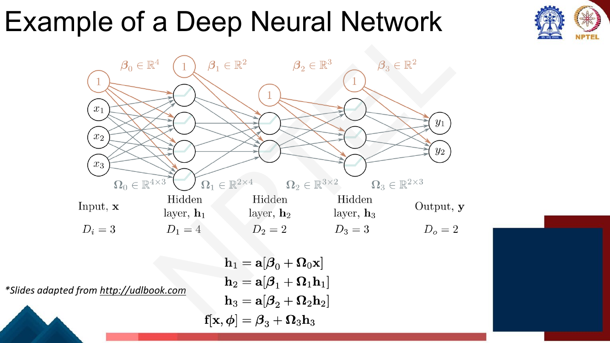
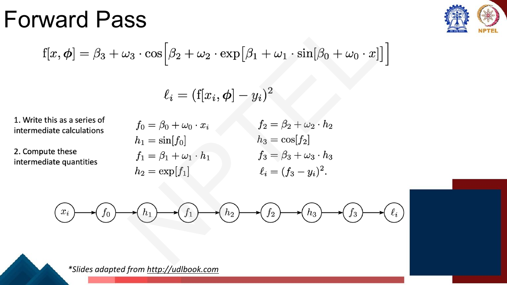
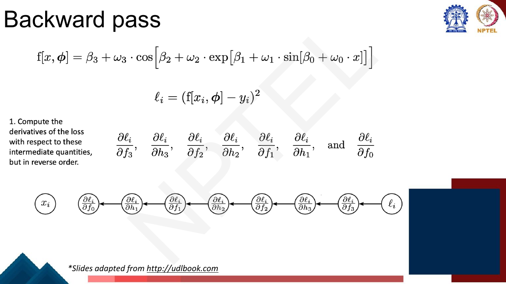
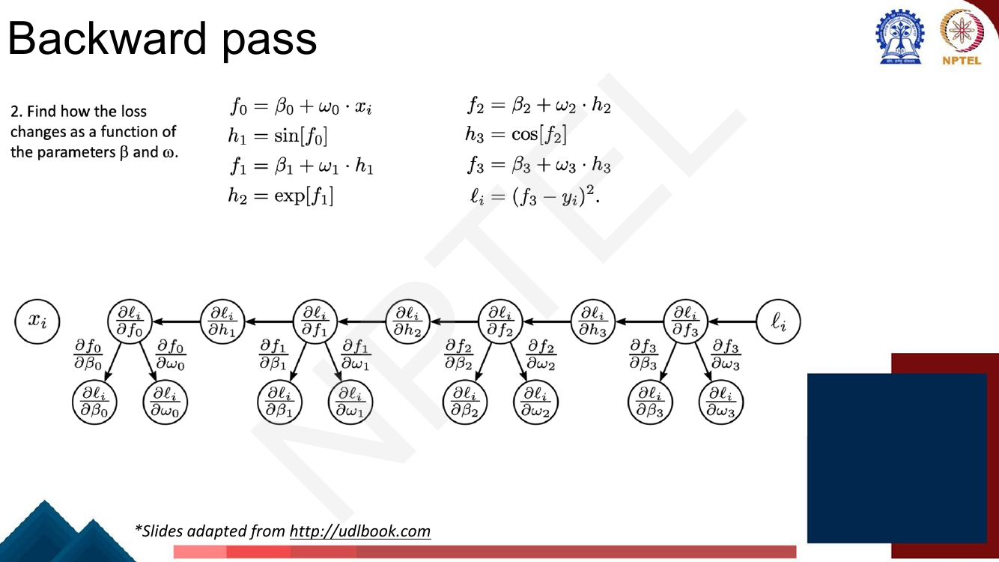
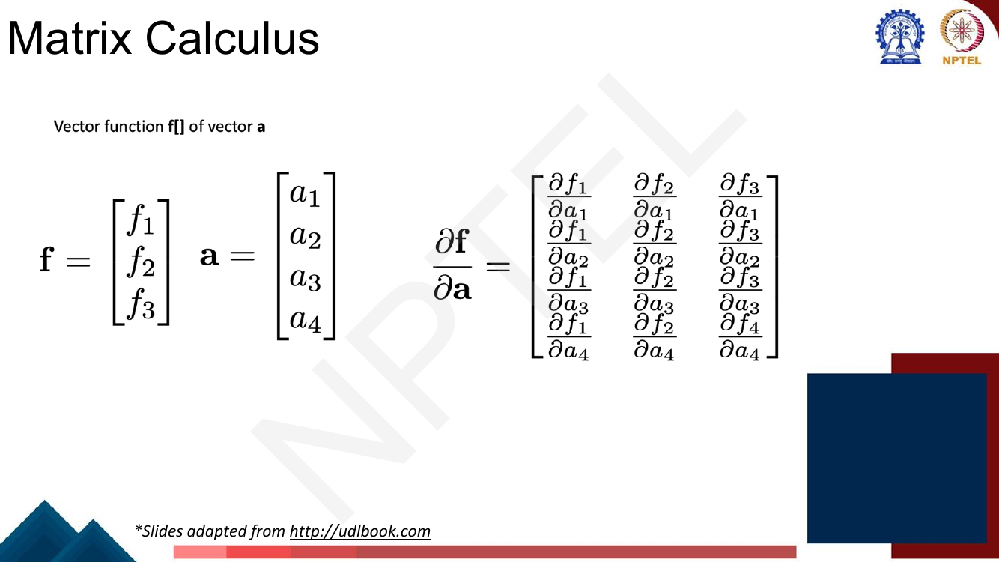
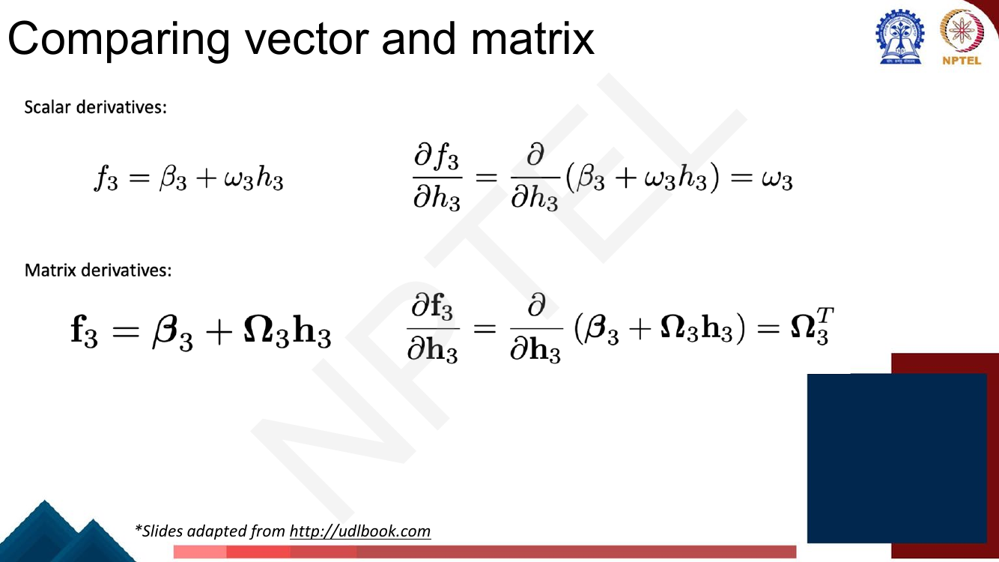
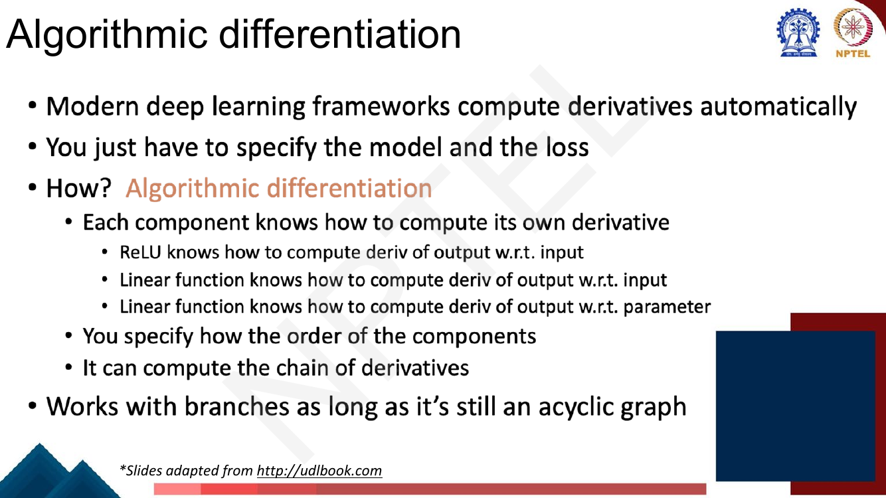

# Lec 9 — Backpropagation

> **Source:** `Week2.pdf` pp. 83–115 · **Week 2** · **Playlist:** Lec 9
> **Prereqs:** [Lec 8 — Deep Neural Networks](08-deep-neural-networks.md)
> **Feeds into:** [Lec 10 — Gradient Descent and Initialization](10-gradient-descent-and-init.md), [Lec 20 — GRU and LSTM](../week-04/20-gru-and-lstm.md)

## Why this lecture exists

Lecture 8 built a deep network and showed it is a composition of linear maps and activations. Training
it means descending the loss, and descending the loss means knowing $\partial\mathcal{L}/\partial\theta$
for every one of the parameters. Nobody told you how to get those numbers.

You could get them by brute force: nudge one parameter, re-run the network, see how the loss moved.
That costs one forward pass *per parameter*, and a real model has $10^8$ of them. It is not slow, it
is impossible.

Backpropagation is the algorithm that computes the **entire** gradient — every partial derivative, all
at once — for roughly the cost of **one** extra forward pass. That single fact is why deep learning
works at all. This lecture derives it on the deck's toy function, generalises it to a deep network,
and builds the matrix calculus you need to write it in vector form.

## The ideas

### Notation: what the deck writes, what this book writes

These Week-2 slides follow Prince's *Understanding Deep Learning* (the deck's own reference, page 114,
Chapter 7), which writes functions with square brackets, $\mathrm{f}[\mathbf{x},\boldsymbol{\phi}]$,
and **bold $\boldsymbol{\phi}$ for the whole parameter collection**. This book writes that collection
$\theta$. The rest of the mapping:

| Deck (Prince) | This book | Meaning |
|---|---|---|
| $\boldsymbol{\phi}$ (bold) | $\theta$ | **the whole parameter set** |
| $\boldsymbol{\Omega}_k$ | $\mathbf{W}^{(k)}$ | weight matrix of layer $k$ |
| $\boldsymbol{\beta}_k$ | $\mathbf{b}^{(k)}$ | bias vector of layer $k$ |
| $\mathrm{a}[\cdot]$ | ReLU$(\cdot)$ | the activation |
| $\ell_i$ | $\mathcal{L}_i$ | loss on example $i$ |

**One warning that trips people up.** $\boldsymbol{\phi}$ is *only* the collection symbol. When the deck
writes a network out scalar-by-scalar — as it does on page 87 — it uses a **different Greek letter per
layer**: $\theta_{d0},\theta_{di}$ for the first layer, $\psi_{jd}$ for the second, $\phi'_{j}$ for the
output layer. So an unprimed $\theta$ on that slide means *the first hidden layer's parameters*, not
"all parameters", and a primed $\phi'$ means *the output layer's*. Do not read either as the collection.
([Lec 7](07-shallow-neural-networks.md) meets the same two-symbol scheme, with $\theta_{d\bullet}$
hidden and $\phi_{j\bullet}$ output.)

The policy for this chapter, and for Lecs 7–10 generally:

- **Reproducing a deck equation → keep the deck's own symbols**, so you recognise them in the exam.
  That means $\beta_k,\omega_k$ in the toy function (they are scalars there) and
  $\boldsymbol{\beta}_k,\boldsymbol{\Omega}_k$ on the deep-network slides.
- **My own derivations and the general backward recursion → the contract's form**, $\theta$ for the
  collection and $\mathbf{W}^{(k)},\mathbf{b}^{(k)}$ per layer.

This matters here more than elsewhere, because the backward recursion touches parameters at *every*
layer — hidden and output — which is exactly where the deck's per-layer letters diverge. In the
recursion below, $k=K$ is the output layer and $k<K$ the hidden ones; they obey the **same** three
equations, which is the point of writing it in matrix form.

### What we actually need

The loss over a dataset is a sum of per-example terms, and SGD ([Lec 10](10-gradient-descent-and-init.md)
owns the update rule) needs the gradient of each term:

$$\mathcal{L}[\theta] = \sum_{i=1}^{I} \mathcal{L}_i = \sum_{i=1}^{I} \mathrm{l}\big[\mathrm{f}[\mathbf{x}_i,\theta],\, y_i\big]$$

So the whole job of this lecture is to produce $\dfrac{\partial \mathcal{L}_i}{\partial \mathbf{W}^{(k)}}$
and $\dfrac{\partial \mathcal{L}_i}{\partial \mathbf{b}^{(k)}}$ for every layer $k$.


*Fig. — Read the matrix shapes off the layer widths: $\boldsymbol{\Omega}_k$ is (next width) × (previous width). This network has 43 parameters; hold that number, N3 uses it. Page 85 of Week2.pdf.*

### Why computing gradients efficiently is "such a big deal"

The deck asks this directly and answers it by writing the network out as a single equation. For a
network with one input, three hidden units and three hidden units again, it fills three lines of
nested brackets.


*Fig. — A neural network **is just an equation**. It is differentiable; the only question is cost. Note the three multipliers at the bottom: per parameter × per batch point × per SGD iteration. This is also the slide where the per-layer Greek letters appear — $\theta$ for the first layer, $\psi$ for the second, $\phi'$ for the output — so $\theta$ here is *not* "all parameters". Page 87.*

The naive alternative is **finite differences**. For each parameter $\theta_j$ you perturb it by a tiny
$\epsilon$ and measure:

$$\frac{\partial \mathcal{L}}{\partial \theta_j} \approx \frac{\mathcal{L}[\theta + \epsilon \mathbf{e}_j] - \mathcal{L}[\theta]}{\epsilon}$$

where $\mathbf{e}_j$ is 1 in slot $j$ and 0 elsewhere. Each perturbation needs its own forward pass, so
$P$ parameters cost $P+1$ forward passes (or $2P$ for the more accurate two-sided version).
**Backpropagation gets the whole gradient in one forward pass plus one backward pass**, and the backward
pass costs about as much as the forward one — roughly $2\times$ a single forward evaluation,
*independent of $P$*.

The ratio is about $P/2$. For GPT-2 small, $P = 1.24\times10^8$: finite differences need ~124 million
forward passes per gradient per example; backprop needs two. At 10 ms per forward pass that is
**14 days versus 20 milliseconds** — and you need a fresh gradient at every SGD step. Finite differences
are not a slower option; they are not an option. (They survive for one job: **checking** a hand-written
backward pass — N2.)

### The intuition: the backward pass

Backprop's name comes from the direction information flows. To know how a weight feeding into
$\mathbf{h}_1$ changes the loss, you need the whole downstream chain.


*Fig. — The quantities listed are exactly the factors of a chain-rule product, read right to left. Nothing about an early weight can be known without first knowing everything downstream of it. Page 89.*

The algorithm follows directly:

1. **Forward pass.** Run the network, *storing every intermediate quantity*.
2. **Backward pass.** Start at the loss with the trivial
   $\partial\mathcal{L}/\partial(\text{output})$ and walk backwards, multiplying by one local
   derivative at each step.

It is cheap because every chain-rule product shares its tail with its neighbour. Backprop computes each
shared tail **once** and reuses it. That is the entire trick.

The shared-tail structure generalises the chain rule you met in the companion vision course; if you
want the same derivation on a 2-2-1 network with explicit weight updates, see
[the vision course's treatment](../../../GenAIforCV/notes/week-02/09-backpropagation.md). It is
compressed here so the space goes to the deck's own example and to matrix calculus, which that course
does not cover.

The algorithm is **Rumelhart, Hinton and Williams (1986)** — memorise the names and the year, it is a
free MCQ.

### The deck's toy function

This is the centrepiece of the lecture. The deck picks a function that is *not* a neural network but
has the same structural property — a deep chain of compositions:

$$\mathrm{f}[x,\theta] = \beta_3 + \omega_3 \cdot \cos\big[\beta_2 + \omega_2 \cdot \exp\big[\beta_1 + \omega_1 \cdot \sin[\beta_0 + \omega_0 \cdot x]\big]\big]$$

$$\mathcal{L}_i = \big(\mathrm{f}[x_i,\theta] - y_i\big)^2$$

Eight parameters: $\beta_0,\omega_0,\beta_1,\omega_1,\beta_2,\omega_2,\beta_3,\omega_3$. We want all
eight partial derivatives of $\mathcal{L}_i$.

**Step 1 — rewrite as a chain of intermediate calculations.** Give every sub-expression a name:

$$
\begin{aligned}
f_0 &= \beta_0 + \omega_0 \cdot x_i & f_2 &= \beta_2 + \omega_2 \cdot h_2\\
h_1 &= \sin[f_0] & h_3 &= \cos[f_2]\\
f_1 &= \beta_1 + \omega_1 \cdot h_1 & f_3 &= \beta_3 + \omega_3 \cdot h_3\\
h_2 &= \exp[f_1] & \mathcal{L}_i &= (f_3 - y_i)^2
\end{aligned}
$$


*Fig. — The $f_k$ are the **linear** steps (a bias plus a weight times something) and the $h_k$ are the **nonlinear** steps. That alternation is exactly a neural network's structure; only the nonlinearities differ. Page 91.*

**Step 2 — compute the intermediates.** Just evaluate the chain left to right and keep every value.

**Step 3 — differentiate backwards.** Compute $\partial\mathcal{L}_i/\partial f_3$, then
$\partial\mathcal{L}_i/\partial h_3$, then $\partial\mathcal{L}_i/\partial f_2$, and so on, **in reverse
order**.


*Fig. — The same graph as the forward pass with every arrow reversed, and the node contents replaced by derivatives. Note $x_i$ is disconnected on the left: you never need $\partial\mathcal{L}/\partial x$ for training. Page 92.*

The first derivative is trivial:

$$\frac{\partial \mathcal{L}_i}{\partial f_3} = 2(f_3 - y_i)$$

The second uses the chain rule, and the deck annotates each factor with the question it answers:
"how does a small change in $h_3$ change $f_3$?" times "how does a small change in $f_3$ change the
loss?"

$$\frac{\partial \mathcal{L}_i}{\partial h_3} = \frac{\partial f_3}{\partial h_3}\frac{\partial \mathcal{L}_i}{\partial f_3}$$

and the rest follow by extending the same product one factor at a time. Written out, the deck's
bracketing makes the reuse visible — the bracketed part of each line is the previous line's answer:

$$
\begin{aligned}
\frac{\partial \mathcal{L}_i}{\partial f_2} &= \frac{\partial h_3}{\partial f_2}\left(\frac{\partial f_3}{\partial h_3}\frac{\partial \mathcal{L}_i}{\partial f_3}\right)\\
\frac{\partial \mathcal{L}_i}{\partial h_2} &= \frac{\partial f_2}{\partial h_2}\left(\frac{\partial h_3}{\partial f_2}\frac{\partial f_3}{\partial h_3}\frac{\partial \mathcal{L}_i}{\partial f_3}\right)\\
\frac{\partial \mathcal{L}_i}{\partial f_1} &= \frac{\partial h_2}{\partial f_1}\left(\frac{\partial f_2}{\partial h_2}\frac{\partial h_3}{\partial f_2}\frac{\partial f_3}{\partial h_3}\frac{\partial \mathcal{L}_i}{\partial f_3}\right)
\end{aligned}
$$

and so on down to $\partial\mathcal{L}_i/\partial f_0$. **Do not expand these products from scratch.**
Each line is one multiplication applied to the line above. That is the saving.

The local derivatives you need are all one-liners:

| Edge | Local derivative | Value |
|---|---|---|
| $\partial f_3/\partial h_3$ | derivative of $\beta_3+\omega_3 h_3$ | $\omega_3$ |
| $\partial h_3/\partial f_2$ | derivative of $\cos$ | $-\sin[f_2]$ |
| $\partial f_2/\partial h_2$ | | $\omega_2$ |
| $\partial h_2/\partial f_1$ | derivative of $\exp$ | $\exp[f_1] = h_2$ |
| $\partial f_1/\partial h_1$ | | $\omega_1$ |
| $\partial h_1/\partial f_0$ | derivative of $\sin$ | $\cos[f_0]$ |

**Step 4 — turn the intermediate derivatives into parameter derivatives.** One more chain rule, and
it is the easy one, because each parameter touches the chain in exactly one place:

$$\frac{\partial \mathcal{L}_i}{\partial \omega_k} = \frac{\partial f_k}{\partial \omega_k}\frac{\partial \mathcal{L}_i}{\partial f_k} = h_k \cdot \frac{\partial \mathcal{L}_i}{\partial f_k}, \qquad
\frac{\partial \mathcal{L}_i}{\partial \beta_k} = \frac{\partial f_k}{\partial \beta_k}\frac{\partial \mathcal{L}_i}{\partial f_k} = \frac{\partial \mathcal{L}_i}{\partial f_k}$$

since $f_k = \beta_k + \omega_k h_k$ gives $\partial f_k/\partial \omega_k = h_k$ and
$\partial f_k/\partial \beta_k = 1$. (For $k=0$, $h_0$ is the input $x_i$.)


*Fig. — This one picture is the whole algorithm. The horizontal spine is the recursion; the eight downward branches are the eight answers. Every branch costs one multiplication. Page 97.*

N1 works this through with numbers.

### The same algorithm on a deep network

Replace the scalars with vectors and the structure is unchanged:

$$
\begin{aligned}
\mathbf{f}_0 &= \mathbf{b}^{(0)} + \mathbf{W}^{(0)}\mathbf{x}_i, &\quad \mathbf{h}_1 &= \mathrm{ReLU}[\mathbf{f}_0]\\
\mathbf{f}_1 &= \mathbf{b}^{(1)} + \mathbf{W}^{(1)}\mathbf{h}_1, &\quad \mathbf{h}_2 &= \mathrm{ReLU}[\mathbf{f}_1]
\end{aligned}
$$

and so on, ending at $\mathcal{L}_i = \mathrm{l}[\mathbf{f}_3, y_i]$. The backward recursion is
letter-for-letter the toy function's:

$$\frac{\partial \mathcal{L}_i}{\partial \mathbf{f}_1} = \frac{\partial \mathbf{h}_2}{\partial \mathbf{f}_1}\frac{\partial \mathbf{f}_2}{\partial \mathbf{h}_2}\left(\frac{\partial \mathbf{h}_3}{\partial \mathbf{f}_2}\frac{\partial \mathbf{f}_3}{\partial \mathbf{h}_3}\frac{\partial \mathcal{L}_i}{\partial \mathbf{f}_3}\right)$$

The deck boxes the factor $\partial \mathbf{f}_3/\partial \mathbf{h}_3$ and asks: *how to compute this
for vectors?* Answer: matrix calculus.

### Matrix calculus, from scratch

Three cases, in increasing generality. In every one, the derivative object has **one entry per
(input component, output component) pair**.

**Case 1 — scalar function of a vector.** If $f$ is a number and $\mathbf{a}\in\mathbb{R}^4$, then
$\partial f/\partial \mathbf{a}$ is a vector of the same shape as $\mathbf{a}$, holding
$\partial f/\partial a_j$ in slot $j$. This is the ordinary **gradient**.

**Case 2 — scalar function of a matrix.** If $\mathbf{A}$ is $4\times 3$, then
$\partial f/\partial \mathbf{A}$ is also $4\times 3$, with $\partial f/\partial a_{jk}$ in position
$(j,k)$. **The gradient always has the same shape as the thing you differentiate with respect to.**
That is the single most useful shape rule in deep learning — if your gradient does not match the shape
of its parameter, you have made an error.

**Case 3 — vector function of a vector.** This is the new object. If
$\mathbf{f}\in\mathbb{R}^3$ depends on $\mathbf{a}\in\mathbb{R}^4$, there are $3\times 4 = 12$ partial
derivatives, and they are collected in a matrix called the **Jacobian**.


*Fig. — Look carefully at the layout: rows run over **a**, columns run over **f**, so this is $4\times 3$, not $3\times 4$. The deck is using **denominator layout**, the transpose of the Jacobian you may have seen elsewhere. (The slide has a typo: the bottom-right entry is printed $\partial f_4/\partial a_4$ and should be $\partial f_3/\partial a_4$.) Page 102.*

**Why the convention matters.** In the standard ("numerator") layout the Jacobian is
$\mathbf{J}\in\mathbb{R}^{3\times 4}$ with $J_{jk} = \partial f_j/\partial a_k$. The deck's layout is
$\mathbf{J}^{\top}$. The payoff of the deck's choice is that chain-rule products compose in the order
they are written on the slides, with the upstream gradient as a column vector on the **right**:

$$\frac{\partial \mathcal{L}}{\partial \mathbf{a}} = \frac{\partial \mathbf{f}}{\partial \mathbf{a}}\,\frac{\partial \mathcal{L}}{\partial \mathbf{f}}$$

Shapes: $(4\times 3)(3\times 1) = (4\times 1)$ ✓. If you ever meet the other convention it reads
$\partial\mathcal{L}/\partial\mathbf{a} = \mathbf{J}^{\top}\,\partial\mathcal{L}/\partial\mathbf{f}$ —
the same arithmetic, the transpose written explicitly.

### The derivative of a linear map, and where the transpose comes from

This is the result the whole deep-network backward pass turns on.


*Fig. — The scalar derivative is $\omega_3$; the vector derivative is $\boldsymbol{\Omega}_3^{\top}$, **not** $\boldsymbol{\Omega}_3$. Memorise this pair side by side — the transpose is the examinable detail. Page 103.*

Derive it once and you never have to memorise it. Write $\mathbf{f} = \mathbf{b} + \mathbf{W}\mathbf{h}$
component-wise:

$$f_j = b_j + \sum_k W_{jk} h_k \quad\Longrightarrow\quad \frac{\partial f_j}{\partial h_k} = W_{jk}$$

Now place that number in the deck's layout, which indexes rows by the input $h_k$ and columns by the
output $f_j$. Entry $(k,j)$ of $\partial\mathbf{f}/\partial\mathbf{h}$ is $W_{jk}$ — rows and columns
swapped relative to $\mathbf{W}$. That is precisely $\mathbf{W}^{\top}$:

$$\frac{\partial \mathbf{f}}{\partial \mathbf{h}} = \mathbf{W}^{\top}$$

**The transpose is not a trick; it is the index swap forced by the layout.** Shapes give the same
answer instantly: with $\mathbf{W}$ of shape $D_{\text{out}}\times D_{\text{in}}$, going from a
$D_{\text{out}}$-vector to a $D_{\text{in}}$-vector requires left-multiplying by something
$D_{\text{in}}\times D_{\text{out}}$ — i.e. $\mathbf{W}^{\top}$.

The bias case is the easy sibling: $\partial\mathbf{f}/\partial\mathbf{b} = \mathbf{I}$, the identity
matrix — the vector analogue of the scalar answer 1. (Page 104 prints this; note its own small typo,
the derivative operator is written $\partial/\partial\omega_3$ where it should be
$\partial/\partial\beta_3$.) So the bias gradient is just the upstream gradient passed through
unchanged:

$$\frac{\partial \mathcal{L}_i}{\partial \mathbf{b}^{(k)}} = \frac{\partial \mathcal{L}_i}{\partial \mathbf{f}_k}$$

And the weight gradient, from $\partial f_j/\partial W_{jk} = h_k$, assembles into an **outer product**:

$$\frac{\partial \mathcal{L}_i}{\partial \mathbf{W}^{(k)}} = \frac{\partial \mathcal{L}_i}{\partial \mathbf{f}_k}\,\mathbf{h}_k^{\top}$$

Shapes: $(D_{\text{out}}\times 1)(1\times D_{\text{in}}) = D_{\text{out}}\times D_{\text{in}}$, which
is the shape of $\mathbf{W}^{(k)}$ ✓ — the shape rule confirming itself. This is also why the forward
pass must **store** $\mathbf{h}_k$: the weight gradient needs it, and it is gone otherwise. (That
stored activation memory is what dominates training memory in practice.)

### Derivative of ReLU

ReLU is $\mathrm{ReLU}(z) = \max(0,z)$, applied elementwise. Its derivative is as simple as it gets:

$$\frac{d}{dz}\mathrm{ReLU}(z) = \begin{cases} 1 & z > 0\\ 0 & z < 0\\ \text{undefined} & z = 0\end{cases}$$

At exactly $z=0$ the function has a kink and no derivative exists. **Convention: use 0.** It never
matters in practice — a float is exactly zero with probability ~0, and either choice gives a valid
subgradient.

![Slide "Derivative of RELU": a = ReLU[b] for 3-vectors written componentwise, with the derivative a diagonal 3x3 matrix of indicators I[b1>0], I[b2>0], I[b3>0], equivalently a pointwise multiply by I[b>0]](../../assets/pages/lec09/p-107.png)
*Fig. — The Jacobian of an elementwise function is **diagonal**, because output $j$ depends only on input $j$. Never build this matrix: multiplying by a diagonal matrix is the same as a pointwise multiply, so backprop through ReLU is one mask. Page 107.*

So the backward pass through a ReLU is: **zero out the gradient wherever the forward pre-activation
was non-positive, pass it through unchanged elsewhere.** Written $\mathbb{I}[\mathbf{f}>0]\odot$,
where $\odot$ is elementwise multiplication. One comparison and one multiply per unit — no matrix
anywhere. In code it is literally `grad * (f > 0)`.

### Backprop summary — the deck's own two pages

**Forward pass.** Compute and *store*:

$$\mathbf{f}_0 = \mathbf{b}^{(0)} + \mathbf{W}^{(0)}\mathbf{x}_i, \qquad
\mathbf{h}_k = \mathrm{a}[\mathbf{f}_{k-1}], \qquad
\mathbf{f}_k = \mathbf{b}^{(k)} + \mathbf{W}^{(k)}\mathbf{h}_k, \qquad k \in \{1,\ldots,K\}$$

**Backward pass.** Start from $\partial\mathcal{L}_i/\partial\mathbf{f}_K$ and run $k = K, K-1, \ldots, 1$:

$$
\begin{aligned}
\frac{\partial \mathcal{L}_i}{\partial \mathbf{b}^{(k)}} &= \frac{\partial \mathcal{L}_i}{\partial \mathbf{f}_k}\\
\frac{\partial \mathcal{L}_i}{\partial \mathbf{W}^{(k)}} &= \frac{\partial \mathcal{L}_i}{\partial \mathbf{f}_k}\mathbf{h}_k^{\top}\\
\frac{\partial \mathcal{L}_i}{\partial \mathbf{f}_{k-1}} &= \mathbb{I}[\mathbf{f}_{k-1} > 0] \odot \left(\mathbf{W}^{(k)\top}\frac{\partial \mathcal{L}_i}{\partial \mathbf{f}_k}\right)
\end{aligned}
$$

![Slide "Backprop summary" giving the backward pass: dL/dbeta_k = dL/df_k, dL/dOmega_k = dL/df_k h_k^T, and dL/df_{k-1} = I[f_{k-1}>0] pointwise-times (Omega_k^T dL/df_k), labelled equation 7.13, for k from K down to 1](../../assets/pages/lec09/p-112.png)
*Fig. — Three lines, numbered 7.13 in Prince's book. The third line is the recursion; the first two are read off it for free. If you memorise one thing from this lecture, memorise this box. Page 112.*

Read the third line as the loop body: **transpose-multiply by the weights, then mask by the ReLU.**
Everything else is bookkeeping. Note in passing that this line multiplies by a weight matrix and a
mask at *every* layer, so the gradient reaching layer 1 is a product of $K$ such factors — if those
factors are consistently small the gradient shrinks geometrically. That is the vanishing-gradient
problem; [Lec 20](../week-04/20-gru-and-lstm.md) owns it for the recurrent case, and the
[vision course's chapter](../../../GenAIforCV/notes/week-03/13-vanishing-gradients-activations.md)
covers the general one.

### Algorithmic differentiation

The deck's closing concept, and the bridge to every framework you will use.


*Fig. — "Each component knows how to compute its own derivative" is the entire design of PyTorch and JAX. Note the final condition: **acyclic** graph. Branches are fine; a cycle is not. Page 113.*

Three parts: (1) every primitive ships with its own local derivative rule, w.r.t. its inputs *and* its
parameters — ReLU knows it is a mask, a linear layer knows it is $\mathbf{W}^{\top}$ and an outer
product; (2) you specify the **order** of the components, which is what writing a `forward()` does, and
the framework records a graph; (3) it composes the local derivatives along that graph. **Branches** are
fine (a value used twice has its two gradients summed) provided the graph stays **acyclic** — an RNN
unrolled over time is acyclic, which is why backprop-through-time works.

**Backprop is an instance of reverse-mode automatic differentiation.** The distinction worth knowing:

| | Forward mode | Reverse mode (= backprop) |
|---|---|---|
| Sweeps | input → output | output → input |
| One sweep gives | one input's effect on **all** outputs | all inputs' effect on **one** output |
| Sweeps needed | one per **input** | one per **output** |
| Cheap when | few inputs, many outputs | many inputs, few outputs |

Deep learning has $P\approx10^8$ parameters to differentiate and exactly **one** output, the scalar
loss. One reverse sweep delivers all $10^8$ derivatives; forward mode would need $10^8$ sweeps. That
asymmetry is why every framework implements reverse mode — it is the formal statement of the
$P$-versus-1 argument at the top of this chapter.

## Worked numericals

There are **no "Try this problem" pages in pages 83–115**; this lecture's exercises are all
constructed here. N1 is the deck's own toy function, traced completely.

### N1. The deck's toy function, fully traced (pages 90–97)
**Given:** $\beta_0 = 0.1$, $\omega_0 = 0.4$, $\beta_1 = -0.3$, $\omega_1 = 1.0$, $\beta_2 = 0.2$,
$\omega_2 = 0.5$, $\beta_3 = 0.5$, $\omega_3 = 2.0$, with $x_i = 1.0$ and $y_i = 1.0$.
**Find:** the loss, and all eight partial derivatives.

**Forward pass** (store every value):

1. $f_0 = \beta_0 + \omega_0 x_i = 0.1 + 0.4(1.0) = 0.5$
2. $h_1 = \sin[0.5] = 0.4794255386$
3. $f_1 = \beta_1 + \omega_1 h_1 = -0.3 + 1.0(0.4794255386) = 0.1794255386$
4. $h_2 = \exp[0.1794255386] = 1.1965298055$
5. $f_2 = \beta_2 + \omega_2 h_2 = 0.2 + 0.5(1.1965298055) = 0.7982649027$
6. $h_3 = \cos[0.7982649027] = 0.6979503426$
7. $f_3 = \beta_3 + \omega_3 h_3 = 0.5 + 2.0(0.6979503426) = 1.8959006851$
8. $\mathcal{L}_i = (f_3 - y_i)^2 = (0.8959006851)^2 = \mathbf{0.8026380377}$

**Backward pass** (reverse order; each line is the line above times one local derivative):

9. $\dfrac{\partial\mathcal{L}_i}{\partial f_3} = 2(f_3 - y_i) = 2(0.8959006851) = 1.7918013703$
10. $\dfrac{\partial\mathcal{L}_i}{\partial h_3} = \omega_3 \cdot 1.7918013703 = 2.0 \times 1.7918013703 = 3.5836027406$
11. $\dfrac{\partial\mathcal{L}_i}{\partial f_2} = -\sin[f_2]\cdot 3.5836027406 = -0.7161461578 \times 3.5836027406 = -2.5663833337$
12. $\dfrac{\partial\mathcal{L}_i}{\partial h_2} = \omega_2 \cdot(-2.5663833337) = 0.5 \times (-2.5663833337) = -1.2831916668$
13. $\dfrac{\partial\mathcal{L}_i}{\partial f_1} = h_2 \cdot(-1.2831916668) = 1.1965298055 \times (-1.2831916668) = -1.5353770755$
14. $\dfrac{\partial\mathcal{L}_i}{\partial h_1} = \omega_1 \cdot(-1.5353770755) = -1.5353770755$
15. $\dfrac{\partial\mathcal{L}_i}{\partial f_0} = \cos[f_0]\cdot(-1.5353770755) = 0.8775825619 \times(-1.5353770755) = -1.3474201474$

**Parameter derivatives** ($\partial\mathcal{L}/\partial\beta_k = \partial\mathcal{L}/\partial f_k$ and
$\partial\mathcal{L}/\partial\omega_k = h_k\,\partial\mathcal{L}/\partial f_k$, with $h_0 = x_i$):

16. $\partial\mathcal{L}/\partial\beta_3 = 1.7918013703$; $\;\partial\mathcal{L}/\partial\omega_3 = h_3 \times 1.7918013703 = 0.6979503426 \times 1.7918013703 = 1.2505883802$
17. $\partial\mathcal{L}/\partial\beta_2 = -2.5663833337$; $\;\partial\mathcal{L}/\partial\omega_2 = h_2 \times(-2.5663833337) = 1.1965298055 \times(-2.5663833337) = -3.0707541510$
18. $\partial\mathcal{L}/\partial\beta_1 = -1.5353770755$; $\;\partial\mathcal{L}/\partial\omega_1 = h_1 \times(-1.5353770755) = 0.4794255386 \times(-1.5353770755) = -0.7360989814$
19. $\partial\mathcal{L}/\partial\beta_0 = -1.3474201474$; $\;\partial\mathcal{L}/\partial\omega_0 = x_i \times(-1.3474201474) = -1.3474201474$

**Answer:** $\mathcal{L}_i = 0.8026$, and

$$\nabla_\theta \mathcal{L}_i = (-1.3474,\, -1.3474,\, -1.5354,\, -0.7361,\, -2.5664,\, -3.0708,\, 1.7918,\, 1.2506)$$

ordered $(\beta_0,\omega_0,\beta_1,\omega_1,\beta_2,\omega_2,\beta_3,\omega_3)$. Sanity checks:
$\partial\mathcal{L}/\partial\beta_0 = \partial\mathcal{L}/\partial\omega_0$ because $x_i = 1$; the
sign flips at step 11 because $\cos$ is decreasing at $f_2 = 0.798$; and
$\partial\mathcal{L}/\partial\beta_3$ is the largest-magnitude *positive* entry because $\beta_3$ sits
closest to the output.

### N2. Gradient check by finite differences
**Given:** the same setup as N1. Backprop says
$\partial\mathcal{L}/\partial\omega_1 = -0.7360989814$.
**Find:** the central finite-difference estimate with $\epsilon = 10^{-6}$, and confirm agreement.

1. Central differences: $\dfrac{\partial\mathcal{L}}{\partial\omega_1} \approx \dfrac{\mathcal{L}[\omega_1+\epsilon] - \mathcal{L}[\omega_1-\epsilon]}{2\epsilon}$.
2. $\omega_1 = 1.000001$: re-running the forward chain gives $\mathcal{L}^{+} = 0.8026373016$.
3. $\omega_1 = 0.999999$: $\mathcal{L}^{-} = 0.8026387737$.
4. Difference: $0.8026373016 - 0.8026387737 = -1.4721980 \times 10^{-6}$.
5. Divide by $2\epsilon = 2\times10^{-6}$: $-0.7360989814$.
6. Discrepancy against backprop: $5.2\times10^{-12}$.

**Answer:** finite differences give $-0.73609898$, matching backprop to **8+ decimal places**. The
rule of thumb: a correct backward pass agrees with central differences to about $10^{-7}$ relative
error or better; anything worse than $10^{-4}$ means a bug. (Why *central* and not one-sided? One-sided
error is $O(\epsilon)$, central is $O(\epsilon^2)$ — the same $\epsilon$ buys far more accuracy.)

### N3. Cost: finite differences versus backprop
**Given:** the deck's network on page 85 — $D_i = 3$, hidden widths 4, 2, 3, output 2.
**Find:** the parameter count, then the forward passes each method needs for one gradient.

1. Layer 0: $\boldsymbol{\Omega}_0$ is $4\times 3 = 12$, $\boldsymbol{\beta}_0$ is 4 → 16.
2. Layer 1: $\boldsymbol{\Omega}_1$ is $2\times 4 = 8$, $\boldsymbol{\beta}_1$ is 2 → 10.
3. Layer 2: $\boldsymbol{\Omega}_2$ is $3\times 2 = 6$, $\boldsymbol{\beta}_2$ is 3 → 9.
4. Layer 3: $\boldsymbol{\Omega}_3$ is $2\times 3 = 6$, $\boldsymbol{\beta}_3$ is 2 → 8.
5. Total $P = 16 + 10 + 9 + 8 = \mathbf{43}$.
6. One-sided finite differences: 1 baseline + 43 perturbed $= 44$ forward passes.
7. Central finite differences: $2 \times 43 = 86$ forward passes.
8. Backprop: 1 forward + 1 backward $\approx 2$ forward-equivalents.
9. Ratio (central): $86/2 = \mathbf{43\times}$, i.e. exactly $P$.
10. Scale it up. GPT-2 small, $P = 1.24\times10^{8}$, at 10 ms per forward pass:
    central differences $= 2.48\times10^{8} \times 0.01\text{ s} = 2.48\times10^{6}$ s
    $= 28.7$ days per gradient. Backprop $\approx 0.02$ s.

**Answer:** $P = 43$; 86 forward passes versus 2, a $43\times$ saving here and **28.7 days versus 20 ms**
on GPT-2 small. The saving grows linearly with $P$ — which is why the method had to exist before deep
learning could.

### N4. Matrix calculus: gradients of a linear layer
**Given:** $\mathbf{z} = \mathbf{W}\mathbf{x}$ with
$\mathbf{W} = \begin{pmatrix}1 & 2\\ 3 & 4\\ 5 & 6\end{pmatrix}$ ($3\times 2$),
$\mathbf{x} = \begin{pmatrix}2\\ -1\end{pmatrix}$, and upstream gradient
$\dfrac{\partial\mathcal{L}}{\partial\mathbf{z}} = \begin{pmatrix}1\\ -2\\ 0.5\end{pmatrix}$.
**Find:** $\partial\mathcal{L}/\partial\mathbf{W}$ and $\partial\mathcal{L}/\partial\mathbf{x}$, stating
shapes at each step.

1. Forward (needed for the weight gradient): $\mathbf{z} = (1(2)+2(-1),\; 3(2)+4(-1),\; 5(2)+6(-1))^{\top} = (0,\,2,\,4)^{\top}$, shape $3\times 1$ ✓.
2. **Weight gradient is an outer product:** $\dfrac{\partial\mathcal{L}}{\partial\mathbf{W}} = \dfrac{\partial\mathcal{L}}{\partial\mathbf{z}}\mathbf{x}^{\top}$. Shapes: $(3\times 1)(1\times 2) = 3\times 2$, matching $\mathbf{W}$ ✓.
3. Compute it: $\begin{pmatrix}1\\-2\\0.5\end{pmatrix}\begin{pmatrix}2 & -1\end{pmatrix} = \begin{pmatrix}2 & -1\\ -4 & 2\\ 1 & -0.5\end{pmatrix}$.
4. **Input gradient uses the transpose:** $\dfrac{\partial\mathcal{L}}{\partial\mathbf{x}} = \mathbf{W}^{\top}\dfrac{\partial\mathcal{L}}{\partial\mathbf{z}}$. Shapes: $(2\times 3)(3\times 1) = 2\times 1$, matching $\mathbf{x}$ ✓.
5. $\mathbf{W}^{\top} = \begin{pmatrix}1 & 3 & 5\\ 2 & 4 & 6\end{pmatrix}$.
6. Row 1: $1(1) + 3(-2) + 5(0.5) = 1 - 6 + 2.5 = -2.5$.
7. Row 2: $2(1) + 4(-2) + 6(0.5) = 2 - 8 + 3 = -3$.

**Answer:** $\dfrac{\partial\mathcal{L}}{\partial\mathbf{W}} = \begin{pmatrix}2 & -1\\ -4 & 2\\ 1 & -0.5\end{pmatrix}$,
$\;\dfrac{\partial\mathcal{L}}{\partial\mathbf{x}} = \begin{pmatrix}-2.5\\ -3\end{pmatrix}$. Note
$\mathbf{W}$ appears **untransposed in the forward pass and transposed in the backward pass** — if you
remember only that, the shapes will force the rest.

### N5. One backward step through a ReLU layer
**Given:** pre-activation $\mathbf{f}_1 = (2.0,\, -1.0,\, 0.5)^{\top}$, so
$\mathbf{h}_2 = \mathrm{ReLU}[\mathbf{f}_1]$; weight
$\mathbf{W}^{(2)} = \begin{pmatrix}1 & -1 & 2\\ 0 & 3 & 1\end{pmatrix}$ ($2\times 3$); upstream
gradient $\dfrac{\partial\mathcal{L}}{\partial\mathbf{f}_2} = \begin{pmatrix}1.0\\ -0.5\end{pmatrix}$.
**Find:** $\partial\mathcal{L}/\partial\mathbf{b}^{(2)}$, $\partial\mathcal{L}/\partial\mathbf{W}^{(2)}$
and $\partial\mathcal{L}/\partial\mathbf{f}_1$, using the summary recursion.

1. Forward: $\mathbf{h}_2 = \mathrm{ReLU}[(2.0,-1.0,0.5)] = (2.0,\,0,\,0.5)^{\top}$ — the $-1.0$ is clipped.
2. Bias gradient (pass-through): $\partial\mathcal{L}/\partial\mathbf{b}^{(2)} = (1.0,\,-0.5)^{\top}$.
3. Weight gradient (outer product): $\begin{pmatrix}1.0\\-0.5\end{pmatrix}\begin{pmatrix}2.0 & 0 & 0.5\end{pmatrix} = \begin{pmatrix}2.0 & 0 & 0.5\\ -1.0 & 0 & -0.25\end{pmatrix}$, shape $2\times 3$ ✓. Note column 2 is all zeros — the dead unit's incoming weights get no gradient.
4. Propagate through the weights: $\mathbf{W}^{(2)\top}\dfrac{\partial\mathcal{L}}{\partial\mathbf{f}_2} = \begin{pmatrix}1 & 0\\ -1 & 3\\ 2 & 1\end{pmatrix}\begin{pmatrix}1.0\\ -0.5\end{pmatrix}$.
5. $= (1(1) + 0(-0.5),\; -1(1) + 3(-0.5),\; 2(1) + 1(-0.5))^{\top} = (1.0,\, -2.5,\, 1.5)^{\top}$.
6. Build the mask from the **forward pre-activation**: $\mathbb{I}[\mathbf{f}_1 > 0] = (1,\,0,\,1)^{\top}$.
7. Apply it elementwise: $(1,0,1)\odot(1.0,-2.5,1.5) = (1.0,\, 0,\, 1.5)^{\top}$.

**Answer:** $\partial\mathcal{L}/\partial\mathbf{b}^{(2)} = (1.0,-0.5)^{\top}$;
$\partial\mathcal{L}/\partial\mathbf{W}^{(2)} = \begin{pmatrix}2.0 & 0 & 0.5\\ -1.0 & 0 & -0.25\end{pmatrix}$;
$\partial\mathcal{L}/\partial\mathbf{f}_1 = (1.0,\,0,\,1.5)^{\top}$. The gradient of $-2.5$ heading for
unit 2 is **deleted** by the mask: that unit was off for this input, so changing it cannot change the
loss. The mask uses the *pre*-activation $\mathbf{f}_1$, not $\mathbf{h}_2$ — a standard trap.

## Code

```python
import numpy as np

# The deck's toy function (Week2.pdf p.90), manual forward and backward.
#   f0 = b0 + w0*x ; h1 = sin(f0) ; f1 = b1 + w1*h1 ; h2 = exp(f1)
#   f2 = b2 + w2*h2 ; h3 = cos(f2) ; f3 = b3 + w3*h3 ; loss = (f3 - y)^2
theta = dict(b0=0.1, w0=0.4, b1=-0.3, w1=1.0, b2=0.2, w2=0.5, b3=0.5, w3=2.0)
x, y = 1.0, 1.0

def forward(t, x, y):
    """Compute AND RETURN every intermediate -- the backward pass needs them."""
    f0 = t['b0'] + t['w0'] * x
    h1 = np.sin(f0)
    f1 = t['b1'] + t['w1'] * h1
    h2 = np.exp(f1)
    f2 = t['b2'] + t['w2'] * h2
    h3 = np.cos(f2)
    f3 = t['b3'] + t['w3'] * h3
    return dict(f0=f0, h1=h1, f1=f1, h2=h2, f2=f2, h3=h3, f3=f3,
                loss=(f3 - y) ** 2)

def backward(t, c, x, y):
    """Walk the chain in reverse; each line = previous line x one local deriv."""
    dl_df3 = 2 * (c['f3'] - y)                 # d/df3 (f3-y)^2
    dl_dh3 = t['w3'] * dl_df3                  # df3/dh3 = w3
    dl_df2 = -np.sin(c['f2']) * dl_dh3         # dh3/df2 = -sin(f2)
    dl_dh2 = t['w2'] * dl_df2                  # df2/dh2 = w2
    dl_df1 = c['h2'] * dl_dh2                  # dh2/df1 = exp(f1) = h2
    dl_dh1 = t['w1'] * dl_df1                  # df1/dh1 = w1
    dl_df0 = np.cos(c['f0']) * dl_dh1          # dh1/df0 = cos(f0)
    grad = dict(b3=dl_df3, w3=c['h3'] * dl_df3,   # dfk/dbk = 1, dfk/dwk = hk
                b2=dl_df2, w2=c['h2'] * dl_df2,
                b1=dl_df1, w1=c['h1'] * dl_df1,
                b0=dl_df0, w0=x * dl_df0)
    return grad, dict(dl_df3=dl_df3, dl_dh3=dl_dh3, dl_df2=dl_df2,
                      dl_dh2=dl_dh2, dl_df1=dl_df1, dl_dh1=dl_dh1,
                      dl_df0=dl_df0)

cache = forward(theta, x, y)
grad, inter = backward(theta, cache, x, y)
print("FORWARD  :", {k: round(float(v), 10) for k, v in cache.items()})
print("BACKWARD :", {k: round(float(v), 10) for k, v in inter.items()})

# Gradient check: central finite differences must match to ~1e-9.
eps = 1e-6
for k in ['b0', 'w0', 'b1', 'w1', 'b2', 'w2', 'b3', 'w3']:
    tp, tm = dict(theta), dict(theta)
    tp[k] += eps; tm[k] -= eps
    fd = (forward(tp, x, y)['loss'] - forward(tm, x, y)['loss']) / (2 * eps)
    print(f"  d/d{k}: backprop {grad[k]:+.10f}  finite-diff {fd:+.10f}"
          f"  |diff| {abs(fd - grad[k]):.2e}")
```

Real output:

```
FORWARD  : {'f0': 0.5, 'h1': 0.4794255386, 'f1': 0.1794255386, 'h2': 1.1965298055,
            'f2': 0.7982649027, 'h3': 0.6979503426, 'f3': 1.8959006851,
            'loss': 0.8026380377}
BACKWARD : {'dl_df3': 1.7918013703, 'dl_dh3': 3.5836027406, 'dl_df2': -2.5663833337,
            'dl_dh2': -1.2831916668, 'dl_df1': -1.5353770755,
            'dl_dh1': -1.5353770755, 'dl_df0': -1.3474201474}
  d/db0: backprop -1.3474201474  finite-diff -1.3474201473  |diff| 9.96e-11
  d/dw0: backprop -1.3474201474  finite-diff -1.3474201473  |diff| 9.96e-11
  d/db1: backprop -1.5353770755  finite-diff -1.5353770754  |diff| 1.38e-10
  d/dw1: backprop -0.7360989814  finite-diff -0.7360989814  |diff| 5.18e-12
  d/db2: backprop -2.5663833337  finite-diff -2.5663833336  |diff| 5.59e-11
  d/dw2: backprop -3.0707541510  finite-diff -3.0707541510  |diff| 5.42e-11
  d/db3: backprop +1.7918013703  finite-diff +1.7918013703  |diff| 3.47e-11
  d/dw3: backprop +1.2505883802  finite-diff +1.2505883801  |diff| 9.38e-11
```

Every value matches N1, and all eight derivatives agree with finite differences to better than
$10^{-9}$. That agreement *is* the proof the backward pass is right — and it is 8 extra forward passes
to verify what backprop produced in one.

A second block, confirming the matrix identities of N4 and N5 by shape:

```python
import numpy as np

W  = np.array([[1., 2.], [3., 4.], [5., 6.]])      # (3, 2)
xv = np.array([2., -1.])                            # (2,)
g  = np.array([1., -2., 0.5])                       # dL/dz, (3,)
print("dL/dW =", np.outer(g, xv).tolist(), " shape", np.outer(g, xv).shape)
print("dL/dx =", (W.T @ g).tolist(),       " shape", (W.T @ g).shape)

f1 = np.array([2.0, -1.0, 0.5])                     # pre-activation
W2 = np.array([[1., -1., 2.], [0., 3., 1.]])        # (2, 3)
g2 = np.array([1.0, -0.5])                          # dL/df2
print("dL/df1 =", ((f1 > 0) * (W2.T @ g2)).tolist())
```

```
dL/dW = [[2.0, -1.0], [-4.0, 2.0], [1.0, -0.5]]  shape (3, 2)
dL/dx = [-2.5, -3.0]  shape (2,)
dL/df1 = [1.0, -0.0, 1.5]
```

## Exam pack

### Must-memorise

| Item | Exactly this |
|---|---|
| Who and when | **Rumelhart, Hinton, Williams (1986)** |
| What backprop is | an efficient algorithm for *computing the gradient*; **not** an optimiser |
| Forward pass | compute **and store** $\mathbf{f}_0 = \mathbf{b}^{(0)}+\mathbf{W}^{(0)}\mathbf{x}$, $\mathbf{h}_k = \mathrm{a}[\mathbf{f}_{k-1}]$, $\mathbf{f}_k = \mathbf{b}^{(k)}+\mathbf{W}^{(k)}\mathbf{h}_k$ |
| Backward recursion | $\dfrac{\partial\mathcal{L}}{\partial\mathbf{f}_{k-1}} = \mathbb{I}[\mathbf{f}_{k-1}>0]\odot\left(\mathbf{W}^{(k)\top}\dfrac{\partial\mathcal{L}}{\partial\mathbf{f}_k}\right)$ |
| Bias gradient | $\dfrac{\partial\mathcal{L}}{\partial\mathbf{b}^{(k)}} = \dfrac{\partial\mathcal{L}}{\partial\mathbf{f}_k}$ (pass-through) |
| Weight gradient | $\dfrac{\partial\mathcal{L}}{\partial\mathbf{W}^{(k)}} = \dfrac{\partial\mathcal{L}}{\partial\mathbf{f}_k}\mathbf{h}_k^{\top}$ (outer product) |
| Derivative of a linear map | $\dfrac{\partial(\mathbf{W}\mathbf{h})}{\partial\mathbf{h}} = \mathbf{W}^{\top}$ — **transposed** |
| Derivative w.r.t. bias | $\partial(\mathbf{b}+\mathbf{W}\mathbf{h})/\partial\mathbf{b} = \mathbf{I}$ |
| Shape rule | the gradient always has the **same shape** as what you differentiate w.r.t. |
| Jacobian | matrix of all $\partial f_j/\partial a_k$; the deck lays it out $(\dim\mathbf{a})\times(\dim\mathbf{f})$ |
| ReLU derivative | 1 if $z>0$, 0 if $z<0$, undefined at $z=0$; **convention: 0** |
| ReLU backward | elementwise mask $\mathbb{I}[\mathbf{f}>0]\odot$ (its Jacobian is diagonal) |
| Toy function | $\mathrm{f} = \beta_3+\omega_3\cos[\beta_2+\omega_2\exp[\beta_1+\omega_1\sin[\beta_0+\omega_0 x]]]$; chain $f_0,h_1{=}\sin,f_1,h_2{=}\exp,f_2,h_3{=}\cos,f_3,\mathcal{L}{=}(f_3{-}y)^2$ |
| $\partial\mathcal{L}/\partial f_3$ | $2(f_3 - y_i)$ |
| Cost | finite diff: $P+1$ (one-sided) or $2P$ (central) forward passes; backprop: $\approx 2$, **independent of $P$** |
| Algorithmic differentiation | each component knows its own derivative; you specify the order; works on any **acyclic** graph |
| Backprop = | **reverse-mode** automatic differentiation |
| Why reverse mode | one sweep per *output*; deep learning has one output (the scalar loss) and $10^8$ inputs |

### Numbers worth knowing

| Quantity | Value |
|---|---|
| Backprop paper | Rumelhart, Hinton & Williams, **1986** |
| Deck's source | Prince, *Understanding Deep Learning*, **Chapter 7** (eq. **7.13**) |
| Deck's example network | $D_i{=}3$, $D_1{=}4$, $D_2{=}2$, $D_3{=}3$, $D_o{=}2$ → **43 parameters** |
| Its weight shapes | $\boldsymbol{\Omega}_0{\in}\mathbb{R}^{4\times3}$, $\boldsymbol{\Omega}_1{\in}\mathbb{R}^{2\times4}$, $\boldsymbol{\Omega}_2{\in}\mathbb{R}^{3\times2}$, $\boldsymbol{\Omega}_3{\in}\mathbb{R}^{2\times3}$ |
| Toy function parameter count | 8 ($\beta_0..\beta_3$, $\omega_0..\omega_3$) |
| Toy function intermediates | 7 ($f_0,h_1,f_1,h_2,f_2,h_3,f_3$) |
| Backprop vs finite-difference ratio | $\approx P/2$ |
| Gradient-check tolerance | agreement to $\sim10^{-7}$ or better; $>10^{-4}$ means a bug |
| Central-difference error order | $O(\epsilon^2)$ vs $O(\epsilon)$ one-sided |

### Likely MCQ traps

- **Reading the deck's $\theta$ as "all the parameters".** Bold $\boldsymbol{\phi}$ is the whole
  collection; the plain per-layer letters ($\theta$, $\psi$, $\phi'$ on page 87; $\beta_k,\omega_k$ in
  the toy function) are *specific layers*. Check whether the symbol is bold and whether it is primed.
- **"Backpropagation is an optimisation algorithm / it updates the weights."** No. Backprop *computes
  the gradient*. The update is gradient descent — [Lec 10](10-gradient-descent-and-init.md).
- **$\partial(\mathbf{W}\mathbf{x})/\partial\mathbf{x} = \mathbf{W}$.** It is $\mathbf{W}^{\top}$. The
  forward pass uses $\mathbf{W}$, the backward pass uses $\mathbf{W}^{\top}$.
- **Weight gradient as a dot product.** It is an **outer** product $\partial\mathcal{L}/\partial\mathbf{f}_k \cdot \mathbf{h}_k^{\top}$, producing a matrix, not a scalar.
- **"The forward pass can discard intermediates."** It cannot. $\mathbf{h}_k$ is needed for the weight
  gradient and $\mathbf{f}_{k-1}$ for the ReLU mask. (Discarding and recomputing them is *gradient
  checkpointing* — a memory/compute trade, not a free lunch.)
- **Masking with the post-activation instead of the pre-activation.** The mask is
  $\mathbb{I}[\mathbf{f}_{k-1}>0]$, built from the **pre**-activation.
- **"ReLU's derivative at 0 is 1."** It is **undefined**; the convention is 0.
- **"ReLU's Jacobian is a full matrix, so backprop through it is $O(D^2)$."** It is diagonal, so it
  costs $O(D)$ — one elementwise multiply.
- **Confusing forward-mode and reverse-mode AD.** Forward mode = one sweep per *input*; reverse mode =
  one sweep per *output*. Deep learning uses reverse because it has many parameters and one loss.
- **"Backprop needs the graph to be a chain."** No — any **acyclic** graph works; branch gradients are summed.
- **Thinking backprop's cost grows with $P$.** It is ~2 forward passes *regardless* of $P$. That is the whole point.
- **Jacobian orientation.** The deck uses $(\dim\text{input})\times(\dim\text{output})$; most textbooks use the transpose. Same arithmetic — infer which from the shapes.
- **"Finite differences are wrong."** They are *approximate and slow*, not wrong — which is why they are the standard way to **check** a backward pass.

### Self-test

1. State the backward recursion for $\partial\mathcal{L}/\partial\mathbf{f}_{k-1}$ in a ReLU network.
2. $\mathbf{W}$ is $5\times 8$. What is the shape of $\partial\mathcal{L}/\partial\mathbf{W}$, and of $\partial\mathcal{L}/\partial\mathbf{x}$ where $\mathbf{z}=\mathbf{W}\mathbf{x}$?
3. A model has 1,000,000 parameters. How many forward passes does a central finite-difference gradient need? How many does backprop need?
4. In the toy function, what is $\partial h_2/\partial f_1$, and why can it be read off a stored value?
5. Pre-activation $(3,-2,0,-0.5)$ and incoming gradient $(1,1,1,1)$. What is the gradient after the ReLU backward step?
6. Why does the weight gradient require the forward pass to be stored but the bias gradient does not?
7. Backprop is which mode of automatic differentiation, and why that one?
8. $\mathrm{f}=\beta+\omega h$. Give $\partial \mathrm{f}/\partial\omega$ and $\partial \mathrm{f}/\partial\beta$, scalar case and vector case.
9. Your backward pass disagrees with central finite differences by $3\times 10^{-3}$. Bug or rounding?
10. Name the three things the deck says algorithmic differentiation needs from you and from each component.

<details><summary>Answers</summary>

1. $\dfrac{\partial\mathcal{L}}{\partial\mathbf{f}_{k-1}} = \mathbb{I}[\mathbf{f}_{k-1}>0]\odot\left(\mathbf{W}^{(k)\top}\dfrac{\partial\mathcal{L}}{\partial\mathbf{f}_k}\right)$.
2. $\partial\mathcal{L}/\partial\mathbf{W}$ is $5\times 8$ (same shape as $\mathbf{W}$); $\partial\mathcal{L}/\partial\mathbf{x}$ is $8\times 1$ (same shape as $\mathbf{x}$), computed as $\mathbf{W}^{\top}\partial\mathcal{L}/\partial\mathbf{z}$.
3. Central differences: $2\times10^{6}$ forward passes. Backprop: one forward plus one backward, ≈ 2 forward-equivalents.
4. $\partial h_2/\partial f_1 = \exp[f_1] = h_2$ — the derivative of $\exp$ is itself, so the already-stored forward value *is* the local derivative. (A good illustration of why you store intermediates.)
5. Mask $= (1,0,0,0)$, so the result is $(1,0,0,0)$. The zero pre-activation is masked out by the $z=0\Rightarrow 0$ convention.
6. $\partial\mathcal{L}/\partial\mathbf{W}^{(k)} = (\partial\mathcal{L}/\partial\mathbf{f}_k)\mathbf{h}_k^{\top}$ explicitly contains $\mathbf{h}_k$, a forward activation; the bias gradient is just the upstream gradient, with $\partial\mathbf{f}_k/\partial\mathbf{b}^{(k)} = \mathbf{I}$.
7. **Reverse mode.** One reverse sweep produces the derivative of one output w.r.t. all inputs; deep learning has exactly one output (the scalar loss) and millions of inputs (parameters).
8. Scalar: $\partial \mathrm{f}/\partial\omega = h$, $\partial \mathrm{f}/\partial\beta = 1$. Vector: $\partial\mathcal{L}/\partial\mathbf{W} = (\partial\mathcal{L}/\partial\mathbf{f})\mathbf{h}^{\top}$ and $\partial\mathbf{f}/\partial\mathbf{b} = \mathbf{I}$, so $\partial\mathcal{L}/\partial\mathbf{b} = \partial\mathcal{L}/\partial\mathbf{f}$.
9. A bug. Central differences should agree to roughly $10^{-7}$; $3\times10^{-3}$ is many orders of magnitude too large.
10. Each component supplies its own derivative w.r.t. its input **and** w.r.t. its parameters; you supply the order of the components (the graph); the graph must be acyclic.

</details>

## Beyond the slides

**Gap:** The deck derives backprop for a single example $i$ and never says what happens with a
minibatch.
**Why it matters:** In practice every tensor carries a leading batch dimension. The bias gradient
becomes a **sum over the batch**, and the weight gradient becomes
$\partial\mathcal{L}/\partial\mathbf{W}^{(k)} = \sum_{i\in\mathcal{B}} (\partial\mathcal{L}_i/\partial\mathbf{f}_k^{(i)})\mathbf{h}_k^{(i)\top}$,
which a framework writes as one matrix multiply. The rule: **a dimension that the forward pass
broadcasts over, the backward pass sums over.** Forgetting that sum is the most common bug in a
hand-written backward pass.

**Gap:** Backprop's **memory** cost is never mentioned, only its time cost.
**Why it matters:** Storing every activation for the backward pass costs $O(\text{batch} \times
\text{total hidden units})$ memory, and for large models that — not the parameters — is what fills the
GPU. The standard remedy is **gradient checkpointing**: store only every $\sqrt{K}$-th layer and
recompute the rest during the backward pass, trading ~30% more compute for a large memory saving.
This is why "it fits in training" and "it fits at inference" are different questions.

**Gap:** The deck's chain is a straight line; real graphs have **shared variables**.
**Why it matters:** When a value feeds two places (residual connections, tied input/output embeddings
in a language model, a weight reused across time steps in an RNN), its gradient is the **sum** of the
contributions from each path. This is the multivariate chain rule, and it is the single rule that
makes [Lec 16](../week-04/16-rnn-language-models.md)'s backprop-through-time work: a recurrent weight
is used at every time step, so its gradient sums over all of them.

**Gap:** Nothing is said about why the *backward* pass costs about the same as the forward pass.
**Why it matters:** It is not a coincidence. Every forward matrix multiply $\mathbf{W}\mathbf{h}$ has
two backward counterparts — $\mathbf{W}^{\top}\mathbf{g}$ and $\mathbf{g}\mathbf{h}^{\top}$ — each
costing the same FLOPs as the forward one. So a backward pass is roughly $2\times$ a forward pass, and
a full training step is about $3\times$ a forward pass. That ratio is the basis of the standard
"$6N$ FLOPs per token per parameter" training-cost estimate you will meet again in
[Lec 51](../week-11/51-scaling-laws.md).

## Cut from the slides

Pages 83, 84 (title and contents), 114 (reference: Prince, *Understanding Deep Learning*, Chapter 7)
and 115 (thank-you) carry no content and are folded into the front matter and citations. Pages 92–97
are a six-page incremental build of one backward pass, with the same equation block redrawn each time
and one new line revealed; they are compressed into a single derivation plus the two pages that carry
the full computational graph. Pages 99, 105, 106 and 108 are the *same* deep-network slide shown four
times with a different factor highlighted ("how to compute this for vectors?" → $\boldsymbol{\Omega}_3^{\top}$
→ $\mathbb{I}[\mathbf{f}_2>0]$); that build is compressed into the matrix-calculus and ReLU sections,
with the conclusions kept in full. Pages 100 and 101 (gradient of a scalar w.r.t. a vector, and w.r.t.
a matrix) are stated as the shape rule rather than reproduced as two slides of index notation. The
gradient-descent update on page 86 is named and handed to [Lec 10](10-gradient-descent-and-init.md),
which owns it. Two slide typos are flagged in the figure captions above (page 102's
$\partial f_4/\partial a_4$, page 104's $\partial/\partial\omega_3$); neither affects the result.
Nothing conceptual was dropped.
