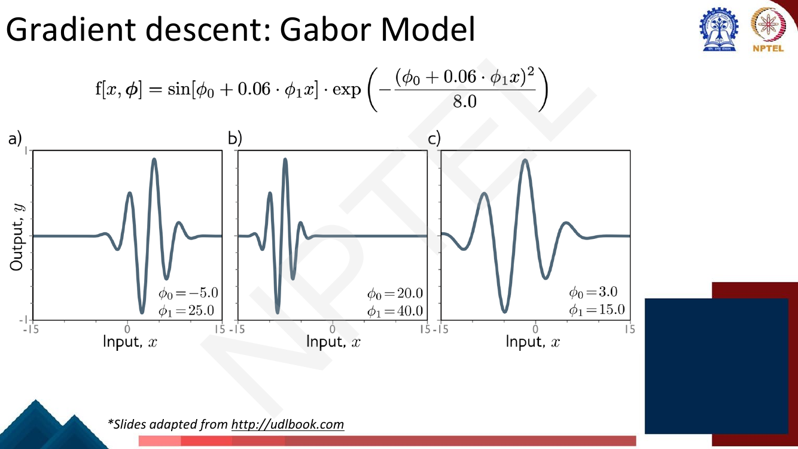
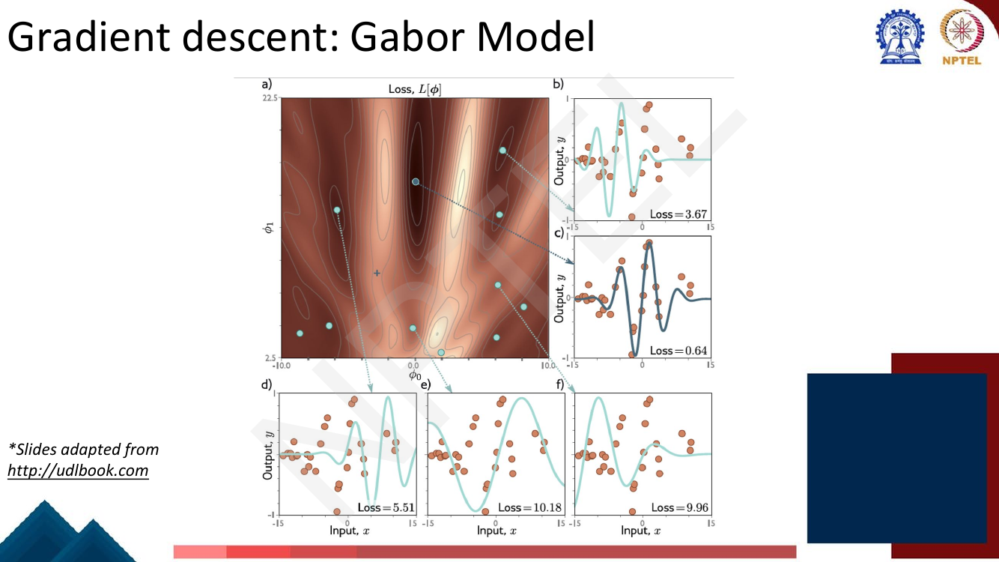
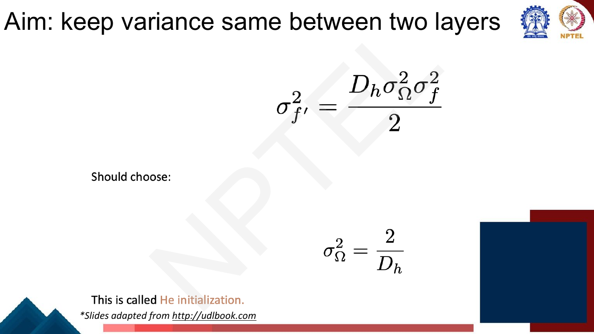

# Lec 10 — Gradient Descent and Initialization

> **Source:** `Week2.pdf` pp. 116–146 · **Week 2** · **Playlist:** Lec 10
> **Prereqs:** [Lec 9 — Backpropagation](09-backpropagation.md)
> **Feeds into:** [Lec 16 — RNN Language Models](../week-04/16-rnn-language-models.md), [Lec 39 — RLHF II: PPO](../week-08/39-rlhf-2-ppo.md), [Lec 51 — Scaling Laws](../week-11/51-scaling-laws.md)

## Why this lecture exists

[Lecture 9](09-backpropagation.md) showed you how to compute $\partial\mathcal{L}/\partial\theta$ for
every parameter in a deep network. That is a number, not a trained model. This lecture is the other
half: what you *do* with that number, and where the parameters were sitting when you started.

Both halves can fail on their own. A learning rate ten times too large makes the loss explode no
matter how exact your gradient was. A weight initialisation off by an order of magnitude kills the
signal before the first gradient is ever computed. And on a non-convex surface — which is every
network you will ever train — plain gradient descent carries no guarantee of finding anything good.

So this lecture builds the training loop that the remaining fifty chapters quietly assume: random
initialisation, mini-batches, momentum, and Adam. Everything from word2vec to a 70-billion-parameter
LLM is trained by the machinery on these thirty slides.

## The ideas

### A note on notation

This deck follows Prince's *Understanding Deep Learning*, which writes parameters as
$\boldsymbol{\phi}$, the model as $\mathrm{f}[x, \boldsymbol{\phi}]$, the loss as $L[\boldsymbol{\phi}]$
with square brackets, the learning rate as $\alpha$, the weight matrices as $\boldsymbol{\Omega}$ and
the biases as $\boldsymbol{\beta}$. **Per the book's convention I write parameters as $\theta$, the
loss as $\mathcal{L}$, the learning rate as $\eta$, and weights as $\mathbf{W}$.** The deck's
$\alpha$ is my $\eta$; the deck's $\boldsymbol{\Omega}$ is my $\mathbf{W}$; the deck's momentum
coefficients $\beta$ and $\gamma$ are my $\beta_1$ and $\beta_2$. Nothing else changes. I flag the
clashes once more where they could bite: the deck's $\boldsymbol{\beta}_k$ is a *bias vector*, not a
decay rate.

I also **reorder the deck**: it opens with initialisation and then does gradient descent. I teach
gradient descent first, because "keep the variance the same between two layers" only has a motive once
you know that an optimiser takes thousands of small steps and needs a live gradient at every one.

---

### Gradient descent: the update rule

You have a loss $\mathcal{L}(\theta)$ and you want the $\theta$ that minimises it. The gradient
$\nabla_\theta\mathcal{L}$ is a vector of partial derivatives, one per parameter, and it points in the
direction of **steepest increase** of the loss. So step the other way:

$$\theta \leftarrow \theta - \eta\,\nabla_\theta\mathcal{L}(\theta)$$

That single line is the whole algorithm. The positive scalar $\eta$ — the **learning rate** or step
size — is the only thing you control. It does not change the *direction* of the step (the gradient
fixes that); it sets the *magnitude*.


*Fig. — The deck's two-step statement. Notice the gradient is a **column vector with one entry per parameter**, so one update moves every parameter at once. Page 126 of Week2.pdf.*

As an algorithm:

1. **Initialise** $\theta$ randomly (the last section of this chapter says how).
2. **Forward pass:** compute the model's outputs and the loss $\mathcal{L}(\theta)$ on the current data.
3. **Backward pass:** compute $\nabla_\theta\mathcal{L}$ by backpropagation — [Lec 9](09-backpropagation.md) owns this entirely.
4. **Update:** $\theta \leftarrow \theta - \eta\,\nabla_\theta\mathcal{L}$.
5. **Repeat** from step 2 until the loss stops improving, or you run out of compute.

Two facts about $\eta$ that the exam likes. Too small and you converge correctly but take forever. Too
large and you overshoot the minimum and the loss *grows*. For a quadratic loss with curvature
$\mathcal{L}'' = c$ the stability condition is exactly $\eta < 2/c$ — cross it and the iterates
diverge geometrically, as [N1](#n1-gradient-descent-by-hand-and-the-divergence-threshold) shows.

### Worked example 1 — linear regression: the easy case

The deck's first demonstration is 1-D linear regression, $\mathrm{f}[x,\theta] = \theta_0 + \theta_1 x$,
with least-squares loss

$$\mathcal{L}(\theta) = \sum_{i=1}^{I} (\theta_0 + \theta_1 x_i - y_i)^2,
\qquad
\frac{\partial \ell_i}{\partial\theta} = \begin{bmatrix} 2(\theta_0 + \theta_1 x_i - y_i) \\ 2x_i(\theta_0 + \theta_1 x_i - y_i)\end{bmatrix}$$

Note the deck's step on the way: $\dfrac{\partial\mathcal{L}}{\partial\theta} = \dfrac{\partial}{\partial\theta}\sum_i \ell_i = \sum_i \dfrac{\partial \ell_i}{\partial\theta}$ — **the gradient of a
summed loss is the sum of the per-example gradients.** That interchange is what makes mini-batching
legitimate later, so it is worth noticing now.


*Fig. — Left: the loss surface is a single elongated bowl — **convex**, one minimum, no traps. Right: the same five iterates as fitted lines. Note the path is not straight: it crosses the contours at right angles, so it takes a dog-leg down the long axis of the ellipse. Page 130.*

The surface is a convex bowl. For a convex loss with a small enough $\eta$, gradient descent is
**guaranteed** to reach the global minimum. That guarantee is the entire reason this example is on the
slides — so that the next one can take it away.

### Worked example 2 — the Gabor model: the real case

The deck's second model is deliberately nasty:

$$\mathrm{f}[x,\theta] = \sin\!\big[\theta_0 + 0.06\,\theta_1 x\big] \cdot
\exp\!\left(-\frac{(\theta_0 + 0.06\,\theta_1 x)^2}{8.0}\right)$$

A sinusoid inside a Gaussian envelope — two parameters, and the $\sin$ makes the output *periodic* in
$\theta_0$.


*Fig. — The same two-parameter model producing three very different wave packets. Because $\theta_0$ enters inside a $\sin$, shifting it by $2\pi$ gives a near-identical function — which is precisely what manufactures the repeating ridges and valleys in the loss. Page 131.*


*Fig. — The same loss, now **non-convex**: a corrugated landscape of parallel valleys. Point (c) with loss 0.64 is the global minimum; (b) at 3.67 and (d) at 5.51 are perfectly respectable local minima that gradient descent will happily sit in forever. The lesson: **where you start decides which valley you die in**. Page 132.*

The contrast between these two examples is the pedagogical heart of the lecture. Same algorithm, same
update rule. On the convex bowl it is guaranteed; on the Gabor surface it is guaranteed only to stop
descending, which is not the same thing. **Every neural network loss surface is the second kind.**

### Gradient descent: the issues


*Fig. — The deck's three named failure modes. Look at the trajectory itself: the visible zig-zag in the upper section is **oscillation across a ravine** — the step keeps bouncing between the two walls instead of running down the floor. Page 133.*

The deck names three; two more are visible in its own plots. All five are examinable:

| Issue | What happens | What fixes it |
|---|---|---|
| **Local minima** | gradient is zero, loss is not the lowest possible; descent stops | good initialisation; SGD noise; restarts |
| **Saddle points** | gradient is zero but it is a minimum in some directions and a maximum in others | SGD noise; momentum carries you through |
| **Plateaus** | gradient is tiny over a wide region, so progress crawls | momentum (velocity accumulates); adaptive steps |
| **Ill-conditioning / ravines** | curvature far steeper in one direction than another, so the step oscillates across the ravine while crawling along it | momentum; per-parameter normalisation (Adam) |
| **Learning-rate sensitivity** | one global $\eta$ must suit both the steep and the flat directions, and no single value does | adaptive per-parameter learning rates (Adam) |

A useful correction to intuition: in a space of millions of parameters, **saddle points vastly
outnumber local minima**. For a point to be a local minimum the curvature must be positive in *every*
one of the millions of directions; for a saddle it need only be positive in some. Saddles, not local
minima, are what actually slows deep-network training down.

### Stochastic gradient descent

Computing $\nabla_\theta\mathcal{L}$ over the whole dataset for one update is wasteful and, for a
corpus of billions of tokens, impossible. The deck's idea is one word: **add noise**.

Full-batch descent sums the gradient over all $I$ examples; SGD sums over a **mini-batch**
$\mathcal{B}_t$ only:

$$\text{batch: } \theta_{t+1} \leftarrow \theta_t - \eta\sum_{i=1}^{I}\frac{\partial\ell_i(\theta_t)}{\partial\theta}
\qquad
\text{SGD: } \theta_{t+1} \leftarrow \theta_t - \eta\sum_{i\in\mathcal{B}_t}\frac{\partial\ell_i(\theta_t)}{\partial\theta}$$

The deck's operational detail, easily missed and easily examined: you **work through the dataset
sampling without replacement**, and one full pass through the data is an **epoch**. Sampling without
replacement means each example is used exactly once per epoch; the batches are reshuffled each epoch.

| Variant | Samples per update | Updates per epoch | Character |
|---|---|---|---|
| **Batch (full-batch)** | all $N$ | 1 | exact gradient, smooth descent, very slow, needs all data in memory |
| **Stochastic (true SGD)** | 1 | $N$ | extremely noisy, cheap per step, cannot use vectorised hardware |
| **Mini-batch** | $B$ (typically 32–256) | $\lceil N/B\rceil$ | the practical compromise — what "SGD" means in every modern paper |


*Fig. — The deck's key claim, visible in the picture: the SGD path (b) is visibly jagged and **crosses a ridge** that the smooth path (a) could never climb. Noise is not purely a cost — it is the escape mechanism. Page 136.*

Why the noise helps: each mini-batch gradient is an unbiased but noisy estimate of the full gradient.
At a saddle point or a shallow local minimum the *true* gradient is zero, so full-batch descent stops
dead; the *mini-batch* gradient is almost never exactly zero, so SGD keeps jittering and eventually
wanders off the saddle. The deck states this carefully — "SGD can, **in principle**, escape local
minima" — because there is no guarantee, only a mechanism.

Two further consequences worth knowing. Smaller batches mean more noise, which acts as a mild
regulariser but makes the loss curve jagged. Larger batches give a cleaner gradient and better GPU
utilisation but fewer updates per epoch, so you generally have to raise $\eta$ to compensate.

### Momentum

The ravine problem is not solved by noise. The deck's fix is to step not along the current gradient
but along an **exponentially weighted moving average** of the gradients so far:

$$\mathbf{v}_t = \beta\,\mathbf{v}_{t-1} + (1-\beta)\,\nabla_\theta\mathcal{L}(\theta_t),
\qquad
\theta_{t+1} \leftarrow \theta_t - \eta\,\mathbf{v}_t$$

with $\mathbf{v}_0 = \mathbf{0}$ and $\beta \approx 0.9$. The deck's own gloss: "the recursive
formulation means that the gradient is an infinite weighted sum of all the previous gradients, with
weights getting smaller as we move back in time." Unroll it and you see exactly that:

$$\mathbf{v}_t = (1-\beta)\sum_{k=0}^{t-1}\beta^{k}\,\nabla_\theta\mathcal{L}(\theta_{t-k})$$

A gradient from 10 steps ago still contributes, with weight $0.9^{10} \approx 0.35$. With
$\beta = 0.9$ the average has an effective memory of about $1/(1-\beta) = 10$ steps.

Now the ravine. Across the ravine the gradient **alternates sign** every step, so consecutive terms in
the average cancel and the velocity stays small — the oscillation is damped. Along the ravine floor
the gradient has a **consistent sign**, so the terms reinforce and the velocity grows — progress
accelerates. Momentum is a low-pass filter on the gradient: it kills the component that keeps changing
its mind and keeps the component that does not.


*Fig. — Same starting points, same learning rate. The right-hand paths are visibly **straighter and smoother** — the sideways jitter has been averaged away, and both runs make it further along the valley floor. Page 138.*

One honest caveat the slides do not state. In this $(1-\beta)$-weighted form the velocity *starts*
smaller than the gradient — at step 1, $\mathbf{v}_1 = 0.1\,\nabla\mathcal{L}$ — so on a well-behaved
bowl momentum is initially *slower* than plain gradient descent ([N2](#n2-momentum-on-a-ravine-versus-plain-gradient-descent)
shows this). Its payoff is that it lets you use a learning rate **past the point where plain gradient
descent diverges**, and that is where the speed comes from. The code block measures exactly this: at
$\eta = 0.025$ on a ravine with condition number 100, plain descent explodes to $10^{36}$ while
momentum converges. (The other common convention, $\mathbf{v}_t = \beta\mathbf{v}_{t-1} + \nabla\mathcal{L}$
without the $(1-\beta)$, is what PyTorch's `SGD(momentum=0.9)` implements; it is the same algorithm
with the learning rate rescaled by $1/(1-\beta) = 10$.)

### Learning-rate sensitivity, and normalized gradients


*Fig. — The dilemma in one picture. At $\eta = 0.05$ (a) the steep direction is handled but the flat direction crawls to a stop. At $\eta = 1.0$ (b) the flat direction would move, but the steep direction detonates. **No single $\eta$ serves both.** Page 139.*

The deck's question — "can we normalize the gradients?" — leads to a per-parameter fix. Measure the
gradient and its pointwise square, then divide:

$$\mathbf{m}_{t+1} \leftarrow \nabla_\theta\mathcal{L}(\theta_t), \qquad
\mathbf{v}_{t+1} \leftarrow \big(\nabla_\theta\mathcal{L}(\theta_t)\big)^2, \qquad
\theta_{t+1} \leftarrow \theta_t - \eta\cdot\frac{\mathbf{m}_{t+1}}{\sqrt{\mathbf{v}_{t+1}} + \epsilon}$$

All operations are **elementwise**, so every parameter gets its own effective step. The deck's own
worked illustration: if $\mathbf{m}_{t+1} = [3, -2, 5]^\top$ then
$\mathbf{v}_{t+1} = [9, 4, 25]^\top$ and
$\mathbf{m}/(\sqrt{\mathbf{v}}+\epsilon) = [1, -1, 1]^\top$ — the magnitudes are gone and only the
**signs** survive. Every parameter moves by exactly $\eta$, whether its gradient was 2 or 5.

That is the strength and the fatal flaw. The deck states it plainly: *"makes good progress, but will
not converge."* Because the step size never shrinks as you approach the minimum, the iterate bounces
around it forever instead of settling. The constant $\epsilon$ (a tiny number, typically $10^{-8}$) is
there only to stop division by zero.

### Adam — Adaptive Moment Estimation

Adam is the obvious repair: apply **momentum to both** the gradient and its square, so neither is a
single noisy sample. Then fix the bias that momentum-from-zero introduces.


*Fig. — All three stages of Adam on one slide. The deck writes the decay rates as $\beta$ and $\gamma$ and the bias-correction exponent as $t{+}1$ because its iteration counter starts at $t = 0$; the standard statement indexes from $t = 1$ and writes $\beta_1$, $\beta_2$. Same algorithm. Page 142.*

**Stage 1 — the two moments.** With $\mathbf{m}_0 = \mathbf{v}_0 = \mathbf{0}$ and
$\mathbf{g}_t = \nabla_\theta\mathcal{L}(\theta_{t-1})$:

$$\mathbf{m}_t = \beta_1\mathbf{m}_{t-1} + (1-\beta_1)\,\mathbf{g}_t
\qquad\text{(first moment — an estimate of the mean gradient)}$$
$$\mathbf{v}_t = \beta_2\mathbf{v}_{t-1} + (1-\beta_2)\,\mathbf{g}_t^2
\qquad\text{(second moment — an estimate of the mean squared gradient)}$$

$\mathbf{m}$ is momentum. $\mathbf{v}$ is the RMSProp-style running average of squared gradients.
Squaring is elementwise, so $\mathbf{v}$ is a per-parameter measure of how large that parameter's
gradients have recently been.

**Stage 2 — bias correction, and why it is needed.** Both averages start at exactly zero, and zero is
not a plausible estimate of anything. After one step, $\mathbf{m}_1 = (1-\beta_1)\mathbf{g}_1 =
0.1\,\mathbf{g}_1$ — ten times too small — and $\mathbf{v}_1 = (1-\beta_2)\mathbf{g}_1^2 =
0.001\,\mathbf{g}_1^2$ — a thousand times too small. **Both estimates are biased toward zero**, badly
so in the first few dozen steps, and more severely for $\mathbf{v}$ because $\beta_2 = 0.999$ is
closer to 1. Dividing out the bias:

$$\hat{\mathbf{m}}_t = \frac{\mathbf{m}_t}{1-\beta_1^{\,t}},
\qquad
\hat{\mathbf{v}}_t = \frac{\mathbf{v}_t}{1-\beta_2^{\,t}}$$

The derivation in one line: if the gradient were a constant $g$, then
$m_t = (1-\beta_1)\sum_{k=0}^{t-1}\beta_1^k g = (1-\beta_1^{\,t})\,g$, so dividing by $(1-\beta_1^{\,t})$
recovers $g$ exactly. The correction factor $\to 1$ as $t$ grows, so it matters only early — which is
exactly when a bad step can wreck a run.

The exam-worthy detail is the **direction** of the error. Both moments are too small, but $\mathbf{v}$
enters under a square root, so its bias contributes a factor $\sqrt{1-\beta_2^{\,t}}$ while
$\mathbf{m}$'s contributes $(1-\beta_1^{\,t})$. At $t = 1$ that is $\sqrt{0.001} = 0.0316$ against
$0.1$, so an uncorrected Adam takes a first step $0.1/0.0316 = 3.16$ times **too large**, not too
small. Bias correction tames the opening steps.

**Stage 3 — the update.**

$$\theta_{t} \leftarrow \theta_{t-1} - \eta\cdot\frac{\hat{\mathbf{m}}_t}{\sqrt{\hat{\mathbf{v}}_t} + \epsilon}$$

**Defaults: $\beta_1 = 0.9$, $\beta_2 = 0.999$, $\epsilon = 10^{-8}$.** (The deck's plots use
$\eta = 0.05$, $\beta = 0.9$, $\gamma = 0.99$.) Learn those three numbers; they are the most
MCQ-able constants in the whole of Week 2.

A property worth internalising: because $\hat{\mathbf{m}}$ and $\sqrt{\hat{\mathbf{v}}}$ have the same
units, the ratio is dimensionless and bounded near $\pm 1$. **Adam's step size is approximately $\eta$
per parameter, almost regardless of the gradient's magnitude.** [N3](#n3-one-adam-step-by-hand-with-bias-correction)
shows exactly this: starting from a gradient of 8.0, the first three Adam steps are 0.100000, 0.099926
and 0.099800. That is why Adam is so robust to a badly scaled loss, and also why $\eta$ for Adam is
typically $10^{-3}$ to $10^{-5}$ — much smaller than for SGD.


*Fig. — The payoff. Normalized gradients (c) reach the valley and then **rattle along it forever**. Adam (d) spirals in and stops. The difference is entirely the momentum averaging in $\mathbf{m}$ and $\mathbf{v}$, which lets the effective step shrink near the minimum. Page 143.*

### Comparison: what each method adds and what it costs

| Method | Update | Adds | Costs | Extra state per parameter |
|---|---|---|---|---|
| **Batch GD** | $\theta \leftarrow \theta - \eta\nabla\mathcal{L}$ over all data | exact gradient, smooth | 1 update per epoch; whole dataset in memory | 0 |
| **SGD / mini-batch** | same, over $\mathcal{B}_t$ | many cheap updates; noise escapes saddles and shallow minima | jagged loss; still one global $\eta$; oscillates in ravines | 0 |
| **Momentum** | $\mathbf{v}_t = \beta\mathbf{v}_{t-1} + (1-\beta)\mathbf{g}_t$ | damps oscillation, accelerates along consistent directions, tolerates a larger $\eta$ | one more hyperparameter $\beta$; can overshoot a sharp minimum | 1 ($\mathbf{v}$) |
| **Normalized gradients / RMSProp** | divide by $\sqrt{\mathbf{v}}$ | per-parameter step size; immune to gradient scale | **does not converge** — step never shrinks near the minimum | 1 ($\mathbf{v}$) |
| **Adam** | both moments + bias correction | momentum *and* per-parameter scaling, stable from step 1 | 3 hyperparameters; **2× the optimiser memory**; can generalise slightly worse than tuned SGD | 2 ($\mathbf{m}$, $\mathbf{v}$) |

That memory column matters later: Adam stores two extra float values per parameter, so a model that
needs 2 bytes per weight needs roughly **three times** that to train. [Lec 48](../week-10/48-quantization-qlora-1.md)
builds its whole GPU-memory accounting on this fact, and [Lec 39](../week-08/39-rlhf-2-ppo.md)'s PPO
loop runs Adam over a policy network while holding a frozen reference model alongside it.

---

### Initialization: where the loop starts

Gradient descent is only as good as the point it starts from, and on a non-convex surface
initialisation literally decides which valley you end up in. But there is a more basic failure first:
a badly scaled initialisation destroys the signal before step 1.

**Zero initialisation is fatal.** If every weight in a layer is 0 (or any single constant), every unit
in that layer computes the same pre-activation, therefore receives the same gradient, therefore
updates identically, forever. The layer has the expressive power of one unit no matter how wide it is.
This is the **symmetry-breaking** problem, and it is why weights must be **random**. Biases, which do
not suffer from it, are safely set to zero — and the deck does exactly that.

The deck's setup: write the layer in terms of **pre-activations** $\mathbf{f}_k$,

$$\mathbf{f}_k = \mathbf{b}_k + \mathbf{W}_k\mathbf{h}_k = \mathbf{b}_k + \mathbf{W}_k\,a[\mathbf{f}_{k-1}]$$

set all biases $\mathbf{b}_k = \mathbf{0}$, and draw weights from $\mathcal{N}(0, \sigma_W^2)$. Then it
asks the right question: *what happens as we move through the network if $\sigma_W^2$ is very small? if
it is very large?*


*Fig. — A 50-layer network with $D_h = 100$ units per layer. Only $\sigma_W^2 = 0.02$ gives the **flat grey line** in both panels. Everything else runs away by tens of orders of magnitude over 50 layers — note the axes span $10^{-100}$ to $10^{100}$. And $0.02 = 2/100 = 2/D_h$. Page 119.*

Hence the aim the deck states as a slide title: **keep the variance the same between two layers.** If
each layer multiplies the variance by a factor $r$, then after $L$ layers the signal is scaled by
$r^L$. Any $r \ne 1$ is a disaster at depth: $r = 1.1$ over 50 layers gives $117\times$; $r = 0.9$
gives $0.005\times$. Too small and activations and gradients **vanish** — the network learns nothing.
Too large and they **explode** — the loss becomes NaN. You want $r = 1$.

**The derivation.** Take one layer $\mathbf{f}' = \mathbf{b} + \mathbf{W}\mathbf{h}$ with $D_h$ inputs.

*Mean.* With biases zero, weights zero-mean, and weights independent of the activations,

$$\mathbb{E}[f'_i] = \mathbb{E}[b_i] + \sum_{j=1}^{D_h}\mathbb{E}[W_{ij}]\,\mathbb{E}[h_j] = 0 + \sum_j 0\cdot\mathbb{E}[h_j] = 0$$

so the pre-activations are centred. That is what lets the variance step be clean.

*Variance.* Since the mean is zero, $\sigma^2_{f'} = \mathbb{E}[f_i'^2]$, and expanding the square,
the cross terms $\mathbb{E}[W_{ij}W_{ik}] = 0$ for $j \ne k$ by independence, leaving only the
diagonal:

$$\sigma^2_{f'} = \sum_{j=1}^{D_h}\mathbb{E}[W_{ij}^2]\,\mathbb{E}[h_j^2] = \sigma_W^2\sum_{j=1}^{D_h}\mathbb{E}[h_j^2]$$

*Now put ReLU in.* With $h_j = \mathrm{ReLU}[f_j]$ and $f_j$ symmetric about zero, ReLU zeroes the
negative half, so the integral runs only over $f_j > 0$ and picks up exactly half the second moment:

$$\mathbb{E}\big[\mathrm{ReLU}[f_j]^2\big] = \int_{0}^{\infty} f_j^2\,\Pr(f_j)\,df_j = \frac{\sigma_f^2}{2}$$

Substituting:

$$\sigma^2_{f'} = \sigma_W^2\sum_{j=1}^{D_h}\frac{\sigma_f^2}{2} = \frac{D_h\,\sigma_W^2\,\sigma_f^2}{2}$$


*Fig. — Set $\sigma^2_{f'} = \sigma^2_f$ (variance preserved) and solve: $\sigma_W^2 = 2/D_h$. **That factor of 2 is ReLU's half-the-inputs correction** — without it the variance would halve at every layer. Page 124.*

**He initialization** (He et al., 2015), for **ReLU**:

$$\mathrm{Var}(W) = \frac{2}{n_{\text{in}}}, \qquad \sigma_W = \sqrt{\frac{2}{n_{\text{in}}}}$$

**Xavier / Glorot initialization** (2010), for **tanh and sigmoid**, which are odd and roughly linear
near zero and so do *not* throw away half the signal:

$$\mathrm{Var}(W) = \frac{2}{n_{\text{in}} + n_{\text{out}}}$$

Xavier averages the forward requirement ($1/n_{\text{in}}$, preserving activation variance) and the
backward requirement ($1/n_{\text{out}}$, preserving gradient variance) — hence the harmonic-style
compromise $2/(n_{\text{in}}+n_{\text{out}})$. The He rule is the fan-in version with ReLU's factor of
2 folded in.

**Match the initialiser to the activation: Xavier with tanh/sigmoid, He with ReLU.** That sentence is
the exam question. The code block shows what happens if you get it wrong: Xavier's $\sigma$ pushed
through 50 ReLU layers collapses the activation variance to $10^{-15}$, while He holds it steady.

### Training-algorithm hyperparameters

The deck closes by naming them: **choice of learning algorithm, batch size, learning-rate schedule,
and momentum coefficients are all hyperparameters of the training algorithm** — not parameters, since
gradient descent does not learn them. The standard remedy is to train many models with different
settings and pick the best, which is **hyper-parameter search**. Note that "learning-rate schedule"
appears here in a list and is never defined on the deck; see *Beyond the slides*.

You met this material from a vision angle in the companion course's
[supplementary chapter](../../../GenAIforCV/notes/supplementary.md), which gives Xavier/He and the
optimiser family as a short reference. This chapter is the primary treatment: the NPTEL exam is set
from *these* slides, with this deck's derivation of $\sigma_W^2 = 2/D_h$ and its Gabor example.

## Worked numericals

The deck contains **no "Try this problem" pages** in the range 116–146 — I checked all 31 pages. The
five below are built to the exam's shape, and every one of them is reproduced by the code block.

### N1. Gradient descent by hand, and the divergence threshold
**Given:** $\mathcal{L}(\theta) = \theta^2$, so $\nabla\mathcal{L} = 2\theta$. Start at $\theta_0 = 4$.
**Find:** three steps with $\eta = 0.1$, then three steps with $\eta = 1.1$, and the stability threshold.

1. The update is $\theta \leftarrow \theta - \eta(2\theta) = \theta(1 - 2\eta)$. With $\eta = 0.1$ the
   multiplier is $1 - 0.2 = 0.8$.
2. $\theta_1 = 4 \times 0.8 = 3.2$, and $\mathcal{L} = 3.2^2 = 10.24$ (down from 16).
3. $\theta_2 = 3.2 \times 0.8 = 2.56$, $\mathcal{L} = 6.5536$.
4. $\theta_3 = 2.56 \times 0.8 = 2.048$, $\mathcal{L} = 4.194304$. Monotone descent toward $\theta^\ast = 0$.
5. Now $\eta = 1.1$: multiplier $= 1 - 2(1.1) = -1.2$.
6. $\theta_1 = 4 \times (-1.2) = -4.8$, $\mathcal{L} = 23.04$ — **the loss went up**.
7. $\theta_2 = -4.8 \times (-1.2) = 5.76$, $\mathcal{L} = 33.18$.
8. $\theta_3 = 5.76 \times (-1.2) = -6.912$, $\mathcal{L} = 47.77$. It alternates sign and grows by
   $1.2\times$ every step — **divergence**.
9. The condition for convergence is $|1 - 2\eta| < 1$, i.e. $0 < \eta < 1$. In general, for curvature
   $\mathcal{L}'' = c$, the threshold is $\eta < 2/c$; here $c = 2$ so $\eta < 1$. ✓
10. At the special value $\eta = 0.5$ the multiplier is exactly 0 and you land on the minimum in **one
    step** — the Newton step for a quadratic.

**Answer:** $\eta = 0.1$ gives $4 \to 3.2 \to 2.56 \to 2.048$ (converging); $\eta = 1.1$ gives
$4 \to -4.8 \to 5.76 \to -6.912$ (diverging). Threshold $\eta = 1$.

### N2. Momentum on a ravine versus plain gradient descent
**Given:** $\mathcal{L}(\theta_0,\theta_1) = \tfrac{1}{2}(10\theta_0^2 + \theta_1^2)$, so
$\nabla\mathcal{L} = (10\theta_0,\ \theta_1)$. Start at $(1, 1)$ with $\eta = 0.15$. For momentum,
$\beta = 0.9$ and $\mathbf{v}_0 = (0,0)$.
**Find:** three steps of each.

*Plain gradient descent.* The update factorises: $\theta_0 \leftarrow \theta_0(1 - 1.5) = -0.5\theta_0$
and $\theta_1 \leftarrow \theta_1(1 - 0.15) = 0.85\theta_1$.

1. $t=1$: $\mathbf{g} = (10, 1)$, so $\theta = (1 - 1.5,\ 1 - 0.15) = (-0.5,\ 0.85)$.
2. $t=2$: $\mathbf{g} = (-5,\ 0.85)$, so $\theta = (-0.5 + 0.75,\ 0.85 - 0.1275) = (0.25,\ 0.7225)$.
3. $t=3$: $\mathbf{g} = (2.5,\ 0.7225)$, so $\theta = (0.25 - 0.375,\ 0.7225 - 0.1084) = (-0.125,\ 0.614125)$.
4. **$\theta_0$ flips sign every step** — $+1, -0.5, +0.25, -0.125$ — while $\theta_1$ inches down.
   That is the ravine oscillation, in numbers.

*With momentum.*

5. $t=1$: $\mathbf{g} = (10, 1)$. $\mathbf{v}_1 = 0.9(0,0) + 0.1(10, 1) = (1,\ 0.1)$.
   $\theta = (1,1) - 0.15(1, 0.1) = (0.85,\ 0.985)$.
6. $t=2$: $\mathbf{g} = (8.5,\ 0.985)$. $\mathbf{v}_2 = 0.9(1, 0.1) + 0.1(8.5, 0.985) = (0.9 + 0.85,\ 0.09 + 0.0985) = (1.75,\ 0.1885)$.
   $\theta = (0.85,\ 0.985) - 0.15(1.75,\ 0.1885) = (0.5875,\ 0.956725)$.
7. $t=3$: $\mathbf{g} = (5.875,\ 0.956725)$. $\mathbf{v}_3 = 0.9(1.75, 0.1885) + 0.1(5.875, 0.956725) = (1.575 + 0.5875,\ 0.16965 + 0.09567) = (2.1625,\ 0.265322)$.
   $\theta = (0.5875,\ 0.956725) - 0.15(2.1625,\ 0.265322) = (0.263125,\ 0.916927)$.
8. **The velocity in the steep coordinate grows $1 \to 1.75 \to 2.1625$** while $\theta_0$ descends
   *monotonically* $1 \to 0.85 \to 0.5875 \to 0.263$ with **no sign flips at all**. The oscillation
   is gone.
9. Be honest about the cost: in the flat coordinate momentum has only reached $0.917$ where plain
   descent reached $0.614$, because the $(1-\beta)$ factor throttles the first few steps. Momentum's
   real win is that it stays stable at learning rates where plain descent explodes — see the code.

**Answer:** GD $\to (-0.125, 0.614)$ with $\theta_0$ oscillating; momentum $\to (0.263, 0.917)$ with
$\theta_0$ monotone and velocity accumulating $1 \to 1.75 \to 2.1625$.

### N3. One Adam step by hand, with bias correction
**Given:** $\mathcal{L}(\theta) = \theta^2$, $\nabla\mathcal{L} = 2\theta$, $\theta_0 = 4$.
Adam with $\eta = 0.1$, $\beta_1 = 0.9$, $\beta_2 = 0.999$, $\epsilon = 10^{-8}$,
$m_0 = v_0 = 0$.
**Find:** $m_1$, $v_1$, $\hat{m}_1$, $\hat{v}_1$, the step, and $\theta_1$. Then do $t = 2$.

**Step $t = 1$.**

1. Gradient: $g_1 = 2\theta_0 = 2(4) = 8$.
2. First moment: $m_1 = \beta_1 m_0 + (1-\beta_1)g_1 = 0.9(0) + 0.1(8) = \mathbf{0.8}$.
3. Second moment: $v_1 = \beta_2 v_0 + (1-\beta_2)g_1^2 = 0.999(0) + 0.001(64) = \mathbf{0.064}$.
4. Bias correction, first moment: $1 - \beta_1^1 = 1 - 0.9 = 0.1$, so
   $\hat{m}_1 = 0.8 / 0.1 = \mathbf{8.0}$ — exactly the gradient, as it should be.
5. Bias correction, second moment: $1 - \beta_2^1 = 1 - 0.999 = 0.001$, so
   $\hat{v}_1 = 0.064 / 0.001 = \mathbf{64.0}$ — exactly $g_1^2$. ✓
6. Step: $\eta\,\hat{m}_1/(\sqrt{\hat{v}_1} + \epsilon) = 0.1 \times 8.0/(8.0 + 10^{-8}) = 0.1 \times 0.99999999 = \mathbf{0.1}$.
7. $\theta_1 = 4 - 0.1 = \mathbf{3.9}$.

**Step $t = 2$.**

8. $g_2 = 2(3.9) = 7.8$.
9. $m_2 = 0.9(0.8) + 0.1(7.8) = 0.72 + 0.78 = \mathbf{1.5}$.
10. $v_2 = 0.999(0.064) + 0.001(7.8^2) = 0.063936 + 0.001(60.84) = 0.063936 + 0.06084 = \mathbf{0.124776}$.
11. $1 - \beta_1^2 = 1 - 0.81 = 0.19$, so $\hat{m}_2 = 1.5/0.19 = \mathbf{7.894737}$.
12. $1 - \beta_2^2 = 1 - 0.998001 = 0.001999$, so $\hat{v}_2 = 0.124776/0.001999 = \mathbf{62.41921}$.
13. $\sqrt{62.41921} = 7.900583$.
14. Step $= 0.1 \times 7.894737/7.900583 = 0.1 \times 0.999260 = \mathbf{0.099926}$.
15. $\theta_2 = 3.9 - 0.099926 = \mathbf{3.800074}$.

**What bias correction bought you.** Without it, step 1 would be
$0.1 \times m_1/\sqrt{v_1} = 0.1 \times 0.8/\sqrt{0.064} = 0.1 \times 0.8/0.252982 = 0.316228$ —
**3.16× too large**, because $v_1$ is underestimated by $1000\times$ and the square root turns that
into $31.6\times$ while $m_1$ is only underestimated by $10\times$. The inflation is exactly
$(1-\beta_1)/\sqrt{1-\beta_2} = 0.1/0.0316228 = 3.16228$.

**Answer:** $m_1 = 0.8$, $v_1 = 0.064$, $\hat{m}_1 = 8.0$, $\hat{v}_1 = 64.0$, step $= 0.1$,
$\theta_1 = 3.9$; then $\theta_2 = 3.800074$ with step $0.099926$. **Adam's step is $\approx \eta$
whatever the gradient was** — that is the whole character of the algorithm.

### N4. Xavier, He, and why $\mathcal{N}(0,1)$ is hopeless
**Given:** a fully connected layer with $n_{\text{in}} = 1024$ and $n_{\text{out}} = 256$ (a
Transformer FFN down-projection). Inputs have unit variance.
**Find:** the initialisation standard deviation under Xavier and He, and the pre-activation scale
under each and under naive $\mathcal{N}(0,1)$.

1. Xavier: $\mathrm{Var}(W) = \dfrac{2}{n_{\text{in}}+n_{\text{out}}} = \dfrac{2}{1024+256} = \dfrac{2}{1280} = 0.0015625$.
2. $\sigma_{\text{Xavier}} = \sqrt{0.0015625} = \mathbf{0.039528}$.
3. He: $\mathrm{Var}(W) = \dfrac{2}{n_{\text{in}}} = \dfrac{2}{1024} = 0.001953125$.
4. $\sigma_{\text{He}} = \sqrt{0.001953125} = \mathbf{0.044194}$. He is $0.044194/0.039528 = 1.118\times$
   wider, as it must be, since it compensates for ReLU.
5. Pre-activation standard deviation under He: $\sqrt{n_{\text{in}}\sigma_W^2} = \sqrt{1024 \times 0.001953} = \sqrt{2} = 1.414$. Under Xavier: $\sqrt{1024 \times 0.0015625} = \sqrt{1.6} = 1.265$. Both $\mathcal{O}(1)$. ✓
6. Naive $\mathcal{N}(0,1)$, i.e. $\sigma_W = 1$: pre-activation std $= \sqrt{1024 \times 1} = \mathbf{32}$.
7. That is $32/1.414 = 22.6\times$ too large in standard deviation and $1/0.001953 = \mathbf{512\times}$
   too large in variance. A tanh at $\pm 32$ is saturated to $\pm 1$ with derivative $\approx 10^{-27}$
   — the layer is dead on arrival.
8. The deck's own case, $D_h = 100$: He gives $\sigma_W^2 = 2/100 = \mathbf{0.02}$ (the flat grey curve
   on page 119), $\sigma_W = 0.1414$. Xavier on the same square layer would give $2/200 = 0.01$,
   $\sigma_W = 0.1$ — a factor $\sqrt{2}$ smaller, which over 50 ReLU layers means the variance falls
   by $2^{-50} \approx 10^{-15}$.

**Answer:** Xavier $\sigma = 0.0395$, He $\sigma = 0.0442$, naive $\sigma = 1$ (512× too much variance).
Deck's $D_h = 100$ case: $\sigma_W^2 = 0.02$.

### N5. Counting updates: batch, stochastic and mini-batch
**Given:** a training set of $N = 60{,}000$ sentences, trained for 5 epochs, mini-batch size $B = 32$.
**Find:** updates per epoch and total updates under each variant, and the total gradient evaluations.

1. **Full batch:** 1 update per epoch. Total $= 1 \times 5 = \mathbf{5}$ updates.
2. **True SGD** (one sample per update): $60{,}000$ updates per epoch. Total $= 60{,}000 \times 5 = \mathbf{300{,}000}$ updates.
3. **Mini-batch, $B = 32$:** $\lceil 60{,}000/32 \rceil = \lceil 1875.0 \rceil = 1875$ updates per epoch.
   Total $= 1875 \times 5 = \mathbf{9{,}375}$ updates.
4. Per-sample gradient evaluations are the **same in all three**: $60{,}000 \times 5 = 300{,}000$.
   Only the *grouping* into updates differs.
5. Sanity check on a non-dividing batch size: with $B = 64$, $\lceil 60{,}000/64 \rceil = \lceil 937.5 \rceil = 938$
   per epoch (937 full batches plus one of 32 leftovers).

**Answer:** 5 / 300,000 / 9,375 total updates. Full batch takes far too few steps to converge; true
SGD pays huge per-sample overhead and cannot use vectorised hardware; mini-batch is the compromise
everybody uses.

## Code

```python
import numpy as np

# L(theta) = theta^2  ->  dL/dtheta = 2*theta.  Curvature L'' = 2, so plain
# gradient descent is stable only while eta < 2/L'' = 1.
grad = lambda th: 2.0 * th

def gd(theta, eta, steps):
    traj = [theta]
    for _ in range(steps):
        theta = theta - eta * grad(theta)     # the whole algorithm
        traj.append(theta)
    return np.array(traj)

print("eta=0.10 (stable)  :", np.round(gd(4.0, 0.10, 5), 4))
print("eta=0.50 (one-shot):", np.round(gd(4.0, 0.50, 5), 4))
print("eta=1.10 (diverges):", np.round(gd(4.0, 1.10, 5), 4))

# eta=0.10 (stable)  : [4.     3.2    2.56   2.048  1.6384 1.3107]
# eta=0.50 (one-shot): [4. 0. 0. 0. 0. 0.]
# eta=1.10 (diverges): [ 4.     -4.8     5.76   -6.912   8.2944 -9.9533]
```

The first and third lines are N1 exactly. The middle line is the $\eta = 0.5$ Newton step.

```python
import numpy as np

# Ravine:  L = 0.5*(10*t0^2 + t1^2).  Steep in t0, flat in t1.
C = np.array([10.0, 1.0])
G = lambda p: C * p

def descend(kind, eta=0.15, beta=0.9, steps=3):
    p, v = np.array([1.0, 1.0]), np.zeros(2)
    print(f"  {kind:9s} start {p}")
    for t in range(1, steps + 1):
        g = G(p)
        if kind == "plain GD":
            p = p - eta * g
            print(f"    t={t}  g={np.round(g,4)}  theta={np.round(p,6)}")
        else:
            v = beta * v + (1 - beta) * g      # exponentially weighted gradient
            p = p - eta * v
            print(f"    t={t}  g={np.round(g,4)}  v={np.round(v,6)}  theta={np.round(p,6)}")

descend("plain GD")
descend("momentum")

#   plain GD  start [1. 1.]
#     t=1  g=[10.  1.]       theta=[-0.5   0.85]
#     t=2  g=[-5.    0.85]   theta=[0.25   0.7225]
#     t=3  g=[2.5   0.7225]  theta=[-0.125    0.614125]
#   momentum  start [1. 1.]
#     t=1  g=[10.  1.]       v=[1.      0.1]       theta=[0.85     0.985]
#     t=2  g=[8.5   0.985]   v=[1.75    0.1885]    theta=[0.5875   0.956725]
#     t=3  g=[5.875 0.9567]  v=[2.1625  0.265322]  theta=[0.263125 0.916927]
```

Matches N2 to every digit. Read the first column of each `theta`: plain GD flips sign every step,
momentum does not.

```python
import numpy as np

grad = lambda th: 2.0 * th                    # L(theta) = theta^2 again

def adam(theta, alpha=0.1, b1=0.9, b2=0.999, eps=1e-8, steps=3):
    m = v = 0.0
    for t in range(1, steps + 1):
        g  = grad(theta)
        m  = b1 * m + (1 - b1) * g            # 1st moment  (momentum)
        v  = b2 * v + (1 - b2) * g * g        # 2nd moment  (RMSProp)
        mh = m / (1 - b1**t)                  # bias correction
        vh = v / (1 - b2**t)
        step = alpha * mh / (np.sqrt(vh) + eps)
        print(f"t={t}  g={g:.6f}  m={m:.6f}  v={v:.6f}  "
              f"mhat={mh:.6f}  vhat={vh:.6f}  step={step:.6f}")
        theta -= step
    return theta

print("theta_3 =", round(adam(4.0), 6))

g = 8.0                                        # what bias correction is worth at t=1
m_raw, v_raw = 0.1 * g, 0.001 * g * g
print("uncorrected first step:", round(0.1 * m_raw / np.sqrt(v_raw), 6),
      " corrected:", 0.1,
      " inflation:", round((0.1 * m_raw / np.sqrt(v_raw)) / 0.1, 6))

# t=1  g=8.000000  m=0.800000  v=0.064000  mhat=8.000000  vhat=64.000000  step=0.100000
# t=2  g=7.800000  m=1.500000  v=0.124776  mhat=7.894737  vhat=62.419210  step=0.099926
# t=3  g=7.600148  m=2.110015  v=0.182413  mhat=7.786032  vhat=60.865336  step=0.099800
# theta_3 = 3.700274
# uncorrected first step: 0.316228  corrected: 0.1  inflation: 3.162278
```

N3 line by line, including the 3.162× inflation. Look at the `step` column: 0.100000, 0.099926,
0.099800 — Adam's step is $\eta$, essentially independent of a gradient that fell from 8.0 to 7.6.

```python
import numpy as np
rng = np.random.default_rng(0)

# (a) Badly conditioned ravine: L = 0.5*(100*t0^2 + t1^2).  Condition number 100,
#     so plain GD is stable only for eta < 2/100 = 0.02.
C = np.array([100.0, 1.0]); G = lambda p: C * p
L = lambda p: 0.5 * float(np.sum(C * p * p))

def run(kind, eta, steps=100, beta=0.9, b2=0.999):
    p, v, m, s = np.array([1.0, 1.0]), np.zeros(2), np.zeros(2), np.zeros(2)
    for t in range(1, steps + 1):
        g = G(p)
        if   kind == "GD":       p = p - eta * g
        elif kind == "momentum": v = beta*v + (1-beta)*g; p = p - eta*v
        else:
            m = beta*m + (1-beta)*g;  s = b2*s + (1-b2)*g*g
            p = p - eta * (m/(1-beta**t)) / (np.sqrt(s/(1-b2**t)) + 1e-8)
        if not np.all(np.isfinite(p)): return np.inf
    return L(p)

for eta in (0.01, 0.019, 0.025, 0.05):
    print(f"eta={eta:<6}  " + "  ".join(
        f"{k}: {run(k, eta):.3e}" for k in ("GD", "momentum", "Adam")))

# (b) 50-layer ReLU stack, D_h = 100: what each init does to the forward signal.
D, LAYERS = 100, 50
for name, sd in [("N(0,1)", 1.0), ("Xavier 2/(nin+nout)", np.sqrt(2/(D+D))),
                 ("He 2/nin", np.sqrt(2/D)), ("too small 0.01", 0.01)]:
    h = rng.standard_normal((256, D))
    for _ in range(LAYERS):
        h = np.maximum(0.0, h @ (rng.standard_normal((D, D)) * sd))
    print(f"{name:20s} sd={sd:.4f}  variance after 50 layers = {h.var():.3e}")

# eta=0.01    GD: 6.699e-02  momentum: 6.864e-02  Adam: 2.544e+00
# eta=0.019   GD: 1.078e-02  momentum: 7.506e-03  Adam: 5.764e-04
# eta=0.025   GD: 8.265e+36  momentum: 8.998e-04  Adam: 1.450e-03
# eta=0.05    GD: 1.291e+122  momentum: 4.238e-04  Adam: 8.957e-04
# N(0,1)               sd=1.0000  variance after 50 layers = 5.846e+83
# Xavier 2/(nin+nout)  sd=0.1000  variance after 50 layers = 2.590e-15
# He 2/nin             sd=0.1414  variance after 50 layers = 4.965e-02
# too small 0.01       sd=0.0100  variance after 50 layers = 8.862e-116
```

Two results worth staring at. **(a)** At $\eta = 0.025$, past plain descent's stability limit of
$2/100 = 0.02$, GD reaches $10^{36}$ while momentum reaches $9\times10^{-4}$ and Adam $1.5\times10^{-3}$.
That is where momentum's and Adam's speed actually comes from: not a bigger step at a fixed $\eta$,
but tolerance of a much larger $\eta$. **(b)** This is the deck's page-119 figure, reproduced: only He
holds the activation variance steady over 50 ReLU layers. $\mathcal{N}(0,1)$ explodes to $10^{83}$,
Xavier's (correct for tanh, wrong for ReLU) decays to $10^{-15}$, and $\sigma = 0.01$ annihilates the
signal entirely. **Mismatching the initialiser to the activation costs you 14 orders of magnitude.**

## Exam pack

### Must-memorise

| Item | Exactly this |
|---|---|
| Gradient descent update | $\theta \leftarrow \theta - \eta\,\nabla_\theta\mathcal{L}(\theta)$ |
| What $\eta$ controls | the **magnitude** of the step, not its direction |
| GD stability (quadratic, curvature $c$) | $\eta < 2/c$ |
| GD guarantee | global minimum **only if the loss is convex**; otherwise only a stationary point |
| SGD update | $\theta_{t+1} \leftarrow \theta_t - \eta\sum_{i\in\mathcal{B}_t}\partial\ell_i/\partial\theta$ |
| Epoch | one full pass through the dataset, sampling **without replacement** |
| Momentum | $\mathbf{v}_t = \beta\mathbf{v}_{t-1} + (1-\beta)\nabla\mathcal{L}$; $\;\theta \leftarrow \theta - \eta\mathbf{v}_t$; $\beta \approx 0.9$ |
| Momentum unrolled | $\mathbf{v}_t = (1-\beta)\sum_{k\ge0}\beta^k\nabla\mathcal{L}(\theta_{t-k})$ — infinite weighted sum, weights decay backwards in time |
| Normalized gradients | $\theta \leftarrow \theta - \eta\,\mathbf{m}/(\sqrt{\mathbf{v}}+\epsilon)$ with $\mathbf{m}=\mathbf{g}$, $\mathbf{v}=\mathbf{g}^2$ — **will not converge** |
| Adam 1st moment | $\mathbf{m}_t = \beta_1\mathbf{m}_{t-1} + (1-\beta_1)\mathbf{g}_t$ |
| Adam 2nd moment | $\mathbf{v}_t = \beta_2\mathbf{v}_{t-1} + (1-\beta_2)\mathbf{g}_t^2$ (elementwise square) |
| Adam bias correction | $\hat{\mathbf{m}}_t = \mathbf{m}_t/(1-\beta_1^{\,t})$, $\;\hat{\mathbf{v}}_t = \mathbf{v}_t/(1-\beta_2^{\,t})$ |
| Why bias correction | both moments start at $\mathbf{0}$, so early estimates are biased **toward zero** |
| Adam update | $\theta_t \leftarrow \theta_{t-1} - \eta\,\hat{\mathbf{m}}_t/(\sqrt{\hat{\mathbf{v}}_t}+\epsilon)$ |
| Adam defaults | $\beta_1 = 0.9$, $\beta_2 = 0.999$, $\epsilon = 10^{-8}$ |
| Adam's first step | exactly $\eta\cdot\mathrm{sign}(g)$ in magnitude $\eta$ |
| Initialisation aim | **keep the variance the same between two layers** |
| Deck's variance recursion | $\sigma^2_{f'} = D_h\,\sigma_W^2\,\sigma_f^2/2$ (ReLU) |
| **He** init (ReLU) | $\mathrm{Var}(W) = 2/n_{\text{in}}$ — the 2 compensates for ReLU zeroing half its inputs |
| **Xavier/Glorot** init (tanh, sigmoid) | $\mathrm{Var}(W) = 2/(n_{\text{in}}+n_{\text{out}})$ |
| Biases | initialise to **0** |
| Zero weight init | fatal — all units compute the same thing and get the same gradient; **symmetry is never broken** |
| Training hyperparameters | learning algorithm, batch size, learning-rate schedule, momentum coefficients → **hyper-parameter search** |

### Numbers worth knowing

| Quantity | Value |
|---|---|
| Adam $\beta_1$ / $\beta_2$ / $\epsilon$ | $0.9$ / $0.999$ / $10^{-8}$ |
| Momentum $\beta$ | $0.9$ (effective memory $1/(1-\beta) = 10$ steps) |
| Deck's Adam plot settings | $\eta = 0.05$, $\beta = 0.9$, $\gamma = 0.99$ |
| Deck's learning-rate contrast | $\eta = 0.05$ (stalls) vs $\eta = 1.0$ (oscillates wildly), page 139 |
| Deck's initialisation figure | 50 hidden layers, $D_h = 100$ units, $\sigma_W^2 \in \{0.001, 0.01, 0.02, 0.1, 1.0\}$; only **0.02** is flat |
| He variance at $D_h = 100$ | $2/100 = 0.02$ |
| Deck's normalized-gradient example | $\mathbf{m}=[3,-2,5]$, $\mathbf{v}=[9,4,25]$, ratio $=[1,-1,1]$ |
| Gabor model | $\sin[\theta_0 + 0.06\theta_1 x]\cdot\exp(-(\theta_0+0.06\theta_1 x)^2/8.0)$ |
| Gabor losses on page 132 | global min $0.64$; local minima $3.67$, $5.51$, $9.96$, $10.18$ |
| Typical mini-batch size | 32–256 |
| Typical $\eta$: SGD vs Adam | $10^{-1}$–$10^{-2}$ vs $10^{-3}$–$10^{-5}$ |
| Adam optimiser state | 2 extra values per parameter ($\mathbf{m}$ and $\mathbf{v}$) |
| Source | Prince, *Understanding Deep Learning*, Chapters 6 and 7 (page 145) |

### Likely MCQ traps

- **"$\eta$ changes the direction of the step."** No. The gradient fixes the direction; $\eta$ only
  scales the magnitude.
- **"Gradient descent finds the global minimum."** Only on a **convex** loss. The Gabor example exists
  on the deck specifically to kill this answer. Neural network losses are non-convex.
- **"SGD is guaranteed to escape local minima."** The deck says "**in principle**". It is a mechanism,
  not a guarantee.
- **"Stochastic gradient descent means one sample per update."** Strictly yes, but the deck's SGD
  slide defines it via a **mini-batch** $\mathcal{B}_t$, and every modern use of "SGD" means
  mini-batch. Read the question; if it gives a batch size $B$, it means mini-batch.
- **Adam's $\mathbf{v}$ vs momentum's $\mathbf{v}$.** They are different objects. Momentum's velocity
  is the averaged *gradient*; Adam's $\mathbf{v}$ is the averaged *squared* gradient — its
  $\mathbf{m}$ is the momentum term.
- **"Bias correction divides by $\beta^t$."** No: by $1-\beta_1^{\,t}$ and $1-\beta_2^{\,t}$.
  And it uses the **step index**, so it fades as $t$ grows.
- **"Bias correction makes the first step bigger."** It makes it **smaller** — by $3.16\times$ at
  $t=1$ with the default $\beta$s, because the under-estimated $\mathbf{v}$ sits under a square root
  in the denominator.
- **Xavier vs He.** Xavier $= 2/(n_{\text{in}}+n_{\text{out}})$ for **tanh/sigmoid**; He $= 2/n_{\text{in}}$
  for **ReLU**. Swapping them, or writing $1/n_{\text{in}}$ for He, is the standard wrong answer.
- **"The factor 2 in He is because of two layers."** No — it is because ReLU zeroes roughly **half**
  its inputs, halving the variance, so you double the weight variance to compensate.
- **"Initialise everything to zero so training starts neutral."** Fatal. Symmetry is never broken.
  (Biases at zero are fine; **weights** must be random.)
- **"Normalized gradients are just RMSProp / are the same as Adam."** The deck's normalized-gradient
  method uses the *raw* squared gradient with no averaging and no momentum, and the slide says
  explicitly that it **will not converge**. Adam adds momentum to both moments plus bias correction.
- **Learning rate vs batch size as the cause of a jagged loss curve.** A jagged training curve at a
  sane $\eta$ usually means a **small batch**; a loss that increases monotonically means $\eta$ is
  past the stability threshold.
- **"Momentum always converges faster than plain GD."** With the deck's $(1-\beta)$ form it is
  initially *slower*; its benefit is damping, and the larger $\eta$ that damping permits.

### Self-test

1. Write the gradient descent update rule and say precisely what $\eta$ controls.
2. $\mathcal{L}(\theta) = \theta^2$, $\theta_0 = 3$, $\eta = 0.2$. Give $\theta_1$ and $\theta_2$.
3. For the same loss, what is the largest $\eta$ for which gradient descent converges?
4. Why is the linear-regression example on the deck immediately followed by the Gabor example?
5. A dataset has 10,000 examples and the batch size is 50. How many updates in 8 epochs?
6. State the momentum update and explain in one sentence why it damps ravine oscillation.
7. Adam: $g_1 = 4$, $\beta_1 = 0.9$, $\beta_2 = 0.999$. Compute $m_1$, $v_1$, $\hat m_1$, $\hat v_1$.
8. With $\eta = 0.001$ and the question-7 numbers, what is the size of Adam's first step?
9. Why do both of Adam's moment estimates need bias correction, and when does the correction stop mattering?
10. A layer has $n_{\text{in}} = 200$, $n_{\text{out}} = 50$, and ReLU. Give the initialisation standard deviation. What if the activation were tanh?
11. Why is initialising all weights to zero worse than initialising them all to 0.01?
12. The deck says normalized gradients "make good progress, but will not converge." Why not?

<details><summary>Answers</summary>

1. $\theta \leftarrow \theta - \eta\nabla_\theta\mathcal{L}$. $\eta$ controls the **magnitude** of each
   step; the gradient determines the direction.
2. Multiplier $1 - 2(0.2) = 0.6$. $\theta_1 = 1.8$, $\theta_2 = 1.08$.
3. $\mathcal{L}'' = 2$, so $\eta < 2/2 = 1$. (At $\eta = 0.5$ it lands exactly on 0 in one step.)
4. To contrast convex with non-convex. On the convex linear-regression bowl gradient descent is
   guaranteed to find the global minimum; on the non-convex Gabor surface it finds whichever local
   minimum its starting valley drains into.
5. $10{,}000/50 = 200$ per epoch; $200 \times 8 = \mathbf{1{,}600}$ updates.
6. $\mathbf{v}_t = \beta\mathbf{v}_{t-1} + (1-\beta)\nabla\mathcal{L}$, $\theta \leftarrow \theta - \eta\mathbf{v}_t$.
   Across the ravine the gradient alternates sign so consecutive terms in the average cancel; along the
   floor it keeps the same sign so the terms reinforce.
7. $m_1 = 0.1(4) = 0.4$; $v_1 = 0.001(16) = 0.016$; $\hat m_1 = 0.4/0.1 = 4$; $\hat v_1 = 0.016/0.001 = 16$.
8. $\eta\,\hat m_1/(\sqrt{\hat v_1}+\epsilon) = 0.001 \times 4/4 = \mathbf{0.001} = \eta$. Adam's first
   bias-corrected step always has magnitude $\eta$.
9. Both $\mathbf{m}_0$ and $\mathbf{v}_0$ are initialised to zero, so for small $t$ both averages are
   pulled toward zero — by $(1-\beta_1^{\,t})$ and $(1-\beta_2^{\,t})$ respectively. The correction
   factors tend to 1 as $t$ grows, so after a few hundred steps (for $\beta_2 = 0.999$, a few
   thousand) it is irrelevant.
10. ReLU → He: $\sqrt{2/200} = \sqrt{0.01} = \mathbf{0.1}$. tanh → Xavier:
    $\sqrt{2/(200+50)} = \sqrt{0.008} = \mathbf{0.0894}$.
11. All-zero and all-0.01 are both fatal for the same reason — every unit in a layer computes the same
    value and receives the same gradient, so symmetry is never broken. The problem is **constancy**,
    not the value zero; the fix is randomness.
12. Dividing by $\sqrt{\mathbf{v}}$ with $\mathbf{v}$ the raw squared gradient makes every step have
    magnitude $\approx\eta$ regardless of how small the gradient has become, so the step size never
    shrinks near the minimum and the iterate oscillates around it indefinitely.

</details>

## Beyond the slides

**Gap:** The deck lists "learning-rate schedule" as a hyperparameter on page 144 and never says what
one is, and says nothing at all about **warmup**.
**Why it matters:** In practice $\eta$ is not constant. The standard recipe is linear **warmup** (ramp
$\eta$ from 0 to its peak over the first few thousand steps) followed by **cosine decay** to near zero.
Warmup exists partly because of N3: Adam's second-moment estimate is unreliable for the first few
hundred steps, so a full-size step early can wreck the run. The original Transformer could not be
trained without it, and [Lec 21–24](../week-05/21-intro-to-transformers.md) assume the schedule
without stating it. Know the words *warmup*, *cosine decay*, *linear decay*.

**Gap:** **Gradient clipping** is never mentioned.
**Why it matters:** When a gradient norm spikes — routine in RNN training, which
[Lec 16](../week-04/16-rnn-language-models.md) and [Lec 20](../week-04/20-gru-and-lstm.md) will show
you — one enormous step destroys the model. Clipping rescales $\mathbf{g} \leftarrow \mathbf{g}\cdot\min(1, c/\|\mathbf{g}\|)$
so the norm never exceeds $c$ (typically 1.0). It is in every real training script and is a standard
exam distractor alongside the optimisers.

**Gap:** **AdamW** and weight decay.
**Why it matters:** Plain Adam's handling of $L_2$ regularisation is mathematically wrong — the
penalty gets divided by $\sqrt{\hat{\mathbf{v}}}$ along with everything else, so parameters with large
gradients get decayed less. **AdamW** decouples it, subtracting $\eta\lambda\theta$ directly from the
parameter. Essentially every LLM since 2019, and every fine-tuning recipe in Weeks 8–10, uses AdamW,
not Adam. If a question names the optimiser of a modern model, AdamW is the answer.

**Gap:** The deck's He derivation is the **forward-pass** version only.
**Why it matters:** He initialisation also has a *backward* form, $\mathrm{Var}(W) = 2/n_{\text{out}}$,
which preserves gradient variance instead of activation variance. PyTorch's
`kaiming_normal_(mode='fan_in' | 'fan_out')` exposes both. Xavier's $2/(n_{\text{in}}+n_{\text{out}})$
is precisely the compromise between the two requirements — which is the cleanest way to remember why
Xavier has a sum in its denominator and He does not.

**Gap:** Why the optimiser matters for **scale**.
**Why it matters:** Adam's two extra state tensors per parameter dominate training memory for large
models — the arithmetic that [Lec 48](../week-10/48-quantization-qlora-1.md) does in detail, and the
reason **paged optimizers** exist in QLoRA ([Lec 49](../week-10/49-qlora-2.md)). The compute budget in
[Lec 51's](../week-11/51-scaling-laws.md) scaling laws is counted in optimiser *steps*, which is why
batch size and learning rate are first-class citizens there.

## Cut from the slides

**Reordered:** the deck runs Initialization (116–124) and then Gradient Descent (125–144); I teach
gradient descent first and initialisation last, because "keep the variance the same between two
layers" only has a motive once you know what the backward pass is feeding. Nothing in the
initialisation derivation is dropped — the mean calculation (pages 120–121), the variance expansion
(122), the ReLU half-integral (123) and the conclusion $\sigma_W^2 = 2/D_h$ (124) are all reproduced.

**Compressed:** pages 127–130 are a four-page incremental build of one linear-regression figure; I kept
the final frame and the gradient expression and dropped the three intermediate states. Pages 134–136
build the SGD slide in three passes; compressed to one statement plus the comparison figure. Pages
140–141 are the same normalized-gradient slide twice, once with and once without the trajectory plot;
I show only the version carrying the "will not converge" verdict. Page 117 (section outline), 125
(section divider), 145 (the reference to Prince chapters 6–7, recorded in the Numbers table) and 146
("Thank you") carry no teachable content.

**Added:** the deck derives only **He** initialisation; **Xavier/Glorot** is this book's canonical
optimisation chapter so I state and motivate it too, along with the zero-initialisation /
symmetry-breaking argument, which the deck implies (by setting only *biases* to zero) but never spells
out. The batch / stochastic / mini-batch comparison table, the five-way optimiser comparison table,
and the plateau and ill-conditioning entries in the issues table are mine; the deck names only local
minima, saddle points and learning-rate sensitivity explicitly, though its own figures show the other
two. **No "Try this problem" page appears anywhere in pages 116–146** — I checked all 31 rendered
pages; the ownership map's exercise table correctly lists none for Lec 10.
