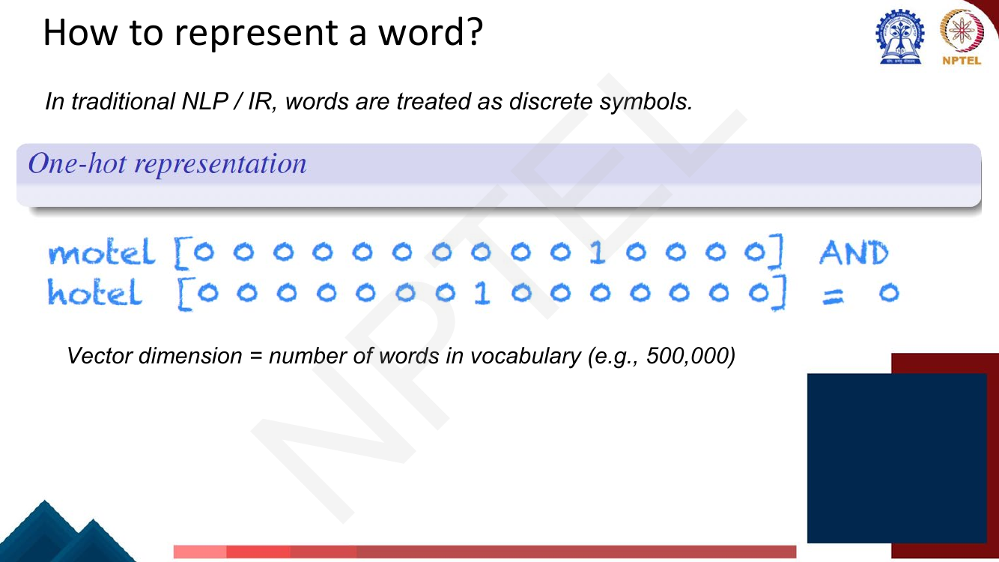
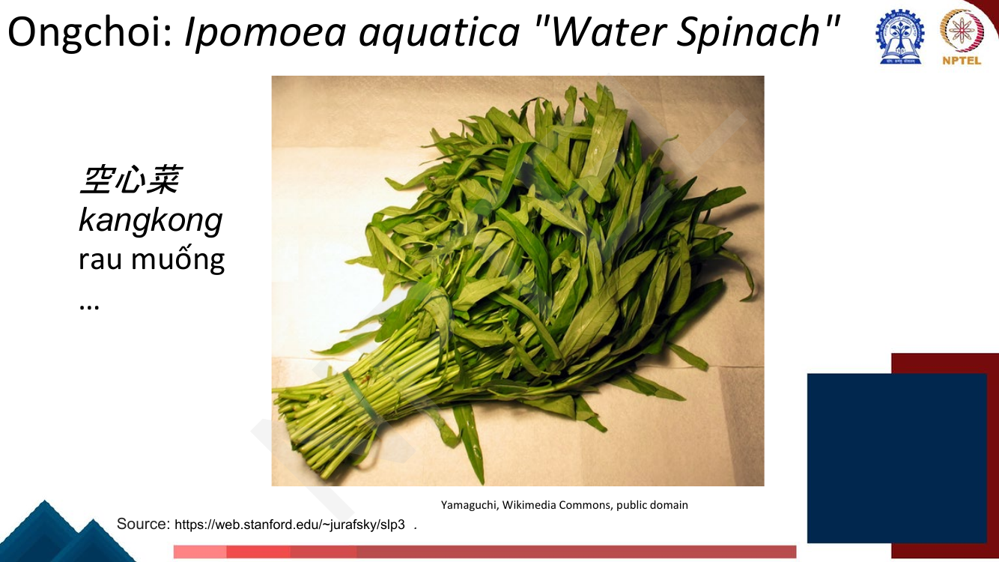
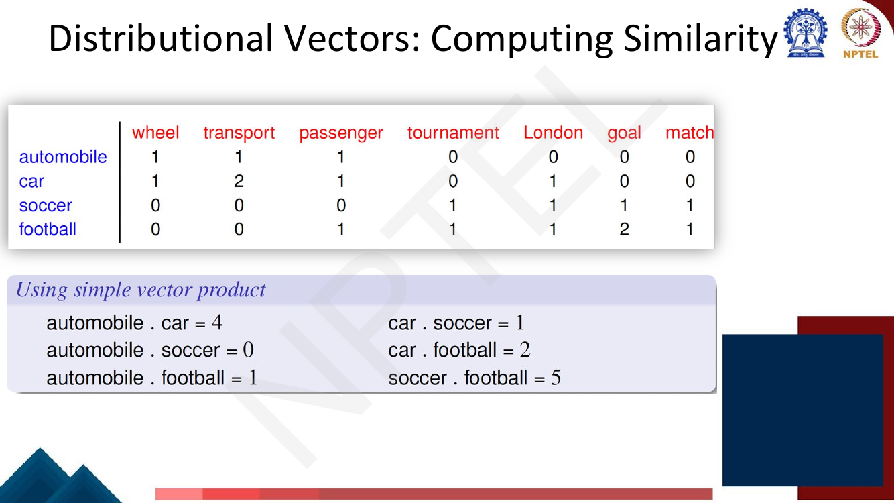
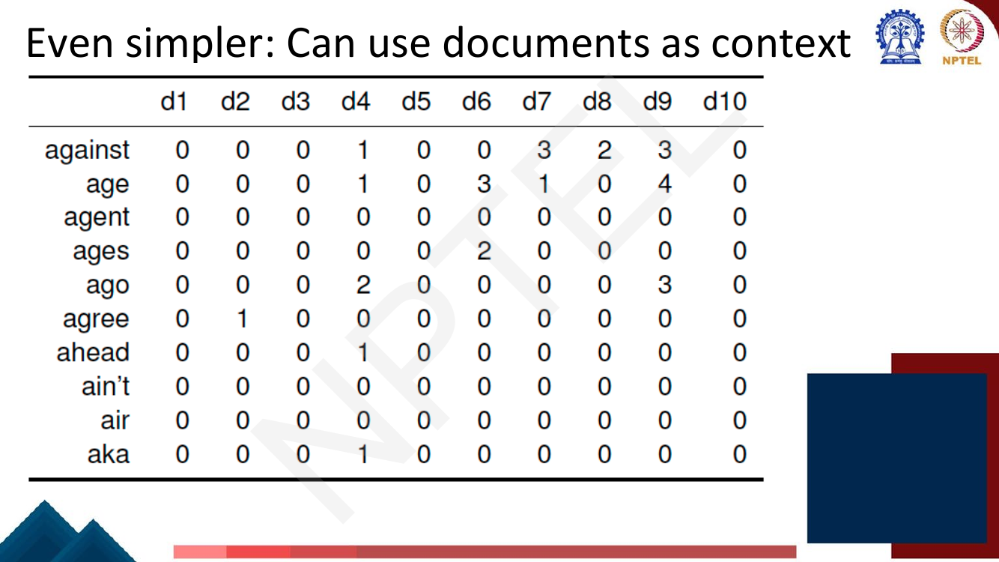
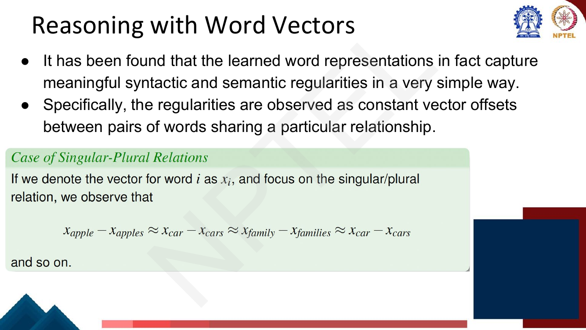

# Lec 11 — Word Representation

> **Source:** `Week3.pdf` pp. 1–29 · **Week 3** · **Playlist:** Lec 11
> **Prereqs:** [Lec 2 — Text Processing and Tokenization](../week-01/02-text-processing-tokenization.md)
> **Feeds into:** [Lec 12 — word2vec and Skip-gram](12-word2vec-skipgram.md), [Lec 27 — BERT and Masked Language Modelling](../week-06/27-bert-masked-lm.md)

## Why this lecture exists

Everything so far has treated a word as an *index*. Tokenization produced a vocabulary, the n-gram
models counted strings, and nowhere did any of it know that "hotel" and "motel" are nearly the same
thing. That ignorance has a cost you can measure: a search engine that cannot match "Baltimore motel"
against "Baltimore hotel", a classifier whose feature "the previous word was *terrible*" fires on
nothing when the test set says *dreadful*.

This lecture replaces the index with a **vector**, and it does so without any supervision — purely by
counting what each word appears next to. That one move is the foundation of the whole rest of the
course: word2vec, GloVe, fastText, and eventually BERT are all refinements of the idea introduced
here. Get the counting, the weighting and the similarity measure right now and the next four lectures
are variations on a theme you already understand.

## The ideas

### Words as discrete symbols, and why that fails

Traditional NLP and IR treat a word as an atomic symbol. To feed it to anything numerical you use a
**one-hot vector**: a vector of length $|V|$ with a single 1 at the word's index and 0 everywhere
else. The deck's example vocabulary is 500,000 words, so every word is a 500,000-dimensional vector
with one non-zero entry.


*Fig. — The 1 sits at a different index for each word, and nowhere else. Note the dimension: 500,000 is the deck's figure for a realistic English vocabulary. Page 3.*

Now take the two vectors the deck draws and multiply them together entrywise, then sum — the dot
product. With $|V| = 15$ for the drawing, `motel` has its 1 at position 11 and `hotel` has its 1 at
position 9:

$$\mathbf{e}_{\text{motel}} = [0,0,0,0,0,0,0,0,0,0,1,0,0,0,0], \quad
\mathbf{e}_{\text{hotel}} = [0,0,0,0,0,0,0,0,1,0,0,0,0,0,0]$$

$$\mathbf{e}_{\text{motel}}^\top \mathbf{e}_{\text{hotel}} = \sum_{i=1}^{15} e_{\text{motel},i}\, e_{\text{hotel},i} = 0$$

Every product in the sum has a zero in it, because the two 1s are never at the same index. The result
is **exactly 0**, and it is 0 for *every* pair of distinct words. In geometric language, all one-hot
vectors are mutually **orthogonal**; the angle between any two is 90°.


*Fig. — The two closing questions are the agenda for the whole of Week 3: (1) how do we define word meaning so it encodes similarity, and (2) can we use shorter vectors? Page 4.*

Three separate defects, worth keeping distinct because an MCQ will test them separately:

| Defect | Consequence |
|---|---|
| **Orthogonality** | Every pair of words is equally dissimilar. "hotel"/"motel" scores the same as "hotel"/"aardvark": zero. |
| **Dimensionality** $= \lvert V\rvert$ | 500,000 dimensions per word. A model's input layer scales with the vocabulary, not with the task. |
| **Sparsity / no sharing** | A parameter learned for "terrible" transfers nothing to "dreadful". Every word must be learned from its own evidence. |

The dimensionality problem and the similarity problem are separate, and the fixes are separate too:
counting contexts fixes similarity (and keeps the dimension large); compressing to dense vectors fixes
the dimension.

### The distributional hypothesis

If you cannot read meaning off the symbol, read it off the *usage*. The deck opens with Wittgenstein:

> "The meaning of a word is its use in the language."

and gives the operational form, from **Zellig Harris (1954)**:

> If A and B have almost identical **environments** we say that they are **synonyms**.

The "environment" of a word is the set of words that appear around it. This is the **distributional
hypothesis**: words that occur in similar contexts tend to have similar meanings. (The slogan version
you will also see quoted, from J.R. Firth 1957, is "you shall know a word by the company it keeps".)

It is a hypothesis about *how to get at* meaning, not a claim that distribution *is* meaning. But it
has the property that makes it usable: context is observable, countable, and requires no annotation.

### Ongchoi — the hypothesis in one example

This is the single best teaching device on the deck, so work through it as the lecturer does rather
than taking the conclusion on trust.

Suppose you encounter a recent English borrowing, **ongchoi**, that you have never seen. You have
these three sentences:

- *Ongchoi is delicious* **sautéed with garlic**.
- *Ongchoi is superb* **over rice**.
- *Ongchoi* **leaves** *with* **salty** *sauces*.

And elsewhere in your reading you have seen:

- *…spinach* **sautéed with garlic over rice**
- *Chard stems and* **leaves** *are* **delicious**
- *Collard greens and other* **salty** *leafy greens*


*Fig. — Notice what does the work: the bolded words are shared **context**, not shared definition. Nobody ever told you what ongchoi is; you inferred it from the overlap of environments. Page 7.*

The contexts of *ongchoi* overlap heavily with the contexts of *spinach*, *chard* and *collard
greens*. So *ongchoi* is probably that sort of thing — a leafy green. And it is: ongchoi is *Ipomoea
aquatica*, water spinach, also known as kangkong (空心菜, rau muống).


*Fig. — The payoff: the distributional inference was correct. The algorithm in the rest of this lecture is nothing more than this procedure, done by counting instead of by reading. Page 8.*

Two things to extract. First, you used only co-occurrence statistics — no dictionary, no labels. That
is why distributional methods scale: the supervision is the text itself. Second, the inference was
approximate, not exact: ongchoi is *like* spinach, not identical to it. Distributional similarity is
graded, which is exactly what you want from a notion of meaning.

### Each word = a vector

Make the environment numerical and each word becomes a point in a space. Similar words end up
**nearby in semantic space**, and you build the space automatically by seeing which words are nearby
in text.


*Fig. — Three clusters emerge with no supervision at all: function words, positive sentiment, negative sentiment. "not good" sits with the negatives, so the space has picked up something compositional. Page 9.*

The vector is called an **embedding** because the word has been embedded into a continuous space.
This is the standard way to represent meaning in modern NLP.

**Intuition: why vectors?** The deck's argument is about *generalisation*, and it is the clearest
single reason to care:

- In a classical feature-based model, a feature is a word identity — "Feature 5: the previous word was
  *terrible*". That feature can only fire if the **exact same word** appears in training and test. See
  *dreadful* at test time and the feature is dead.
- With embeddings, the feature is a word *vector* — "the previous word was $[35, 22, 17, \ldots]$". At
  test time you see $[34, 21, 14, \ldots]$, which is close, and the model's learned response to the
  first vector carries over.

**You can generalise to similar but unseen words.** Everything else in this lecture is machinery in
service of that sentence.

### Building distributional vectors: the co-occurrence matrix

The deck's informal algorithm for constructing a word space:

1. Pick the words you are interested in — the **target words** (the rows).
2. Define a **context window**: the number of words surrounding the target that count as its context.
   The context can instead be a document, a paragraph or a sentence.
3. **Count** how many times each target co-occurs with each context word. This is the
   **co-occurrence matrix** (the deck also calls it the *distributional matrix*, targets × contexts).
4. Build vectors out of (a function of) these counts — the "function of" is the weighting discussed
   two sections down, and it matters enormously.


*Fig. — Step 4's parenthesis — "(a function of)" — is where PMI will enter. Raw counts are the naive choice, not the right one. Page 12.*

The deck's worked example uses six sentences, sentence-level context, four targets and seven contexts:

> An **automobile** is a *wheeled* motor vehicle used for *transporting* *passengers*.
> A **car** is a form of *transport*, usually with four *wheels* and the capacity to carry around five *passengers*.
> *Transport* for the *London* games is limited, with spectators strongly advised to avoid the use of **cars**.
> The *London* 2012 **soccer** *tournament* began yesterday, with plenty of *goals* in the opening *matches*.
> Giggs scored the first *goal* of the **football** *tournament* at Wembley, North *London*.
> Bellamy was largely a *passenger* in the **football** *match*, playing no part in either *goal*.


*Fig. — Memorise this table; three later slides reuse it and so do two of the numericals below. Note the light stemming: "wheels"→wheel, "transporting"→transport, "matches"→match. Page 13.*

|  | wheel | transport | passenger | tournament | London | goal | match |
|---|---|---|---|---|---|---|---|
| **automobile** | 1 | 1 | 1 | 0 | 0 | 0 | 0 |
| **car** | 1 | 2 | 1 | 0 | 1 | 0 | 0 |
| **soccer** | 0 | 0 | 0 | 1 | 1 | 1 | 1 |
| **football** | 0 | 0 | 1 | 1 | 1 | 2 | 1 |

The structure is already visible: `automobile` and `car` share the left block, `soccer` and `football`
share the right block, and the two blocks barely touch. No one labelled anything.

A design decision hides in step 2. **Window size changes what "similar" means.** A narrow window (±1
or ±2) picks up words that are syntactically interchangeable — it will make *good* and *bad* similar,
because both occur in "a ___ idea". A wide window or a whole document picks up topical association —
*doctor* with *hospital*. Neither is wrong; know which one you asked for.

### Computing similarity: dot product, then cosine

The deck's first move is the plain **dot product** of two rows:

$$\mathbf{u}^\top\mathbf{v} = \sum_{i=1}^{d} u_i v_i$$


*Fig. — The products rank the pairs sensibly, but look at the largest: soccer·football = 5 beats automobile·car = 4. Is `soccer` really closer to `football` than `car` is to `automobile`, or does `football` just occur more? Page 14.*

That question is the problem with the raw dot product: **it grows with vector length, and vector
length grows with frequency.** A word that appears often in the corpus has large counts everywhere, so
it posts large dot products with everything, related or not. The dot product is measuring magnitude
and direction at once, and only direction carries the meaning.

The fix is to divide out both magnitudes. **Cosine similarity**:

$$\cos(\mathbf{u},\mathbf{v}) \;=\; \frac{\mathbf{u}^\top\mathbf{v}}{\lVert\mathbf{u}\rVert\,\lVert\mathbf{v}\rVert}
\;=\; \frac{\sum_{i} u_i v_i}{\sqrt{\sum_i u_i^2}\;\sqrt{\sum_i v_i^2}}$$

This is literally the cosine of the angle between the two vectors, from the geometric identity
$\mathbf{u}^\top\mathbf{v} = \lVert\mathbf{u}\rVert\lVert\mathbf{v}\rVert\cos\theta$. For
non-negative count vectors it ranges over $[0, 1]$: 1 means the same direction (identical context
*proportions*), 0 means orthogonal (no shared context at all). For vectors that can go negative — PMI
vectors, or learned embeddings — the range is $[-1, 1]$.

**Why cosine and not Euclidean distance?** Because Euclidean distance is dominated by frequency.
Consider a rare word with context counts $[2,1,3,0]$ and a common word with exactly the same
*pattern* at 100× the volume, $[200,100,300,0]$. These two words have identical distributional
behaviour — they should be maximally similar. Cosine says 1.0, correctly. Euclidean distance says
370.4, which is enormous. Worse, a word with the *same total frequency but a different pattern*,
$[2,3,1,0]$, sits a Euclidean distance of only 2.83 away. Euclidean distance would rank the
unrelated-but-equally-rare word as far closer. Cosine normalises frequency away and compares only the
*shape* of the context distribution, which is the thing the distributional hypothesis is about. N4
below does this arithmetic in full.

(One caveat worth carrying: cosine is invariant to scaling, so it cannot distinguish a word you saw
twice from a word you saw two thousand times. That is usually what you want and occasionally a
problem — a vector built from three observations is noisy no matter how confident its direction looks.)

### Context weighting via association measures

Raw counts are the wrong input for a second reason, independent of vector length. Look at the deck's
corpus statistics:


*Fig. — 855 beats 29 by a factor of 29, yet "domesticated" tells you far more about dogs than "small" does. The counts are ranking the wrong way round. Page 15.*

| word1 | word2 | freq(1,2) | freq(1) | freq(2) |
|---|---|---|---|---|
| dog | small | 855 | 33,338 | 490,580 |
| dog | domesticated | 29 | 33,338 | 918 |

*small* co-occurs with *dog* 855 times, but *small* occurs 490,580 times overall — it co-occurs with
everything. *domesticated* occurs only 918 times in the whole corpus, and 29 of those are next to
*dog*: that is over 3% of all its occurrences. The deck's principle:

> The **less frequent** the target and context element are, the **higher** the weight given to their
> co-occurrence count should be.

**Association measures** implement this: they reweight each cell by how surprising the co-occurrence
is, given the two words' overall frequencies. The deck names mutual information and the
log-likelihood ratio; it then develops the first one.

### Pointwise Mutual Information

$$\mathrm{PMI}(w_1, w_2) \;=\; \log_2 \frac{P_{\text{corpus}}(w_1, w_2)}{P_{\text{corpus}}(w_1)\,P_{\text{corpus}}(w_2)}
\qquad\text{where}\qquad
P_{\text{corpus}}(w_1,w_2) = \frac{\mathrm{freq}(w_1,w_2)}{N},\quad
P_{\text{corpus}}(w) = \frac{\mathrm{freq}(w)}{N}$$


*Fig. — Note the base: $\log_2$, so PMI is in **bits**. $N$ is the total number of co-occurrence events, and the same $N$ appears in all three probabilities, which is why it does not cancel. Page 16.*

**Read the formula as a ratio of observed to expected.** The denominator $P(w_1)P(w_2)$ is what the
joint probability *would* be if the two words were statistically independent — if seeing $w_1$ told
you nothing about $w_2$. The numerator is what you actually observed. So:

- $\mathrm{PMI} = 0$ ⟺ the pair co-occurs exactly as often as chance predicts.
- $\mathrm{PMI} = 1$ ⟺ it co-occurs **twice** as often as chance predicts ($\log_2 2 = 1$).
- $\mathrm{PMI} = 3$ ⟺ **eight** times as often.
- $\mathrm{PMI} < 0$ ⟺ the two words co-occur *less* than chance — they repel.

That is exactly the reweighting the previous slide asked for. Dividing by $P(w_2)$ penalises contexts
that are common everywhere, so *small* gets discounted and *domesticated* does not. And notice that
PMI is **symmetric**: $\mathrm{PMI}(w,c) = \mathrm{PMI}(c,w)$, since swapping the two leaves the
formula unchanged.

For a word–context matrix the usual notation is

$$\mathrm{PMI}(w, c) = \log_2 \frac{P(w,c)}{P(w)P(c)}, \qquad
P(w,c) = \frac{C_{wc}}{N},\;\; P(w) = \frac{\sum_{c'} C_{wc'}}{N},\;\; P(c) = \frac{\sum_{w'} C_{w'c}}{N}$$

with $N = \sum_{w,c} C_{wc}$ the grand total of the matrix. Equivalently, and far faster to compute by
hand:

$$\mathrm{PMI}(w,c) = \log_2 \frac{N \cdot C_{wc}}{\left(\textstyle\sum_{c'}C_{wc'}\right)\left(\textstyle\sum_{w'}C_{w'c}\right)}
= \log_2 \frac{N \cdot C_{wc}}{(\text{row sum})(\text{column sum})}$$

**Use that form in the exam.** It is one multiplication, one division and one log, and it avoids three
separate probability computations.

#### PPMI: clamp the negatives

Two things go wrong at the bottom of the range.

1. **Zero counts give $\mathrm{PMI} = -\infty$.** $\log_2 0$ is undefined. Most cells of a real
   co-occurrence matrix are zero, so most of the matrix is $-\infty$, which is useless as a vector
   entry.
2. **Negative PMI values are unreliable.** To establish that two words co-occur *less* than chance you
   need enough data to resolve a probability below $P(w)P(c)$. For two words each with probability
   $10^{-6}$, independence predicts a joint probability of $10^{-12}$, so you need a corpus of
   *trillions* of words before "fewer co-occurrences than expected" means anything beyond sampling
   noise. On any finite corpus a negative PMI mostly reflects the corpus being small, not the words
   repelling.

The standard fix is **Positive PMI**:

$$\mathrm{PPMI}(w,c) = \max\big(\mathrm{PMI}(w,c),\, 0\big)$$

Every negative value, and every $-\infty$ from a zero count, becomes 0. The interpretation is clean:
PPMI records *how much more than chance* a pair co-occurs, and declines to make claims about pairs
that occur less than chance. It also keeps the matrix non-negative and sparse, which is convenient for
everything downstream.

The price: PPMI throws away real information in the negative region, and it has a known bias toward
very rare contexts — a context word seen twice in the whole corpus, both times next to your target,
gets an enormous PMI on evidence of two observations. (Smoothing the context distribution is the
standard countermeasure; see *Beyond the slides*.)

### Documents as context: the term–document matrix

The deck offers a simpler alternative to windows: let the **context be a whole document**. The matrix
then has terms as rows and documents as columns, and cell $(i,j)$ is how often term $i$ appears in
document $j$.


*Fig. — Count the zeros: 10 × 10 = 100 cells, of which about 17 are non-zero. That sparsity is the defining property of count-based representations and it only gets worse at realistic scale. Page 17.*

Two different things can be read off this matrix. Reading a **column** gives you a document vector —
this is the bag-of-words representation used in information retrieval. Reading a **row** gives you a
word vector, where two words are similar if they appear in the same documents. The document version
captures *topical* relatedness rather than syntactic substitutability.

The counts need the same weighting treatment, and here the deck gives the classical IR answer. Three
factors for an indexing function $F$:

| Factor | Symbol | Direction |
|---|---|---|
| **Word frequency** — how often the word appears in the document | $f_{ij}$ | $F \propto f_{ij}$ |
| **Document length** — how many words the document has | $\lvert D_i\rvert$ | $F \propto 1/\lvert D_i\rvert$ |
| **Document frequency** — in how many documents the word appears | $N_j$ | $F \propto 1/N_j$ |


*Fig. — The third factor is the one doing the real work, and it is the same instinct as PMI: discount contexts that are common everywhere. Note the $L_2$ normalisation at the end — that is cosine similarity in disguise. Page 18.*

Combining the first and third gives **tf-idf**:

$$\text{tf-idf}(i,j) = f_{ij} \cdot \log\!\left(\frac{N}{N_j}\right)$$

with the weights in a document normalised by their $L_2$ norm (which handles the document-length
factor and makes dot products between documents equal to cosines). The idf term $\log(N/N_j)$ is zero
for a word appearing in every document and large for a word appearing in one, which is why stopwords
vanish without a stopword list.

**tf-idf and PMI are the same idea in two settings.** Both start from a raw count and divide by a term
that measures how common the context is globally. tf-idf is the document-context version; PPMI is the
window-context version. The retrieval use of tf-idf — ranking documents against a query, and its
successor BM25 — belongs to [Lec 31](../week-07/31-question-answering-1.md).

### Sparse versus dense vectors

The deck now names the two families explicitly:

| | **Sparse** (one-hot, tf-idf, PPMI) | **Dense** (learned embeddings) |
|---|---|---|
| Length | long: $\lvert V\rvert$ = 20,000 to 50,000 | short: 50 to 1000 |
| Entries | mostly zero | mostly non-zero |
| Origin | counted | learned |
| Dimensions | interpretable (one per context word) | not individually interpretable |

**Why dense vectors?** The deck gives three reasons:

1. **Fewer parameters.** Short vectors are easier to use as features — a downstream model has fewer
   weights to tune, which means less data needed and less overfitting.
2. **Better generalisation** than explicit counts. The compression forces the representation to
   discard idiosyncratic co-occurrences and keep systematic ones.
3. **They capture synonymy, which sparse vectors structurally cannot.** This is the sharp argument, so
   follow it carefully. *car* and *automobile* are synonyms, but in a count matrix they are two
   **distinct dimensions**. A word whose context is *car* and a word whose context is *automobile*
   therefore share *zero* mass on those dimensions — their vectors are orthogonal there — even though
   the two words behave identically. Sparse counting cannot fix this: the dimensions are the
   vocabulary, and the vocabulary distinguishes them. Dense vectors can, because compression merges
   correlated dimensions into one latent direction.

And the deck's honest fourth reason: **in practice, they work better.**

A dense vector is also a genuinely different kind of object. The deck calls it a **distributional
representation**: take a vector of several hundred dimensions, say 1000; each word is represented by a
*distribution of weights* across all of those elements. There is no one-to-one mapping from element to
word. The representation of a word is **spread across all elements**, and **each element contributes
to the definition of many words**. That is what "distributed representation" means, and it is the
reason you cannot read a dimension and say what it encodes.

### How to get short dense vectors


*Fig. — The roadmap for the next four lectures and for Week 6. Note the phrase "static embeddings" — it names everything above the line and is the limitation Week 6 removes. Page 21.*

| Method | Family | Where it is taught |
|---|---|---|
| **SVD**, and its special case **LSA** (Latent Semantic Analysis) | matrix factorisation of the count matrix | here (named only) |
| **word2vec** — skip-gram and **CBOW** | "neural language model"-inspired | [Lec 12](12-word2vec-skipgram.md) |
| **GloVe** | neural / count hybrid | [Lec 13](13-negative-sampling-glove.md) |
| **ELMo**, **BERT** — contextual embeddings | pretrained deep models | [Lec 26](../week-06/26-pretraining-and-elmo.md), [Lec 27](../week-06/27-bert-masked-lm.md) |

SVD factorises the (weighted) co-occurrence matrix $\mathbf{M} \approx \mathbf{U}\boldsymbol{\Sigma}\mathbf{V}^\top$
and keeps the top $k$ singular directions; the truncated $\mathbf{U}$ rows are your $k$-dimensional
word vectors. LSA is this applied to a term–document matrix. The point to retain is that SVD gets
dense vectors by **compressing counts you already have**, whereas the next family gets them by
**learning to predict**.

**word2vec** inverts the problem. Instead of counting how often each word $w$ occurs near *apricot*,
you train a classifier on a binary prediction task — *is $w$ likely to show up near apricot?* — and
then **throw the classifier away and keep its weights as the embeddings**. The reason this needs no
annotation is **self-supervision**: a word $c$ that actually occurs near *apricot* in the corpus serves
as the gold "correct answer", so the corpus labels itself. (Lineage: Bengio et al. 2003; Collobert et
al. 2011.) That is as far as this lecture goes — [Lec 12](12-word2vec-skipgram.md) derives the
objective and its gradients, and [Lec 13](13-negative-sampling-glove.md) covers negative sampling,
hierarchical softmax and GloVe.

**One forward-pointing caution.** Everything in this lecture produces **one vector per word type**.
*Bank* gets a single vector that averages the river sense and the money sense, and it is the same
vector in every sentence. That is what *static* means, and it is the limitation
[Lec 26](../week-06/26-pretraining-and-elmo.md) and [Lec 27](../week-06/27-bert-masked-lm.md) remove
by computing a distinct embedding for each *token* in its context.

Subword and phrase-level extensions (fastText, sentence and graph embeddings) are
[Lec 14](14-fasttext-and-beyond-words.md); cross-lingual embeddings are
[Lec 15](15-cross-lingual-representations.md).

### Reasoning with word vectors: the vector offset method

The empirical discovery that made embeddings famous: learned word representations capture **syntactic
and semantic regularities** in a very simple way, and the regularities show up as **constant vector
offsets between pairs of words sharing a relationship**.


*Fig. — The claim is not that the vectors encode "plural" in some dimension; it is that the **difference** between a singular and its plural is roughly the same vector for every such pair. Page 24.*

Writing $\mathbf{x}_i$ for the vector of word $i$, the singular/plural regularity is

$$\mathbf{x}_{\text{apple}} - \mathbf{x}_{\text{apples}} \approx \mathbf{x}_{\text{car}} - \mathbf{x}_{\text{cars}} \approx \mathbf{x}_{\text{family}} - \mathbf{x}_{\text{families}}$$

and the same holds for semantic relations: gender (*man*→*woman*, *uncle*→*aunt*, *king*→*queen*),
capital-of, comparative-superlative, and many others.


*Fig. — What to notice: within each panel the arrows are **parallel and the same length**. That parallelism is the whole phenomenon; it is what makes the arithmetic below work. Page 26.*

This gives an arithmetic procedure for **analogy questions** — *a is to b as c is to ?* — the deck's
example being *man is to woman as uncle is to ?* (*aunt*). If the offset $\mathbf{x}_b - \mathbf{x}_a$
is constant for the relation, then the answer $d$ should satisfy
$\mathbf{x}_d - \mathbf{x}_c \approx \mathbf{x}_b - \mathbf{x}_a$, i.e.

$$\mathbf{x}_d \approx \mathbf{x}_b - \mathbf{x}_a + \mathbf{x}_c$$

You compute that target vector and then search the vocabulary for the word whose vector is closest to
it **by cosine**. The deck's form:

$$d = \arg\max_{x} \frac{(\mathbf{w}_b - \mathbf{w}_a + \mathbf{w}_c)^\top \mathbf{w}_x}{\lVert \mathbf{w}_b - \mathbf{w}_a + \mathbf{w}_c\rVert}$$

![Slide "Analogy Testing" with the a:b::c:? template, the argmax formula, and the worked case man:woman::king:? computed as +king [0.30 0.70] − man [0.20 0.20] + woman [0.60 0.30] = queen [0.70 0.80], plus a 2-D plot showing king, man, woman and queen with an arrow from man to woman](../../assets/pages/lec11/p-027.png)
*Fig. — The deck's own two-dimensional arithmetic lands exactly on queen. Note the denominator: it normalises by $\lVert\mathbf{w}_b-\mathbf{w}_a+\mathbf{w}_c\rVert$ only, not by $\lVert\mathbf{w}_x\rVert$ — see the caveat below. Page 27.*

The famous instance is the gender one, $\mathbf{x}_{\text{king}} - \mathbf{x}_{\text{man}} +
\mathbf{x}_{\text{woman}} \approx \mathbf{x}_{\text{queen}}$, and the deck makes it literal with
2-D vectors: $[0.30, 0.70] - [0.20, 0.20] + [0.60, 0.30] = [0.70, 0.80]$, which is exactly
`queen`'s vector. N5 below checks this against a field of candidates.

Two caveats the deck does not state, both examinable:

- **The denominator in the deck's $\arg\max$ is constant across $x$**, since $\mathbf{w}_b -
  \mathbf{w}_a + \mathbf{w}_c$ does not depend on $x$. So as written it is maximising a *dot product*,
  not a true cosine — it does not divide by $\lVert\mathbf{w}_x\rVert$ and therefore favours
  high-norm (frequent) words. Standard implementations normalise all embeddings to unit length first,
  which makes the two identical.
- **You must exclude $a$, $b$ and $c$ from the candidate set.** The target vector is built out of them,
  so they sit very close to it. In N5, `man` scores a cosine of 0.9978 against the target — second
  only to `queen`, and ahead of every genuine distractor. Forget to exclude it and the method returns
  an input word.

**Analogy testing** is also the standard *evaluation* for embeddings: assemble thousands of
$a{:}b{::}c{:}d$ quadruples across many relation types, run the arithmetic, and report the fraction
where the nearest vector (excluding $a,b,c$) is the gold $d$. It is an *intrinsic* evaluation — it
measures the vector space directly rather than a downstream task — and its chief virtue is that it is
cheap and needs no model retraining. Its chief vice is in *Beyond the slides*.

## Worked numericals

The map records no "Try this problem" pages in `Week3.pdf` pp. 1–29, and there are none: the deck
poses no exercise in this range. N1, N2 and N5 instead reconstruct the deck's own worked examples
(pages 13, 14 and 27) and check this chapter's arithmetic against the lecturer's printed answers.

### N1. Build the deck's co-occurrence matrix by hand (page 13)
**Given:** the six-sentence corpus, sentence-level context, targets {automobile, car, soccer,
football}, contexts {wheel, transport, passenger, tournament, London, goal, match}, with light
stemming (wheels→wheel, transporting→transport, matches→match, cars→car, goals→goal).
**Find:** the rows for `car` and `football`, and check against the deck.

1. **`car` appears in sentences 2 and 3.** Scan sentence 2 — "A *car* is a form of **transport**,
   usually with four **wheels** and the capacity to carry around five **passengers**" — for each
   context word: wheel 1, transport 1, passenger 1, tournament 0, London 0, goal 0, match 0.
2. Scan sentence 3 — "**Transport** for the **London** games is limited, with spectators strongly
   advised to avoid the use of *cars*": wheel 0, transport 1, passenger 0, tournament 0, London 1,
   goal 0, match 0.
3. Add: $[1,1,1,0,0,0,0] + [0,1,0,0,1,0,0] = [1,2,1,0,1,0,0]$. Matches the deck's `car` row ✓
4. **`football` appears in sentences 5 and 6.** Sentence 5 — "Giggs scored the first **goal** of the
   *football* **tournament** at Wembley, North **London**": $[0,0,0,1,1,1,0]$.
5. Sentence 6 — "Bellamy was largely a **passenger** in the *football* **match**, playing no part in
   either **goal**": $[0,0,1,0,0,1,1]$.
6. Add: $[0,0,0,1,1,1,0] + [0,0,1,0,0,1,1] = [0,0,1,1,1,2,1]$. Matches the deck's `football` row ✓
7. Note *where the 2 comes from*: `goal` appears once in sentence 5 and once in sentence 6, and
   `football` is in both. Repeated co-occurrence across sentences, not a repeat within one.

**Answer:** `car` = $[1,2,1,0,1,0,0]$, `football` = $[0,0,1,1,1,2,1]$, both agreeing with page 13.

### N2. Dot products and cosines on that matrix (pages 13–14)
**Given:** the four rows above.
**Find:** every pairwise dot product (to check the deck's page 14) and every cosine, with norms shown.

1. Norms. $\lVert\text{automobile}\rVert = \sqrt{1^2+1^2+1^2} = \sqrt{3} = 1.7321$;
   $\lVert\text{car}\rVert = \sqrt{1+4+1+1} = \sqrt{7} = 2.6458$;
   $\lVert\text{soccer}\rVert = \sqrt{1+1+1+1} = \sqrt{4} = 2.0000$;
   $\lVert\text{football}\rVert = \sqrt{1+1+1+4+1} = \sqrt{8} = 2.8284$.
2. automobile·car $= (1)(1) + (1)(2) + (1)(1) = 1+2+1 = \mathbf{4}$ ✓ (deck: 4)
3. automobile·soccer $= 0$ — no shared context at all ✓ (deck: 0)
4. automobile·football $= (1)(0)+(1)(0)+(1)(1) = \mathbf{1}$ ✓ (deck: 1), the shared word being
   *passenger*, which is a pun: a car passenger and a football "passenger" are different senses. A
   single static vector cannot tell them apart.
5. car·soccer $= (1)(1)_{\text{London}} = \mathbf{1}$ ✓; car·football $= (1)(1)_{\text{passenger}} +
   (1)(1)_{\text{London}} = \mathbf{2}$ ✓
6. soccer·football $= (0)(0)+(0)(0)+(0)(1)+(1)(1)+(1)(1)+(1)(2)+(1)(1) = 1+1+2+1 = \mathbf{5}$ ✓
7. Now cosines. $\cos(\text{automobile},\text{car}) = 4/(1.7321 \times 2.6458) = 4/4.5826 = \mathbf{0.8729}$.
8. $\cos(\text{soccer},\text{football}) = 5/(2.0000 \times 2.8284) = 5/5.6569 = \mathbf{0.8839}$.
9. $\cos(\text{automobile},\text{football}) = 1/(1.7321 \times 2.8284) = 1/4.8990 = \mathbf{0.2041}$.
10. $\cos(\text{car},\text{football}) = 2/(2.6458\times2.8284) = 2/7.4833 = \mathbf{0.2673}$;
    $\cos(\text{car},\text{soccer}) = 1/(2.6458\times2.0000) = \mathbf{0.1890}$;
    $\cos(\text{automobile},\text{soccer}) = \mathbf{0}$.
11. Read the effect. On raw dots, car·football (2) is **twice** automobile·football (1). On cosines it
    is $0.2673/0.2041 = 1.31\times$. The dot product was exaggerating the gap because `car` is the
    longer vector. Cosine removed that.

**Answer:** all six dot products reproduce page 14 exactly. Cosines: 0.8729, 0.0000, 0.2041, 0.1890,
0.2673, 0.8839 in the deck's listed order. The two within-topic pairs (0.87, 0.88) separate cleanly
from the four cross-topic pairs (0.00–0.27).

### N3. PMI and PPMI from a co-occurrence table
**Given:** this word–context count matrix, grand total $N = 100$:

| | sweet | juice | crunchy | crashed | **row sum** |
|---|---|---|---|---|---|
| **apple** | 20 | 10 | 10 | 0 | **40** |
| **pear** | 5 | 4 | 0 | 1 | **10** |
| **server** | 0 | 1 | 0 | 49 | **50** |
| **col sum** | **25** | **15** | **10** | **50** | **100** |

**Find:** PMI and PPMI for five cells, showing the joint and marginal probabilities.

1. **(apple, sweet).** $P(w,c) = 20/100 = 0.20$; $P(w) = 40/100 = 0.40$; $P(c) = 25/100 = 0.25$.
   $P(w)P(c) = 0.40 \times 0.25 = 0.10$.
   Ratio $= 0.20/0.10 = 2.0$. $\mathrm{PMI} = \log_2 2 = \mathbf{1.0000}$ bits.
   *Reading:* apple and sweet co-occur twice as often as independence predicts.
2. **(pear, sweet).** $P(w,c) = 5/100 = 0.05$; $P(w) = 10/100 = 0.10$; $P(c) = 0.25$.
   $P(w)P(c) = 0.025$. Ratio $= 0.05/0.025 = 2.0$. $\mathrm{PMI} = \mathbf{1.0000}$.
   *Reading:* `pear` is four times rarer than `apple`, and its raw count with `sweet` is four times
   smaller (5 vs 20) — yet the PMI is **identical**. That is the whole point of the measure.
3. **(apple, crunchy)**, via the fast form $\log_2 \dfrac{N\,C_{wc}}{(\text{row})(\text{col})}$:
   $\log_2\dfrac{100\times10}{40\times10} = \log_2\dfrac{1000}{400} = \log_2 2.5 = \mathbf{1.3219}$.
4. **(pear, crashed).** $\log_2\dfrac{100\times1}{10\times50} = \log_2\dfrac{100}{500} = \log_2 0.2 =
   \mathbf{-2.3219}$. **Negative**: pears and crashes co-occur five times *less* than chance — on the
   evidence of a single observation. $\mathrm{PPMI} = \max(-2.3219, 0) = \mathbf{0}$.
5. **(apple, crashed).** $C_{wc} = 0$, so the ratio is 0 and $\mathrm{PMI} = \log_2 0 = -\infty$.
   $\mathrm{PPMI} = \mathbf{0}$.
6. **(server, crashed).** $\log_2\dfrac{100\times49}{50\times50} = \log_2\dfrac{4900}{2500} =
   \log_2 1.96 = \mathbf{0.9709}$. High count (49, the largest in the table) but only a *modest* PMI,
   because both `server` and `crashed` are frequent on their own. Raw counts would have ranked this
   cell first by a mile.
7. The PPMI matrix, with negatives and $-\infty$ clamped to 0:

   | | sweet | juice | crunchy | crashed |
   |---|---|---|---|---|
   | **apple** | 1.0000 | 0.7370 | 1.3219 | 0 |
   | **pear** | 1.0000 | 1.4150 | 0 | 0 |
   | **server** | 0 | 0 | 0 | 0.9709 |

**Answer:** $\mathrm{PMI}(\text{apple},\text{sweet}) = \mathrm{PMI}(\text{pear},\text{sweet}) = 1$ bit
despite a 4× difference in raw counts; $\mathrm{PMI}(\text{pear},\text{crashed}) = -2.3219 \to
\mathrm{PPMI} = 0$; $\mathrm{PMI}(\text{apple},\text{crashed}) = -\infty \to \mathrm{PPMI} = 0$;
$\mathrm{PMI}(\text{server},\text{crashed}) = 0.9709$.

### N4. Why cosine and not Euclidean distance
**Given:** three context vectors over the same four contexts.
$\mathbf{u} = [2,1,3,0]$ (a rare word, 6 co-occurrences total);
$\mathbf{v} = [200,100,300,0]$ (a common word, 600 total — *exactly the same pattern*, 100× the volume);
$\mathbf{w} = [2,3,1,0]$ (as rare as $\mathbf{u}$, 6 total, but a *different* pattern).
**Find:** cosine and Euclidean distance for $(\mathbf{u},\mathbf{v})$ and $(\mathbf{u},\mathbf{w})$.

1. Norms. $\lVert\mathbf{u}\rVert = \sqrt{4+1+9+0} = \sqrt{14} = 3.7417$;
   $\lVert\mathbf{v}\rVert = \sqrt{40000+10000+90000} = \sqrt{140000} = 374.1657$;
   $\lVert\mathbf{w}\rVert = \sqrt{4+9+1} = \sqrt{14} = 3.7417$.
2. $\mathbf{u}^\top\mathbf{v} = 2(200)+1(100)+3(300) = 400+100+900 = 1400$.
3. $\cos(\mathbf{u},\mathbf{v}) = \dfrac{1400}{3.7417 \times 374.1657} = \dfrac{1400}{1400} = \mathbf{1.0000}$.
   Exactly 1, because $\mathbf{v} = 100\,\mathbf{u}$ — identical direction.
4. Euclidean: $\mathbf{u}-\mathbf{v} = [-198,-99,-297,0]$, so
   $d = \sqrt{198^2+99^2+297^2} = 99\sqrt{4+1+9} = 99\sqrt{14} = \mathbf{370.42}$.
5. $\mathbf{u}^\top\mathbf{w} = 2(2)+1(3)+3(1) = 4+3+3 = 10$, so
   $\cos(\mathbf{u},\mathbf{w}) = \dfrac{10}{3.7417\times3.7417} = \dfrac{10}{14} = \mathbf{0.7143}$.
6. Euclidean: $\mathbf{u}-\mathbf{w} = [0,-2,2,0]$, $d = \sqrt{0+4+4+0} = \sqrt{8} = \mathbf{2.83}$.
7. Compare the two verdicts:

   | Pair | cosine | Euclidean |
   |---|---|---|
   | $(\mathbf{u},\mathbf{v})$ — same pattern, 100× frequency | **1.0000** (maximally similar) | 370.42 (very far) |
   | $(\mathbf{u},\mathbf{w})$ — same frequency, different pattern | 0.7143 | **2.83** (very close) |

**Answer:** cosine and Euclidean distance give **opposite rankings**. Euclidean calls $\mathbf{w}$ the
nearest neighbour of $\mathbf{u}$ by a factor of 131; cosine correctly identifies $\mathbf{v}$, the
word with the identical context *distribution*. Since the distributional hypothesis is about the
*shape* of the context distribution and not its volume, cosine is the right measure.

### N5. The deck's analogy, computed against a candidate set (page 27)
**Given:** 2-D embeddings `king` $=[0.30, 0.70]$, `man` $=[0.20, 0.20]$, `woman` $=[0.60, 0.30]$,
`queen` $=[0.70, 0.80]$, `princess` $=[0.65, 0.60]$, `throne` $=[0.10, 0.90]$.
**Find:** the answer to *man : woman :: king : ?* by the vector-offset method, ranking all candidates
by cosine.

1. Form the target. With $a = $ man, $b = $ woman, $c = $ king:
   $\mathbf{t} = \mathbf{w}_b - \mathbf{w}_a + \mathbf{w}_c = [0.60,0.30] - [0.20,0.20] + [0.30,0.70]$.
2. Component-wise: $x: 0.60-0.20+0.30 = 0.70$; $y: 0.30-0.20+0.70 = 0.80$. So $\mathbf{t} = [0.70, 0.80]$ —
   the deck's printed result ✓
3. $\lVert\mathbf{t}\rVert = \sqrt{0.49+0.64} = \sqrt{1.13} = 1.0630$.
4. $\cos(\mathbf{t}, \text{queen})$: dot $= 0.70(0.70)+0.80(0.80) = 0.49+0.64 = 1.13$;
   $\lVert\text{queen}\rVert = \sqrt{1.13} = 1.0630$;
   $\cos = 1.13/(1.0630 \times 1.0630) = 1.13/1.13 = \mathbf{1.0000}$.
5. $\cos(\mathbf{t}, \text{princess})$: dot $= 0.70(0.65)+0.80(0.60) = 0.455+0.480 = 0.935$;
   $\lVert\text{princess}\rVert = \sqrt{0.4225+0.36} = \sqrt{0.7825} = 0.8846$;
   $\cos = 0.935/(1.0630\times0.8846) = 0.935/0.9403 = \mathbf{0.9943}$.
6. $\cos(\mathbf{t}, \text{throne})$: dot $= 0.07+0.72 = 0.79$;
   $\lVert\text{throne}\rVert = \sqrt{0.01+0.81} = 0.9055$;
   $\cos = 0.79/(1.0630\times0.9055) = 0.79/0.9626 = \mathbf{0.8207}$.
7. The three input words, which must be **excluded**:
   $\cos(\mathbf{t},\text{man}) = 0.30/(1.0630\times0.2828) = \mathbf{0.9978}$;
   $\cos(\mathbf{t},\text{king}) = 0.77/(1.0630\times0.7616) = \mathbf{0.9511}$;
   $\cos(\mathbf{t},\text{woman}) = 0.66/(1.0630\times0.6708) = \mathbf{0.9256}$.
8. Ranking: queen 1.0000 > *man 0.9978* > princess 0.9943 > *king 0.9511* > *woman 0.9256* >
   throne 0.8207.

**Answer:** **queen**, with a cosine of exactly 1.0000, reproducing page 27. Note step 7: `man` would
have placed **second**, ahead of every genuine distractor, which is why standard analogy evaluation
removes $a$, $b$ and $c$ from the candidate set before taking the $\arg\max$.

### N6. Storage: sparse $\lvert V\rvert \times \lvert V\rvert$ versus dense $\lvert V\rvert \times 300$
**Given:** $\lvert V\rvert = 50{,}000$; 4 bytes per entry (float32); embedding dimension 300.
**Find:** the memory for a full word–word co-occurrence matrix versus a dense embedding matrix, and the
ratio.

1. Co-occurrence matrix cells: $50{,}000 \times 50{,}000 = 2.5 \times 10^9$.
2. Stored densely: $2.5\times10^9 \times 4 = 1.0 \times 10^{10}$ bytes $= \mathbf{10\ \text{GB}}$.
3. Embedding matrix cells: $50{,}000 \times 300 = 1.5\times10^7$.
4. Bytes: $1.5\times10^7 \times 4 = 6.0\times10^7 = \mathbf{60\ \text{MB}}$.
5. Ratio: $\dfrac{2.5\times10^9}{1.5\times10^7} = \dfrac{50{,}000}{300} = \mathbf{166.7\times}$.
   The ratio is just $\lvert V\rvert / d$ — the dimension you removed.
6. The honest comparison uses sparse storage, since the co-occurrence matrix is mostly zeros. Suppose
   each word has about 1,000 distinct context types: $50{,}000 \times 1{,}000 = 5\times10^7$ non-zeros,
   at 8 bytes per (index, value) pair $= 4\times10^8$ bytes $= \mathbf{400\ \text{MB}}$ — still
   **6.7×** the dense matrix, and without the generalisation benefits.
7. At the deck's page-3 vocabulary of $\lvert V\rvert = 500{,}000$: $2.5\times10^{11}$ cells $=
   \mathbf{1\ \text{TB}}$ dense, versus $500{,}000\times300\times4 = \mathbf{600\ \text{MB}}$ —
   a ratio of $\mathbf{1667\times}$.

**Answer:** 10 GB versus 60 MB, a factor of $\lvert V\rvert/d = 166.7$. The saving grows linearly with
vocabulary size, which is why "short" in "short dense vectors" matters more the bigger your corpus gets.

## Code

**Block 1 — count the deck's corpus, then compare dot product with cosine (reproduces N1 and N2).**

```python
import numpy as np
from itertools import combinations

# The deck's six-sentence corpus (Week3.pdf p. 13), already lower-cased.
corpus = [
 "an automobile is a wheeled motor vehicle used for transporting passengers",
 "a car is a form of transport usually with four wheels and the capacity to carry around five passengers",
 "transport for the london games is limited with spectators strongly advised to avoid the use of cars",
 "the london 2012 soccer tournament began yesterday with plenty of goals in the opening matches",
 "giggs scored the first goal of the football tournament at wembley north london",
 "bellamy was largely a passenger in the football match playing no part in either goal",
]
# Crude stemming, so "wheels"/"wheeled" both count as the context word "wheel".
stem = {"wheeled":"wheel", "wheels":"wheel", "transporting":"transport",
        "passengers":"passenger", "cars":"car", "goals":"goal", "matches":"match"}

targets  = ["automobile", "car", "soccer", "football"]
contexts = ["wheel", "transport", "passenger", "tournament", "london", "goal", "match"]

# Context = the whole sentence. Count context words in every sentence the target occurs in.
M = np.zeros((len(targets), len(contexts)), dtype=int)
for sent in corpus:
    toks = [stem.get(w, w) for w in sent.split()]
    for i, t in enumerate(targets):
        if t in toks:
            for j, c in enumerate(contexts):
                M[i, j] += toks.count(c)

print("        " + " ".join(f"{c:>10s}" for c in contexts))
for i, t in enumerate(targets):
    print(f"{t:>10s} " + " ".join(f"{v:>10d}" for v in M[i]))

norms = np.linalg.norm(M, axis=1)
print("\nnorms:", {t: round(float(n), 4) for t, n in zip(targets, norms)})
print("\n  pair                    dot    cosine")
for a, b in combinations(range(4), 2):
    dot = int(M[a] @ M[b])
    print(f"  {targets[a]:>10s}.{targets[b]:<10s} {dot:5d}   {dot/(norms[a]*norms[b]):.4f}")
```

```
             wheel  transport  passenger tournament     london       goal      match
automobile          1          1          1          0          0          0          0
       car          1          2          1          0          1          0          0
    soccer          0          0          0          1          1          1          1
  football          0          0          1          1          1          2          1

norms: {'automobile': 1.7321, 'car': 2.6458, 'soccer': 2.0, 'football': 2.8284}

  pair                    dot    cosine
  automobile.car            4   0.8729
  automobile.soccer         0   0.0000
  automobile.football       1   0.2041
         car.soccer         1   0.1890
         car.football       2   0.2673
      soccer.football       5   0.8839
```

The counted matrix is byte-for-byte the deck's page 13, and the six dot products are page 14's.

**Block 2 — PPMI weighting, frequency invariance of cosine, and the analogy (reproduces N3, N4, N5).**

```python
import numpy as np
np.set_printoptions(precision=4, suppress=True)

words    = ["apple", "pear", "server"]
ctxs     = ["sweet", "juice", "crunchy", "crashed"]
C = np.array([[20., 10., 10.,  0.],
              [ 5.,  4.,  0.,  1.],
              [ 0.,  1.,  0., 49.]])

N   = C.sum()                       # total co-occurrence events
Pwc = C / N                         # joint P(w, c)
Pw  = C.sum(axis=1) / N             # marginal P(w)
Pc  = C.sum(axis=0) / N             # marginal P(c)
print(f"N = {N:.0f}   P(w) = {Pw}   P(c) = {Pc}")

with np.errstate(divide="ignore", invalid="ignore"):
    PMI = np.log2(Pwc / np.outer(Pw, Pc))        # -inf wherever the count is 0
PPMI = np.maximum(np.nan_to_num(PMI, neginf=0.0), 0.0)

for name, Mat in (("PMI", PMI), ("PPMI", PPMI)):
    print(f"\n{name}:")
    print("          " + " ".join(f"{c:>9s}" for c in ctxs))
    for i, w in enumerate(words):
        print(f"{w:>8s}  " + " ".join(f"{v:>9.4f}" for v in Mat[i]))

def cos(a, b):
    return float(a @ b / (np.linalg.norm(a) * np.linalg.norm(b)))

print(f"\nPPMI norms: {np.linalg.norm(PPMI, axis=1)}")
print(f"cos(apple, pear)   on PPMI = {cos(PPMI[0], PPMI[1]):.4f}   on raw counts = {cos(C[0], C[1]):.4f}")
print(f"cos(apple, server) on PPMI = {cos(PPMI[0], PPMI[2]):.4f}")

# --- frequency invariance: same pattern, 100x the counts ------------------
u, v, w = np.array([2., 1., 3., 0.]), np.array([200., 100., 300., 0.]), np.array([2., 3., 1., 0.])
print(f"\ncos(u,v) = {cos(u,v):.4f}  euclid = {np.linalg.norm(u-v):.2f}   (same pattern, 100x counts)")
print(f"cos(u,w) = {cos(u,w):.4f}  euclid = {np.linalg.norm(u-w):.2f}   (same counts, different pattern)")

# --- the deck's analogy, p. 27 -------------------------------------------
E = {"king": [.30, .70], "man": [.20, .20], "woman": [.60, .30],
     "queen": [.70, .80], "princess": [.65, .60], "throne": [.10, .90]}
t = np.array(E["king"]) - np.array(E["man"]) + np.array(E["woman"])
print(f"\nking - man + woman = {t}")
ranked = sorted(((cos(t, np.array(e)), k) for k, e in E.items()), reverse=True)
for s, k in ranked:
    tag = "  <- excluded (an input word)" if k in ("king", "man", "woman") else ""
    print(f"  cos = {s:.5f}   {k}{tag}")
```

```
N = 100   P(w) = [0.4 0.1 0.5]   P(c) = [0.25 0.15 0.1  0.5 ]

PMI:
              sweet     juice   crunchy   crashed
   apple     1.0000    0.7370    1.3219      -inf
    pear     1.0000    1.4150      -inf   -2.3219
  server       -inf   -2.9069      -inf    0.9709

PPMI:
              sweet     juice   crunchy   crashed
   apple     1.0000    0.7370    1.3219    0.0000
    pear     1.0000    1.4150    0.0000    0.0000
  server     0.0000    0.0000    0.0000    0.9709

PPMI norms: [1.814  1.7327 0.9709]
cos(apple, pear)   on PPMI = 0.6499   on raw counts = 0.8819
cos(apple, server) on PPMI = 0.0000

cos(u,v) = 1.0000  euclid = 370.42   (same pattern, 100x counts)
cos(u,w) = 0.7143  euclid = 2.83   (same counts, different pattern)

king - man + woman = [0.7 0.8]
  cos = 1.00000   queen
  cos = 0.99779   man  <- excluded (an input word)
  cos = 0.99433   princess
  cos = 0.95112   king  <- excluded (an input word)
  cos = 0.92555   woman  <- excluded (an input word)
  cos = 0.82069   throne
```

Three things to take from the output. The $-\infty$ entries are the zero counts, and clamping them is
the only reason the PPMI matrix is usable at all. The `apple`/`pear` cosine *drops* from 0.8819 on raw
counts to 0.6499 on PPMI — reweighting does not uniformly inflate similarity; it re-ranks, and here it
is penalising the shared mass on `sweet`, which is a common context. And `man` finishing second in the
analogy ranking is the exclusion trap made concrete.

## Exam pack

### Must-memorise

| Item | Exactly this |
|---|---|
| One-hot vector | length $\lvert V\rvert$, a single 1 at the word's index, 0 elsewhere |
| One-hot dot product | $\mathbf{e}_u^\top\mathbf{e}_v = 0$ for all $u \neq v$ — all one-hots are **orthogonal** |
| Distributional hypothesis | words occurring in similar **contexts** have similar meanings |
| Wittgenstein | "The meaning of a word is its use in the language" |
| Zellig Harris (1954) | if A and B have almost identical **environments**, they are **synonyms** |
| Embedding | a vector representing word meaning; "embedded" into a continuous space |
| Co-occurrence / distributional matrix | **targets × contexts**, cell = count of co-occurrences in a window / sentence / document |
| Cosine similarity | $\cos(\mathbf{u},\mathbf{v}) = \dfrac{\mathbf{u}^\top\mathbf{v}}{\lVert\mathbf{u}\rVert\lVert\mathbf{v}\rVert}$ |
| Why cosine | it normalises away vector **length**, i.e. word frequency, comparing only the context *pattern* |
| PMI | $\mathrm{PMI}(w_1,w_2) = \log_2 \dfrac{P(w_1,w_2)}{P(w_1)P(w_2)}$, base 2, in **bits** |
| PMI estimators | $P(w_1,w_2) = \mathrm{freq}(w_1,w_2)/N$, $P(w) = \mathrm{freq}(w)/N$ |
| PMI fast form | $\log_2 \dfrac{N \cdot C_{wc}}{(\text{row sum})(\text{col sum})}$ |
| PMI meaning | how many times **more than chance** the pair co-occurs; $\mathrm{PMI}=k$ means $2^k\times$ |
| PPMI | $\mathrm{PPMI}(w,c) = \max(\mathrm{PMI}(w,c), 0)$ |
| Why clamp | $\log_2 0 = -\infty$; and negative PMI needs an infeasibly large corpus to be reliable |
| tf-idf | $f_{ij}\cdot\log(N/N_j)$, then $L_2$-normalise within the document |
| tf-idf's three factors | word frequency $\propto f_{ij}$; document length $\propto 1/\lvert D_i\rvert$; document frequency $\propto 1/N_j$ |
| Sparse vs dense | sparse: long ($\lvert V\rvert$), mostly zero, counted. Dense: short (50–1000), mostly non-zero, learned |
| Three reasons for dense | fewer parameters to tune; generalise better than explicit counts; capture **synonymy** (car/automobile are distinct dimensions in a count matrix) |
| Vector offset | $\mathbf{x}_{\text{apple}} - \mathbf{x}_{\text{apples}} \approx \mathbf{x}_{\text{car}} - \mathbf{x}_{\text{cars}}$ |
| Analogy arithmetic | $a{:}b::c{:}d \Rightarrow \mathbf{x}_d \approx \mathbf{x}_b - \mathbf{x}_a + \mathbf{x}_c$, then nearest by cosine |
| Deck's analogy formula | $d = \arg\max_x \dfrac{(\mathbf{w}_b - \mathbf{w}_a + \mathbf{w}_c)^\top\mathbf{w}_x}{\lVert\mathbf{w}_b - \mathbf{w}_a + \mathbf{w}_c\rVert}$ |
| Static embeddings | **one vector per word type**, context-independent — the limitation ELMo/BERT remove |

### Numbers worth knowing

| Quantity | Value |
|---|---|
| Deck's example vocabulary size (one-hot dimension) | **500,000** |
| Sparse vector length, deck's range | 20,000 – 50,000 |
| Dense vector length, deck's range | **50 – 1000** |
| Deck's "distributional representation" dimension | ~1000 (say 1000) |
| Zellig Harris paper | **1954** |
| word2vec lineage cited | Bengio et al. **2003**; Collobert et al. **2011** |
| Deck's co-occurrence matrix | 4 targets × 7 contexts; rows 1-1-1-0-0-0-0 / 1-2-1-0-1-0-0 / 0-0-0-1-1-1-1 / 0-0-1-1-1-2-1 |
| Deck's dot products (p. 14) | auto·car 4, auto·soccer 0, auto·football 1, car·soccer 1, car·football 2, soccer·football 5 |
| Association table (p. 15) | dog–small: 855, 33,338, 490,580; dog–domesticated: 29, 33,338, 918 |
| Deck's analogy vectors (p. 27) | king [0.30 0.70], man [0.20 0.20], woman [0.60 0.30] → queen **[0.70 0.80]** |
| Ongchoi | *Ipomoea aquatica*, water spinach (kangkong, rau muống, 空心菜) |
| Source text | Jurafsky & Martin, *SLP3*, 3rd ed., online release **20 Aug 2024**, **Chapter 6** |
| PMI log base | **2** (so PMI is in bits) |

### Likely MCQ traps

- **"One-hot vectors of similar words have a high dot product."** No — the dot product of *any* two
  distinct one-hot vectors is exactly 0. There is no graded similarity at all.
- **Confusing the two problems with one-hot vectors.** Orthogonality (no similarity) and
  dimensionality ($\lvert V\rvert$) are *separate* defects with separate fixes. Counting contexts
  fixes the first; compressing to dense vectors fixes the second.
- **"PMI uses natural log."** The deck writes $\log_2$. The units are bits. If a question gives
  $\mathrm{PMI}=1$ and asks how much more than chance, the answer is $2\times$, not $e\times$.
- **Putting $N$ in the wrong place.** $\mathrm{PMI} = \log_2\frac{N\,C_{wc}}{(\text{row})(\text{col})}$:
  $N$ multiplies the *numerator*. It does not cancel, because the denominator is a product of two
  probabilities and so carries $1/N^2$.
- **"PPMI sets negative values to their absolute value."** No — it sets them to **zero**. $\max(\cdot,0)$.
- **"PMI is zero when the words never co-occur."** No — it is $-\infty$ (undefined). It is **zero**
  when they co-occur *exactly as often as independence predicts*. PPMI maps both cases to 0, which is
  what causes the confusion.
- **"Cosine similarity is the same as the dot product."** Only if both vectors are already unit length.
  Otherwise the dot product rewards frequency.
- **Cosine range.** $[0,1]$ for non-negative count/PPMI vectors; $[-1,1]$ in general for learned
  embeddings. Don't state $[0,1]$ unconditionally.
- **"Euclidean distance works just as well as cosine."** No — it is dominated by frequency. N4 shows it
  giving the opposite ranking.
- **"idf is $\log(N_j/N)$."** It is $\log(N/N_j)$ — $N$ on top, so a word in every document gets
  $\log 1 = 0$.
- **"Dense vectors are better because each dimension is interpretable."** The opposite. In a sparse
  count vector each dimension *is* a named context word; in a dense vector no single dimension means
  anything. Dense wins on generalisation, parameter count and synonymy, not interpretability.
- **The synonymy argument, stated backwards.** The claim is that *sparse* vectors fail on synonymy
  because `car` and `automobile` occupy **distinct dimensions**, so contexts containing one share no
  mass with contexts containing the other. Dense vectors can merge those directions.
- **Mixing up window context and document context.** A window gives syntactic/substitutional
  similarity; a document gives topical similarity. tf-idf belongs to the document version, PPMI is
  normally used with the window version.
- **"LSA and SVD are different methods."** LSA is a *special case* of SVD — SVD applied to a
  term–document matrix.
- **Forgetting to exclude $a$, $b$, $c$ in analogy testing.** They sit nearest the target vector by
  construction. N5 has `man` placing second.
- **"word2vec counts co-occurrences."** It does not — that is the point of page 22. It trains a binary
  classifier ("is $w$ likely near *apricot*?") by **self-supervision** and keeps the weights.
- **"The word2vec classifier's predictions are what we want."** No. The deck says "we don't actually
  care about this task"; the embeddings are the by-product.
- **"word2vec/GloVe embeddings are contextual."** They are **static** — one vector per word *type*,
  the same in every sentence. ELMo and BERT are the contextual ones.

### Self-test

1. Two one-hot vectors over a 500,000-word vocabulary represent *hotel* and *motel*. What is their dot product, and what is the angle between them?
2. State the distributional hypothesis in one sentence, and name the 1954 paper's author.
3. From the deck's matrix, compute $\cos(\text{soccer}, \text{football})$ showing both norms.
4. A pair has $C_{wc} = 12$, row sum 60, column sum 50, $N = 500$. Compute the PMI.
5. Same table, a different cell has $C_{wc} = 2$, row sum 200, column sum 100. Compute the PMI and the PPMI.
6. Why are negative PMI values regarded as unreliable?
7. Word A occurs 10 times with contexts $[6,4,0]$; word B occurs 1000 times with contexts $[600,400,0]$. Give the cosine and say what it tells you.
8. Why does `dog`–`domesticated` deserve more weight than `dog`–`small`, given counts 29 and 855?
9. Give the three reasons the deck offers for preferring dense vectors.
10. Given `paris` $=[0.8,0.1]$, `france` $=[0.6,0.2]$, `rome` $=[0.9,0.5]$, compute the target vector for *france : paris :: italy : ?* if `italy` $=[0.7,0.6]$. Which of `rome` and `madrid` $=[0.3,0.9]$ is nearer by cosine?
11. A $\lvert V\rvert = 20{,}000$ co-occurrence matrix is replaced by 200-dimensional embeddings. By what factor does the number of stored values fall?
12. What does "static embedding" mean, and which later lecture fixes the limitation?

<details><summary>Answers</summary>

1. **0**, and **90°** — the two 1s are at different indices, so every term of the sum contains a zero. All one-hot vectors are orthogonal.
2. Words that occur in similar contexts (environments) tend to have similar meanings. **Zellig Harris**, 1954 ("if A and B have almost identical environments we say that they are synonyms").
3. soccer $=[0,0,0,1,1,1,1]$, football $=[0,0,1,1,1,2,1]$. Dot $= 1+1+2+1 = 5$. $\lVert\text{soccer}\rVert = \sqrt{4} = 2$, $\lVert\text{football}\rVert = \sqrt{8} = 2.8284$. $\cos = 5/5.6569 = \mathbf{0.8839}$.
4. $\log_2\frac{500 \times 12}{60 \times 50} = \log_2\frac{6000}{3000} = \log_2 2 = \mathbf{1.0}$ bit — twice chance.
5. $\log_2\frac{500\times2}{200\times100} = \log_2\frac{1000}{20000} = \log_2 0.05 = \mathbf{-4.3219}$. $\mathrm{PPMI} = \mathbf{0}$.
6. Establishing that a pair co-occurs *less* than chance requires resolving a probability below $P(w)P(c)$, which for two rare words is astronomically small; no finite corpus gives enough data, so a negative value mostly measures corpus size, not word behaviour.
7. B $= 100\,$A, so they point in the same direction: $\cos = \mathbf{1.0}$. Despite a 100× frequency difference their context *distributions* are identical, so distributionally they are the same word — exactly what cosine is designed to detect and Euclidean distance would miss.
8. Because *small* is globally very frequent (490,580) and so co-occurs with everything, while *domesticated* occurs only 918 times overall, of which 29 (over 3%) are next to *dog*. Association measures weight by surprise relative to global frequency, not by raw count.
9. (i) Short vectors mean fewer weights to tune in downstream models; (ii) dense vectors generalise better than explicit counts; (iii) they capture synonymy, which count vectors cannot because *car* and *automobile* are distinct dimensions. (Plus the deck's "in practice they work better".)
10. $\mathbf{t} = \text{paris} - \text{france} + \text{italy} = [0.8-0.6+0.7,\; 0.1-0.2+0.6] = [0.9, 0.5]$ — exactly `rome`, so $\cos = \mathbf{1.0}$. For madrid: dot $= 0.27+0.45 = 0.72$; $\lVert t\rVert = \sqrt{0.81+0.25} = 1.0296$, $\lVert\text{madrid}\rVert = \sqrt{0.09+0.81} = 0.9487$; $\cos = 0.72/0.9768 = 0.7371$. **rome** wins.
11. $20{,}000^2 = 4\times10^8$ values versus $20{,}000\times200 = 4\times10^6$. Factor $= \lvert V\rvert/d = 20{,}000/200 = \mathbf{100\times}$.
12. One vector per word **type**, identical in every context, so all senses of *bank* are averaged into a single point. Contextual embeddings — ELMo in [Lec 26](../week-06/26-pretraining-and-elmo.md) and BERT in [Lec 27](../week-06/27-bert-masked-lm.md) — compute a distinct vector per **token**.

</details>

## Beyond the slides

**Gap:** The deck gives PPMI as $\max(\mathrm{PMI}, 0)$ and stops, never mentioning that PPMI is
**biased toward very rare contexts**.
**Why it matters:** A context word seen twice in the whole corpus, both times beside your target, gets
a huge PMI on two observations. The standard fix is to smooth the context marginal:
$P_\alpha(c) = C(c)^\alpha / \sum_{c'} C(c')^\alpha$ with $\alpha = 0.75$, which raises the
probability of rare contexts and therefore lowers their PMI. That exact $\alpha = 0.75$ reappears in
[Lec 13](13-negative-sampling-glove.md) as word2vec's negative-sampling distribution — it is the same
trick, and seeing the connection makes both easier to remember.

**Gap:** No window size is ever given, and the deck's example silently uses whole-sentence context.
**Why it matters:** Window size is the single most consequential knob in count-based embeddings. Small
windows (±1, ±2) give **syntactic / substitutional** similarity — *good* and *bad* come out similar
because both fit "a ___ idea". Large windows or whole documents give **topical** similarity — *doctor*
with *hospital*. If an exam question says two embeddings disagree about whether *good* and *bad* are
similar, the window is the answer.

**Gap:** Analogy testing is presented as a success story with no critique.
**Why it matters:** The published accuracies are inflated by the exclusion of $a,b,c$ (N5 shows why)
and by the fact that most "correct" answers are already the nearest neighbour of $c$ alone, before any
arithmetic. And the same arithmetic exposes **social bias** in the embeddings: the equally famous
result is *doctor* − *man* + *woman* ≈ *nurse*, learned from the corpus and reproduced by any
downstream model that uses the vectors. Know analogy testing as both the headline demonstration and
the standard criticism.

**Gap:** Nothing is said about **out-of-vocabulary** words.
**Why it matters:** Every method here produces a lookup table indexed by word type. A word absent from
training has no row at all — not a bad vector, *no* vector. Combined with the static-embedding
limitation this is the pair of holes that the rest of the arc fills: subword embeddings
([Lec 14](14-fasttext-and-beyond-words.md)) fix OOV, contextual embeddings
([Lec 27](../week-06/27-bert-masked-lm.md)) fix staticness.

**Gap:** The deck names SVD/LSA as a method for dense vectors but never connects it to the count
matrix it just built.
**Why it matters:** The connection is one line and it makes the whole lecture cohere. Take the PPMI
matrix $\mathbf{M}$, factorise $\mathbf{M} \approx \mathbf{U}\boldsymbol{\Sigma}\mathbf{V}^\top$, keep
the top $k$ singular directions, and the rows of $\mathbf{U}_k$ (optionally scaled by
$\boldsymbol{\Sigma}_k$) are your $k$-dimensional word vectors. So the sparse matrix of this lecture
and the dense vectors of the next are the *same information*, compressed. Levy & Goldberg (2014)
proved that skip-gram with negative sampling is implicitly factorising a shifted PMI matrix — the two
families you are told to see as alternatives are, mathematically, nearly the same thing.

## Cut from the slides

Dropped are the title page (1), the outline page (2) and the closing "Thank you" page (29); page 28 is
a bare citation to Jurafsky & Martin's *SLP3* chapter 6, which is recorded in the exam-pack table
rather than given a section. Pages 5 and 6 (Wittgenstein; Harris and the definition of "usage") are
compressed into one subsection, as is page 10 (meaning as a vector / the word "embedding") into the
end of the "Each word = a vector" section — they carry one sentence each. Page 22's word2vec slide is
summarised in a paragraph and deliberately stopped before the objective, because
[Lec 12](12-word2vec-skipgram.md) owns the softmax formulation and its gradients; the same restraint
applies to GloVe (page 21), which is named only and belongs to
[Lec 13](13-negative-sampling-glove.md), and to the contextual-embeddings bullets on page 21, which
belong to [Lec 26](../week-06/26-pretraining-and-elmo.md) and
[Lec 27](../week-06/27-bert-masked-lm.md). The retrieval use of tf-idf is noted in one sentence and
left to [Lec 31](../week-07/31-question-answering-1.md). Nothing about the distributional hypothesis,
the co-occurrence matrix, similarity, PMI/PPMI, sparse-vs-dense or vector-offset reasoning was
dropped; three things were *added* because the deck assumes them without stating them — the cosine
formula itself (page 25 says "cosine distance" but no slide prints the expression), the definition of
PPMI (the deck gives PMI only), and the explicit term-by-term treatment of the one-hot dot product.
