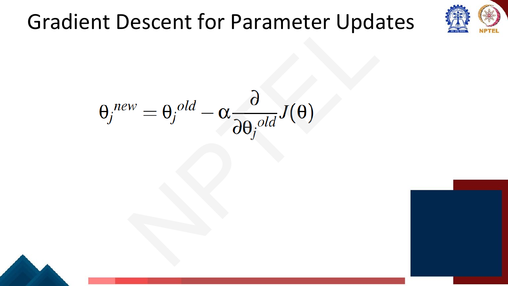
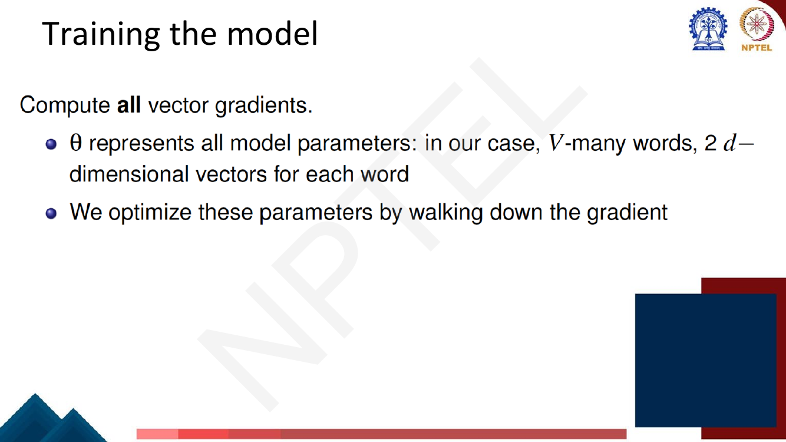

# Lec 12 — Learning Word Representation I: word2vec Skip-gram

> **Source:** `Week3.pdf` pp. 30–62 · **Week 3** · **Playlist:** Lec 12
> **Prereqs:** [Lec 11 — Word Representation](11-word-representation.md)
> **Feeds into:** [Lec 13 — Negative Sampling and GloVe](13-negative-sampling-glove.md), [Lec 14 — fastText and Beyond Words](14-fasttext-and-beyond-words.md)

## Why this lecture exists

Lecture 11 argued that a word's meaning lives in the company it keeps, and built dense vectors by
*counting* co-occurrences and reweighting them with PMI. That works, but it is a two-stage pipeline:
build a $\lvert V\rvert \times \lvert V\rvert$ matrix, then factor or truncate it. The matrix is
enormous, re-estimating it when new text arrives means starting over, and nothing in the procedure is
*learning* — there are no parameters and no objective.

This lecture replaces counting with prediction. You declare up front that every word *is* a short
dense vector, you write down a task those vectors have to solve — guess the words around me — and you
let gradient descent do the rest. The vectors become the parameters of a tiny classifier. That single
reframing is word2vec, and it is the template every embedding method after it follows.

## The ideas

### The basic idea: vectors as parameters, not as statistics


*Fig. — The whole algorithm in five lines. Note the last two: the probability is computed **from vector similarity**, and the vectors are **adjusted** to raise it. Page 32 of `Week3.pdf`.*

Read the five bullets as a loop:

1. You have a large raw corpus. **No labels** — this is self-supervised; the text supplies its own
   supervision.
2. Every word in a fixed vocabulary $V$ gets a vector. These vectors start random. They are
   $\theta$ — the parameters.
3. Slide a window along the text. At each position $t$ you have a **centre word** $c = w_t$ and the
   **outside** (context) words $o = w_{t+j}$ around it.
4. Turn the similarity between $\mathbf{v}_c$ and $\mathbf{u}_o$ into a probability $P(o \mid c)$.
5. Nudge every vector so that probability goes up. Repeat over the whole corpus.

Nothing is ever counted into a matrix. The vector *is* the model.

> **Notation clash, read once.** The deck uses $c$ for the **centre word** and $m$ for the **window
> radius**. Elsewhere in this book $c$ denotes a context window; here it does not. Also, the deck
> writes the loss as $J(\theta)$ and the learning rate as $\alpha$; this chapter writes
> $\mathcal{L}(\theta)$ and $\eta$ per the book's notation table. The quantities are identical.

### CBOW vs skip-gram — the two variations


*Fig. — Read the **arrows**, not the labels: CBOW's arrows converge on $w(t)$, skip-gram's radiate out of it. CBOW also has a `SUM` node — the context vectors are averaged into one before predicting. Page 33.*

The two architectures use the same vocabulary, the same window and the same two embedding matrices.
They differ only in which direction the prediction runs.

| | **CBOW** (Continuous Bag of Words) | **Skip-gram** |
|---|---|---|
| Predicts | the **centre** word from its context | each **context** word from the centre |
| Input | the $2m$ surrounding words | the one centre word |
| Output | one word | $2m$ words |
| Context handling | summed/averaged into a single vector — order is lost, hence "bag" | each context word is a separate prediction |
| Training examples per window | 1 | $2m$ |
| Speed | **faster** — one softmax per window | slower — $2m$ softmaxes per window |
| Rare words | worse — a rare word's signal is diluted inside an averaged context | **better** — a rare centre word still gets $2m$ dedicated updates |
| Smoothing effect | averages over context, so it smooths over distributional noise; good on small corpora | treats each pair separately; needs more data but sharper |

**The one sentence to memorise:** *CBOW predicts the centre from the context; skip-gram predicts the
context from the centre.* Students invert this constantly, including in exams. The mnemonic that
sticks: skip-gram *skips* outward from one word to many; CBOW *bags* many words into one.

The rest of this lecture is skip-gram. Lecture 13 picks up the efficiency machinery that both share.

### The skip-gram setup


*Fig. — One window, four predictions, all conditioned on the **same** centre word. The next slide (page 35) slides the window one step right so `banking` becomes the centre — that is the whole training loop. Page 34.*

Fix a **window radius** $m$ (the deck's example uses $m = 2$, so the window spans 5 tokens). At text
position $t$:

- the centre word is $w_t$;
- the outside words are $w_{t+j}$ for $-m \le j \le m$, $j \ne 0$ — that is $2m$ of them;
- the model must produce $P(w_{t+j} \mid w_t)$ for each.

Three things to notice, because each is an exam target.

- **The predictions are independent given the centre word.** $P(\text{problems} \mid \text{into})$ is
  computed without reference to `turning`. Skip-gram makes a conditional-independence assumption and
  simply multiplies the four factors.
- **Position inside the window is ignored.** $j = -2$ and $j = +1$ use the exact same formula. The
  model does not know whether `banking` came before or after `into`. (It only knows *that* it was
  nearby. Word order is genuinely thrown away — this is the first thing contextual embeddings fix,
  much later, in [Lec 26](../week-06/26-pretraining-and-elmo.md).)
- **Every token takes a turn as centre.** With $T$ tokens you get up to $2mT$ training pairs out of
  one pass over the corpus. No annotation required.

### The objective function

You want the model to assign high probability to the context words that actually occurred. Written as
a likelihood over the whole corpus of $T$ tokens, with parameters $\theta$:

$$\mathcal{L}'(\theta) = \prod_{t=1}^{T} \prod_{\substack{-m \le j \le m \\ j \ne 0}} P(w_{t+j} \mid w_t;\theta)$$

and you want to **maximise** it. The outer product runs over positions, the inner over the $2m$
offsets in the window.

![Handwritten slide: Objective Function. Maximize J'(theta) = product over t=1..T of product over -m<=j<=m, j != 0, of p(w_{t+j} | w_t ; theta). Or minimize average negative log likelihood: J(theta) = -(1/T) sum over t sum over j of log p(w_{t+j}|w_t), annotated "negate to minimize; log is monotone", "text length" pointing at T, "window size" pointing at m. Below, p(o|c) = exp(u_o^T v_c) / sum_{w=1}^{V} exp(u_w^T v_c), annotated "Each word type (vocab entry) has two word representations: as center word and as context word"](../../assets/pages/lec12/p-055.png)
*Fig. — The deck's own build. The annotations are the examinable bits: the $\tfrac{1}{T}$ is there to make the loss a **per-token average**, the minus sign converts maximise to minimise, and the log is legal because it is monotone. Page 55.*

Three transformations turn that product into something you can optimise. Do them in order and the
exam cannot surprise you:

**1. Take the log.** A product of $2mT$ numbers all below 1 underflows instantly on any real corpus.
$\log$ is monotone increasing, so whatever maximises $\mathcal{L}'$ also maximises $\log\mathcal{L}'$,
and $\log$ turns products into sums:

$$\log \mathcal{L}'(\theta) = \sum_{t=1}^{T} \sum_{\substack{-m \le j \le m \\ j \ne 0}} \log P(w_{t+j} \mid w_t;\theta)$$

**2. Negate.** Optimisers minimise by convention, so flip the sign.

**3. Divide by $T$.** This makes the number a per-token average rather than a corpus-size-dependent
total, so losses from corpora of different lengths are comparable — exactly the normalisation reason
perplexity uses in [Lec 4](../week-01/04-ngram-lm-2-smoothing-perplexity.md).

$$\boxed{\;\mathcal{L}(\theta) = -\frac{1}{T}\sum_{t=1}^{T} \sum_{\substack{-m \le j \le m \\ j \ne 0}} \log P(w_{t+j} \mid w_t;\theta)\;}$$

This is the **average negative log-likelihood**. Minimising it is identical to maximising the
likelihood; they are the same objective wearing different clothes.

### $P(o \mid c)$: softmax over two embedding matrices


*Fig. — The core equation of the lecture. Note the asymmetry: the numerator uses $\mathbf{u}$ for the outside word and $\mathbf{v}$ for the centre word, and only $\mathbf{u}$ changes in the denominator — $\mathbf{v}_c$ is held fixed across the sum. Page 36.*

$$P(o \mid c) = \frac{\exp\!\left(\mathbf{u}_o^\top \mathbf{v}_c\right)}{\sum_{w \in V}\exp\!\left(\mathbf{u}_w^\top \mathbf{v}_c\right)}$$

Take it apart piece by piece. Each piece is doing a specific job.

**The dot product $\mathbf{u}_o^\top \mathbf{v}_c$ is a similarity score.** This cashes in Lec 11's
cosine-similarity discussion: $\mathbf{u}^\top\mathbf{v} = \lVert\mathbf{u}\rVert\,\lVert\mathbf{v}\rVert\cos\theta$,
so the dot product is cosine similarity scaled by the two lengths. Vectors pointing the same way give
a large positive score, orthogonal vectors give 0, opposed vectors give a large negative one.
Crucially the dot product is *unnormalised* — length matters here, unlike cosine — so the model can
also express confidence by growing a vector. A larger score must mean "more likely to co-occur".

**The exponential makes it positive, and makes it monotone.** A probability cannot be negative, but
$\mathbf{u}_o^\top\mathbf{v}_c$ ranges over all of $\mathbb{R}$. $\exp$ maps $(-\infty,\infty)$ to
$(0,\infty)$ while preserving order, so the ranking by score is exactly the ranking by probability.
It also *amplifies* differences: a score gap of 2 becomes a probability ratio of $e^2 \approx 7.4$.
This is why skip-gram's output distributions are much peakier than the raw scores suggest.

**The denominator normalises over the whole vocabulary.** Summing $\exp(\mathbf{u}_w^\top\mathbf{v}_c)$
over *every* word $w \in V$ gives the total mass, so dividing makes the $\lvert V\rvert$ probabilities
sum to exactly 1. The sum is over the vocabulary, **not** over the window. Note also that the
denominator is the same for every outside word in a window — it depends only on $\mathbf{v}_c$ — so
you compute it once per centre word, not once per pair.

Put together, this is just the **softmax** function (see the companion course's
[treatment](../../../GenAIforCV/notes/week-02/08-mlp-and-activations.md)) applied to the vector of
$\lvert V\rvert$ scores $\mathbf{U}\mathbf{v}_c$.

### Two sets of vectors, and why

Every word type gets **two** vectors:

- $\mathbf{v}_w \in \mathbb{R}^d$ — used when $w$ is the **centre** word ("input" / "in" vector);
- $\mathbf{u}_w \in \mathbb{R}^d$ — used when $w$ is a **context** word ("output" / "out" vector).

Stacked, these are two matrices: $\mathbf{W}_1$ of shape $d \times \lvert V\rvert$ holding the centre
vectors as columns, and $\mathbf{W}_2$ of shape $\lvert V\rvert \times d$ holding the context vectors
as rows. So $\theta$ is all of it: $2\lvert V\rvert d$ numbers.

Why two? **Because it keeps the gradient clean.** If a single vector played both roles, the term
$\mathbf{u}_w^\top\mathbf{v}_c$ would become $\mathbf{v}_w^\top\mathbf{v}_c$, and when $w = c$ you get
$\lVert\mathbf{v}_c\rVert^2$ — a quadratic self-term that appears inside the denominator and makes
$\partial/\partial\mathbf{v}_c$ considerably messier. There is also a modelling reason: a word is
rarely its own neighbour (`the the` is not a thing), so the model would otherwise have to push a
vector away from itself. With two sets, $\mathbf{u}_c$ and $\mathbf{v}_c$ are separate parameters and
every derivative below is linear in the vectors.

What you do with the two sets at the end of training — keep $\mathbf{v}$, average them, concatenate —
is [Lec 13](13-negative-sampling-glove.md)'s business.


*Fig. — The same model drawn as a neural network. The crucial detail: there is **one** hidden layer and **C** identical output copies — the $2m$ context predictions share all parameters and differ only in which word they are scored against. Page 37.*

Seen as a network, skip-gram is a one-hidden-layer net with **no non-linearity**:

$$\text{one-hot}(c) \;\xrightarrow{\ \mathbf{W}_1\ }\; \mathbf{v}_c \;\xrightarrow{\ \mathbf{W}_2\ }\; \text{scores} \;\xrightarrow{\ \text{softmax}\ }\; P(\cdot \mid c)$$


*Fig. — Why multiplying by a one-hot vector is just a table lookup: $\mathbf{W}_1\,\text{one-hot}(c)$ **selects the $c$-th column**, which is $\mathbf{v}_c$. No arithmetic is actually done. The "embedding layer" in every framework is this lookup. Page 39.*

Two consequences worth stating plainly:

- **The hidden layer has no activation function.** It is a pure linear projection. Skip-gram is a
  log-bilinear model, not a deep network — all of its power comes from the softmax and the data.
- **The "multiplication" by the one-hot vector is a lookup.** $\mathbf{W}_1$ has $\lvert V\rvert$
  columns and the one-hot vector has a single 1 in position $c$, so the product is column $c$. This is
  why embedding tables are indexed, never matrix-multiplied, in real code — and it is exactly the
  "one-hot vectors are wasteful" complaint from [Lec 11](11-word-representation.md) being turned into
  a feature.

### The gradient: observed minus expected


*Fig. — The deck's update rule, written with $\alpha$ for the learning rate (this book writes $\eta$). Full optimiser mechanics — SGD vs mini-batch, momentum, Adam — are [Lec 10](../week-02/10-gradient-descent-and-init.md)'s. Page 52.*

Now derive $\partial\mathcal{L}/\partial\mathbf{v}_c$ for **one** (centre, outside) pair. Write
$Z = \sum_{w \in V}\exp(\mathbf{u}_w^\top\mathbf{v}_c)$ for the denominator. Start from the log
probability:

$$\log P(o \mid c) = \log\frac{\exp(\mathbf{u}_o^\top\mathbf{v}_c)}{Z} = \underbrace{\mathbf{u}_o^\top\mathbf{v}_c}_{\text{(1)}} \;-\; \underbrace{\log\sum_{w \in V}\exp(\mathbf{u}_w^\top\mathbf{v}_c)}_{\text{(2)}}$$

**Term (1).** $\mathbf{u}_o^\top\mathbf{v}_c = \sum_{i=1}^{d}(u_o)_i (v_c)_i$. Differentiating with
respect to component $j$ of $\mathbf{v}_c$, every term in the sum vanishes except $i = j$:

$$\frac{\partial}{\partial (v_c)_j}\mathbf{u}_o^\top\mathbf{v}_c = (u_o)_j \quad\Longrightarrow\quad \frac{\partial}{\partial\mathbf{v}_c}\mathbf{u}_o^\top\mathbf{v}_c = \mathbf{u}_o$$

**Term (2).** Chain rule, outer function $\log$, inner function the sum. **Rename the summation index
to $x$ first** — the deck flags this explicitly, and it matters, because reusing $w$ while the outer
expression also contains $w$ produces nonsense:

$$\frac{\partial}{\partial\mathbf{v}_c}\log\sum_{x \in V}\exp(\mathbf{u}_x^\top\mathbf{v}_c) = \frac{1}{Z}\cdot\sum_{x \in V}\frac{\partial}{\partial\mathbf{v}_c}\exp(\mathbf{u}_x^\top\mathbf{v}_c) = \frac{1}{Z}\sum_{x \in V}\exp(\mathbf{u}_x^\top\mathbf{v}_c)\,\mathbf{u}_x$$

using $\tfrac{d}{dz}\exp(z) = \exp(z)$ and then term (1)'s result again for the inner derivative.
Distribute the $1/Z$ inside the sum and the fraction becomes a probability:

$$= \sum_{x \in V}\frac{\exp(\mathbf{u}_x^\top\mathbf{v}_c)}{\sum_{w\in V}\exp(\mathbf{u}_w^\top\mathbf{v}_c)}\,\mathbf{u}_x = \sum_{x \in V} P(x \mid c)\,\mathbf{u}_x = \mathbb{E}_{P(x\mid c)}[\mathbf{u}_x]$$

Putting them together:

$$\boxed{\;\frac{\partial}{\partial\mathbf{v}_c}\log P(o\mid c) \;=\; \mathbf{u}_o \;-\; \sum_{x\in V}P(x\mid c)\,\mathbf{u}_x \;=\; \underbrace{\text{observed}}_{\text{the context word that actually occurred}} - \underbrace{\text{expected}}_{\text{the context the model predicts}}\;}$$

![Handwritten slide showing the final gradient derivation: d/dv_c log p(o|c) = u_o minus 1/Z times the sum over x of exp(u_x^T v_c) u_x, which equals u_o minus the sum over x of P(x|c) u_x, annotated "This is an expectation: average over all context vectors weighted by their probability" and "= observed - expected". Below in blue: "This is just the derivatives for the center vector parameters. Also need derivatives for output vector parameters (they're similar). Then we have derivative w.r.t. all parameters and can minimize"](../../assets/pages/lec12/p-058.png)
*Fig. — The punchline, and the most quotable line in the lecture: **observed minus expected**. The expectation is a probability-weighted average of **every** context vector in the vocabulary — which is where the $O(\lvert V\rvert)$ cost comes from. Page 58.*

**Read the interpretation, because it is the examinable part.** The loss is the *negative* log
probability, so the gradient you descend is the negation:

$$\frac{\partial\mathcal{L}}{\partial\mathbf{v}_c} = \mathbb{E}_{P(x\mid c)}[\mathbf{u}_x] - \mathbf{u}_o, \qquad \mathbf{v}_c \leftarrow \mathbf{v}_c - \eta\left(\mathbb{E}[\mathbf{u}_x] - \mathbf{u}_o\right) = \mathbf{v}_c + \eta\left(\mathbf{u}_o - \mathbb{E}[\mathbf{u}_x]\right)$$

The update **moves $\mathbf{v}_c$ toward the context vector that was actually observed and away from
the average context the model currently expects.** If the model already predicts $o$ perfectly, then
$P(o\mid c)\approx 1$, the expectation is $\approx \mathbf{u}_o$, the two terms cancel, and the
gradient is zero — nothing to learn. If the model is confidently wrong, the two terms point in very
different directions and the step is large. This "observed − expected" form is not a coincidence: it
is what the gradient of *any* softmax cross-entropy looks like.

The gradient for the output vectors is similar in shape. For the observed word $o$ it is
$\mathbf{v}_c\,(P(o\mid c) - 1)$ and for every other word $w$ it is $\mathbf{v}_c\,P(w\mid c)$ —
compactly, $\partial\mathcal{L}/\partial\mathbf{u}_w = \left(P(w\mid c) - \mathbb{1}[w=o]\right)\mathbf{v}_c$.
Note that this touches **every row of $\mathbf{W}_2$** on every single update.


*Fig. — The parameter count stated outright: $\lvert V\rvert$ words $\times$ 2 vectors $\times$ $d$ dimensions $= 2\lvert V\rvert d$. A standard MCQ. Page 53.*

### What the learned space looks like


*Fig. — Semantic neighbourhoods emerge with **no supervision at all**. Notice `happy` and `afraid` sitting together: distributional similarity captures *relatedness*, and antonyms share contexts, so they land close. That is a real limitation, not a bug in the plot. Page 59.*

Words that appear in similar contexts end up with similar vectors, so the space organises itself into
semantic regions. Two cautions the picture quietly makes:

- **Antonyms cluster.** `happy`/`afraid`, `victory`/`defeat` sit together because they occur in the
  same frames ("I felt ___", "the ___ at Waterloo"). Distributional similarity means *substitutable*,
  not *synonymous*.
- **The plot is a 2-D projection** of a 100–300-dimensional space. Distances in such a projection are
  suggestive, not exact.

Analogy structure (`king − man + woman ≈ queen`) in this space is [Lec 11](11-word-representation.md)'s.

### Issues with word2vec — the cliffhanger


*Fig. — The deck points at the **denominator** specifically. And read the last line carefully: the two fixes do not approximate the softmax, they **replace the objective**. Page 60.*

The problem is the normalising sum. To compute $P(o\mid c)$ for a single pair you must evaluate
$\exp(\mathbf{u}_w^\top\mathbf{v}_c)$ for **every** $w \in V$ — that is $\lvert V\rvert$ dot products
of dimension $d$, so $O(\lvert V\rvert d)$ work. And the gradient is worse than the forward pass: the
expectation $\sum_x P(x\mid c)\mathbf{u}_x$ touches every $\mathbf{u}_x$, so **every one of the
$\lvert V\rvert$ output vectors is updated on every training pair**.

Put numbers on it. With $\lvert V\rvert = 10^5$, $d = 300$, a corpus of $10^9$ tokens and $m = 5$,
there are $10^{10}$ training pairs, each costing $3\times 10^7$ multiply-adds. That is $3\times10^{17}$
operations for one epoch. The cost scales with vocabulary size, which is precisely the wrong thing for
it to scale with — doubling your vocabulary doubles your training time without giving any word more
information.

Two escapes, both owned by [Lec 13](13-negative-sampling-glove.md):

- **Negative sampling** — stop normalising; instead train a binary classifier to tell real
  (centre, context) pairs from a handful of randomly drawn fake ones.
- **Hierarchical softmax** — replace the flat $\lvert V\rvert$-way choice with a binary tree over the
  vocabulary, turning $O(\lvert V\rvert)$ into $O(\log_2 \lvert V\rvert)$.

The deck's final line is the part people miss: **both solutions optimise a different objective
function.** They are not clever ways of computing the same softmax faster; they change what is being
maximised. The resulting vectors are empirically as good or better, but the model is genuinely a
different model.

## Worked numericals

### N1. The deck's own skip-gram loss problem (pages 49–50, solution page 51)

![Slide titled Try this problem. Skip-gram box: Suppose you are computing the word vectors using Skip-gram architecture. You have 5 words in your vocabulary {passed, through, relu, activation, function} in that order and suppose you have the window "through relu activation" in your corpora. You use this window with relu as the center word and one word before and after the center word as your context. Compute the loss box: Also, suppose that for each word, you have 2-dim in and out vectors, which have the same value at this point given by [1,-1],[1,1],[-2,1],[0,1],[1,0] for the 5 words, respectively. As per the Skip-gram architecture, the loss corresponding to the target word "activation" would be -log(x). What is the value of x?](../../assets/pages/lec12/p-049.png)
*Fig. — The deck's exercise, exactly as printed. Page 50 repeats the same two boxes shrunk into the corner of a blank slide — it is a layout artefact, not a second question. Page 49.*

**Given:** $V = \{\text{passed}, \text{through}, \text{relu}, \text{activation}, \text{function}\}$
in that order; $d = 2$; **in and out vectors are equal**, namely
$[1,-1],\,[1,1],\,[-2,1],\,[0,1],\,[1,0]$ respectively. Centre word $c = \text{relu}$, window radius
$m = 1$. Target outside word $o = \text{activation}$.
**Find:** $x$, where the loss for that target is $-\log x$ — i.e. $x = P(\text{activation}\mid\text{relu})$.

1. The centre vector is the in-vector of `relu`: $\mathbf{v}_c = [-2,\;1]$.
2. Score every word in the vocabulary against it, $s_w = \mathbf{u}_w^\top\mathbf{v}_c$ — all five,
   because the softmax denominator runs over $V$, not over the window:

   | $w$ | $\mathbf{u}_w$ | $\mathbf{u}_w^\top\mathbf{v}_c$ | arithmetic |
   |---|---|---|---|
   | passed | $[1,-1]$ | $-3$ | $(1)(-2) + (-1)(1) = -2-1$ |
   | through | $[1,1]$ | $-1$ | $(1)(-2) + (1)(1) = -2+1$ |
   | relu | $[-2,1]$ | $5$ | $(-2)(-2) + (1)(1) = 4+1$ |
   | activation | $[0,1]$ | $1$ | $(0)(-2) + (1)(1) = 0+1$ |
   | function | $[1,0]$ | $-2$ | $(1)(-2) + (0)(1) = -2+0$ |

3. Exponentiate and sum for the normaliser:
   $Z = e^{-3} + e^{-1} + e^{5} + e^{1} + e^{-2}$
   $\;\;= 0.049787 + 0.367879 + 148.413159 + 2.718282 + 0.135335$
   $\;\;= \mathbf{151.6844}$
4. $x = P(\text{activation}\mid\text{relu}) = \dfrac{e^{1}}{Z} = \dfrac{2.718282}{151.6844} = \mathbf{0.017921}$
5. The loss itself: $-\ln x = \ln Z - 1 = 5.02177 - 1 = \mathbf{4.0218}$ nats.
   (Sanity check: the window has two context words, `through` and `activation`; the full window loss
   would add $-\ln P(\text{through}\mid\text{relu}) = \ln Z + 1 = 6.0218$, giving $10.0436$.)

**Answer (worked from the problem as printed): $x = e/151.68 = 0.01792$, loss $= 4.0218$ nats.**

---

![Handwritten slide titled Solution: "in vector (relu) = [2 -1] x" followed by a column of out-vectors and dot products: [-1 -1] passed = -1, [1 1] through = 1, [2 -1] relu = 5, [1 -1] activation = 3, [1 0] function = 2. Then "softmax normalization = e^5 + e^3 + e^2 + e + e^{-1} = 178.97" in red, and "loss(activation) = -log p(activation) = -log_10 (e^3 / 178.97)"](../../assets/pages/lec12/p-051.png)
*Fig. — The deck's solution. Compare its vector column against the problem statement on page 49 before you copy anything: `relu` is written $[2,-1]$ here but $[-2,1]$ there, and `passed`/`activation` differ too. Page 51.*

**⚠ The deck's solution does not match the deck's own problem statement. Flagging the disagreement.**

The solution page works with $\mathbf{v}_{\text{relu}} = [2,-1]$ and an out-vector column of
$[-1,-1],\,[1,1],\,[2,-1],\,[1,-1],\,[1,0]$. Against the problem statement's
$[1,-1],\,[1,1],\,[-2,1],\,[0,1],\,[1,0]$, three of the five entries have been transcribed
differently: `relu` is sign-flipped, and `passed` and `activation` are different vectors entirely.
The solution *is* internally consistent — with **its** vectors the scores really are
$-1, 1, 5, 3, 2$ — so this is a transcription slip between the two slides, not an arithmetic error.

The deck's chain, for completeness:

1. $Z = e^{5} + e^{3} + e^{2} + e^{1} + e^{-1} = 148.4132 + 20.0855 + 7.3891 + 2.7183 + 0.3679 = 178.974$ — matching the deck's **178.97**.
2. $x = \dfrac{e^{3}}{178.97} = \dfrac{20.0855}{178.97} = \mathbf{0.11223}$.
3. The deck then writes the loss as $-\log_{10}\!\left(\frac{e^3}{178.97}\right) = 0.9499$. **The
   base-10 is a second slip** — word2vec's negative log-likelihood is in natural log; $-\ln(0.11223) = 2.1872$ nats.
   (In practice the base only rescales the loss by a constant, so it changes no gradient *direction*,
   but it changes every reported number.)

**What to do in an exam.** If a question reproduces this exercise verbatim, the expected key is
almost certainly the deck's **$x = e^3/178.97 \approx 0.112$**. But the *method* is what is being
tested, and the method is: build $\mathbf{v}_c$ from the centre word's in-vector, dot it against
**all $\lvert V\rvert$** out-vectors (including the centre word's own), exponentiate, sum, divide.
Get that right and you can produce either number on demand. From the vectors as printed the correct
answer is $\mathbf{0.01792}$.

### N2. $P(o \mid c)$ by hand for a tiny vocabulary
**Given:** $V = \{\text{the}, \text{cat}, \text{sat}, \text{mat}\}$, $d = 2$. Out-vectors
$\mathbf{u}_{\text{the}} = [1,0]$, $\mathbf{u}_{\text{cat}} = [2,1]$, $\mathbf{u}_{\text{sat}} = [0,0]$,
$\mathbf{u}_{\text{mat}} = [1,1]$. Centre word `sat` with $\mathbf{v}_{\text{sat}} = [1,1]$.
**Find:** the full distribution $P(\cdot \mid \text{sat})$, and verify it sums to 1.

1. Dot products $\mathbf{u}_w^\top\mathbf{v}_c$ with $\mathbf{v}_c=[1,1]$:
   the $= 1+0 = 1$; cat $= 2+1 = 3$; sat $= 0+0 = 0$; mat $= 1+1 = 2$.
2. Exponentials: $e^1 = 2.71828$, $e^3 = 20.08554$, $e^0 = 1$, $e^2 = 7.38906$.
3. Normaliser $Z = 2.71828 + 20.08554 + 1 + 7.38906 = 31.19287$.
4. Divide:
   $P(\text{the}\mid\text{sat}) = 2.71828/31.19287 = 0.08714$
   $P(\text{cat}\mid\text{sat}) = 20.08554/31.19287 = 0.64391$
   $P(\text{sat}\mid\text{sat}) = 1/31.19287 = 0.03206$
   $P(\text{mat}\mid\text{sat}) = 7.38906/31.19287 = 0.23688$
5. Check: $0.08714 + 0.64391 + 0.03206 + 0.23688 = 0.99999$ ✓

**Answer:** $(0.0871,\ 0.6439,\ 0.0321,\ 0.2369)$. Note the amplification: `cat` beat `mat` by a score
of only $3 - 2 = 1$, yet its probability is $e^1 = 2.72\times$ higher. Note also that the centre word
`sat` is **in** its own denominator — the sum is over $V$ with no exclusions.

### N3. Skip-gram loss for one window of size 2
**Given:** $V = \{a,b,c,d,e\}$, $d = 2$, in- and out-vectors equal:
$a=[1,0]$, $b=[0,1]$, $c=[1,1]$, $d=[1,-1]$, $e=[-1,0]$. Corpus fragment `a b c d e`, centre word
$c$ at position 3, window radius $m = 2$, so the context is $\{a,b,d,e\}$.
**Find:** the loss contributed by this one window.

1. $\mathbf{v}_c = [1,1]$. Scores $\mathbf{u}_w^\top\mathbf{v}_c$:
   $a{:}\,1$, $b{:}\,1$, $c{:}\,2$, $d{:}\,0$, $e{:}\,-1$.
2. $Z = e^1 + e^1 + e^2 + e^0 + e^{-1} = 2.71828 + 2.71828 + 7.38906 + 1 + 0.36788 = 14.19350$.
3. $\ln Z = 2.65278$.
4. Probabilities: $P(a\mid c) = P(b\mid c) = 2.71828/14.19350 = 0.19152$; $P(c\mid c) = 0.52059$;
   $P(d\mid c) = 0.07046$; $P(e\mid c) = 0.02592$. (Sum $= 1.0000$ ✓)
5. Per-pair losses $-\log P(o\mid c) = \ln Z - s_o$:
   $a{:}\,2.65278 - 1 = 1.65278$; $b{:}\,1.65278$; $d{:}\,2.65278 - 0 = 2.65278$;
   $e{:}\,2.65278 - (-1) = 3.65278$.
6. Window loss $= 1.65278 + 1.65278 + 2.65278 + 3.65278 = \mathbf{9.61114}$.
   Shortcut: $4\ln Z - \sum_o s_o = 4(2.65278) - (1+1+0-1) = 10.61114 - 1 = 9.61114$ ✓

**Answer:** $\mathcal{L}_{\text{window}} = 9.6111$ nats. Note $e$ contributes the most loss (3.65) —
it is the context word the model currently likes least, so it will drive the largest correction.

### N4. One gradient step by hand, and verifying the loss falls
**Given:** everything from N3.
**Find:** $\partial\mathcal{L}/\partial\mathbf{v}_c$, the updated $\mathbf{v}_c$ at $\eta = 0.1$, and
the new loss.

1. For one pair, $\dfrac{\partial\mathcal{L}}{\partial\mathbf{v}_c} = \mathbb{E}[\mathbf{u}] - \mathbf{u}_o$.
   Summed over the four context words, $\dfrac{\partial\mathcal{L}}{\partial\mathbf{v}_c} = 4\,\mathbb{E}[\mathbf{u}] - \sum_{o}\mathbf{u}_o$.
2. The expectation $\mathbb{E}[\mathbf{u}] = \sum_{x\in V}P(x\mid c)\mathbf{u}_x$, using the N3
   probabilities over **all five** words:
   first component $= 0.19152(1) + 0.19152(0) + 0.52059(1) + 0.07046(1) + 0.02592(-1)$
   $= 0.19152 + 0 + 0.52059 + 0.07046 - 0.02592 = 0.75665$
   second component $= 0.19152(0) + 0.19152(1) + 0.52059(1) + 0.07046(-1) + 0.02592(0)$
   $= 0 + 0.19152 + 0.52059 - 0.07046 + 0 = 0.64166$
   So $\mathbb{E}[\mathbf{u}] = [0.75665,\ 0.64166]$.
3. Observed sum: $\mathbf{u}_a + \mathbf{u}_b + \mathbf{u}_d + \mathbf{u}_e = [1,0]+[0,1]+[1,-1]+[-1,0] = [1,\ 0]$.
4. $\dfrac{\partial\mathcal{L}}{\partial\mathbf{v}_c} = 4[0.75665, 0.64166] - [1, 0] = [3.02659 - 1,\ 2.56662 - 0] = [2.02659,\ 2.56662]$.
5. Update: $\mathbf{v}_c \leftarrow [1,1] - 0.1[2.02659, 2.56662] = [\mathbf{0.79734},\ \mathbf{0.74334}]$.
6. Recompute at the new $\mathbf{v}_c$. New scores: $a{:}\,0.79734$, $b{:}\,0.74334$,
   $c{:}\,1.54067$, $d{:}\,0.05400$, $e{:}\,-0.79734$. New
   $Z' = 2.21963 + 2.10293 + 4.66774 + 1.05549 + 0.45053 = 10.49632$, $\ln Z' = 2.35103$.
7. New window loss $= 4(2.35103) - (0.79734 + 0.74334 + 0.05400 - 0.79734) = 9.40410 - 0.79734 = \mathbf{8.60677}$.

**Answer:** $\partial\mathcal{L}/\partial\mathbf{v}_c = [2.0266,\ 2.5666]$; updated
$\mathbf{v}_c = [0.7973,\ 0.7433]$; loss falls $9.6111 \to 8.6068$, a drop of $\mathbf{1.0044}$. The
step shrank $\mathbf{v}_c$ — the model was over-confident about $c$ itself ($P(c\mid c) = 0.52$,
wasting half the mass on a word that is not in the context), so the gradient pulled the centre vector
back toward the observed context average.

### N5. Enumerating the training pairs from a sentence
**Given:** the sentence `the quick brown fox jumps` ($T = 5$ tokens), window radius $m = 2$, no
padding — windows are truncated at the sentence boundary.
**Find:** every (centre, context) training pair, and the total count.

| Centre | Position | Context words in window | Pairs |
|---|---|---|---|
| the | 1 | quick, brown | 2 |
| quick | 2 | the, brown, fox | 3 |
| brown | 3 | the, quick, fox, jumps | 4 |
| fox | 4 | quick, brown, jumps | 3 |
| jumps | 5 | brown, fox | 2 |

1. Interior positions (those with a full window on both sides) give $2m = 4$ pairs each; here only
   `brown` qualifies.
2. Edge positions are truncated: position 1 loses 2, position 2 loses 1, and symmetrically at the end.
3. Total $= 2+3+4+3+2 = \mathbf{14}$.
4. General formula for $T \ge 2m+1$: $\;\#\text{pairs} = 2mT - m(m+1)$.
   Check: $2(2)(5) - 2(3) = 20 - 6 = 14$ ✓. The $m(m+1)$ term is the total truncation at the two ends.

**Answer:** 14 pairs. Trap to avoid: the window is $\pm m$, so a radius-2 window spans **5** tokens,
not 2. And `the quick` and `quick the` are **two distinct pairs** — order of the pair matters even
though position within the window does not.

### N6. Parameter count of a word2vec model
**Given:** $\lvert V\rvert = 50{,}000$, embedding dimension $d = 300$.
**Find:** the number of trainable parameters, and the cost of one softmax.

1. Centre-vector matrix $\mathbf{W}_1$: one $d$-vector per word $= \lvert V\rvert \times d = 50{,}000 \times 300 = 15{,}000{,}000$.
2. Context-vector matrix $\mathbf{W}_2$: another $\lvert V\rvert \times d = 15{,}000{,}000$.
3. Total $= 2\lvert V\rvert d = 2 \times 50{,}000 \times 300 = \mathbf{30{,}000{,}000} = 30$M.
4. **There are no bias terms and no non-linearity** — skip-gram's parameters are exactly the two
   embedding tables. Do not add $+\lvert V\rvert$ for biases.
5. Cost of one $P(o\mid c)$: $\lvert V\rvert$ dot products of length $d$, i.e.
   $50{,}000 \times 300 = 1.5 \times 10^7$ multiply-adds — **per training pair**. This is the
   $O(\lvert V\rvert d)$ bottleneck [Lec 13](13-negative-sampling-glove.md) removes.

**Answer:** $2\lvert V\rvert d = 30$M parameters. The "2" is the whole trick question: half the exam
answers forget the second embedding set and say 15M.

## Code

```python
import numpy as np

# ---------- 1. the training-pair generator ------------------------------
def skipgram_pairs(tokens, m):
    """Every (centre, context) pair in a window of radius m. Truncated at edges."""
    pairs = []
    for t, centre in enumerate(tokens):
        lo, hi = max(0, t - m), min(len(tokens), t + m + 1)
        for j in range(lo, hi):
            if j != t:
                pairs.append((centre, tokens[j]))
    return pairs

sent = "the quick brown fox jumps".split()
pairs = skipgram_pairs(sent, m=2)
print("total pairs:", len(pairs), " formula 2mT - m(m+1):", 2*2*5 - 2*3)
for c in sent:
    print(f"  {c:<6} -> {[o for cc, o in pairs if cc == c]}")
# total pairs: 14  formula 2mT - m(m+1): 14
#   the    -> ['quick', 'brown']
#   quick  -> ['the', 'brown', 'fox']
#   brown  -> ['the', 'quick', 'fox', 'jumps']
#   fox    -> ['quick', 'brown', 'jumps']
#   jumps  -> ['brown', 'fox']

# ---------- 2. forward pass + gradient, matching N3 and N4 ---------------
V   = ["a", "b", "c", "d", "e"]
idx = {w: i for i, w in enumerate(V)}
U   = np.array([[1, 0], [0, 1], [1, 1], [1, -1], [-1, 0]], float)  # out ("context") vectors
Vin = U.copy()                                   # in ("centre") vectors, equal at init

def forward(v_c):
    s = U @ v_c                 # |V| scores, one dot product per vocabulary word
    e = np.exp(s)               # positive, order-preserving
    return s, e, e / e.sum()    # the softmax denominator sums over ALL of V

centre, context = "c", ["a", "b", "d", "e"]
v_c = Vin[idx[centre]].copy()
s, e, p = forward(v_c)
print(f"\nscores {s}   Z = {e.sum():.5f}   logZ = {np.log(e.sum()):.5f}")
print("  P(.|c) =", np.round(p, 5), " sums to", round(p.sum(), 10))

loss = -sum(np.log(p[idx[o]]) for o in context)
print(f"window loss = {loss:.5f}")
# scores [ 1.  1.  2.  0. -1.]   Z = 14.19350   logZ = 2.65278
#   P(.|c) = [0.19152 0.19152 0.52059 0.07046 0.02592]  sums to 1.0
# window loss = 9.61114

# gradient wrt the centre vector: sum over observed o of ( E[u] - u_o )
Eu   = p @ U                                       # expected context vector
obs  = sum(U[idx[o]] for o in context)             # observed context vectors
grad = len(context) * Eu - obs
print(f"E[u] = {np.round(Eu,5)}   sum u_o = {obs}   dL/dv_c = {np.round(grad,5)}")
# E[u] = [0.75665 0.64166]   sum u_o = [1. 0.]   dL/dv_c = [2.02659 2.56662]

eta   = 0.1
v_new = v_c - eta * grad
_, e2, p2 = forward(v_new)
loss2 = -sum(np.log(p2[idx[o]]) for o in context)
print(f"v_c {v_c} -> {np.round(v_new,5)}   loss {loss:.5f} -> {loss2:.5f}")
# v_c [1. 1.] -> [0.79734 0.74334]   loss 9.61114 -> 8.60677

# ---------- 3. the deck's page-49 problem, both readings -----------------
vocab    = ["passed", "through", "relu", "activation", "function"]
stated   = np.array([[1,-1],[1,1],[-2,1],[0,1],[1,0]], float)   # as printed on p.49
as_solved= np.array([[-1,-1],[1,1],[2,-1],[1,-1],[1,0]], float) # as used on p.51

for tag, M in [("p.49 as stated", stated), ("p.51 as worked", as_solved)]:
    vc = M[vocab.index("relu")]
    sc = M @ vc
    Z  = np.exp(sc).sum()
    x  = np.exp(sc[vocab.index("activation")]) / Z
    print(f"[{tag}] v_relu={vc}  scores={sc}  Z={Z:.4f}  x={x:.5f}  -ln x={-np.log(x):.4f}")
# [p.49 as stated] v_relu=[-2.  1.]  scores=[-3. -1.  5.  1. -2.]  Z=151.6844  x=0.01792  -ln x=4.0218
# [p.51 as worked] v_relu=[ 2. -1.]  scores=[-1.  1.  5.  3.  2.]  Z=178.9739  x=0.11223  -ln x=2.1872
```

The last block is the point of N1 made executable: the same problem statement yields two different
answers depending on which slide's vectors you trust, and the script shows exactly where they diverge.

## Exam pack

### Must-memorise

| Item | Exactly this |
|---|---|
| Skip-gram direction | **centre → context**: predict the outside words from the centre word |
| CBOW direction | **context → centre**: predict the centre word from the summed context |
| Two vectors per word | $\mathbf{v}_w$ when $w$ is **centre**, $\mathbf{u}_w$ when $w$ is **context** |
| Likelihood | $\mathcal{L}'(\theta) = \prod_{t=1}^{T}\prod_{-m\le j\le m,\;j\ne0} P(w_{t+j}\mid w_t;\theta)$ — **maximise** |
| Loss | $\mathcal{L}(\theta) = -\frac{1}{T}\sum_{t=1}^{T}\sum_{-m\le j\le m,\;j\ne0}\log P(w_{t+j}\mid w_t;\theta)$ — **minimise** |
| Why log | monotone, so the argmax is unchanged; turns the product into a sum and stops underflow |
| Why $1/T$ | makes it a per-token average, comparable across corpus sizes |
| $P(o\mid c)$ | $\dfrac{\exp(\mathbf{u}_o^\top\mathbf{v}_c)}{\sum_{w\in V}\exp(\mathbf{u}_w^\top\mathbf{v}_c)}$ |
| Role of the dot product | similarity score (cosine $\times$ the two lengths) |
| Role of $\exp$ | maps $\mathbb{R}\to(0,\infty)$, order-preserving, amplifies score gaps |
| Role of the denominator | normalises over the **whole vocabulary** so the $\lvert V\rvert$ probabilities sum to 1 |
| Gradient | $\dfrac{\partial}{\partial\mathbf{v}_c}\log P(o\mid c) = \mathbf{u}_o - \sum_{x\in V}P(x\mid c)\mathbf{u}_x$ |
| Its interpretation | **observed − expected** |
| Output-vector gradient | $\partial\mathcal{L}/\partial\mathbf{u}_w = \left(P(w\mid c) - \mathbb{1}[w{=}o]\right)\mathbf{v}_c$ |
| Update rule | $\theta^{\text{new}} = \theta^{\text{old}} - \eta\,\partial\mathcal{L}/\partial\theta^{\text{old}}$ (deck writes $\alpha$) |
| Parameter count | $2\lvert V\rvert d$ — two embedding matrices, no biases |
| Pairs from $T$ tokens, radius $m$ | $2mT - m(m+1)$ (with truncation at both ends) |
| The issue | the softmax denominator costs $O(\lvert V\rvert d)$ **per update** |
| The two fixes | negative sampling, hierarchical softmax — and **both change the objective function** |

### Numbers worth knowing

| Quantity | Value |
|---|---|
| Deck's exercise vocabulary | 5 words: passed, through, relu, activation, function |
| Deck's exercise normaliser (p.51) | $e^5+e^3+e^2+e+e^{-1} = 178.97$ |
| Deck's exercise answer (p.51) | $x = e^3/178.97 = 0.1122$ |
| Same exercise from the vectors as printed (p.49) | $Z = 151.68$, $x = e/151.68 = 0.01792$ |
| Deck's window radius in the running example | $m = 2$ (a 5-token window, 4 context words) |
| Deck's running example sentence | "...problems turning **into** banking crises as..." |
| Hidden-layer size in the deck's network sketch | $N$ (= $d$); $\mathbf{W}_1$ is $V\times N$, $\mathbf{W}_2$ is $N\times V$ |
| Typical $d$ in practice | 100–300 |
| Params at $\lvert V\rvert{=}50\text{k}$, $d{=}300$ | 30M |
| word2vec paper | Mikolov et al., 2013 |
| Hierarchical softmax cost | $O(\log_2\lvert V\rvert)$ vs $O(\lvert V\rvert)$ |

### Likely MCQ traps

- **Inverting CBOW and skip-gram.** The single most common error. Skip-gram: **one centre in, many
  contexts out**. CBOW: **many contexts in, one centre out**. If the diagram's arrows converge, it is
  CBOW.
- **"CBOW is better on rare words."** Reversed. **Skip-gram** handles rare words better, because each
  occurrence of a rare centre word produces $2m$ dedicated updates instead of being averaged into a
  context vector. CBOW is **faster**.
- **Summing the softmax denominator over the window instead of the vocabulary.** It is
  $\sum_{w\in V}$ — every word in the vocabulary, *including the centre word itself*.
- **Using $\mathbf{v}$ for both roles in the dot product.** The numerator is
  $\exp(\mathbf{u}_o^\top\mathbf{v}_c)$: $\mathbf{u}$ for the **outside** word, $\mathbf{v}$ for the
  **centre** word. Writing $\mathbf{v}_o^\top\mathbf{u}_c$ is wrong.
- **Parameter count $\lvert V\rvert d$.** It is $2\lvert V\rvert d$ — two embedding sets. And there
  are no bias vectors to add.
- **"Skip-gram uses word order inside the window."** No. The same formula is used for $j=-2$ and
  $j=+1$; position within the window is invisible to the model. Only *membership* in the window matters.
- **"There is a non-linearity in the hidden layer."** There is not. Skip-gram's projection layer is
  purely linear; the only non-linearity in the model is the softmax at the output.
- **Window size vs window radius.** $m=2$ means $\pm2$, so 4 context words and a 5-token span. A
  question saying "window of size 2" in this deck means $m=2$.
- **"Negative sampling computes the softmax faster."** It does not compute the softmax at all — it
  optimises a *different objective* (the deck says this outright). Same for hierarchical softmax. See
  [Lec 13](13-negative-sampling-glove.md).
- **Sign of the gradient.** $\partial(\log P)/\partial\mathbf{v}_c$ is observed − expected;
  $\partial\mathcal{L}/\partial\mathbf{v}_c$ (the **loss**, which carries a minus) is expected −
  observed. Check which one the question asks for.
- **"Word vectors are counted from a co-occurrence matrix."** That is [Lec 11](11-word-representation.md)'s
  count-based approach. word2vec is **prediction-based**: the vectors are parameters fitted by gradient descent.
- **Forgetting that word2vec is self-supervised.** It needs no labelled data at all — the corpus
  supplies its own targets.

### Self-test

1. In one sentence each, state what CBOW predicts and what skip-gram predicts.
2. Write $P(o\mid c)$ and say what the sum in the denominator ranges over.
3. A vocabulary has 20,000 words and $d = 100$. How many parameters does the skip-gram model have?
4. Why does word2vec use two vectors per word instead of one?
5. $\mathbf{v}_c = [2,0]$ and the four out-vectors are $[1,0],[0,1],[-1,0],[2,0]$. Compute $P$ of the fourth word.
6. State the gradient $\partial\log P(o\mid c)/\partial\mathbf{v}_c$ and give its two-word interpretation.
7. How many (centre, context) pairs does a 10-token sentence produce at window radius 3?
8. Why can you replace maximising $\prod_t\prod_j P(w_{t+j}\mid w_t)$ with minimising $-\frac{1}{T}\sum_t\sum_j \log P(w_{t+j}\mid w_t)$?
9. What exactly is the computational problem with word2vec, and which part of the formula causes it?
10. Does the model treat `banking` differently when it appears at $j=+1$ versus $j=-2$? Why does that matter?

<details><summary>Answers</summary>

1. CBOW predicts the **centre** word from the surrounding (summed) context words. Skip-gram predicts each **context** word from the centre word.
2. $P(o\mid c) = \exp(\mathbf{u}_o^\top\mathbf{v}_c)\big/\sum_{w\in V}\exp(\mathbf{u}_w^\top\mathbf{v}_c)$. The sum ranges over **every word in the vocabulary** $V$, including the centre word, not over the window.
3. $2\lvert V\rvert d = 2 \times 20{,}000 \times 100 = 4{,}000{,}000$ (4M).
4. It keeps the math clean: with one vector set, the $w=c$ term becomes $\lVert\mathbf{v}_c\rVert^2$, a quadratic self-term inside the denominator that complicates the gradient. It also avoids forcing a word's vector to predict itself, which the data rarely supports.
5. Scores: $2, 0, -2, 4$. $Z = e^2+e^0+e^{-2}+e^4 = 7.389+1+0.135+54.598 = 63.122$. $P = 54.598/63.122 = \mathbf{0.865}$.
6. $\mathbf{u}_o - \sum_{x\in V}P(x\mid c)\mathbf{u}_x$ = **observed minus expected**: the context vector that actually occurred, minus the probability-weighted average context the model currently predicts.
7. $2mT - m(m+1) = 2(3)(10) - 3(4) = 60 - 12 = \mathbf{48}$.
8. $\log$ is monotone increasing so it preserves the argmax; negation swaps maximisation for minimisation; and $1/T$ is a positive constant that also preserves the argmax while making the value a per-token average.
9. The **softmax denominator** $\sum_{w\in V}\exp(\mathbf{u}_w^\top\mathbf{v}_c)$. Every single update requires $\lvert V\rvert$ dot products, and the gradient's expectation term updates all $\lvert V\rvert$ output vectors — so cost scales with vocabulary size, $O(\lvert V\rvert d)$ per pair.
10. **No** — the formula is identical for every offset $j$, so position within the window is invisible. It matters because skip-gram embeddings are therefore order-blind "bag of context" representations; recovering order is what RNN ([Lec 16](../week-04/16-rnn-language-models.md)) and Transformer models later supply.

</details>

## Beyond the slides

**Gap:** The deck never mentions **subsampling of frequent words** or the **dynamic window**, both of
which are in the original word2vec implementation and are not optional details.
**Why it matters:** Mikolov discards each token with probability $1 - \sqrt{t/f(w)}$ (typically
$t = 10^{-5}$), which deletes most occurrences of `the`, `of`, `and`. Without it, the overwhelming
majority of training pairs involve a function word and carry almost no semantic signal. Separately,
the real implementation samples a window radius uniformly from $\{1,\dots,m\}$ for each centre word,
which has the effect of weighting nearby words more heavily — a cheap substitute for the positional
information the model otherwise lacks. Both materially improve the vectors, and the "effective window
is smaller than $m$" fact is a plausible MCQ.

**Gap:** The loss is presented as a sum over the whole corpus, but the slides never say how it is
actually optimised.
**Why it matters:** You never compute $\mathcal{L}(\theta)$ over all $T$ tokens — the gradient of the
full objective would take a full pass through billions of tokens to produce one update. Real training
is **stochastic gradient descent** over windows, one window (or a small batch) at a time, which also
means each update is extremely sparse: only $2m+1$ rows of $\mathbf{W}_1$ are touched (though, before
negative sampling, *all* of $\mathbf{W}_2$ is). The mechanics are
[Lec 10](../week-02/10-gradient-descent-and-init.md)'s; the point here is that the $-\frac{1}{T}$ in
the objective is bookkeeping, not an instruction to batch the corpus.

**Gap:** "Skip-gram is a shallow neural network" is drawn but its relationship to the count-based
methods of Lec 11 is never stated.
**Why it matters:** Levy and Goldberg (2014) showed that skip-gram with negative sampling is
*implicitly factorising* a shifted PMI matrix — the very matrix [Lec 11](11-word-representation.md)
built by counting. Prediction and counting are not rival philosophies; they are two routes to nearly
the same object. This also makes GloVe ([Lec 13](13-negative-sampling-glove.md)), which factorises
log-counts explicitly, much less surprising when you meet it.

**Gap:** Nothing is said about what word2vec cannot do.
**Why it matters:** Three hard limits, all of which the rest of the course exists to fix. (i) **One
vector per word type** — `bank` gets a single vector averaging the river and the money senses;
contextual embeddings ([Lec 26](../week-06/26-pretraining-and-elmo.md)) fix this. (ii) **No
out-of-vocabulary handling** — a word unseen in training has no vector at all; fastText
([Lec 14](14-fasttext-and-beyond-words.md)) fixes this with subword units. (iii) **Antonyms cluster**,
as the deck's own visualization shows, because distributional similarity measures substitutability,
not synonymy.

## Cut from the slides

The deck re-presents its opening block verbatim: pages **41–48 are a duplicate of pages 32–39**
(Learning Word Vectors: Overview → Two Variations → two Skip-gram Overview windows → objective
function → Understanding P(o|c) → two More Explanation pages), with page 40 acting as a section
divider between the two copies. Only the first copy is taught here; the rendered duplicates are
identical in content and carry nothing new. Page **50** is likewise a layout artefact — it repeats
page 49's two boxes shrunk into the top-right corner of an otherwise blank slide, so N1 cites both as
one exercise. Pages 30 (title), 31 (concepts-covered agenda), 61 (the Jurafsky & Martin reference) and
62 (blank) are front/back matter with no teaching content. Page 35 (the window slid one step right so
`banking` becomes the centre) is described in the caption of page 34's figure rather than embedded
separately, since it makes a single point about the sliding loop. Pages 56–57 — the deck's two
intermediate algebra steps in the gradient derivation — are reproduced as worked LaTeX in the text
instead of as images; nothing in them is dropped, including the deck's explicit warning to rename the
summation index. Negative sampling and hierarchical softmax are named as the cliffhanger on page 60
and deliberately not developed: [Lec 13](13-negative-sampling-glove.md) owns both objectives, along
with what to do with the two embedding sets at the end of training.
