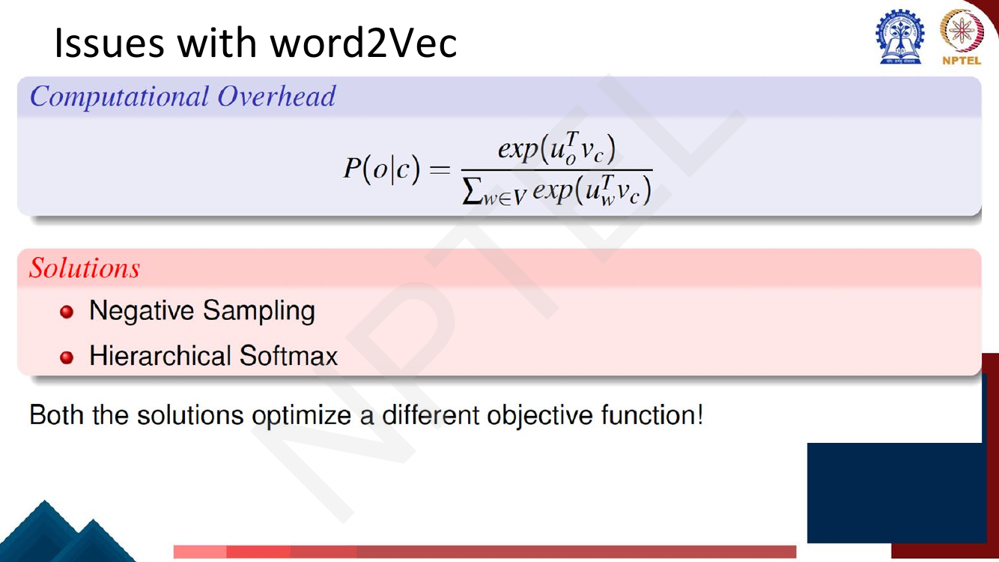
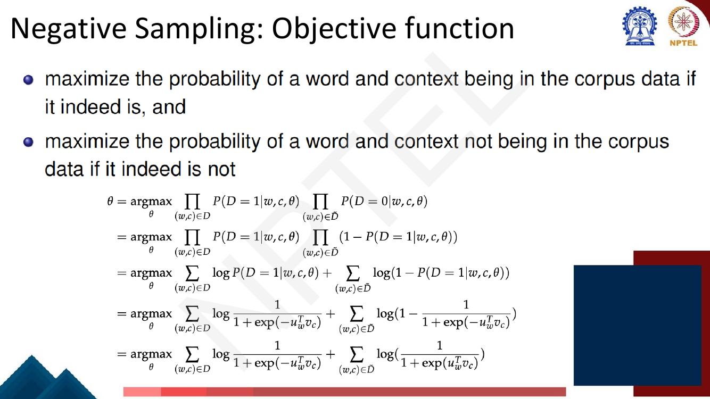
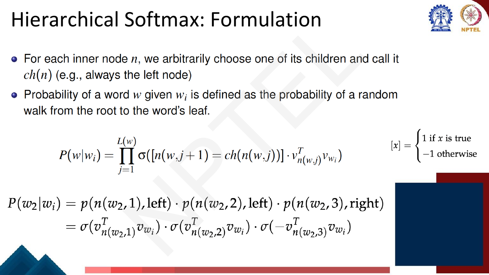

# Lec 13 — Negative Sampling, Hierarchical Softmax and GloVe

> **Source:** `Week3.pdf` pp. 63–86 · **Week 3** · **Playlist:** Lec 13
> **Prereqs:** [Lec 12 — word2vec and Skip-gram](12-word2vec-skipgram.md)
> **Feeds into:** [Lec 14 — fastText and Beyond Words](14-fasttext-and-beyond-words.md), [Lec 31 — Question Answering I](../week-07/31-question-answering-1.md)

## Why this lecture exists

Lecture 12 left an unpaid bill. Skip-gram's probability of a context word given a centre word is a
softmax whose denominator sums $\exp(\mathbf{u}_w^\top\mathbf{v}_c)$ over **every** word in the
vocabulary. With $|V| = 50{,}000$ and 300-dimensional vectors, one gradient step touches 15 million
numbers — and a real corpus has billions of (centre, context) pairs. The model is correct and
untrainable.

This lecture pays the bill twice over, with two different tricks that **change the objective** rather
than approximate the old one: negative sampling turns the $|V|$-way softmax into a handful of binary
classifications, and hierarchical softmax replaces the flat vocabulary with a binary tree so the cost
drops to $\log_2|V|$. It then asks a question that reopens everything: if co-occurrence statistics are
what skip-gram is implicitly learning, why not just count them? That question is GloVe.

## The ideas

### Collecting Lecture 12's debt

[Lec 12](12-word2vec-skipgram.md) derived the skip-gram model

$$P(o \mid c) = \frac{\exp(\mathbf{u}_o^\top\mathbf{v}_c)}{\sum_{w \in V}\exp(\mathbf{u}_w^\top\mathbf{v}_c)}$$

where $\mathbf{v}_c$ is the **centre** (target) vector of word $c$ and $\mathbf{u}_o$ the **context**
(output) vector of word $o$. The numerator is cheap. The denominator is a sum over the whole
vocabulary, so computing the probability — and therefore the gradient — is $O(|V| \cdot d)$ work for
**one** training pair.


*Fig. — The deck's framing. Notice the last line: **"Both the solutions optimize a different objective function!"** These are not numerical approximations of the softmax; they are replacement objectives that happen to produce good embeddings. Page 65 of `Week3.pdf`.*

That last sentence is the one examiners like. Negative sampling does **not** compute an approximate
softmax; it solves a different problem (binary classification) whose solution happens to give useful
vectors. Hierarchical softmax *is* a valid normalised distribution, but over a tree.

### Negative sampling: the reframing

Stop asking "which of the 50,000 words comes next?" Ask instead a yes/no question about a **pair**:

> Given a pair $(w, c)$ of a word and a context, **did this pair come from the training corpus?**

Write $P(D = 1 \mid w, c)$ for the probability that the pair is real and $P(D = 0 \mid w, c) = 1 -
P(D = 1 \mid w, c)$ for the probability it is not. Model the first with a **sigmoid** — the function
$\sigma(z) = 1/(1 + e^{-z})$ that squashes any real number into $(0,1)$, which you met in the
[companion vision course](../../../GenAIforCV/notes/week-02/08-mlp-and-activations.md) — applied to
the same dot product skip-gram already used:

$$P(D = 1 \mid w, c, \theta) = \sigma(\mathbf{v}_c^\top\mathbf{u}_w) = \frac{1}{1 + e^{-\mathbf{v}_c^\top\mathbf{u}_w}}$$

The expensive denominator is gone: a sigmoid normalises over **two** outcomes (real / fake), not
$|V|$, and two is free. The deck's intuition line is **embedding similarity high ⇒ probability high
too** — the dot product is large when the vectors point the same way, $\sigma$ maps that near 1, and
the classifier says "real pair".

### The objective, derived

Maximise the probability of real pairs being classified real, and of fake pairs being classified fake.
Let $D$ be the set of observed pairs and $\tilde{D}$ a set of fabricated ones:


*Fig. — Follow line 4 to line 5: $1 - \dfrac{1}{1+e^{-z}} = \dfrac{1}{1+e^{+z}}$, i.e. $1 - \sigma(z) = \sigma(-z)$. That single identity is why negatives appear with a **minus sign** on the dot product. Page 67.*

$$\theta^\star = \arg\max_\theta \prod_{(w,c)\in D} P(D{=}1\mid w,c,\theta) \prod_{(w,c)\in \tilde{D}} \big(1 - P(D{=}1\mid w,c,\theta)\big)$$

Take logs to turn products into sums, substitute the sigmoid, and use $1 - \sigma(z) = \sigma(-z)$:

$$\theta^\star = \arg\max_\theta \sum_{(w,c)\in D} \log\sigma(\mathbf{u}_w^\top\mathbf{v}_c) + \sum_{(w,c)\in \tilde{D}} \log\sigma(-\mathbf{u}_w^\top\mathbf{v}_c)$$

Flip the sign to get a loss to **minimise**, and restrict attention to one real pair with $K$ sampled
negatives:

$$\mathcal{L}_{\text{NS}} = -\log\sigma(\mathbf{u}_o^\top\mathbf{v}_c) - \sum_{k=1}^{K}\mathbb{E}_{w_k \sim P_n(w)}\big[\log\sigma(-\mathbf{u}_{w_k}^\top\mathbf{v}_c)\big]$$

(Papers usually quote the maximisation form — the same thing with signs reversed. The deck calls the
loss $J$; this book writes $\mathcal{L}$.)

**Read the two terms.**

- $\log\sigma(\mathbf{u}_o^\top\mathbf{v}_c)$ is maximised by driving $\mathbf{u}_o^\top\mathbf{v}_c$
  **up**. It pulls the centre vector and its true context vector together.
- $\log\sigma(-\mathbf{u}_{w_k}^\top\mathbf{v}_c)$ is maximised by driving
  $\mathbf{u}_{w_k}^\top\mathbf{v}_c$ **down** (that is what the minus sign does). It pushes the centre
  vector away from $K$ random words.

Without the second term the model would cheat: make every vector identical and enormous, and every
pair scores 1. The negatives are what stop that collapse — they are the *contrast* in what is, in
modern language, a contrastive objective.


*Fig. — Two things to lift off this page: $\tilde{D}$ is generated **on the fly**, never stored; and the three worked 3/4-powers at the bottom are the deck's own numbers — memorise them. Page 68.*

### Where the negatives come from: $P_n(w) \propto U(w)^{3/4}$

Negatives are drawn from a **noise distribution** $P_n(w)$. Three candidates:

| Choice | Problem |
|---|---|
| Uniform over $V$ | nearly every negative is a rare word; the common words never get pushed apart, and the model learns nothing about the words it sees most |
| Unigram $U(w)$ (raw frequency) | "the", "of", "a" dominate the sample; rare words are almost never contrasted, so their vectors barely move |
| **$U(w)^{3/4}$**, renormalised | the compromise word2vec actually uses |

Raising a probability in $(0,1)$ to the power $3/4$ **flattens** the distribution — it shrinks big
numbers proportionally less than small ones. The deck's own three (unnormalised) examples:

$$\text{is}: 0.9^{3/4} = 0.92 \qquad \text{Constitution}: 0.09^{3/4} = 0.16 \qquad \text{bombastic}: 0.01^{3/4} = 0.032$$

Look at the multipliers: "is" grew by $0.92/0.9 = 1.02$, "Constitution" by $1.8$, "bombastic" by
$3.2$. After renormalising, **rare words gain probability mass and frequent words lose it** (N3 works
this through). Why $3/4$? It is purely empirical — Mikolov et al. report it "outperformed
significantly" both uniform and unigram sampling, with no derivation offered. Exponent 0 gives
uniform, exponent 1 gives raw unigram, and $3/4$ sits closer to unigram. **This number is near-certain
MCQ material**, as is the fact that the *same* exponent reappears in GloVe's weighting function for an
unrelated reason.

### How many negatives?

$K$ (the deck writes it $k$) is a hyperparameter. The deck gives $k \in \{2,\dots,5\}$ **for larger
corpora**; the word2vec paper's full guidance is $5$–$20$ for small datasets, $2$–$5$ for large ones.
With a large corpus every word is seen many times and gets plenty of contrastive signal across the
epoch, so fewer negatives per pair suffice.

### Training data: positives and negatives side by side

![Slide showing the sentence "...lemon, a [tablespoon of apricot jam, a] pinch..." with apricot as target and c1-c4 as context, a table of 4 positive examples (apricot/tablespoon, apricot/of, apricot/jam, apricot/a) and 8 negative examples (apricot/aardvark, apricot/my, apricot/where, apricot/coaxial, apricot/seven, apricot/forever, apricot/dear, apricot/if)](../../assets/pages/lec13/p-069.png)
*Fig. — Count them: 4 positives (window $\pm 2$) and 8 negatives, i.e. $k = 2$ negatives per positive. The negatives are not "words that never co-occur with apricot" — they are words **sampled at random**, and some ("a", "seven") could legitimately appear near apricot. Negative sampling tolerates that noise. Page 69.*

The construction rule: slide a window of $\pm L$ words over the corpus; every (target, context) pair
inside a window is a **positive**; for each positive, draw $k$ words from $P_n(w)$ and pair them with
the same target to make $k$ **negatives**, redrawn every time the pair is visited.

### The learning algorithm

![Slide deriving L_CE = -log[P(+|w,c_pos) prod_i P(-|w,c_neg_i)] down to -[log sigma(c_pos . w) + sum_i log sigma(-c_neg_i . w)], annotated with "k is a hyperparameter in {2,...,5} for larger corpora", and boxes labelling the first term as maximising similarity of real pairs and the second as maximising distance of noise pairs](../../assets/pages/lec13/p-072.png)
*Fig. — The deck's notation here is $w$ for the target vector and $c$ for context vectors (the Jurafsky–Martin convention), not $\mathbf{v}_c$/$\mathbf{u}_o$. Same quantities, swapped letters — expect either on the exam. Page 72.*

The gradients are simple enough to quote, and the deck does:

$$\frac{\partial \mathcal{L}_{\text{CE}}}{\partial \mathbf{c}_{\text{pos}}} = [\sigma(\mathbf{c}_{\text{pos}}^\top\mathbf{w}) - 1]\,\mathbf{w}, \qquad
\frac{\partial \mathcal{L}_{\text{CE}}}{\partial \mathbf{c}_{\text{neg}}} = [\sigma(\mathbf{c}_{\text{neg}}^\top\mathbf{w})]\,\mathbf{w}$$

$$\frac{\partial \mathcal{L}_{\text{CE}}}{\partial \mathbf{w}} = [\sigma(\mathbf{c}_{\text{pos}}^\top\mathbf{w}) - 1]\,\mathbf{c}_{\text{pos}} + \sum_{i=1}^{k}[\sigma(\mathbf{c}_{\text{neg}_i}^\top\mathbf{w})]\,\mathbf{c}_{\text{neg}_i}$$

Each is "(prediction − target) × the other vector" — the standard logistic-regression gradient, with
target 1 for positives and 0 for negatives. Since $\sigma(\cdot) - 1 < 0$, the update
$-\eta\,\partial\mathcal{L}/\partial\mathbf{c}_{\text{pos}}$ moves $\mathbf{c}_{\text{pos}}$ *along*
$\mathbf{w}$; for negatives $\sigma(\cdot) > 0$, so the update moves *against* $\mathbf{w}$.


*Fig. — The picture of one SGD step with $k=2$. Only **three** context rows and **one** target row are touched. Under full softmax, every one of the $2|V|$ rows would be updated. Page 73.*

**The speedup, quantified.** Per training pair:

| Method | Output-side vectors touched | Mult-adds at $d = 300$, $\lvert V\rvert = 50{,}000$ |
|---|---|---|
| Full softmax | $\lvert V\rvert = 50{,}000$ | 15,000,000 |
| Negative sampling, $K=5$ | $K + 1 = 6$ | 1,800 |
| Hierarchical softmax | $\lceil\log_2 \lvert V\rvert\rceil = 16$ | 4,800 |

Cost drops from $O(\lvert V\rvert d)$ to $O(Kd)$ — about **8,300×** less arithmetic. N4 does this
properly.

### Hierarchical softmax

The second fix keeps a genuine probability distribution but changes its shape. Arrange the vocabulary
as the **leaves of a binary tree**. There are then $\lvert V\rvert - 1$ internal nodes, and each
internal node — not each word — owns a learnable vector $\mathbf{v}_{n(w,j)}$. There is **no output
vector per word at all**.


*Fig. — $L(w) = 3$ for $w_2$: count the **internal** nodes on the path (root, its left child, that node's left child), not the leaf. Getting $L(w)$ off by one is the standard trap. Page 74.*

Reaching a leaf means a sequence of left/right decisions, each a binary logistic choice made by the
node's vector against the centre word's vector. Fix the convention "$ch(n)$ is always the left child":

$$P(w \mid w_i) = \prod_{j=1}^{L(w)} \sigma\big(\,[\![\,n(w,j{+}1) = ch(n(w,j))\,]\!] \cdot \mathbf{v}_{n(w,j)}^\top\mathbf{v}_{w_i}\big)$$

where the bracket is the deck's **$\pm 1$ indicator**, not the usual 0/1 one:

$$[\![x]\!] = \begin{cases} +1 & \text{if } x \text{ is true (we go left)} \\ -1 & \text{otherwise (we go right)}\end{cases}$$


*Fig. — The worked expansion: **left keeps the sign, right flips it.** Two lefts then a right gives $\sigma(+)\cdot\sigma(+)\cdot\sigma(-)$. This is the exact mechanic page 77 asks you to execute. Page 75.*

Three consequences.

1. **It is a proper distribution.** At every node $\sigma(z) + \sigma(-z) = 1$, so left and right sum
   to 1; multiply down the tree and the leaf probabilities sum to exactly 1. No normalising constant is
   needed because normalisation is built into the branching.
2. **Cost is $O(\log_2|V|)$.** A balanced tree over 50,000 words has depth $\approx 16$, so a forward
   pass and a gradient step touch 16 node vectors, not 50,000. The objective is still
   $-\log P(w \mid w_i)$; only the path vectors are updated.
3. **Build the tree as a Huffman tree.** Huffman coding gives frequent words *short* codes, so they sit
   **shallower** and cost fewer sigmoid evaluations — and frequent words are the ones you train on most
   often, so average depth falls well below $\log_2|V|$. The deck calls the tree arbitrary, but
   word2vec's implementation uses Huffman and that is the version exams ask about.

**In one line each:** negative sampling is faster and better for frequent words; hierarchical softmax
is better for rare words (dedicated deep paths) and preserves a true probability distribution, which
matters if you want to *use* $P(w \mid c)$ rather than just the embeddings.

### What to do with the two sets of embeddings

Page 78 is explicit about what to do at the end: **add them**. Every word $i$ ends up with two vectors: a target/centre vector $\mathbf{v}_i$ (row $i$ of $\mathbf{W}$)
and a context vector $\mathbf{u}_i$ (row $i$ of $\mathbf{C}$), introduced in
[Lec 12](12-word2vec-skipgram.md). Three options at the end of training:

| Option | Note |
|---|---|
| Keep $\mathbf{v}_i$, throw away $\mathbf{u}_i$ | the original word2vec default; perfectly usable |
| **Sum: $\mathbf{v}_i + \mathbf{u}_i$** | the deck's recommendation, and GloVe's too; usually a small but consistent win |
| Average, or concatenate | averaging is the sum up to a scale (so identical for cosine); concatenating doubles $d$ and is rarely worth it |

Summing helps because the two matrices are trained on the same statistics from opposite sides of the
window, so their errors are partly independent and averaging cancels some noise.

### Summary: how to learn skip-gram embeddings

The deck's five-line recipe, which is a clean exam answer verbatim:

1. Start with $|V|$ random $d$-dimensional vectors as initial embeddings (two per word).
2. Take a corpus; pairs of words that co-occur in a window become **positive** examples.
3. Pairs of words that do not co-occur (sampled from $P_n$) become **negative** examples.
4. Train a classifier to distinguish positives from negatives, slowly adjusting **all** the embeddings
   to improve classifier performance.
5. **Throw away the classifier and keep the embeddings.**

Step 5 is the punchline: the classification task is a *pretext*. Nobody cares whether "apricot/jam"
is a real pair; the task exists only to force the embeddings into a useful shape — the same logic that
later powers masked language modelling in [Lec 27](../week-06/27-bert-masked-lm.md).

### Why not capture co-occurrence directly?

Skip-gram learns from co-occurrence by *predicting*, one window at a time, over and over. But the
co-occurrence statistics are a **fixed table** you could compute in a single pass.

Page 80 rebuilds the window-based co-occurrence matrix (window 5–10, symmetric) on the toy corpus
"I like deep learning / I like NLP / I enjoy flying", where $X_{\text{I,like}} = 2$. That matrix is [Lec 11](11-word-representation.md)'s material, as are its problems:
it grows with $|V|$, is huge though sparse, and makes downstream classifiers brittle. The fix is to
compress to 25–1000 dense dimensions; the question GloVe answers is *which* objective to compress with.

### GloVe: it is the ratios that carry meaning

Write $X_{ij}$ for the number of times word $j$ occurs in the context of word $i$, $X_i = \sum_k X_{ik}$
for the row total, $P_{ij} = X_{ij}/X_i$ for the co-occurrence probability. GloVe's starting insight:
$P_{ij}$ alone is a poor signal, but **ratios** $P_{ik}/P_{jk}$ are an excellent one.


*Fig. — Read the bottom row, not the top two. **8.9** (solid is an ice word), **0.085** (gas is a steam word), **1.36** and **0.96** (water and fashion are uninformative, and both land near 1). The raw probabilities do not separate like that — $P(\text{water}\mid\text{ice}) = 3.0\times10^{-3}$ is the biggest number in the table and tells you nothing. Page 82.*

The ratio cancels the nuisance factors: $P(\text{water}\mid\cdot)$ is large for everything because
"water" is common, $P(\text{fashion}\mid\cdot)$ tiny for everything because "fashion" is rare.
Dividing removes both effects and leaves only what discriminates ice from steam. Far above 1 means
"specific to $i$", far below 1 "specific to $j$", near 1 "uninformative".

So build a model in which **vector arithmetic computes log-ratios**. If we ask for

$$\mathbf{w}_i^\top\tilde{\mathbf{w}}_k = \log P(i \mid k)$$

then differences of vectors give exactly the ratios we want:

$$\mathbf{w}_x^\top(\mathbf{w}_a - \mathbf{w}_b) = \log\frac{P(x \mid a)}{P(x \mid b)}$$

This is the **log-bilinear** model, and it is why GloVe vectors support
[Lec 11](11-word-representation.md)'s analogy arithmetic: the ratio structure *is* the linear structure.

### The GloVe objective


*Fig. — Three moves on one page: split $\log P_{ik}$ into $\log X_{ik} - \log X_i$; absorb the $i$-only term $\log X_i$ into a bias $b_i$ (and add $\tilde{b}_k$ for symmetry); then weight the squared error by $f(X_{ij})$. Page 83.*

Expand the log-bilinear requirement:

$$\mathbf{w}_i^\top\tilde{\mathbf{w}}_k = \log P_{ik} = \log X_{ik} - \log X_i$$

$\log X_i$ depends only on $i$, so absorb it into a learned bias $b_i$, and add a matching
$\tilde{b}_k$ so the expression is **symmetric** under swapping the two roles — it has to be, since
the co-occurrence matrix itself is symmetric:

$$\mathbf{w}_i^\top\tilde{\mathbf{w}}_k + b_i + \tilde{b}_k = \log X_{ik}$$

One equation per nonzero cell. Fit by **weighted least squares**:

$$\mathcal{L} = \sum_{i,j=1}^{V} f(X_{ij})\big(\mathbf{w}_i^\top\tilde{\mathbf{w}}_j + b_i + \tilde{b}_j - \log X_{ij}\big)^2$$

(the deck writes this $J$).

**Why the weighting function $f$ is not optional.** Without it every cell contributes equally, and
that is wrong in both directions:

- **$X_{ij} = 0$ would be fatal.** $\log 0 = -\infty$, and most of the sparse matrix is zero. Requiring
  **$f(0) = 0$** makes those terms vanish and lets you sum over nonzero cells only — which is also what
  makes GloVe fast.
- **Very frequent pairs would dominate.** ("the", "of") has an enormous count carrying no semantic
  information. So $f$ must be **non-decreasing** but must **saturate**, so frequent co-occurrences are
  not over-weighted.

The function satisfying all three is

$$f(x) = \begin{cases} (x/x_{\max})^{\alpha} & x < x_{\max} \\ 1 & x \ge x_{\max}\end{cases}$$

with the paper's defaults $x_{\max} = 100$ and $\alpha = 3/4$. **Yes, 3/4 again** — and it has nothing
to do with negative sampling's 3/4. Both are empirically tuned constants that happened to land on the
same value; the exam loves this coincidence, so know that they are independent.

GloVe trains with AdaGrad over the nonzero entries of $X$ only, and the final vector for word $i$ is
$\mathbf{w}_i + \tilde{\mathbf{w}}_i$ — the same "add the two sets" rule as SGNS.

### The connection with skip-gram

word2vec is prediction-based and GloVe is count-based, yet their objectives are nearly the same object.


*Fig. — The chain: skip-gram's loss is a **co-occurrence-weighted sum of cross-entropies** between the empirical context distribution $P_i$ and the model's $Q_i$. Page 84.*

The derivation in three steps:

1. Skip-gram's per-position loss summed over the corpus is $\mathcal{L} = -\sum_{i \in \text{corpus}}
   \sum_{j \in \text{context}(i)} \log Q_{ij}$, with $Q_{ij} = \exp(\mathbf{w}_i^\top\tilde{\mathbf{w}}_j)
   \big/ \sum_{k=1}^{V}\exp(\mathbf{w}_i^\top\tilde{\mathbf{w}}_k)$.
2. The same pair $(i,j)$ recurs $X_{ij}$ times, so **group identical terms**:
   $\mathcal{L} = -\sum_{i=1}^{V}\sum_{j=1}^{V} X_{ij}\log Q_{ij}$. The corpus has been replaced by its
   co-occurrence table with no approximation whatsoever.
3. Substitute $X_{ij} = X_i P_{ij}$:
   $$\mathcal{L} = -\sum_{i=1}^{V} X_i \sum_{j=1}^{V} P_{ij}\log Q_{ij} = \sum_{i=1}^{V} X_i\, H(P_i, Q_i)$$

So **skip-gram minimises a frequency-weighted cross-entropy between the empirical and modelled context
distributions**. GloVe keeps the weighting idea and changes two things: cross-entropy becomes squared
error on $\log X$ (cross-entropy over-penalises long tails), and the weight $X_i$ becomes the capped
$f(X_{ij})$. Crucially, squared error does **not** need $Q$ normalised, so the $|V|$-sum disappears —
the same problem negative sampling solved, solved a different way.

### Comparison

| | Skip-gram + negative sampling | Hierarchical softmax | GloVe |
|---|---|---|---|
| Family | prediction-based (local windows) | prediction-based (local windows) | count-based (global matrix) |
| Optimises | binary cross-entropy: real pair vs noise pair | $-\log P(w\mid c)$ over a tree-factored softmax | weighted least squares on $\log X_{ij}$ |
| A valid distribution over $V$? | **no** — it is a classifier | **yes** — leaf probabilities sum to 1 | **no** — it fits log-counts |
| Cost per pair | $O(Kd)$, $K \approx 2$–20 | $O(d\log_2 \lvert V\rvert)$ | $O(d)$ per nonzero cell, one pass over $X$ |
| Sees the corpus | repeatedly, window by window | repeatedly, window by window | once, to build $X$; then trains on $X$ |
| Strong at | frequent words; raw speed; simple to implement | rare words (deep dedicated paths); real probabilities | using global statistics; fast re-training; parallelises over cells |
| Weak at | needs many epochs; ignores global counts | tree quality affects results; slower than NS | memory for $X$; no online updating from new text |
| Final vector | $\mathbf{v}_i$ or $\mathbf{v}_i + \mathbf{u}_i$ | $\mathbf{v}_i$ (no per-word output vector exists) | $\mathbf{w}_i + \tilde{\mathbf{w}}_i$ |

## Worked numericals

### N1. The deck's hierarchical-softmax exercise (page 77) — **"Try this problem"**
**Given:** centre-word embedding $\mathbf{v}_{w_i} = [0.5,\ 0.3,\ -0.4,\ 0.2]$. The path from the root
to the context word's leaf passes through three internal nodes, going **left, right, right**, with
vectors
$\mathbf{v}_{n(w,1)} = [0.3,\ 0.1,\ -0.1,\ 0.05]$,
$\mathbf{v}_{n(w,2)} = [-0.4,\ 0.5,\ 0.3,\ -0.6]$,
$\mathbf{v}_{n(w,3)} = [0.5,\ 0.3,\ -0.8,\ -0.9]$.
**Find:** $P(w \mid w_i)$.


*Fig. — The deck's own worked solution. Note line 2 of the handwriting: "$x = 1, -1, -1$ (1 for left)" — the sign is applied to the dot product **before** the sigmoid. Page 77.*

1. $L(w) = 3$ (three internal nodes on the path), so the product has three factors.
2. The sign convention: $[\![x]\!] = +1$ for **left**, $-1$ for **right**. The path left-right-right
   gives signs $+1,\ -1,\ -1$.
3. Dot product at node 1:
   $0.5(0.3) + 0.3(0.1) + (-0.4)(-0.1) + 0.2(0.05) = 0.15 + 0.03 + 0.04 + 0.01 = \mathbf{0.23}$.
4. Dot product at node 2:
   $0.5(-0.4) + 0.3(0.5) + (-0.4)(0.3) + 0.2(-0.6) = -0.20 + 0.15 - 0.12 - 0.12 = \mathbf{-0.29}$.
5. Dot product at node 3:
   $0.5(0.5) + 0.3(0.3) + (-0.4)(-0.8) + 0.2(-0.9) = 0.25 + 0.09 + 0.32 - 0.18 = \mathbf{0.48}$.
6. Apply the signs *before* the sigmoid:
   $\sigma(+1 \times 0.23) = \sigma(0.23)$, $\sigma(-1 \times -0.29) = \sigma(0.29)$,
   $\sigma(-1 \times 0.48) = \sigma(-0.48)$.
7. Evaluate. $\sigma(0.23) = 1/(1 + e^{-0.23}) = 1/(1 + 0.79453) = 1/1.79453 = 0.55725$.
8. $\sigma(0.29) = 1/(1 + e^{-0.29}) = 1/(1 + 0.74826) = 1/1.74826 = 0.57200$.
9. $\sigma(-0.48) = 1/(1 + e^{0.48}) = 1/(1 + 1.61607) = 1/2.61607 = 0.38225$.
10. Multiply: $0.55725 \times 0.57200 = 0.31875$; $\;0.31875 \times 0.38225 = 0.12184$.

**Answer:** $P(w \mid w_i) = \mathbf{0.1218}$.

**Check against the deck.** The handwritten solution on page 77 records exactly
$\sigma(0.23)\cdot\sigma(0.29)\cdot\sigma(-0.48) = 0.557 \times 0.572 \times 0.382 = 0.1218$ — it
agrees to all printed digits. The two places to go wrong are (i) using $-0.29$ instead of $+0.29$ after
the sign flip at node 2 (a *right* turn on a *negative* dot product gives a sigmoid **above** 0.5), and
(ii) counting $L(w) = 4$ by including the leaf.

### N2. The negative-sampling loss for one pair with $K = 3$
**Given:** centre word "apricot" with $\mathbf{v}_c = [0.5,\ -0.2,\ 0.3]$; true context "jam" with
$\mathbf{u}_o = [0.4,\ 0.1,\ 0.6]$; three sampled negatives
$\mathbf{u}_1 = [-0.3,\ 0.5,\ 0.2]$, $\mathbf{u}_2 = [0.1,\ 0.4,\ -0.5]$,
$\mathbf{u}_3 = [0.2,\ -0.6,\ 0.1]$.
**Find:** $\mathcal{L}_{\text{NS}}$, every sigmoid shown.

1. Positive dot: $0.4(0.5) + 0.1(-0.2) + 0.6(0.3) = 0.20 - 0.02 + 0.18 = \mathbf{0.36}$.
2. Negative dots:
   $\mathbf{u}_1^\top\mathbf{v}_c = -0.15 - 0.10 + 0.06 = \mathbf{-0.19}$;
   $\mathbf{u}_2^\top\mathbf{v}_c = 0.05 - 0.08 - 0.15 = \mathbf{-0.18}$;
   $\mathbf{u}_3^\top\mathbf{v}_c = 0.10 + 0.12 + 0.03 = \mathbf{0.25}$.
3. Positive term: $\sigma(0.36) = 1/(1 + e^{-0.36}) = 1/1.69768 = 0.58904$, so
   $\log \sigma(0.36) = -0.52926$.
4. Negatives use $\sigma(-\text{dot})$:
   $\sigma(0.19) = 1/1.82696 = 0.54736$, $\log = -0.60265$.
5. $\sigma(0.18) = 1/1.83527 = 0.54488$, $\log = -0.60719$.
6. $\sigma(-0.25) = 1/(1 + e^{0.25}) = 1/2.28403 = 0.43782$, $\log = -0.82594$.
7. Sum the four log terms: $-0.52926 - 0.60265 - 0.60719 - 0.82594 = -2.56504$.
8. The loss is the negative of that: $\mathcal{L}_{\text{NS}} = 2.56504$.

**Answer:** $\mathcal{L}_{\text{NS}} = \mathbf{2.565}$. Note $\mathbf{u}_3$ is the worst offender:
its dot product is $+0.25$, so $\sigma(-0.25) = 0.438 < 0.5$ — the classifier currently thinks that
noise pair is *more likely real than not*, and it contributes the largest loss term (0.826). The next
SGD step will push $\mathbf{v}_c$ and $\mathbf{u}_3$ apart hardest.

### N3. The $3/4$-power noise distribution on a 5-word vocabulary
**Given:** counts over a 1,000-token corpus: the 600, is 300, dog 70, zebra 20, aardvark 10.
**Find:** $U(w)$, then $P_n(w) \propto U(w)^{3/4}$ normalised, and the mass each word gains or loses.

1. Unigram probabilities: $U = 600/1000 = 0.60$, $0.30$, $0.07$, $0.02$, $0.01$. (Sum $= 1$. ✓)
2. Raise each to $3/4$. $0.60^{0.75} = e^{0.75\ln 0.60} = e^{-0.38312} = 0.681732$.
3. $0.30^{0.75} = e^{-0.90298} = 0.405360$.
4. $0.07^{0.75} = e^{-1.99445} = 0.136089$.
5. $0.02^{0.75} = e^{-2.93402} = 0.053183$.
6. $0.01^{0.75} = e^{-3.45388} = 0.031623$.
7. Normaliser $Z = 0.681732 + 0.405360 + 0.136089 + 0.053183 + 0.031623 = 1.307987$.
8. Divide each by $Z$:

| word | $U(w)$ | $U(w)^{3/4}$ | $P_n(w)$ | $P_n/U$ |
|---|---|---|---|---|
| the | 0.6000 | 0.681732 | **0.5212** | 0.869 |
| is | 0.3000 | 0.405360 | **0.3099** | 1.033 |
| dog | 0.0700 | 0.136089 | **0.1040** | 1.486 |
| zebra | 0.0200 | 0.053183 | **0.0407** | 2.033 |
| aardvark | 0.0100 | 0.031623 | **0.0242** | 2.418 |

9. Check: $0.5212 + 0.3099 + 0.1040 + 0.0407 + 0.0242 = 1.0000$. ✓

**Answer:** the rarest word's sampling probability **more than doubles** ($0.0100 \to 0.0242$, a factor
of 2.42) while the commonest word loses 13% of its mass ($0.6000 \to 0.5212$). Notice the last column
is monotone decreasing in frequency — that is precisely the flattening. (Under a *uniform* noise
distribution every word would sit at 0.2, so $3/4$ is nowhere near uniform; it is a nudge, not a
levelling.)

### N4. Cost per training pair at $\lvert V\rvert = 50{,}000$
**Given:** $\lvert V\rvert = 50{,}000$, $d = 300$, negative sampling with $K = 5$, a balanced
hierarchical-softmax tree.
**Find:** output-side multiply-adds per training pair under each scheme, and the speedups.

1. **Full softmax.** The denominator needs $\mathbf{u}_w^\top\mathbf{v}_c$ for every $w$: that is
   $|V|$ dot products of length $d$, so $50{,}000 \times 300 = \mathbf{15{,}000{,}000}$ mult-adds, and
   all $50{,}000$ output vectors receive a gradient.
2. **Negative sampling.** One positive plus $K = 5$ negatives $= 6$ dot products:
   $6 \times 300 = \mathbf{1{,}800}$ mult-adds; 6 output vectors updated.
3. **Hierarchical softmax.** Depth $= \lceil\log_2 50{,}000\rceil$. Since $2^{15} = 32{,}768 <
   50{,}000 \le 65{,}536 = 2^{16}$, depth $= \mathbf{16}$. So $16 \times 300 = \mathbf{4{,}800}$
   mult-adds; 16 node vectors updated.
4. Speedup of NS over full softmax: $15{,}000{,}000 / 1{,}800 = 50{,}000/6 = \mathbf{8333.3\times}$.
5. Speedup of HS over full softmax: $15{,}000{,}000 / 4{,}800 = 50{,}000/16 = \mathbf{3125\times}$.
6. NS relative to HS: $4{,}800/1{,}800 = \mathbf{2.67\times}$ faster.

**Answer:** 15,000,000 / 1,800 / 4,800 mult-adds; NS is ~8,300× cheaper than full softmax and HS
~3,100×. With Huffman coding the *average* HS depth drops well below 16 (frequent words sit near the
root), so the real HS gap is smaller than this balanced-tree estimate.

### N5. One term of the GloVe objective
**Given:** $X_{ij} = 50$; $\mathbf{w}_i^\top\tilde{\mathbf{w}}_j = 3.2$; $b_i = 0.5$;
$\tilde{b}_j = -0.3$; weighting function with $x_{\max} = 100$, $\alpha = 3/4$.
**Find:** the residual, its square, $f(X_{ij})$, and this cell's contribution to $\mathcal{L}$.

1. $\log X_{ij} = \ln 50 = 3.912023$.
2. Residual $= \mathbf{w}_i^\top\tilde{\mathbf{w}}_j + b_i + \tilde{b}_j - \log X_{ij}
   = 3.2 + 0.5 - 0.3 - 3.912023 = \mathbf{-0.512023}$.
3. Squared: $(-0.512023)^2 = \mathbf{0.262168}$.
4. Weight: $X_{ij} = 50 < x_{\max} = 100$, so $f(50) = (50/100)^{0.75} = 0.5^{0.75}
   = e^{0.75 \ln 0.5} = e^{-0.519860} = \mathbf{0.594604}$.
5. Contribution $= f(X_{ij}) \times \text{residual}^2 = 0.594604 \times 0.262168 = \mathbf{0.155886}$.
6. Contrast: had $X_{ij}$ been 500, we would have $f = 1$ (capped) — but $\log 500 = 6.215$, so the
   residual would be $-2.815$ and the term $1 \times 7.925 = 7.925$. Had $X_{ij}$ been 0, $f(0) = 0$
   and the term would be **0** regardless of the vectors, which is exactly what keeps $\log 0$ out of
   the objective.

**Answer:** residual $= -0.5120$, $f(X_{ij}) = 0.5946$, weighted contribution $= \mathbf{0.1559}$.

## Code

```python
import numpy as np
sigmoid = lambda z: 1.0 / (1.0 + np.exp(-z))

# --- N2: negative-sampling loss, one positive + K = 3 negatives -----------
v_c   = np.array([ 0.5, -0.2,  0.3])            # centre word "apricot"
u_o   = np.array([ 0.4,  0.1,  0.6])            # true context "jam"
U_neg = np.array([[-0.3,  0.5,  0.2],           # "matrix"
                  [ 0.1,  0.4, -0.5],           # "Tolstoy"
                  [ 0.2, -0.6,  0.1]])          # "aardvark"

s_pos, s_neg = u_o @ v_c, U_neg @ v_c
print("dot(u_o, v_c)  =", round(float(s_pos), 4), "   sigma =", round(float(sigmoid(s_pos)), 6))
print("dot(u_k, v_c)  =", np.round(s_neg, 4), "  sigma(-dot) =", np.round(sigmoid(-s_neg), 6))
# negatives enter as sigma(-dot): that is the 1 - sigma(z) = sigma(-z) identity
loss = -(np.log(sigmoid(s_pos)) + np.log(sigmoid(-s_neg)).sum())
print("L_NS           =", round(float(loss), 6))
# dot(u_o, v_c)  = 0.36    sigma = 0.58904
# dot(u_k, v_c)  = [-0.19 -0.18  0.25]   sigma(-dot) = [0.547358 0.544879 0.437823]
# L_NS           = 2.565045

# --- N3: the 3/4-power noise distribution --------------------------------
words  = ["the", "is", "dog", "zebra", "aardvark"]
counts = np.array([600, 300, 70, 20, 10], dtype=float)
U   = counts / counts.sum()            # raw unigram distribution
raw = U ** 0.75                        # flatten: big values shrink proportionally more
Pn  = raw / raw.sum()                  # renormalise
print("\nword      U(w)     U^0.75    P_n(w)    P_n/U")
for w, u, r, p in zip(words, U, raw, Pn):
    print(f"{w:9s}{u:7.4f}{r:10.6f}{p:10.6f}{p/u:8.3f}")
print("Z =", round(float(raw.sum()), 6), " sum P_n =", round(float(Pn.sum()), 6))
# word      U(w)     U^0.75    P_n(w)    P_n/U
# the       0.6000  0.681732  0.521207   0.869
# is        0.3000  0.405360  0.309911   1.033
# dog       0.0700  0.136089  0.104045   1.486
# zebra     0.0200  0.053183  0.040660   2.033
# aardvark  0.0100  0.031623  0.024177   2.418
# Z = 1.307987  sum P_n = 1.0
```

The last column is the whole point of the exponent: every rare word's ratio is above 1, every frequent
word's below 1.

```python
import numpy as np
sigmoid = lambda z: 1.0 / (1.0 + np.exp(-z))

# --- N1 / deck page 77: hierarchical-softmax path probability -------------
v_center = np.array([0.5, 0.3, -0.4, 0.2])
path = [(np.array([ 0.3, 0.1, -0.1,  0.05]), +1),   # left  -> [x] = +1
        (np.array([-0.4, 0.5,  0.3, -0.6 ]), -1),   # right -> [x] = -1
        (np.array([ 0.5, 0.3, -0.8, -0.9 ]), -1)]   # right -> [x] = -1
p = 1.0
print("node    dot      [x]   sigma([x]*dot)")
for i, (v_node, s) in enumerate(path, 1):
    d = float(v_node @ v_center)
    f = float(sigmoid(s * d)); p *= f
    print(f"  {i}   {d:+.4f}   {s:+d}      {f:.6f}")
print("P(context | centre) =", round(p, 6))
# node    dot      [x]   sigma([x]*dot)
#   1   +0.2300   +1      0.557248
#   2   -0.2900   -1      0.571996
#   3   +0.4800   -1      0.382252
# P(context | centre) = 0.12184          <- matches the deck's 0.1218

# --- hierarchical softmax really is a distribution ------------------------
# depth-2 tree: node 0 = root, nodes 1 and 2 = its children, 4 leaves
nodes = np.random.default_rng(0).normal(size=(3, 4)) * 0.5
def leaf_prob(b_root, b_child):          # 1 = go left, 0 = go right
    q  = sigmoid(( +1 if b_root  else -1) * (nodes[0]              @ v_center))
    q *= sigmoid(( +1 if b_child else -1) * (nodes[1 if b_root else 2] @ v_center))
    return float(q)
print("sum over all 4 leaves =",
      round(sum(leaf_prob(a, b) for a in (1, 0) for b in (1, 0)), 6))
# sum over all 4 leaves = 1.0            <- no normalising constant needed

# --- N4 / N5: costs and one GloVe term ------------------------------------
V, d, K = 50_000, 300, 5
depth = int(np.ceil(np.log2(V)))
print(f"\nfull softmax : {V:>6} vectors, {V*d:>9} mult-adds")
print(f"neg sampling : {K+1:>6} vectors, {(K+1)*d:>9} mult-adds -> {V/(K+1):8.1f}x fewer")
print(f"hier softmax : {depth:>6} vectors, {depth*d:>9} mult-adds -> {V/depth:8.1f}x fewer")
# full softmax :  50000 vectors,  15000000 mult-adds
# neg sampling :      6 vectors,      1800 mult-adds ->   8333.3x fewer
# hier softmax :     16 vectors,      4800 mult-adds ->   3125.0x fewer

X_ij, xmax, alpha = 50.0, 100.0, 0.75
resid = 3.2 + 0.5 + (-0.3) - np.log(X_ij)
f = (X_ij / xmax) ** alpha if X_ij < xmax else 1.0
print(f"\nresidual = {resid:.6f}  residual^2 = {resid**2:.6f}  "
      f"f(X) = {f:.6f}  term = {f*resid**2:.6f}")
# residual = -0.512023  residual^2 = 0.262168  f(X) = 0.594604  term = 0.155886
```

## Exam pack

### Must-memorise

| Item | Exactly this |
|---|---|
| The problem | skip-gram's softmax denominator sums over all of $V$ → $O(\lvert V\rvert)$ per update |
| Negative sampling reframes it as | **binary classification**: did $(w,c)$ come from the corpus? |
| Classifier | $P(D{=}1 \mid w,c) = \sigma(\mathbf{v}_c^\top\mathbf{u}_w) = 1/(1 + e^{-\mathbf{v}_c^\top\mathbf{u}_w})$ |
| NS objective (maximise) | $\log\sigma(\mathbf{u}_o^\top\mathbf{v}_c) + \sum_{k=1}^{K}\mathbb{E}_{w_k\sim P_n}\big[\log\sigma(-\mathbf{u}_{w_k}^\top\mathbf{v}_c)\big]$ |
| The identity behind the minus sign | $1 - \sigma(z) = \sigma(-z)$ |
| Noise distribution | $P_n(w) \propto U(w)^{3/4}$ — unigram raised to the **3/4** power, renormalised |
| Effect of the 3/4 | **flattens**: rare words sampled more often, frequent words less |
| NS gradient (positive) | $\partial\mathcal{L}/\partial\mathbf{c}_{\text{pos}} = [\sigma(\mathbf{c}_{\text{pos}}^\top\mathbf{w}) - 1]\mathbf{w}$ |
| NS gradient (negative) | $\partial\mathcal{L}/\partial\mathbf{c}_{\text{neg}} = [\sigma(\mathbf{c}_{\text{neg}}^\top\mathbf{w})]\mathbf{w}$ |
| NS cost | $O(Kd)$ instead of $O(\lvert V\rvert d)$ |
| Hierarchical softmax structure | vocabulary = **leaves of a binary tree**; $\lvert V\rvert - 1$ internal nodes, each with a learnable vector; **no per-word output vector** |
| HS probability | $P(w\mid w_i) = \prod_{j=1}^{L(w)}\sigma\big([\![n(w,j{+}1)=ch(n(w,j))]\!]\cdot\mathbf{v}_{n(w,j)}^\top\mathbf{v}_{w_i}\big)$ |
| The bracket | $+1$ if true (left), $\mathbf{-1}$ otherwise (right) — **not** 0/1 |
| $L(w)$ | number of **internal** (non-leaf) nodes on the root-to-leaf path |
| HS cost | $O(d\log_2\lvert V\rvert)$ |
| Huffman | frequent words get short codes → sit shallower → cheaper |
| Two embedding sets | target $\mathbf{W}$, context $\mathbf{C}$; the deck says **add them**: $\mathbf{w}_i + \mathbf{c}_i$ |
| GloVe notation | $X_{ij}$ counts, $X_i = \sum_k X_{ik}$, $P_{ij} = X_{ij}/X_i$ |
| GloVe's insight | **ratios** $P_{ik}/P_{jk}$ encode meaning; raw probabilities do not |
| Log-bilinear | $\mathbf{w}_i^\top\tilde{\mathbf{w}}_k = \log P_{ik}$; hence $\mathbf{w}_x^\top(\mathbf{w}_a - \mathbf{w}_b) = \log\frac{P(x\mid a)}{P(x\mid b)}$ |
| Symmetric form | $\mathbf{w}_i^\top\tilde{\mathbf{w}}_k + b_i + \tilde{b}_k = \log X_{ik}$ ($\log X_i$ absorbed into $b_i$) |
| GloVe objective | $\mathcal{L} = \sum_{i,j} f(X_{ij})\big(\mathbf{w}_i^\top\tilde{\mathbf{w}}_j + b_i + \tilde{b}_j - \log X_{ij}\big)^2$ |
| Why $f$ | $f(0)=0$ skips zero cells (avoids $\log 0$); saturates so frequent pairs are not over-weighted |
| $f$ | $(x/x_{\max})^{\alpha}$ for $x<x_{\max}$, else 1; $x_{\max}=100$, $\alpha=3/4$ |
| Skip-gram ↔ GloVe | skip-gram $= \sum_i X_i H(P_i, Q_i)$, a count-weighted cross-entropy; GloVe swaps cross-entropy for weighted least squares on $\log X$ |
| One-line contrast | word2vec = **prediction**-based, local windows; GloVe = **count**-based, global matrix |

### Numbers worth knowing

| Quantity | Value |
|---|---|
| Noise-distribution exponent | $3/4 = 0.75$ |
| Deck's 3/4 examples | $0.9^{3/4}=0.92$, $0.09^{3/4}=0.16$, $0.01^{3/4}=0.032$ |
| $K$ (negatives) — the deck | $\{2,\dots,5\}$ for **larger** corpora |
| $K$ — word2vec paper, full guidance | 5–20 small datasets, 2–5 large datasets |
| Deck's training-data example | 4 positives, 8 negatives ⇒ $k = 2$ |
| HS depth at $\lvert V\rvert = 50{,}000$ | $\lceil\log_2 50000\rceil = 16$ |
| Internal nodes in the tree | $\lvert V\rvert - 1$ |
| Deck's $L(w)$ example | $L(w_2) = 3$ |
| Page-77 answer | $0.1218$ |
| GloVe $x_{\max}$ | 100 |
| GloVe $\alpha$ | $3/4$ |
| GloVe table's corpus | 6 billion tokens |
| GloVe ice/steam ratios | solid 8.9, gas $8.5\times10^{-2}$, water 1.36, fashion 0.96 |
| Co-occurrence window | 5–10 (deck's toy example uses 1) |
| Dense-vector dimensionality | 25–1000 |
| GloVe optimiser | AdaGrad |

### Likely MCQ traps

- **"Negative sampling approximates the softmax."** The deck says the opposite: *both* solutions
  **optimise a different objective function**. NS solves binary classification; it is not a softmax
  estimator.
- **The exponent.** It is $3/4$, applied to the **unigram** distribution, and it makes **rare words
  more likely** to be sampled. Exponent 1 = raw unigram, exponent 0 = uniform. Do not say "it makes
  frequent words more likely".
- **Thinking GloVe's $\alpha = 3/4$ and $P_n$'s $3/4$ are the same mechanism.** Numerically identical,
  conceptually unrelated: one flattens a *sampling* distribution, the other caps a *loss weight*.
- **Sign on the negative term.** It is $\log\sigma(-\mathbf{u}_k^\top\mathbf{v}_c)$ — the minus goes
  **inside**, on the dot product.
- **Hierarchical softmax cost.** $O(\log_2\lvert V\rvert)$, not $O(\sqrt{\lvert V\rvert})$ and not
  $O(\lvert V\rvert/2)$.
- **Counting $L(w)$.** It counts **internal** nodes only. A leaf at depth 3 has $L(w) = 3$, giving
  three sigmoid factors, not four.
- **The $\pm1$ bracket.** The deck's $[\![x]\!]$ is $+1$/$-1$, not $1$/$0$. Using 0 would make the
  right-branch factor $\sigma(0) = 0.5$ for every node.
- **"Hierarchical softmax has one output vector per word."** No — the per-word output vectors are
  *replaced* by $\lvert V\rvert - 1$ internal-node vectors.
- **"GloVe needs the full dense co-occurrence matrix."** It trains only on **nonzero** entries,
  precisely because $f(0) = 0$.
- **"$f$ must be increasing without bound."** It must be non-decreasing **and saturate** at 1, so
  frequent co-occurrences are not over-weighted.
- **"The GloVe target is $X_{ij}$."** The target is $\log X_{ij}$. Fitting raw counts would be wrecked
  by the heavy tail.
- **"GloVe is a prediction model."** It is count-based: one pass to build $X$, then least squares on
  the table. word2vec is prediction-based.
- **"Which ratio means the word is uninformative?"** A ratio near **1** (water 1.36, fashion 0.96).
- **Discarding the context embeddings.** Both the deck and the GloVe paper recommend **adding** the two
  sets, not keeping only one.

### Self-test

1. Why does the skip-gram softmax cost $O(\lvert V\rvert)$ per update, and which part of the formula is responsible?
2. Write the negative-sampling objective for one positive pair and $K$ negatives, and say what each term does.
3. Compute $P_n$ for a two-word vocabulary with $U = (0.8, 0.2)$ under the $3/4$ rule.
4. A hierarchical-softmax path is **right, left**, with node dot products $-0.5$ and $+1.0$ against the centre vector. What is $P(w\mid c)$?
5. At $\lvert V\rvert = 100{,}000$ and $d = 100$, how many output-side mult-adds does one pair cost under full softmax, under NS with $K = 10$, and under HS?
6. State two reasons the GloVe weighting function $f$ is necessary.
7. $P(k\mid\text{ice})/P(k\mid\text{steam}) = 0.085$ for $k = $ gas. What does that tell you, and why is the ratio more informative than $P(\text{gas}\mid\text{ice})$ alone?
8. In the GloVe equation $\mathbf{w}_i^\top\tilde{\mathbf{w}}_k + b_i + \tilde{b}_k = \log X_{ik}$, where did $\log X_i$ go?
9. Give the one-sentence relationship between skip-gram's global objective and cross-entropy.
10. Why does hierarchical softmax need no normalising constant?

<details><summary>Answers</summary>

1. The denominator $\sum_{w\in V}\exp(\mathbf{u}_w^\top\mathbf{v}_c)$ runs over every word in the vocabulary, so one forward pass (and hence one gradient) touches all $\lvert V\rvert$ output vectors.
2. $\log\sigma(\mathbf{u}_o^\top\mathbf{v}_c) + \sum_{k=1}^{K}\mathbb{E}_{w_k\sim P_n}[\log\sigma(-\mathbf{u}_{w_k}^\top\mathbf{v}_c)]$, maximised. First term pushes the real pair's dot product **up**; the sum pushes $K$ sampled fake pairs' dot products **down**, which prevents the degenerate all-vectors-identical solution.
3. $0.8^{0.75} = 0.846$, $0.2^{0.75} = 0.299$; $Z = 1.145$; $P_n = (0.739,\ 0.261)$. The rare word rose from 0.200 to 0.261.
4. Right flips the sign, left keeps it: $\sigma(-(-0.5))\cdot\sigma(+1.0) = \sigma(0.5)\sigma(1.0) = 0.6225 \times 0.7311 = \mathbf{0.4551}$.
5. Full softmax $100{,}000 \times 100 = 10{,}000{,}000$; NS $(10+1)\times100 = 1{,}100$; HS $\lceil\log_2 100000\rceil = 17$, so $1{,}700$.
6. (i) $f(0) = 0$ kills the zero cells, which would otherwise contribute $\log 0 = -\infty$ and which are most of the matrix; (ii) $f$ saturates at 1 so very frequent, semantically empty pairs like ("the","of") do not dominate the loss.
7. It is far below 1, so "gas" is specific to **steam**, not ice. $P(\text{gas}\mid\text{ice}) = 6.6\times10^{-5}$ alone is just "small", which could equally mean gas is a rare word; the ratio cancels gas's overall frequency and leaves only the discriminative part.
8. It depends only on $i$, so it was absorbed into the learned bias $b_i$ (with $\tilde{b}_k$ added to keep the expression symmetric).
9. $\mathcal{L}_{\text{skip-gram}} = -\sum_{i,j} X_{ij}\log Q_{ij} = \sum_i X_i H(P_i, Q_i)$ — a co-occurrence-count-weighted sum of cross-entropies between the empirical context distribution and the model's.
10. Every internal node splits probability between exactly two children with $\sigma(z)$ and $\sigma(-z)$, which sum to 1; multiplying these down every root-to-leaf path makes the leaf probabilities sum to 1 automatically.

</details>

## Beyond the slides

**Gap:** The deck never states the single most-cited theoretical result about negative sampling — Levy
& Goldberg (2014) proved that **SGNS is implicitly factorising a shifted PMI matrix**, specifically
$\mathbf{u}_o^\top\mathbf{v}_c \approx \mathrm{PMI}(c, o) - \log K$ at the optimum.
**Why it matters:** this is the deepest version of the count-vs-prediction unification the deck gestures
at on page 84. It says the "neural" method and the count-based methods of
[Lec 11](11-word-representation.md) are computing the same thing, and it explains why $K$ matters: more
negatives shift the whole matrix down by $\log K$. A plausible higher-order MCQ.

**Gap:** **Subsampling of frequent words** is part of word2vec and is not mentioned at all. Each token
is discarded with probability $P(w_i) = 1 - \sqrt{t/f(w_i)}$, where $f$ is the word's frequency and
$t \approx 10^{-5}$.
**Why it matters:** it is often confused with negative sampling's $3/4$ power in exams — both deal with
frequent words, but subsampling throws away *training tokens* while the $3/4$ power reshapes the
*noise* distribution. Subsampling also enlarges the effective window (deleting "the" brings distant
content words into range), which is part of why it improves rare-word vectors.

**Gap:** No evaluation. The deck never reports how these models actually score.
**Why it matters:** on the standard Google analogy set, 300-d GloVe trained on 6B tokens reaches about
**75%** accuracy against roughly 65–70% for comparably trained SGNS; later independent work showed the
gap mostly disappears once hyperparameters (window, negatives, subsampling) are tuned equally. The
takeaway worth carrying forward is "hyperparameters matter more than the algorithm", which is also the
honest answer when an exam asks "which is better, GloVe or word2vec?".

**Gap:** The deck does not say what happens to words that **never co-occur** under GloVe.
**Why it matters:** $f(0) = 0$ means those pairs contribute nothing, so GloVe makes *no* claim about
them — unlike negative sampling, which actively pushes unobserved pairs apart. This is a real
behavioural difference between the two objectives, and it is why GloVe's vectors for very rare words
are driven almost entirely by their few observed contexts.

## Cut from the slides

Pages 63 (title), 64 (the "Concepts covered" outline), 85 (the Jurafsky–Martin reference) and 86
(blank) carry no teachable content and are not reproduced. Page 66's formulation and page 67's
five-line algebraic derivation are compressed into one derivation here because lines 1–3 are routine
log-of-a-product manipulation; the one substantive step, $1 - \sigma(z) = \sigma(-z)$, is called out
explicitly. Pages 70 and 71 (the sigmoid plot, the $p(+\mid\text{apricot},\cdot)=1$ examples, the
product-over-the-window form $\mathbb{P}(+\mid w, c_{1:L}) = \prod_i \sigma(\mathbf{c}_i\cdot\mathbf{w})$,
and the picture of $\theta$ as stacked $\mathbf{W}$/$\mathbf{C}$ blocks) are folded into the text
rather than given figures — the sigmoid belongs to the
[companion course](../../../GenAIforCV/notes/week-02/08-mlp-and-activations.md) and the $\theta$
picture reappears on page 73, which is reproduced. Page 74 and page 76 show the *same*
tree diagram; only page 74 is embedded, with page 76's one new sentence ("we update the vectors of the
nodes in the binary tree, on the path") quoted inline. Page 81's co-occurrence-vector drawbacks are
[Lec 11](11-word-representation.md)'s material and are summarised in two clauses with a link rather
than re-taught. Nothing on negative sampling, hierarchical softmax or GloVe was dropped.
