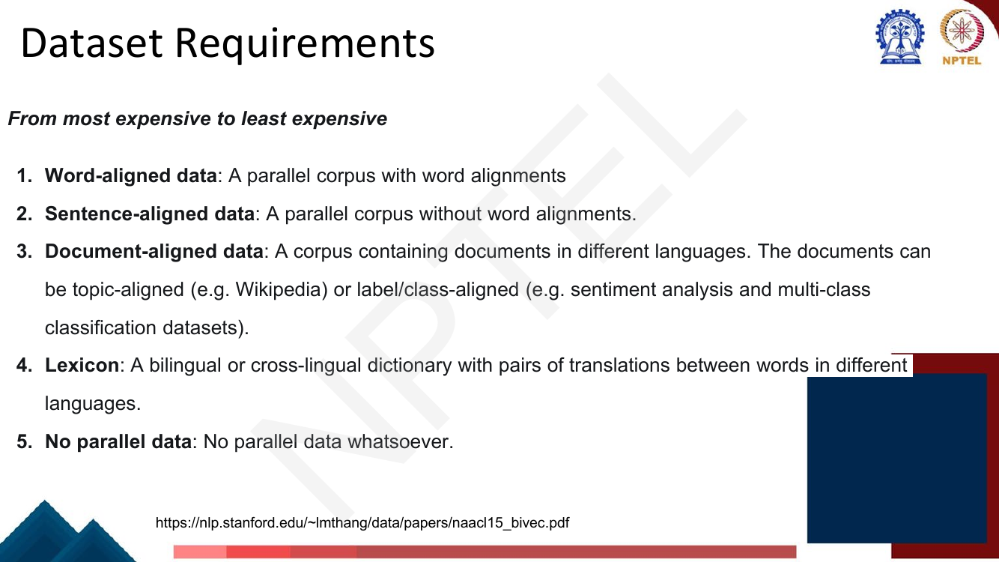
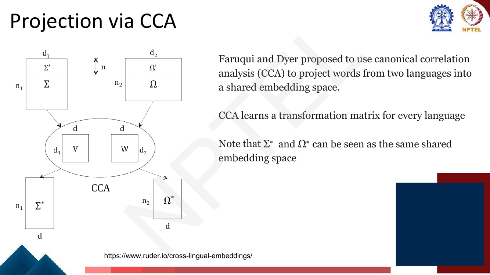
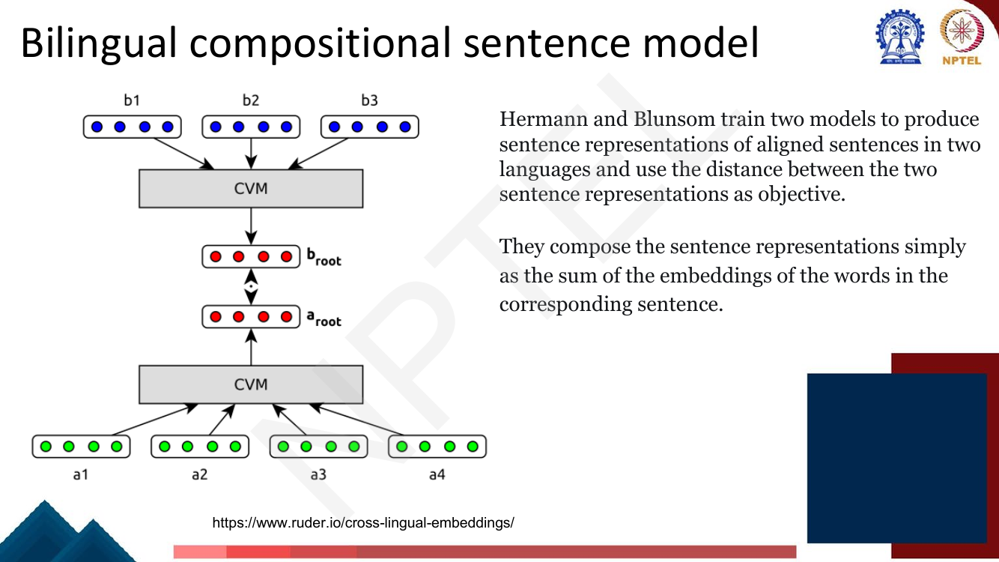
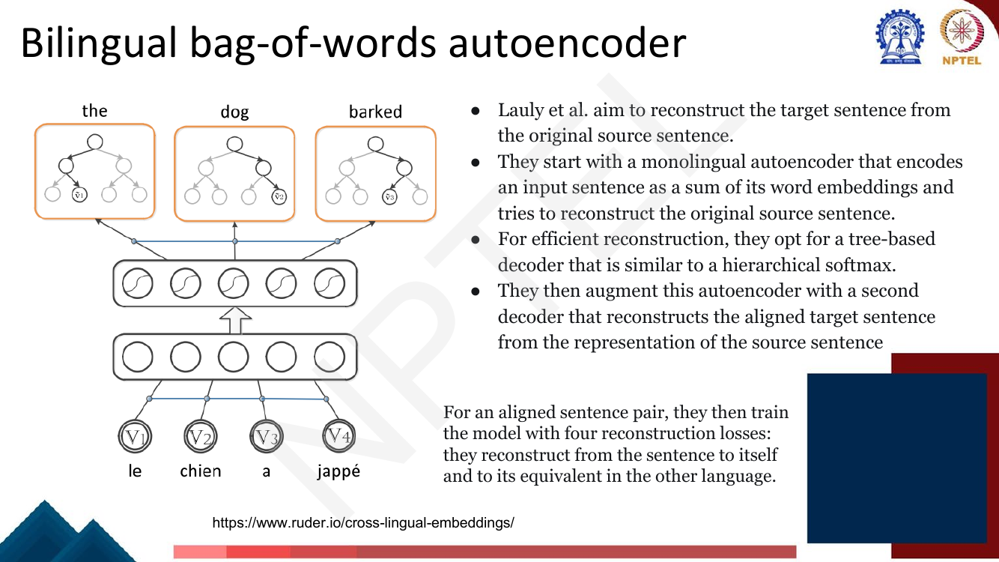
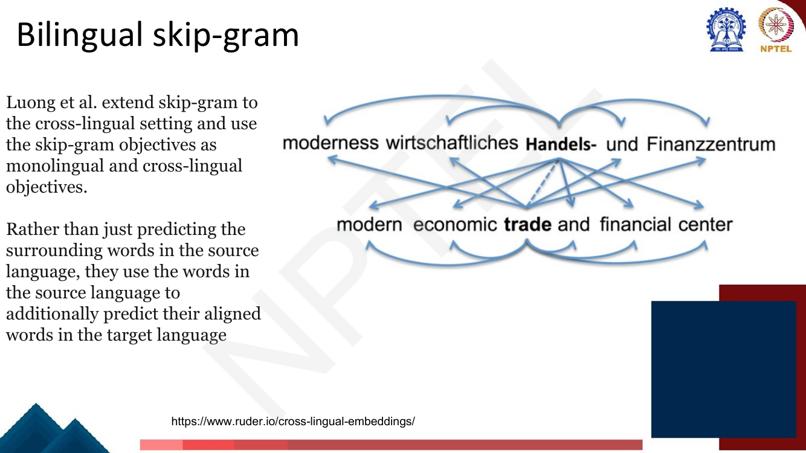
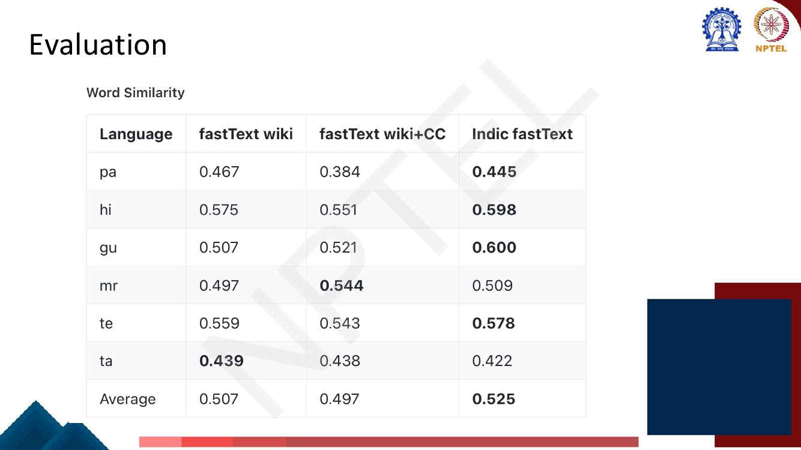
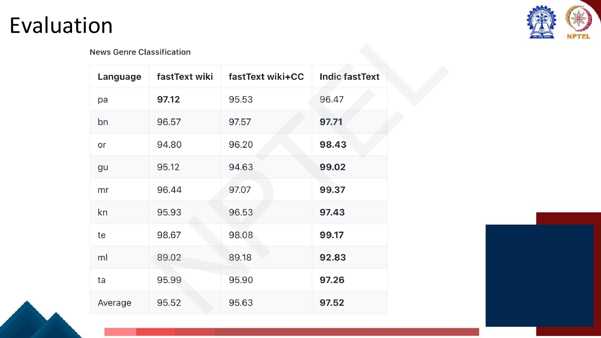

# Lec 15 — Cross-Lingual Representations

> **Source:** `Week3.pdf` pp. 109–131 · **Week 3** · **Playlist:** Lec 15
> **Prereqs:** [Lec 11 — Word Representation](11-word-representation.md), [Lec 12 — word2vec Skip-gram](12-word2vec-skipgram.md)
> **Feeds into:** [Lec 30 — Domain and Multilingual Pretraining](../week-06/30-domain-and-multilingual-pretraining.md)

## Why this lecture exists

Everything in this week has trained embeddings for *one* language, and the implicit language has been
English — because that is where the data is. Labelled NLP datasets, treebanks, sentiment corpora and
QA benchmarks are overwhelmingly English; Marathi, Oriya and Assamese have almost none. Training a
sentiment classifier for Oriya the normal way is not hard, it is impossible, because the labels do
not exist.

The fix this lecture builds is a **shared embedding space**: one vector space in which the English
word *dog* and the Hindi word *kutta* land in nearly the same place. Once you have that, you train a
classifier on English labels, feed it Hindi vectors at test time, and it works — **zero-shot transfer**,
with no Hindi labels at all. The whole lecture is a catalogue of ways to build that shared space,
organised by how much bilingual supervision each one demands.

## The ideas

### The transfer argument, stated once and properly


*Fig. — The plot is a **single** space, with `peace`/`frieden`, `money`/`geld`, `health`/`gesundheit` printed almost on top of each other. That coincidence is the entire deliverable of this lecture. Page 111.*

The deck's four motivations: **some tasks are inherently cross-lingual** (translation — the task
itself is [Lec 18](../week-04/18-seq2seq-and-attention.md)); **data availability across languages is
very rarely the same**; **can learning be transferred from high-resource to low-resource?**; and **can
we save training effort** where good representations already exist.

The third is the one that matters, so make its mechanism explicit. A classifier is a function of
vectors, not of words. If $f$ was fitted on English vectors and Hindi words are embedded *into the same
space*, then $f$ applied to a Hindi vector is well-defined and — to the extent the spaces really are
aligned — correct. Nothing about $f$ changed, and no Hindi label was ever seen. That is **zero-shot
cross-lingual transfer**.

### The taxonomy, by model type

The deck gives two orthogonal taxonomies and you need both. The first is by *how the model is built*.

| # | Type | What you do | Representative |
|---|---|---|---|
| 1 | **Monolingual mapping** | Train embeddings separately per language on large monolingual corpora, then learn a **linear mapping** between the spaces | Mikolov et al.; CCA (Faruqui & Dyer) |
| 2 | **Pseudo-cross-lingual** | Build a mixed corpus by **mixing contexts** of different languages, then run an off-the-shelf monolingual embedding model on it | Merge and shuffle (Vulić & Moens) |
| 3 | **Cross-lingual training** | Train on a **parallel corpus**, optimising a cross-lingual constraint between the two languages' embeddings | Hermann & Blunsom; Lauly et al. (BAE) |
| 4 | **Joint optimization** | Train on parallel (and optionally monolingual) data, jointly optimising **monolingual loss + cross-lingual loss** | Luong et al. (BiSkip); Gouws et al. (BilBOWA) |

The examined boundary is 3 vs 4: **cross-lingual training optimises only the cross-lingual constraint;
joint optimization optimises a *combination* of a monolingual and a cross-lingual objective.** Types 3
and 4 need parallel data; type 1 needs only a dictionary; type 2 only aligned documents.

### The taxonomy, by supervision cost

The second taxonomy is the organising spine of the lecture, and the deck is explicit that it runs
**from most expensive to least expensive**:


*Fig. — Memorise this ordering and the parenthetical examples: document-alignment can be **topic**-aligned (Wikipedia) or **label/class**-aligned (a sentiment dataset in two languages). Page 113.*

| Rank | Requirement | Exactly what it is | Annotation cost |
|---|---|---|---|
| 1 (dearest) | **Word-aligned data** | a parallel corpus **with** word alignments | one link per token |
| 2 | **Sentence-aligned data** | a parallel corpus **without** word alignments | one decision per sentence pair |
| 3 | **Document-aligned data** | documents in different languages, **topic-aligned** (Wikipedia) or **label/class-aligned** (sentiment, multi-class datasets) | one per document; free on Wikipedia |
| 4 | **Lexicon** | a bilingual/cross-lingual **dictionary** of word translation pairs | a few thousand entries |
| 5 (cheapest) | **No parallel data** | nothing bilingual whatsoever | zero |

The research arc of cross-lingual embeddings is *walking down this list*: each successive idea aims for
comparable quality one rung lower. N4 puts numbers on how steep the drop is.

### Monolingual mapping: learn a linear $\mathbf{W}$

The observation that makes this possible is Mikolov's: **the geometric relations between words are
similar across languages.** The numbers one–five form the same shape in English as *uno*–*cinco* do in
Spanish. The two spaces are not identical, but they look like rotated, scaled versions of one another.


*Fig. — The two point clouds have the same **shape**, different orientation and scale — exactly what one matrix $\mathbf{W}$ can fix. Note the deck's two concrete details: **5,000** most-frequent-word translation pairs as the seed dictionary, and "$\mathbf{W}$ can be learned using stochastic gradient descent". Page 116.*

So: train source embeddings $\mathbf{x}_i$ and target embeddings $\mathbf{z}_i$ **completely
separately**, each with ordinary skip-gram ([Lec 12](12-word2vec-skipgram.md)) on its own monolingual
corpus. Then take a seed dictionary of $n$ translation pairs and find the matrix carrying source vectors
onto their translations:

$$\min_{\mathbf{W}} \sum_{i=1}^{n} \lVert \mathbf{W}\mathbf{x}_i - \mathbf{z}_i \rVert^2$$

This is plain least squares. Three things to understand:

- **It is one-directional.** $\mathbf{W}$ maps the *source* space into the *target* space; the target
  is left untouched and becomes the shared space by fiat.
- **The seed dictionary is the only supervision** — tier 4, a lexicon, which is why this family dominates.
- **It generalises.** Fitted on 5,000 pairs, $\mathbf{W}$ applies to *every* source word, including ones
  no dictionary covers: project it and take the nearest target vector by cosine similarity
  ([Lec 11](11-word-representation.md)). N1 does this by hand.

A closed form exists — stacking the $\mathbf{x}_i$ and $\mathbf{z}_i$ as columns of $\mathbf{X}$ and
$\mathbf{Z}$, the minimiser is $\mathbf{W} = \mathbf{Z}\mathbf{X}^{\top}(\mathbf{X}\mathbf{X}^{\top})^{-1}$
— but the deck says SGD, since at $d = 300$ it drops straight into an existing training loop.

### Projection via CCA: two matrices, a third space


*Fig. — Follow the dimensions: **two** projection matrices $\mathbf{V}$ and $\mathbf{W}$, and outputs $\Sigma^*,\Omega^*$ both of width $d$ — a **new** dimensionality, neither $d_1$ nor $d_2$. Page 117.*

Faruqui and Dyer's alternative uses **canonical correlation analysis (CCA)**: given two sets of paired
observations, CCA finds one linear projection per set such that the projected variables are **maximally
correlated**. The distinction from monolingual mapping is subtle and highly examinable:

| | Monolingual mapping | CCA |
|---|---|---|
| Matrices learned | **one**, $\mathbf{W}$ | **two**, one per language ($\mathbf{V}$ and $\mathbf{W}$) |
| Where words end up | source is moved **into the target space** | both are moved into a **third, shared space** |
| Target space | unchanged | also transformed |
| Output dimensionality | $d_2$ (the target's) | a new $d$, with $d \le \min(d_1, d_2)$ |
| Objective | minimise squared distance over dictionary pairs | maximise correlation between the projected pairs |
| Symmetric? | no | **yes** |

The deck's framing — "$\Sigma^*$ and $\Omega^*$ can be seen as the same shared embedding space" — is
the sentence to remember. The dashed line in the slide's $\Sigma$ and $\Omega$ boxes marks the $n$
*paired* dictionary rows: CCA is fitted on those, then applied to all rows. Supervision is still just a
lexicon, tier 4.

### Pseudo-cross-lingual: merge and shuffle


*Fig. — The colours in the context column show the pivot's window now containing words of **both** languages. The model is unmodified skip-gram; only the corpus changed. Page 119.*

This is the cheapest and prettiest trick on the deck, and it needs no new model at all.

Vulić and Moens take an **aligned document pair** — the English and Hindi Wikipedia articles on the
same topic, say — **concatenate** them into one document, **shuffle** it by **randomly permuting the
words**, and then run an ordinary off-the-shelf monolingual embedding model on the result.

Why it works: skip-gram ([Lec 12](12-word2vec-skipgram.md)) gives similar vectors to words with similar
contexts. After shuffling, an English word's context window contains Hindi words and vice versa, so
words about the same topic in *either* language now share contexts and get nearby vectors. **The shared
space emerges for free** — no mapping matrix, no joint loss, no change to the algorithm. The deck's
phrasing: shuffling "would lead to bilingual contexts for each word that will enable the creation of a
robust embedding space".

The price is paid in the corpus, not the model: you need **document-aligned data** (tier 3). And
shuffling destroys word order, so the embeddings capture topical association rather than syntactic
similarity — the known weakness of the family.

> A closely related variant, which you may meet under the same "pseudo-cross-lingual" heading, builds
> the mixed corpus by **randomly replacing words with their dictionary translations** in place, keeping
> word order. Same idea — manufacture bilingual contexts — but it needs a lexicon instead of aligned
> documents. The deck teaches the concatenate-and-permute version; know that one as "merge and shuffle".

### Cross-lingual training: the two parallel-corpus models

**Bilingual compositional sentence model (Hermann & Blunsom).**


*Fig. — Two composition models, one per language, meeting only at the distance between the two sentence vectors. The "CVM" (compositional vector model) boxes are, in the simplest version, just **addition**. Page 121.*

Two models produce sentence representations for an **aligned sentence pair**, and the training signal
is the **distance between the two sentence representations** — minimise it, since aligned sentences mean
the same thing. Composition is deliberately trivial: a sentence vector is the **sum of its word
embeddings**, and that sum's gradient flows back into every word vector, so pushing the sentence vectors
together pulls the two vocabularies into alignment. Supervision: sentence-aligned data (tier 2) — **no
word alignments needed**, which is the selling point.

**Bilingual bag-of-words autoencoder, BAE (Lauly et al.).**


*Fig. — The encoder is again a **sum of word embeddings**; the decoder is **tree-based, like a hierarchical softmax** ([Lec 13](13-negative-sampling-glove.md)), purely for reconstruction efficiency over a large vocabulary. Page 122.*

Start with a monolingual autoencoder: encode a sentence as the sum of its word embeddings, then
reconstruct that sentence from the code. Now bolt on a **second decoder** reconstructing the *aligned
target* sentence from the *source* sentence's code. For an aligned pair you then train with **four
reconstruction losses**: source→source, source→target, target→target, target→source. The cross-language
reconstructions force the shared space; the monolingual ones keep each language's own structure intact.
Supervision: tier 2. **Four** is exactly the kind of detail an MCQ keys on.

### Joint optimization: monolingual objective + cross-lingual objective

**Bilingual skip-gram (Luong et al.).**


*Fig. — Two arrow families: curved arrows are **ordinary skip-gram** within each language; straight crossing arrows are the new cross-lingual term, predicting the *aligned* word's neighbours in the other language. Page 124.*

Luong et al. extend skip-gram to the cross-lingual setting **and use the skip-gram objective for both
halves**. In addition to predicting a word's own-language context, the model uses a source word to
predict the words around its **aligned** position in the target sentence. Schematically, with
$\mathcal{L}_{\text{mono}}$ the usual skip-gram loss of [Lec 12](12-word2vec-skipgram.md),

$$\mathcal{L} = \mathcal{L}_{\text{mono}}^{(\text{src})} + \mathcal{L}_{\text{mono}}^{(\text{tgt})} + \mathcal{L}_{\text{cross}}^{(\text{src}\to\text{tgt})} + \mathcal{L}_{\text{cross}}^{(\text{tgt}\to\text{src})}$$

Because it uses alignment links, this sits at **tier 1 — word-aligned data**, the most expensive rung.
That is what the next model attacks.

**BilBOWA — Bilingual Bag-of-Words without Word Alignments (Gouws et al.).**


*Fig. — Three data sources: English monolingual, English–French parallel, French monolingual. The $\Sigma$ at the top is the joint objective, summing the two monolingual skip-gram losses and the cross-lingual **sampled L2** term. Page 125.*

BilBOWA drops to **tier 2** by changing one thing: instead of minimising the distance between **words
that were aligned to each other**, it minimises the distance between the **means of the word
representations in the aligned sentences**:

$$\mathcal{L}_{\text{cross}} = \sum_{(s,t)} \Bigl\lVert \tfrac{1}{|s|}\sum_{w \in s}\mathbf{e}_w \;-\; \tfrac{1}{|t|}\sum_{w \in t}\mathbf{e}_w \Bigr\rVert^2$$

No alignment links are needed, because a mean does not care which word pairs with which. The deck also
stresses that BilBOWA **leverages additional monolingual data**: the parallel corpus drives only the L2
term, while much larger monolingual corpora drive the two skip-gram terms. N5 shows how much weaker the
mean-based signal is — that weakness is the price of dropping a tier.

### IndicFastText (IndicFT)

fastText replaces a word's single vector with a sum over its character $n$-grams — see
[Lec 14](14-fasttext-and-beyond-words.md), which owns the mechanism. **IndicFT** is AI4Bharat's
fastText trained on the **IndicNLP Corpora** for **11 Indian languages**: Assamese, Bengali, English,
Gujarati, Hindi, Kannada, Malayalam, Marathi, Oriya, Punjabi, Tamil, Telugu.

What is new here is *why subwords matter more for these languages*. Indic languages are, in the deck's
word, **highly agglutinative**: a single root takes a long tail of inflectional and derivational
suffixes, so a fixed corpus yields far more distinct word *types* per lemma than English does. Hence
each surface form is **rarer** (so each vector is poorly estimated), the **OOV rate** at test time is
high, and the meaning-bearing information sits in **morphemes, which are substrings** — exactly what
character $n$-grams recover, since an unseen inflected form is still built from $n$-grams seen thousands
of times. word2vec has no mechanism at all for an unseen form, which is why the Indic story is a
*fastText* story.

### Evaluation

The deck evaluates IndicFT against two public fastText baselines — fastText trained on **Wikipedia**
alone, and on **Wikipedia + CommonCrawl** — on two intrinsic/extrinsic tasks.


*Fig. — **Word similarity**, an intrinsic test: correlation between model cosine similarities and human judgements. IndicFT wins 4 of 6 languages, average 0.525 vs 0.507 and 0.497 — a small, non-uniform margin (`ta` and `mr` go the other way). Page 128.*


*Fig. — **News genre classification**, an extrinsic test: the embeddings feed a downstream classifier. IndicFT wins 8 of 9 languages, average **97.52** vs 95.52 and 95.63 — a much clearer margin than on word similarity. Page 129.*

Two lessons the slides do not spell out. **More data is not automatically better**: wiki+CC beats wiki
by 0.11 accuracy points and *loses* on word similarity, while the smaller in-domain Indic corpora win by
2. And **extrinsic evaluation separated the models far more cleanly than intrinsic evaluation did** —
the same caution [Lec 4](../week-01/04-ngram-lm-2-smoothing-perplexity.md) raises about perplexity.

For *cross-lingual* embeddings specifically, three evaluation protocols are standard and you should
be able to name them:

| Protocol | What you measure | Type |
|---|---|---|
| **Bilingual lexicon induction (BLI)** | project each source test word, retrieve the nearest target vectors, check whether the gold translation is there | intrinsic |
| **Word translation accuracy @k** | fraction of source test words whose gold translation appears in the top $k$ retrieved candidates — the actual number BLI reports | intrinsic |
| **Cross-lingual document classification (CLDC)** | train a document classifier on language A's labels, test on language B with no B labels | extrinsic — measures zero-shot transfer directly |

CLDC is the one that measures the thing this lecture is *for*. N2 computes accuracy @k by hand.

### Where this goes next

Every model here produces a **static** vector per word type — one vector for *bank*, in each language,
regardless of context. The next generation replaces the mapping-and-aligning machinery with a single
Transformer pretrained on many languages at once, whose shared subword vocabulary and shared parameters
make the alignment emerge *during* pretraining: mBERT, XLM, XLM-R, mT5, IndicBERT and the curse of
multilinguality, all of which belong to
[Lec 30](../week-06/30-domain-and-multilingual-pretraining.md).

## Worked numericals

The deck contains **no "Try this problem" pages** in pages 109–131 — this lecture is entirely
expository. All five numericals below are constructed to match the kinds of computation the slides
imply.

### N1. Learn a projection matrix $\mathbf{W}$ by least squares, then translate a new word
**Given:** 2-D embeddings. Seed dictionary of three English–Spanish pairs:

| English $\mathbf{x}_i$ | | Spanish $\mathbf{z}_i$ | |
|---|---|---|---|
| *one* | $(1, 0)$ | *uno* | $(2, 1)$ |
| *two* | $(0, 1)$ | *dos* | $(1, 3)$ |
| *three* | $(1, 1)$ | *tres* | $(3, 5)$ |

**Find:** the $2\times2$ matrix $\mathbf{W}$ minimising $\sum_i \lVert \mathbf{W}\mathbf{x}_i - \mathbf{z}_i\rVert^2$;
then project the new English word *four* $= (2,1)$ and find its nearest Spanish neighbour by cosine
among the candidates *gato* $=(4,5)$, *perro* $=(6,6)$, *casa* $=(-2,7)$.

1. Stack the pairs as columns: $\mathbf{X} = \begin{pmatrix}1&0&1\\0&1&1\end{pmatrix}$, $\mathbf{Z} = \begin{pmatrix}2&1&3\\1&3&5\end{pmatrix}$.
2. Closed-form least squares: $\mathbf{W} = \mathbf{Z}\mathbf{X}^{\top}(\mathbf{X}\mathbf{X}^{\top})^{-1}$.
3. $\mathbf{X}\mathbf{X}^{\top} = \begin{pmatrix}1{+}0{+}1 & 0{+}0{+}1\\ 0{+}0{+}1 & 0{+}1{+}1\end{pmatrix} = \begin{pmatrix}2&1\\1&2\end{pmatrix}$, determinant $= 4 - 1 = 3$.
4. $(\mathbf{X}\mathbf{X}^{\top})^{-1} = \tfrac{1}{3}\begin{pmatrix}2&-1\\-1&2\end{pmatrix}$.
5. $\mathbf{Z}\mathbf{X}^{\top}$: row 1 is $(2,1,3)$, giving $(2{\cdot}1 + 1{\cdot}0 + 3{\cdot}1,\; 2{\cdot}0 + 1{\cdot}1 + 3{\cdot}1) = (5, 4)$. Row 2 is $(1,3,5)$, giving $(1{+}0{+}5,\; 0{+}3{+}5) = (6, 8)$.
6. Row 1 of $\mathbf{W}$: $\tfrac{1}{3}(5,4)\begin{pmatrix}2&-1\\-1&2\end{pmatrix} = \tfrac{1}{3}(10{-}4,\; -5{+}8) = \tfrac{1}{3}(6, 3) = (2, 1)$.
7. Row 2 of $\mathbf{W}$: $\tfrac{1}{3}(6,8)\begin{pmatrix}2&-1\\-1&2\end{pmatrix} = \tfrac{1}{3}(12{-}8,\; -6{+}16) = \tfrac{1}{3}(4, 10) = (4/3, 10/3)$.
8. So $\mathbf{W} = \begin{pmatrix}2 & 1\\ 4/3 & 10/3\end{pmatrix}$.
9. Check the residual. $\mathbf{W}(1,0)^{\top} = (2, 4/3)$ vs $(2,1)$: error $(0, 1/3)$. $\mathbf{W}(0,1)^{\top} = (1, 10/3)$ vs $(1,3)$: error $(0, 1/3)$. $\mathbf{W}(1,1)^{\top} = (3, 14/3)$ vs $(3,5)$: error $(0, 1/3)$. Total $= 3 \times (1/3)^2 = 1/3$.
10. Project *four*: $\mathbf{W}(2,1)^{\top} = (2{\cdot}2 + 1{\cdot}1,\; \tfrac{4}{3}{\cdot}2 + \tfrac{10}{3}{\cdot}1) = (5,\; \tfrac{8+10}{3}) = (5, 6)$.
11. $\lVert(5,6)\rVert = \sqrt{25+36} = \sqrt{61} = 7.8102$.
12. $\cos$ with *gato* $(4,5)$: dot $= 20 + 30 = 50$; $\lVert(4,5)\rVert = \sqrt{41} = 6.4031$; $\cos = 50/(7.8102 \times 6.4031) = 50/50.010 = \mathbf{0.9998}$.
13. $\cos$ with *perro* $(6,6)$: dot $= 30 + 36 = 66$; $\lVert(6,6)\rVert = \sqrt{72} = 8.4853$; $\cos = 66/66.273 = \mathbf{0.9959}$.
14. $\cos$ with *casa* $(-2,7)$: dot $= -10 + 42 = 32$; $\lVert(-2,7)\rVert = \sqrt{53} = 7.2801$; $\cos = 32/56.859 = \mathbf{0.5628}$.

**Answer:** $\mathbf{W} = \begin{pmatrix}2 & 1\\ 1.3333 & 3.3333\end{pmatrix}$, residual $1/3$; *four* projects
to $(5,6)$ and its nearest neighbour is **gato** ($\cos = 0.9998$). Note how close *perro* is at 0.9959 —
with only three seed pairs the mapping is barely determined, which is why the deck uses **5,000**.

### N2. Word translation accuracy @1, @5, @10
**Given:** a BLI test set of five source words. For each, the system's ranked list of target candidates,
gold translation in **bold**:

| Source word | Ranked candidates (top 5) | Rank of gold |
|---|---|---|
| *dog* | **perro**, gato, lobo, zorro, oso | 1 |
| *house* | **casa**, hogar, piso, torre, muro | 1 |
| *water* | mar, río, **agua**, lluvia, hielo | 3 |
| *book* | papel, hoja, texto, revista, **libro** | 5 |
| *run* | andar, saltar, mover, volar, caer (**correr** at rank 9) | 9 |

**Find:** accuracy @1, @5 and @10.

1. Accuracy @$k$ $=\dfrac{\#\{\text{source words whose gold translation has rank} \le k\}}{\#\text{source words}}$.
2. @1: ranks $\le 1$ are *dog* and *house* $\Rightarrow 2$ hits. $2/5 = 0.40$.
3. @5: ranks $\le 5$ are *dog*(1), *house*(1), *water*(3), *book*(5) $\Rightarrow 4$ hits. $4/5 = 0.80$.
4. @10: all five ranks ($1,1,3,5,9$) are $\le 10 \Rightarrow 5$ hits. $5/5 = 1.00$.
5. Sanity check: accuracy @$k$ is **non-decreasing** in $k$ — $0.40 \le 0.80 \le 1.00$ ✓. It can never fall.

**Answer:** **@1 = 40%, @5 = 80%, @10 = 100%.** The gap between @1 and @5 tells you the space is roughly
right but the exact nearest neighbour is often a near-synonym; that pattern is typical of mapping-based
methods.

### N3. Build a merge-and-shuffle corpus and count its bilingual contexts
**Given:** an aligned document pair.
English: `the cat drinks milk`. Hindi (transliterated): `billi doodh peeti hai`.
One random permutation of the concatenation yields:

```
milk  billi  the  doodh  cat  hai  peeti  drinks
```

Use skip-gram with context window $c = 1$ (one word either side).
**Find:** the (centre, context) training pairs, how many are cross-lingual, and the expected number of
cross-lingual adjacencies under a uniform shuffle.

1. Concatenate: 4 English + 4 Hindi $= 8$ tokens. Permute. (Merge-and-shuffle never translates anything —
   it only reorders.)
2. The 7 adjacent positions, tagged by language:
   `milk`(en)–`billi`(hi) ✓, `billi`(hi)–`the`(en) ✓, `the`(en)–`doodh`(hi) ✓, `doodh`(hi)–`cat`(en) ✓,
   `cat`(en)–`hai`(hi) ✓, `hai`(hi)–`peeti`(hi) ✗, `peeti`(hi)–`drinks`(en) ✓.
3. Cross-lingual adjacencies: **6 of 7**.
4. Each adjacency yields **two** ordered (centre, context) pairs. Total pairs $= 2 \times 7 = 14$.
   E.g. from the first: (`milk`, `billi`) and (`billi`, `milk`).
5. Cross-lingual training pairs $= 2 \times 6 = \mathbf{12}$ of 14, i.e. $12/14 = 85.7\%$.
6. Expected value under a uniform random permutation. For one adjacent slot, the two tokens are a
   uniformly random ordered pair of distinct tokens, so
   $P(\text{cross}) = \dfrac{2 n_{\text{en}} n_{\text{hi}}}{n(n-1)} = \dfrac{2 \times 4 \times 4}{8 \times 7} = \dfrac{32}{56} = \dfrac{4}{7} \approx 0.571$.
7. With $n - 1 = 7$ adjacencies, $\mathbb{E}[\#\text{cross}] = 7 \times \tfrac{4}{7} = \mathbf{4}$.

**Answer:** 14 training pairs, **12 cross-lingual**, against an expectation of 4 cross-lingual
adjacencies out of 7 ($\approx$ 8 of 14 pairs). This particular shuffle was luckier than average, but the
point stands: **over half of every word's context is now in the other language**, and that is the entire
mechanism — the embedding model is unchanged.

### N4. How much supervision does each tier actually cost?
**Given:** you want English–Hindi embeddings. The available parallel corpus is 100,000 sentence pairs,
average 20 tokens per sentence, grouped into documents of 50 sentences. The deck's seed dictionary size
is 5,000 pairs.
**Find:** the number of bilingual annotation items each tier of the taxonomy requires.

1. **Tier 1 — word-aligned.** One alignment link per source token: $100{,}000 \times 20 = \mathbf{2{,}000{,}000}$ links.
2. **Tier 2 — sentence-aligned.** One decision per sentence pair: $\mathbf{100{,}000}$ items. That is $2{,}000{,}000/100{,}000 = \mathbf{20\times}$ cheaper.
3. **Tier 3 — document-aligned.** $100{,}000 / 50 = \mathbf{2{,}000}$ document links. $50\times$ cheaper than tier 2, $1{,}000\times$ cheaper than tier 1. And for Wikipedia these links already exist, so the marginal cost is **0**.
4. **Tier 4 — lexicon.** $\mathbf{5{,}000}$ dictionary entries, and a bilingual dictionary usually already exists.
5. **Tier 5 — none.** $\mathbf{0}$.
6. Headline ratio: tier 1 to tier 4 is $2{,}000{,}000 : 5{,}000 = \mathbf{400:1}$.

**Answer:** 2,000,000 / 100,000 / 2,000 / 5,000 / 0. Word alignment costs **400 times** more annotation
than a 5,000-entry dictionary — which is why monolingual mapping became the dominant family and why
BilBOWA's move from tier 1 to tier 2 mattered.

### N5. BilBOWA's mean-distance loss versus a word-aligned loss
**Given:** aligned sentence pair, 2-D embeddings.
English `the cat sits`: $\mathbf{e}_{\text{the}} = (1,0)$, $\mathbf{e}_{\text{cat}} = (3,2)$, $\mathbf{e}_{\text{sits}} = (2,4)$.
French `le chat assis`: $\mathbf{e}_{\text{le}} = (0,1)$, $\mathbf{e}_{\text{chat}} = (4,3)$, $\mathbf{e}_{\text{assis}} = (2,5)$.
Word alignment (available but *not* used by BilBOWA): the↔le, cat↔chat, sits↔assis.
**Find:** BilBOWA's cross-lingual loss, and the word-aligned loss for comparison.

1. English mean: $\tfrac{1}{3}\bigl((1,0)+(3,2)+(2,4)\bigr) = \tfrac{1}{3}(6,6) = (2,2)$.
2. French mean: $\tfrac{1}{3}\bigl((0,1)+(4,3)+(2,5)\bigr) = \tfrac{1}{3}(6,9) = (2,3)$.
3. BilBOWA loss $= \lVert(2,2)-(2,3)\rVert^2 = 0^2 + (-1)^2 = \mathbf{1}$.
4. Word-aligned loss, summing over the three links:
   the–le: $\lVert(1,0)-(0,1)\rVert^2 = 1 + 1 = 2$;
   cat–chat: $\lVert(3,2)-(4,3)\rVert^2 = 1 + 1 = 2$;
   sits–assis: $\lVert(2,4)-(2,5)\rVert^2 = 0 + 1 = 1$.
5. Word-aligned total $= 2 + 2 + 1 = \mathbf{5}$.

**Answer:** BilBOWA = **1**, word-aligned = **5**. The mean-based loss sees only $1/5$ of the discrepancy,
because averaging lets individual errors cancel — note that *the*'s error $(+1,-1)$ and *cat*'s error
$(-1,-1)$ partly cancel in the sum. **That is the trade**: BilBOWA gives up a much sharper gradient in
exchange for not needing word alignments, moving from tier 1 to tier 2.

## Code

```python
import numpy as np

# ---- seed dictionary: 3 (English, Spanish) pairs, 2-D toy embeddings -------
X = np.array([[1., 0.],      # en "one"
              [0., 1.],      # en "two"
              [1., 1.]])     # en "three"
Z = np.array([[2., 1.],      # es "uno"
              [1., 3.],      # es "dos"
              [3., 5.]])     # es "tres"

# min_W sum_i ||W x_i - z_i||^2.  Rows of X are x_i^T, so solve X W^T ~= Z.
Wt, *_ = np.linalg.lstsq(X, Z, rcond=None)
W = Wt.T
print("W =\n", np.round(W, 4))
print("residual sum of squares =", round(float(((X @ Wt - Z)**2).sum()), 6))

# ---- project a held-out source word and rank target candidates ------------
x_new = np.array([2., 1.])            # en "four"
p = W @ x_new
print("\nprojected vector W x_new =", p)

cands = {"gato": np.array([4., 5.]),
         "perro": np.array([6., 6.]),
         "casa": np.array([-2., 7.])}

def cosine(a, b):
    return float(a @ b / (np.linalg.norm(a) * np.linalg.norm(b)))

ranked = sorted(((cosine(p, v), w) for w, v in cands.items()), reverse=True)
for s, w in ranked:
    print(f"  cos(W x_new, {w:<6}) = {s:.4f}")
print("nearest neighbour ->", ranked[0][1])

# ---- translation accuracy @k from ranks of the gold translation ----------
gold_rank = np.array([1, 1, 3, 5, 9])          # one per source test word
for k in (1, 5, 10):
    print(f"P@{k:<2} = {(gold_rank <= k).mean():.2f}")
```

```
W =
 [[2.     1.    ]
 [1.3333 3.3333]]
residual sum of squares = 0.333333

projected vector W x_new = [5. 6.]
  cos(W x_new, gato  ) = 0.9998
  cos(W x_new, perro ) = 0.9959
  cos(W x_new, casa  ) = 0.5628
nearest neighbour -> gato
P@1  = 0.40
P@5  = 0.80
P@10 = 1.00
```

Every number matches N1 and N2 by hand. Note `lstsq` solves $\mathbf{X}\mathbf{W}^{\top} \approx \mathbf{Z}$
with the $\mathbf{x}_i$ as *rows*, so you transpose at the end — getting that transpose wrong is the
commonest bug when implementing this.

The merge-and-shuffle count of N3:

```python
import numpy as np
rng = np.random.default_rng(0)

en = ["the", "cat", "drinks", "milk"]
hi = ["billi", "doodh", "peeti", "hai"]
lang = {w: "en" for w in en} | {w: "hi" for w in hi}
merged = en + hi
n = len(merged)

shuffled = ["milk", "billi", "the", "doodh", "cat", "hai", "peeti", "drinks"]
pairs = [(shuffled[i], shuffled[j])            # skip-gram pairs, window c = 1
         for i in range(n) for j in (i - 1, i + 1) if 0 <= j < n]
cross = [(c, o) for c, o in pairs if lang[c] != lang[o]]
print(f"(centre, context) pairs: {len(pairs)}   cross-lingual: {len(cross)}")

# expected cross-lingual adjacencies under a uniform shuffle: 2*ne*nh/(n(n-1)) * (n-1)
print("expected  :", 2 * len(en) * len(hi) / n)
tot = sum(sum(lang[s[i]] != lang[s[i + 1]] for i in range(n - 1))
          for s in (list(rng.permutation(merged)) for _ in range(20000)))
print("empirical :", round(tot / 20000, 3))
```

```
(centre, context) pairs: 14   cross-lingual: 12
expected  : 4.0
empirical : 4.002
```

## Exam pack

### Must-memorise

| Item | Exactly this |
|---|---|
| Why cross-lingual embeddings | data availability across languages is very rarely the same; transfer from high- to low-resource |
| The payoff | **zero-shot transfer**: train the classifier on English labels, apply it to another language's vectors |
| 4 model types | **monolingual mapping**, **pseudo-cross-lingual**, **cross-lingual training**, **joint optimization** |
| 5 data tiers, dearest→cheapest | **word-aligned → sentence-aligned → document-aligned → lexicon → no parallel data** |
| Document-aligned subtypes | **topic**-aligned (Wikipedia) or **label/class**-aligned (sentiment / multi-class datasets) |
| Mikolov's observation | geometric relations between words are **similar across languages** |
| Mapping objective | $\min_{\mathbf{W}} \sum_{i=1}^{n} \lVert \mathbf{W}\mathbf{x}_i - \mathbf{z}_i \rVert^2$ |
| Closed form | $\mathbf{W} = \mathbf{Z}\mathbf{X}^{\top}(\mathbf{X}\mathbf{X}^{\top})^{-1}$; the deck says SGD |
| CCA (Faruqui & Dyer) | **two** matrices, one per language, projecting **both** into a **shared third space** of dimension $d$, maximising **correlation** |
| Merge and shuffle (Vulić & Moens) | **concatenate** aligned documents, **randomly permute** the words, train an off-the-shelf monolingual model |
| Bilingual compositional sentence model (Hermann & Blunsom) | sentence vector = **sum of word embeddings**; objective = **distance between the two sentence representations** |
| BAE (Lauly et al.) | bag-of-words autoencoder, **tree-based decoder like hierarchical softmax**, **four reconstruction losses** per aligned pair |
| Bilingual skip-gram (Luong et al.) | skip-gram objective as **both** the monolingual and the cross-lingual loss; source words also predict their **aligned** target words — needs **word alignments** |
| BilBOWA (Gouws et al.) | minimises distance between the **means** of the word representations in aligned sentences; **no word alignments**; uses extra **monolingual** data |
| IndicFT | fastText on AI4Bharat's IndicNLP Corpora, **11 Indian languages**; subwords matter because Indic languages are **highly agglutinative** |
| Translation accuracy @$k$ | fraction of source test words whose gold translation is in the top $k$ retrieved candidates |

### Numbers worth knowing

| Quantity | Value |
|---|---|
| Deck's seed dictionary size | **5,000** most frequent source words translated |
| Data tiers in the taxonomy | **5** |
| Model types in the taxonomy | **4** |
| BAE reconstruction losses per aligned pair | **4** |
| CCA transformation matrices | **2** (one per language) |
| IndicFT languages | **11** Indian languages (Assamese, Bengali, English, Gujarati, Hindi, Kannada, Malayalam, Marathi, Oriya, Punjabi, Tamil, Telugu) |
| Word similarity averages (wiki / wiki+CC / IndicFT) | **0.507 / 0.497 / 0.525** |
| News genre classification averages | **95.52 / 95.63 / 97.52** |
| Best single news-genre score | Marathi, IndicFT, **99.37** |
| Worst news-genre language | Malayalam (89.02 / 89.18 / **92.83**) |
| Deck's single reference | `ruder.io/cross-lingual-embeddings` (plus `naacl15_bivec.pdf` for the taxonomy pages) |

### Likely MCQ traps

- **"CCA maps one language into the other's space."** No — that is *monolingual mapping*. CCA learns
  **one matrix per language** and projects **both** into a **new shared space**. The number of matrices
  (1 vs 2) is the cleanest discriminator.
- **"The taxonomy runs cheapest to most expensive."** The deck says explicitly **most expensive to
  least expensive**: word-aligned first, no-parallel-data last. An item may reverse the order to catch you.
- **Confusing cross-lingual training with joint optimization.** Cross-lingual training optimises a
  cross-lingual constraint; joint optimization optimises a **combination of monolingual and
  cross-lingual losses**. BilBOWA and bilingual skip-gram are *joint*; Hermann & Blunsom and BAE are
  *cross-lingual training*.
- **"Merge and shuffle translates words into the other language."** It does **not**. It concatenates
  aligned documents and **randomly permutes** them. Nothing is translated; the bilingual contexts come
  purely from the shuffle.
- **"Bilingual skip-gram needs no alignments."** It does — it predicts the *aligned* target words, so it
  sits at tier 1. **BilBOWA** is the one that drops alignments, by using sentence **means**.
- **"BilBOWA minimises distance between aligned words."** No — between the **means** of the word
  representations in the aligned sentences. Means versus aligned words is the single examinable contrast.
- **"Sentence representations in Hermann & Blunsom come from an RNN."** No — the plain **sum** of the
  word embeddings. (Same for the BAE encoder.)
- **"IndicFT is a new algorithm" / "IndicFT is cross-lingual."** Neither. It is **fastText**
  ([Lec 14](14-fasttext-and-beyond-words.md)) trained on Indic corpora — a set of **monolingual** models,
  one per language. The novelty is the data and the coverage, not the method or a shared space.
- **"Document-aligned means the documents are translations."** Not necessarily — the deck allows
  **topic**-aligned (Wikipedia articles on the same subject, not translations) and **label**-aligned.
- **"mBERT/XLM-R are covered here."** They are **not** — this lecture is static embeddings only.
  Contextual multilingual pretraining is [Lec 30](../week-06/30-domain-and-multilingual-pretraining.md).

### Self-test

1. State, in the deck's order, the five dataset requirements from most to least expensive.
2. What exactly is the difference between monolingual mapping and projection via CCA? Give two differences.
3. Write the monolingual-mapping objective and say what the sum ranges over.
4. Seed pairs $(1,0)\!\to\!(0,2)$ and $(0,1)\!\to\!(3,0)$. What is $\mathbf{W}$?
5. Which model type does "merge and shuffle" belong to, and which data tier does it require?
6. For an aligned sentence pair, how many reconstruction losses does the bilingual bag-of-words autoencoder use, and what are they?
7. Bilingual skip-gram and BilBOWA are both *joint optimization*. What is the one difference in the cross-lingual term, and which data tier does each need?
8. Ranks of the gold translation for six test words are $2, 1, 4, 11, 1, 6$. Compute accuracy @1 and @5.
9. Why do morphologically rich Indic languages benefit disproportionately from subword embeddings?
10. On the deck's evaluation, which comparison separated IndicFT from the baselines more clearly — word similarity or news genre classification? Give both averages.

<details><summary>Answers</summary>

1. Word-aligned data → sentence-aligned data → document-aligned data → lexicon → no parallel data.
2. (a) Monolingual mapping learns **one** matrix and moves the source space **into the target space**; CCA learns **two** matrices and moves **both** into a **new shared space**. (b) Monolingual mapping minimises squared distance over dictionary pairs; CCA maximises **correlation**. (Also: CCA's output dimensionality $d$ is new, $d \le \min(d_1,d_2)$.)
3. $\min_{\mathbf{W}} \sum_{i=1}^{n} \lVert \mathbf{W}\mathbf{x}_i - \mathbf{z}_i\rVert^2$, where $i$ ranges over the $n$ translation pairs in the **seed bilingual dictionary** (the deck's $n = 5{,}000$).
4. $\mathbf{W}\mathbf{x}_i$ with $\mathbf{x}_1 = (1,0)$ picks out column 1 of $\mathbf{W}$, so column 1 $= (0,2)^{\top}$; $\mathbf{x}_2 = (0,1)$ picks out column 2, so column 2 $= (3,0)^{\top}$. $\mathbf{W} = \begin{pmatrix}0&3\\2&0\end{pmatrix}$, exact fit, residual 0.
5. **Pseudo-cross-lingual**; it needs **document-aligned** data (tier 3).
6. **Four**: source→source, source→target, target→target, target→source — i.e. reconstruct each sentence from itself and from its equivalent in the other language.
7. Bilingual skip-gram minimises a skip-gram loss over **word-aligned** pairs (tier 1); BilBOWA minimises the L2 distance between the **means** of the word representations in the aligned sentences, needing only **sentence alignment** (tier 2).
8. @1: ranks $\le 1$ are two of six $\Rightarrow 2/6 = 0.333$. @5: ranks $1,1,2,4 \le 5$, so four of six $\Rightarrow 4/6 = 0.667$.
9. They are highly agglutinative, so one lemma produces very many surface forms: each form is rare, the OOV rate is high, and the meaning-bearing morphemes are substrings — exactly what character $n$-grams capture. A word-level model has no vector at all for an unseen form.
10. **News genre classification** (extrinsic): averages 95.52 / 95.63 / **97.52**, a 2-point margin. Word similarity gave only 0.507 / 0.497 / **0.525**, and IndicFT lost on `mr` and `ta`.

</details>

## Beyond the slides

**Gap:** The deck sets up tier 5 ("no parallel data") in the taxonomy and then never shows a single
model that achieves it.
**Why it matters:** The cheapest tier is advertised and left empty. The answers are **adversarial
mapping** (MUSE, Conneau et al. 2018: a discriminator tries to tell projected source vectors from real
target ones, $\mathbf{W}$ tries to fool it, then a synthetic dictionary is extracted and refined) and
**VecMap**'s self-learning, which bootstraps a dictionary from the two spaces' similarity distributions
alone. If an exam asks which approach needs no bilingual signal at all, that is the answer.

**Gap:** The deck's mapping objective is unconstrained least squares. In practice nobody uses it unconstrained.
**Why it matters:** Constraining $\mathbf{W}$ to be **orthogonal** ($\mathbf{W}^{\top}\mathbf{W} = \mathbf{I}$)
measurably improves translation accuracy, because orthogonality preserves dot products and therefore the
monolingual cosine similarities you spent a whole corpus learning. The constrained problem is the
**orthogonal Procrustes** problem and has an exact closed form: take the SVD $\mathbf{Z}\mathbf{X}^{\top} = \mathbf{U}\mathbf{\Sigma}\mathbf{V}^{\top}$
and set $\mathbf{W} = \mathbf{U}\mathbf{V}^{\top}$. One line of NumPy, better results.

**Gap:** Nothing is said about **hubness**, which badly distorts the retrieval step.
**Why it matters:** In high-dimensional spaces a few target vectors are the nearest neighbour of a huge
number of source vectors — these "hubs" pollute every retrieval list and depress translation accuracy @1
specifically. The standard fix is **CSLS** (cross-domain similarity local scaling), which penalises a
candidate's similarity by its average similarity to its own neighbourhood. If your @1 is poor but @10 is
fine, hubness is the usual culprit.

**Gap:** The assumption that two embedding spaces are related by a *linear* map is stated by example
and never questioned.
**Why it matters:** It holds well for typologically similar, high-resource pairs (English–Spanish) and
degrades sharply for distant pairs and genuinely low-resource languages — which are exactly the
languages the lecture's motivation is about. This "isomorphism assumption" failure is the main reason
mapping-based cross-lingual embeddings were superseded by jointly pretrained multilingual Transformers
([Lec 30](../week-06/30-domain-and-multilingual-pretraining.md)), which never assume it.

## Cut from the slides

Dropped the title page (109), the two-bullet "Concepts covered" page (110), the four section-divider
pages (114 "Monolingual Mapping", 118 "Pseudo Cross-Lingual", 120 "Cross-Lingual Training", 123 "Joint
Optimization"), the IndicFT divider (126), the references page (130) and the closing "Thank You" (131).
Page 115 is page 116 with the objective and the 5,000-pair detail removed, so only 116 is reproduced.
Page 127 is a browser screenshot of the AI4Bharat IndicFT page; its examinable content (subword-aware,
suits agglutinative Indian languages, 11 languages, IndicNLP Corpora) is given in prose rather than as
an image, since it is a web page and not a diagram.

Two points of fidelity. The deck's merge-and-shuffle is concatenate-then-permute, **not** randomly
replacing words with their translations; the replacement variant is flagged in a blockquote but is not
what Vulić and Moens do. And the deck's two "Evaluation" pages evaluate **IndicFT against fastText
baselines**, not cross-lingual embeddings — so bilingual lexicon induction, translation accuracy @$k$
and cross-lingual document classification are given as a short named table rather than claimed as deck
content, since the taxonomy is useless without a way to score its members. There are **no "Try this
problem" pages** anywhere in pages 109–131.
