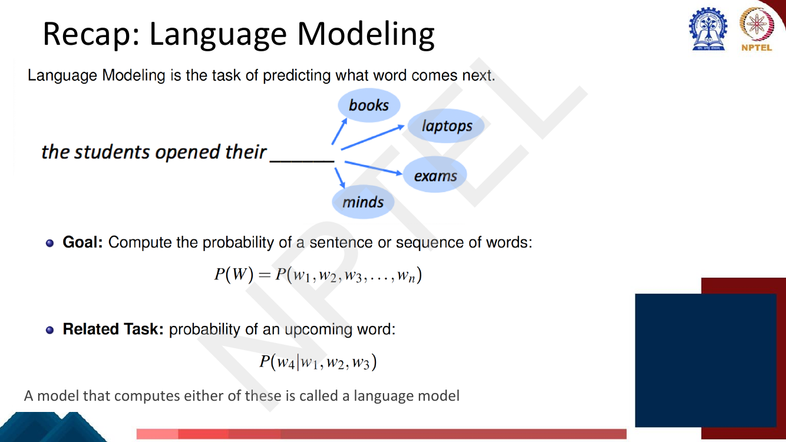
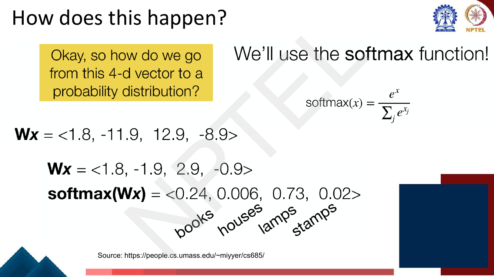
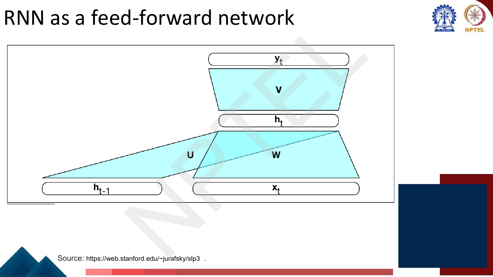
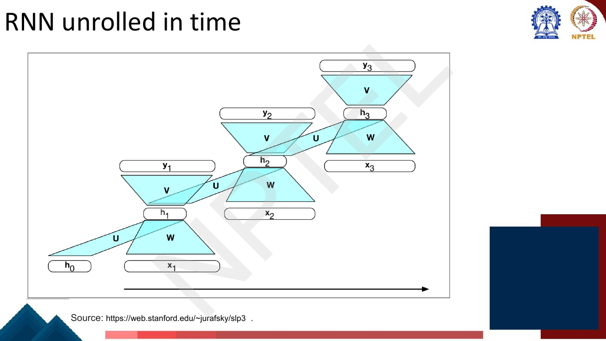

# Lec 16 — RNN Language Models

> **Source:** `Week4.pdf` pp. 1–29 · **Week 4** · **Playlist:** Lec 16
> **Prereqs:** [Lec 3 — N-gram Language Models I](../week-01/03-ngram-lm-1.md), [Lec 12 — Learning Word Representation I: word2vec Skip-gram](../week-03/12-word2vec-skipgram.md), [Lec 9 — Backpropagation](../week-02/09-backpropagation.md)
> **Feeds into:** [Lec 17 — RNN Applications](17-rnn-applications.md), [Lec 18 — Seq2seq and Attention](18-seq2seq-and-attention.md), [Lec 20 — GRU and LSTM](20-gru-and-lstm.md)

## Why this lecture exists

Weeks 1 and 3 each solved half of a problem. Week 1 built a language model that could score a sentence
but could only count: it saw "students opened their" and "pupils opened their" as two unrelated
symbols, and it ran out of evidence the moment you asked for more than three words of context. Week 3
built word vectors in which *students* and *pupils* sit next to each other, but it never used them to
predict anything beyond a window of neighbours.

This lecture joins them. You replace the count table with a *learned function over embeddings*, so
statistical strength is shared automatically across words that mean similar things. Then you discover
that the obvious first attempt — concatenate a fixed window of embeddings and run them through a
hidden layer — inherits the n-gram model's worst habit: a window that cannot grow, and a separate set
of weights for every position in it. Fixing that gives you the recurrent neural network, the first
architecture in this course that can read a sequence of any length.

## The ideas

### Recap: what a language model is, and where the counting version fails

A **language model** assigns a probability to a sequence of words, or equivalently predicts the next
word from the words before it. The deck's recap page states both forms:

$$P(W) = P(w_1, w_2, w_3, \ldots, w_n) \qquad\text{and}\qquad P(w_4 \mid w_1, w_2, w_3)$$

A model that computes either is a language model — the chain rule converts between them, as
[Lec 3](../week-01/03-ngram-lm-1.md) derived.


*Fig. — The running example for the whole lecture. Note that **books**, **laptops** and **exams** are all plausible; a language model's job is a distribution over the vocabulary, not a single answer. Page 3.*

Now the complaint. [Lec 3](../week-01/03-ngram-lm-1.md) estimated $P(w_t \mid w_{t-n+1}\ldots w_{t-1})$
by counting n-grams, and [Lec 4](../week-01/04-ngram-lm-2-smoothing-perplexity.md) patched the zeros
with smoothing. The patch does not touch the real defect, which the deck states in one line:
**we treat all words and prefixes independently of each other.**


*Fig. — Six prefixes that should all predict "books". To an n-gram model they are six unrelated strings, each needing its own counts. This is the slide the whole lecture answers. Page 4.*

Three consequences, and the exam wants all three named:

1. **Sparsity.** Most n-grams in any test set were never seen in training. Counts of zero are the norm,
   not the exception, and smoothing redistributes mass without adding any information.
2. **No generalisation across similar words.** If the corpus contains "students opened their books"
   10,000 times and "scholars opened their ___" never, an n-gram model learns nothing about the
   second from the first. The two prefixes share no parameters.
3. **The context window cannot grow.** The number of possible n-grams is $|V|^n$. Going from trigrams
   to 5-grams multiplies the table size by $|V|^2$ — around $10^8$ for a 10,000-word vocabulary — while
   the counts in each cell get thinner. You run out of both memory and evidence at the same time.

Smoothing addresses (1) badly and (2) not at all.

### Enter neural networks

The deck's answer page is deliberately a black box: text in, "neural language model", word out. The
content is in what fills the box.

The move is to stop storing a table indexed by *word identity* and instead compute a function of the
*word vectors* from [Lec 12](../week-03/12-word2vec-skipgram.md). Because $\mathbf{e}_{\text{student}}$
and $\mathbf{e}_{\text{pupil}}$ are close in the embedding space, any smooth function of them produces
close outputs. Generalisation across similar words stops being something you engineer and becomes a
property of the representation. **This is the payoff of Week 3** — embeddings were motivated there by
analogy puzzles and similarity scores; here they do real work, and the reason the neural LM beats the
count-based one is precisely that a count table has no notion of "similar input".

So the pipeline is:

```
w_1 … w_{t-1}  ──lookup──▶  e_1 … e_{t-1}  ──compose──▶  x  ──W, softmax──▶  P(w_t | prefix)
   words                      embeddings                 one            distribution
                                                     prefix vector       over all of V
```

### Composing word embeddings, and computing the prefix representation

The deck splits the pipeline at the arrow in the middle and treats the two halves separately. The
second half — turning one prefix vector $\mathbf{x}$ into a distribution — it does first, with
concrete numbers.


*Fig. — The output layer in miniature: one matrix–vector product gives $|V|$ **logits**, and softmax turns them into probabilities summing to 1. **Note the two different `Wx` lines** — the softmax on this slide is computed from the second, not from the product on the previous page. Worked out in N2. Page 12.*

Each **row** of $\mathbf{W}$ is the weight vector of one vocabulary word; its dot product with the
prefix vector is that word's score. Each **dimension of $\mathbf{x}$** is a feature of the prefix.
Softmax ([Lec 8](../week-02/08-deep-neural-networks.md)) exponentiates and normalises so the scores
become a distribution.

That leaves the harder half: how do you get $\mathbf{x}$ from a *variable-length* list of embeddings?
The deck calls this a **composition function** — input a sequence of word embeddings, output a single
vector — and lists the options in increasing order of power:


*Fig. — The syllabus for the next ten lectures, on one slide. The rest of this chapter does concatenation and recurrence; CNNs are skipped; Transformers arrive in Week 5. Page 14.*

| Composition | What it does | Cost |
|---|---|---|
| **Element-wise** (sum, average) | $\mathbf{x} = \sum_i \mathbf{e}_i$ or its mean | handles any length, but **order-blind** — "dog bites man" = "man bites dog" |
| **Concatenation** | $\mathbf{x} = [\mathbf{e}_1; \mathbf{e}_2; \ldots]$ | keeps order, but $\mathbf{x}$'s length grows with the prefix, so the next matrix must be fixed-size — hence a *fixed window* |
| **Feed-forward net** | a hidden layer on top of the concatenation | nonlinear, still fixed-window |
| **CNN** | sliding filters over the embedding sequence | any length, but local |
| **RNN** | fold left-to-right with a shared update | any length, order-sensitive — this lecture |
| **Transformer** | all positions attend to all positions | Week 5 |

Sum and average are worth a moment because they fail so cleanly: addition is commutative, so a
summing model assigns identical probability to every permutation of the prefix. Order is most of what
syntax *is*. So the deck goes to concatenation first.

### The fixed-window neural language model

This is the Bengio-style architecture. Fix a window of $n-1$ previous words, discard everything
before it, look up their embeddings, glue them end to end, push through one hidden layer, softmax over
the vocabulary. The deck's page 15 draws this literally: the sentence "as the proctor started the clock
the students opened their ___" with the first six words struck through and labelled *discard*, and the
last four bracketed as the *fixed window*. That is the Markov assumption of
[Lec 3](../week-01/03-ngram-lm-1.md), now inside a neural net.

![Slide: the fixed-window neural LM architecture — one-hot vectors x^(1..4) for "the students opened their", concatenated word embeddings e = [e(1); e(2); e(3); e(4)], hidden layer h = f(We + b1), output distribution y-hat = softmax(Uh + b2) in R^|V|, drawn as a stack with a bar chart over the vocabulary on top](../../assets/pages/lec16/p-016.png)
*Fig. — Read it bottom to top: one-hots → embedding lookup → concatenation → one hidden layer → softmax over $|V|$. The deck writes the hidden matrix $\mathbf{W}$ and the output matrix $\mathbf{U}$. Page 16.*

In contract notation, with window $c = n-1$ words, embedding dimension $d_e$ and hidden size $d_h$:

$$\mathbf{e} = [\mathbf{e}_1; \mathbf{e}_2; \ldots; \mathbf{e}_c] \in \mathbb{R}^{c\,d_e}$$
$$\mathbf{h} = f(\mathbf{W}\mathbf{e} + \mathbf{b}_1), \qquad \mathbf{W} \in \mathbb{R}^{d_h \times c\,d_e}$$
$$\hat{\mathbf{y}} = \mathrm{softmax}(\mathbf{U}\mathbf{h} + \mathbf{b}_2) \in \mathbb{R}^{|V|}$$

**What it fixes.** Two things, and the deck names both:

- **No sparsity problem.** Every prefix gets a probability, because the model *computes* one rather
  than looking it up. Nothing is ever zero because it was unseen.
- **No need to store observed n-grams.** The model is a few matrices, not a table that grows with the
  corpus. And because similar words have similar embeddings, "scholars opened their" inherits what
  was learned from "students opened their" for free — the generalisation failure of §1 is gone.

**What it does not fix** — and this list is the reason the next section exists:


*Fig. — The four complaints. The fourth one — **no symmetry**, i.e. no weight sharing across positions — is the structural one, and it is what the RNN exists to repair. Page 17.*

1. **The window is too small.** The deck's own counterexample: the model is asked to continue
   "students **have** opened their", but with a 4-word window it sees only "have opened their" and
   loses the subject.
2. **Enlarging the window enlarges $\mathbf{W}$.** $\mathbf{W}$ has $d_h \times c\,d_e$ entries, so
   doubling the context doubles the parameter count of the first layer. The blow-up is linear rather
   than the n-gram table's exponential $|V|^n$ — a real improvement — but it is still unbounded.
3. **The window can never be large enough.** Some dependencies span a paragraph. Any finite $c$ is
   wrong for some sentence.
4. **No weight sharing across positions.** This is the deep one. $\mathbf{W}$ is applied to the
   concatenated vector, so the block of columns that multiplies $\mathbf{e}_1$ is *disjoint* from the
   block that multiplies $\mathbf{e}_3$. If the model learns in position 1 that an embedding meaning
   "plural animate noun" predicts a plural object, **that knowledge is not available at position 3**;
   it has to be relearned from scratch, from separate parameters, with separate data. You pay for
   every pattern once per position. The deck's phrase is "no symmetry in how the inputs are
   processed".

Point 4 is the honest reason the fixed-window model is a dead end, and it is the answer to the exam
question "what does the RNN give you that the fixed-window model does not".

### The RNN language model

The repair: instead of laying the prefix out flat and applying one big matrix, read it one word at a
time and carry a running summary — a **hidden state** $\mathbf{h}_t$ — updated by the *same* function
at every step.

> You met the recurrence itself in the companion vision course,
> [Sequential Modelling and RNNs](../../../GenAIforCV/notes/week-04/16-sequence-modelling-and-rnn.md).
> The mechanics are identical. What changes here is the framing: the input $\mathbf{x}_t$ is a word
> embedding, the output is a distribution over a vocabulary of tens of thousands of symbols, and the
> target at step $t$ is simply the word at step $t+1$.

The deck builds the chain one step per slide (pages 18–20), and the same two matrices label every
arrow — that repetition **is** weight sharing. It writes the recurrence, biases suppressed, as

$$h_t = g(U h_{t-1} + W x_t), \qquad y_t = \mathrm{softmax}(V h_t)$$

In this book's notation (CONTRACT §3), and with the biases restored:

$$\boxed{\;\mathbf{h}_t = \sigma\!\left(\mathbf{W}_{hh}\mathbf{h}_{t-1} + \mathbf{W}_{xh}\mathbf{e}_t + \mathbf{b}_h\right)\;}$$
$$\boxed{\;\hat{\mathbf{y}}_t = \mathrm{softmax}\!\left(\mathbf{W}_{hy}\mathbf{h}_t + \mathbf{b}_y\right)\;}$$

so that $\hat{y}_{t,j} = P(w_{t+1} = v_j \mid w_1 \ldots w_t)$.

**Translate the deck's symbols once and keep them straight** — the slides follow Jurafsky & Martin:

| Deck (SLP3) | This book | Shape | Role |
|---|---|---|---|
| $W$ | $\mathbf{W}_{xh}$ | $d_h \times d_{\text{in}}$ | input → hidden |
| $U$ | $\mathbf{W}_{hh}$ | $d_h \times d_h$ | hidden → hidden (the recurrence) |
| $V$ | $\mathbf{W}_{hy}$ | $d_{\text{out}} \times d_h$ | hidden → output logits |
| $g$ | $\sigma$ | — | nonlinearity ($\tanh$ in practice) |

Two conventions to notice. $\mathbf{h}_0$ is the **initial hidden state**, almost always the zero
vector. And $d_{\text{in}}$ is whatever the input vectors are: if you feed one-hot vectors directly
it is $|V|$, and if you feed embeddings it is $d_e$ — a distinction that decides the answer to the
deck's own exercise in N1.


*Fig. — The four advantages, in the deck's own words. "Model size doesn't increase for longer input" is the claim N4 verifies arithmetically. Page 20.*

### The RNN as a feed-forward network

A framing the deck gives its own slide, and it is the one that makes the RNN stop looking exotic.
Freeze a single time step. What you have is an ordinary two-layer feed-forward network: the input
layer is $[\mathbf{h}_{t-1}, \mathbf{e}_t]$ — the previous state and the current word, side by side —
the hidden layer is $\mathbf{h}_t$, and the output layer is $\hat{\mathbf{y}}_t$.


*Fig. — One time step is a plain feed-forward net with two input blocks. $\mathbf{U}$ and $\mathbf{W}$ overlap in the picture because their outputs are **added**, not concatenated. Page 22.*

Nothing new is needed to compute with it: the forward pass is matrix products and nonlinearities, and
the backward pass is the chain rule of [Lec 9](../week-02/09-backpropagation.md). The only novelty is
that the "input" $\mathbf{h}_{t-1}$ was itself produced by the same network a moment earlier.

### Forward propagation and the three matrices


*Fig. — Memorise this table of shapes. Every parameter-counting question in this course's RNN half is answered from these three lines. Page 23.*

The algorithm, for a sequence $w_1 \ldots w_T$:

```
h_0 ← 0
for t = 1 … T:
    e_t ← embedding lookup of w_t      (or the one-hot vector itself)
    a_t ← W_hh h_{t-1} + W_xh e_t + b_h
    h_t ← σ(a_t)
    ŷ_t ← softmax(W_hy h_t + b_y)      ŷ_t is P(w_{t+1} | w_1 … w_t)
```

The loop is inherently sequential — $\mathbf{h}_t$ cannot be computed before $\mathbf{h}_{t-1}$ — and
that is the RNN's one unfixable weakness, the one Transformers remove in Week 5.

### Unrolled in time, and why weight sharing is the whole point


*Fig. — The same three matrices appear in all three copies. The picture is three networks; the model is **one** network applied three times. Page 24.*

**Unrolling** means drawing one copy of the cell per time step so the whole computation becomes a
(deep) feed-forward graph. It is a drawing device, not a different model — and the thing to hold on to
is that the copies are not independent layers. They are the *same* layer, reused.

Three consequences follow, and they are exactly the deck's four advantages:

- **Any length input.** The loop runs as many times as there are tokens. Nothing about the model
  mentions $T$.
- **Model size independent of length.** $\mathbf{W}_{xh}$, $\mathbf{W}_{hh}$, $\mathbf{W}_{hy}$ and
  the two bias vectors are the entire parameter set, and none of their shapes involves $T$. A 5-token
  sentence and a 500-token document are scored by identical parameters. Contrast the fixed-window
  model, whose $\mathbf{W}$ has $d_h \times c\,d_e$ entries and therefore grows with the context (N4).
- **Representations are shared across positions.** A pattern learned at step 1 is applied at step 17,
  because the matrices applied there are literally the same numbers. This is the direct repair of the
  fixed-window model's "no symmetry" defect, and it is also a statistical win: every token in the
  corpus supplies gradient to every parameter.

The deck's fourth advantage is hedged for a reason: "computation for step $t$ can **(in theory)** use
information from many steps back". In practice the gradient that would carry a long-range dependency
back through many applications of $\mathbf{W}_{hh}$ shrinks toward zero — the vanishing-gradient
problem, which [Lec 20](20-gru-and-lstm.md) derives and fixes with gating. Keep the hedge in mind; do
not explain it here.

### Training an RNN language model

Page 26 gives the regime a name: **self-supervision** (the deck also writes "self-training"). You take
a corpus of text as training material, and at each time step you ask the model to predict the next
word. The deck's own gloss — "we do not add any gold data, the natural sequence of words is its own
supervision" — is the reason language modelling scales: the labels are already in the text, so every
token of every document is a free training example.

No annotator is involved, and this single property is why Week 6's pretrained models can be trained on
hundreds of billions of tokens: raw text is training data.


*Fig. — The loss at step $t$ is $-\log$ of the probability the model gave to the word that actually came next. The sequence loss is the **mean** over the $T$ steps. Page 27.*

At each step the model outputs $\hat{\mathbf{y}}_t$, a distribution over $V$, and the truth is a
one-hot vector $\mathbf{y}_t$ on the actual next word $w_{t+1}$. Cross-entropy between them is

$$\mathcal{L}_t = -\sum_{j=1}^{|V|} y_{t,j}\log \hat{y}_{t,j} = -\log \hat{y}_{t,\,w_{t+1}}$$

The sum collapses to one term because $\mathbf{y}_t$ is one-hot — only the gold word's coordinate
survives. So **the per-step loss is just the negative log of the probability assigned to the correct
next word**, which is the $-\log y_{\text{long}}$, $-\log y_{\text{and}}$, … printed across the top of
the slide. For the whole sequence the deck averages:

$$\mathcal{L} = \frac{1}{T}\sum_{t=1}^{T}\mathcal{L}_t = -\frac{1}{T}\sum_{t=1}^{T}\log P(w_{t+1}\mid w_1\ldots w_t)$$

Two things follow immediately.

**This is the same quantity as perplexity.** Exponentiating the average loss gives
$PP = \exp(\mathcal{L})$ when logs are natural (base 2 if you used $\log_2$) — so minimising
cross-entropy *is* minimising perplexity, the metric
[Lec 4](../week-01/04-ngram-lm-2-smoothing-perplexity.md) defines and owns. Worked in N6.

**The input at each step is the true previous word, not the model's own prediction.** During training
you always feed the gold token, even when the model's last prediction was wrong; that convention is
called **teacher forcing**, and [Lec 18](18-seq2seq-and-attention.md) owns it.

Gradients are obtained by applying the chain rule to the unrolled graph — ordinary backpropagation
([Lec 9](../week-02/09-backpropagation.md)) over a network whose layers happen to share weights, so
each matrix accumulates a gradient contribution from every time step. The deck does **not** name or
derive *backpropagation through time*; it stops at the loss.

## Worked numericals

### N1. The deck's own problem: parameters of an RNN LM over a 5-word vocabulary (page 25)


*Fig. — The exercise, exactly as printed. **The deck gives no solution** — page 26 moves on to training. Page 25.*

**Given:** $|V| = 5$ (words $\{$I, he, go, walk, eat$\}$), each word represented by a **one-hot**
vector; hidden layer of 6 dimensions; next-word prediction; **biases ignored**.
**Find:** the total number of learnable parameters.

1. Identify the three dimensions of the forward-propagation slide (page 23).
   - $d_{\text{in}}$ — the input is a one-hot vector over the vocabulary, so $d_{\text{in}} = |V| = 5$.
     There is **no separate embedding matrix**: the one-hot vector is fed straight in.
   - $d_h = 6$, given.
   - $d_{\text{out}}$ — the output is a distribution over the next word, so
     $d_{\text{out}} = |V| = 5$.
2. $\mathbf{W}_{xh}$ (deck: $W$) has shape $d_h \times d_{\text{in}} = 6 \times 5$:
   $6 \times 5 = \mathbf{30}$ parameters.
3. $\mathbf{W}_{hh}$ (deck: $U$) has shape $d_h \times d_h = 6 \times 6$:
   $6 \times 6 = \mathbf{36}$ parameters.
4. $\mathbf{W}_{hy}$ (deck: $V$) has shape $d_{\text{out}} \times d_h = 5 \times 6$:
   $5 \times 6 = \mathbf{30}$ parameters.
5. Total: $30 + 36 + 30 = 96$.
6. Sanity check — nothing in the count mentions the sequence length. Feed it 3 words or 300; it is
   still 96 parameters.

**Answer:** **96 parameters.** (With biases it would be $96 + 6 + 5 = 107$, but the problem says to
ignore them.) The deck supplies no answer to check against; the count follows directly from its own
shape table on page 23.

**The trap.** If you assume a learned embedding layer — one-hot $\to$ $d_e$-dimensional embedding $\to$
RNN — you would add a $6 \times 5$ or $d_e \times 5$ matrix and get a larger number. The problem says
"each word is represented using a one-hot vector", so the one-hot vector *is* $\mathbf{x}_t$, and
$d_{\text{in}} = 5$. Read that clause carefully in the exam.

### N2. The deck's softmax computation (pages 9–12), and a discrepancy

**Given:** $\mathbf{W} = \begin{pmatrix}1.2 & -0.3 & 0.9\\ 0.2 & 0.4 & -2.2\\ 8.9 & -1.9 & 6.5\\ 4.5 & 2.2 & -0.1\end{pmatrix}$ (rows = books, houses, lamps, stamps) and prefix vector $\mathbf{x} = \langle -2.3,\ 0.9,\ 5.4\rangle$.
**Find:** $\mathbf{W}\mathbf{x}$ and $\mathrm{softmax}(\mathbf{W}\mathbf{x})$.

1. Row 1: $1.2(-2.3) + (-0.3)(0.9) + 0.9(5.4) = -2.76 - 0.27 + 4.86 = \mathbf{1.83}$.
2. Row 2: $0.2(-2.3) + 0.4(0.9) + (-2.2)(5.4) = -0.46 + 0.36 - 11.88 = \mathbf{-11.98}$.
3. Row 3: $8.9(-2.3) + (-1.9)(0.9) + 6.5(5.4) = -20.47 - 1.71 + 35.10 = \mathbf{12.92}$.
4. Row 4: $4.5(-2.3) + 2.2(0.9) + (-0.1)(5.4) = -10.35 + 1.98 - 0.54 = \mathbf{-8.91}$.
   The deck prints $\langle 1.8, -11.9, 12.9, -8.9\rangle$ — same vector to one decimal place (it
   truncates $-11.98$ rather than rounding).
5. Softmax of *this* vector. Subtract the max, 12.92:
   $e^{-11.09} = 1.53\times10^{-5}$, $e^{-24.90} = 1.5\times10^{-11}$, $e^{0} = 1$,
   $e^{-21.83} = 3.3\times10^{-10}$. Sum $= 1.0000153$.
6. $\mathrm{softmax} = \langle 0.0000153,\ \approx 0,\ 0.99998,\ \approx 0\rangle$ — essentially
   one-hot on *lamps*.
7. **The slide instead prints** $\mathrm{softmax}(\mathbf{W}\mathbf{x}) = \langle 0.24, 0.006, 0.73, 0.02\rangle$,
   which is the softmax of the *second* vector written on that slide,
   $\langle 1.8, -1.9, 2.9, -0.9\rangle$: $e^{1.8}=6.050$, $e^{-1.9}=0.1496$, $e^{2.9}=18.174$,
   $e^{-0.9}=0.4066$, sum $=24.78$, giving $\langle 0.244, 0.0060, 0.733, 0.0164\rangle$ ✓.

**Answer:** $\mathbf{W}\mathbf{x} = \langle 1.83, -11.98, 12.92, -8.91\rangle$, whose softmax is
$\approx \langle 0.00002, 0, 0.99998, 0\rangle$. **The deck's quoted** $\langle 0.24, 0.006, 0.73, 0.02\rangle$
**belongs to a different logit vector** (page 12 silently shrinks the logits by roughly a factor of
4–6 before applying softmax). Both arithmetic chains above are correct; the slide's two lines are
inconsistent with each other. The teaching point survives intact: **large logit gaps make softmax
nearly one-hot**, which is exactly why real models keep logits small.

### N3. A three-step RNN forward pass by hand

**Given:** vocabulary $V = \{\text{I}, \text{eat}, \text{rice}\}$, $d_e = 2$, $d_h = 2$,
$\sigma = \tanh$, $\mathbf{h}_0 = \mathbf{0}$, biases zero.
Embeddings $\mathbf{e}_{\text{I}} = \binom{1}{0}$, $\mathbf{e}_{\text{eat}} = \binom{0}{1}$,
$\mathbf{e}_{\text{rice}} = \binom{1}{1}$.
$$\mathbf{W}_{xh} = \begin{pmatrix}0.5 & -0.5\\ 1.0 & 0.5\end{pmatrix},\quad
\mathbf{W}_{hh} = \begin{pmatrix}0 & 1\\ 1 & 0\end{pmatrix},\quad
\mathbf{W}_{hy} = \begin{pmatrix}1 & 0\\ 0 & 1\\ 1 & 1\end{pmatrix}$$
**Find:** $\mathbf{h}_1, \mathbf{h}_2, \mathbf{h}_3$ and the output distribution at each step, for the
input "I eat rice".

**Step 1, $\mathbf{x}_1 = $ "I".**
1. $\mathbf{W}_{xh}\mathbf{e}_{\text{I}} = \binom{0.5(1) + (-0.5)(0)}{1.0(1) + 0.5(0)} = \binom{0.5}{1.0}$.
2. $\mathbf{W}_{hh}\mathbf{h}_0 = \mathbf{0}$, so $\mathbf{a}_1 = \binom{0.5}{1.0}$.
3. $\mathbf{h}_1 = \tanh\binom{0.5}{1.0} = \binom{0.4621}{0.7616}$.
4. Logits $\mathbf{W}_{hy}\mathbf{h}_1 = \langle 0.4621,\ 0.7616,\ 0.4621{+}0.7616\rangle = \langle 0.4621, 0.7616, 1.2237\rangle$.
5. $e^{0.4621}=1.5875$, $e^{0.7616}=2.1417$, $e^{1.2237}=3.3996$; sum $=7.1288$.
6. $\hat{\mathbf{y}}_1 = \langle 0.2227,\ 0.3004,\ 0.4769\rangle$.

**Step 2, $\mathbf{x}_2 = $ "eat".** (Note $\mathbf{W}_{hh}$ swaps the two coordinates.)
7. $\mathbf{W}_{xh}\mathbf{e}_{\text{eat}} = \binom{-0.5}{0.5}$; $\;\mathbf{W}_{hh}\mathbf{h}_1 = \binom{0.7616}{0.4621}$.
8. $\mathbf{a}_2 = \binom{-0.5 + 0.7616}{0.5 + 0.4621} = \binom{0.2616}{0.9621}$.
9. $\mathbf{h}_2 = \tanh\mathbf{a}_2 = \binom{0.2558}{0.7452}$.
10. Logits $= \langle 0.2558,\ 0.7452,\ 1.0010\rangle$; $e^{\cdot} = 1.2915,\ 2.1068,\ 2.7210$; sum $=6.1193$.
11. $\hat{\mathbf{y}}_2 = \langle 0.2110,\ 0.3443,\ 0.4447\rangle$.

**Step 3, $\mathbf{x}_3 = $ "rice".**
12. $\mathbf{W}_{xh}\mathbf{e}_{\text{rice}} = \binom{0.5-0.5}{1.0+0.5} = \binom{0}{1.5}$; $\;\mathbf{W}_{hh}\mathbf{h}_2 = \binom{0.7452}{0.2558}$.
13. $\mathbf{a}_3 = \binom{0.7452}{1.7558}$, so $\mathbf{h}_3 = \binom{0.6323}{0.9420}$.
14. Logits $= \langle 0.6323,\ 0.9420,\ 1.5743\rangle$; $e^{\cdot} = 1.8819,\ 2.5651,\ 4.8268$; sum $=9.2738$.
15. $\hat{\mathbf{y}}_3 = \langle 0.2029,\ 0.2766,\ 0.5205\rangle$.

**Answer:** $\mathbf{h}_1 = (0.4621, 0.7616)$, $\mathbf{h}_2 = (0.2558, 0.7452)$,
$\mathbf{h}_3 = (0.6323, 0.9420)$; the three next-word distributions are
$(0.2227, 0.3004, 0.4769)$, $(0.2110, 0.3443, 0.4447)$, $(0.2029, 0.2766, 0.5205)$. Observe that the
*same* $\mathbf{W}_{xh}, \mathbf{W}_{hh}, \mathbf{W}_{hy}$ were used at all three steps, and that
$\mathbf{h}_3$ depends on $\mathbf{x}_1$ through two applications of $\mathbf{W}_{hh}$.

### N4. Parameter count: RNN LM vs fixed-window LM

**Given:** $|V| = 10{,}000$, embedding dimension $d_e = 300$, hidden size $d_h = 512$.
**Find:** the RNN LM's parameter count, show it is independent of sequence length, and compare against
a fixed-window model with $c$ context words.

1. **Embedding matrix** $\mathbf{E}$: one $d_e$-vector per vocabulary word,
   $|V| \times d_e = 10{,}000 \times 300 = 3{,}000{,}000$.
2. **Input-to-hidden** $\mathbf{W}_{xh}$: $d_h \times d_e = 512 \times 300 = 153{,}600$.
3. **Hidden-to-hidden** $\mathbf{W}_{hh}$: $d_h \times d_h = 512 \times 512 = 262{,}144$.
4. **Hidden bias** $\mathbf{b}_h$: $512$.
5. **Output matrix** $\mathbf{W}_{hy}$: $|V| \times d_h = 10{,}000 \times 512 = 5{,}120{,}000$.
6. **Output bias** $\mathbf{b}_y$: $10{,}000$.
7. Total $= 3{,}000{,}000 + 153{,}600 + 262{,}144 + 512 + 5{,}120{,}000 + 10{,}000 = \mathbf{8{,}546{,}256}$.
8. **Independence from $T$:** every shape above involves only $|V|$, $d_e$, $d_h$. None mentions the
   number of time steps, because the same matrices are reused at each step. A 5-token input and a
   5,000-token input are scored by the identical 8.55 M parameters.
9. **Fixed-window comparison.** Replace $\mathbf{W}_{xh}$ and $\mathbf{W}_{hh}$ by a single
   $\mathbf{W}$ of shape $d_h \times c\,d_e$:

| Context $c$ | first-layer $\mathbf{W}$ | total parameters |
|---|---|---|
| 4 words | $512 \times 1200 = 614{,}400$ | 8,744,912 |
| 10 words | $512 \times 3000 = 1{,}536{,}000$ | 9,666,512 |
| 50 words | $512 \times 15000 = 7{,}680{,}000$ | 15,810,512 |
| RNN (any length) | $153{,}600 + 262{,}144 = 415{,}744$ | **8,546,256** |

10. Each extra context word costs the fixed-window model $d_h \times d_e = 153{,}600$ parameters, for
    ever. It costs the RNN nothing.

**Answer:** RNN LM $= \mathbf{8{,}546{,}256}$ parameters, independent of sequence length. The
fixed-window model grows by 153,600 parameters per context word and still cannot see past its window.

### N5. Cross-entropy loss at one step, and the sequence average

**Given:** $V = \{$the, cat, sat, on, mat$\}$. At step $t$ the model outputs
$\hat{\mathbf{y}}_t = \langle 0.10,\ 0.50,\ 0.20,\ 0.15,\ 0.05\rangle$ and the true next word is
**sat**. Over a 4-step sequence the probabilities assigned to the four gold words are
$0.20, 0.50, 0.10, 0.40$.
**Find:** $\mathcal{L}_t$ and the sequence loss $\mathcal{L}$.

1. The target is one-hot on *sat*, index 3, so the sum
   $-\sum_j y_{t,j}\log\hat{y}_{t,j}$ keeps only the third term.
2. $\mathcal{L}_t = -\log(0.20) = \log 5 = \mathbf{1.6094}$ nats.
3. Step losses: $-\log 0.20 = 1.6094$; $-\log 0.50 = 0.6931$; $-\log 0.10 = 2.3026$;
   $-\log 0.40 = 0.9163$.
4. Sum $= 1.6094 + 0.6931 + 2.3026 + 0.9163 = 5.5214$.
5. Mean over $T = 4$: $\mathcal{L} = 5.5214 / 4 = \mathbf{1.3804}$ nats per token.

**Answer:** $\mathcal{L}_t = 1.6094$, sequence loss $\mathcal{L} = 1.3804$ nats/token. Note that the
other four probabilities in $\hat{\mathbf{y}}_t$ never appear — cross-entropy against a one-hot target
only ever reads the gold coordinate.

### N6. From average loss to perplexity

**Given:** the sequence of N5: $\mathcal{L} = 1.3804$ nats/token over $T = 4$ tokens.
**Find:** the perplexity.

1. Perplexity ([Lec 4](../week-01/04-ngram-lm-2-smoothing-perplexity.md) owns the definition) is
   $PP = P(w_1\ldots w_T)^{-1/T}$.
2. $-\frac{1}{T}\log P(W) = -\frac{1}{T}\sum_t \log P(w_t\mid\cdot) = \mathcal{L}$ exactly — the
   average cross-entropy *is* the negative average log-probability.
3. Therefore $PP = e^{\mathcal{L}} = e^{1.3804} = \mathbf{3.976}$.
4. Cross-check the long way: $P(W) = 0.20 \times 0.50 \times 0.10 \times 0.40 = 0.004$, so
   $PP = 0.004^{-1/4} = 250^{1/4} = 3.976$ ✓.
5. Interpretation: the model is as uncertain as something choosing uniformly among about 4 words at
   each step — out of a vocabulary of 5, so it has barely learned anything.

**Answer:** $PP = 3.976$. **Perplexity is the exponential of the training loss** (base $e$ for nats,
base 2 for bits), so the number you watch while training an RNN LM and the number you report are the
same quantity in two costumes.

## Code

A complete RNN language model forward pass in NumPy, reproducing N3 exactly and then the parameter
counts of N4.

```python
import numpy as np
np.set_printoptions(precision=4, suppress=True)

# --- a 3-word vocabulary, 2-d embeddings, 2-d hidden state ----------------
vocab = ["I", "eat", "rice"]
E = np.array([[1.0, 0.0, 1.0],      # embedding matrix, d_e x |V|
              [0.0, 1.0, 1.0]])     # column j is the embedding of vocab[j]
W_xh = np.array([[0.5, -0.5],
                 [1.0,  0.5]])      # d_h x d_e
W_hh = np.array([[0.0, 1.0],
                 [1.0, 0.0]])       # d_h x d_h  (same matrix at every step)
W_hy = np.array([[1.0, 0.0],
                 [0.0, 1.0],
                 [1.0, 1.0]])       # |V| x d_h
b_h = np.zeros(2); b_y = np.zeros(3)

def softmax(z):
    z = z - z.max()                 # shift for numerical stability
    return np.exp(z) / np.exp(z).sum()

tokens  = ["I", "eat", "rice"]
targets = ["eat", "rice", "I"]      # next word at each step (self-supervision)
h = np.zeros(2)                     # h_0 = 0
losses = []
for t, (w, gold) in enumerate(zip(tokens, targets), start=1):
    e = E[:, vocab.index(w)]                       # look up the embedding
    a = W_hh @ h + W_xh @ e + b_h                  # pre-activation
    h = np.tanh(a)                                 # new hidden state
    y = softmax(W_hy @ h + b_y)                    # distribution over V
    loss = -np.log(y[vocab.index(gold)])           # cross-entropy at step t
    losses.append(loss)
    print(f"t={t}  x_t={w:<5} a_t={a}  h_t={h}")
    print(f"        y_hat_t={y}  gold={gold:<5} L_t={loss:.4f}")

avg = np.mean(losses)
print(f"\nsequence loss (mean) = {avg:.4f}")
print(f"perplexity           = {np.exp(avg):.4f}")

# --- parameter count is independent of sequence length --------------------
def rnn_params(V, d_e, d_h):
    return V*d_e + d_h*d_e + d_h*d_h + d_h + V*d_h + V
def fixed_window_params(V, d_e, d_h, n_minus_1):
    return V*d_e + d_h*(n_minus_1*d_e) + d_h + V*d_h + V
print("\nRNN LM   |V|=10000 d_e=300 d_h=512 :", rnn_params(10000, 300, 512))
for n in (4, 10, 50):
    print(f"fixed window of {n:>2} words              :",
          fixed_window_params(10000, 300, 512, n))
```

Real printed output:

```
t=1  x_t=I     a_t=[0.5 1. ]  h_t=[0.4621 0.7616]
        y_hat_t=[0.2227 0.3004 0.4769]  gold=eat   L_t=1.2026
t=2  x_t=eat   a_t=[0.2616 0.9621]  h_t=[0.2558 0.7452]
        y_hat_t=[0.211  0.3443 0.4447]  gold=rice  L_t=0.8105
t=3  x_t=rice  a_t=[0.7452 1.7558]  h_t=[0.6323 0.942 ]
        y_hat_t=[0.2029 0.2766 0.5205]  gold=I     L_t=1.5950

sequence loss (mean) = 1.2027
perplexity           = 3.3290

RNN LM   |V|=10000 d_e=300 d_h=512 : 8546256
fixed window of  4 words              : 8744912
fixed window of 10 words              : 9666512
fixed window of 50 words              : 15810512
```

The hidden states and distributions match N3 to four decimals. The loop body is five lines and never
mentions how many tokens are coming — that is the whole architectural claim, written out. The last
block is N4: the RNN's 8,546,256 parameters are a constant, while the fixed-window model's total
climbs with every word of context you let it see.

## Exam pack

### Must-memorise

| Item | Exactly this |
|---|---|
| RNN recurrence | $\mathbf{h}_t = \sigma(\mathbf{W}_{hh}\mathbf{h}_{t-1} + \mathbf{W}_{xh}\mathbf{e}_t + \mathbf{b}_h)$ |
| RNN output | $\hat{\mathbf{y}}_t = \mathrm{softmax}(\mathbf{W}_{hy}\mathbf{h}_t + \mathbf{b}_y)$ |
| Deck's symbols | $h_t = g(Uh_{t-1} + Wx_t)$, $y_t = \mathrm{softmax}(Vh_t)$ — $W$ input, $U$ recurrent, $V$ output |
| Matrix shapes | $W : d_h\times d_{\text{in}}$, $U : d_h\times d_h$, $V : d_{\text{out}}\times d_h$ |
| Initial state | $\mathbf{h}_0$, normally $\mathbf{0}$ |
| Fixed-window LM | $\mathbf{e}=[\mathbf{e}_1;\ldots;\mathbf{e}_c]$, $\mathbf{h}=f(\mathbf{W}\mathbf{e}+\mathbf{b}_1)$, $\hat{\mathbf{y}}=\mathrm{softmax}(\mathbf{U}\mathbf{h}+\mathbf{b}_2)$ |
| Fixed-window flaws | window too small; enlarging window enlarges $\mathbf{W}$; window never large enough; **no symmetry / no weight sharing across positions** |
| Fixed-window gains | no sparsity problem; no need to store observed n-grams |
| RNN advantages | any-length input; model size independent of length; (in theory) long-range context; weights shared across time steps |
| Composition functions | element-wise (sum), concatenation, FFN, CNN, RNN, Transformer |
| Why sum fails | order-blind — commutative |
| Per-step loss | $\mathcal{L}_t = -\log \hat{y}_{t,\,w_{t+1}}$ |
| Sequence loss | $\mathcal{L} = \frac{1}{T}\sum_{t=1}^{T}\mathcal{L}_t$ |
| Training regime | **self-supervision** — the next word in the corpus is the label |
| Loss ↔ perplexity | $PP = e^{\mathcal{L}}$ (nats); see [Lec 4](../week-01/04-ngram-lm-2-smoothing-perplexity.md) |

### Numbers worth knowing

| Quantity | Value |
|---|---|
| Deck's exercise (p. 25): $\mid V\mid =5$ one-hot, $d_h=6$, no bias | $30 + 36 + 30 = $ **96** parameters |
| Same, with biases | $96 + 6 + 5 = 107$ |
| Deck's softmax example (p. 12) | $\langle 0.24, 0.006, 0.73, 0.02\rangle$ over books/houses/lamps/stamps |
| Deck's logit vector (p. 11) | $\mathbf{W}\mathbf{x} = \langle 1.8, -11.9, 12.9, -8.9\rangle$ |
| Deck's running example window | 4 words: "the students opened their" |
| RNN LM, $\mid V\mid =10{,}000$, $d_e=300$, $d_h=512$ | 8,546,256 parameters |
| Cost of one extra context word, fixed window ($d_h=512, d_e=300$) | 153,600 parameters |
| N-gram table size | $\mid V\mid ^n$ entries |
| Deck's source texts | Jurafsky & Martin SLP3 ch. 8 (2024); Stanford CS224N; UMass CS685 |

### Likely MCQ traps

- **"The RNN's parameter count grows with sequence length."** It does not. The same
  $\mathbf{W}_{xh}, \mathbf{W}_{hh}, \mathbf{W}_{hy}$ are reused at every step; that is the definition
  of weight sharing. The *fixed-window* model's $\mathbf{W}$ is the one that grows — with the window,
  not with the input.
- **Confusing $U$, $W$ and $V$.** In this deck (SLP3 convention) $W$ is **input**-to-hidden, $U$ is
  hidden-to-hidden, $V$ is hidden-to-output. Other textbooks swap $U$ and $W$. Read the slide's shapes,
  not the letter.
- **Counting an embedding matrix in the page-25 exercise.** The problem says each word is a **one-hot**
  vector, so $d_{\text{in}} = |V| = 5$ and there is no embedding matrix. Answer 96, not more.
- **Thinking the fixed-window model solves the limited-context problem.** It solves *sparsity* and
  *storage*. The window is still fixed — it is a Markov assumption with nicer arithmetic.
- **"Averaging the embeddings is a reasonable composition function for an LM."** It is order-blind, so
  it scores "dog bites man" and "man bites dog" identically.
- **Cross-entropy summed over the whole vocabulary.** With a one-hot target, all but one term vanish:
  $\mathcal{L}_t = -\log\hat{y}_{t,\text{gold}}$, a single number.
- **"Lower loss, higher perplexity."** They move together: $PP = e^{\mathcal{L}}$.
- **"RNNs definitely capture long-range dependencies."** The deck says "(in theory)". In practice
  gradients vanish — see [Lec 20](20-gru-and-lstm.md).
- **"RNN LM training needs labelled data."** No: self-supervision. The corpus labels itself.
- **Mixing up unrolling with depth.** An unrolled RNN looks like a $T$-layer network but is one layer
  applied $T$ times with *identical* weights. A deep RNN (stacked layers) is a different thing.
- **Feeding the model's own prediction back in during training.** You feed the gold word — teacher
  forcing, [Lec 18](18-seq2seq-and-attention.md).

### Self-test

1. Name the three defects of a count-based n-gram LM that a neural LM addresses.
2. Give the shapes of $\mathbf{W}_{xh}$, $\mathbf{W}_{hh}$ and $\mathbf{W}_{hy}$ in terms of
   $d_{\text{in}}$, $d_h$, $d_{\text{out}}$.
3. An RNN LM has $|V| = 8$ one-hot inputs and $d_h = 4$. How many parameters, ignoring biases?
4. Why does summing word embeddings make a poor prefix representation?
5. State the one problem of the fixed-window neural LM that weight sharing solves, in one sentence.
6. $\mathbf{h}_0 = \mathbf{0}$, $\mathbf{W}_{xh} = \begin{pmatrix}1 & 0\\0 & 1\end{pmatrix}$,
   $\mathbf{W}_{hh} = \begin{pmatrix}0 & 1\\1 & 0\end{pmatrix}$, $\sigma = $ identity,
   $\mathbf{e}_1 = \binom{2}{3}$, $\mathbf{e}_2 = \binom{1}{0}$. Find $\mathbf{h}_2$.
7. A model gives the gold next word probability 0.25. What is the step loss in nats?
8. A 10-token sequence has average loss 2.0 nats/token. What is the perplexity?
9. Why is language-model training called self-supervised?
10. A fixed-window LM has $d_e = 100$, $d_h = 200$ and a window of 5 words. How many parameters does
    its first weight matrix $\mathbf{W}$ have, and what happens if the window becomes 10?

<details><summary>Answers</summary>

1. Sparsity (most n-grams unseen); no generalisation across semantically similar words/prefixes; the
   context window cannot be enlarged without the table size exploding as $|V|^n$.
2. $\mathbf{W}_{xh}: d_h\times d_{\text{in}}$; $\mathbf{W}_{hh}: d_h\times d_h$;
   $\mathbf{W}_{hy}: d_{\text{out}}\times d_h$.
3. $4\times8 + 4\times4 + 8\times4 = 32 + 16 + 32 = \mathbf{80}$.
4. Addition is commutative, so every permutation of the prefix gives the same vector and therefore the
   same prediction — all word-order information is destroyed.
5. A pattern learned at one position is automatically available at every other position, because the
   same matrices are applied at every time step; the fixed-window model has to relearn it per position.
6. $\mathbf{h}_1 = \mathbf{W}_{xh}\mathbf{e}_1 = \binom{2}{3}$. Then
   $\mathbf{h}_2 = \mathbf{W}_{hh}\binom{2}{3} + \mathbf{W}_{xh}\binom{1}{0} = \binom{3}{2} + \binom{1}{0} = \binom{4}{2}$.
7. $-\log 0.25 = 1.3863$ nats.
8. $PP = e^{2.0} = 7.389$.
9. No human annotation is added — the next word already present in the corpus serves as the label, so
   any raw text is training data.
10. $200 \times (5\times100) = 200\times500 = \mathbf{100{,}000}$. At a window of 10 it becomes
    $200\times1000 = 200{,}000$ — it doubles. An RNN's corresponding matrices would not change at all.

</details>

## Beyond the slides

**Gap:** The deck never names **Bengio et al. (2003)**, "A Neural Probabilistic Language Model", which
is the fixed-window architecture on page 16.
**Why it matters:** It is the paper that introduced jointly learning word embeddings *and* a language
model, two years before the word-embedding literature of Week 3 existed. Knowing the name and the year
is cheap and is standard MCQ material; knowing that the embeddings in it were a by-product of LM
training explains why Week 6's pretraining story is a rediscovery of the same idea at scale.

**Gap:** **Backpropagation through time (BPTT)** is not mentioned. The deck stops at the loss function
and never says how the gradient is computed through a weight-shared chain.
**Why it matters:** The mechanism matters for two later lectures. Because $\mathbf{W}_{hh}$ appears at
every step, its gradient is a *sum* of contributions from all $T$ steps:
$\partial\mathcal{L}/\partial\mathbf{W}_{hh} = \sum_t \partial\mathcal{L}_t/\partial\mathbf{W}_{hh}$,
each term carrying a product of Jacobians back through the intervening steps. That product is exactly
what vanishes or explodes in [Lec 20](20-gru-and-lstm.md). In practice the chain is cut after a fixed
number of steps — **truncated BPTT** — which is why long-document training is tractable at all. If an
exam question mentions BPTT, this is what it means; the slides will not have told you.

**Gap:** No mention of the **computational cost of the output softmax**.
**Why it matters:** $\mathbf{W}_{hy}$ is $|V|\times d_h$ and dominates the parameter count in N4
(5.1 M of 8.5 M). Every training step normalises over the full vocabulary. This is precisely the
bottleneck that [Lec 13](../week-03/13-negative-sampling-glove.md) attacked for word2vec with negative
sampling and hierarchical softmax, and the same remedies apply here. Worth noticing that the problem
you already met has returned in a new place.

**Gap:** Nothing is said about **weight tying** — using the same matrix for the input embeddings and
the output layer ($\mathbf{W}_{hy} = \mathbf{E}^\top$).
**Why it matters:** It removes $|V|\times d_h$ parameters (over half the model in N4 if $d_e = d_h$),
usually *improves* perplexity, and is standard in every modern LM including GPT. It also makes a tidy
point: the vector that represents a word as input and the vector that scores it as output are
measuring the same thing.

## Cut from the slides

Pages 1, 2 and 29 are the title, outline and a blank; page 28 is the single bibliography entry
(Jurafsky & Martin, *SLP3*, 3rd edition, August 2024, Chapter 8), which is folded into the Numbers
table. Pages 7–12 are a six-page incremental reveal of **one** computation — a weight matrix, a prefix
vector, their product, then softmax — so they are compressed into one figure plus the full arithmetic
in N2 rather than reproduced slide by slide; nothing in them is lost. Pages 18–20 are likewise a
three-page build of the same unrolled RNN diagram (zero, two, then four time steps), compressed to the
single page-20 figure that carries the advantages list. Pages 15 and 26 are prose slides whose content
is quoted in the text rather than shown. The slide-level distinction between pages 5 and 13 (both "here is a black box, now let us
open it") is collapsed into the narrative. Shared recurrence mechanics that the companion vision
course already covers are stated once and linked rather than re-derived; the space went to the
language-modelling framing, the fixed-window limitations, and the deck's own exercise. Nothing on the
deck's substantive content — the n-gram critique, composition functions, the fixed-window model, the
RNN equations, unrolling, weight sharing, the training objective, or page 25's problem — was dropped.
