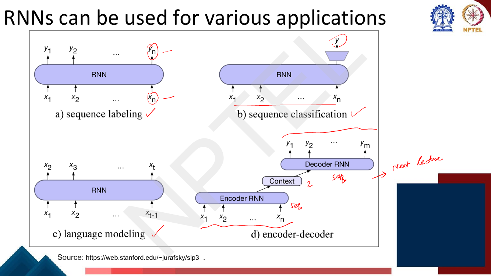
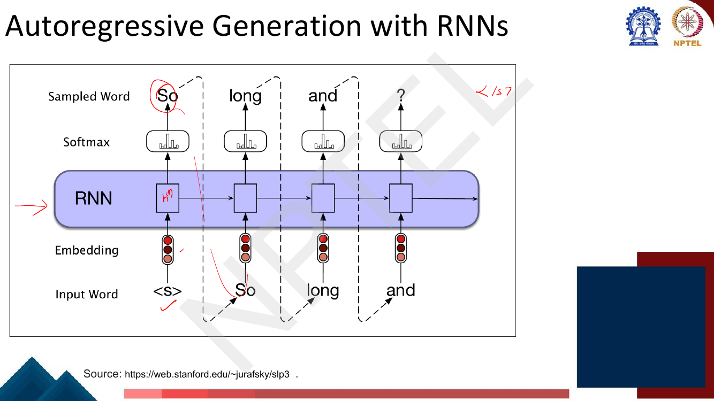
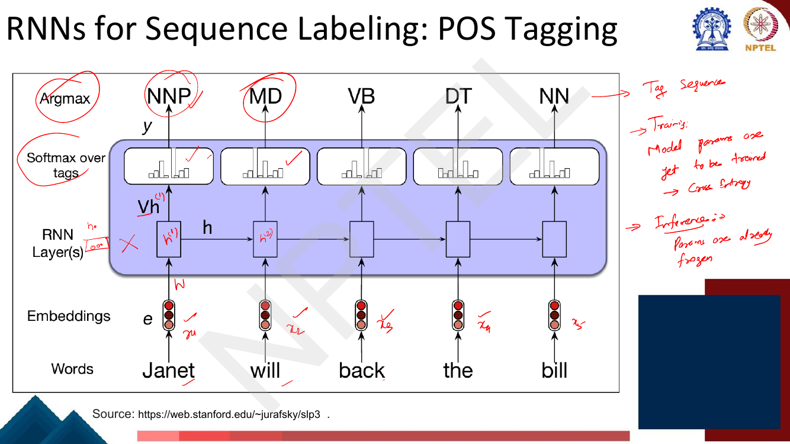
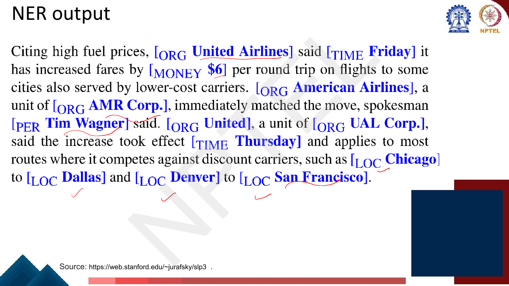
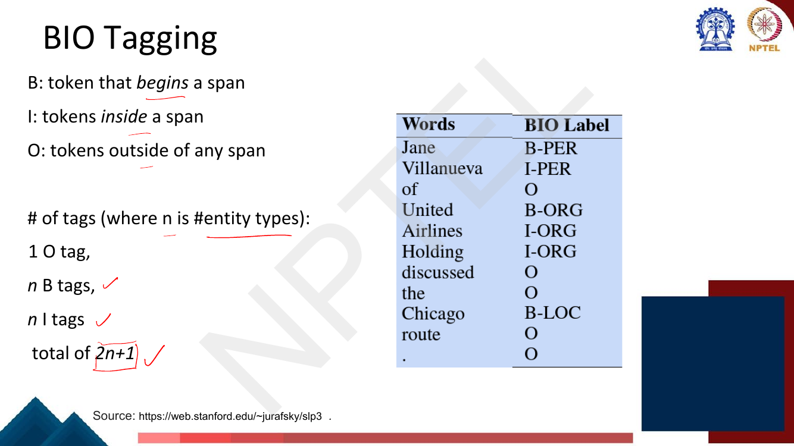
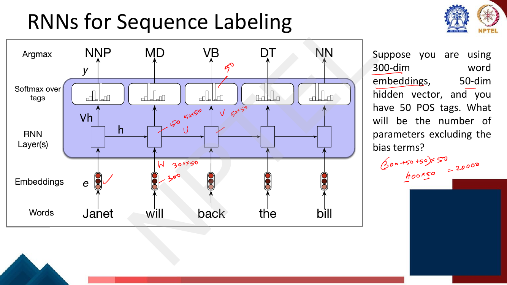

# Lec 17 — RNN Applications: Text Generation, Sequence Labeling, Text Classification

> **Source:** `Week4.pdf` pp. 30–56 · **Week 4** · **Playlist:** Lec 17
> **Prereqs:** [Lec 16 — RNN Language Models](16-rnn-language-models.md), [Lec 5 — NLP Tasks and Paradigms](../week-01/05-nlp-tasks-and-paradigms.md)
> **Feeds into:** [Lec 27 — BERT and Masked LM](../week-06/27-bert-masked-lm.md), [Lec 34 — Dialogue Systems 2](../week-07/34-dialogue-systems-2.md)

## Why this lecture exists

Lecture 16 built one thing: an RNN trained to predict the next word. This lecture shows that the same
machine, with the output layer rewired, solves three different families of NLP task. Feed the model's own prediction back in as the next input and you have a text
generator. Put a softmax over tags instead of over the vocabulary and you have a part-of-speech tagger
or a named-entity recogniser. Throw away all outputs except the last hidden state and you have a
sentence classifier. Three tasks, one recurrence, one set of weight matrices.

Two new ideas arrive with them. **BIO tagging** is the trick that converts a
span-finding problem into a per-token labelling problem, and it reappears in later chapters. **Bidirectional RNNs** fix a left-to-right model's blindness to the right
half of the sentence — at the cost of ruling out generation entirely.

## The ideas

### Recap in one paragraph

From [Lec 16](16-rnn-language-models.md): an RNN keeps a hidden state and updates it at every token,

$$\mathbf{h}_t = g\!\left(\mathbf{W}\mathbf{e}_t + \mathbf{U}\mathbf{h}_{t-1}\right), \qquad
\mathbf{y}_t = \operatorname{softmax}(\mathbf{V}\mathbf{h}_t)$$

where $\mathbf{e}_t$ is the embedding of token $w_t$, and $\mathbf{W}, \mathbf{U}, \mathbf{V}$ are
**shared across all time steps** — that is why the model handles any length with a fixed parameter
count. This deck uses the Jurafsky lettering throughout: $\mathbf{W}$ input-to-hidden,
$\mathbf{U}$ hidden-to-hidden, $\mathbf{V}$ hidden-to-output. Memorise that assignment; the deck's two
parameter-counting exercises depend on it. The language-model objective and its training are Lec 16's;
this chapter only *uses* the trained model.

### The four patterns


*Fig. — The organising picture for the whole chapter. Only the output wiring differs between (a), (b) and (c); (d) is next lecture's. Note (b) draws a funnel at the last step — everything before it is discarded. Page 36 of Week4.pdf.*

| Application | Pattern | Output per step? | Example task |
|---|---|---|---|
| Language modelling / text generation | many-to-many (shifted by one) | yes — a distribution over $V$ | predict the next word |
| Sequence labeling | many-to-many (aligned) | yes — a distribution over the tag set | POS tagging, NER |
| Sequence (text) classification | many-to-one | no — one label for the whole input | sentiment, topic |
| Encoder–decoder (seq2seq) | many-to-many (unaligned) | decoder only | translation ([Lec 18](18-seq2seq-and-attention.md)) |

"Aligned" versus "unaligned" is the discriminator worth holding on to: sequence labeling produces
**exactly one output per input token, in the same order**; seq2seq produces a different number of
outputs in a different order.

### RNNs for text generation: autoregressive generation

An RNN LM scores text. To make it *produce* text you close the loop: whatever word it predicts becomes
the input it reads next. The deck's name for this is **autoregressive generation** — "incrementally
generate words by repeatedly sampling the words conditioned on the previous choices".

The loop, exactly as the deck gives it:

1. All parameters are already trained and frozen. Nothing is learned here.
2. Feed the special begin-of-sentence token `<s>` as the input at $t=1$. Set $\mathbf{h}_0 = \mathbf{0}$.
3. Forward-propagate one step to get $\mathbf{y}_t = \operatorname{softmax}(\mathbf{V}\mathbf{h}_t)$,
   a distribution over the whole vocabulary.
4. **Choose a word** from that distribution — sample it, or take the argmax.
5. Look up that word's embedding and feed it in as the input at step $t+1$.
6. Repeat from 3 until `</s>` is produced or a fixed maximum length is reached.


*Fig. — The dashed arrows are the whole idea: the sampled word at step $t$ becomes the input word at step $t{+}1$. Nothing else in the network changed from Lec 16. Page 35.*

Step 4 is deliberately vague here and that is correct. **How you pick the next token — greedy argmax,
beam search, temperature, top-$k$, nucleus sampling — is entirely [Lec 19](19-decoding-strategies.md)'s
territory.** This chapter owns the loop; Lec 19 owns the choice inside it. The deck itself only says
"sample a word".

Because generation is just repeated conditioning, anything you can phrase as "continue this text"
becomes available: machine translation, dialogue and summarisation are all named on the deck as
downstream beneficiaries.

#### The train/test asymmetry and exposure bias

There is a mismatch buried in the loop that the deck does not name but you should.

- **At training time** the model is fed the *true* previous word at every step — the gold sequence is
  available, so step $t$'s input is $w_{t-1}$ from the corpus regardless of what the model predicted at
  $t-1$. (This is **teacher forcing**; [Lec 18](18-seq2seq-and-attention.md) owns it.)
- **At test time** the model is fed *its own output* from the previous step.

So the model is only ever trained on hidden states produced from correct histories, but at test time it
must run on hidden states produced from its own, possibly wrong, histories. One bad word puts the
network in a state it never saw during training, and errors compound. This is **exposure bias**, and it
is the standard explanation for why long unconditional generations from an RNN drift into incoherence.

### RNNs for sequence labeling

**Task (the deck's wording):** assign a label chosen from a *small fixed set* of labels to each element
of the sequence. Inputs: word embeddings. Outputs: tag probabilities from a softmax layer.

The only change from the LM is the output matrix. $\mathbf{V}$ goes from $\lvert V\rvert \times d_h$
(one row per vocabulary word) to $K \times d_h$ where $K$ is the number of tags — typically tens, not
tens of thousands. The recurrence is untouched.

#### POS tagging with an RNN


*Fig. — One softmax per time step, one argmax per time step, one tag per word. During training these softmaxes feed a summed cross-entropy loss; at inference the parameters are frozen and you simply read off the argmax. Page 38.*

That is the entire method: $\mathbf{V}\mathbf{h}_t \to \operatorname{softmax} \to \operatorname{argmax}$,
independently at each position. Note what the RNN buys you over a per-word lookup table: the tag of
*back* (VB here, but it can be RB, JJ or NN) is decided from $\mathbf{h}_t$, which has absorbed
*Janet will* — context disambiguates. POS tagging as a *task*, and the Penn Treebank tag set it uses,
belong to [Lec 5](../week-01/05-nlp-tasks-and-paradigms.md); this chapter owns the RNN method.

#### Named entities and NER

A **named entity**, in its core usage, is *anything that can be referred to with a proper name*. The
deck's four most common tags:

| Tag | Meaning | Deck's example |
|---|---|---|
| **PER** | Person | "Marie Curie" |
| **LOC** | Location | "New York City" |
| **ORG** | Organization | "Stanford University" |
| **GPE** | Geo-Political Entity | "Boulder, Colorado" |

Entities are **often multi-word phrases** — that single fact is the source of everything hard below.
The term is also stretched to things that are not strictly entities at all: **dates, times and prices**.

**Named entity recognition (NER)** is then two jobs at once, and the deck states both: *find spans of
text that constitute proper names*, and *tag the type of each entity*.


*Fig. — Note the non-entity types the deck admits: TIME and MONEY sit alongside ORG, PER and LOC. Also note "United Airlines" and "AMR Corp." are two-token spans while "Chicago" is one. Page 41.*

**Why NER?** Three motivations from the deck: **sentiment analysis** (is the consumer's sentiment
directed at a *particular* company or person?), **question answering** (answering questions about an
entity), and **information extraction** (pulling facts about entities out of running text).

**Why NER is hard** — the deck names two problems:


*Fig. — The four "Washington" sentences are the type-ambiguity argument in one picture: identical token, four different gold labels, disambiguated only by context. Page 43.*

1. **Segmentation.** In POS tagging there is no segmentation problem at all — each word gets exactly
   one tag, so the output has the same shape as the input. In NER the units are *spans of unknown
   length*, so you must decide where each entity starts and ends before you can type it.
2. **Type ambiguity.** *Washington* is PER (Booker T. Washington), ORG (the baseball team), LOC (the
   city) and GPE (the state) in four different sentences.

Segmentation is the one that breaks the sequence-labelling formalism, and BIO is the repair.

#### BIO tagging

The deck poses the problem precisely: *how can we turn this structured problem into a sequence problem
like POS tagging, with one label per word?*


*Fig. — The definitions and the count on one page. Memorise both. Note B and I carry the entity type as a suffix (B-PER, I-ORG); O never does. Page 46.*

**The scheme.** Give every token exactly one tag:

- **B-**TYPE — the token that **begins** a span of that type.
- **I-**TYPE — a token **inside** a span of that type (i.e. any token of the span after the first).
- **O** — a token **outside** any span. There is only one O tag; it carries no type.

Worked on the deck's own sentence,
*[PER Jane Villanueva] of [ORG United Airlines Holding] discussed the [LOC Chicago] route .*

| Word | BIO label |
|---|---|
| Jane | B-PER |
| Villanueva | I-PER |
| of | O |
| United | B-ORG |
| Airlines | I-ORG |
| Holding | I-ORG |
| discussed | O |
| the | O |
| Chicago | B-LOC |
| route | O |
| . | O |

Now there is one tag per token, the output is aligned with the input, and the RNN tagger of the
previous section applies unchanged. Segmentation has been smuggled into the label set.

**How many tags?** With $n$ entity types you need one B tag and one I tag per type, plus a single O:

$$K = \underbrace{n}_{\text{B tags}} + \underbrace{n}_{\text{I tags}} + \underbrace{1}_{\text{O}} = 2n + 1$$

That $2n+1$ is the number the exam asks for, and it is the number of rows in the output matrix
$\mathbf{V}$.

**Why is B needed at all?** This is the examinable heart of the scheme, so take it slowly. Suppose you
drop B and use only **IO tagging**: `I-`TYPE for any token in an entity, `O` otherwise — a smaller tag
set, $n+1$ tags. Now tag the headline *Serena Williams Venus Williams advance in Melbourne*, which
contains **two adjacent PER entities**:

```
token:   Serena  Williams  Venus   Williams  advance  in   Melbourne
BIO:     B-PER   I-PER     B-PER   I-PER     O        O    B-LOC
IO :     I-PER   I-PER     I-PER   I-PER     O        O    I-LOC
```

Decode the BIO row and you recover two PER spans — the B on *Venus* says "a new entity starts here".
Decode the IO row and you recover **one** PER span, "Serena Williams Venus Williams", because nothing in
the sequence marks the boundary. **IO tagging cannot represent two adjacent entities of the same type.**
That is the entire justification for B, and it is why B costs you $n$ extra tags.

(If the two adjacent entities have *different* types, IO copes — the type suffix changes, so the
boundary is visible. The failure is specific to same-type adjacency.)

**Variants.** The deck shows only BIO, but two relatives are standard and are fair MCQ material:

| Scheme | Tags | Tag count | Can it split adjacent same-type spans? |
|---|---|---|---|
| **IO** | I-TYPE, O | $n+1$ | **No** |
| **BIO** (IOB2) | B-TYPE, I-TYPE, O | $2n+1$ | Yes |
| **BIOES** / **BILOU** | B, I, E(nd)/L(ast), S(ingle)/U(nit), O | $4n+1$ | Yes |

BIOES adds an explicit **E** for the last token of a multi-token span and **S** for a span that is a
single token. It gives the model more boundary signal — a single-token entity is a distinct class
rather than "a B with no I after it" — at the price of doubling the tag set again. Empirically it
sometimes helps and always costs; BIO is the default.

### RNNs for text classification


*Fig. — The pooled variant: every hidden state contributes, not just the last. Compare with the previous slide, where a single arrow runs from $\mathbf{h}^{(7)}$ alone. Page 51.*

Here only **one** label is wanted for the whole input, so you need a single vector — a **sentence
encoding** — to hand to a classifier. The deck gives two ways to build it:

- **Basic way: use the final hidden state.** $\mathbf{h}_T$ has read every token, so it "captures the
  entire sentence". The sentence encoding *equals* $\mathbf{h}_T$. All earlier outputs are discarded.
- **Usually better: pool.** Take the **element-wise max or mean of all hidden states**
  $\mathbf{h}_1 \ldots \mathbf{h}_T$. The deck says this is usually better, and the reason is the
  recency problem: $\mathbf{h}_T$ is dominated by the end of the sentence, so a decisive word near the
  start can be washed out. Pooling gives every position a direct path to the classifier.

Then a classifier — a softmax layer, $\hat{y} = \operatorname{softmax}(\mathbf{V}\mathbf{s})$ where
$\mathbf{s}$ is the sentence encoding — produces the label. This is the **many-to-one** pattern. There
is no output at intermediate steps and therefore no per-step loss; the single cross-entropy at the end
is backpropagated through the whole unrolled network.

### Bidirectional RNNs


*Fig. — The motivating failure. A left-to-right RNN's state at *terribly* has seen "the movie was" and nothing else, so it commits to "negative" before the evidence arrives. Page 52.*

**The motivation, as the deck frames it: sentiment classification.** Each hidden state $\mathbf{h}_t$ is
a **contextual representation** of word $w_t$ — the word as it appears *in this sentence*. But in a
plain RNN it contains only **left context**. In *the movie was terribly exciting !*, the state at
*terribly* has read only "the movie was", so it reads *terribly* as negative. The very next word,
*exciting*, flips it. Right context matters.

**Formally.** Run two independent RNNs over the same sequence, with their own separate parameter sets:

$$\mathbf{h}_t^{f} = \text{RNN}_{\text{forward}}(\mathbf{x}_1, \ldots, \mathbf{x}_t)$$
$$\mathbf{h}_t^{b} = \text{RNN}_{\text{backward}}(\mathbf{x}_n, \ldots, \mathbf{x}_t)$$
$$\mathbf{h}_t = [\mathbf{h}_t^{f}; \mathbf{h}_t^{b}]$$

Read the index ranges carefully. The forward RNN at position $t$ has consumed $\mathbf{x}_1$ through
$\mathbf{x}_t$; the backward RNN at position $t$ has consumed $\mathbf{x}_n$ *down to* $\mathbf{x}_t$.
Both include $\mathbf{x}_t$ itself. The outputs are **concatenated**, not added or averaged, so if each
direction has hidden size $h$ the combined state has size $2h$.


*Fig. — Three rows: forward states, backward states, and the concatenation stacked on top. The two RNNs never talk to each other; they are combined only at the output. Page 54.*

The concatenated states drop straight into either of the previous two applications: use
$\mathbf{h}_t$ per position for **sequence labeling**, or pool/take the endpoints for **sequence
classification**. For classification the natural sentence encoding is
$[\mathbf{h}_n^{f}; \mathbf{h}_1^{b}]$ — each direction's state after reading the whole sentence — or a
mean/max pool over the concatenated states.

**The critical limitation.** The deck's own premise is "in many applications, *the entire sequence is
available*". A bidirectional RNN needs the **whole input up front**, because $\mathbf{h}_t^b$ cannot be
computed until $\mathbf{x}_n$ has been read. Therefore:

> **A bidirectional RNN cannot be used for language modelling or for real-time / streaming generation.**

There is no $\mathbf{x}_n$ when you are generating $\mathbf{x}_n$. Any task where the output is produced
left-to-right as the input arrives — language modelling, autoregressive generation, incremental speech
recognition — is closed to bidirectional models. Tagging, classification and the encoder half of a
seq2seq model are open to them. This is the single most reliable MCQ in the chapter.

Everything above also makes a bidirectional RNN cost exactly **twice** the parameters of a
unidirectional one at the same hidden size — see N6.

## Worked numericals

### N1. The deck's parameter count for an RNN POS tagger (page 47)


*Fig. — The lecturer's own working: the three matrices all have 50 columns, so factor the 50 out and add the row counts. Page 47.*

**Given:** embedding dimension $d = 300$, hidden dimension $d_h = 50$, $K = 50$ POS tags. Ignore biases.
**Find:** the total number of learned parameters.

1. **Input-to-hidden** $\mathbf{W}$ maps a 300-dim embedding to a 50-dim hidden vector:
   $300 \times 50 = 15{,}000$.
2. **Hidden-to-hidden** $\mathbf{U}$ maps 50 to 50: $50 \times 50 = 2{,}500$.
3. **Hidden-to-output** $\mathbf{V}$ maps 50 to the 50 tag logits: $50 \times 50 = 2{,}500$.
4. Total $= 15{,}000 + 2{,}500 + 2{,}500 = 20{,}000$.
5. The deck's shortcut: all three matrices have 50 columns, so
   $(300 + 50 + 50) \times 50 = 400 \times 50 = 20{,}000$.
6. Sanity: the count is **independent of sentence length**, because the weights are shared across time
   steps. Tagging a 5-word or a 500-word sentence uses the same 20,000 numbers.

**Answer:** $\mathbf{20{,}000}$ parameters. Agrees with the lecturer's handwritten solution on page 47.

### N2. The same count under BIO tagging (page 48)
**Given:** $d = 300$, $d_h = 50$, **5 NER entity types**, BIO tagging scheme. Ignore biases.
**Find:** the total number of learned parameters.

1. First convert entity types into tags. With $n = 5$: $K = 2n + 1 = 2(5) + 1 = \mathbf{11}$ tags
   (5 B tags, 5 I tags, 1 O tag). **This is the step the question is testing.**
2. $\mathbf{W}$: $300 \times 50 = 15{,}000$.
3. $\mathbf{U}$: $50 \times 50 = 2{,}500$.
4. $\mathbf{V}$: $50 \times 11 = 550$.
5. Total $= 15{,}000 + 2{,}500 + 550 = 18{,}050$.
6. Deck's shortcut: $(300 + 50 + 11) \times 50 = 361 \times 50 = 18{,}050$.

**Answer:** $\mathbf{18{,}050}$ parameters. Agrees with the lecturer's handwritten solution on page 48.
Note the trap: reading "5 NER tags" as $K = 5$ gives $(300+50+5)\times 50 = 17{,}750$, which is wrong —
the phrase "using BIO tagging scheme" is there precisely to force the $2n+1$ conversion.

### N3. BIO-tag two sentences by hand
**Given (a):** tokens `Sundar(1) Pichai(2) of(3) Google(4) announced(5) a(6) new(7) office(8) in(9) Hyderabad(10) .(11)`
with gold annotations PER = tokens 1–2, ORG = token 4, LOC = token 10.
**Find:** the BIO tag sequence.

1. Token 1 *Sundar* begins the PER span → **B-PER**.
2. Token 2 *Pichai* is inside the same PER span → **I-PER**.
3. Token 3 *of* is in no span → **O**.
4. Token 4 *Google* begins the ORG span; it is also the last token of it, but BIO has no end marker, so
   a single-token entity is just **B-ORG** with no I after it.
5. Tokens 5–9 are outside → **O O O O O**.
6. Token 10 *Hyderabad* begins the LOC span → **B-LOC**. Token 11 `.` → **O**.

**Answer (a):** `B-PER I-PER O B-ORG O O O O O B-LOC O` — 11 tags for 11 tokens, as required.

**Given (b):** headline tokens `Serena(1) Williams(2) Venus(3) Williams(4) advance(5) in(6) Melbourne(7)`
with gold PER = 1–2, PER = 3–4, LOC = 7 — **two adjacent entities of the same type**.
**Find:** the BIO sequence, the IO sequence, and what each decodes back to.

1. BIO: token 1 begins a PER → B-PER; token 2 inside → I-PER; token 3 **begins a new** PER → B-PER;
   token 4 inside → I-PER; tokens 5–6 → O O; token 7 → B-LOC.
   $\Rightarrow$ `B-PER I-PER B-PER I-PER O O B-LOC`
2. IO: strip every B down to I. $\Rightarrow$ `I-PER I-PER I-PER I-PER O O I-LOC`
3. Decode BIO: a new span opens at every B, so you recover PER(1–2), PER(3–4), LOC(7) — **3 entities**,
   matching gold.
4. Decode IO: tokens 1–4 form one unbroken run of `I-PER` with no boundary marker, so you recover
   PER(1–4), LOC(7) — **2 entities**, one of them wrong.

**Answer (b):** BIO recovers all 3 gold entities; IO recovers 2 and merges *Serena Williams Venus
Williams* into one span. **This is why B exists.**

### N4. Tag-set sizes under IO, BIO and BIOES
**Given:** $n$ entity types.
**Find:** the number of tags under each scheme, evaluated at $n = 4$, $n = 5$ and $n = 18$ (OntoNotes).

1. **IO:** one I tag per type plus one O $\Rightarrow n + 1$.
2. **BIO:** one B and one I per type plus one O $\Rightarrow 2n + 1$.
3. **BIOES:** B, I, E, S per type plus one O $\Rightarrow 4n + 1$.
4. At $n = 4$ (PER, LOC, ORG, GPE): IO $= 5$; BIO $= 2(4)+1 = \mathbf{9}$; BIOES $= 4(4)+1 = 17$.
5. At $n = 5$: IO $= 6$; BIO $= \mathbf{11}$; BIOES $= 21$. (The 11 is N2's output dimension.)
6. At $n = 18$: IO $= 19$; BIO $= 2(18)+1 = \mathbf{37}$; BIOES $= 73$.

**Answer:** $n+1$ / $2n+1$ / $4n+1$. Going from BIO to BIOES at $n=18$ costs
$(73-37)\times 50 = 1{,}800$ extra output-layer parameters at $d_h = 50$ — cheap, which is why the
choice is made on accuracy, not cost.

### N5. Entity-level precision, recall and F1 — and the partial-span trap
**Given:** the sentence `Jane(1) Villanueva(2) of(3) United(4) Airlines(5) Holding(6) discussed(7) the(8) Chicago(9) route(10) .(11)`.
Gold spans: PER(1–2), ORG(4–6), LOC(9).
Predicted spans: PER(1–2), ORG(4–**5**), LOC(9), ORG(11).
**Find:** entity-level precision, recall and $F_1$, and compare with token-level accuracy.

1. A hit at entity level requires the **type and both boundaries** to match exactly.
2. PER(1–2) predicted = PER(1–2) gold → **TP**.
3. LOC(9) predicted = LOC(9) gold → **TP**.
4. ORG(4–5) predicted: no gold span equals it (gold has ORG(4–6)) → **FP**. *And* gold ORG(4–6) has no
   matching prediction → **FN**. The one partial span is punished **twice**.
5. ORG(11) predicted on the full stop: spurious → **FP**.
6. Totals: $TP = 2$, $FP = 2$, $FN = 1$.
7. $P = \dfrac{TP}{TP+FP} = \dfrac{2}{2+2} = 0.5$.
8. $R = \dfrac{TP}{TP+FN} = \dfrac{2}{2+1} = 0.6667$.
9. $F_1 = \dfrac{2PR}{P+R} = \dfrac{2(0.5)(0.6667)}{0.5+0.6667} = \dfrac{0.6667}{1.1667} = 0.5714$.
10. Now count at **token** level. The two tag sequences differ on exactly two of eleven tokens
    (*Holding*: gold I-ORG, predicted O; `.`: gold O, predicted B-ORG). Accuracy $= 9/11 = 0.818$.

**Answer:** $P = 0.5$, $R = 0.667$, $F_1 = \mathbf{0.571}$, against a token accuracy of $0.818$.
**Entity-level $F_1$ is far stricter than token accuracy** because a span scores nothing unless the
whole span is right, and a near-miss costs a false positive *and* a false negative. The definitions of
precision, recall and $F_1$ themselves belong to
[Lec 5](../week-01/05-nlp-tasks-and-paradigms.md) — what is new here is the span-level unit of account.

### N6. A bidirectional RNN forward pass, and its parameter count
**Given:** a 3-token sequence with embeddings $\mathbf{e}_1 = [1,0]^\top$, $\mathbf{e}_2 = [0,1]^\top$,
$\mathbf{e}_3 = [1,1]^\top$. Hidden size 2, $g = \tanh$, no biases.
Forward RNN: $\mathbf{W}^f = \begin{bmatrix}1&0\\0&1\end{bmatrix}$,
$\mathbf{U}^f = \begin{bmatrix}0.5&0\\0&0.5\end{bmatrix}$, $\mathbf{h}_0^f = \mathbf{0}$.
Backward RNN: $\mathbf{W}^b = \begin{bmatrix}0&1\\1&0\end{bmatrix}$,
$\mathbf{U}^b = \begin{bmatrix}0.5&0\\0&0.5\end{bmatrix}$, $\mathbf{h}_4^b = \mathbf{0}$.
**Find:** $\mathbf{h}_t^f$, $\mathbf{h}_t^b$ and the concatenated $\mathbf{h}_t$ for $t=1,2,3$.

Forward pass, left to right ($\tanh 1 = 0.7616$, $\tanh 0 = 0$):

1. $\mathbf{h}_1^f = \tanh(\mathbf{W}^f\mathbf{e}_1) = \tanh([1,0]^\top) = [0.7616,\ 0]^\top$.
2. $\mathbf{W}^f\mathbf{e}_2 = [0,1]^\top$; $\mathbf{U}^f\mathbf{h}_1^f = [0.3808,\ 0]^\top$; sum
   $= [0.3808,\ 1]^\top$. $\mathbf{h}_2^f = \tanh(\cdot) = [0.3634,\ 0.7616]^\top$.
3. $\mathbf{W}^f\mathbf{e}_3 = [1,1]^\top$; $\mathbf{U}^f\mathbf{h}_2^f = [0.1817,\ 0.3808]^\top$; sum
   $= [1.1817,\ 1.3808]^\top$. $\mathbf{h}_3^f = [0.8280,\ 0.8811]^\top$.

Backward pass, right to left (note $\mathbf{W}^b$ swaps the two components):

4. $\mathbf{W}^b\mathbf{e}_3 = [1,1]^\top$, so $\mathbf{h}_3^b = \tanh([1,1]^\top) = [0.7616,\ 0.7616]^\top$.
5. $\mathbf{W}^b\mathbf{e}_2 = [1,0]^\top$; $\mathbf{U}^b\mathbf{h}_3^b = [0.3808,\ 0.3808]^\top$; sum
   $= [1.3808,\ 0.3808]^\top$. $\mathbf{h}_2^b = [0.8811,\ 0.3634]^\top$.
6. $\mathbf{W}^b\mathbf{e}_1 = [0,1]^\top$; $\mathbf{U}^b\mathbf{h}_2^b = [0.4406,\ 0.1817]^\top$; sum
   $= [0.4406,\ 1.1817]^\top$. $\mathbf{h}_1^b = [0.4141,\ 0.8280]^\top$.

Concatenate, $\mathbf{h}_t = [\mathbf{h}_t^f; \mathbf{h}_t^b]$ — each is 4-dimensional:

| $t$ | $\mathbf{h}_t^f$ | $\mathbf{h}_t^b$ | $\mathbf{h}_t$ |
|---|---|---|---|
| 1 | $[0.7616,\ 0]$ | $[0.4141,\ 0.8280]$ | $[0.7616,\ 0,\ 0.4141,\ 0.8280]$ |
| 2 | $[0.3634,\ 0.7616]$ | $[0.8811,\ 0.3634]$ | $[0.3634,\ 0.7616,\ 0.8811,\ 0.3634]$ |
| 3 | $[0.8280,\ 0.8811]$ | $[0.7616,\ 0.7616]$ | $[0.8280,\ 0.8811,\ 0.7616,\ 0.7616]$ |

7. Notice $\mathbf{h}_1^f$ depends only on $\mathbf{e}_1$, while $\mathbf{h}_1^b$ has absorbed
   $\mathbf{e}_3$ and $\mathbf{e}_2$ as well. Position 1 now has right context — which is impossible
   until $\mathbf{e}_3$ is known.

**Parameter count**, same architecture as N2 ($d = 300$, $d_h = 50$, $K = 11$ BIO tags):

8. Unidirectional: $300(50) + 50(50) + 50(11) = 15{,}000 + 2{,}500 + 550 = 18{,}050$.
9. Bidirectional: two independent recurrences
   $\Rightarrow 2(15{,}000 + 2{,}500) = 35{,}000$; the output matrix now reads a $2h = 100$-dim state
   $\Rightarrow 100 \times 11 = 1{,}100$. Total $= 36{,}100$.
10. Ratio $= 36{,}100 / 18{,}050 = 2.0$ **exactly** — every matrix in the model doubled.

**Answer:** concatenated states as tabulated; **18,050 → 36,100 parameters, exactly double**.

## Code

```python
import numpy as np

TOKENS = ["Jane", "Villanueva", "of", "United", "Airlines", "Holding",
          "discussed", "the", "Chicago", "route", "."]

# A span is (type, start, end) with INCLUSIVE 0-based token indices.
GOLD = [("PER", 0, 1), ("ORG", 3, 5), ("LOC", 8, 8)]
PRED = [("PER", 0, 1), ("ORG", 3, 4), ("LOC", 8, 8), ("ORG", 10, 10)]

def spans_to_bio(spans, n_tokens):
    """Span annotations -> one BIO tag per token."""
    tags = np.array(["O"] * n_tokens, dtype=object)
    for typ, s, e in spans:
        tags[s] = "B-" + typ                      # B marks the first token
        tags[s + 1:e + 1] = "I-" + typ            # I marks every token after it
    return tags

def bio_to_spans(tags):
    """BIO tags -> spans. A new span starts on any B, or on an I whose
    predecessor is O or a DIFFERENT type (the standard tolerant decoder)."""
    spans, cur = [], None
    for i, tag in enumerate(tags):
        pre, typ = (tag[0], tag[2:]) if tag != "O" else ("O", None)
        if pre == "B" or (pre == "I" and (cur is None or cur[0] != typ)):
            if cur: spans.append(tuple(cur))
            cur = [typ, i, i]
        elif pre == "I":
            cur[2] = i                            # extend the open span
        else:
            if cur: spans.append(tuple(cur)); cur = None
    if cur: spans.append(tuple(cur))
    return spans

def entity_f1(gold, pred):
    """Entity-level scores: a hit requires type AND both boundaries to match."""
    g, p = set(gold), set(pred)
    tp = len(g & p); fp = len(p - g); fn = len(g - p)
    P = tp / (tp + fp) if tp + fp else 0.0
    R = tp / (tp + fn) if tp + fn else 0.0
    F = 2 * P * R / (P + R) if P + R else 0.0
    return tp, fp, fn, P, R, F

gold_bio, pred_bio = spans_to_bio(GOLD, len(TOKENS)), spans_to_bio(PRED, len(TOKENS))
print(f"{'token':<11}{'gold':<8}{'pred':<8}")
for t, g, p in zip(TOKENS, gold_bio, pred_bio):
    print(f"{t:<11}{g:<8}{p:<8}{'' if g == p else '  <- token error'}")

print("\nround-trip spans->BIO->spans:", bio_to_spans(gold_bio) == GOLD)
tp, fp, fn, P, R, F = entity_f1(GOLD, PRED)
print(f"TP={tp}  FP={fp}  FN={fn}")
print(f"entity precision = {P:.4f}   recall = {R:.4f}   F1 = {F:.4f}")
print(f"token-level accuracy = {np.mean(gold_bio == pred_bio):.4f}")

# IO tagging cannot separate adjacent same-type entities
HEAD = ["Serena", "Williams", "Venus", "Williams", "advance", "in", "Melbourne"]
H_GOLD = [("PER", 0, 1), ("PER", 2, 3), ("LOC", 6, 6)]
bio = spans_to_bio(H_GOLD, len(HEAD))
io = np.array(["O" if t == "O" else "I-" + t[2:] for t in bio], dtype=object)
print("\nBIO:", " ".join(bio))
print("IO :", " ".join(io))
print("spans decoded from BIO:", bio_to_spans(bio))
print("spans decoded from IO :", bio_to_spans(io))

for n in (4, 5, 18):                                    # tag-set sizes, N4
    print(f"n={n:<3} ->  IO {n+1:>3} | BIO {2*n+1:>3} | BIOES {4*n+1:>3}")

d, h, k = 300, 50, 11                                   # parameter counts, N6
uni = d*h + h*h + h*k
bi  = 2*(d*h + h*h) + (2*h)*k
print(f"\nuni-RNN tagger params = {uni}   bi-RNN = {bi}   ratio = {bi/uni:.1f}")
```

Real output:

```
token      gold    pred
Jane       B-PER   B-PER
Villanueva I-PER   I-PER
of         O       O
United     B-ORG   B-ORG
Airlines   I-ORG   I-ORG
Holding    I-ORG   O         <- token error
discussed  O       O
the        O       O
Chicago    B-LOC   B-LOC
route      O       O
.          O       B-ORG     <- token error

round-trip spans->BIO->spans: True
TP=2  FP=2  FN=1
entity precision = 0.5000   recall = 0.6667   F1 = 0.5714
token-level accuracy = 0.8182

BIO: B-PER I-PER B-PER I-PER O O B-LOC
IO : I-PER I-PER I-PER I-PER O O I-LOC
spans decoded from BIO: [('PER', 0, 1), ('PER', 2, 3), ('LOC', 6, 6)]
spans decoded from IO : [('PER', 0, 3), ('LOC', 6, 6)]
n=4   ->  IO   5 | BIO   9 | BIOES  17
n=5   ->  IO   6 | BIO  11 | BIOES  21
n=18  ->  IO  19 | BIO  37 | BIOES  73

uni-RNN tagger params = 18050   bi-RNN = 36100   ratio = 2.0
```

Two things to read off. `spans decoded from IO` returns **two** spans where BIO returns three — the
same failure as N3(b), executed. And `entity F1 = 0.5714` against `token accuracy = 0.8182` is N5's
point: the same two token errors look mild per-token and severe per-entity.

## Exam pack

### Must-memorise

| Item | Exactly this |
|---|---|
| Autoregressive generation | sample a word from $\mathbf{y}_t$, feed its embedding in as input at $t{+}1$, repeat until `</s>` or max length |
| Generation start | special begin-of-sentence token `<s>`, $\mathbf{h}_0 = \mathbf{0}$, parameters frozen |
| Train vs test input | training uses the **true** previous word; test uses the **model's own** output → **exposure bias** |
| Sequence-labeling task | assign a label from a **small fixed set** to **each** element; inputs = word embeddings, outputs = softmax tag probabilities |
| Named entity | anything that can be referred to with a **proper name**; often multi-word |
| Four core NER types | **PER, LOC, ORG, GPE** (+ extensions: dates, times, prices) |
| NER = two jobs | find **spans** that constitute proper names; **tag the type** |
| Why NER is hard | (1) **segmentation** — POS has none, each word gets one tag; (2) **type ambiguity** |
| Why NER matters | sentiment analysis, question answering, information extraction |
| **B** | token that **begins** a span |
| **I** | token **inside** a span |
| **O** | token **outside** any span |
| BIO tag count | $2n+1$ for $n$ entity types: $n$ B tags, $n$ I tags, 1 O tag |
| IO / BIOES counts | $n+1$ / $4n+1$ |
| Why B is needed | IO cannot separate **two adjacent entities of the same type** |
| Sentence encoding, basic | the **final hidden state** $\mathbf{h}_T$ |
| Sentence encoding, better | **element-wise max or mean** over all hidden states |
| Bidirectional RNN | $\mathbf{h}_t^f = \text{RNN}_{\text{fwd}}(\mathbf{x}_1..\mathbf{x}_t)$, $\mathbf{h}_t^b = \text{RNN}_{\text{bwd}}(\mathbf{x}_n..\mathbf{x}_t)$, $\mathbf{h}_t = [\mathbf{h}_t^f;\mathbf{h}_t^b]$ |
| Bi-RNN limitation | needs the **entire sequence up front** → **unusable for language modelling or real-time generation** |
| Bi-RNN size | hidden state $2h$; parameter count exactly **doubles** |
| RNN tagger params (no bias) | $d\,d_h + d_h^2 + d_h K$, independent of sentence length |

### Numbers worth knowing

| Quantity | Value |
|---|---|
| Deck exercise p. 47 (300-dim emb, 50 hidden, 50 POS tags) | **20,000** parameters |
| Deck exercise p. 48 (300-dim emb, 50 hidden, 5 NER types + BIO) | **18,050** parameters (11 tags) |
| BIO tags for 4 entity types | 9 |
| BIO tags for 5 entity types | 11 |
| BIOES tags for $n$ types | $4n+1$ |
| Bidirectional version of the p. 48 model | 36,100 parameters (2.0×) |
| N5 entity-level scores | $P=0.5$, $R=0.667$, $F_1=0.571$ vs token accuracy 0.818 |
| Deck's source text | Jurafsky & Martin, *Speech and Language Processing*, 3rd ed. (2024), **Chapter 8** |

### Likely MCQ traps

- **"5 NER tags" means $K=5$.** No — if BIO is in play, 5 *entity types* give $2(5)+1 = 11$ tags. The
  deck's page-48 exercise exists to catch exactly this. Read whether the question says *types* or *tags*.
- **"A bidirectional RNN improves language modelling."** It cannot be used for language modelling at
  all. Predicting $w_t$ from both sides means looking at $w_t$ itself and everything after it; and at
  generation time the right context does not exist yet.
- **"$\mathbf{h}_t$ in a bi-RNN is the sum/average of the two directions."** It is the **concatenation**;
  dimension $2h$, not $h$.
- **"The forward and backward RNNs share weights."** They are two **independent** RNNs with separate
  $\mathbf{W}, \mathbf{U}$. That is why the parameter count doubles.
- **"IO tagging loses information about entity type."** No — it keeps the type; what it loses is
  **boundaries between adjacent same-type spans**. Different-type adjacency is fine in IO.
- **"O tags carry a type (O-PER, O-ORG)."** There is exactly **one** O tag. That is why the count is
  $2n+1$ and not $3n$.
- **"BIO has one tag per entity type."** It has **two** (B and I) per type, plus the single O.
- **Confusing POS tagging and NER on segmentation.** POS tagging has *no* segmentation problem (one tag
  per word by construction); NER does.
- **"Entity-level F1 and token-level accuracy measure the same thing."** A predicted span that gets the
  type right but one boundary wrong scores as a false positive **and** a false negative, while token
  accuracy barely moves. Entity F1 is strictly harsher.
- **Confusing the generation loop with the decoding rule.** Feeding the output back in is the loop (this
  chapter); choosing greedily vs by beam search vs by top-$k$ is the decoding strategy
  ([Lec 19](19-decoding-strategies.md)).
- **"Text classification uses one softmax per time step."** Many-to-one: a single label, a single loss.
  Per-step softmaxes are sequence *labeling*.
- **"The last hidden state is always the best sentence encoding."** The deck says pooling (element-wise
  max or mean) is *usually better*.
- **Making the parameter count depend on sequence length.** It does not — weights are shared across
  time steps.

### Self-test

1. Write the five steps of autoregressive generation from a trained RNN LM.
2. What is fed as the input at step $t$ during training, and what at test time? Name the resulting problem.
3. Give the exact definitions of B, I and O.
4. A corpus has 7 entity types. How many tags under BIO? Under IO? Under BIOES?
5. Tag `[ORG Tata Motors] [ORG Tata Steel] rose today` in BIO, then in IO. What goes wrong in IO?
6. An RNN tagger uses 100-dim embeddings, a 20-dim hidden state and 3 entity types with BIO. How many parameters, ignoring biases?
7. Gold spans $\{$PER(2,3), LOC(7,7)$\}$; predicted $\{$PER(2,4), LOC(7,7)$\}$. Give entity-level $P$, $R$, $F_1$.
8. Why can a bidirectional RNN not be used for language modelling?
9. If each direction of a bi-RNN has hidden size 64, what is the dimension of $\mathbf{h}_t$?
10. Which two ways does the deck give for computing a sentence encoding, and which does it prefer?

<details><summary>Answers</summary>

1. (i) parameters already trained and frozen; (ii) input `<s>`, $\mathbf{h}_0=\mathbf{0}$; (iii) forward-propagate to get a softmax distribution over $V$; (iv) choose a word from it (sample or argmax — Lec 19 owns the choice) and feed its embedding in at the next step; (v) stop at `</s>` or a fixed length.
2. Training: the **true** previous word (teacher forcing). Test: the model's **own** previous output. The mismatch is **exposure bias**.
3. B — token that *begins* a span; I — token *inside* a span; O — token *outside* any span.
4. BIO $2(7)+1 = 15$; IO $7+1 = 8$; BIOES $4(7)+1 = 29$.
5. BIO: `B-ORG I-ORG B-ORG I-ORG O O`. IO: `I-ORG I-ORG I-ORG I-ORG O O`, which decodes to a single four-token ORG, "Tata Motors Tata Steel". IO cannot separate adjacent same-type entities.
6. Tags $= 2(3)+1 = 7$. $100(20) + 20(20) + 20(7) = 2000 + 400 + 140 = \mathbf{2540}$.
7. PER(2,4) ≠ PER(2,3), so: TP = 1 (LOC), FP = 1, FN = 1. $P = 1/2 = 0.5$, $R = 1/2 = 0.5$, $F_1 = 0.5$.
8. It needs the entire sequence before it can compute any backward state; when generating or predicting the next word, the right context does not exist yet (and would leak the answer).
9. $2 \times 64 = \mathbf{128}$.
10. The final hidden state $\mathbf{h}_T$ (basic), or the element-wise max/mean of all hidden states (deck says "usually better").

</details>

## Beyond the slides

**Gap:** The deck decodes BIO tags as if the predicted sequence were always well-formed, but a softmax
applied independently at each position can emit `O I-PER` or `B-PER I-LOC`.
**Why it matters:** Such sequences are **illegal** under BIO and must be repaired before you can extract
spans — the tolerant decoder in the code block opens a span on a stray `I`, but other conventions drop
it. Two standard fixes: a **CRF layer** on top of the RNN, which scores whole tag sequences and learns
transition penalties that make illegal pairs near-impossible; or **constrained Viterbi decoding** at
inference. Essentially every published BiLSTM NER model is in fact BiLSTM-**CRF**. Expect this as a
"what is added on top of the RNN for NER?" question.

**Gap:** The deck shows bidirectional RNNs only for sentiment, and never says what to use as the
sentence encoding when you pool a bidirectional model.
**Why it matters:** The convention is $[\mathbf{h}_n^{f}; \mathbf{h}_1^{b}]$ — the *final* state of each
direction, which for the backward RNN is at position 1, not position $n$. Taking $\mathbf{h}_n^{b}$
would give you a state that has read only the last token.

**Gap:** Nothing is said about **stacking** RNN layers.
**Why it matters:** Real taggers use 2–3 stacked bidirectional layers, where layer $\ell$'s
concatenated outputs are layer $\ell+1$'s inputs. This is the architecture ELMo
([Lec 26](../week-06/26-pretraining-and-elmo.md)) is built from, so recognising it matters two weeks
from now.

**Gap:** The deck does not say how NER is scored.
**Why it matters:** The standard is **entity-level (span-level) $F_1$**, usually micro-averaged over
entity types — computed exactly as in N5, with the precision/recall/$F_1$ definitions from
[Lec 5](../week-01/05-nlp-tasks-and-paradigms.md). Reporting *token-level accuracy* for NER is
misleading because the O class dominates: a model that predicts O everywhere on CoNLL-2003 scores about
83% token accuracy and 0% entity $F_1$.

**Gap:** BIO is presented as an RNN-era device, which invites the assumption that it was superseded.
**Why it matters:** It was not. BERT's token-classification head
([Lec 27](../week-06/27-bert-masked-lm.md)) emits BIO tags over subword tokens, and slot filling in
task-oriented dialogue ([Lec 34](../week-07/34-dialogue-systems-2.md)) is BIO tagging with slot names
in place of entity types. The one genuinely new wrinkle is **subword alignment**: when a tokenizer
splits *Villanueva* into `Villa ##nue ##va`, the convention is to put the tag on the first subword and
mask the rest from the loss.

## Cut from the slides

Page 30 is the title card, page 31 the three-bullet outline, page 55 the single reference (Jurafsky &
Martin 3rd edition, Chapter 8 — recorded in the Numbers table) and page 56 the "Thank You" card; none
carry content. Page 32 is a verbatim recap of Lec 16's RNN-LM diagram and its "why is this good"
advantages list — compressed to the one-paragraph recap, since
[Lec 16](16-rnn-language-models.md) owns it. Pages 33–34 are two text slides on generation that say the
same thing at two levels of detail; they are merged into the numbered loop. Pages 39–40 (named entities,
NER definition) are merged into one subsection with the type table. Pages 44–45 are the same BIO
example built in two steps and are presented once, completed. Page 49 poses the question that page 50
answers, so the two are taught together. Pages 50 and 51 differ only in which sentence-encoding recipe
is highlighted, and are given as the two bullets of one subsection. Decoding strategy (how to pick the
sampled word) is deliberately left to [Lec 19](19-decoding-strategies.md), the encoder–decoder quadrant
of page 36 to [Lec 18](18-seq2seq-and-attention.md), and precision/recall/$F_1$ to
[Lec 5](../week-01/05-nlp-tasks-and-paradigms.md). Nothing examinable was dropped.
