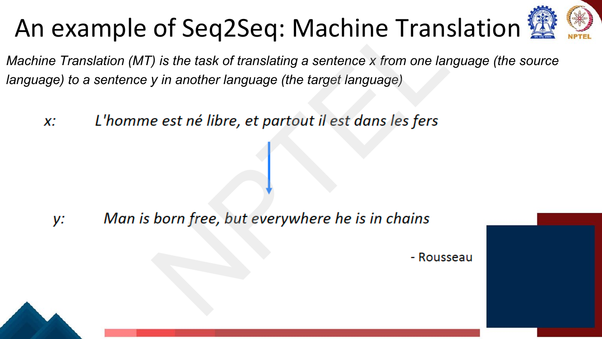
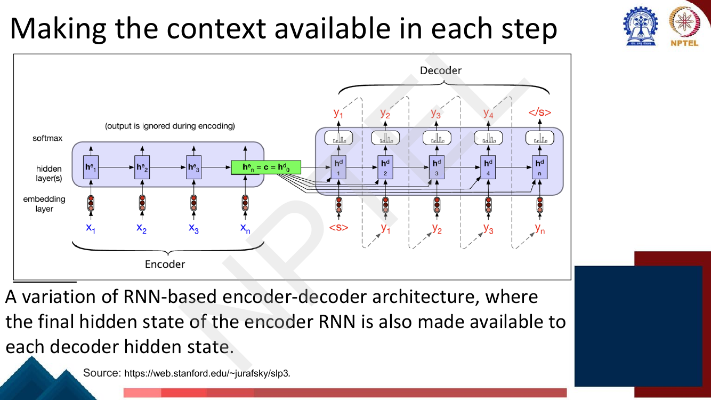

# Lec 18 — RNN for Sequence to Sequence, and Attention

> **Source:** `Week4.pdf` pp. 57–81 · **Week 4** · **Playlist:** Lec 18
> **Prereqs:** [Lec 16 — RNN Language Models](16-rnn-language-models.md), [Lec 17 — RNN Applications](17-rnn-applications.md)
> **Feeds into:** [Lec 19 — Decoding Strategies](19-decoding-strategies.md), [Lec 21 — Intro to Transformers](../week-05/21-intro-to-transformers.md)

## Why this lecture exists

Every RNN architecture you have met so far produces exactly one output per input token, or one output
for the whole sequence. Neither shape can translate. "Il convient de noter" has four words; "It should
be noted that" has five — and they do not line up in order. Translation needs a model that reads a
sequence of one length and writes a sequence of a *different* length, in a *different* order.

This lecture builds that model: the encoder–decoder, or sequence-to-sequence, architecture. It then
immediately finds the flaw in it. The encoder squeezes the entire source sentence into one
fixed-length vector, and the decoder sees nothing else. The fix is **attention**, and attention is the
single most consequential idea in this course — Lectures 21–24 take this lecture's mechanism, throw
away the RNN around it, and get the Transformer.

## The ideas

### Machine translation is not a sequence-labeling problem

**Machine translation (MT)** is the task of translating a sentence $x$ in a **source language** into a
sentence $y$ in a **target language**.


*Fig. — The deck's running illustration. Count the tokens on each side, and notice that "partout" (everywhere) sits third-from-last in the French but fourth-from-last in the English. Page 61 of `Week4.pdf`.*

[Lec 17](17-rnn-applications.md) taught **sequence labeling**: one tag per token, emitted at the token's
own position. MT breaks that shape in two independent ways, and you should be able to state both:

1. **The lengths differ.** $n_x \neq n_y$ in general, and you do not know $n_y$ in advance — the model
   must decide when to stop.
2. **The alignment is not monotonic.** The deck's other example: English "the green witch arrived"
   becomes Spanish "llegó la bruja verde", which glossed word-by-word is "arrived the witch green".
   The verb moves from last to first and the adjective moves from before the noun to after it. A
   sequence labeler, which emits output $t$ while looking at input $t$, cannot express that
   reordering at all.

So you need an architecture whose output positions are decoupled from its input positions. That is
exactly what the next section provides.

### Sequence to sequence is versatile

Before the architecture, the motivation. The deck's page by this name makes the point that **many NLP
tasks can be phrased as sequence-to-sequence**, and lists:

| Task | Source sequence | Target sequence |
|---|---|---|
| Machine translation | sentence in language A | sentence in language B |
| **Summarization** | long text | short text |
| **Dialogue** | previous utterances | next utterance |

Those are the two the slide names besides MT, and they are the two to reproduce if asked. The framing
matters more than the list: once you have one architecture that maps an arbitrary sequence to an
arbitrary sequence, you have a *general-purpose* model of NLP, and the task becomes a question of what
you put on each side. This is the idea that T5 later pushes to its limit
([Lec 28](../week-06/28-span-tasks-t5-bart.md)).

### The encoder–decoder architecture


*Fig. — The deck's own statement of the innovation, in the box at the bottom. Everything else on the slide is machinery; that one line is the reason the architecture exists. Page 63.*

The deck lists **three components**, and the three-way split is MCQ-shaped:


*Fig. — Note the deck's explicit claim that encoders and decoders "can be realized by any kind of sequence architecture" — LSTMs, CNNs and Transformers are all named. The encoder–decoder is a **pattern**, not a specific network. Page 65.*

1. An **encoder** that reads the input $x_1 \ldots x_n$ and produces contextualised representations
   $\mathbf{h}^e_1 \ldots \mathbf{h}^e_n$.
2. A **context vector** $\mathbf{c}$, a function of those states, which "conveys the essence of the
   input to the decoder".
3. A **decoder** that accepts $\mathbf{c}$ and generates an arbitrary-length sequence of hidden states
   $\mathbf{h}^d_1 \ldots \mathbf{h}^d_m$, from which outputs $y_1 \ldots y_m$ are read off.

In the basic RNN version, the encoder is a **many-to-one** RNN: it runs the recurrence
([Lec 16](16-rnn-language-models.md)) over the source and the per-step outputs are thrown away.

$$\mathbf{h}^e_t = \tanh\!\left(\mathbf{W}_{xh}\,\mathbf{e}_t + \mathbf{W}_{hh}\,\mathbf{h}^e_{t-1} + \mathbf{b}_h\right), \qquad t = 1 \ldots n$$

$$\mathbf{c} = \mathbf{h}^e_n$$

The context is just the **final** encoder hidden state. (In practice the encoder is an LSTM or
bidirectional LSTM, not a vanilla RNN — see [Lec 20](20-gru-and-lstm.md) for the cell and
[Lec 17](17-rnn-applications.md) for bidirectionality. Nothing in this chapter changes if you swap the
cell.)

The decoder is a **one-to-many** RNN, initialised from that context and conditioned on what it has
already written:

$$\mathbf{h}^d_0 = \mathbf{c}, \qquad \mathbf{h}^d_i = \tanh\!\left(\mathbf{W}^d_{xh}\,\mathbf{e}(\hat{y}_{i-1}) + \mathbf{W}^d_{hh}\,\mathbf{h}^d_{i-1} + \mathbf{b}^d_h\right)$$

$$\hat{\mathbf{y}}_i = \operatorname{softmax}\!\left(\mathbf{W}_{ho}\,\mathbf{h}^d_i + \mathbf{b}_o\right) \in \mathbb{R}^{|V_{\text{tgt}}|}$$

Generation starts from a `<s>` separator token and stops when the decoder emits `</s>`. That stopping
rule is how $n_y$ gets decided — the model chooses its own output length.


*Fig. — The whole thing is drawn as **one** RNN: source and target are concatenated with a separator between them, and "output of source is ignored" during the encoding half. The dashed feedback arrows are the model consuming its own predictions — that is inference, not training. Page 67.*

### The machine translation objective

With $x$ the source and $y$ the target, an encoder–decoder computes

$$p(y \mid x) = p(y_1 \mid x)\, p(y_2 \mid y_1, x)\, p(y_3 \mid y_1, y_2, x) \cdots p(y_m \mid y_1, \ldots, y_{m-1}, x) = \prod_{i=1}^{m} p(y_i \mid y_{<i},\, x)$$

The deck's name for this is worth memorising exactly: it is a **conditional language model**. It is a
language model over the target language ([Lec 16](16-rnn-language-models.md)) — same chain rule, same
left-to-right factorisation, same softmax — with one extra thing conditioned on, the source sentence
$x$. Everything you know about language modelling transfers; the conditioning is the only new part.

Training maximises $\log p(y \mid x)$ over sentence pairs, which is the same as minimising the
**average per-token cross-entropy**:

$$\mathcal{L} = \frac{1}{T}\sum_{i=1}^{T} \mathcal{L}_i, \qquad \mathcal{L}_i = -\log P(y_i)$$

where $P(y_i)$ is the probability the decoder's softmax assigned to the *gold* target token at
position $i$. Note the $\frac{1}{T}$: the deck averages over target tokens, so the loss does not grow
with sentence length.

### Teacher forcing


*Fig. — Compare the decoder inputs on this page with the dashed feedback arrows on page 67. At training time the input row is **gold**; at inference it is the model's own output. That difference is the whole of teacher forcing, and the whole of exposure bias. Page 68.*

At step $i$ the decoder needs a previous target token to condition on. There are two choices:

- Feed its **own prediction** $\hat{y}_{i-1}$ — what happens at test time, because there is nothing
  else available.
- Feed the **true** token $y_{i-1}$ from the training data — this is **teacher forcing**.

Training uses teacher forcing. The deck's phrasing: "we use teacher forcing to force each input to the
correct gold value for training."

**Why.** Early in training the decoder's predictions are garbage. If you feed them back, one wrong
token at position 2 corrupts every position after it, the gradient signal at positions 3, 4, 5… is
about recovering from your own mistake rather than about translating, and training is slow and
unstable. Teacher forcing puts the decoder back on the correct path at every step, so each position's
loss measures one thing only: *given a correct prefix, did you predict the next word?* It also means
all $T$ decoder steps can be computed from known inputs, which makes training parallelisable across
positions. Convergence is faster and far more stable.

**The cost: exposure bias.** The model is only ever *exposed* to gold prefixes during training, but at
test time it must consume its own output. The moment it makes a mistake it is in a state it has never
been trained on, and errors compound. This train/test mismatch is called **exposure bias**, and it is
the standard criticism of teacher forcing. Mitigations exist — scheduled sampling, which anneals from
gold tokens to model samples during training — but the deck does not cover them, and in practice the
problem is handled at decoding time by search rather than at training time
([Lec 19](19-decoding-strategies.md)).

One thing teacher forcing does *not* change: the loss is backpropagated through the decoder parameters
**and the encoder parameters**. The deck says so explicitly. The whole model is trained end to end.

### Making the context available at each step

In the basic version, $\mathbf{c}$ is used once, to initialise $\mathbf{h}^d_0$. As the decoder runs,
that information has to survive in the hidden state through every recurrent update — and it decays.
By the time the decoder is writing the eighth target word, the source may be largely gone.


*Fig. — The fan of arrows is the entire modification. Note the equality the slide writes on the green box: $\mathbf{h}^e_n = \mathbf{c} = \mathbf{h}^d_0$ — the same vector plays three roles. Page 69.*

The fix is cheap: feed $\mathbf{c}$ into **every** decoder step, not only the first.

$$\mathbf{h}^d_i = g\!\left(\hat{y}_{i-1},\, \mathbf{h}^d_{i-1},\, \mathbf{c}\right)$$

Concretely, concatenate $\mathbf{c}$ onto the decoder's input at every position, which widens
$\mathbf{W}^d_{xh}$ from $d_h \times d_e$ to $d_h \times (d_e + d_c)$. The context no longer has to be
*remembered*; it is *re-supplied*. Hold on to this slide — attention is this idea with one change, and
the change is that $\mathbf{c}$ stops being the same vector at every step.

### Multi-layer deep encoder–decoder networks


*Fig. — Depth is **stacked vertically** at each time step, not added along time. Note the "Feeding in last word" label on the right: the decoder's output at step $i$ is its input at step $i{+}1$. Page 70.*

Real NMT systems stack RNN layers. The rule is in the deck's blue box: **the hidden states from RNN
layer $i$ are the inputs to RNN layer $i{+}1$.** Layer 1 reads embeddings; layer 2 reads layer 1's
hidden states; and so on. The context passed to the decoder is the final state of the *top* encoder
layer (and in practice each decoder layer is initialised from the corresponding encoder layer).

Depth lets lower layers capture local morphology and syntax while upper layers capture longer-range
semantics. Two to four layers was the practical sweet spot for RNN-based NMT; beyond that, training
became unstable without residual connections.

### NMT: the first big success story of NLP deep learning

The deck's framing, which is memorable and examinable:

| Year | Event |
|---|---|
| **2014** | First seq2seq paper published (Sutskever et al. 2014) — NMT is a "fringe research attempt" |
| **2016** | Google Translate switches from SMT (statistical MT) to NMT — NMT is the "leading standard method" |
| **2018** | "everyone had" switched |

Two years from fringe to standard. The slide lists the companies that followed: Microsoft, SYSTRAN,
Google, Facebook, Baidu, NetEase, Tencent, Sogou. The reason this is the deck's chosen success story
is that NMT replaced a decades-old, hand-engineered pipeline (phrase tables, alignment models,
separate language models, a reranker) with one jointly-trained network — and beat it.

### The encoder–decoder bottleneck


*Fig. — The green circle is the chapter's hinge. Everything the decoder will ever know about the source passes through those few hundred numbers. Page 72.*

State the problem exactly as the deck does, because the phrasing is examinable:

> The context vector $\mathbf{h}_n$ is the hidden state of the last time step of the source text. It
> acts as a **bottleneck**, as it has to represent absolutely everything about the meaning of the
> source text, as this is the only thing the decoder knows about the source.

Three consequences follow, and you should be able to produce all three:

1. **Fixed capacity, variable demand.** $\mathbf{c}$ has $d_h$ numbers whether the source is 3 words
   or 50. The information the decoder needs grows with sentence length; the channel it arrives through
   does not. Quantified in [N7](#n7-quantifying-the-bottleneck) below.
2. **Recency bias.** $\mathbf{c}$ is the *last* hidden state, so it is computed from the last word most
   directly and from the first word through $n$ recurrent updates. Early source words are
   systematically under-represented. (This is also why Sutskever et al. famously fed the source
   sentence in **reversed** order — it shortens the path from the first source word to the first
   target word.)
3. **Performance degrades with length.** The longer the sentence, the worse the translation. This was
   measured and is the headline motivation in Bahdanau et al.'s attention paper.

The clean way to see it: the decoder has to reconstruct a 20-word sentence's worth of meaning from one
vector, and gradient descent has to teach a recurrent net to pack it there. It is a compression
problem nobody asked for.

### Attention

The fix is to stop compressing. Keep **all** the encoder hidden states $\mathbf{h}^e_1 \ldots
\mathbf{h}^e_n$, and let the decoder look at whichever ones it needs, at each step.


*Fig. — Read it right to left: the decoder's **previous** state $\mathbf{h}^d_{i-1}$ reaches back (dashed), scores every encoder state, those scores become weights $\alpha_{ij}$ summing to 1 (here .4 + .3 + .1 + .2), and the weighted sum is $\mathbf{c}_i$. Page 73.*


*Fig. — Compare the subscripts on $\mathbf{c}$ here with page 69's single $\mathbf{c}$. **That subscript is attention.** Page 74.*

The deck's two sentences are the definition:

> The attention mechanism allows each hidden state of the decoder to see a **different, dynamic
> context**, which is a function of **all** the encoder states. The context vector $\mathbf{c}_i$ is
> generated **anew** with each decoding step $i$.

and the decoder recurrence becomes

$$\mathbf{h}^d_i = g\!\left(\hat{y}_{i-1},\, \mathbf{h}^d_{i-1},\, \mathbf{c}_i\right)$$

which is literally page 69's equation with $\mathbf{c} \rightarrow \mathbf{c}_i$.

#### Attention: in equations

![Slide titled "Attention: In Equations", boxed "Computing c_i": compute how much to focus on each encoder state by seeing how relevant it is to the decoder state captured in h^d_{i-1}, give it a score; simplest scoring mechanism is dot-product attention, score(h^d_{i-1}, h^e_j) = h^d_{i-1} · h^e_j; normalize these scores using softmax to create a vector of weights alpha_ij = softmax(score(h^d_{i-1}, h^e_j)); a fixed-length context vector is created for the current decoder state, c_i = sum_j alpha_ij h^e_j](../../assets/pages/lec18/p-075.png)
*Fig. — The page the exam is set from. Note two details the diagrams hide: the score is taken against $\mathbf{h}^d_{i-1}$, the **previous** decoder state (you cannot use $\mathbf{h}^d_i$, because $\mathbf{c}_i$ is an input to computing it), and the softmax runs over $j$, the encoder index. Page 75.*

Three steps. Learn them in this order.

**Step 1 — score.** For decoder step $i$, measure how relevant each encoder state $\mathbf{h}^e_j$ is
to what the decoder is about to do, as captured in $\mathbf{h}^d_{i-1}$. These numbers are called
**alignment scores** or **energies**. The deck's "simplest scoring mechanism" is **dot-product
attention**:

$$\operatorname{score}\!\left(\mathbf{h}^d_{i-1}, \mathbf{h}^e_j\right) = \mathbf{h}^d_{i-1} \cdot \mathbf{h}^e_j$$

A dot product is large when the two vectors point the same way, so it is a similarity. It has **no
parameters at all** — which is why it requires $\mathbf{h}^d$ and $\mathbf{h}^e$ to have the same
dimension and to live in a compatible space.

**Step 2 — normalise.** Scores are unbounded reals; you want weights. Softmax over the encoder
positions:

$$\alpha_{ij} = \operatorname{softmax}\!\left(\operatorname{score}\!\left(\mathbf{h}^d_{i-1}, \mathbf{h}^e_j\right)\right) = \frac{\exp\!\left(\mathbf{h}^d_{i-1} \cdot \mathbf{h}^e_j\right)}{\sum_{k=1}^{n} \exp\!\left(\mathbf{h}^d_{i-1} \cdot \mathbf{h}^e_k\right)}$$

$$\alpha_{ij} \ge 0, \qquad \sum_{j=1}^{n} \alpha_{ij} = 1 \quad \text{for every } i$$

The sum is over $j$ — the **source** positions — for a fixed decoder step $i$. Each row of the
alignment matrix sums to 1; the columns do not. This is the most-missed detail on the page.

**Step 3 — combine.** The context is the weighted average of the encoder states:

$$\boxed{\;\mathbf{c}_i = \sum_{j=1}^{n} \alpha_{ij}\, \mathbf{h}^e_j\;}$$

Because the $\alpha_{ij}$ sum to 1, $\mathbf{c}_i$ is a **convex combination** of the encoder states —
it lives inside their convex hull and has the same dimension as a single encoder state. The deck calls
it "a fixed-length context vector… for the current decoder state": fixed-length in $d_h$, but *not*
fixed in content, because it is recomputed from scratch at every $i$.

**Step 4 — use it.** $\mathbf{c}_i$ is fed into the decoder alongside the previous output and previous
state, $\mathbf{h}^d_i = g(\hat{y}_{i-1}, \mathbf{h}^d_{i-1}, \mathbf{c}_i)$, typically by
concatenation. Everything is differentiable, so attention trains end to end with the rest of the model
by ordinary backpropagation — there is no separate alignment objective.

**Other scoring functions.** The deck gives only the dot product. Two variants you should recognise:
the **bilinear / "general"** score $\mathbf{h}^{d\top}_{i-1}\mathbf{W}_a\mathbf{h}^e_j$, which inserts
a learned matrix so the two spaces need not match; and **additive (Bahdanau) attention**
$\mathbf{v}_a^\top\tanh\!\left(\mathbf{W}_a[\mathbf{h}^d_{i-1};\mathbf{h}^e_j]\right)$, which is a
small one-hidden-layer network and was the original 2015 formulation. All three plug into the same
Steps 2–4. In [Lec 22](../week-05/22-self-attention-and-multihead.md) the dot-product form gets
generalised into the Transformer's attention; everything you learn here is the special case that
generalisation starts from.

#### Why attention fixes the bottleneck

Four reasons, and the exam wants the first two:

- **No fixed-size compression.** The decoder reads all $n$ encoder states directly. The information
  available scales with $n$ instead of being pinned at $d_h$ — $n \times d_h$ numbers rather than
  $d_h$.
- **Dynamic, per-step relevance.** Different target words need different source words; $\mathbf{c}_i$
  changes with $i$, so each one can be about a different part of the source.
- **Short gradient paths.** The path from source position $j$ to output position $i$ is **one
  attention edge** — $O(1)$ — instead of $O(n)$ recurrent steps. Gradients reach early source words
  without passing through $n$ multiplications, which is the vanishing-gradient problem
  ([Lec 20](20-gru-and-lstm.md)) being sidestepped rather than mitigated.
- **No recency bias.** $\mathbf{h}^e_1$ is as reachable as $\mathbf{h}^e_n$.

The third point is the one Lec 21 picks up: if an $O(1)$ path is so valuable, why keep the recurrence
at all?

#### Attention is quite helpful

The deck's results page makes two claims:

**Attention improves NMT performance** — "it is useful to allow decoder to focus on certain parts of
the source". The gain is largest on long sentences, exactly where the bottleneck bit hardest.

**Attention provides some interpretability** — by inspecting the attention distribution you can see
what the decoder was focusing on, and **"we get alignment for free even if we never explicitly trained
an alignment system"**. This is historically pointed: classical statistical MT had a whole separate
*word alignment* stage (IBM Models, GIZA++) trained with its own objective. Attention produces a soft
alignment as a by-product of translating.


*Fig. — Brightness is $\alpha_{ij}$. The near-diagonal says English and French mostly align in order; the small **reversed block** where "European Economic Area" becomes "zone économique européenne" is the non-monotonic alignment from the first section, learned without supervision. Page 78.*

The deck follows with a second heatmap from *A Neural Attention Model for Sentence Summarization*
(EMNLP 2015), where the source is a news sentence and the target is its headline — the same mechanism,
a different task, which is the "versatile" point made concrete.

**One caution.** "Attention gives interpretability" is a weaker claim than it looks. Attention weights
tell you what the model *read*, not necessarily what it *used*, and there is a research literature
arguing attention is not a faithful explanation. The deck's own hedge — "*some* interpretability" — is
well chosen.

#### What this chapter does not cover

How the decoder turns $\hat{\mathbf{y}}_i$ into an actual token — greedy choice, beam search,
sampling — is [Lec 19](19-decoding-strategies.md)'s. How translations are scored (BLEU) is
[Lec 35](../week-07/35-text-summarization.md)'s. And the generalisation of attention into queries,
keys and values is [Lec 22](../week-05/22-self-attention-and-multihead.md)'s — this chapter stops at
the RNN form deliberately. You have also met the same architecture from the vision side in
[the companion course's GRU/seq2seq/attention chapter](../../../GenAIforCV/notes/week-05/19-gru-seq2seq-attention.md);
the mechanics are identical, the notation there is Bahdanau's additive score, and this deck's exam will
be set on the dot-product form above.

## Worked numericals

### N1. Bi-LSTM NER parameter count (deck's "Try this problem", page 59)
**Given:** a Bi-LSTM tagger for NER. 3 entity types {PER, LOC, ORG} with the **BIO** scheme. Word
embeddings are 300-dimensional. Forward LSTM hidden size 200; backward LSTM hidden size 100. **Ignore
bias terms.** Word embeddings are *not* being trained here (that is page 60).
**Find:** the total number of trainable parameters.

1. **How many output classes?** BIO ([Lec 17](17-rnn-applications.md)) gives a `B-` and an `I-` tag per
   entity type, plus a single `O`. So $2 \times 3 + 1 = \mathbf{7}$ tags. *This is the trap: not 3, not
   6.*
2. **LSTM parameter formula.** An LSTM has four gated computations (forget, input, output, candidate),
   each with an input matrix $d_h \times d_{\text{in}}$ and a recurrent matrix $d_h \times d_h$
   ([Lec 20](20-gru-and-lstm.md) derives the cell). Ignoring biases:
   $$\#\text{params} = 4\left(d_h d_{\text{in}} + d_h^2\right)$$
3. **Forward LSTM** ($d_h = 200$, $d_{\text{in}} = 300$):
   $4(200 \times 300 + 200 \times 200) = 4(60{,}000 + 40{,}000) = 4 \times 100{,}000 = \mathbf{400{,}000}$.
4. **Backward LSTM** ($d_h = 100$, $d_{\text{in}} = 300$):
   $4(100 \times 300 + 100 \times 100) = 4(30{,}000 + 10{,}000) = 4 \times 40{,}000 = \mathbf{160{,}000}$.
5. **Output layer.** The two directions are concatenated, giving $200 + 100 = 300$ features per token,
   projected to 7 tags: $300 \times 7 = \mathbf{2{,}100}$.
6. **Total:** $400{,}000 + 160{,}000 + 2{,}100 = 562{,}100$.

**Answer:** **562,100 parameters.** The deck gives no solution, so this is checked only against the
formula; the structure $4(d_h d_{\text{in}} + d_h^2)$ per direction plus $(d_f + d_b)\times|{\text{tags}}|$
is what to reproduce. If a variant of this question includes biases, add $4 d_h$ per LSTM and
$|\text{tags}|$ for the output layer: $+800 + 400 + 7 = +1{,}207$, giving 563,307.

### N2. Adding trainable embeddings (deck's "Try this problem contd…", page 60)
**Given:** the same model, now also training word embeddings for a vocabulary of 40,000.
**Find:** the number of *additional* parameters.

1. An embedding table is a $|V| \times d_e$ lookup matrix — one row of $d_e$ numbers per vocabulary
   entry, and every entry is a free parameter.
2. $40{,}000 \times 300 = 12{,}000{,}000$.

**Answer:** **12,000,000 additional parameters**, for a grand total of
$12{,}000{,}000 + 562{,}100 = \mathbf{12{,}562{,}100}$. Notice the proportion: the embedding table is
**95.5%** of the model. This is the standard shape of an NLP model's parameter budget and is exactly
why fastText-style subword vocabularies ([Lec 14](../week-03/14-fasttext-and-beyond-words.md)) and
frozen pretrained embeddings matter.

### N3. Dot-product attention, by hand (deck's "Try this problem", page 76)
**Given:** encoder hidden states (2-dimensional)
$\mathbf{h}^e_1 = [1,-1]$, $\mathbf{h}^e_2 = [-1,1]$, $\mathbf{h}^e_3 = [0,-1]$,
$\mathbf{h}^e_4 = [-1,0]$; decoder state $\mathbf{h}^d = [-1,-1]$. Dot-product attention.
**Find:** the context vector supplied to the next decoder hidden state.

1. **Scores** $= \mathbf{h}^d \cdot \mathbf{h}^e_j$:
   - $s_1 = (1)(-1) + (-1)(-1) = -1 + 1 = 0$
   - $s_2 = (-1)(-1) + (1)(-1) = 1 - 1 = 0$
   - $s_3 = (0)(-1) + (-1)(-1) = 0 + 1 = 1$
   - $s_4 = (-1)(-1) + (0)(-1) = 1 + 0 = 1$

   So $\mathbf{s} = [0, 0, 1, 1]$.
2. **Exponentiate:** $e^0 = 1$, $e^0 = 1$, $e^1 = 2.718282$, $e^1 = 2.718282$.
3. **Normaliser:** $1 + 1 + 2.718282 + 2.718282 = 7.436564$ (exactly $2 + 2e$).
4. **Weights:**
   - $\alpha_1 = \alpha_2 = \dfrac{1}{2+2e} = \dfrac{1}{7.436564} = 0.134471$
   - $\alpha_3 = \alpha_4 = \dfrac{e}{2+2e} = \dfrac{2.718282}{7.436564} = 0.365529$
5. **Check they sum to 1:** $2(0.134471) + 2(0.365529) = 0.268942 + 0.731058 = 1.000000$ ✓
6. **Context vector** $\mathbf{c} = \sum_j \alpha_j \mathbf{h}^e_j$, component by component:
   - $x: \;0.134471(1) + 0.134471(-1) + 0.365529(0) + 0.365529(-1) = 0 - 0.365529 = -0.365529$
   - $y: \;0.134471(-1) + 0.134471(1) + 0.365529(-1) + 0.365529(0) = 0 - 0.365529 = -0.365529$
7. Sanity: $\mathbf{h}^e_1$ and $\mathbf{h}^e_2$ are exact opposites and carry equal weight, so they
   cancel completely. What survives is $0.365529\left([0,-1] + [-1,0]\right) = 0.365529\,[-1,-1]$.

**Answer:** $\mathbf{c} = [-0.3655,\, -0.3655]$, exactly $-\frac{e}{2+2e}[1,1]$. The deck gives no
solution; this is verified independently by the NumPy block below. Note the result points the *same
way* as the decoder state $[-1,-1]$ — attention pulled the context toward what the decoder was looking
for, which is the mechanism working.

### N4. A full attention step from given alignment scores
**Given:** four encoder states (3-dimensional)
$\mathbf{h}^e_1 = [1,0,2]$, $\mathbf{h}^e_2 = [0,1,1]$, $\mathbf{h}^e_3 = [2,1,0]$,
$\mathbf{h}^e_4 = [1,1,1]$, and alignment scores at decoder step $t$ already computed as
$\mathbf{s} = [2, 1, 1, 0]$.
**Find:** $\alpha_{t,j}$ for all $j$, verify they sum to 1, and compute $\mathbf{c}_t$.

1. **Exponentials:** $e^2 = 7.389056$, $e^1 = 2.718282$, $e^1 = 2.718282$, $e^0 = 1.000000$.
2. **Sum:** $7.389056 + 2.718282 + 2.718282 + 1.000000 = 13.825620$.
3. **Weights:**
   - $\alpha_{t,1} = 7.389056/13.825620 = 0.534447$
   - $\alpha_{t,2} = 2.718282/13.825620 = 0.196612$
   - $\alpha_{t,3} = 2.718282/13.825620 = 0.196612$
   - $\alpha_{t,4} = 1.000000/13.825620 = 0.072330$
4. **Sum check:** $0.534447 + 0.196612 + 0.196612 + 0.072330 = 1.000001$ (1.000000 up to rounding) ✓
   Note that a score gap of 1 produced a weight ratio of $e \approx 2.72$, and a gap of 2 a ratio of
   $e^2 \approx 7.39$ — softmax is exponentially sharp in the score *differences*, and only in the
   differences (adding a constant to every score changes nothing).
5. **Context, component by component:**
   - $c_1 = 0.534447(1) + 0.196612(0) + 0.196612(2) + 0.072330(1) = 0.534447 + 0 + 0.393224 + 0.072330 = 1.000001$
   - $c_2 = 0.534447(0) + 0.196612(1) + 0.196612(1) + 0.072330(1) = 0 + 0.196612 + 0.196612 + 0.072330 = 0.465554$
   - $c_3 = 0.534447(2) + 0.196612(1) + 0.196612(0) + 0.072330(1) = 1.068894 + 0.196612 + 0 + 0.072330 = 1.337836$

**Answer:** $\boldsymbol\alpha_t = [0.5344,\,0.1966,\,0.1966,\,0.0723]$,
$\mathbf{c}_t = [1.0000,\, 0.4656,\, 1.3378]$. Sanity check: every component of $\mathbf{c}_t$ lies
between the smallest and largest corresponding component of the $\mathbf{h}^e_j$ (e.g. $c_3$ is between
0 and 2), as it must for a convex combination.

### N5. The context vector is recomputed at every step
**Given:** the same four encoder states as N4 (encoders run once; their states never change). At
decoder step $t{+}1$ the decoder state has moved on and the scores are now
$\mathbf{s}' = [-1, 2, 0, 1]$.
**Find:** $\boldsymbol\alpha_{t+1}$ and $\mathbf{c}_{t+1}$, and compare with step $t$.

1. **Exponentials:** $e^{-1} = 0.367879$, $e^{2} = 7.389056$, $e^{0} = 1.000000$, $e^{1} = 2.718282$.
2. **Sum:** $0.367879 + 7.389056 + 1.000000 + 2.718282 = 11.475217$.
3. **Weights:** $\alpha_{t+1,1} = 0.032059$, $\alpha_{t+1,2} = 0.643914$, $\alpha_{t+1,3} = 0.087144$,
   $\alpha_{t+1,4} = 0.236883$. Sum $= 1.000000$ ✓
4. **Context:**
   - $c'_1 = 0.032059(1) + 0.643914(0) + 0.087144(2) + 0.236883(1) = 0.032059 + 0.174288 + 0.236883 = 0.443230$
   - $c'_2 = 0 + 0.643914 + 0.087144 + 0.236883 = 0.967941$
   - $c'_3 = 0.064118 + 0.643914 + 0 + 0.236883 = 0.944915$
5. **Compare:**

| | $\mathbf{h}^e_1$ | $\mathbf{h}^e_2$ | $\mathbf{h}^e_3$ | $\mathbf{h}^e_4$ | context |
|---|---|---|---|---|---|
| step $t$ | **0.5344** | 0.1966 | 0.1966 | 0.0723 | $[1.0000, 0.4656, 1.3378]$ |
| step $t{+}1$ | 0.0321 | **0.6439** | 0.0871 | 0.2369 | $[0.4432, 0.9679, 0.9449]$ |

**Answer:** $\mathbf{c}_{t+1} = [0.4432,\, 0.9679,\, 0.9449]$, differing from $\mathbf{c}_t$ by
$[0.5568,\, 0.5024,\, 0.3929]$ component-wise. **The encoder states did not change; only the weights
did.** Attention moved its focus from source position 1 to source position 2 between consecutive
output words. In the no-attention model of page 69, both steps would have received the identical
vector $\mathbf{c} = \mathbf{h}^e_4$ — that is precisely what the bottleneck is.

### N6. Parameter count of an RNN encoder–decoder
**Given:** source vocabulary 30,000, target vocabulary 30,000, embeddings $d_e = 300$ on both sides,
single-layer vanilla-RNN encoder and decoder with $d_h = 512$, biases **included**, no weight tying.
**Find:** the total parameter count, and where the parameters live.

1. **Source embedding table:** $30{,}000 \times 300 = 9{,}000{,}000$.
2. **Encoder RNN:** $\mathbf{W}_{xh}$ is $512 \times 300 = 153{,}600$; $\mathbf{W}_{hh}$ is
   $512 \times 512 = 262{,}144$; bias $\mathbf{b}_h$ is 512.
   Total $= 153{,}600 + 262{,}144 + 512 = 416{,}256$.
3. **Target embedding table:** $30{,}000 \times 300 = 9{,}000{,}000$.
4. **Decoder RNN:** identical shape $= 416{,}256$.
5. **Output projection:** $512 \times 30{,}000 = 15{,}360{,}000$, plus 30,000 biases
   $= 15{,}390{,}000$.
6. **Total:** $9{,}000{,}000 + 416{,}256 + 9{,}000{,}000 + 416{,}256 + 15{,}390{,}000 = 34{,}222{,}512$.

**Answer:** **34,222,512 parameters.** The recurrent core — the part that does the actual sequence
modelling — is $832{,}512$, or **2.4%** of the model; embeddings and the output softmax are the other
97.6%. Two follow-ups worth knowing: adding **dot-product attention costs zero extra parameters**
(it has none), but feeding $\mathbf{c}_i$ in by concatenation widens the decoder's input matrix from
$512 \times 300$ to $512 \times 812$, adding $512 \times 512 = 262{,}144$. Swapping the vanilla RNNs
for LSTMs multiplies items 2 and 4 by 4, adding $3 \times 832{,}512 = 2{,}497{,}536$.

### N7. Quantifying the bottleneck
**Given:** a 512-dimensional float32 context vector, a 50-token source sentence, vocabulary 50,000.
**Find:** how much the context must carry versus how much it can.

1. **What the source actually contains.** Identifying which of 50,000 words sits at each of 50
   positions takes $\log_2 50{,}000 = 15.61$ bits per token, so
   $50 \times 15.61 = 780.5$ bits for the exact token sequence.
2. **What the vector nominally holds.** $512 \times 32 = 16{,}384$ bits of float32 storage.
3. **So the naive information-theoretic argument fails** — 16,384 > 780.5, with room to spare. Be
   honest about this: the bottleneck is **not** that 512 floats are too few bits. State the real
   argument instead:
4. **The real argument is scaling.** The context has $d_h = 512$ numbers *whatever* $n$ is. With
   attention the decoder reads $n \times d_h = 50 \times 512 = 25{,}600$ numbers — **50× more**, and
   growing linearly with sentence length instead of staying constant. At $n = 5$ the fixed vector is
   fine; at $n = 50$ it is being asked to do ten times the work with the same capacity. That is why
   the measured degradation is *with length*.
5. **And the real constraint is learnability.** Those 16,384 bits are only usable if gradient descent
   can teach a recurrent network to write a retrievable code into them and teach the decoder to read
   it — through $n$ sequential $\tanh$ updates, each of which can overwrite what came before. The
   empirical capacity is far below the nominal capacity.

**Answer:** fixed context $= 512$ numbers regardless of $n$; attention supplies $512n$, here
**25,600 — a 50× increase**, and $O(n)$ rather than $O(1)$. The bits-counting argument gives
780.5 bits needed versus 16,384 available and therefore does **not** explain the bottleneck; quote the
scaling and learnability arguments instead if asked to justify it.

## Code

```python
import numpy as np

def attention(h_enc, h_dec, score="dot", W=None):
    """h_enc: (T, d) encoder states, one per row.  h_dec: (d,) one decoder state.
    Returns alignment scores, attention weights alpha, and the context vector."""
    if score == "dot":
        e = h_enc @ h_dec                      # score(h^d_{i-1}, h^e_j) = h^d . h^e
    else:                                      # bilinear / 'general' variant
        e = h_enc @ (W @ h_dec)
    e = e - e.max()                            # shift-invariance: softmax is unchanged
    alpha = np.exp(e) / np.exp(e).sum()        # weights, sum to 1 over encoder positions
    c = alpha @ h_enc                          # c_i = sum_j alpha_ij h^e_j
    return e, alpha, c

# ---- N3: the deck's own problem, Week4.pdf page 76 ----------------------
H = np.array([[1., -1.], [-1., 1.], [0., -1.], [-1., 0.]])   # 4 encoder states, 2-d
d = np.array([-1., -1.])                                      # decoder state
raw = H @ d
_, alpha, c = attention(H, d)
print("raw dot-product scores :", raw)
print("attention weights      :", np.round(alpha, 6), " sum =", round(alpha.sum(), 10))
print("context vector         :", np.round(c, 6))

# ---- N4 / N5: context is recomputed at every decoder step ---------------
# 4 encoder states (3-d), held fixed; two successive decoder steps with
# different alignment scores supplied directly.
Henc = np.array([[1., 0., 2.],
                 [0., 1., 1.],
                 [2., 1., 0.],
                 [1., 1., 1.]])
scores = np.array([[ 2., 1., 1., 0.],     # step t
                   [-1., 2., 0., 1.]])    # step t+1
A = np.exp(scores - scores.max(axis=1, keepdims=True))
A = A / A.sum(axis=1, keepdims=True)      # row-wise softmax -> alignment matrix
C = A @ Henc                              # one context vector per decoder step

np.set_printoptions(precision=4, suppress=True)
print("\nalignment matrix (rows = decoder steps, cols = encoder positions)")
print("          h1      h2      h3      h4     rowsum")
for i, row in enumerate(A):
    print(f"  step {i+1}  " + "  ".join(f"{a:.4f}" for a in row) + f"   {row.sum():.4f}")
print("\ncontext at step 1 :", C[0])
print("context at step 2 :", C[1])
print("they differ by    :", np.round(np.abs(C[0] - C[1]), 4))
```

Printed output:

```
raw dot-product scores : [0. 0. 1. 1.]
attention weights      : [0.134471 0.134471 0.365529 0.365529]  sum = 1.0
context vector         : [-0.365529 -0.365529]

alignment matrix (rows = decoder steps, cols = encoder positions)
          h1      h2      h3      h4     rowsum
  step 1  0.5344  0.1966  0.1966  0.0723   1.0000
  step 2  0.0321  0.6439  0.0871  0.2369   1.0000

context at step 1 : [1.     0.4656 1.3378]
context at step 2 : [0.4432 0.9679 0.9449]
they differ by    : [0.5568 0.5024 0.3929]
```

Three things to take from it. The page-76 answer reproduces N3 exactly. The alignment matrix's **rows**
sum to 1 and its columns do not — stack those rows for a whole target sentence and you have the
heatmap on page 78. And `e = e - e.max()` is the standard numerical-stability trick: softmax is
invariant to adding a constant to every score, and subtracting the max keeps every exponential in
$(0,1]$ so nothing overflows.

## Exam pack

### Must-memorise

| Item | Exactly this |
|---|---|
| Seq2seq innovation | the lengths $n_x$ and $n_y$ **can vary from each other** |
| Three components | **encoder**, **context vector**, **decoder** |
| Basic context vector | $\mathbf{c} = \mathbf{h}^e_n$, the **final** encoder hidden state |
| Encoder / decoder shape | encoder = many-to-one; decoder = one-to-many |
| MT objective | $p(y \mid x) = \prod_{i=1}^{m} p(y_i \mid y_1,\ldots,y_{i-1}, x)$ |
| Its name | **Conditional Language Model** |
| Training loss | $\mathcal{L} = \frac{1}{T}\sum_{i=1}^{T}\mathcal{L}_i$, $\;\mathcal{L}_i = -\log P(y_i)$ — average cross-entropy **per target word** |
| Teacher forcing | at training, feed the **gold** $y_{i-1}$ as the decoder's input, not the model's $\hat{y}_{i-1}$ |
| Its cost | **exposure bias** — the model never trains on its own (imperfect) prefixes |
| Context at every step | $\mathbf{h}^d_i = g(\hat{y}_{i-1}, \mathbf{h}^d_{i-1}, \mathbf{c})$ — same $\mathbf{c}$ each step |
| Multi-layer rule | hidden states from RNN layer $i$ are the **inputs** to RNN layer $i{+}1$ |
| Bottleneck | $\mathbf{c}$ must represent **absolutely everything** about the source; it is the **only** thing the decoder knows about it |
| Attention score (deck's) | $\operatorname{score}(\mathbf{h}^d_{i-1}, \mathbf{h}^e_j) = \mathbf{h}^d_{i-1}\cdot\mathbf{h}^e_j$ — **dot-product attention**, zero parameters |
| Attention weights | $\alpha_{ij} = \operatorname{softmax}_j\!\left(\operatorname{score}(\mathbf{h}^d_{i-1},\mathbf{h}^e_j)\right)$, $\;\sum_j \alpha_{ij} = 1$ |
| Context vector | $\mathbf{c}_i = \sum_j \alpha_{ij}\,\mathbf{h}^e_j$ — **generated anew at each decoding step $i$** |
| Decoder with attention | $\mathbf{h}^d_i = g(\hat{y}_{i-1}, \mathbf{h}^d_{i-1}, \mathbf{c}_i)$ |
| Two benefits | improves NMT performance; gives **alignment for free**, never explicitly trained |
| LSTM params (no bias) | $4\left(d_h d_{\text{in}} + d_h^2\right)$ per direction |
| BIO tag count | $2 \times (\text{\# entity types}) + 1$ |

### Numbers worth knowing

| Quantity | Value |
|---|---|
| First seq2seq paper | **2014**, Sutskever et al. |
| Google Translate SMT → NMT | **2016**; "by 2018 everyone had" |
| Companies on the NMT slide | Microsoft, SYSTRAN, Google, Facebook, Baidu, NetEase, Tencent, Sogou |
| Attention alignment figure | *Neural Machine Translation by Jointly Learning to Align and Translate*, **ICLR 2015** |
| Summarization attention figure | *A Neural Attention Model for Sentence Summarization*, **EMNLP 2015** |
| Deck's attention-weight example (p. 73) | $.4,\, .3,\, .1,\, .2$ — sums to 1 |
| Page-76 problem's answer | $\boldsymbol\alpha = [0.1345, 0.1345, 0.3655, 0.3655]$, $\mathbf{c} = [-0.3655, -0.3655]$ |
| Page-59 problem's answer | **562,100** parameters |
| Page-60 problem's answer | **+12,000,000** (total 12,562,100) |
| Tasks named as seq2seq | summarization, dialogue (plus MT) |
| Deck's MT example pair | "the green witch arrived" → "llegó la bruja verde" (gloss: "arrived the witch green") |

### Likely MCQ traps

- **"The context vector in attention is fixed."** Half right, and the half matters. It is fixed in
  *length* ($d_h$) but recomputed in *content* at every decoder step. The deck's own words: "generated
  anew with each decoding step $i$".
- **Softmaxing over the wrong index.** $\alpha_{ij}$ is normalised over $j$, the **encoder/source**
  positions, for a fixed decoder step $i$. Rows of the alignment matrix sum to 1; columns do not.
- **Scoring against $\mathbf{h}^d_i$ instead of $\mathbf{h}^d_{i-1}$.** The deck scores against the
  **previous** decoder state. It has to: $\mathbf{c}_i$ is an *input* to computing $\mathbf{h}^d_i$,
  so using $\mathbf{h}^d_i$ would be circular.
- **"Teacher forcing is used at test time."** No. Training only — at test time there are no gold
  tokens. The mismatch is exposure bias.
- **"Teacher forcing feeds the model's own prediction."** Backwards. It feeds the **gold** token; the
  *non*-teacher-forced alternative feeds the prediction.
- **"Attention adds many parameters."** Dot-product attention adds **none**. (The bilinear and
  additive variants do; the deck's version does not.)
- **Confusing "context available at each step" (p. 69) with attention (pp. 73–75).** Page 69 sends the
  **same single** $\mathbf{c}$ to every step; attention sends a **different** $\mathbf{c}_i$. Page 69
  does not solve the bottleneck — the same vector is still the only channel.
- **"The bottleneck is the decoder."** It is the **encoder's final hidden state** — the single vector
  between them.
- **BIO tag counting.** 3 entity types under BIO give **7** tags, not 3 and not 6. Forgetting `O` is
  the single most common slip on page 59's problem.
- **LSTM parameter count without the factor 4.** An LSTM has four gated computations; a vanilla RNN
  has one; a GRU has three. Using the RNN formula on an LSTM question loses the whole mark.
- **Concatenation sizes in a Bi-LSTM.** Forward 200 + backward 100 = **300** features into the output
  layer, not 200, and not $200 \times 100$.
- **"Attention weights are the model's explanation."** The deck says "*some* interpretability". They
  show what was read, not necessarily what drove the output.
- **Thinking seq2seq requires $n_x = n_y$.** That is the thing it was invented to break.
- **Writing the MT objective as $p(x \mid y)$.** Source is conditioned on, target is generated:
  $p(y \mid x)$.

### Self-test

1. Give two independent reasons machine translation cannot be done as sequence labeling.
2. Besides MT, which two tasks does the deck name as sequence-to-sequence?
3. Write $p(y\mid x)$ for an encoder–decoder and give the deck's name for the resulting model.
4. In the basic (non-attention) architecture, what exactly is the context vector?
5. What is teacher forcing, and name its cost.
6. Encoder hidden states $[2,0]$, $[0,2]$, $[1,1]$ and decoder state $[1,0]$. Compute the dot-product attention weights.
7. Why is $\alpha_{ij}$ computed from $\mathbf{h}^d_{i-1}$ rather than $\mathbf{h}^d_i$?
8. How many parameters does dot-product attention add to a seq2seq model?
9. A Bi-LSTM tagger has forward hidden size 128, backward 128, input embedding 100, and is tagging with BIO over 4 entity types. How many output-layer parameters (ignore bias)?
10. State in one sentence why attention removes the bottleneck, and give the path length from any source position to any output position.

<details><summary>Answers</summary>

1. (a) The input and output lengths differ, and $n_y$ is not known in advance. (b) The alignment is not monotonic — "the green witch arrived" → "llegó la bruja verde" reorders the verb and the adjective, which a position-by-position tagger cannot express.
2. **Summarization** (long text → short text) and **Dialogue** (previous utterances → next utterance).
3. $p(y\mid x) = \prod_{i=1}^{m} p(y_i \mid y_1,\ldots,y_{i-1}, x)$. It is a **conditional language model**.
4. The encoder's **final** hidden state, $\mathbf{c} = \mathbf{h}^e_n$ — the hidden state at the last time step of the source text.
5. Feeding the **gold** previous target token as the decoder's input during training instead of the model's own prediction; it converges faster and more stably. Its cost is **exposure bias**: at test time the model must consume its own output, a situation it was never trained in, so errors compound.
6. Scores: $[2,0]\cdot[1,0] = 2$; $[0,2]\cdot[1,0] = 0$; $[1,1]\cdot[1,0] = 1$. Exponentials $7.389, 1, 2.718$; sum $11.107$. $\boldsymbol\alpha = [0.6652,\, 0.0900,\, 0.2447]$ (sums to 1 ✓).
7. Because $\mathbf{c}_i$ is an input to computing $\mathbf{h}^d_i$ — using $\mathbf{h}^d_i$ would be circular.
8. **Zero.** A dot product has no parameters. (Feeding $\mathbf{c}_i$ in by concatenation does widen the decoder's input matrix, but the attention computation itself is parameter-free.)
9. BIO over 4 types = $2(4)+1 = 9$ tags. Concatenated features $= 128+128 = 256$. Output layer $= 256 \times 9 = \mathbf{2{,}304}$.
10. The decoder reads all encoder states directly instead of one compressed summary, so nothing is squeezed through a fixed-size channel and the context can change per step. The path from any source position to any output position is **$O(1)$** — a single attention edge.

</details>

## Beyond the slides

**Gap:** The deck never mentions that Sutskever et al. (2014) fed the **source sentence in reverse
order**, and that this alone gave a large BLEU gain.
**Why it matters:** It is the cleanest possible demonstration of the bottleneck's *recency* component.
Reversing the source puts the first source word adjacent to the first target word, shortening the
dependency the recurrence has to carry. If a trick that cheap buys that much, the architecture is
leaking information — which is the empirical argument for attention, and it is a nice MCQ fact.

**Gap:** Only dot-product scoring is given. Additive (Bahdanau) and bilinear ("general", Luong)
scoring are not named, even though the deck's own alignment figure comes from the Bahdanau paper.
**Why it matters:** The figure on page 78 was produced by **additive** attention, not the dot product
on page 75 — a small inconsistency in the deck. More practically, dot-product scoring requires
$\dim(\mathbf{h}^d) = \dim(\mathbf{h}^e)$, which is a real constraint when the encoder is
bidirectional (its states are twice as wide). Bilinear scoring, $\mathbf{h}^{d\top}\mathbf{W}_a\mathbf{h}^e$,
exists to remove exactly that constraint. An exam question with mismatched dimensions is testing this.

**Gap:** Nothing is said about what attention costs. The slides present it as free.
**Why it matters:** Attention is $O(n_x n_y)$ score computations — a score for every (source, target)
pair. For a 50-word source and 50-word target that is 2,500 dot products per sentence. It is cheap
here because the RNN's $O(n)$ sequential steps dominate, but once the recurrence is removed in
[Lec 21](../week-05/21-intro-to-transformers.md) this quadratic term becomes *the* cost of the
Transformer and the subject of [Lec 25](../week-05/25-efficient-transformers.md).

**Gap:** The deck's teacher-forcing page does not name **scheduled sampling** or any other remedy for
exposure bias.
**Why it matters:** The standard fix is to anneal, during training, from always-gold inputs toward
sometimes-sampled-from-the-model inputs. It is worth one line of recognition. In practice modern
systems do not use it; they accept exposure bias and spend the effort on search instead
([Lec 19](19-decoding-strategies.md)), which is itself a fact an exam could key on.

## Cut from the slides

Dropped the lecture title page (57), the "Concepts Covered" agenda page (58), the closing
Jurafsky & Martin reference page (80) and the blank page (81). Pages 64 and 65 are the same diagram
revealed in two stages — component 1 on 64, components 2 and 3 on 65 — so only 65 is embedded and the
full three-part definition is given once in prose. Pages 73 and 74 are two views of the same attention
mechanism (the full network, then the decoder in isolation); both are kept because 73 carries the
score-and-sum arrows and 74 carries the "generated anew" sentence and the $g(\cdot)$ equation. Page 79
(the summarization heatmap from EMNLP 2015) is described rather than embedded, since page 78 already
makes the soft-alignment point with two examples. Nothing substantive was dropped: the four "Try this
problem" sub-questions on pages 59, 60 and 76 are worked in full above, and all of pages 61–78 are
taught. The deck gives **no solutions** to any of its three exercise pages, so N1, N2 and N3 are
checked against the formulas and, for N3, independently against the NumPy block.
