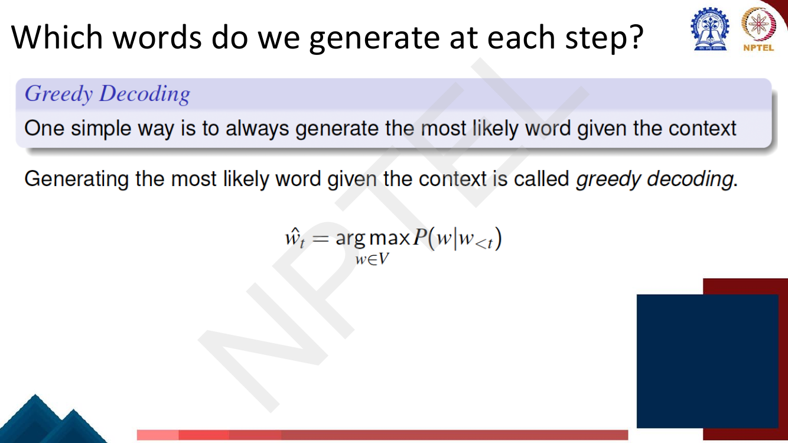
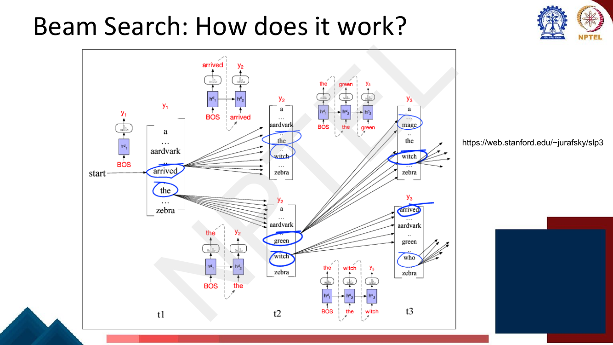
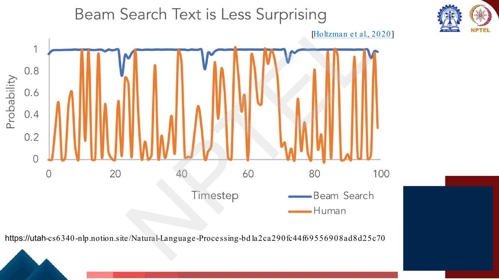

# Lec 19 — Decoding Strategies

> **Source:** `Week4.pdf` pp. 82–105 · **Week 4** · **Playlist:** Lec 19
> **Prereqs:** [Lec 18 — Seq2Seq and Attention](18-seq2seq-and-attention.md), [Lec 16 — RNN Language Models](16-rnn-language-models.md)
> **Feeds into:** [Lec 24 — Decoder and Transformer LM](../week-05/24-decoder-and-transformer-lm.md), [Lec 41 — Prompting I](../week-09/41-prompting-1.md)

## Why this lecture exists

Every lecture up to here has been about building a model. Training is finished; the weights are fixed.
At each generation step that trained model hands you one thing: a probability distribution over the
whole vocabulary. Nothing in the model tells you which token to actually emit.

That gap is the subject of this lecture. **Decoding** is the algorithm that turns a sequence of
distributions into a sequence of tokens, and it is a completely separate object from the model. The
same weights, the same input sentence, decoded two different ways, produce two different outputs —
one fluent and bland, the other surprising and occasionally incoherent. No retraining involved.

This matters now because [Lec 18](18-seq2seq-and-attention.md) finished the encoder-decoder machine
and [Lec 17](17-rnn-applications.md) described the generation *loop* while explicitly deferring the
*choice*. This chapter is that choice. It is also the last piece of decoding you will be taught: the
Transformer chapters, GPT and the prompting chapters all reuse exactly these five algorithms.

## The ideas

### The setup: what the model gives you, and what it does not

At decoding step $t$ the decoder has consumed the input and the tokens it has already emitted
($w_{<t}$). Its final layer produces a vector of **logits** $\mathbf{u} \in \mathbb{R}^{|V|}$ — one
real number per vocabulary item — and a softmax ([Lec 8](../week-02/08-deep-neural-networks.md))
turns it into a distribution:

$$P(w \mid w_{<t}) = \frac{\exp(u_w)}{\sum_{j \in V} \exp(u_j)}$$

Page 86 recaps [Lec 18](18-seq2seq-and-attention.md)'s encoder-decoder-at-inference picture, and the
detail to carry forward is the little bar chart drawn above *every* decoder step: each one is a full
distribution over $|V|$ words, and something has to pick one of them.

The loop is **autoregressive**: whatever you emit at step $t$ is fed back in as the input at step
$t+1$ ([Lec 17](17-rnn-applications.md) owns the loop itself). Two consequences you should hold onto:

1. **The model is fixed; the decoder is a free choice.** You can swap decoders at inference with no
   cost. This is why "temperature" is a slider in every LLM API and not a training hyperparameter.
2. **Decisions are irrevocable in the simple algorithms.** Because step $t$'s output becomes step
   $t{+}1$'s input, a bad token does not just cost you that token — it conditions everything after it.

What we actually *want*, in principle, is the highest-probability complete sequence:

$$\hat{\mathbf{w}} = \arg\max_{\mathbf{w}} P(w_1 \ldots w_T \mid x) = \arg\max_{\mathbf{w}} \prod_{t=1}^{T} P(w_t \mid w_{<t}, x)$$

That search is intractable. With $|V| = 50{,}000$ and length 20 there are $50{,}000^{20}$ candidate
sequences. Every algorithm below is either an approximation to this maximisation or a deliberate
refusal to maximise at all.

### Greedy decoding

The simplest approximation: at each step take the most likely word and never look back.


*Fig. — The deck's definition. Note the argmax is over $V$ at a **single** step, not over sequences — that mismatch with the quantity we actually want is the whole problem. Page 87.*

$$\hat{w}_t = \arg\max_{w \in V} P(w \mid w_{<t})$$

You run this until the model emits `</s>` (`<END>`), or until a maximum length.

#### What is the issue with greedy decoding?

The deck asks this directly, with a small tree. Read it carefully — the exam reuses this shape.


*Fig. — At $t_1$, `yes` (0.5) beats `ok` (0.4). But every continuation of `ok` is better than every continuation of `yes`. Greedy loses by committing before it can see that. Page 88.*

Greedy takes `yes` (0.5), then `yes` again (0.4), then `</s>` — total $0.5 \times 0.4 = 0.20$. The
globally optimal sequence is `ok ok </s>` at $0.4 \times 0.7 = 0.28$. Greedy misses it, and worked
numerical **N3** does the full arithmetic.

The failure mode in one sentence: **a locally optimal choice can make every continuation bad, and
greedy has no mechanism to undo it.** The highest-probability *first word* is not generally the first
word of the highest-probability *sentence*. In translation this is how you get a decoder that emits a
plausible opening word and then has to write a contorted sentence around it.

### Beam search

The fix is to stop committing to one path. Keep several.

Page 89 states the core idea in two bullets worth memorising verbatim: *on each step of the decoder,
keep track of the $k$ most probable partial translations (hypotheses)*; and *$k$ is the beam size /
beam width (in practice around 5 to 10)*.

A **hypothesis** is a partial output sequence together with its score. The **beam** is the set of the
$k$ best hypotheses currently alive; $k$ is the **beam size** or **beam width**, typically 5–10.

**The algorithm.** At each step:

1. For every one of the $k$ hypotheses on the beam, run the decoder to get $P(w \mid \text{hyp})$.
2. Form all $k \times |V|$ extensions — every hypothesis extended by every vocabulary item.
3. Score each extension.
4. Keep the top $k$. Discard the rest permanently.


*Fig. — Each circled word is one surviving hypothesis; each fan of arrows is one hypothesis being expanded against the entire vocabulary. The width of the fan is $|V|$; the number of circles is $k$. Page 90.*

**Scores are sums of log probabilities, not products of probabilities:**

$$\text{score}(y_1, \ldots, y_t) = \log P_{\text{LM}}(y_1 \ldots y_t \mid x) = \sum_{i=1}^{t} \log P_{\text{LM}}(y_i \mid y_1 \ldots y_{i-1}, x)$$

Two reasons, and the exam likes the second:

- **Underflow.** A 40-token sequence with per-token probability $10^{-3}$ has probability $10^{-120}$.
  Float64 bottoms out near $10^{-308}$; realistic sentences underflow to exactly zero and all
  hypotheses tie at 0.
- **Monotonicity.** $\log$ is strictly increasing, so ranking by $\sum \log p$ is *identical* to
  ranking by $\prod p$. You lose nothing by switching. Every score is negative, because every
  probability is below 1.

Here is the deck's worked trace, with $k = 2$, on an English→English toy ("the green witch arrived"):


*Fig. — Red numbers are per-step $\log P$; black numbers are running cumulative scores. The 🚫 marks are pruned hypotheses. Notice the two surviving complete hypotheses both score **−2.7** — that tie is not an accident and N4 exploits it. Page 91.*

Trace it yourself: at $y_1$, `the` ($-0.92$) and `arrived` ($-1.6$) are the top two. At $y_2$ the four
live candidates are `arrived the` ($-1.6 - 0.69 = -2.3$), `arrived witch` ($-3.9$), `the green`
($-0.92 - 0.69 = -1.61$) and `the witch` ($-0.92 - 1.2 = -2.12$). The top two are both continuations
of `the`, so `arrived` dies entirely. **A hypothesis can lose all of its descendants in one step —
beam search prunes paths, not just tokens.**

**Cost.** Per step you evaluate $k$ decoder states and sort $k|V|$ numbers, so beam search is roughly
$k\times$ the compute of greedy. Greedy is exactly beam search with $k = 1$.

**It is still not exact.** Beam search is a heuristic, not a guarantee. If the globally best sequence
has a prefix that falls outside the top $k$ at any single step, it is gone forever. Larger $k$ searches
more and — perhaps surprisingly — often produces *worse* text; see the quality/diversity section.

#### Stopping criterion

Greedy has a trivial stopping rule: generate until `</s>`. Beam search does not, because different
hypotheses finish at different times.


*Fig. — "Place it aside" is the key phrase: a completed hypothesis leaves the beam but is **not** discarded, and the beam refills to $k$ from the live candidates. Page 93.*

So: when a hypothesis emits `</s>` it is **complete**. Move it to a holding list and keep beam
searching with the remaining hypotheses. Stop when either

- you reach a pre-defined cutoff timestep $T$, or
- you have at least $n$ completed hypotheses (another pre-defined cutoff).

#### Finishing up — and why length normalisation is mandatory

Now you have a list of completed hypotheses of **different lengths**. Pick the best one — and this is
where the naive answer is wrong.


*Fig. — The deck's own statement of the bug and the fix. The divisor is $t$, the hypothesis length. Page 94.*

Every term $\log P(y_i \mid \cdot)$ is **negative**, because every probability is below 1. So every
extra token strictly *decreases* the score. Raw cumulative log-probability therefore has a systematic
bias toward **short** outputs — a translation system scored this way learns to stop early and emit
truncated sentences. The bias has nothing to do with quality; it is pure arithmetic.

The fix is to compare **average log-probability per token**:

$$\text{score}_{\text{norm}}(y_1, \ldots, y_t) = \frac{1}{t}\sum_{i=1}^{t} \log P_{\text{LM}}(y_i \mid y_1 \ldots y_{i-1}, x)$$

Equivalently this ranks by the **geometric mean** of the per-token probabilities, $P^{1/t}$, which is
the reciprocal of perplexity ([Lec 4](../week-01/04-ngram-lm-2-smoothing-perplexity.md)) on that
hypothesis. Choosing the hypothesis with the best normalised score is choosing the one with the lowest
perplexity.

In practice systems often use a softer divisor $t^\alpha$ with $\alpha \approx 0.6$–$0.7$ (a partial
normalisation; $\alpha = 0$ is raw, $\alpha = 1$ is the deck's full version). The deck gives only
$1/t$; know that one cold and the $\alpha$ variant as a footnote. Worked numerical **N4** shows the
preference actually flipping.

### Greedy and beam search are deterministic

The deck gives this its own slide, and it is the hinge of the lecture.

> Greedy decoding as well as Beam Search decoding will give a "deterministic" output.

Same model, same input, same output, every single time. For machine translation that is a feature —
you want one correct translation, reproducibly. For story generation, dialogue or any open-ended
task it is a problem: ask the same question twice and you get the same sentence twice.

The alternative is **sampling** — draw $w_i \sim P(w \mid w_{<i})$ instead of maximising. The deck's
pseudocode for pure random sampling (ancestral sampling) is just the autoregressive loop with
`argmax` replaced by a draw:

```text
i ← 1
w_i ~ p(w)
while w_i != EOS:
    i ← i + 1
    w_i ~ p(w_i | w_<i)
```

### The quality–diversity trade-off

Why would you ever *not* maximise? Because high probability is not the same as good.


*Fig. — The single most quotable figure in the lecture. Human text is **not** a high-probability sequence under the model; it is full of moments the model finds surprising. Beam search's output is almost uniformly unsurprising, which is exactly why it reads as bland. Holtzman et al., 2020. Page 95.*

The deck's framing:

| | Emphasise high-probability words | Give weight to mid-probability words |
|---|---|---|
| Output tends to be | coherent, accurate | creative, diverse |
| but also | repetitive, boring | incoherent, less factual |

That is the **quality vs diversity trade-off**, and every method below is a knob on it. There is no
setting that wins both; you choose based on the task. Translation and summarisation sit at the quality
end (beam search); story and dialogue generation sit toward diversity (sampling).

One concrete pathology worth naming: beam search with large $k$ degenerates into repetition loops
("the the the") and generic safe outputs ("I don't know"), because those genuinely *are* the
highest-probability continuations. Increasing $k$ makes the search better and the text worse.

### Random sampling with temperature

Pure sampling fixes diversity and breaks quality. The tail of a 50,000-word distribution holds an
enormous number of individually-tiny probabilities whose *total* mass is substantial, so pure sampling
picks a nonsense word surprisingly often — and once emitted, it conditions everything after it. The
deck: "without scaling, random sampling often generates incoherent gibberish."

**Temperature** reshapes the distribution before sampling, by dividing the logits.

![Slide: Random Sampling with Temperature. Intuition from thermodynamics: a system at high temperature is flexible and can explore various states, while a system at low temperature is likely to explore a subset of lower energy (better) states. Implementation: divide the logits by a temperature parameter tau in (0,1] before passing through softmax. Random sampling y = softmax(u); random sampling with temperature y = softmax(u/tau)](../../assets/pages/lec19/p-098.png)
*Fig. — The deck writes the temperature as $\tau$ and restricts it to $(0,1]$. Most libraries call it $T$ and allow $\tau > 1$. Know both. Page 98.*

$$P_\tau(w) = \frac{\exp(u_w/\tau)}{\sum_{j \in V}\exp(u_j/\tau)}$$

**Why does this work?** Divide the logits by $\tau$ and the *gaps between them* scale by $1/\tau$.
Softmax depends only on logit differences, and exponentiates them, so:

- $\tau < 1$ — gaps get *bigger*, exponentiated gaps get much bigger, the distribution **sharpens**
  toward the argmax. As $\tau \to 0^+$ the largest logit's share $\to 1$ and sampling becomes greedy
  decoding.
- $\tau = 1$ — you recover the model's raw distribution exactly.
- $\tau > 1$ — gaps shrink, the distribution **flattens**. As $\tau \to \infty$ every gap goes to 0 and
  you approach the uniform distribution over $V$, i.e. pure noise.


*Fig. — Low $\tau$ pushes `nice` from 0.5 up to 0.75 and crushes `car` from ~0.1 down to 0.02. The overlaid question — "can we avoid the low-probability tokens altogether?" — is the deck's hand-off to top-$k$. (The pop-up partially covers the original bars.) Page 99.*

The crucial limitation: temperature **rescales, it does not truncate**. Every token keeps non-zero
probability however small $\tau$ is. A thousand bad tokens each at $10^{-5}$ still add up to a 1%
chance of ruining the sentence, at every step. That is the motivation for the next two methods.

### Top-$k$ sampling

Truncate the distribution to its $k$ most likely tokens, renormalise, and sample from that.


*Fig. — Step 4 is the one students drop. After truncation the $k$ probabilities no longer sum to 1, so you must divide by their sum. Page 100.*

Formally, with $V^{(k)}$ the $k$ highest-probability tokens,

$$P'(w) = \begin{cases} \dfrac{P(w \mid w_{<t})}{\sum_{w' \in V^{(k)}} P(w' \mid w_{<t})} & w \in V^{(k)} \\ 0 & \text{otherwise}\end{cases}$$

$k = 1$ is greedy decoding. $k = |V|$ is pure random sampling. Typical values are 10–50. Note that
**greedy decoding is simultaneously beam search with $k=1$ and top-$k$ sampling with $k=1$** — and the
letter $k$ means two completely different things in those two sentences (beam width vs truncation
size). The deck reuses the symbol; the exam will too.

### Nucleus (top-$p$) sampling

Top-$k$'s flaw is that $k$ is **fixed** while the distribution's *shape* is not.


*Fig. — Read the definition precisely: **smallest set** whose cumulative probability is **at least** $p$. Both words are load-bearing and both are examined. Page 101.*

$$V^{(p)} = \text{smallest } S \subseteq V \text{ such that} \sum_{w \in S} P(w \mid w_{<t}) \geq p$$

then renormalise over $V^{(p)}$ and sample. Operationally: sort descending, take the cumulative sum,
cut at the first index where it reaches $p$.

**The key advantage, and the examinable discrimination: the candidate-set size adapts to the
distribution's shape.**

| Distribution shape | Top-$k$ (fixed $k=3$) | Nucleus ($p = 0.9$) |
|---|---|---|
| **Peaked** — one token at 0.90, rest tiny | admits 3 tokens; the 2nd and 3rd are junk the model gave 4% and 3% | admits **1** token — correctly refuses to gamble |
| **Flat** — ten tokens near 0.10 each | admits 3 tokens covering only 34% of the mass; discards 7 legitimate options | admits **9** tokens — keeps the real diversity |

A single $k$ cannot be right for both, and both situations occur within one sentence: after "The
capital of France is" the distribution is a spike; after "She opened the door and saw a" it is broad.
Nucleus sampling asks for a fixed amount of *probability mass* rather than a fixed *count*, which is
the quantity that actually tracks the model's confidence. N5 works both cases numerically.

### The master comparison

| Method | Deterministic? | Hyperparameter | Strength | Failure mode | Typical use |
|---|---|---|---|---|---|
| **Greedy** | yes | none | cheapest; one decoder pass per step | locally optimal choice dooms the rest of the sequence; no undo | baselines, latency-critical serving |
| **Beam search** | yes | beam width $k$ (5–10) | recovers from greedy's early mistakes; best-scoring sequence | bland/repetitive text; still not exact; $k\times$ cost; needs length normalisation | MT, summarisation, speech recognition |
| **Random sampling** | **no** | none | maximal diversity; matches the model's distribution exactly | the long tail is huge; produces incoherent gibberish | almost never used raw |
| **Temperature** $\tau$ | **no** | $\tau$ (deck: $(0,1]$) | one continuous knob from greedy ($\tau\to0$) to uniform ($\tau\to\infty$) | rescales but never truncates — bad tokens keep non-zero mass | tuning creativity on top of any sampler |
| **Top-$k$** | **no** | $k$ (10–50) | hard-removes the tail; simple and fast | fixed $k$ is wrong for both peaked and flat distributions | story/dialogue generation |
| **Nucleus (top-$p$)** | **no** | $p$ (0.9–0.95) | candidate set adapts to the distribution's shape | still needs a floor: $p$ too high readmits the tail | the modern default for open-ended generation |

Temperature, top-$k$ and top-$p$ are **composable** — real systems apply temperature first, then
truncate, then renormalise and sample.

## Worked numericals

### N1. Parameter count of an attention seq2seq translator (deck pages 84–85)

> **The deck poses this problem on page 84 and merely restates it on page 85 — no solution is given
> anywhere in the lecture.** Everything below is my own working. Note this is a
> [Lec 18](18-seq2seq-and-attention.md) architecture question that happens to sit at the top of
> Lec 19's page range; the architecture is Lec 18's, the arithmetic is below.

**Given:** English→Hindi seq2seq RNN *with attention*. $|V_{\text{en}}| = 40{,}000$,
$|V_{\text{hi}}| = 50{,}000$, embeddings 300-d for both, encoder hidden state 100-d, decoder hidden
state 200-d. Ignore biases.
**Find:** the number of trainable parameters.


*Fig. — The figure fixes the architecture you must count: $c_i$ enters the decoder **recurrence**, and the softmax reads $\mathbf{h}^d_i$ alone. The attention score is drawn as $\mathbf{h}^d_{i-1}\cdot\mathbf{h}^e_j$. Page 84.*

**Assumptions I am forced to state** (the slide does not): vanilla (non-gated) RNNs both sides; the
decoder recurrence is Jurafsky's $\mathbf{h}^d_i = g(\mathbf{e}_{i-1}, \mathbf{h}^d_{i-1}, \mathbf{c}_i)$;
the output softmax reads only $\mathbf{h}^d_i$; input and output embeddings are not tied.

1. **Source embedding matrix.** $40{,}000 \times 300 = 12{,}000{,}000$.
2. **Target embedding matrix.** $50{,}000 \times 300 = 15{,}000{,}000$.
3. **Encoder RNN.** Input is a 300-d embedding, state is 100-d.
   $\underbrace{300\times100}_{30{,}000} + \underbrace{100\times100}_{10{,}000} = 40{,}000$.
4. **Decoder RNN.** Three inputs to a 200-d state: previous target embedding (300-d), previous
   state (200-d), context vector (100-d — it is a convex combination of 100-d encoder states, so it
   inherits their dimension).
   $300\times200 + 200\times200 + 100\times200 = 60{,}000 + 40{,}000 + 20{,}000 = 120{,}000$.
5. **Attention.** The figure draws a dot product $\mathbf{h}^d_{i-1}\cdot\mathbf{h}^e_j$, but the two
   vectors are 200-d and 100-d — **a plain dot product is not even defined here.** The score must be
   bilinear, $\left(\mathbf{h}^d_{i-1}\right)^\top \mathbf{W}_a\, \mathbf{h}^e_j$ with
   $\mathbf{W}_a \in \mathbb{R}^{200\times100}$: $200 \times 100 = 20{,}000$.
6. **Output projection.** $200 \times 50{,}000 = 10{,}000{,}000$.
7. **Total.** $12{,}000{,}000 + 15{,}000{,}000 + 40{,}000 + 120{,}000 + 20{,}000 + 10{,}000{,}000$.
8. $= 37{,}180{,}000$.

**Answer: 37,180,000 ≈ 37.18 M parameters.** If the examiner intends literal dot-product attention
(zero parameters, dimension mismatch ignored), the answer is **37,160,000**. If instead the softmax
reads $[\mathbf{h}^d_i; \mathbf{c}_i]$ concatenated (Luong-style), the output layer becomes
$300\times50{,}000 = 15$ M and the total is **42,180,000**. **Show your decomposition** — the two
embedding matrices (27 M) and the output projection (10 M) are 99.6% of the model and are what the
question is really testing.

### N2. The deck's sampling problem (pages 102–103)

> **The deck states this problem twice — page 102 and page 103 — and gives no solution.** The
> arithmetic below is mine, verified numerically in the Code section.

**Given:** $|V| = 5$; the decoder's output vector (logits) is $\mathbf{u} = [3, -1, 2, 1, -2]$.
**Find:** the effective distribution under (a) random sampling at $\tau = 0.5$, (b) top-2 sampling,
(c) nucleus sampling with $p = 0.5$.

**Step 0 — the baseline softmax ($\tau = 1$), needed for (b) and (c).**

1. $e^3 = 20.0855$, $e^{-1} = 0.3679$, $e^2 = 7.3891$, $e^1 = 2.7183$, $e^{-2} = 0.1353$.
2. Sum $= 20.0855 + 0.3679 + 7.3891 + 2.7183 + 0.1353 = 30.6961$.
3. $P = [20.0855, 0.3679, 7.3891, 2.7183, 0.1353]/30.6961 = [\mathbf{0.6543},\ \mathbf{0.0120},\ \mathbf{0.2407},\ \mathbf{0.0886},\ \mathbf{0.0044}]$.
4. Check: $0.6543+0.0120+0.2407+0.0886+0.0044 = 1.0000$ ✓

**(a) Temperature $\tau = 0.5$.** Divide the *logits*, not the probabilities.

5. $\mathbf{u}/\tau = [3,-1,2,1,-2]/0.5 = [6, -2, 4, 2, -4]$.
6. $e^6 = 403.4288$, $e^{-2} = 0.1353$, $e^4 = 54.5982$, $e^2 = 7.3891$, $e^{-4} = 0.0183$.
7. Sum $= 403.4288 + 0.1353 + 54.5982 + 7.3891 + 0.0183 = 465.5697$.
8. $P_{0.5} = [\mathbf{0.8665},\ \mathbf{0.0003},\ \mathbf{0.1173},\ \mathbf{0.0159},\ \mathbf{0.00004}]$.
9. Sanity: the top token rose $0.6543 \to 0.8665$ and the bottom token fell $0.0044 \to 0.00004$ — a
   **110× collapse**. Sharpening, as promised.

**(b) Top-2 sampling.** Keep the two highest-probability tokens, renormalise over them.

10. Ranking: $w_1 (0.6543) > w_3 (0.2407) > w_4 (0.0886) > w_2 (0.0120) > w_5 (0.0044)$.
11. $V^{(2)} = \{w_1, w_3\}$; retained mass $= 0.6543 + 0.2407 = 0.8950$.
12. $P'(w_1) = 0.6543/0.8950 = \mathbf{0.7311}$; $P'(w_3) = 0.2407/0.8950 = \mathbf{0.2689}$.
13. Everything else is **exactly 0**.
14. Shortcut worth knowing: renormalising a softmax over a subset is just a softmax over those
    logits. Here $\text{softmax}([3,2]) = \big(\tfrac{1}{1+e^{-1}}, \tfrac{e^{-1}}{1+e^{-1}}\big) = (0.7311, 0.2689)$ — the sigmoid of the logit gap.

**(c) Nucleus sampling, $p = 0.5$.**

15. Sort descending and take the cumulative sum: $0.6543$; $0.6543+0.2407 = 0.8950$; $0.9836$; $0.9956$; $1.0000$.
16. The **smallest** set whose cumulative mass is $\geq 0.5$ is reached at the very first entry:
    $0.6543 \geq 0.5$. So $V^{(p)} = \{w_1\}$.
17. Renormalise over a single element: $P'(w_1) = 0.6543/0.6543 = \mathbf{1.0}$.

**Answer:**

| Strategy | $w_1$ | $w_2$ | $w_3$ | $w_4$ | $w_5$ |
|---|---|---|---|---|---|
| raw softmax ($\tau=1$) | 0.6543 | 0.0120 | 0.2407 | 0.0886 | 0.0044 |
| **temperature $\tau = 0.5$** | **0.8665** | 0.0003 | **0.1173** | 0.0159 | 0.00004 |
| **top-2** | **0.7311** | 0 | **0.2689** | 0 | 0 |
| **nucleus $p = 0.5$** | **1.0** | 0 | 0 | 0 | 0 |

The punchline the problem is engineered to deliver: **with a peaked distribution and a small $p$,
nucleus sampling collapses to a point mass and becomes greedy decoding.** The nucleus is one token
wide. Do not write 2 or 3 tokens here out of habit.

*Extension (not asked, but the obvious variant): at $\tau = 2$ the logits become $[1.5, -0.5, 1, 0.5, -1]$,
giving $[0.4562, 0.0617, 0.2767, 0.1678, 0.0375]$ — the top token drops from 0.65 to 0.46 and the
bottom rises from 0.004 to 0.038, a 8.5× lift. Flattening.*

### N3. The deck's greedy-vs-optimal tree, then beam search on it (pages 88 and 92)

**Given:** the tree on page 88. $P(t_1) = \{\text{ok } 0.4,\ \text{yes } 0.5,\ \texttt{</s>}\ 0.1\}$;
$P(t_2 \mid \text{ok}) = \{0.7, 0.2, 0.1\}$; $P(t_2 \mid \text{yes}) = \{0.3, 0.4, 0.3\}$; every
depth-3 node emits `</s>` with probability 1.0.
**Find:** greedy's output, the global optimum, and whether beam search with $k = 2$ (page 92's
question) finds the optimum.

**Greedy.**

1. Step 1: $\max(0.4, 0.5, 0.1) = 0.5 \Rightarrow$ emit `yes`.
2. Step 2: from `yes`, $\max(0.3, 0.4, 0.3) = 0.4 \Rightarrow$ emit `yes`.
3. Step 3: `</s>` with probability 1.0.
4. Output `yes yes </s>`, probability $0.5 \times 0.4 \times 1.0 = \mathbf{0.20}$.

**Global optimum — enumerate all seven complete sequences.**

| Sequence | Probability |
|---|---|
| `ok ok </s>` | $0.4 \times 0.7 = \mathbf{0.28}$ |
| `yes yes </s>` | $0.5 \times 0.4 = 0.20$ |
| `yes ok </s>` | $0.5 \times 0.3 = 0.15$ |
| `yes </s>` | $0.5 \times 0.3 = 0.15$ |
| `</s>` | $0.10$ |
| `ok yes </s>` | $0.4 \times 0.2 = 0.08$ |
| `ok </s>` | $0.4 \times 0.1 = 0.04$ |

5. The optimum is `ok ok </s>` at **0.28**. Greedy's 0.20 is only 71% of it.

**Beam search, $k = 2$.**

6. **Step 1.** Candidates `yes` $0.5$, `ok` $0.4$, `</s>` $0.1$. Beam $=\{$`yes` $(\log 0.5 = -0.6931)$,
   `ok` $(\log 0.4 = -0.9163)\}$. The bare `</s>` falls off.
7. **Step 2.** Expand both; all six scores:
   `ok ok` $0.28$, `yes yes` $0.20$, `yes ok` $0.15$, `yes </s>` $0.15$, `ok yes` $0.08$, `ok </s>` $0.04$.
8. `yes </s>` and `ok </s>` are **complete** — set aside, not kept on the beam.
9. Beam $= \{$`ok ok` $(\log 0.28 = -1.2730)$, `yes yes` $(\log 0.20 = -1.6094)\}$.
10. **Step 3.** Both must emit `</s>` at probability 1.0, adding $\log 1 = 0$. Both complete.
11. Completed list, best first: `ok ok </s>` $(0.28)$, `yes yes </s>` $(0.20)$, `yes </s>` $(0.15)$,
    `</s>` $(0.10)$, `ok </s>` $(0.04)$.

**Answer:** greedy gives `yes yes </s>` at 0.20; the optimum is `ok ok </s>` at 0.28; **beam search
with $k = 2$ does find the optimum**, so the answer to page 92's question is **yes**. It works
because the optimal first token `ok` was ranked 2nd at step 1 and $k = 2$ was just wide enough to keep
it. With $k = 1$ (= greedy) it would have been pruned. **This is a demonstration, not a guarantee** —
make $P(\text{ok}) = 0.3$ and add a third first-token at 0.35 and $k = 2$ would lose it too.

### N4. Length normalisation flips the winner (pages 91 and 94)

**Given:** the two completed hypotheses from the deck's beam-search trace on page 91:
$h_1 =$ `the witch arrived </s>`, length $t = 4$, raw score $-2.7$; and
$h_2 =$ `the green witch arrived </s>`, length $t = 5$, raw score $-2.7$.
**Find:** the winner by raw score and by length-normalised score.

1. **Raw.** $-2.7$ versus $-2.7$ — an exact tie. The ranking is undetermined; a real implementation
   breaks it arbitrarily, e.g. by insertion order, which is a silent bug.
2. **Normalised, $h_1$:** $-2.7 / 4 = \mathbf{-0.675}$ per token.
3. **Normalised, $h_2$:** $-2.7 / 5 = \mathbf{-0.540}$ per token.
4. $-0.540 > -0.675$, so **$h_2$ wins** — the longer hypothesis.
5. As geometric-mean per-token probabilities: $e^{-0.675} = 0.509$ versus $e^{-0.540} = 0.583$. The
   5-token hypothesis is the more confident model *per word*.
6. With $\alpha = 0.7$: $-2.7/4^{0.7} = -2.7/2.639 = -1.023$ and $-2.7/5^{0.7} = -2.7/3.085 = -0.875$.
   Same winner, smaller margin — which is the point of $\alpha < 1$.

**Now make the bias unmissable.** Suppose instead $h_1$ has raw score $-2.7$ at length 4, and
$h_3 =$ a 10-token hypothesis with raw score $-4.0$.

7. Raw: $-2.7 > -4.0$, so the short one wins by a wide margin.
8. Normalised: $-2.7/4 = -0.675$ versus $-4.0/10 = -0.400$. **$h_3$ now wins.** Its per-token
   probability is $e^{-0.4} = 0.670$ against $e^{-0.675} = 0.509$.

**Answer:** $h_2$ (length 5) under normalisation, versus an undetermined tie under raw scores; and in
the second pairing the preference flips outright from the 4-token to the 10-token hypothesis.
**Raw cumulative log-probability is biased toward short outputs because every added token contributes
a negative number.** Dividing by length removes the bias.

### N5. Top-$k$ versus nucleus on two distribution shapes

**Given:** two distributions. **Peaked:** $[0.90, 0.04, 0.03, 0.02, 0.01]$. **Flat:** ten tokens at
$[0.12, 0.11, 0.11, 0.10, 0.10, 0.10, 0.09, 0.09, 0.09, 0.09]$.
**Find:** the candidate set and renormalised distribution under top-3 and under nucleus $p = 0.9$,
for each.

**Peaked, top-3.**

1. Keep $\{0.90, 0.04, 0.03\}$; retained mass $0.97$.
2. Renormalise: $0.90/0.97 = \mathbf{0.9278}$, $0.04/0.97 = \mathbf{0.0412}$, $0.03/0.97 = \mathbf{0.0309}$.
3. So there is a $0.0412 + 0.0309 = \mathbf{7.2\%}$ chance per step of emitting a token the model
   considered a 3–4% long shot. Over a 20-token sentence the chance of at least one such emission is
   $1 - 0.928^{20} = 77\%$.

**Peaked, nucleus $p = 0.9$.**

4. Cumulative: $0.90$. Already $\geq 0.9$ at the first token.
5. $V^{(p)} = \{w_1\}$, renormalised to $\mathbf{1.0}$. The junk tokens are **excluded entirely**.

**Flat, top-3.**

6. Keep $\{0.12, 0.11, 0.11\}$; retained mass $= \mathbf{0.34}$. You have thrown away **66% of the
   probability mass** and 7 of 10 perfectly reasonable continuations.
7. Renormalise: $0.12/0.34 = \mathbf{0.3529}$, $0.11/0.34 = \mathbf{0.3235}$ (twice).
8. A token the model gave 0.12 now gets 0.353 — top-$k$ has invented confidence the model never had.

**Flat, nucleus $p = 0.9$.**

9. Cumulative: $0.12, 0.23, 0.34, 0.44, 0.54, 0.64, 0.73, 0.82, \mathbf{0.91}, 1.00$. The threshold
   $0.9$ is first met at the **9th** token.
10. $V^{(p)}$ has 9 tokens; renormalise by $0.91$: $0.12/0.91 = 0.1319$, $0.11/0.91 = 0.1209$,
    $0.10/0.91 = 0.1099$, $0.09/0.91 = 0.0989$. Only the last token is dropped.

**Answer:**

| | candidate set size | mass retained before renormalising |
|---|---|---|
| peaked, top-3 | 3 (two of them junk) | 0.97 |
| peaked, top-$p$ 0.9 | **1** | 0.90 |
| flat, top-3 | 3 (7 good ones discarded) | **0.34** |
| flat, top-$p$ 0.9 | **9** | 0.91 |

**One fixed $k$ is wrong in both directions at once: too permissive on peaked distributions, too
aggressive on flat ones. Nucleus sampling's set size went 1 → 9 with no change of hyperparameter.**
That adaptivity is the entire argument for top-$p$, and it is the most examinable idea in this
lecture.

## Code

Three blocks on the same two tiny tables, so you can watch the methods diverge. All printed output is
real.

**Block 1 — greedy, beam search and exhaustive search on the deck's page-88 tree.**

```python
import numpy as np

# The deck's decision tree, Week4.pdf p.88 : context -> P(next word)
V = ["ok", "yes", "</s>"]
P  = {():          np.array([.4, .5, .1]),
      ("ok",):     np.array([.7, .2, .1]),
      ("yes",):    np.array([.3, .4, .3])}
for a in ("ok", "yes"):                       # every 2-token prefix must end
    for b in ("ok", "yes"):
        P[(a, b)] = np.array([0., 0., 1.])

def lp(ctx, i):                               # log prob, guarding log(0)
    return np.log(P[ctx][i]) if P[ctx][i] > 0 else -np.inf

def greedy():
    ctx, s = (), 0.0
    while ctx[-1:] != ("</s>",):
        i = int(np.argmax(P[ctx])); s += lp(ctx, i); ctx += (V[i],)
    return ctx, s

def beam(k, trace=False):
    live, done = [((), 0.0)], []
    while live:
        cand = [(ctx + (V[i],), s + lp(ctx, i))        # all k x |V| extensions
                for ctx, s in live for i in range(len(V)) if P[ctx][i] > 0]
        cand.sort(key=lambda x: -x[1])                 # rank by SUM OF LOGS
        if trace:
            print("   all candidates:",
                  [(" ".join(c), round(float(np.exp(s)), 3)) for c, s in cand])
        live = []
        for ctx, s in cand:
            if ctx[-1] == "</s>": done.append((ctx, s))   # complete: set aside
            elif len(live) < k:   live.append((ctx, s))   # else refill the beam
        if trace:
            print("   beam kept     :",
                  [(" ".join(c), round(float(s), 4)) for c, s in live], "\n")
    return sorted(done, key=lambda x: -x[1])

g, gs = greedy()
print(f"greedy        : {' '.join(g):<12} p = {np.exp(gs):.2f}")
print("beam k=2, step by step:")
B = beam(2, trace=True)
print(f"beam k=2 best : {' '.join(B[0][0]):<12} p = {np.exp(B[0][1]):.2f}")
print("completed hyps:", [(" ".join(c), round(float(np.exp(s)), 2)) for c, s in B])
```

```text
greedy        : yes yes </s> p = 0.20
beam k=2, step by step:
   all candidates: [('yes', 0.5), ('ok', 0.4), ('</s>', 0.1)]
   beam kept     : [('yes', -0.6931), ('ok', -0.9163)]

   all candidates: [('ok ok', 0.28), ('yes yes', 0.2), ('yes ok', 0.15), ('yes </s>', 0.15), ('ok yes', 0.08), ('ok </s>', 0.04)]
   beam kept     : [('ok ok', -1.273), ('yes yes', -1.6094)]

   all candidates: [('ok ok </s>', 0.28), ('yes yes </s>', 0.2)]
   beam kept     : []

beam k=2 best : ok ok </s>   p = 0.28
completed hyps: [('ok ok </s>', 0.28), ('yes yes </s>', 0.2), ('yes </s>', 0.15), ('</s>', 0.1), ('ok </s>', 0.04)]
```

Exactly N3: greedy 0.20, beam 0.28, and the trace shows `yes` dropping out of the beam at step 2 even
though it was ranked *first* at step 1.

**Block 2 — the four sampling distributions of N2, on the deck's logits.**

```python
import numpy as np
np.set_printoptions(suppress=True, precision=4)

def softmax(z):
    z = np.asarray(z, float) - np.max(z)      # shift for numerical stability
    e = np.exp(z); return e / e.sum()

def temperature(u, tau):  return softmax(np.asarray(u, float) / tau)

def top_k(p, k):
    q = np.zeros_like(p); idx = np.argsort(-p)[:k]; q[idx] = p[idx]
    return q / q.sum()                        # step 4: RENORMALISE

def nucleus(p, p_thresh):
    idx = np.argsort(-p)                      # descending
    cum = np.cumsum(p[idx])
    n   = int(np.searchsorted(cum, p_thresh) + 1)  # smallest set with cum >= p
    q   = np.zeros_like(p); q[idx[:n]] = p[idx[:n]]
    return q / q.sum()

u = [3., -1., 2., 1., -2.]                    # the deck's vector, p.102
base = softmax(u)
print("logits          ", u)
print("tau = 1 (raw)   ", np.round(base, 4))
for tau in (0.5, 2.0):
    print(f"tau = {tau}       ", np.round(temperature(u, tau), 4))
print("top-2           ", np.round(top_k(base, 2), 4))
print("nucleus p = 0.5 ", np.round(nucleus(base, 0.5), 4))
print("nucleus p = 0.9 ", np.round(nucleus(base, 0.9), 4))
```

```text
logits           [3.0, -1.0, 2.0, 1.0, -2.0]
tau = 1 (raw)    [0.6543 0.012  0.2407 0.0886 0.0044]
tau = 0.5        [0.8665 0.0003 0.1173 0.0159 0.    ]
tau = 2.0        [0.4562 0.0617 0.2767 0.1678 0.0375]
top-2            [0.7311 0.     0.2689 0.     0.    ]
nucleus p = 0.5  [1.     0.     0.     0.     0.    ]
nucleus p = 0.9  [0.6652 0.     0.2447 0.09   0.    ]
```

Every row matches N2. Note `nucleus p = 0.9` keeps three tokens on this same distribution — the
nucleus widened from 1 to 3 purely because $p$ moved, with the model untouched.

**Block 3 — the adaptivity argument and length normalisation.**

```python
# --- same k, same p, two distribution shapes (N5) ------------------------
peaked = np.array([.90, .04, .03, .02, .01])
flat   = np.array([.12, .11, .11, .10, .10, .10, .09, .09, .09, .09])
for name, p in (("peaked", peaked), ("flat  ", flat)):
    tk, nu = top_k(p, 3), nucleus(p, 0.9)
    print(f"{name}  top-3  -> {int((tk>0).sum())} tokens, "
          f"{np.sort(p)[::-1][:3].sum():.2f} of the mass:  {np.round(tk,3)}")
    print(f"{name}  top-0.9-> {int((nu>0).sum())} tokens:  {np.round(nu,3)}")

# --- length normalisation: the two -2.7 hypotheses from p.91 (N4) --------
print()
for h, s, L in (("the witch arrived </s>", -2.7, 4),
                ("the green witch arrived </s>", -2.7, 5)):
    print(f"{h:<30} raw {s:+.2f}   /L {s/L:+.3f}   /L^0.7 {s/L**0.7:+.3f}")
```

```text
peaked  top-3  -> 3 tokens, 0.97 of the mass:  [0.928 0.041 0.031 0.    0.   ]
peaked  top-0.9-> 1 tokens:  [1. 0. 0. 0. 0.]

flat    top-3  -> 3 tokens, 0.34 of the mass:  [0.353 0.324 0.324 0.    0.    0.    0.    0.    0.    0.   ]
flat    top-0.9-> 9 tokens:  [0.132 0.121 0.121 0.11  0.11  0.11  0.099 0.099 0.099 0.   ]

the witch arrived </s>         raw -2.70   /L -0.675   /L^0.7 -1.023
the green witch arrived </s>   raw -2.70   /L -0.540   /L^0.7 -0.875
```

Three lines of output carry the whole chapter: the nucleus set went **1 → 9** across the two shapes
with $p$ unchanged, top-3 kept only **0.34** of the mass on the flat one, and length normalisation
broke the $-2.7$ tie in favour of the longer sentence.

## Exam pack

### Must-memorise

| Item | Exactly this |
|---|---|
| What decoding is | choosing which token to emit from the distribution the model outputs; separate from the model |
| Greedy decoding | $\hat{w}_t = \arg\max_{w \in V} P(w \mid w_{<t})$ |
| Greedy's failure | a locally optimal token can doom every continuation, and there is **no backtracking** |
| Beam search core idea | at each step keep the $k$ most probable **partial hypotheses** |
| Beam size $k$ | the *beam width*; in practice **5 to 10** |
| Beam search per step | expand all $k$ hypotheses by all $\lvert V\rvert$ words → score $k\lvert V\rvert$ candidates → keep top $k$ |
| Hypothesis score | $\text{score}(y_1\ldots y_t) = \sum_{i=1}^{t}\log P_{\text{LM}}(y_i \mid y_{<i}, x)$ |
| Why logs | products underflow; $\log$ is monotonic so the ranking is unchanged |
| Stopping criterion | a hypothesis emitting `</s>` is **complete** → set aside, keep searching; stop at timestep $T$ **or** $n$ completed hypotheses |
| Length-normalised score | $\frac{1}{t}\sum_{i=1}^{t}\log P_{\text{LM}}(y_i \mid y_{<i}, x)$ |
| Why normalise | every $\log p$ is negative, so longer hypotheses always score lower — the bias is arithmetic, not quality |
| Deterministic methods | greedy and beam search. Everything else samples |
| Quality vs diversity | high-probability words → coherent but repetitive/boring; mid-probability words → creative but incoherent/less factual |
| Temperature | $P_\tau(w) = \dfrac{\exp(u_w/\tau)}{\sum_j \exp(u_j/\tau)}$; deck writes $\tau \in (0,1]$ |
| Temperature limits | $\tau \to 0$ → greedy; $\tau = 1$ → raw distribution; $\tau \to \infty$ → uniform |
| Lower $\tau$ | **sharpens**. Higher $\tau$ **softens/flattens** |
| Top-$k$ sampling | keep the $k$ most probable tokens, **renormalise**, sample |
| Nucleus / top-$p$ | $V^{(p)} =$ the **smallest** set with $\sum_{w \in V^{(p)}} P(w \mid w_{<t}) \geq p$; renormalise; sample |
| Top-$p$'s advantage | candidate-set size **adapts to the shape** of the distribution; a fixed $k$ cannot |
| Greedy as a special case | beam search with $k=1$ **and** top-$k$ sampling with $k=1$ |

### Numbers worth knowing

| Quantity | Value |
|---|---|
| Beam width in practice | 5–10 (the deck's figure) |
| Typical top-$k$ | 10–50 |
| Typical top-$p$ | 0.9–0.95 |
| Deck's beam trace (p.91) | $k=2$; both completed hypotheses score $-2.7$; `the green witch arrived` |
| Deck's greedy tree (p.88) | greedy = `yes yes` at **0.20**; optimum = `ok ok` at **0.28** |
| Deck's sampling problem logits (p.102) | $[3, -1, 2, 1, -2]$ → softmax $[0.654, 0.012, 0.241, 0.089, 0.004]$ |
| …at $\tau = 0.5$ | $[0.867, 0.0003, 0.117, 0.016, 0.00004]$ |
| …top-2 | $[0.731, 0, 0.269, 0, 0]$ (the sigmoid of the gap $3-2=1$) |
| …nucleus $p = 0.5$ | $[1, 0, 0, 0, 0]$ — one token |
| Deck's parameter problem (p.84) | 40k / 50k vocab, 300-d emb, 100-d enc, 200-d dec → **37.18 M** |
| Beam search cost vs greedy | $\approx k\times$ |
| Length-norm exponent in practice | $\alpha \approx 0.6$–$0.7$ (deck gives only $\alpha = 1$) |
| Holtzman et al. "less surprising" paper | 2020 |
| Deck's source text | Jurafsky & Martin, *Speech and Language Processing*, 3rd ed., **Chapter 10** (Aug 2024 draft) |

### Likely MCQ traps

- **"Beam search finds the globally optimal sequence."** It does not. It is a heuristic; if the
  optimum's prefix drops out of the top $k$ at any step, it is unrecoverable. Larger $k$ searches more
  but does not guarantee the optimum — and often produces *worse-reading* text.
- **"Greedy is beam search with $k=0$."** It is $k = 1$.
- **The two meanings of $k$.** In beam search $k$ is the *number of hypotheses kept*; in top-$k$
  sampling $k$ is the *number of vocabulary items kept at one step*. Same letter, unrelated quantities.
  Beam search is deterministic; top-$k$ is not.
- **"Beam search scores multiply probabilities."** Implementations sum **log** probabilities.
  Mathematically equivalent ranking, but products underflow and the exam phrases it as logs.
- **"Longer hypotheses score higher, so we normalise."** Backwards. Longer hypotheses score **lower**
  (more negative terms added), and normalisation removes the bias *against* them.
- **Normalising by $\lvert V\rvert$ or by the number of hypotheses.** You divide by the **hypothesis
  length** $t$.
- **"Higher temperature sharpens the distribution."** Backwards. Higher $\tau$ **softens/flattens**;
  lower $\tau$ sharpens. Remember $\tau \to 0$ = greedy.
- **Applying temperature to the probabilities instead of the logits.** $\text{softmax}(\mathbf{u}/\tau)$,
  not $P^{1/\tau}$ renormalised — these happen to coincide, but writing $P/\tau$ (no exponent) is wrong
  and is the usual slip.
- **Forgetting to renormalise after truncation.** Top-$k$ step 4 and top-$p$'s final step. A truncated
  distribution does not sum to 1.
- **Nucleus = "the top $p$ fraction of the vocabulary".** No — the **smallest set of tokens whose
  cumulative probability is at least $p$**. $p$ is a probability mass, not a count or a percentage of $|V|$.
- **"Top-$p$ always keeps more tokens than top-$k$."** Not at all — on a peaked distribution top-$p$
  can keep **one** token while top-$k$ keeps $k$. Adaptivity cuts both ways; that is the point.
- **"Sampling methods produce higher-probability text."** They produce *lower*-probability, more
  human-like text. Holtzman's figure is precisely that high-probability ≠ good.
- **"Temperature removes bad tokens."** It only rescales. Every token keeps non-zero probability. Only
  top-$k$ and top-$p$ actually truncate.
- **"Changing the decoder requires retraining."** No. The model is fixed; decoding is inference-time.

### Self-test

1. Write the greedy decoding rule in symbols, and say in one sentence why it can fail.
2. In beam search with $k = 5$ and $\lvert V\rvert = 30{,}000$, how many candidates are scored at each step, and how many survive?
3. Why are hypothesis scores sums of logs rather than products of probabilities? Give both reasons.
4. A hypothesis emits `</s>` at step 4 while $k = 3$. What happens to it, and what happens to the beam?
5. Hypothesis A: length 6, raw score $-3.6$. Hypothesis B: length 3, raw score $-2.4$. Which wins raw, and which wins length-normalised?
6. Logits are $[2, 0, 1]$. Give the distribution at $\tau = 1$ and at $\tau = 0.5$.
7. For $P = [0.5, 0.25, 0.15, 0.07, 0.03]$, give the effective distribution for top-3 sampling and for nucleus sampling with $p = 0.8$.
8. Which of greedy, beam search, top-$k$ and nucleus are deterministic?
9. State the one-line advantage of nucleus sampling over top-$k$, and give a distribution shape where top-$k$ fails badly.
10. Your summarisation system produces fluent but repetitive, generic summaries under beam search with $k = 10$. Name two different fixes and say which trade-off each moves.

<details><summary>Answers</summary>

1. $\hat{w}_t = \arg\max_{w \in V} P(w \mid w_{<t})$. It maximises one step at a time, so a token that looks best now can leave only poor continuations, and there is no way to backtrack.
2. $k \times \lvert V\rvert = 5 \times 30{,}000 = 150{,}000$ candidates scored; the top **5** survive.
3. (a) Products of many probabilities underflow to 0 in floating point; (b) $\log$ is monotonically increasing, so ranking by $\sum\log p$ is identical to ranking by $\prod p$ — you lose nothing.
4. It is marked **complete** and set aside in a holding list; beam search continues with the remaining hypotheses, refilling the beam back to 3 from the live candidates.
5. Raw: $-2.4 > -3.6$, so **B**. Normalised: $-3.6/6 = -0.60$ against $-2.4/3 = -0.80$, so **A**. The preference flips.
6. $\tau = 1$: $e^2, e^0, e^1 = 7.389, 1, 2.718$, sum $11.107$ → $[0.665, 0.090, 0.245]$. $\tau = 0.5$: logits $[4, 0, 2]$ → $54.598, 1, 7.389$, sum $62.987$ → $[0.867, 0.016, 0.117]$. Sharper.
7. Top-3: keep $0.5, 0.25, 0.15$, mass $0.90$ → $[0.556, 0.278, 0.167, 0, 0]$. Nucleus $p = 0.8$: cumulative $0.50, 0.75, 0.90$ — the first index reaching $0.8$ is the third, so keep 3 tokens: the **same** $[0.556, 0.278, 0.167, 0, 0]$. (A good reminder that they coincide sometimes; it is the shape-dependence, not the answer on one example, that separates them.)
8. **Greedy and beam search** are deterministic. Top-$k$ and nucleus sample, so they are not.
9. The size of the candidate set adapts to the distribution's shape rather than being fixed in advance. Top-$k$ fails badly on a **peaked** distribution (it admits $k-1$ junk tokens the model gave ~1% each) and on a **flat** one (a small $k$ discards most of the legitimate mass).
10. (a) Reduce $k$ or switch to greedy — moves toward less search, which paradoxically helps, but stays at the quality end. (b) Switch to nucleus sampling at $p \approx 0.9$ (optionally with $\tau$ slightly below 1) — explicitly buys diversity at some cost in factuality. The first keeps determinism; the second gives it up.

</details>

## Beyond the slides

**Gap:** The deck never mentions **repetition penalties** or **no-repeat n-gram blocking**.
**Why it matters:** The repetition pathology the Holtzman slide illustrates is handled in practice by a
hard constraint — forbid any n-gram (typically $n = 3$) that has already appeared, or divide the logit
of an already-emitted token by a penalty $\approx 1.2$. Every production decoder has these knobs
(`repetition_penalty`, `no_repeat_ngram_size`), and they are a standard follow-up question once you
have said "beam search is repetitive".

**Gap:** Nucleus sampling's failure mode is not stated. Top-$p$ on an *extremely* flat distribution
(the model has no idea) still admits hundreds of tokens.
**Why it matters:** This motivated **min-$p$ sampling** — keep tokens whose probability is at least
$\lambda \cdot p_{\max}$, so the threshold scales with the model's own confidence. It is the current
default in several open-weight inference stacks, and it is the natural "what's next after top-$p$"
answer.

**Gap:** The deck does not say what decoding does to **computational cost at serving time** or how it
interacts with batching and the KV cache.
**Why it matters:** Beam search with $k = 5$ means 5 parallel sequences, 5 KV caches, 5× the memory —
which is why almost every deployed LLM serves with sampling rather than beam search, even for tasks
where beam search scores better. [Lec 25](../week-05/25-efficient-transformers.md) owns the KV cache.

**Gap:** **Constrained decoding** — forcing the output to match a grammar, a JSON schema, or a fixed
vocabulary — is absent.
**Why it matters:** It is the mechanism behind "structured output" / "function calling" in every
modern API: at each step you mask the logits of tokens that would violate the constraint, then decode
normally. It is a decoding-time intervention, so it belongs conceptually right here, and it connects
to [Lec 44](../week-09/44-tool-aided-lms.md).

**Gap:** Nothing is said about **evaluating** decoded output.
**Why it matters:** The claim "beam search is better for translation" is an empirical BLEU claim, and
BLEU itself rewards high-probability safe output — part of why beam search looks good on it.
[Lec 35](../week-07/35-text-summarization.md) owns BLEU and ROUGE.

## Cut from the slides

Compressed or dropped, with reasons. Pages 82, 83, 104 and 105 are the title slide, the
concepts-covered list, the single-reference slide (Jurafsky & Martin 3rd ed., Chapter 10 — kept, in
the Numbers table) and the "Thank You" card; none carry content. Page 86 is a **recap** of
[Lec 18](18-seq2seq-and-attention.md)'s encoder-decoder-at-inference figure — described in one
paragraph rather than embedded, since the architecture is Lec 18's and is not re-derived here;
likewise pages 89 and 96 are text-only slides that I quote in full rather than screenshot.
Pages 84–85 are the same parameter-counting problem stated twice (85 is an abridged restatement, not a
solution), so I worked it once; likewise pages 102–103 are the same sampling problem twice.
Page 92 re-uses page 88's tree, so I show the tree once and treat page 92 as the beam-search half of
the same numerical. Page 99's bar charts are partially hidden behind an overlaid question box in the
deck itself; I described what is legible and flagged the occlusion. Attention, the encoder-decoder
bottleneck and teacher forcing are [Lec 18](18-seq2seq-and-attention.md)'s; the RNN LM and its
softmax output layer are [Lec 16](16-rnn-language-models.md)'s; the autoregressive generation *loop*
is [Lec 17](17-rnn-applications.md)'s; softmax itself is
[Lec 8](../week-02/08-deep-neural-networks.md)'s — each gets a sentence and a link and no more.
Sampling *from n-gram tables* (Shannon's method) is [Lec 4](../week-01/04-ngram-lm-2-smoothing-perplexity.md)'s
and is a different procedure from the neural decoding here.
</content>
</invoke>
