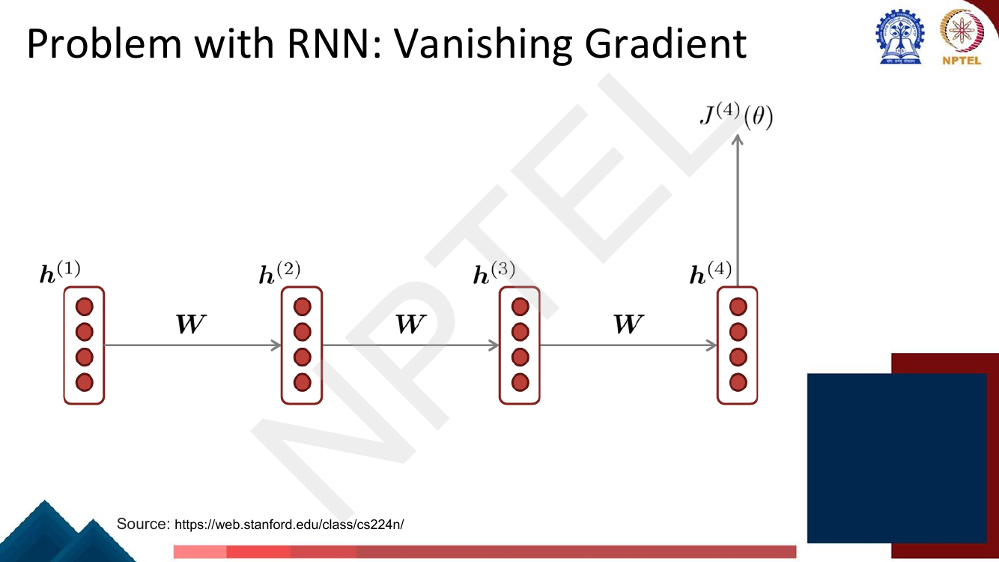
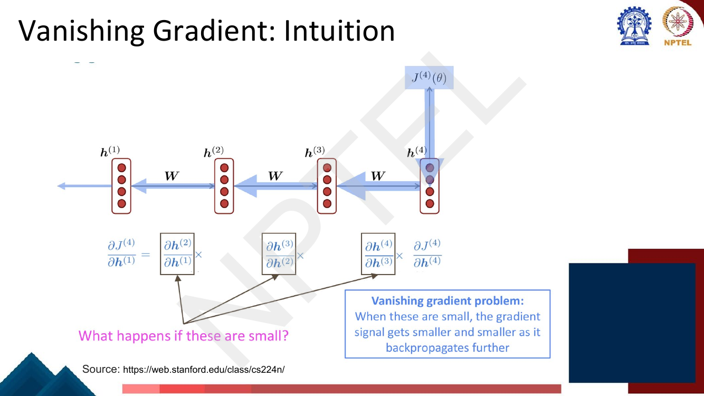
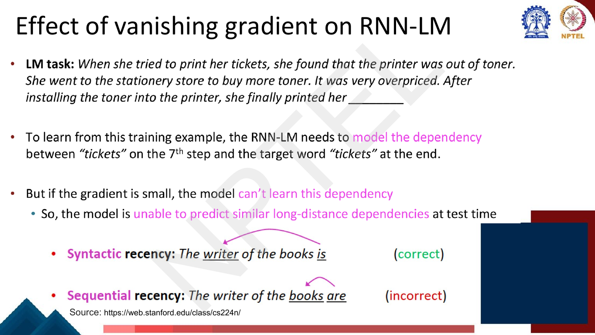
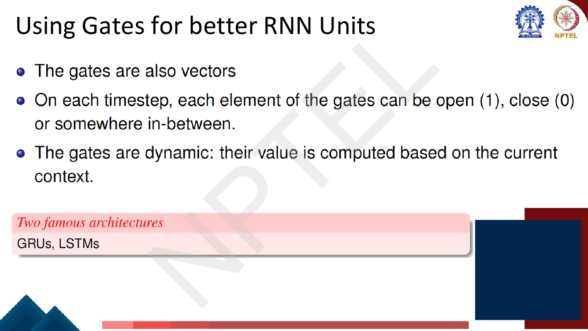
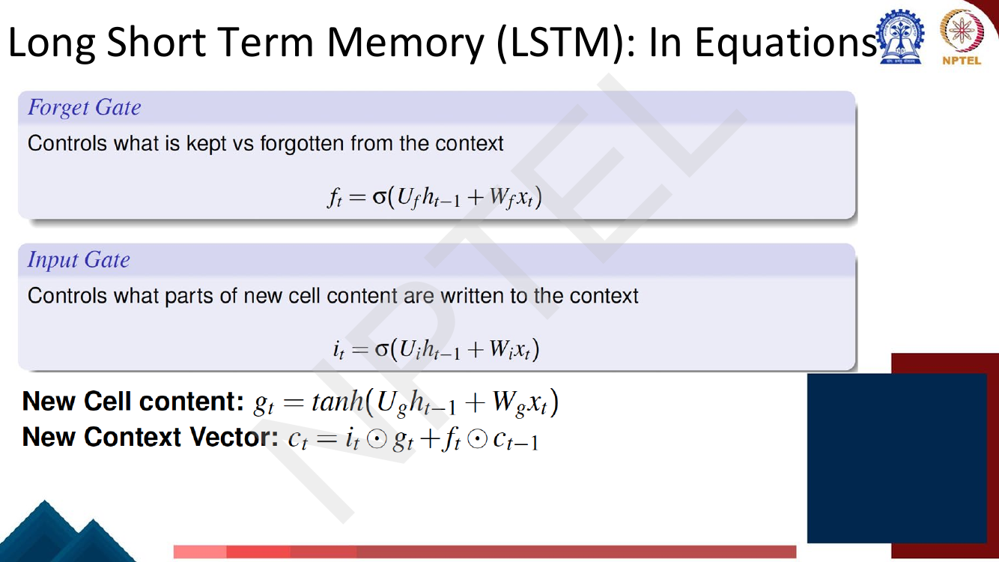
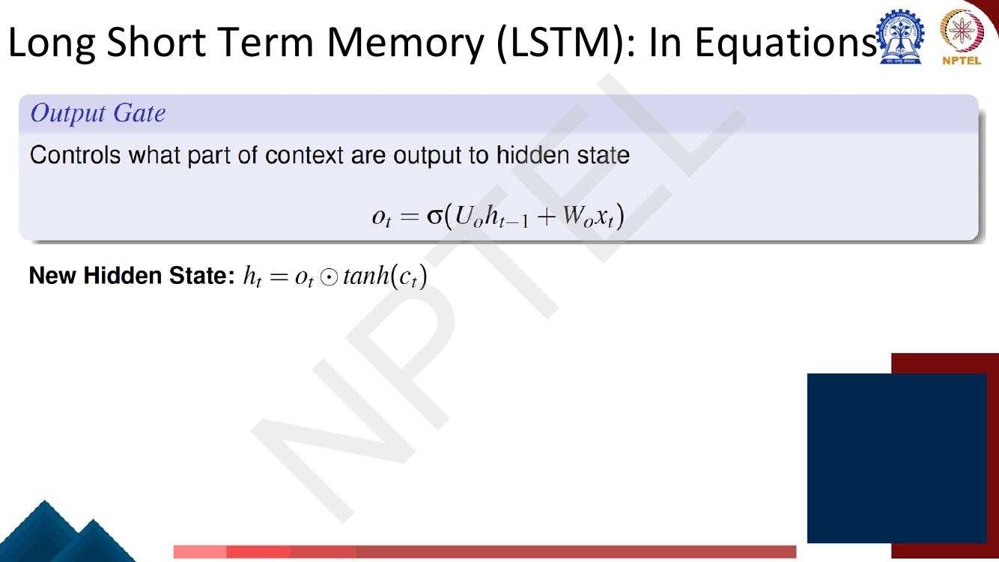
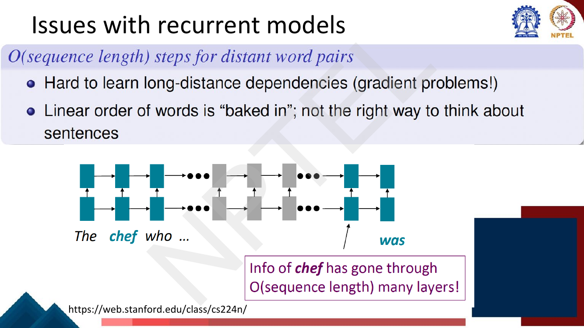
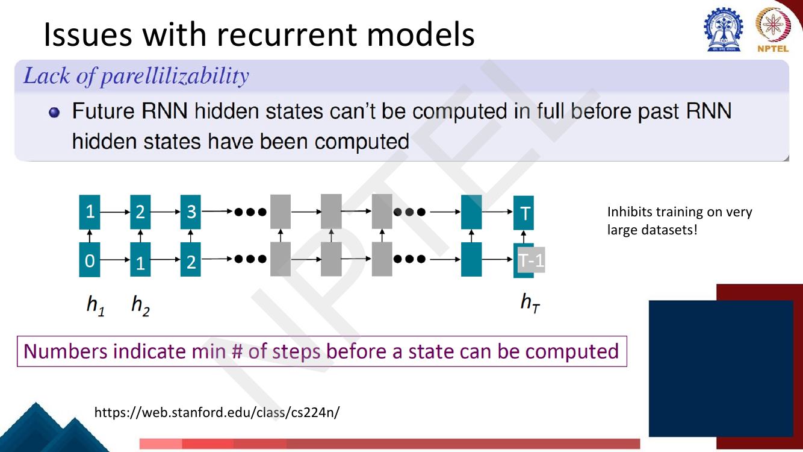
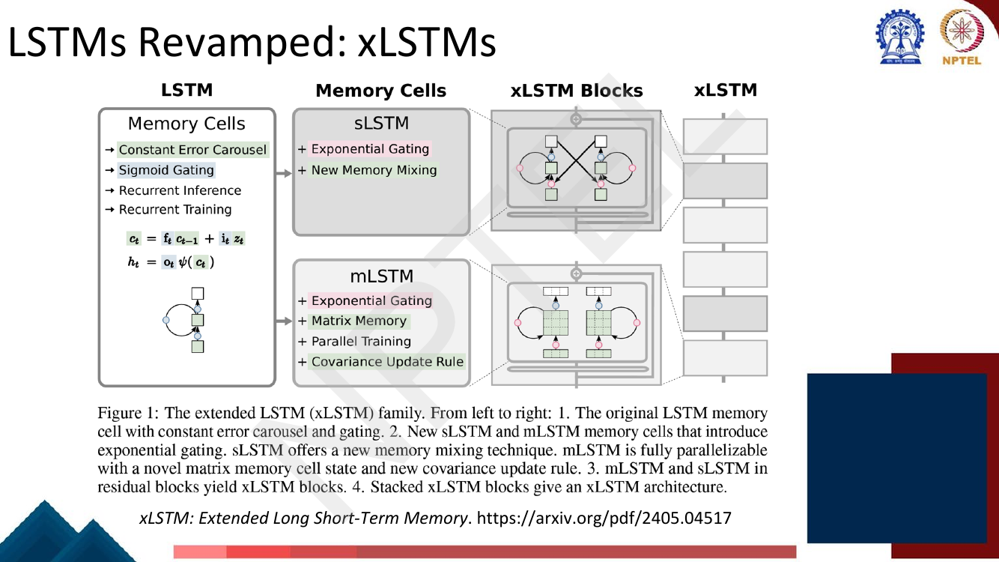

# Lec 20 — Better RNN Units: GRU and LSTM

> **Source:** `Week4.pdf` pp. 106–126 · **Week 4** · **Playlist:** Lec 20
> **Prereqs:** [Lec 16 — RNN Language Models](16-rnn-language-models.md), [Lec 9 — Backpropagation](../week-02/09-backpropagation.md)
> **Feeds into:** [Lec 21 — Intro to Transformers](../week-05/21-intro-to-transformers.md), [Lec 25 — Efficient Transformers](../week-05/25-efficient-transformers.md)

## Why this lecture exists

Lectures 16 to 19 built the recurrent stack: an RNN language model, sequence labelling, seq2seq with
attention, and decoding. Every one of them assumed the RNN could actually *learn* from what happened
many steps ago. It cannot.

The reason is arithmetic, not engineering. An RNN applies the **same** recurrent weight matrix at
every time step, so the gradient flowing from step $t$ back to step $k$ is multiplied by that one
matrix $t-k$ times. Anything raised to a large power either collapses to zero or blows up; there is
no middle. Collapse is the common case, and it means the model's weights get updated only by what
happened recently.

This lecture diagnoses that failure precisely and then fixes it with **gating**: replace the
"rewrite the state every step" recurrence with "keep the state unless a learned gate says otherwise".
That is the LSTM. It also closes with the two problems gating does *not* fix — which is the whole
reason Lecture 21 exists.

## The ideas

### The setup: one matrix, applied over and over

From [Lec 16](16-rnn-language-models.md), the vanilla RNN recurrence is (the deck's page 114 writes it
exactly this way, with $\mathbf{U}$ for the recurrent matrix and $\mathbf{W}$ for the input matrix):

$$\mathbf{h}_t = \tanh\!\left(\mathbf{U}\mathbf{h}_{t-1} + \mathbf{W}\mathbf{x}_t\right)$$

The deck's one-line summary of what is wrong: **"in a vanilla RNN, the hidden state is constantly
being rewritten."** There is no mechanism for *carrying* information unchanged. At every step the
state is squashed through a $\tanh$ and remixed by $\mathbf{U}$.

> **Deck notation.** The slides write the loss as $J^{(t)}(\theta)$ and the state as
> $\boldsymbol{h}^{(t)}$. This book writes $\mathcal{L}^{(t)}$ and $\mathbf{h}_t$ (contract §3).
> Same objects.


*Fig. — Notice what is labelled on every arrow: the **same** $\mathbf{W}$, four times. That repetition is the whole story of this lecture. Page 108 of `Week4.pdf`.*

### Deriving the vanishing gradient

Take a loss computed at step $t$ — say $\mathcal{L}^{(4)}$ in the deck's picture — and ask for its
gradient with respect to an early state $\mathbf{h}_1$. The chain rule gives a product:

$$\frac{\partial \mathcal{L}^{(4)}}{\partial \mathbf{h}_1}
= \frac{\partial \mathbf{h}_2}{\partial \mathbf{h}_1}\times
  \frac{\partial \mathbf{h}_3}{\partial \mathbf{h}_2}\times
  \frac{\partial \mathbf{h}_4}{\partial \mathbf{h}_3}\times
  \frac{\partial \mathcal{L}^{(4)}}{\partial \mathbf{h}_4}$$

which is exactly what page 110 prints. In general, for a loss at step $t$ and a state at step $k$:

$$\frac{\partial \mathcal{L}^{(t)}}{\partial \mathbf{h}_k}
= \left(\prod_{j=k+1}^{t} \mathbf{J}_j\right)^{\!\top}
  \frac{\partial \mathcal{L}^{(t)}}{\partial \mathbf{h}_t},
\qquad
\mathbf{J}_j \;=\; \frac{\partial \mathbf{h}_j}{\partial \mathbf{h}_{j-1}}
= \operatorname{diag}\!\big(1 - \mathbf{h}_j^{2}\big)\,\mathbf{U}$$

The $\operatorname{diag}(1-\mathbf{h}_j^2)$ factor is just $\tanh'$ evaluated at step $j$, since
$\tanh'(z) = 1 - \tanh^2(z)$. Two facts about it: it is **at most 1**, and it is *strictly* less than
1 unless the pre-activation is exactly 0. So every Jacobian in the product is a shrunk copy of
$\mathbf{U}$.

Now the key move. Bound the norm of the product:

$$\left\|\prod_{j=k+1}^{t} \mathbf{J}_j\right\|
\;\le\; \prod_{j=k+1}^{t}\big\|\operatorname{diag}(1-\mathbf{h}_j^2)\big\|\;\|\mathbf{U}\|
\;\le\; \big(\sigma_{\max}(\mathbf{U})\big)^{\,t-k}$$

where $\sigma_{\max}$ is the **largest singular value** of $\mathbf{U}$. Everything hangs on that one
number raised to the power $(t-k)$:

| $\sigma_{\max}(\mathbf{U})$ | What happens to the gradient over $t-k$ steps |
|---|---|
| $< 1$ | **vanishes** geometrically — this is a *sufficient* condition |
| $= 1$ | borderline; the $\tanh'$ factors still shrink it |
| $> 1$ | **can explode** — this is a *necessary* condition for exploding |

The deck does not print the singular-value statement, but it prints the consequence, with the
Jacobians boxed and the question "what happens if these are small?"


*Fig. — The boxed factors are the $\partial\mathbf{h}_j/\partial\mathbf{h}_{j-1}$ Jacobians. Each contains the same $\mathbf{U}$, so the product is effectively $\mathbf{U}$ raised to a power. Page 111.*

**Why this is worse than depth.** A deep feed-forward net ([Lec 8](../week-02/08-deep-neural-networks.md))
also multiplies a chain of Jacobians, but each layer has its **own** $\mathbf{W}^{(l)}$. Their
singular values are independent draws: some above 1, some below, and the deviations partly cancel.
You can also fix the scale at initialisation, layer by layer, which is exactly what He initialisation
does ([Lec 10](../week-02/10-gradient-descent-and-init.md)). In an RNN there is **one** matrix, reused
$T$ times, so any systematic deviation of $\sigma_{\max}$ from 1 compounds deterministically — and
you cannot rescale it per step, because weight sharing is the whole point of the architecture.

### Why a small gradient is not merely "slow learning"

The seductive wrong reading is "the gradient is small, so it just learns slowly from far away."
Page 112 corrects it: the gradient from far away is not small *in absolute terms*, it is small
**relative to the gradient from nearby**.


*Fig. — Two losses, two gradient paths, same destination. The deck's conclusion: "model weights are basically updated only with respect to near effects, not long-term effects." Page 112.*

Because the update to a shared weight is the **sum** of contributions from every time step, a
contribution that is $10^{-6}$ times the size of its neighbours is not slow — it is invisible. The
near-term signal dominates the sum completely. The model never learns the long-range rule at all.

### What this costs a language model

Page 113 makes it concrete with a sentence you should memorise the shape of:

> *When she tried to print her tickets, she found that the printer was out of toner. She went to the
> stationery store to buy more toner. It was very overpriced. After installing the toner into the
> printer, she finally printed her \_\_\_\_\_\_.*

To learn from this example the RNN-LM must connect **"tickets" at step 7** to the target **"tickets"**
dozens of steps later. If the gradient from the final position never reaches step 7, the dependency is
never learned, and at test time the model cannot predict it.


*Fig. — The second half is the sharper diagnostic. A vanishing-gradient RNN defaults to **sequential recency** (agree with the nearest noun, "books … are") instead of **syntactic recency** (agree with the head noun, "writer … is"). Page 113.*

That pair of sentences is near-certain exam material. **Syntactic recency** is the grammatically
correct dependency; **sequential recency** is the nearest-word heuristic a short-memory model falls
back on. Vanishing gradients bias the model toward sequential recency.

### The fix: gates

Page 114 states the diagnosis in one sentence — "it is too difficult for the RNN to learn to preserve
information over many timesteps" — and then asks for better units. The answer is **gates**.


*Fig. — Three properties to memorise: gates are **vectors** (not scalars), **element-wise** open/closed/in-between, and **dynamic** — recomputed from the current input and state at every step. Page 115.*

A **gate** is a vector in $[0,1]^{n}$ produced by a sigmoid, multiplied **element-wise** into some
other vector. Element-wise matters: coordinate 7 of the state can be held open while coordinate 8 is
shut, in the same step. And the gate is *computed*, not fixed — so the network learns a policy
"remember this kind of thing, forget that kind of thing", rather than a single fixed blend rate.

### LSTM: two states, three gates

Page 116 sets up the structure. At each step there are **two** vectors, both of length $n$:

| | Symbol | Role |
|---|---|---|
| **Cell state** | $\mathbf{C}_t$ | long-term memory; travels along a nearly uninterrupted path |
| **Hidden state** | $\mathbf{h}_t$ | the short-term, *exposed* output — what the rest of the network sees |

Readers confuse these constantly, so be precise: **the cell state is never read directly by anything
outside the unit.** The output layer, the next layer, attention — all of them see $\mathbf{h}_t$.
$\mathbf{C}_t$ is private storage, and $\mathbf{h}_t$ is a gated *view* of it. The deck's phrasing:
"the LSTM can **read**, **erase**, and **write** information from the cell", and which information is
read/erased/written is controlled by three corresponding gates.

> **Deck notation warning.** The slides write the cell state as lowercase $c^{(t)}$ and call it the
> "new context vector". This book writes $\mathbf{C}_t$ (capital), because lowercase $\mathbf{c}_t$ is
> reserved for the attention context vector of [Lec 18](18-seq2seq-and-attention.md). Do not confuse
> them — they are unrelated objects that the deck gives the same letter.


*Fig. — Trace the top rail: $\mathbf{C}_{t-1}$ enters, meets **one multiply** and **one add**, and leaves as $\mathbf{C}_t$. No matrix multiplication, no squashing function on that path. That is the entire reason the LSTM works. Page 117.*

### The equations, gate by gate

Pages 118–119 give them. Note that **the deck writes no bias terms** — every gate is
$\sigma(\mathbf{U}_\bullet\mathbf{h}_{t-1} + \mathbf{W}_\bullet\mathbf{x}_t)$, with $\mathbf{U}$ on
the hidden state and $\mathbf{W}$ on the input. Real implementations add a bias; the deck's page 121
problem explicitly says to ignore them.

**Forget gate** — controls what is kept versus forgotten from the context:

$$\mathbf{f}_t = \sigma\!\left(\mathbf{U}_f \mathbf{h}_{t-1} + \mathbf{W}_f \mathbf{x}_t\right)$$

**Input gate** — controls what parts of the new content get written to the context:

$$\mathbf{i}_t = \sigma\!\left(\mathbf{U}_i \mathbf{h}_{t-1} + \mathbf{W}_i \mathbf{x}_t\right)$$

**Candidate (the deck calls it "new cell content", $g_t$)** — the values that *could* be written:

$$\tilde{\mathbf{C}}_t = \tanh\!\left(\mathbf{U}_g \mathbf{h}_{t-1} + \mathbf{W}_g \mathbf{x}_t\right)$$

**Cell state update** — the single most important equation in this chapter:

$$\boxed{\;\mathbf{C}_t = \mathbf{f}_t \odot \mathbf{C}_{t-1} \;+\; \mathbf{i}_t \odot \tilde{\mathbf{C}}_t\;}$$

($\odot$ is the **element-wise** Hadamard product, not a matrix product. The deck prints the two terms
in the other order, $\mathbf{i}_t\odot g_t + \mathbf{f}_t\odot c_{t-1}$; addition commutes, so this is
the same equation.)


*Fig. — Both gates are $\sigma$; the candidate is $\tanh$. Also note there are no bias terms anywhere on this slide — that convention is what makes the page-121 parameter count come out as it does. Page 118.*

**Output gate** — controls what part of the context is exposed to the hidden state:

$$\mathbf{o}_t = \sigma\!\left(\mathbf{U}_o \mathbf{h}_{t-1} + \mathbf{W}_o \mathbf{x}_t\right),
\qquad
\mathbf{h}_t = \mathbf{o}_t \odot \tanh\!\left(\mathbf{C}_t\right)$$


*Fig. — The $\tanh$ here is applied to $\mathbf{C}_t$, **not** to a pre-activation; it just squashes the unbounded cell state into $[-1,1]$ before the gate scales it. Page 119.*

### Sigmoid for gates, tanh for values — the guaranteed exam question

Three of the six quantities use $\sigma$ and two use $\tanh$, and the split is not arbitrary:

| Function | Range | Used for | Why |
|---|---|---|---|
| $\sigma$ | $(0,1)$ | $\mathbf{f}_t, \mathbf{i}_t, \mathbf{o}_t$ | a gate answers "**how much** to let through"; that is a fraction, so it must live in $[0,1]$. 0 = fully shut, 1 = fully open. |
| $\tanh$ | $(-1,1)$ | $\tilde{\mathbf{C}}_t$, and the squash of $\mathbf{C}_t$ | a candidate is a **value**, not a fraction; it must be able to be negative so the cell can both increase and decrease a stored quantity, and it is zero-centred so updates do not drift. |

Swap them and the unit breaks in a diagnosable way: a $\tanh$ gate could *negate* the thing it gates,
and a $\sigma$ candidate could only ever add to the cell, never subtract.

### How gating defeats the vanishing gradient

Here is the derivation the deck gestures at on page 120 but does not write.

Along the cell-state path, differentiate the update equation. The first term is
$\mathbf{f}_t \odot \mathbf{C}_{t-1}$, so the direct Jacobian is

$$\frac{\partial \mathbf{C}_t}{\partial \mathbf{C}_{t-1}} = \operatorname{diag}(\mathbf{f}_t)$$

Compare the two chains over a distance of $d = t-k$ steps:

| | Vanilla RNN | LSTM cell path |
|---|---|---|
| Factor per step | $\operatorname{diag}(1-\mathbf{h}_j^2)\,\mathbf{U}$ | $\operatorname{diag}(\mathbf{f}_j)$ |
| Structure | full matrix, **same every step** | **diagonal**, recomputed every step |
| Controlled by | a learned weight matrix, used $d$ times | a learned **gate**, free to differ per step and per coordinate |
| Product over $d$ steps | $\approx \sigma_{\max}(\mathbf{U})^d$ | $\prod_j \mathbf{f}_j$, coordinate-wise |

The difference is not that the LSTM's product cannot shrink — if $\mathbf{f}_j \approx 0$ it shrinks
instantly, and it should, because that coordinate was deliberately erased. The difference is that the
network **can choose** $\mathbf{f}_j \approx 1$ for a coordinate it wants to preserve, and when it
does, the gradient passes through that coordinate essentially unattenuated for as long as the gate
stays open. The deck's version: "if the forget gate is set to remember everything on every timestep,
then the info in the cell is preserved indefinitely. By contrast, it is harder for a vanilla RNN to
learn a recurrent weight matrix $\mathbf{U}$ that preserves info in hidden state."

Two further reasons the LSTM path is better behaved:

- It is **additive**, not multiplicative-and-squashed. $\mathbf{C}_{t-1}$ is copied forward and
  something is *added* to it; there is no $\tanh$ on the carry path to shrink the derivative.
- The gate is **diagonal and per-coordinate**, so one dimension can hold a fact open for 100 steps
  while another dimension is rewritten every step. A single shared $\mathbf{U}$ cannot do that.

Be precise about the claim: the LSTM does not *eliminate* vanishing gradients. There is still an
indirect path $\mathbf{C}_{t-1} \to \mathbf{h}_{t-1} \to$ gates $\to \mathbf{C}_t$ that behaves like
the vanilla chain. What the LSTM provides is a **shortcut** along which gradient can survive. Empirically
LSTMs handle roughly 100-step dependencies where vanilla RNNs manage ~7–10.

### GRU — named on the deck, but not defined

Page 115 names "GRUs, LSTMs" as the two famous gated architectures, and the lecture title says
"GRU, LSTM" — but **this deck contains no GRU equations, no GRU diagram, and no GRU/LSTM comparison**.
It teaches only the LSTM. Since the title promises GRU and your companion vision course covers it,
here is the minimum, flagged as *not from these slides*:

$$\mathbf{z}_t = \sigma(\mathbf{U}_z\mathbf{h}_{t-1} + \mathbf{W}_z\mathbf{x}_t)
\qquad
\mathbf{r}_t = \sigma(\mathbf{U}_r\mathbf{h}_{t-1} + \mathbf{W}_r\mathbf{x}_t)$$
$$\tilde{\mathbf{h}}_t = \tanh\!\left(\mathbf{U}_h(\mathbf{r}_t \odot \mathbf{h}_{t-1}) + \mathbf{W}_h\mathbf{x}_t\right)$$
$$\mathbf{h}_t = (1-\mathbf{z}_t)\odot\mathbf{h}_{t-1} + \mathbf{z}_t\odot\tilde{\mathbf{h}}_t
\qquad \text{(Cho et al. 2014)}$$

The **reset gate** $\mathbf{r}_t$ gates the past *inside* the candidate; the **update gate**
$\mathbf{z}_t$ interpolates old against new. **Convention warning:** the vision course's deck prints
the complement, $\mathbf{h}_t = \mathbf{z}_t\odot\mathbf{h}_{t-1} + (1-\mathbf{z}_t)\odot\tilde{\mathbf{h}}_t$,
so that $\mathbf{z}_t = 1$ means "keep". Both appear in the literature. Since *this* deck prints
neither, state which you are using if an exam question is ambiguous — and see
[the vision course's GRU treatment](../../../GenAIforCV/notes/week-05/19-gru-seq2seq-attention.md)
for the worked version in that convention.

| | LSTM | GRU |
|---|---|---|
| Gates | 3 ($\mathbf{f},\mathbf{i},\mathbf{o}$) | 2 ($\mathbf{r},\mathbf{z}$) |
| States | 2 ($\mathbf{C}_t$ and $\mathbf{h}_t$) | 1 ($\mathbf{h}_t$ only) |
| Weight blocks | 4 | 3 |
| Parameters | $4\big(n_h(n_h+n_x)+n_h\big)$ | $3\big(n_h(n_h+n_x)+n_h\big)$ |
| Relative cost | 1.00 | 0.75 — faster to train |

Rule of thumb: comparable accuracy on most tasks; LSTM is the safer default on very long sequences,
GRU is cheaper. Neither dominates.

### What gating does *not* fix

Pages 122–123 close the recurrent half of the course with two problems that gating cannot touch.


*Fig. — The **path length** between two positions is $O(n)$, where $n$ is their separation. Gating makes each hop lossless-ish; it does not reduce the number of hops. Page 122.*

**Problem 1 — $O(n)$ path length.** For information at position $i$ to influence position $j$, it must
traverse $|i-j|$ recurrent steps. Long-distance dependencies stay hard, and the deck adds a second
objection: **linear order is "baked in"**, which is "not the right way to think about sentences" —
syntax is a tree, not a chain.


*Fig. — The numbers are the point: $\mathbf{h}_T$ cannot start until $\mathbf{h}_{T-1}$ is finished, so the forward pass takes $T$ sequential steps regardless of how many GPUs you own. Page 123.*

**Problem 2 — no parallelism.** "Future RNN hidden states can't be computed in full before past RNN
hidden states have been computed." The recurrence is inherently **sequential in time**. Both the
forward and backward passes cost $O(T)$ sequential operations, and no amount of hardware removes that.
The deck's verdict: *"Inhibits training on very large datasets!"*

These two problems — $O(n)$ path length and zero time-parallelism — are the exact specification that
[Lec 21](../week-05/21-intro-to-transformers.md) answers. Hold the question open; do not read the
answer here.

### xLSTM — the 2024 revival

Page 124 is a single slide on **xLSTM** (Beck et al., 2024, arXiv 2405.04517), worth knowing because
it is unusual enough to be examinable. The argument: the classic LSTM's limits are (i) sigmoid gating
saturates, (ii) a *vector* cell state has limited storage, (iii) memory mixing forces sequential
training. xLSTM changes all three:

| Variant | Changes | Effect |
|---|---|---|
| **sLSTM** | exponential gating + new memory mixing | sharper, less saturated gates; still recurrent |
| **mLSTM** | exponential gating + **matrix memory** + covariance update rule | memory is a matrix, not a vector; **fully parallelizable training** |

Both are wrapped in residual blocks to give **xLSTM blocks**, and stacking those gives the xLSTM
architecture. The slide also names the classic LSTM's carry path by its original name: the **constant
error carousel** — Hochreiter and Schmidhuber's term for exactly the $\partial\mathbf{C}_t/\partial\mathbf{C}_{t-1}=\mathbf{f}_t$
path derived above.


*Fig. — The one fact to carry: **mLSTM is fully parallelizable** because matrix memory removes the memory-mixing dependency. That directly attacks the page-123 complaint. Page 124.*

## Worked numericals

### N1. Bi-LSTM parameter count for code-switched language labelling (page 121 — the deck's own problem)

**Given:** a Bi-LSTM sequence labeller. 5 possible language tags per word; word embeddings are
50-dimensional; the forward and backward LSTM hidden states are 40-dimensional **each**. Ignore bias
terms.
**Find:** total number of trainable parameters.

*The deck gives no solution — page 122 moves straight on to a new topic. The work below is mine; check
it carefully.*

1. **Fix the dimensions.** $n_x = 50$ (embedding), $n_h = 40$ (per direction), number of tags $= 5$.
2. **One LSTM has four weight blocks**, not three: forget $\mathbf{f}$, input $\mathbf{i}$,
   candidate $\tilde{\mathbf{C}}$, output $\mathbf{o}$. Each block has a recurrent matrix
   $\mathbf{U}_\bullet \in \mathbb{R}^{40\times 40}$ and an input matrix
   $\mathbf{W}_\bullet \in \mathbb{R}^{40\times 50}$.
3. Per block: $40\times 40 + 40\times 50 = 1600 + 2000 = 3600$.
4. One direction: $4 \times 3600 = \mathbf{14{,}400}$.
5. **Two directions** (forward and backward are separate parameter sets):
   $2 \times 14{,}400 = \mathbf{28{,}800}$.
6. **The output layer.** Sequence labelling emits a tag per word, from the concatenated state
   $[\overrightarrow{\mathbf{h}}_t; \overleftarrow{\mathbf{h}}_t] \in \mathbb{R}^{80}$ to 5 tags:
   $80 \times 5 = \mathbf{400}$.
7. Total: $28{,}800 + 400 = 29{,}200$.
8. **What is *not* counted.** The embedding matrix: the problem says each word "has" a 50-dimensional
   embedding and never gives a vocabulary size, so the embeddings are taken as given, not trained.
   If a variant of this question supplies $|V|$, add $50\,|V|$.

**Answer:** $\mathbf{29{,}200}$ trainable parameters.

*Variants to be ready for.* If biases **were** included: $4(1600+2000+40) = 14{,}560$ per direction,
$29{,}120$ for both, plus $400 + 5 = 405$ for the output layer $= \mathbf{29{,}525}$. If a question
asks only for "the Bi-LSTM parameters" and not the classifier, the answer is $\mathbf{28{,}800}$.
Read which one is being asked.

### N2. One LSTM step, fully by hand

**Given:** $n_h = n_x = 2$. Inputs
$\mathbf{h}_{t-1} = [0.5, -0.5]^\top$, $\mathbf{x}_t = [1.0, 2.0]^\top$,
$\mathbf{C}_{t-1} = [0.4, -0.2]^\top$. Weights (deck convention, no biases):

$$\mathbf{U}_f=\begin{bmatrix}0.4&-0.4\\0.2&0.2\end{bmatrix},\;
\mathbf{W}_f=\begin{bmatrix}0.2&0.2\\0.1&-0.05\end{bmatrix};\quad
\mathbf{U}_i=\begin{bmatrix}0.2&0.2\\0.6&-0.6\end{bmatrix},\;
\mathbf{W}_i=\begin{bmatrix}0.2&-0.1\\0.4&0.5\end{bmatrix}$$
$$\mathbf{U}_g=\begin{bmatrix}0.6&-0.6\\-0.2&0.2\end{bmatrix},\;
\mathbf{W}_g=\begin{bmatrix}0.2&0.1\\-0.4&-0.2\end{bmatrix};\quad
\mathbf{U}_o=\begin{bmatrix}0.8&-0.8\\0.4&0.4\end{bmatrix},\;
\mathbf{W}_o=\begin{bmatrix}0.4&0.4\\0.2&-0.1\end{bmatrix}$$

**Find:** $\mathbf{f}_t, \mathbf{i}_t, \tilde{\mathbf{C}}_t, \mathbf{C}_t, \mathbf{o}_t, \mathbf{h}_t$.

1. **Forget pre-activation.** $\mathbf{U}_f\mathbf{h}_{t-1} = [0.4(0.5)+(-0.4)(-0.5),\; 0.2(0.5)+0.2(-0.5)] = [0.4,\,0]$.
   $\mathbf{W}_f\mathbf{x}_t = [0.2(1)+0.2(2),\; 0.1(1)+(-0.05)(2)] = [0.6,\,0]$. Sum $= [1.0,\,0.0]$.
2. $\mathbf{f}_t = \sigma([1.0, 0.0]) = [1/(1+e^{-1}),\, 0.5] = [\mathbf{0.7311},\, \mathbf{0.5000}]$.
3. **Input pre-activation.** $\mathbf{U}_i\mathbf{h}_{t-1} = [0.1-0.1,\; 0.3+0.3] = [0,\,0.6]$;
   $\mathbf{W}_i\mathbf{x}_t = [0.2-0.2,\; 0.4+1.0] = [0,\,1.4]$. Sum $= [0.0,\,2.0]$.
4. $\mathbf{i}_t = \sigma([0.0, 2.0]) = [\mathbf{0.5000},\, \mathbf{0.8808}]$.
5. **Candidate pre-activation.** $\mathbf{U}_g\mathbf{h}_{t-1} = [0.3+0.3,\; -0.1-0.1] = [0.6,\,-0.2]$;
   $\mathbf{W}_g\mathbf{x}_t = [0.2+0.2,\; -0.4-0.4] = [0.4,\,-0.8]$. Sum $= [1.0,\,-1.0]$.
6. $\tilde{\mathbf{C}}_t = \tanh([1.0,-1.0]) = [\mathbf{0.7616},\, \mathbf{-0.7616}]$.
7. **Cell state.** $\mathbf{f}_t \odot \mathbf{C}_{t-1} = [0.7311(0.4),\; 0.5(-0.2)] = [0.2924,\, -0.1000]$.
   $\mathbf{i}_t \odot \tilde{\mathbf{C}}_t = [0.5(0.7616),\; 0.8808(-0.7616)] = [0.3808,\, -0.6708]$.
8. $\mathbf{C}_t = [0.2924+0.3808,\; -0.1000-0.6708] = [\mathbf{0.6732},\, \mathbf{-0.7708}]$.
9. **Output pre-activation.** $\mathbf{U}_o\mathbf{h}_{t-1} = [0.4+0.4,\; 0.2-0.2] = [0.8,\,0]$;
   $\mathbf{W}_o\mathbf{x}_t = [0.4+0.8,\; 0.2-0.2] = [1.2,\,0]$. Sum $= [2.0,\,0.0]$.
10. $\mathbf{o}_t = \sigma([2.0, 0.0]) = [\mathbf{0.8808},\, \mathbf{0.5000}]$.
11. **Hidden state.** $\tanh(\mathbf{C}_t) = \tanh([0.6732, -0.7708]) = [0.5871,\, -0.6474]$.
12. $\mathbf{h}_t = \mathbf{o}_t \odot \tanh(\mathbf{C}_t) = [0.8808(0.5871),\; 0.5(-0.6474)]
    = [\mathbf{0.5171},\, \mathbf{-0.3237}]$.

**Answer:** $\mathbf{C}_t = [0.6732,\, -0.7708]^\top$, $\mathbf{h}_t = [0.5171,\, -0.3237]^\top$.
Read the second coordinate as a story: $f = 0.5$ halved the old memory, $i = 0.88$ wrote in a strongly
negative candidate, and $o = 0.5$ exposed only half of the result.

### N3. How far does the gradient actually reach?

**Given:** a vanilla RNN whose per-step gradient factor is $0.5$, and an LSTM whose forget gate sits at
$0.95$ on the coordinate of interest. Gradient entering at $\mathbf{h}_t$ has magnitude 1.
**Find:** the magnitude surviving 10, 20 and 50 steps back.

1. Vanilla: $0.5^{10} = 1/1024 = 9.766\times 10^{-4}$.
2. LSTM: $0.95^{10} = 0.5987$.
3. Vanilla: $0.5^{20} = (0.5^{10})^2 = 9.537\times 10^{-7}$. LSTM: $0.95^{20} = 0.3585$.
4. Vanilla: $0.5^{50} = 8.882\times 10^{-16}$. LSTM: $0.95^{50} = 0.07694$.

| Steps back $d$ | Vanilla $0.5^d$ | LSTM $0.95^d$ | LSTM ÷ vanilla |
|---|---|---|---|
| 10 | $9.77\times10^{-4}$ | 0.599 | $6.1\times 10^{2}$ |
| 20 | $9.54\times10^{-7}$ | 0.358 | $3.8\times 10^{5}$ |
| 50 | $8.88\times10^{-16}$ | 0.0769 | $8.7\times 10^{13}$ |

**Answer:** at 50 steps the vanilla gradient is $\sim 10^{-15}$ — below float32 resolution against a
nearby gradient of order 1, i.e. genuinely zero — while the LSTM still delivers 7.7% of the signal.
The advantage grows *exponentially* with distance: a factor of 600 at 10 steps, $10^{14}$ at 50.

### N4. LSTM parameter count, and where the 4 comes from

**Given:** an LSTM layer with hidden size $n_h = 256$ and input size $n_x = 300$, **with** biases.
**Find:** the parameter count, and the general formula.

1. The unit computes **four** affine maps of $(\mathbf{h}_{t-1}, \mathbf{x}_t)$ — one each for
   $\mathbf{f}_t$, $\mathbf{i}_t$, $\tilde{\mathbf{C}}_t$, $\mathbf{o}_t$. That is the factor of 4.
   (The $\mathbf{C}_t$ update and the $\mathbf{h}_t$ output involve **no new weights** — they are pure
   element-wise arithmetic on things already computed.)
2. One affine map: $\mathbf{U}_\bullet$ is $n_h \times n_h$, $\mathbf{W}_\bullet$ is $n_h \times n_x$,
   bias $\mathbf{b}_\bullet$ is $n_h$. So $n_h\,n_h + n_h\,n_x + n_h = n_h(n_h+n_x) + n_h$.
3. Total: $\;4\big(n_h(n_h+n_x) + n_h\big)$.
4. Substituting: $n_h + n_x = 256 + 300 = 556$; $256 \times 556 = 142{,}336$; $+\,256 = 142{,}592$.
5. $4 \times 142{,}592 = 570{,}368$.

**Answer:** $\mathbf{570{,}368}$ parameters. The factor of 4 is **four gate-sized affine maps**
(3 gates + 1 candidate), *not* four gates — there are only three gates.

### N5. GRU parameter count and the 3:4 ratio

**Given:** the same $n_h = 256$, $n_x = 300$, with biases, as a GRU.
**Find:** parameter count and the ratio to the LSTM of N4.

1. A GRU computes **three** affine maps: update $\mathbf{z}_t$, reset $\mathbf{r}_t$, candidate
   $\tilde{\mathbf{h}}_t$. So $3\big(n_h(n_h+n_x)+n_h\big)$.
2. Reuse step 4 of N4: the per-block count is $142{,}592$.
3. $3 \times 142{,}592 = 427{,}776$.
4. Ratio: $427{,}776 / 570{,}368 = 3/4 = 0.75$ exactly — the dimensions cancel, so **a GRU always has
   exactly 75% of the parameters of an LSTM with the same $n_h$ and $n_x$**.

**Answer:** $\mathbf{427{,}776}$ parameters, exactly $3/4$ of the LSTM. Saving: $142{,}592$ parameters,
i.e. 25%.

## Code

```python
import numpy as np

sigmoid = lambda z: 1.0 / (1.0 + np.exp(-z))

# ---- 1. One LSTM cell, deck convention (U on h_{t-1}, W on x_t, NO biases) ----
def lstm_step(x, h_prev, C_prev, p):
    f = sigmoid(p["Uf"] @ h_prev + p["Wf"] @ x)      # forget gate  : sigmoid -> "how much to keep"
    i = sigmoid(p["Ui"] @ h_prev + p["Wi"] @ x)      # input  gate  : sigmoid -> "how much to write"
    g = np.tanh(p["Ug"] @ h_prev + p["Wg"] @ x)      # candidate    : tanh    -> a VALUE, can be < 0
    C = f * C_prev + i * g                           # cell update  : element-wise, the key line
    o = sigmoid(p["Uo"] @ h_prev + p["Wo"] @ x)      # output gate  : sigmoid -> "how much to expose"
    h = o * np.tanh(C)                               # exposed hidden state
    return f, i, g, C, o, h

p = dict(
    Uf=np.array([[0.4, -0.4], [0.2, 0.2]]),  Wf=np.array([[0.2, 0.2], [0.1, -0.05]]),
    Ui=np.array([[0.2, 0.2], [0.6, -0.6]]),  Wi=np.array([[0.2, -0.1], [0.4, 0.5]]),
    Ug=np.array([[0.6, -0.6], [-0.2, 0.2]]), Wg=np.array([[0.2, 0.1], [-0.4, -0.2]]),
    Uo=np.array([[0.8, -0.8], [0.4, 0.4]]),  Wo=np.array([[0.4, 0.4], [0.2, -0.1]]),
)
f, i, g, C, o, h = lstm_step(np.array([1.0, 2.0]),      # x_t
                             np.array([0.5, -0.5]),     # h_{t-1}
                             np.array([0.4, -0.2]), p)  # C_{t-1}
for name, v in [("f_t", f), ("i_t", i), ("C~_t", g), ("C_t", C), ("o_t", o), ("h_t", h)]:
    print(f"{name:>5} = {np.round(v, 4)}")
# matches N2 exactly:
#   f_t = [0.7311 0.5   ]
#   i_t = [0.5    0.8808]
#  C~_t = [ 0.7616 -0.7616]
#   C_t = [ 0.6732 -0.7708]
#   o_t = [0.8808 0.5   ]
#   h_t = [ 0.5171 -0.3237]

# ---- 2. Gradient decay with distance: vanilla chain vs LSTM forget-gate chain ----
rng = np.random.default_rng(0)
n = 20
U = rng.normal(0, 1, (n, n)); U *= 0.9 / np.linalg.norm(U, 2)   # force sigma_max(U) = 0.9
print(f"\nsigma_max(U) = {np.linalg.svd(U, compute_uv=False)[0]:.3f}")

print(f"{'d':>4} {'vanilla ||prod J||':>20} {'LSTM f=0.95':>14} {'ratio':>12}")
P = np.eye(n)                                     # one single chain, extended step by step
for d in range(1, 51):
    tanh_prime = 1 - np.tanh(rng.normal(0, 0.5, n))**2
    P = np.diag(tanh_prime) @ U @ P               # tanh'(a_d) * U  -- the SAME U every step
    if d in (1, 5, 10, 20, 50):
        vanilla, lstm = np.linalg.norm(P, 2), 0.95 ** d
        print(f"{d:>4} {vanilla:>20.3e} {lstm:>14.4f} {lstm/vanilla:>12.3e}")
#  sigma_max(U) = 0.900
#     d   vanilla ||prod J||    LSTM f=0.95        ratio
#     1            7.481e-01         0.9500    1.270e+00
#     5            3.711e-02         0.7738    2.085e+01
#    10            5.046e-04         0.5987    1.187e+03
#    20            6.085e-08         0.3585    5.891e+06
#    50            4.174e-19         0.0769    1.843e+17

# ---- 3. Parameter counts (N1, N4, N5) ----
lstm_params = lambda nh, nx, bias=True: 4 * (nh * (nh + nx) + (nh if bias else 0))
gru_params  = lambda nh, nx, bias=True: 3 * (nh * (nh + nx) + (nh if bias else 0))
print("\np.121 Bi-LSTM:", 2 * lstm_params(40, 50, bias=False) + 80 * 5)   # 29200
print("LSTM 256/300 :", lstm_params(256, 300))                            # 570368
print("GRU  256/300 :", gru_params(256, 300),
      " ratio =", gru_params(256, 300) / lstm_params(256, 300))           # 427776, 0.75
# p.121 Bi-LSTM: 29200
# LSTM 256/300 : 570368
# GRU  256/300 : 427776  ratio = 0.75
```

Block 2 is the derivation made visible. The vanilla product uses the **same** $\mathbf{U}$ every step
with $\sigma_{\max} = 0.9$, and after 50 steps it has decayed to $4\times10^{-19}$ even though 0.9 is
barely below 1 (the $\tanh'$ factors shrink it further still). The LSTM column is just $0.95^d$ — a gate the network *chose* — and it still carries 7.7%.

## Exam pack

### Must-memorise

| Item | Exactly this |
|---|---|
| Vanilla RNN recurrence (deck p. 114) | $\mathbf{h}_t = \tanh(\mathbf{U}\mathbf{h}_{t-1} + \mathbf{W}\mathbf{x}_t)$ |
| Gradient chain | $\dfrac{\partial\mathcal{L}^{(t)}}{\partial\mathbf{h}_k} = \Big(\prod_{j=k+1}^{t}\dfrac{\partial\mathbf{h}_j}{\partial\mathbf{h}_{j-1}}\Big)^{\!\top}\dfrac{\partial\mathcal{L}^{(t)}}{\partial\mathbf{h}_t}$ |
| One Jacobian | $\dfrac{\partial\mathbf{h}_j}{\partial\mathbf{h}_{j-1}} = \operatorname{diag}(1-\mathbf{h}_j^2)\,\mathbf{U}$ |
| Vanishing condition | $\sigma_{\max}(\mathbf{U}) < 1$ ⟹ gradient vanishes geometrically in $(t-k)$ |
| Exploding condition | $\sigma_{\max}(\mathbf{U}) > 1$ is **necessary** (not sufficient) for explosion |
| Why worse than depth | the **same** matrix is reused every step; a deep net has a different $\mathbf{W}^{(l)}$ per layer |
| Forget gate | $\mathbf{f}_t = \sigma(\mathbf{U}_f\mathbf{h}_{t-1} + \mathbf{W}_f\mathbf{x}_t)$ |
| Input gate | $\mathbf{i}_t = \sigma(\mathbf{U}_i\mathbf{h}_{t-1} + \mathbf{W}_i\mathbf{x}_t)$ |
| Candidate | $\tilde{\mathbf{C}}_t = \tanh(\mathbf{U}_g\mathbf{h}_{t-1} + \mathbf{W}_g\mathbf{x}_t)$ |
| **Cell update** | $\mathbf{C}_t = \mathbf{f}_t\odot\mathbf{C}_{t-1} + \mathbf{i}_t\odot\tilde{\mathbf{C}}_t$ |
| Output gate | $\mathbf{o}_t = \sigma(\mathbf{U}_o\mathbf{h}_{t-1} + \mathbf{W}_o\mathbf{x}_t)$ |
| Hidden state | $\mathbf{h}_t = \mathbf{o}_t\odot\tanh(\mathbf{C}_t)$ |
| Gates use | $\sigma$ — a gate is a fraction in $[0,1]$: "how much to let through" |
| Candidates use | $\tanh$ — a candidate is a **value** in $[-1,1]$, must be able to be negative |
| Why LSTM fixes it | $\partial\mathbf{C}_t/\partial\mathbf{C}_{t-1} = \operatorname{diag}(\mathbf{f}_t)$ — a **learned, per-coordinate** gate the net can hold near 1, not a fixed matrix raised to a power |
| $\mathbf{C}_t$ vs $\mathbf{h}_t$ | $\mathbf{C}_t$ = long-term, private, carried; $\mathbf{h}_t$ = short-term, exposed, gated view of $\mathbf{C}_t$ |
| LSTM params | $4\big(n_h(n_h+n_x)+n_h\big)$ |
| GRU params | $3\big(n_h(n_h+n_x)+n_h\big)$ = exactly $0.75\times$ LSTM |
| Two residual RNN problems | $O(n)$ path length for distant pairs; **no parallelism across time** |

### Numbers worth knowing

| Quantity | Value |
|---|---|
| Gates in an LSTM | **3** (forget, input, output) |
| Weight blocks in an LSTM | **4** (3 gates + candidate) — source of the factor 4 |
| Gates / blocks / states in a GRU | 2 gates, 3 blocks, **1** state |
| Deck's page-121 answer (worked here) | **29,200** parameters |
| …its pieces | 3,600 per block · 14,400 per direction · 28,800 both · 400 classifier |
| Dependency length a vanilla RNN handles | ~7–10 steps; LSTM ~100 |
| $\sigma(0),\ \sigma(1),\ \sigma(2)$ | 0.5, 0.7311, 0.8808 |
| $\tanh(1),\ \tanh(0.5)$ | 0.7616, 0.4621 |
| $0.5^{50}$ vs $0.95^{50}$ | $8.9\times10^{-16}$ vs $0.0769$ |
| LSTM proposed | Hochreiter & Schmidhuber, **1997** |
| GRU proposed | Cho et al., **2014** |
| xLSTM | Beck et al., **2024**, arXiv 2405.04517 |
| xLSTM variants | **sLSTM** (exponential gating + memory mixing), **mLSTM** (matrix memory, parallelizable) |
| Deck's textbook reference (p. 125) | Jurafsky & Martin, *SLP* 3rd ed., Aug 2024, **Chapter 8** |

### Likely MCQ traps

- **"An LSTM has four gates."** No — **three** gates and **one** candidate. The 4 in the parameter
  formula counts *affine maps*, not gates.
- **"The forget gate uses tanh."** No. All three gates are $\sigma$; only the candidate and the final
  squash of $\mathbf{C}_t$ use $\tanh$. If asked "which activation and why", the answer is the
  fraction-vs-value distinction.
- **Confusing $\mathbf{C}_t$ with $\mathbf{h}_t$.** The next layer, the softmax and attention all read
  $\mathbf{h}_t$. $\mathbf{C}_t$ never leaves the cell.
- **Confusing the LSTM cell state $\mathbf{C}_t$ with the attention context vector $\mathbf{c}_t$.**
  The deck calls $c_t$ "the new context vector", which invites exactly this error. Attention's
  $\mathbf{c}_t$ belongs to [Lec 18](18-seq2seq-and-attention.md) and is a weighted sum of *encoder*
  states.
- **"$\odot$ is matrix multiplication."** It is **element-wise**. $\mathbf{f}_t$ and $\mathbf{C}_{t-1}$
  both have length $n_h$; the result has length $n_h$.
- **"$\mathbf{f}_t = 1$ means forget."** Backwards. $\mathbf{f}_t = 1$ means **keep** (the gate is
  open); $\mathbf{f}_t = 0$ erases. The name describes what the gate *controls*, not what 1 does.
- **"LSTMs eliminate the vanishing gradient."** They *mitigate* it by providing a path along which
  gradient can survive. The indirect path through $\mathbf{h}$ still vanishes.
- **"Gating solves long-range dependencies, so Transformers were unnecessary."** Gating fixes the
  gradient; it does **not** shorten the $O(n)$ path or allow parallelism. Those are pages 122–123.
- **"RNN inference can be parallelised across time with enough GPUs."** No —
  $\mathbf{h}_t$ structurally depends on $\mathbf{h}_{t-1}$. Parallelism across the *batch* is fine;
  across *time* is impossible.
- **Syntactic vs sequential recency.** "The writer of the books **is**" is syntactic (correct);
  "…the books **are**" is sequential (incorrect). A vanishing-gradient RNN prefers the latter.
- **"GRU is on this deck."** It is *named* on page 115 and in the title, but no GRU equation appears.
  If an exam question uses a GRU update, check which convention it prints — this course's slides fix
  neither.
- **Counting the embedding matrix in page 121's answer.** No vocabulary size is given, so embeddings
  are not among the trained parameters there.

### Self-test

1. Write the Jacobian $\partial\mathbf{h}_j/\partial\mathbf{h}_{j-1}$ for $\mathbf{h}_j = \tanh(\mathbf{U}\mathbf{h}_{j-1}+\mathbf{W}\mathbf{x}_j)$.
2. Why is the RNN vanishing-gradient problem more severe than the depth-wise one in a plain deep network?
3. State the exact condition on $\mathbf{U}$ that is *sufficient* for vanishing gradients, and the one that is *necessary* for exploding.
4. Which LSTM quantities use $\sigma$ and which use $\tanh$? Give the reason, not just the list.
5. Write the cell-state update, then give $\partial\mathbf{C}_t/\partial\mathbf{C}_{t-1}$ along the direct path.
6. With $\mathbf{f}_t=[0.9,0.1]$, $\mathbf{C}_{t-1}=[2,2]$, $\mathbf{i}_t=[0.5,0.5]$, $\tilde{\mathbf{C}}_t=[1,-1]$, compute $\mathbf{C}_t$.
7. An LSTM has $n_h=100$, $n_x=200$, with biases. How many parameters? What would a GRU have?
8. What does the output gate control, and what is the *only* thing outside the cell that sees $\mathbf{C}_t$?
9. Name the two problems with recurrent models that pages 122–123 raise, and say which one gating fixes.
10. What single change lets mLSTM train in parallel, and why does the plain LSTM not?
11. In "The writer of the books ___", which recency does a vanishing-gradient RNN follow, and is it right?

<details><summary>Answers</summary>

1. $\operatorname{diag}(1-\mathbf{h}_j^2)\,\mathbf{U}$ — the diagonal factor is $\tanh'$, and $\mathbf{U}$ is the recurrent matrix.
2. Because the **same** $\mathbf{U}$ appears at every step, so its largest singular value is raised to the power $(t-k)$ and deviations from 1 compound deterministically. A deep net has an independent $\mathbf{W}^{(l)}$ per layer, so deviations partly cancel and each layer can be rescaled at initialisation.
3. Sufficient for vanishing: $\sigma_{\max}(\mathbf{U}) < 1$. Necessary for exploding: $\sigma_{\max}(\mathbf{U}) > 1$.
4. $\sigma$ for $\mathbf{f}_t,\mathbf{i}_t,\mathbf{o}_t$ because a gate is a **fraction** in $[0,1]$ answering "how much to let through". $\tanh$ for $\tilde{\mathbf{C}}_t$ and for squashing $\mathbf{C}_t$ because those are **values**, and they must be able to be negative so the cell can decrease as well as increase.
5. $\mathbf{C}_t = \mathbf{f}_t\odot\mathbf{C}_{t-1} + \mathbf{i}_t\odot\tilde{\mathbf{C}}_t$; the direct Jacobian is $\operatorname{diag}(\mathbf{f}_t)$.
6. $[0.9(2)+0.5(1),\; 0.1(2)+0.5(-1)] = [1.8+0.5,\; 0.2-0.5] = [2.3,\,-0.3]$.
7. $n_h(n_h+n_x)+n_h = 100(300)+100 = 30{,}100$. LSTM $= 4\times30{,}100 = \mathbf{120{,}400}$; GRU $= 3\times30{,}100 = \mathbf{90{,}300}$ (exactly 75%).
8. The output gate controls what fraction of the (squashed) cell state is exposed as $\mathbf{h}_t$. **Nothing** outside the cell sees $\mathbf{C}_t$ directly; it is only ever seen through $\mathbf{o}_t\odot\tanh(\mathbf{C}_t)$.
9. (a) $O(\text{sequence length})$ steps between distant word pairs, with linear order baked in; (b) lack of parallelizability across time. Gating fixes **neither** — it only makes each hop preserve gradient better.
10. mLSTM replaces the vector cell state with a **matrix memory** plus a covariance update rule, removing the memory-mixing dependency between steps. The plain LSTM's gates depend on $\mathbf{h}_{t-1}$, so step $t$ cannot begin until step $t-1$ is done.
11. Sequential recency — "the books **are**" — which is **incorrect**. The grammatical dependency is syntactic: "the writer … **is**".

</details>

## Beyond the slides

**Gap:** **Exploding gradients and gradient clipping are completely absent from this deck.** The slides
cover only the vanishing half.
**Why it matters:** They are the other face of the same product. If $\sigma_{\max}(\mathbf{U}) > 1$ the
product grows and a single update can throw the parameters to NaN. The standard fix, **gradient
clipping** (Pascanu et al., 2013), is one line: if $\|\mathbf{g}\| > \tau$, rescale
$\mathbf{g} \leftarrow \tau\,\mathbf{g}/\|\mathbf{g}\|$. Note it preserves the gradient's **direction**
and only shrinks its magnitude — that is the examinable detail. Typical $\tau$ is 1 or 5. Clipping does
*not* help vanishing gradients, because you cannot clip upward.

**Gap:** The deck never mentions the **forget-gate bias initialisation trick**.
**Why it matters:** Initialising $\mathbf{b}_f$ to $+1$ (or $+2$) makes $\mathbf{f}_t \approx \sigma(1) = 0.73$
at the start of training, so the cell defaults to *remembering*. With a zero bias the gate starts at
0.5 and memory halves every step, which is exactly the behaviour you were trying to avoid. Jozefowicz
et al. (2015) found this single change is worth more than most architecture tweaks. It is also why
PyTorch's `nn.LSTM` carries two bias vectors per gate rather than one.

**Gap:** No GRU equations, no GRU/LSTM comparison, despite both being in the lecture title.
**Why it matters:** "How many gates does a GRU have?" and "which has fewer parameters?" are trivially
examinable and the slides cannot answer them. The section above supplies the equations, both update
conventions, and the exact 3:4 parameter ratio.

**Gap:** Nothing on **stacking or bidirectionality**, even though page 121's problem is about a
**Bi**-LSTM.
**Why it matters:** The exercise assumes you know a Bi-LSTM runs two independent LSTMs (forward and
backward) and concatenates their states, which doubles the recurrent parameters and doubles the input
width of whatever reads them. Get that wrong and N1 comes out at 14,800 instead of 29,200.
[Lec 17](17-rnn-applications.md) owns bidirectional RNNs.

**Gap:** The LSTM is presented as if its gradient path were unconditionally safe.
**Why it matters:** It is not. If the forget gates learn to sit near 0 — which happens when the task
genuinely wants short memory, or with a bad initialisation — the LSTM vanishes just as fast as a
vanilla RNN. The guarantee is "the architecture *permits* long memory", not "long memory happens".

## Cut from the slides

Page 106 is the title slide and page 107 the two-bullet "concepts covered" list; both are absorbed into
the front matter. Page 125 is a single bibliography slide (Jurafsky & Martin 3rd ed., Chapter 8) kept
only as a table row, and page 126 is the "Thank You" card. Pages 109, 110 and 111 are a three-step
reveal of one chain-rule picture — the arrow appears, then the product, then the boxes and the warning
— so only the final state (111) is embedded, with the bare chain from 108 for contrast. Page 116's
bullets are folded into the two-state table rather than quoted line by line. Nothing in the deck's
LSTM derivation or exercise was dropped. Three things on the deck were **expanded** rather than
reproduced, because the slides assert what they do not show: the singular-value argument behind
"when these are small" (page 111), the $\partial\mathbf{C}_t/\partial\mathbf{C}_{t-1}=\mathbf{f}_t$
derivation behind page 120's prose, and the GRU, which the title and page 115 promise but no slide
defines.
