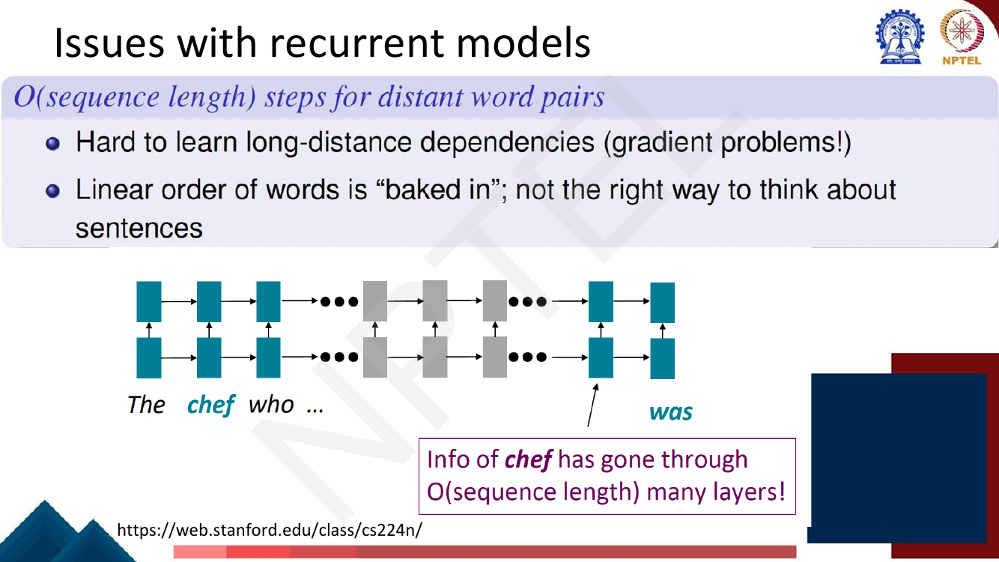
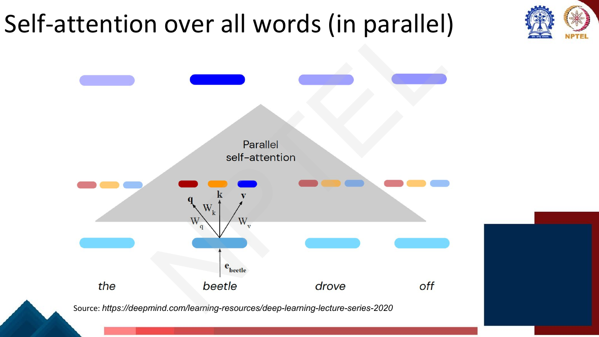

# Lec 21 — Introduction to Transformers

> **Source:** `Week5.pdf` pp. 1–33 · **Week 5** · **Playlist:** Lec 21
> **Prereqs:** [Lec 18 — Seq2seq and Attention](../week-04/18-seq2seq-and-attention.md), [Lec 20 — GRU and LSTM](../week-04/20-gru-and-lstm.md)
> **Feeds into:** [Lec 22 — Self-Attention and Multi-Head](22-self-attention-and-multihead.md), [Lec 23 — Positional Encoding and the Encoder](23-positional-encoding-and-encoder.md)

## Why this lecture exists

Week 4 gave you a recurrent encoder-decoder and bolted attention onto it so the decoder could look
back at every source word instead of squeezing the sentence through one vector. That fixed the
bottleneck but left the recurrence untouched — and the recurrence is the real problem. An RNN computes
$\mathbf{h}_t$ only after $\mathbf{h}_{t-1}$ exists, so a length-$n$ sentence costs $n$ strictly
ordered steps no GPU can shorten, and information from word 1 reaching word $n$ must survive $n$ hops
through the same weight matrix. Gating ([Lec 20](../week-04/20-gru-and-lstm.md)) softens the second
problem and does nothing about the first.

This lecture asks the question that produced the Transformer: *if attention already lets any position
read any other position directly, why keep the recurrence at all?* Everything here is motivation and
intuition. The machinery arrives in [Lec 22](22-self-attention-and-multihead.md).

## The ideas

### Attention, restated as a general framework

[Lec 18](../week-04/18-seq2seq-and-attention.md) introduced attention as a specific repair for a
specific architecture: the decoder's hidden state scores every encoder hidden state, a softmax turns
those scores into weights, and the weighted average of encoder states becomes the context vector
$\mathbf{c}_t$. The deck's first real slide pulls that apart and keeps only the shape.


*Fig. — The diagram is Lec 18's; the sentence above it is new. Seq2seq attention is now just one instance of a pattern. Page 7 of `Week5.pdf`.*

The general definition, in the deck's own words:

> Given a set of vector **values**, and a vector **query**, attention is a technique to compute a
> **weighted sum of the values, dependent on the query**.

Three consequences the slides draw out, each worth memorising as a sentence:

1. **The weighted sum is a selective summary** of the information held in the values, and the query
   decides which values get emphasised.
2. **Attention produces a fixed-size representation of an arbitrary set of representations.** Hand it
   3 vectors or 300; the output has the same dimension. That is why it can replace any architecture
   whose job is "summarise a variable-length thing".
3. **It is not tied to seq2seq or to machine translation.** Any architecture, any task.

The vocabulary: we say the **query attends to the values**. In seq2seq+attention, each decoder hidden
state is the query and the encoder hidden states are the values. Nothing in that sentence requires an
RNN — which is the opening the rest of the lecture walks through. The precise algebra that turns this
description into three learned projections belongs to
[Lec 22](22-self-attention-and-multihead.md).

### Why Transformers: the results

The deck motivates the architecture with evidence before mechanism.


*Fig. — Read the two halves together. Transformer (big) beats the best prior ensemble on EN-DE (28.4 vs 26.36) **and** costs an order of magnitude less to train (2.3·10¹⁹ vs 7.7·10¹⁹ FLOPs). The base model beats every non-ensemble baseline at 3.3·10¹⁸ FLOPs — roughly 1/30th of GNMT's budget. Page 4.*

Memorise the four Transformer numbers in that table: **27.3 / 38.1 BLEU at 3.3·10¹⁸ FLOPs** (base) and
**28.4 / 41.8 BLEU at 2.3·10¹⁹ FLOPs** (big), on **WMT 2014 EN-DE / EN-FR**. The comparison points are
ByteNet (23.75 EN-DE), GNMT+RL (24.6 / 39.92), ConvS2S (25.16 / 40.46) and MoE (26.03 / 40.56).

The deck's second results page is the LMSYS **Chatbot Arena** leaderboard as of the slide's capture —
every entry a Transformer: **GPT-4-Turbo-2024-04-09 at Elo 1258** (OpenAI), GPT-4-1106-preview at 1253,
**Claude 3 Opus at 1251** (Anthropic), **Gemini 1.5 Pro at 1249** (Google), Llama 3 70B Instruct at
1213 (Meta). The headline on the slide is the examinable part: *Transformer-based models dominate the
leaderboard.*

The third page leaves NLP entirely: **AlphaFold2** for protein folding (Jumper et al., 2021, that
*Nature* cover), the **Vision Transformer** (Dosovitskiy et al., 2020) outperforming ResNet baselines
with substantially less compute, and a Transformer-based compiler model (**GO-one**, Zhou et al., 2020)
that speeds up Transformer models. The ViT thread is picked up in
[Lec 23](23-positional-encoding-and-encoder.md) and, from the vision side, in
[the companion course](../../../GenAIforCV/notes/week-08/28-vit-detr-swin.md).

### Issues with recurrent models

Two slides, two complaints, and they are the single most examinable content in this chapter.


*Fig. — The complaint is about **path length**, not capacity. "chef" and "was" agree in number, but the signal connecting them must traverse one RNN cell per intervening word. Page 9.*

**Complaint 1 — $O(n)$ path length between distant word pairs.** For an RNN, the number of
computational steps separating position $i$ and position $j$ is $|i - j|$. Two harms follow:

- **Long-distance dependencies are hard to learn.** Each hop multiplies the gradient by another
  Jacobian, so the signal shrinks (or explodes) geometrically with distance — the vanishing-gradient
  story derived in [Lec 20](../week-04/20-gru-and-lstm.md). Gating extends the usable range; it does
  not make it constant.
- **Linear order is "baked in"** — the architecture asserts that the right way to relate two words is
  to walk the sentence between them. Syntactically related words are often far apart in the string,
  so this is the wrong inductive bias, not merely an inconvenient one.


*Fig. — The numbers in the boxes are the point: $\mathbf{h}_t$ cannot start until $\mathbf{h}_{t-1}$ has finished, so the minimum step count grows with $t$. The GPU sits idle on $n-1$ of every $n$ cycles' worth of work it could have done at once. Page 10.*

**Complaint 2 — no parallelism along the sequence.** Future hidden states cannot be computed in full
before past ones have been. This is not a constant-factor inefficiency you can engineer away: it is a
dependency chain of length $n$ in the computation graph. The slide's own gloss — *"inhibits training
on very large datasets"* — is the reason this killed the RNN. You can throw more GPUs at a bigger
corpus only if the work is parallelisable.

Note what is *not* on the list: the RNN has no trouble with memory or expressiveness in principle. The
objections are both about the **shape of the computation graph**.

### If not recurrence, then what?

![Slide "If not recurrence, then what?" answering "Attention": given a word as query, attention can access and incorporate information from a set of values (other words); can we do this within a single sentence; all words can interact with each other and computation can be done in parallel. Below, three stacked rows labelled embedding / attention / attention, where every box in the embedding row is numbered 0, every box in the first attention row is numbered 1, and every box in the second is numbered 2](../../assets/pages/lec21/p-011.png)
*Fig. — Compare the numbers with page 10's. There, the labels ran 0, 1, 2, …, T **along** the sentence. Here they are constant **within a layer** and increment only when you stack another layer. Depth, not length, now sets the sequential cost. Page 11.*

The answer is attention used **within a single sentence**: let every word be a query over all the
words of the same sentence as values. That is **self-attention** — attention where the queries, the
keys and the values all come from the same sequence, as opposed to the cross-sequence attention of
[Lec 18](../week-04/18-seq2seq-and-attention.md), where decoder states query encoder states.

Two things flip at once:

| | RNN | Self-attention |
|---|---|---|
| Sequential operations for a length-$n$ sequence | $O(n)$ | $O(1)$ |
| Maximum path length between any two positions | $O(n)$ | $O(1)$ |

Every word reaches every other word in **one** hop, and all $n$ outputs of a layer are computed
simultaneously. One mechanism dissolves both complaints — which is why the architecture is called
*Attention Is All You Need*. The cost is that this one layer now does $O(n^2)$ pairwise work;
[Lec 25](25-efficient-transformers.md) owns that bill and its mitigations.

### The Transformer encoder-decoder, at block level


*Fig. — This is actually the follow-on slide: the two boxes of page 12 opened up into **six stacked encoder blocks and six stacked decoder blocks**, with the top encoder's output feeding every decoder. Page 13.*

The architecture, in the deck's three bullets:

- The Transformer is introduced as an **encoder-decoder**; **encoder-only** and **decoder-only**
  variants come later ([Lec 26](../week-06/26-pretraining-and-elmo.md) onward).
- The **encoder** builds a representation of the source sequence that the decoder conditions on.
- The **decoder** generates one token at a time, producing representations that combine the history
  with each new token.

Each side is a *stack of identical blocks* — the figure shows six, which is the base model's depth.
Stacking is what makes the representation "sophisticated": a word's vector at layer 3 already contains
information gathered from its neighbours at layers 1 and 2, so layer 3's attention is reading
contextualised inputs, not raw ones.

![Slide "Each encoder block consists of self-attention & FFNN" showing tokens "Thinking" and "Machines" as embeddings x1 and x2 entering a shared Self-Attention sublayer, producing z1 and z2, each then passing through its own Feed Forward Neural Network to give r1 and r2, which feed ENCODER #2. Marginal notes say deeper layers get outputs of previous layers as inputs, the input to each encoder block has the same size as the original token embeddings, and in the first layer inputs are static token embeddings](../../assets/pages/lec21/p-014.png)
*Fig. — Three structural facts to carry forward. (i) Self-attention is **shared across positions** — one sublayer, both words — while the feed-forward network is applied **separately to each position**. (ii) Every block's input and output have the same width as the token embeddings, which is what lets you stack them. (iii) Layer 1's inputs are the **static** embeddings of [Lec 12](../week-03/12-word2vec-skipgram.md). Page 14.*

So an **encoder block** = self-attention sublayer + position-wise feed-forward network. That is the
whole block at this level of detail. The residual connections, layer normalisation and the FFN's
dimensions are [Lec 22](22-self-attention-and-multihead.md)'s.

### Intuition for self-attention, in the deck's three passes

The deck builds the idea three times over, from three different starting points. Work through all
three; they are not redundant.

#### Intuition 1 — static embeddings cannot represent context

The word2vec/GloVe embeddings of Week 3 are **static**: one vector per word type, fixed after
training, identical in every sentence. The deck's example:

> The chicken didn't cross the road because **it** was too tired

*What is the meaning represented in the static embedding for "it"?* There isn't one worth having. The
static vector for `it` is an average over every pronoun use in the corpus and refers to nothing in
particular.

Page 17 sharpens it: the same eight-word prefix *"The chicken didn't cross the road because it"* is
continued twice, once with **tired** and once with **wide**. Same token `it`, two different referents,
decided by the *tenth* word. The deck's hedge is worth copying — at the point where `it` appears, the
right representation is "probably the animal or the street", a blend rather than a decision.

Hence **contextual embeddings**: *each word has a different vector that expresses different meanings
depending on the surrounding words.* `it` in the "tired" sentence should come out near `chicken`; in
the "wide" sentence, near `road`. The deck's question — *how do we compute them?* — is answered by
attention, and this is the conceptual payoff of the whole chapter. It is also the thread that leads
straight to ELMo and BERT in [Lec 26](../week-06/26-pretraining-and-elmo.md) and
[Lec 27](../week-06/27-bert-masked-lm.md).

The mechanism, stated once: **build the contextual embedding of a word by selectively integrating
information from all the neighbouring words.** We say the word **attends to** some neighbours more
than others.


*Fig. — The picture of one layer. Every column is a token; the **self-attention distribution** for `it` is a probability distribution over columns of the layer below, and the new `it` vector is the weighted blend. Note that words to the right of `it` are greyed out — this is the causal, left-to-right version. Page 19.*

#### Intuition 2 — attention is a fuzzy hash table


*Fig. — The left column is an ordinary hash table: exactly one hit, everything else contributes nothing. The right column is attention: every entry contributes, in proportion to how well its key matches the query. Attention is a hash table with the hard lookup replaced by a soft, differentiable one — which is exactly what makes it trainable. Page 21.*

(You met this framing in the vision course, at
[QKV and self-attention](../../../GenAIforCV/notes/week-07/25-qkv-and-self-attention.md); what changes
for text is that the "set of things to attend over" is a sentence rather than a grid of image patches,
so the order-agnosticism below bites harder.)

This is the frame that makes the three role-names natural. A **query** is what you are looking up; a
**key** is what each stored item advertises itself by; a **value** is what you get back. The only
difference from a dictionary lookup is that the match is graded rather than exact, so you return a
blend rather than a single entry.

#### Intuition 3 — the retrieval analogy

The deck's third pass is the concrete version of the second: searching YouTube. Your **query** is the
text in the search bar. The engine matches it against a set of **keys** — video titles, descriptions,
tags — attached to candidate videos in its database. It returns the best-matching **values**, the
videos themselves.

The transferable observation is that the thing you search *with*, the thing you search *against*, and
the thing you get *back* are three different objects. A video's title is not the video. That
separation is precisely what the Transformer builds in, and it is why the mechanism needs three
distinct representations of each word rather than one.

### A stepping stone: the simplified version of attention

Before the real mechanism, the deck gives a cut-down version that keeps the shape and drops the
projections.


*Fig. — Every piece of the real mechanism is here except the learned projections. Note $j \le i$: this version looks only at prior words and itself. Page 20.*

Written out, for token $i$ in a sequence of embeddings $\mathbf{x}_1, \ldots, \mathbf{x}_n$:

$$\text{score}(\mathbf{x}_i, \mathbf{x}_j) = \mathbf{x}_i \cdot \mathbf{x}_j$$
$$\alpha_{ij} = \mathrm{softmax}\big(\text{score}(\mathbf{x}_i, \mathbf{x}_j)\big), \quad \forall j \le i$$
$$\mathbf{a}_i = \sum_{j \le i} \alpha_{ij}\, \mathbf{x}_j$$

Read it as three moves: **compare** (dot product with every prior token), **normalise** (softmax, so
the weights are non-negative and sum to 1), **blend** (weighted average of those tokens' vectors). The
output $\mathbf{a}_i$ is a contextual embedding of word $i$ — and N2 and N4 below compute some by hand
so you can see it happening.

Three things are wrong with it, and fixing them gives the real head:

1. **Every word plays all three roles with the same vector.** $\mathbf{x}_i$ is the query when it is
   the current word, a key when it is being compared against, and a value when it is being summed. It
   has no way to advertise different things in different roles.
2. **The score is symmetric.** $\mathbf{x}_i \cdot \mathbf{x}_j = \mathbf{x}_j \cdot \mathbf{x}_i$, so
   `it` must attend to `chicken` exactly as strongly as `chicken` attends to `it`. Linguistic
   relations are not symmetric.
3. **Nothing is learned.** There are no parameters here at all; the function is fixed by the
   embeddings.

### An actual attention head

The deck's fix, in its own words: *instead of using the vectors directly, we'll represent 3 separate
roles each vector $\mathbf{x}_i$ plays* —

- **query**: as the current element being compared to the preceding inputs;
- **key**: as a preceding input being compared against the current element, to determine a similarity;
- **value**: the content of a preceding element that gets weighted and summed.


*Fig. — The same diagram as page 19, annotated with roles. One query (the current word), one key and one value **per** context word. The self-attention distribution is computed from query-key matches; the output is built from the values. Page 24.*

The "slightly more complicated" slides then say how those three roles are obtained — each input vector
is projected by its own learned matrix — and how the score changes: the similarity between the current
element and a prior one is a dot product between the current element's *query* and the prior one's
*key*, and what gets summed is the prior elements' *values* rather than their raw embeddings. That is
the whole conceptual delta from the simplified version, and it repairs all three defects above: the
roles are now separate, the score is asymmetric because the query and key projections differ, and the
projections are learned.

**The projection matrices, their dimensions, the scaling of the scores, the matrix form and multi-head
attention are all [Lec 22](22-self-attention-and-multihead.md)'s** — go there next for the formalism.

### Self-attention over input embeddings — and the parallelism claim

The deck closes with a five-page animation over the sentence *the beetle drove off*: each token's
embedding is projected into its three roles; the query of `beetle` is matched against all four keys;
those matches are softmaxed into weights $\lambda_1 \ldots \lambda_4$; and the output for `beetle` is
the weighted sum of the four values. Then the punchline slide:


*Fig. — The triangle is the claim. The computation just shown for `beetle` is run for **every token at once**, as one batched operation — no loop over positions, no dependency between them. This is the slide that cashes in page 10's complaint. Page 31.*

Nothing in the output for position $i$ depends on the output for position $j$. All $n$ queries, all $n$
keys, all $n$ values and all $n^2$ scores can be formed in a handful of large matrix multiplications,
which is precisely the operation a GPU is built for. A length-1000 sentence costs one layer's worth of
sequential work, not a thousand.

### The cliffhanger

Look again at what the layer computes. It is a weighted sum over a *set* of vectors. Permute the
input tokens and every output is permuted the same way, but no output *changes*. Self-attention is
**order-agnostic**: it has thrown away the one thing the RNN got for free, because the RNN's
sequentiality was also its account of word order. "The dog bit the man" and "the man bit the dog"
would receive identical representations. Position information has to be put back by hand — and
[Lec 23](23-positional-encoding-and-encoder.md) owns how.

## Worked numericals

No "Try this problem" pages appear in `Week5.pdf` pp. 1–33; the deck's exercises begin on page 39, in
[Lec 22](22-self-attention-and-multihead.md)'s range. All five below are constructed.

### N1. Sequential operations and maximum path length
**Given:** a sequence of $n$ tokens. Compare a single-layer RNN against a single self-attention layer.
**Find:** the number of sequential operations and the maximum path length between two tokens, at
$n = 10, 100, 1000$.

1. **RNN, sequential operations.** $\mathbf{h}_t$ needs $\mathbf{h}_{t-1}$, so the steps form a chain
   of length $n$. The count is $n$, whatever hardware you own.
2. **RNN, maximum path length.** The longest gap is between position 1 and position $n$, which is
   $n - 1$ cell traversals.
3. **Self-attention, sequential operations.** Every output depends only on the layer's inputs, never
   on another output. One batched operation: **1**, independent of $n$.
4. **Self-attention, maximum path length.** Position $i$ attends to position $j$ directly for any
   $i, j$. **1** hop, independent of $n$.

| $n$ | RNN sequential ops | RNN max path | Self-attn sequential ops | Self-attn max path |
|---|---|---|---|---|
| 10 | 10 | 9 | 1 | 1 |
| 100 | 100 | 99 | 1 | 1 |
| 1000 | 1000 | 999 | 1 | 1 |

5. **With depth.** A 6-layer encoder has 6 sequential operations and a maximum path length of 1
   (one layer already connects everything; the extra layers add capacity, not reach). A 6-layer RNN
   over $n = 1000$ has $6 \times 1000 = 6000$ sequential operations and a path length of up to 999.

**Answer:** RNN $O(n)$ / $O(n)$; self-attention $O(1)$ / $O(1)$. At $n = 1000$ that is a **1000×**
reduction in the sequential chain and a **999 → 1** collapse of the distance a long-range signal must
travel.

### N2. Simplified attention computed by hand on four tokens
**Given:** four token embeddings in 3 dimensions,
$\mathbf{x}_1 = [1,0,0]$, $\mathbf{x}_2 = [0,1,0]$, $\mathbf{x}_3 = [1,1,0]$, $\mathbf{x}_4 = [0,1,1]$.
**Find:** the contextual vectors $\mathbf{a}_3$ and $\mathbf{a}_4$ under the simplified mechanism
(page 20).

1. **Scores for $i = 3$** (only $j \le 3$):
   $\mathbf{x}_3\cdot\mathbf{x}_1 = 1$, $\mathbf{x}_3\cdot\mathbf{x}_2 = 1$,
   $\mathbf{x}_3\cdot\mathbf{x}_3 = 2$.
2. **Exponentiate:** $e^1 = 2.71828$, $e^1 = 2.71828$, $e^2 = 7.38906$. Sum $= 12.82562$.
3. **Normalise:** $\alpha_{31} = 2.71828/12.82562 = 0.21194$,
   $\alpha_{32} = 0.21194$, $\alpha_{33} = 7.38906/12.82562 = 0.57612$. Check: sum $= 1.00000$ ✓
4. **Blend:** $\mathbf{a}_3 = 0.21194[1,0,0] + 0.21194[0,1,0] + 0.57612[1,1,0]$
   $= [0.21194 + 0.57612,\; 0.21194 + 0.57612,\; 0] = [0.78806,\, 0.78806,\, 0]$.
5. **Scores for $i = 4$:** $\mathbf{x}_4\cdot\mathbf{x}_1 = 0$, $\mathbf{x}_4\cdot\mathbf{x}_2 = 1$,
   $\mathbf{x}_4\cdot\mathbf{x}_3 = 1$, $\mathbf{x}_4\cdot\mathbf{x}_4 = 2$.
6. $e^0 = 1$, $e^1 = 2.71828$, $e^1 = 2.71828$, $e^2 = 7.38906$. Sum $= 13.82562$.
7. $\alpha_{41} = 0.07233$, $\alpha_{42} = 0.19661$, $\alpha_{43} = 0.19661$, $\alpha_{44} = 0.53445$.
8. $\mathbf{a}_4 = 0.07233[1,0,0] + 0.19661[0,1,0] + 0.19661[1,1,0] + 0.53445[0,1,1]$.
   First coordinate: $0.07233 + 0.19661 = 0.26894$. Second: $0.19661 + 0.19661 + 0.53445 = 0.92767$.
   Third: $0.53445$.

**Answer:** $\mathbf{a}_3 = [0.78806, 0.78806, 0]$ and $\mathbf{a}_4 = [0.26894, 0.92767, 0.53445]$.
Notice $\mathbf{a}_4 \ne \mathbf{x}_4$: the third coordinate has shrunk from 1 to 0.534 and the first
has grown from 0 to 0.269, because word 4 absorbed some of words 1–3. That drift *is* contextualisation.

### N3. Wall-clock: a sequential RNN layer versus a parallel self-attention layer
**Given:** sequences of length $n = 100$, batch size 64. One batched recurrent time step costs
$0.5$ ms. One full self-attention layer over the whole batch, all positions at once, is measured at
$2$ ms. Training data: 10,000 batches per epoch, 20 epochs.
**Find:** the per-layer, per-epoch and total times, and the speedup.

1. **RNN layer, one batch:** the 100 time steps are strictly ordered, so
   $100 \times 0.5\ \text{ms} = 50\ \text{ms}$.
2. **Self-attention layer, one batch:** $2\ \text{ms}$ — the whole layer, because there is nothing to
   serialise.
3. **Per-layer speedup:** $50/2 = \mathbf{25\times}$.
4. **Per epoch:** RNN $10{,}000 \times 50\ \text{ms} = 500{,}000\ \text{ms} = 500\ \text{s}$;
   self-attention $10{,}000 \times 2\ \text{ms} = 20\ \text{s}$.
5. **20 epochs:** RNN $20 \times 500 = 10{,}000\ \text{s} = \mathbf{2\ \text{h}\ 46\ \text{min}}$;
   self-attention $20 \times 20 = 400\ \text{s} = \mathbf{6\ \text{min}\ 40\ \text{s}}$.
6. **Sanity check on depth:** a 6-layer encoder costs $6 \times 2 = 12$ ms per batch — still less than
   a *quarter* of a single RNN layer's 50 ms.

**Answer:** 25× per layer; 2 h 46 min versus 6 min 40 s over the run. The ratio scales with $n$: at
$n = 1000$ the same arithmetic gives $500/2 = 250\times$. **This is why the recurrence had to go** —
not because RNNs are inaccurate, but because they cannot consume a large corpus in finite time.

### N4. The same word, two contextual vectors
**Given:** a 2-dimensional toy space whose axes are "animate" and "surface". Embeddings
$\mathbf{e}(\text{chicken}) = [1, 0]$, $\mathbf{e}(\text{road}) = [0, 1]$,
$\mathbf{e}(\text{it}) = [0.5, 0.5]$ (ambiguous, pulled equally both ways).
Two two-token sentences: **A** = (chicken, it) and **B** = (road, it).
**Find:** the contextual vector for `it` in each, and the cosine between them.

1. **Sentence A, scores for `it`:**
   $\mathbf{e}(\text{it})\cdot\mathbf{e}(\text{chicken}) = 0.5(1) + 0.5(0) = 0.5$;
   $\mathbf{e}(\text{it})\cdot\mathbf{e}(\text{it}) = 0.25 + 0.25 = 0.5$.
2. The two scores are **equal**, so the softmax gives $\alpha = 0.5, 0.5$ exactly — no exponentials
   needed.
3. $\mathbf{a}_{\text{it}}^{A} = 0.5[1,0] + 0.5[0.5,0.5] = [0.5 + 0.25,\; 0 + 0.25]
   = [0.75,\, 0.25]$.
4. **Sentence B, scores:** $\mathbf{e}(\text{it})\cdot\mathbf{e}(\text{road}) = 0.5$ and
   $\mathbf{e}(\text{it})\cdot\mathbf{e}(\text{it}) = 0.5$ — again equal, $\alpha = 0.5, 0.5$.
5. $\mathbf{a}_{\text{it}}^{B} = 0.5[0,1] + 0.5[0.5,0.5] = [0.25,\, 0.75]$.
6. **Cosine between the two contextual vectors:**
   dot $= 0.75(0.25) + 0.25(0.75) = 0.1875 + 0.1875 = 0.375$;
   each norm $= \sqrt{0.75^2 + 0.25^2} = \sqrt{0.625} = 0.79057$;
   $\cos = 0.375 / (0.79057 \times 0.79057) = 0.375/0.625 = \mathbf{0.6}$.
7. **Compare with static embeddings:** there, `it` is $[0.5,0.5]$ in both sentences, so the cosine
   between the two representations is exactly **1.0**.

**Answer:** `it` becomes $[0.75, 0.25]$ beside `chicken` (leaning animate) and $[0.25, 0.75]$ beside
`road` (leaning surface); cosine $0.6$, down from $1.0$ for the static embedding. The attention
*weights* were identical in both sentences — all the contextualisation came from the different
**values** being blended in, which is the cleanest demonstration of why the values are a separate role.

### N5. How much work does the parallelism buy, in operations?
**Given:** $n = 512$ tokens, model width $d = 512$, a 6-layer encoder.
**Find:** the length of the sequential dependency chain, and the maximum path length, versus a 6-layer
RNN on the same input.

1. **6-layer RNN:** layer 1 must finish token $t$ before token $t+1$; all 6 layers run over all 512
   positions. Chain length $= 6 \times 512 = \mathbf{3072}$ ordered steps.
2. **Max path, RNN:** token 1 to token 512 within one layer is 511 hops; stacking does not shorten it.
   $\mathbf{511}$.
3. **6-layer Transformer encoder:** one sequential step per layer. Chain length $= \mathbf{6}$.
4. **Max path, Transformer:** $\mathbf{1}$.
5. **Ratios:** $3072/6 = \mathbf{512\times}$ shorter dependency chain; $511/1 = \mathbf{511\times}$
   shorter gradient path.

**Answer:** 3072 versus 6 sequential steps, 511 versus 1 hops. Both ratios equal $n$ (to within one),
which is the general statement: **the Transformer trades an $O(n)$ factor of sequential depth for
$O(n^2)$ parallel work.** Whether that trade pays depends on $n$, which is the subject of
[Lec 25](25-efficient-transformers.md).

## Code

Simplified attention only — the "sum of prior words" of page 20. No projections, no scaling; those
belong to [Lec 22](22-self-attention-and-multihead.md).

```python
import numpy as np

def simplified_attention(X):
    """Jurafsky's 'simplified attention' (Week5.pdf p. 20):
       score(x_i, x_j) = x_i . x_j  for j <= i   (a word sees only prior words and itself)
       alpha_ij        = softmax over those scores
       a_i             = sum_j alpha_ij x_j      (sum the INPUT vectors -- no projections yet)
    """
    n = len(X)
    S = X @ X.T                                  # all pairwise dot products, n x n
    mask = np.tril(np.ones((n, n), dtype=bool))  # keep j <= i
    S = np.where(mask, S, -np.inf)
    S = S - S.max(axis=1, keepdims=True)         # stabilise before exp
    A = np.exp(S); A /= A.sum(axis=1, keepdims=True)
    return A @ X, A

# ---- N2: four tokens, 3-dim toy embeddings -----------------------------
X = np.array([[1., 0., 0.],    # x1
              [0., 1., 0.],    # x2
              [1., 1., 0.],    # x3
              [0., 1., 1.]])   # x4
out, A = simplified_attention(X)
np.set_printoptions(precision=5, suppress=True)
print("attention weights (row i = how x_i attends):\n", A)
print("contextualised vectors:\n", out)
print("row sums of A:", A.sum(axis=1))

# ---- N4: the same word 'it' in two different sentences -----------------
e_chicken, e_road, e_it = np.array([1., 0.]), np.array([0., 1.]), np.array([.5, .5])
a_A, _ = simplified_attention(np.stack([e_chicken, e_it]))
a_B, _ = simplified_attention(np.stack([e_road,    e_it]))
it_A, it_B = a_A[-1], a_B[-1]
cos = lambda u, v: u @ v / (np.linalg.norm(u) * np.linalg.norm(v))
print("\nstatic  e(it)      :", e_it, " cos(static, static) =", cos(e_it, e_it))
print("context it | chicken:", it_A)
print("context it | road   :", it_B)
print("cos(it|chicken, it|road) =", round(cos(it_A, it_B), 6))
```

```
attention weights (row i = how x_i attends):
 [[1.      0.      0.      0.     ]
 [0.26894 0.73106 0.      0.     ]
 [0.21194 0.21194 0.57612 0.     ]
 [0.07233 0.19661 0.19661 0.53445]]
contextualised vectors:
 [[1.      0.      0.     ]
 [0.26894 0.73106 0.     ]
 [0.78806 0.78806 0.     ]
 [0.26894 0.92767 0.53445]]
row sums of A: [1. 1. 1. 1.]

static  e(it)      : [0.5 0.5]  cos(static, static) = 0.9999999999999998
context it | chicken: [0.75 0.25]
context it | road   : [0.25 0.75]
cos(it|chicken, it|road) = 0.6
```

Three things to read off the output. The weight matrix is **lower-triangular** — that is the $j \le i$
restriction, and it is the seed of the masking that [Lec 24](24-decoder-and-transformer-lm.md) makes
explicit. Every row sums to 1, so each output is a genuine weighted average and cannot blow up. And
row 1 is $[1,0,0,0]$: the first token has nothing to attend to but itself, so its contextual vector
equals its static one — contextualisation needs context.

## Exam pack

### Must-memorise

| Item | Exactly this |
|---|---|
| General definition of attention | given a set of vector **values** and a vector **query**, attention computes a **weighted sum of the values, dependent on the query** |
| What the weighted sum is | a **selective summary** of the values; the query decides what to focus on |
| Attention's output size | a **fixed-size** representation of an **arbitrary set** of representations |
| Terminology | "the **query attends to** the values" |
| Self-attention | queries, keys and values all drawn from the **same** sequence |
| RNN issue 1 | $O(n)$ steps for distant word pairs → long-distance dependencies are hard (gradient problems); linear order is "baked in" |
| RNN issue 2 | **lack of parallelizability** — future hidden states can't be computed before past ones; inhibits training on very large datasets |
| Self-attention, sequential ops | $O(1)$ |
| Self-attention, max path length | $O(1)$ |
| Transformer's original form | **encoder-decoder**; encoder-only and decoder-only come later |
| Encoder block | **self-attention sublayer + feed-forward network** |
| Sharing | self-attention is shared across positions; the FFN is applied **separately per position** |
| Block I/O width | same size as the original token embeddings (so blocks can stack) |
| First layer's input | **static** token embeddings |
| Static vs contextual embedding | static = one vector per word type; contextual = a different vector per occurrence, depending on surrounding words |
| Simplified attention | $\text{score}(\mathbf{x}_i,\mathbf{x}_j) = \mathbf{x}_i\cdot\mathbf{x}_j$; $\alpha_{ij} = \mathrm{softmax}(\text{score})$ for $j\le i$; $\mathbf{a}_i = \sum_{j\le i}\alpha_{ij}\mathbf{x}_j$ |
| The three roles | **query** = current element being compared; **key** = prior input compared against it; **value** = prior element's content that gets weighted and summed |
| Hash-table analogy | hashtable: one query → exactly one key-value pair. Attention: each query matches **each** key to varying degrees, returning a weighted sum of values |
| Retrieval analogy | YouTube: search text = query, video titles/descriptions = keys, videos = values |
| The parallelism claim | self-attention over **all** words is computed **in parallel** |
| The leftover problem | self-attention is order-agnostic → positional information must be added ([Lec 23](23-positional-encoding-and-encoder.md)) |

### Numbers worth knowing

| Quantity | Value |
|---|---|
| Transformer (base), WMT 2014 EN-DE / EN-FR BLEU | **27.3 / 38.1** |
| Transformer (base), training cost | **3.3 · 10¹⁸** FLOPs |
| Transformer (big), BLEU | **28.4 / 41.8** |
| Transformer (big), training cost | **2.3 · 10¹⁹** FLOPs |
| Best prior single model (MoE), EN-DE / EN-FR | 26.03 / 40.56 |
| Best prior ensemble (ConvS2S), EN-DE / EN-FR | 26.36 / 41.29 at 7.7·10¹⁹ / 1.2·10²¹ FLOPs |
| ByteNet / GNMT+RL / ConvS2S, EN-DE | 23.75 / 24.6 / 25.16 |
| Test sets | **WMT 2014** English-German, English-French |
| Chatbot Arena, top Elo on the slide | GPT-4-Turbo-2024-04-09 **1258**; Claude 3 Opus 1251; Gemini 1.5 Pro 1249; Llama 3 70B Instruct 1213 |
| Encoder / decoder stack depth in the figure | **6** blocks each |
| RNN sequential ops / max path | $O(n)$ / $O(n)$ |
| Self-attention sequential ops / max path | $O(1)$ / $O(1)$ |
| Outside-NLP examples | AlphaFold2 (Jumper et al., 2021); ViT (Dosovitskiy et al., 2020); GO-one compiler (Zhou et al., 2020) |

### Likely MCQ traps

- **"Attention solved the parallelism problem in seq2seq."** No. Seq2seq+attention
  ([Lec 18](../week-04/18-seq2seq-and-attention.md)) still has a recurrent encoder and decoder; the
  attention is bolted on. Parallelism arrives only when the recurrence is *removed*.
- **"LSTMs fix long-range dependencies, so path length isn't an issue."** Gating extends the usable
  range but the path is still $O(n)$. The Transformer makes it $O(1)$ — a different kind of fix.
- **Confusing the two RNN complaints.** $O(n)$ *path length* is about learnability of long-range
  dependencies; *lack of parallelizability* is about training throughput. They are separate slides
  with separate consequences, and an MCQ will ask which one "inhibits training on very large datasets"
  (the second).
- **"Self-attention is $O(1)$ in everything."** $O(1)$ in **sequential operations** and **path
  length** only. The work per layer is $O(n^2)$ — see [Lec 25](25-efficient-transformers.md).
- **"The Transformer was introduced as a decoder-only model."** It was introduced as an
  **encoder-decoder**. Encoder-only (BERT) and decoder-only (GPT) came later.
- **"Each encoder block is attention + attention."** An encoder block is **self-attention + FFN**.
  Attention-then-attention is the *decoder* block (self-attention then cross-attention), which is
  [Lec 24](24-decoder-and-transformer-lm.md)'s.
- **"The FFN is shared across positions like self-attention is."** The FFN's *weights* are shared
  across positions, but it is applied **independently per position** — it mixes dimensions, never
  tokens. Self-attention is the only sublayer that moves information between positions.
- **"Contextual embeddings replace the embedding table."** No. The first layer's inputs are still
  static embeddings; contextual vectors are what the *layers produce from* them.
- **"In the simplified mechanism, the attention weights alone determine the output."** N4 is the
  counter-example: identical weights, different outputs, because the values differed.
- **"Self-attention knows word order because it processes a sequence."** It does not. It is
  permutation-equivariant, which is exactly why positional encodings exist
  ([Lec 23](23-positional-encoding-and-encoder.md)).
- **Reading the NMT table as "Transformer is better but more expensive."** The opposite: it wins on
  BLEU **and** costs an order of magnitude less compute.
- **"Query, key and value are three names for the same vector."** In the simplified version they
  effectively are — which is precisely its defect. In a real head they are three different
  projections of the same input.

### Self-test

1. State the general definition of attention in one sentence, without using any symbols.
2. Name the two issues with recurrent models the deck lists, and say which one "inhibits training on
   very large datasets".
3. For $n = 1000$, give the sequential-operation count and maximum path length for an RNN and for a
   self-attention layer.
4. What two sublayers make up an encoder block, and which of them moves information between positions?
5. Why must the input and output of an encoder block have the same width?
6. Give the three equations of the deck's simplified attention.
7. In the simplified mechanism, why can `it` never attend to `chicken` more strongly than `chicken`
   attends to `it`?
8. A word's static embedding is $[0.5, 0.5]$. After one simplified-attention layer it is $[0.75,0.25]$
   in one sentence and $[0.25,0.75]$ in another. What is the cosine between the two contextual vectors?
9. What BLEU did Transformer (big) reach on WMT 2014 EN-DE, and at what training cost?
10. Self-attention is computed for all words in parallel. What property of language does that
    parallelism destroy, and which lecture repairs it?

<details><summary>Answers</summary>

1. Given a set of vector values and a vector query, attention computes a weighted sum of the values,
   with the weights determined by the query — a selective summary of the values that the query chooses.
2. (a) $O(\text{sequence length})$ steps between distant word pairs, making long-distance dependencies
   hard to learn and baking linear order in; (b) lack of parallelizability, since future hidden states
   can't be computed before past ones. **(b)** is the one that inhibits training on very large datasets.
3. RNN: 1000 sequential operations, maximum path 999. Self-attention: 1 and 1.
4. A self-attention sublayer and a position-wise feed-forward network. Only **self-attention** moves
   information between positions.
5. So that blocks can be stacked — each block's output must be a legal input to the next, and to the
   residual stream. The deck states it as "input to each encoder block has the same size as original
   token embeddings".
6. $\text{score}(\mathbf{x}_i,\mathbf{x}_j) = \mathbf{x}_i\cdot\mathbf{x}_j$;
   $\alpha_{ij} = \mathrm{softmax}(\text{score}(\mathbf{x}_i,\mathbf{x}_j))\ \forall j \le i$;
   $\mathbf{a}_i = \sum_{j\le i}\alpha_{ij}\mathbf{x}_j$.
7. The score is a plain dot product of the two embeddings, which is symmetric. Separate query and key
   projections are what break the symmetry in a real head.
8. $0.375/0.625 = 0.6$. (The static vectors would have cosine 1.0.)
9. 28.4 BLEU at $2.3\cdot10^{19}$ FLOPs.
10. Word order — self-attention is permutation-equivariant, so it is order-agnostic. Positional
    encodings, in [Lec 23](23-positional-encoding-and-encoder.md), put the order back.

</details>

## Beyond the slides

**Gap:** The deck asserts $O(1)$ path length and parallelism but never states the price.
**Why it matters:** Self-attention's per-layer work is $O(n^2 d)$ against the RNN's $O(n d^2)$. For
$n = 512$, $d = 512$ they are equal; past that the Transformer is the more expensive of the two per
layer, and only its parallelism saves it. Every efficient-attention paper in
[Lec 25](25-efficient-transformers.md) exists because of this line. An MCQ that asks "which is cheaper
per layer" has the answer "it depends on whether $n > d$".

**Gap:** "Permutation-equivariant" is never said, and the deck's cliffhanger ("order does not
matter!!") appears only at the start of Lec 23.
**Why it matters:** The precise statement is that permuting the inputs permutes the outputs
identically but changes none of them. That is the clean way to express why positional information is
needed, and it is the form an exam question is most likely to probe.

**Gap:** The deck's simplified mechanism is **causal** ($j \le i$) but never says so, and the
encoder's self-attention is **not** causal.
**Why it matters:** Pages 19–20 are drawn in the Jurafsky language-model style where a word sees only
its left context, while pages 27–31 (and the encoder generally) let every word see everything. Mixing
these up is a genuine source of confusion: encoder self-attention is bidirectional; decoder
self-attention is masked ([Lec 24](24-decoder-and-transformer-lm.md)).

**Gap:** Nothing is said about *why* dot product is the right similarity measure.
**Why it matters:** The dot product is unnormalised cosine similarity scaled by both magnitudes, which
means a vector with a large norm attracts attention from everything regardless of direction. Real
heads control this with learned projections and with the score scaling introduced in
[Lec 22](22-self-attention-and-multihead.md); the simplified version has no such control, and you can
see it in N2 where $\mathbf{x}_3$ (norm $\sqrt2$) dominates its own row.

**Gap:** The Transformer's 2017 paper and the Chatbot Arena slide are seven years apart and the deck
shows no intermediate steps.
**Why it matters:** The path runs through the pretraining revolution of Week 6 — ELMo, BERT, GPT — not
through better translation. The lecture's results slide is evidence that the *architecture* won;
Week 6 explains the *training paradigm* that made it win.

## Cut from the slides

Pages 1–3 are the title and outline, and pages 32–33 are the Jurafsky & Martin Chapter 9 reference and
a "Thank You" card; none carry content. Page 8 restates page 7's general definition of attention
almost verbatim with the "selective summary" and "fixed-size representation" glosses added — the two
are merged into one treatment here rather than taught twice. Page 12 shows the encoder-decoder as two
closed boxes and page 13 opens them into stacks; only page 13 is reproduced, since it strictly
contains page 12's information. Pages 16–18 build "contextual embeddings" over three slides that ask
the same question with increasing specificity; they are compressed into one subsection plus page 17's
figure. Pages 23, 25 and 26 ("An Actual Attention Head" and its two "slightly more complicated"
follow-ups) are **described conceptually but not reproduced**: page 25 names the three projection
matrices and page 26 writes them out, and both are [Lec 22](22-self-attention-and-multihead.md)'s
property under the ownership map. Pages 27–30 are a four-frame animation of one attention computation
over "the beetle drove off", with the softmax and weighted-sum equations appearing on pages 29 and 30;
they are summarised in prose and the equations handed to Lec 22, with only the parallelism payoff
(page 31) reproduced. Page 6's three non-NLP results are summarised in a paragraph rather than shown,
since the slide is four small unreadable screenshots. Nothing about the general attention framework,
the recurrence critique, the block-level architecture, the three intuitions, contextual embeddings or
the simplified mechanism was dropped.
