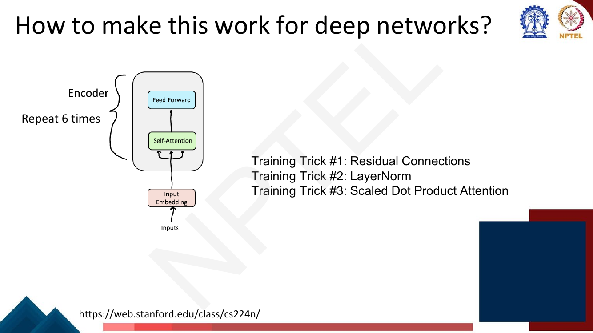

# Lec 22 — Self-Attention and Multi-Head Attention

> **Source:** `Week5.pdf` pp. 34–61 · **Week 5** · **Playlist:** Lec 22
> **Prereqs:** [Lec 21 — Introduction to Transformers](21-intro-to-transformers.md), [Lec 18 — Seq2seq and Attention](../week-04/18-seq2seq-and-attention.md)
> **Feeds into:** [Lec 23 — Positional Encoding and the Encoder](23-positional-encoding-and-encoder.md), [Lec 24 — Decoder and Transformer LM](24-decoder-and-transformer-lm.md), [Lec 25 — Efficient Transformers](25-efficient-transformers.md)

## Why this lecture exists

Lecture 21 told you *what* self-attention does — every token looks at every other token and builds a
contextual representation of itself — and left the mechanism as a picture. This lecture turns that
picture into arithmetic you can do on paper, and it is the single most load-bearing lecture in the
course. Eight later chapters assume it.

Three things get settled here. First, how one input vector becomes a query, a key and a value, and
why it takes three separate learned projections instead of reusing the raw vector. Second, the exact
formula — scaled dot-product attention — including *why* the $\sqrt{d_k}$ is there, which is the kind
of question that separates a 70 from a 95. Third, everything that has to be bolted around attention
before a deep stack of these layers will train at all: multiple heads, a position-wise feed-forward
network, residual connections and layer normalization. By the end you can compute a self-attention
output by hand and draw the complete Transformer block from memory.

## The ideas

### One input, three roles

Self-attention computes, for each position $i$, a weighted average of information drawn from every
position $j$ in the sequence — including $i$ itself. Scoring one vector against another with a dot
product is not new: [Lec 18](../week-04/18-seq2seq-and-attention.md) already did exactly that, between
a decoder state and every encoder state. What is new is **what gets dotted**. Self-attention needs
three different things from every token, and it gets them by projecting the same input vector three
different ways.


*Fig. — Notice that **all three arrows start from the same embedding** $\mathbf{e}_{\text{beetle}}$. The token does not have a query "and" a key; it has one vector that gets read three ways. Also notice the triangle spans every word: all positions are computed simultaneously, not left-to-right. Page 36 of `Week5.pdf`.*

The three roles, in the words that make them stick:

| Projection | Produces | What it means |
|---|---|---|
| $\mathbf{W}^Q$ | the **query** $\mathbf{q}_i$ | *what I am looking for* |
| $\mathbf{W}^K$ | the **key** $\mathbf{k}_j$ | *what I advertise about myself* |
| $\mathbf{W}^V$ | the **value** $\mathbf{v}_j$ | *what I hand over if you select me* |

The analogy is a soft dictionary lookup. In a Python dict you compare one key for exact equality and
retrieve one value. Here you compare the query against *every* key, get a graded similarity for each,
and retrieve a blend of *all* the values weighted by those similarities.

**Why three projections rather than the raw vectors?** This is the conceptual point most readers skate
past, so take it slowly. Suppose you skipped the projections and scored with $\mathbf{x}_i\cdot\mathbf{x}_j$.
Three things break.

1. **The scoring would be forced to be symmetric.** $\mathbf{x}_i\cdot\mathbf{x}_j = \mathbf{x}_j\cdot\mathbf{x}_i$, so
   "how much should *the* attend to *beetle*" would be identical to "how much should *beetle* attend
   to *the*". Linguistic relations are directional: an adjective wants its noun far more than the noun
   wants that particular adjective. With separate $\mathbf{W}^Q$ and $\mathbf{W}^K$,
   $\mathbf{q}_i\cdot\mathbf{k}_j = \mathbf{x}_i\mathbf{W}^Q(\mathbf{W}^K)^\top\mathbf{x}_j^\top$, and
   $\mathbf{W}^Q(\mathbf{W}^K)^\top$ is a general — not necessarily symmetric — bilinear form.
2. **Every token would attend hardest to itself.** $\mathbf{x}_i\cdot\mathbf{x}_i = \lVert\mathbf{x}_i\rVert^2$
   is the largest entry of row $i$ whenever the embeddings have similar norms, which makes the layer
   close to a no-op. The projections let the model learn to look *away*.
3. **What you match on and what you retrieve would be the same thing.** A pronoun might want to find
   its antecedent by matching on number and animacy (key-ish properties) but retrieve the antecedent's
   semantics (value-ish properties). Separating $\mathbf{W}^V$ from $\mathbf{W}^K$ decouples *how you
   are found* from *what you contribute*.

These matrices are the only learned parameters in the attention sublayer. Everything else — the dot
products, the softmax, the weighted sum — is fixed arithmetic.

### Self-attention in equations


*Fig. — The deck's four-line definition. Note the convention: $\mathbf{x}_i$ is a **row** vector, so the projection is $\mathbf{x}_i\mathbf{W}^Q$ and not $\mathbf{W}^Q\mathbf{x}_i$. The pink box flags that $\sqrt{d_k}$ is explained later, as Training Trick #3. Page 37.*

Per position, the four lines are:

$$\mathbf{q}_i = \mathbf{x}_i\mathbf{W}^Q, \qquad \mathbf{k}_j = \mathbf{x}_j\mathbf{W}^K, \qquad \mathbf{v}_j = \mathbf{x}_j\mathbf{W}^V$$

$$\mathrm{score}(\mathbf{x}_i, \mathbf{x}_j) = \frac{\mathbf{q}_i \cdot \mathbf{k}_j}{\sqrt{d_k}}, \qquad
\alpha_{ij} = \mathrm{softmax}_j\!\big(\mathrm{score}(\mathbf{x}_i, \mathbf{x}_j)\big), \qquad
\mathbf{a}_i = \sum_j \alpha_{ij}\,\mathbf{v}_j$$

Stacking all $n$ tokens as rows of $\mathbf{X} \in \mathbb{R}^{n \times d_{\text{model}}}$ gives
$\mathbf{Q} = \mathbf{X}\mathbf{W}^Q$, $\mathbf{K} = \mathbf{X}\mathbf{W}^K$,
$\mathbf{V} = \mathbf{X}\mathbf{W}^V$, and the whole layer collapses into the central equation of this
course:

$$\boxed{\;\mathrm{Attention}(\mathbf{Q},\mathbf{K},\mathbf{V}) = \mathrm{softmax}\!\left(\frac{\mathbf{Q}\mathbf{K}^\top}{\sqrt{d_k}}\right)\mathbf{V}\;}$$

Read it one factor at a time, because every piece has a shape and a job:

- $\mathbf{Q}\mathbf{K}^\top$ is $n \times n$. Entry $(i,j)$ is $\mathbf{q}_i\cdot\mathbf{k}_j$ — a
  **grid of similarity scores**, every query against every key. This matrix is why attention costs
  $O(n^2)$; [Lec 25](25-efficient-transformers.md) is about getting rid of it.
- Dividing by $\sqrt{d_k}$ rescales every entry. See the next-but-one subsection.
- The softmax is applied **row-wise**: each row $i$ becomes a probability distribution over the $n$
  positions, $\alpha_{i1} \ldots \alpha_{in}$, summing to 1. (Rows, not columns — a very common error.
  Softmax itself is [Lec 8](../week-02/08-deep-neural-networks.md).)
- Multiplying the $n \times n$ weight matrix by $\mathbf{V} \in \mathbb{R}^{n \times d_v}$ gives
  $n \times d_v$: row $i$ is the **weighted sum of all value rows** with weights $\alpha_{ij}$. Same
  shape as you would get from a plain per-token transform — attention is a drop-in layer.

### Calculating the output, step by step

The deck draws the computation as a six-step pipeline for one query position.


*Fig. — Follow the numbering: (1) project to k, q, v; (2) dot $\mathbf{q}_3$ against **all three** keys including $\mathbf{k}_3$; (3) divide each by $\sqrt{d_k}$; (4) softmax across the three; (5) scale each value vector; (6) sum. Step 2 includes $j=3$ — a token always attends to itself. Page 38.*

The six steps, which is the recipe you follow in every numerical in this chapter:

1. **Project.** $\mathbf{q}_i = \mathbf{x}_i\mathbf{W}^Q$, and $\mathbf{k}_j, \mathbf{v}_j$ for every $j$.
2. **Score.** Dot the query against every key: $n$ raw numbers.
3. **Scale.** Divide each by $\sqrt{d_k}$.
4. **Normalise.** Softmax the $n$ scaled scores into weights $\alpha_{ij}$ summing to 1.
5. **Weight.** Multiply each value vector $\mathbf{v}_j$ by its $\alpha_{ij}$.
6. **Sum.** Add the weighted value vectors to get $\mathbf{a}_i$.

Three structural facts to carry away. The output $\mathbf{a}_i$ is a **convex combination of value
vectors** — it lives inside their convex hull, so attention alone can never produce anything outside
the span of the values. There is **no non-linearity anywhere** in these six steps (the softmax acts
only on the weights, not on the values), which is exactly the problem the feed-forward layer below
fixes. And steps 1–6 for different $i$ share nothing, so **all positions compute in parallel** — the
property that made Transformers trainable at scale ([Lec 21](21-intro-to-transformers.md)).

### Why $\sqrt{d_k}$ — the variance argument

The deck gives this a full page, numbered **Training Trick #3**, and it is a guaranteed exam question.


*Fig. — The whole argument in three lines. The premise ("mean 0, variance 1") is supplied by LayerNorm, which is why the deck orders the tricks this way: #3 depends on #2. Page 53.*

The derivation. Assume the components $q_1 \ldots q_{d_k}$ and $k_1 \ldots k_{d_k}$ are independent
with mean 0 and variance 1 — the state LayerNorm puts them in. Then for the dot product
$\mathbf{q}\cdot\mathbf{k} = \sum_{m=1}^{d_k} q_m k_m$:

$$\mathbb{E}[q_m k_m] = \mathbb{E}[q_m]\,\mathbb{E}[k_m] = 0 \cdot 0 = 0
\;\;\Longrightarrow\;\; \mathbb{E}[\mathbf{q}\cdot\mathbf{k}] = \sum_{m=1}^{d_k} 0 = 0$$

$$\mathrm{Var}[q_m k_m] = \mathbb{E}[q_m^2 k_m^2] - 0^2 = \mathbb{E}[q_m^2]\,\mathbb{E}[k_m^2] = 1 \cdot 1 = 1$$

and because the $d_k$ terms are independent, variances add:

$$\mathrm{Var}[\mathbf{q}\cdot\mathbf{k}] = \sum_{m=1}^{d_k} 1 = d_k, \qquad \text{so the typical magnitude is } \sqrt{d_k}.$$

Dividing by $\sqrt{d_k}$ scales the variance by $(1/\sqrt{d_k})^2 = 1/d_k$, restoring
$\mathrm{Var} = 1$ and mean $0$ regardless of head width.

**Why that matters.** Softmax is scale-sensitive in a brutal way. If the logits going into it are
spread over a range of $\pm\sqrt{d_k}$, then at $d_k = 512$ a typical gap between the top score and
the rest is around 22 — and $\mathrm{softmax}$ of a gap of 22 is $0.9999999999$. The distribution has
collapsed onto one position: attention has become a hard, one-hot lookup. The damage is not that the
answer is wrong; it is that **the gradient vanishes**. The derivative of a softmax output $p$ with
respect to its own logit is $p(1-p)$, which at $p = 0.9999999999$ is $1.5\times10^{-10}$. No gradient
flows back through the scores, so $\mathbf{W}^Q$ and $\mathbf{W}^K$ never learn. N3 below computes
this collapse at $d_k = 4, 64, 512$.

So: **not** "to keep the numbers small for numerical stability", and **not** "to make the weights sum
to 1" (softmax already does that). The reason is **variance control to keep softmax out of its
saturated region so gradients survive.** Note also that the scale is $\sqrt{d_k}$, the **key**
dimension, not $d_v$ and not $d_{\text{model}}$.

### The scoring family: where this sits relative to Lec 18

You have met the dot product as a similarity score already.
[Lec 18](../week-04/18-seq2seq-and-attention.md) scored the *previous* decoder state against every
encoder state with the bare dot product, $\mathrm{score}(\mathbf{h}^d_{i-1}, \mathbf{h}^e_j) =
\mathbf{h}^d_{i-1}\cdot\mathbf{h}^e_j$ — its deck says outright that this is "the simplest scoring
mechanism". (The index is $i-1$, not $i$, because the resulting context vector is an *input* to
computing $\mathbf{h}^d_i$.)

So the dot product is not what is new here. **Two things are:** the vectors being dotted are no longer
raw hidden states but **learned projections** of the same input into three distinct roles, and the
score is **divided by $\sqrt{d_k}$**. Everything else is Lec 18's machinery reused. Here is the full
family, so you can place any variant an exam shows you:

| | Dot product (Lec 18) | Multiplicative / Luong | Additive / Bahdanau | Scaled dot-product (here) |
|---|---|---|---|---|
| Score | $\mathbf{h}^d_{i-1}\cdot\mathbf{h}^e_j$ | $\mathbf{h}_i^\top\mathbf{W}\mathbf{h}_j$ | $\mathbf{w}^\top\tanh(\mathbf{W}_1\mathbf{h}_i + \mathbf{W}_2\mathbf{h}_j)$ | $\dfrac{\mathbf{q}_i\cdot\mathbf{k}_j}{\sqrt{d_k}}$ |
| Params in the scorer | none | one matrix $\mathbf{W}$ | a one-hidden-layer MLP | none — the learning moved into $\mathbf{W}^Q,\mathbf{W}^K$ |
| Non-linearity in the score | no | no | yes, $\tanh$ | no |
| Symmetric? | yes — forced | no | no | no |
| Implementation | one matmul | two matmuls | per-pair, hard to batch | one matmul, GPU-optimal |
| Needs scaling? | the issue is not raised at RNN widths | — | no (the $\tanh$ bounds it) | **yes**, by $\sqrt{d_k}$ |

Two readings fall out. The **projections** are what buy back the expressiveness that the raw dot
product gives away: $\mathbf{q}_i\cdot\mathbf{k}_j = \mathbf{x}_i\mathbf{W}^Q(\mathbf{W}^K)^\top\mathbf{x}_j^\top$
is a general bilinear form, so it is exactly as expressive as Luong's $\mathbf{W}$ while costing no
extra matmul at score time. And the **scaling** becomes necessary precisely because $d_k$ is now a
design choice that can be large — at the modest widths Lec 18 worked with, the saturation problem
derived above never bites hard enough to notice.

Dot-product attention did not win because it scores better than additive. It won because
$\mathbf{Q}\mathbf{K}^\top$ is a single BLAS call.

### Multi-head attention

One attention layer produces one distribution per query — one set of weights, one weighted average.
But a token usually needs several unrelated things at once: its syntactic head, its coreferent, the
nearest punctuation. Averaging all of those into one distribution blurs them together.

![Slide "Multi-head attention": input x_i (1 x d) fans into eight red trapezoids labelled Head 1 to Head 8, each holding its own W^K, W^V, W^Q; each emits a [1 x d_v] bar; the bars are concatenated into a [1 x h d_v] bar which passes through a wide trapezoid W^O of shape [h d_v x d] producing the output a_i of shape [1 x d]](../../assets/pages/lec22/p-045.png)
*Fig. — The shapes are the whole story: in at $1\times d$, each head out at $1\times d_v$, concatenated to $1\times hd_v$, projected by $\mathbf{W}^O$ of shape $hd_v \times d$ back to $1\times d$. Input and output dimension are **equal**, which is what lets you stack blocks. Page 45.*

With $h$ heads, each head $c$ gets its own three projections and runs the whole six-step recipe
independently:

$$\mathbf{q}_i^c = \mathbf{x}_i\mathbf{W}^{Qc}, \quad \mathbf{k}_j^c = \mathbf{x}_j\mathbf{W}^{Kc}, \quad \mathbf{v}_j^c = \mathbf{x}_j\mathbf{W}^{Vc}, \qquad 1 \le c \le h$$

$$\mathrm{head}_i^c = \sum_j \alpha_{ij}^c\,\mathbf{v}_j^c, \qquad
\mathbf{a}_i = \big(\mathrm{head}^1 \oplus \mathrm{head}^2 \oplus \cdots \oplus \mathrm{head}^h\big)\mathbf{W}^O$$

where $\oplus$ is concatenation. The softmax is taken **within** each head, so each head has its own
normalised attention distribution. $\mathbf{W}^O$ is not decoration: without it the output would be a
stack of $h$ independent blocks with no mixing between them, and the next layer would have no way to
combine what different heads found.

**Why multiple heads?** The deck's answer, nearly verbatim: *"What if we want to look in multiple
places in the sentence at once? For word $i$, maybe we want to focus on different $j$ for different
reasons?"* Each head is free to attend differently and to build its value vectors differently. The
deck then cites Voita et al. (2019), *Analyzing Multi-Head Self-Attention: Specialized Heads Do the
Heavy Lifting, the Rest Can Be Pruned* (arXiv 1905.09418), which found three identifiable head types
by inspecting attention matrices — **memorise this list, it is textbook MCQ material**:

1. **Positional heads** — attend mostly to their immediate neighbour.
2. **Syntactic heads** — point to tokens in a specific syntactic relation (subject→verb, and so on).
3. **Rare-word heads** — point to the rarest words in the sentence.

The same paper's title carries a second examinable fact: most heads can be pruned with little loss;
the specialised minority does the work.

### The dimensional bookkeeping


*Fig. — The original Transformer's numbers, which the exam will use. $512/8 = 64$ is not a coincidence: $d_k$ is **chosen** as $d_{\text{model}}/h$ precisely so that $hd_v = d_{\text{model}}$ and the concatenation lands back at the model width. Page 46.*

With the deck's figures ($d_{\text{model}} = 512$, $h = 8$, written $d$ on the slide):

| Object | Shape | Value |
|---|---|---|
| $\mathbf{x}_i$ | $1 \times d_{\text{model}}$ | $1 \times 512$ |
| $\mathbf{W}^{Qc}, \mathbf{W}^{Kc}, \mathbf{W}^{Vc}$ (per head) | $d_{\text{model}} \times d_k$ | $512 \times 64$ |
| $\mathbf{q}_i^c, \mathbf{k}_j^c, \mathbf{v}_j^c$ | $1 \times d_k$ | $1 \times 64$ |
| attention matrix per head | $n \times n$ | $n \times n$ |
| $\mathrm{head}_i^c$ | $1 \times d_v$ | $1 \times 64$ |
| concatenation | $1 \times hd_v$ | $1 \times 512$ |
| $\mathbf{W}^O$ | $hd_v \times d_{\text{model}}$ | $512 \times 512$ |
| $\mathbf{a}_i$ | $1 \times d_{\text{model}}$ | $1 \times 512$ |

The consequence that catches people out: because $d_k = d_{\text{model}}/h$, **eight heads cost the
same as one full-width head**. Eight $512\times64$ matrices hold exactly as many numbers as one
$512\times512$ matrix. Multi-head attention is free diversity, not extra capacity — you are
partitioning the representation, not enlarging it. N4 does the full count.

### The position-wise feed-forward layer


*Fig. — The deck states the motivation outright. Self-attention is a **re-averaging**: it moves information between positions but applies no element-wise non-linearity, so stacking attention layers alone would still compose to something close to linear. Page 47.*

The fix:

$$\mathrm{FFN}(\mathbf{x}_i) = \mathrm{ReLU}(\mathbf{x}_i\mathbf{W}_1 + \mathbf{b}_1)\mathbf{W}_2 + \mathbf{b}_2$$

with $\mathbf{W}_1 \in \mathbb{R}^{d_{\text{model}} \times d_{ff}}$ and
$\mathbf{W}_2 \in \mathbb{R}^{d_{ff} \times d_{\text{model}}}$. The standard setting is
$d_{\text{model}} = 512$, $d_{ff} = 2048$ — a **4× expansion and contraction**.

**"Position-wise" is the word people lose marks on.** It means *the same* $\mathbf{W}_1, \mathbf{b}_1,
\mathbf{W}_2, \mathbf{b}_2$ are applied **independently at every position**, with no mixing across
positions at all. If the sequence is 50 tokens, you run one shared two-layer MLP 50 times. It is
equivalent to a convolution with kernel size 1. The deck's drawing makes this literal: four separate
vertical stacks, each labelled with the same $W_1$ and $W_2$.

So a Transformer block has a clean division of labour: **attention mixes across positions and does not
transform; the FFN transforms and does not mix.** That one sentence explains the whole architecture.

### Making it deep: the three training tricks


*Fig. — The deck's own numbering — know it by number, the exam may ask "which training trick is #2?". Also note **"Repeat 6 times"**: the original encoder stacks 6 identical blocks. Page 49.*

**Trick #1 — residual connections.** $\mathbf{x}_\ell = F(\mathbf{x}_{\ell-1}) + \mathbf{x}_{\ell-1}$.
The deck's framing is that *deep networks are surprisingly bad at learning the identity function*, so
handing the raw input forward unchanged is helpful; it prevents the network from forgetting or
distorting information as it passes through many layers. The gradient argument — the $+\,\mathbf{x}$
term gives $\partial\mathbf{x}_\ell/\partial\mathbf{x}_{\ell-1} = \mathbf{I} + \partial F/\partial\mathbf{x}_{\ell-1}$,
so there is always a path of gradient 1 back to any earlier layer and the product-of-Jacobians cannot
vanish — is derived in the companion vision course's
[ResNet treatment](../../../GenAIforCV/notes/week-07/25-qkv-and-self-attention.md); the deck
acknowledges it as "a technique from computer vision".

**Trick #2 — layer normalization.** The deck's problem statement: it is difficult to train the
parameters of a layer because *its input from the layer beneath keeps shifting*. The solution is to
renormalise each vector to zero mean and unit standard deviation before passing it on.


*Fig. — The arrows point **down the columns**, i.e. across the $H$ features of one sample. Batch norm would average **along the rows**, across samples. That difference is the entire exam question. Page 52.*

For an activation vector $\mathbf{a}^\ell$ with $H$ components, the deck gives

$$\mu^\ell = \frac{1}{H}\sum_{i=1}^{H} a_i^\ell, \qquad
\sigma^\ell = \sqrt{\frac{1}{H}\sum_{i=1}^{H}\big(a_i^\ell - \mu^\ell\big)^2}, \qquad
\mathbf{x}^{\ell\prime} = \frac{\mathbf{x}^\ell - \mu^\ell}{\sigma^\ell + \epsilon}$$

and the implementation you will actually meet adds a learned **gain** $\boldsymbol{\gamma}$ and
**bias** $\boldsymbol{\beta}$, one pair per feature:

$$\mathrm{LayerNorm}(\mathbf{x}) = \boldsymbol{\gamma} \odot \frac{\mathbf{x} - \mu}{\sqrt{\sigma^2 + \epsilon}} + \boldsymbol{\beta}$$

($\odot$ is element-wise.) Without $\boldsymbol{\gamma}, \boldsymbol{\beta}$, LayerNorm would force
every representation to mean 0 and variance 1 forever, destroying information; the two learned vectors
let the network undo the normalisation where it is unhelpful — setting
$\boldsymbol{\gamma} = \sigma$, $\boldsymbol{\beta} = \mu$ recovers the identity exactly. They add
$2d_{\text{model}}$ parameters per LayerNorm. **The deck omits $\boldsymbol{\gamma}$ and
$\boldsymbol{\beta}$ entirely; know both forms.**

**Why layer norm and not batch norm?** Three reasons, all of which are about NLP specifically:

- **Batch-size independence.** Batch norm's statistics come from the other examples in the mini-batch,
  so behaviour changes with batch size and differs between training and inference (which needs stored
  running averages). Layer norm's statistics come from *within one token's own feature vector*, so the
  computation is identical at train time, at test time, and at batch size 1.
- **Variable-length sequences.** Sentences in a batch have different lengths and are padded. A batch
  statistic at position 40 would be computed over however many sequences happen to be that long,
  mixing in padding. Layer norm never looks across the batch, so padding cannot contaminate it.
- **Position independence.** Batch norm would couple token 7 of sentence A to token 7 of sentence B,
  which means nothing linguistically.

The normalisation is over the **feature axis of one token** — $H = d_{\text{model}} = 512$ numbers.
[Lec 52](../week-11/52-modern-llms-and-activations.md) covers RMSNorm, the modern variant that drops
the mean-centering.

**Trick #3 — scaled dot-product attention**, derived above.

### A complete Transformer block

The deck builds the block up over four slides. The final one:


*Fig. — Count them: **two** sublayers, **two** skip connections, **two** LayerNorms. Every bar has the same width throughout — the block is shape-preserving, which is why you can stack six of them. Page 58.*


*Fig. — The same block as two equations. This is the **post-norm** ordering: the residual is added first, then normalised. Page 59.*

$$\mathbf{z} = \mathrm{LayerNorm}\big(\mathbf{x} + \mathrm{SelfAttention}(\mathbf{x})\big), \qquad
\mathbf{y} = \mathrm{LayerNorm}\big(\mathbf{z} + \mathrm{FFN}(\mathbf{z})\big)$$

Memorise those two lines; they are the block. Six identical copies make the original encoder — what
goes around them, including the thing the block is still missing (it has no idea what order the words
came in), is [Lec 23](23-positional-encoding-and-encoder.md).

## Worked numericals

### N1. The deck's "Try this problem" — self-attention output for 'flying' (pages 39–40)

**Given** (page 39): the input to a Transformer encoder is {flying, arrows}, with embeddings
$\mathbf{x}_1 = [0,1,1,1,1,0]$ (flying) and $\mathbf{x}_2 = [1,1,0,-1,-1,1]$ (arrows). For the first
attention head the query, key and value "matrices" just take 2 dimensions each from the input: the
first 2 dimensions are the query, the next 2 the key, the last 2 the value. Use the scaled dot
product.
**Find:** the self-attention output $\mathbf{a}_1$ for 'flying'.

![Slide "Try this problem" listing q1: [0,1], k1: [1,1], v1: [1,0] / q2: [1,1], k2: [0,-1], v2: [-1,1] / a1?](../../assets/pages/lec22/p-040.png)
*Fig. — The deck's continuation page. It restates the sliced vectors and asks "a1?" — **and stops there. No solution is given anywhere in the deck.** Page 40.*

1. **Slice the embeddings.** The projection matrices here are just selection matrices, so:
   - from $\mathbf{x}_1 = [0,1\,|\,1,1\,|\,1,0]$: $\mathbf{q}_1 = [0,1]$, $\mathbf{k}_1 = [1,1]$, $\mathbf{v}_1 = [1,0]$;
   - from $\mathbf{x}_2 = [1,1\,|\,0,-1\,|\,-1,1]$: $\mathbf{q}_2 = [1,1]$, $\mathbf{k}_2 = [0,-1]$, $\mathbf{v}_2 = [-1,1]$.

   These match page 40 exactly, which confirms the slicing is the intended reading.
2. **$d_k = 2$**, so the scale factor is $\sqrt{2} = 1.414214$.
3. **Raw scores** for query $\mathbf{q}_1$ (we only need row 1, since the question asks for $\mathbf{a}_1$):
   - $\mathbf{q}_1\cdot\mathbf{k}_1 = (0)(1) + (1)(1) = 1$
   - $\mathbf{q}_1\cdot\mathbf{k}_2 = (0)(0) + (1)(-1) = -1$
4. **Scale:** $1/\sqrt{2} = 0.707107$ and $-1/\sqrt{2} = -0.707107$.
5. **Softmax.** $e^{0.707107} = 2.028115$, $e^{-0.707107} = 0.493069$. Sum $= 2.521184$.
   - $\alpha_{11} = 2.028115/2.521184 = 0.804430$
   - $\alpha_{12} = 0.493069/2.521184 = 0.195570$
   - Check: $0.804430 + 0.195570 = 1.000000$ ✓
6. **Weighted sum of values.**
   $$\mathbf{a}_1 = 0.804430\,[1,0] + 0.195570\,[-1,1] = [0.804430 - 0.195570,\; 0 + 0.195570]$$
7. $= [0.608859,\; 0.195570]$.

**Answer:** $\mathbf{a}_1 = [0.6089,\; 0.1956]$ (to 4 d.p.).

**Check against the deck:** *the deck gives no answer* — page 40 ends at "a1?" and page 41 moves on to
multi-head attention. There is therefore nothing to disagree with, but also no safety net, so verify
by two independent routes. (a) With only two keys, softmax reduces to a logistic:
$\alpha_{11} = 1/(1 + e^{-(s_1 - s_2)}) = 1/(1 + e^{-1.414214}) = 1/(1 + 0.243117) = 0.804430$ ✓.
(b) The code block below recomputes it from the raw six-dimensional embeddings and prints
`[0.6089 0.1956]`.

**The trap in this question** is forgetting the scaling. Without the $\sqrt{2}$ the logits are $+1$
and $-1$, giving $\alpha_{11} = 0.880797$ and $\mathbf{a}_1 = [0.761594,\, 0.119203]$ — a visibly
different answer, and the one you get if you skim past "You are using the scaled dot vector". For
completeness, the same recipe on row 2 gives scores $2/\sqrt2 = 1.414214$ and $-1/\sqrt2 = -0.707107$,
weights $0.892958$ and $0.107042$, and $\mathbf{a}_2 = [0.785916,\, 0.107042]$.

### N2. A full three-token self-attention computation with $d_k = 2$

**Given:** three tokens, $d_{\text{model}} = d_k = d_v = 2$.
$$\mathbf{X} = \begin{bmatrix} 1 & 0 \\ 0 & 1 \\ 1 & 1\end{bmatrix}, \quad
\mathbf{W}^Q = \begin{bmatrix} 1 & 0 \\ 0 & 1\end{bmatrix}, \quad
\mathbf{W}^K = \begin{bmatrix} 0 & 1 \\ 1 & 0\end{bmatrix}, \quad
\mathbf{W}^V = \begin{bmatrix} 1 & 1 \\ 1 & -1\end{bmatrix}$$
**Find:** $\mathrm{softmax}(\mathbf{Q}\mathbf{K}^\top/\sqrt{d_k})\mathbf{V}$, every number shown.

1. **Project.** $\mathbf{Q} = \mathbf{X}\mathbf{W}^Q = \mathbf{X}$ (the identity), so rows
   $[1,0], [0,1], [1,1]$.
   $\mathbf{K} = \mathbf{X}\mathbf{W}^K$ swaps the two coordinates: rows $[0,1], [1,0], [1,1]$.
   $\mathbf{V} = \mathbf{X}\mathbf{W}^V$: row 1 $= [1\cdot1 + 0\cdot1,\; 1\cdot1 + 0\cdot(-1)] = [1,1]$;
   row 2 $= [0+1,\; 0-1] = [1,-1]$; row 3 $= [1+1,\; 1-1] = [2,0]$.
2. **Score grid.** $\mathbf{Q}\mathbf{K}^\top$, entry $(i,j) = \mathbf{q}_i\cdot\mathbf{k}_j$:
   $$\mathbf{Q}\mathbf{K}^\top = \begin{bmatrix} 0 & 1 & 1 \\ 1 & 0 & 1 \\ 1 & 1 & 2 \end{bmatrix}$$
   (e.g. $(1,1)$: $[1,0]\cdot[0,1] = 0$; $(3,3)$: $[1,1]\cdot[1,1] = 2$.)
3. **Scale** by $\sqrt{d_k} = \sqrt2 = 1.414214$. Every 1 becomes $0.707107$, every 2 becomes
   $1.414214$, 0 stays 0:
   $$\frac{\mathbf{Q}\mathbf{K}^\top}{\sqrt2} = \begin{bmatrix} 0 & 0.707107 & 0.707107 \\ 0.707107 & 0 & 0.707107 \\ 0.707107 & 0.707107 & 1.414214 \end{bmatrix}$$
4. **Softmax, row 1.** $e^{0} = 1$, $e^{0.707107} = 2.028115$, $e^{0.707107} = 2.028115$.
   Sum $= 1 + 2.028115 + 2.028115 = 5.056230$.
   $\alpha_{1\cdot} = [1/5.056230,\; 2.028115/5.056230,\; 2.028115/5.056230] = [0.197775,\; 0.401113,\; 0.401113]$.
   Sum $= 1.000001 \approx 1$ ✓
5. **Softmax, row 2.** Same three exponentials in a different order, so the same sum $5.056230$ and
   $\alpha_{2\cdot} = [0.401113,\; 0.197775,\; 0.401113]$.
6. **Softmax, row 3.** $e^{0.707107} = 2.028115$ twice and $e^{1.414214} = 4.113250$.
   Sum $= 2.028115 + 2.028115 + 4.113250 = 8.169480$.
   $\alpha_{3\cdot} = [0.248255,\; 0.248255,\; 0.503490]$. Sum $= 1.000000$ ✓
   (Token 3 gives **half its attention to itself** — its key $[1,1]$ aligns best with its own query.)
7. **Multiply by $\mathbf{V}$.** Row 1:
   $$0.197775[1,1] + 0.401113[1,-1] + 0.401113[2,0]$$
   first coordinate: $0.197775 + 0.401113 + 0.802226 = 1.401114$;
   second: $0.197775 - 0.401113 + 0 = -0.203338$.
8. Row 2, by the mirrored weights: first $= 0.401113 + 0.197775 + 0.802226 = 1.401114$;
   second $= 0.401113 - 0.197775 = 0.203338$.
9. Row 3: first $= 0.248255 + 0.248255 + 1.006980 = 1.503490$;
   second $= 0.248255 - 0.248255 = 0.000000$.

**Answer:**
$$\mathrm{Attention}(\mathbf{Q},\mathbf{K},\mathbf{V}) = \begin{bmatrix} 1.4011 & -0.2033 \\ 1.4011 & 0.2033 \\ 1.5035 & 0.0000 \end{bmatrix}$$
Shape $3\times 2$ — same as $\mathbf{X}$. Every output row lies inside the triangle spanned by
$[1,1], [1,-1], [2,0]$, as a convex combination must.

### N3. Why $\sqrt{d_k}$: dot-product magnitude and softmax saturation

**Given:** $\mathbf{q}, \mathbf{k} \in \mathbb{R}^{d_k}$ with i.i.d. components of mean 0 and variance 1.
**Find:** $\mathrm{Var}[\mathbf{q}\cdot\mathbf{k}]$ at $d_k = 4, 64, 512$; then, for a two-key softmax
whose logit gap equals one standard deviation, the resulting weight and its gradient factor $p(1-p)$,
with and without scaling.

1. $\mathrm{Var}[\mathbf{q}\cdot\mathbf{k}] = d_k \cdot \mathrm{Var}[q_mk_m] = d_k \cdot 1 = d_k$, so the
   typical magnitude is $\sqrt{d_k}$: **2, 8, 22.63** respectively.
2. Unscaled, take logits $(\sqrt{d_k},\,0)$. Then $p = 1/(1 + e^{-\sqrt{d_k}})$:
   - $d_k = 4$: $p = 1/(1 + e^{-2}) = 1/(1 + 0.135335) = 0.880797$
   - $d_k = 64$: $p = 1/(1 + e^{-8}) = 1/(1 + 0.000335) = 0.999665$
   - $d_k = 512$: $p = 1/(1 + e^{-22.627}) = 0.9999999999$
3. Gradient factor $p(1-p)$:
   - $d_k = 4$: $0.880797 \times 0.119203 = 1.050\times10^{-1}$
   - $d_k = 64$: $0.999665 \times 0.000335 = 3.352\times10^{-4}$
   - $d_k = 512$: $1.489\times10^{-10}$
4. Scaled, the logits become $(\sqrt{d_k}/\sqrt{d_k},\,0) = (1,0)$ at **every** $d_k$:
   $p = 1/(1+e^{-1}) = 0.731059$ and $p(1-p) = 0.731059 \times 0.268941 = 0.196612$.

| $d_k$ | sd of $\mathbf{q}\cdot\mathbf{k}$ | unscaled $p$ | unscaled $p(1-p)$ | scaled $p$ | scaled $p(1-p)$ |
|---|---|---|---|---|---|
| 4 | 2.00 | 0.8808 | $1.05\times10^{-1}$ | 0.7311 | 0.1966 |
| 64 | 8.00 | 0.9997 | $3.35\times10^{-4}$ | 0.7311 | 0.1966 |
| 512 | 22.63 | 1.0000 | $1.49\times10^{-10}$ | 0.7311 | 0.1966 |

**Answer:** without scaling, the gradient through the softmax falls by **nine orders of magnitude**
between $d_k = 4$ and $d_k = 512$; with the $1/\sqrt{d_k}$ factor it is constant at $0.1966$
independent of head width. That constancy is the entire point of Training Trick #3.

### N4. Multi-head attention parameter count, $d_{\text{model}} = 512$, $h = 8$

**Given:** $d_{\text{model}} = 512$, $h = 8$, hence $d_k = d_v = 512/8 = 64$. Ignore biases (the
original paper's projections have none).
**Find:** the shape of every weight matrix and the total parameter count of one multi-head
self-attention sublayer.

1. Per head, per projection: $\mathbf{W}^{Qc}, \mathbf{W}^{Kc}, \mathbf{W}^{Vc}$ are each
   $d_{\text{model}} \times d_k = 512 \times 64 = 32{,}768$ parameters.
2. Three projections per head: $3 \times 32{,}768 = 98{,}304$.
3. Eight heads: $8 \times 98{,}304 = 786{,}432$.
   Equivalently $3 \times 512 \times (8 \times 64) = 3 \times 512 \times 512 = 786{,}432$ — the heads
   are just a partition of three full-width $512\times512$ matrices.
4. Output projection $\mathbf{W}^O$: $hd_v \times d_{\text{model}} = 512 \times 512 = 262{,}144$.
5. Total: $786{,}432 + 262{,}144 = 1{,}048{,}576$.
6. Sanity check: $4 \times 512^2 = 4 \times 262{,}144 = 1{,}048{,}576 = 2^{20}$ ✓

**Answer:** **1,048,576 ≈ 1.05 M parameters**, i.e. exactly $4d_{\text{model}}^2$. Note what this
proves: the count does **not** depend on $h$. Going from 8 heads to 16 heads (with $d_k = 32$) leaves
the parameter count and the FLOP count unchanged — you only change how the dimensions are partitioned.

### N5. Layer normalization by hand, on the deck's own column

**Given:** the first sample from the deck's LayerNorm figure (page 52),
$\mathbf{a} = [1, 3, 5, 7]$ with $H = 4$ features; learned $\boldsymbol{\gamma} = [1.5, 1.0, 0.5, 2.0]$
and $\boldsymbol{\beta} = [0, 1, -1, 0.5]$; $\epsilon$ negligible.
**Find:** $\mu$, $\sigma$, the normalised vector, and the output after scale-and-shift.

1. $\mu = (1 + 3 + 5 + 7)/4 = 16/4 = 4$. (The slide prints **4** ✓)
2. Deviations: $1-4 = -3$, $3-4 = -1$, $5-4 = 1$, $7-4 = 3$.
3. $\sigma^2 = \big((-3)^2 + (-1)^2 + 1^2 + 3^2\big)/4 = (9+1+1+9)/4 = 20/4 = 5$.
4. $\sigma = \sqrt5 = 2.236068$. (The slide prints **2.23** ✓ — note it uses the **population**
   divisor $1/H$, not the sample divisor $1/(H-1)$, which would give $2.582$.)
5. Normalised: $\hat{\mathbf{a}} = [-3, -1, 1, 3]/2.236068 = [-1.341641,\; -0.447214,\; 0.447214,\; 1.341641]$.
   Check: mean $= 0$ ✓, and $\frac1H\sum \hat{a}_i^2 = (1.8+0.2+0.2+1.8)/4 = 1$ ✓
6. Scale and shift, $y_i = \gamma_i\hat{a}_i + \beta_i$:
   - $1.5 \times (-1.341641) + 0 = -2.012461$
   - $1.0 \times (-0.447214) + 1 = 0.552786$
   - $0.5 \times (0.447214) - 1 = -0.776393$
   - $2.0 \times (1.341641) + 0.5 = 3.183282$

**Answer:** $\mu = 4$, $\sigma = 2.2361$, $\hat{\mathbf{a}} = [-1.3416, -0.4472, 0.4472, 1.3416]$,
output $= [-2.0125,\; 0.5528,\; -0.7764,\; 3.1833]$. Note that after $\boldsymbol{\gamma}$ and
$\boldsymbol{\beta}$ the mean is no longer 0 — that is intentional, and it is why the learned pair
exists. The deck's other two columns check out the same way: $[3,4,6,2]$ gives $\mu = 3.75$,
$\sigma = 1.479$ (slide: 1.47); $[8,3,2,1]$ gives $\mu = 3.5$, $\sigma = 2.693$ (slide: 2.69).

### N6. Feed-forward network parameter count, $d_{\text{model}} = 512$, $d_{ff} = 2048$

**Given:** $\mathrm{FFN}(\mathbf{x}) = \mathrm{ReLU}(\mathbf{x}\mathbf{W}_1 + \mathbf{b}_1)\mathbf{W}_2 + \mathbf{b}_2$
with $d_{\text{model}} = 512$, $d_{ff} = 2048$.
**Find:** all shapes and the total, with and without biases.

1. $\mathbf{W}_1$: $512 \times 2048 = 1{,}048{,}576$.
2. $\mathbf{b}_1$: $2048$.
3. $\mathbf{W}_2$: $2048 \times 512 = 1{,}048{,}576$.
4. $\mathbf{b}_2$: $512$.
5. Total with biases: $1{,}048{,}576 + 2048 + 1{,}048{,}576 + 512 = 2{,}099{,}712$.
6. Without biases: $2{,}097{,}152 = 2 \times 512 \times 2048 = 8 \times 512^2 = 2^{21}$.
7. Compare N4: $2{,}097{,}152 / 1{,}048{,}576 = 2$ exactly.

**Answer:** **2,099,712 parameters** (2,097,152 ignoring biases). **The FFN holds roughly twice as
many parameters as the attention sublayer it follows** — in a standard Transformer about two-thirds
of the non-embedding weights sit in the position-wise MLPs, not in attention, which surprises almost
everyone. (The two LayerNorms add $2 \times 2 \times 512 = 2048$ more. Assembling these into the full
encoder total is [Lec 23](23-positional-encoding-and-encoder.md)'s job.)

## Code

```python
import numpy as np
np.set_printoptions(precision=4, suppress=True)

def softmax(z, axis=-1):
    z = z - z.max(axis=axis, keepdims=True)       # subtract max: stops exp overflow
    e = np.exp(z)
    return e / e.sum(axis=axis, keepdims=True)

def attention(Q, K, V, scale=True):
    """Scaled dot-product attention. Q:(n,dk) K:(m,dk) V:(m,dv) -> (n,dv), (n,m)"""
    d_k = Q.shape[-1]
    scores = Q @ K.T                              # (n,m): every query vs every key
    if scale:
        scores = scores / np.sqrt(d_k)            # Training Trick #3
    A = softmax(scores, axis=-1)                  # ROW-wise: each row sums to 1
    return A @ V, A                               # weighted sum of the value rows

# ---- N1: the deck's "Try this problem" (Week5.pdf pp. 39-40) -------------
x1 = np.array([0., 1., 1., 1., 1., 0.])           # flying
x2 = np.array([1., 1., 0., -1., -1., 1.])         # arrows
X6 = np.stack([x1, x2])
Q, K, V = X6[:, 0:2], X6[:, 2:4], X6[:, 4:6]      # the deck's "just take 2 dims each"
out, A = attention(Q, K, V)
print("N1 alpha:\n", A)
print("N1 a1 =", out[0], "  a2 =", out[1])
print("N1 a1 UNSCALED (the trap) =", attention(Q, K, V, scale=False)[0][0])

# ---- N2: three tokens, projections built from X -------------------------
X  = np.array([[1., 0.], [0., 1.], [1., 1.]])
WQ = np.array([[1., 0.], [0., 1.]])
WK = np.array([[0., 1.], [1., 0.]])
WV = np.array([[1., 1.], [1., -1.]])
out2, A2 = attention(X @ WQ, X @ WK, X @ WV)
print("\nN2 QK^T:\n", (X @ WQ) @ (X @ WK).T)
print("N2 alpha:\n", A2, " row sums:", A2.sum(1))
print("N2 output:\n", out2)
```

```
N1 alpha:
 [[0.8044 0.1956]
 [0.893  0.107 ]]
N1 a1 = [0.6089 0.1956]   a2 = [0.7859 0.107 ]
N1 a1 UNSCALED (the trap) = [0.7616 0.1192]

N2 QK^T:
 [[0. 1. 1.]
 [1. 0. 1.]
 [1. 1. 2.]]
N2 alpha:
 [[0.1978 0.4011 0.4011]
 [0.4011 0.1978 0.4011]
 [0.2483 0.2483 0.5035]]  row sums: [1. 1. 1.]
N2 output:
 [[ 1.4011 -0.2033]
 [ 1.4011  0.2033]
 [ 1.5035  0.    ]]
```

Both match N1 and N2 to four decimal places. Now the multi-head wrapper and LayerNorm:

```python
def multi_head(X, WQ, WK, WV, WO, h):
    """X:(n,d). WQ/WK/WV are (d,d), sliced into h column-blocks of width d/h."""
    n, d = X.shape
    dk = d // h                                    # 512/8 = 64 in the real thing
    Q, K, V = X @ WQ, X @ WK, X @ WV               # project ONCE, then slice
    heads = [attention(Q[:, c*dk:(c+1)*dk],
                       K[:, c*dk:(c+1)*dk],
                       V[:, c*dk:(c+1)*dk])[0] for c in range(h)]
    return np.concatenate(heads, axis=-1) @ WO     # concat, then project back to d

rng = np.random.default_rng(0)
n, d, h = 5, 8, 4
X = rng.standard_normal((n, d))
WQ, WK, WV, WO = (rng.standard_normal((d, d)) / np.sqrt(d) for _ in range(4))
print("multi-head output shape:", multi_head(X, WQ, WK, WV, WO, h).shape, "(n x d, unchanged)")

def layer_norm(x, gamma, beta, eps=1e-5):
    mu  = x.mean(-1, keepdims=True)                        # over FEATURES, not batch
    sig = np.sqrt(((x - mu) ** 2).mean(-1, keepdims=True)) # population sd: divide by H
    return gamma * (x - mu) / (sig + eps) + beta

a = np.array([1., 3., 5., 7.])                     # the deck's own LayerNorm column
g = np.array([1.5, 1.0, 0.5, 2.0]); b = np.array([0., 1., -1., 0.5])
print("mean", a.mean(), " var", a.var(), " sd %.5f" % a.std())
print("normalised ", layer_norm(a, np.ones(4), np.zeros(4)))
print("scale+shift", layer_norm(a, g, b))

# N3: the dot product's variance grows with d_k, so softmax saturates
for dk in (4, 64, 512):
    q = rng.standard_normal((20000, dk)); k = rng.standard_normal((20000, dk))
    dots = (q * k).sum(1)
    p = 1 / (1 + np.exp(-np.sqrt(dk)))              # a one-sd logit gap, UNSCALED
    print(f"d_k={dk:4d}  Var[q.k]={dots.var():8.1f}  sd={dots.std():6.2f}"
          f"  softmax p={p:.10f}  p(1-p)={p*(1-p):.3e}")
```

```
multi-head output shape: (5, 8) (n x d, unchanged)
mean 4.0  var 5.0  sd 2.23607
normalised  [-1.3416 -0.4472  0.4472  1.3416]
scale+shift [-2.0125  0.5528 -0.7764  3.1833]
d_k=   4  Var[q.k]=     4.0  sd=  2.00  softmax p=0.8807970780  p(1-p)=1.050e-01
d_k=  64  Var[q.k]=    64.1  sd=  8.01  softmax p=0.9996646499  p(1-p)=3.352e-04
d_k= 512  Var[q.k]=   513.5  sd= 22.66  softmax p=0.9999999999  p(1-p)=1.489e-10
```

The empirical variances land on 4, 64 and 512 as the theory says, and `layer_norm` reproduces N5
exactly. The multi-head wrapper shows the key engineering fact: you project once with full-width
$d\times d$ matrices and then *slice* the result into $h$ blocks — nobody allocates eight separate
$512\times64$ matrices.

## Exam pack

### Must-memorise

| Item | Exactly this |
|---|---|
| The three projections | $\mathbf{Q} = \mathbf{X}\mathbf{W}^Q$, $\mathbf{K} = \mathbf{X}\mathbf{W}^K$, $\mathbf{V} = \mathbf{X}\mathbf{W}^V$ |
| Per-position form | $\mathbf{q}_i = \mathbf{x}_i\mathbf{W}^Q$, $\mathbf{k}_j = \mathbf{x}_j\mathbf{W}^K$, $\mathbf{v}_j = \mathbf{x}_j\mathbf{W}^V$ |
| Score | $\mathrm{score}(\mathbf{x}_i,\mathbf{x}_j) = \dfrac{\mathbf{q}_i\cdot\mathbf{k}_j}{\sqrt{d_k}}$ |
| Weights, output | $\alpha_{ij} = \mathrm{softmax}_j(\mathrm{score})$; $\;\mathbf{a}_i = \sum_j \alpha_{ij}\mathbf{v}_j$ |
| **The central equation** | $\mathrm{Attention}(\mathbf{Q},\mathbf{K},\mathbf{V}) = \mathrm{softmax}\!\left(\dfrac{\mathbf{Q}\mathbf{K}^\top}{\sqrt{d_k}}\right)\mathbf{V}$ |
| Why $\sqrt{d_k}$ | $\mathrm{Var}[\mathbf{q}\cdot\mathbf{k}] = d_k$ for unit-variance components; dividing by $\sqrt{d_k}$ restores variance 1 and keeps softmax out of saturation, where gradients vanish |
| Multi-head | $\mathbf{a}_i = (\mathrm{head}^1 \oplus \cdots \oplus \mathrm{head}^h)\mathbf{W}^O$, $\;\mathrm{head}^c_i = \sum_j \alpha^c_{ij}\mathbf{v}^c_j$ |
| Head width | $d_k = d_v = d_{\text{model}}/h$ |
| $\mathbf{W}^O$ shape | $hd_v \times d_{\text{model}}$ |
| FFN | $\mathrm{FFN}(\mathbf{x}_i) = \mathrm{ReLU}(\mathbf{x}_i\mathbf{W}_1 + \mathbf{b}_1)\mathbf{W}_2 + \mathbf{b}_2$ |
| "Position-wise" | the **same** FFN weights applied **independently** at every position; no cross-position mixing |
| LayerNorm (deck) | $\mu = \frac1H\sum_i a_i$, $\sigma = \sqrt{\frac1H\sum_i(a_i-\mu)^2}$, $x' = \dfrac{x-\mu}{\sigma+\epsilon}$ |
| LayerNorm (full) | $\boldsymbol{\gamma}\odot\dfrac{\mathbf{x}-\mu}{\sqrt{\sigma^2+\epsilon}} + \boldsymbol{\beta}$ |
| Layer vs batch norm | layer norm is **across features of one token**; batch norm is **across the batch per feature** |
| Residual | $\mathbf{x}_\ell = F(\mathbf{x}_{\ell-1}) + \mathbf{x}_{\ell-1}$ |
| The block | $\mathbf{z} = \mathrm{LayerNorm}(\mathbf{x} + \mathrm{SelfAttention}(\mathbf{x}))$; $\;\mathbf{y} = \mathrm{LayerNorm}(\mathbf{z} + \mathrm{FFN}(\mathbf{z}))$ |
| The three training tricks, in order | #1 residual connections, #2 LayerNorm, #3 scaled dot-product attention |
| Division of labour | attention **mixes across positions**; FFN **transforms within a position** |

### Numbers worth knowing

| Quantity | Value |
|---|---|
| $d_{\text{model}}$ (deck writes $d$) | 512 |
| $h$ | 8 |
| $d_q = d_k = d_v$ | 64 each ($= 512/8$) |
| Per-head projection shape | $512 \times 64$ |
| $\mathbf{W}^O$ shape | $512 \times 512$ |
| Encoder blocks | **"Repeat 6 times"** |
| $d_{ff}$ | 2048 ($= 4 \times d_{\text{model}}$) |
| Multi-head sublayer params | 1,048,576 $= 4d_{\text{model}}^2$ |
| FFN params | 2,099,712 (2,097,152 without biases) $= 8d_{\text{model}}^2$ |
| LayerNorm params | $2d_{\text{model}} = 1024$ per LayerNorm, two per block |
| Deck's exercise answer | $\mathbf{a}_1 = [0.6089,\, 0.1956]$ (not given on the slides) |
| Deck's LayerNorm example | columns $[1,3,5,7]$, $[3,4,6,2]$, $[8,3,2,1]$ → means 4 / 3.75 / 3.50, sds 2.23 / 1.47 / 2.69 |
| Voita et al. head types | 3: positional, syntactic, rare-word (arXiv 1905.09418, 2019) |
| Attention cost | $O(n^2 d)$ — the $n\times n$ score matrix |

### Likely MCQ traps

- **"Lec 18's attention used additive/Bahdanau scoring."** It did not — that deck uses the plain
  dot product $\mathbf{h}^d_{i-1}\cdot\mathbf{h}^e_j$ and calls it "the simplest scoring mechanism".
  What Lec 22 adds on top is the three **learned projections** and the $\sqrt{d_k}$ **scaling**, not
  the dot product itself. Note also Lec 18 scores the *previous* decoder state $\mathbf{h}^d_{i-1}$.
- **"Divide by $d_k$."** It is $\sqrt{d_k}$. Dividing by $d_k$ would make the variance $1/d_k$, i.e.
  over-correct, flattening the softmax toward uniform.
- **"Divide by $\sqrt{d_{\text{model}}}$ / $\sqrt{d_v}$ / $\sqrt{n}$."** The scale is the **key**
  dimension $d_k$ — 64 in the standard model, not 512.
- **"The scaling is for numerical stability / to make the weights sum to 1."** No. It is variance
  control so softmax does not saturate and kill the gradient. Softmax normalises on its own.
- **Softmax over the wrong axis.** It is **row-wise** over $j$ (keys), so each query's weights sum
  to 1. Column-wise would make each key's contributions sum to 1 — meaningless.
- **"Multi-head attention costs $h\times$ more than single-head."** No. $d_k = d_{\text{model}}/h$, so
  $h$ heads cost the same as one full-width head. Parameter count is $4d_{\text{model}}^2$ for any $h$.
- **Forgetting $\mathbf{W}^O$.** Multi-head is not "concatenate and done"; the concatenation is
  projected by $\mathbf{W}^O$ of shape $hd_v \times d_{\text{model}}$.
- **"Each head has its own FFN."** No. One FFN per block, after the heads have been merged.
- **"Position-wise means each position has its own feed-forward weights."** The exact opposite. The
  weights are **shared** across positions; it is the *computation* that is independent per position.
- **"The FFN mixes information between tokens."** It cannot — it sees one position's vector at a
  time. Only attention moves information between positions.
- **Layer norm confused with batch norm.** Layer norm normalises across the $d_{\text{model}}$
  features of a single token and never looks at other examples; it is therefore batch-size independent
  and safe with variable-length padded sequences.
- **Forgetting $\boldsymbol{\gamma}$ and $\boldsymbol{\beta}$.** The deck's slide omits them, but the
  real layer has a learned per-feature gain and bias — $2d_{\text{model}}$ parameters.
- **Sample vs population standard deviation in LayerNorm.** Divide by $H$, not $H-1$. On $[1,3,5,7]$
  that is $2.236$, not $2.582$ — and the slide's own "2.23" confirms it.
- **"Self-attention is non-linear."** The six steps contain no element-wise non-linearity on the
  values; the deck calls it "simply performing a re-averaging of the value vectors". That is precisely
  why the FFN exists.
- **"A token cannot attend to itself."** It always can and usually does — $j = i$ is included in the
  sum. (Masking *future* positions is a decoder thing: [Lec 24](24-decoder-and-transformer-lm.md).)
- **"Three training tricks" order.** #1 residual, #2 LayerNorm, #3 scaled dot-product. The deck
  numbers them; an MCQ can ask for the number.
- **$\mathbf{Q}\mathbf{K}^\top$ shape.** It is $n \times n$ (sequence by sequence), not
  $d_k \times d_k$.

### Self-test

1. Write the scaled dot-product attention equation in matrix form and give the shape of each factor for $n$ tokens.
2. Why can't you just score with $\mathbf{x}_i\cdot\mathbf{x}_j$ and skip $\mathbf{W}^Q$ and $\mathbf{W}^K$?
3. $\mathbf{q} = [1, 2]$, $\mathbf{k}_1 = [2, 0]$, $\mathbf{k}_2 = [0, 1]$, $d_k = 2$. Give the two scaled scores.
4. With $d_{\text{model}} = 768$ and $h = 12$, what is $d_k$, and what shape is $\mathbf{W}^O$?
5. State the variance of $\mathbf{q}\cdot\mathbf{k}$ under the deck's assumptions, and the resulting scale factor.
6. What exactly does "position-wise" mean in "position-wise feed-forward network"?
7. Give the two equations of a complete Transformer block.
8. Normalise $[2, 4, 4, 6]$ with LayerNorm (no $\gamma$/$\beta$).
9. Name the three head types identified by Voita et al., as the deck lists them.
10. Which holds more parameters in a standard block: the multi-head attention sublayer or the FFN, and by what factor?

<details><summary>Answers</summary>

1. $\mathrm{softmax}(\mathbf{Q}\mathbf{K}^\top/\sqrt{d_k})\mathbf{V}$. $\mathbf{Q}: n\times d_k$, $\mathbf{K}: n\times d_k$, $\mathbf{Q}\mathbf{K}^\top: n\times n$, $\mathbf{V}: n\times d_v$, output $n\times d_v$.
2. Three reasons: the scores would be forced symmetric ($\mathbf{x}_i\cdot\mathbf{x}_j = \mathbf{x}_j\cdot\mathbf{x}_i$) so relations could not be directional; every token would attend hardest to itself since $\mathbf{x}_i\cdot\mathbf{x}_i = \lVert\mathbf{x}_i\rVert^2$; and what you match on could not differ from what you retrieve.
3. $\mathbf{q}\cdot\mathbf{k}_1 = 2$, $\mathbf{q}\cdot\mathbf{k}_2 = 2$; both divided by $\sqrt2$ give $1.4142$ and $1.4142$ — equal scores, so $\alpha = [0.5, 0.5]$.
4. $d_k = 768/12 = 64$; $\mathbf{W}^O$ is $hd_v \times d_{\text{model}} = 768 \times 768$.
5. $\mathrm{Var}[\mathbf{q}\cdot\mathbf{k}] = d_k$ (mean 0); divide the scores by $\sqrt{d_k}$ to restore variance 1.
6. The same feed-forward weights ($\mathbf{W}_1,\mathbf{b}_1,\mathbf{W}_2,\mathbf{b}_2$) are applied separately to each position's vector, with no interaction between positions — equivalent to a kernel-size-1 convolution.
7. $\mathbf{z} = \mathrm{LayerNorm}(\mathbf{x} + \mathrm{SelfAttention}(\mathbf{x}))$ and $\mathbf{y} = \mathrm{LayerNorm}(\mathbf{z} + \mathrm{FFN}(\mathbf{z}))$.
8. $\mu = 4$; deviations $[-2,0,0,2]$; $\sigma^2 = (4+0+0+4)/4 = 2$; $\sigma = 1.4142$; result $[-1.4142,\,0,\,0,\,1.4142]$.
9. Positional heads (attend to the neighbour), syntactic heads (attend along a specific syntactic relation), and heads that point to rare words.
10. The FFN, by a factor of exactly 2 ignoring biases: $8d_{\text{model}}^2$ vs $4d_{\text{model}}^2$ — 2,097,152 vs 1,048,576 at $d_{\text{model}} = 512$, $d_{ff} = 2048$.

</details>

## Beyond the slides

**Gap:** The deck shows only **post-norm** ($\mathbf{y} = \mathrm{LayerNorm}(\mathbf{z} + \mathrm{FFN}(\mathbf{z}))$)
and never mentions **pre-norm** ($\mathbf{y} = \mathbf{z} + \mathrm{FFN}(\mathrm{LayerNorm}(\mathbf{z}))$).
**Why it matters:** Post-norm is what the 2017 paper did, and it needs a learning-rate warm-up or it
diverges, because the residual path is normalised at every layer and the gradient highway is broken.
Essentially every model you will meet from GPT-2 onward — and everything in Weeks 6, 8 and 11 — uses
pre-norm, which leaves a clean unnormalised residual path and trains without warm-up. If a question
shows LayerNorm *inside* the residual branch, it is not a misprint.

**Gap:** The deck notes that the dot-product variance is $d_k$ but never says the softmax's gradient
collapses — it just says the values are "extreme".
**Why it matters:** "Extreme values" sounds like an overflow worry, which is wrong and is the version
most students repeat. The real failure is the vanishing gradient through $p(1-p)$ computed in N3. If
the exam asks *why* and offers both options, pick the gradient one.

**Gap:** Nothing is said about the **attention matrix being a probability distribution you can
inspect**, nor about attention dropout.
**Why it matters:** The $n\times n$ matrix $\alpha$ is the object every interpretability result in
Week 12 is computed from, and the Voita et al. head taxonomy the deck cites was found by staring at it.
Separately, real implementations apply dropout to $\alpha$ *after* the softmax — which means the
weights no longer sum to 1 during training, a detail that confuses people reading source code.

**Gap:** The deck's LayerNorm formula divides by $\sigma + \epsilon$, whereas every library divides by
$\sqrt{\sigma^2 + \epsilon}$.
**Why it matters:** They differ (the deck's $\epsilon$ is outside the square root) but the difference
is numerically irrelevant at $\epsilon = 10^{-5}$. Reproduce the deck's form if asked to quote the
slide; use the library form if asked to implement it. Do not treat the slide as a typo — it is a
common simplification, and the follow-on variant RMSNorm, which drops the mean subtraction entirely,
is [Lec 52](../week-11/52-modern-llms-and-activations.md).

**Gap:** The deck never states the **complexity** of self-attention.
**Why it matters:** The $n\times n$ score matrix makes a layer $O(n^2 d)$ in time and $O(n^2)$ in
memory, versus $O(nd^2)$ for an RNN — attention is *cheaper* than recurrence per layer when
$n < d$, and catastrophically more expensive when $n \gg d$. That single inequality is the premise of
[Lec 25](25-efficient-transformers.md) and [Lec 54](../week-11/54-long-sequence-modeling.md), so it is
worth fixing in your head now.

## Cut from the slides

Dropped the title page (34), the "Concepts covered" agenda (35), the Jurafsky reference page (60) and
the closing thank-you (61). Page 36 is a **byte-for-byte repeat of page 31 from Lec 21** (the DeepMind
"self-attention over all words in parallel" figure); it is used here once, as the three-projections
picture, rather than re-teaching the parallelism motivation that [Lec 21](21-intro-to-transformers.md)
owns. Pages 55–58 are a **four-stage incremental reveal of one diagram** — multi-head attention alone,
then plus skip connections and a LayerNorm, then plus the feed-forward layer, then plus the second
skip and LayerNorm; only the completed version (58) is shown, with the build order described in prose.
Pages 41 and 45 are two drawings of the same multi-head structure; only 45 is reproduced, because it
carries the shape annotations. Page 42 and page 43 ("Why multi-head attention?", two slides) are
compressed into the prose motivation plus the three-head-type list, which is all the examinable
content they carry. Page 47's encoder thumbnail duplicates page 49's; it is kept for the FFN
motivation text only. Nothing about the mechanism, the scaling argument, the training tricks or the
exercise was dropped. Positional encoding, the matrix re-presentation of self-attention and the
assembled encoder are deliberately absent — [Lec 23](23-positional-encoding-and-encoder.md) owns them —
as are masking, cross-attention and the decoder ([Lec 24](24-decoder-and-transformer-lm.md)) and the
KV cache and efficiency variants ([Lec 25](25-efficient-transformers.md)).
