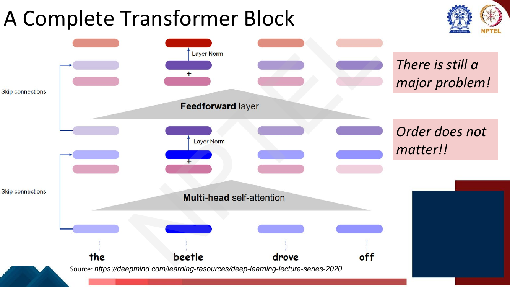
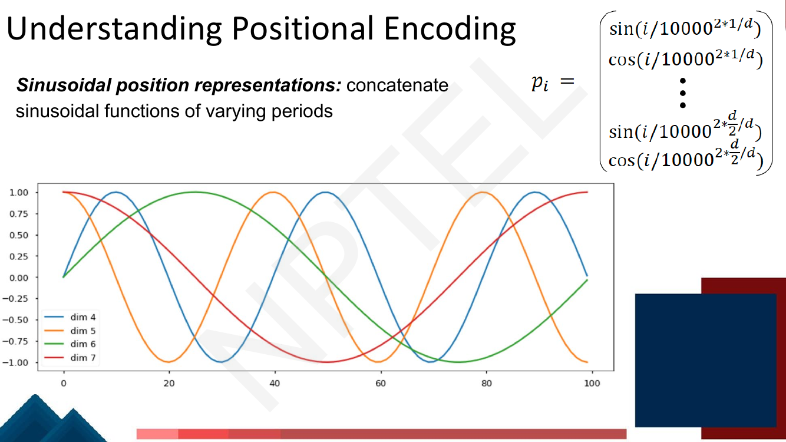
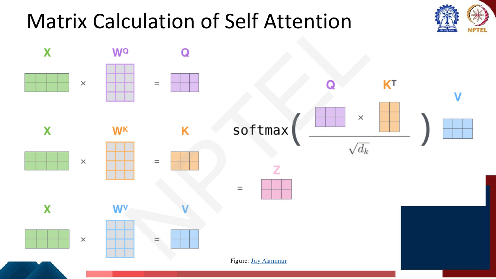

# Lec 23 — Positional Encodings and the Encoder Block

> **Source:** `Week5.pdf` pp. 62–83 · **Week 5** · **Playlist:** Lec 23
> **Prereqs:** [Lec 22 — Self-Attention and Multi-Head Attention](22-self-attention-and-multihead.md)
> **Feeds into:** [Lec 24 — Decoder and Transformer LM](24-decoder-and-transformer-lm.md), [Lec 53 — Positional Embeddings: RoPE and ALiBi](../week-11/53-positional-embeddings-rope-alibi.md)

## Why this lecture exists

Lecture 21 bought parallelism by throwing away recurrence, and Lecture 22 turned that trade into
equations. The bill comes due here. A self-attention layer computes every output position from every
input position with the same weight matrices and no notion of order, so the thing it reads is a **bag
of vectors**, not a sentence. The deck says it bluntly on its second slide: *"There is still a major
problem! Order does not matter!!"*

This lecture pays that bill. It injects position back into the input as a fixed sinusoidal signal that
is **added** to the token embeddings, then re-presents self-attention in matrix form — the version a
GPU actually executes — and finally assembles the complete encoder block and asks you to count its
parameters. It closes by noticing that nothing in the block was ever specific to text, and feeding it
image patches instead.

## The ideas

### Self-attention is permutation-equivariant

Take the sentence `dog bites man`. Self-attention computes, for position $i$, a weighted sum of value
vectors where the weight on position $j$ depends only on $\mathbf{q}_i \cdot \mathbf{k}_j$ — a dot
product between two vectors that were each produced from a token embedding by a shared linear map. No
step in that computation consults $i$ or $j$ themselves.

So if you permute the input tokens, the *set* of output vectors is unchanged — each one just moves to
follow its token. That property is called **permutation equivariance**: permute the input, and the
output permutes identically. In particular, the representation computed for the token `dog` in
`dog bites man` is **bit-for-bit identical** to the one computed for `dog` in `man bites dog`. The
model cannot tell the biter from the bitten. Averaging or pooling those outputs for a classifier makes
it worse still: pooling is permutation-*invariant*, so the two sentences collapse to exactly the same
vector.

An RNN never had this problem — position was implicit in the order you fed the tokens. Attention
threw that away, so position has to come back explicitly.


*Fig. — Every component in this block is order-blind: the attention is permutation-equivariant, the feedforward layer is applied position-wise, and layer norm acts within a vector. Nothing here distinguishes "the beetle drove off" from "off drove beetle the". Page 64 of `Week5.pdf`.*

### The fix: add a position signal to the embedding

The deck's design is deliberately minimal. Before the first encoder block, you **add a fixed quantity
to the embedding activations**. Three properties are stated on the slide, and each one is examinable:

- the quantity is **added**, not concatenated;
- each added number lies in $[-1, 1]$;
- what gets added depends on **two** things — the **dimension index** within the embedding, and the
  **absolute position** of the word in the input.

![Slide titled "Position Encoding of words": add fixed quantity to embedding activations; the quantity added to each input embedding unit is in [-1,1] and depends on the dimension of the unit within the embedding and the absolute position of the word; diagram shows a red positional vector being added to the blue embedding e_beetle](../../assets/pages/lec23/p-065.png)
*Fig. — Note the $+$ sign over `beetle`: one vector of the same length as the embedding, summed element-wise. The colour gradient across the four positions is the position signal changing; the blue row underneath (the token embeddings) is what changes with the word. Page 65.*

**Why add rather than concatenate?** Concatenation would be the obvious choice and it is wrong here
for a practical reason: it grows $d_{\text{model}}$, which grows $\mathbf{W}^Q,\mathbf{W}^K,
\mathbf{W}^V$ and every downstream weight, and it permanently spends dimensions that could have
carried meaning. Addition is free — the shape is unchanged — and because the embedding dimension is
large, the network can learn to keep the position signal in a near-orthogonal subspace of its own if
it wants to. It also means the position signal is still visible after the residual connection carries
the input forward. **"PE is added to the input embeddings"** is one of the most reliably asked facts
in this whole course. It is not concatenated, it is not multiplied, and it is applied **once**, at the
bottom of the stack, not inside every block.

### The sinusoidal scheme

The deck gives the formula twice. Page 67 is the one to memorise, because it names every symbol:

$$P(k, 2i) \;=\; \sin\!\left(\frac{k}{n^{2i/d}}\right), \qquad
  P(k, 2i+1) \;=\; \cos\!\left(\frac{k}{n^{2i/d}}\right)$$


*Fig. — The deck's own glossary. Note $0 \le i < d/2$: $i$ indexes **pairs** of dimensions, not single dimensions, which is why there are only $d/2$ distinct frequencies. Page 67.*

In this book's notation, with $\text{pos} = k$ and $d_{\text{model}} = d$ and $n = 10000$:

$$PE(\text{pos}, 2i) = \sin\!\left(\frac{\text{pos}}{10000^{2i/d_{\text{model}}}}\right), \qquad
  PE(\text{pos}, 2i+1) = \cos\!\left(\frac{\text{pos}}{10000^{2i/d_{\text{model}}}}\right)$$

Every symbol:

| Symbol | Meaning |
|---|---|
| $\text{pos}$ (the deck's $k$) | position of the token in the sequence, $0, 1, 2, \ldots$ |
| $i$ | index of the **dimension pair**, $0 \le i < d_{\text{model}}/2$ |
| $2i$ / $2i+1$ | the **even** dimension gets $\sin$, the **odd** dimension gets $\cos$ |
| $d_{\text{model}}$ | embedding width — the PE vector is exactly this long, so it can be added |
| $n = 10000$ | a user-chosen scalar; Vaswani et al. set it to 10,000 |

So the PE vector for one position is $d_{\text{model}}$ numbers, arranged as $d_{\text{model}}/2$
interleaved sine–cosine pairs. Pair $i$ has angular frequency $\omega_i = 1/10000^{2i/d_{\text{model}}}$,
hence **wavelength** $\lambda_i = 2\pi \cdot 10000^{2i/d_{\text{model}}}$. At $i = 0$ that is $2\pi$;
at the last pair it approaches $10000 \cdot 2\pi \approx 62{,}832$. The wavelengths form a **geometric
progression** from $2\pi$ to roughly $10000 \cdot 2\pi$ — early dimensions flip sign every few tokens,
late dimensions barely move across the whole sequence.


*Fig. — The plot is the whole idea in one picture: four coordinates of the PE vector, each a sinusoid of a different period, so the combination of their four values pins down the position. Dims 4 and 5 are a sin/cos pair (same period, quarter-cycle apart); so are dims 6 and 7, at a longer period. **Caution:** the exponents printed here run $2\cdot 1/d$ to $2 \cdot \tfrac{d}{2}/d$, i.e. $i$ from 1 to $d/2$, which contradicts page 67's $0 \le i < d/2$ and the paper. Page 67's indexing is the correct one. Page 66.*

**Why sinusoids, specifically?** Four reasons, and an exam can ask for any of them:

1. **Uniqueness.** With $d_{\text{model}}/2$ incommensurable frequencies, no two positions within any
   realistic length share a PE vector. It is effectively a positional "binary code" written in
   continuous values — the fast dimensions are the low-order bits, the slow ones the high-order bits.
2. **Bounded.** Every entry is in $[-1, 1]$, so the position signal cannot swamp the token embedding
   however long the sentence. A naive scheme like "add the integer $\text{pos}$ to every dimension"
   would grow without bound and destroy the semantics; normalising it by sequence length would make
   the same position mean different things in sentences of different lengths.
3. **Extrapolation.** $\sin$ and $\cos$ are defined for every real input, so the scheme produces a
   vector for position 5,000 even if training never saw a sequence longer than 512. Nothing has to be
   learned, so nothing is undefined. (Whether the *model* generalises to those positions is another
   matter — see [Lec 53](../week-11/53-positional-embeddings-rope-alibi.md).)
4. **Relative position is linear.** This is the deep reason. For a fixed offset $k$,
   $PE(\text{pos}+k)$ is a **linear function** of $PE(\text{pos})$ — and the linear map does not
   depend on $\text{pos}$. Within pair $i$, the angle-addition formulas give exactly a rotation by
   $\omega_i k$:

$$\begin{bmatrix}\sin \omega_i(\text{pos}+k) \\ \cos \omega_i(\text{pos}+k)\end{bmatrix}
= \begin{bmatrix}\cos \omega_i k & \sin \omega_i k \\ -\sin \omega_i k & \cos \omega_i k\end{bmatrix}
  \begin{bmatrix}\sin \omega_i \text{pos} \\ \cos \omega_i \text{pos}\end{bmatrix}$$

Stack those $2\times 2$ rotations into a block-diagonal $\mathbf{M}_k$ and $PE(\text{pos}+k) =
\mathbf{M}_k \, PE(\text{pos})$ for every $\text{pos}$. Since attention's $\mathbf{W}^Q$ and
$\mathbf{W}^K$ are themselves linear, a head can realise "attend 3 tokens to my left" with a weight
setting rather than by memorising every absolute pair. **This is why sine and cosine are paired in
adjacent dimensions**: the rotation needs both coordinates. Code block §5 verifies it numerically.

### The worked positional-encoding matrix

The deck's page 68 does the arithmetic for you on a toy setting — $d = 4$, $n = 100$ — which is a
gift, because the exam's version of this question looks exactly like it.


*Fig. — Read the column headers carefully: they are $i{=}0, i{=}0, i{=}1, i{=}1$ — one $i$ per **pair**. Columns 0–1 use $n^{0/4} = 1$; columns 2–3 use $n^{2/4} = \sqrt{100} = 10$. Row 0 is always $[0,1,0,1]$ for any $d$ and any $n$. Page 68.*

Two structural facts worth carrying into the exam. **Row 0 is always $(0,1,0,1,\ldots)$**, because
$\sin 0 = 0$ and $\cos 0 = 1$ regardless of frequency. And as $i$ grows the argument $\text{pos}/n^{2i/d}$
shrinks, so for large $i$ the sine column is almost $\text{pos}/n^{2i/d}$ (small-angle) and the cosine
column is almost 1 — the slow dimensions encode position almost *linearly*.

### Learned positional embeddings

The deck's "Other variants" slide gives the alternative: stop computing the position vector and
**learn** it.


*Fig. — The framing to remember: a position is treated as a **vocabulary item**. Position 17 gets a looked-up vector exactly as the word `fish` does. **Erratum:** the slide says $E_{\text{pos}}$ has shape $[1 \times N]$; for the vectors to be addable it must be $N \times d_{\text{model}}$, with $N$ the maximum supported length. Page 69.*

| | Sinusoidal | Learned |
|---|---|---|
| Parameters | **zero** | $N_{\max} \times d_{\text{model}}$ |
| Beyond training length | defined (extrapolates) | **undefined** — no row exists |
| Fit to data | fixed, task-agnostic | can adapt to the corpus |
| Relative offsets | linear by construction | must be learned from data |
| Used by | the original Transformer | **BERT, GPT-2/3** |

The trade-off is exactly the usual one: the sinusoid bakes in a correct inductive bias for free; the
learned table is more flexible but costs parameters and hard-caps your context length at $N_{\max}$.
Empirically Vaswani et al. found the two **nearly identical in quality** and chose sinusoidal for the
extrapolation. Note the examinable asymmetry: the original Transformer used sinusoidal, but the two
most famous pretrained models built on it, BERT and GPT-2/3, use **learned** embeddings.

![Slide listing six positional embedding families with the models that use each: 1. Learned Positional Embeddings (Gehring et al. 2017, Vaswani et al. 2017) — BERT, GPT-2/3; 2. Sinusoidal Embeddings (Vaswani et al. 2017); 3. Relative Positional Embeddings (Shaw et al. 2018) — Gopher variant; 4. Relative Positional Bias (Raffel et al. 2020) — T5; 5. Rotary Position Embeddings RoPE (Su et al. 2021) — Llama 1/2, Mistral, Falcon, PaLM, GPT-J, OLMo, Gemma; 6. Attention with Linear Biases ALiBi (Press et al. 2022) — BLOOM, MPT](../../assets/pages/lec23/p-070.png)
*Fig. — This chapter owns items 1 and 2 only. Items 3–6 — relative embeddings, T5 bias, RoPE and ALiBi — belong to [Lec 53](../week-11/53-positional-embeddings-rope-alibi.md); the model names in red are prime MCQ bait, so note them here and learn them there. Page 70.*

Modern LLMs have largely abandoned both of the schemes in this chapter in favour of **RoPE**, which
rotates $\mathbf{Q}$ and $\mathbf{K}$ by a position-dependent angle inside every attention layer
rather than adding anything to the input — the pay-off of the same rotation algebra you just saw.
[Lec 53](../week-11/53-positional-embeddings-rope-alibi.md) develops it.

### The same mechanism, written for a GPU

Pages 71–77 re-present Lecture 22's self-attention in matrix form. **The mechanism is unchanged** —
[Lec 22](22-self-attention-and-multihead.md) owns the $\mathbf{Q}/\mathbf{K}/\mathbf{V}$ projections,
the $\sqrt{d_k}$ scaling and why multiple heads help. What is new here is purely computational: how
you do *all positions at once* instead of one query at a time.

Stack the $T$ token vectors as rows of $\mathbf{X} \in \mathbb{R}^{T \times d_{\text{model}}}$. Then
one matrix multiply produces every query, key and value:

$$\mathbf{Q} = \mathbf{X}\mathbf{W}^Q, \qquad \mathbf{K} = \mathbf{X}\mathbf{W}^K, \qquad \mathbf{V} = \mathbf{X}\mathbf{W}^V$$

and one more produces every attention score:

$$\mathbf{Z} = \text{softmax}\!\left(\frac{\mathbf{Q}\mathbf{K}^\top}{\sqrt{d_k}}\right)\mathbf{V}$$


*Fig. — The entire per-token picture of pages 71–72 collapses into these four products. $\mathbf{Q}\mathbf{K}^\top$ is $T \times T$ — every query against every key in one `matmul`, and the reason cost is $O(T^2)$. The softmax is applied **row-wise**. Page 73.*

Shapes, which is the examinable content of this subsection. With $h$ heads and $d_k = d_v =
d_{\text{model}}/h$:

| Tensor | Shape |
|---|---|
| $\mathbf{X}$ | $T \times d_{\text{model}}$ |
| $\mathbf{W}^Q_j, \mathbf{W}^K_j, \mathbf{W}^V_j$ (head $j$) | $d_{\text{model}} \times d_k$ |
| $\mathbf{Q}_j, \mathbf{K}_j, \mathbf{V}_j$ | $T \times d_k$ |
| $\mathbf{Q}_j\mathbf{K}_j^\top$ (the attention map) | $T \times T$ |
| $\mathbf{Z}_j$ (one head's output) | $T \times d_v$ |
| $[\mathbf{Z}_0 ; \ldots ; \mathbf{Z}_{h-1}]$ | $T \times h\,d_v = T \times d_{\text{model}}$ |
| $\mathbf{W}^O$ | $d_{\text{model}} \times d_{\text{model}}$ |
| $\mathbf{Z} = [\ldots]\mathbf{W}^O$ | $T \times d_{\text{model}}$ |


*Fig. — The five steps of a multi-head block end to end. The footnote matters: **only encoder #0 sees embeddings and positional encodings**; encoder #1 upward takes the previous block's output $\mathbf{R}$ directly. Page 77.*

Two consequences worth stating. Because $h \cdot d_v = d_{\text{model}}$, **multi-head attention costs
the same as single-head attention** of width $d_{\text{model}}$ — the heads partition the width rather
than multiplying it. And because concatenation restores the width exactly, $\mathbf{W}^O$ is square,
so the whole sublayer maps $T \times d_{\text{model}} \to T \times d_{\text{model}}$ and can be
stacked.

### The encoder block


*Fig. — Follow the dashed arrows: each one starts **before** a sublayer and rejoins **inside** the Add & Normalize box, which computes $\text{LayerNorm}(\mathbf{X} + \mathbf{Z})$. Note the two Feed Forward boxes — one per position, **sharing the same weights**. Page 78.*

Stated precisely, one encoder block maps $\mathbf{X} \in \mathbb{R}^{T\times d_{\text{model}}}$ to an
output of the same shape by:

1. $\mathbf{Z} = \text{MultiHeadSelfAttention}(\mathbf{X})$
2. $\mathbf{X}' = \text{LayerNorm}(\mathbf{X} + \mathbf{Z})$ — **Add & Norm**
3. $\mathbf{F} = \text{FFN}(\mathbf{X}')$, applied **independently and identically to each position**
4. $\mathbf{X}'' = \text{LayerNorm}(\mathbf{X}' + \mathbf{F})$ — **Add & Norm**

and the encoder is $N$ such blocks stacked, $N = 6$ in the original paper. Each block has its **own**
weights — nothing is shared between blocks. Layer normalisation, the residual connections and the
FFN's internals are [Lec 22](22-self-attention-and-multihead.md)'s; here they are named components.

The order is examinable and is a standard trap: it is *sublayer → add residual → normalise*, so the
residual is added **before** the LayerNorm, not after. (This is **post-norm**, the original paper's
arrangement. Note that the ViT figure on page 80 of this very deck shows **pre-norm** — Norm, then
attention, then add — which is what nearly all modern implementations use because it trains more
stably. Both appear in this deck; know which figure you are being shown.)

Positional encoding enters **once**, at the bottom, before block 1. It is not re-added at each block.

### Counting the encoder's parameters

Page 79 asks "Number of parameters in the encoder?" and leaves the slide blank — an unanswered
in-deck exercise. Build it sublayer by sublayer, for one block, with $d = d_{\text{model}}$:

| Component | Count |
|---|---|
| $\mathbf{W}^Q, \mathbf{W}^K, \mathbf{W}^V$ (all heads together) | $3 d^2$ |
| $\mathbf{W}^O$ | $d^2$ |
| FFN $\mathbf{W}_1 \in \mathbb{R}^{d \times d_{ff}}$, $\mathbf{W}_2 \in \mathbb{R}^{d_{ff} \times d}$ | $2 d\, d_{ff}$ |
| 2 × LayerNorm (gain $\boldsymbol\gamma$ + shift $\boldsymbol\beta$) | $4d$ |
| biases ($\mathbf{Q},\mathbf{K},\mathbf{V},\mathbf{O}$, FFN) | $4d + d_{ff} + d$ |

The head count $h$ **does not appear**. Splitting $d$ into $h$ slices of $d_k = d/h$ leaves
$h \cdot d \cdot d_k = d^2$ either way. Changing $h$ at fixed $d_{\text{model}}$ changes nothing about
the parameter count — a favourite MCQ.

Ignoring biases and norms, the headline formula is

$$\text{params per block} \;=\; 4 d_{\text{model}}^2 + 2 d_{\text{model}} d_{ff}$$

and with the standard $d_{ff} = 4 d_{\text{model}}$ this is $4d^2 + 8d^2 = \mathbf{12\,d_{\text{model}}^2}$.
Worth memorising: **a Transformer layer has about $12 d_{\text{model}}^2$ parameters**, split one third
attention, two thirds FFN. N4 below does the arithmetic.

### Encoding images: the Vision Transformer

Nothing in the encoder block was ever specific to language. Feed it any sequence of $d_{\text{model}}$-
dimensional vectors and it works — so make an image into one.


*Fig. — The encoder block on the right is the one you just built, unchanged, except that the Norms sit **before** the sublayers (pre-norm). The paper's title — "An Image is Worth 16×16 Words", ICLR 2021 — is itself the summary. Page 80.*

The recipe (page 81), for an image of shape $H \times W \times C$ and patch size $P \times P$:

1. **Split** into $N = HW/P^2$ non-overlapping patches. $N$ is the effective sequence length.
2. **Flatten** each patch to a vector of length $P^2 C$.
3. **Linearly project** it with a trainable $\mathbf{E} \in \mathbb{R}^{(P^2C) \times D}$ to the model
   width $D$. These are the "tokens".
4. **Add** standard learnable 1-D positional embeddings $\mathbf{E}_{\text{pos}} \in \mathbb{R}^{(N+1)\times D}$
   — note ViT uses the *learned* variant, and 1-D despite the image being 2-D.
5. **Prepend** a learnable `[class]` token; its representation at the final layer is the image
   representation, fed to an MLP head.

That is the entire adaptation. The companion course develops ViT properly, along with DETR and Swin —
see [the vision course's treatment](../../../GenAIforCV/notes/week-08/28-vit-detr-swin.md). Stop here.

## Worked numericals

### N1. Reproduce the deck's positional-encoding matrix (page 68)
**Given:** $d = 4$, $n = 100$, sequence `I am a Robot` at positions $k = 0,1,2,3$.
**Find:** the full $4 \times 4$ PE matrix.

1. $i$ indexes pairs, so $i \in \{0, 1\}$. Denominator for pair $i$ is $n^{2i/d} = 100^{2i/4} = 100^{i/2}$.
2. Pair $i=0$ (columns 0, 1): $100^{0} = 1$. Pair $i=1$ (columns 2, 3): $100^{1/2} = \mathbf{10}$.
3. Row $k=0$: $\sin 0 = 0$, $\cos 0 = 1$ in both pairs $\Rightarrow (0, 1, 0, 1)$.
4. Row $k=1$: $\sin(1/1) = 0.8415$, $\cos(1/1) = 0.5403$, $\sin(1/10) = \sin 0.1 = 0.0998$, $\cos 0.1 = 0.9950$.
5. Row $k=2$: $\sin 2 = 0.9093$, $\cos 2 = -0.4161$, $\sin 0.2 = 0.1987$, $\cos 0.2 = 0.9801$.
6. Row $k=3$: $\sin 3 = 0.1411$, $\cos 3 = -0.9900$, $\sin 0.3 = 0.2955$, $\cos 0.3 = 0.9553$.

**Answer:**

| $k$ | col 0 | col 1 | col 2 | col 3 |
|---|---|---|---|---|
| 0 | 0.00 | 1.00 | 0.00 | 1.00 |
| 1 | 0.84 | 0.54 | 0.10 | 1.00 |
| 2 | 0.91 | −0.42 | 0.20 | 0.98 |
| 3 | 0.14 | −0.99 | 0.30 | 0.96 |

Every entry agrees with the slide to 2 d.p. (the deck rounds $\cos 0.1 = 0.995$ to $1.0$).

### N2. Positional encodings at $d_{\text{model}} = 8$, $n = 10000$, and the wavelengths
**Given:** $d_{\text{model}} = 8$, $n = 10000$, positions $\text{pos} = 0, 1, 2$.
**Find:** all eight components at each position, plus the wavelength of each pair.

1. Pairs are $i = 0,1,2,3$. Denominator $10000^{2i/8} = 10000^{i/4}$.
2. $i=0: 10000^0 = 1$; $i=1: 10000^{0.25} = 10$; $i=2: 10000^{0.5} = 100$; $i=3: 10000^{0.75} = 1000$.
3. Wavelength $\lambda_i = 2\pi \times$ that denominator: $6.28,\; 62.83,\; 628.32,\; 6283.19$ — a
   **geometric progression with ratio 10**, because $10000^{2/8} = 10$.
4. $\text{pos}=0$: every argument is 0, so $(0, 1, 0, 1, 0, 1, 0, 1)$.
5. $\text{pos}=1$: arguments $1, 0.1, 0.01, 0.001$.
   $\sin 1 = 0.8415$, $\cos 1 = 0.5403$; $\sin 0.1 = 0.0998$, $\cos 0.1 = 0.9950$;
   $\sin 0.01 = 0.0100$, $\cos 0.01 = 1.0000$; $\sin 0.001 = 0.0010$, $\cos 0.001 = 1.0000$.
6. $\text{pos}=2$: arguments $2, 0.2, 0.02, 0.002$.
   $\sin 2 = 0.9093$, $\cos 2 = -0.4161$; $\sin 0.2 = 0.1987$, $\cos 0.2 = 0.9801$;
   $\sin 0.02 = 0.0200$, $\cos 0.02 = 0.9998$; $\sin 0.002 = 0.0020$, $\cos 0.002 = 1.0000$.

**Answer:**

| pos | 0 (sin) | 1 (cos) | 2 (sin) | 3 (cos) | 4 (sin) | 5 (cos) | 6 (sin) | 7 (cos) |
|---|---|---|---|---|---|---|---|---|
| 0 | 0.0000 | 1.0000 | 0.0000 | 1.0000 | 0.0000 | 1.0000 | 0.0000 | 1.0000 |
| 1 | 0.8415 | 0.5403 | 0.0998 | 0.9950 | 0.0100 | 1.0000 | 0.0010 | 1.0000 |
| 2 | 0.9093 | −0.4161 | 0.1987 | 0.9801 | 0.0200 | 0.9998 | 0.0020 | 1.0000 |

Notice dimensions 6–7 barely move between positions 0 and 2 — wavelength 6283 means they need
thousands of tokens to complete a cycle. Dimensions 0–1 have already swung most of a full turn.

### N3. The same token at two positions gets two different vectors
**Given:** $d_{\text{model}} = 4$, $n = 10000$. Token `dog` has embedding
$\mathbf{e} = (0.2,\; 0.1,\; -0.3,\; 0.4)$. It appears at position 0 in one sentence and position 1 in
another.
**Find:** both input vectors and their cosine similarity.

1. Denominators: pair $i=0 \Rightarrow 10000^{0} = 1$; pair $i=1 \Rightarrow 10000^{2/4} = 100$.
2. $PE(0) = (0,\, 1,\, 0,\, 1)$.
3. $PE(1) = (\sin 1,\; \cos 1,\; \sin 0.01,\; \cos 0.01) = (0.8415,\; 0.5403,\; 0.0100,\; 1.0000)$.
4. $\mathbf{x}_0 = \mathbf{e} + PE(0) = (0.2,\; 1.1,\; -0.3,\; 1.4)$.
5. $\mathbf{x}_1 = \mathbf{e} + PE(1) = (1.0415,\; 0.6403,\; -0.2900,\; 1.4000)$.
6. Dot product: $0.2(1.0415) + 1.1(0.6403) + (-0.3)(-0.29) + 1.4(1.4)$
   $= 0.2083 + 0.7043 + 0.0870 + 1.9600 = 2.9596$.
7. $\|\mathbf{x}_0\| = \sqrt{0.04 + 1.21 + 0.09 + 1.96} = \sqrt{3.30} = 1.8166$.
8. $\|\mathbf{x}_1\| = \sqrt{1.0847 + 0.4100 + 0.0841 + 1.96} = \sqrt{3.5388} = 1.8812$.
9. $\cos = 2.9596 / (1.8166 \times 1.8812) = 2.9596 / 3.4170 = 0.8661$.

**Answer:** the two vectors differ, with cosine similarity $\mathbf{0.866}$, not 1. Without the
positional encoding both would be exactly $\mathbf{e}$ and the cosine would be 1 — the model would have
no way to distinguish the two occurrences. **This is the entire purpose of positional encoding.**

### N4. Parameters in an encoder block, and in a 6-block encoder (page 79)
**Given:** $d_{\text{model}} = 512$, $h = 8$, $d_{ff} = 2048$, $N = 6$. Include biases and LayerNorm.
**Find:** parameters per block, and for the stack.

1. $d_k = d_v = 512/8 = 64$. Per head, $\mathbf{W}^Q_j$ is $512 \times 64 = 32{,}768$; across 8 heads,
   $8 \times 32{,}768 = 262{,}144 = 512^2$. Same for $\mathbf{W}^K$ and $\mathbf{W}^V$.
2. Three projections: $3 \times 262{,}144 = 786{,}432$.
3. $\mathbf{W}^O$: $512 \times 512 = 262{,}144$. Attention weights total $4 \times 262{,}144 = \mathbf{1{,}048{,}576}$.
4. Attention biases: $4 \times 512 = 2{,}048$. Attention sublayer $= 1{,}050{,}624$.
5. FFN: $\mathbf{W}_1$ is $512 \times 2048 = 1{,}048{,}576$ with bias $2{,}048$;
   $\mathbf{W}_2$ is $2048 \times 512 = 1{,}048{,}576$ with bias $512$.
   FFN total $= 2{,}097{,}152 + 2{,}560 = \mathbf{2{,}099{,}712}$.
6. LayerNorms: 2 of them, each a gain and a shift of length 512: $2 \times 2 \times 512 = 2{,}048$.
7. Block total $= 1{,}050{,}624 + 2{,}099{,}712 + 2{,}048 = \mathbf{3{,}152{,}384}$.
8. Weights only (no biases, no norms): $1{,}048{,}576 + 2{,}097{,}152 = 3{,}145{,}728 = 12 \times 512^2$ ✓
9. Stack of $N = 6$: $6 \times 3{,}152{,}384 = \mathbf{18{,}914{,}304}$ (weights only:
   $6 \times 3{,}145{,}728 = 18{,}874{,}368 \approx 18.9$M).

**Answer:** $\approx 3.15$M per block, $\approx 18.9$M for the 6-block encoder. Note that **the
embedding matrix is not counted** — at $|V| = 37{,}000$ and $d = 512$ it alone is 18.9M more, i.e. as
large as the entire encoder stack. Sanity check with a known model: BERT-base ($d = 768$,
$d_{ff} = 3072$, 12 layers) gives $12 \times 7{,}087{,}872 = 85.05$M, and with its ~23.8M of
embeddings that is the familiar ~110M.

### N5. Tensor shapes through one encoder block
**Given:** batch $B = 32$, sequence length $T = 10$, $d_{\text{model}} = 512$, $h = 8$, $d_{ff} = 2048$.
**Find:** the shape after every step.

1. Token embeddings: $(32, 10, 512)$.
2. $+\,PE$: the PE matrix is $(10, 512)$ and **broadcasts** over the batch → $(32, 10, 512)$.
3. $\mathbf{Q} = \mathbf{X}\mathbf{W}^Q$ with $\mathbf{W}^Q$ of shape $(512, 512)$ → $(32, 10, 512)$.
4. Reshape to heads: $(32, 10, 8, 64)$, transpose → $(32, 8, 10, 64)$. Same for $\mathbf{K}, \mathbf{V}$.
5. Scores $\mathbf{Q}\mathbf{K}^\top$: $(32, 8, 10, 64) \times (32, 8, 64, 10) \to (32, 8, 10, 10)$.
6. Divide by $\sqrt{d_k} = \sqrt{64} = 8$; row-wise softmax — shape unchanged, $(32, 8, 10, 10)$.
7. Times $\mathbf{V}$: $(32, 8, 10, 10) \times (32, 8, 10, 64) \to (32, 8, 10, 64)$.
8. Transpose and merge heads: $(32, 10, 8, 64) \to (32, 10, 512)$ — this is the concatenation.
9. $\times \mathbf{W}^O\,(512,512) \to (32, 10, 512)$. Add residual, LayerNorm → $(32, 10, 512)$.
10. FFN: $(32,10,512) \times (512,2048) \to (32, 10, 2048)$; ReLU; $\times (2048,512) \to (32,10,512)$.
11. Add residual, LayerNorm → $(32, 10, 512)$.

**Answer:** in $(32, 10, 512)$, out $(32, 10, 512)$. The only tensor that is not
$(B, \cdot, \cdot, d)$-shaped is the $(32, 8, 10, 10)$ attention map — $32 \times 8 \times 100 =
25{,}600$ numbers, and the term that grows as $T^2$.

### N6. ViT patch count and patch-embedding parameters
**Given:** image $224 \times 224 \times 3$, patch size $P = 16$, model width $D = 768$.
**Find:** sequence length, flattened patch dimension, and the parameters of steps 3–5.

1. $N = HW/P^2 = (224 \times 224)/(16 \times 16) = 50{,}176/256 = \mathbf{196}$ patches.
   Equivalently a $14 \times 14$ grid, since $224/16 = 14$.
2. With the prepended `[class]` token the encoder sees $196 + 1 = \mathbf{197}$ tokens.
3. Flattened patch dimension $P^2 C = 256 \times 3 = \mathbf{768}$ (coincidentally equal to $D$ here).
4. Projection $\mathbf{E} \in \mathbb{R}^{768 \times 768} = 589{,}824$ parameters, plus a 768 bias.
5. $\mathbf{E}_{\text{pos}} \in \mathbb{R}^{197 \times 768} = \mathbf{151{,}296}$ learned parameters.
6. `[class]` token: one more vector of 768.

**Answer:** 196 patches, 197 tokens, 768-dim flattened patches; 590,592 projection parameters +
151,296 positional + 768 class token. Halving the patch to $P = 8$ would give $N = 784$ — **four
times** the sequence length and **sixteen** times the attention cost, which is why ViT uses 16×16.

## Code

```python
import numpy as np

def positional_encoding(max_len, d_model, n=10000.0):
    """Sinusoidal PE matrix, shape (max_len, d_model).
    Even columns 2i -> sin(pos / n**(2i/d)), odd columns 2i+1 -> cos(pos / n**(2i/d))."""
    pos = np.arange(max_len)[:, None]                 # (max_len, 1)
    i   = np.arange(d_model // 2)[None, :]            # (1, d/2)  -> i = 0,1,...,d/2-1
    denom = n ** (2.0 * i / d_model)                  # one frequency per PAIR of dims
    pe = np.zeros((max_len, d_model))
    pe[:, 0::2] = np.sin(pos / denom)                 # even dims
    pe[:, 1::2] = np.cos(pos / denom)                 # odd  dims
    return pe

# --- 1. the deck's own table: d=4, n=100, four positions (page 68) --------
print("deck's PE matrix, d=4, n=100")
print(np.round(positional_encoding(4, 4, n=100), 2))

# --- 2. the standard setting: d=8, n=10000 -------------------------------
PE = positional_encoding(6, 8)
print("\nPE, d_model=8, n=10000   (cols: sin cos sin cos sin cos sin cos)")
print("pos " + " ".join(f"{c:>7}" for c in range(8)))
for p, row in enumerate(PE):
    print(f"{p:3d} " + " ".join(f"{v:7.4f}" for v in row))

# --- 3. wavelengths grow geometrically ----------------------------------
d = 8
print("\npair i   denominator n^(2i/d)   wavelength 2*pi*n^(2i/d)")
for i in range(d // 2):
    den = 10000 ** (2 * i / d)
    print(f"  {i}      {den:12.2f}        {2*np.pi*den:12.2f}")

# --- 4. same token, two positions -> different vectors -------------------
e = np.array([0.2, 0.1, -0.3, 0.4])          # embedding of "dog", d_model=4
P = positional_encoding(6, 4)                 # n = 10000 here
x0, x1 = e + P[0], e + P[1]
cos = x0 @ x1 / (np.linalg.norm(x0) * np.linalg.norm(x1))
print(f"\n'dog' at pos 0 -> {np.round(x0,4)}")
print(f"'dog' at pos 1 -> {np.round(x1,4)}")
print(f"cosine similarity = {cos:.4f}   (identical token, different vector)")

# --- 5. PE(pos+k) is a LINEAR function of PE(pos) ------------------------
# For each dim pair with angular frequency w, shifting by k is a 2x2 rotation
# by w*k, so the whole shift is one block-diagonal matrix M_k independent of pos.
def shift_matrix(k, d_model, n=10000.0):
    M = np.zeros((d_model, d_model))
    for i in range(d_model // 2):
        w = 1.0 / n ** (2 * i / d_model)
        c, s = np.cos(w * k), np.sin(w * k)
        M[2*i:2*i+2, 2*i:2*i+2] = [[c, s], [-s, c]]
    return M

PE20 = positional_encoding(20, 8)
M3 = shift_matrix(3, 8)
err = max(np.abs(M3 @ PE20[p] - PE20[p + 3]).max() for p in range(17))
print(f"\nmax |M_3 @ PE(pos) - PE(pos+3)| over pos=0..16 : {err:.2e}")
print("M_3 is the SAME matrix for every pos -> relative offset is linear.")
```

Real output:

```
deck's PE matrix, d=4, n=100
[[ 0.    1.    0.    1.  ]
 [ 0.84  0.54  0.1   1.  ]
 [ 0.91 -0.42  0.2   0.98]
 [ 0.14 -0.99  0.3   0.96]]

PE, d_model=8, n=10000   (cols: sin cos sin cos sin cos sin cos)
pos       0       1       2       3       4       5       6       7
  0  0.0000  1.0000  0.0000  1.0000  0.0000  1.0000  0.0000  1.0000
  1  0.8415  0.5403  0.0998  0.9950  0.0100  1.0000  0.0010  1.0000
  2  0.9093 -0.4161  0.1987  0.9801  0.0200  0.9998  0.0020  1.0000
  3  0.1411 -0.9900  0.2955  0.9553  0.0300  0.9996  0.0030  1.0000
  4 -0.7568 -0.6536  0.3894  0.9211  0.0400  0.9992  0.0040  1.0000
  5 -0.9589  0.2837  0.4794  0.8776  0.0500  0.9988  0.0050  1.0000

pair i   denominator n^(2i/d)   wavelength 2*pi*n^(2i/d)
  0              1.00                6.28
  1             10.00               62.83
  2            100.00              628.32
  3           1000.00             6283.19

'dog' at pos 0 -> [ 0.2  1.1 -0.3  1.4]
'dog' at pos 1 -> [ 1.0415  0.6403 -0.29    1.4   ]
cosine similarity = 0.8661   (identical token, different vector)

max |M_3 @ PE(pos) - PE(pos+3)| over pos=0..16 : 2.22e-16
M_3 is the SAME matrix for every pos -> relative offset is linear.
```

The first block reproduces the deck's page-68 table exactly. The grid in block 2 is the structure to
carry into the exam: read down a column and you see one sinusoid; read across a row and you see the
position's fingerprint, with the left-hand (fast) columns doing the discriminating and the right-hand
(slow) columns nearly constant. Block 5 confirms the linearity claim to machine precision — error
$2.2\times10^{-16}$ — using **one** matrix $\mathbf{M}_3$ for all 17 starting positions.

## Exam pack

### Must-memorise

| Item | Exactly this |
|---|---|
| Sinusoidal PE (deck's form, p. 67) | $P(k,2i) = \sin\!\big(k/n^{2i/d}\big)$, $P(k,2i{+}1) = \cos\!\big(k/n^{2i/d}\big)$ |
| Same in this book's notation | $PE(\text{pos},2i) = \sin\!\big(\text{pos}/10000^{2i/d_{\text{model}}}\big)$, $PE(\text{pos},2i{+}1) = \cos(\cdot)$ |
| $i$'s range | $0 \le i < d_{\text{model}}/2$ — $i$ indexes **pairs**, not single dimensions |
| Even / odd | even dimension → **sine**; odd dimension → **cosine** |
| Combination rule | PE is **ADDED** to the embedding, never concatenated; **once**, before block 1 |
| Range of each entry | $[-1, 1]$ |
| Wavelengths | geometric from $2\pi$ to $10000\cdot 2\pi$ |
| Row 0 of the PE matrix | $(0,1,0,1,\ldots)$ for any $d$ and any $n$ |
| Relative-position property | $PE(\text{pos}{+}k) = \mathbf{M}_k\,PE(\text{pos})$, $\mathbf{M}_k$ block-diagonal rotations, independent of $\text{pos}$ |
| Why self-attention needs it | self-attention is **permutation-equivariant** — it sees a set |
| Matrix self-attention | $\mathbf{Z} = \text{softmax}\!\big(\mathbf{Q}\mathbf{K}^\top/\sqrt{d_k}\big)\mathbf{V}$, with $\mathbf{Q} = \mathbf{X}\mathbf{W}^Q$ etc. |
| Attention-map shape | $T \times T$ per head; $h$ heads → $h \times T \times T$ |
| Head width | $d_k = d_v = d_{\text{model}}/h$, so $h\,d_v = d_{\text{model}}$ |
| Encoder block order | MHSA → **Add & Norm** → position-wise FFN → **Add & Norm**, $\times N$ |
| Add & Norm means | $\text{LayerNorm}(\mathbf{x} + \text{Sublayer}(\mathbf{x}))$ — residual **then** norm (post-norm) |
| Params per block (weights) | $4d_{\text{model}}^2 + 2 d_{\text{model}} d_{ff} = 12 d_{\text{model}}^2$ when $d_{ff}=4d_{\text{model}}$ |
| Does $h$ change the count? | **No** |
| ViT patch count | $N = HW/P^2$; project each flattened $P^2C$ patch by $\mathbf{E} \in \mathbb{R}^{(P^2C)\times D}$ |

### Numbers worth knowing

| Quantity | Value |
|---|---|
| $n$ in the sinusoid | **10,000** (Vaswani et al.'s choice; "user-defined scalar") |
| Original Transformer base | $d_{\text{model}} = 512$, $h = 8$, $d_k = 64$, $d_{ff} = 2048$, $N = 6$ |
| Encoder block params (above) | 3,152,384 incl. biases; 3,145,728 weights only |
| 6-block encoder | 18,914,304 ≈ 18.9M |
| BERT-base encoder | $d=768$, $d_{ff}=3072$, 12 layers → 85.05M; ~110M with embeddings |
| Deck's $d=4$, $n=100$ example | denominators 1 and 10; row 1 = $(0.84, 0.54, 0.10, 1.0)$ |
| Deck's scaled-dot example (p. 72) | scores 112 and 96, $\div\sqrt{d_k}=8$ → 14 and 12, softmax → **0.88 / 0.12** |
| Wavelengths at $d=8$ | 6.28, 62.83, 628.3, 6283 |
| ViT paper | "An Image is Worth 16×16 Words", **ICLR 2021** |
| ViT at 224×224, $P{=}16$ | 196 patches, 197 tokens with `[class]`, patch vector 768-dim |
| Learned PE used by | BERT, GPT-2/3 (sinusoidal by the original Transformer) |
| RoPE used by | Llama 1/2, Mistral, Falcon, PaLM, GPT-J, OLMo, Gemma |
| ALiBi used by | BLOOM, MPT |

### Likely MCQ traps

- **"Positional encodings are concatenated to the embeddings."** No — **added**, element-wise. The PE
  vector has length $d_{\text{model}}$ precisely so that it can be.
- **"PE is added at every encoder block."** No — once, at the input. Blocks 2…$N$ receive the previous
  block's output directly (the footnote on page 77).
- **"Even dimensions get cosine."** Reversed. Even → $\sin$, odd → $\cos$.
- **$i$ runs to $d_{\text{model}}$.** No: $0 \le i < d_{\text{model}}/2$. Writing
  $10000^{2i/d}$ with $i$ up to $d$ gives exponents up to 2 and the wrong frequencies. (The deck's own
  page 66 muddles this; page 67's glossary is authoritative.)
- **"Sinusoidal PE has learnable parameters."** It has **zero**. The learned variant has
  $N_{\max}\times d_{\text{model}}$.
- **"Self-attention is permutation-invariant."** Strictly it is **equivariant** — permute the input and
  the outputs permute with it. Invariance only arises after you pool.
- **"More heads means more parameters."** No. $d_k = d_{\text{model}}/h$, so the projections total
  $d_{\text{model}}^2$ for any $h$.
- **"$\mathbf{Q}\mathbf{K}^\top$ is $T\times d_k$."** It is $T \times T$ — a score for every ordered
  pair of positions.
- **"The FFN mixes information across positions."** It does not. It is applied **position-wise** with
  shared weights; **only attention moves information between positions.**
- **"Add & Norm means normalise then add."** The residual is added first:
  $\text{LayerNorm}(\mathbf{x} + \text{Sublayer}(\mathbf{x}))$. (Pre-norm, as drawn in the ViT figure
  on page 80, is the modern variant and is drawn differently — check which figure the question shows.)
- **"Every encoder block shares weights."** No. $N$ blocks, $N$ independent parameter sets.
- **"ViT uses sinusoidal 2-D positional encodings."** It uses **learned 1-D** ones.
- **Confusing the deck's $n$ with sequence length.** $n = 10000$ is the frequency base; $L$ or $T$ is
  the sequence length, and they are unrelated.

### Self-test

1. Why does `dog bites man` produce the same `dog` representation as `man bites dog` under bare self-attention?
2. State both halves of the sinusoidal formula and give the range of $i$.
3. Compute $PE(0)$ for $d_{\text{model}} = 6$.
4. For $d_{\text{model}} = 8$, $n = 10000$, what is the denominator for dimension pair $i = 2$?
5. Added or concatenated? At which layer(s)?
6. How many parameters does a sinusoidal PE scheme add? A learned one, with $N_{\max} = 512$ and $d_{\text{model}} = 768$?
7. Give the shape of $\mathbf{Q}\mathbf{K}^\top$ for one head with $T = 12$, $d_k = 64$.
8. Write the encoder block's four steps in order.
9. $d_{\text{model}} = 768$, $h = 12$, $d_{ff} = 3072$. How many weights (ignore biases/norms) in one block?
10. If $h$ goes from 8 to 16 at fixed $d_{\text{model}} = 512$, what happens to $d_k$ and to the parameter count?
11. A $384\times384$ image with $P = 16$: how many patches, and how many tokens does the ViT encoder see?
12. Why is $PE(\text{pos}+k)$ being linear in $PE(\text{pos})$ useful?

<details><summary>Answers</summary>

1. Self-attention is permutation-equivariant: the weight on position $j$ depends only on $\mathbf{q}_i\cdot\mathbf{k}_j$, and nothing in the computation references the index. Permuting the input just permutes the outputs, so `dog`'s vector is unchanged.
2. $PE(\text{pos},2i)=\sin(\text{pos}/10000^{2i/d_{\text{model}}})$, $PE(\text{pos},2i{+}1)=\cos(\text{pos}/10000^{2i/d_{\text{model}}})$, with $0\le i < d_{\text{model}}/2$.
3. $(0,1,0,1,0,1)$ — $\sin 0 = 0$, $\cos 0 = 1$ at every frequency.
4. $10000^{2\cdot 2/8} = 10000^{0.5} = 100$.
5. Added, element-wise, and only once — to the input embeddings before the first encoder block.
6. Sinusoidal: **0**. Learned: $512 \times 768 = 393{,}216$.
7. $12 \times 12$. ($d_k$ is summed over and disappears.)
8. (i) multi-head self-attention; (ii) $\text{LayerNorm}(\mathbf{X}+\mathbf{Z})$; (iii) position-wise FFN; (iv) $\text{LayerNorm}$ of that sum. Repeat $N$ times.
9. $4(768)^2 + 2(768)(3072) = 2{,}359{,}296 + 4{,}718{,}592 = 7{,}077{,}888$ ≈ 7.08M.
10. $d_k$ halves from 64 to 32; the parameter count is **unchanged** at $4d_{\text{model}}^2$.
11. $384^2/16^2 = 147{,}456/256 = 576$ patches; 577 tokens with the `[class]` token.
12. Because a linear, position-independent map means a head can implement "look $k$ tokens back" with fixed weights, rather than having to learn every absolute position pair separately.

</details>

## Beyond the slides

**Gap:** The deck never says why the token embeddings are multiplied by $\sqrt{d_{\text{model}}}$
before the PE is added.
**Why it matters:** In the original paper the embedding lookup is scaled by $\sqrt{d_{\text{model}}}$
(= 22.6 at $d=512$) precisely so the embeddings do not get drowned by a PE whose entries are $O(1)$
while a freshly initialised embedding's entries are $O(1/\sqrt{d})$. Omit the scale and the position
signal dominates the semantics early in training. Implementations do this; the slides do not mention
it.

**Gap:** No mention that the PE can be *dropped out*, or that the whole scheme breaks down once you
exceed the trained length.
**Why it matters:** Sinusoids are *defined* beyond the training length, but models trained only on
512 tokens degrade badly at 2,000 — the model never learned what those frequency combinations mean.
This failure is the entire motivation for ALiBi and position interpolation in
[Lec 53](../week-11/53-positional-embeddings-rope-alibi.md). "Sinusoids extrapolate" is a statement
about the *function*, not about the *model*.

**Gap:** Absolute vs relative position is never distinguished as a concept.
**Why it matters:** Everything in this chapter encodes **absolute** position ("you are token 7"). The
whole modern literature moved to encoding **relative** position ("you are 3 tokens left of me"),
because language's dependencies are relative. Having the distinction in hand makes Lec 53 trivial.

**Gap:** The deck shows post-norm in the encoder figure (p. 78) and pre-norm in the ViT figure (p. 80)
without comment.
**Why it matters:** Post-norm — $\text{LayerNorm}(\mathbf{x} + \text{Sublayer}(\mathbf{x}))$ — is the
2017 paper and needs learning-rate warmup to train at all. Pre-norm —
$\mathbf{x} + \text{Sublayer}(\text{LayerNorm}(\mathbf{x}))$ — leaves the residual path clean and is
what GPT-2 onwards, and ViT, actually use. Expect a question that hinges on which one is drawn.

## Cut from the slides

Pages 62, 63, 82 and 83 are the title, contents, reference and thank-you slides and carry no content.
Pages 71–77 re-present Lecture 22's self-attention in Jay Alammar's per-token illustrations and were
deliberately **not** re-derived here: [Lec 22](22-self-attention-and-multihead.md) owns the
$\mathbf{Q}/\mathbf{K}/\mathbf{V}$ construction, the $\sqrt{d_k}$ scaling argument, the rationale for
multiple heads, layer normalisation, the residual connections and the FFN's internals, so this chapter
compressed those seven pages into one "same thing, written for a GPU" subsection built around shapes
and the two slides that actually add information (p. 73's matrix form, p. 77's five-step summary).
Page 72's worked numbers (112, 96 → 14, 12 → 0.88, 0.12) are recorded in the exam pack rather than
re-explained. Pages 74–76's per-head and concatenation illustrations are folded into the shape table.
Page 70's list of six positional schemes is reproduced as a figure but only items 1–2 are taught —
RoPE, ALiBi, relative embeddings and T5 bias belong to
[Lec 53](../week-11/53-positional-embeddings-rope-alibi.md). The Vision Transformer pages (80–81) are
given the recipe and the patch arithmetic only, with the full treatment left to the companion course's
[ViT chapter](../../../GenAIforCV/notes/week-08/28-vit-detr-swin.md). Nothing on positional encoding,
the encoder block, or parameter counting was dropped.
