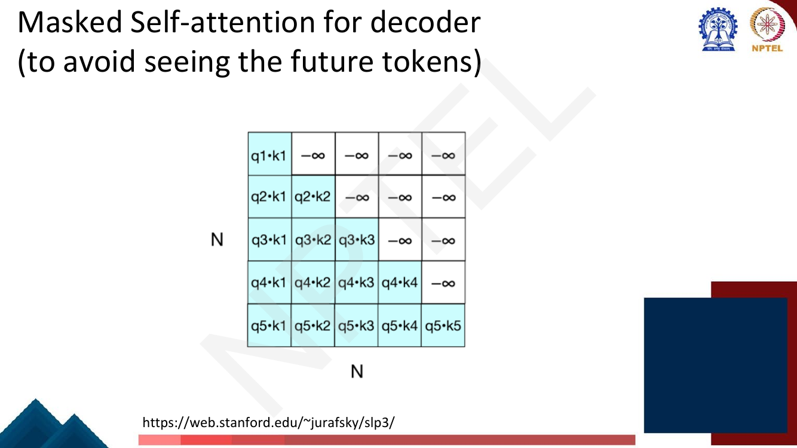
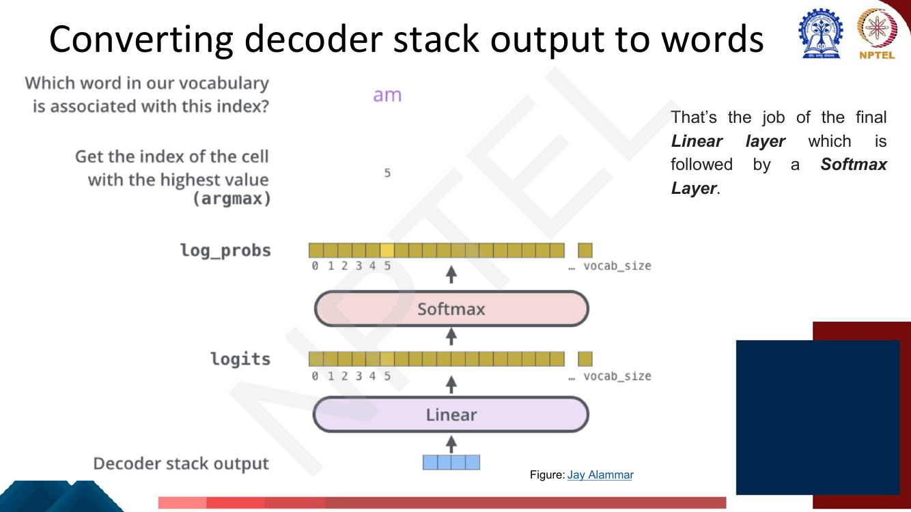
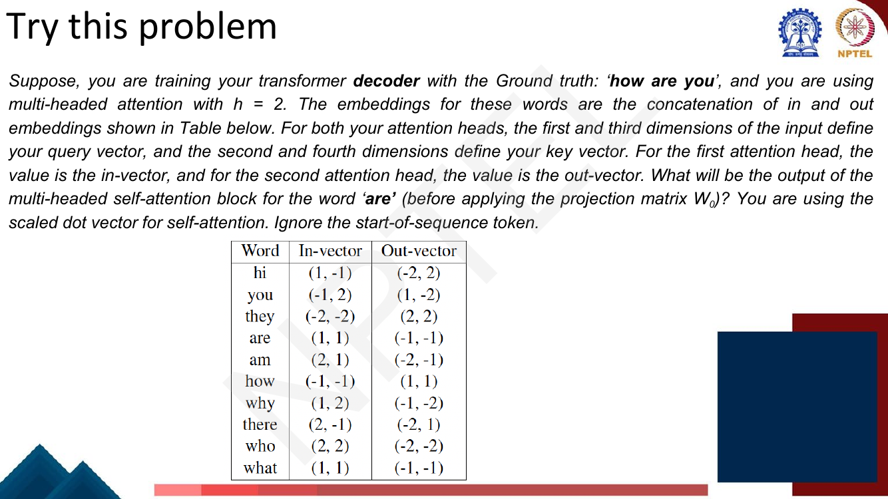
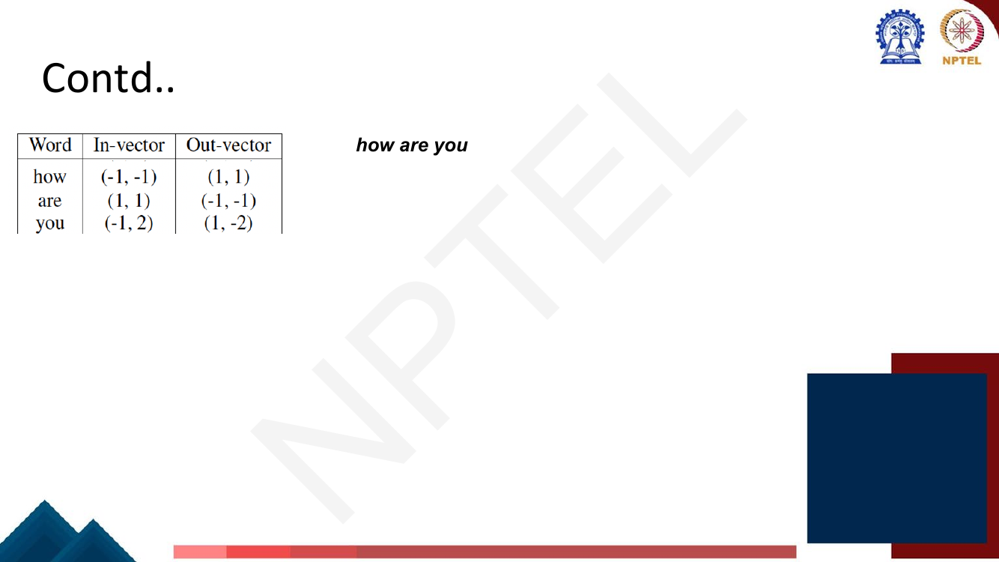

# Lec 24 — The Decoder and Transformers as Language Models

> **Source:** `Week5.pdf` pp. 84–102 · **Week 5** · **Playlist:** Lec 24
> **Prereqs:** [Lec 22 — Self-Attention and Multi-Head Attention](22-self-attention-and-multihead.md), [Lec 23 — Positional Encoding and the Encoder](23-positional-encoding-and-encoder.md)
> **Feeds into:** [Lec 25 — Efficient Transformers](25-efficient-transformers.md), [Lec 29 — GPT and Decoder Pretraining](../week-06/29-gpt-decoder-pretraining.md)

## Why this lecture exists

Lectures 22 and 23 built half a machine. You have a mechanism (scaled dot-product attention,
multi-head) and a stack that consumes a sentence and emits one contextual vector per token. That stack
*reads*. It cannot *write*, and nothing so far has stopped any position from looking at any other.

For generation that permissiveness is fatal. A model trained to predict the next word while being
allowed to see the next word learns nothing — it copies. So the decoder needs a second mechanism: a
way to forbid looking forward. And a translation decoder needs a third: a way to consult the source
sentence the encoder just read. This lecture adds exactly those two things, bolts a vocabulary-sized
softmax on top, and then does the move that defines the last decade of NLP — throws the encoder away
and keeps the decoder as a standalone language model.

## The ideas

### The whole machine, assembled


*Fig. — The complete encoder–decoder Transformer. Follow the dotted line from the top of the encoder stack: it enters **every** decoder block, not just the bottom one. Page 86.*

Read the diagram left to right. The encoder stack ([Lec 23](23-positional-encoding-and-encoder.md))
turns the source sentence into a set of contextual vectors, once. The decoder stack turns the
target-so-far into a prediction for the next token, repeatedly. The two are joined at exactly one
place — the encoder-decoder attention sublayer inside every decoder block.

Everything else is reused wholesale from Lec 22: scaled dot-product attention with the $\sqrt{d_k}$
denominator, multi-head projections, the position-wise feed-forward network, residual connections and
layer normalisation. Those are named components here and nothing more.

### How is the decoder different?


*Fig. — The deck's own answer to the question. **Three** sublayers, not two, and the extra one sits in the middle. The arrow entering it from the encoder is the only information path between the two stacks. Page 87.*

Two differences, and the exam will ask for both:

1. **Three sublayers instead of two.** The decoder inserts an **encoder-decoder attention** sublayer
   between its self-attention and its feed-forward network.
2. **The self-attention is masked.** Position $t$ may attend to positions $1 \ldots t$ and no further.

| | Encoder block | Decoder block |
|---|---|---|
| Sublayers | 2 | 3 |
| First sublayer | self-attention, **unmasked** | self-attention, **masked (causal)** |
| Second sublayer | feed-forward | **encoder-decoder (cross) attention** |
| Third sublayer | — | feed-forward |
| $\mathbf{Q}$ from | the same stack | self-attn: decoder · cross-attn: **decoder** |
| $\mathbf{K},\mathbf{V}$ from | the same stack | self-attn: decoder · cross-attn: **encoder output** |
| Each position sees | the whole sequence, both directions | only itself and the past (plus all of the source) |
| Residual + LayerNorm | after each of 2 | after each of 3 |

The decoder also needs **positional encoding** added to its input embeddings, exactly as the encoder
does — [Lec 23](23-positional-encoding-and-encoder.md) owns the scheme.

### Masked self-attention


*Fig. — The mask $\mathbf{M}$ is **added to the scores**, inside the softmax, before the division is normalised. The caption "in general, upper triangle set to -inf" is the whole rule. Page 88.*

The reason is the **autoregressive property**. A language model factorises

$$P(w_1 \ldots w_T) = \prod_{t=1}^{T} P(w_t \mid w_1 \ldots w_{t-1})$$

and the training objective at position $t$ is to predict $w_t$ from the prefix. During training you
feed the whole target sentence at once so that all $T$ positions are computed in parallel (that
parallelism is the entire reason Transformers beat RNNs). But then position $t$'s representation would
be built from $w_{t+1}$, $w_{t+2}$, … as well — and predicting $w_t$ when $w_t$ is literally one of
your inputs is free. The deck's word for this is **cheating**. The model would score perfectly during
training and produce nonsense at test time, where the future does not exist.

So you forbid it. Take the score matrix $\mathbf{S} = \mathbf{Q}\mathbf{K}^\top/\sqrt{d_k}$, which is
$T \times T$ with $S_{ij}$ the affinity of query $i$ for key $j$, and add a mask

$$M_{ij} = \begin{cases} 0 & j \le i \\ -\infty & j > i \end{cases}
\qquad
\mathbf{Z} = \mathrm{softmax}\!\left(\frac{\mathbf{Q}\mathbf{K}^\top}{\sqrt{d_k}} + \mathbf{M}\right)\mathbf{V}$$


*Fig. — The masked score matrix. Row $i$ keeps $i$ real entries and fills the rest with $-\infty$. Row 1 has exactly one real entry, so the first token always attends to itself with weight 1. Page 89.*

**Why $-\infty$ and not $0$.** This is the single most-missed detail on the topic, and it turns on
*when* the masking happens.

- The mask is applied **before** the softmax, to the *scores*. Softmax exponentiates:
  $e^{-\infty} = 0$, so a masked position gets exactly zero weight, and — crucially — it contributes
  exactly zero to the normalising denominator $\sum_j e^{S_{ij}}$. The surviving weights renormalise
  among themselves and still sum to 1.
- Setting the *score* to 0 would not mask anything. $e^0 = 1$, which is a perfectly ordinary,
  middling attention score. You would be telling the model "attend to the future with average
  enthusiasm".
- Zeroing the *weights* after the softmax would mask the information but **break normalisation**: the
  surviving row would sum to less than 1, so the output would be an arbitrarily shrunken convex
  combination rather than a weighted average. Later positions, with more masked entries, would be
  scaled differently from earlier ones. Pre-softmax $-\infty$ gets both properties at once.

In code $-\infty$ is usually a large negative constant such as $-10^9$; the softmax underflows it to
zero and you avoid `inf - inf = nan` in the max-subtraction trick.

Note what masking does *not* change: the parameter count, the shapes, or the attention formula. The
masked sublayer and an encoder's self-attention sublayer are the same layer with different
bookkeeping. **Masking is a property of the attention pattern, not of the weights.**

### Encoder-decoder (cross) attention


*Fig. — Look at what is labelled: $\mathbf{K}_{\text{encdec}}$ and $\mathbf{V}_{\text{encdec}}$. There is no $\mathbf{Q}_{\text{encdec}}$, because the queries are not the encoder's to give. Page 90.*

Here is the fact to carve into memory, because it is the single most examinable sentence in this
chapter:

> **In encoder-decoder attention, the queries come from the decoder; the keys and values come from the
> encoder output.**

Mechanically: let $\mathbf{H}^{\text{enc}} \in \mathbb{R}^{m \times d_{\text{model}}}$ be the top
encoder layer's output over $m$ source tokens, and $\mathbf{H}^{\text{dec}} \in \mathbb{R}^{n \times
d_{\text{model}}}$ the output of the decoder's masked self-attention sublayer over $n$ target
positions. Then

$$\mathbf{Q} = \mathbf{H}^{\text{dec}}\mathbf{W}^Q, \qquad
\mathbf{K} = \mathbf{H}^{\text{enc}}\mathbf{W}^K, \qquad
\mathbf{V} = \mathbf{H}^{\text{enc}}\mathbf{W}^V$$

and the rest is ordinary scaled dot-product attention. The three projection matrices still live in the
decoder block — they are decoder parameters — but two of them are applied to encoder vectors.

Three consequences worth stating, because each one is a question:

- **The attention matrix is rectangular: $n \times m$.** Self-attention matrices are square because
  queries and keys come from the same sequence. Cross-attention matrices are not, and they need not
  be: the French source can be 7 tokens while the English target is 9. The shape asymmetry *is* the
  concept.
- **No mask.** The decoder may look at the *entire* source at every step. There is nothing to cheat
  at — the source is given, not predicted. Only self-attention is causal.
- **$\mathbf{K}$ and $\mathbf{V}$ are computed once per sentence.** The encoder runs a single forward
  pass; its output is reused unchanged at every one of the decoder's generation steps. The slide's
  phrase "transformed into a set of attention vectors K and V" is precisely this caching.

This sublayer is the direct descendant of the RNN attention of
[Lec 18](../week-04/18-seq2seq-and-attention.md) — decoder state queries encoder states — and it is
what lets a translation decoder look back at the right source word while emitting each target word.

### Decoding: the generation loop


*Fig. — At time step 3 the decoder input is the previously generated tokens (`<s> I am`), re-embedded with positional encoding. The encoder half is frozen; only the decoder half re-runs. Page 91.*

The loop, exactly as the deck gives it:

1. Run the encoder **once** over the source. Keep $\mathbf{K}_{\text{encdec}}$,
   $\mathbf{V}_{\text{encdec}}$.
2. Start the decoder with the start-of-sequence token.
3. Embed the decoder inputs and **add positional encoding** — the deck says this explicitly, because
   it is easy to assume positional encoding is an encoder-only trick.
4. Run the decoder stack. Each block: masked self-attention over the tokens so far, cross-attention
   into the encoder output, feed-forward.
5. Project the top decoder output to vocabulary logits, softmax, choose a token.
6. Append the chosen token to the decoder input and go to step 3. Stop at `</s>`.

Step 5's *choose* is doing a lot of work and it is not this lecture's: greedy, beam search,
temperature, top-$k$ and nucleus sampling all belong to
[Lec 19](../week-04/19-decoding-strategies.md). This chapter owns the loop; Lec 19 owns the choice.

The asymmetry between training and inference is worth pausing on. In **training** you already know
the whole target, so you feed it in one shot and the mask makes all $T$ predictions valid
simultaneously — one forward pass. In **inference** you do not, so you need $T$ sequential passes.
Masking is what makes the first possible; it is also what makes the gap between the two so large.

Naively, step $t$ recomputes the keys and values for all $t-1$ earlier positions, even though they
have not changed since the previous step. Caching them is the **KV cache** —
[Lec 25](25-efficient-transformers.md) owns it, and N5 below counts exactly how much it saves.

### Converting decoder stack output to words: the language modelling head


*Fig. — The top of the stack is a $d_{\text{model}}$-vector; the bottom of this picture is a $\lvert V\rvert$-vector. Linear then softmax then argmax. Page 92.*

The decoder stack emits one vector $\mathbf{h}^L_t \in \mathbb{R}^{d_{\text{model}}}$ per position.
To turn it into a distribution over words you need two steps and nothing more:

$$\mathbf{u} = \mathbf{h}^L_t \mathbf{E}^\top \in \mathbb{R}^{1 \times |V|}, \qquad
\mathbf{y} = \mathrm{softmax}(\mathbf{u})$$


*Fig. — The deck's two equations. $\mathbf{u}$ are the **logits** (unnormalised, any sign, shape $1 \times \lvert V\rvert$); $\mathbf{y}$ are probabilities. Page 97.*

The deck calls this linear layer the **unembedding layer**, and the name is the point. The embedding
matrix $\mathbf{E}$ is $\lvert V\rvert \times d$ and maps a word id to a vector; the unembedding layer
is $d \times \lvert V\rvert$ and maps a vector back to word scores. Writing it as $\mathbf{E}^\top$
rather than as a fresh matrix $\mathbf{U}$ is **weight tying**.


*Fig. — Weight tying: one matrix serving as both the input embedding and the output projection. It saves $\lvert V\rvert \times d$ parameters and regularises — a word's input and output representations are forced to agree. Page 96.*

Weight tying is optional; implementations that do not tie learn a separate $\mathbf{U}$, which for
$\lvert V\rvert = 50{,}000$ and $d = 512$ is 25.6M extra parameters. The deck's $\mathbf{E}^\top$
notation assumes tying, so follow it unless told otherwise.

### Transformers as language models


*Fig. — The decoder-only configuration. The two bullets on the right are the whole specification: **keep the mask, drop the cross-attention**. Page 95.*

Now the move that matters. If the task is "continue this text", there is no source sentence, so there
is nothing for cross-attention to attend to. Delete it. What remains is:

- input embedding + positional encoding,
- $N$ blocks of **{masked self-attention → feed-forward}**, each with residual + layer norm,
- the language modelling head.

That is a **decoder-only Transformer**, and it is a language model in the exact sense of
[Lec 3](../week-01/03-ngram-lm-1.md) and [Lec 16](../week-04/16-rnn-language-models.md): position $t$
outputs $P(w_{t+1} \mid w_1 \ldots w_t)$, trained with cross-entropy against the actual next token,
evaluated by perplexity ([Lec 4](../week-01/04-ngram-lm-2-smoothing-perplexity.md)). Every position
produces a prediction, so one forward pass over a $T$-token sequence yields $T$ training signals —
which is why this architecture is so cheap to pretrain on raw text, and why
[Lec 29](../week-06/29-gpt-decoder-pretraining.md) can scale it to GPT.

Three things are easy to confuse here, so pin them down:

- A **decoder-only block has two sublayers, not three.** It differs from an *encoder* block only in
  the mask. Identical parameter count, identical shapes.
- The name "decoder" is historical. It is called a decoder because it has causal masking, not because
  anything is being decoded from an encoder.
- The counterpart choice — keep the bidirectional (unmasked) encoder and drop the decoder — gives
  **BERT**, which cannot generate left-to-right for exactly this reason. That is
  [Lec 27](../week-06/27-bert-masked-lm.md)'s.

Page 98 redraws the same head twice with an arrow labelled "sample token to generate at position
$i+1$" feeding into the next copy — the generation loop of the previous section, minus the encoder.

### Counting the parameters

The deck poses both questions (pages 99 and 100) on otherwise **blank slides** — the lecturer worked
them live. Here is the full derivation. Fix the base Transformer:
$d_{\text{model}} = d = 512$, $h = 8$ heads, $d_k = d_v = d/h = 64$, $d_{ff} = 2048$, $N = 6$.

**An attention sublayer** (self or cross, masked or not — the mask is free):

| Matrix | Shape | Count |
|---|---|---|
| $\mathbf{W}^Q$ — all $h$ heads concatenated | $d \times (h \cdot d_k) = d \times d$ | $d^2$ |
| $\mathbf{W}^K$ | $d \times d$ | $d^2$ |
| $\mathbf{W}^V$ | $d \times d$ | $d^2$ |
| $\mathbf{W}^O$ output projection | $d \times d$ | $d^2$ |
| **total** | | $\mathbf{4d^2}$ |

Multi-head costs the same as single-head because $h \cdot d_k = d$ — the heads partition $d$, they do
not multiply it. With biases, add $4d$.

**A feed-forward sublayer:** $\mathbf{W}_1 \in \mathbb{R}^{d \times d_{ff}}$,
$\mathbf{W}_2 \in \mathbb{R}^{d_{ff} \times d}$, biases $d_{ff} + d$ — so $2d\,d_{ff} + d_{ff} + d$.
With the standard $d_{ff} = 4d$ this is $8d^2$ plus change.

**A layer norm:** $2d$ (one $\gamma$ and one $\beta$ per feature).

Putting it together, ignoring biases and layer norms for the clean version:

$$\text{encoder block} = 4d^2 + 8d^2 = \mathbf{12d^2}, \qquad
\text{decoder block} = 4d^2 + 4d^2 + 8d^2 = \mathbf{16d^2}$$

**A decoder block costs $4/3$ of an encoder block**, and the extra third is exactly the
cross-attention sublayer. A decoder-*only* block drops back to $12d^2$ — the same as an encoder
block. N4 below carries this through to exact totals with the biases included.

## Worked numericals

### N1. The deck's "Try this problem" — masked multi-head self-attention for 'are' (pages 93–94)


*Fig. — Read the constraints carefully: $h=2$, query = dimensions 1 and 3, key = dimensions 2 and 4, head-1 value = in-vector, head-2 value = out-vector, scaled dot product, ignore `<s>`. Page 93.*


*Fig. — The three rows you actually need, lifted from the big table. The deck stops here — **no solution is given anywhere in the deck**, so the answer below is derived and verified in code. Page 94.*

**Given:** target `how are you`, decoder (so self-attention is **masked**), $h = 2$.
Embedding = in-vector concatenated with out-vector, so $d_{\text{model}} = 4$:

| Word | in | out | embedding $\mathbf{x}$ |
|---|---|---|---|
| how | $(-1,-1)$ | $(1,1)$ | $(-1,-1,1,1)$ |
| are | $(1,1)$ | $(-1,-1)$ | $(1,1,-1,-1)$ |
| you | $(-1,2)$ | $(1,-2)$ | $(-1,2,1,-2)$ |

**Find:** the output of the multi-head self-attention block at the word `are`, before $\mathbf{W}^O$.

1. **Extract queries and keys.** Dimensions 1 and 3 give $\mathbf{q}$; dimensions 2 and 4 give
   $\mathbf{k}$. Both heads use the same rule, so both heads share the same $\mathbf{q}$ and
   $\mathbf{k}$ — only the values differ.

   | Word | $\mathbf{q}$ | $\mathbf{k}$ |
   |---|---|---|
   | how | $(-1, 1)$ | $(-1, 1)$ |
   | are | $(1, -1)$ | $(1, -1)$ |
   | you | $(-1, 1)$ | $(2, -2)$ |

2. **Apply the causal mask.** `are` is position 2, so it attends to `how` and `are` only. `you` is in
   the future: its score is $-\infty$.
3. **Unscaled scores** with $\mathbf{q}_{\text{are}} = (1,-1)$:
   $\mathbf{q}\cdot\mathbf{k}_{\text{how}} = (1)(-1) + (-1)(1) = -2$;
   $\mathbf{q}\cdot\mathbf{k}_{\text{are}} = (1)(1) + (-1)(-1) = 2$.
4. **Scale by $\sqrt{d_k}$.** The query/key vectors are 2-dimensional, so $d_k = 2$ and
   $\sqrt{d_k} = 1.41421$. Scores become $-2/1.41421 = -1.41421$ and $2/1.41421 = 1.41421$.
5. **Softmax over $(-1.41421,\ 1.41421,\ -\infty)$.**
   $e^{-1.41421} = 0.24312$, $e^{1.41421} = 4.11325$, $e^{-\infty} = 0$.
   Sum $= 0.24312 + 4.11325 = 4.35637$.
   $\alpha_{\text{how}} = 0.24312/4.35637 = \mathbf{0.0558}$;
   $\alpha_{\text{are}} = 4.11325/4.35637 = \mathbf{0.9442}$; $\alpha_{\text{you}} = \mathbf{0}$.
   Check: $0.0558 + 0.9442 = 1$ ✓
6. **Head 1** uses the **in-vectors** as values: $\mathbf{v}_{\text{how}} = (-1,-1)$,
   $\mathbf{v}_{\text{are}} = (1,1)$.
   $0.0558(-1,-1) + 0.9442(1,1) = (-0.0558 + 0.9442,\ -0.0558 + 0.9442) = (0.8884,\ 0.8884)$.
7. **Head 2** uses the **out-vectors**: $\mathbf{v}_{\text{how}} = (1,1)$,
   $\mathbf{v}_{\text{are}} = (-1,-1)$.
   $0.0558(1,1) + 0.9442(-1,-1) = (-0.8884,\ -0.8884)$.
8. **Concatenate the heads** (the question says *before* $\mathbf{W}^O$, so stop here).

**Answer:** $(0.8884,\ 0.8884,\ -0.8884,\ -0.8884)$.

Two things to notice. Head 2 is the exact negative of head 1, because for these two words the
out-vectors are the negated in-vectors — a coincidence of the deck's table, not a general property.
And **the masking changes the answer completely**: if you forget it and let `are` attend to `you`,
$\mathbf{q}_{\text{are}}\cdot\mathbf{k}_{\text{you}} = 2 + 2 = 4$ is the *largest* score,
$\alpha_{\text{you}} = 0.795$ dominates, and head 1 becomes $(-0.6133,\ 1.7724)$. That is the trap the
question is built around.

### N2. Applying a causal mask to a $4\times4$ score matrix by hand
**Given:** already-scaled scores $\mathbf{S} = \begin{pmatrix} 2&1&0&3\\ 1&3&2&0\\ 0&2&2&1\\ 1&1&2&2\end{pmatrix}$ for a 4-token decoder sequence.
**Find:** the masked attention weight matrix, and verify every row sums to 1.

1. **Mask the strictly upper triangle** ($j > i$) to $-\infty$:
   $\begin{pmatrix} 2&-\infty&-\infty&-\infty\\ 1&3&-\infty&-\infty\\ 0&2&2&-\infty\\ 1&1&2&2\end{pmatrix}$
2. **Row 1:** one real entry. $e^2/e^2 = 1$. Weights $[1, 0, 0, 0]$.
3. **Row 2:** $e^1 = 2.71828$, $e^3 = 20.08554$; sum $= 22.80381$.
   $[2.71828/22.80381,\ 20.08554/22.80381, 0, 0] = [0.1192,\ 0.8808,\ 0,\ 0]$.
4. **Row 3:** $e^0 = 1$, $e^2 = 7.38906$, $e^2 = 7.38906$; sum $= 15.77811$.
   $[0.0634,\ 0.4683,\ 0.4683,\ 0]$.
5. **Row 4:** $e^1 = 2.71828$ twice, $e^2 = 7.38906$ twice; sum $= 20.21469$.
   $[0.1345,\ 0.1345,\ 0.3655,\ 0.3655]$.
6. **Row sums:** $1$; $0.1192+0.8808 = 1$; $0.0634+0.4683+0.4683 = 1$;
   $2(0.1345)+2(0.3655) = 0.2690 + 0.7310 = 1$ ✓

**Answer:** lower-triangular $\begin{pmatrix} 1&0&0&0\\ 0.1192&0.8808&0&0\\ 0.0634&0.4683&0.4683&0\\ 0.1345&0.1345&0.3655&0.3655\end{pmatrix}$,
every row a valid distribution. Note that $S_{14} = 3$ was the *largest* score in the matrix and it
contributed nothing — the mask is applied regardless of score magnitude.

### N3. A cross-attention computation — 2 decoder queries against 4 encoder keys/values
**Given:** decoder queries $\mathbf{Q} = \begin{pmatrix}1&0\\0&2\end{pmatrix}$ (2 target positions);
encoder keys $\mathbf{K} = \begin{pmatrix}1&0\\0&1\\1&1\\-1&0\end{pmatrix}$ and values
$\mathbf{V} = \begin{pmatrix}1&0\\0&1\\1&1\\2&-2\end{pmatrix}$ (4 source tokens). $d_k = 2$.
**Find:** the attention matrix and the two output vectors. **No mask** — cross-attention is never masked.

1. **Shapes first, because they are the lesson.** $\mathbf{Q}$ is $2\times2$ ($n \times d_k$),
   $\mathbf{K}$ and $\mathbf{V}$ are $4\times2$ ($m \times d_k$). So
   $\mathbf{Q}\mathbf{K}^\top$ is $\mathbf{2 \times 4}$ — **rectangular**, $n$ target rows by $m$
   source columns — and the output is $2\times2$, one vector per *target* position.
2. **Raw scores.** Row 1 ($\mathbf{q}_1 = (1,0)$): $[1,\ 0,\ 1,\ -1]$.
   Row 2 ($\mathbf{q}_2 = (0,2)$): $[0,\ 2,\ 2,\ 0]$.
3. **Scale by $\sqrt{2} = 1.41421$.** Row 1: $[0.70711,\ 0,\ 0.70711,\ -0.70711]$.
   Row 2: $[0,\ 1.41421,\ 1.41421,\ 0]$.
4. **Softmax row 1.** $e^{0.70711} = 2.02812$, $e^0 = 1$, $2.02812$, $e^{-0.70711} = 0.49307$;
   sum $= 5.54931$. $\boldsymbol{\alpha}_1 = [0.3655,\ 0.1802,\ 0.3655,\ 0.0889]$, sum $1$ ✓
5. **Softmax row 2.** $1,\ 4.11325,\ 4.11325,\ 1$; sum $= 10.22650$.
   $\boldsymbol{\alpha}_2 = [0.0978,\ 0.4022,\ 0.4022,\ 0.0978]$, sum $1$ ✓
6. **Output 1** $= 0.3655(1,0) + 0.1802(0,1) + 0.3655(1,1) + 0.0889(2,-2)$.
   $x: 0.3655 + 0 + 0.3655 + 0.1777 = 0.9086$.
   $y: 0 + 0.1802 + 0.3655 - 0.1777 = 0.3680$.
7. **Output 2** $= 0.0978(1,0) + 0.4022(0,1) + 0.4022(1,1) + 0.0978(2,-2)$.
   $x: 0.0978 + 0.4022 + 0.1956 = 0.6956$.
   $y: 0.4022 + 0.4022 - 0.1956 = 0.6089$.

**Answer:** $\mathbf{A} = \begin{pmatrix}0.3655&0.1802&0.3655&0.0889\\ 0.0978&0.4022&0.4022&0.0978\end{pmatrix}$ (shape $2\times4$),
outputs $(0.9086,\ 0.3680)$ and $(0.6956,\ 0.6089)$. Target position 1 spreads itself over source
tokens 1 and 3; target position 2 concentrates on source tokens 2 and 3. **That is an alignment, and
it is readable precisely because the matrix is $n \times m$.**

### N4. Full parameter count — encoder-decoder, then decoder-only
**Given:** $d_{\text{model}} = 512$, $h = 8$, $d_{ff} = 2048$, $N = 6$ encoder + 6 decoder blocks,
tied embeddings, shared source/target vocabulary $|V| = 37{,}000$. Count biases and layer norms.
**Find:** the total, and what the cross-attention sublayers cost.

1. **Attention sublayer:** $4d^2 + 4d = 4(262{,}144) + 2{,}048 = 1{,}048{,}576 + 2{,}048 = \mathbf{1{,}050{,}624}$.
2. **FFN sublayer:** $2 \cdot 512 \cdot 2048 + 2048 + 512 = 2{,}097{,}152 + 2{,}560 = \mathbf{2{,}099{,}712}$.
3. **Layer norm:** $2d = \mathbf{1{,}024}$ each.
4. **Encoder block** (2 sublayers, 2 LNs): $1{,}050{,}624 + 2{,}099{,}712 + 2(1{,}024) = \mathbf{3{,}152{,}384}$.
5. **Decoder block** (3 sublayers, 3 LNs): $2(1{,}050{,}624) + 2{,}099{,}712 + 3(1{,}024)
   = 2{,}101{,}248 + 2{,}099{,}712 + 3{,}072 = \mathbf{4{,}204{,}032}$.
   Ratio to the encoder block: $4{,}204{,}032 / 3{,}152{,}384 = 1.333 = 4/3$ ✓ (the $12d^2 \to 16d^2$ rule).
6. **Six of each:** $6(3{,}152{,}384) = 18{,}914{,}304$ and $6(4{,}204{,}032) = 25{,}224{,}192$.
   Blocks total $= \mathbf{44{,}138{,}496}$.
7. **Embeddings:** $|V| \times d = 37{,}000 \times 512 = \mathbf{18{,}944{,}000}$, shared between
   source, target and (by tying) the output projection — so counted **once**.
   Sinusoidal positional encodings are a fixed formula: **0 parameters**
   ([Lec 23](23-positional-encoding-and-encoder.md)).
8. **Total:** $44{,}138{,}496 + 18{,}944{,}000 = \mathbf{63{,}082{,}496 \approx 63\text{M}}$.
   Vaswani et al. report **65M** for the base model; the ~2M gap is exactly the kind of difference
   that bias and vocabulary conventions produce, so quote the formula, not a remembered total.
9. **Cost of cross-attention:** one attention sublayer per decoder block,
   $6 \times 1{,}050{,}624 = \mathbf{6{,}303{,}744}$ — **14.3%** of all block parameters, 10% of the model.
10. **Decoder-only variant.** Delete the encoder stack *and* the cross-attention sublayer. A
    decoder-only block is $1{,}050{,}624 + 2{,}099{,}712 + 2(1{,}024) = 3{,}152{,}384$ — **identical
    to an encoder block**. Twelve such blocks plus a $50{,}257 \times 512$ embedding gives
    $12(3{,}152{,}384) + 25{,}731{,}584 = 37{,}828{,}608 + 25{,}731{,}584 = \mathbf{63{,}560{,}192}$.

**Answer:** enc-dec $\approx$ 63.1M (blocks 44.1M + embeddings 18.9M), of which cross-attention is
6.30M; a 12-layer decoder-only model at the same width is 63.6M. **Sanity check the formula on a
model you know:** GPT-2 small is $d = 768$, 12 layers, $d_{ff} = 3072$, $|V| = 50{,}257$, 1024
*learned* positions. $12 \times 12d^2 = 84{,}934{,}656$ for the blocks,
$50{,}257 \times 768 = 38{,}597{,}376$ for tokens, $1024 \times 768 = 786{,}432$ for positions
$\Rightarrow$ 124.3M — the published 124M.

### N5. Forward passes to generate 20 tokens
**Given:** a 10-token source, generating a 20-token target autoregressively.
**Find:** encoder passes, decoder passes, and the recomputation the KV cache removes.

1. **Encoder: 1 forward pass.** All 10 source tokens are processed in parallel, and
   $\mathbf{K}_{\text{encdec}}, \mathbf{V}_{\text{encdec}}$ are reused unchanged for every output step.
2. **Decoder at inference: 20 forward passes**, strictly sequential — step $t$ needs the token chosen
   at step $t-1$.
3. **Decoder at training: 1 forward pass.** Teacher forcing feeds the whole gold target at once and
   the causal mask makes all 20 predictions simultaneously valid. **Training is 20× cheaper per
   sentence than inference**, which is the central practical fact about autoregressive models.
4. **Recomputation without a cache.** Step $t$ re-embeds and re-processes all $t$ positions, so total
   token-positions processed $= \sum_{t=1}^{20} t = \frac{20 \cdot 21}{2} = \mathbf{210}$ instead of 20.
5. **Attention score entries.** Step $t$ computes a $t \times t$ self-attention matrix, so
   $\sum_{t=1}^{20} t^2 = \frac{20 \cdot 21 \cdot 41}{6} = \mathbf{2870}$. With a KV cache, step $t$
   computes one query against $t$ cached keys: $\sum_{t=1}^{20} t = \mathbf{210}$.

**Answer:** 1 encoder pass, 20 decoder passes, $2870 \to 210$ score computations with caching — a
**13.7×** reduction, and it grows linearly with sequence length. This is the motivation for
[Lec 25](25-efficient-transformers.md).

## Code

```python
import numpy as np
np.set_printoptions(precision=4, suppress=True)

def softmax(x, axis=-1):
    x = x - x.max(axis=axis, keepdims=True)
    e = np.exp(x)
    return e / e.sum(axis=axis, keepdims=True)

# ---------- 1. causal masking of a 4x4 score matrix (N2) ------------------
S = np.array([[2., 1., 0., 3.],
              [1., 3., 2., 0.],
              [0., 2., 2., 1.],
              [1., 1., 2., 2.]])
T = S.shape[0]
mask = np.triu(np.ones((T, T), dtype=bool), k=1)   # strictly-upper = the future
S_masked = S.copy()
S_masked[mask] = -np.inf                           # -inf BEFORE the softmax
A = softmax(S_masked)
print("attention weights:\n", A)
print("row sums:", A.sum(axis=1))
print("future weights exactly zero:", np.all(A[mask] == 0.0))

# ---------- 2. cross-attention: 2 decoder queries vs 4 encoder keys (N3) ---
Q = np.array([[1., 0.], [0., 2.]])                        # FROM THE DECODER (2 x 2)
K = np.array([[1., 0.], [0., 1.], [1., 1.], [-1., 0.]])   # FROM THE ENCODER (4 x 2)
V = np.array([[1., 0.], [0., 1.], [1., 1.], [2., -2.]])   # FROM THE ENCODER (4 x 2)
scores = Q @ K.T / np.sqrt(Q.shape[1])                    # (2 x 4) <- the asymmetry
Acd = softmax(scores)
out = Acd @ V                                             # (2 x 2)
print("\nshapes  Q", Q.shape, " K", K.shape, " A", Acd.shape, " out", out.shape)
print("cross-attention weights:\n", Acd, "\ndecoder outputs:\n", out)

# ---------- 3. the deck's 'how are you' problem, page 93 (N1) -------------
inv  = {'how': (-1., -1.), 'are': ( 1.,  1.), 'you': (-1.,  2.)}
outv = {'how': ( 1.,  1.), 'are': (-1., -1.), 'you': ( 1., -2.)}
words = ['how', 'are', 'you']
X = np.array([list(inv[w]) + list(outv[w]) for w in words])   # 3 x 4 embeddings
q, k = X[:, [0, 2]], X[:, [1, 3]]                 # dims 1,3 -> query; 2,4 -> key
sc = q @ k.T / np.sqrt(2)
sc[np.triu(np.ones((3, 3), dtype=bool), k=1)] = -np.inf      # decoder -> mask
alpha = softmax(sc)
head1 = alpha @ np.array([inv[w] for w in words])    # head 1 value = in-vector
head2 = alpha @ np.array([outv[w] for w in words])   # head 2 value = out-vector
print("\nweights for 'are':", alpha[1])
print("output for 'are':", np.concatenate([head1[1], head2[1]]))

# ---------- 4. parameter counts (N4) --------------------------------------
d, dff, N, Vsz = 512, 2048, 6, 37000
attn = 4 * d * d + 4 * d
ffn  = 2 * d * dff + dff + d
ln   = 2 * d
enc_blk, dec_blk = attn + ffn + 2 * ln, 2 * attn + ffn + 3 * ln
print(f"\nencoder block {enc_blk:,}   decoder block {dec_blk:,}"
      f"   ratio {dec_blk/enc_blk:.3f}")
print(f"blocks {N*(enc_blk+dec_blk):,} + embedding {Vsz*d:,}"
      f" = {N*(enc_blk+dec_blk) + Vsz*d:,}")
print(f"cross-attention alone: {N*attn:,}"
      f" ({100*N*attn/(N*(enc_blk+dec_blk)):.1f}% of the blocks)")
```

```
attention weights:
 [[1.     0.     0.     0.    ]
 [0.1192 0.8808 0.     0.    ]
 [0.0634 0.4683 0.4683 0.    ]
 [0.1345 0.1345 0.3655 0.3655]]
row sums: [1. 1. 1. 1.]
future weights exactly zero: True

shapes  Q (2, 2)  K (4, 2)  A (2, 4)  out (2, 2)
cross-attention weights:
 [[0.3655 0.1802 0.3655 0.0889]
 [0.0978 0.4022 0.4022 0.0978]]
decoder outputs:
 [[0.9086 0.368 ]
 [0.6956 0.6089]]

weights for 'are': [0.0558 0.9442 0.    ]
output for 'are': [ 0.8884  0.8884 -0.8884 -0.8884]

encoder block 3,152,384   decoder block 4,204,032   ratio 1.333
blocks 44,138,496 + embedding 18,944,000 = 63,082,496
cross-attention alone: 6,303,744 (14.3% of the blocks)
```

Every number matches N1–N4 by hand. The line worth staring at is
`shapes Q (2, 2) K (4, 2) A (2, 4) out (2, 2)`: the attention matrix is rectangular and the output has
the *decoder's* length. Nothing in the code is cross-attention-specific — it is the same function as
self-attention, fed from two different places.

## Exam pack

### Must-memorise

| Item | Exactly this |
|---|---|
| Decoder block sublayers | **3**: masked self-attention → encoder-decoder attention → feed-forward (each + residual + LayerNorm) |
| Encoder block sublayers | **2**: self-attention → feed-forward |
| Masked self-attention | $\mathbf{Z} = \mathrm{softmax}\!\left(\frac{\mathbf{Q}\mathbf{K}^\top}{\sqrt{d_k}} + \mathbf{M}\right)\mathbf{V}$, $M_{ij} = -\infty$ for $j>i$, else $0$ |
| Which triangle is masked | **strictly upper** ($j > i$); the diagonal stays — a token attends to itself |
| Why $-\infty$ | masking is **pre-softmax**, and $e^{-\infty}=0$; it also removes the term from the denominator so the row still sums to 1 |
| Why masking is needed | the autoregressive property — position $t$ must not see $t{+}1$, or training is cheating |
| Cross-attention $\mathbf{Q}$ | from the **decoder** |
| Cross-attention $\mathbf{K},\mathbf{V}$ | from the **encoder output** (top encoder layer) |
| Cross-attention matrix shape | $n \times m$ (target length × source length) — **rectangular, unmasked** |
| LM head | $\mathbf{u} = \mathbf{h}^L_N\mathbf{E}^\top$ (logits, $1\times\mid V\mid $); $\mathbf{y} = \mathrm{softmax}(\mathbf{u})$ |
| Unembedding layer shape | $d \times \lvert V\rvert$ |
| Weight tying | the same matrix is used as input embedding $\mathbf{E}$ and output projection $\mathbf{E}^\top$ |
| Decoder-only LM | **keep** masked self-attention, **drop** encoder-decoder attention → 2 sublayers |
| Attention sublayer params | $4d^2$ ($\mathbf{W}^Q,\mathbf{W}^K,\mathbf{W}^V,\mathbf{W}^O$), independent of $h$ |
| FFN params | $2d\,d_{ff}$ ($= 8d^2$ when $d_{ff}=4d$) |
| Encoder / decoder block | $12d^2$ / $16d^2$ (bias-free); decoder-only block $12d^2$ |
| Encoder passes vs decoder passes | encoder **1** per sentence; decoder **1** at training, **$T$** at inference |

### Numbers worth knowing

| Quantity | Value |
|---|---|
| Base Transformer | $d_{\text{model}}=512$, $h=8$, $d_k=d_v=64$, $d_{ff}=2048$, $N=6+6$ |
| Attention sublayer params ($d{=}512$) | 1,048,576 ($+2{,}048$ biases) |
| FFN sublayer params | 2,099,712 |
| LayerNorm params | $2d = 1{,}024$ |
| Encoder block / decoder block | 3,152,384 / 4,204,032 — ratio exactly $4/3$ |
| 6+6 blocks | 44,138,496 |
| Paper's base-model total | **65M** (this derivation gives 63.1M with $\lvert V\rvert{=}37{,}000$ tied) |
| Cross-attention share | 6,303,744 = 14.3% of block parameters |
| GPT-2 small (decoder-only) | $d{=}768$, 12 layers, $d_{ff}{=}3072$, $\lvert V\rvert{=}50{,}257$ → 124M |
| N1 attention weights | $\alpha_{\text{how}} = 0.0558$, $\alpha_{\text{are}} = 0.9442$, $\alpha_{\text{you}} = 0$ |
| N1 answer | $(0.8884, 0.8884, -0.8884, -0.8884)$ |
| Generating 20 tokens, no cache | 210 token-positions, 2870 score entries (vs 210 cached) |

### Likely MCQ traps

- **"Cross-attention queries come from the encoder."** No — **queries from the decoder, keys and
  values from the encoder**. Reversed in every second student answer. Mnemonic: the decoder is the one
  *asking*, so it holds the question (query); the encoder is being *consulted*, so it holds the
  content (key/value).
- **"The mask sets future scores to 0."** No — to $-\infty$. $e^0 = 1$ is an ordinary score and would
  mask nothing.
- **"You can mask after the softmax."** You can zero the weights, but the row no longer sums to 1,
  so the output stops being a weighted average and later positions get scaled differently from
  earlier ones.
- **"Cross-attention is masked too."** No. Only self-attention in the decoder is masked. The source
  sentence is fully available at every step.
- **"The lower triangle is masked."** The **strictly upper** triangle is masked. The diagonal survives
  — token $t$ attends to itself.
- **"A decoder-only block has three sublayers."** Two. Dropping the encoder drops cross-attention with it.
- **"BERT can generate text left-to-right."** It is encoder-only and unmasked; it has no
  autoregressive factorisation. See [Lec 27](../week-06/27-bert-masked-lm.md).
- **"Multi-head attention has $h$ times the parameters of single-head."** No — $h\,d_k = d$, so it is
  $4d^2$ either way.
- **"Positional encoding is only for the encoder."** The deck explicitly adds it to the decoder inputs
  too (page 91).
- **"The encoder runs once per generated token."** Once per *sentence*. Only the decoder re-runs.
- **"Masking changes the number of parameters."** It changes nothing but which entries are used.
- **Confusing logits with probabilities.** $\mathbf{u}$ is the logit vector (any sign); $\mathbf{y}$
  is after the softmax. Both are $1 \times \lvert V\rvert$.
- **"The LM head projects to $d_{\text{model}}$."** It projects *from* $d_{\text{model}}$ *to*
  $\lvert V\rvert$.

### Self-test

1. How many sublayers does a decoder block have, and what are they in order?
2. In encoder-decoder attention, where does each of $\mathbf{Q}$, $\mathbf{K}$, $\mathbf{V}$ come from?
3. Why is the mask value $-\infty$ rather than 0, and why must it be applied before the softmax?
4. A decoder self-attention score matrix is $6\times6$. How many entries are set to $-\infty$?
5. A source sentence has 7 tokens, the target so far has 4. What is the shape of the cross-attention weight matrix?
6. Write the two equations of the language modelling head.
7. What exactly do you remove from an encoder-decoder Transformer to get a decoder-only LM?
8. With $d_{\text{model}} = 512$ and $d_{ff} = 2048$, how many parameters are in one decoder block (ignore biases and layer norms)?
9. How many encoder forward passes and how many decoder forward passes are needed to translate one sentence into 15 tokens at inference?
10. What is weight tying, and how many parameters does it save for $\lvert V\rvert = 50{,}000$, $d = 768$?

<details><summary>Answers</summary>

1. Three: masked self-attention, encoder-decoder (cross) attention, feed-forward — each wrapped in a residual connection and layer normalisation.
2. $\mathbf{Q}$ from the decoder (the output of its masked self-attention sublayer); $\mathbf{K}$ and $\mathbf{V}$ from the top encoder layer's output.
3. $-\infty$ because the softmax exponentiates: $e^{-\infty} = 0$ gives exactly zero weight *and* removes the term from the normalising sum, so the remaining weights still sum to 1. $e^0 = 1$ is an ordinary score, so 0 masks nothing. Applied after the softmax it would break normalisation.
4. The strictly upper triangle of a $6\times6$: $6\cdot5/2 = 15$.
5. $4 \times 7$ — rows = target positions, columns = source tokens.
6. $\mathbf{u} = \mathbf{h}^L_N \mathbf{E}^\top$ and $\mathbf{y} = \mathrm{softmax}(\mathbf{u})$, both of shape $1 \times \lvert V\rvert$.
7. The entire encoder stack **and** the encoder-decoder attention sublayer from every decoder block. You keep the masked self-attention, the FFN, the positional encoding and the LM head.
8. $16d^2 = 16 \times 262{,}144 = 4{,}194{,}304$ (self-attn $4d^2$ + cross-attn $4d^2$ + FFN $8d^2$).
9. 1 encoder pass; 15 decoder passes.
10. Using the input embedding matrix $\mathbf{E}$ (transposed) as the output projection instead of a separate matrix. Saves $\lvert V\rvert \times d = 50{,}000 \times 768 = 38{,}400{,}000$ parameters.

</details>

## Beyond the slides

**Gap:** The deck never says *where* layer normalisation sits relative to the sublayer.
**Why it matters:** The original paper is **post-LN** — $\mathrm{LN}(x + \mathrm{Sublayer}(x))$, which
is what the "Add & Normalize" boxes on page 86 show. Essentially every model since GPT-2 is **pre-LN**
— $x + \mathrm{Sublayer}(\mathrm{LN}(x))$ — because post-LN needs a learning-rate warm-up to train at
depth at all, while pre-LN keeps a clean residual path and trains stably. The parameter count is
identical, so this is a pure-recall MCQ, and [Lec 52](../week-11/52-modern-llms-and-activations.md)'s
modern architectures all assume pre-LN.

**Gap:** Nothing is said about *why* decoder-only won, given that encoder-decoder is strictly more
expressive.
**Why it matters:** A decoder-only model needs no source/target distinction, so any text is training
data and every position yields a prediction; translation is handled by concatenating source and target
into one stream. Encoder-decoder survives where the input/output split is genuinely structural (T5,
BART — [Lec 28](../week-06/28-span-tasks-t5-bart.md)). Knowing the trade-off, not just the shapes,
is what the "why GPT?" question is really after.

**Gap:** The mask is presented only as "don't see the future", never as a cheap way to express
*arbitrary* attention patterns.
**Why it matters:** $\mathbf{M}$ is just an additive bias on the score matrix, so the same slot
carries padding masks (zero out `<pad>` tokens in a batch), prefix-LM masks (bidirectional over a
prompt, causal over the continuation), and the sparse/local patterns of
[Lec 25](25-efficient-transformers.md). Once you see the mask as a general additive bias, ALiBi's
position-dependent penalty ([Lec 53](../week-11/53-positional-embeddings-rope-alibi.md)) is obviously
the same mechanism.

**Gap:** The deck's generation loop silently recomputes everything at each step and never names the
fix.
**Why it matters:** Because masked self-attention means position $t$'s key and value never change
once computed, you can cache them. That single observation turns an $O(T^3)$ generation into
$O(T^2)$, and the memory it consumes is the reason MQA, GQA and paged attention exist —
[Lec 25](25-efficient-transformers.md).

## Cut from the slides

Page 84 is the title slide and page 85 the two-item outline ("Transformer Decoder, Transformer LM");
page 101 is the Jurafsky & Martin Chapter 9 reference and page 102 is blank. Pages 95 and 96 are the
same Jurafsky figure twice, with the second adding only the weight-tying annotation — merged into one
treatment with both pages shown, since the annotation is the examinable part. Page 98's figure is a
two-step repeat of page 95's head with a sampling arrow; described in one line rather than shown, to
stay inside the figure budget. **Pages 99 and 100 are blank apart from their titles** ("Number of parameters
in encoder-decoder?" and "Number of parameters in the decoder only Transformer?") — the lecturer
worked these live and nothing was recorded on the slides, so N4 derives both from scratch. Likewise,
**the "Try this problem" on page 93 has no solution anywhere in the deck**: page 94 only reprints the
three relevant table rows, so N1's answer is derived here and verified in code rather than checked
against the lecturer's. Nothing taught on these pages was dropped.
