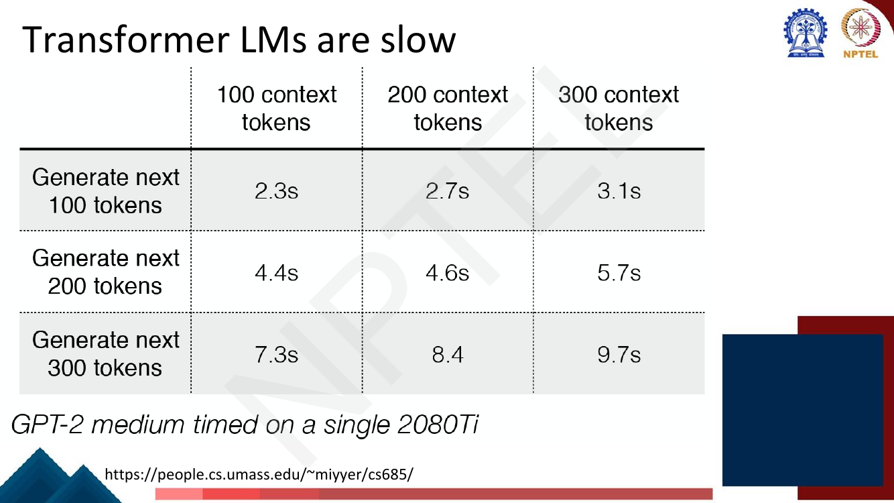

# Lec 25 — Efficient Transformers

> **Source:** `Week5.pdf` pp. 103–125 · **Week 5** · **Playlist:** Lec 25
> **Prereqs:** [Lec 24 — Decoder and Transformer LM](24-decoder-and-transformer-lm.md), [Lec 22 — Self-Attention and Multi-Head](22-self-attention-and-multihead.md)
> **Feeds into:** [Lec 52 — Modern LLMs and Activations](../week-11/52-modern-llms-and-activations.md), [Lec 54 — Long-Sequence Modeling](../week-11/54-long-sequence-modeling.md)

## Why this lecture exists

The previous four lectures built the Transformer and showed it works. This one is the bill.

Self-attention compares every token with every other token, so its cost grows with the *square* of the
sequence length. At 512 tokens that is affordable. At 32,768 it is 4,096 times worse, and the score
matrix alone no longer fits on a GPU. Separately, generation is slow for a different reason: a decoder
emits one token at a time, and a naive implementation redoes all the arithmetic for every previous
token at every step.

So there are two distinct problems — **the quadratic cost of attention in sequence length** and **the
wasted recomputation during autoregressive decoding** — and this lecture gives you the standard fixes
for both. Almost every architectural choice in a modern LLM is one of the answers on these slides.

## The ideas

### Problem 1: decoding recomputes what it already knows

During training, a whole sequence goes through the model at once and attention is one matrix product,

$$\mathbf{A} = \mathrm{softmax}\!\left(\frac{\mathbf{Q}\mathbf{K}^\top}{\sqrt{d_k}}\right)\mathbf{V}$$

(the formula is [Lec 22](22-self-attention-and-multihead.md)'s; it is reproduced here only because the
efficiency argument hangs off it). At inference you do not have the whole sequence — you are *making*
it, one token at a time. For each new token you must multiply by $\mathbf{W}^Q$, $\mathbf{W}^K$ and
$\mathbf{W}^V$ — but the deck's page 105 makes the key observation that those three projections are
**not symmetric in their reuse**. Only $\mathbf{Q}$ depends on the token you are currently producing;
the keys and values of every earlier token are identical to what they were last step.

That asymmetry is the whole idea. Token $i$'s key $\mathbf{k}_i = \mathbf{W}^K \mathbf{x}_i$ and value
$\mathbf{v}_i = \mathbf{W}^V \mathbf{x}_i$ depend only on $\mathbf{x}_i$ and the (frozen) weights. In a
causal decoder, $\mathbf{x}_i$ never changes once emitted — [Lec 24](24-decoder-and-transformer-lm.md)'s
masking guarantees that nothing to the right can influence it. So $\mathbf{k}_i$ and $\mathbf{v}_i$ are
computed once and are correct forever.

### The KV cache

**KV cache** — a buffer holding the key and value vectors of all tokens generated so far, per layer,
per head. At step $t$ you project only the new token, append its $\mathbf{k}_t, \mathbf{v}_t$ to the
buffer, and attend with a single query row against the stored $\mathbf{K}$ and $\mathbf{V}$.


*Fig. — The blacked-out blocks are what the cache supplies. Bottom row: the query shrinks from $n \times d_k$ to $1 \times d_k$ and the score matrix from $n \times n$ to $1 \times n$. **K** and **V** are still full height — they are read, not recomputed. Page 106.*

Count the work per step, for one layer with model dimension $d$:

| | K/V projections | attention scores |
|---|---|---|
| **No cache**, step $t$ | $2td^2$ MACs (redo all $t$ tokens) | $td$ |
| **With cache**, step $t$ | $2d^2$ MACs (the new token only) | $td$ |

The cache removes the factor of $t$ from the *projection* term, turning a per-step cost of $O(td^2)$
into $O(d^2 + td)$. Over an $n$-token generation the projection work falls from $O(n^2 d^2)$ to
$O(n d^2)$ — N2 below puts the ratio at exactly $(n+1)/2$, which is **50.5×** for $n = 100$.

Be precise about what is *not* saved: the query–key dot products are $O(t)$ at step $t$ no matter what,
so total attention work across a generation is $\Theta(n^2 d)$ either way. The cache kills redundant
projection, not the quadratic attention itself.

**The cost is memory.** The cache holds $2$ (K and V) $\times$ $L$ layers $\times$ $n$ positions
$\times$ $d$ dimensions $\times$ batch size, in whatever precision you store it:

$$\text{cache bytes} = 2 \cdot L \cdot B \cdot n \cdot h_{kv} \cdot d_{\text{head}} \cdot b$$

with $B$ the batch size, $h_{kv}$ the number of key/value heads, and $b$ bytes per element. It grows
**linearly in both sequence length and batch size**, and it is live for the entire generation. N2 shows
a 7B-class model spending **2 GiB** on the cache for a single 4,096-token sequence, and **32 GiB** at
batch 16 — more than the weights. Remember this number; it is the entire reason MQA and GQA exist.

### Problem 2: the quadratic cost of attention

The deck motivates this empirically before it does so theoretically:


*Fig. — Read it two ways. Across a row, longer context costs more for the same output (2.3s → 3.1s). Down a column, tripling the output more than triples the time: 2.3 → 4.4 → 7.3 s, i.e. $\times1.91$ then $\times3.17$ rather than $\times2$ and $\times3$. That superlinearity is the quadratic term showing through. Page 107.*

The source is the score matrix. $\mathbf{Q}\mathbf{K}^\top$ for a sequence of $n$ tokens is $n \times n$,
and you compute it with $n^2 d$ multiply–accumulates; multiplying the attention weights by $\mathbf{V}$
costs another $n^2 d$. So **self-attention is $O(n^2 d)$ in time and $O(n^2)$ in memory**. The deck's
page 108 pins that $O(n^2)$ label to the scaled-dot-product sub-block specifically, not to the layer as
a whole — the feed-forward network beside it is $O(n d^2)$, i.e. **linear** in $n$. Attention is the
only quadratic part of a Transformer, which is why it is the only part this lecture attacks.

One subtlety worth internalising: multi-head attention does **not** change the FLOP count, because the
$h$ heads each use $d_k = d/h$ and $h \cdot n^2 (d/h) = n^2 d$. It does multiply the *memory*, because
each head stores its own $n \times n$ score matrix. N1 tabulates both: at $n = 32{,}768$ with 12 heads
in fp32, one layer's scores need **48 GiB**.

Everything that follows attacks that $n^2$ by refusing to compute most of it.

### Local (windowed) attention

The cheapest fix: let each token attend only to its $w$ nearest neighbours.


*Fig. — The shaded band is all you compute; everything white is skipped, not masked-then-discarded. The band hugs the diagonal, so its area is $n \cdot w$, not $n^2$. Page 109.*

Cost drops to $O(n \cdot w \cdot d)$ — **linear in $n$** for fixed $w$. At $n = 8192$ and $w = 128$ that
is a 64× saving (N3).

The price is obvious: **in a single layer, no token can see further than $w$ positions**. Long-range
dependencies are gone. The rescue is **stacking**, and it works exactly as it does in a CNN. Layer 1
lets position $i$ see $[i-w, i]$. Layer 2's inputs at those positions already summarise *their*
windows, so position $i$ now indirectly sees $[i-2w, i]$. The deck states the rule:

$$\text{receptive field at the top of an } L\text{-layer stack} = L \times w$$

So a 64-layer stack with $w = 128$ can in principle reach across 8,192 tokens. "In principle" is doing
work there — information has to survive being squeezed through 64 mixing steps, and that is a real
quality cost, not just a bookkeeping one.

### Sparse Transformer: strided and fixed patterns


*Fig. — Two patterns, split across heads. The blue band is the local/block pattern (first formula: same block index). The green vertical stripes are the strided pattern (second formula: positions separated by a multiple of the stride). **Warning: the deck writes the block size / stride as $N$, which is *not* the sequence length.** Page 110.*

The Sparse Transformer's contribution is to **split the heads between two sparsity patterns**: half the
heads do local attention, half do a fixed strided pattern that reaches far away at regular intervals.
Composed over layers, a token can reach any other token in a small number of hops — local attention
moves information within a block, strided attention jumps between blocks.

In the notation above, with block/stride size $N$:

- **Local/block:** attend to $j$ when $\lfloor j/N \rfloor = \lfloor i/N \rfloor$ — same block.
- **Strided/fixed:** attend to $j$ when $(i - j) \bmod N = 0$ — every $N$-th position.

### Longformer: dilation plus global tokens

Longformer takes the sliding window and adds two things. The deck spends three pages on the first.


*Fig. — Compare (b) and (c): the dilated version touches the **same number of cells per row** but spreads them over a wider span. Same compute, larger reach. The inset shows the layer-by-layer growth of effective context. Page 111.*

**Dilated sliding window** — put gaps of size $d$ between the positions in the window. A token attends
to $w$ positions as before, but they are spaced $d$ apart, so the span covered is $d \times w$. The
deck's receptive-field rule becomes

$$\text{receptive field} = L \times d \times w$$

The slide's phrasing is worth quoting: dilation increases the receptive field "**without increasing
computation**". It is free reach — the cost stays $O(nw)$ because $w$ cells are still computed per row.
What you give up is resolution, since you skip the positions inside the gaps. Longformer's fix for that
is per-head dilation (page 113): **different dilation configurations for different heads**, so some
heads stay undilated and keep the fine-grained local view while others in the same layer stretch out
over long range. You get both resolutions for the same compute.

The second ingredient is **global attention**.


*Fig. — In (d), a global token gets a **full row** (it attends to everything) *and* a **full column** (everything attends to it). That symmetry is what the slide means by "symmetric". A handful of such tokens costs $O(g \cdot n)$ — still linear. Page 114.*

A few pre-selected positions are made **global**: they attend to the entire sequence and the entire
sequence attends to them. Which positions is **task-specific**, and the deck's two examples are the
examinable ones:

| Task | Global tokens |
|---|---|
| Classification | the `[CLS]` token |
| Question answering | **all** question tokens |

The combination is the contribution. Windowed attention gives cheap local detail; global tokens give
every position a one-hop route to task-critical information; dilation stretches the window for free.
Total cost stays $O(n)$.

### BigBird: window + global + random


*Fig. — White means no attention. Panel (d) is the whole method: the orange scatter (random), the blue band (window) and the green cross (global) overlaid. The caption's parameters are worth memorising — $r = 2$, $w = 3$, $g = 2$. Page 115.*

BigBird is Longformer's window-plus-global with a **third** component added: each query also attends to
$r$ **randomly chosen** keys. The random links are the theoretical ingredient — they turn the attention
graph into an expander, so any two tokens are connected in a small number of hops regardless of
distance, which is what buys the paper's headline claim: BigBird is a **universal approximator of
sequence functions and is Turing complete**, while costing $O(n)$. The slides give the pattern and cite
the paper for the claim.

BigBird's global tokens come in two flavours, and the pair is near-certain MCQ material:

| Variant | Stands for | What it does |
|---|---|---|
| **BIGBIRD-ITC** | **i**nternal **t**ransformer **c**onstruction | makes some **existing** tokens global |
| **BIGBIRD-ETC** | **e**xtended **t**ransformer **c**onstruction | **adds extra** global tokens such as `[CLS]` |

The mnemonic: **I**nternal = **i**n-sequence; **E**xtended = **e**xtra tokens.

### Linformer: project the sequence away

Every method so far keeps the $n \times n$ matrix and computes only part of it. Linformer refuses to
have an $n \times n$ matrix at all.


*Fig. — Note *where* the two extra "Projection" boxes sit: on the **K and V** paths only, never on **Q**. The timing plot is the payoff — the Transformer curve climbs past 120 s while every Linformer curve is flat. Page 117.*

The observation motivating it is that the attention matrix is empirically **low-rank** — most of its
information lives in far fewer than $n$ dimensions, so compressing it loses little. Linformer therefore
inserts learned projection matrices $\mathbf{E}_i, \mathbf{F}_i \in \mathbb{R}^{k \times n}$ that squash
the $n$ keys and $n$ values down to $k$ of them, with $k \ll n$ and **fixed**:

$$\text{head}_i = \mathrm{softmax}\!\left(\frac{\mathbf{Q}\mathbf{W}_i^Q (\mathbf{E}_i \mathbf{K} \mathbf{W}_i^K)^\top}{\sqrt{d_k}}\right) \mathbf{F}_i \mathbf{V} \mathbf{W}_i^V$$

Follow the shapes, because that is the whole argument: $\mathbf{Q}$ stays $n \times d_k$, the compressed
keys are $k \times d_k$, so the score matrix is $n \times k$ — **not** $n \times n$. With $k$ a
constant, that is linear in $n$.

Time and space are both $O(nk)$. The costs: $\mathbf{E}_i, \mathbf{F}_i$ have $n$ columns, so the
**maximum sequence length is baked into the weights**, and the projection mixes across positions, which
makes causal masking awkward — Linformer is an encoder method. (A different route to $O(n)$ — rewriting
the softmax so attention becomes a running state — is **linear attention**, owned by
[Lec 54](../week-11/54-long-sequence-modeling.md).)

### MQA and GQA: shrinking the cache, not the FLOPs

Back to problem 1. Standard multi-head attention gives every head its own $\mathbf{K}$ and $\mathbf{V}$,
so the KV cache scales with $h$.


*Fig. — Count the boxes. The **query** row is 8 wide in all three; only the Key and Value rows shrink. That is the whole picture: query-side compute is untouched, KV storage is divided by $h$ (MQA) or by $h/g$ (GQA). Page 119.*

- **Multi-Query Attention (MQA):** all $h$ query heads share **one** key head and **one** value head.
- **Grouped-Query Attention (GQA):** query heads are partitioned into $g$ groups; each group shares one
  key/value head. $g = h$ recovers MHA, $g = 1$ recovers MQA — GQA **interpolates** between them.

**The point is KV-cache memory, not FLOPs.** This is the discrimination an exam will test. The number
of query heads, the number of score computations and the output projection are all unchanged, so the
arithmetic cost per token barely moves. What collapses is the cache: N4 computes 2048 MiB (MHA) →
512 MiB (GQA-8) → 64 MiB (MQA) for the same model. Because decoding is **memory-bandwidth bound** — the
GPU spends its time reading the cache, not multiplying — a smaller cache is directly a faster decoder.


*Fig. — GQA-XXL sits at essentially MHA-XXL's quality for roughly **one-sixth** the inference time, and beats MQA-XXL on quality. MQA's one shared head is a real quality loss; GQA's few are not. Note the models were **5% uptrained** — converted, then briefly retrained. Page 120.*

That plot is why **GQA is the middle ground used by LLaMA-2 and most models since** — see
[Lec 52](../week-11/52-modern-llms-and-activations.md) for which model uses what. (The deck defers
"what is uptraining" to after pretraining.)

### Sparse Mixture of Experts

The last idea attacks a different bottleneck. Attention is where the $n^2$ lives, but the
**feed-forward network** ([Lec 22](22-self-attention-and-multihead.md)) is where most of the
*parameters* live. MoE asks: can we add parameters without adding compute?

Replace the single FFN with $N$ expert FFNs $E_1, \ldots, E_N$ plus a small **router**. The deck's
Switch Transformer illustration (page 121) shows two tokens, "More" and "Parameters", entering the same
layer and leaving through **different** FFNs, and states the critical constraint explicitly: the MoE
layer "operates independently on the tokens in the sequence" and "the router independently routes each
token". **Routing is per token, not per sequence**, and it happens afresh at every MoE layer.


*Fig. — The softmax is over **all $N$** experts but the sum is over only the top-$k$ set $\mathcal{T}$. That mismatch is deliberate — the gate values act as learned weights *and* give the router a gradient. Page 122.*

$$h(\mathbf{x}) = \mathbf{W}_r \mathbf{x}, \qquad
p_i(\mathbf{x}) = \frac{e^{h(\mathbf{x})_i}}{\sum_{j=1}^{N} e^{h(\mathbf{x})_j}}, \qquad
\mathbf{y} = \sum_{i \in \mathcal{T}} p_i(\mathbf{x})\, E_i(\mathbf{x})$$

where $\mathcal{T}$ is the set of top-$k$ experts by gate value. **$k = 1$ is called a Switch layer** —
memorise that name.

**The examinable idea is the decoupling.** With $N$ experts, the layer holds $N\times$ the parameters of
a dense FFN, but each token only runs $k$ of them, so compute per token is $k\times$ — *independent of
$N$*. Capacity rises; compute does not. N5 does the accounting: with $N = 8$, $k = 2$, total parameters
are 8× dense while active parameters are 2×, giving a **total/active ratio of 4** and one-quarter the
FLOPs of a dense model holding the same parameters.


*Fig. — Experts specialise by **token-level surface category** — punctuation, verbs, conjunctions, visual descriptors — not by topic or by task. The slide's qualifier matters: "specific tokens in specific contexts". Page 123.*

The specialisation finding is counterintuitive and therefore MCQ bait: experts do **not** divide up
"maths" and "French" and "code". They divide up low-level token categories, and they do so most
cleanly in the early layers. Mixtral is the headline MoE model —
[Lec 52](../week-11/52-modern-llms-and-activations.md) covers it.

### The master comparison

| Method | What it changes | Complexity | What it costs you |
|---|---|---|---|
| **KV cache** | Stores K, V for past tokens | per step $O(td^2) \to O(d^2 + td)$ | Memory, linear in $n$ and batch |
| **Local / windowed** | Attend to $w$ neighbours only | $O(n w d)$ | No long range in one layer; need $L \ge n/w$ layers |
| **Sparse Transformer** | Half heads local, half strided | $O(n\sqrt{n})$-ish, pattern-dependent | Fixed hand-designed pattern |
| **Longformer** | Dilated window + global tokens | $O(n(w + g))$ | Must choose global tokens per task; dilation skips positions |
| **BigBird** | Window + global + random | $O(n)$ | Random pattern is irregular ⇒ hard to implement efficiently |
| **Linformer** | Project K, V to fixed length $k$ | $O(nk)$ | Max length fixed in the weights; not causal |
| **MQA** | One shared K/V head | FLOPs ≈ unchanged; cache $\div h$ | Quality drop, training instability |
| **GQA** | One K/V head per group | FLOPs ≈ unchanged; cache $\div (h/g)$ | Small quality drop — the practical choice |
| **Sparse MoE** | $N$ expert FFNs + top-$k$ router | Compute $\times k$, parameters $\times N$ | Total memory, load balancing, routing instability |

## Worked numericals

There are **no "Try this problem" pages** in `Week5.pdf` pp. 103–125; the ownership map's expectation of
none is confirmed. All five numericals below are constructed to the exam's pattern.

### N1. The quadratic explosion, made concrete
**Given:** self-attention with $d_{\text{model}} = 768$, $h = 12$ heads, fp32 (4 bytes).
**Find:** multiply–accumulates and score-matrix memory at $n = 512, 2048, 8192, 32768$.

1. Score computation $\mathbf{Q}\mathbf{K}^\top$ costs $n^2 d$ MACs; the weighted sum $\mathbf{A}\mathbf{V}$ costs another $n^2 d$. Total $2n^2 d$.
2. Multi-head does not change this: $h$ heads at $d_k = d/h$ give $h \cdot n^2 (d/h) = n^2 d$.
3. Memory **does** scale with heads: each head stores its own $n \times n$ matrix, so bytes $= 4 h n^2 = 48 n^2$.
4. At $n = 512$: $2(512)^2(768) = 2 \times 262{,}144 \times 768 = 4.03 \times 10^8$ MACs; $48 \times 262{,}144 = 12$ MiB.
5. At $n = 2048$: $n^2 = 4{,}194{,}304$; MACs $= 6.44 \times 10^9$; memory $= 192$ MiB.
6. At $n = 8192$: $n^2 = 67{,}108{,}864$; MACs $= 1.03 \times 10^{11}$; memory $= 3072$ MiB $= 3$ GiB.
7. At $n = 32768$: $n^2 = 1.074 \times 10^9$; MACs $= 1.65 \times 10^{12}$; memory $= 49{,}152$ MiB $= 48$ GiB.

| $n$ | $n^2$ | MACs ($2n^2d$) | scores, 12 heads fp32 |
|---|---|---|---|
| 512 | $2.62\times10^5$ | $4.03\times10^8$ | 12 MiB |
| 2048 | $4.19\times10^6$ | $6.44\times10^9$ | 192 MiB |
| 8192 | $6.71\times10^7$ | $1.03\times10^{11}$ | 3 GiB |
| 32768 | $1.07\times10^9$ | $1.65\times10^{12}$ | 48 GiB |

**Answer:** a 64× increase in $n$ (512 → 32768) multiplies both cost and memory by $64^2 = \mathbf{4096}$.
**48 GiB of score matrices for a single layer** of a *base*-sized model is why this lecture exists.

### N2. KV cache: compute saved and memory paid
**Given:** (a) a layer with $d = 768$, generating 100 tokens; (b) a 7B-class model with $L = 32$ layers,
$d = 4096$, fp16 (2 bytes), $n = 4096$, batch 1.
**Find:** the K/V projection work with and without caching, and the cache's footprint.

1. Without caching, step $t$ re-projects all $t$ tokens for both K and V: $2td^2$ MACs.
2. Total over 100 steps: $2d^2\sum_{t=1}^{100} t = 2d^2 \cdot \frac{100 \cdot 101}{2} = 2d^2 \cdot 5050$.
3. $d^2 = 768^2 = 589{,}824$. So $2 \times 5050 \times 589{,}824 = 5.957 \times 10^9$ MACs.
4. With caching, step $t$ projects one token: $2d^2$. Over 100 steps: $200 d^2 = 200 \times 589{,}824 = 1.180 \times 10^8$.
5. Ratio $= \dfrac{2 \cdot 5050}{200} = \dfrac{10100}{200} = \mathbf{50.5}$. In general the ratio is $(n+1)/2$.
6. Cache bytes $= 2 \times L \times n \times d \times b = 2 \times 32 \times 4096 \times 4096 \times 2$.
7. $4096 \times 4096 = 16{,}777{,}216$; $\times 2$ (K and V) $= 33{,}554{,}432$; $\times 32$ layers $= 1{,}073{,}741{,}824$; $\times 2$ bytes $= 2{,}147{,}483{,}648$ B.
8. $= 2048$ MiB $= \mathbf{2\ \text{GiB}}$ for one sequence. At batch 16: $\mathbf{32\ \text{GiB}}$.

**Answer:** caching cuts projection work **50.5×** and costs **2 GiB** per 4,096-token sequence
(32 GiB at batch 16) — comparable to the model weights themselves.

### N3. Windowed vs full attention, and the depth needed to recover range
**Given:** $n = 8192$, $w = 128$, $d = 768$.
**Find:** the operation ratio, and the layers needed for the receptive field to span the sequence.

1. Full attention computes $n^2 = 8192^2 = 67{,}108{,}864$ score entries.
2. Windowed attention computes $n \cdot w = 8192 \times 128 = 1{,}048{,}576$ entries.
3. Ratio $= \dfrac{n^2}{nw} = \dfrac{n}{w} = \dfrac{8192}{128} = \mathbf{64}$.
4. In MACs: full $= 2n^2d = 1.03 \times 10^{11}$; windowed $= 2nwd = 2 \times 1{,}048{,}576 \times 768 = 1.61 \times 10^9$. Ratio 64 ✓
5. Receptive field after $L$ layers (deck's rule, page 111) is $L \times w$. Require $L w \ge n$:
   $L \ge 8192/128 = \mathbf{64}$ layers.
6. With dilation $d_{\text{dil}} = 2$ the rule becomes $L \times d_{\text{dil}} \times w$, so $L \ge 8192/256 = 32$ layers — **half the depth for the same compute per layer**.
7. With $d_{\text{dil}} = 4$: $L \ge 16$.

**Answer:** 64× cheaper, but it takes **64 layers** (or 32 with dilation 2, 16 with dilation 4) before
the top of the stack can see the whole sequence. Longformer adds global tokens precisely so you do not
have to wait 64 layers for a one-hop route.

### N4. KV-cache reduction from MQA and GQA
**Given:** $h = 32$ query heads, $d_{\text{head}} = 128$ (so $d = 4096$), $L = 32$ layers, $n = 4096$,
fp16, batch 1.
**Find:** cache size under MHA, GQA with 8 groups, and MQA.

1. Cache bytes $= 2 \cdot L \cdot n \cdot h_{kv} \cdot d_{\text{head}} \cdot b$, where only $h_{kv}$ differs.
2. **MHA:** $h_{kv} = 32$. $2 \times 32 \times 4096 \times 32 \times 128 \times 2 = 2{,}147{,}483{,}648$ B $= 2048$ MiB.
3. **GQA-8:** $h_{kv} = 8$. Everything else identical, so divide by $32/8 = 4$: $2048/4 = \mathbf{512}$ MiB.
4. **MQA:** $h_{kv} = 1$. Divide by 32: $2048/32 = \mathbf{64}$ MiB.
5. FLOP check: the number of query heads is 32 in all three, and each query head still computes an
   $n \times n$ score block, so **attention FLOPs are unchanged**. Only the K/V *projection* FLOPs shrink
   (by the same 4× / 32×), and those are a small fraction of the total.

**Answer:** 2048 MiB → 512 MiB → 64 MiB, i.e. **4× and 32× reductions**. The saving is in memory and
memory bandwidth; compute is essentially flat. If a question asks "what does GQA primarily reduce?",
the answer is **KV-cache size**, not FLOPs.

### N5. MoE parameter and FLOP accounting
**Given:** $N = 8$ experts, top-$k = 2$ routing, $d = 4096$, $d_{ff} = 16384$. Compare against (i) a
dense FFN of the same shape and (ii) a dense FFN with the same *total* parameter count.

1. A dense FFN is two matrices, $d \times d_{ff}$ and $d_{ff} \times d$: $2 d d_{ff} = 2 \times 4096 \times 16384 = 134{,}217{,}728 \approx \mathbf{134.2}$ M parameters.
2. MoE total: $8 \times 134.2$ M $= \mathbf{1073.7}$ M, plus a router of $d \times N = 4096 \times 8 = 32{,}768$ parameters — 0.003% of the layer, negligible.
3. MoE **active** per token: top-2, so $2 \times 134.2 = \mathbf{268.4}$ M.
4. Total / active $= 1073.7 / 268.4 = \mathbf{4} = N/k$. **The ratio depends only on $N$ and $k$**, never on $d$ or $d_{ff}$.
5. FLOPs per token (2 FLOPs per MAC): dense $= 268.4$ MFLOP; MoE $= 2 \times 268.4 = 536.9$ MFLOP.
6. A dense model with the MoE's *total* 1073.7 M parameters ($d_{ff} = 131{,}072$) would cost $2 \times 1073.7 = 2147.5$ MFLOP per token.
7. So MoE gets 1073.7 M parameters for 536.9 MFLOP: **one quarter** the dense model's compute at equal capacity.

**Answer:** total 1073.7 M, active 268.4 M, ratio **4×**; 536.9 MFLOP/token versus 2147.5 for an
equally large dense model. **Capacity scales with $N$; compute scales with $k$.** That decoupling is
the examinable sentence.

## Code

```python
import numpy as np

# ---- 1. full vs windowed attention: operations and score-matrix memory ----
d_model, h, w, bytes_per = 768, 12, 128, 4          # BERT-base shape, fp32

def full(n):      return 2 * n * n * d_model, bytes_per * h * n * n
def windowed(n):  return 2 * n * w * d_model, bytes_per * h * n * w

print(f"{'n':>7} | {'full MACs':>11} | {'full scores':>11} | "
      f"{'win MACs':>10} | {'win scores':>10} | {'ratio':>6}")
print("-" * 72)
for n in (512, 2048, 8192, 32768):
    fm, fb = full(n); wm, wb = windowed(n)
    print(f"{n:>7} | {fm:>11.3e} | {fb/2**20:>8.0f} MiB | "
          f"{wm:>10.3e} | {wb/2**20:>7.0f} MiB | {fm/wm:>6.1f}x")

# receptive field: deck's rule is  L * w  (dilation multiplies it)
for n in (8192,):
    for dil in (1, 2, 4):
        print(f"\nn={n}, w={w}, dilation={dil}: need L >= {int(np.ceil(n/(dil*w)))} layers "
              f"to span the sequence")

# ---- 2. KV-cache size calculator -----------------------------------------
def kv_cache_bytes(layers, n, d_head, kv_heads, batch=1, bytes_per=2):
    """2 (K and V) x layers x batch x n x kv_heads x d_head x bytes."""
    return 2 * layers * batch * n * kv_heads * d_head * bytes_per

L, d_head, H, n = 32, 128, 32, 4096                 # 7B-class model, fp16
print(f"\nKV cache, L={L} layers, n={n}, {H} query heads of {d_head}, fp16, batch 1")
for name, g in (("MHA  (32 kv heads)", 32), ("GQA-8 (8 kv heads)", 8), ("MQA  ( 1 kv head )", 1)):
    b = kv_cache_bytes(L, n, d_head, g)
    print(f"  {name}: {b/2**20:>8.1f} MiB   ({kv_cache_bytes(L,n,d_head,32)/b:>4.0f}x smaller)")
print(f"  MHA at batch 16 : {kv_cache_bytes(L,n,d_head,32,batch=16)/2**30:.0f} GiB")

# ---- 3. KV-cache compute saving over a 100-token generation --------------
d, steps = 768, 100
no_cache = sum(2 * t * d * d for t in range(1, steps + 1))   # redo K,V for all t
cache    = sum(2 * 1 * d * d for _ in range(steps))          # only the new token
print(f"\nK/V projection MACs for {steps} steps (one layer):")
print(f"  no cache {no_cache:.3e}   cache {cache:.3e}   ratio {no_cache/cache:.1f}x")

# ---- 4. MoE parameter / FLOP accounting ----------------------------------
d, d_ff, N, k = 4096, 16384, 8, 2
dense = 2 * d * d_ff
print(f"\nMoE: N={N} experts, top-{k}, d={d}, d_ff={d_ff}")
print(f"  dense FFN params    : {dense/1e6:>8.1f} M   FLOPs/token {2*dense/1e6:>8.1f} MFLOP")
print(f"  MoE total params    : {(N*dense + d*N)/1e6:>8.1f} M")
print(f"  MoE active / token  : {k*dense/1e6:>8.1f} M   FLOPs/token {2*k*dense/1e6:>8.1f} MFLOP")
print(f"  same-size dense FFN : {(N*dense)/1e6:>8.1f} M   FLOPs/token {2*N*dense/1e6:>8.1f} MFLOP")
print(f"  total/active ratio  : {N/k:.0f}x")
```

Real output:

```
      n |   full MACs | full scores |   win MACs | win scores |  ratio
------------------------------------------------------------------------
    512 |   4.027e+08 |       12 MiB |  1.007e+08 |       3 MiB |    4.0x
   2048 |   6.442e+09 |      192 MiB |  4.027e+08 |      12 MiB |   16.0x
   8192 |   1.031e+11 |     3072 MiB |  1.611e+09 |      48 MiB |   64.0x
  32768 |   1.649e+12 |    49152 MiB |  6.442e+09 |     192 MiB |  256.0x

n=8192, w=128, dilation=1: need L >= 64 layers to span the sequence

n=8192, w=128, dilation=2: need L >= 32 layers to span the sequence

n=8192, w=128, dilation=4: need L >= 16 layers to span the sequence

KV cache, L=32 layers, n=4096, 32 query heads of 128, fp16, batch 1
  MHA  (32 kv heads):   2048.0 MiB   (   1x smaller)
  GQA-8 (8 kv heads):    512.0 MiB   (   4x smaller)
  MQA  ( 1 kv head ):     64.0 MiB   (  32x smaller)
  MHA at batch 16 : 32 GiB

K/V projection MACs for 100 steps (one layer):
  no cache 5.957e+09   cache 1.180e+08   ratio 50.5x

MoE: N=8 experts, top-2, d=4096, d_ff=16384
  dense FFN params    :    134.2 M   FLOPs/token    268.4 MFLOP
  MoE total params    :   1073.8 M
  MoE active / token  :    268.4 M   FLOPs/token    536.9 MFLOP
  same-size dense FFN :   1073.7 M   FLOPs/token   2147.5 MFLOP
  total/active ratio  : 4x
```

Two things to read off the first table. The **ratio column doubles with every doubling of $n$** —
windowed attention's advantage is not a constant factor, it grows as $n/w$. And windowed attention's
memory at $n = 32768$ (192 MiB) is lower than *full* attention's at $n = 2048$: you can process a
16× longer sequence for less memory than the full model spent on a short one.

## Exam pack

### Must-memorise

| Item | Exactly this |
|---|---|
| Self-attention complexity | $O(n^2 d)$ time, $O(n^2)$ memory — **quadratic in sequence length** |
| What the KV cache stores | key and value vectors of all previous tokens, per layer per head |
| Why K and V are cacheable | they depend only on past tokens, which causal masking freezes |
| Why Q is not cached | the query is for the *new* token, different every step |
| KV cache saving | per-step projection $O(td^2) \to O(d^2)$; ratio over $n$ steps $=(n+1)/2$ |
| KV cache size | $2 \cdot L \cdot B \cdot n \cdot h_{kv} \cdot d_{\text{head}} \cdot b$ — **linear in $n$ and in batch** |
| Local/windowed attention | each token attends to $w$ neighbours; $O(nwd)$ |
| Windowed receptive field | $L \times w$ after $L$ layers (deck, p. 111) |
| Dilated receptive field | $L \times d \times w$ for dilation $d$ (deck, p. 112) |
| Dilation's selling point | larger receptive field **without increasing computation** |
| Sparse Transformer | **half the heads local, half fixed-strided**; local $\lfloor i/N\rfloor=\lfloor j/N\rfloor$, strided $(i-j)\bmod N=0$ |
| Longformer = | dilated sliding window **+** symmetric global attention on a few tokens |
| Longformer global tokens | classification → `[CLS]`; QA → **all question tokens** |
| "Symmetric" global attention | the token attends to all **and** all attend to it |
| BigBird = | **window + global + random** ($r$ random keys per query) |
| BigBird's theoretical claim | universal approximator of sequence functions, **Turing complete**, still $O(n)$ |
| BIGBIRD-ITC vs ETC | ITC makes **existing** tokens global; ETC **adds new** global tokens such as `[CLS]` |
| Linformer idea | project the $n$ keys and values to $k \ll n$ via learned $\mathbf{E}_i,\mathbf{F}_i$ |
| Linformer complexity | $O(nk)$ time **and** space |
| Linformer's assumption | the attention matrix is approximately **low-rank** |
| MQA | all query heads share **one** K head and **one** V head |
| GQA | one K/V head **per group** of query heads; interpolates MHA ($g=h$) ↔ MQA ($g=1$) |
| What MQA/GQA reduce | **KV-cache memory and bandwidth** — *not* FLOPs |
| MoE layer | $N$ expert FFNs + router; token goes to top-$k$ experts |
| MoE gate | $p_i(\mathbf{x}) = e^{h(\mathbf{x})_i}/\sum_j e^{h(\mathbf{x})_j}$, $h(\mathbf{x})=\mathbf{W}_r\mathbf{x}$ |
| MoE output | $\mathbf{y} = \sum_{i\in\mathcal{T}} p_i(\mathbf{x}) E_i(\mathbf{x})$, $\mathcal{T}$ = top-$k$ set |
| Switch layer | MoE with **$k = 1$** |
| MoE decoupling | parameters $\times N$, compute $\times k$; total/active $= N/k$ |
| MoE routing granularity | **per token**, independently, at each MoE layer |
| What experts learn | token-level categories (punctuation, verbs, conjunctions, visual descriptions) in context — **not** topics |

### Numbers worth knowing

| Quantity | Value |
|---|---|
| Deck's GPT-2-medium timings (p. 107) | 100 ctx: 2.3 / 4.4 / 7.3 s for 100 / 200 / 300 new tokens; 300 ctx: 3.1 / 5.7 / 9.7 s |
| Hardware for those timings | a single **2080Ti** |
| BigBird figure parameters (p. 115) | $r = 2$ random, $w = 3$ window, $g = 2$ global |
| Linformer inference plot (p. 117) | $k \in \{128, 256, 512, 1024, 2048\}$; Transformer passes 120 s where Linformer stays flat |
| GQA/MQA experiment (p. 120) | T5-Large and T5-XXL, **5% uptrained**; GQA-8 ≈ MHA-XXL quality at ~1/6 the time |
| GQA plot values (p. 120) | MHA-XXL ≈ 47.2 @ 1.5 ms; GQA-XXL ≈ 47.1 @ 0.25 ms; MQA-XXL ≈ 46.55; MHA-Large ≈ 45.95 |
| Switch Transformer paper | arXiv 2101.03961 |
| Longformer / BigBird papers | arXiv 2004.05150 / arXiv 2007.14062 |
| Linformer / GQA papers | arXiv 2006.04768 / arXiv 2305.13245 |
| KV cache, 7B-class, $n{=}4096$, fp16 | ≈ 2 GiB at batch 1; 32 GiB at batch 16 |
| MQA / GQA-8 cache reduction at $h{=}32$ | 32× / 4× |
| MoE $N{=}8$, top-2 | total/active ratio = 4 |

### Likely MCQ traps

- **"GQA/MQA reduce FLOPs."** No. Query heads and score computations are unchanged. They reduce the
  **KV cache** (memory and memory bandwidth), which is what makes decoding faster.
- **"The KV cache makes attention linear."** No. It removes redundant *projection* work. Each step still
  attends over all $t$ previous keys, so total attention work across a generation stays $\Theta(n^2 d)$.
- **"Cache the queries too."** Pointless — the query belongs to the token you are currently generating
  and is never reused.
- **"The KV cache is free."** It costs memory, growing linearly with sequence length *and* batch size,
  held for the whole generation.
- **"Multi-head attention costs $h$ times more FLOPs than single-head."** No — $d_k = d/h$ keeps the
  total at $n^2 d$. It does cost $h$ times more score **memory**.
- **"Longformer = BigBird."** Longformer is window (+ dilation) + global. BigBird adds a third,
  **random**, component. If an option lists random attention, it is BigBird.
- **"BigBird-ITC adds new tokens."** Backwards. **I**TC makes **existing** tokens global; **E**TC
  **extends** the sequence with extra global tokens like `[CLS]`.
- **"Dilation increases computation."** It explicitly does not — the same $w$ cells per row, spread
  wider. What it gives up is the positions it skips over.
- **"Longformer's global attention is one-directional."** The slide says **symmetric**: a global token
  attends to all *and* is attended by all.
- **"Linformer projects the queries."** Only **K** and **V**. Projecting Q would destroy the one output
  per input position.
- **"Linformer works for autoregressive decoding."** Its projections mix across positions, which breaks
  causality, and $\mathbf{E}_i,\mathbf{F}_i$ fix the maximum length at training time.
- **"A sparse MoE reduces the parameter count."** The opposite — it multiplies total parameters by $N$.
  What stays fixed is the **active** parameters (and hence FLOPs) per token.
- **"Experts specialise by topic/domain/language."** The deck's page says token categories —
  punctuation, verbs, conjunctions — "specific tokens in specific contexts".
- **"A Switch layer uses top-2 routing."** Switch is $k = 1$.
- **"The router picks one expert per sequence."** Per **token**, independently, and again at every MoE
  layer.
- **$N$ in the Sparse Transformer formulas.** On page 110, $N$ is the **block size / stride**, not the
  sequence length. The deck reuses the symbol.

### Self-test

1. Why can keys and values be cached during decoding, but not queries?
2. A model generates 200 tokens. By what factor does the KV cache reduce the K/V projection work?
3. State the KV-cache size formula and the two quantities it is linear in.
4. Full attention at $n = 4096$ versus windowed attention at $w = 256$ — what is the ratio of score entries?
5. With $w = 64$ and no dilation, how many layers are needed before the receptive field spans 4,096 tokens? With dilation 4?
6. Which three attention patterns does BigBird combine, and which one is absent from Longformer?
7. In Longformer, which tokens get global attention for (a) classification and (b) question answering?
8. $h = 16$ heads, GQA with 4 groups. By what factor is the KV cache smaller than MHA's?
9. An MoE layer has 16 experts with top-4 routing. What is the total-to-active parameter ratio, and how do FLOPs per token compare with a dense FFN of the same shape?
10. What is a Switch layer?
11. Linformer claims $O(nk)$ complexity. What assumption about the attention matrix justifies the approximation, and what two practical limitations follow?
12. An exam option says "GQA speeds up inference by reducing the number of floating-point operations." Correct it in one sentence.

<details><summary>Answers</summary>

1. $\mathbf{k}_i$ and $\mathbf{v}_i$ depend only on token $i$, and causal masking means token $i$ never changes once generated — so they are computed once and reused. The query belongs to the *current* token, which is new at every step.
2. $(n+1)/2 = 201/2 = \mathbf{100.5\times}$.
3. $2 \cdot L \cdot B \cdot n \cdot h_{kv} \cdot d_{\text{head}} \cdot b$; linear in sequence length $n$ and batch size $B$.
4. $n/w = 4096/256 = \mathbf{16\times}$.
5. $L \ge 4096/64 = \mathbf{64}$ layers; with dilation 4, $L \ge 4096/(4\times 64) = \mathbf{16}$.
6. Window (sliding), global, and **random**. Longformer has no random component.
7. (a) the `[CLS]` token; (b) **all question tokens**.
8. $h/g = 16/4 = \mathbf{4\times}$ smaller.
9. Total/active $= N/k = 16/4 = \mathbf{4}$; FLOPs per token are $k = \mathbf{4\times}$ the dense FFN's, while total parameters are 16×.
10. An MoE layer with top-$k$ routing where $k = 1$ — each token goes to exactly one expert.
11. That the $n \times n$ attention matrix is approximately **low-rank**, so compressing $n$ keys/values to $k$ loses little. Limitations: $\mathbf{E}_i,\mathbf{F}_i$ have $n$ columns so the maximum sequence length is fixed in the weights; and mixing across positions breaks causal masking, so it is encoder-only.
12. GQA does not meaningfully change FLOPs — it shrinks the KV cache by the group factor, and since decoding is memory-bandwidth bound, less cache to read means faster inference.

</details>

## Beyond the slides

**Gap:** The deck never names **FlashAttention**, and presents sparsity as the only route to cheaper
attention.
**Why it matters:** FlashAttention keeps attention mathematically **exact** and still removes the
$O(n^2)$ *memory* cost, by tiling the computation so the full score matrix is never materialised in
high-bandwidth memory. It is the reason most production models in 2023+ use plain dense attention at
long context rather than any method on these slides. The honest modern summary is: sparsity mostly lost;
exact-but-IO-aware attention plus GQA plus RoPE won. Knowing this stops you over-weighting
Longformer/BigBird when reasoning about current models.

**Gap:** MoE's hardest practical problem — **load balancing** — is not mentioned.
**Why it matters:** A router left alone collapses onto a few popular experts, which wastes the other
parameters and creates stragglers on the devices holding the busy experts. Switch Transformer adds an
**auxiliary load-balancing loss** that pushes the router toward uniform expert usage, plus an
**expert capacity factor** that drops (or passes through unchanged) tokens overflowing an expert's
quota. If a question asks what extra loss term an MoE needs, this is it.

**Gap:** The deck's GQA/MQA page frames the benefit as a **time**-performance tradeoff but never says
*why* fewer K/V heads make inference faster.
**Why it matters:** The mechanism is **memory bandwidth**, not arithmetic. Decoding one token does very
little maths but must stream the entire KV cache through the memory system, so it is bandwidth-bound.
Shrinking the cache 8× shrinks the thing that is actually the bottleneck. This also explains why MQA
helps far more at long context and large batch than at short context — exactly where the cache is big.

**Gap:** No mention of **paged / quantised KV caches**.
**Why it matters:** PagedAttention (the idea behind vLLM) manages the KV cache in fixed-size blocks like
operating-system virtual memory, removing the fragmentation that otherwise wastes most of the reserved
cache and allowing prefix sharing across requests. Combined with storing the cache in int8 or fp8, these
are the techniques that actually make long-context serving affordable today — complementary to GQA
rather than alternatives.

## Cut from the slides

Pages 103, 104 (title and "Concepts Covered") and 124–125 (the Jurafsky & Martin Chapter 10 reference,
and a blank page) carry no teachable content and are not reproduced. The deck repeats figures heavily:
pages 111, 112 and 113 are the *same* three-panel Longformer grid with three different captions, pages
115 and 116 are one BigBird grid captioned twice, and pages 121 and 122 are one Switch-Transformer
diagram with the router equations added. I embed each distinct image **once** and carry the extra
captions' content as prose — the dilation-is-free claim and per-head dilation (pp. 112–113), the
ITC/ETC table (p. 116), and the per-token routing rule (p. 121) are all taught above without a second
copy of the picture. For the same reason pages 105 (KV-cache prose), 108 (the annotated Transformer
diagram) and 118 (the Linformer equation, which is reproduced in LaTeX) appear as text rather than as
images. The deck's **Linformer timing plot** (p. 117) and **GQA/MQA scatter** (p. 120) are kept as
figures, but their exact axis values are approximate reads off the slide and are flagged as such in the
numbers table. Nothing in the page range was dropped on content grounds.

Two things were deliberately *not* taught here because another chapter owns them. The $\sqrt{d_k}$
scaling, $\mathbf{Q}/\mathbf{K}/\mathbf{V}$, multi-head and the FFN belong to
[Lec 22](22-self-attention-and-multihead.md); masked attention and the generation loop the KV cache
accelerates belong to [Lec 24](24-decoder-and-transformer-lm.md). **Linear attention** and fixed-size
RNN-like caches — the obvious neighbour of Linformer — are
[Lec 54](../week-11/54-long-sequence-modeling.md)'s, and get one sentence here. **RoPE and ALiBi**,
which are how modern models actually extend context, are
[Lec 53](../week-11/53-positional-embeddings-rope-alibi.md)'s and are not discussed at all. LLaMA-2's
GQA and Mixtral's MoE are named only as pointers to
[Lec 52](../week-11/52-modern-llms-and-activations.md).
