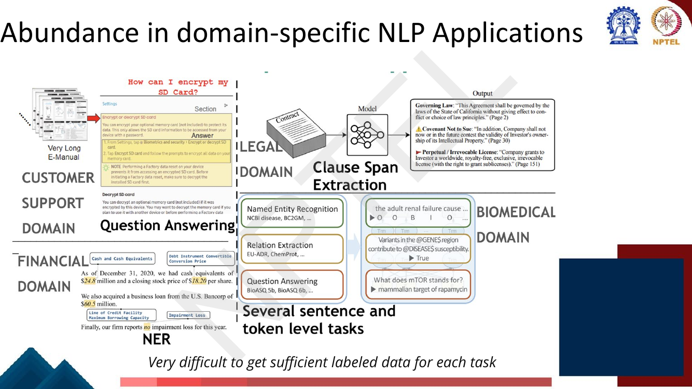
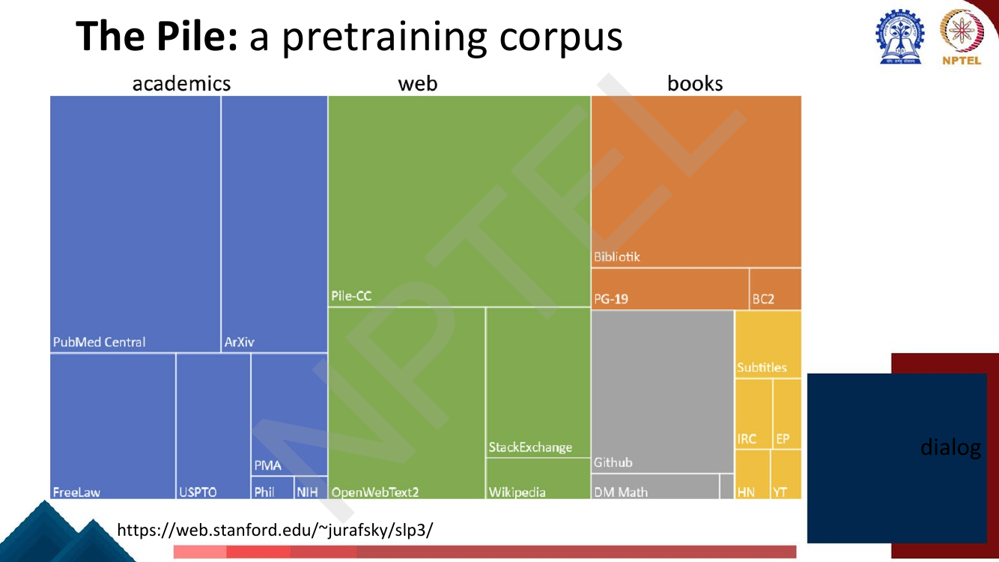
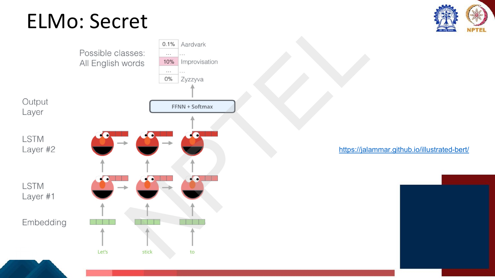
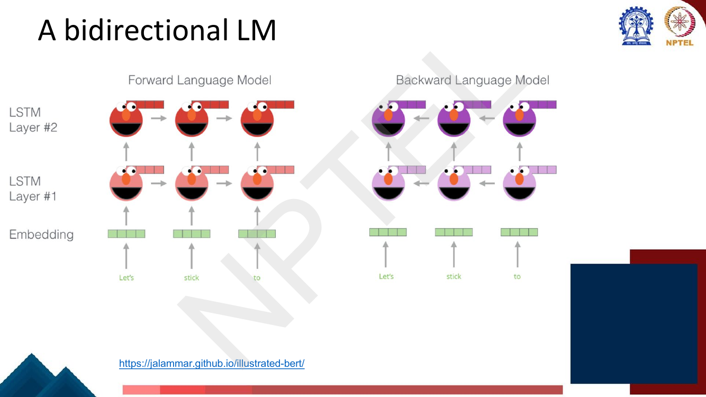
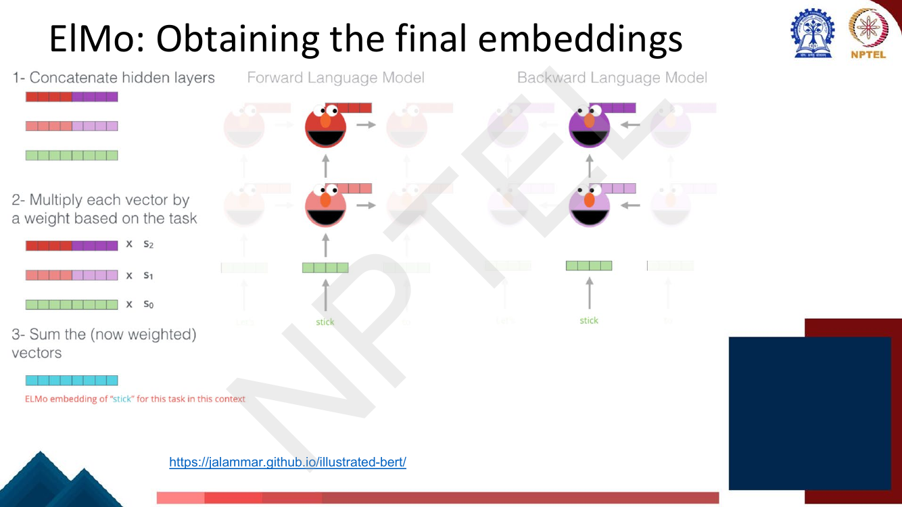
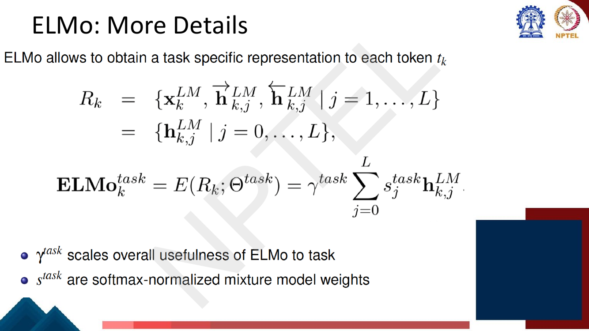
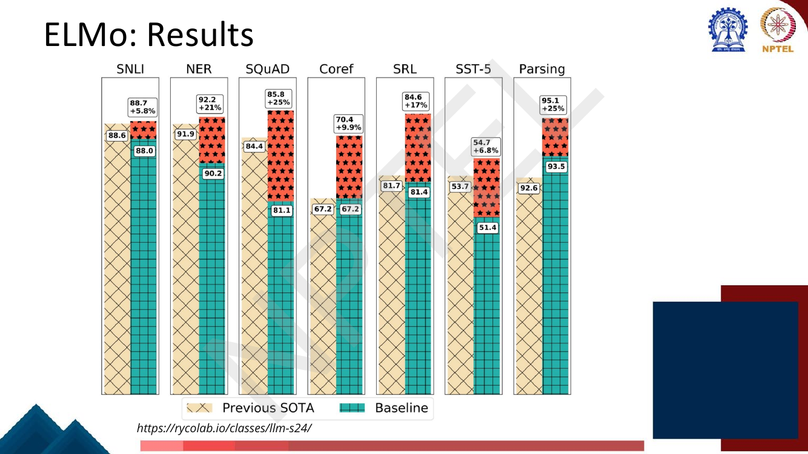
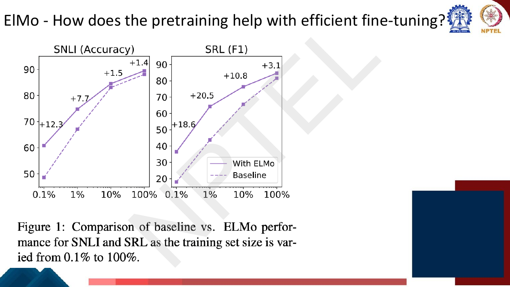

# Lec 26 — Pretraining and ELMo

> **Source:** `Week6.pdf` pp. 1–29 · **Week 6** · **Playlist:** Lec 26
> **Prereqs:** [Lec 24 — Decoder and Transformer LM](../week-05/24-decoder-and-transformer-lm.md), [Lec 11 — Word Representation](../week-03/11-word-representation.md)
> **Feeds into:** [Lec 27 — BERT and Masked LM](27-bert-masked-lm.md), [Lec 28 — Span Tasks, T5, BART](28-span-tasks-t5-bart.md), [Lec 29 — GPT and Decoder Pretraining](29-gpt-decoder-pretraining.md), [Lec 30 — Domain and Multilingual Pretraining](30-domain-and-multilingual-pretraining.md)

## Why this lecture exists

Weeks 4 and 5 gave you architectures — RNNs, LSTMs, Transformers — and the course's first slide here
admits something blunt: *"Transformers are not always better than RNNs by themselves."* The
architecture was never the whole story. What made the last seven years happen is **how you train**,
not **what you train**.

The problem is economic. There are thousands of NLP applications — legal clause extraction, biomedical
NER, customer-support QA — and almost none of them has enough labelled data to teach a randomly
initialised network what English *is*, let alone what the task is. So you split the job: learn language
once, from raw unlabelled text, at enormous scale; then adapt that model cheaply to each task. This
lecture is that idea, the first model that made it work for NLP (**ELMo**), and the three-way
architectural taxonomy that the next four lectures fill in.

## The ideas

### Where standard supervised learning runs out

The deck's baseline picture is the one you already know: take text plus labels, initialise a
network **starting from random weights**, train, predict `spam` / `not spam`. That phrase — *starting
from random weights* — is the whole problem: every single task pays the full cost of learning language
from scratch (page 4).

Now count the tasks. The slides show four domains at once — customer support (QA over very long
e-manuals), legal (clause span extraction), financial (NER over filings), biomedical (NER, relation
extraction, QA over BioASQ) — and ends with the line that is the whole motivation:

> *Very difficult to get sufficient labeled data for each task.*


*Fig. — Abundance of applications, scarcity of labels per application. Note the biomedical panel shows BIO tagging, which [Lec 17](../week-04/17-rnn-applications.md) owns. Page 5.*

Why is scarcity fatal rather than merely annoying? The deck's answer, on the next page, is sharp:

> *The training data we have for our downstream task (like question answering) must be sufficient to
> teach all contextual aspects of language.*

A randomly initialised model with randomly initialised word vectors has to learn, from your 5,000
labelled QA pairs, that "bank" has two senses, that pronouns resolve, that *enormous* intensifies
*big*. That is a linguistics education, and you are paying for it with a task dataset. It does not fit.

### Transfer learning: the underlying idea

**Transfer learning** is the general principle: train a model on a *source* task where data is
plentiful, then reuse its learned parameters as the starting point for a *target* task where data is
scarce. The knowledge transfers through the weights.

The deck's framing is that this, not raw architectural merit, is what made Transformers dominant —
*"what has made Transformers popular is that they can be combined with the idea of transfer learning.
Transformers have become the go-to model for building large pretrained language models which can be
adapted for several tasks."*

### The pretrain-then-finetune paradigm (from 2018)

The deck dates the paradigm precisely — **2018** — and splits it into two stages.


*Fig. — The parenthetical is the crux: "does not require that people label the next word". Stage 1's labels are free. Page 7.*

| | Stage 1: **Pretrain** | Stage 2: **Finetune** |
|---|---|---|
| Starting weights | random | **pretrained** |
| Data | lots of raw text, no labels | text **+ labels**, not much of it |
| Objective | generate the next or masked word | standard supervised training |
| Done | **once**, expensively | **many times**, cheaply |
| Learns | general language | the specific task |

The later slide (page 14) restates it in one line that is worth memorising verbatim: *"Pretraining can improve
NLP applications by serving as parameter initialization."* That is all fine-tuning is — you are not
changing the architecture, you are changing where gradient descent starts.

### Why the LM objective is the right pretraining task

Pretraining needs an objective that produces useful representations *and* costs nothing to label.
Language modelling is the only candidate that does both, because it is **self-supervised**: the label
for position $t$ is simply the token at position $t$, which the raw text already contains. Nobody
annotates anything. That is what lets the objective scale to the entire web.

Formally the objective is the one [Lec 24](../week-05/24-decoder-and-transformer-lm.md) built:

$$\mathcal{L} = -\sum_{t=1}^{T} \log P_\theta(w_t \mid w_1 \ldots w_{t-1})$$

and the measure of how well it is doing is perplexity ([Lec 4](../week-01/04-ngram-lm-2-smoothing-perplexity.md)).
Nothing about the loss is new. What is new is *what you do with $\theta$ afterwards*.

The deck's claim for the payoff is quantitative and examinable:

> *Supervised systems for various NLP tasks used to require **millions of examples** to learn tasks.
> NLP systems that use language models as a starting point, need much fewer — **thousands** of examples
> to do so!*

### What a model learns from pretraining

The deck makes the case by example (page 9). Each of these five lines is a next-word prediction with
the answer underlined, and each requires a different kind of knowledge to get right:

| Example | Competence it forces |
|---|---|
| "One dog in the front room, and two **dogs**" | **syntax / morphology** — number agreement after *two* |
| "It wasn't just big it was **enormous**" | **lexical semantics** — the intensifying scalar relation |
| "The author of *A Room of One's Own* is Virginia **Woolf**" | **world knowledge** — a fact about the world |
| "The doctor told me that **he**…" | **coreference** — and, note, the gender *bias* baked into the corpus |
| "The square root of 4 is **2**" | rudimentary **reasoning / arithmetic** |

The deck's summary is the "Big idea" slide: *"Text contains enormous amounts of knowledge. Pretraining
on lots of text with all that knowledge is what gives language models their ability to do so much."*

The doctor/*he* example deserves a second look. The model learns that continuation because the corpus
contains it, not because it is correct. Pretraining transfers whatever is in the text — including the
bias. That is why the filtering slide exists.

### Pretraining corpora

**LLMs are mainly trained on the web.** The deck names three things and you should know all of them:

| Corpus | What it is | Size the deck gives |
|---|---|---|
| **Common Crawl** | snapshots of the entire web, produced by the non-profit Common Crawl | **billions of pages** |
| **C4** — Colossal Clean Crawled Corpus (Raffel et al., **2020**) | a *filtered* version of Common Crawl, English only | **156 billion tokens** |
| **The Pile** | a curated mixture, not a raw crawl | (see breakdown below) |

The deck also answers "what's actually *in* C4?" — **mostly patent text documents, Wikipedia, and news
sites**. That is a surprising composition and exactly the sort of detail an MCQ keys on.

**The Pile** is presented as a treemap of its components, grouped into four families:


*Fig. — Four families: **academics**, **web**, **books**, **dialog**. The three largest single tiles are PubMed Central, Pile-CC and Bibliotik. Note GitHub and DM Mathematics sit in "books" — the grouping is loose. Page 12.*

| Family | Members on the slide |
|---|---|
| **academics** | PubMed Central, ArXiv, FreeLaw, USPTO, PMA, Phil(Papers), NIH |
| **web** | Pile-CC, OpenWebText2, StackExchange, Wikipedia |
| **books** | Bibliotik, PG-19, BC2 (BookCorpus2), Github, DM Math |
| **dialog** | Subtitles, IRC, EP (EuroParl), HN (Hacker News), YT (YouTube subtitles) |

**Filtering for quality and safety.** The deck's point is that both criteria are *subjective*, and it
lists what is actually done:

- **Quality** — "quality is subjective". Many LLMs attempt to match Wikipedia, books, or particular
  websites as a quality reference. Remove boilerplate and adult content. **Deduplicate at many levels:
  URLs, documents, even individual lines.**
- **Safety** — also subjective. Toxicity detection is important "although that has mixed results", and
  the specific failure named is that it **can mistakenly flag data written in dialects like African
  American English**. Filtering for safety can silently delete a dialect from the corpus.

---

### ELMo: pretrained LSTMs

**ELMo** — *Embeddings from Language Models*, Peters et al., **NAACL 2018** — is the model that
established this paradigm for NLP, and it is built on **LSTMs**, not Transformers. It predates the
Transformer in this role. If an MCQ asks "which architecture does ELMo pretrain?", the answer is a
stacked **biLSTM**, and [Lec 20](../week-04/20-gru-and-lstm.md) owns the cell internals.

Recall why this was needed at all. Static embeddings — word2vec, GloVe
([Lec 11](../week-03/11-word-representation.md)) — give each word *type* exactly one vector. "bank" in
*river bank* and *bank loan* get the identical vector, forever. ELMo's entire point is that its
representation of a word is a function of the **whole sentence the word occurs in**, so the two banks
differ. Representations that depend on context are **contextual embeddings**;
[Lec 27](27-bert-masked-lm.md) develops the static-versus-contextual contrast properly.

#### ELMo's secret


*Fig. — The "secret" is anticlimactic and that is the point: ELMo is just a 2-layer LSTM language model, trained to put probability on the next word over the full English vocabulary. Nothing exotic. Page 16.*

The secret is that the pretraining task is *only* language modelling. Stack two LSTM layers over an
embedding layer, put a feed-forward network and a softmax over the whole vocabulary on top, and
predict the next word. Then throw the softmax away and keep the hidden states.

#### A bidirectional LM — and what that does and does not mean

A left-to-right LM at position $k$ only sees $w_1 \ldots w_{k-1}$. For *representing* a word that is
half the available evidence. ELMo's fix: train a second LM that runs right-to-left.


*Fig. — Two stacks, two directions, **two separate models**. The arrows never cross between them. Page 17.*

The forward LM maximises

$$\sum_{k=1}^{T} \log P(w_k \mid w_1, \ldots, w_{k-1}; \theta_x, \overrightarrow{\theta}_{\text{LSTM}}, \theta_s)$$

and the backward LM maximises

$$\sum_{k=1}^{T} \log P(w_k \mid w_{k+1}, \ldots, w_T; \theta_x, \overleftarrow{\theta}_{\text{LSTM}}, \theta_s)$$

The token embeddings $\theta_x$ and the softmax $\theta_s$ are **shared**; the two LSTM stacks are
**not**. The biLM objective is just the sum of the two log-likelihoods.

> **The distinction that will be on the exam.** ELMo is **not** bidirectionally *conditioned*. It
> trains two **independent unidirectional** models and **concatenates** their hidden states afterwards.
> At no point does any single LSTM see both the left and the right context while computing a state —
> if it did, the LM objective would be trivial, because the model could read the answer. True joint
> bidirectional conditioning requires a different objective (masked language modelling), and that is
> what [BERT](27-bert-masked-lm.md) does. "ELMo is bidirectional" is true of the *representation* and
> false of the *conditioning*.

A useful shorthand: ELMo gives you $f(\text{left}) \,\Vert\, g(\text{right})$. BERT gives you
$h(\text{left}, \text{right})$.

#### Obtaining the final embeddings

Older systems (**TagLM**) used only the **top** LSTM layer. ELMo's contribution — the deck says it
explicitly — is that it "learns a **task-specific combination** of biLM representations", in contrast
with "just using the top layer of the LSTM stack by TagLM".

For an $L$-layer biLM, the set of representations for token $t_k$ is

$$R_k = \left\{ \mathbf{x}^{LM}_k,\; \overrightarrow{\mathbf{h}}^{LM}_{k,j},\; \overleftarrow{\mathbf{h}}^{LM}_{k,j} \;\middle|\; j = 1, \ldots, L \right\} = \left\{ \mathbf{h}^{LM}_{k,j} \;\middle|\; j = 0, \ldots, L \right\}$$

Read the second line carefully — it is a *renaming* of the first. For $j \geq 1$,
$\mathbf{h}^{LM}_{k,j} = [\overrightarrow{\mathbf{h}}^{LM}_{k,j}; \overleftarrow{\mathbf{h}}^{LM}_{k,j}]$
is the **concatenation** of the two directions' states at layer $j$. For $j = 0$, $\mathbf{h}^{LM}_{k,0}$
is the context-independent token embedding $\mathbf{x}^{LM}_k$ (duplicated so the dimensions line up).
So an $L$-layer biLM gives you $L+1$ vectors per token, **not** $L$ — the embedding layer counts.


*Fig. — Three steps: concatenate the two directions within each layer, scale each layer by its task weight $s_j$, sum. The result is labelled "ELMo embedding of *stick* **for this task in this context**" — both qualifiers matter. Page 18.*

The formula, which you should be able to write from memory:


*Fig. — The sum starts at $j=0$, so it includes the static embedding layer. Page 20.*

$$\mathbf{ELMo}^{task}_k = E(R_k; \Theta^{task}) = \gamma^{task} \sum_{j=0}^{L} s^{task}_j \, \mathbf{h}^{LM}_{k,j}$$

Two learned task-specific quantities, and the deck defines both:

- $s^{task}_j$ — **softmax-normalised mixture-model weights**. They satisfy $\sum_{j=0}^{L} s_j = 1$,
  $s_j > 0$, because they are the softmax of $L+1$ free scalars. They decide *which layer* this task
  wants.
- $\gamma^{task}$ — a single scalar that **"scales the overall usefulness of ELMo to the task"**. Since
  the $s_j$ sum to 1, the mixture cannot change its own magnitude; $\gamma$ restores that degree of
  freedom, which matters because the task model's layer-norm and optimiser care about scale.

Count them: for $L = 2$ there are $3$ weights plus $1$ gamma = **4 task-specific parameters**. That is
the entire task-specific cost of ELMo. Everything else is frozen.

#### Weighting of layers: what each layer knows


*Fig. — This page is the key to the "what can you say about the task?" half of the deck's exercise. Memorise which tasks sit on which side. Page 22.*

| Layer | Captures | Tasks that weight it heavily |
|---|---|---|
| **Lower** biLSTM layer | lower-level **syntax** | part-of-speech tagging, syntactic dependencies, **NER** |
| **Higher** biLSTM layer | higher-level **semantics** | sentiment, semantic role labeling, question answering, **SNLI** |

This is precisely why ELMo learns $s_j$ rather than fixing them: a POS tagger and a sentiment
classifier want *different* layers, and the mixture lets each task discover its own preference from
the data. TagLM, by taking only the top layer, forced every task to use the semantic one.

#### Using ELMo for a task


*Fig. — The biLM sits **outside** the task model (top right, greyed), and its output is spliced in as extra input: $\mathbf{h}_{k,1} = [\overrightarrow{\mathbf{h}}_{k,1}; \overleftarrow{\mathbf{h}}_{k,1}; \mathbf{h}^{LM}_k]$. The task model here is a bi-RNN + CRF sequence tagger. Page 21.*

The recipe, and note how conservative it is:

1. **Freeze the pretrained biLM.** Its weights do not move during task training.
2. Run the sentence through it; collect $\mathbf{h}^{LM}_{k,0..L}$ for every token.
3. Collapse them with the learned $\gamma$ and $s_j$ into one vector per token.
4. **Concatenate** that vector onto the task model's own input representation (the deck's equation
   $\mathbf{h}_{k,1} = [\overrightarrow{\mathbf{h}}_{k,1}; \overleftarrow{\mathbf{h}}_{k,1}; \mathbf{h}^{LM}_k]$).
5. Train the task model normally. Only the task model and the 4 mixing scalars get gradients.

This is **feature-based** transfer, not full fine-tuning. The pretrained weights are used as *inputs*,
not as an *initialisation*. BERT ([Lec 27](27-bert-masked-lm.md)) switches to the other mode — update
everything — and that switch is itself a likely exam discriminator.

#### ELMo's results


*Fig. — Seven tasks, seven new states of the art. The percentage above each bar is the **relative error reduction**, not the absolute gain — SQuAD's "+25%" is 81.1 → 85.8, which is 4.7 absolute. Page 23.*

| Task | Baseline | With ELMo | Relative error reduction |
|---|---|---|---|
| SNLI | 88.0 | **88.7** | +5.8% |
| NER | 90.2 | **92.2** | +21% |
| SQuAD | 81.1 | **85.8** | +25% |
| Coref | 67.2 | **70.4** | +9.9% |
| SRL | 81.4 | **84.6** | +17% |
| SST-5 | 51.4 | **54.7** | +6.8% |
| Parsing | 93.5 | **95.1** | +25% |

One generic trick — a frozen biLM plus four scalars — beat seven task-specific state-of-the-art
systems at once. That result is why the next four lectures exist.

#### How pretraining helps with efficient fine-tuning


*Fig. — The gap is **largest when labels are scarcest** and narrows as data grows. That shape is the entire argument for pretraining. Page 24.*

| Fraction of training set | SNLI gap | SRL gap |
|---|---|---|
| 0.1% | **+12.3** | **+18.6** |
| 1% | +7.7 | **+20.5** |
| 10% | +1.5 | +10.8 |
| 100% | +1.4 | +3.1 |

Read the shape, not the numbers. Pretraining buys you *the knowledge you could not afford to annotate*.
When you can afford to annotate it anyway (100% column), the advantage shrinks toward nothing. This is
the quantitative version of the deck's "millions → thousands" claim, and N3 below turns it into a data
ratio.

---

### Using Transformers for pretraining

Everything above holds with the LSTM swapped for a Transformer. Page 26 simply re-shows the full
encoder-decoder stack from [Lec 21–24](../week-05/21-intro-to-transformers.md) — six encoders feeding
six decoders, "Je suis étudiant" → "I am a student" — to make one point. The Transformer offers
something the LSTM does not: it comes in **three separable pieces**, and you can pretrain any of them.

### Three architectures for large language models — the spine of Week 6


*Fig. — Look at the arrows, which carry the real content: the decoder's attention only points **backward**; the encoder's points **everywhere**; the encoder-decoder's encoder is bidirectional and its decoder attends back into the encoder. The slide's text boxes collide — "decoders" and "BART" belong to the **Encoder-decoders** column. Page 27.*

**This table is the map for the rest of Week 6. Learn it before anything else.**

| | **Encoder-only** | **Encoder-decoder** | **Decoder-only** |
|---|---|---|---|
| **Attention** | full, bidirectional over the whole input | bidirectional in the encoder, causal in the decoder, cross-attention between | **causal** — each position sees only what precedes it |
| **Pretraining objective** | masked LM (fill in blanks) | corrupted-span reconstruction / masked seq2seq | plain next-token LM |
| **Produces** | one contextual vector per input token | an output *sequence* conditioned on an input sequence | a continuation of the prompt |
| **Good at** | understanding tasks: classification, NER, sentence-pair tasks | transduction: translation, summarization, anything input-seq → output-seq | open-ended generation; also everything else, by prompting |
| **Cannot naturally** | generate text left-to-right | — | use right context when encoding a token |
| **Models the deck names** | **BERT family** | **Flan-T5**, **BART** | **GPT**, **Claude**, **Llama**, **Mixtral** |
| **Owned by** | [Lec 27](27-bert-masked-lm.md) | [Lec 28](28-span-tasks-t5-bart.md) | [Lec 29](29-gpt-decoder-pretraining.md) |

Two more pointers so you know where the rest of the week goes: [Lec 28](28-span-tasks-t5-bart.md) also
owns span-based fine-tuning and the GLUE benchmark, and [Lec 30](30-domain-and-multilingual-pretraining.md)
owns what happens when you pretrain on a *specific domain* or on *many languages*.

Where does ELMo sit? Nowhere in that table, and that is the historically honest answer — it is the
LSTM-era ancestor of all three. Its biLM is two decoders glued together, and the thing it *wanted* to
be, an encoder, is what BERT built nine months later.

The deck closes by pinning its source: **Jurafsky and Martin, *Speech and Language Processing*, 3rd
edition (online manuscript, 20 August 2024), Chapter 10.**

## Worked numericals

### N1. The deck's own exercise — the ELMo representation (page 25)

> **The deck gives NO solution.** Page 25 is the last content page before the Transformer section;
> page 26 moves on. Everything below is derived from the formula on page 20 and the layer semantics on
> page 22, and I say where each choice comes from.

**Given:** a 2-layer forward LM and a 2-layer backward LM, both over 3-dimensional word embeddings.

| | dim 1 | dim 2 | dim 3 |
|---|---|---|---|
| word embedding $\mathbf{x}_w$ | 0.2 | 0.4 | −0.5 |
| forward LM, layer 1 | 0.2 | 0.4 | 0.7 |
| forward LM, layer 2 | 0.3 | 0.6 | 0.5 |
| backward LM, layer 1 | 0.2 | −0.4 | 0.7 |
| backward LM, layer 2 | 0.3 | 0.6 | −0.5 |

Softmax-normalised mixture weights: $s_0 = 0.2$ (embedding), $s_1 = 0.3$, $s_2 = 0.5$.

**Find:** the ELMo representation of $w$, and what the weights tell you about the task.

**Step 1 — build the $L+1 = 3$ layer vectors $\mathbf{h}^{LM}_{k,j}$.**
Per the deck's page-19/20 definition, each $j \geq 1$ layer is the **concatenation** of the forward and
backward states; the $j = 0$ layer is the context-independent embedding, duplicated so all three live
in the same $2d = 6$ dimensions:

$$\mathbf{h}_0 = [\,0.2,\;0.4,\;-0.5\;\Vert\;0.2,\;0.4,\;-0.5\,]$$
$$\mathbf{h}_1 = [\,0.2,\;0.4,\;\;\;0.7\;\Vert\;0.2,\,-0.4,\;\;\;0.7\,]$$
$$\mathbf{h}_2 = [\,0.3,\;0.6,\;\;\;0.5\;\Vert\;0.3,\;\;\,0.6,\,-0.5\,]$$

**Step 2 — check the weights are a valid mixture.** $0.2 + 0.3 + 0.5 = 1.0$ ✓ (they must sum to 1;
that is what "softmax-normalised" buys you).

**Step 3 — apply $\mathbf{ELMo}_k = \gamma \sum_{j=0}^{2} s_j \mathbf{h}_{k,j}$ with $\gamma = 1$.**
The problem does not give $\gamma$, so take $\gamma = 1$; it is a single multiplicative scalar, so any
other value just rescales the whole answer.

Component by component:

| dim | $0.2 \times h_0$ | $+\;0.3 \times h_1$ | $+\;0.5 \times h_2$ | $=$ |
|---|---|---|---|---|
| 1 (fwd) | $0.2(0.2) = 0.04$ | $0.3(0.2) = 0.06$ | $0.5(0.3) = 0.15$ | **0.25** |
| 2 (fwd) | $0.2(0.4) = 0.08$ | $0.3(0.4) = 0.12$ | $0.5(0.6) = 0.30$ | **0.50** |
| 3 (fwd) | $0.2(-0.5) = -0.10$ | $0.3(0.7) = 0.21$ | $0.5(0.5) = 0.25$ | **0.36** |
| 4 (bwd) | $0.2(0.2) = 0.04$ | $0.3(0.2) = 0.06$ | $0.5(0.3) = 0.15$ | **0.25** |
| 5 (bwd) | $0.2(0.4) = 0.08$ | $0.3(-0.4) = -0.12$ | $0.5(0.6) = 0.30$ | **0.26** |
| 6 (bwd) | $0.2(-0.5) = -0.10$ | $0.3(0.7) = 0.21$ | $0.5(-0.5) = -0.25$ | **−0.14** |

**Step 4 — the second question, "what can you say about the task?"** The largest weight, $s_2 = 0.5$,
is on the **top** layer. Page 22 says the higher biLSTM layer captures **higher-level semantics**. So
this task is a semantics-heavy one — sentiment analysis, semantic role labeling, question answering or
SNLI — rather than a low-level syntactic one such as POS tagging, dependency parsing or NER, which
would have put the mass on $s_1$. Note also that $s_0$ gets the least weight (0.2): the task has
learned that the *static*, context-free embedding is the least useful of the three, which is the whole
justification for contextual representations.

**Answer:** $\mathbf{ELMo}_w = [\,0.25,\; 0.50,\; 0.36,\; 0.25,\; 0.26,\; -0.14\,]$ (6-dimensional,
i.e. $2 \times$ the 3-dim per-direction width). The weighting $0.2 / 0.3 / 0.5$ says the task leans on
**semantics**, so it is a sentence-level/semantic task, not a syntactic tagging task.

> **Alternative convention, flagged.** If instead of concatenating you *average* the two directions
> within each layer, you get the 3-dim vector $[0.25,\;0.38,\;0.11]$. The deck's own equation on
> page 19 — $R_k = \{\mathbf{x}^{LM}_k, \overrightarrow{\mathbf{h}}^{LM}_{k,j}, \overleftarrow{\mathbf{h}}^{LM}_{k,j}\} = \{\mathbf{h}^{LM}_{k,j}\}$
> — collapses the forward and backward entries into a single symbol, which is Peters et al.'s
> concatenation. **Concatenation is the correct reading**; the averaged number is given only so you
> recognise it if it appears as a distractor.

### N2. Layer weighting from raw scores, with $\gamma$

**Given:** a 2-layer biLM. The *unnormalised* mixing scores (the free parameters the task actually
learns) are $w_0 = 0$, $w_1 = 1$, $w_2 = 2$, and $\gamma = 2$. For simplicity the layer
representations are 2-dimensional:
$\mathbf{h}_0 = [1, 0]$, $\mathbf{h}_1 = [0, 2]$, $\mathbf{h}_2 = [1, 1]$.
**Find:** the ELMo vector.

1. Softmax the scores. $e^0 = 1$, $e^1 = 2.71828$, $e^2 = 7.38906$; sum $= 11.10734$.
2. $s_0 = 1 / 11.10734 = 0.09003$; $\;s_1 = 2.71828 / 11.10734 = 0.24473$; $\;s_2 = 7.38906 / 11.10734 = 0.66524$.
3. Check: $0.09003 + 0.24473 + 0.66524 = 1.00000$ ✓
4. Mixture, dim 1: $0.09003(1) + 0.24473(0) + 0.66524(1) = 0.75527$.
5. Mixture, dim 2: $0.09003(0) + 0.24473(2) + 0.66524(1) = 0.48946 + 0.66524 = 1.15470$.
6. Scale by $\gamma = 2$: $[\,1.51054,\; 2.30939\,]$.

**Answer:** $\mathbf{ELMo} = [\,1.5105,\; 2.3094\,]$. Notice step 6: without $\gamma$ the output
magnitude is pinned by the inputs, because a convex combination of vectors of norm $\approx 1$ has
norm $\approx 1$. $\gamma$ is the only thing that lets the task say "give me *more* ELMo".

### N3. Transfer learning as a labelled-data saving

**Given:** the deck's page-24 curves. On **SRL**, F1 with ELMo is 64.4 at **1%** of the training set;
the baseline is 43.9 at 1% and 65.4 at **10%**.
**Find:** how much labelled data pretraining saves, and reconcile with the deck's page-8 claim.

1. ELMo's score at 1% of the data is 64.4.
2. The baseline reaches a comparable score (65.4) only at 10% of the data.
3. Data ratio $= 10\% / 1\% = \mathbf{10\times}$. **Pretraining bought a 10× reduction in labelled
   examples at that accuracy level.**
4. Cross-check on SNLI. ELMo scores 61.0 at 0.1%. The baseline scores 48.5 at 0.1% and 67.2 at 1%.
   Interpolating the baseline *log-linearly* in data (one decade from 0.1% to 1%, 18.7 points of gain):
   the fraction of a decade needed for $61.0 - 48.5 = 12.5$ points is $12.5 / 18.7 = 0.668$.
5. So the baseline needs $0.1\% \times 10^{0.668} = 0.1\% \times 4.66 = 0.47\%$ of the data to match
   ELMo's 0.1% — a $\mathbf{4.7\times}$ saving.
6. Reconcile with page 8 ("millions of examples" → "thousands"). That is a claim of roughly
   $10^6 / 10^3 = \mathbf{1000\times}$, which is far larger than the 5–10× these two curves show. Both
   are the deck's; they are not measuring the same thing. The curves hold the *task model* fixed and
   vary data. The "millions → thousands" figure compares a modern pretrained pipeline against the
   pre-2018 supervised systems it replaced — a different architecture as well as a different
   initialisation.

**Answer:** 10× on SRL, ≈4.7× on SNLI, against the deck's looser headline claim of ~1000×. If an MCQ
asks for "the" number, it wants **millions → thousands**; if it shows the curves, it wants the gap to
be **largest at the smallest data fraction** (+18.6 F1 at 0.1% on SRL, +12.3 accuracy at 0.1% on SNLI).

### N4. Parameter count of ELMo's biLM, versus a static embedding table

**Given:** $|V| = 50{,}000$; token-embedding dimension $d_{\text{in}} = 512$; LSTM hidden size
$d_h = 512$; $L = 2$ layers per direction; 2 directions. Token embeddings and the output softmax are
**shared** between the two directions (as in Peters et al.).
**Find:** the biLM's parameter count, and compare with a static embedding table of the same width.

1. One LSTM layer has 4 gates (input, forget, output, candidate). Each gate needs
   $\mathbf{W} \in \mathbb{R}^{d_h \times d_{\text{in}}}$, $\mathbf{U} \in \mathbb{R}^{d_h \times d_h}$
   and a bias $\in \mathbb{R}^{d_h}$ (see [Lec 20](../week-04/20-gru-and-lstm.md); that deck drops the
   biases, so I count them separately below).
2. Per layer: $4\,(d_h d_{\text{in}} + d_h^2 + d_h) = 4\,(512 \cdot 512 + 512^2 + 512)$.
3. $512 \cdot 512 = 262{,}144$. So $4\,(262{,}144 + 262{,}144 + 512) = 4 \times 524{,}800 = 2{,}099{,}200$.
4. Layer 2 takes the 512-dim output of layer 1, so it has the same count: $2{,}099{,}200$.
5. Per direction: $2 \times 2{,}099{,}200 = 4{,}198{,}400$. Two directions:
   $\mathbf{8{,}396{,}800} \approx 8.4\text{M}$ recurrent parameters.
   (Drop the biases, as the Lec 20 deck does, and it is $8 \times 524{,}288 = 4{,}194{,}304 \times 2 = 8{,}388{,}608$ — a 8,192-parameter difference.)
6. Embedding table: $50{,}000 \times 512 = 25{,}600{,}000$.
7. Output softmax: $512 \times 50{,}000 + 50{,}000 = 25{,}650{,}000$ (used in pretraining only, then discarded).
8. Total during pretraining: $25.6\text{M} + 8.4\text{M} + 25.65\text{M} = \mathbf{59.65\text{M}}$.
9. What you keep for downstream use: $25.6\text{M} + 8.4\text{M} = \mathbf{34.0\text{M}}$.
10. A **static** embedding table of the same vocabulary and width is $25.6\text{M}$ — and that is the
    *whole* model. The contextual part costs an extra $8.4\text{M}$, i.e. **+33%** over the table.
11. The task-specific part: $L + 1 = 3$ mixture weights $+\;1$ gamma $= \mathbf{4}$ parameters.

**Answer:** ≈**8.4M** recurrent parameters in the two 2-layer LSTM stacks; ≈**34.0M** kept for
downstream use; ≈**59.7M** during pretraining. A static table of the same shape is **25.6M** and buys
you one vector per word *type*. For a 33% parameter surcharge ELMo buys you one vector per word
*token* — and the task pays only **4** extra parameters to consume it.

### N5. Corpus-size arithmetic — pretraining data versus task data

**Given:** C4 contains **156 billion** tokens (deck, page 11). A typical sequence-labelling training
set — CoNLL-2003 English NER — is about **204,000** tokens. The Pile is distributed as **825 GiB** of
text (not on the deck; stated here as an editorial figure).
**Find:** the ratios, and what they imply.

1. $156 \times 10^9 \;/\; 2.04 \times 10^5 = 7.647 \times 10^5$.
2. So pretraining sees roughly **765,000×** more tokens than the fine-tuning task does.
3. Equivalently: one epoch of pretraining ≈ **765,000 epochs** of the NER dataset, in tokens seen.
4. The Pile in tokens, at a typical ≈4 bytes per token for English:
   $825\;\text{GiB} = 825 \times 1.074 \times 10^9 = 8.86 \times 10^{11}$ bytes;
   $8.86 \times 10^{11} / 4 \approx 2.2 \times 10^{11} = \mathbf{220\;\text{billion tokens}}$.
5. Ratio against C4: $220\text{B} / 156\text{B} \approx 1.4\times$ — the same order of magnitude. Both
   corpora are "a few hundred billion tokens"; The Pile's selling point is its **curation** (22 sources
   across academics / web / books / dialog), not its size.
6. The practical reading: if your task has $\sim$10$^5$ labelled tokens and language has
   $\sim$10$^{11}$ tokens' worth of structure in it, you *cannot* learn language from the task. You can
   only learn the task. The other 10$^{11}$ has to come from somewhere, and pretraining is where.

**Answer:** ≈$7.6 \times 10^5$ (C4 : CoNLL-2003); The Pile ≈ $2.2 \times 10^{11}$ tokens, about
$1.4\times$ C4. The six-orders-of-magnitude gap between pretraining and fine-tuning data is the
quantitative statement of why the paradigm exists.

## Code

A NumPy implementation of the ELMo layer combination — softmax over layer scores, weighted sum, scaled
by $\gamma$ — reproducing N1 and N2 exactly.

```python
import numpy as np

def elmo(reps, s, gamma):
    """reps: (L+1, d) stack of biLM layer representations for one token.
       s:    (L+1,) softmax-normalised mixture weights.  gamma: scalar."""
    s = np.asarray(s, float)
    assert abs(s.sum() - 1.0) < 1e-9, "s must be a distribution"
    return gamma * (s[:, None] * np.asarray(reps, float)).sum(axis=0)

def softmax(w):
    w = np.asarray(w, float); e = np.exp(w - w.max()); return e / e.sum()

# ---- N1: the deck's page-25 problem -------------------------------------
x      = np.array([0.2, 0.4, -0.5])                              # embedding (layer 0)
f1, f2 = np.array([0.2, 0.4, 0.7]), np.array([0.3, 0.6,  0.5])   # forward  LM
b1, b2 = np.array([0.2,-0.4, 0.7]), np.array([0.3, 0.6, -0.5])   # backward LM

h0 = np.concatenate([x,  x ])      # layer 0 = embedding, duplicated to 2d
h1 = np.concatenate([f1, b1])      # layer 1 = [forward ; backward]
h2 = np.concatenate([f2, b2])      # layer 2 = [forward ; backward]
R  = np.stack([h0, h1, h2])        # (L+1, 2d) = (3, 6)
s  = [0.2, 0.3, 0.5]

print("R (3 layers x 6 dims):\n", R)
print("ELMo (gamma=1):", np.round(elmo(R, s, 1.0), 4))
print("heaviest layer :", int(np.argmax(s)), "-> semantics-leaning task")

# ---- N2: softmax-normalising raw scores, then scaling by gamma ----------
raw = [0.0, 1.0, 2.0]                     # the free parameters a task learns
s2  = softmax(raw)
R2  = np.array([[1.0, 0.0],
                [0.0, 2.0],
                [1.0, 1.0]])
print("\nsoftmax(0,1,2) =", np.round(s2, 6), " sum =", s2.sum())
print("weighted sum   =", np.round(elmo(R2, s2, 1.0), 6))
print("ELMo, gamma=2  =", np.round(elmo(R2, s2, 2.0), 6))

# ---- the task-specific cost of ELMo ------------------------------------
L = 2
print(f"\ntask-specific ELMo params = (L+1) weights + 1 gamma = {L+1}+1 = {L+2}")
```

Real printed output:

```
R (3 layers x 6 dims):
 [[ 0.2  0.4 -0.5  0.2  0.4 -0.5]
 [ 0.2  0.4  0.7  0.2 -0.4  0.7]
 [ 0.3  0.6  0.5  0.3  0.6 -0.5]]
ELMo (gamma=1): [ 0.25  0.5   0.36  0.25  0.26 -0.14]
heaviest layer : 2 -> semantics-leaning task

softmax(0,1,2) = [0.090031 0.244728 0.665241]  sum = 0.9999999999999999
weighted sum   = [0.755272 1.154698]
ELMo, gamma=2  = [1.510543 2.309396]

task-specific ELMo params = (L+1) weights + 1 gamma = 3+1 = 4
```

Three things the code makes concrete. The `assert` enforces that $s$ is a distribution — that is what
"softmax-normalised" means and it is why $\gamma$ is needed at all. `R` has **three** rows for a
**two**-layer biLM, because the embedding layer is $j = 0$. And the last line is the punchline of the
whole ELMo design: the entire task-specific adaptation is **four scalars**.

## Exam pack

### Must-memorise

| Item | Exactly this |
|---|---|
| ELMo equation | $\mathbf{ELMo}^{task}_k = \gamma^{task} \sum_{j=0}^{L} s^{task}_j \mathbf{h}^{LM}_{k,j}$ |
| $s^{task}_j$ | **softmax-normalised mixture-model weights**; $\sum_j s_j = 1$ |
| $\gamma^{task}$ | scales the **overall usefulness of ELMo to the task** (one scalar) |
| Number of layer vectors | $L + 1$, because $j$ starts at **0** (the token embedding) |
| $\mathbf{h}^{LM}_{k,j}$, $j \geq 1$ | $[\overrightarrow{\mathbf{h}}^{LM}_{k,j}; \overleftarrow{\mathbf{h}}^{LM}_{k,j}]$ — concatenation of the two directions |
| ELMo's architecture | **stacked biLSTM** (2 layers), **not** a Transformer |
| ELMo's "bidirectional" | a forward LM and a backward LM, trained **separately**, concatenated. **Not** joint bidirectional conditioning |
| ELMo vs TagLM | TagLM used only the **top** layer; ELMo learns a **task-specific combination of all** layers |
| How ELMo is used | **freeze** the biLM, concatenate its output into the task model's input, train the task model |
| Lower biLSTM layer | lower-level **syntax** → POS, syntactic dependencies, NER |
| Higher biLSTM layer | higher-level **semantics** → sentiment, SRL, QA, SNLI |
| Pretraining is self-supervised | the label is the next/masked token, already in the raw text — **no human annotation** |
| Fine-tuning, in one phrase | "pretraining … serving as **parameter initialization**" |
| Pretrain stage 1 vs 2 | random weights + lots of text + LM objective; **then** pretrained weights + text&labels + supervised objective |
| The three architectures | **encoder-only** (BERT family), **encoder-decoder** (Flan-T5, BART), **decoder-only** (GPT, Claude, Llama, Mixtral) |
| ELMo full name / paper | *Embeddings from Language Models*; Peters et al., **NAACL 2018**, "Deep contextualized word representations" |

### Numbers worth knowing

| Quantity | Value |
|---|---|
| Pretrain-then-finetune paradigm dates from | **2018** |
| ELMo paper | Peters et al., **NAACL 2018** |
| Labelled examples: before → after pretraining | **millions → thousands** |
| C4 (Colossal Clean Crawled Corpus), Raffel et al. | **2020**; **156 billion tokens** of English, filtered |
| What is mostly in C4 | **patent text documents, Wikipedia, news sites** |
| Common Crawl size | **billions of pages** |
| The Pile's four families | **academics, web, books, dialog** |
| ELMo layers | **2** biLSTM layers → **3** representations per token ($j = 0,1,2$) |
| ELMo task-specific parameters ($L=2$) | **4** ($3$ weights $+\ \gamma$) |
| ELMo SQuAD | 81.1 → **85.8** (+25% rel.) |
| ELMo NER | 90.2 → **92.2** (+21% rel.) |
| ELMo SRL | 81.4 → **84.6** (+17% rel.) |
| ELMo Parsing | 93.5 → **95.1** (+25% rel.) |
| ELMo SNLI | 88.0 → **88.7** (+5.8% rel.) |
| ELMo Coref | 67.2 → **70.4** (+9.9% rel.) |
| ELMo SST-5 | 51.4 → **54.7** (+6.8% rel.) |
| Low-data gap, SRL at 0.1% / 1% / 10% / 100% | **+18.6 / +20.5 / +10.8 / +3.1** F1 |
| Low-data gap, SNLI at 0.1% / 1% / 10% / 100% | **+12.3 / +7.7 / +1.5 / +1.4** accuracy |
| Deck's textbook source | Jurafsky & Martin, SLP 3rd ed., 20 Aug 2024, **Chapter 10** |

### Likely MCQ traps

- **"ELMo is a bidirectional model like BERT."** No. ELMo trains a forward LM and a backward LM
  **independently** and concatenates their states. No single network ever conditions on both sides at
  once. BERT ([Lec 27](27-bert-masked-lm.md)) does, via masking. This is the single most-examined
  distinction in this chapter.
- **"ELMo is a Transformer."** No — it is a stacked **LSTM**. ELMo (Feb 2018) predates BERT (Oct 2018)
  and the Transformer-pretraining era.
- **"ELMo uses the top LSTM layer."** That is **TagLM**. ELMo's contribution is precisely that it uses
  a learned, task-weighted combination of **all** layers including the embedding layer.
- **Counting $L$ layer vectors instead of $L+1$.** The sum runs $j = 0 \ldots L$. A 2-layer biLM gives
  **three** vectors per token. Off-by-one here is a guaranteed wrong answer on the page-25 exercise.
- **Confusing $\gamma$ with $s_j$.** $s_j$ are $L+1$ *normalised* weights deciding which layer; $\gamma$
  is **one** scalar deciding the overall magnitude. $\gamma$ is not normalised and is not per-layer.
- **"The $s_j$ are hyperparameters you set."** They are **learned**, per task, by gradient descent
  along with the task model.
- **"ELMo is fine-tuned on the task."** The biLM is **frozen**. ELMo is *feature-based* transfer; its
  embeddings are concatenated into the task model's inputs. Full fine-tuning arrives with BERT.
- **Swapping the layer semantics.** **Lower** = syntax (POS, dependencies, NER). **Higher** = semantics
  (sentiment, SRL, QA, SNLI). The deck is explicit and the direction is easy to invert under exam
  pressure.
- **"Pretraining needs labelled data."** It needs *raw text*. The objective is **self-supervised** —
  the deck's phrase is "does not require that people label the next word".
- **Putting BART in the decoder-only column.** The slide's text boxes overlap and "BART" prints under
  "Decoders". BART is an **encoder-decoder** ([Lec 28](28-span-tasks-t5-bart.md)).
- **"C4 is 156 billion *pages*."** It is 156 billion **tokens**. *Common Crawl* is the one measured in
  billions of **pages**.
- **"The ELMo results chart's percentages are absolute gains."** They are **relative error
  reductions**. SQuAD's "+25%" is 81.1 → 85.8, i.e. 4.7 points absolute.
- **"Deduplication is done at the document level."** The deck says **URLs, documents, and even lines**.
- **"Toxicity filtering is a solved safety step."** The deck says results are mixed and that it can
  **mistakenly flag dialects like African American English**.

### Self-test

1. Write the ELMo combination equation and say what each of $\gamma$ and $s_j$ does.
2. For a 3-layer biLM, how many vectors per token enter the ELMo sum, and what is the one at $j = 0$?
3. In one sentence, why is ELMo's bidirectionality weaker than BERT's?
4. A task learns $s = (0.1, 0.7, 0.2)$ for a 2-layer biLM. What kind of task is it likely to be?
5. Why does the LM objective, specifically, make web-scale pretraining possible?
6. Name the three architecture families and one model the deck lists for each.
7. How many parameters does fine-tuning *ELMo itself* update for a downstream task with $L = 2$?
8. C4 and Common Crawl: which is measured in tokens, which in pages, and what are the deck's figures?
9. Given $\mathbf{h}_0 = [1,1]$, $\mathbf{h}_1 = [2,0]$, $s = (0.25, 0.75)$, $\gamma = 4$ — compute the ELMo vector.
10. The ELMo-vs-baseline gap on SRL is +20.5 F1 at 1% of the data but only +3.1 at 100%. Explain the shape.

<details><summary>Answers</summary>

1. $\mathbf{ELMo}^{task}_k = \gamma^{task}\sum_{j=0}^{L} s^{task}_j \mathbf{h}^{LM}_{k,j}$. The $s_j$ are softmax-normalised weights ($\sum_j s_j = 1$) choosing *which layers* the task uses; $\gamma$ is a single scalar scaling the overall usefulness/magnitude of the ELMo vector for the task.
2. $L + 1 = 4$ vectors. The $j=0$ one is the context-independent token embedding $\mathbf{x}^{LM}_k$.
3. ELMo concatenates the states of a separately-trained forward LM and backward LM, so no network ever conditions on both directions simultaneously; BERT's masked LM objective lets one network attend to both sides at once.
4. Mass is on the **lower** biLSTM layer, which captures syntax — so POS tagging, syntactic dependency parsing, or NER.
5. It is **self-supervised**: the target at each position is the token the raw text already contains, so labels are free and the objective scales to any amount of unlabelled text.
6. **Encoder-only** — BERT family; **encoder-decoder** — Flan-T5, BART; **decoder-only** — GPT, Claude, Llama, Mixtral.
7. **Four** — three $s_j$ and one $\gamma$. The biLM itself is frozen; the rest of the updating happens in the task model.
8. **C4** is 156 billion **tokens** of filtered English; **Common Crawl** is billions of **pages**.
9. $0.25[1,1] + 0.75[2,0] = [0.25,0.25] + [1.5,0] = [1.75,0.25]$; times $\gamma = 4$ gives $[\mathbf{7.0},\ \mathbf{1.0}]$.
10. When labels are scarce the task model cannot learn language from them, so the pretrained linguistic knowledge is doing most of the work. As the labelled set grows, the task model can learn more of that knowledge for itself, so the pretrained contribution becomes redundant and the gap shrinks.

</details>

## Beyond the slides

**Gap:** The deck never gives ELMo's actual configuration, so you cannot cite its size.
**Why it matters:** Peters et al.'s released ELMo uses a **character-level CNN** token encoder (not a
word embedding table — which is how it handles OOV words, the problem
[fastText](../week-03/14-fasttext-and-beyond-words.md) also attacks), **2** biLSTM layers with **4096**
hidden units projected down to **512** per direction, a residual connection between layers, and it was
trained on the **1B Word Benchmark** (~30M sentences, ~800M tokens) — tiny by today's standards. Total
≈**93.6M** parameters. Note that "trained on 1 billion words" is a plausible MCQ option and the slide
gives you nothing to check it against.

**Gap:** The slides show ELMo *concatenated into* the task model, but do not say that this is a named
alternative to the other transfer mode.
**Why it matters:** The field distinguishes **feature-based** transfer (freeze the pretrained model,
use its outputs as features — ELMo) from **fine-tuning** transfer (initialise from the pretrained
weights and update everything — BERT, GPT). The BERT paper frames its own contribution partly in those
terms. Knowing the two names and which model sits in which camp is worth a mark.

**Gap:** Nothing is said about *why* the pretrain-then-finetune paradigm arrived in 2018 specifically.
**Why it matters:** Three things landed within a few months: ELMo (Feb 2018), **ULMFiT** (Howard &
Ruder, May 2018 — which introduced discriminative learning rates and gradual unfreezing and is the
other canonical ancestor), and **GPT-1** (June 2018). The Transformer itself was 2017. The deck names
only ELMo; if a question asks for "the first transfer-learning-for-NLP method", ULMFiT is a defensible
answer the slides would not prepare you for.

**Gap:** The deck's corpus slides never mention the **data-contamination** problem.
**Why it matters:** If the pretraining crawl contains the test sets of the benchmarks you later
evaluate on — and at web scale it usually does — your reported scores are partly memorisation. This is
why modern papers report decontamination procedures, and why "the model saw it during pretraining" is
a standard criticism of benchmark results. It is the web-scale version of the train/test hygiene rule
from [Lec 4](../week-01/04-ngram-lm-2-smoothing-perplexity.md).

**Gap:** "Catastrophic forgetting" is never named, though the fine-tuning picture implies it.
**Why it matters:** Fine-tuning on a small task dataset can destroy the general knowledge pretraining
installed, especially at high learning rates. The standard mitigations — small learning rates, few
epochs, gradual unfreezing, and later the PEFT methods of [Lec 46](../week-10/46-peft-adapters-prefix.md)
and [Lec 47](../week-10/47-lora-and-variants.md) — only make sense once you know the failure they
prevent. ELMo sidesteps it entirely by freezing the biLM.

## Cut from the slides

Page 1 is the title, page 2 the three-bullet outline, page 28 the Jurafsky & Martin citation (folded
into the text) and page 29 a "Thank you" slide. Page 3's bubble chart of ~60 named LLMs with their
parameter counts (GPT-3 175B, PaLM 540B, MT-NLG 530B, BLOOM 176B, LLaMA 65B, Chinchilla 70B…) is a
decoration rather than content — its three lines of italic text are quoted in full above, and the
model roll-call is **Lec 52**'s territory; reproducing the chart here would duplicate it. Pages 4 (standard supervised learning), 9 (what a model learns), 10 ("Big idea"), 13 (filtering), 14
(the pretrain/finetune paradigm) and 26 (the Transformer stack) are described and quoted in full
rather than shown, to stay inside the twelve-figure budget. Page 15 is a
section divider. Page 19 is page 20 minus the ELMo equation — a two-step reveal of one slide, so only
the complete version is shown. Page 26's Transformer diagram is kept but not re-explained; the
architecture belongs to [Lec 21–24](../week-05/21-intro-to-transformers.md). Everything owned
elsewhere — BERT and masked LM, T5/BART and GLUE, GPT and in-context learning, domain and multilingual
pretraining, static embeddings, LSTM internals, perplexity — is named once with a link and never
re-derived. Nothing examinable was dropped.
