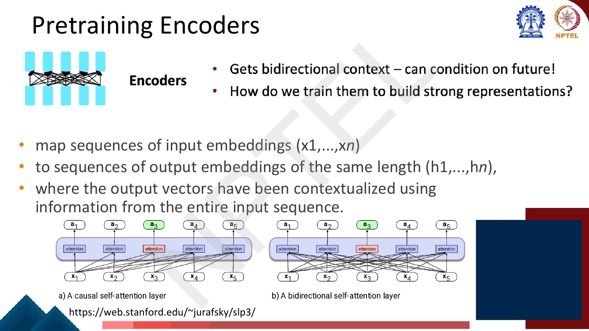
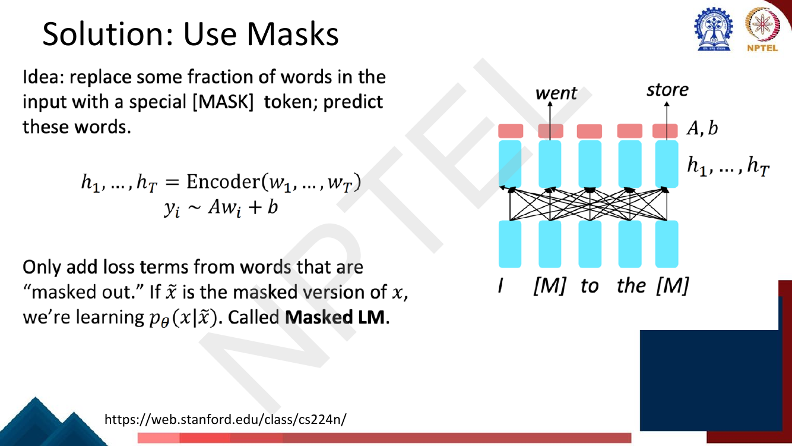
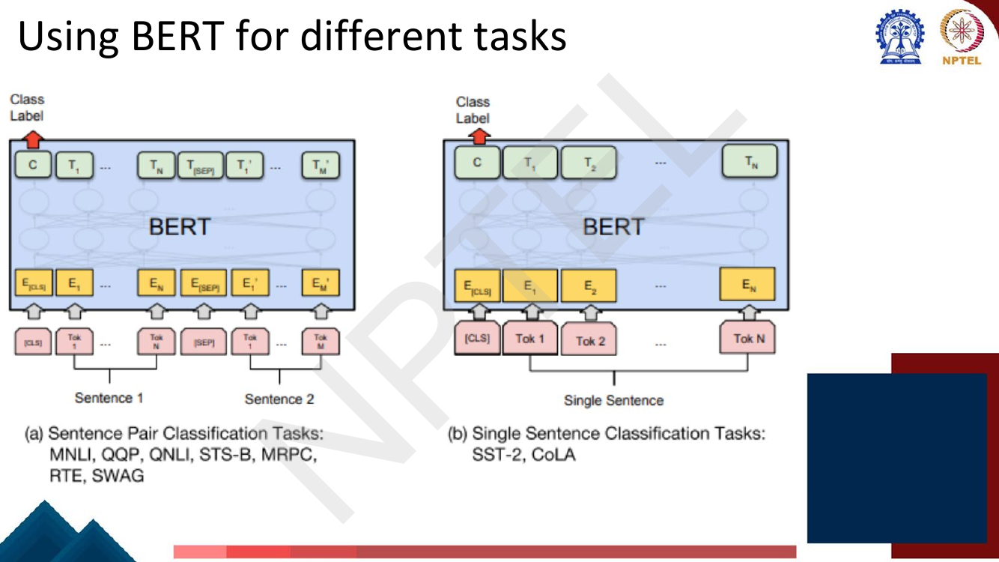
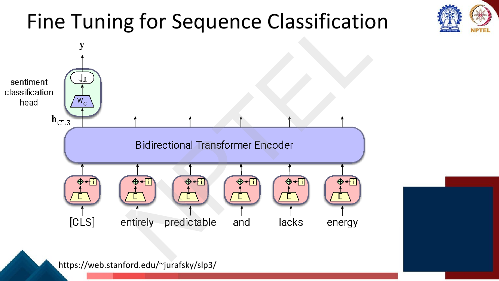
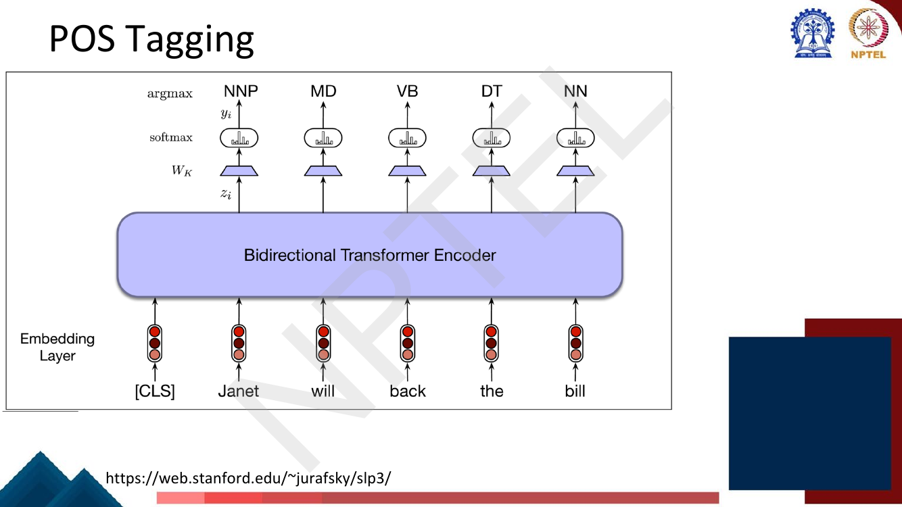

# Lec 27 — BERT and Masked Language Modelling

> **Source:** `Week6.pdf` pp. 30–58 · **Week 6** · **Playlist:** Lec 27
> **Prereqs:** [Lec 26 — Pretraining and ELMo](26-pretraining-and-elmo.md), [Lec 23 — Positional Encoding and the Encoder](../week-05/23-positional-encoding-and-encoder.md)
> **Feeds into:** [Lec 28 — Span Tasks, T5 and BART](28-span-tasks-t5-bart.md), [Lec 31 — Question Answering I](../week-07/31-question-answering-1.md)

## Why this lecture exists

Lecture 26 ended with a taxonomy and a problem. Encoders give you bidirectional context — every
position sees every other position — and that is exactly what you want for understanding tasks. But
the only self-supervised objective you have met so far is next-word prediction, and you cannot train
an encoder that way. A bidirectional encoder predicting $w_t$ already has $w_t$ in its input; the
loss would go to zero through a one-hop copy and the model would learn nothing. The lecture's one-word
answer is on the slide title: **masks**. Hide some of the input, predict what you hid, and suddenly
bidirectional conditioning becomes a legitimate training signal. That objective is **masked language
modelling**, the model built on it is **BERT**, and the pretrain-once-fine-tune-many-times recipe that
follows is the single most examined idea in this course.

## The ideas

### Why you cannot pretrain an encoder with a language model

The deck opens by replaying the three-architecture taxonomy from
[Lec 26](26-pretraining-and-elmo.md) (page 32) — and the encoder row is the only one carrying a
question rather than an answer. Decoders already have an objective ("Language models! What we've seen
so far"); encoders get *"How do we train them to build strong representations?"* That unanswered
question is this entire lecture.

Make the obstruction precise. A Transformer encoder maps input embeddings
$(\mathbf{x}_1,\ldots,\mathbf{x}_T)$ to output embeddings $(\mathbf{h}_1,\ldots,\mathbf{h}_T)$ of the
same length, where each $\mathbf{h}_t$ has been contextualised using the **entire** input sequence —
left and right. In a decoder, self-attention is causal: position $t$ attends only to $1\ldots t$, so
asking it to predict $w_{t+1}$ is a real prediction. In an encoder, self-attention is bidirectional:
position $t$ attends to all of $1\ldots T$ including itself. Asking it to predict $w_t$ is asking it
to copy its own input. The deck shows the two attention patterns side by side.


*Fig. — Panel (b) is why next-word prediction is unusable here: $\mathbf{a}_3$ already sees $\mathbf{x}_4$ and $\mathbf{x}_5$. Information leaks from the answer to the question. Page 33.*

### Masked language modelling

The fix: **corrupt the input**. Replace some fraction of the tokens with a special `[MASK]` token, run
the bidirectional encoder over the corrupted sequence, and predict the original tokens at exactly
those positions. The model may look at the whole sequence because the thing it is predicting is no
longer in the sequence.


*Fig. — The deck's own statement of the objective, with the toy example "I [M] to the [M]" predicting "went" and "store". Note the restriction: **only masked positions contribute loss terms**. Page 34.*

Write $\tilde{\mathbf{x}}$ for the masked version of the sequence $\mathbf{x}$ and $M$ for the set of
masked positions. The encoder produces $\mathbf{h}_t \in \mathbb{R}^{d_h}$, a shared output matrix
$\mathbf{W}_V \in \mathbb{R}^{|V| \times d_h}$ projects it to vocabulary logits, and a softmax turns
those into a distribution:

$$\mathbf{y}_t = \operatorname{softmax}(\mathbf{W}_V \mathbf{h}_t), \qquad \mathbf{W}_V \in \mathbb{R}^{|V| \times d_h},\; \mathbf{h}_t \in \mathbb{R}^{d_h}$$

The loss is ordinary cross-entropy, summed over masked positions only:

$$\mathcal{L}_{\text{MLM}} = -\sum_{t \in M} \log p_\theta(w_t \mid \tilde{\mathbf{x}}) = -\sum_{t \in M} \log y_{t,\,w_t}$$

Two consequences follow immediately and both are examinable.

- **Only about 15% of positions produce gradient per sentence.** An autoregressive LM gets a loss term
  at every one of the $T$ positions; MLM gets one at $|M| \approx 0.15T$. MLM is therefore *less
  sample-efficient per token of text* — one reason BERT needed so much compute. The upside is that
  each of those predictions is conditioned on far richer context.
- **You cannot generate from BERT by running it forward.** It is not a distribution over sequences;
  it is a denoiser. [Lec 29](29-gpt-decoder-pretraining.md) covers the decoder-only models you *can*
  generate from.


*Fig. — Three positions are being predicted from "So [mask] and [mask] for all apricot fish": the two `[mask]`s recover "long" and "thanks", and the un-replaced word **apricot** is predicted as "the". That third case is the 10%-random bucket in action — the model must detect and repair a corruption it was not told about. Page 36.*

#### Bidirectional, and why ELMo was not

State the contrast explicitly, because it is the most likely single MCQ on this chapter.
[ELMo](26-pretraining-and-elmo.md) trains a **forward** LM and a **backward** LM separately and
**concatenates** their hidden states. Each of the two directions, during training, is strictly
unidirectional: the forward LSTM predicting $w_t$ has never seen $w_{t+1}$, and the backward LSTM has
never seen $w_{t-1}$. The joint representation is bidirectional only at *read-out* time; neither
network ever learned a feature that depends on both sides at once. MLM is **deeply bidirectional**:
every layer of the single network conditions on both sides simultaneously, so it can learn features
like "this slot is a verb whose subject is on the left and whose object is on the right". Shallow
concatenation of two unidirectional models $\neq$ joint bidirectional conditioning.

#### The 15% / 80-10-10 recipe, and why


*Fig. — The whole recipe on one slide, with the diagram showing all three treatments at once: "pizza" is `[Replaced]`, "to" is `[Not replaced]` but still predicted, and the last token is `[Masked]`. Memorise 15 / 80 / 10 / 10. Page 35.*

The procedure, exactly:

1. Select a random **15%** of the (sub)word tokens as prediction targets.
2. Of those selected tokens: **80%** are replaced by `[MASK]`; **10%** are replaced by a *random*
   token from the vocabulary; **10%** are **left unchanged**.
3. All 15% — including the untouched ones — contribute a loss term.

The *why* is the examinable part, and it has two halves.

**Half one: the train/test mismatch.** `[MASK]` is an artefact of pretraining. It never appears in any
downstream input — the deck's parenthetical is "(No masks are seen at fine-tuning time!)". If 100% of
the targets were `[MASK]`, the model would only ever learn to produce good representations at
positions carrying a token it will never see again. The 10% random and 10% unchanged cases put real
tokens at prediction positions during pretraining too, so the distribution the encoder is trained on
overlaps the distribution it is deployed on.

**Half two: forcing representations of *every* token.** This is the deck's own phrasing — the split
"doesn't let the model get complacent and not build strong representations of non-masked words". If
`[MASK]` were a perfect flag, the model could learn the shortcut *"if I see `[MASK]`, do the hard work;
otherwise just copy my input forward"* — because only masked positions are ever scored. The 10%
unchanged case breaks that shortcut: a position holding an ordinary word might still be scored, so the
model must maintain a predictive, context-derived representation at *every* position. The 10% random
case goes further: it injects noise the model is not told about, so the encoder must keep enough
contextual evidence to overrule a wrong input token. That is what makes a BERT representation of an
unmasked word useful at all — and the entire fine-tuning story depends on it.

Multiply the rates through to get the per-token picture: any given token is turned into `[MASK]` with
probability $0.15 \times 0.80 = \mathbf{12\%}$, corrupted to a random token with probability
$0.15 \times 0.10 = \mathbf{1.5\%}$, and left alone but scored with probability $\mathbf{1.5\%}$. 85%
of tokens are untouched and unscored.

### BERT: the model

**BERT** — **B**idirectional **E**ncoder **R**epresentations from **T**ransformers (Devlin et al.,
2018). The architecture is nothing new: it is the Transformer **encoder** stack from
[Lec 23](../week-05/23-positional-encoding-and-encoder.md), unchanged. What Devlin et al. contributed
was the MLM objective and — the slide bolds this — **releasing the weights of a pretrained
Transformer**. That release is why the field changed in 2018.


*Fig. — Every number on this slide is MCQ bait. Note that the layer counts double but the parameter count roughly triples, because width grows too. "Pretrain once, finetune many times." Page 40.*

| | BERT-base | BERT-large |
|---|---|---|
| Layers $L$ | 12 | 24 |
| Hidden size $d_h$ | 768 | 1024 |
| Attention heads $h$ | 12 | 16 |
| Parameters | 110 M | 340 M |

Pretraining corpus: **BooksCorpus (800 M words)** + **English Wikipedia (2,500 M words)** ≈ 3.3 B
words. Pretraining cost: **64 TPU chips for 4 days**. Fine-tuning: practical on one GPU in minutes to
hours. That asymmetry is the whole economic argument for the paradigm.

#### Input representation and the special tokens

A BERT input embedding is the **sum of three** embeddings at each position:

$$\mathbf{x}_t = \mathbf{e}^{\text{token}}_t + \mathbf{e}^{\text{segment}}_t + \mathbf{e}^{\text{position}}_t$$

- **Token embedding** — WordPiece subword units ([Lec 2](../week-01/02-text-processing-tokenization.md)),
  vocabulary $\approx$ 30,522.
- **Segment embedding** — one of two learned vectors, `[1st segment]` / `[2nd segment]`, marking which
  of the two input sentences this token belongs to.
- **Position embedding** — **learned**, not sinusoidal, with 512 slots. The 512 cap is a hard
  architectural limit: BERT cannot read an input longer than 512 tokens.

Two special tokens, both added to the vocabulary:

- **`[CLS]`** is prepended to *every* input sequence, during pretraining **and** during fine-tuning.
  Its final-layer output $\mathbf{h}^L_{\texttt{[CLS]}}$ is the model's summary of the whole input.
- **`[SEP]`** is placed **between** the two sentences **and also after the second sentence**. Both
  occurrences, not one — a favourite token-counting trap.

### Next Sentence Prediction

BERT's second pretraining objective. Given two sentences, predict whether they are a genuine adjacent
pair from the corpus (`IsNext`) or a random pair (`NotNext`). Training data is constructed **50% true
adjacent pairs, 50% random second sentences** — balanced by design, so a trivial majority classifier
scores 50%.


*Fig. — Read the embedding stacks: three circles per token now (token + segment + position), with segment ids `s1 s1 s1 s1 s1 | s2 s2 s2 s2`. Note that the first `[SEP]` carries segment `s1`, and the trailing `[SEP]` carries `s2`. Page 38.*

The head is one matrix. With $C = \mathbf{h}^L_{\texttt{[CLS]}} \in \mathbb{R}^{d_h}$ and
$\mathbf{W}_{\text{NSP}} \in \mathbb{R}^{2 \times d_h}$:

$$\mathbf{y} = \operatorname{softmax}(\mathbf{W}_{\text{NSP}}\, C)$$

trained with cross-entropy against the binary label. MLM and NSP losses are summed and optimised
jointly.

**Why NSP at all?** The deck devotes a page (39) to the motivation: masking focuses on predicting
words from surrounding contexts, so it produces good **word-level** representations — but nothing in
it forces a **sentence-pair-level** one. Many applications need exactly that relationship, and the
slide names three: *paraphrase detection* (do two sentences mean the same thing), *entailment* (does
one sentence's meaning follow from or contradict the other's), and *discourse coherence* (do two
neighbouring sentences form a coherent discourse). Those are precisely the pairwise tasks later in the
deck.

**The later finding:** NSP turned out to contribute very little. RoBERTa (2019) removed it entirely and
trained on longer contiguous spans instead, and scored *better* across the board. The usual diagnosis
is that NSP is too easy — distinguishing a random sentence from the next one is mostly **topic**
detection, solvable from vocabulary overlap alone, so it never forces real discourse reasoning. ALBERT
replaced it with sentence-**order** prediction, which removes the topic shortcut. Both models belong
to [Lec 28](28-span-tasks-t5-bart.md); what you must hold here is: *NSP was one of BERT's two original
objectives, and it was later shown to be largely unnecessary.*

### Static vs contextual embeddings

This is the payoff of Week 3. A BERT run gives you one output vector per token per layer, so
$\mathbf{h}^L_t$ is a representation of **this occurrence of this word in this sentence**.


*Fig. — Every blue dot is one *occurrence* of "die". They separate into four clusters with no sense inventory supplied — the German article, two senses of the English verb, and the noun. A word2vec vector for "die" would be a single point, the average of all four. Page 42.*

| | Static ([Lec 11](../week-03/11-word-representation.md)–[14](../week-03/14-fasttext-and-beyond-words.md)) | Contextual (BERT) |
|---|---|---|
| Represents | word **types** — dictionary entries | word **instances** — one per occurrence |
| Count for a corpus | one vector per vocabulary entry | one vector per token position per layer |
| Polysemy | all senses collapsed into one average vector | senses separate automatically |
| Source | a lookup table | the output of a deep encoder run on the sentence |
| Needs the sentence? | no | yes — there is no vector without a context |
| Examples | word2vec, GloVe, fastText | ELMo, BERT |

Page 41 draws where these come from: the stack of encoder layers, with $\mathbf{h}^L_t$ at the top of
each token's column — $\mathbf{h}^L_4$ circled as the contextual embedding of "thanks" *in this
sentence*. That superscript-$L$, subscript-$t$ notation is the deck's throughout.

#### Which layer do you take?

Nothing says the *last* layer is the best feature. Every layer's output along a token's path is a
candidate, which raises the deck's question: "But which one should we use?" It then answers it
empirically, on CoNLL-2003 NER.


*Fig. — Learn this ordering. The **concatenation of the last four hidden layers wins at 96.1**; the embedding (first) layer is much the worst at 91.0; and the *last* layer alone (94.9) is beaten by the *second-to-last* (95.6). Page 44.*

| Extraction | Dev F1 |
|---|---|
| First layer (the embeddings) | 91.0 |
| Last hidden layer | 94.9 |
| Sum of all 12 layers | 95.5 |
| Second-to-last hidden layer | 95.6 |
| Sum of last four hidden | 95.9 |
| **Concat of last four hidden** | **96.1** |

Two readings. Concatenating four 768-dim layers gives a 3072-dim feature, so some of the gain is
simply dimensionality. More interesting is that the *final* layer underperforms its neighbour: the top
layer has been specialised by the MLM objective toward predicting vocabulary items, so it is slightly
over-fitted to pretraining and slightly less general as a feature. The probing results in
[Lec 56](../week-12/56-interpretability-probing.md) develop this.

### Fine-tuning: transfer learning

The deck's framing (page 47): a pretrained LM extracts generalisations from large amounts of text; to
make practical use of them you create an *interface* to a downstream application by adding a **small
set of application-specific parameters** and training them on that application's labelled data; and
this training will "either freeze or make only minimal adjustments to the pretrained language model
parameters". In practice BERT fine-tuning does update the whole body — but at a learning rate roughly
100× smaller than pretraining's, which is what "minimal adjustments" means.

The recipe is always the same three steps: take the pretrained encoder; **add a task head** (usually
one linear layer); train end to end on a small labelled set with a small learning rate (2e-5 to 5e-5,
2–4 epochs is the standard setting). The head is the only thing initialised randomly.


*Fig. — The first half of the four-panel figure from the BERT paper. Both classification variants read the label off the same place: the `[CLS]` output, drawn here as $C$. The only difference is what goes into the input. Page 45.*

#### Sequence classification — the `[CLS]` head

With RNNs you took the final hidden state to stand for the whole sequence
([Lec 17](../week-04/17-rnn-applications.md)). In BERT, `[CLS]` plays that role — and it is a better
choice, because with bidirectional attention there is no privileged "last" position, whereas `[CLS]`
is a position reserved for exactly this job and pretrained for it by NSP.

Let $C = \mathbf{h}^L_{\texttt{[CLS]}} \in \mathbb{R}^{d_h}$. The head is a single matrix
$\mathbf{W}_C \in \mathbb{R}^{K \times d_h}$ for $K$ labels:

$$\mathbf{y} = \operatorname{softmax}(\mathbf{W}_C\, C)$$

The deck is explicit: **the only new parameters introduced during fine-tuning are $\mathbf{W}_C$.** For
binary sentiment on BERT-base that is $2 \times 768 = 1536$ weights sitting on top of 110 M pretrained
ones.


*Fig. — Only the `[CLS]` column is read; the other output vectors are computed but unused for this task. The head is one trapezoid. Page 50.*

#### Pairwise sequence classification

Tasks whose input is **two** sentences: natural language inference, paraphrase detection, semantic
similarity. The deck's example is **MultiNLI**, where a (premise, hypothesis) pair gets one of
**three** labels: **entails**, **contradicts**, **neutral**. The labels describe how the *first*
sentence (the premise) relates to the *second* (the hypothesis) — the relation is directional, not
symmetric. The deck's examples: *"Jon walked back to the town to the smithy"* / *"Jon traveled back to
his hometown"* is **neutral**; *"Tourist Information offices can be very helpful"* / *"...are never of
any help"* **contradicts**; *"I'm confused"* / *"Not all of it is very clear to me"* **entails** —
note how loose entailment is in practice.

The architecture is unchanged from single-sentence classification. As in NSP, the two inputs are
packed into **one** sequence separated by `[SEP]`, with segment embeddings distinguishing them, and
the `[CLS]` output $C$ feeds a three-way classifier. Nothing about BERT needs modifying — the pairwise
input format was built into pretraining by NSP, which is precisely the claim NSP was meant to earn.

#### Sequence labeling

Now every token gets a label, so you read **every** output vector rather than just `[CLS]`. Each
final-layer vector is passed to a classifier producing a softmax over the tag set, and the one set of
weights $\mathbf{W}_K \in \mathbb{R}^{k \times d_h}$ is **shared across positions** — the same matrix
applied at every token, not one head per position, with $k$ the number of possible tags:

$$\mathbf{y}_t = \operatorname{softmax}(\mathbf{W}_K\, \mathbf{h}^L_t), \qquad \mathbf{W}_K \in \mathbb{R}^{k \times d_h}$$

**POS tagging** is the simple case: $k$ is the tag set (45 for Penn Treebank), the prediction at each
position is $\arg\max$ over tags.


*Fig. — The classic "Janet will back the bill" example. Bidirectionality is doing real work: "back" is VB only because of what follows it. The `[CLS]` column produces no tag. Page 54.*

**NER** uses the **BIO scheme** — `B-TYPE` for the first token of an entity, `I-TYPE` for continuation
tokens, `O` for everything outside; [Lec 17](../week-04/17-rnn-applications.md) owns it in full. The
deck's example sentence is tagged at the **word** level:

```
Mt.     Sanitas   is   in   Sunshine   Canyon   .
B-LOC   I-LOC     O    O    B-LOC      I-LOC    O
```

#### BIO with subwords — the subtle part

Here is the complication the deck gives its own page to. BIO gold data is annotated **per word**. BERT
consumes **WordPiece subwords**. The two sequences have different lengths, so the tags do not line up.


*Fig. — 7 words become 9 subword tokens: "Mt." splits into `Mt` + `.` and "Sanitas" into `San` + `##itas`. The `##` prefix marks a continuation piece. The two rules at the bottom are the examinable content. Page 56.*

The deck gives **two different rules for two different directions**, and confusing them is the trap:

- **Training:** assign the gold-standard tag of a word to **all** of the subword tokens derived from
  it. So `San` → `I-LOC` and `##itas` → `I-LOC` too. Every subword position gets a loss term.
- **Decoding:** read the argmax BIO tag of the **first** subword token of each word, and discard the
  predictions on continuation pieces.

Why this asymmetry is sensible: at training time propagating the tag gives you more supervision for
free and keeps the loss dense. At decoding time you need exactly one tag per word, and the continuation
pieces are redundant — so you commit to the first piece, whose representation has seen the whole word
through self-attention anyway.

> **Watch out — a real variant exists.** The common HuggingFace convention labels **only the first
> subword** and sets continuation labels to `-100` so they are *ignored in the loss*. That is a
> different training rule from the deck's. For this exam, follow the deck: **training propagates the
> tag to all pieces; decoding reads the first piece.** The code block below prints both.

A second subtlety the slide leaves implicit: if you did propagate a `B-` tag to every piece you would
generate `B-LOC B-LOC` for a split entity-initial word, which under strict BIO decoding reads as *two*
entities. That is exactly why decoding looks only at the first piece. The safer variant — first piece
gets `B-`, the rest get `I-` — is not what the deck prints, but it is what most careful
implementations do.

### Where this stops

The second half of the BERT paper's task figure (page 46) holds two more panels. Panel (d) is the
sequence labeling you just saw, on CoNLL-2003 NER. Panel (c) is extractive question answering —
`[CLS] question [SEP] paragraph [SEP]`, with a **start/end span** head over the paragraph tokens on
SQuAD v1.1. That head, SQuAD, the GLUE benchmark behind the task names on page 45
(MNLI/QQP/QNLI/STS-B/MRPC/RTE/SWAG/SST-2/CoLA), the BERT family (RoBERTa, ALBERT) and the
encoder-decoder pretrained models T5 and BART all belong to [Lec 28](28-span-tasks-t5-bart.md).

## Worked numericals

**On the exercise sweep:** the re-swept exercise table lists `Week6.pdf` page 34 for this lecture. It
is a **false positive** — page 34 is the teaching slide titled *"Solution: Use Masks"*, matched by the
sweep's "Solution" keyword. I opened all 29 pages (30–58) individually; **this deck contains no
exercise pages at all**, titled or untitled, and no handwritten solutions. All five numericals below
are mine, built on the deck's own numbers.

### N1. Applying the 80/10/10 recipe by hand
**Given:** a sentence of 20 WordPiece tokens (ignore `[CLS]`/`[SEP]`). The BERT masking recipe.
**Find:** how many tokens are selected, and how many land in each bucket.

1. Selection rate 15%: $0.15 \times 20 = 3.0$ tokens selected for prediction.
2. Of those 3 selected tokens, the split is 80 / 10 / 10:
   - `[MASK]`: $0.80 \times 3 = 2.4$
   - random token: $0.10 \times 3 = 0.3$
   - unchanged: $0.10 \times 3 = 0.3$
3. These are **expectations**, not counts — you cannot mask 2.4 tokens. In any single sentence you
   draw the bucket per selected token, so a typical realisation is 3 `[MASK]`s, or 2 `[MASK]`s and 1
   random, etc. Over many sentences the averages converge to 2.4 / 0.3 / 0.3.
4. Scale up to see the recipe cleanly: a 1,000-token batch gives $0.15 \times 1000 = 150$ selected,
   splitting as $120$ `[MASK]`, $15$ random, $15$ unchanged.
5. Unconditional per-token rates: $P(\texttt{[MASK]}) = 0.15 \times 0.80 = 0.12$;
   $P(\text{random}) = 0.15 \times 0.10 = 0.015$; $P(\text{unchanged but scored}) = 0.015$;
   $P(\text{untouched and unscored}) = 0.85$. Check: $0.12 + 0.015 + 0.015 + 0.85 = 1.000$ ✓

**Answer:** 3 tokens selected; expected 2.4 `[MASK]` / 0.3 random / 0.3 unchanged. Per 1,000 tokens:
150 selected → **120 / 15 / 15**. Only **12%** of all tokens ever become `[MASK]`.

### N2. BERT-base parameter count, built up from parts
**Given:** $|V| = 30{,}522$ WordPiece tokens, $d_h = 768$, $L = 12$ layers, $h = 12$ heads, FFN inner
size $d_{\text{ff}} = 4d_h = 3072$, 512 learned positions, 2 segment types. Biases included; the
pooler is the extra $d_h \times d_h$ layer BERT applies to `[CLS]`.
**Find:** the total parameter count, and confirm the slide's "110 million".

1. **Embeddings.**
   - Token: $30{,}522 \times 768 = 23{,}440{,}896$
   - Position: $512 \times 768 = 393{,}216$
   - Segment: $2 \times 768 = 1{,}536$
   - LayerNorm (scale + shift): $2 \times 768 = 1{,}536$
   - Subtotal: $\mathbf{23{,}837{,}184}$
2. **One encoder layer.** (All $h=12$ heads together use one $d_h \times d_h$ matrix each for
   $\mathbf{Q},\mathbf{K},\mathbf{V}$ — see [Lec 22](../week-05/22-self-attention-and-multihead.md).)
   - $\mathbf{Q},\mathbf{K},\mathbf{V}$: $3 \times (768 \times 768 + 768) = 3 \times 590{,}592 = 1{,}771{,}776$
   - Attention output projection: $768 \times 768 + 768 = 590{,}592$
   - LayerNorm: $1{,}536$
   - FFN up: $768 \times 3072 + 3072 = 2{,}362{,}368$
   - FFN down: $3072 \times 768 + 768 = 2{,}360{,}064$
   - LayerNorm: $1{,}536$
   - Per layer: $\mathbf{7{,}087{,}872}$
3. **All 12 layers:** $12 \times 7{,}087{,}872 = 85{,}054{,}464$.
4. **Pooler:** $768 \times 768 + 768 = 590{,}592$.
5. **Total:** $23{,}837{,}184 + 85{,}054{,}464 + 590{,}592 = \mathbf{109{,}482{,}240}$.

**Answer:** **109.5 M ≈ 110 M**, matching page 40. Note the shape of the breakdown: the embedding table
is **22%** of the model, and a single layer is only 6.5%. The MLM output matrix $\mathbf{W}_V$ is
usually **tied** to the token embedding matrix, which is why it does not appear again.

*Same arithmetic for BERT-large* ($d_h = 1024$, $L = 24$, $d_{\text{ff}} = 4096$): embeddings
$31{,}782{,}912$ + layers $24 \times 12{,}596{,}224 = 302{,}309{,}376$ + pooler $1{,}049{,}600$ =
$\mathbf{335{,}141{,}888} \approx$ **335 M**, which the slide rounds to 340 M.

### N3. MLM cross-entropy loss at one masked position
**Given:** at a masked position the true word is `sat`. The head produces logits over a toy vocabulary
$\{\texttt{sat}, \texttt{ran}, \texttt{ate}, \texttt{slept}, \texttt{jumped}\} = (2.1,\,0.4,\,-1.0,\,3.3,\,0.9)$.
**Find:** the softmax, the loss at this position, and the loss if three positions are masked with
per-position losses $1.579$, $0.402$, $2.915$.

1. Exponentiate (subtracting the max 3.3 for stability — the result is identical):
   $e^{-1.2} = 0.3012$, $e^{-2.9} = 0.0550$, $e^{-4.3} = 0.0136$, $e^{0} = 1.0$, $e^{-2.4} = 0.0907$.
2. Sum $= 0.3012 + 0.0550 + 0.0136 + 1.0 + 0.0907 = 1.4605$.
3. $p(\texttt{sat}) = 0.3012 / 1.4605 = 0.2062$. (Also $p(\texttt{slept}) = 0.6847$ — the model's
   argmax is *wrong* here.)
4. $\mathcal{L}_t = -\log p(\texttt{sat}) = -\log 0.2062 = \mathbf{1.5788}$ nats.
5. Sentence-level MLM loss, averaged over the $|M| = 3$ masked positions:
   $(1.579 + 0.402 + 2.915)/3 = 4.896/3 = \mathbf{1.632}$ nats.
6. Sanity bounds: a uniform model over 5 words would score $-\log(1/5) = 1.609$. At 1.579 this
   prediction is barely better than guessing — exactly what you expect early in training.

**Answer:** $p(\texttt{sat}) = 0.2062$, $\mathcal{L}_t = 1.579$ nats, mean MLM loss $= 1.632$ nats.
Unmasked positions contribute **nothing**.

### N4. BIO tagging a sentence whose entity is split by WordPiece
**Given:** the deck's sentence (page 56), word-level gold tags, and WordPiece output
`'Mt', '.', 'San', '##itas', 'is', 'in', 'Sunshine', 'Canyon', '.'`.
**Find:** the training-time tag sequence over subwords, the decode-time read-off, and the token count.

1. Word-level gold (7 words):

   | Mt. | Sanitas | is | in | Sunshine | Canyon | . |
   |---|---|---|---|---|---|---|
   | B-LOC | I-LOC | O | O | B-LOC | I-LOC | O |

2. WordPiece splits: `Mt.` → `Mt` `.` (2 pieces); `Sanitas` → `San` `##itas` (2 pieces); the other
   five words are single pieces. Total $= 2 + 2 + 1 + 1 + 1 + 1 + 1 = \mathbf{9}$ subword tokens.
3. **Training rule** (deck: copy the word's gold tag to all its pieces):

   | Mt | . | San | ##itas | is | in | Sunshine | Canyon | . |
   |---|---|---|---|---|---|---|---|---|
   | B-LOC | B-LOC | I-LOC | I-LOC | O | O | B-LOC | I-LOC | O |

   9 loss terms.
4. **Decoding rule** — keep only the first piece of each word: positions 1, 3, 5, 6, 7, 8, 9
   (1-indexed), giving `B-LOC I-LOC O O B-LOC I-LOC O` — back to 7 tags, matching the gold sequence
   exactly.
5. Why you must discard position 2: if `.`'s prediction were kept you would read
   `B-LOC B-LOC I-LOC ...`, which decodes as **two** separate LOC entities instead of one.
6. Full BERT input length: $1_{\texttt{[CLS]}} + 9 + 1_{\texttt{[SEP]}} = \mathbf{11}$ positions.

**Answer:** 7 words → 9 subwords → 9 training tags → 7 decoded tags. The first-subword rule is what
restores the alignment.

### N5. `[CLS]`/`[SEP]` accounting and the 512-token limit
**Given:** a sentence-pair input. Sentence A tokenises to 180 WordPiece tokens, sentence B to 325.
BERT's maximum sequence length is 512.
**Find:** the total input length, whether it fits, and the longest pair that does.

1. The format is `[CLS] A [SEP] B [SEP]` — **three** special tokens, because `[SEP]` appears both
   between the sentences and after the second.
2. Total $= 1 + 180 + 1 + 325 + 1 = \mathbf{508}$ tokens.
3. $508 \le 512$, so it **fits**, with 4 positions to spare.
4. Budget for content: $512 - 3 = \mathbf{509}$ content tokens maximum for a pair.
5. For a **single**-sentence input the format is `[CLS] A [SEP]` — two special tokens — so the budget
   is $512 - 2 = \mathbf{510}$.
6. If B had been 330 tokens: $1 + 180 + 1 + 330 + 1 = 513 > 512$, so you must truncate by at least 1
   token (standard practice: truncate the longer sequence, one token at a time, until it fits).
7. Segment ids: `[CLS]` and the first `[SEP]` belong to segment 0 along with A — $1 + 180 + 1 = 182$
   positions of segment 0 — and B plus the final `[SEP]` are segment 1: $325 + 1 = 326$. Check
   $182 + 326 = 508$ ✓

**Answer:** **508 tokens — it fits.** Maximum content for a pair is **509**; for a single sentence,
**510**. The 512 cap is architectural: it is the number of rows in the learned position-embedding
table.

## Code

```python
import numpy as np

rng = np.random.default_rng(27)          # fixed seed -> reproducible output
VOCAB = ["[CLS]", "[SEP]", "[MASK]", "the", "cat", "sat", "on", "mat",
         "dog", "ran", "fast", "pizza", "store", "went", "to"]

def bert_mask(tokens, p_select=0.15, rng=rng):
    """Apply BERT's 15% / 80-10-10 recipe. Returns (corrupted, report)."""
    out, report = list(tokens), []
    for i, tok in enumerate(tokens):
        if tok in ("[CLS]", "[SEP]"):        # special tokens are never masked
            continue
        if rng.random() >= p_select:         # not among the 15%
            continue
        r = rng.random()
        if r < 0.80:
            out[i], how = "[MASK]", "MASK   (80%)"
        elif r < 0.90:
            out[i], how = VOCAB[rng.integers(3, len(VOCAB))], "RANDOM (10%)"
        else:
            how = "KEEP   (10%)"             # unchanged, but still predicted
        report.append((i, tok, out[i], how))
    return out, report

sent = "[CLS] the cat sat on the mat and the dog ran very fast to the store [SEP]".split()
corrupt, rep = bert_mask(sent)
print("original :", " ".join(sent))
print("corrupted:", " ".join(corrupt))
print(f"{len(sent)} tokens, {len(rep)} selected for prediction "
      f"({len(rep)/len(sent):.0%})")
for i, gold, new, how in rep:
    print(f"  pos {i:2d}  {gold:>6} -> {new:<8} {how}   loss computed here")

# --- the three buckets converge to 80/10/10 over many draws ---------------
from collections import Counter
c = Counter()
for _ in range(20000):
    _, r = bert_mask(sent)
    c.update(h.split()[0] for _, _, _, h in r)
tot = sum(c.values())
print("\nempirical split over 20k sentences:",
      {k: f"{v/tot:.3f}" for k, v in sorted(c.items())})

# --- MLM cross-entropy at one masked position (matches N3) ---------------
logits = np.array([2.1, 0.4, -1.0, 3.3, 0.9])          # 5-word toy vocabulary
words  = ["sat", "ran", "ate", "slept", "jumped"]
p = np.exp(logits - logits.max()); p /= p.sum()
gold = 0                                               # true word is "sat"
print("\nsoftmax:", {w: round(float(x), 4) for w, x in zip(words, p)})
print(f"MLM loss at this position = -log p(sat) = {-np.log(p[gold]):.4f} nats")

# --- subword BIO alignment (the deck's Mt. Sanitas example, N4) ----------
def align_bio(words, tags, pieces_of):
    """Deck's TRAINING rule: copy the word's gold tag onto every subword."""
    sub_toks, sub_tags, first = [], [], []
    for w, t in zip(words, tags):
        ps = pieces_of[w]
        first += [True] + [False] * (len(ps) - 1)
        sub_toks += ps
        sub_tags += [t] * len(ps)
    return sub_toks, sub_tags, first

words = ["Mt.", "Sanitas", "is", "in", "Sunshine", "Canyon", "."]
tags  = ["B-LOC", "I-LOC", "O", "O", "B-LOC", "I-LOC", "O"]
pieces = {"Mt.": ["Mt", "."], "Sanitas": ["San", "##itas"], "is": ["is"],
          "in": ["in"], "Sunshine": ["Sunshine"], "Canyon": ["Canyon"],
          ".": ["."]}
st, sg, first = align_bio(words, tags, pieces)
print(f"\n{len(words)} words -> {len(st)} subword tokens")
for tok, tag, f in zip(st, sg, first):
    print(f"  {tok:<9} {tag:<6} {'<- first piece (read tag here at decoding)' if f else ''}")
# HuggingFace variant: ignore continuation pieces in the loss
hf = [t if f else "-100" for t, f in zip(sg, first)]
print("  loss mask (HF style):", hf)
```

Real printed output:

```
original : [CLS] the cat sat on the mat and the dog ran very fast to the store [SEP]
corrupted: [CLS] the cat [MASK] on the [MASK] and the dog ran very fast to the store [SEP]
17 tokens, 2 selected for prediction (12%)
  pos  3     sat -> [MASK]   MASK   (80%)   loss computed here
  pos  6     mat -> [MASK]   MASK   (80%)   loss computed here

empirical split over 20k sentences: {'KEEP': '0.102', 'MASK': '0.799', 'RANDOM': '0.099'}

softmax: {'sat': 0.2062, 'ran': 0.0377, 'ate': 0.0093, 'slept': 0.6847, 'jumped': 0.0621}
MLM loss at this position = -log p(sat) = 1.5788 nats

7 words -> 9 subword tokens
  Mt        B-LOC  <- first piece (read tag here at decoding)
  .         B-LOC
  San       I-LOC  <- first piece (read tag here at decoding)
  ##itas    I-LOC
  is        O      <- first piece (read tag here at decoding)
  in        O      <- first piece (read tag here at decoding)
  Sunshine  B-LOC  <- first piece (read tag here at decoding)
  Canyon    I-LOC  <- first piece (read tag here at decoding)
  .         O      <- first piece (read tag here at decoding)
  loss mask (HF style): ['B-LOC', '-100', 'I-LOC', '-100', 'O', 'O', 'B-LOC', 'I-LOC', 'O']
```

Two things worth reading off the output. First, this draw selected 2 of 15 maskable tokens — 13%, not
exactly 15% — because the recipe is a *per-token coin flip*, not a fixed quota; the 20,000-sentence
average confirms the 0.799 / 0.099 / 0.102 split. Second, the last two printed lines are the whole
subword-BIO question: the deck's rule fills in `B-LOC` on the `.` piece, the HuggingFace rule writes
`-100` there so it contributes no loss, and **both** read the final answer off the first piece.

## Exam pack

### Must-memorise

| Item | Exactly this |
|---|---|
| Why not next-word prediction for an encoder | bidirectional self-attention means position $t$ already sees $w_t$ — the model would trivially copy |
| MLM objective | $\mathcal{L}_{\text{MLM}} = -\sum_{t \in M} \log p_\theta(w_t \mid \tilde{\mathbf{x}})$, $\tilde{\mathbf{x}}$ = masked input, $M$ = masked positions |
| MLM output layer | $\mathbf{y}_t = \operatorname{softmax}(\mathbf{W}_V \mathbf{h}_t)$, $\mathbf{W}_V \in \mathbb{R}^{\lvert V\rvert \times d_h}$ |
| Loss comes from | **masked positions only** |
| Selection rate | **15%** of (sub)word tokens |
| The split | **80%** → `[MASK]`, **10%** → random token, **10%** → unchanged (still predicted) |
| Why the split | `[MASK]` is never seen at fine-tuning time (train/test mismatch); and it forces strong representations of *non*-masked tokens too |
| BERT stands for | **B**idirectional **E**ncoder **R**epresentations from **T**ransformers |
| BERT vs ELMo | BERT is **deeply** bidirectional (one network, both directions at every layer); ELMo **concatenates two independent unidirectional** LMs |
| Input embedding | token + **segment** + position, summed; positions are **learned**, not sinusoidal |
| `[CLS]` | prepended to every sequence; its final-layer output is the sequence representation |
| `[SEP]` | **between** the two sentences **and after** the second |
| NSP data | **50%** true adjacent pairs, **50%** random second sentence |
| NSP head | $\mathbf{y} = \operatorname{softmax}(\mathbf{W}_{\text{NSP}} C)$, $\mathbf{W}_{\text{NSP}} \in \mathbb{R}^{2 \times d_h}$ |
| NSP later verdict | contributes little; **RoBERTa dropped it** |
| Static vs contextual | static = word **types** (dictionary entries); contextual = word **instances** (one per occurrence) |
| Classification head | $\mathbf{y} = \operatorname{softmax}(\mathbf{W}_C C)$, $\mathbf{W}_C \in \mathbb{R}^{K \times d_h}$ — the only new parameters |
| Sequence-labeling head | $\mathbf{y}_t = \operatorname{softmax}(\mathbf{W}_K \mathbf{h}^L_t)$, $\mathbf{W}_K \in \mathbb{R}^{k \times d_h}$, $k$ = tag count |
| Subword BIO — training | copy the word's gold tag to **all** its subword pieces |
| Subword BIO — decoding | take the argmax tag of the **first** subword piece |
| Best feature extraction (CoNLL NER) | **concat of last four hidden layers**, 96.1 F1 |

### Numbers worth knowing

| Quantity | Value |
|---|---|
| BERT-base | 12 layers, $d_h = 768$, 12 heads, **110 M** params |
| BERT-large | 24 layers, $d_h = 1024$, 16 heads, **340 M** params |
| Masking rate / split | 15% ; 80 / 10 / 10 |
| Unconditional `[MASK]` rate | 12% of all tokens |
| BooksCorpus | 800 million words |
| English Wikipedia | 2,500 million words |
| Pretraining compute | 64 TPU chips × 4 days |
| Max sequence length | **512** tokens (learned position embeddings) |
| WordPiece vocabulary | ≈ 30,522 |
| Segment embeddings | 2 |
| BERT paper | Devlin et al., **2018** |
| MultiNLI labels | 3 — entails / contradicts / neutral |
| NER layer-choice F1 | first 91.0 · last 94.9 · sum-all-12 95.5 · second-to-last 95.6 · sum-last-4 95.9 · **concat-last-4 96.1** |
| Computed BERT-base total | 109,482,240 ≈ 109.5 M |
| Computed BERT-large total | 335,141,888 ≈ 335 M |

### Likely MCQ traps

- **"BERT is bidirectional in the same sense as ELMo."** No. ELMo trains two separate unidirectional
  LMs and concatenates; neither ever conditions on both sides. BERT conditions on both sides at every
  layer of one network. This is the distinction the BERT paper was named for.
- **"MLM computes loss at every position."** No — only at the 15% selected positions. Unmasked,
  unselected positions produce output vectors but no loss term.
- **"15% of tokens get replaced by `[MASK]`."** No. 15% are *selected*; only 80% of those become
  `[MASK]`, so **12%** of all tokens. A classic two-step arithmetic trap.
- **"The 80/10/10 split exists to add regularising noise."** Partly, but the deck's two stated reasons
  are (i) no `[MASK]` is seen at fine-tuning time, and (ii) it forces good representations of
  non-masked words. Quote those.
- **"BERT can generate text."** No. It is a denoising encoder, not a distribution over sequences. For
  generation see [Lec 29](29-gpt-decoder-pretraining.md).
- **"BERT uses sinusoidal positional encodings."** No — **learned** position embeddings, 512 of them.
  The original Transformer ([Lec 23](../week-05/23-positional-encoding-and-encoder.md)) used
  sinusoids.
- **"The input embedding is token + position."** Three components: token + **segment** + position.
  The segment embedding is what NSP and all pairwise tasks need.
- **"`[SEP]` appears once, between the sentences."** Twice: between, **and** after the second
  sentence. Length arithmetic depends on this.
- **"NSP is still used in modern encoders."** RoBERTa removed it and improved; ALBERT replaced it
  with sentence-order prediction.
- **"NSP is trained on naturally occurring pairs only."** Balanced construction: 50% real next
  sentences, 50% random.
- **"Take the last hidden layer — it must be the best feature."** On CoNLL NER the *second-to-last*
  layer beats the last (95.6 vs 94.9), and concatenating the last four wins (96.1).
- **"BERT-large has 3× the layers of BERT-base."** It has 2× the layers (24 vs 12) and ~3× the
  parameters, because the width also grows 768 → 1024 and heads 12 → 16.
- **"At decoding time, each subword gets its own BIO tag in the output."** You *predict* one per
  subword, but you *read* only the first piece of each word. The output has one tag per word.
- **"At training time, only the first subword is labelled."** That is the HuggingFace convention. The
  **deck's** training rule propagates the word's gold tag to all its pieces.
- **"Fine-tuning retrains BERT from scratch on the task."** It adds a small head and makes minimal
  adjustments to pretrained weights — typically 2–4 epochs at a learning rate ~100× smaller than
  pretraining's.

### Self-test

1. Why can't you train a Transformer encoder with a standard next-word-prediction objective?
2. A 40-token sentence is masked with BERT's recipe. How many tokens are selected, and how many become
   `[MASK]` in expectation?
3. Give the two reasons for the 10%-random / 10%-unchanged part of the recipe.
4. State precisely why BERT's bidirectionality differs from ELMo's.
5. Write the format of a BERT sentence-pair input and count the special tokens.
6. Sentence A is 200 tokens, sentence B is 315. Does the pair fit in BERT? Show the arithmetic.
7. What are the two pretraining objectives of BERT, and which one was later found unnecessary?
8. BERT-base, 5-way sentiment classification. How many *new* parameters does the head introduce
   (ignoring the bias)?
9. "Sanitas" tokenises as `San` + `##itas` and its gold tag is `I-LOC`. Give the training tags and the
   decode-time tag.
10. Which layer combination gave the best CoNLL-2003 NER dev F1 in the deck, and what was the score?

<details><summary>Answers</summary>

1. The encoder's self-attention is bidirectional, so the representation at position $t$ already
   contains $w_t$ (and all later tokens). Predicting $w_t$ from it is a copy, not a prediction, and
   the loss collapses without the model learning anything.
2. $0.15 \times 40 = 6$ selected; $0.80 \times 6 = 4.8$ become `[MASK]` in expectation (0.6 random,
   0.6 unchanged).
3. (i) `[MASK]` never appears at fine-tuning time, so training exclusively on it creates a train/test
   mismatch; (ii) since only selected positions are scored, a pure-`[MASK]` recipe lets the model
   ignore unmasked positions — the random and unchanged cases force a useful representation at
   *every* position.
4. ELMo trains a forward LM and a backward LM independently and concatenates their states, so neither
   network ever conditions on both sides; BERT's single network conditions on left and right
   simultaneously at every layer. Shallow concatenation vs deep joint conditioning.
5. `[CLS] A [SEP] B [SEP]` — three special tokens (`[SEP]` appears twice).
6. $1 + 200 + 1 + 315 + 1 = 518 > 512$. It does **not** fit; truncate at least 6 tokens.
7. Masked language modelling and next sentence prediction. NSP — RoBERTa dropped it and scored better.
8. $\mathbf{W}_C \in \mathbb{R}^{5 \times 768}$, so $5 \times 768 = 3{,}840$ weights.
9. Training: `San` → `I-LOC` and `##itas` → `I-LOC` (the deck copies the tag to all pieces). Decoding:
   read the argmax at `San`, the first piece, and discard `##itas`.
10. Concatenation of the last four hidden layers, **96.1** F1.

</details>

## Beyond the slides

**Gap:** The deck never states the **masking rate is a hyperparameter that was never tuned**, nor that
15% is now known to be suboptimal.
**Why it matters:** Wettig et al. (2023), *Should You Mask 15% in Masked Language Modeling?*, showed
that larger models do better with masking rates of 40% or even higher — more supervision per sentence
outweighs the loss of context. The 15% number is a convention inherited from one 2018 paper, not a
derived optimum. Know the number for the exam; know that it is arbitrary for your own understanding.

**Gap:** No mention of the `[CLS]` **pooler**, which sits between the encoder output and the task head
in the released BERT code.
**Why it matters:** The actual implementation applies a learned $d_h \times d_h$ dense layer plus
$\tanh$ to $\mathbf{h}^L_{\texttt{[CLS]}}$ before the NSP/classification head — that is the 590,592
parameters in N2's step 4, and it is why `BertModel` returns both `last_hidden_state` and
`pooler_output`. It was trained by NSP, so when you drop NSP (RoBERTa) the pooler is vestigial. If you
ever extract sentence embeddings from BERT, `pooler_output` is usually the *wrong* thing to take.

**Gap:** The deck shows the masking recipe but not the **pretrain/fine-tune discrepancy that remains
even so**, nor the independence assumption MLM makes.
**Why it matters:** When several positions are masked in the same sentence, BERT predicts them
*independently* given the shared context — it never models $p(w_i, w_j \mid \tilde{\mathbf{x}})$
jointly. For "New [MASK] [MASK]" the model can put high probability on both "York City" and "Orleans
Saints" at once and produce an incoherent pair. XLNet's permutation LM objective exists precisely to
remove this independence assumption, and it is a reasonable short-answer question.

**Gap:** Nothing is said about **what to do when your text exceeds 512 tokens**.
**Why it matters:** This is the first hard constraint you will actually hit in practice. The options
are truncation (standard, and surprisingly strong), sliding windows with overlap, or an architecture
with a different attention pattern — Longformer and BigBird, covered in
[Lec 25](../week-05/25-efficient-transformers.md). The cause is the 512-row learned position-embedding
table, so you cannot simply feed a longer sequence; there is no embedding for position 513.

## Cut from the slides

Dropped entirely: the title page (30), the "Concepts Covered" page (31), the references page (57) and
the closing "Thank You" page (58) — four of the 29 pages carry no teaching content. Every remaining
page is taught, but the contract caps figures at 12, so eight content pages are covered in prose with
a page citation instead of an embedded image: 32 (the three-architecture taxonomy — owned by
[Lec 26](26-pretraining-and-elmo.md)), 39 (Why NSP), 41 (the encoder-stack picture, which page 36
already shows in more detail), 46 (the QA/tagging panels, whose span half belongs to
[Lec 28](28-span-tasks-t5-bart.md)), 47 (the fine-tuning framing, quoted directly), 51 (MultiNLI, pure
text, quoted directly) and 53 (the sequence-labeling diagram, whose content is the $\mathbf{W}_K$
equation). Pages 48 and 49 are the **same slide twice**, the second adding only the symbols
$C \in \mathbb{R}^{d_h}$ and $\mathbf{W}_C \in \mathbb{R}^{K \times d_h}$ to the third bullet; the
fuller version is taught once and page 50's diagram carries the picture. Page 37's text is reproduced
almost verbatim in the NSP prose, so only page 38's diagram is embedded; page 43 poses the question
page 44 answers, so only 44 is shown; page 55's word-level BIO example is folded into the subword
treatment on page 56. Span-based fine-tuning, GLUE, and the BERT extensions implied by the benchmark
names on page 45 are deliberately **not taught** — they open [Lec 28](28-span-tasks-t5-bart.md). BIO
tagging itself is recalled in one block and linked to
[Lec 17](../week-04/17-rnn-applications.md), which owns it; only the *subword* complication is taught
here. Nothing about MLM, NSP, the architecture, contextual embeddings or fine-tuning was dropped.
