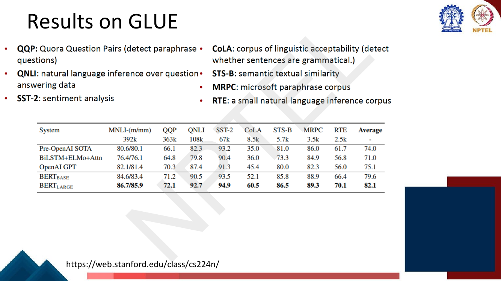
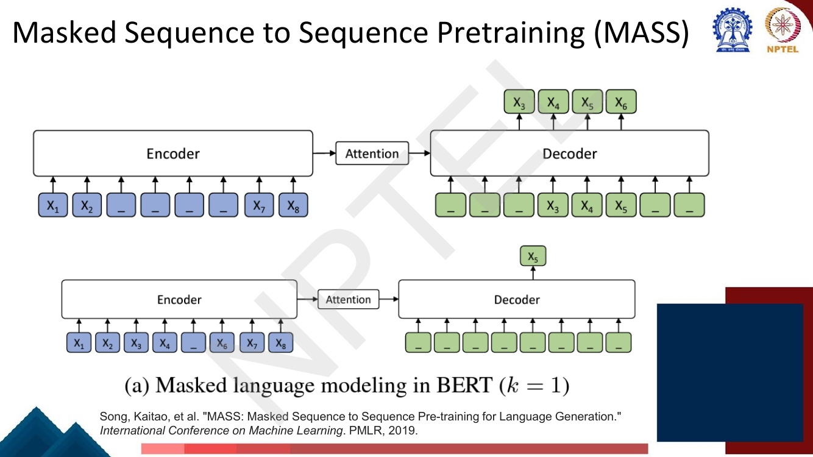
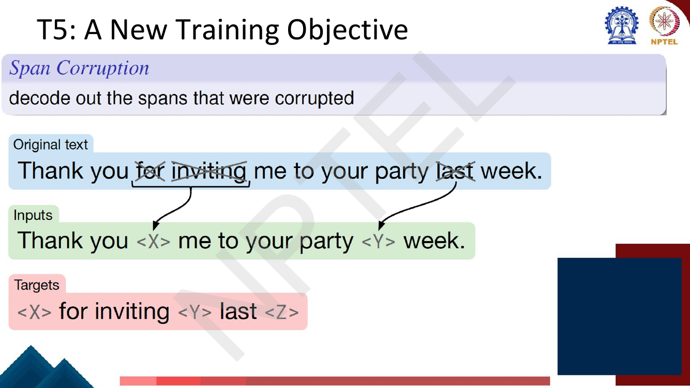
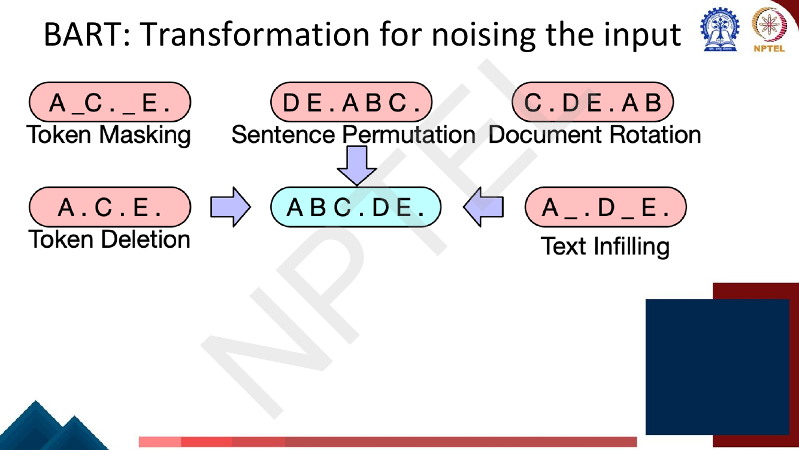

# Lec 28 — Span Tasks, T5 and BART (Pretraining Encoders and Encoder-Decoders)

> **Source:** `Week6.pdf` pp. 59–88 · **Week 6** · **Playlist:** Lec 28
> **Prereqs:** [Lec 27 — BERT and Masked Language Modelling](27-bert-masked-lm.md), [Lec 26 — Pretraining and ELMo](26-pretraining-and-elmo.md)
> **Feeds into:** [Lec 29 — GPT and Decoder Pretraining](29-gpt-decoder-pretraining.md), [Lec 31 — Question Answering I](../week-07/31-question-answering-1.md), [Lec 35 — Text Summarization](../week-07/35-text-summarization.md)

## Why this lecture exists

Lecture 27 gave you BERT and two fine-tuning recipes: one label for the whole sentence, or one label
per token. A large family of NLP tasks fits neither. "Which part of this passage answers the
question?" and "which word sequences in this sentence are named entities?" are both questions about
*contiguous stretches of tokens* — spans — and a span is not a token and not a sentence. The first
half of this lecture builds the machinery for spans, then stops to ask how you would even know BERT
was working, which is what GLUE is for.

The second half closes the taxonomy. Lecture 26 named three architectures; Lecture 27 pretrained the
encoder; Lecture 29 will pretrain the decoder. That leaves the encoder-decoder, which has a genuine
problem of its own: masked language modelling trains an encoder but gives the decoder nothing to do,
while language modelling trains a decoder but wastes the encoder's bidirectionality. MASS, T5 and
BART are three answers.

## The ideas

### Spans, formally

Given an input $x$ of $T$ tokens $(x_1, x_2, \ldots, x_T)$, a **span** is a contiguous sequence of
tokens with start $i$ and end $j$ such that $1 \le i \le j \le T$. The deck is explicit that the
number of such spans is

$$|S(x)| = \frac{T(T+1)}{2}$$

— one for every unordered pair of positions with repetition allowed, i.e. $\binom{T}{2} + T$. In
practice models impose an **application-specific length limit** $L$ and keep only the spans with
$j - i < L$ (so the maximum span length is $L$ tokens). The deck writes the resulting enumerated set
as $S(x)$, and you will see that symbol again in the NER section.

> **Notation warning.** The deck writes token representations as $T_i$ on page 62 while also using
> $T$ for the sequence length on page 63. This book writes the contextual representation of token $i$
> as $\mathbf{h}_i$ and reserves $T$ for the sequence length. If an exam paper prints $T_i$, it means
> $\mathbf{h}_i$.

### Fine-tuning BERT for span-based applications

The concrete instance on the deck is extractive question answering: you are given a question and a
passage containing the answer, and the answer is a literal substring of the passage. Nothing is
generated — you only have to point at where it starts and where it ends.

![Slide showing a meteorology passage with three questions whose answers (gravity, graupel, within a cloud) are highlighted inside the passage, next to a BERT diagram where the question and the paragraph are concatenated with [SEP] and two red arrows labelled Start/End Span emerge from the paragraph token outputs](../../assets/pages/lec28/p-061.png)
*Fig. — Notice that every answer is a contiguous substring of the passage, and that the question and paragraph go into **one** packed sequence separated by `[SEP]`; the start/end arrows come out only over the paragraph half. Page 61 of `Week6.pdf`.*

The packing convention — `[CLS] question [SEP] paragraph [SEP]` — is the sentence-pair input format
from [Lec 27](27-bert-masked-lm.md), reused unchanged. What is new is the head.

### The SQuAD head: two vectors and two softmaxes

This is the mechanism to memorise.

![Slide: input question and passage packed as a single sequence with [SEP]; introduce a start vector S and end vector E in R^{d_h} during fine-tuning; probability of word i being the start is softmax over the dot product S·T_i; analogous formula for the end; score of a candidate span from i to j is S·T_i + E·T_j and the maximum scoring span with j ≥ i is the prediction](../../assets/pages/lec28/p-062.png)
*Fig. — Four facts the exam can key on: only **two** new vectors are introduced, each of dimension $d_h$; the softmax runs over **positions in the paragraph**, not over the vocabulary; the span score is a **sum** of the two dot products, not a product; and the $j \ge i$ constraint is part of the prediction rule, not an afterthought. Page 62.*

Fine-tuning introduces exactly two new parameter vectors, a **start vector** $\mathbf{S} \in
\mathbb{R}^{d_h}$ and an **end vector** $\mathbf{E} \in \mathbb{R}^{d_h}$, where $d_h$ is BERT's
hidden size. For each paragraph token $i$ with contextual representation $\mathbf{h}_i$, the
probability that the answer *starts* at $i$ is

$$P^{\text{start}}_i = \frac{e^{\,\mathbf{S}\cdot\mathbf{h}_i}}{\sum_j e^{\,\mathbf{S}\cdot\mathbf{h}_j}}$$

and the probability it *ends* at $i$ uses the identical formula with $\mathbf{E}$ in place of
$\mathbf{S}$. Two independent softmaxes over positions; the training loss is the sum of the two
cross-entropies against the gold start and gold end.

Why a dot product works: $\mathbf{S}$ is a learned *direction in representation space meaning
"answer-start-like"*, and $\mathbf{S}\cdot\mathbf{h}_i$ is how much token $i$'s contextual
representation points that way. Because $\mathbf{h}_i$ was computed with the question visible on the
other side of the `[SEP]`, "answer-start-like" is a question-conditioned property, not a static one.
This is the whole reason the question and the passage must be encoded *together* rather than
separately.

At inference, the score of the candidate span $(i,j)$ is

$$\text{score}(i,j) = \mathbf{S}\cdot\mathbf{h}_i + \mathbf{E}\cdot\mathbf{h}_j$$

and you predict $\arg\max_{j \ge i} \text{score}(i,j)$. **The constraint matters.** Nothing in the
two softmaxes couples them, so the independently most likely start can easily sit after the
independently most likely end, which decodes to an empty or reversed span — meaningless output.
Numerical N1 builds exactly that situation. Note also that it is cheap: because the score is additive
you never have to materialise all $O(T^2)$ spans — scan $j$ from left to right carrying the best
start seen so far.

Question answering as a task, the SQuAD dataset itself, and its EM/F1 metrics belong to
[Lec 31](../week-07/31-question-answering-1.md); here SQuAD is just the example that motivates the
head.

### Span-oriented named entity classification

The sequence-labelling recipe for NER tags each token B-PER / I-PER / O ([BIO tagging, Lec 17](../week-04/17-rnn-applications.md)).
Span-oriented NER throws that away and poses a plain classification problem instead: **enumerate the
candidate spans, classify each one**.


*Fig. — Follow the vertical stack: contextual embeddings → span summary → span representation → FFNN → softmax. The span representation is visibly **three blocks wide** (start boundary, summary, end boundary). Page 64.*

Formally: given input $x$, assign a label $y$ from the set of valid NER labels to each of the spans
in $S(x)$. Because the overwhelming majority of spans are not entities, the label set $Y$ gains an
extra class, **NULL**. For the $T=10$, $L=4$ case of numerical N2 that means 34 classifications for a
sentence with perhaps two entities — 32 of them NULL.

Two advantages over BIO, neither of which the deck states but both of which are the point:
**nested and overlapping entities** are representable (BIO cannot tag a token as both B-ORG and
I-PER), and the model classifies a whole entity at once rather than committing token-by-token to a
tag sequence that may be locally inconsistent. The cost is the quadratic candidate set and the severe
class imbalance toward NULL.

### How to represent a span

Every scheme uses two components: **representations of the span boundaries** and a **summary
representation of the span's contents**. The unified representation concatenates them.

The deck's simplest possible version uses the contextual embeddings of the first and last tokens as
the boundaries, and the **average** of the output embeddings inside the span as the summary:

$$\mathbf{g}_{ij} = \frac{1}{(j-i)+1}\sum_{k=i}^{j}\mathbf{h}_k, \qquad
\text{spanRep}_{ij} = [\mathbf{h}_i;\, \mathbf{h}_j;\, \mathbf{g}_{ij}]$$

Note the divisor: $(j-i)+1$ is the span **length** in tokens, so an inclusive span from 3 to 5 has
length 3, not 2. If $\mathbf{h}$ has dimension $d_h$, $\text{spanRep}$ has dimension $3d_h$, which is
the FFNN's input size.

Why both parts? The boundaries carry *where the span sits* and what abuts it — "Jane Villanueva of"
versus "Jane Villanueva, CEO" — while the mean summary carries *what is inside* without letting
length distort the scale. The figure on page 64 shows a self-attention block producing the summary
rather than a plain mean; that is the standard upgrade, since a learned attention over the span's
tokens can weight the head word above the function words. A **width embedding** (a learned vector per
span length) is the other common addition, so the classifier can learn that 7-token PER spans are
implausible; the deck does not mention it.

### GLUE

**GLUE** — the General Language Understanding Evaluation benchmark — is a *suite* of nine
sentence-level and sentence-pair English understanding tasks with a shared leaderboard and a single
headline number. Its purpose is to stop people claiming a general-purpose encoder on the strength of
one dataset.

Page 68's table, reproduced in full. Notice the enormous spread in training-set size (WNLI 634
examples, MNLI 393k) and that the metrics differ per task — Matthews correlation for CoLA,
Pearson/Spearman for STS-B, accuracy or accuracy/F1 elsewhere.

| Group | Corpus | Task | Metric | Train |
|---|---|---|---|---|
| Single-sentence | **CoLA** | linguistic acceptability (is it grammatical?) | Matthews corr. | 8.5k |
| Single-sentence | **SST-2** | sentiment (movie reviews) | acc. | 67k |
| Similarity / paraphrase | **MRPC** | paraphrase (Microsoft, news) | acc./F1 | 3.7k |
| Similarity / paraphrase | **STS-B** | sentence similarity (regression) | Pearson/Spearman | 7k |
| Similarity / paraphrase | **QQP** | paraphrase (Quora question pairs) | acc./F1 | 364k |
| Inference | **MNLI** | NLI, scored matched / mismatched | acc./acc. | 393k |
| Inference | **QNLI** | NLI over question-answering data | acc. | 105k |
| Inference | **RTE** | NLI, small | acc. | 2.5k |
| Inference | **WNLI** | coreference as NLI (fiction) | acc. | 634 |


*Fig. — Read the **Average** column top to bottom: 74.0 → 71.0 → 75.1 → 79.6 → 82.1. BERT-BASE beats GPT by 4.5 points with the same parameter count; the jump is bidirectionality, not scale. Note also that WNLI is absent from this table — see N5. Page 69.*

| System | MNLI-(m/mm) | QQP | QNLI | SST-2 | CoLA | STS-B | MRPC | RTE | **Average** |
|---|---|---|---|---|---|---|---|---|---|
| Pre-OpenAI SOTA | 80.6/80.1 | 66.1 | 82.3 | 93.2 | 35.0 | 81.0 | 86.0 | 61.7 | **74.0** |
| BiLSTM+ELMo+Attn | 76.4/76.1 | 64.8 | 79.8 | 90.4 | 36.0 | 73.3 | 84.9 | 56.8 | **71.0** |
| OpenAI GPT | 82.1/81.4 | 70.3 | 87.4 | 91.3 | 45.4 | 80.0 | 82.3 | 56.0 | **75.1** |
| BERT$_{\text{BASE}}$ | 84.6/83.4 | 71.2 | 90.5 | 93.5 | 52.1 | 85.8 | 88.9 | 66.4 | **79.6** |
| BERT$_{\text{LARGE}}$ | **86.7/85.9** | **72.1** | **92.7** | **94.9** | **60.5** | **86.5** | **89.3** | **70.1** | **82.1** |

The two patterns worth carrying into the exam: BERT-LARGE wins every single column, and the largest
single-task gain is **CoLA**, 45.4 → 60.5 over GPT. Acceptability judgements need to see the whole
sentence at once, which is precisely what a left-to-right decoder cannot do.

### Extensions of BERT

The deck names two and gestures at the rest with "+++":

| Variant | One-line contribution |
|---|---|
| **RoBERTa** | Same architecture; train longer on more data and **remove next sentence prediction**. |
| **SpanBERT** | Mask **contiguous spans** of words rather than independent tokens — a harder, more useful pretraining task. |

Page 70's diagram makes SpanBERT's argument visually: BERT, masking at the subword level, leaves
`irr## esi## sti##` visible and asks for one missing piece of *irresistibly* — nearly free. SpanBERT
masks the whole contiguous run, so the model must recover it from the surrounding sentence instead.


*Fig. — The controlled ladder: data 16GB→160GB buys +0.4 SQuAD v1.1; steps 100K→500K buys another +0.6. BERT-LARGE sits at the bottom with 13GB, batch 256 and 1M steps — RoBERTa's batch is **32× larger**. Page 71.*

RoBERTa's takeaway, in the deck's words: *more compute, more data can improve pretraining even when
not changing the underlying Transformer encoder.* That is the first scaling-laws sighting in this
course; the systematic version is [Lec 51](../week-11/51-scaling-laws.md). Domain-specific and
multilingual descendants (SciBERT, mBERT, XLM-R) are [Lec 30](30-domain-and-multilingual-pretraining.md)'s.

### The three architectures, and the encoder-decoder's problem

Page 72 recaps the taxonomy and states the open question plainly: for **encoders** ("gets
bidirectional context — can condition on the future!") and **decoders** ("language models… nice to
generate from; can't condition on future words") the pretraining objective is settled. For
**encoder-decoders** the slide asks "What's the best way to pretrain them?"

[Lec 26](26-pretraining-and-elmo.md) set up this taxonomy and [Lec 27](27-bert-masked-lm.md) answered
the first row. The encoder-decoder is awkward because the two halves want different things. The
deck's first proposal: **do language modelling, but give a prefix of every input to the encoder and
do not predict it.** Feed $w_1 \ldots w_T$ to the encoder and have the decoder generate
$w_{T+1} \ldots w_{2T}$. The encoder half gets bidirectional context over the prefix; the decoder
half trains the whole model, since the gradient of the decoder's loss flows back through
cross-attention into the encoder. No new parameters, no new data.

### MASS

**MASS** (Masked Sequence to Sequence pretraining, Song et al., ICML 2019) does the same thing with a
mask instead of a split point. Mask a contiguous fragment of $k$ tokens in the encoder input; have
the decoder generate exactly that fragment, with the *unmasked* positions masked out on the decoder
side so it cannot cheat.


*Fig. — The elegance is in the two degenerate cases. With $k=1$ (bottom) MASS collapses to BERT-style masked language modelling; with $k=m$ (the full sentence, page 75) it collapses to standard language modelling. MASS is the one-parameter family that contains both. Pages 74–75.*

That single parameter $k$ interpolating between BERT and GPT is the most examinable fact about MASS:
**$k=1 \Rightarrow$ BERT's MLM; $k=m \Rightarrow$ standard LM.**

### T5: text-to-text

**T5** — the Text-to-Text Transfer Transformer (Raffel et al., JMLR 2020) — makes one framing
decision and then runs an enormous ablation study to justify everything else.

The framing: **every task is text in, text out.** Translation, classification, regression and
summarization all become "feed the model a string, train it to emit a string", distinguished only by
a **task prefix** on the input.


*Fig. — Look at the third output: `"3.8"`. STS-B is a **regression** task and T5 emits the number as a literal string. One model, one loss function, one set of hyperparameters across every task. Page 86.*

#### The span-corruption objective

T5's pretraining objective is **span corruption**: replace different-length spans from the input with
unique placeholder tokens (**sentinels**), and have the decoder generate the missing spans.


*Fig. — Three things to copy exactly. Each dropped span becomes **one** sentinel in the input regardless of its length. The target repeats the sentinel before each recovered span. And the target ends with an **extra, unused sentinel** `<Z>` that marks the end. Page 78.*

The target is short — six tokens here against the original eleven — so the decoder is cheap to train
relative to full-sentence reconstruction. T5's published settings corrupt 15% of tokens with a mean
span length of 3. Nothing stops the sentinels from being ordinary vocabulary entries; they are
reserved ids added to the tokenizer.

#### Various objectives considered by T5


*Fig. — The star marks "Replace corrupted spans", which T5 adopts. Read the bottom table carefully: it does **not** win GLUE — "drop corrupted tokens" posts 84.44 against 83.28. It wins on SGLUE by 2 points and is competitive everywhere, which is the actual argument. Page 79.*

The deck's own illustration of what each objective does to one sentence:

| Objective | Inputs | Targets |
|---|---|---|
| Prefix language modeling | `Thank you for inviting` | `me to your party last week .` |
| BERT-style (Devlin et al., 2018) | `Thank you <M> <M> me to your party apple week .` | *(original text)* |
| Deshuffling | `party me for your to . last fun you inviting week Thank` | *(original text)* |
| MASS-style (Song et al., 2019) | `Thank you <M> <M> me to your party <M> week .` | *(original text)* |
| I.i.d. noise, replace spans | `Thank you <X> me to your party <Y> week .` | `<X> for inviting <Y> last <Z>` |
| I.i.d. noise, drop tokens | `Thank you me to your party week .` | `for inviting last` |
| Random spans | `Thank you <X> to <Y> week .` | `<X> for inviting me <Y> your party last <Z>` |

Note the difference between BERT-style and MASS-style on this slide: BERT-style includes the random
*replacement* token (`apple` where `last` was), MASS-style uses `<M>` throughout. And the difference
between "replace spans" and "drop tokens": both delete, but only the first leaves a marker saying
*something was here*, which is what lets the decoder know how many gaps to fill.

**High-level objective comparison** (higher is better on all columns; EnDe/EnFr/EnRo are BLEU):

| Objective | GLUE | CNNDM | SQuAD | SGLUE | EnDe | EnFr | EnRo |
|---|---|---|---|---|---|---|---|
| Prefix language modeling | 80.69 | 18.94 | 77.99 | 65.27 | **26.86** | 39.73 | **27.49** |
| BERT-style (Devlin et al., 2018) | **82.96** | **19.17** | **80.65** | **69.85** | 26.78 | **40.03** | 27.41 |
| Deshuffling | 73.17 | 18.59 | 67.61 | 58.47 | 26.11 | 39.30 | 25.62 |

**Corruption-strategy comparison:**

| Objective | GLUE | CNNDM | SQuAD | SGLUE | EnDe | EnFr | EnRo |
|---|---|---|---|---|---|---|---|
| BERT-style (Devlin et al., 2018) | 82.96 | 19.17 | **80.65** | 69.85 | 26.78 | **40.03** | 27.41 |
| MASS-style (Song et al., 2019) | 82.32 | 19.16 | 80.10 | 69.28 | 26.79 | **39.89** | 27.55 |
| ★ **Replace corrupted spans** | 83.28 | **19.24** | **80.88** | **71.36** | **26.98** | 39.82 | **27.65** |
| Drop corrupted tokens | **84.44** | **19.31** | **80.52** | 68.67 | **27.07** | 39.76 | **27.82** |

The two takeaways: **deshuffling is terrible** (73.17 GLUE — a 10-point hole), and the three sensible
denoising variants are within about a point of each other, so the choice of span corruption is a
judgement call about average robustness rather than a landslide.

#### Various architectures considered by T5

Page 80 draws the three attention patterns over the same $x_1 \ldots x_4$, $y_1 y_2$ data: the
**encoder-decoder** (full attention in the encoder stack, causal in the decoder), the **language
model** (one stack, fully causal over the concatenation of $x$ and $y$), and the **prefix LM** (one
stack, full attention over the $x$ portion and causal attention over the $y$ portion). The prefix LM
is the single-stack approximation to an encoder-decoder — a decoder-only model allowed to look both
ways over the input half. Masking mechanics are
[Lec 24](../week-05/24-decoder-and-transformer-lm.md)'s.


*Fig. — Compare the table by **block**, not by row: every denoising row beats its LM counterpart. Encoder-decoder+denoising 83.28 GLUE vs encoder-decoder+LM 79.56. That gap is larger than any architectural gap at fixed objective. Page 81.*

| Architecture | Objective | Params | Cost | GLUE | CNNDM | SQuAD | SGLUE | EnDe | EnFr | EnRo |
|---|---|---|---|---|---|---|---|---|---|---|
| ★ **Encoder-decoder** | Denoising | $2P$ | $M$ | **83.28** | **19.24** | **80.88** | **71.36** | **26.98** | **39.82** | **27.65** |
| Enc-dec, shared | Denoising | $P$ | $M$ | 82.81 | 18.78 | **80.63** | **70.73** | 26.72 | 39.03 | **27.46** |
| Enc-dec, 6 layers | Denoising | $P$ | $M/2$ | 80.88 | 18.97 | 77.59 | 68.42 | 26.38 | 38.40 | 26.95 |
| Language model | Denoising | $P$ | $M$ | 74.70 | 17.93 | 61.14 | 55.02 | 25.09 | 35.28 | 25.86 |
| Prefix LM | Denoising | $P$ | $M$ | 81.82 | 18.61 | 78.94 | 68.11 | 26.43 | 37.98 | 27.39 |
| Encoder-decoder | LM | $2P$ | $M$ | 79.56 | 18.59 | 76.02 | 64.29 | 26.27 | 39.17 | 26.86 |
| Enc-dec, shared | LM | $P$ | $M$ | 79.60 | 18.13 | 76.35 | 63.50 | 26.62 | 39.17 | 27.05 |
| Enc-dec, 6 layers | LM | $P$ | $M/2$ | 78.67 | 18.26 | 75.32 | 64.06 | 26.13 | 38.42 | 26.89 |
| Language model | LM | $P$ | $M$ | 73.78 | 17.54 | 53.81 | 56.51 | 25.23 | 34.31 | 25.38 |
| Prefix LM | LM | $P$ | $M$ | 79.68 | 17.84 | 76.87 | 64.86 | 26.28 | 37.51 | 26.76 |

Three conclusions, each a plausible MCQ:

1. **The encoder-decoder with a denoising objective wins**, which is what T5 ships.
2. **Sharing encoder and decoder parameters costs almost nothing** — 82.81 vs 83.28 GLUE at half the
   parameters ($P$ instead of $2P$) and identical compute $M$. Halving the *depth* instead (6 layers)
   costs much more: 80.88.
3. **The plain language model is far behind everything** — 74.70 and 73.78 GLUE, and a catastrophic
   53.81 on SQuAD under the LM objective. A causal mask over the input half is a real handicap for
   understanding tasks; the prefix LM, which removes exactly that handicap, recovers most of the gap.

### BART

**BART** (Bidirectional and Auto-Regressive Transformers) is the other answer: a **bidirectional
encoder plus an autoregressive decoder**, pretrained as a **denoising autoencoder**. Corrupt a
document with an arbitrary noising function, then train the model to reconstruct the *original*
document in full.


*Fig. — Panel (c) is the whole design: the encoder input need **not be aligned** with the decoder output, which is what frees the noise function to delete, reorder or rotate. Note the caption's fine-tuning rule: an **uncorrupted** document goes into both encoder and decoder, and you use the decoder's final hidden states. Page 82.*

Because the decoder reconstructs everything, the input and output need not have the same length or
order — and that is what lets BART use noise types T5 cannot.

#### The five noising transformations


*Fig. — Memorise this list; it is prime MCQ material. Note the distinction between **token masking** (`A _ C . _ E .` — the gap is marked, length preserved) and **token deletion** (`A . C . E .` — no marker, so the model must also infer *where* something was missing). Page 83.*

| Transformation | What it does | On `A B C . D E .` |
|---|---|---|
| **Token masking** | replace random tokens with `[MASK]`, one per token | `A _ C . _ E .` |
| **Token deletion** | delete random tokens, leaving **no** marker | `A . C . E .` |
| **Text infilling** | replace sampled **spans** (length $\sim$ Poisson($\lambda{=}3$), including length-0) with a **single** `[MASK]` each | `A _ . D _ E .` |
| **Sentence permutation** | shuffle the order of the sentences | `D E . A B C .` |
| **Document rotation** | rotate the document to begin at a uniformly chosen token | `C . D E . A B` |

The reason each exists: token deletion forces the model to find the *position* of the gap as well as
its content; text infilling forces it to predict *how many* tokens are missing, since one `[MASK]`
can stand for zero, one or many — this is the generalisation of SpanBERT; sentence permutation and
document rotation push learning toward document-level structure rather than local word order.

**BART's own finding: text infilling plus sentence permutation worked best**, and it is the
combination used for the released BART models. Text infilling is the single most consistently useful
transformation; document rotation and sentence permutation perform poorly in isolation.

### Fine-tuning a pretrained encoder-decoder

The deck's answer is three lines long and is the point:

- **No additional parameters required.** Unlike BERT, which bolts on a classification head or two
  span vectors, the pretrained encoder-decoder already has the output layer it needs — it was
  trained to emit text and the task output *is* text.
- Just fine-tune on additional task-specific training data.
- The **loss computed at the decoder updates all the encoder and decoder parameters**, flowing back
  through cross-attention.

T5 puts this to work via task prefixes: `translate English to German:`, `cola sentence:`,
`stsb sentence1: … sentence2: …`, `summarize:`. Summarization in particular is where BART and T5
dominate — see [Lec 35](../week-07/35-text-summarization.md) for the task and its ROUGE metrics.

### BERT vs T5 vs BART

| | **BERT** | **T5** | **BART** |
|---|---|---|---|
| Architecture | Encoder only | Encoder-decoder | Encoder-decoder |
| Encoder attention | bidirectional | bidirectional | bidirectional |
| Decoder | none | autoregressive | autoregressive |
| Pretraining objective | MLM (+NSP) | **span corruption** with sentinels | **denoising autoencoder** (5 noise types) |
| What the output side predicts | the masked tokens only | the missing spans only, sentinel-delimited | the **entire original** document |
| Input/output alignment | token-aligned | not aligned (target is short) | not aligned (target is full length) |
| Task framing | task-specific head per task | text-to-text with a task prefix | task-specific head or generation |
| New params at fine-tune | yes (head) | **none** | none for generation |
| Natural tasks | classification, sequence labelling, span extraction | everything, including regression-as-text | summarization, translation, generation |
| Reference | Devlin et al. 2019 | Raffel et al. JMLR 2020 | Lewis et al. 2020 |

## Worked numericals

**No "Try this problem" page appears anywhere in pages 59–88.** The re-swept exercise table lists
none for Lec 28, and opening every page in the range confirms it: pp. 59–60 are title and outline,
p. 85 is a blank duplicate of p. 84's title, and pp. 87–88 are references and the closing slide. The
five numericals below are therefore all editorial, built on the deck's own formulas and tables.

### N1. The span-prediction computation, and why $j \ge i$ matters
**Given:** four paragraph tokens with contextual representations
$\mathbf{h}_1 = (0,0,2)$ "forms", $\mathbf{h}_2 = (2,0,0)$ "within", $\mathbf{h}_3 = (0,1,0)$ "a",
$\mathbf{h}_4 = (0,1,1)$ "cloud"; learned $\mathbf{S} = (1, 0.5, 0.1)$, $\mathbf{E} = (0.1, 0.3, 1.0)$.
**Find:** both softmax distributions, and the predicted span with and without the constraint.

1. Start logits $\mathbf{S}\cdot\mathbf{h}_i$:
   $\mathbf{h}_1: 0 + 0 + 0.2 = 0.2$; $\mathbf{h}_2: 2 + 0 + 0 = 2.0$;
   $\mathbf{h}_3: 0 + 0.5 + 0 = 0.5$; $\mathbf{h}_4: 0 + 0.5 + 0.1 = 0.6$.
2. End logits $\mathbf{E}\cdot\mathbf{h}_j$:
   $\mathbf{h}_1: 0 + 0 + 2.0 = 2.0$; $\mathbf{h}_2: 0.2 + 0 + 0 = 0.2$;
   $\mathbf{h}_3: 0 + 0.3 + 0 = 0.3$; $\mathbf{h}_4: 0 + 0.3 + 1.0 = 1.3$.
3. Softmax the start logits. $e^{0.2}=1.2214$, $e^{2.0}=7.3891$, $e^{0.5}=1.6487$, $e^{0.6}=1.8221$;
   sum $= 12.0813$. So $P^{\text{start}} = (0.1011,\, 0.6116,\, 0.1365,\, 0.1508)$.
4. Softmax the end logits. $e^{2.0}=7.3891$, $e^{0.2}=1.2214$, $e^{0.3}=1.3499$, $e^{1.3}=3.6693$;
   sum $= 13.6296$. So $P^{\text{end}} = (0.5421,\, 0.0896,\, 0.0990,\, 0.2692)$.
5. **The naive reading fails.** $\arg\max P^{\text{start}} = 2$ and $\arg\max P^{\text{end}} = 1$.
   That is the span $(2,1)$ — the answer ends before it begins. It decodes to nothing at all.
6. Span scores $\text{score}(i,j) = \mathbf{S}\cdot\mathbf{h}_i + \mathbf{E}\cdot\mathbf{h}_j$:

   | $i \backslash j$ | 1 | 2 | 3 | 4 |
   |---|---|---|---|---|
   | **1** | 2.2 | 0.4 | 0.5 | 1.5 |
   | **2** | **4.0** | 2.2 | 2.3 | *3.3* |
   | **3** | 2.5 | 0.7 | 0.8 | 1.8 |
   | **4** | 2.6 | 0.8 | 0.9 | 1.9 |

7. Unconstrained maximum: 4.0 at $(2,1)$ — below the diagonal, illegal.
8. Constrained to $j \ge i$ (upper triangle, inclusive of the diagonal): the entries available are
   2.2, 0.4, 0.5, 1.5 / 2.2, 2.3, 3.3 / 0.8, 1.8 / 1.9. The maximum is **3.3 at $(2,4)$**.

**Answer:** predicted span $(i,j) = (2,4)$, score 3.3, decoding to **"within a cloud"** — which is
the deck's own gold answer on page 61. Without the $j \ge i$ constraint the model outputs $(2,1)$ and
is simply wrong. Note the start probability 0.6116 and end probability 0.2692 multiply to 0.165,
which is *not* the span's probability under any proper model — the two softmaxes are independent and
the deck scores with a **sum of logits**, not a product of probabilities.

### N2. Counting candidate spans
**Given:** a passage of $T = 100$ tokens; a span-based NER model with maximum span length $L = 10$
(the deck's constraint is $j - i < L$, i.e. span length $\le L$).
**Find:** the number of spans with and without the limit, and the saving.

1. Without a limit, the deck's formula gives $|S(x)| = \dfrac{T(T+1)}{2} = \dfrac{100 \times 101}{2} = 5050$.
2. With the limit, count by span length $\ell = j-i+1$. There are $T - \ell + 1$ spans of length
   $\ell$, and $\ell$ runs from 1 to $L$.
3. Total $= \sum_{\ell=1}^{L}(T - \ell + 1) = LT - \dfrac{L(L-1)}{2}$.
4. $= 10 \times 100 - \dfrac{10 \times 9}{2} = 1000 - 45 = \mathbf{955}$.
5. Saving: $5050 \to 955$, a factor of 5.3. For $T = 10$, $L = 4$: all spans $= 55$, legal
   $= 40 - 6 = 34$.

**Answer:** 5050 unconstrained, **955** with $L = 10$. The point is the asymptotics: unconstrained
enumeration is $O(T^2)$ and therefore unusable on a long document, while capping the length makes it
$O(LT)$ — **linear in $T$**. That is why every span-based system has a maximum span length.

### N3. T5 span corruption applied by hand
**Given:** the sentence `The quick brown fox jumps over the lazy dog .`
**Find:** the corrupted input and the target sequence, corrupting `quick brown` and `lazy`.

1. Index the tokens first — getting this wrong is the usual source of error:
   1 `The`, 2 `quick`, 3 `brown`, 4 `fox`, 5 `jumps`, 6 `over`, 7 `the`, 8 `lazy`, 9 `dog`, 10 `.`
   So $T = 10$ and the two spans are $(2,3)$ and $(8,8)$.
2. Walk left to right building the input. Keep token 1 (`The`).
3. Span 1 covers tokens 2–3. Emit **one** sentinel `<X>` in its place, regardless of its length 2.
4. Keep tokens 4–7 (`fox jumps over the`).
5. Span 2 covers token 8. Emit `<Y>`. Then keep tokens 9–10 (`dog .`).
   **Input: `The <X> fox jumps over the <Y> dog .`**
6. Build the target: for each corrupted span, the sentinel then its contents, in order, then one
   final unused sentinel.
   **Target: `<X> quick brown <Y> lazy <Z>`**
7. Check the lengths: input $10 - 3 + 2 = 9$ tokens; target $2 + 1 + 2 + 1 = 6$ tokens.
8. Corruption rate $= 3/10 = 30\%$; T5's actual setting is 15% with mean span length 3.

**Answer:** input `The <X> fox jumps over the <Y> dog .`, target `<X> quick brown <Y> lazy <Z>`.
Three rules to not get wrong: **one sentinel per span, not per token**; the target contains **only**
the missing spans, never the whole sentence; and the target ends with an **extra** sentinel that is
never used in the input.

### N4. BART noising applied by hand
**Given:** the document `A B C . D E .` (two sentences, `A B C .` and `D E .`).
**Find:** the result of token masking, token deletion, text infilling and document rotation.

1. **Token masking** — pick tokens `B` and `D`, replace each with a separate `[MASK]`:
   `A _ C . _ E .` Length preserved; the model knows exactly two tokens are missing and where.
2. **Token deletion** — delete `B` and `D` with no marker: `A . C . E .` Length is now 5. The model
   must infer both *what* and *where*, which is strictly harder.
3. **Text infilling** — sample a span of length 2 starting at `B` and a span of length 1 at `D`,
   replace **each span** with a single `[MASK]`: `A _ . D _ E .` would be one draw; the deck's figure
   shows `A _ . D _ E .`, i.e. the span `B C` → one mask and a zero-length insertion before `E` → one
   mask. A length-0 span is legal, which is why one `[MASK]` can mean "nothing is missing here".
4. **Document rotation** — choose a uniformly random token, here `C`, and rotate so the document
   begins there: `C . D E . A B`. The model must find the true start.
5. **Sentence permutation** — swap the two sentences: `D E . A B C .`

**Answer:** masking `A _ C . _ E .`; deletion `A . C . E .`; infilling `A _ . D _ E .`; rotation
`C . D E . A B`; permutation `D E . A B C .`. In every case the **target is the full original**
`A B C . D E .` — unlike T5, where the target is only the missing spans. BART found **text infilling
+ sentence permutation** the best combination.

### N5. The GLUE macro-average — and what the deck's Average column actually averages
**Given:** BERT$_{\text{BASE}}$'s row from page 69: MNLI-m 84.6, MNLI-mm 83.4, QQP 71.2, QNLI 90.5,
SST-2 93.5, CoLA 52.1, STS-B 85.8, MRPC 88.9, RTE 66.4. The deck prints Average = 79.6.
**Find:** reproduce 79.6, and say over what.

1. First try the obvious: average the **eight tasks**, using MNLI-m only.
   $84.6 + 71.2 = 155.8$; $+90.5 = 246.3$; $+93.5 = 339.8$; $+52.1 = 391.9$; $+85.8 = 477.7$;
   $+88.9 = 566.6$; $+66.4 = 633.0$.
2. $633.0 / 8 = 79.125 \approx 79.1$. **That is not 79.6.** The eight-task average is wrong.
3. Now count MNLI-m and MNLI-mm as **two separate numbers**: $633.0 + 83.4 = 716.4$, over **nine**
   entries.
4. $716.4 / 9 = \mathbf{79.6}$ exactly. ✓
5. Cross-check BERT$_{\text{LARGE}}$: $86.7+72.1+92.7+94.9+60.5+86.5+89.3+70.1 = 652.8$;
   $+85.9 = 738.7$; $738.7/9 = 82.08 \approx \mathbf{82.1}$ ✓. And Pre-OpenAI SOTA:
   $585.9 + 80.1 = 666.0$; $666.0/9 = \mathbf{74.0}$ ✓. All five rows reproduce.

**Answer:** 79.6, as a macro-average over **nine numbers** — the eight scored tasks with MNLI
contributing both its matched and mismatched accuracies — and **excluding WNLI entirely**. GLUE has
nine *corpora* but this table averages nine *numbers over eight corpora*. If an exam asks you to
compute a GLUE average, read whether MNLI is counted once or twice; the naive eight-way average is
half a point low every time.

## Code

```python
import numpy as np

# ===== 1. T5 span corruption: sentence -> (corrupted input, target) =====
SENTINELS = ["<X>", "<Y>", "<Z>", "<W>"]

def span_corrupt(tokens, spans):
    """spans: (start, end) INCLUSIVE index pairs, non-overlapping, left to right."""
    inp, tgt, cur = [], [], 0
    for k, (s, e) in enumerate(spans):
        inp += tokens[cur:s] + [SENTINELS[k]]     # keep prefix, drop span, emit sentinel
        tgt += [SENTINELS[k]] + tokens[s:e + 1]   # target: sentinel, then the removed tokens
        cur = e + 1
    inp += tokens[cur:]                           # tail after the last span
    tgt += [SENTINELS[len(spans)]]                # one extra sentinel closes the target
    return inp, tgt

sent = "Thank you for inviting me to your party last week .".split()
inp, tgt = span_corrupt(sent, [(2, 3), (8, 8)])   # drop "for inviting" and "last"
print("original :", " ".join(sent))
print("input    :", " ".join(inp))
print("target   :", " ".join(tgt))
print("decoder predicts", len(tgt), "tokens, not", len(sent), "- the target is SHORT")
# original : Thank you for inviting me to your party last week .
# input    : Thank you <X> me to your party <Y> week .
# target   : <X> for inviting <Y> last <Z>          <- matches the deck, page 78
# decoder predicts 6 tokens, not 11 - the target is SHORT

# ===== 2. Span-prediction head, and why end >= start must be enforced =====
def softmax(z):
    z = np.asarray(z, float); z = z - z.max()
    return np.exp(z) / np.exp(z).sum()

toks = ["forms", "within", "a", "cloud"]
H = np.array([[0., 0., 2.],      # h_1  "forms"
              [2., 0., 0.],      # h_2  "within"
              [0., 1., 0.],      # h_3  "a"
              [0., 1., 1.]])     # h_4  "cloud"
S = np.array([1.0, 0.5, 0.1])    # learned START vector
E = np.array([0.1, 0.3, 1.0])    # learned END   vector

s_log, e_log = H @ S, H @ E
print("\nstart logits S.h_i :", s_log, "-> P_start", np.round(softmax(s_log), 4))
print("end   logits E.h_j :", e_log, "-> P_end  ", np.round(softmax(e_log), 4))
# start logits S.h_i : [0.2 2.  0.5 0.6] -> P_start [0.1011 0.6116 0.1365 0.1508]
# end   logits E.h_j : [2.  0.2 0.3 1.3] -> P_end   [0.5421 0.0896 0.099  0.2692]

n = len(toks)
score = s_log[:, None] + e_log[None, :]                 # score(i,j) = S.h_i + E.h_j
i_u, j_u = np.unravel_index(score.argmax(), score.shape)
valid = np.triu(np.ones((n, n), bool))                  # keep only j >= i
i_c, j_c = np.unravel_index(np.where(valid, score, -np.inf).argmax(), score.shape)
print("\nscore(i,j), rows = start i, cols = end j:\n", score)
print(f"independent argmaxes : start={i_u+1} end={j_u+1}  -> INVALID (end < start)")
print(f"constrained  argmax  : ({i_c+1},{j_c+1}) score {score[i_c, j_c]:.2f}  -> "
      f'"{" ".join(toks[i_c:j_c+1])}"')
# score(i,j), rows = start i, cols = end j:
#  [[2.2 0.4 0.5 1.5]
#   [4.  2.2 2.3 3.3]
#   [2.5 0.7 0.8 1.8]
#   [2.6 0.8 0.9 1.9]]
# independent argmaxes : start=2 end=1  -> INVALID (end < start)
# constrained  argmax  : (2,4) score 3.30  -> "within a cloud"

# ===== 3. How many candidate spans must a span-based NER model score? =====
print()
for T, L in [(4, 4), (10, 4), (100, 10)]:
    total = T * (T + 1) // 2
    legal = sum(1 for i in range(T) for j in range(i, T) if j - i < L)
    closed = L * T - L * (L - 1) // 2                   # closed form, valid for L <= T
    print(f"T={T:<4} L={L:<3} all spans T(T+1)/2={total:<5} legal(j-i<L)={legal:<5} "
          f"closed form={closed}")
# T=4    L=4   all spans T(T+1)/2=10    legal(j-i<L)=10    closed form=10
# T=10   L=4   all spans T(T+1)/2=55    legal(j-i<L)=34    closed form=34
# T=100  L=10  all spans T(T+1)/2=5050  legal(j-i<L)=955   closed form=955

# ===== 4. The deck's GLUE "Average" column is over NINE numbers, not eight =====
#        order: MNLI-m, MNLI-mm, QQP, QNLI, SST-2, CoLA, STS-B, MRPC, RTE
rows = {"Pre-OpenAI SOTA":  ([80.6, 80.1, 66.1, 82.3, 93.2, 35.0, 81.0, 86.0, 61.7], 74.0),
        "BiLSTM+ELMo+Attn": ([76.4, 76.1, 64.8, 79.8, 90.4, 36.0, 73.3, 84.9, 56.8], 71.0),
        "OpenAI GPT":       ([82.1, 81.4, 70.3, 87.4, 91.3, 45.4, 80.0, 82.3, 56.0], 75.1),
        "BERT-base":        ([84.6, 83.4, 71.2, 90.5, 93.5, 52.1, 85.8, 88.9, 66.4], 79.6),
        "BERT-large":       ([86.7, 85.9, 72.1, 92.7, 94.9, 60.5, 86.5, 89.3, 70.1], 82.1)}
print("\nsystem             mean of 8   mean of 9   deck")
for k, (v, deck) in rows.items():
    print(f"{k:<18} {(sum(v)-v[1])/8:>9.2f} {sum(v)/9:>11.2f} {deck:>6.1f}")
# system             mean of 8   mean of 9   deck
# Pre-OpenAI SOTA        73.24       74.00   74.0
# BiLSTM+ELMo+Attn       70.30       70.94   71.0
# OpenAI GPT             74.35       75.13   75.1
# BERT-base              79.12       79.60   79.6
# BERT-large             81.60       82.08   82.1
```

Block 1 reproduces the deck's page-78 example exactly. Block 2 is the point of N1: the two softmaxes
genuinely disagree about ordering and only the $j \ge i$ mask rescues the prediction. Block 4 settles
how the deck's Average column is computed — the "mean of 9" column matches every printed value and
the "mean of 8" column matches none.

## Exam pack

### Must-memorise

| Item | Exactly this |
|---|---|
| Span, formally | contiguous tokens with start $i$, end $j$, $1 \le i \le j \le T$ |
| Number of spans | $\dfrac{T(T+1)}{2}$ |
| Length limit | legal spans satisfy $j - i < L$; count $= LT - \dfrac{L(L-1)}{2}$ |
| SQuAD head | two new vectors only: $\mathbf{S}, \mathbf{E} \in \mathbb{R}^{d_h}$ |
| Start probability | $P_i = \dfrac{e^{\mathbf{S}\cdot\mathbf{h}_i}}{\sum_j e^{\mathbf{S}\cdot\mathbf{h}_j}}$, softmax over **positions** |
| Span score | $\mathbf{S}\cdot\mathbf{h}_i + \mathbf{E}\cdot\mathbf{h}_j$, maximised subject to $j \ge i$ |
| Span representation | $\text{spanRep}_{ij} = [\mathbf{h}_i; \mathbf{h}_j; \mathbf{g}_{ij}]$, dimension $3d_h$ |
| Span summary | $\mathbf{g}_{ij} = \dfrac{1}{(j-i)+1}\sum_{k=i}^{j}\mathbf{h}_k$ — divisor is the span **length** |
| Span-based NER extra label | **NULL**, because most spans are not entities |
| GLUE | 9 corpora, 3 groups: single-sentence (CoLA, SST-2); similarity/paraphrase (MRPC, STS-B, QQP); inference (MNLI, QNLI, RTE, WNLI) |
| RoBERTa | train longer, more data, **drop NSP** |
| SpanBERT | mask **contiguous spans** |
| MASS | mask a $k$-token fragment in the encoder, decode exactly it; $k{=}1\Rightarrow$ BERT, $k{=}m\Rightarrow$ LM |
| T5 framing | **text-to-text**: every task is string in → string out, selected by a **task prefix** |
| T5 objective | **span corruption** — one sentinel per span; target = sentinel + span, repeated, then one extra sentinel |
| T5's winning config | **encoder-decoder + denoising (replace corrupted spans)** |
| BART | bidirectional encoder + autoregressive decoder, trained as a **denoising autoencoder** |
| BART noise types | token masking, token **deletion**, **text infilling**, sentence **permutation**, document **rotation** |
| BART's best combination | **text infilling + sentence permutation** |
| T5 target vs BART target | T5 emits **only the missing spans**; BART emits the **entire original document** |
| Fine-tuning an enc-dec | **no additional parameters**; decoder loss updates encoder *and* decoder |

### Numbers worth knowing

| Quantity | Value |
|---|---|
| GLUE Average: BERT-BASE / BERT-LARGE | **79.6 / 82.1** |
| GLUE Average: OpenAI GPT / ELMo+BiLSTM / pre-OpenAI SOTA | 75.1 / 71.0 / 74.0 |
| Biggest BERT-over-GPT single-task gain | CoLA, 45.4 → **60.5** |
| BERT-LARGE best cells | MNLI 86.7/85.9, QQP 72.1, QNLI 92.7, SST-2 94.9, STS-B 86.5, MRPC 89.3, RTE 70.1 |
| GLUE train sizes | MNLI 393k, QQP 364k, QNLI 105k, SST-2 67k, CoLA 8.5k, STS-B 7k, MRPC 3.7k, RTE 2.5k, WNLI 634 |
| T5 objectives, GLUE | prefix LM 80.69, **BERT-style 82.96**, deshuffling **73.17** |
| T5 corruption, GLUE / SGLUE | BERT-style 82.96/69.85, MASS-style 82.32/69.28, **replace spans 83.28/71.36**, drop tokens 84.44/68.67 |
| T5 architectures, GLUE (denoising) | enc-dec **83.28**, shared 82.81, 6-layer 80.88, LM 74.70, prefix LM 81.82 |
| T5 architectures, GLUE (LM objective) | enc-dec 79.56, shared 79.60, 6-layer 78.67, LM 73.78, prefix LM 79.68 |
| T5 params / cost notation | enc-dec $2P$ at cost $M$; all others $P$; 6-layer costs $M/2$ |
| T5 pretraining corruption rate | 15% of tokens, mean span length 3 |
| RoBERTa ladder (SQuAD v1.1/v2.0) | 16GB 100K: 93.6/87.3 → 160GB 100K: 94.0/87.7 → 300K: 94.4/88.7 → 500K: **94.6/89.4** |
| RoBERTa vs BERT-LARGE | batch 8K vs 256; BERT-LARGE 13GB, 1M steps, SQuAD 90.9/81.8 |
| BART text-infilling span length | Poisson, $\lambda = 3$, length 0 allowed |
| MASS / T5 / BART years | 2019 / 2020 (JMLR 21.140) / 2020 |

### Likely MCQ traps

- **"The SQuAD head adds a classifier over the vocabulary."** No. It adds **two vectors** and
  softmaxes over **token positions in the paragraph**. Nothing is generated.
- **"Take the argmax start and the argmax end."** That can give $j < i$. The rule is
  $\arg\max_{j \ge i}(\mathbf{S}\cdot\mathbf{h}_i + \mathbf{E}\cdot\mathbf{h}_j)$ — see N1, where the
  naive reading gives the empty span $(2,1)$.
- **"The span score is a product of the two probabilities."** The deck defines it as a **sum of the
  two dot products** (logits), not a product of softmax outputs.
- **Span count $T^2$ or $T(T-1)/2$.** It is $T(T+1)/2$, because $i = j$ (length-1 spans) is legal.
- **Span summary divided by $j-i$.** The divisor is $(j-i)+1$, the span length.
- **"T5's target is the original sentence."** No — T5's target is **only the corrupted spans**, each
  preceded by its sentinel, ending with one extra sentinel. *BART's* target is the original document.
  This is the single most likely confusion on the deck.
- **"One sentinel per deleted token."** One sentinel per deleted **span**, however long.
- **"Span corruption won every T5 ablation column."** It did not. "Drop corrupted tokens" beats it on
  GLUE (84.44 vs 83.28), CNNDM and EnDe/EnRo. Span corruption wins on **SGLUE** (71.36) and SQuAD
  and is best on average.
- **"T5 found the decoder-only language model competitive."** The opposite: 74.70 GLUE and 61.14
  SQuAD under denoising, versus 83.28 / 80.88 for the encoder-decoder. The *prefix LM* is the
  respectable single-stack option (81.82).
- **Confusing token masking with token deletion.** Masking leaves a `[MASK]` marker and preserves
  length; deletion leaves nothing, so the model must infer the position too.
- **Confusing text infilling with token masking.** Infilling replaces a whole **span** (possibly of
  length 0) with a **single** `[MASK]`, so the model must predict how many tokens are missing.
- **"BART's best noise was token masking."** It was **text infilling + sentence permutation**.
- **"RoBERTa changed the architecture."** It did not — same encoder, more data, longer training, no NSP.
- **"MASS with $k=1$ is a language model."** Backwards: $k=1$ is BERT-style MLM; $k=m$ is the LM.
- **"Fine-tuning T5 needs a new output head per task."** No additional parameters at all; the task is
  selected by a **text prefix**.
- **GLUE averages.** The deck's Average column counts MNLI twice (matched and mismatched) and drops
  WNLI — nine numbers, not eight. The eight-way average is consistently ~0.5 low.

### Self-test

1. How many spans are there in a 20-token sentence with no length limit? With a maximum length of 5?
2. Write the start-probability formula for the SQuAD head and say what the softmax is over.
3. Why does the span-prediction rule need $j \ge i$, and what goes wrong without it?
4. What is $\text{spanRep}_{ij}$ and what is its dimension if $d_h = 768$?
5. Why does span-oriented NER need a NULL label?
6. Apply T5 span corruption to `she went to the market yesterday .` corrupting `to the market` and `yesterday`. Give input and target.
7. Name all five BART noising transformations and say which combination BART found best.
8. Under T5's ablation, which architecture/objective pair wins, and what does the plain language model score on GLUE?
9. State in one line each what RoBERTa and SpanBERT changed about BERT.
10. BERT-BASE's GLUE row sums to 716.4 over nine entries. What is the average, and why nine?

<details><summary>Answers</summary>

1. $20 \times 21/2 = 210$. With $L = 5$: $5 \times 20 - (5 \times 4)/2 = 100 - 10 = 90$.
2. $P_i = e^{\mathbf{S}\cdot\mathbf{h}_i} / \sum_j e^{\mathbf{S}\cdot\mathbf{h}_j}$; the softmax is over **token positions in the paragraph**, not over the vocabulary.
3. The two softmaxes are independent, so the most likely start can fall after the most likely end, yielding a reversed/empty span. The prediction rule maximises $\mathbf{S}\cdot\mathbf{h}_i + \mathbf{E}\cdot\mathbf{h}_j$ over the upper triangle only.
4. $[\mathbf{h}_i; \mathbf{h}_j; \mathbf{g}_{ij}]$ — start boundary, end boundary, mean of the interior. Dimension $3 \times 768 = 2304$.
5. Because the model classifies *every* enumerated span and the vast majority are not entities; NULL is the "not an entity" class.
6. Tokens: 1 `she` 2 `went` 3 `to` 4 `the` 5 `market` 6 `yesterday` 7 `.` → spans (3,5) and (6,6). Input: `she went <X> <Y> .` Target: `<X> to the market <Y> yesterday <Z>`.
7. Token masking, token deletion, text infilling, sentence permutation, document rotation. Best: **text infilling + sentence permutation**.
8. **Encoder-decoder with the denoising objective**, 83.28 GLUE. The plain language model scores 74.70 (denoising) and 73.78 (LM objective).
9. RoBERTa: train longer on more data and remove next sentence prediction — no architecture change. SpanBERT: mask contiguous spans instead of independent tokens.
10. $716.4/9 = 79.6$. Nine because MNLI contributes two numbers (matched *and* mismatched) and WNLI is excluded from the table entirely.

</details>

## Beyond the slides

**Gap:** The deck never says how a span model handles a question whose answer is *not* in the passage.
**Why it matters:** SQuAD 2.0 — which appears on the RoBERTa table on page 71 as the "/87.3" half of
every cell, unexplained — contains unanswerable questions. The standard fix is to treat the `[CLS]`
position as a legal span: if $\text{score}(\texttt{[CLS]}, \texttt{[CLS]})$ beats every real span by
a tuned threshold, predict "no answer". The ~7-point gap between the v1.1 and v2.0 numbers on that
slide is entirely this problem, and [Lec 31](../week-07/31-question-answering-1.md) will assume you
know it exists.

**Gap:** The deck lists SpanBERT's idea but never its second component.
**Why it matters:** SpanBERT also adds a **span boundary objective** — predict each masked token
using only the representations of the two tokens *immediately outside* the span, plus a position
embedding. That is what forces boundary representations to summarise their span's content, which is
exactly the property the span-representation scheme on page 67 relies on. The two halves of this
lecture are more connected than the slides let on.

**Gap:** "Extensions of BERT" names only RoBERTa and SpanBERT, then writes "+++".
**Why it matters:** Two more are standard exam fodder. **ALBERT** cuts parameters with factorised
embeddings and cross-layer weight sharing, and swaps NSP for sentence-order prediction. **ELECTRA**
replaces MLM with **replaced-token detection**: a small generator corrupts tokens and the main model
classifies every position as original-or-replaced — so training signal comes from 100% of positions
rather than 15%, making it far more compute-efficient. Note that "shared parameters cost almost
nothing" is also exactly what T5's architecture table found (82.81 vs 83.28), which is ALBERT's
thesis in a different setting.

**Gap:** T5's ablation tables are shown without their experimental controls.
**Why it matters:** Every row is a *matched-compute* comparison — same model size, same number of
pretraining steps, same fine-tuning budget — on T5's "Base" scale, not the final 11B model. The
numbers are therefore not state-of-the-art results and should not be quoted as "T5 scores 83.28 on
GLUE"; they are relative evidence for a design choice. The shipped T5-11B scores far higher.

**Gap:** Nothing is said about where the pretraining data comes from for T5.
**Why it matters:** T5 introduced **C4** (the Colossal Clean Crawled Corpus), ~750GB of filtered
Common Crawl, and the paper's data ablations are as influential as its objective ablations. If a
question asks "which model introduced C4", the answer is T5. [Lec 26](26-pretraining-and-elmo.md)
covers pretraining corpora generally.

## Cut from the slides

Pages 59–60 (title and the two-bullet "Concepts Covered") and pages 87–88 (the Jurafsky & Martin
reference and the closing "Thank You" slide) carry no teachable content and are dropped; page 85 is a
blank slide repeating page 84's title and is also dropped. Page 73's prefix-split language-modelling
diagram and page 72's three-architecture recap are compressed into a short subsection each, because
[Lec 26](26-pretraining-and-elmo.md) owns the taxonomy and the Transformer encoder-decoder itself
belongs to [Lec 24](../week-05/24-decoder-and-transformer-lm.md). Pages 74 and 75 are the same MASS
figure with its two degenerate cases ($k=1$, $k=m$) and are merged into one figure plus the
interpolation statement. Pages 76–78 are a three-step reveal of one example and are presented as the
final state only. Page 80's three architecture diagrams are kept as a figure but not re-derived,
since attention masking is [Lec 24](../week-05/24-decoder-and-transformer-lm.md)'s. MLM, NSP, the
80/10/10 recipe and `[CLS]`/`[SEP]` are recalled in a clause and left to
[Lec 27](27-bert-masked-lm.md); SQuAD as a dataset and EM/F1 are left to
[Lec 31](../week-07/31-question-answering-1.md); summarization to
[Lec 35](../week-07/35-text-summarization.md); BIO tagging to
[Lec 17](../week-04/17-rnn-applications.md). Nothing examinable from pages 61–86 was dropped — both
T5 ablation tables and the full BART noise list are reproduced in their entirety.
