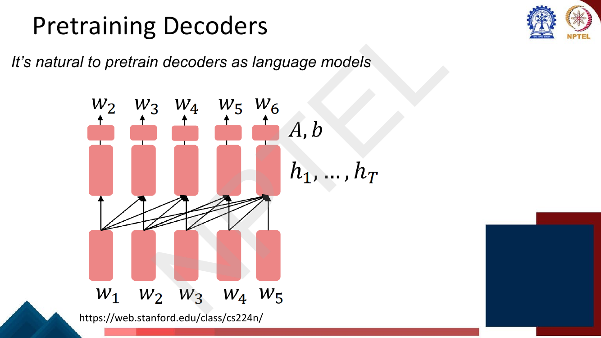
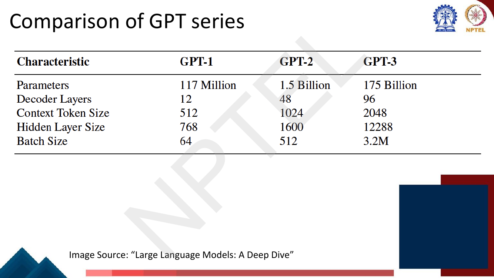
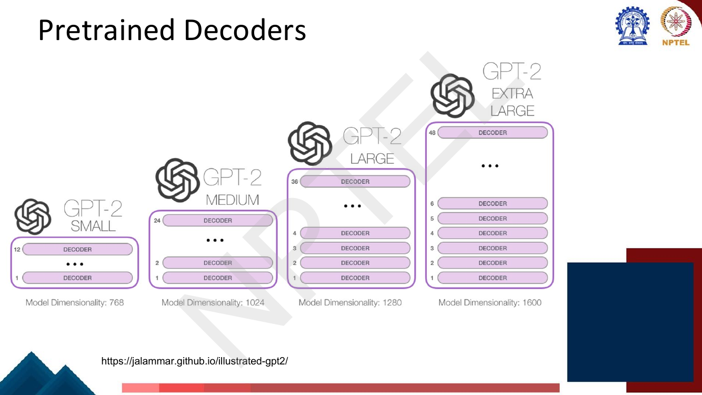
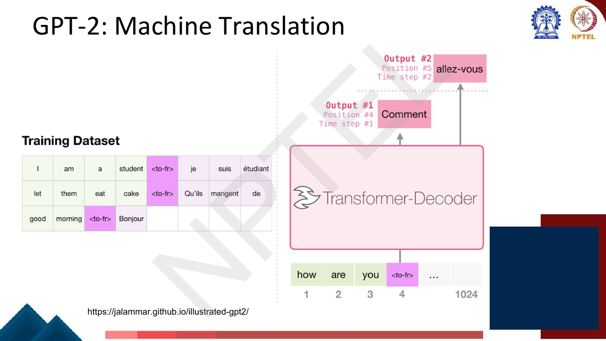
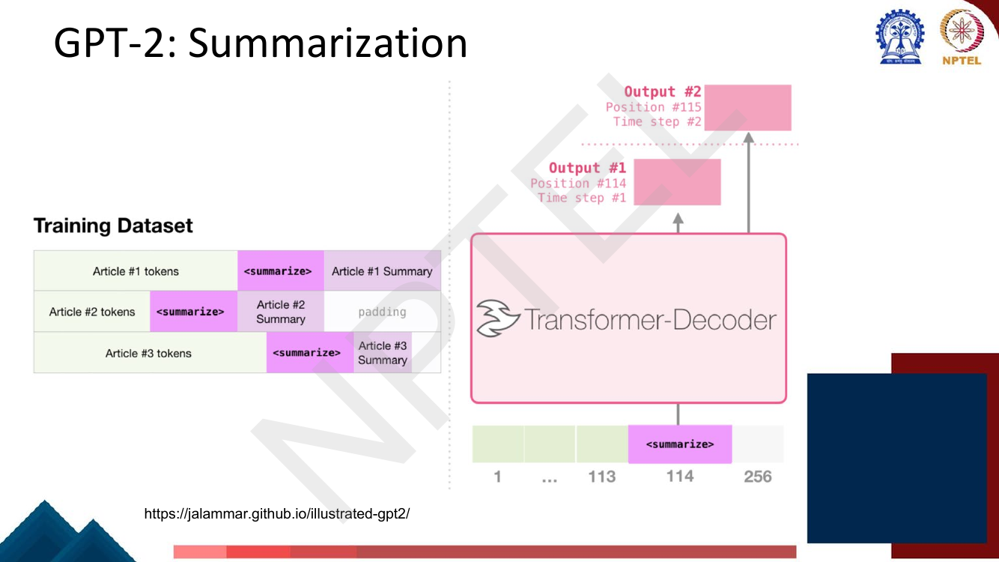
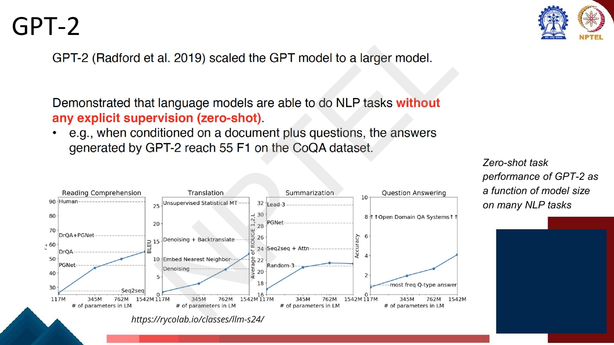

# Lec 29 — Pretraining Transformer Decoder: GPT, Zero-shot and In-context Learning

> **Source:** `Week6.pdf` pp. 89–113 · **Week 6** · **Playlist:** Lec 29
> **Prereqs:** [Lec 24 — Decoder and Transformer LM](../week-05/24-decoder-and-transformer-lm.md), [Lec 26 — Pretraining and ELMo](26-pretraining-and-elmo.md)
> **Feeds into:** [Lec 36 — Instruction Finetuning I](../week-08/36-instruction-finetuning-1.md), [Lec 41 — Prompting I](../week-09/41-prompting-1.md), [Lec 42 — Why In-context Learning Works](../week-09/42-why-icl-works.md)

## Why this lecture exists

[Lec 26](26-pretraining-and-elmo.md) laid out three things you can pretrain: an encoder, an
encoder-decoder, or a decoder. Lectures 27 and 28 did the first two, and both needed an *invented*
objective — masking tokens, corrupting spans — because a bidirectional model cannot simply be asked
to predict the next word. The decoder needs no invention. It already is a language model, so you
pretrain it by doing exactly what [Lec 3](../week-01/03-ngram-lm-1.md) defined: predict the next
token. That is the whole objective.

This lecture is where that unglamorous choice turns out to win. Scaling the same next-token model
three times produced GPT-1, GPT-2 and GPT-3, and somewhere along the way the model stopped needing
a task-specific head at all. You describe the task in text, optionally show a few examples in the
prompt, and it answers — with no gradient updates. Everything in Weeks 8 to 12 is about models of
this shape.

## The ideas

### Pretraining a decoder is just language modelling

Take the decoder stack from [Lec 24](../week-05/24-decoder-and-transformer-lm.md) — masked
self-attention so position $t$ can see only positions $\le t$, a feed-forward sublayer, residuals and
layer norms — and train it to maximise the probability of its own training text:

$$\mathcal{L} = -\sum_{t=1}^{T} \log P_\theta(w_t \mid w_1 \ldots w_{t-1})$$


*Fig. — "It's natural to pretrain decoders as language models." Notice the arrows only ever go left-to-right: $\mathbf{h}_t$ depends on $w_1 \ldots w_t$ and nothing after. The output head $\mathbf{A}, \mathbf{b}$ maps $\mathbf{h}_t$ to a distribution over the vocabulary. Page 92.*

Three properties make this the easiest of the three pretraining objectives, and they are exactly the
properties that made it the most powerful:

- **No corruption, no mismatch.** BERT trains on sentences containing `[MASK]` and is then deployed on
  sentences that never contain it. A decoder trains on ordinary text and is deployed on ordinary text.
- **Dense supervision.** Every single position produces a prediction and a loss term. BERT masks ~15%
  of tokens and learns from those only ([Lec 27](27-bert-masked-lm.md)) — roughly $1/7$ of the
  learning signal per token of corpus.
- **The objective is the deployment behaviour.** A trained decoder can *generate*. An encoder cannot,
  which is why it needs a task head bolted on before it is useful for anything.

The slide writes the head as $\mathbf{A}, \mathbf{b}$: $P(w_{t+1} \mid w_{\le t}) =
\text{softmax}(\mathbf{A}\mathbf{h}_t + \mathbf{b})$. *How* you turn that distribution into text —
greedy, beam, temperature, top-$k$, nucleus — is [Lec 19](../week-04/19-decoding-strategies.md)'s
subject entirely; this chapter only cares that generation is possible.

### GPT-1: the original

**GPT** stands for **Generative Pretrained Transformer**. The deck's specification page:

| Property | GPT-1 (Radford et al., 2018) |
|---|---|
| Architecture | Transformer **decoder**, 12 layers |
| Parameters | **117M** |
| Hidden state | 768-dimensional |
| Feed-forward hidden layer | 3072-dimensional ($= 4 \times 768$) |
| Tokenizer | **Byte-pair encoding with 40,000 merges** ([Lec 2](../week-01/02-text-processing-tokenization.md)) |
| Pretraining corpus | **BooksCorpus — over 7,000 unique books** |
| Why books | "contains long spans of contiguous text, for learning long-distance dependencies" |

The deck flags one comparison in a pink box: **the vocabulary is larger than BERT's** (BERT's
WordPiece vocabulary is ~30k; GPT-1's BPE merges give ~40k). The corpus choice is the other thing to
remember — BooksCorpus was chosen over, say, shuffled sentences precisely because books give you
*long contiguous passages*, and a causal LM can only learn long-range dependency from text that
actually has some.

### The GPT series, side by side

This page is the single most MCQ-exploitable slide in the lecture. Every number below is read off the
render verbatim.


*Fig. — The deck's own comparison. Note the context window merely doubles each generation (512 → 1024 → 2048) while parameters go up ~13× then ~117×. Page 94.*

| Characteristic | GPT-1 | GPT-2 | GPT-3 |
|---|---|---|---|
| Parameters | 117 Million | 1.5 Billion | 175 Billion |
| Decoder Layers | 12 | 48 | 96 |
| Context Token Size | 512 | 1024 | 2048 |
| Hidden Layer Size | 768 | 1600 | 12288 |
| Batch Size | 64 | 512 | 3.2M |

Two readings of that table matter more than memorising it:

1. **Depth grew 8×, width grew 16×, context grew only 4×.** Scale went into the model, not into how
   much text it can see at once. The 2048-token ceiling is what makes the token budget in N3 bite.
2. **Batch size went from 64 sequences to 3.2M tokens.** That is not a typo on the slide — GPT-3's
   batch is quoted in *tokens*, and the jump is a statement about how much compute was thrown at one
   gradient step.

The deck also shows the four GPT-2 sizes, which is where "GPT-2" ambiguity comes from: the name covers
a family, and "1.5 Billion" in the table is the extra-large member.


*Fig. — GPT-2 is four models, not one: 12/24/36/48 layers at width 768/1024/1280/1600. GPT-2 **small** has GPT-1's shape; only the extra-large is the headline 1.5B. Page 95.*

A decoder block is just masked self-attention plus a feed-forward network, stacked $N$ times, and
GPT-2 processes a fixed 1024-token window where each token flows up through every block along its own
path, one new token emitted per step. Parameter counting for this architecture is
[Lec 24](../week-05/24-decoder-and-transformer-lm.md)'s; N2 applies it to these three configurations
and lands on the deck's numbers.

### GPT vs BERT — the comparison the exam wants

| | **BERT** (encoder, [Lec 27](27-bert-masked-lm.md)) | **GPT** (decoder, here) |
|---|---|---|
| Attention | **Bidirectional** — every token sees all tokens | **Causal / masked** — token $t$ sees $\le t$ only |
| Objective | **Masked LM** (+ NSP): predict ~15% masked tokens | **Next-token prediction**: predict every token |
| Signal per token of corpus | ~15% of positions | 100% of positions |
| Natural tasks | classification, sequence labelling, span extraction | **generation**: dialogue, summarization, translation, free-form QA |
| Can it generate? | no (not left-to-right) | yes |
| Pretrain/finetune mismatch | yes — `[MASK]` never appears at test time | none |
| Representation of token $t$ | contextual, uses both sides | contextual, left side only |
| How you adapt it | fine-tune with a task head | fine-tune **or** just prompt it |

The last row is the whole story of this lecture. BERT has exactly one adaptation mechanism. GPT turned
out to have two, and the second one does not involve training at all.

### How to use a pretrained decoder

The deck's page says: *"This is helpful in tasks where the output is a sequence"*, and names two —
**dialogue** (context = dialogue history) and **summarization** (context = document). The recipe is to
let the pretrained LM keep doing exactly what it was pretrained to do, continuing text, and arrange
for the continuation to *be* the answer. You can fine-tune the whole stack on (context, output) pairs,
or — as the next sections show — not fine-tune at all.

### GPT-1's original recipe: pretrain, then fine-tune with a head

GPT-1 did **not** propose prompting. It proposed the thing everyone was doing in 2018: pretrain on
unlabelled text, then attach a linear classifier and fine-tune on labelled task data. What was new was
the *input formatting* trick needed to make a sequence model swallow structured inputs.


*Fig. — One frozen architecture, four task shapes, all turned into a single token sequence with `Start` / `Delim` / `Extract` separators. Similarity runs **both orderings** and adds the two transformer outputs (because similarity is symmetric but a causal model is not); multiple choice runs **one forward pass per candidate answer** and softmaxes the scores. Page 105.*

The deck's worked case is **natural language inference**:

> Premise: *The man is in the doorway* · Hypothesis: *The person is near the door* → **entailment**
>
> `[START]` *The man is in the doorway* `[DELIM]` *The person is near the door* `[EXTRACT]`
>
> **The linear classifier is applied to the representation of the `[EXTRACT]` token.**

Why the *last* token and not the first? Because the model is causal. The `[EXTRACT]` token sits at the
end, so it is the only position whose hidden state has seen both the premise and the hypothesis. This
is the mirror image of BERT, which reads the `[CLS]` token at the *front* — `[CLS]` works there only
because attention is bidirectional. Swapping those two is a classic MCQ trap.

### Beyond language modelling: the prompt

The hinge page. The deck's **Basic Idea**: *"The decoder can work with a prompt!"*, justified in one
line:

> Any NLP task can be expressed in a probabilistic framework as estimating a conditional distribution
> $p(\text{output} \mid \text{input})$.

A language model already estimates $p(\text{next tokens} \mid \text{preceding tokens})$. So if you can
write the input *and* a cue for the task as preceding tokens, and arrange for the answer to be the
natural continuation, then the LM you already have is a model of $p(\text{output} \mid \text{input})$
for that task. The deck's example reformats a reading-comprehension training example as the tuple

$$(\texttt{answer the question},\; \text{document},\; \text{question},\; \text{answer})$$

— the task name becomes *part of the text*. No new parameters. No new head.

### GPT-2: the same model, asked nicely

GPT-2 (Radford et al., 2019) scaled GPT up and demonstrated, in the deck's bold red, that language
models can do NLP tasks **without any explicit supervision (zero-shot)** — e.g. conditioned on a
document plus questions, GPT-2's generated answers reach **55 F1 on CoQA**.

The deck gives translation and summarization a page each, and they are worth reading as *format*
tricks:


*Fig. — Translation as plain next-token prediction: a `<to-fr>` separator sits between the two languages, and the French is simply what comes next. The model is never told "this is translation"; the token distribution is. Page 101.*


*Fig. — Same trick with `<summarize>`. In the real GPT-2 paper the cue is not a special token at all but the literal string **`TL;DR:`** appended after the article, after which they generate 100 tokens. Page 102.*

The deck quotes the GPT-2 paper directly on how each behaviour was induced:

- Summarization: *"we add the text `TL;DR:` after the article and generate 100 tokens"*.
- Translation: *"we condition the language model on a context of example pairs of the format*
  `english sentence = french sentence` *and then after a final prompt of* `english sentence =` *we
  sample from the model with greedy decoding and use the first generated sentence as the translation."*
- QA: *"the context of the language model is seeded with example question answer pairs which helps
  the model infer the short answer style of the dataset."*

Read the second and third bullets again. Putting example pairs in the context *is* in-context
learning — **GPT-2 is where it starts**, as the slide title ("Zero shot and in-context: Beginning")
says. And the headline claim is *"without any parameter or architecture modification"*: nothing was
trained.


*Fig. — Zero-shot performance against model size for the four GPT-2 sizes (117M / 345M / 762M / 1542M). Every curve rises monotonically with scale and each one crosses supervised baselines (PGNet, DrQA, Random-3, Seq2seq) at some size — but all remain far below the human / state-of-the-art lines. The shape of these curves is the empirical argument for GPT-3. Page 107.*

### Zero-shot, one-shot, few-shot — and the thing everyone gets wrong

This is the conceptual core. The deck's own terminology page:

![Slide: In-context learning: a frozen LM performs a task only by conditioning on the prompt text. Few-shot in-context learning: (1) the prompt includes examples of the intended behavior, and (2) no examples of the intended behavior were seen in training; we are unlikely to be able to verify (2); "few-shot" is also used in supervised learning with the sense of training on few examples — the above is different. Zero-shot in-context learning: (1) the prompt includes no examples of the intended behavior (but it can contain other instructions), and (2) no examples seen in training; formatting and other instructions are a gray area but allowed](../../assets/pages/lec29/p-109.png)
*Fig. — Learn the word **frozen**, and learn that each definition has **two** clauses. The second clause — nothing like this was in pretraining — is the one the deck admits we cannot verify. Page 109.*

The deck's exact definitions, which are what an exam will quote:

- **In-context learning** — *"A frozen LM performs a task only by conditioning on the prompt text."*
- **Few-shot in-context learning** — (1) the prompt **includes examples** of the intended behaviour,
  and (2) **no examples of the intended behaviour were seen in training**.
- **Zero-shot in-context learning** — (1) the prompt includes **no examples** of the intended
  behaviour (*but it can contain other instructions*), and (2) no examples were seen in training.

Three caveats the deck states and students skip:

1. **"We are unlikely to be able to verify (2)."** The pretraining corpus is web-scale; you cannot
   prove it contained no instance of your task. Both definitions carry this asterisk.
2. **"Few-shot" here is NOT the supervised-learning sense.** In supervised few-shot learning you
   *train on* a handful of labelled examples — there are gradients. Here the examples sit in the
   prompt and no weight changes. The deck calls this out explicitly: *"The above is different."*
3. **Instructions are a grey area in zero-shot.** A prompt with a task description but no worked
   examples still counts as zero-shot.

The scale is named by $k$, the number of demonstrations in the prompt:

| Setting | Demonstrations in prompt | Task description | Gradient updates |
|---|---|---|---|
| **Zero-shot** | $k = 0$ | yes | **0** |
| **One-shot** | $k = 1$ | yes | **0** |
| **Few-shot** | $k$ demonstrations (typically 10–100) | yes | **0** |
| Fine-tuning (for contrast) | — | — | **many** (one per minibatch) |

**No gradient updates happen.** The weights $\theta$ are identical before and after. Whatever
"learning" the word *in-context learning* refers to occurs inside a single forward pass, in the
activations, and is thrown away the moment the context is cleared. Say it a third way: a few-shot
prompt changes the model's **input**, never its **parameters**. If you asked GPT-3 the same question
tomorrow with an empty context, it would be exactly as ignorant as before.

### GPT-3 and the cultural moment

GPT-3 (Brown et al., 2020) scaled GPT-2 to **175 billion** parameters — the deck notes this is **100×
larger than the largest GPT-2 model**, and the paper's abstract says **10× more than any previous
non-sparse language model**. The abstract is quoted in full on the deck; the sentence to memorise is:

> *"For all tasks, GPT-3 is applied **without any gradient updates or fine-tuning**, with tasks and
> few-shot demonstrations specified purely via text interaction with the model."*

The abstract's other claims: scaling greatly improves **task-agnostic, few-shot** performance,
*"sometimes even reaching competitiveness with prior state-of-the-art fine-tuning approaches"*; GPT-3
is strong on translation, question-answering and cloze tasks; and it handles tasks requiring
**on-the-fly reasoning or domain adaptation** — *unscrambling words, using a novel word in a sentence,
performing 3-digit arithmetic*. Those three are the examples that made the paper feel like a
discovery rather than a benchmark table: nobody trained it to do arithmetic.

![Slide: GPT-3. Left text: GPT-3 further scaled GPT-2 to 175 Billion, 100 times larger than the largest GPT-2; in addition to improved zero-shot performance it exhibits strong few-shot in-context learning ability. Centre: a figure contrasting the three in-context settings (Zero-shot: task description plus prompt; One-shot: task description, one example, prompt; Few-shot: task description, several examples, prompt — each annotated "No gradient updates are performed") against Traditional fine-tuning, which shows example #1, gradient update, example #2, gradient update, ... example #N, gradient update, then the prompt](../../assets/pages/lec29/p-110.png)
*Fig. — The definitive picture. Left column: three prompt layouts, each captioned **"No gradient updates are performed."** Right column: fine-tuning, where every example is followed by an orange **gradient update** box. Same model, same task (`Translate English to French: cheese =>`); the difference is entirely whether the examples enter through the context or through the optimiser. Page 110.*

### Prompting as the standard interface

The paradigm shift the rest of the course rests on. Classification used to mean: encode $x$, feed the
vector to a trained head, read off a label. Prompting means: wrap $x$ in a **template** that leaves a
slot, let the LM fill the slot, and map the filled token back to a label.

![Slide: Input x = "I love this movie" → Template: [x] Overall, it was [z] → Prompting: x' = "I love this movie. Overall it was [z]" → Predicting: x' = "I love this movie. Overall it was fantastic"](../../assets/pages/lec29/p-111.png)
*Fig. — Sentiment classification with no classifier. The template inserts $x$ and leaves a slot $[z]$; the LM's next-token distribution over the slot is the prediction; "fantastic" then maps to the **positive** label. Page 111.*

Four moving parts, and they are the skeleton of [Lec 41](../week-09/41-prompting-1.md): the input $x$,
the **template** with its answer slot $[z]$, the filled prompt $x'$, and the **answer mapping** from
generated token to label. This chapter introduces prompting as the *interface*;
[Lec 41](../week-09/41-prompting-1.md) teaches how to design templates and
[Lec 43](../week-09/43-advanced-prompting.md) covers chain-of-thought and the rest.

One honest caveat to carry forward: this works, but *why* it works is not explained anywhere on this
deck. A frozen next-token predictor has no obvious reason to treat five `input => output` pairs as a
specification of a function. The mechanistic answer — induction heads, and what the residual stream is
doing across those demonstrations — is [Lec 42](../week-09/42-why-icl-works.md)'s, and it is worth
waiting for.

## Worked numericals

### N1. The deck's "Try This Problem" — BERT span QA (page 91)

This exercise sits at the front of Lec 29's deck but is [Lec 27](27-bert-masked-lm.md)/
[Lec 28](28-span-tasks-t5-bart.md) material (BERT span extraction). The deck **does** supply a
handwritten solution, at the bottom of the same page.

![Slide: Try This Problem, BERT reading-comprehension question with the handwritten solution beneath showing S·e_i = [0, 0, -1, 1, 3, 3] over You/can/ignore/the/bias/terms, E·e_i = [0, 0, 1, -1, -3, -3], and Loss = -log10(20.08/45.25) - log10(0.049/5.18) = 2.37](../../assets/pages/lec29/p-091.png)
*Fig. — The lecturer's own worked solution. Note the base: he writes $\log_{10}$, not $\ln$. Page 91.*

**Given:** paragraph *"You can ignore the bias terms"* (6 tokens). Start vector
$\mathbf{s} = [1,-1]$, end vector $\mathbf{e} = [-1,1]$. Final embeddings
$\mathbf{h}_1 \ldots \mathbf{h}_6 = [-1,-1], [1,1], [1,2], [2,1], [1,-2], [2,-1]$.
Gold span = **"bias terms"** (positions 5–6).
**Find:** (a) training loss; (b) number of spans at inference; (c) the predicted span if spans may be
at most 2 words.

**Step 1 — start and end logits.** The SQuAD head scores position $i$ as $\mathbf{s}\cdot\mathbf{h}_i$
for "is the start" and $\mathbf{e}\cdot\mathbf{h}_i$ for "is the end".

| $i$ | word | $\mathbf{h}_i$ | $\mathbf{s}\cdot\mathbf{h}_i$ | $\mathbf{e}\cdot\mathbf{h}_i$ |
|---|---|---|---|---|
| 1 | You | $[-1,-1]$ | $-1+1 = 0$ | $1-1 = 0$ |
| 2 | can | $[1,1]$ | $1-1 = 0$ | $-1+1 = 0$ |
| 3 | ignore | $[1,2]$ | $1-2 = -1$ | $-1+2 = 1$ |
| 4 | the | $[2,1]$ | $2-1 = 1$ | $-2+1 = -1$ |
| 5 | bias | $[1,-2]$ | $1+2 = 3$ | $-1-2 = -3$ |
| 6 | terms | $[2,-1]$ | $2+1 = 3$ | $-2-1 = -3$ |

Both rows match the deck's handwriting exactly: $[0,0,-1,1,3,3]$ and $[0,0,1,-1,-3,-3]$.

**Step 2 — (a) the loss.** The head uses two independent softmaxes, and the loss is the sum of two
cross-entropies, one for the start position and one for the end position.

$$Z_1 = \sum_i e^{\mathbf{s}\cdot\mathbf{h}_i} = e^0 + e^0 + e^{-1} + e^{1} + e^{3} + e^{3}$$
$$= 1 + 1 + 0.3679 + 2.7183 + 20.0855 + 20.0855 = 45.257$$
$$Z_2 = \sum_i e^{\mathbf{e}\cdot\mathbf{h}_i} = 1 + 1 + 2.7183 + 0.3679 + 0.0498 + 0.0498 = 5.186$$

Gold start is $i=5$ (*bias*), with $e^{3} = 20.0855$; gold end is $i=6$ (*terms*), with
$e^{-3} = 0.0498$.

$$P(\text{start} = 5) = 20.0855/45.257 = 0.4438, \qquad P(\text{end} = 6) = 0.0498/5.186 = 0.00960$$

$$\mathcal{L} = -\log_{10}(0.4438) - \log_{10}(0.00960) = 0.3528 + 2.0177 = \mathbf{2.37}$$

**This matches the deck (2.37) exactly** — but only because the deck used base 10. In natural log, the
standard convention for cross-entropy, the same numbers give

$$\mathcal{L}_{\ln} = -\ln(0.4438) - \ln(0.00960) = 0.8126 + 4.6456 = 5.458$$

Both are "correct"; they differ by the factor $\ln 10 = 2.3026$ ($2.3705 \times 2.3026 = 5.458$ ✓).
Quote **2.37** if the question is the deck's; quote **5.46** if the question says *nats* or *natural
log*. Flagging the disagreement is safer than silently picking one.

**Step 3 — (b) how many spans.** Any pair $(i,j)$ with $1 \le i \le j \le 6$ is a candidate span, so

$$\binom{6}{2} + 6 = 15 + 6 = \mathbf{21}$$

(equivalently $n(n+1)/2 = 6 \cdot 7/2 = 21$). This is why real implementations cap the span length —
it is $O(n^2)$ in the passage length.

**Step 4 — (c) best span of length $\le 2$.** Score a span as the sum of its two logits,
$\mathbf{s}\cdot\mathbf{h}_i + \mathbf{e}\cdot\mathbf{h}_j$ (the softmax denominators $Z_1, Z_2$ are
constants and cannot change the argmax). There are $6 + 5 = 11$ candidates:

| span | score | | span | score |
|---|---|---|---|---|
| You | $0+0 = 0$ | | You can | $0+0 = 0$ |
| can | $0+0 = 0$ | | can ignore | $0+1 = \mathbf{1}$ |
| ignore | $-1+1 = 0$ | | ignore the | $-1-1 = -2$ |
| the | $1-1 = 0$ | | the bias | $1-3 = -2$ |
| bias | $3-3 = 0$ | | bias terms | $3-3 = 0$ |
| terms | $3-3 = 0$ | | | |

**Answer:** (a) $\mathcal{L} = \mathbf{2.37}$ in base 10 (5.46 in nats); (b) **21** spans;
(c) **"can ignore"**, with score 1 — the *only* candidate above zero. Note the sting: an untrained
head predicts the wrong span, and the gold span "bias terms" scores 0, tied with eight others. That is
precisely what the loss of 2.37 is telling you, and why you would train.

### N2. Parameter count of a decoder-only model, GPT-1 through GPT-3

**Given:** the GPT architecture: token embedding $V \times d$, learned positional embedding
$c \times d$, $N$ identical decoder blocks, a final layer norm, and an LM head weight-tied to the
token embedding (so it adds nothing). $d_{\text{ff}} = 4d$.
**Find:** the total for GPT-1, GPT-2-small, GPT-2-XL and GPT-3; check against the deck's table.

1. **One block.** Masked multi-head attention has four projections $\mathbf{W}^Q, \mathbf{W}^K,
   \mathbf{W}^V, \mathbf{W}^O$, each $d \times d$ with a $d$-bias: $4(d^2 + d) = 4d^2 + 4d$.
   (Splitting into $h$ heads re-partitions these matrices; it does not change the count —
   see [Lec 24](../week-05/24-decoder-and-transformer-lm.md).)
2. **FFN.** $d \to 4d \to d$: $(4d^2 + 4d) + (4d^2 + d) = 8d^2 + 5d$.
3. **Two layer norms**, gain and bias each: $2 \times 2d = 4d$.
4. **Per block:** $4d^2 + 4d + 8d^2 + 5d + 4d = \mathbf{12d^2 + 13d}$.
5. **GPT-2 small** ($V = 50257$, $c = 1024$, $d = 768$, $N = 12$):
   - per block $= 12(768)^2 + 13(768) = 7{,}077{,}888 + 9{,}984 = 7{,}087{,}872$
   - blocks $= 12 \times 7{,}087{,}872 = 85{,}054{,}464$
   - token emb $= 50257 \times 768 = 38{,}597{,}376$; pos emb $= 1024 \times 768 = 786{,}432$;
     final LN $= 1{,}536$
   - total $= 85{,}054{,}464 + 38{,}597{,}376 + 786{,}432 + 1{,}536 = \mathbf{124{,}439{,}808}$
     — the familiar **124M**.
6. **GPT-1** ($V = 40478$ from 40,000 BPE merges, $c = 512$, $d = 768$, $N = 12$): blocks are
   identical at 85,054,464; $40478 \times 768 = 31{,}087{,}104$; $512 \times 768 = 393{,}216$.
   Total $= \mathbf{116{,}536{,}320} \approx$ **117M** — the deck's number.
7. **GPT-2 XL** ($c = 1024$, $d = 1600$, $N = 48$): per block $= 12(1600)^2 + 13(1600) =
   30{,}720{,}000 + 20{,}800 = 30{,}740{,}800$; $\times 48 = 1{,}475{,}558{,}400$; plus embeddings
   $50257 \times 1600 = 80{,}411{,}200$ and $1024 \times 1600 = 1{,}638{,}400$.
   Total $= \mathbf{1{,}557{,}611{,}200} \approx$ **1.5B** ✓
8. **GPT-3** ($c = 2048$, $d = 12288$, $N = 96$): per block $= 12(12288)^2 + 13(12288) =
   1{,}811{,}939{,}328 + 159{,}744 = 1{,}812{,}099{,}072$; $\times 96 = 173{,}961{,}510{,}912$;
   embeddings add $617{,}558{,}016 + 25{,}165{,}824$. Total $= \mathbf{174{,}604{,}259{,}328}
   \approx$ **175B** ✓

**Answer:** 117M / 124M / 1.56B / 174.6B, all matching the deck. The shortcut worth memorising:
**$\text{params} \approx 12 N d^2$**. It is 73% of the true count for GPT-1 but **99.6%** for GPT-3 —
at large $d$ the embedding table becomes a rounding error and essentially all the parameters are in
the blocks.

### N3. Forward passes and token budget for a $k=5$ few-shot prompt

**Given:** GPT-3, context window $c = 2048$ tokens. A task description of 8 tokens, demonstrations of
12 tokens each, a query of 7 tokens, and an answer of 4 generated tokens. KV caching is used
([Lec 25](../week-05/25-efficient-transformers.md)).
**Find:** prompt length, forward passes, gradient updates, attention cost, and the maximum $k$.

1. **Prompt length** at $k = 5$: $8 + 5(12) + 7 = 8 + 60 + 7 = \mathbf{75}$ tokens.
2. **Forward passes.** One *prefill* pass over the 75-token prompt emits answer token 1; then 3
   incremental passes (one token each, reusing the cache) emit tokens 2–4. That is
   $\mathbf{4}$ forward passes — one per generated token, independent of $k$.
3. **Gradient updates: 0.** Always. No backward pass is ever run. $\theta$ is bit-identical
   afterwards.
4. **Attention cost of the prefill** scales as (prompt length)$^2$:
   - $k=0$: prompt $= 15$, cost $\propto 225$
   - $k=5$: prompt $= 75$, cost $\propto 5{,}625$ — **25× more** than zero-shot
   - $k=32$: prompt $= 399$, cost $\propto 159{,}201$ — **707×** zero-shot
5. **Maximum $k$.** Need $8 + 12k + 7 + 4 \le 2048 \Rightarrow 12k \le 2029 \Rightarrow
   k \le 169.08$, so $k_{\max} = \mathbf{169}$ demonstrations.

**Answer:** 75-token prompt, 4 forward passes, **0 gradient updates**, 25× the zero-shot attention
cost, and a hard ceiling of 169 demonstrations. **This is the trade.** Fine-tuning pays once, in
gradient steps, and then every query is cheap. Few-shot prompting pays nothing up front and then pays
*on every single query*, in context length — and the context window is a wall you cannot push through
by adding more examples.

### N4. One-step cross-entropy and perplexity

**Given:** at one position a decoder produces logits $[2.0, 1.0, 0.5, -1.0, 0.0]$ over a 5-word
vocabulary $\{a,b,c,d,e\}$. The true next token is **$b$**.
**Find:** the softmax distribution, the cross-entropy loss at this step, and the one-step perplexity.

1. Exponentiate: $e^{2.0} = 7.389$, $e^{1.0} = 2.718$, $e^{0.5} = 1.649$, $e^{-1.0} = 0.368$,
   $e^{0} = 1.000$.
2. Normaliser $Z = 7.389 + 2.718 + 1.649 + 0.368 + 1.000 = 13.124$.
3. Probabilities: $[0.5630,\, 0.2071,\, 0.1256,\, 0.0280,\, 0.0762]$ (sum $= 0.9999$ ✓).
4. Cross-entropy at this step $= -\ln P(b) = -\ln 0.2071 = \mathbf{1.5744}$ nats.
5. One-step perplexity $= e^{1.5744} = \mathbf{4.83}$.
6. Interpretation ([Lec 4](../week-01/04-ngram-lm-2-smoothing-perplexity.md)): the model is as
   uncertain as if choosing uniformly among 4.83 words — out of 5. Barely better than a coin-toss
   over the whole vocabulary, because it put most mass on the wrong token $a$.
7. Pretraining loss is the **mean** of this quantity over every position in the corpus, and corpus
   perplexity is $\exp$ of that mean. Scaling the model is, operationally, nothing more than driving
   this number down.

**Answer:** CE $= 1.5744$ nats, one-step PP $= 4.83$.

### N5. Labelled examples: fine-tuning versus few-shot

**Given:** the deck's framing (page 110). Fine-tuning *"is trained via repeated gradient updates using
a large corpus of example tasks"*, shown as examples $\#1 \ldots \#N$ each followed by a gradient
update. Few-shot *"sees a few examples of the task. No gradient updates are performed."* Take a
realistic GLUE-scale task: $N = 60{,}000$ labelled examples, 3 epochs, batch size 32.
**Find:** labelled examples and gradient updates for each route.

1. **Fine-tuning — labelled examples:** 60,000, every one of them human-annotated.
2. **Fine-tuning — gradient updates:** $\dfrac{60{,}000 \times 3}{32} = \dfrac{180{,}000}{32} =
   \mathbf{5{,}625}$ updates. Each touches all 175B parameters, and produces a **new 175B-parameter
   checkpoint per task**.
3. **Few-shot — labelled examples:** $k$. At $k = 32$, **32**.
4. **Few-shot — gradient updates:** $\mathbf{0}$. One checkpoint serves every task.
5. **Ratio:** $60{,}000 / 32 = \mathbf{1875\times}$ fewer labelled examples. Storage ratio: 1
   checkpoint instead of one per task.
6. **What you give up**, per the deck's own hedge — few-shot only *"sometimes even reach[es]
   competitiveness with prior state-of-the-art fine-tuning approaches"*. Not always. And you pay the
   32 demonstrations' tokens on every query forever (N3).

**Answer:** 60,000 examples and 5,625 gradient updates versus **32 examples and 0 gradient updates** —
1875× less labelled data, one shared checkpoint, at some accuracy cost and a permanent per-query
context tax.

## Code

```python
import numpy as np

def decoder_params(V, n_ctx, d_model, n_layer, d_ff=None, tied=True):
    """Parameter count of a GPT-style decoder-only Transformer."""
    d_ff = 4 * d_model if d_ff is None else d_ff
    tok_emb = V * d_model                            # token embedding table
    pos_emb = n_ctx * d_model                        # LEARNED positions (GPT, not sinusoidal)
    attn = 4 * (d_model * d_model + d_model)         # W_Q, W_K, W_V, W_O, each with a bias
    ffn = (d_model * d_ff + d_ff) + (d_ff * d_model + d_model)
    ln = 2 * (2 * d_model)                           # two LayerNorms, gain + bias each
    per_block = attn + ffn + ln                      # == 12*d^2 + 13*d when d_ff = 4d
    head = 0 if tied else V * d_model                # LM head is weight-tied to tok_emb
    return dict(tok_emb=tok_emb, pos_emb=pos_emb, per_block=per_block,
                blocks=n_layer * per_block, final_ln=2 * d_model,
                total=tok_emb + pos_emb + n_layer * per_block + 2 * d_model + head)

CONFIGS = [  # (name, V, context, d_model, layers, the deck's headline figure)
    ("GPT-1",       40478,  512,   768, 12, "117 Million"),
    ("GPT-2 small", 50257, 1024,   768, 12, "(117M-class)"),
    ("GPT-2 XL",    50257, 1024,  1600, 48, "1.5 Billion"),
    ("GPT-3",       50257, 2048, 12288, 96, "175 Billion"),
]
print(f"{'model':<12}{'V':>7}{'ctx':>6}{'d':>7}{'L':>4}"
      f"{'per-block':>16}{'total':>18}{'deck says':>15}")
for name, V, c, d, L, deck in CONFIGS:
    p = decoder_params(V, c, d, L)
    print(f"{name:<12}{V:>7}{c:>6}{d:>7}{L:>4}"
          f"{p['per_block']:>16,}{p['total']:>18,}{deck:>15}")
```

```
model             V   ctx      d   L       per-block             total      deck says
GPT-1         40478   512    768  12       7,087,872       116,536,320    117 Million
GPT-2 small   50257  1024    768  12       7,087,872       124,439,808   (117M-class)
GPT-2 XL      50257  1024   1600  48      30,740,800     1,557,611,200    1.5 Billion
GPT-3         50257  2048  12288  96   1,812,099,072   174,604,259,328    175 Billion
```

All three deck figures reproduce. Where do the parameters live, and how good is the $12Nd^2$
shortcut?

```python
p = decoder_params(50257, 1024, 768, 12)
print("GPT-2 small breakdown")
for k in ("tok_emb", "pos_emb", "blocks", "final_ln"):
    print(f"  {k:<10}{p[k]:>14,}  ({100 * p[k] / p['total']:.1f}%)")
for name, V, c, d, L, _ in CONFIGS:
    approx = 12 * L * d * d
    print(f"{name:<12} 12*L*d^2 = {approx:>15,}   covers "
          f"{100 * approx / decoder_params(V, c, d, L)['total']:.1f}% of the true count")
```

```
GPT-2 small breakdown
  tok_emb       38,597,376  (31.0%)
  pos_emb          786,432  (0.6%)
  blocks        85,054,464  (68.3%)
  final_ln           1,536  (0.0%)
GPT-1        12*L*d^2 =      84,934,656   covers 72.9% of the true count
GPT-2 small  12*L*d^2 =      84,934,656   covers 68.3% of the true count
GPT-2 XL     12*L*d^2 =   1,474,560,000   covers 94.7% of the true count
GPT-3        12*L*d^2 = 173,946,175,488   covers 99.6% of the true count
```

The few-shot token budget, and the cost that in-context learning actually charges you:

```python
def budget(k, desc=8, demo=12, query=7, answer=4, ctx=2048):
    prompt = desc + k * demo + query
    return dict(k=k, prompt=prompt, total=prompt + answer,
                fwd_passes=answer,          # prefill emits token 1, then one pass per further token
                grad_updates=0,             # <-- never anything else
                attn_cost=prompt ** 2,      # prefill self-attention is quadratic in prompt length
                fits=prompt + answer <= ctx)

print(f"{'k':>4}{'prompt':>9}{'total':>8}{'fwd':>6}{'grads':>7}{'P^2':>12}{'fits?':>7}")
for k in (0, 1, 5, 32, 169, 170):
    b = budget(k)
    print(f"{b['k']:>4}{b['prompt']:>9}{b['total']:>8}{b['fwd_passes']:>6}"
          f"{b['grad_updates']:>7}{b['attn_cost']:>12,}{str(b['fits']):>7}")
print("max demonstrations that fit a 2048 context:", (2048 - 8 - 7 - 4) // 12)

logits = np.array([2.0, 1.0, 0.5, -1.0, 0.0])          # N4
probs = np.exp(logits - logits.max()); probs /= probs.sum()
ce = -np.log(probs[1])                                  # gold token is index 1
print("\nprobs:", np.round(probs, 4), " CE(nats):", round(float(ce), 4),
      " one-step PP:", round(float(np.exp(ce)), 4))
```

```
   k   prompt   total   fwd  grads         P^2  fits?
   0       15      19     4      0         225   True
   1       27      31     4      0         729   True
   5       75      79     4      0       5,625   True
  32      399     403     4      0     159,201   True
 169     2043    2047     4      0   4,173,849   True
 170     2055    2059     4      0   4,223,025  False
max demonstrations that fit a 2048 context: 169

probs: [0.563  0.2071 0.1256 0.028  0.0762]  CE(nats): 1.5744  one-step PP: 4.828
```

The `grads` column is 0 in every row. That column is the lecture.

## Exam pack

### Must-memorise

| Item | Exactly this |
|---|---|
| GPT stands for | **Generative Pretrained Transformer** |
| Decoder pretraining objective | plain **next-token prediction**, $\mathcal{L} = -\sum_t \log P_\theta(w_t \mid w_{<t})$ |
| Deck's phrasing | *"It's natural to pretrain decoders as language models"* |
| GPT-1 architecture | Transformer **decoder**, 12 layers, 117M params, $d=768$, FFN 3072 |
| GPT-1 tokenizer | **BPE with 40,000 merges**; vocabulary **larger than BERT's** |
| GPT-1 corpus | **BooksCorpus, over 7,000 unique books** — long contiguous spans |
| GPT-1 adaptation | pretrain → add a **linear + softmax head**, fine-tune per task |
| GPT-1 NLI format | `[START] premise [DELIM] hypothesis [EXTRACT]`; classifier reads **`[EXTRACT]`** (the **last** token) |
| GPT-1 similarity task | run **both orderings**, add the outputs |
| GPT-1 multiple choice | one forward pass **per candidate answer**, softmax over the scores |
| "Beyond language modeling" idea | *"The decoder can work with a prompt!"* — any NLP task is $p(\text{output}\mid\text{input})$ |
| GPT-2 claim | LMs do tasks *"without any parameter or architecture modification"* — zero-shot |
| GPT-2 summarization cue | append **`TL;DR:`** after the article, generate **100 tokens** |
| GPT-2 translation cue | condition on pairs `english sentence = french sentence`, then `english sentence =`, **greedy** decoding |
| In-context learning (deck) | *"A **frozen** LM performs a task **only by conditioning on the prompt text**"* |
| Few-shot ICL (deck) | (1) prompt **includes examples**; (2) **no examples of the behaviour seen in training** |
| Zero-shot ICL (deck) | (1) prompt includes **no examples** (instructions allowed); (2) none seen in training |
| The caveat the deck states | *"We are unlikely to be able to verify (2)"* |
| The disambiguation | ICL "few-shot" ≠ supervised "few-shot" (train on few examples) — *"The above is different"* |
| GPT-3 one-liner | *"applied **without any gradient updates or fine-tuning**, with tasks and few-shot demonstrations specified purely via text"* |
| Gradient updates in 0/1/few-shot | **zero, always** |
| Prompting pipeline | input $x$ → **template** `[x] Overall, it was [z]` → prompt $x'$ → LM fills $[z]$ → **answer mapping** to a label |
| Params shortcut | $\approx 12Nd^2$; exact per block $= 12d^2 + 13d$ |

### Numbers worth knowing

| Quantity | Value |
|---|---|
| **GPT-1 parameters** | **117 Million** |
| **GPT-2 parameters** | **1.5 Billion** |
| **GPT-3 parameters** | **175 Billion** |
| **Decoder layers** | GPT-1 **12**, GPT-2 **48**, GPT-3 **96** |
| **Context token size** | GPT-1 **512**, GPT-2 **1024**, GPT-3 **2048** |
| **Hidden layer size** | GPT-1 **768**, GPT-2 **1600**, GPT-3 **12288** |
| **Batch size** | GPT-1 **64**, GPT-2 **512**, GPT-3 **3.2M** |
| GPT-1 FFN hidden size | 3072 |
| GPT-1 BPE merges | 40,000 |
| BooksCorpus | over 7,000 unique books |
| GPT-2 family sizes | 117M / 345M / 762M / 1542M (small/medium/large/XL) |
| GPT-2 family depth × width | 12×768, 24×1024, 36×1280, 48×1600 |
| GPT-2 zero-shot CoQA | **55 F1** |
| GPT-2 TL;DR generation length | 100 tokens |
| GPT-3 vs largest GPT-2 | **100× larger** (deck); **10×** any previous non-sparse LM (abstract) |
| Years | GPT-1 **2018** (Radford), GPT-2 **2019** (Radford), GPT-3 **2020** (Brown) |
| Computed GPT-2-small total | 124,439,808 ≈ 124M |
| Computed GPT-3 total | 174,604,259,328 ≈ 175B |

### Likely MCQ traps

- **"In-context learning updates the model's weights."** It does not. Zero-, one- and few-shot all
  perform **zero** gradient updates; the deck captions all three *"No gradient updates are performed."*
  If an option mentions "fine-tuning on the demonstrations", it is wrong.
- **"Few-shot learning means training on a few labelled examples."** That is the *supervised-learning*
  sense. The deck explicitly separates it: in ICL the examples live in the **prompt**.
- **Confusing GPT's `[EXTRACT]` with BERT's `[CLS]`.** GPT reads the **last** token because attention
  is causal; BERT reads the **first** because attention is bidirectional. Reversing them is a free
  mark lost.
- **"GPT is bidirectional" / "GPT uses masked language modelling."** No. Causal (masked *self*-
  attention, meaning future-masked) and **next-token** prediction. "Masked self-attention" and "masked
  language modelling" are different things with confusingly similar names.
- **Mixing the three series numbers.** 117M/1.5B/175B goes with 12/48/96 layers and 512/1024/2048
  context and 768/1600/12288 width. Do not pair GPT-2 with 2048 context (that is GPT-3) or GPT-3 with
  1024 (that is GPT-2).
- **"GPT-2 was fine-tuned for translation and summarization."** It was not — that was the point. The
  behaviour was induced by **prompt format** (`TL;DR:`, `english = french` pairs).
- **"GPT-1 introduced prompting."** It did not. GPT-1 proposed **pretrain + task-specific head +
  fine-tune**. Prompting arrives with GPT-2's zero-shot results and becomes standard with GPT-3.
- **"Zero-shot means the prompt is empty."** No — zero-shot means **no worked examples**. A task
  description and formatting instructions are explicitly allowed.
- **"GPT-2 means the 1.5B model."** Only the XL member. GPT-2 small is 117M-class with the same shape
  as GPT-1.
- **"Decoder pretraining was chosen because it is more powerful."** The deck's argument is that it is
  **natural** — a decoder already is a language model. The power showed up afterwards, with scale.
- **Perplexity direction.** Lower is better ([Lec 4](../week-01/04-ngram-lm-2-smoothing-perplexity.md)).
- **Base of the logarithm in page 91's answer.** The deck's 2.37 uses $\log_{10}$; natural log gives
  5.46. Read the question.

### Self-test

1. State the decoder pretraining objective in one formula, and say what fraction of token positions
   contribute to the loss (compare with BERT).
2. Give GPT-1's layer count, parameter count, hidden size and pretraining corpus.
3. Fill in the deck's table: context token size for GPT-1 / GPT-2 / GPT-3.
4. Why does GPT-1 attach its classifier to `[EXTRACT]` rather than to the first token?
5. How many gradient updates occur when GPT-3 answers a 5-shot prompt?
6. Give the deck's definition of in-context learning verbatim-ish, including the key adjective.
7. What exactly distinguishes zero-shot in-context learning from few-shot?
8. A decoder has $d = 1024$, $N = 24$, $V = 50257$, $c = 1024$, $d_{\text{ff}} = 4d$. Estimate the
   parameter count with the shortcut and then exactly.
9. A 12-token demonstration, a 10-token description, a 6-token query, and a 2048 context. What is the
   largest $k$ you can use if the answer needs 20 tokens?
10. Name the two tasks the deck's "How to use Pretrained Decoders?" page lists, with their contexts.
11. What does the deck say we cannot verify about any claim of few-shot in-context learning?

<details><summary>Answers</summary>

1. $\mathcal{L} = -\sum_{t} \log P_\theta(w_t \mid w_1 \ldots w_{t-1})$. **100%** of positions produce
   a loss term, against BERT's ~15% masked positions.
2. 12 layers, 117M parameters, 768-dimensional hidden states (FFN 3072), BooksCorpus — over 7,000
   unique books; BPE with 40,000 merges.
3. **512 / 1024 / 2048.**
4. Attention is causal, so only the final token's hidden state has attended to the *whole* input.
   BERT can use the first token because its attention is bidirectional.
5. **Zero.** A few-shot prompt changes the input, never the parameters.
6. *"In-context learning: a **frozen** LM performs a task only by conditioning on the prompt text."*
7. Zero-shot's prompt contains **no examples of the intended behaviour** (instructions and formatting
   are allowed); few-shot's prompt **does include examples**. Both additionally require that no
   examples of the behaviour were seen in training.
8. Shortcut $12 \times 24 \times 1024^2 = 301{,}989{,}888 \approx 302$M. Exactly: per block
   $12(1024)^2 + 13(1024) = 12{,}582{,}912 + 13{,}312 = 12{,}596{,}224$; $\times 24 =
   302{,}309{,}376$; $+\,50257 \times 1024 = 51{,}463{,}168$; $+\,1024 \times 1024 = 1{,}048{,}576$;
   $+\,2048$ final LN $= \mathbf{354{,}823{,}168} \approx 355$M. (This is GPT-2 medium / 345M-class.)
9. $10 + 12k + 6 + 20 \le 2048 \Rightarrow 12k \le 2012 \Rightarrow k \le 167.67$, so
   $k_{\max} = \mathbf{167}$.
10. **Dialogue** (context = dialogue history) and **summarization** (context = document).
11. That **no examples of the intended behaviour were seen in training** — clause (2) of both the
    zero-shot and few-shot definitions. The pretraining corpus is too large to audit.

</details>

## Beyond the slides

**Gap:** The deck never says *why* in-context learning works, or even that it is surprising.
**Why it matters:** A frozen next-token predictor has no architectural mechanism that obviously
implements "read five examples, infer the function, apply it". The leading mechanistic account is
**induction heads** — attention heads that find an earlier occurrence of the current token and copy
what followed it — which is exactly [Lec 42](../week-09/42-why-icl-works.md)'s subject. Lec 42 also
covers the counterintuitive empirical findings (ICL still works when demonstration *labels* are
randomised; order of demonstrations matters a lot). Treat this chapter as the phenomenon and Lec 42 as
the explanation.

**Gap:** GPT-3's **pretraining corpus** and its **compute** are absent — the deck gives parameters but
no data.
**Why it matters:** GPT-3 trained on ~300B tokens drawn from filtered Common Crawl (~60%), WebText2,
Books1, Books2 and Wikipedia. The 300B-tokens-for-175B-parameters ratio is the number
[Lec 51](../week-11/51-scaling-laws.md) later shows was **badly suboptimal** — Chinchilla argues GPT-3
was undertrained for its size. You cannot follow that argument without knowing the token count, and
the parameters-only table on page 94 quietly implies parameters are what matter.

**Gap:** The deck stops at GPT-3 and never mentions that raw GPT-3 was **not** a usable assistant.
**Why it matters:** The jump from "GPT-3 can do tasks if you phrase the prompt as a text continuation"
to "you can just ask it things" required **instruction tuning**
([Lec 36](../week-08/36-instruction-finetuning-1.md)–37) and **RLHF**
([Lec 38](../week-08/38-rlhf-1.md)–40). Base GPT-3 would continue your question with more questions.
InstructGPT and ChatGPT sit in that gap, and the exam may expect you to place them after this lecture,
not inside it.

**Gap:** No mention that GPT-2's zero-shot numbers, though headline-grabbing, were mostly **far below
supervised baselines**.
**Why it matters:** Page 107's charts make this visible if you read the dashed lines — GPT-2's
translation BLEU is beaten by unsupervised statistical MT, and its QA accuracy is a few percent
against open-domain systems in the tens. The honest claim is *"a model trained only to predict the
next token does this at all"*, not *"does this well"*. Knowing the distinction protects you from
over-claiming options in an MCQ.

**Gap:** The relationship between **context length** and in-context learning capacity is never drawn.
**Why it matters:** N3 makes it concrete: a 2048-token window caps you at ~169 short demonstrations,
and attention cost grows quadratically in the prompt. This is the economic reason the whole field then
chased longer contexts and cheaper attention
([Lec 25](../week-05/25-efficient-transformers.md), [Lec 53](../week-11/53-positional-embeddings-rope-alibi.md),
[Lec 54](../week-11/54-long-sequence-modeling.md)).

## Cut from the slides

Pages 89 (title), 90 (concepts covered), 112 (reference: Kamath et al., *Large Language Models: A Deep
Dive*, Chapter 2) and 113 (thank-you) carry no teaching content. Pages 97–99 are a three-frame
animation of one idea — GPT-2 processing a 1024-token window, emitting "The" then "thing" one token at
a time — compressed here into a single sentence, since [Lec 24](../week-05/24-decoder-and-transformer-lm.md)
owns autoregressive generation mechanics and [Lec 19](../week-04/19-decoding-strategies.md) owns the
decoding rules. Page 96 (the Jalammar "GPT: Transformer-Decoder" diagram, showing a decoder block as
masked self-attention + feed-forward) is summarised in one line for the same reason. Page 100's
diagram repeats page 92's exactly with a text box added; only the box's content is kept. Page 108
(the GPT-3 abstract in full) is quoted selectively — the "without any gradient updates or fine-tuning"
sentence and the on-the-fly-reasoning examples — rather than reproduced whole. Nothing on decoder
pretraining, the GPT series, input formatting, zero-shot/few-shot or prompting was dropped. The
page-91 exercise is BERT span-QA material ([Lec 27](27-bert-masked-lm.md)/[Lec 28](28-span-tasks-t5-bart.md))
parked at the front of this deck; it is worked here in full because it sits in this page range, with
the span-extraction *theory* left to those chapters.
