# Lec 30 — Domain-Specific and Multilingual Pretraining

> **Source:** `Week6.pdf` pp. 114–146 · **Week 6** · **Playlist:** Lec 30
> **Prereqs:** [Lec 27 — BERT and Masked Language Modelling](27-bert-masked-lm.md), [Lec 15 — Cross-Lingual Representations](../week-03/15-cross-lingual-representations.md)
> **Feeds into:** [Lec 32 — Question Answering II](../week-07/32-question-answering-2.md), [Lec 52 — Modern LLMs and Activations](../week-11/52-modern-llms-and-activations.md)

## Why this lecture exists

Everything in Week 6 so far has been pretrained on general English — news, books, Wikipedia — and
evaluated on general English. Two assumptions are buried in that sentence, and this lecture breaks
both.

The first is *general*. Scientific papers, clinical notes and financial filings use a different
vocabulary and give ordinary words different senses, so a model pretrained on Wikipedia arrives in
those domains half-blind. The second is *English*. Most of the world's text is not English, and the
languages with the least text are exactly the ones a model trained by sampling text proportionally
will ignore.

The repairs look superficially alike — pretrain on different data — but each has a cost the deck is
careful to name. Specialising destroys general ability (catastrophic forgetting). Adding languages
helps until you run out of model capacity, and then it hurts (the curse of multilinguality). Those two
trade-offs are what you must leave with.

## The ideas

[Lec 15](../week-03/15-cross-lingual-representations.md) built cross-lingual **static** embeddings —
monolingual mapping, CCA, merge-and-shuffle, and AI4Bharat's **IndicFT** — and explicitly handed the
*contextual* case here. So collect the debt now: everything below replaces a fixed vector-per-word
table with a Transformer whose representation of a word depends on its sentence, and the alignment
between languages is no longer a learned rotation matrix but a side-effect of training one network on
all of them at once.

---

### Part 1 — Domain-specific pretraining

### Why a general model underperforms in a specialised domain

Pretrained models "make use of general domain corpora such as news and Wikipedia" (p. 117). Move them
to scientific, biomedical or financial text and three distinct things go wrong:

| What differs | Concretely |
|---|---|
| **Vocabulary** | `hippocampal`, `oligodendrocyte`, `EBITDA` are frequent in-domain and near-absent in Wikipedia |
| **Word senses** | *culture* in a biology paper is a petri dish, not Shakespeare; *cell*, *expression*, *bond*, *solution* all flip |
| **Distribution** | sentence length, passive voice, citation syntax, equation-adjacent text — the whole shape of the data |

The sense shift is the one that defeats a general model most quietly. Contextual embeddings
([Lec 27](27-bert-masked-lm.md)) are *supposed* to disambiguate senses from context — but only senses
the pretraining corpus actually contained. If BERT never saw *culture* used biologically, no amount of
context at test time conjures the right representation.

### SciBERT: the worked case

**SciBERT** is "a pretrained language model based on BERT but trained on a large corpus of scientific
text" (p. 118). The deck frames it as a recipe question with exactly two options:

1. **Pretrain a Transformer from scratch** on scientific-domain data.
2. **Start from BERT checkpoints and continue pretraining** on the scientific domain.

The slide then says: *"While Option 2 looks better, answer is not always that simple. Why?"* — an
in-deck question (p. 118) whose answer is the next two slides. Option 2 is cheaper, reuses the general
language ability already paid for, and is the obvious engineering choice. The complication is the
**vocabulary**, which Option 2 cannot change.

### Domain vocabulary — and why it matters

BERT tokenizes with **WordPiece**, a subword scheme built so the vocabulary holds the most frequent
words and subword units of its training corpus ([Lec 2](../week-01/02-text-processing-tokenization.md)
owns the algorithm). The deck names two vocabularies:

- **BASEVOCAB** — the original vocabulary released with BERT.
- **SCIVOCAB** — the *same-sized* vocabulary, rebuilt by the SciBERT authors from scientific text.

> **The overlap between SCIVOCAB and BASEVOCAB is 42%** (p. 119).

Fifty-eight percent of the tokens a scientific tokenizer wants are simply not in BERT's vocabulary.
The deck calls this "a substantial difference in frequently used words between scientific and general
domain texts", and it is the headline number of this half of the lecture.

**So how does it matter?** (p. 120 asks this by name.) The mechanism is **fragmentation**. A subword
tokenizer never fails — if a word is not in the vocabulary it shatters into pieces, falling back
toward single characters. So `hippocampal` under BASEVOCAB might become
`hi ##pp ##oc ##am ##pal` — five tokens — while SCIVOCAB holds it as one or two. Three costs follow:

1. **Context is wasted.** BERT's 512-position window is counted in *tokens*. If every domain term
   costs 5 tokens instead of 1, you fit roughly a fifth of the document.
2. **The representation is weaker.** The model must reassemble the concept from five pieces, each of
   which carries meaning in other contexts (`##am` appears in a thousand unrelated words). A
   single-token term gets its own embedding row, trained on every occurrence of exactly that concept.
3. **Compute and memory rise** linearly in token count, and attention cost rises quadratically.

Now the trap the deck sets up on p. 120:

- You **can** continue pretraining BERT on scientific text with the **original** vocabulary.
- To **replace** the vocabulary, you must **pretrain from scratch** — because every embedding row is
  tied to a token id, and changing the token inventory invalidates all of them.

So the two options are not independent: Option 2 (continual) forces BASEVOCAB; SCIVOCAB forces Option 1.

**The experimental verdict, which is deliberately anticlimactic:** pretraining from scratch with
SCIVOCAB gave only a *slight* edge over continual pretraining with BASEVOCAB. The deck quotes the
paper directly: *"Given the disjoint vocabularies and the magnitude of improvement over BERT-Base, we
suspect that while an in-domain vocabulary is helpful, SCIBERT benefits most from the scientific
corpus pretraining."*

Memorise that sentence's shape. **In-domain *data* is what buys the gain; in-domain *vocabulary* is a
smaller bonus.** An MCQ that says "SciBERT's gain comes mainly from its vocabulary" is wrong.

### The side-effect: catastrophic forgetting

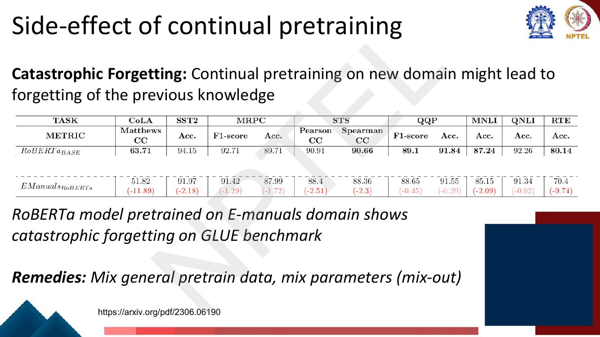
*Fig. — Every single GLUE task degrades after continual pretraining on E-manuals. The drops are not uniform: CoLA loses 11.89 and RTE 9.74, while QQP loses only 0.45. The small-data, syntax-sensitive tasks suffer most. Page 121.*

**Catastrophic forgetting**: continual pretraining on a new domain makes the model forget what it knew
before. The deck's evidence is a RoBERTa pretrained on the E-manuals domain, evaluated on GLUE
([Lec 28](28-span-tasks-t5-bart.md) owns GLUE), against RoBERTa-BASE:

| Task | Metric | RoBERTa-BASE | E-Manuals RoBERTa | Δ |
|---|---|---|---|---|
| CoLA | Matthews CC | 63.71 | 51.82 | **−11.89** |
| SST2 | Acc. | 94.15 | 91.97 | −2.18 |
| MRPC | F1 / Acc. | 92.71 / 89.71 | 91.42 / 87.99 | −1.29 / −1.72 |
| STS | Pearson / Spearman | 90.91 / 90.66 | 88.4 / 88.36 | −2.51 / −2.3 |
| QQP | F1 / Acc. | 89.1 / 91.84 | 88.65 / 91.55 | −0.45 / −0.29 |
| MNLI | Acc. | 87.24 | 85.15 | −2.09 |
| QNLI | Acc. | 92.26 | 91.34 | −0.92 |
| RTE | Acc. | 80.14 | 70.4 | **−9.74** |

**Remedies the deck names:** mix general pretraining data back in, and **mix-out** (mix parameters —
stochastically revert some fine-tuned weights to their pretrained values). Both are instances of the
same idea: do not let the new objective own all of the weights. A cheaper modern alternative is to
freeze the backbone and adapt only a tiny adapter or low-rank update — PEFT and LoRA, which
[Lec 46](../week-10/46-peft-adapters-prefix.md) and [Lec 47](../week-10/47-lora-and-variants.md) own.

---

### Part 2 — Multilingual pretraining

### Why

Two routes exist (p. 123). You can **pretrain a BERT-like model per language on monolingual data** —
the deck names BERTje (Dutch), FlauBERT (French), PhoBERT (Vietnamese). Or you can **pretrain one
model on a large mixture of many languages** — mBERT, mBART, XLM-R, mT5, byT5. The second route's
payoff, in the deck's words, is that it "allows for transfer learning *across* languages": a task
labelled only in English can be served in Swahili.

### mBERT

| Aspect | mBERT |
|---|---|
| **Architecture** | almost exactly BERT ([Lec 27](27-bert-masked-lm.md)) |
| **Data** | Wikipedia pages of **104 languages** |
| **Vocabulary** | a single **shared 110k WordPiece** vocabulary |
| **Objective** | same as BERT (MLM + NSP) |
| **Size** | 12-layer, 768-hidden, 12-heads, **110M parameters** (`BERT-Base, Multilingual Cased`) |

The single shared vocabulary is what makes it multilingual rather than 104 models in a trenchcoat.
Subword pieces that appear in several languages — numerals, Latin-script roots, punctuation — get one
embedding, and that shared substrate is a large part of why zero-shot transfer works at all. The
deck's checkpoint listing also shows the deprecated `Multilingual Uncased` covering **102** languages;
104 is the cased, recommended one.

### Temperature-based data sampling

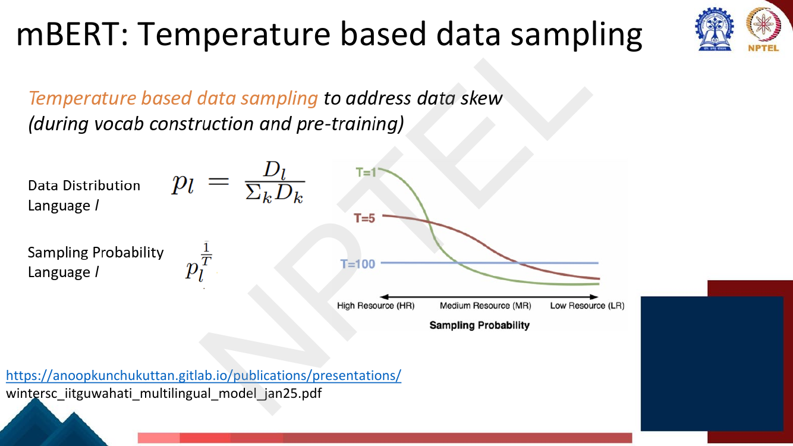
*Fig. — The two formulas are the whole idea. Read the curves right to left: at T=1 (green) low-resource languages fall off a cliff; at T=100 (blue) the line is flat — every language sampled equally; T=5 (red) is the compromise mBERT uses. Page 125.*

If you build the corpus by concatenating Wikipedias and sampling uniformly *over sentences*, English
dominates and Assamese is effectively absent — both from the pretraining batches and from the
WordPiece vocabulary built on the same sample. The deck's fix, used "during vocab construction **and**
pre-training":

Let $D_l$ be the amount of data (tokens, pages) for language $l$. The raw **data distribution** is

$$p_l = \frac{D_l}{\sum_k D_k}$$

and the **sampling probability** is $p_l$ raised to a fractional power:

$$q_l \;\propto\; p_l^{1/T}, \qquad\text{i.e.}\qquad q_l = \frac{p_l^{1/T}}{\sum_k p_k^{1/T}}$$

$T \ge 1$ is the **temperature**. Why does this flatten things? Because for $p \in (0,1)$ and exponent
$1/T < 1$, raising to that power moves every probability *toward 1*, and it moves the small ones much
further in relative terms. A probability of $0.9$ raised to $0.2$ is $0.979$ (barely changed); $0.001$
raised to $0.2$ is $0.251$ — a 251× relative lift. Renormalising then redistributes share from the
head to the tail.

The three limits are the examinable part:

| $T$ | Exponent $1/T$ | Effect |
|---|---|---|
| $T = 1$ | 1 | $q_l = p_l$ — **proportional** sampling, low-resource languages swamped |
| $T = 5$ | 0.2 | the deck's compromise; mBERT's setting |
| $T \to \infty$ (deck: $T=100$) | $\to 0$ | $q_l \to 1/L$ — **uniform** over languages, high-resource data badly under-used |

**You have seen this exact trick before.** word2vec's negative sampling draws noise words from
$P_n(w) \propto U(w)^{3/4}$ ([Lec 13](../week-03/13-negative-sampling-glove.md)) — the same operation,
raising an empirical distribution to a fractional power to flatten it, with exponent $3/4$ instead of
$1/T$. Setting $1/T = 3/4$ gives $T = 4/3$. GloVe's weighting function uses $3/4$ too. The lesson
generalises: **whenever a frequency distribution is Zipfian and you need the tail to survive, raise it
to a power less than 1.**

The **mC4** corpus (p. 130), used by mT5, writes the same thing with the exponent named directly:
$p^\alpha$ with $\alpha \in \{0.2, 0.3, 0.7\}$ plotted, mT5 using $\alpha = 0.3$. **$\alpha = 1/T$** —
do not let the two notations fool you into thinking they are different methods. mC4 covers
**107 languages**, with "lower-resource languages upsampled based on their frequency in the dataset".

### XLM: adding a translation objective

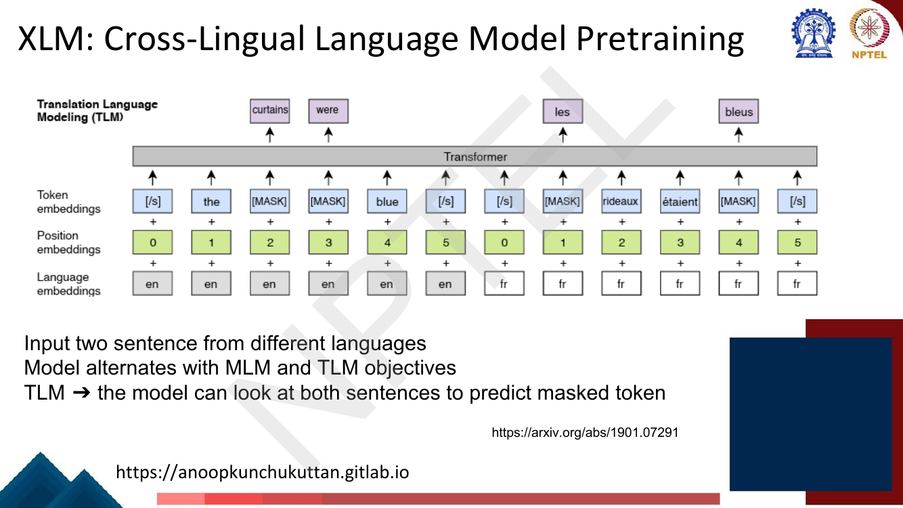
*Fig. — Note three input streams, not two: token + position + **language** embeddings. Note also that French positions restart at 0, and that masked French words can be recovered by attending to the unmasked English. Page 127.*

**XLM** (Cross-lingual Language Model pretraining, Conneau and Lample 2019) alternates two objectives:

- **MLM** — ordinary masked language modelling on monolingual text, as in BERT.
- **TLM (Translation Language Modeling)** — feed a *parallel sentence pair* from two languages as one
  input and mask tokens in both. "The model can look at both sentences to predict masked token."

TLM is the important one. Under plain MLM a model must infer cross-lingual alignment indirectly from
shared subwords; under TLM, when the English context is insufficient the cheapest way to fill a masked
English token is to look across at the French, so gradient descent *forces* the alignment. The price
is that TLM needs **parallel data**, which MLM does not.

### XLM-R: scaling the data

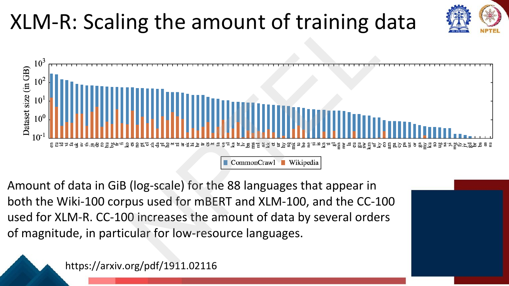
*Fig. — Both axes matter. Log scale: the leftmost language has ~300 GB, the rightmost under 0.1 GB. And the orange (Wikipedia) bars shrink far faster than the blue (CommonCrawl) ones — CC-100 helps low-resource languages most, which is exactly where mBERT was weakest. Page 128.*

**XLM-R** keeps the encoder but changes the diet: from the Wikipedia-based Wiki-100 corpus used by
mBERT and XLM-100, to **CC-100** built from CommonCrawl, which "increases the amount of data by
several orders of magnitude, in particular for low-resource languages". 100 languages, 270M–550M
parameters. It is the clearest demonstration in this deck that for multilingual models, *data scale*
beat *objective cleverness*.

### XNLI — cross-lingual zero-shot evaluation

> **Spelling warning.** The deck writes **"XLNI"** on pages 132 and 133. The benchmark is
> **XNLI** (Cross-lingual Natural Language Inference). Use XNLI; recognise XLNI as the slide's typo.
> Do not confuse either with **XLNet**, an unrelated pretraining model.

The setup (p. 132): you have labelled training data for task X **only in language A**; can you predict
task X in language B? **Zero-shot** means *no labelled data for X in language B*, although unlabelled
B text may have been seen during pretraining. In practice A = English and the model is fine-tuned on
English MNLI only. XNLI itself is natural language inference — premise/hypothesis pairs labelled
**entailment / neutral / contradiction** — professionally translated into 15 languages, with genres
(Face-To-Face, Government, Fiction, Travel, Telephone, Letters, Slate) carried across.

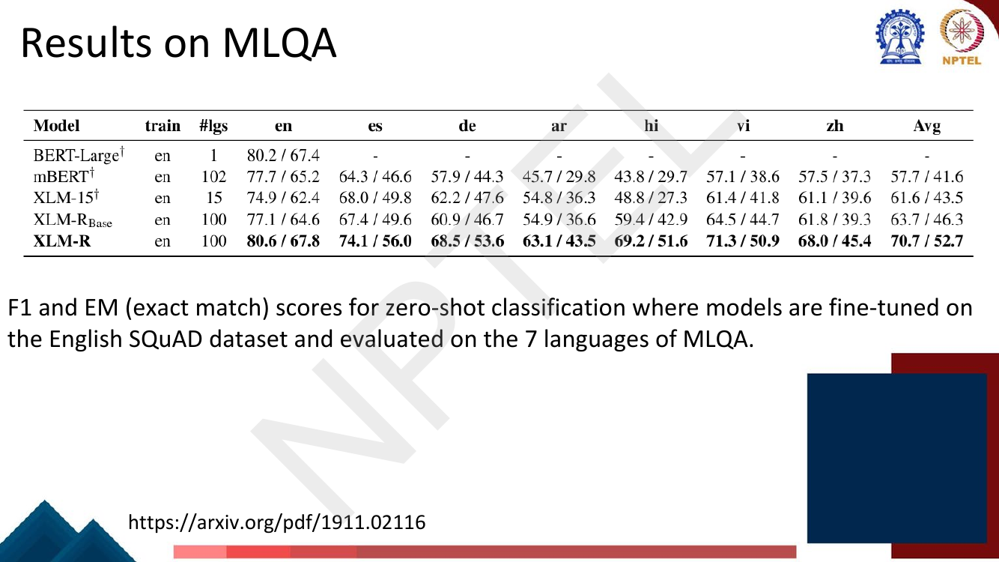
*Fig. — Read the two end columns together. English barely moves (77.7 → 80.6 F1 from mBERT to XLM-R) but Hindi moves 43.8 → 69.2. Scaling data closed the transfer gap, it did not raise the English ceiling. Page 129.*

**MLQA** (p. 129): fine-tune on English SQuAD, evaluate extractive QA in 7 languages. F1 / EM:

| Model | train | #lgs | en | es | de | ar | hi | vi | zh | **Avg** |
|---|---|---|---|---|---|---|---|---|---|---|
| BERT-Large | en | 1 | 80.2 / 67.4 | – | – | – | – | – | – | – |
| mBERT | en | 102 | 77.7 / 65.2 | 64.3 / 46.6 | 57.9 / 44.3 | 45.7 / 29.8 | 43.8 / 29.7 | 57.1 / 38.6 | 57.5 / 37.3 | 57.7 / 41.6 |
| XLM-15 | en | 15 | 74.9 / 62.4 | 68.0 / 49.8 | 62.2 / 47.6 | 54.8 / 36.3 | 48.8 / 27.3 | 61.4 / 41.8 | 61.1 / 39.6 | 61.6 / 43.5 |
| XLM-R$_{\text{Base}}$ | en | 100 | 77.1 / 64.6 | 67.4 / 49.6 | 60.9 / 46.7 | 54.9 / 36.6 | 59.4 / 42.9 | 64.5 / 44.7 | 61.8 / 39.3 | 63.7 / 46.3 |
| **XLM-R** | en | 100 | **80.6 / 67.8** | **74.1 / 56.0** | **68.5 / 53.6** | **63.1 / 43.5** | **69.2 / 51.6** | **71.3 / 50.9** | **68.0 / 45.4** | **70.7 / 52.7** |

Multilingual QA proper is [Lec 32](../week-07/32-question-answering-2.md)'s.

### mT5 and the benchmark comparison

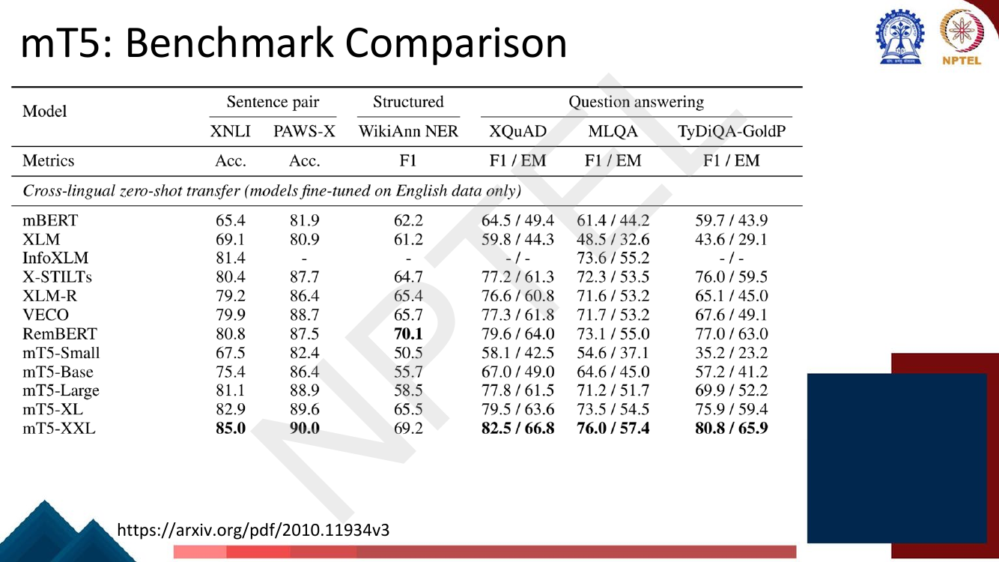
*Fig. — Follow the mT5 column downward: XNLI goes 67.5 → 75.4 → 81.1 → 82.9 → 85.0 from Small to XXL. mT5-Small is *worse* than mBERT on NER (50.5 vs 62.2); only scale makes the encoder-decoder win. Page 134.*

**mT5** is multilingual T5 ([Lec 28](28-span-tasks-t5-bart.md) owns T5's architecture): encoder-decoder,
300M–13B parameters, **101 languages**, trained on mC4. The deck's model-comparison table:

| Model | Architecture | Parameters | # languages | Data source |
|---|---|---|---|---|
| mBERT (Devlin, 2018) | Encoder-only | 180M | 104 | Wikipedia |
| XLM (Conneau & Lample, 2019) | Encoder-only | 570M | 100 | Wikipedia |
| XLM-R (Conneau et al., 2020) | Encoder-only | 270M–550M | 100 | Common Crawl (CCNet) |
| mBART (Lewis et al., 2020b) | Encoder-decoder | 680M | 25 | Common Crawl (CC25) |
| MARGE (Lewis et al., 2020a) | Encoder-decoder | 960M | 26 | Wikipedia or CC-News |
| mT5 | Encoder-decoder | 300M–13B | 101 | Common Crawl (mC4) |

Zero-shot transfer scores (fine-tuned on English only): XNLI accuracy — mBERT 65.4, XLM 69.1,
XLM-R 79.2, RemBERT 80.8, mT5-Small 67.5, mT5-Base 75.4, mT5-Large 81.1, mT5-XL 82.9, **mT5-XXL 85.0**.
PAWS-X: mT5-XXL **90.0**. WikiAnn NER F1: RemBERT **70.1**, mT5-XXL 69.2 — the one column mT5-XXL does
not win. XQuAD F1/EM: mT5-XXL **82.5 / 66.8**. MLQA: **76.0 / 57.4**. TyDiQA-GoldP: **80.8 / 65.9**.

### Adding translation data

The deck's next in-deck question (p. 135): *"What if we use a machine translation system to get more
labeled data (e.g., translate all the labeled English text to other languages)?"* This is
**translate-train**: machine-translate the English training set into each target language and
fine-tune on the union. It is no longer zero-shot — you have manufactured labelled target-language
data, assuming labels survive translation.

| Model | XNLI zero-shot | XNLI translate-train | Δ | PAWS-X zero-shot | PAWS-X translate-train | Δ |
|---|---|---|---|---|---|---|
| XLM-R | 79.2 | 82.6 | **+3.4** | 86.4 | 90.4 | **+4.0** |
| VECO | 79.9 | 83.0 | +3.1 | 88.7 | 91.1 | +2.4 |
| mT5-Small | 67.5 | 64.7 | **−2.8** | 82.4 | 79.9 | −2.5 |
| mT5-Base | 75.4 | 75.9 | +0.5 | 86.4 | 89.3 | +2.9 |
| mT5-Large | 81.1 | 81.8 | +0.7 | 88.9 | 91.2 | +2.3 |
| mT5-XL | 82.9 | 84.8 | +1.9 | 89.6 | 91.0 | +1.4 |
| mT5-XXL | 85.0 | **87.8** | +2.8 | 90.0 | **91.5** | +1.5 |
| FILTER + Self-Teaching | — | 83.9 | — | — | 91.4 | — |

Two things to take: translation data buys a few points — real, not transformative — and for
**mT5-Small it *hurts*** (−2.8 XNLI). Small models have too little capacity to absorb noisy
machine-translated text on top of their existing load. That is the curse of multilinguality announcing
itself one slide early.

### IndicBERT — a language-family-specific model

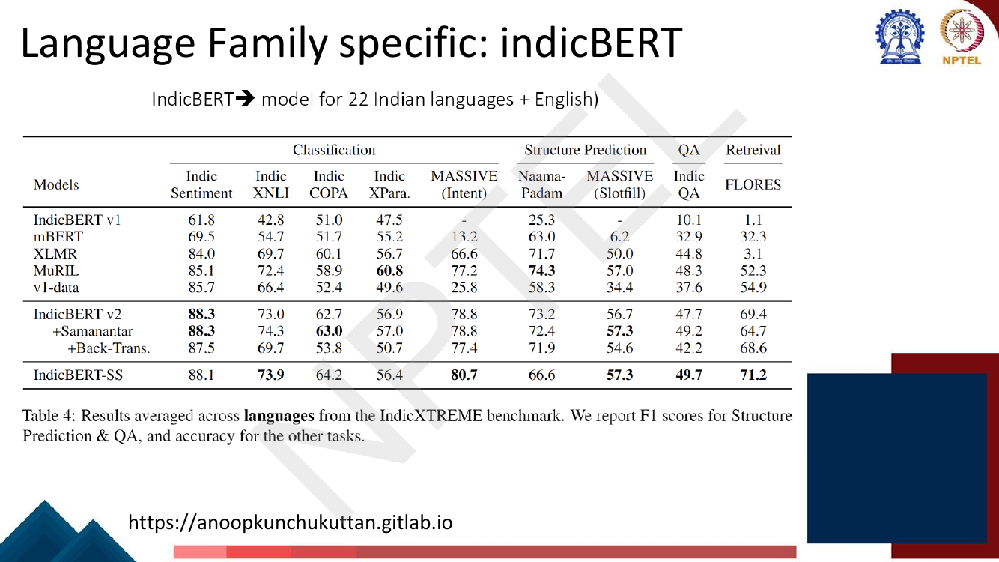
*Fig. — Compare the IndicBERT v2 row against XLMR and mBERT. The gains are large where the task is Indic-specific (IndicSentiment 88.3 vs 69.5 for mBERT; FLORES retrieval 69.4 vs 3.1 for XLMR) and small or negative on IndicXPara. Page 136.*

**IndicBERT** is a model for **22 Indian languages + English** — the middle path between one model per
language and one model for all 104. A language family shares script families, loanwords, morphology
and syntax, so capacity spent on Hindi partly transfers to Marathi; nothing is spent on Finnish.
On IndicXTREME (averaged across languages; F1 for structure prediction and QA, accuracy elsewhere):

| Model | IndicSentiment | IndicXNLI | IndicCOPA | IndicXPara | MASSIVE (Intent) | Naamapadam | MASSIVE (Slotfill) | IndicQA | FLORES |
|---|---|---|---|---|---|---|---|---|---|
| IndicBERT v1 | 61.8 | 42.8 | 51.0 | 47.5 | – | 25.3 | – | 10.1 | 1.1 |
| mBERT | 69.5 | 54.7 | 51.7 | 55.2 | 13.2 | 63.0 | 6.2 | 32.9 | 32.3 |
| XLMR | 84.0 | 69.7 | 60.1 | 56.7 | 66.6 | 71.7 | 50.0 | 44.8 | 3.1 |
| MuRIL | 85.1 | 72.4 | 58.9 | **60.8** | 77.2 | **74.3** | 57.0 | 48.3 | 52.3 |
| **IndicBERT v2** | **88.3** | 73.0 | 62.7 | 56.9 | 78.8 | 73.2 | 56.7 | 47.7 | 69.4 |
| v2 + Samanantar | **88.3** | 74.3 | **63.0** | 57.0 | 78.8 | 72.4 | **57.3** | 49.2 | 64.7 |
| v2 + Back-Trans. | 87.5 | 69.7 | 53.8 | 50.7 | 77.4 | 71.9 | 54.6 | 42.2 | 68.6 |
| IndicBERT-SS | 88.1 | **73.9** | 64.2 | 56.4 | **80.7** | 66.6 | **57.3** | **49.7** | **71.2** |

(**Samanantar** is a parallel corpus — note that adding it helps, while adding back-translated data
mostly hurts, the same lesson as mT5-Small.)

### The curse of multilinguality

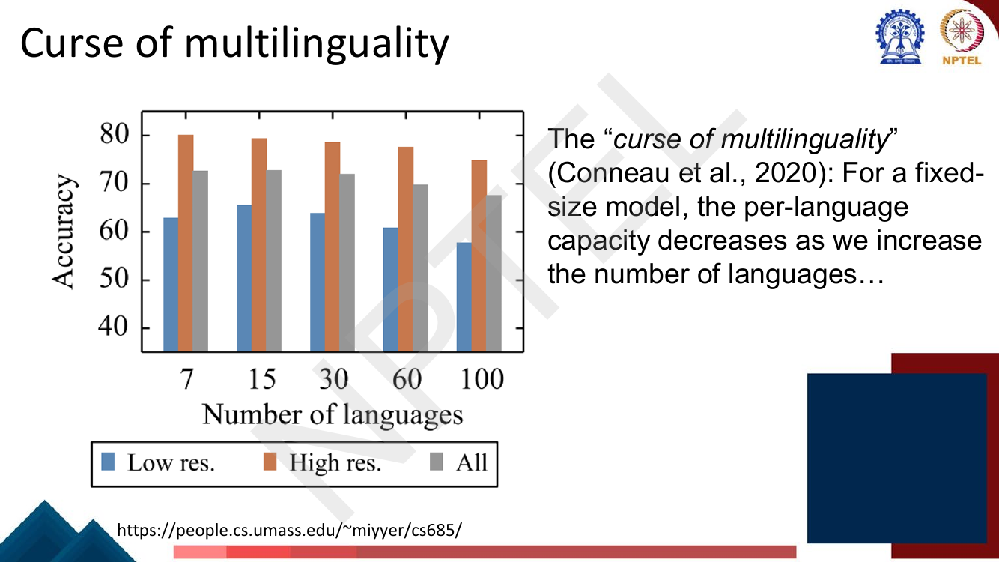
*Fig. — The low-resource (blue) bars are the ones to read: they **rise** from 7 to 15 languages and then fall steadily. The high-resource (orange) bars only ever fall. Both effects are present at once, which is what makes this a trade-off and not just a loss. Page 137.*

This is the chapter's most examinable idea. Conneau et al. (2020), as the deck states it:

> For a **fixed-size model**, the **per-language capacity decreases** as we increase the number of
> languages.

The full statement has two halves and you need both:

1. **Up to a point, adding languages *helps*,** especially low-resource ones, through **positive
   transfer** — shared subwords, shared syntax, a shared notion of what language is. The deck's chart
   puts the low-resource peak at **15 languages**.
2. **Past that point, adding languages *hurts* every language,** because a fixed parameter budget must
   now encode more of them. The deck's chart: low-resource accuracy falls from ≈65.6 at 15 languages
   to ≈57.6 at 100.

Read off the chart (approximate, ±0.5):

| # languages | Low-resource | High-resource | All |
|---|---|---|---|
| 7 | 62.9 | 80.1 | 72.6 |
| **15** | **65.6** (peak) | 79.5 | **72.9** (peak) |
| 30 | 63.8 | 78.6 | 72.0 |
| 60 | 60.8 | 77.5 | 69.8 |
| 100 | 57.6 | 74.9 | 67.4 |

Note the asymmetry: **high-resource languages decline monotonically from the start** (they only ever
lose capacity to newcomers), while **low-resource languages first gain from transfer, then lose to
dilution**. The net curve for "all" peaks at 15 too.

Three escapes, and the deck demonstrates all three:
- **Grow the model** — the curse is about *fixed* capacity. mT5-XXL at 13B gets 85.0 XNLI where
  mT5-Small gets 67.5.
- **Restrict the language set** — IndicBERT's 22 related languages instead of 104 unrelated ones.
- **Give languages private parameters** — adapters, language-specific experts. How such
  language-specific structure arises even in fully shared models is
  [Lec 57](../week-12/57-interpretability-multilingual.md)'s subject.

### Extending vocabulary

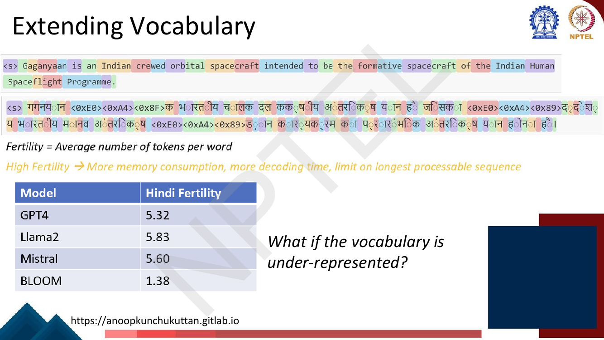
*Fig. — Look at the two coloured strips, not the numbers first. The English line splits into words; the Hindi line is littered with raw byte fallbacks like `<0xE0><0xA4><0x8F>`, which carry no meaning at all. BLOOM's 1.38 is low because BLOOM's vocabulary was built to include Indic languages. Page 138.*

The deck defines **fertility = average number of tokens per word**, and names the consequences of high
fertility: *more memory consumption, more decoding time, limit on longest processable sequence.*

| Model | Hindi fertility |
|---|---|
| GPT-4 | 5.32 |
| Llama 2 | 5.83 |
| Mistral | 5.60 |
| **BLOOM** | **1.38** |

Llama 2 needs **5.83 tokens per Hindi word**. This is the same pathology as SciBERT's domain
vocabulary, and it is the fix [Lec 2](../week-01/02-text-processing-tokenization.md) explicitly handed
forward when it showed that subword tokenizers fragment under-represented scripts disproportionately.

### How to extend tokenizer vocabulary

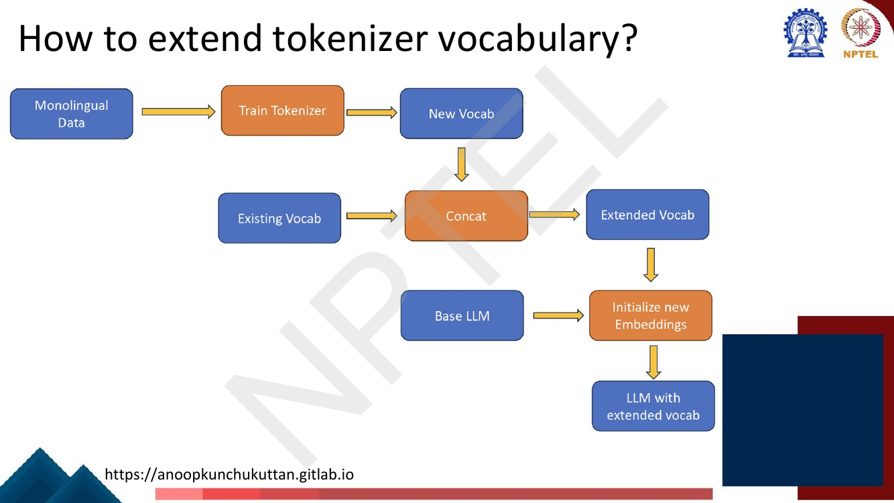
*Fig. — Trace the two inbound arrows into "Initialize new Embeddings": the extended vocabulary and the **base LLM**. The new rows are not random — they are derived from the model you already have. Page 139.*

The pipeline (p. 139), in four steps:

1. **Train a tokenizer** on monolingual data in the new language → a **new vocab**.
2. **Concatenate** it with the existing vocab → an **extended vocab** (deduplicated; genuinely new
   pieces only).
3. **Initialise new embeddings** using the base LLM. The standard choice is to set a new token's
   embedding to the **mean of the embeddings of the old tokens it used to be split into** — so
   `गगनयान` starts at the average of its former 5-piece decomposition, which is already roughly
   right rather than random noise. (Alternatives: mean of the whole embedding matrix; small Gaussian
   noise around that mean.)
4. You now have an **LLM with extended vocab** — but the new rows are untrained. You must
   **continually pretrain**.

Crucially this *avoids* SciBERT's dilemma: because you **add** rows rather than **replace** the
vocabulary, every old token id keeps its meaning and the model is not destroyed. Pretraining from
scratch is unnecessary.

### Continual pretraining, and uptraining

**Continual pretraining** (p. 140): take a base LLM plus monolingual data in the new language and
train further with the **causal language modelling objective**

$$p(\mathbf{x}) = p(x_1, x_2, \ldots, x_T) = \prod_{t=1}^{T} p(x_t \mid \mathbf{x}_{<t})$$

The deck gives two recipes attached to two goals:

| Goal | Recipe |
|---|---|
| **Avoid forgetting English** competence and knowledge | include English in the pretraining data |
| **Align English and the new language** | pretrain on **parallel data**; pretrain on **romanized data** |

Romanization is a neat trick worth noticing: transliterating Hindi into Latin script forces an overlap
with the model's existing English-shaped subword inventory, creating a bridge where the native script
shares nothing.

**Uptraining** is the deck's closing concept, and it answers a different question: *how do you make a
pretrained model work with a slightly different **architecture**?* Not new data, not new vocabulary —
new structure. You keep the trained weights, surgically convert them to the new shape, and train
briefly to let the model recover.

**Case 1 — multi-head → multi-query / grouped-query attention** (pp. 142–143). MQA and GQA share key
and value projections across heads to shrink the inference-time KV cache ([Lec 52](../week-11/52-modern-llms-and-activations.md)
owns the architecture). To convert an existing multi-head checkpoint:

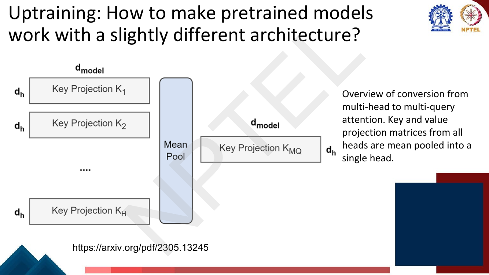
*Fig. — The conversion is a **mean pool across heads**, not a discard-all-but-one. Averaging preserves the component of each head's projection that they share, which is why only 5% of the original pretraining compute is needed to recover. Page 143.*

> Uptrained models are initialized from public T5.1.1 checkpoints. The key and value heads are
> mean-pooled to the appropriate MQA or GQA structure, and then pre-trained for a further
> (**α = 0.05**) proportion of original pre-training steps with the original pre-training setup and
> dataset.

That **α = 0.05** is the number to remember: **5% of the original pretraining budget**, versus 100% to
retrain. (Beware: this $\alpha$ has nothing to do with the sampling $\alpha = 1/T$.)

**Case 2 — training MoEs from dense checkpoints** ("sparse upcycling", p. 144). Replace an MLP layer
with a Mixture-of-Experts layer. All parameters and optionally their optimizer state are copied from
the dense checkpoint; the **experts are identical copies of the original MLP**; only the **router**,
which does not exist in the dense architecture, is initialised from scratch. Identical experts means
the upcycled model starts behaving exactly like the dense one, then differentiates as the router
learns to route.

## Worked numericals

The deck contains **no "Try this problem" page** in pp. 114–146. It does pose **three in-deck
questions** whose answers are the following slides, and I work all three below (N6) alongside five
computations of the kind the exam asks.

### N1. Temperature-based sampling for five languages (the centrepiece)
**Given:** monolingual corpus sizes, in millions of tokens — English 1000, Hindi 100, Bengali 50,
Tamil 20, Assamese 1.
**Find:** the proportional distribution $p_l$, and the temperature-adjusted distribution $q_l$ at
$T = 5$ (the deck's setting).

1. Total: $\sum_k D_k = 1000 + 100 + 50 + 20 + 1 = \mathbf{1171}$ M tokens.
2. Proportional distribution $p_l = D_l / 1171$:
   - $p_{\text{en}} = 1000/1171 = 0.85397$
   - $p_{\text{hi}} = 100/1171 = 0.08540$
   - $p_{\text{bn}} = 50/1171 = 0.04270$
   - $p_{\text{ta}} = 20/1171 = 0.01708$
   - $p_{\text{as}} = 1/1171 = 0.00085$
3. Raise each to $1/T = 1/5 = 0.2$:
   - $0.85397^{0.2} = 0.96892$
   - $0.08540^{0.2} = 0.61135$
   - $0.04270^{0.2} = 0.53221$
   - $0.01708^{0.2} = 0.44309$
   - $0.00085^{0.2} = 0.24338$
4. Sum of the unnormalised values: $0.96892 + 0.61135 + 0.53221 + 0.44309 + 0.24338 = \mathbf{2.79895}$.
5. Divide each by 2.79895:

| Language | $D_l$ (M) | $p_l$ ($T=1$) | $p_l^{0.2}$ | $q_l$ ($T=5$) | Gain $q_l/p_l$ |
|---|---|---|---|---|---|
| English | 1000 | 0.85397 | 0.96892 | **0.34617** | 0.41× |
| Hindi | 100 | 0.08540 | 0.61135 | **0.21842** | 2.56× |
| Bengali | 50 | 0.04270 | 0.53221 | **0.19015** | 4.45× |
| Tamil | 20 | 0.01708 | 0.44309 | **0.15831** | 9.27× |
| Assamese | 1 | 0.00085 | 0.24338 | **0.08695** | **101.8×** |
| | 1171 | 1.00000 | 2.79895 | 1.00000 | |

6. Read it as batches: in 1,000,000 training examples, Assamese goes from **854** examples to
   **86,955**. English falls from 853,971 to 346,173.
7. Sanity check the limits: at $T = 1$ the table's third column *is* the answer; at $T = 100$ the
   exponent is 0.01 and every $q_l \to 1/5 = 0.2$ (the code prints 0.207, 0.202, 0.200, 0.199, 0.193).

**Answer:** $q = (0.346,\ 0.218,\ 0.190,\ 0.158,\ 0.087)$. **Temperature 5 cuts English's share from
85.4% to 34.6% and lifts Assamese from 0.085% to 8.7% — a 102× relative gain for the smallest
language.**

### N2. Tokenizer fragmentation and the context-length penalty
**Given:** the deck's Hindi fertilities — Llama 2 = 5.83, GPT-4 = 5.32, BLOOM = 1.38 tokens/word. A
model with a 4096-token context window. A Hindi document of 600 words.
**Find:** tokens consumed, whether the document fits, and the effective context penalty.

1. Tokens under Llama 2: $600 \times 5.83 = \mathbf{3498}$ tokens.
2. Tokens under BLOOM: $600 \times 1.38 = \mathbf{828}$ tokens.
3. Both fit in 4096, but Llama 2 has only $4096 - 3498 = 598$ tokens left; BLOOM has 3268.
4. Maximum Hindi words that fit in 4096 tokens:
   - Llama 2: $4096 / 5.83 = \mathbf{702}$ words
   - GPT-4: $4096 / 5.32 = \mathbf{770}$ words
   - BLOOM: $4096 / 1.38 = \mathbf{2968}$ words
5. Penalty ratio, Llama 2 vs BLOOM: $5.83 / 1.38 = \mathbf{4.22\times}$. Llama 2 processes **4.22×
   less Hindi text** per unit of context than BLOOM.
6. Attention compute scales as $O(T^2)$, so the same passage costs $(5.83/1.38)^2 = \mathbf{17.9\times}$
   more attention FLOPs under Llama 2.

**Answer:** 3498 vs 828 tokens; Llama 2 fits 702 Hindi words against BLOOM's 2968 — a **4.22×
context penalty and ≈17.9× attention-cost penalty**, purely from tokenization.

### N3. The parameter cost of extending a vocabulary
**Given:** a model with embedding dimension $d = 4096$ and vocabulary $|V| = 32{,}000$. You extend
the vocabulary by $n = 20{,}000$ Indic tokens.
**Find:** parameters added, with tied and with untied output embeddings; and the fraction of a
6.74B-parameter model.

1. An embedding matrix is $|V| \times d$. Original: $32{,}000 \times 4096 = 131{,}072{,}000 =
   \mathbf{131.07\text{M}}$.
2. Added rows: $n \times d = 20{,}000 \times 4096 = 81{,}920{,}000 = \mathbf{81.92\text{M}}$.
3. **If input and output embeddings are tied** (one matrix reused for the softmax projection), that is
   the whole cost: **+81.92M**.
4. **If untied**, the output projection $\mathbf{W}_{\text{out}} \in \mathbb{R}^{|V| \times d}$ is a
   separate matrix and grows by the same amount, so the cost **doubles**:
   $2 \times 81.92\text{M} = \mathbf{163.84\text{M}}$.
5. As a fraction of a 6.74B model: tied, $81.92/6740 = \mathbf{1.22\%}$; untied,
   $163.84/6740 = \mathbf{2.43\%}$.
6. New vocabulary size: $32{,}000 + 20{,}000 = 52{,}000$; new embedding matrix
   $52{,}000 \times 4096 = 212.99$M.

**Answer:** **+81.92M parameters tied, +163.84M untied** — 1.22% / 2.43% of the model. Cheap, which is
precisely why vocabulary extension is preferred over retraining from scratch. The *expensive* part is
step 4 of the pipeline: continually pretraining so the 20,000 new rows become meaningful.

### N4. The curse of multilinguality, quantified
**Given:** the deck's chart (p. 137), low-resource accuracy at 7 / 15 / 30 / 60 / 100 languages:
62.9 / 65.6 / 63.8 / 60.8 / 57.6.
**Find:** the peak, the gain before it, the loss after it, and the net.

1. **Peak** is at **15 languages**, accuracy **65.6**.
2. Gain from 7 → 15: $65.6 - 62.9 = \mathbf{+2.7}$ points. This is **positive transfer**.
3. Loss from 15 → 100: $57.6 - 65.6 = \mathbf{-8.0}$ points. This is **capacity dilution**.
4. Net, 7 → 100: $57.6 - 62.9 = \mathbf{-5.3}$ points — adding 93 languages left low-resource
   performance *worse* than it started.
5. High-resource, same range: $74.9 - 80.1 = \mathbf{-5.2}$ points, and **monotone** — no peak at all,
   because high-resource languages never needed the transfer.
6. Average loss per language added past the peak: $8.0 / (100 - 15) = \mathbf{0.094}$ points per
   language.

**Answer:** low-resource peaks at **15 languages (65.6)**, gaining **+2.7** on the way up and losing
**−8.0** on the way down, for a net **−5.3**. High-resource falls monotonically **−5.2**. *The curse
is not "more languages is bad" — it is "more languages is good until capacity runs out."*

### N5. Zero-shot transfer gap from the MLQA table
**Given:** MLQA F1 (p. 129): mBERT en 77.7, hi 43.8, ar 45.7, avg 57.7; XLM-R en 80.6, hi 69.2,
ar 63.1, avg 70.7.
**Find:** the English-minus-target transfer gap for each, and how much XLM-R closed it.

1. **mBERT Hindi gap:** $77.7 - 43.8 = \mathbf{33.9}$ F1.
2. **XLM-R Hindi gap:** $80.6 - 69.2 = \mathbf{11.4}$ F1.
3. Gap closed on Hindi: $33.9 - 11.4 = \mathbf{22.5}$ F1 — a **66.4%** reduction.
4. **mBERT Arabic gap:** $77.7 - 45.7 = \mathbf{32.0}$. **XLM-R Arabic gap:** $80.6 - 63.1 = \mathbf{17.5}$.
5. **Average gap** (English minus the 7-language average): mBERT $77.7 - 57.7 = \mathbf{20.0}$;
   XLM-R $80.6 - 70.7 = \mathbf{9.9}$. Halved.
6. English itself improved only $80.6 - 77.7 = 2.9$ F1 — so **88% of XLM-R's average gain came from
   non-English languages**, not from a better model overall.

**Answer:** the Hindi transfer gap falls from **33.9 to 11.4 F1** and the average gap from **20.0 to
9.9**. *Zero-shot transfer gap, not raw score, is the quantity that measures how multilingual a model
really is.*

### N6. The deck's three in-deck questions, answered
**(a) p. 118 — "While Option 2 [continual pretraining from BERT] looks better, answer is not always
that simple. Why?"**
Because continual pretraining **cannot change the vocabulary**. SCIVOCAB and BASEVOCAB overlap only
**42%**, so 58% of the scientific tokenizer's preferred units are unavailable and in-domain terms stay
fragmented. Replacing the vocabulary requires pretraining from scratch, since embedding rows are
indexed by token id. The experiments nonetheless show scratch+SCIVOCAB gives only a **slight** edge —
the gain comes mostly from the **corpus**, not the vocabulary. A second reason: continual pretraining
causes **catastrophic forgetting** (p. 121).

**(b) p. 135 — "What if we use a machine translation system to get more labeled data?"**
You get **translate-train**, and a few points. XLM-R XNLI **79.2 → 82.6** (+3.4), PAWS-X
**86.4 → 90.4** (+4.0); mT5-XXL XNLI **85.0 → 87.8** (+2.8). But mT5-Small goes **67.5 → 64.7**
(**−2.8**) — a small model cannot absorb the extra noisy data. And the result is no longer zero-shot.

**(c) p. 138 — "What if the vocabulary is under-represented?"**
Fertility explodes — Llama 2 needs **5.83** tokens per Hindi word against BLOOM's **1.38** — giving
more memory, slower decoding and a shorter effective sequence limit (N2: a **4.22×** penalty). The fix
is pp. 139–140: train a tokenizer on monolingual data, **concatenate** rather than replace, initialise
the new embedding rows from the base LLM, and continually pretrain — mixing in English to avoid
forgetting and parallel/romanized data to align.

## Code

```python
import numpy as np

langs  = ["English", "Hindi", "Bengali", "Tamil", "Assamese"]
tokens = np.array([1000.0, 100.0, 50.0, 20.0, 1.0])   # millions of tokens

def temperature_sample(counts, T):
    """mBERT/XLM-R recipe: p_l = D_l / sum_k D_k, then q_l proportional to p_l^(1/T)."""
    p = counts / counts.sum()          # raw data distribution
    q = p ** (1.0 / T)                 # flatten by raising to a power < 1
    return p, q / q.sum()              # renormalise back to a distribution

p, _ = temperature_sample(tokens, 1)
cols = [temperature_sample(tokens, T)[1] for T in (2, 5, 100)]
print(f"{'language':<10}{'D_l (M)':>9}{'p_l (T=1)':>12}"
      + "".join(f"{'q_l (T='+str(T)+')':>13}" for T in (2, 5, 100)))
for i, lg in enumerate(langs):
    print(f"{lg:<10}{tokens[i]:>9.0f}{p[i]:>12.5f}"
          + "".join(f"{c[i]:>13.5f}" for c in cols))
print(f"{'TOTAL':<10}{tokens.sum():>9.0f}{p.sum():>12.5f}"
      + "".join(f"{c.sum():>13.5f}" for c in cols))

q5 = cols[1]
print("\nT=5 gain factor q_l/p_l:",
      ", ".join(f"{lg}={q5[i]/p[i]:.2f}x" for i, lg in enumerate(langs)))
print("\nSamples per 1M draws, T=1 vs T=5:")
for i, lg in enumerate(langs):
    print(f"  {lg:<10}{p[i]*1e6:>12.0f}{q5[i]*1e6:>12.0f}")

# the word2vec parallel: the 3/4 power IS 1/T with T = 4/3
u = np.array([0.90, 0.09, 0.01])
print("\nword2vec noise distribution, same trick, exponent 3/4 (i.e. T = 4/3):")
print("  raw        ", np.round(u, 4))
print("  ^0.75      ", np.round(u ** 0.75, 4))
print("  renormalised", np.round(u**0.75 / (u**0.75).sum(), 4))
```

```
language     D_l (M)   p_l (T=1)    q_l (T=2)    q_l (T=5)  q_l (T=100)
English         1000     0.85397      0.58381      0.34617      0.20650
Hindi            100     0.08540      0.18462      0.21842      0.20180
Bengali           50     0.04270      0.13054      0.19015      0.20041
Tamil             20     0.01708      0.08256      0.15831      0.19858
Assamese           1     0.00085      0.01846      0.08695      0.19272
TOTAL           1171     1.00000      1.00000      1.00000      1.00000

T=5 gain factor q_l/p_l: English=0.41x, Hindi=2.56x, Bengali=4.45x, Tamil=9.27x, Assamese=101.82x

Samples per 1M draws, T=1 vs T=5:
  English         853971      346173
  Hindi            85397      218420
  Bengali          42699      190146
  Tamil            17079      158307
  Assamese           854       86955

word2vec noise distribution, same trick, exponent 3/4 (i.e. T = 4/3):
  raw         [0.9  0.09 0.01]
  ^0.75       [0.924  0.1643 0.0316]
  renormalised [0.825  0.1467 0.0282]
```

Read the $T=100$ column: every language converges on $1/5 = 0.2$. That is the uniform limit, and it is
why nobody uses it — English's 1000M tokens would be visited as rarely as Assamese's 1M, wasting the
data you actually have. $T=5$ is the compromise curve on the deck's plot.

## Exam pack

### Must-memorise

| Item | Exactly this |
|---|---|
| Data distribution | $p_l = \dfrac{D_l}{\sum_k D_k}$ |
| Temperature sampling | $q_l \propto p_l^{1/T}$, renormalised; $T\ge 1$ |
| $T=1$ / $T\to\infty$ | proportional / uniform over languages |
| mC4 / mT5 notation | $p^\alpha$ with $\alpha = 1/T$; mT5 uses $\alpha = 0.3$ |
| Same trick elsewhere | word2vec $P_n(w)\propto U(w)^{3/4}$ ([Lec 13](../week-03/13-negative-sampling-glove.md)) |
| SCIVOCAB ∩ BASEVOCAB | **42%** overlap |
| SciBERT's main source of gain | the **scientific corpus**, not the vocabulary |
| Vocabulary replacement requires | pretraining **from scratch** (continual pretraining cannot do it) |
| Catastrophic forgetting | continual pretraining on a new domain degrades the old domain |
| Forgetting remedies | mix general pretrain data; mix parameters (**mix-out**) |
| mBERT | BERT architecture, Wikipedia, **104 languages**, shared **110k WordPiece**, 110M params |
| XLM objectives | alternates **MLM** and **TLM**; TLM sees both sentences of a parallel pair |
| XLM input embeddings | token + position + **language** |
| XLM-R | encoder-only, **CC-100** CommonCrawl, 100 languages, 270M–550M |
| mT5 | encoder-decoder, **mC4**, **101 languages**, 300M–13B |
| mC4 | **107 languages**, low-resource upsampled |
| XNLI | cross-lingual NLI, entailment/neutral/contradiction; deck misspells it **"XLNI"** |
| Zero-shot cross-lingual | labelled data for task X only in language A; none in B (unlabelled B may exist) |
| Translate-train | MT the English training set into targets; **not** zero-shot |
| IndicBERT | **22 Indian languages + English**; language-family-specific |
| **Curse of multilinguality** | for a **fixed-size** model, **per-language capacity decreases** as the number of languages grows (Conneau et al., 2020) |
| Curse, full form | helps low-resource up to a point (deck: peak at **15** languages), then degrades all |
| Fertility | **average number of tokens per word**; high fertility → more memory, slower decoding, shorter usable sequence |
| Vocabulary extension pipeline | train tokenizer on monolingual data → **concat** with existing vocab → initialise new embeddings from base LLM → continually pretrain |
| Continual pretraining objective | causal LM, $p(\mathbf{x}) = \prod_{t=1}^{T} p(x_t\mid\mathbf{x}_{<t})$ |
| Avoid forgetting English | include English in the pretraining data |
| Align the new language | parallel data; romanized data |
| **Uptraining** | adapt a pretrained checkpoint to a **slightly different architecture**, then briefly re-pretrain |
| MHA → MQA/GQA conversion | key and value heads are **mean-pooled**; further pretrain for **α = 0.05** of original steps |
| Sparse upcycling | copy all dense weights; experts = **identical copies** of the replaced MLP; only the **router** is new |

### Numbers worth knowing

| Quantity | Value |
|---|---|
| SCIVOCAB / BASEVOCAB overlap | **42%** |
| Worst GLUE drop from E-manuals continual pretraining | **CoLA −11.89**, RTE −9.74; smallest QQP −0.45 |
| RoBERTa-BASE CoLA / RTE | 63.71 / 80.14 |
| mBERT languages / vocab / params | 104 (cased) and 102 (uncased, deprecated) / 110k WordPiece / 110M |
| mBERT params in the mC4 table | **180M** (counts the embedding matrix) |
| XLM / XLM-R / mBART / MARGE / mT5 params | 570M / 270M–550M / 680M / 960M / 300M–13B |
| XLM / XLM-R / mBART / MARGE / mT5 languages | 100 / 100 / 25 / 26 / 101 |
| mC4 languages | **107** |
| XLM-R data chart | 88 languages shared between Wiki-100 and CC-100 |
| MLQA F1 — mBERT en / hi / avg | 77.7 / 43.8 / 57.7 |
| MLQA F1 — XLM-R en / hi / avg | **80.6 / 69.2 / 70.7** (EM 67.8 / 51.6 / 52.7) |
| MLQA — BERT-Large (English only) | 80.2 / 67.4 |
| XNLI zero-shot — mBERT / XLM / XLM-R / mT5-XXL | 65.4 / 69.1 / 79.2 / **85.0** |
| PAWS-X zero-shot — mT5-XXL | **90.0** |
| WikiAnn NER F1 — best | **RemBERT 70.1** (mT5-XXL 69.2) |
| XQuAD / MLQA / TyDiQA — mT5-XXL | 82.5/66.8 · 76.0/57.4 · 80.8/65.9 |
| Translate-train XNLI — XLM-R / mT5-XXL | 82.6 / **87.8** |
| Translate-train regression | mT5-Small XNLI 67.5 → **64.7** |
| IndicBERT languages | **22 Indian languages + English** |
| IndicBERT v2 IndicSentiment / FLORES | **88.3** / 69.4 (IndicBERT-SS **71.2**; XLMR only **3.1**) |
| Curse-of-multilinguality peak | **15 languages** |
| Low-resource accuracy, 15 → 100 languages | ≈65.6 → ≈57.6 (**−8.0**) |
| Hindi fertility — GPT-4 / Llama 2 / Mistral / BLOOM | **5.32 / 5.83 / 5.60 / 1.38** |
| Uptraining budget | **α = 0.05** of original pretraining steps |
| Uptraining base checkpoints | public **T5.1.1** |

### Likely MCQ traps

- **"SciBERT's gain comes mainly from its in-domain vocabulary."** No. The paper, quoted on p. 120,
  says SciBERT "benefits most from the **scientific corpus** pretraining"; SCIVOCAB gave only a
  *slight* edge.
- **"You can swap in a domain vocabulary by continuing to pretrain BERT."** No — replacing the
  vocabulary requires pretraining **from scratch**. Only *extending* (adding rows, keeping old ids)
  is compatible with continual pretraining.
- **"Higher temperature $T$ means more weight on high-resource languages."** Backwards. Higher $T$
  means a *smaller* exponent $1/T$, a *flatter* distribution, and *more* weight on low-resource
  languages. $T=1$ is the high-resource-dominated case.
- **Confusing $T$ with $\alpha$.** mC4/mT5 write $p^\alpha$; $\alpha = 1/T$. So $\alpha = 0.2$ is
  $T = 5$. And neither is the **α = 0.05** of uptraining, which is a fraction of training *steps*.
- **Confusing sampling temperature with decoding temperature.** Decoding temperature divides *logits*
  ([Lec 19](../week-04/19-decoding-strategies.md)); here the exponent $1/T$ is applied to a
  *corpus-size distribution*. Opposite direction of effect, too: high decoding $T$ flattens the
  softmax; high sampling $T$ flattens the language mix — similar in spirit, different objects.
- **"The curse of multilinguality says adding languages always hurts."** Incomplete and wrong. It
  helps low-resource languages up to a point (deck's peak: **15**), then hurts. The binding condition
  is **fixed model capacity** — grow the model and the curse recedes.
- **"XLNI" / "XLNet".** The benchmark is **XNLI**. The deck's "XLNI" is a typo. XLNet is a different
  thing entirely (a permutation-LM pretraining model).
- **"TLM replaces MLM in XLM."** No — XLM **alternates** between MLM and TLM. TLM additionally needs
  parallel data.
- **"Zero-shot cross-lingual transfer means the model never saw the target language."** No. It means
  no **labelled** data for the **task** in that language; unlabelled target-language text was almost
  certainly in pretraining.
- **"Translate-train is zero-shot."** No. Manufacturing labelled target-language data by MT makes it
  a supervised setting.
- **"Fertility is vocabulary size" or "higher fertility is better."** Fertility is **tokens per word**,
  and **lower is better**. BLOOM's 1.38 beats Llama 2's 5.83 on Hindi.
- **"Extending the vocabulary by $n$ tokens adds $n \cdot d$ parameters."** Only if input and output
  embeddings are **tied**. Untied, it is $2nd$.
- **"New embedding rows are initialised randomly."** The deck's flowchart feeds the **base LLM** into
  the initialisation step; the standard choice is the mean of the sub-token embeddings the word used
  to decompose into.
- **"Uptraining = continual pretraining."** Different. Continual pretraining changes the **data**;
  uptraining changes the **architecture** (MHA→GQA, dense→MoE) and keeps the weights.
- **"In sparse upcycling, the experts are randomly initialised."** Reverse. The **experts are copies**
  of the original MLP; only the **router** is new.
- **mBERT parameter count: 110M or 180M?** Both appear in this deck. The Google checkpoint listing
  (p. 126) says **110M** for the Transformer; the mT5 paper's table (p. 131) says **180M**, which
  includes the large shared embedding matrix. Read which source the question quotes.

### Self-test

1. State the two formulas of temperature-based data sampling, and say what $T=1$ and $T\to\infty$ give.
2. Three languages have 800M, 150M and 50M tokens. Give the proportional distribution, then the $T=2$ distribution.
3. What is the overlap between SCIVOCAB and BASEVOCAB, and what does that number imply about continual pretraining?
4. Why must you pretrain from scratch to *replace* a vocabulary, but not to *extend* one?
5. State the curse of multilinguality precisely, including the condition under which it holds.
6. Define fertility. Which of the deck's four models has the lowest Hindi fertility, and why would that be?
7. A model has $d = 1024$ and tied embeddings. You add 8,000 tokens. How many parameters is that? And untied?
8. Distinguish XLM's MLM and TLM objectives. Which needs parallel data?
9. mBERT scores 77.7 F1 on English MLQA and 43.8 on Hindi; XLM-R scores 80.6 and 69.2. Compute both transfer gaps and the reduction.
10. What is uptraining, and what is the α = 0.05 in the deck's GQA quote?
11. Why does machine-translated training data *hurt* mT5-Small but help mT5-XXL?

<details><summary>Answers</summary>

1. $p_l = D_l/\sum_k D_k$ and $q_l \propto p_l^{1/T}$. $T=1$ → proportional sampling (high-resource dominates); $T\to\infty$ → uniform over languages.
2. Total 1000M. $p = (0.80, 0.15, 0.05)$. Exponent $1/2 = 0.5$: $\sqrt{0.80}=0.8944$, $\sqrt{0.15}=0.3873$, $\sqrt{0.05}=0.2236$; sum $= 1.5053$. $q = (0.594, 0.257, 0.149)$.
3. **42%.** Fifty-eight percent of the scientific tokenizer's units are missing from BERT's vocabulary, so a continually-pretrained BERT keeps fragmenting domain terms — which is why "Option 2 is not that simple".
4. Every embedding row is indexed by a token id. Replacing the vocabulary re-maps all ids, invalidating every row. Extending **appends** rows, so all existing ids keep their trained embeddings.
5. For a **fixed-size model**, per-language capacity decreases as the number of languages grows: adding languages improves low-resource performance up to a point (the deck's chart peaks at 15), after which performance degrades for every language. The condition is fixed capacity — it does not hold if you also grow the model.
6. Fertility = average number of tokens per word; lower is better. **BLOOM, 1.38**, because BLOOM's tokenizer was trained with Indic languages in its corpus, so Hindi words are whole vocabulary entries rather than byte fallbacks.
7. Tied: $8000 \times 1024 = 8{,}192{,}000 = 8.19$M. Untied: $2 \times 8.19\text{M} = 16.38$M.
8. MLM masks tokens in monolingual text, predicting from one-language context. TLM concatenates a **parallel** sentence pair and masks in both, so the model may attend across languages. **TLM needs parallel data**; XLM alternates the two.
9. mBERT gap $77.7 - 43.8 = 33.9$; XLM-R gap $80.6 - 69.2 = 11.4$; reduction $22.5$ F1, i.e. 66.4%.
10. Uptraining adapts a pretrained checkpoint to a slightly different **architecture** (here multi-head → multi-query/grouped-query attention, by mean-pooling the key and value heads), then pretrains briefly to recover. **α = 0.05 is the fraction of the original pretraining steps** used for that recovery — 5%.
11. Capacity. MT output is noisier than human text; a small model with little spare capacity spends it fitting translation artefacts and loses 2.8 XNLI points, while a 13B model absorbs the noise and keeps the extra signal (+2.8). It is the curse of multilinguality in a different costume.

</details>

## Beyond the slides

**Gap:** The deck never states what the **shared subword vocabulary** actually contributes to
cross-lingual transfer, and recent work shows the intuitive answer is wrong.
**Why it matters:** The obvious story is "shared subwords anchor the languages together". K et al.
(2020) and Conneau et al. (2020) showed transfer survives even with *disjoint* vocabularies and even
between languages sharing no script — what matters more is shared **depth** and **structural**
similarity of the two languages. If an MCQ offers "lexical overlap is necessary for cross-lingual
transfer", it is false.

**Gap:** The deck's remedies for catastrophic forgetting (data mixing, mix-out) omit the modern
default.
**Why it matters:** Freezing the backbone and training a small adapter or low-rank update
([Lec 46](../week-10/46-peft-adapters-prefix.md), [Lec 47](../week-10/47-lora-and-variants.md))
sidesteps forgetting structurally — the original weights are literally unchanged, so the general-domain
model is recoverable by dropping the adapter. Language adapters (MAD-X) are the multilingual version
and are a direct answer to the curse of multilinguality.

**Gap:** "Initialise new embeddings" is one box on a flowchart with no method named.
**Why it matters:** This is the step that decides whether vocabulary extension works. Random
initialisation of 20,000 rows while 6.7B trained parameters expect meaningful inputs degrades the model
badly at first. The standard fix — average the embeddings of the sub-tokens the new token replaces — is
both intuitive and the thing an exam could ask you to justify. A second detail: you must also
**resize the output softmax** and, if logits are untied, initialise those rows too.

**Gap:** Nothing is said about **evaluating** whether a multilingual model has actually aligned
languages, beyond downstream task scores.
**Why it matters:** Retrieval benchmarks like **FLORES** (in the IndicBERT table) directly test
whether a sentence and its translation land near each other in representation space — and the numbers
are brutal: XLMR scores **3.1** there while scoring 84.0 on IndicSentiment. A model can be excellent at
transferred classification and near-useless at cross-lingual alignment. That 3.1 is the single most
surprising number on the deck.

## Cut from the slides

Dropped the title page (114), the agenda (115), the two section dividers (116, 122), the "Related
Concept: Uptraining" divider (141), the references page (145) and the closing "Thank You" (146).
Page 126's checkpoint listing is a screenshot of the Google BERT README; only the two multilingual
lines and the shared 12-layer/768-hidden/110M configuration are examinable, so the rest is compressed
to a sentence. Page 133's XNLI example table is reproduced as prose (seven languages, seven genres,
three labels) rather than embedded, since the premise/hypothesis pairs are illustrative and not
examinable. Page 130's mC4 bar chart is folded into the temperature-sampling section as the
$\alpha = 1/T$ note rather than shown separately, because it is the same idea as p. 125 drawn
differently. Page 123's monolingual-model list is kept (BERTje / FlauBERT / PhoBERT are cheap MCQ
fodder). Page 144's sparse-upcycling diagram is described rather than embedded to stay inside the
figure budget. Nothing conceptual was dropped; **no "Try this problem" page exists in this range**,
and all three of the deck's rhetorical in-deck questions (pp. 118, 135, 138) are worked in N6.
