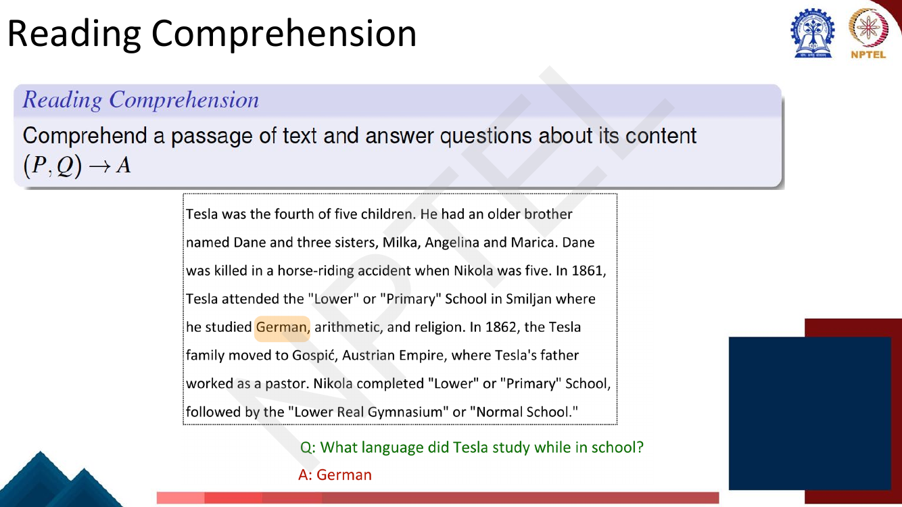
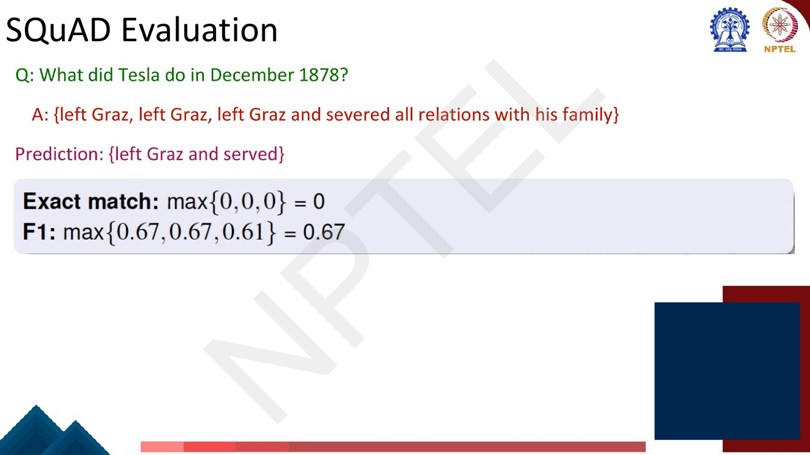
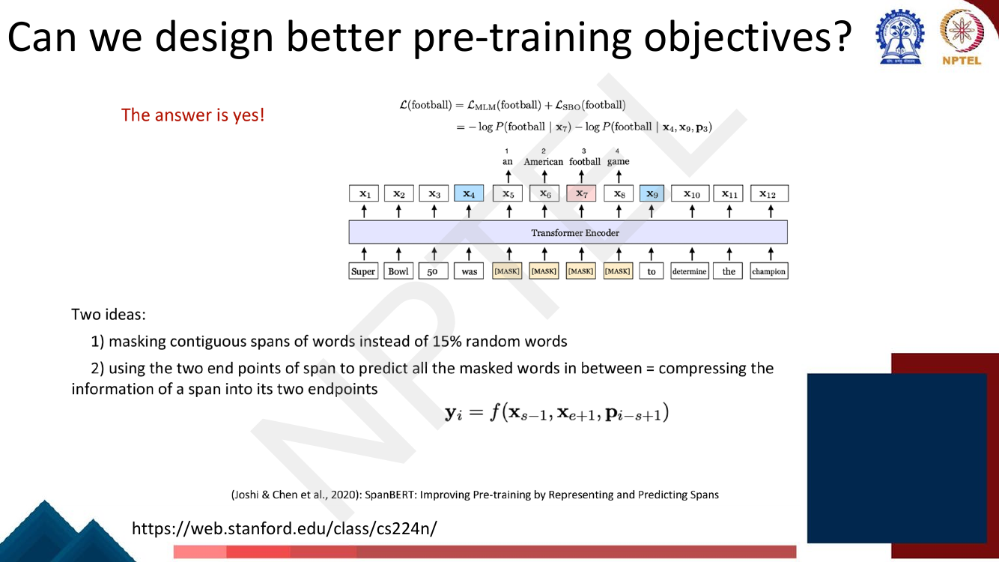
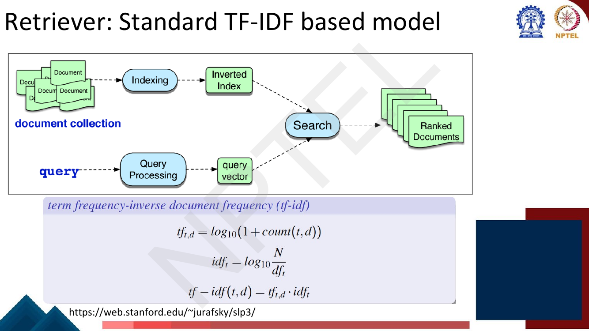
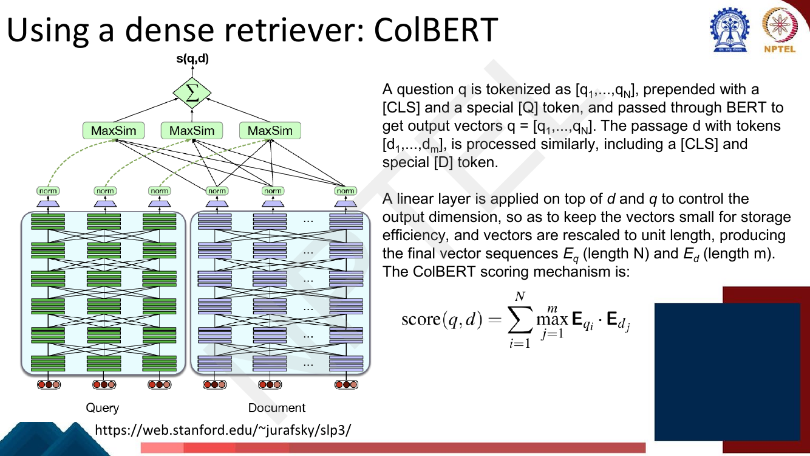

# Lec 31 — Question Answering I

> **Source:** `Week7.pdf` pp. 1–28 · **Week 7** · **Playlist:** Lec 31
> **Prereqs:** [Lec 28 — Span Tasks, T5, BART](../week-06/28-span-tasks-t5-bart.md), [Lec 27 — BERT and Masked LM](../week-06/27-bert-masked-lm.md)
> **Feeds into:** [Lec 32 — Question Answering II](32-question-answering-2.md), [Lec 55 — Retrieval-Augmented Generation](../week-11/55-retrieval-augmented-generation.md)

## Why this lecture exists

Lecture 28 taught you to point a BERT span head at a passage and read an answer out of it. That
assumes somebody already handed you the right passage. In the real world nobody does. You type a
question into a search box and the system has to find the paragraph *before* it can read it, out of
five million Wikipedia articles.

This lecture splits the problem in two. **Reading comprehension** is answering from a given passage —
solved, more or less, by the previous lecture. **Open-domain QA** adds a search step in front, and
that step is the whole difficulty, because it has to touch the entire corpus for every question.
Everything you learn here about scoring a document against a query — TF-IDF, BM25, dense bi-encoders —
is the machinery that Week 11's retrieval-augmented generation bolts onto a generative model. The
retriever is the part of RAG that is not the LM.

## The ideas

### What question answering is

The deck's definition: *the goal of question answering is to build systems that automatically answer
questions posed by humans in a natural language.* It then gives a three-axis taxonomy, which is MCQ
bait because it is a crisp list.


*Fig. — Three independent axes, not a hierarchy. Note that "open-domain" appears here as a property of the **question**, while later in the deck it names a **system architecture**. Page 5 of Week7.pdf.*

| Axis | Values the deck names |
|---|---|
| **Information source** | a text passage, all Web documents, knowledge bases, tables, images |
| **Question type** | factoid vs non-factoid, open-domain vs closed-domain, simple vs compositional |
| **Answer type** | a short segment of text, a paragraph, a list, yes/no |

The practical applications are two Google screenshots: *"Where is the deepest lake in the world?"* →
**Siberia** (Lake Baikal), and *"How can I protect myself from COVID-19?"* → a CDC answer box. Both are
search engines doing QA rather than returning ten blue links, which is the commercial reason this
field is funded.

### Reading comprehension

**Reading comprehension** is: comprehend a passage of text and answer questions about its content. The
deck writes the task signature as

$$(P, Q) \rightarrow A$$

— passage plus question in, answer out. The passage is **given**. That single word is the entire
distinction from open-domain QA.


*Fig. — The answer is a highlighted **contiguous span of the passage**, not free text. This is what makes the task learnable as two pointer predictions. Page 6.*

The deck's second example is harder and worth noticing: a passage of Karnataka language statistics,
question *"Which linguistic minority is larger, Hindi or Malayalam?"*, answer **Hindi**. The answer
span "Hindi" is in the passage, but producing it requires comparing 3.3% against 1.27% — a comparison
the model must do internally and can never show. Span extraction hides reasoning inside a pointer.

### SQuAD

The **Stanford Question Answering Dataset** is the dataset this whole line of work was built on.


*Fig. — Three questions over one passage, each answer a different-length span (one word, one word, three words). Note the red caveat: **not all questions can be answered this way** — that is SQuAD's built-in limitation, not a bug in the models. Page 8.*

The examinable facts, exactly as the slide states them:

- **100k** annotated (passage, question, answer) triples.
- Passages from **English Wikipedia**, usually **100–150 words**.
- Questions are **crowd-sourced**.
- Each answer is a **short segment of text (a span) in the passage**.
- SQuAD was for years the most popular reading-comprehension dataset; it is **"almost solved" today**
  (the underlying *task* is not), and **state of the art exceeds estimated human performance**.

The deck also makes the meta-point in red: large-scale *supervised* datasets are a key ingredient for
training effective neural reading-comprehension models. Architecture alone was never the story.

### SQuAD evaluation: Exact Match and F1

You own two metrics here. Both are computed per question and then **averaged over all examples**.

**Exact match (EM)** is 0 or 1: does the predicted string equal the gold string after normalisation?
**F1** gives **partial credit**: treat both answers as *bags of tokens* and compute the harmonic mean
of precision and recall over that bag.

$$\text{precision} = \frac{|\text{pred} \cap \text{gold}|}{|\text{pred}|}, \qquad
\text{recall} = \frac{|\text{pred} \cap \text{gold}|}{|\text{gold}|}, \qquad
F_1 = \frac{2 \cdot \text{precision} \cdot \text{recall}}{\text{precision} + \text{recall}}$$

(The general precision/recall/F1 definitions are [Lec 5](../week-01/05-nlp-tasks-and-paradigms.md)'s;
what is yours here is that the *units being counted are answer tokens*, not documents or labels.)

Three details the deck states and the exam will test:

1. **For dev and test, 3 gold answers are collected**, because there can be several plausible answers.
2. The predicted answer is compared to **each** gold answer after normalisation — **a, an, the and
   punctuation are removed** — and you **take the max** over the gold answers.
3. Only then do you average across examples, separately for EM and for F1.


*Fig. — The headline result: **EM = 0 while F1 = 0.67**. A prediction that captured the core of the answer scores zero under EM. This single slide is the entire justification for reporting both. Page 10. (The third F1 value, 0.61, does not reproduce — see N2.)*

**Why EM alone is too harsh.** Answer boundaries are arbitrary. "left Graz" and "left Graz and severed
all relations with his family" are both correct answers to the same question; a model that predicts
one when the annotator wrote the other is not wrong, it is differently punctuated. EM gives it 0. F1
gives it credit in proportion to token overlap, so it degrades smoothly as the predicted span drifts
rather than falling off a cliff. In practice **a system's F1 is never lower than its EM** — exact match forces
$F_1 = 1$, so every point EM earns, F1 earns too, and F1 collects partial credit on top. A reported
F1 below the reported EM means something is broken.

### Recap: BERT for reading comprehension

One slide, and [Lec 28](../week-06/28-span-tasks-t5-bart.md) owns the mechanics: you feed
`[CLS] question [SEP] passage` to BERT with the question as segment A and the passage as segment B,
and predict two endpoints inside segment B with two learned vectors and a softmax over positions,
training with $\mathcal{L} = -\log p_{\text{start}}(s^*) - \log p_{\text{end}}(e^*)$.

### Can we design better pre-training objectives?

The deck asks this and answers *"The answer is yes!"*, pointing at **SpanBERT** (Joshi & Chen et al.,
2020). Two ideas:

1. **Mask contiguous spans of words** instead of 15% random individual tokens.
2. Use the **two endpoints of the span to predict all the masked words in between** — the
   **span boundary objective (SBO)**, which compresses the information of a span into its two
   endpoints.

$$\mathbf{y}_i = f(\mathbf{x}_{s-1},\, \mathbf{x}_{e+1},\, \mathbf{p}_{i-s+1})$$

where $\mathbf{x}_{s-1}$ and $\mathbf{x}_{e+1}$ are the representations just outside the span and
$\mathbf{p}_{i-s+1}$ is a position embedding saying *how far into the span* token $i$ sits. The total
loss for a masked token is $\mathcal{L} = \mathcal{L}_{\text{MLM}} + \mathcal{L}_{\text{SBO}}$.


*Fig. — Note **why** this helps QA specifically: the SBO forces endpoint representations to encode the whole span, which is **exactly** what the start/end span head needs at fine-tuning time. The pretraining objective is shaped to fit the downstream head. Page 12.*

### Open-domain QA and the retriever–reader framework

**Open-domain question answering** drops the given passage. The deck's three bullets: we do not assume
a given passage; we only have access to a large collection of documents (e.g. Wikipedia); we do not
know where the answer is located, and the goal is to return an answer for *any* open-domain question.
Its verdict — "much more challenging but a more practical problem!" — is the honest one: this is what
a search engine actually faces.

Formally the deck sets it up as:

> **Input:** a large collection of documents $\mathcal{D} = D_1, \ldots, D_N$ and a question $Q$.
> **Output:** an answer string $A$.

and factorises the system into two pieces:

$$\textbf{Retriever:}\quad f(\mathcal{D}, Q) \longrightarrow P_1, \ldots, P_K$$
$$\textbf{Reader:}\quad g(Q, \{P_1, \ldots, P_K\}) \longrightarrow A$$

with $K$ **pre-defined** (the deck's example: $K = 100$). The reader's job is then *just a reading
comprehension problem* — which you already know how to solve.


*Fig. — **DrQA (Chen et al., 2017)** is the canonical instance: the retriever is a *fixed, untrained* TF-IDF module and only the reader is learned. The yellow sticky note is the lecturer flagging where this lecture is heading. Page 14.*

**Why the split exists** is an efficiency argument, and it is the examinable point. The corpus has
millions of passages — the deck's ORQA-style formulation quotes **over 13M evidence blocks**, each
with **over 2000 possible answer spans**. Running a cross-attending reader over every block for every
question is impossible. So you use something very cheap to cut $N \approx 10^7$ down to $K = 100$, and
spend the expensive model only on those 100. **Retrieval is a recall problem; reading is a precision
problem.** If the retriever drops the answer-bearing passage, no reader can recover it — the error is
unrecoverable, which is why retrieval quality caps the whole pipeline.

That asymmetry fixes how you *measure* a retriever. The metric is **recall@$k$**:

$$\text{recall@}k = \frac{\text{number of answer-bearing passages in the top } k}{\text{total number of answer-bearing passages}}$$

Not precision — the reader is perfectly happy to be handed 99 irrelevant passages alongside the right
one, because its own span scores will ignore them. Recall@$k$ is non-decreasing in $k$, which is why
$K$ is set generously (100) rather than to 1: every extra passage is a free chance to include the
answer and costs only reader compute.

The deck then writes the two-stage score additively and the inference as a joint argmax:

$$S(b, s, q) = \underbrace{S_{\text{retr}}(b,q)}_{\text{retriever}} + \underbrace{S_{\text{read}}(b,s,q)}_{\text{reader}}, \qquad
a^* = \text{TEXT}\!\left(\arg\max_{b,\,s} S(b,s,q)\right)$$

over evidence blocks $b$ and spans $s$. Its retriever component is already a dense two-tower model:
$\mathbf{h}_q = \mathbf{W}_q \text{BERT}_Q(q)[\texttt{CLS}]$,
$\mathbf{h}_b = \mathbf{W}_b \text{BERT}_B(b)[\texttt{CLS}]$,
$S_{\text{retr}}(b,q) = \mathbf{h}_q^\top \mathbf{h}_b$.

### TF-IDF

The classic retriever. Two factors multiplied together.

**Term frequency** $\text{tf}_{t,d}$ — how often term $t$ occurs in document $d$, log-damped so that a
term occurring 100 times is not scored 100× a term occurring once. The deck's page 18 writes

$$\text{tf}_{t,d} = \log_{10}\left(1 + \text{count}(t,d)\right)$$

**Inverse document frequency** $\text{idf}_t$ — how *rare* the term is across the collection:

$$\text{idf}_t = \log_{10}\frac{N}{\text{df}_t}$$

where $N$ is the number of documents and $\text{df}_t$ the number of documents containing $t$. The
weight is their product:

$$\text{tf-idf}(t,d) = \text{tf}_{t,d} \cdot \text{idf}_t$$

**Why IDF is there.** Suppose a term appears in *every* document: $\text{df}_t = N$, so
$\text{idf}_t = \log_{10} 1 = 0$ and the term contributes **nothing**. That is correct — a term you
would find in any document cannot discriminate between documents. "the" tells you nothing about which
Wikipedia page answers your question; "Baikal" tells you almost everything. IDF is the factor that
turns raw frequency into *evidence*, and it is why stop-word lists are largely unnecessary once you
use it: IDF deletes them automatically.


*Fig. — The **inverted index** (term → list of documents containing it) is what makes this fast: you never touch documents that share no term with the query. Page 18.*

Two practical consequences of this design are worth holding on to. First, TF-IDF retrieval is
**training-free** — there are no parameters, only counts over the corpus — which is exactly why DrQA
could use it as a fixed module and spend all its learning on the reader. Second, because the score is
a sum over query terms and the index is inverted, cost scales with the number of documents containing
a query term, not with $N$. A rare query term touches a handful of documents. This is why lexical
retrieval was, and in many places still is, the default at web scale.

**Document scoring** is then the cosine of the query and document tf-idf vectors — length-normalised
so that long documents do not win by sheer size:

$$\text{score}(q,d) = \cos(\mathbf{q}, \mathbf{d}) = \frac{\mathbf{q}}{|\mathbf{q}|} \cdot \frac{\mathbf{d}}{|\mathbf{d}|}
= \sum_{t \in q} \frac{\text{tf}_{t,q}\cdot\text{idf}_t}{\sqrt{\sum_{q_i \in q}\text{tf-idf}^2(q_i,q)}} \cdot \frac{\text{tf}_{t,d}\cdot\text{idf}_t}{\sqrt{\sum_{d_i \in d}\text{tf-idf}^2(d_i,d)}}$$

The sum runs **only over terms in the query** — every other term contributes zero to the numerator,
though it still enters the document's norm in the denominator. (Cosine similarity itself is
[Lec 11](../week-03/11-word-representation.md)'s.)


*Fig. — Work left to right: counts → tf → ×idf → ÷ the vector norm → × the query's normalised weight → sum the column. The `n'lized` column is where the cosine's length normalisation actually happens. Note the query row uses tf = 1 while the document rows use 1 + log₁₀(count). Page 20.*

The deck's full worked example of this is on page 20; it is **N1** below, reproduced term by term.

### BM25

TF-IDF has two defects. First, log-damped tf still grows without bound — a term occurring 1000 times
scores more than one occurring 100 times, when in truth both just mean "the document is about this".
Second, cosine normalisation is a blunt instrument for document length. **BM25** fixes both with two
explicit knobs:

$$\text{score}(q,d) = \sum_{t \in q} \underbrace{\log\left(\frac{N}{\text{df}_t}\right)}_{\text{IDF}} \cdot \underbrace{\frac{\text{tf}_{t,d}}{k\left(1 - b + b\left(\dfrac{|d|}{|d_{\text{avg}}|}\right)\right) + \text{tf}_{t,d}}}_{\text{weighted tf}}$$


*Fig. — Memorise the defaults: $k_1 = 1.2$, $b = 0.75$. Note the slide writes $k$ in the formula and $k_1$ in the defaults — the same parameter. Page 21.*

**What $k_1$ controls — saturation.** Look at the weighted-tf factor as $\text{tf} \to \infty$: it
tends to **1**, no matter how large. The term's contribution is bounded by its IDF. A word appearing
20 times is not 20× as relevant as a word appearing once; BM25 encodes that as a hyperbola that
flattens out. $k_1$ sets *how fast* it flattens: $k_1 = 0$ makes the factor exactly 1 for any
$\text{tf} \ge 1$ (pure binary presence/absence, IDF only); large $k_1$ keeps the response nearly
linear in tf. The default 1.2 is aggressive saturation — tf = 2 already buys you most of what tf = 20
would.

**What $b$ controls — length normalisation.** The ratio $|d|/|d_{\text{avg}}|$ is the document's length
in tokens relative to the collection average. With $b = 1$ you divide fully by relative length; with
$b = 0$ the length term vanishes entirely and long documents are not penalised at all. The default
0.75 is three-quarters of full normalisation. The purpose is to stop a 5000-word page from beating a
focused 200-word paragraph simply by containing the query terms more often by accident.

### Dense retrievers

Everything above is **lexical**: it matches strings. The deck names the failure precisely —

> The user might decide to search for a *tragic love story* but Shakespeare writes instead about
> *star-crossed lovers*.

A **dense retriever** replaces string matching with **embedding similarity**: encode the question and
the passage into vectors with BERT and score them by inner product. Because the encoder saw
"car" and "automobile" in similar contexts during pretraining, their representations are close, and
the match survives paraphrase. The price is that you now need a trained model, and a trained model
needs training data — which is where the lecture ends.

### The two designs the deck names


*Fig. — (a) is a **cross-encoder**: query and document attend to each other inside one transformer. (b) is a **bi-encoder**: the towers never see each other. The deck's verdict on (a) is one line — "too compute expensive". Page 23.*

**Bi-encoder (DPR).** Two encoders, $\text{BERT}_Q$ and $\text{BERT}_D$:

$$\mathbf{h}_q = \text{BERT}_Q(q)[\texttt{CLS}], \qquad
\mathbf{h}_d = \text{BERT}_D(d)[\texttt{CLS}], \qquad
\text{score}(d,q) = \mathbf{h}_q \cdot \mathbf{h}_d$$

The decisive property: $\mathbf{h}_d$ **does not depend on $q$**. So you encode every passage in the
corpus **once, offline**, store the vectors in a vector index, and at query time run **one** forward
pass for the question followed by a maximum-inner-product search. That is what makes dense retrieval
viable at $10^6$–$10^9$ passages. (Quantified in N5.)

![Slide for the bi-encoder: BERT_Q and BERT_D produce h_q and h_d from the [CLS] position, scored by dot product, with an ENCODER_query / ENCODER_document diagram](../../assets/pages/lec31/p-024.png)
*Fig. — Everything is squeezed into **one vector per passage**. That is the bi-encoder's speed and also its weakness: a single vector cannot represent every aspect of a long passage. Page 24.*

**ColBERT — late interaction.** Keep *all* token embeddings instead of collapsing to one vector, and
interact them only at the very end. The deck's description: the question is tokenised as
$[q_1,\ldots,q_N]$, prepended with `[CLS]` and a special `[Q]` token, passed through BERT; the passage
$[d_1,\ldots,d_m]$ likewise with `[CLS]` and a special `[D]` token. A **linear layer** on top controls
the output dimension so the stored vectors stay small, and the vectors are **rescaled to unit length**,
giving sequences $E_q$ (length $N$) and $E_d$ (length $m$). The score is the **MaxSim** operator:

$$\text{score}(q,d) = \sum_{i=1}^{N} \max_{j=1}^{m} \mathbf{E}_{q_i} \cdot \mathbf{E}_{d_j}$$

For each query token, find its single best-matching document token; sum those maxima. This is strictly
more expressive than one dot product — it can represent "this query term is covered *here* and that one
*there*" — but it costs $N \times m$ dot products per pair and stores $m$ vectors per passage instead
of one, so the index is one to two orders of magnitude larger.


*Fig. — "Late interaction": the two towers are still independent (so passages are still pre-encodable), but the comparison happens at **token** granularity rather than after pooling. That is the entire design. Page 25.*

**The trade-off axis** — this is what an exam will test:

| | Query–doc interaction | Pre-encode passages? | Forward passes per query over $N$ passages | Accuracy |
|---|---|---|---|---|
| **Cross-encoder** (deck's option (a)) | full, every layer | **no** | $N$ | highest |
| **ColBERT** | late, token-level MaxSim | yes | 1 | middle |
| **Bi-encoder / DPR** | none until the final dot product | yes | 1 | lowest of the three |

Accuracy and scalability run in opposite directions along this list, and the reason is one property:
**whether the document representation is allowed to depend on the query.** If it is, you cannot
precompute, so you cannot scale. The standard production compromise is a cascade — bi-encoder retrieves
1000, cross-encoder re-ranks those 1000.

### How to get training data?

The deck's closing content page is three questions and no answers: *How to train these dense
retrievers? How to get training data? What training objectives to use?* The honest summary of the
difficulty: you need (question, positive passage) pairs, and crucially **negative** passages that are
hard enough to teach the model something, and nobody labels those. [Lec 32](32-question-answering-2.md)
answers all three. Stop here.

One forward pointer: once you have a retriever, you can feed its passages to a *generator* rather than
a span extractor. That is retrieval-augmented generation, and it is
[Lec 55](../week-11/55-retrieval-augmented-generation.md)'s. You own the retriever; Lec 55 owns what
you do with what it returns.

## Worked numericals

### N1. The deck's TF-IDF worked example, in full (page 20)
**Given:** the collection $N = 4$ documents —
Doc 1: *Sweet sweet nurse! Love?* · Doc 2: *Sweet sorrow* · Doc 3: *How sweet is love?* · Doc 4: *Nurse!*
**Query:** *sweet love*.
**Find:** every tf-idf weight, both vector norms, and $\cos(q, d_1)$ and $\cos(q, d_2)$.

**Step 1 — document frequencies and IDF.** Count in how many of the 4 documents each term appears:

| term | appears in | $\text{df}_t$ | $\text{idf}_t = \log_{10}(4/\text{df}_t)$ |
|---|---|---|---|
| sweet | D1, D2, D3 | 3 | $\log_{10}(4/3) = \log_{10} 1.333 = \mathbf{0.125}$ |
| nurse | D1, D4 | 2 | $\log_{10} 2 = \mathbf{0.301}$ |
| love | D1, D3 | 2 | $\log_{10} 2 = \mathbf{0.301}$ |
| how | D3 | 1 | $\log_{10} 4 = \mathbf{0.602}$ |
| sorrow | D2 | 1 | $\log_{10} 4 = \mathbf{0.602}$ |
| is | D3 | 1 | $\log_{10} 4 = \mathbf{0.602}$ |

Sanity check: "sweet" is in 3 of 4 documents and gets the *smallest* weight — it barely discriminates.
"sorrow" is in 1 of 4 and gets nearly 5× the weight.

**Step 2 — the query vector.** The deck uses $\text{tf} = 1$ for each query term (raw count, both terms
appear once), so $\text{tf-idf} = \text{idf}$:

- sweet: $1 \times 0.125 = 0.125$
- love: $1 \times 0.301 = 0.301$
- all other terms: 0

$$|q| = \sqrt{0.125^2 + 0.301^2} = \sqrt{0.015625 + 0.090601} = \sqrt{0.106226} = \mathbf{0.326}$$

Normalised: sweet $= 0.125/0.326 = \mathbf{0.383}$; love $= 0.301/0.326 = \mathbf{0.924}$.

**Step 3 — Document 1** (*Sweet sweet nurse! Love?*): counts sweet 2, nurse 1, love 1. The deck's table
uses $\text{tf} = 1 + \log_{10}(\text{count})$ here:

| term | cnt | tf | tf-idf | n'lized $= \text{tf-idf}/\mid d_1\mid $ | $\times\, q$ |
|---|---|---|---|---|---|
| sweet | 2 | $1 + \log_{10}2 = 1.301$ | $1.301 \times 0.125 = 0.163$ | $0.163/0.456 = 0.357$ | $0.357 \times 0.383 = \mathbf{0.137}$ |
| nurse | 1 | $1 + \log_{10}1 = 1.000$ | $1.000 \times 0.301 = 0.301$ | $0.301/0.456 = 0.661$ | 0 (not in query) |
| love | 1 | 1.000 | 0.301 | 0.661 | $0.661 \times 0.924 = \mathbf{0.610}$ |
| how / sorrow / is | 0 | 0 | 0 | 0 | 0 |

$$|d_1| = \sqrt{0.163^2 + 0.301^2 + 0.301^2} = \sqrt{0.0266 + 0.0906 + 0.0906} = \sqrt{0.2078} = \mathbf{0.456}$$
$$\cos(q,d_1) = 0.137 + 0.610 = \mathbf{0.747}$$

**Step 4 — Document 2** (*Sweet sorrow*): counts sweet 1, sorrow 1.

| term | cnt | tf | tf-idf | n'lized | $\times\, q$ |
|---|---|---|---|---|---|
| sweet | 1 | 1.000 | $1.000 \times 0.125 = 0.125$ | $0.125/0.615 = 0.203$ | $0.203 \times 0.383 = \mathbf{0.0779}$ |
| sorrow | 1 | 1.000 | $1.000 \times 0.602 = 0.602$ | $0.602/0.615 = 0.979$ | 0 (not in query) |

$$|d_2| = \sqrt{0.125^2 + 0.602^2} = \sqrt{0.015625 + 0.362404} = \sqrt{0.378029} = \mathbf{0.615}$$
$$\cos(q,d_2) = \mathbf{0.0779}$$

**Step 5 — the two documents the deck omits.** Doc 3 (*How sweet is love?*): tf-idf = how 0.602,
sweet 0.125, is 0.602, love 0.301, so
$|d_3| = \sqrt{0.602^2+0.125^2+0.602^2+0.301^2} = \sqrt{0.8310} = 0.912$, and
$\cos = (0.125/0.912)(0.383) + (0.301/0.912)(0.924) = 0.0525 + 0.3051 = \mathbf{0.358}$.
Doc 4 (*Nurse!*) shares no term with the query, so $\cos = \mathbf{0}$.

**Answer:** $\cos(q,d_1) = 0.747$, $\cos(q,d_2) = 0.0779$ (both matching the deck exactly);
$\cos(q,d_3) = 0.358$, $\cos(q,d_4) = 0$. **Ranking: D1 ≫ D3 > D2 > D4.** Doc 1 wins by nearly 10× over
Doc 2 because it is the only document containing *both* query terms, and the second term — "love", the
rarer one — carries 0.610 of the 0.747.

> **Erratum worth knowing.** The deck's page 18 defines $\text{tf}_{t,d} = \log_{10}(1 + \text{count})$,
> but page 20's table uses $\text{tf} = 1 + \log_{10}(\text{count})$: for count = 2 it prints **1.301**,
> which is $1 + \log_{10}2$, not $\log_{10}3 = 0.477$. The *table* is the self-consistent one (every
> downstream number follows from it), so follow page 20's convention when reproducing this example,
> and quote page 18's formula if asked to state "the" tf formula. Note also that the **query** row uses
> raw $\text{tf} = 1$, not a log at all.

### N2. EM and token-F1 when the prediction only partly overlaps (page 10)
**Given:** Q: *What did Tesla do in December 1878?*
Gold answers: $g_1 = $ "left Graz", $g_2 = $ "left Graz", $g_3 = $ "left Graz and severed all relations
with his family". Prediction $p = $ "left Graz and served".
**Find:** EM and F1.

1. **Normalise** (lowercase, strip punctuation, drop *a / an / the*). Nothing changes here.
2. **EM against each gold:** "left graz and served" $\ne$ "left graz" (twice), $\ne$ the long gold.
   So $\text{EM} = \max\{0,0,0\} = \mathbf{0}$.
3. **F1 against $g_1$.** Prediction tokens $\{$left, graz, and, served$\}$, $|p| = 4$. Gold tokens
   $\{$left, graz$\}$, $|g_1| = 2$. Overlap $= 2$.
   $\text{prec} = 2/4 = 0.5$, $\text{rec} = 2/2 = 1.0$.
   $F_1 = \dfrac{2(0.5)(1.0)}{0.5 + 1.0} = \dfrac{1.0}{1.5} = \mathbf{0.667}$.
4. **F1 against $g_2$:** identical to $g_1$, so $\mathbf{0.667}$.
5. **F1 against $g_3$.** $|g_3| = 9$ tokens. Overlap with the prediction $=$ {left, graz, and} $= 3$
   ("served" $\ne$ "severed").
   $\text{prec} = 3/4 = 0.75$, $\text{rec} = 3/9 = 0.333$.
   $F_1 = \dfrac{2(0.75)(0.333)}{0.75 + 0.333} = \dfrac{0.5}{1.0833} = \mathbf{0.462}$.
6. $\text{F1} = \max\{0.667, 0.667, 0.462\} = \mathbf{0.667}$.

**Answer:** $\text{EM} = 0$, $\text{F1} = 0.67$. The headline agrees with the deck. **This is the whole
reason both metrics exist**: a prediction containing the complete short gold answer scores *zero* under
exact match and two-thirds under F1.

> **Disagreement with the deck.** The slide prints the third F1 as **0.61**, not 0.462. 0.615 is what
> you get if the prediction is spelled "left Graz and seve**r**ed" — then all 4 prediction tokens match,
> $\text{prec} = 4/4 = 1$, $\text{rec} = 4/9 = 0.444$, $F_1 = 2(0.444)/1.444 = 0.615$. So the slide's
> prediction string ("served") and its third F1 value are computed from different strings; one of them
> is a typo. The *reported* answer, 0.67, is unaffected because the max comes from $g_1$. Verified
> numerically in the code block.

### N3. Recall@k from a ranked retrieval result
**Given:** for a question with **3** relevant (answer-bearing) passages in the corpus, the retriever
returns this ranking, with ✓ marking relevant:
rank 1 ✗, 2 ✓, 3 ✗, 4 ✗, 5 ✓, 6 ✗, …, 20 ✗ (the third relevant passage is at rank 47).
**Find:** recall@1, recall@5, recall@20, recall@100.

1. **Recall@$k$** $= \dfrac{\text{number of relevant passages in the top } k}{\text{total relevant}}$.
2. Top-1 contains 0 relevant: $\text{R@1} = 0/3 = \mathbf{0}$.
3. Top-5 contains ranks 2 and 5: $\text{R@5} = 2/3 = \mathbf{0.667}$.
4. Top-20 still contains only those two (rank 47 is outside): $\text{R@20} = 2/3 = \mathbf{0.667}$.
5. Top-100 contains all three: $\text{R@100} = 3/3 = \mathbf{1.0}$.

**Answer:** 0, 0.667, 0.667, 1.0. Two lessons. (a) Recall@$k$ is **monotonically non-decreasing** in
$k$ and plateaus between relevant hits. (b) In the open-domain pipeline this is the metric that matters,
not precision: the reader can ignore 99 junk passages, but it cannot invent the one you failed to
retrieve. That is why $K$ is set to 100 rather than 1.

### N4. BM25 versus TF-IDF, and which knob flips the ranking
**Given:** a one-term query (so $\text{idf}_t$ is a common factor and cancels from every ranking).
Corpus average length $|d_{\text{avg}}| = 100$ tokens; $k_1 = 1.2$, $b = 0.75$.
Doc A: the term occurs **20** times, document length **500**.
Doc B: the term occurs **4** times, document length **50**.
**Find:** the ranking under raw-count tf-idf, under the deck's log tf-idf, and under BM25 with
$b = 0$ and $b = 0.75$.

1. **Raw tf × idf:** A $= 20$, B $= 4$. **A wins** by 5×.
2. **Deck's log tf:** A $= 1 + \log_{10}20 = 1 + 1.301 = 2.301$; B $= 1 + \log_{10}4 = 1.602$.
   **A still wins**, but only by 1.44× — the log already did part of the saturation job.
3. **BM25 with $b = 0$** (saturation only, no length normalisation). The denominator is $k_1 + \text{tf}$:
   - A: $20 / (1.2 + 20) = 20/21.2 = \mathbf{0.9434}$
   - B: $4 / (1.2 + 4) = 4/5.2 = \mathbf{0.7692}$
   **A wins**, now by only 1.23×. Saturation alone shrank a 5× advantage to 23%.
4. **BM25 with $b = 0.75$.** Length factor for A: $k_1(1 - b + b\,|d|/|d_{\text{avg}}|)
   = 1.2\,(0.25 + 0.75 \times 500/100) = 1.2\,(0.25 + 3.75) = 1.2 \times 4 = 4.8$.
   - A: $20 / (4.8 + 20) = 20/24.8 = \mathbf{0.8065}$
   For B: $1.2\,(0.25 + 0.75 \times 50/100) = 1.2\,(0.25 + 0.375) = 1.2 \times 0.625 = 0.75$.
   - B: $4 / (0.75 + 4) = 4/4.75 = \mathbf{0.8421}$
5. $0.8421 > 0.8065$: **B wins.** The ranking has flipped.

**Answer:** raw tf-idf, log tf-idf and BM25-with-$b{=}0$ all rank **A** first; full BM25 ranks **B**
first. Saturation ($k_1$) shrinks A's lead from 5× to 1.23×; length normalisation ($b$) is what
actually reverses it, because A is 5× the average document length and B is half of it. **If an MCQ
asks which BM25 parameter caused a long keyword-stuffed document to lose, the answer is $b$.**

### N5. Retrieval cost: bi-encoder versus cross-encoder at $N = 10^6$
**Given:** a corpus of $N = 10^6$ passages, one question at query time. BERT-base forward pass
$\approx$ 10 ms on a GPU.
**Find:** the number of BERT forward passes needed at query time, and the wall-clock time, under
(a) a cross-encoder, (b) a pre-indexed bi-encoder.

1. **Cross-encoder.** The score is $s(q,d)$ computed by one transformer over the *concatenation*
   $[q; \texttt{[SEP]}; d]$, so the document representation depends on $q$. Nothing can be precomputed.
   Forward passes $= N = \mathbf{10^6}$ **per question**.
2. Time: $10^6 \times 10\,\text{ms} = 10^7\,\text{ms} = 10{,}000\,\text{s} \approx \mathbf{2.8\ hours}$
   for one question. Not a system.
3. **Bi-encoder.** $\mathbf{h}_d$ does not depend on $q$, so all $10^6$ passage vectors are encoded
   **once, offline** ($10^6$ passes, ~2.8 GPU-hours, paid once ever).
4. At query time: **1** forward pass for the question, then $10^6$ dot products.
5. A $d = 768$ dot product is 768 multiply-adds; $10^6$ of them is $7.68 \times 10^8$ FLOPs — under a
   second of brute-force on a CPU, and milliseconds with an approximate-nearest-neighbour index.
6. Query-time ratio: $10^6 / 1 = \mathbf{10^6\times}$ fewer forward passes.
7. Storage cost of the index: $10^6 \times 768 \times 4\,\text{bytes} = 3.07$ GB (float32). ColBERT
   storing ~100 token vectors per passage at the same dimension would need ~300 GB — hence the deck's
   note that ColBERT applies a linear layer "to keep the vectors small for storage efficiency".

**Answer:** cross-encoder $10^6$ forward passes per query ($\approx$ 2.8 hours); bi-encoder **1**
forward pass per query plus an index built once. **The entire difference comes from one property:
whether the passage encoding depends on the question.**

## Code

```python
import numpy as np
from collections import Counter

# ---------- the deck's corpus (page 20) --------------------------------
docs = ["Sweet sweet nurse! Love?", "Sweet sorrow", "How sweet is love?", "Nurse!"]
query = "sweet love"
tok = lambda s: [w.strip("!?.,").lower() for w in s.split()]
V = ["sweet", "nurse", "love", "how", "sorrow", "is"]
D = [Counter(tok(d)) for d in docs]
N = len(D)

df  = np.array([sum(1 for c in D if c[t] > 0) for t in V], dtype=float)
idf = np.log10(N / df)                      # deck: idf = log10(N / df)

def tf_log(c):                              # deck's TABLE uses 1 + log10(count)
    return 1.0 + np.log10(c) if c > 0 else 0.0

Dm = np.array([[tf_log(c[t]) for t in V] for c in D]) * idf        # doc tf-idf matrix
qv = np.array([1.0 if t in tok(query) else 0.0 for t in V]) * idf  # query tf = raw 1

cos = (Dm @ qv) / (np.linalg.norm(Dm, axis=1) * np.linalg.norm(qv))
print("idf       :", np.round(idf, 3))
print("|q|       :", round(float(np.linalg.norm(qv)), 3))
print("|d| each  :", np.round(np.linalg.norm(Dm, axis=1), 3))
print("TF-IDF cos:", np.round(cos, 4), " ranking:", (np.argsort(-cos) + 1).tolist())

# ---------- BM25 on the same corpus ------------------------------------
k1, b = 1.2, 0.75
dl    = np.array([sum(c.values()) for c in D], dtype=float)
avdl  = dl.mean()
cnt   = np.array([[c[t] for t in V] for c in D], dtype=float)
qmask = np.array([1.0 if t in tok(query) else 0.0 for t in V])
bm25 = ((cnt / (k1 * (1 - b + b * dl[:, None] / avdl) + cnt)) * idf * qmask).sum(1)
print("doc lens  :", dl, " avgdl:", avdl)
print("BM25      :", np.round(bm25, 4), " ranking:", (np.argsort(-bm25) + 1).tolist())

# ---------- where the two DO disagree (numerical N4) --------------------
# one-term query; idf cancels, so only tf and length matter
tfA, lenA, tfB, lenB, avg = 20, 500, 4, 50, 100
raw   = (tfA, tfB)
logt  = (1 + np.log10(tfA), 1 + np.log10(tfB))
nolen = (tfA / (k1 + tfA), tfB / (k1 + tfB))                   # BM25 with b = 0
bm    = (tfA / (k1 * (1 - b + b * lenA / avg) + tfA),
         tfB / (k1 * (1 - b + b * lenB / avg) + tfB))
print("\nA(count=20,len=500) vs B(count=4,len=50)")
for name, (a, bb) in [("raw tf.idf  ", raw), ("log tf.idf  ", logt),
                      ("BM25 b=0    ", nolen), ("BM25 b=0.75 ", bm)]:
    print(f"  {name} A={a:.4f}  B={bb:.4f}  -> {'A' if a > bb else 'B'} wins")

# ---------- SQuAD exact match and token F1 -----------------------------
import re, string
def norm(s):                                 # SQuAD normalisation: case, punct, articles
    s = s.lower()
    s = "".join(ch for ch in s if ch not in set(string.punctuation))
    return " ".join(re.sub(r"\b(a|an|the)\b", " ", s).split())

def em(pred, gold):
    return float(norm(pred) == norm(gold))

def f1(pred, gold):
    p, g = norm(pred).split(), norm(gold).split()
    n = sum((Counter(p) & Counter(g)).values())      # multiset intersection
    if n == 0:
        return 0.0
    prec, rec = n / len(p), n / len(g)
    return 2 * prec * rec / (prec + rec)

golds = ["left Graz", "left Graz", "left Graz and severed all relations with his family"]
for pred in ["left Graz and served", "left Graz and severed"]:
    print(f"\nprediction: {pred!r}")
    print("  EM per gold:", [em(pred, g) for g in golds],
          "-> max", max(em(pred, g) for g in golds))
    print("  F1 per gold:", [round(f1(pred, g), 3) for g in golds],
          "-> max", round(max(f1(pred, g) for g in golds), 3))
```

Printed output:

```
idf       : [0.125 0.301 0.301 0.602 0.602 0.602]
|q|       : 0.326 |
|d| each  : [0.456 0.615 0.912 0.301] |
TF-IDF cos: [0.7469 0.0779 0.3575 0.    ]  ranking: [1, 3, 2, 4]
doc lens  : [4. 2. 4. 1.]  avgdl: 2.75
BM25      : [0.1846 0.0639 0.1633 0.    ]  ranking: [1, 3, 2, 4]

A(count=20,len=500) vs B(count=4,len=50)
  raw tf.idf   A=20.0000  B=4.0000  -> A wins
  log tf.idf   A=2.3010  B=1.6021  -> A wins
  BM25 b=0     A=0.9434  B=0.7692  -> A wins
  BM25 b=0.75  A=0.8065  B=0.8421  -> B wins

prediction: 'left Graz and served'
  EM per gold: [0.0, 0.0, 0.0] -> max 0.0
  F1 per gold: [0.667, 0.667, 0.462] -> max 0.667

prediction: 'left Graz and severed'
  EM per gold: [0.0, 0.0, 0.0] -> max 0.0
  F1 per gold: [0.667, 0.667, 0.615] -> max 0.667
```

Three things to read off it. The first block reproduces page 20 to the printed digit (0.747 and 0.0779).
On this four-document toy corpus TF-IDF and BM25 happen to **agree** on the ranking — ranking changes
need a length or saturation contrast, which is what the third block manufactures, and there BM25 flips
A and B. The last block confirms N2's erratum: the deck's 0.61 is reproducible only from the spelling
"severed", not from the "served" its own slide prints.

## Exam pack

### Must-memorise

| Item | Exactly this |
|---|---|
| QA goal (deck's words) | systems that **automatically answer questions posed by humans in a natural language** |
| QA taxonomy | information **source** / question **type** / answer **type** |
| Reading comprehension | $(P, Q) \rightarrow A$ — the passage is **given** |
| Open-domain QA | input is $Q$ alone; the passage must be **found** in a large collection |
| Retriever | $f(\mathcal{D}, Q) \rightarrow P_1,\ldots,P_K$, $K$ pre-defined |
| Reader | $g(Q, \{P_1,\ldots,P_K\}) \rightarrow A$ — "a reading comprehension problem!" |
| Joint score | $S(b,s,q) = S_{\text{retr}}(b,q) + S_{\text{read}}(b,s,q)$; $a^* = \text{TEXT}(\arg\max_{b,s} S)$ |
| SQuAD EM | 0/1 string equality after normalisation, **max over gold answers**, then averaged |
| SQuAD F1 | token-level $F_1 = \dfrac{2\,\text{prec}\cdot\text{rec}}{\text{prec}+\text{rec}}$, **max over gold answers**, then averaged |
| SQuAD normalisation | remove **a, an, the** and **punctuation** |
| Term frequency (p. 18) | $\text{tf}_{t,d} = \log_{10}(1 + \text{count}(t,d))$ |
| Term frequency (p. 20 table) | $\text{tf}_{t,d} = 1 + \log_{10}\text{count}(t,d)$ — **the one the worked example uses** |
| IDF | $\text{idf}_t = \log_{10}\dfrac{N}{\text{df}_t}$ |
| tf-idf | $\text{tf-idf}(t,d) = \text{tf}_{t,d}\cdot\text{idf}_t$ |
| Document score | $\text{score}(q,d) = \cos(\mathbf{q},\mathbf{d}) = \frac{\mathbf{q}}{\mid \mathbf{q}\mid }\cdot\frac{\mathbf{d}}{\mid \mathbf{d}\mid }$ |
| BM25 | $\sum_{t\in q}\log\!\left(\frac{N}{\text{df}_t}\right)\dfrac{\text{tf}_{t,d}}{k\left(1-b+b\frac{\mid d\mid }{\mid d_{\text{avg}}\mid }\right)+\text{tf}_{t,d}}$ |
| $k_1$ controls | **term-frequency saturation** (balance between tf and IDF) |
| $b$ controls | **document-length normalisation** |
| Bi-encoder (DPR) | $\mathbf{h}_q = \text{BERT}_Q(q)[\texttt{CLS}]$, $\mathbf{h}_d = \text{BERT}_D(d)[\texttt{CLS}]$, score $= \mathbf{h}_q\cdot\mathbf{h}_d$ |
| ColBERT | $\text{score}(q,d) = \sum_{i=1}^{N}\max_{j=1}^{m} \mathbf{E}_{q_i}\cdot\mathbf{E}_{d_j}$ — **MaxSim, late interaction** |
| SpanBERT's two ideas | mask **contiguous spans**; predict masked tokens from the **two span endpoints** (SBO) |
| SBO | $\mathbf{y}_i = f(\mathbf{x}_{s-1}, \mathbf{x}_{e+1}, \mathbf{p}_{i-s+1})$; $\mathcal{L} = \mathcal{L}_{\text{MLM}} + \mathcal{L}_{\text{SBO}}$ |

### Numbers worth knowing

| Quantity | Value |
|---|---|
| SQuAD size | **100k** (passage, question, answer) triples |
| SQuAD passage source / length | **English Wikipedia**, usually **100–150 words** |
| Gold answers per dev/test question | **3** |
| BM25 defaults | $k_1 = \mathbf{1.2}$, $b = \mathbf{0.75}$ |
| Typical $K$ for the retriever | **100** |
| Evidence blocks in the deck's open-domain setup | over **13M** |
| Possible answer spans per block | over **2000** |
| Deck's TF-IDF example | $N = 4$; idf(sweet) $= 0.125$, idf(love) $= 0.301$; $\mid q\mid  = 0.326$, $\mid d_1\mid  = 0.456$, $\mid d_2\mid  = 0.615$ |
| Deck's cosine scores | $\cos(q,d_1) = \mathbf{0.747}$, $\cos(q,d_2) = \mathbf{0.0779}$ |
| Deck's EM/F1 example | EM $= \max\{0,0,0\} = 0$; F1 $= \max\{0.67, 0.67, 0.61\} = \mathbf{0.67}$ |
| DrQA | Chen et al., **2017** — TF-IDF retriever + neural reader |
| SpanBERT | Joshi & Chen et al., **2020** |
| Deck's source text | Jurafsky & Martin, *SLP3* 3rd ed., **Chapter 14** (released Aug 20, 2024) |

### Likely MCQ traps

- **"Reading comprehension and open-domain QA are the same task."** No. Reading comprehension is
  $(P,Q)\to A$ with $P$ given; open-domain QA receives only $Q$ and must retrieve $P$ itself.
- **IDF direction.** $\text{idf} = \log(N/\text{df})$, so **high** idf means the term is **rare**. A
  term in every document has $\text{df} = N$ and $\text{idf} = \log 1 = \mathbf{0}$ — it contributes
  nothing. Inverting this is the single most common TF-IDF error.
- **Which tf formula.** Page 18 says $\log_{10}(1+\text{count})$; page 20's table uses
  $1 + \log_{10}(\text{count})$. For count = 2 these give 0.477 and 1.301. Read the question.
- **Swapping $k_1$ and $b$.** $k_1$ = term-frequency **saturation**; $b$ = **length** normalisation.
  $b = 0$ turns length normalisation off entirely; $k_1 = 0$ reduces BM25 to pure IDF on presence.
- **"BM25's weighted-tf grows without bound."** It does not — as $\text{tf}\to\infty$ it tends to 1, so
  each term's contribution is capped at its IDF. That is the saturation.
- **"F1 can be lower than EM."** For a single example F1 $\ge$ EM always (EM = 1 forces F1 = 1), so the
  dataset averages satisfy F1 $\ge$ EM too.
- **Forgetting the max over gold answers.** You take the **max** over the 3 gold answers *per question*,
  then the **average** over questions. Averaging over gold answers instead is wrong.
- **Forgetting SQuAD normalisation.** *a / an / the* and punctuation are stripped before comparison, so
  "the German" and "German" are an exact match.
- **Bi-encoder vs cross-encoder.** A **cross-encoder** concatenates query and document into one
  transformer — most accurate, but passages cannot be pre-encoded, so it needs $N$ forward passes per
  query. A **bi-encoder** encodes them separately — one forward pass per query. The deck's one-line
  verdict on the cross-encoder is "(a) is too compute expensive".
- **"ColBERT is a cross-encoder."** No. ColBERT's two towers are still independent; the interaction is
  **late**, at the token level via MaxSim, which is exactly what keeps passages pre-encodable.
- **MaxSim direction.** The max is over **document** tokens, for **each query** token; the outer sum is
  over query tokens. Swapping them changes the score.
- **"The retriever is trained end-to-end in DrQA."** No — in DrQA the TF-IDF retriever is a **fixed
  module**; only the reader is neural and trained.
- **Precision vs recall for the retriever.** Retrieval is measured by **recall@k**. A retriever that
  misses the answer-bearing passage makes an error no reader can repair.

### Self-test

1. Write the task signature for reading comprehension and say which symbol is missing in open-domain QA.
2. A term appears in all 10,000 documents of a collection. What is its IDF and what does it contribute?
3. Prediction "Lake Baikal", gold "Baikal". Give EM and token-F1.
4. State what $k_1$ and $b$ each control in BM25, and their default values.
5. Why can a bi-encoder index be built offline but a cross-encoder index cannot?
6. $N = 1000$ documents, $\text{df}_t = 8$. Give $\text{idf}_t$ using $\log_{10}$.
7. Write ColBERT's scoring function and say what the max ranges over.
8. Name SpanBERT's two modifications to BERT pretraining.
9. Your retriever returns 100 passages and the answer passage is at rank 73. Give recall@50 and recall@100 (one relevant passage).
10. A document of 400 tokens (corpus average 100) contains the query term 10 times. Compute BM25's weighted-tf factor with the default $k_1, b$.

<details><summary>Answers</summary>

1. $(P, Q) \rightarrow A$. In open-domain QA the passage $P$ is **not given** — the input is $Q$ alone and $P$ must be retrieved from a collection $\mathcal{D}$.
2. $\text{idf} = \log_{10}(10000/10000) = \log_{10} 1 = 0$. It contributes **nothing** to any document's score, because it cannot discriminate between documents.
3. EM $= 0$ (strings differ). F1: overlap $= 1$ token ("baikal"); prec $= 1/2 = 0.5$, rec $= 1/1 = 1.0$; $F_1 = 2(0.5)(1)/1.5 = \mathbf{0.667}$.
4. $k_1$ = term-frequency saturation / the balance between tf and IDF, default **1.2**. $b$ = importance of document-length normalisation, default **0.75**.
5. Because the bi-encoder's $\mathbf{h}_d = \text{BERT}_D(d)[\texttt{CLS}]$ does not depend on the query, so it can be computed once for every passage. A cross-encoder runs one transformer over $[q; \texttt{[SEP]}; d]$, so the document's representation changes with every query.
6. $\log_{10}(1000/8) = \log_{10}125 = \mathbf{2.097}$.
7. $\text{score}(q,d) = \sum_{i=1}^{N}\max_{j=1}^{m}\mathbf{E}_{q_i}\cdot\mathbf{E}_{d_j}$. The **max is over the $m$ document tokens**, taken separately for each of the $N$ query tokens; the sum is over query tokens.
8. (i) Masking **contiguous spans** rather than 15% random individual tokens; (ii) the **span boundary objective** — predicting every masked token from the two representations just outside the span plus a position embedding.
9. recall@50 $= 0/1 = \mathbf{0}$; recall@100 $= 1/1 = \mathbf{1.0}$.
10. $\dfrac{10}{1.2\,(1 - 0.75 + 0.75 \times \frac{400}{100}) + 10} = \dfrac{10}{1.2\,(0.25 + 3) + 10} = \dfrac{10}{3.9 + 10} = \dfrac{10}{13.9} = \mathbf{0.719}$. (The same 10 occurrences in an average-length document would score $10/(1.2 + 10) = 0.893$.)

</details>

## Beyond the slides

**Gap:** The deck gives BM25 as $\log(N/\text{df}_t)$, but every real implementation (Lucene,
Elasticsearch, `rank_bm25`) uses the smoothed **Robertson–Sparck Jones** form
$\log\frac{N - \text{df}_t + 0.5}{\text{df}_t + 0.5}$, often with a $+1$ inside.
**Why it matters:** the unsmoothed version goes **negative** for any term appearing in more than half
the collection ($\text{df} > N/2 \Rightarrow \log(N/\text{df}) < 0$), which would let a common query
term *subtract* from a document's score. The smoothed form is bounded away from that. If an exam asks
you to compute BM25, use the deck's formula; if you implement it, use the library's.

**Gap:** Nothing is said about **how the top-$K$ dense vectors are actually found** at query time.
**Why it matters:** scoring $10^6$–$10^9$ vectors by brute force is the obvious reading of
"maximum inner product search", but production systems use approximate nearest-neighbour indexes —
**FAISS**, HNSW graphs, IVF+PQ — that trade a little recall for 100–1000× speed. "Dense retrieval is
fast" is only true *given* an ANN index, and the compression those indexes apply is a real source of
recall loss. This is the missing step between the deck's page 24 and a working system.

**Gap:** SQuAD is presented without **SQuAD 2.0**.
**Why it matters:** the deck itself flags SQuAD's limitation — "not all the questions can be answered
this way" — and SQuAD 2.0 (Rajpurkar et al., 2018) is the direct response: it adds ~50k
**unanswerable** questions, so the model must also decide *whether* an answer exists, usually by
predicting the `[CLS]` position as the span. This matters doubly in open-domain QA, where most
retrieved passages do not contain the answer and a reader that always emits a span will confidently
hallucinate one.

**Gap:** The deck never mentions **hybrid retrieval**.
**Why it matters:** dense retrieval beats BM25 on paraphrase and loses to it on rare exact strings —
product codes, names, numbers — because a term seen a handful of times in pretraining has a poor
embedding, while BM25 gives it a *high* IDF precisely because it is rare. The two methods fail in
complementary places, so real systems fuse both rankings (e.g. reciprocal rank fusion). "Dense is
strictly better than sparse" is a tempting but wrong conclusion from page 22.

## Cut from the slides

Pages 1, 2, 27 and 28 are the title card, the concepts-covered list, the single reference (Jurafsky &
Martin, *SLP3* 3rd ed., Chapter 14 — quoted in the Numbers table) and the thank-you slide; they carry
no content. Pages 3 and 4 are two Google screenshots making the same point about practical
applications, compressed to one sentence each. Page 7's second reading-comprehension example (Karnataka
language statistics) is kept but compressed to its one examinable observation — that span extraction
can hide a numerical comparison. Page 15's ORQA-style formulation (13M blocks, 2000 spans, the additive
$S(b,s,q)$) and pages 16–17's retriever/reader component diagrams are kept but folded into the
retriever–reader section rather than given separate treatment, since their equations are a specific
model instance and [Lec 32](32-question-answering-2.md) owns dense-retriever training. Page 11's BERT
span head is deliberately a recap only — [Lec 28](../week-06/28-span-tasks-t5-bart.md) owns the
mechanics, the fine-tuning recipe and GLUE. Page 26's three open questions are stated and handed to
Lec 32 rather than answered here, exactly where the deck stops. Nothing on TF-IDF, BM25, EM/F1 or the
dense-retriever designs was dropped.
