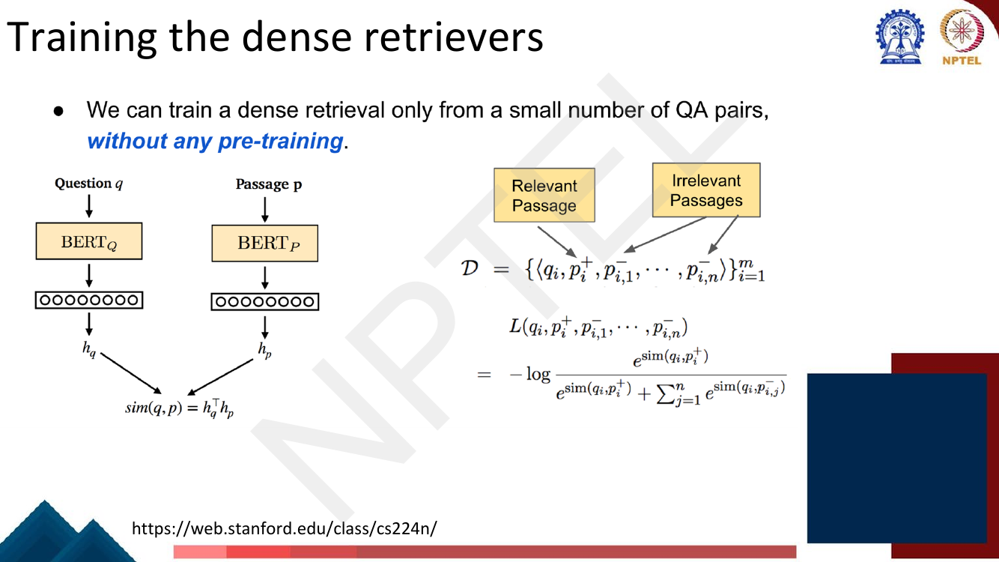
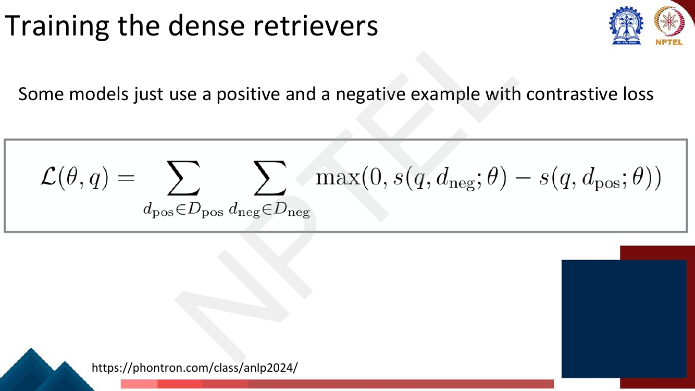
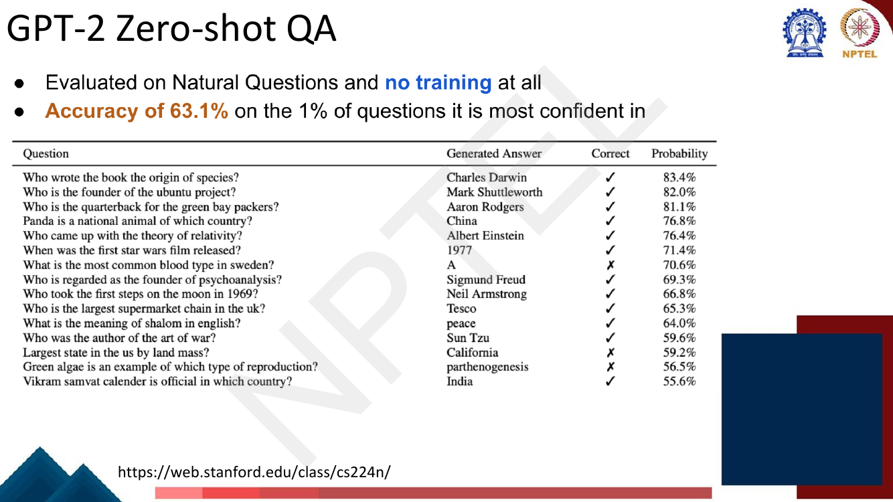
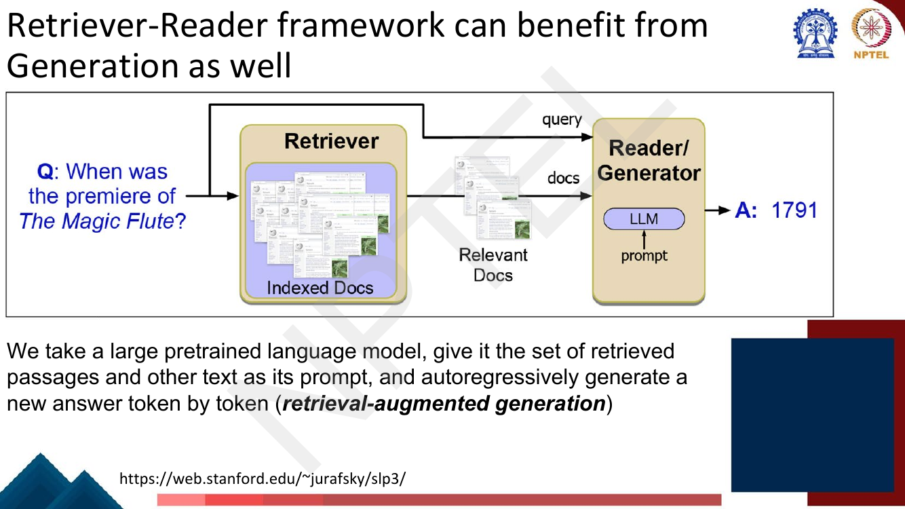
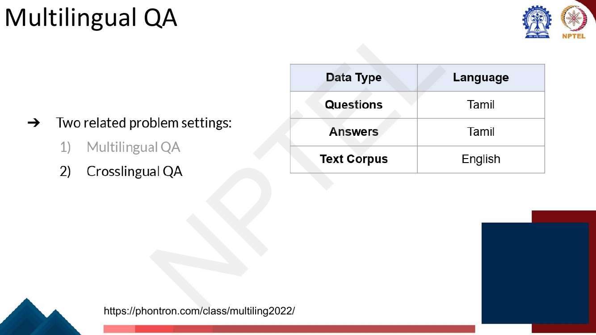
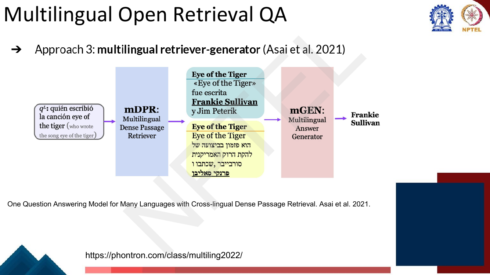

# Lec 32 — Question Answering II: Training Retrievers, Generative QA, Multilingual and Tabular QA

> **Source:** `Week7.pdf` pp. 29–52 · **Week 7** · **Playlist:** Lec 32
> **Prereqs:** [Lec 31 — Question Answering I](31-question-answering-1.md), [Lec 30 — Domain and Multilingual Pretraining](../week-06/30-domain-and-multilingual-pretraining.md)
> **Feeds into:** [Lec 55 — Retrieval-Augmented Generation](../week-11/55-retrieval-augmented-generation.md)

## Why this lecture exists

[Lec 31](31-question-answering-1.md) built the retriever-reader pipeline and replaced sparse BM25
scoring with a dense bi-encoder, then stopped on a question it did not answer: *where does the
training data for that retriever come from, and what objective do you train it with?* A dense
retriever needs supervision saying "this passage answers this question and that one does not", and
nobody hands you such a file.

This lecture answers it. The answer is **contrastive**: you never score a passage in isolation, only
relative to competitors, and the whole art is choosing which competitors. From there the lecture asks
the opposite question — can you skip retrieval entirely and read the answer out of a language model's
weights? — and then widens the setting twice: to languages other than English, and to data that is not
prose at all.

## The ideas

### Where the training signal comes from

A dense retriever ([Lec 31](31-question-answering-1.md)) is two BERT encoders. $\text{BERT}_Q$ maps a
question $q$ to $\mathbf{h}_q$, $\text{BERT}_P$ maps a passage $p$ to $\mathbf{h}_p$, and similarity is
a plain dot product:

$$\text{sim}(q, p) = \mathbf{h}_q^\top \mathbf{h}_p$$

That is the whole model. What you need is a loss that pushes $\mathbf{h}_q$ toward the embedding of the
right passage and away from everything else.


*Fig. — The deck's headline claim, in blue: you can train a dense retriever **from a small number of QA pairs, without any pre-training** of the retriever itself. The two towers still start from pretrained BERT; what needs no pretraining is the retrieval objective. Page 31.*

The training set is a list of $m$ tuples, each one question with **one** positive and $n$ negatives:

$$\mathcal{D} = \Big\{ \big\langle q_i,\; p_i^{+},\; p_{i,1}^{-},\; \ldots,\; p_{i,n}^{-} \big\rangle \Big\}_{i=1}^{m}$$

and the loss for one tuple is a negative log-softmax over the $n+1$ similarity scores, with the
positive as the target class:

$$\mathcal{L}\big(q_i, p_i^{+}, p_{i,1}^{-}, \ldots, p_{i,n}^{-}\big) \;=\; -\log \frac{e^{\,\text{sim}(q_i,\,p_i^{+})}}{e^{\,\text{sim}(q_i,\,p_i^{+})} \;+\; \sum_{j=1}^{n} e^{\,\text{sim}(q_i,\,p_{i,j}^{-})}}$$

Read it as a classification problem with $n+1$ classes. The retriever is not asked "is this passage
relevant, yes or no?" — it is asked "**which one of these $n+1$ passages is the right one?**" That
reframing is the whole reason the loss works with so little data: the gradient only ever has to make
one score beat $n$ others, never hit an absolute target.

Two consequences follow immediately, and both are examinable.

1. **The loss is scale-free in a useful way.** Adding a constant to every score in the tuple changes
   nothing, because the constant cancels in the softmax. Only *differences* matter.
2. **The loss is driven almost entirely by the hardest negative.** The softmax denominator is
   dominated by its largest term, so a negative whose score is far below the positive contributes
   essentially nothing to the gradient. This is why negative *selection* is the real content of the
   lecture and not a footnote.

The deck also shows a second, simpler contrastive form that some models use — a **max-margin (hinge)
loss** summed over all positive-negative pairs:


*Fig. — The hinge alternative. Note it has **no margin term** as printed: the penalty is zero the instant the positive outscores the negative by any amount, however small. The softmax form above keeps pushing. Page 32.*

$$\mathcal{L}(\theta, q) = \sum_{d_{\text{pos}} \in D_{\text{pos}}} \;\sum_{d_{\text{neg}} \in D_{\text{neg}}} \max\big(0,\; s(q, d_{\text{neg}}; \theta) - s(q, d_{\text{pos}}; \theta)\big)$$

Each term is zero when the positive already wins and grows linearly with the violation when it does
not. The softmax form is the one DPR and almost everything after it uses; know both, and know that the
hinge version allows **multiple** positives per question while the softmax form assumes exactly one.

### How to select the positive and negative passages

This is the examinable core of the lecture, and the deck gives it one page.


*Fig. — The three negative types. **Caution: the two yellow callouts on this slide point at the wrong bullets** — see the warning below. Page 33.*

**Positives.** Two sources:

- **Provided by the dataset.** Reading-comprehension corpora like SQuAD ship the gold passage with
  each question, so the positive is free.
- **Found by BM25.** For a question where you only have the answer *string*, run BM25
  ([Lec 31](31-question-answering-1.md)) and take a high-scoring passage that **contains the answer
  string**. The slide's margin calls this **relevance-guided supervision** — you bootstrap retrieval
  labels from a cheap lexical retriever plus a string match, rather than from human annotation.

That bootstrapping is weak supervision and it is noisy: a passage can contain the string "1791" without
being about the premiere of *The Magic Flute* at all. You accept the noise because it is free.

**Negatives.** Three kinds, in increasing order of usefulness:

| Negative type | How you get it | Cost | Signal |
|---|---|---|---|
| **Random** | sample any passage from the corpus | ~free | very weak — trivially separable, score far below the positive, near-zero gradient |
| **BM25 hard negatives** | top BM25 passages for $q$ that **do not** contain the answer but match most question tokens | one BM25 query per question | strongest — lexically plausible, so the model must learn semantics rather than word overlap |
| **In-batch negatives** | the positive passages of the **other** questions in the same batch | **zero extra encoding** | moderate, but you get $B-1$ of them per question for nothing |

> **Slide erratum.** On page 33 the callout "In-batch negatives" has its tail pointing at the *BM25*
> bullet, and the "Hard negatives" arrow points at *"Positive passages of OTHER questions"*. **The two
> labels are swapped relative to standard usage** (and relative to the CS224N slide this page is copied
> from). The correct mapping is the one in the table above: BM25-top-but-answerless = **hard**
> negatives; other questions' positives = **in-batch** negatives. If an MCQ quotes the slide, answer
> with the standard mapping.

**Why hard negatives matter so much.** Take a question about Mozart's *The Magic Flute*. A random
negative might be a passage on the chemistry of zinc — the retriever separates the two on the first
step and learns nothing afterwards. A BM25 hard negative is a passage about *The Magic Flute*'s 1975
film adaptation: it shares almost every content word, so the only way to score it below the gold
passage is to represent what the question is actually *asking for*. Numerical N2 below shows this is
not rhetoric — the hard negative produces a loss roughly 46× larger and a gradient roughly 36× larger
than the random one on the same positive.

**The in-batch negatives trick.** This is the elegant part. Suppose a batch holds $B$ pairs
$(q_1, p_1^{+}), \ldots, (q_B, p_B^{+})$. Encode all $B$ questions into a matrix
$\mathbf{Q} \in \mathbb{R}^{B \times d}$ and all $B$ positive passages into
$\mathbf{P} \in \mathbb{R}^{B \times d}$, and form

$$\mathbf{S} = \mathbf{Q}\mathbf{P}^\top \in \mathbb{R}^{B \times B}, \qquad S_{ij} = \text{sim}(q_i, p_j)$$

Now notice what you already have. $S_{ii}$ is the score of question $i$ against *its own* passage — a
positive. Every off-diagonal $S_{ij}$, $j \neq i$, is the score of question $i$ against *someone
else's* gold passage — which, with overwhelming probability, is a negative. So each row of
$\mathbf{S}$ is already a complete $B$-way classification problem whose correct answer is the diagonal,
and the batch loss is

$$\mathcal{L} = \frac{1}{B}\sum_{i=1}^{B} -\log \frac{e^{S_{ii}}}{\sum_{j=1}^{B} e^{S_{ij}}}$$

You paid for $2B$ encoder forward passes (B questions, B passages) and received $B(B-1)$
question-negative pairs. The number of negatives grows **quadratically** in the batch size while the
compute grows **linearly** — which is exactly why retrieval papers train with batch sizes in the
hundreds or thousands, far larger than classification work needs. Practical recipe: in-batch negatives
*plus* one BM25 hard negative per question, which DPR found gave its best results.

The one assumption to state out loud: an off-diagonal entry is only a valid negative if question $i$'s
answer is not also in passage $j$. With a large corpus that false-negative rate is small, and it is
simply tolerated.

### Retrieval-free approaches

Page 34 states the idea as three questions: can pretrained language models act as **knowledge
storage**; can we query them for the answer directly; and — since they were pretrained on Wikipedia and
other corpora — should they not "memorize a fair amount of information"?

If an LM was pretrained on Wikipedia, and the answers live in Wikipedia, perhaps the answers are
already in the weights. This is the **closed-book** setting: no corpus at inference time, no retriever,
no index — just the model.

**GPT-2 zero-shot QA.** The deck's evidence is GPT-2 evaluated on Natural Questions with **no training
at all** — you prompt it with the question and read off the continuation.


*Fig. — Read the headline carefully: **63.1% on the 1% of questions it is most confident in**, not 63.1% overall. The table shows the failure mode too — "most common blood type in sweden → A" is wrong at 70.6% confidence, higher than six of the correct answers. Page 35.*

The 63.1% number is a **selective** accuracy, and conflating it with overall accuracy is the single
most likely MCQ trap on this page. The honest reading of the slide is: a large LM with zero QA training
knows a surprising amount of factual trivia, is partly but not reliably calibrated, and is confidently
wrong often enough that you cannot deploy it as-is.

**Generative QA by fine-tuning T5.** The supervised version of the same idea. T5
([Lec 28](../week-06/28-span-tasks-t5-bart.md)) casts every task as text-to-text,
so QA needs no new architecture: feed the question (and the passage, when there is one) to the encoder
and let the decoder emit the answer token by token.


*Fig. — UnifiedQA (Khashabi et al. 2020). The four rows **EX / AB / MC / YN** are the four QA formats — extractive, abstractive, multiple-choice, yes-no — and the point is that all of them become one input/output string pair. Multiple-choice options are just concatenated into the input after `\n`. Page 36.*

What generation buys you over the span-extraction reader of [Lec 31](31-question-answering-1.md):

- The answer need not be a contiguous span of any passage. "fall in love with themselves" is composed,
  not copied.
- Yes/no and multiple-choice questions stop needing special output heads.
- One model serves every QA format, so training data pools across datasets.

And the trade-off, which is the examinable half:

| | Open-book (retriever-reader) | Closed-book (retrieval-free) |
|---|---|---|
| Latency | index lookup on every query | none |
| Knowledge update | re-index the corpus | retrain the model |
| Provenance | the retrieved passage is a citation | none — the answer is unverifiable |
| Failure mode | retrieves the wrong passage | **hallucinates** a fluent wrong answer |
| Capacity | bounded by corpus size | bounded by parameter count |

Knowledge frozen in weights goes stale, cannot be audited, and is hallucination-prone — and that exact
list of defects is the motivation for retrieval-augmented generation in
[Lec 55](../week-11/55-retrieval-augmented-generation.md), which owns RAG, REALM and kNN-LM;
hallucination as a trustworthiness category is [Lec 59](../week-12/59-trustworthy-llms-taxonomy.md)'s.

### Retriever-reader can benefit from generation too

The third option is not a compromise, it is the combination: retrieve as usual, but make the reader a
generator.


*Fig. — Note the top arrow: the **query goes to the generator as well as to the retriever**. The LLM sees the question and the retrieved passages together in one prompt. Page 37.*

In the deck's words: take a large pretrained language model, give it the retrieved passages and other
text as its **prompt**, and autoregressively generate the answer token by token. That is
**retrieval-augmented generation**, and this one page is all this lecture says about it —
[Lec 55](../week-11/55-retrieval-augmented-generation.md) owns the architecture, the training
strategies, and the long-context-versus-RAG argument.

### Other datasets: Natural Questions and HotpotQA

SQuAD ([Lec 31](31-question-answering-1.md)) has a structural flaw as an open-domain benchmark: the
annotator wrote the question *while looking at* the passage, so questions are lexically entangled with
their answers and the task is easier than real search.


*Fig. — Three things to memorise: the queries are **real Google searches of 8 words or more**, the Wikipedia page comes from the **top 5** search results, and the annotation is **two-level — long answer (paragraph) and short answer (entities)** — with **null** as a legal label when the page has no answer. Page 38.*

Natural Questions fixes the entanglement: nobody wrote these questions to be answerable. The null
option matters — it makes "I don't know" a scoreable outcome rather than a forced guess.

**HotpotQA** raises the difficulty differently.


*Fig. — Every example needs **two** paragraphs. The dominant type at 42% is the **bridge entity**: Paragraph A names "Buddy Hield" as the MVP, Paragraph B says Buddy Hield plays for the Sacramento Kings, and neither alone answers "which team does the 2015 Diamond Head Classic's MVP play for?". Page 39.*

The reasoning-type breakdown is memorisable: **42% bridge entity (Type I), 27% comparison, 15%
locating the answer entity by multiple properties (Type II), 6% property via a bridge entity (Type
III)**.

**Why multi-hop breaks single-pass retrieval** — this is the examinable point, not the dataset itself.
A standard retriever embeds the question once and takes the top $k$ passages by similarity to that one
vector. For a two-hop question:

- Passage A contains the bridge entity but **not** the answer. It matches only the first half of the
  question, so its similarity is middling.
- Passage B contains the answer but **does not mention the question's surface entities at all** — it
  is about "Buddy Hield", a name that appears nowhere in the question. Its similarity to the question
  is close to noise.
- Meanwhile, passages that are lexically *about* the question's entities without answering anything
  score highest and fill the top $k$.

So the system fails not because the reader is weak but because the required evidence was never
retrieved. Numerical N3 works this out with concrete scores. The fix is **iterative retrieval**: run
one retrieval, read out the bridge entity, re-form the query, and retrieve again — which turns a
single-pass similarity search into a two-step process the Lec 31 framework does not have.

### Multilingual QA


*Fig. — The deck defines the two settings by a three-row table. **Multilingual QA**: all three rows the same non-English language. **Crosslingual QA**: question and answer in the user's language, corpus in English. Page 42; pages 40–41 give the all-English and all-Chinese versions of the same table.*

The deck's framing is deliberately mechanical and worth copying onto your cram sheet, because it makes
the distinction a one-line test:

| Setting | Questions | Answers | Text corpus |
|---|---|---|---|
| Standard (most datasets) | English | English | English |
| **Multilingual QA** | $L$ | $L$ | $L$ |
| **Crosslingual QA** | $L$ | $L$ | English |

Both reduce to the same two questions on page 40: *can we support questions in another language*, and
*can we search against a corpus in another language?*

### Multilingual open-retrieval QA: three approaches

**Approach 1 — zero-shot transfer.** Take a multilingual encoder (XLM-R), fine-tune it on an English QA
dataset (SQuAD), and apply it to Tamil. The models themselves are [Lec 30](../week-06/30-domain-and-multilingual-pretraining.md)'s;
what is new here is applying them to retrieval and reading.


*Fig. — The $k$ here is the number of **target-language training examples**, not retrieval depth. mBERT gains 3.72 points from six examples; XLM-R gains only 1.08 from the same six, because it starts 8.06 points higher. Page 43.*

The deck's verdict: **zero-shot transfer usually doesn't work great, and just giving a few
target-language examples helps a lot** — and "a few" means literally $k = 2$ to $6$ examples. Worked
out in N5.

**Approach 2 — translation-based adaptation**, in two flavours:

| | Translate-Test | Translate-Train |
|---|---|---|
| What is translated | the **question** (→ English), then the answer back | the **full training data** *and* the text corpus (→ target language) |
| Where retrieval happens | English corpus | target-language corpus (a translation of it) |
| Cost | one MT call per query | translating an entire Wikipedia, offline |
| Problem the deck names | error propagation from MT **plus** the QA system; answers must exist in an **English** corpus, so the system is **anglocentric** | corpus and training data are **noisy due to MT errors** |

Translate-Train's cost (page 45) is structural rather than incremental: you must translate English
Wikipedia once, before you can serve a single query. "Anglocentric", on page 44, is the deck's own
word and it names a real limitation, not just a bias complaint: facts that only appear in, say,
Tamil Wikipedia are unreachable by a Translate-Test system no matter how good the MT is.

**Approach 3 — a genuinely multilingual retriever-generator** (Asai et al. 2021, the CORA system).


*Fig. — The key detail is the two retrieved passages: one **Spanish**, one **Hebrew**, for a Spanish question. A single shared dense space lets evidence in *any* language answer a question in *any* language — no translation step anywhere. Page 46.*

**mDPR** is the dense retriever of this lecture's first half with a multilingual encoder in both towers,
so question and passage embeddings from different languages land in one space; **mGEN** is a
multilingual generator that reads those passages and produces the answer in the question's language.
This is the approach that fixes the anglocentrism: evidence is pooled across languages instead of being
funnelled through English.

### Multilingual QA datasets

Two groups, and the exam can key on any of these numbers.

**Multilingual machine reading comprehension** (passage given):

| Dataset | Reference | Size and construction |
|---|---|---|
| **XQuAD** | Artetxe et al. 2020 | **1.1K** SQuAD question-answer-passage triples, each **professionally translated into 10 languages** |
| **MLQA** | Lewis et al. 2020 | **~5K** samples in each of **6 languages + English** |

**Multilingual open-retrieval QA** (no passage given):

| Dataset | Reference | Size and construction |
|---|---|---|
| **MKQA** | Longpre et al. 2020 | **10K** QA pairs from Natural Questions, translated into **26 languages**; assumes the answer is findable in **English** Wikipedia |
| **TyDi QA** | Clark et al. 2020 | **200K** QA pairs collected **naturally** in **11 languages**; corpus is each language's **native** Wikipedia |

The discrimination worth internalising: XQuAD, MLQA and MKQA are **translated**, so they inherit
English question-asking habits and (for MKQA) English-centric answerability. **TyDi QA is collected
natively**, which is why it is the one that tests genuinely multilingual retrieval. That contrast maps
one-to-one onto the crosslingual-versus-multilingual table above.

### Other modalities: tabular QA

Page 49 makes the point that QA is not restricted to prose: given a financial table and the question
"What was the reported mainline RPM for American Airlines in 2017?", the answer **201,351** sits in a
cell, not a sentence. The deck's survey splits the datasets into **table-only** (WTQ, SQA, WikiSQL,
Spider, HiTab, AIT-QA — all factoid) and **non-table-only** sources that mix tables with surrounding
text (FeTaQA, FinQA, TAT-QA, HybridQA, TabMCQ, GeoTSQA, OTTQA, NQ-tables), with question types factoid,
free-form and multiple-choice.

**How do you feed a table to a Transformer at all?** A Transformer consumes a token sequence, and a
table is two-dimensional. The answer is **linearisation**: flatten the table into a string with
explicit structural markers.

![Slide showing TAPEX pretraining and fine-tuning: a table is flattened into [HEAD] Year | City | Country | Nations [ROW] 1 1896 | Athens ..., a synthesized SQL query is executed by an SQL executor to produce the answer Paris which supervises the model; fine-tuning pairs the flattened table with a natural-language question and its answer](../../assets/pages/lec32/p-050.png)
*Fig. — The flattening scheme: `[HEAD] col1 | col2 | ... [ROW] 1 cell | cell ... [ROW] 2 ...`. Special tokens mark the header and each row, the index after `[ROW]` carries the row number, and `|` separates cells. Page 50.*

TAPEX's pretraining idea is the clever bit and it is cheap: **sample a table, synthesize an executable
SQL query over it, run the query with a real SQL executor, and use the executor's output as the
training label**. The supervision is generated by a database engine, so it costs nothing and is always
correct — the model is being taught to *be* a SQL executor over a flattened table. Fine-tuning then
swaps the synthetic SQL for a natural-language question and its answer over a related table, keeping
the input format identical.

Linearisation alone loses the geometry: after flattening, "Athens" is just token 47, and the model has
no direct signal that it sits in column *City* and row *1896*. Models in the TAPAS family therefore add
**structure-aware positional embeddings** on top of the usual ones — for each token, a **column id**, a
**row id**, and a **rank** embedding within a numeric column — all summed into the input embedding
exactly the way positional encodings are in [Lec 23](../week-05/23-positional-encoding-and-encoder.md).
A cell's representation then encodes *where* it is in the table, so "which row has Age = 24?" becomes
answerable by attention over row ids rather than by memorising flattening order.

## Worked numericals

**The deck contains no "Try this problem" page in pp. 29–52** — every page was opened and checked.
All five numericals below are constructed from the deck's own mechanisms and printed figures.

### N1. In-batch negatives: the $B \times B$ score matrix and one row's loss
**Given:** a batch of $B = 4$ question-positive pairs. After encoding, the score matrix
$\mathbf{S} = \mathbf{Q}\mathbf{P}^\top$ (rows = questions, columns = passages) is

$$\mathbf{S} = \begin{bmatrix} \mathbf{6.0} & 2.0 & 1.0 & 0.5 \\ 1.5 & \mathbf{5.0} & 2.5 & 1.0 \\ 2.0 & 1.0 & \mathbf{4.0} & 3.0 \\ 0.5 & 1.5 & 2.0 & \mathbf{4.5} \end{bmatrix}$$

**Find:** the contrastive loss for row 1 and for row 3, the batch loss, and the free-versus-encoded
negative count.

1. The **diagonal holds the positives**: $S_{11}, S_{22}, S_{33}, S_{44}$. Every off-diagonal entry is
   an in-batch negative.
2. Row 1 exponentials: $e^{6.0} = 403.4288$, $e^{2.0} = 7.3891$, $e^{1.0} = 2.7183$,
   $e^{0.5} = 1.6487$.
3. Denominator $= 403.4288 + 7.3891 + 2.7183 + 1.6487 = 415.1849$.
4. $P(\text{positive}) = 403.4288 / 415.1849 = 0.971685$.
5. $\mathcal{L}_1 = -\ln(0.971685) = \mathbf{0.028724}$ — already near zero; this question is solved.
6. Row 3 exponentials: $e^{2.0} = 7.3891$, $e^{1.0} = 2.7183$, $e^{4.0} = 54.5982$,
   $e^{3.0} = 20.0855$; sum $= 84.7910$.
7. $P(\text{positive}) = 54.5982 / 84.7910 = 0.643914$, so $\mathcal{L}_3 = -\ln(0.643914) = 0.440190$.
   Row 3 is the hard case — its distractor at 3.0 is only 1.0 below the positive.
8. Rows 2 and 4 give 0.122747 and 0.139925 (same arithmetic). Batch loss
   $= (0.028724 + 0.122747 + 0.440190 + 0.139925)/4 = 0.731586/4 = 0.182896$.
9. **Encoder cost:** $B$ questions $+$ $B$ passages $= 2 \times 4 = \mathbf{8}$ forward passes.
10. **Negatives obtained:** $B(B-1) = 4 \times 3 = \mathbf{12}$, at **zero** extra encoding cost.
11. Getting those same 12 negatives explicitly would mean encoding 12 extra passages — $8 + 12 = 20$
    forward passes, **2.5× the compute** for an identical loss.

**Answer:** $\mathcal{L}_1 = 0.0287$, $\mathcal{L}_3 = 0.4402$, batch loss $= 0.1829$; 12 free
negatives from 8 forward passes versus 20 forward passes without the trick. Scaling note: at $B = 128$
you pay 256 encodings and receive $128 \times 127 = 16{,}256$ negatives — **linear cost, quadratic
supervision**.

### N2. Hard versus random negatives — the gradient argument
**Given:** one question with $\text{sim}(q, p^{+}) = 5.0$. A random negative scores $0.5$; a BM25 hard
negative scores $4.6$. Use the one-negative softmax loss.
**Find:** the loss and the gradient magnitude with respect to the positive score, under each negative.

1. With one negative the loss collapses to
   $\mathcal{L} = -\log\dfrac{e^{s^{+}}}{e^{s^{+}} + e^{s^{-}}} = \log\!\big(1 + e^{\,s^{-} - s^{+}}\big)$.
2. **Random:** $s^{-} - s^{+} = 0.5 - 5.0 = -4.5$; $e^{-4.5} = 0.011109$;
   $\mathcal{L} = \ln(1.011109) = \mathbf{0.011048}$.
3. **Hard:** $s^{-} - s^{+} = 4.6 - 5.0 = -0.4$; $e^{-0.4} = 0.670320$;
   $\mathcal{L} = \ln(1.670320) = \mathbf{0.513015}$.
4. Loss ratio: $0.513015 / 0.011048 = \mathbf{46.4\times}$.
5. Gradient: $\dfrac{\partial \mathcal{L}}{\partial s^{+}} = -\big(1 - P(\text{pos})\big) = -P(\text{neg})$.
   Random: $P(\text{neg}) = 0.011109/1.011109 = 0.010987$.
   Hard: $P(\text{neg}) = 0.670320/1.670320 = 0.401312$.
6. Gradient ratio: $0.401312 / 0.010987 = \mathbf{36.5\times}$.

**Answer:** the hard negative yields 46.4× the loss and 36.5× the gradient. The random negative is
already separated by 4.5 units, so the softmax has saturated and the update is almost zero — **the
model learns essentially nothing from it.** This is the whole case for mining BM25 hard negatives.

### N3. Multi-hop retrieval failure
**Given:** the deck's HotpotQA bridge example (page 39), $q$ = *"Which team does the player named 2015
Diamond Head Classic's MVP play for?"*, with single-pass retriever similarities

| Passage | Content | $\text{sim}(q, p)$ |
|---|---|---|
| $p_A$ | Diamond Head Classic 2015 — **Buddy Hield named MVP** (hop 1, required) | 0.42 |
| $p_B$ | Chavano Rainier "Buddy" Hield — **plays for the Sacramento Kings** (hop 2, holds the answer) | 0.31 |
| $p_C$ | 2015 Diamond Head Classic schedule and bracket | 0.61 |
| $p_D$ | List of NBA teams and their current players | 0.55 |
| $p_E$ | Diamond Head, a volcanic cone in Hawaii | 0.48 |
| $p_F$ | MVP awards in US college basketball | 0.45 |

**Find:** what a top-$k$ retriever returns, and at what $k$ the question becomes answerable.

1. Rank by similarity: $p_C$ (0.61) $>$ $p_D$ (0.55) $>$ $p_E$ (0.48) $>$ $p_F$ (0.45) $>$ $p_A$ (0.42)
   $>$ $p_B$ (0.31).
2. **Top-3** = $\{p_C, p_D, p_E\}$ — **neither** required passage is present. The reader sees three
   irrelevant passages and cannot answer regardless of how good it is.
3. $p_A$ first appears at $k = 5$; $p_B$ only at $k = 6$. Since **both** hops are needed, the answer is
   unreachable until $k = 6$ — and at $k = 6$ the reader must find a two-passage chain inside six
   passages, four of which are distractors.
4. Why $p_B$ ranks last: it shares **no content word** with the question. "Sacramento Kings" and
   "Chavano Rainier Hield" are absent from $q$; the only link is the bridge entity, which the question
   never names.
5. **Iterative retrieval.** Retrieve once, read "Buddy Hield" out of $p_A$, re-form the query as
   $q_2 = $ *"Which team does Buddy Hield play for?"*. Now $\text{sim}(q_2, p_B) = 0.78$, rank 1 —
   recovered at $k = 1$ on the second hop.

**Answer:** top-3 retrieval returns 0 of the 2 required passages and the pipeline fails with a perfect
reader; two-step retrieval returns $p_A$ at hop 1 and $p_B$ at rank 1 of hop 2. **The failure is in the
retriever, and no reader can repair it.**

### N4. Reading the GPT-2 zero-shot table honestly (page 35)
**Given:** the deck's 15 displayed questions with correctness ticks and assigned probabilities, and the
headline "accuracy of 63.1% on the 1% of questions it is most confident in".
**Find:** accuracy and mean confidence on the displayed sample, and what the 63.1% figure does and does
not mean.

1. Count the ticks: 12 correct, 3 wrong (blood type → "A"; largest US state by land mass → "California";
   green algae reproduction → "parthenogenesis"). Accuracy on the shown rows
   $= 12/15 = \mathbf{80.0\%}$.
2. Sum the probabilities: $83.4 + 82.0 + 81.1 + 76.8 + 76.4 + 71.4 + 70.6 + 69.3 + 66.8 + 65.3 + 64.0
   + 59.6 + 59.2 + 56.5 + 55.6 = 1038.0$. Mean confidence $= 1038.0/15 = \mathbf{69.2\%}$.
3. Confidence does track correctness, loosely: the top 5 rows by probability are **5/5 correct**; the
   bottom 5 rows are **3/5 correct**.
4. But it is not a safe signal: the blood-type error carries **70.6%** confidence — higher than six of
   the twelve correct answers.
5. The 63.1% is measured on the **top 1% by confidence** over all of Natural Questions. These 15 rows
   all sit in that selected slice, so they are a best case, not a sample of the model's behaviour.
   Overall zero-shot accuracy on NQ is far lower.

**Answer:** 80.0% accuracy at 69.2% mean confidence on the deck's hand-picked rows; **63.1% is a
selective accuracy on the most-confident 1%, not an overall accuracy.** Quoting it as "GPT-2 gets 63.1%
on Natural Questions" is the error the slide invites.

### N5. The cross-lingual transfer gap (page 43)
**Given:** XQuAD scores — mBERT: 45.62 ($k{=}0$), 48.12 ($k{=}2$), 48.66 ($k{=}4$), 49.34 ($k{=}6$);
XLM-R: 53.68, 53.73, 53.84, 54.76, where $k$ is the number of target-language training examples.
**Find:** the deltas, the zero-shot gap, how the gap closes, and the value of one target-language
example to each model.

1. mBERT deltas against its own $k=0$: $48.12 - 45.62 = 2.50$; $48.66 - 45.62 = 3.04$;
   $49.34 - 45.62 = 3.72$. All three match the slide.
2. XLM-R deltas: $53.73 - 53.68 = 0.05$ ✓; $53.84 - 53.68 = \mathbf{0.16}$ — **the slide prints 0.17**;
   $54.76 - 53.68 = 1.08$ ✓. Flag the 0.16/0.17 discrepancy (rounding of unrounded underlying scores,
   most likely).
3. Zero-shot gap: $53.68 - 45.62 = \mathbf{8.06}$ points in XLM-R's favour.
4. Gap at $k = 6$: $54.76 - 49.34 = \mathbf{5.42}$ points. The gap has **narrowed by 2.64 points**.
5. Marginal value of one target-language example: mBERT $3.72/6 = \mathbf{0.62}$ points each; XLM-R
   $1.08/6 = \mathbf{0.18}$ points each. Ratio $0.62/0.18 = 3.4\times$.
6. Cheapest route to 49 points: six Tamil examples on mBERT (49.34). XLM-R reaches 53.68 with
   **none** — better pretraining is worth more than a handful of labels, but labels help the weaker
   model far more.

**Answer:** XLM-R leads by **8.06** points zero-shot and by **5.42** at $k = 6$; one target-language
example is worth 0.62 points to mBERT and 0.18 to XLM-R, a **3.4×** difference. The deck's claim that
"a few target-language examples help a lot" is true mainly of the **weaker** multilingual encoder.

## Code

```python
import numpy as np

# Four (question, positive-passage) pairs in one batch. S[i, j] = sim(q_i, p_j) = h_qi . h_pj
# The DIAGONAL holds the positives; every off-diagonal entry is a free in-batch negative.
S = np.array([[6.0, 2.0, 1.0, 0.5],
              [1.5, 5.0, 2.5, 1.0],
              [2.0, 1.0, 4.0, 3.0],
              [0.5, 1.5, 2.0, 4.5]])
B = S.shape[0]

def row_loss(row, i):
    """-log softmax over one question's scores, target = its own passage."""
    m = row.max()                      # subtract the max for numerical stability
    z = np.exp(row - m)
    return float(-np.log(z[i] / z.sum()))

print("score matrix S (rows = questions, cols = passages):")
print(S)
losses = [row_loss(S[i], i) for i in range(B)]
for i, L in enumerate(losses):
    p_pos = np.exp(S[i, i] - S[i].max()) / np.exp(S[i] - S[i].max()).sum()
    print(f"  q{i+1}: P(positive) = {p_pos:.6f}   loss = {L:.6f}")
print(f"batch loss = mean = {np.mean(losses):.6f}")

enc = 2 * B                            # B questions + B passages encoded
free = B * (B - 1)                     # negatives obtained at zero extra cost
print(f"\nencoder forward passes: {enc}   free negatives: {free}")
print(f"same count with explicit negatives would need {enc + free} forward passes")

# --- hard vs random negative, one question, one negative --------------
for name, s_neg in [("random  ", 0.5), ("BM25 hard", 4.6)]:
    s_pos = 5.0
    L = np.log1p(np.exp(s_neg - s_pos))                        # -log sigmoid(s_pos - s_neg)
    g = np.exp(s_neg - s_pos) / (1 + np.exp(s_neg - s_pos))    # |dL/ds_pos|
    print(f"{name} negative: s- = {s_neg}  loss = {L:.6f}  |grad wrt s+| = {g:.6f}")
```

Printed output:

```
score matrix S (rows = questions, cols = passages):
[[6.  2.  1.  0.5]
 [1.5 5.  2.5 1. ]
 [2.  1.  4.  3. ]
 [0.5 1.5 2.  4.5]]
  q1: P(positive) = 0.971685   loss = 0.028724
  q2: P(positive) = 0.884488   loss = 0.122747
  q3: P(positive) = 0.643914   loss = 0.440190
  q4: P(positive) = 0.869423   loss = 0.139925
batch loss = mean = 0.182896

encoder forward passes: 8   free negatives: 12
same count with explicit negatives would need 20 forward passes
random   negative: s- = 0.5  loss = 0.011048  |grad wrt s+| = 0.010987
BM25 hard negative: s- = 4.6  loss = 0.513015  |grad wrt s+| = 0.401312
```

Every figure matches N1 and N2 exactly. Two implementation details worth carrying away: the
`row.max()` subtraction is not optional (real dot products of 768-dimensional vectors reach the
hundreds and `np.exp` overflows), and the entire in-batch loss is one matrix product plus one
row-wise softmax — which is why it costs nothing to add.

## Exam pack

### Must-memorise

| Item | Exactly this |
|---|---|
| Dense retriever score | $\text{sim}(q,p) = \mathbf{h}_q^\top \mathbf{h}_p$, two separate BERT towers |
| DPR training set | $\mathcal{D} = \{\langle q_i, p_i^{+}, p_{i,1}^{-}, \ldots, p_{i,n}^{-}\rangle\}_{i=1}^{m}$ — **one** positive, $n$ negatives |
| DPR loss | $-\log \dfrac{e^{\text{sim}(q_i,p_i^{+})}}{e^{\text{sim}(q_i,p_i^{+})} + \sum_{j=1}^{n} e^{\text{sim}(q_i,p_{i,j}^{-})}}$ |
| Max-margin alternative | $\sum_{d_{\text{pos}}}\sum_{d_{\text{neg}}} \max(0, s(q,d_{\text{neg}}) - s(q,d_{\text{pos}}))$ |
| Positives | dataset-provided gold passage, **or** high-BM25 passage **containing the answer string** (*relevance-guided supervision*) |
| Negatives (three) | **random** corpus passages; **BM25 hard** = top BM25 without the answer; **in-batch** = other questions' positives |
| In-batch loss | $\mathbf{S} = \mathbf{Q}\mathbf{P}^\top$, diagonal = positives, $\mathcal{L} = \frac1B\sum_i -\log \frac{e^{S_{ii}}}{\sum_j e^{S_{ij}}}$ |
| In-batch economics | $2B$ encodings → $B(B-1)$ negatives; linear cost, quadratic supervision |
| Closed-book / retrieval-free | query the LM directly; knowledge lives in the **weights**, no corpus at inference |
| Generative QA | fine-tune **T5**; encoder gets question (+passage), decoder emits the answer |
| UnifiedQA's four formats | **EX**tractive, **AB**stractive, **M**ultiple-**C**hoice, **Y**es/**N**o — all one input/output string |
| RAG (one line) | retrieved passages + question as the LLM's **prompt**, answer generated token by token → [Lec 55](../week-11/55-retrieval-augmented-generation.md) |
| Natural Questions | real Google queries **≥ 8 words**; Wikipedia page from **top-5** results; **long** answer (paragraph) + **short** answer (entities), or **null** |
| HotpotQA | **multi-hop**: the answer needs **two or more** passages; 42% bridge-entity |
| Multi-hop failure mode | neither required passage individually matches the question well, so single-pass top-$k$ misses both |
| Multilingual QA | questions, answers **and** corpus in language $L$ |
| Crosslingual QA | questions and answers in $L$, corpus in **English** |
| Three multilingual approaches | (1) zero-shot transfer, (2) translation-based (Translate-Test / Translate-Train), (3) multilingual retriever-generator (mDPR + mGEN, Asai et al. 2021) |
| Translate-Test flaw | MT + QA error propagation; answers must exist in English → **anglocentric** |
| Translate-Train flaw | must translate the **entire corpus**; corpus and training data noisy from MT |
| Table linearisation | `[HEAD] c1 \| c2 ... [ROW] 1 v1 \| v2 ... [ROW] 2 ...` |
| TAPEX pretraining | sample a table, synthesize SQL, run a real **SQL executor**, supervise on its output |
| Structure-aware embeddings | row id + column id (+ numeric rank) embeddings added to the token embedding |

### Numbers worth knowing

| Quantity | Value |
|---|---|
| GPT-2 zero-shot QA | **63.1%** on the **1%** of Natural Questions it is most confident in, **no training at all** |
| XQuAD size | **1.1K** SQuAD triples, professionally translated into **10** languages (Artetxe et al. 2020) |
| MLQA size | **~5K** samples in each of **6** languages + English (Lewis et al. 2020) |
| MKQA size | **10K** NQ pairs translated into **26** languages; answers assumed in English Wikipedia (Longpre et al. 2020) |
| TyDi QA size | **200K** QA pairs, **11** languages, natively collected, native Wikipedias (Clark et al. 2020) |
| XQuAD zero-shot | mBERT **45.62**, XLM-R **53.68** (gap 8.06) |
| XQuAD at $k=6$ examples | mBERT **49.34** ($\Delta$ 3.72), XLM-R **54.76** ($\Delta$ 1.08) |
| HotpotQA reasoning mix | bridge entity (Type I) **42%**, comparison **27%**, multi-property (Type II) **15%**, property-via-bridge (Type III) **6%** |
| Natural Questions query length | **8 words or more** |
| NQ candidate page source | top **5** Google results |
| In-batch negatives per question | $B - 1$ |
| Total in-batch negatives per batch | $B(B-1)$ |
| UnifiedQA | Khashabi et al. **2020**, base model **T5** |
| Multilingual retriever-generator | Asai et al. **2021** (mDPR + mGEN) |

### Likely MCQ traps

- **"GPT-2 achieves 63.1% accuracy on Natural Questions."** No — 63.1% is on the **1% of questions it
  is most confident in**. Overall zero-shot accuracy is far lower.
- **Swapping in-batch and hard negatives.** In-batch = *other questions' positive passages*, free from
  the batch. Hard = *top BM25 passages that do not contain the answer*. **The deck's page-33 callouts
  point at the wrong bullets** — do not learn them off the arrows.
- **"Random negatives give the most training signal because they are most different."** Exactly
  backwards. A negative scoring far below the positive saturates the softmax and contributes almost no
  gradient (N2: 36.5× less than a hard negative).
- **"In-batch negatives require extra encoder passes."** No — that is their entire point. $2B$
  encodings already produce $B(B-1)$ negatives.
- **"A positive must be a human-annotated gold passage."** It can also be bootstrapped: any
  high-BM25 passage that **contains the answer string** (relevance-guided supervision).
- **Confusing multilingual QA with crosslingual QA.** Multilingual = corpus also in $L$. Crosslingual =
  corpus in English. The deck's three-row table is the test.
- **Confusing Translate-Test with Translate-Train.** Test translates the **query at inference**; Train
  translates the **whole corpus and training set offline**.
- **"HotpotQA is hard because the passages are long."** It is hard because it is **multi-hop** — the
  evidence is split across two passages and single-pass retrieval misses at least one.
- **"Closed-book QA is a kind of retrieval-augmented generation."** Opposite: closed-book has **no**
  retrieval. RAG ([Lec 55](../week-11/55-retrieval-augmented-generation.md)) adds retrieval back
  precisely to fix closed-book's staleness and hallucination.
- **"Natural Questions gives only short answers."** It annotates **both** a long answer (paragraph) and
  a short answer (entities), and permits **null**.
- **"TAPEX is pretrained on human-annotated table questions."** No — on **synthesized SQL executed by a
  real SQL engine**. The labels are machine-generated and exact.
- **"Linearising a table is enough."** Flattening destroys row/column structure; TAPAS-style models add
  **row and column positional embeddings** to put it back.

### Self-test

1. Write the DPR loss for one question with 1 positive and $n$ negatives.
2. A batch has $B = 64$ pairs. How many encoder forward passes, and how many in-batch negatives?
3. Name the three negative types and rank them by how much gradient they produce.
4. $\text{sim}(q,p^{+}) = 3.0$ and a single negative scores $2.6$. Compute the loss.
5. What is "relevance-guided supervision" in one sentence?
6. Why does a two-hop question defeat a single-pass top-$k$ retriever?
7. A dataset has Tamil questions, Tamil answers and an English corpus. Which setting is it?
8. State one flaw each of Translate-Test and Translate-Train.
9. Which of XQuAD, MLQA, MKQA, TyDi QA is **not** built by translation, and why does that matter?
10. In the XQuAD table, which model benefits more per target-language example, and by what factor?
11. How does TAPEX obtain pretraining labels without annotators?
12. Give two defects of closed-book QA that retrieval fixes.

<details><summary>Answers</summary>

1. $\mathcal{L} = -\log \dfrac{e^{\text{sim}(q,p^{+})}}{e^{\text{sim}(q,p^{+})} + \sum_{j=1}^{n} e^{\text{sim}(q,p_j^{-})}}$ — a negative log-softmax over $n+1$ scores with the positive as target.
2. $2 \times 64 = 128$ forward passes; $64 \times 63 = 4{,}032$ in-batch negatives.
3. Random (weakest — saturated softmax, near-zero gradient) < in-batch (moderate, free) < BM25 hard (strongest — lexically similar but answerless).
4. $\mathcal{L} = \ln(1 + e^{2.6-3.0}) = \ln(1 + e^{-0.4}) = \ln(1.67032) = 0.5130$. Same arithmetic as N2's hard case — the loss depends only on the *difference* of scores.
5. Bootstrapping retrieval labels without annotation by taking a high-BM25 passage that contains the answer string as the positive.
6. Passage A matches only the first hop and Passage B (which holds the answer) shares almost no words with the question, so both rank below lexically similar but useless passages; the reader never sees the evidence.
7. Crosslingual QA.
8. Translate-Test: MT + QA error propagation and an anglocentric system, since answers must exist in English. Translate-Train: you must translate the entire corpus (e.g. all of English Wikipedia), and both corpus and training data are noisy from MT errors.
9. **TyDi QA** — 200K pairs collected naturally in 11 languages against native Wikipedias. It therefore tests genuinely multilingual retrieval rather than translated English question-asking habits with English-findable answers.
10. mBERT: $3.72/6 = 0.62$ points per example versus XLM-R's $1.08/6 = 0.18$ — a factor of about **3.4×**.
11. It samples a table, synthesizes an executable SQL query over it, and runs that query through a real SQL executor; the executor's output is the label.
12. Knowledge frozen at training time goes stale and can only be updated by retraining; and the answer carries no provenance, so it is unverifiable and hallucination-prone. (Latency and capacity are the trade-offs going the other way.)

</details>

## Beyond the slides

**Gap:** The deck writes $\text{sim}(q,p) = \mathbf{h}_q^\top \mathbf{h}_p$ with no **temperature**.
**Why it matters:** Every modern contrastive retriever divides by a temperature $\tau$,
$\mathcal{L} = -\log \frac{\exp(s^{+}/\tau)}{\sum_j \exp(s_j/\tau)}$. It is not cosmetic: small $\tau$
sharpens the softmax so the loss concentrates on the single hardest negative, large $\tau$ spreads the
gradient across all of them. The deck's formula is the $\tau = 1$ special case. If an exam shows a
contrastive loss with a $\tau$, it is the same objective.

**Gap:** Nothing is said about **how the index is searched** once the retriever is trained.
**Why it matters:** The loss assumes you can compare the question against every passage, but English
Wikipedia is ~21M passages and you cannot do 21M dot products per query. Real systems use approximate
nearest-neighbour indices (FAISS, HNSW). This also explains a practical nuisance the slides skip:
every time you update $\text{BERT}_P$ during training, all passage embeddings go stale and the index
must be rebuilt — which is why most systems freeze the passage tower or re-index periodically.

**Gap:** The deck shows **one** positive per question and never mentions that evaluation is by
**recall@k**.
**Why it matters:** A retriever is not judged by its loss but by whether the answer-bearing passage is
in the top $k$ (typically $k \in \{5, 20, 100\}$). That is the number DPR reports against BM25, and it
is the natural metric for N3's multi-hop failure, where recall@3 is 0 for both required passages.

**Gap:** The multi-hop section names the problem but not the standard fix beyond "retrieve again".
**Why it matters:** The named methods are **multi-hop dense retrieval** (re-encode the query
concatenated with the hop-1 passage) and **graph-based retrieval** over Wikipedia hyperlinks (follow
the link from the bridge entity). Both are a direct answer to the question "so what *do* you do?", and
they foreshadow the iterative retrieval that appears again in
[Lec 55](../week-11/55-retrieval-augmented-generation.md).

## Cut from the slides

Pages 29 (title), 30 (concepts-covered list), 51 (the Jurafsky & Martin Chapter 14 reference) and 52
(thank-you) carry no teachable content and are dropped. Pages 40 and 41 are the all-English and
all-Chinese versions of the same three-row data-type table that page 42 completes; they are compressed
into one comparison table rather than reproduced as three figures. Page 44 (Translate-Test) and page 45
(Translate-Train) are merged into a single two-column table plus one figure, since the slides share a
structure. Page 49's full tabular-QA dataset inventory (WTQ, SQA, WikiSQL, Spider, HiTab, AIT-QA,
FeTaQA, FinQA, TAT-QA, HybridQA, TabMCQ, GeoTSQA, OTTQA, NQ-tables) is named in a sentence rather than
reproduced, because only the table-only/non-table-only split and the question-type column are
examinable. The RAG page (37) is taught as one page and handed to
[Lec 55](../week-11/55-retrieval-augmented-generation.md); SQuAD, BM25, TF-IDF, the retriever-reader
framework and EM/F1 are recalled by link only, since
[Lec 31](31-question-answering-1.md) owns them, and mBERT / XLM-R / mT5 themselves belong to
[Lec 30](../week-06/30-domain-and-multilingual-pretraining.md). Nothing on retriever training, negative
selection, retrieval-free QA, the QA datasets, multilingual QA or tabular QA was dropped.
