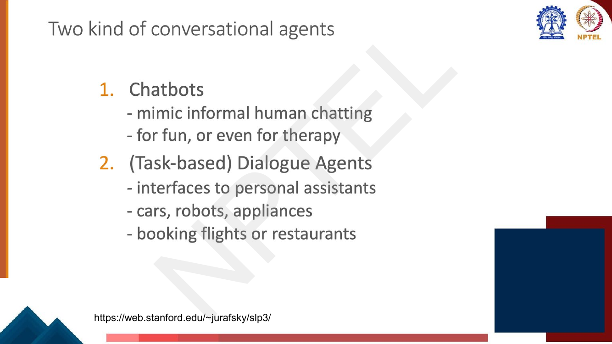

# Lec 33 — Dialogue Systems I: Open-Domain Chatbots and Dialogue Evaluation

> **Source:** `Week7.pdf` pp. 53–82 · **Week 7** · **Playlist:** Lec 33
> **Prereqs:** [Lec 29 — GPT and Decoder Pretraining](../week-06/29-gpt-decoder-pretraining.md), [Lec 19 — Decoding Strategies](../week-04/19-decoding-strategies.md)
> **Feeds into:** [Lec 34 — Dialogue Systems II](34-dialogue-systems-2.md), [Lec 36 — Instruction Fine-tuning I](../week-08/36-instruction-finetuning-1.md)

## Why this lecture exists

Every task so far had a right answer. Question answering has a gold span; translation has a reference
sentence; classification has a label. Dialogue does not. To "What are your plans for the weekend?"
there are thousands of good replies and they need share no words with each other, which breaks both
halves of the usual recipe: you cannot train by matching one reference, and you cannot *score* by
matching one reference either.

So this lecture does two things. First it lays out the three ways a chit-chat agent can produce a
turn — retrieve one, generate one, or retrieve-then-refine — and names the two characteristic failure
modes of the generative route: bland responses and inconsistent personality. Then it spends its second
half on evaluation, which is where the real intellectual content is. The argument that n-gram overlap
metrics are *invalid* for dialogue is the most examinable idea in this chapter, and this is the only
chapter in the book that owns it.

## The ideas

### Conversational agents, and the split that organises Lectures 33 and 34

**Conversational agent** — also called a *dialogue system*, *dialogue agent*, or *chatbot*; the deck
lists all four names on one slide and treats them as synonyms. The applications it names: personal
assistants (SIRI, Alexa, Cortana, Google Assistant), playing music, setting timers, chatting for fun,
booking travel, and clinical uses in mental health.

The deck then splits them in two, and this split is the whole structure of the Lec 33 / Lec 34 pair:


*Fig. — The organising split. Everything under (1) is this chapter; everything under (2) is [Lec 34](34-dialogue-systems-2.md). Note that the deck's **"chatbot"** means specifically the open-domain kind, even though the earlier slide used "chatbot" as a synonym for everything. Page 59.*

| | **Open-domain / chit-chat** (this chapter) | **Task-oriented** ([Lec 34](34-dialogue-systems-2.md)) |
|---|---|---|
| Goal | keep the conversation going, be engaging | complete a user's task |
| Success | subjective, no single right reply | the booking either happened or it didn't |
| Representation | learned end-to-end; **representation learning** does the work | hand-designed **frames**: intents, slots, values |
| Example turn | "Mom, what are we going to make tonight?" / "Curry and rice. What do you think?" | "I need to catch a train from Stevenage to Cambridge" → `intent: Book Train`, `slots: {from, to, day}` |
| Data cost | cheap: scrape conversations | expensive: every turn must be schema-annotated |

The deck's own justification for why open-domain systems are built with neural nets rather than
frames: "schema design and data-annotation for belief states, intents and other features becomes much
more complicated" for open-domain talk, so **representation learning becomes more important**, and the
two levers you pull are **encoder/decoder architecture design** and **loss-function design**. The
slide marks that sentence "Focus of this lecture." Frames, slot filling and dialogue state tracking
are entirely [Lec 34](34-dialogue-systems-2.md)'s; they get no further mention here.

The deck's two running examples are **ELIZA** (Weizenbaum 1966, p. 56 — pattern-matching rules, the
historical ancestor) and **BlenderBot** (Roller et al. 2020), which it shows holding a long,
surprisingly coherent conversation about singing a song:


*Fig. — Notice the bot sustains a topic across ten turns, invents a persona ("I'm a teacher") and uses it to deflect. Also notice it never actually does the thing it was asked to do — engagement, not task completion, is the target. Page 57.*

### Challenges in dialogue modelling

The deck's own list of four, which is worth memorising verbatim because it is exactly the kind of
thing an MCQ reproduces:


*Fig. — The cartoon is the point of the first bullet: the same utterance ("Band practice. My house. 6 to 8.") gets a different reading depending on who is speaking to whom. Page 62.*

1. **Interpretation of the context** — what a turn means depends on everything before it.
2. **Handling background knowledge** — much of what makes a reply good is world knowledge the
   conversation never states.
3. **Extracting useful features from context** — the history is long and mostly irrelevant.
4. **Learning from limited data** — annotated dialogue is scarce.

### The three response strategies

This is the chapter's spine. The deck gives two architectures for **corpus-based chatbots** —
retrieval and generation — then a hybrid.

#### 1. Response by retrieval

Keep a corpus $C$ of real conversational turns. Given the user's turn $q$, find the turn in $C$ that
best matches it and *say that turn verbatim*. Nothing is generated.

**What conversations to draw on?** (the deck's own heading) —

| Source | Examples the deck names |
|---|---|
| Telephone transcripts between volunteers | **Switchboard** corpus of American English |
| Movie dialogue | corpora of movie subtitles |
| Hired crowdworkers | **Topical-Chat** (11K conversations on 8 topics), **EMPATHETICDIALOGUES** (25K conversations grounded in a situation where the speaker felt a specific emotion) |
| Pseudo-conversations from social media | Twitter, **Reddit**, Weibo — *noisy, often used only as pre-training* |
| Recent | **ShareGPT** (user–LLM chatbot conversations), **OpenAssistant** (161,443 human-annotated messages in 35 languages) |

The deck adds one non-negotiable: **it is crucial to remove personally identifiable information (PII)**
before training on scraped conversation.

The **neural IR method** is a bi-encoder, exactly the dense-retrieval shape from
[Lec 31](31-question-answering-1.md):

![Slide "Response by retrieval: neural IR method": 1. given user turn q and training corpus C of conversation, 2. find in C the turn r most similar (BERT dot product) to q, 3. say r — with equations h_q = BERT_Q(q)[CLS], h_r = BERT_R(r)[CLS], response(q,C) = argmax over r in C of h_q · h_r](../../assets/pages/lec33/p-065.png)
*Fig. — Two **separate** BERT encoders, $\text{BERT}_Q$ and $\text{BERT}_R$, each taking the `[CLS]` vector; the score is a plain **dot product**, not cosine. That distinction has consequences — see N4. Page 65.*

$$\mathbf{h}_q = \text{BERT}_Q(q)[\texttt{CLS}], \qquad \mathbf{h}_r = \text{BERT}_R(r)[\texttt{CLS}], \qquad \text{response}(q, C) = \arg\max_{r \in C} \; \mathbf{h}_q \cdot \mathbf{h}_r$$

Because the two encoders are separate, every $\mathbf{h}_r$ can be computed and indexed *offline*;
at serving time you encode $q$ once and do one maximum-inner-product search.

**Advantage:** whatever comes out is a real human sentence, so it is always fluent, grammatical and
natural — you get those for free. **Limitation:** the agent can never say anything that is not already
in $C$. It cannot answer a genuinely novel question, cannot compose, and will say something slightly
off whenever the corpus has no close match.

#### 2. Response by generation

Condition a language model or encoder-decoder on the dialogue history $q$ and decode the response
token by token:

$$\hat{r}_t = \arg\max_{w \in V} P(w \mid q,\; r_1 \ldots r_{t-1})$$

The deck notes that modern corpus-based chatbots of either kind are **very data-intensive — commonly
hundreds of millions or billions of words**.

**The common problem the deck names: generic, bland, repetitive responses.**


*Fig. — Two distinct pathologies on one slide: **repetition** (the "See you later" loop) and **genericness** ("I don't know what you are talking about"). Both come from the same cause. Page 67.*

Why does this happen? Because "I don't know", "That's interesting" and "See you later" are
**high-probability under the model**. They appear after an enormous variety of contexts in the
training data, so the model's conditional distribution puts mass on them almost regardless of $q$.
Argmax decoding then picks them, every time.

This is *exactly* the quality-versus-diversity finding from
[Lec 19](../week-04/19-decoding-strategies.md), seen from the application side. There you learned that
maximising probability (greedy, beam search) produces text that is bland and repetitive, while
sampling methods (top-$k$, nucleus, temperature) trade a little fluency for diversity. The bland
chatbot is the same phenomenon with a human on the other end of it: **the most likely response is
rarely the most interesting one**, because human language is not a maximum-probability process. The
fix, correspondingly, is partly a decoding fix — sample instead of argmax — and partly an objective
fix (the deck's "loss function design" lever: maximum *mutual information* between context and
response, rather than plain likelihood of the response).

**Fine-tuning / continuing pretraining on large dialogue data** is the deck's main quality lever. Its
example is **DialoGPT**:

- continue pre-training **GPT-2** on conversations from **Reddit**;
- filter long utterances, non-English utterances, URLs, toxic comments;
- train on **147M dialogue instances (1.8B words)**;
- the paper claims **"human-level" response generation ability**.

This is the same recipe as domain-adaptive pretraining in
[Lec 30](../week-06/30-domain-and-multilingual-pretraining.md): take a general LM, keep running the LM
objective on in-domain text. Dialogue is just another domain.

#### 3. Response by retrieving and refining

The hybrid, and the deck's answer to "the agent can't say anything new" *and* "the agent says nothing
substantive". The idea is to generate from **informative text rather than dialogue**:

- To answer "Tell me something about Beijing", **XiaoIce** collects sentences from public lectures and
  news articles, and searches them with IR using **query expansion** from the user's turn.
- Or augment the encoder-decoder directly: use IR to retrieve passages from **Wikipedia**,
  **concatenate each retrieved sentence to the dialogue context with a separator token**, and feed the
  whole thing as encoder input. The model learns to weave the retrieved text into its reply.

That second recipe is retrieval-augmented generation in miniature; [Lec 55](../week-11/55-retrieval-augmented-generation.md)
owns RAG proper.

### The second failure mode: no consistent personality


*Fig. — Three paraphrases of one question, three mutually contradictory answers, within one conversation. The deck's closing line: "We would like our agents to be consistent!" Page 70.*

The cause is structural, not a bug: the model was trained on turns written by **thousands of different
people**. It learns $P(r \mid q)$ marginalised over all of them, so it is a **mish-mash of
personalities** (Li et al. 2016) and will happily sample Los Angeles on one turn and Madrid on the
next. Nothing in the objective rewards consistency across turns, because the training loss is computed
one (context, response) pair at a time.

**PersonaChat** is the deck's fix: give each speaker an explicit **persona** — a short list of profile
sentences — and *condition the model on it*, so consistency becomes a property of the input rather
than something the model must remember.


*Fig. — Trace how **every** persona sentence of Persona 2 surfaces in the dialogue (four children, Game of Thrones, painting). That is what the crowdworkers were paid to do, and it is what makes the dataset trainable. Five profile sentences per persona. Page 71.*

**BlenderBot 3** (2022) is the deck's industrial version of the same instinct, and it combines all
three response strategies plus persona memory in one modular pipeline:


*Fig. — Two learned **decisions** come first — *should I search?* and *should I access memory?* — and the loop closes at the bottom: the generated turn produces a new long-term memory ("Person 2's persona: Lewis Hamilton is my Favorite Driver") which is written back for later turns. That write-back is what gives consistency across a long session. Page 72.*

### Dialogue evaluation

Page 73 lays out three families — **content-overlap metrics**, **model-based metrics**, **human
evaluations** — in roughly increasing order of cost and of validity. This book covers all three here.

#### Content-overlap metrics, and why they fail

**Content-overlap metrics** compute a score for the **lexical** similarity between the generated text
and a gold-standard human-written reference. The deck's list: **BLEU**, ROUGE, METEOR, CIDEr. They are
"fast and efficient and widely used". [Lec 35](35-text-summarization.md) owns the definitions of BLEU
and ROUGE — go there for the formulas. What you own here is **why they are the wrong tool for
dialogue**.

The deck's argument is one slide, and it is the single most examinable idea in this chapter:


*Fig. — The two red rows are the argument. **"Yup."** means the same as the reference and scores **0**; **"Heck no!"** means the *opposite* and scores **0.67**, the best of all four. The metric's ranking is not merely noisy, it is inverted. Page 75.*

Read it carefully, because the logic is the examinable part:

- **False negative** — "Yup ." is a perfectly good reply, semantically identical to "Heck yes !", and
  shares **zero** words with it. Score 0.
- **False positive** — "Heck no !" shares two of the reference's three tokens and means the exact
  opposite. Score 0.67, the highest on the slide.

The underlying reason is structural, not a matter of tuning. **In dialogue there are many valid
responses to any utterance, and the reference is only one sample from that set.** A metric that
measures word overlap with one sample is measuring the wrong thing: it rewards lexical proximity to an
arbitrary choice, and lexical proximity is uncorrelated with — and, as "Heck no!" shows, sometimes
anti-correlated with — appropriateness. The deck's own one-line summary: **n-gram overlap metrics have
no concept of semantic relatedness.**

(Translation does not have this problem nearly as badly, which is why BLEU survives there: a sentence
has few correct translations and they mostly share content words. A conversational turn has thousands
of correct continuations and they share nothing.)

#### Model-based metrics

The repair: stop comparing strings, compare **embeddings**. The deck's three claims:

- use **learned representations** of words and sentences to compute semantic similarity between
  generated and reference text;
- **no more n-gram bottleneck**, because text units are represented as embeddings;
- the embeddings are **pretrained** and the distance metric used to measure similarity can be
  **fixed** (nothing has to be trained for the metric itself).

Its worked example is **BERTScore** (Zhang et al. 2019):


*Fig. — The recall side matches each **reference** token to its best candidate token; precision flips the direction. "cold"↔"freezing" scores 0.796 despite zero string overlap — exactly the case that killed BLEU. Page 77.*

$$R_{\text{BERT}} = \frac{1}{|x|}\sum_{x_i \in x} \max_{\hat{x}_j \in \hat{x}} \mathbf{x}_i^\top \hat{\mathbf{x}}_j, \qquad
P_{\text{BERT}} = \frac{1}{|\hat{x}|}\sum_{\hat{x}_j \in \hat{x}} \max_{x_i \in x} \mathbf{x}_i^\top \hat{\mathbf{x}}_j, \qquad
F_{\text{BERT}} = 2\,\frac{P_{\text{BERT}} \cdot R_{\text{BERT}}}{P_{\text{BERT}} + R_{\text{BERT}}}$$

with optional **importance weighting** by inverse document frequency,
$\text{idf}(w) = -\log \frac{1}{M}\sum_{i=1}^{M} \mathbb{I}[w \in x^{(i)}]$, so that rare, contentful
words count more than "the":

$$R_{\text{BERT}} = \frac{\sum_{x_i \in x} \text{idf}(x_i) \max_{\hat{x}_j \in \hat{x}} \mathbf{x}_i^\top \hat{\mathbf{x}}_j}{\sum_{x_i \in x} \text{idf}(x_i)}$$

Note the shape: it is precision/recall/$F_1$ ([Lec 5](../week-01/05-nlp-tasks-and-paradigms.md)) with
*soft* matching — a token "matches" to the degree that cosine says so, instead of 0/1.

#### "Dialogue evaluation is tricky!" — and the move to reference-free

The deck's own heading, and its point is that model-based metrics **still are not enough**, because
they are still anchored to one reference:

> Even semantic similarity with the GT response may not suffice. Need to evaluate how good is the
> response given the conversation history (**reference-free**).

Its illustration: context "What are your plans for the weekend?" / "I'm thinking of going on a hike
… Do you want to join?" / "That sounds fun! … Which trail were you thinking of?" with three candidates:

| | Candidate | Ground truth? | Relevant? |
|---|---|---|---|
| **R1** | "We should go to Red Rocks park, I heard they opened a new trail." | Yes | Yes |
| **R2** | "How about the summit trail at the nearby mountain? It has beautiful views." | **No** | **Yes** |
| **R3** | "I'm going to the grocery store to buy some milk." | No | No |


*Fig. — The middle row is the whole argument: **GT? No. Relevant? Yes.** Any reference-based metric collapses that row onto the bottom one. Page 78.*

R2 is a perfectly good response and is *not* the ground truth; it is also not semantically similar to
the ground truth (a different trail, a different park). Any reference-based metric, overlap or
embedding, scores R2 like R3. The only way to separate them is to score the response **against the
context** instead of against a reference.

#### Making use of the context


*Fig. — The two branches **share** the encoder $g_\phi$ (dashed line); only the response branch gets an extra linear map $\mathbf{W}$. The MI estimator is what is maximised at training time. Page 79.*

**Discourse Mutual Information Maximization (DMI)** trains a scorer by maximising the mutual
information between a context's representation $\mathbf{z}_C$ and its true response's representation
$\mathbf{z}_R = \mathbf{W}\mathbf{E}_r$. The deck's sentence: *we can train a model to give a high
score to the good responses than the bad responses, given the context*. In practice you take real
(context, response) pairs as positives and mismatched pairs as negatives — the same contrastive setup
as dense retrieval in [Lec 32](32-question-answering-2.md) — and the learned score is then used at
evaluation time with **no reference at all**. That is what "reference-free" buys you: R2 above gets a
high score because it fits the context, regardless of what the gold response happened to be.

#### Human evaluation

The gold standard. The deck asks for a rating **overall or along some specific dimension**, and lists
eight: **fluency, coherence / consistency, factuality and correctness, commonsense, style / formality,
grammaticality, typicality, redundancy** (page 80).

It is the only evaluation that actually measures what you care about, and it is slow, expensive, and
noisy — different annotators disagree, so you need several per item and must report inter-annotator
agreement. N5 and N6 below make both costs concrete. The modern response to "we cannot afford humans
for every training run" is to *train the model on human preferences once* and reuse them: instruction
tuning and RLHF, [Lec 36](../week-08/36-instruction-finetuning-1.md)–[Lec 40](../week-08/40-dpo.md).
Note the lineage — RLHF's reward model is structurally the same object as a learned reference-free
evaluation metric, just used as a training signal instead of a report number.

## Worked numericals

The deck's page range contains **no "Try this problem" page** — every page from 53 to 82 was opened
and checked. The deck does, however, print four *unexplained* numbers on page 75, and N1 recovers the
metric that produces them, which is the closest thing to an exercise in this lecture.

Throughout, BLEU-$N$ means the clipped $n$-gram precision up to order $N$, geometric-meaned and
multiplied by the brevity penalty $\text{BP} = \min\!\left(1, e^{1 - r/c}\right)$ where $r$ is the
reference length and $c$ the candidate length. [Lec 35](35-text-summarization.md) owns the full
definition.

### N1. Reproducing the deck's "Simple Failure Case" scores (page 75)
**Given:** reference `heck yes !` ($r = 3$ tokens). Candidates and the deck's printed scores: `yes !`
→ 0.61, `you know it !` → 0.25, `yup .` → 0, `heck no !` → 0.67. The deck never says what metric this is.
**Find:** the metric, and each score from first principles.

1. Try **BLEU-1** (unigram precision × brevity penalty). Reference unigrams: {heck, yes, !}.
2. `yes !`: $c = 2$, matches {yes, !} → $p_1 = 2/2 = 1$. $c < r$, so $\text{BP} = e^{1 - 3/2} = e^{-0.5} = 0.6065$.
   Score $= 1 \times 0.6065 = \mathbf{0.6065} \to 0.61$ ✓
3. `you know it !`: $c = 4$, matches {!} only → $p_1 = 1/4 = 0.25$. $c > r$ so $\text{BP} = 1$.
   Score $= \mathbf{0.25}$ ✓
4. `yup .`: $c = 2$, matches nothing ( `.` $\neq$ `!` ) → $p_1 = 0$. Score $= \mathbf{0}$ ✓
5. `heck no !`: $c = 3$, matches {heck, !} → $p_1 = 2/3 = 0.6667$. $c = r$ so $\text{BP} = e^{0} = 1$.
   Score $= \mathbf{0.6667} \to 0.67$ ✓

**Answer:** the deck's metric is **BLEU-1**, and all four numbers reproduce exactly. The semantically
correct `yup .` scores 0 (false negative) while the semantically opposite `heck no !` scores the
highest of the four (false positive) — note that `heck no !` wins purely because it is the same
*length* as the reference and shares its two least contentful tokens.

### N2. The content-overlap failure case, computed
**Given:** context "did you enjoy the movie"; reference response `yes it was fantastic` ($r = 4$).
Candidate **A** = `i loved every minute` (semantically perfect, lexically disjoint, $c = 4$);
candidate **B** = `no it was awful` (lexically overlapping, semantically opposite, $c = 4$);
candidate **C** = `i think it was okay` (bland hedge, $c = 5$).
**Find:** BLEU-1 and BLEU-2 for each, and the induced ranking.

1. Reference unigrams {yes, it, was, fantastic}; bigrams {(yes,it), (it,was), (was,fantastic)}.
2. **A**: shared unigrams $= 0$, so $p_1 = 0/4 = 0$ → BLEU-1 $= \mathbf{0}$, BLEU-2 $= \mathbf{0}$.
3. **B**: shared unigrams {it, was} → $p_1 = 2/4 = 0.5$; $c = r$ so $\text{BP} = 1$ → BLEU-1 $= \mathbf{0.5}$.
4. **B** bigrams: {(no,it), (it,was), (was,awful)}; one match → $p_2 = 1/3$.
   BLEU-2 $= 1 \times \sqrt{0.5 \times 0.3333} = \sqrt{0.16667} = \mathbf{0.4082}$.
5. **C**: shared unigrams {it, was} → $p_1 = 2/5 = 0.4$; $c = 5 > r$ so $\text{BP} = 1$ → BLEU-1 $= \mathbf{0.4}$.
6. **C** bigrams: 4 of them, one match (it,was) → $p_2 = 0.25$; BLEU-2 $= \sqrt{0.4 \times 0.25} = \sqrt{0.1} = \mathbf{0.3162}$.

**Answer:** the overlap ranking is **B (0.5) > C (0.4) > A (0)**. The metric puts the response that
means the *opposite* of the reference first, the empty hedge second, and the one perfect reply last
with a score of exactly zero. This is the deck's page-75 argument reproduced on a longer example, and
it is the reason content-overlap metrics are invalid for dialogue.

### N3. The same three responses, scored by embedding similarity
**Given:** a 3-dimensional space whose axes are (positive sentiment, negative sentiment,
about-the-film). All four vectors are unit length, so cosine similarity is just the dot product.
Reference $\mathbf{e}_{\text{ref}} = (0.80, 0.00, 0.60)$;
$\mathbf{e}_A = (0.60, 0.00, 0.80)$; $\mathbf{e}_B = (0.00, 0.80, 0.60)$;
$\mathbf{e}_C = (0.48, 0.36, 0.80)$.
**Find:** the cosine of each candidate with the reference, and the ranking.

1. Check unit norms: $0.8^2 + 0.6^2 = 0.64 + 0.36 = 1$ ✓;
   $0.48^2 + 0.36^2 + 0.80^2 = 0.2304 + 0.1296 + 0.64 = 1$ ✓.
2. $\cos(\text{ref}, A) = (0.80)(0.60) + (0.00)(0.00) + (0.60)(0.80) = 0.48 + 0.48 = \mathbf{0.96}$.
3. $\cos(\text{ref}, B) = (0.80)(0.00) + (0.00)(0.80) + (0.60)(0.60) = 0 + 0 + 0.36 = \mathbf{0.36}$.
4. $\cos(\text{ref}, C) = (0.80)(0.48) + (0.00)(0.36) + (0.60)(0.80) = 0.384 + 0.48 = \mathbf{0.864}$.

**Answer:** **A (0.96) > C (0.864) > B (0.36)** — the *exact reverse* of N2's ordering. The embedding
metric puts the semantically perfect response first and the semantically opposite one last, because it
compares meaning rather than strings. This is the whole case for model-based metrics in two
computations. (It is also why B's 0.36 is not 0: B is still about the film, so the third axis still
agrees.)

### N4. Neural-IR response retrieval, and why dot product is not cosine (page 65)
**Given:** context encoding $\mathbf{h}_q = (3, 4, 0)$, so $\lVert\mathbf{h}_q\rVert = 5$. Candidate
response pool: $\mathbf{h}_{r_1} = (0.6, 0.8, 0)$ (a specific, on-topic reply),
$\mathbf{h}_{r_2} = (4, 3, 5)$ (a long generic reply with a large norm),
$\mathbf{h}_{r_3} = (1, 1, 1)$, $\mathbf{h}_{r_4} = (0, 0, 2)$.
**Find:** $\arg\max_r \mathbf{h}_q \cdot \mathbf{h}_r$ as the deck specifies, and $\arg\max_r \cos$.

1. $\mathbf{h}_q \cdot \mathbf{h}_{r_1} = 3(0.6) + 4(0.8) + 0 = 1.8 + 3.2 = \mathbf{5.0}$; $\lVert\mathbf{h}_{r_1}\rVert = \sqrt{0.36 + 0.64} = 1$, so $\cos = 5.0/(5 \times 1) = \mathbf{1.0}$.
2. $\mathbf{h}_q \cdot \mathbf{h}_{r_2} = 12 + 12 + 0 = \mathbf{24.0}$; $\lVert\mathbf{h}_{r_2}\rVert = \sqrt{16+9+25} = \sqrt{50} = 7.071$, so $\cos = 24/(5 \times 7.071) = \mathbf{0.6788}$.
3. $\mathbf{h}_q \cdot \mathbf{h}_{r_3} = 3 + 4 + 0 = \mathbf{7.0}$; $\lVert\mathbf{h}_{r_3}\rVert = \sqrt{3} = 1.732$, so $\cos = 7/(5 \times 1.732) = \mathbf{0.8083}$.
4. $\mathbf{h}_q \cdot \mathbf{h}_{r_4} = 0$; $\cos = \mathbf{0}$.

**Answer:** the deck's rule, $\arg\max \mathbf{h}_q \cdot \mathbf{h}_r$, returns **$r_2$** (24.0) — the
generic high-norm response. Cosine returns **$r_1$** (1.0), which is the perfectly aligned one. An
unnormalised dot product rewards large $\lVert\mathbf{h}_r\rVert$ as well as alignment, and long bland
utterances tend to have large norms. The retrieval route has its own version of the genericness
problem, and normalising the scores fixes it.

### N5. Inter-annotator agreement for a human evaluation
**Given:** two annotators rate 10 chatbot responses as acceptable (1) or not (0).

| item | 1 | 2 | 3 | 4 | 5 | 6 | 7 | 8 | 9 | 10 |
|---|---|---|---|---|---|---|---|---|---|---|
| **A** | 1 | 1 | 1 | 1 | 0 | 0 | 1 | 0 | 1 | 0 |
| **B** | 1 | 1 | 0 | 1 | 0 | 1 | 1 | 0 | 1 | 0 |

**Find:** percentage agreement $p_o$ and Cohen's $\kappa$.

1. Contingency: both 1 on items 1, 2, 4, 7, 9 → **5**. Both 0 on items 5, 8, 10 → **3**.
   A=1/B=0 on item 3 → **1**. A=0/B=1 on item 6 → **1**. Total 10 ✓
2. Observed agreement $p_o = (5 + 3)/10 = \mathbf{0.80}$.
3. Marginals: $P(A{=}1) = 6/10 = 0.6$, $P(B{=}1) = 6/10 = 0.6$; $P(A{=}0) = P(B{=}0) = 0.4$.
4. Chance agreement $p_e = (0.6)(0.6) + (0.4)(0.4) = 0.36 + 0.16 = \mathbf{0.52}$.
5. $\kappa = \dfrac{p_o - p_e}{1 - p_e} = \dfrac{0.80 - 0.52}{1 - 0.52} = \dfrac{0.28}{0.48} = \mathbf{0.5833}$.

**Answer:** $p_o = 0.80$, $\kappa = 0.583$ — "moderate" agreement on the usual Landis–Koch bands
(0.41–0.60). Note how much lower $\kappa$ is than the raw 80%: more than half of that agreement is
explained by chance alone, because both annotators say "acceptable" most of the time. **Reporting raw
percentage agreement for dialogue ratings flatters your annotation.**

### N6. The cost of human evaluation
**Given:** you want to compare 5 chatbot systems on $N = 500$ dialogue contexts. Each response is
rated on 4 dimensions by 3 annotators (needed for agreement). Each individual rating takes 40 seconds.
Annotators are paid \$15 per hour.
**Find:** total annotator-hours and cost, per system and in total.

1. Ratings per system: $500 \times 4 \times 3 = \mathbf{6000}$ ratings.
2. Time per system: $6000 \times 40\text{ s} = 240{,}000$ s $= 240000/3600 = \mathbf{66.67}$ hours.
3. Cost per system: $66.67 \times 15 = \mathbf{\$1000}$.
4. All five systems: $5 \times 66.67 = \mathbf{333.3}$ hours and $5 \times 1000 = \mathbf{\$5000}$.
5. The same comparison with BLEU-1 takes under a second and costs nothing — and, by N2, gives you the
   wrong ranking.

**Answer:** 333.3 annotator-hours and \$5,000 for one five-way comparison. **And it must be redone
from scratch for every new model checkpoint**, which is why the field keeps trying to build an
automatic metric, and why RLHF ([Lec 38](../week-08/38-rlhf-1.md)) exists: pay for the human judgments
*once*, distil them into a reward model, and reuse it forever.

## Code

Both scorers in one file, run on the same three candidate responses, so the divergence in their
rankings is visible. The numbers match N1–N5 by hand.

```python
import numpy as np, math
from collections import Counter

# ---------- 1. n-gram overlap scorer (BLEU-style, with brevity penalty) ----
def ngrams(toks, n):
    return Counter(tuple(toks[i:i+n]) for i in range(len(toks) - n + 1))

def bleu(reference, candidate, N=1):
    """Clipped n-gram precision up to order N, geometric mean, times brevity penalty."""
    r, c = reference.lower().split(), candidate.lower().split()
    precisions = []
    for n in range(1, N + 1):
        ref_counts, cand_counts = ngrams(r, n), ngrams(c, n)
        total = sum(cand_counts.values())
        if total == 0:
            return 0.0
        clipped = sum(min(v, ref_counts[g]) for g, v in cand_counts.items())
        precisions.append(clipped / total)
    if min(precisions) == 0.0:
        return 0.0                       # one zero kills the geometric mean
    bp = 1.0 if len(c) > len(r) else math.exp(1 - len(r) / len(c))
    return bp * math.exp(sum(math.log(p) for p in precisions) / N)

# ---------- 2. embedding cosine scorer ------------------------------------
def cosine(u, v):
    return float(u @ v / (np.linalg.norm(u) * np.linalg.norm(v)))

# hand-built 3-d space, axes = (positive sentiment, negative sentiment, about-the-film)
REF = "yes it was fantastic"
E = {REF:                    np.array([0.80, 0.00, 0.60]),   # reference
     "i loved every minute": np.array([0.60, 0.00, 0.80]),   # right meaning, 0 shared words
     "no it was awful":      np.array([0.00, 0.80, 0.60]),   # 2 shared words, opposite meaning
     "i think it was okay":  np.array([0.48, 0.36, 0.80])}   # bland hedge
cands = ["i loved every minute", "no it was awful", "i think it was okay"]

print("CONTEXT  : did you enjoy the movie")
print("REFERENCE:", REF, "\n")
print(f"{'candidate':24s}{'BLEU-1':>9s}{'BLEU-2':>9s}{'cosine':>9s}")
rows = [(c, bleu(REF, c, 1), bleu(REF, c, 2), cosine(E[REF], E[c])) for c in cands]
for c, b1, b2, cs in rows:
    print(f"{c:24s}{b1:9.4f}{b2:9.4f}{cs:9.4f}")
print("\n overlap ranking:", " > ".join(r[0] for r in sorted(rows, key=lambda r: -r[1])))
print(" cosine  ranking:", " > ".join(r[0] for r in sorted(rows, key=lambda r: -r[3])))

# ---------- 3. the deck's own failure case (page 75) -----------------------
print("\nDeck p.75, reference = 'heck yes !'")
for c in ["yes !", "you know it !", "yup .", "heck no !"]:
    print(f"  {c:15s} BLEU-1 = {bleu('heck yes !', c, 1):.4f}")

# ---------- 4. neural-IR response retrieval (deck p.65) --------------------
h_q  = np.array([3.0, 4.0, 0.0])
pool = {"r1 specific ": np.array([0.6, 0.8, 0.0]),
        "r2 generic  ": np.array([4.0, 3.0, 5.0]),
        "r3 vague    ": np.array([1.0, 1.0, 1.0]),
        "r4 off-topic": np.array([0.0, 0.0, 2.0])}
print("\nneural IR scoring      dot (the deck's rule)   cosine")
for k, h_r in pool.items():
    print(f"  {k}      {h_q @ h_r:6.2f}            {cosine(h_q, h_r):.4f}")
print("  argmax dot ->", max(pool, key=lambda k: h_q @ pool[k]).strip())
print("  argmax cos ->", max(pool, key=lambda k: cosine(h_q, pool[k])).strip())

# ---------- 5. inter-annotator agreement -----------------------------------
A = np.array([1,1,1,1,0,0,1,0,1,0])     # annotator A: acceptable? 1 = yes
B = np.array([1,1,0,1,0,1,1,0,1,0])     # annotator B
p_o = float((A == B).mean())
p_e = A.mean()*B.mean() + (1-A.mean())*(1-B.mean())
print(f"\nhuman eval  p_o = {p_o:.2f}   p_e = {p_e:.2f}   Cohen kappa = {(p_o-p_e)/(1-p_e):.4f}")
```

Printed output:

```
CONTEXT  : did you enjoy the movie
REFERENCE: yes it was fantastic 

candidate                  BLEU-1   BLEU-2   cosine
i loved every minute       0.0000   0.0000   0.9600
no it was awful            0.5000   0.4082   0.3600
i think it was okay        0.4000   0.3162   0.8640

 overlap ranking: no it was awful > i think it was okay > i loved every minute
 cosine  ranking: i loved every minute > i think it was okay > no it was awful

Deck p.75, reference = 'heck yes !'
  yes !           BLEU-1 = 0.6065
  you know it !   BLEU-1 = 0.2500
  yup .           BLEU-1 = 0.0000
  heck no !       BLEU-1 = 0.6667

neural IR scoring      dot (the deck's rule)   cosine
  r1 specific         5.00            1.0000
  r2 generic         24.00            0.6788
  r3 vague            7.00            0.8083
  r4 off-topic        0.00            0.0000
  argmax dot -> r2 generic
  argmax cos -> r1 specific

human eval  p_o = 0.80   p_e = 0.52   Cohen kappa = 0.5833
```

The two rankings are exact reverses of each other. That one fact is the whole evaluation half of this
lecture. Note also that the deck's four page-75 numbers fall straight out of BLEU-1 — 0.6065, 0.25,
0.0, 0.6667 — confirming the metric it never names.

## Exam pack

### Must-memorise

| Item | Exactly this |
|---|---|
| The two kinds of conversational agent | **Chatbots** (open-domain, chit-chat, for fun or therapy) vs **task-based dialogue agents** ([Lec 34](34-dialogue-systems-2.md)) |
| Why open-domain uses representation learning | schema design and annotation for belief states/intents is too complicated; the two levers are **encoder/decoder architecture design** and **loss-function design** |
| Four challenges in dialogue modelling | interpretation of the context; handling background knowledge; extracting useful features from context; learning from limited data |
| Two corpus-based chatbot architectures | **response by retrieval** and **response by generation** |
| Neural IR retrieval | $\mathbf{h}_q = \text{BERT}_Q(q)[\texttt{CLS}]$, $\mathbf{h}_r = \text{BERT}_R(r)[\texttt{CLS}]$, $\text{response}(q,C) = \arg\max_{r \in C} \mathbf{h}_q \cdot \mathbf{h}_r$ |
| Retrieval: strength / weakness | always fluent and human-sounding / **can never say anything not already in the corpus** |
| Generation | $\hat{r}_t = \arg\max_{w \in V} P(w \mid q, r_1 \ldots r_{t-1})$ |
| Generation's common problem | **generic, bland, repetitive responses** ("I don't know", "See you later") — they are high-probability under the model; same phenomenon as [Lec 19](../week-04/19-decoding-strategies.md) |
| The *other* common problem | **no consistent personality** — trained on many speakers, so a "mish-mash of personalities" (Li et al. 2016) |
| Fix for inconsistency | **PersonaChat** — condition on an explicit persona (5 profile sentences per speaker) |
| Third strategy | **response by retrieving and refining** — retrieve informative text (Wikipedia), concatenate to the dialogue context with a **separator token**, let the encoder-decoder weave it in |
| Three evaluation families | content-overlap, model-based, human |
| Content-overlap metrics | BLEU, ROUGE, METEOR, CIDEr — lexical similarity to a gold reference; fast, widely used |
| **Why they fail for dialogue** | many valid responses exist for any utterance, so a good reply can share **zero** words with the reference (**false negative**) while a contradictory reply shares most of them (**false positive**); *n*-gram overlap has **no concept of semantic relatedness** |
| BERTScore | $R_{\text{BERT}} = \frac{1}{\lvert x\rvert}\sum_{x_i} \max_{\hat{x}_j} \mathbf{x}_i^\top\hat{\mathbf{x}}_j$; $P$ flips the direction; $F_{\text{BERT}} = 2PR/(P+R)$; optional **idf** importance weighting |
| Why model-based metrics help | embeddings, so **no n-gram bottleneck**; embeddings **pretrained**, distance metric can be **fixed** |
| Why even they are not enough | still anchored to one ground-truth response; a good reply can be relevant but not similar to the GT → need **reference-free**, context-aware scoring |
| DMI | Discourse Mutual Information Maximization: shared encoder $g_\phi$ on context and response, $\mathbf{z}_R = \mathbf{W}\mathbf{E}_r$, maximise MI between $\mathbf{z}_C$ and $\mathbf{z}_R$ |
| Human-evaluation dimensions (8) | fluency; coherence/consistency; factuality and correctness; commonsense; style/formality; grammaticality; typicality; redundancy |
| Cohen's $\kappa$ | $\kappa = \dfrac{p_o - p_e}{1 - p_e}$ |

### Numbers worth knowing

| Quantity | Value |
|---|---|
| ELIZA | Weizenbaum, **1966** |
| BlenderBot | Roller et al., **2020**; BlenderBot 3, **2022** (arXiv 2208.03188) |
| Personality problem cited to | Li et al., **2016** |
| BERTScore | Zhang et al., **2019** (arXiv 1904.09675) |
| DMI | arXiv **2112.05787** |
| Topical-Chat | **11K** conversations, **8** topics |
| EMPATHETICDIALOGUES | **25K** crowdsourced conversations |
| OpenAssistant | **161,443** messages, **35** languages |
| DialoGPT training data | **147M** dialogue instances, **1.8B** words; base model **GPT-2**; source **Reddit** |
| Corpus size modern chatbots need | hundreds of millions to **billions of words** |
| PersonaChat persona size | **5** profile sentences per persona |
| Deck's page-75 scores | `Yes !` 0.61, `You know it !` 0.25, `Yup .` **0** (false negative), `Heck no !` **0.67** (false positive) |
| Jurafsky & Martin reference | SLP3, 3rd ed., online manuscript **20 August 2024**, **Chapter 15** |

### Likely MCQ traps

- **"BLEU is a reasonable metric for dialogue."** No. The deck's page 75 is an explicit demonstration
  that it produces both false negatives and false positives. BLEU is defensible for translation
  (few correct outputs, overlapping) and not for dialogue (many correct outputs, non-overlapping).
- **Confusing the false negative with the false positive.** `Yup .` scores **0** and is *correct* →
  false negative. `Heck no !` scores **0.67** and is *wrong* → false positive. Getting these the wrong
  way round is the easiest mark to lose on this deck.
- **"Model-based metrics solve dialogue evaluation."** They solve the *n*-gram bottleneck, not the
  one-reference problem. The deck's "Dialog Evaluation is Tricky!" slide exists precisely to say that
  a relevant-but-different response (R2) still scores badly against the GT.
- **"Reference-free means no training data."** It means no reference *at evaluation time*. DMI is
  trained on (context, response) pairs.
- **Retrieval vs generation strengths.** Retrieval → always fluent, cannot say anything new.
  Generation → can say anything, often bland or ungrammatical. Do not swap these.
- **"The generic-response problem is a decoding bug."** It is a property of the *distribution*: bland
  replies genuinely are high-probability, because they follow many different contexts in the data.
  Decoding changes which part of that distribution you sample; it does not reshape it. Fixing it
  properly means changing the objective or the data.
- **"PersonaChat fixes blandness."** No — PersonaChat addresses **inconsistency / lack of
  personality**. Blandness is the *other* common problem.
- **"The neural IR method uses cosine similarity."** The deck writes a **dot product**, and uses
  **two separate** BERT encoders ($\text{BERT}_Q$ and $\text{BERT}_R$), not one shared one.
- **"DialoGPT was trained from scratch."** It **continues pre-training GPT-2** on Reddit.
- **"Cohen's $\kappa$ equals percentage agreement."** $\kappa$ subtracts chance agreement; in N5, 80%
  raw agreement becomes $\kappa = 0.58$.
- **Belief states, slots and intents in an open-domain question.** Those are task-oriented concepts
  ([Lec 34](34-dialogue-systems-2.md)); the open-domain slide mentions them only to say they are
  *too hard to annotate*, which is why representation learning is used instead.

### Self-test

1. Name the two kinds of conversational agent in the deck's own words, and say which this lecture covers.
2. The reference response is "Heck yes !". Compute BLEU-1 for the candidate "Heck no !" and explain why the result is damaging.
3. State the deck's four challenges in dialogue modelling.
4. Write the neural-IR response equation, including the two encoders.
5. Give one strength and one limitation of response-by-retrieval that generation does not share.
6. Why is "I don't know what you are talking about" such a common chatbot output? Link your answer to a decoding concept from Lec 19.
7. What problem does PersonaChat address, and how?
8. Why is "semantic similarity to the ground-truth response" still an inadequate dialogue metric? Give the deck's R2 example.
9. Two annotators agree on 18 of 20 items; each marks 12 items "acceptable". Compute $p_o$, $p_e$ and $\kappa$.
10. Write $R_{\text{BERT}}$ and explain in one sentence what the $\max$ is doing.

<details><summary>Answers</summary>

1. **(1) Chatbots** — mimic informal human chatting, for fun or even for therapy; **(2) (task-based) dialogue agents** — interfaces to personal assistants, cars, robots, appliances, booking flights or restaurants. This lecture covers (1), the open-domain kind; [Lec 34](34-dialogue-systems-2.md) covers (2).
2. Reference unigrams {heck, yes, !}; candidate "heck no !" matches {heck, !} → $p_1 = 2/3 = 0.667$; lengths are equal so $\text{BP} = 1$; BLEU-1 $= 0.67$. It is damaging because that is the **highest** score of the four candidates on the slide and the response means the *opposite* of the reference — a false positive.
3. Interpretation of the context; handling background knowledge; extracting useful features from context; learning from limited data.
4. $\mathbf{h}_q = \text{BERT}_Q(q)[\texttt{CLS}]$, $\mathbf{h}_r = \text{BERT}_R(r)[\texttt{CLS}]$, $\text{response}(q,C) = \arg\max_{r\in C} \mathbf{h}_q \cdot \mathbf{h}_r$.
5. Strength: the output is a real human utterance, so it is always fluent and natural. Limitation: it can only ever say something already in the corpus — no novel content.
6. Because it is a **high-probability** continuation of a huge variety of contexts, so the model's conditional distribution puts mass on it almost regardless of the input, and argmax/beam decoding picks it. This is the quality-versus-diversity trade-off from [Lec 19](../week-04/19-decoding-strategies.md): maximum-probability decoding yields bland, repetitive text.
7. **Inconsistent personality** — a model trained on many speakers is a mish-mash of personalities and gives contradictory answers about itself. PersonaChat gives each speaker an explicit persona (five profile sentences) and conditions the model on it, so consistency is enforced through the input.
8. Because there are many valid responses and the GT is only one of them. In the deck's example, R2 ("How about the summit trail at the nearby mountain?") is *relevant* but is **not** the GT and is not semantically close to it, so any reference-based metric scores it like the irrelevant R3. You need a **reference-free**, context-conditioned score.
9. $p_o = 18/20 = 0.9$. Marginals $12/20 = 0.6$ for both, so $p_e = 0.6^2 + 0.4^2 = 0.36 + 0.16 = 0.52$. $\kappa = (0.9 - 0.52)/(1 - 0.52) = 0.38/0.48 = 0.7917$.
10. $R_{\text{BERT}} = \frac{1}{\lvert x\rvert}\sum_{x_i \in x} \max_{\hat{x}_j \in \hat{x}} \mathbf{x}_i^\top \hat{\mathbf{x}}_j$. The $\max$ **greedily aligns** each reference token to its most similar candidate token, so matching is soft and does not require identical strings.

</details>

## Beyond the slides

**Gap:** The deck names the genericness problem but never names a fix beyond "fine-tune on more data".
**Why it matters:** The standard fix in the literature is **Maximum Mutual Information (MMI)**
decoding (Li et al. 2016): instead of $\arg\max_r P(r \mid q)$, maximise
$\log P(r \mid q) - \lambda \log P(r)$, which penalises responses that are likely *a priori*. "I don't
know" has a huge $P(r)$, so the penalty kills it. This is the deck's "loss-function design" lever made
concrete, and the subtraction-of-an-unconditional-term shape recurs in
[Lec 40](../week-08/40-dpo.md)'s DPO objective.

**Gap:** The deck shows BERTScore but not the *trained* model-based metrics.
**Why it matters:** **ADEM** (Lowe et al. 2017) trains a regressor on human ratings to predict a score
from (context, reference, response), and is the canonical "learn the metric" paper; the modern
descendant is **LLM-as-a-judge**, where a strong model is prompted to rate the response. Both are
reference-free in the same sense as DMI. The known failure of all of them — that they can be gamed by
whatever the generator optimises — is why human evaluation never fully goes away.

**Gap:** No mention of **safety**, despite BlenderBot 3 being the running example and DialoGPT's
pipeline explicitly filtering toxic comments.
**Why it matters:** A retrieval chatbot will repeat whatever offensive thing is in its corpus
verbatim; a generative one will reproduce the distribution of its training data. Both of BlenderBot's
public releases were newsworthy for exactly this. This is the practical reason the field moved to
RLHF ([Lec 38](../week-08/38-rlhf-1.md)–[Lec 40](../week-08/40-dpo.md)) rather than more data, and it
is [Lec 59](../week-12/59-trustworthy-llms-taxonomy.md)'s subject.

**Gap:** The deck never states how the dialogue **context** is actually fed to the model — how many
previous turns, how they are delimited.
**Why it matters:** In practice the whole history is concatenated into one string with speaker tokens
(`[U:]` / `[S:]`, as on page 66) and truncated to the context window. That truncation is why long
conversations lose coherence, and it is precisely what BlenderBot 3's long-term memory store is
working around. Connects directly to [Lec 54](../week-11/54-long-sequence-modeling.md).

## Cut from the slides

Page 53 is the title slide and page 54 the "Concepts Covered" list; page 82 is "Thank You" and page 81
is the single bibliography entry (Jurafsky & Martin, SLP3 3rd ed., 20 August 2024, Chapter 15), which
I folded into the Numbers table. Page 58 is an uncaptioned screenshot of a ChatGPT session ("explain
chatgpt like i'm five" / "now explain it like i'm an adult") used purely as a hook; its content is
covered by [Lec 29](../week-06/29-gpt-decoder-pretraining.md) and [Lec 41](../week-09/41-prompting-1.md).
Page 56's full ELIZA transcript is compressed to one naming sentence — the pattern-matching mechanism
is historical and not examinable from this deck. Page 60's task-oriented example (intents, belief
states, slots, policy) sits in this lecture's range but belongs wholly to
[Lec 34](34-dialogue-systems-2.md); I used it only for the one contrast row in the comparison table and
deliberately did not teach any of it. Pages 63 and 73 are structural "here are the two/three options"
slides whose content is carried by the sections that follow them, so neither is reproduced as a figure.
Nothing about the three response strategies, the two failure modes, or any of the six evaluation pages
(73–80) was dropped.
