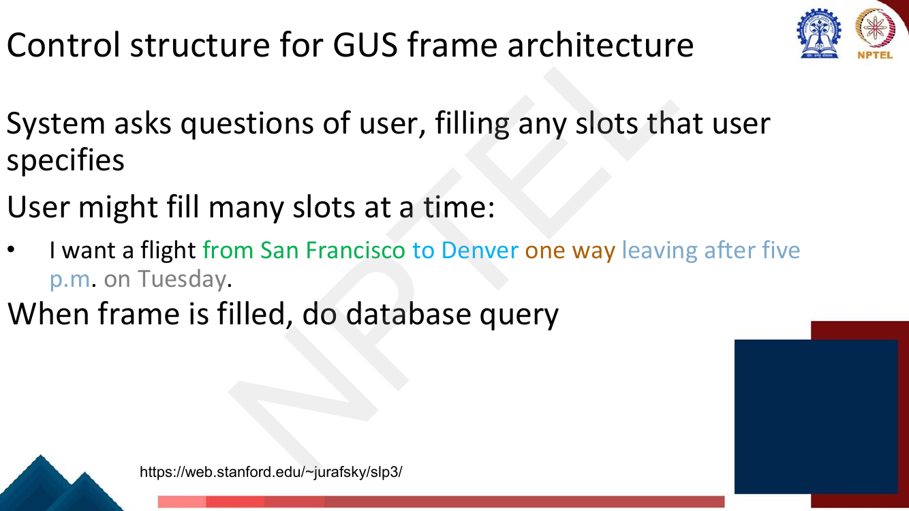
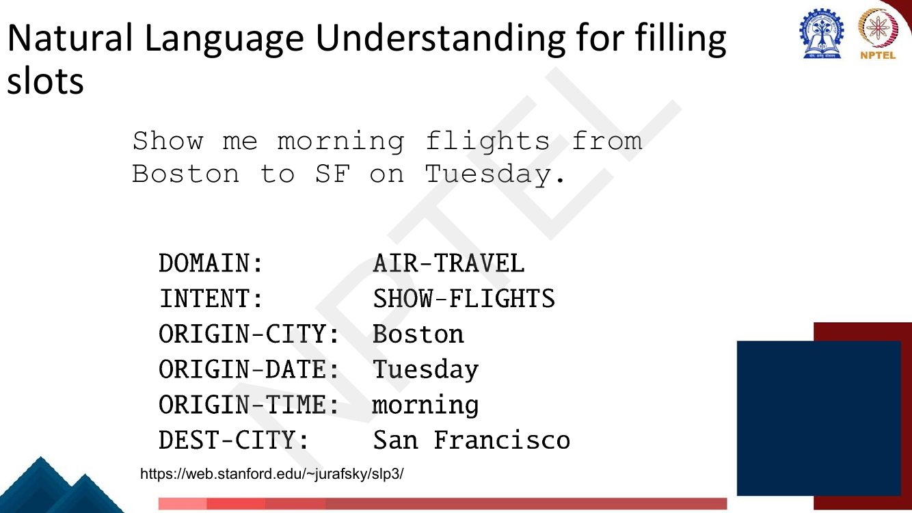
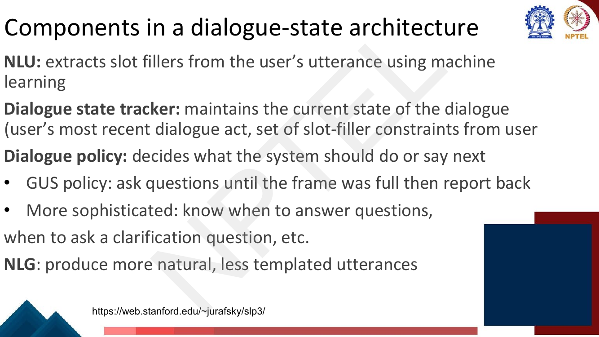
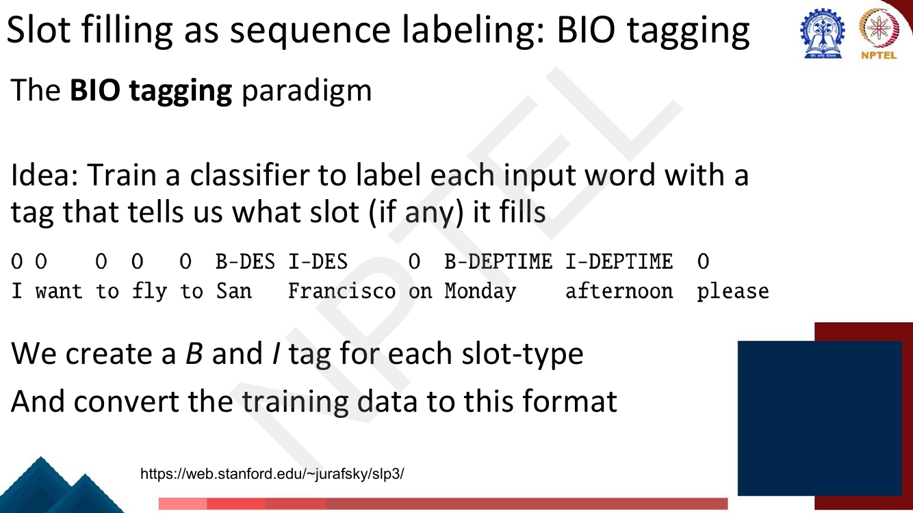
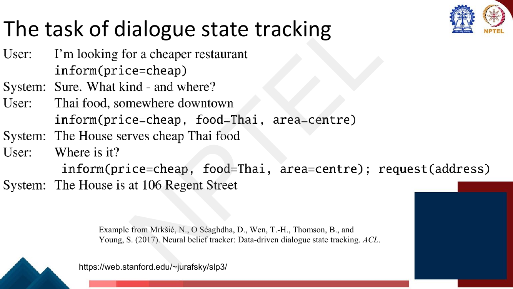
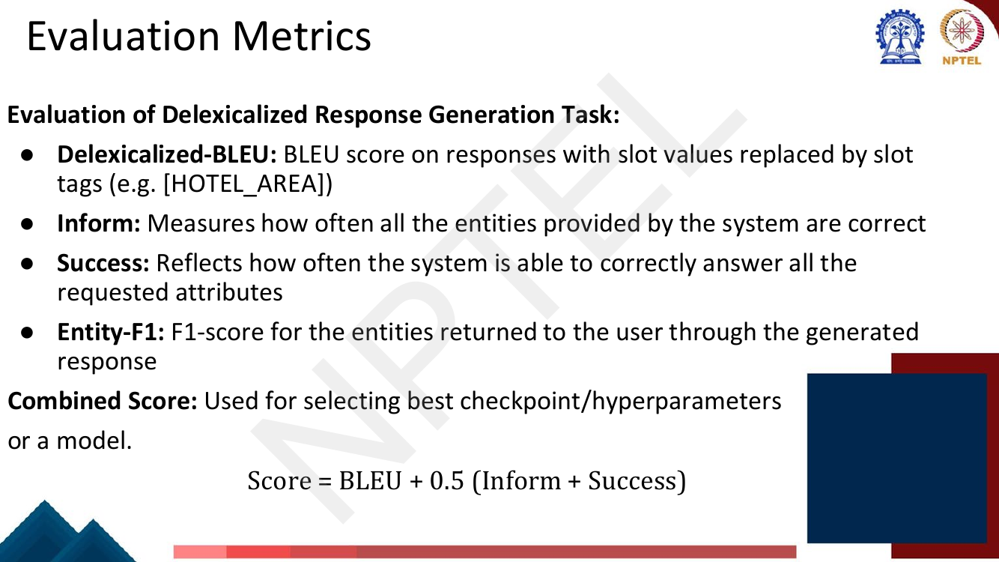

# Lec 34 — Dialogue Systems II: Task-Oriented Dialogue

> **Source:** `Week7.pdf` pp. 83–112 · **Week 7** · **Playlist:** Lec 34
> **Prereqs:** [Lec 33 — Dialogue Systems I](33-dialogue-systems-1.md), [Lec 17 — RNN Applications](../week-04/17-rnn-applications.md)
> **Feeds into:** [Lec 44 — Tool-Aided Language Models](../week-09/44-tool-aided-lms.md)

## Why this lecture exists

[Lec 33](33-dialogue-systems-1.md) built chatbots that converse. A chatbot that produces a fluent,
engaging, entirely plausible reply has succeeded. A system that is supposed to book your flight and
produces a fluent, engaging reply while booking the wrong city has failed completely, and the failure
costs money.

That difference in what counts as success forces a different architecture. A task-oriented agent has
to end up with a *structured* object — a destination, a date, an airline — that it can hand to a
database or an API. Fluent text is not an object. So this lecture builds the machinery that turns
utterances into filled-in structures: the frame, the slot, the tagger that finds slot values in
running text, and the tracker that keeps the structure consistent while the user changes their mind.
The design dates from 1977 and is still what ships, because when real money is involved,
reliability beats fluency.

## The ideas

### Task-oriented dialogue and the frame

A **task-oriented** (or **task-based**) dialogue agent helps a user accomplish a goal in a domain:
make a travel reservation, buy a product, set an alarm. The goal is external to the conversation, and
the conversation exists only to collect enough information to achieve it.

The knowledge structure that represents what the system has learned about the user's intentions is a
**frame**. A frame is **a set of slots, each to be filled with information of a given type, and each
associated with a question to put to the user**. The collection of frames and their slots for a
domain is sometimes called the **domain ontology**.


*Fig. — The deck's flight-booking frame. Memorise the three columns: **slot, type, question**. The type is what constrains the value (ORIGIN must be a city, not a date); the question is what the system says when that slot is still empty. Page 87 of `Week7.pdf`.*

Written out, the deck's frame is:

| Slot | Type | Question |
|---|---|---|
| `ORIGIN` | city | "What city are you leaving from?" |
| `DEST` | city | "Where are you going?" |
| `DEP DATE` | date | "What day would you like to leave?" |
| `DEP TIME` | time | "What time would you like to leave?" |
| `AIRLINE` | line | "What is your preferred airline?" |

Three things follow immediately from this picture. The system always knows *what it still needs* (the
empty slots). It always knows *what to say* (the question attached to the first empty slot). And it
always knows *when it is done* (no empty slots → issue the database query). That is almost the entire
dialogue policy, for free, from the data structure.

### The GUS architecture

The deck names **two basic architectures**:

| | **GUS / frame-based** | **Dialogue-state (belief-state)** |
|---|---|---|
| Origin | Bobrow et al. 1977 | extension of GUS |
| Age | over 45 years old | modern |
| Where used | **most industrial task-based agents** | more common in **research** systems |
| Machine learning | little — hand-built rules | much more; dialogue acts, learned policy, learned NLG |

**GUS** is the **Genial Understander System**, from Bobrow, Kaplan, Kay, Norman, Thompson and
Winograd, *"GUS, a frame-driven dialog system"*, **Artificial Intelligence 8(2):155–173, 1977**. The
detail the lecturer stresses is the one worth carrying into the exam: a design from 1977 is still what
most deployed task-oriented systems run, and aspects of the newer dialogue-state architecture are only
*slowly* making their way into industry.

**The control structure for GUS** is three rules:

1. The system asks questions of the user, filling any slots the user specifies.
2. The user may fill **many slots at a time** — the system must not assume one answer per question.
3. When the frame is filled, do the database query.


*Fig. — Notice how many slots one sentence fills: ORIGIN, DEST, trip-type, DEP TIME and DEP DATE all arrive at once. This is why a GUS system cannot be a simple question-answer loop — after every user turn it must re-scan for **all** slots, not just the one it asked about. Page 89.*

**Condition-action rules attached to slots.** A slot is not merely a variable; it can carry rules that
fire the moment it is filled. The deck's two examples, both attached to `DESTINATION` in the
plane-booking frame:

1. Once the user has specified the destination → enter that city as the default *StayLocation* for the
   **hotel booking frame**.
2. Once the user has specified `DESTINATION DAY` for a short trip → automatically copy it as
   `ARRIVAL DAY`.

This is how GUS propagates information *between* frames without any learning at all, and it is why the
architecture survives: the rules are inspectable, debuggable and auditable, which is exactly what a
company booking real flights wants.

**Multiple frames.** A GUS system has several frames at once — car reservations, hotel reservations,
general route information ("Which airlines fly from Boston to San Francisco?"). This creates the
**frame detection** problem: the system must detect *which slot of which frame* the user is filling,
and switch dialogue control to that frame.

### GUS natural language understanding: filling the slots

The deck decomposes NLU into three jobs, in order:

1. **Domain classification** — weather? flight? alarm clock? …
2. **Intent determination** — Find a Movie, Show Flight, Remove Calendar Appt.
3. **Slot filling** — extract the actual slots and fillers.


*Fig. — The complete NLU output for one utterance. Note the normalisation already happening: the surface string "SF" has become the value `San Francisco`. The deck's second example, "Wake me tomorrow at six", maps to DOMAIN `ALARM-CLOCK`, INTENT `SET-ALARM`, TIME `2017-07-01 0600-0800` — a vague surface time resolved into an absolute timestamp and an interval. Page 93.*

The alarm example is the more instructive of the two: "tomorrow at six" carries no date and no AM/PM,
and the NLU has to resolve both from context. Slot filling is not just span extraction; it is span
extraction **plus normalisation**.

### The dialogue-state (belief-state) architecture

The dialogue-state architecture is a more sophisticated version of the frame-based one. It has
**dialogue acts**, much more machine learning, and better generation. It is the basis for modern
research systems, and ML for slot-understanding — the one piece of it — is already widely used
industrially.


*Fig. — The four components. The line worth underlining is the one about policy: "**GUS policy: ask questions until the frame was full then report back**" — GUS is the degenerate case of this architecture with a trivial policy. Page 96.*

```
  user utterance
        │
        ▼
 ┌─────────────┐   slot fillers,     ┌──────────────────────┐
 │     NLU     │──  dialogue act ───▶│ dialogue state       │
 │ (ML slot    │                     │ tracker              │
 │  filling)   │                     │ (accumulated belief) │
 └─────────────┘                     └──────────┬───────────┘
        ▲                                       │ full state
        │                                       ▼
        │                            ┌──────────────────────┐
        │                            │   dialogue policy    │──▶ database / API
  system utterance ◀──┌─────┐◀───────│ (what to do or say)  │◀──   query
                      │ NLG │  act + └──────────────────────┘
                      └─────┘  slots
```

| Component | Input | Output | What it does |
|---|---|---|---|
| **NLU** | user utterance | slot fillers (+ domain, intent) | extracts slot fillers using machine learning |
| **Dialogue state tracker** | NLU output + history | the current dialogue state | maintains the user's most recent dialogue act and the **accumulated set of slot-filler constraints** |
| **Dialogue policy** | dialogue state | the next system dialogue act | decides what to do or say next — answer, ask, clarify, or query the database |
| **NLG** | dialogue act + slot values | system utterance | produces natural, less templated text |

The division of labour matters for the exam. NLU looks at **one utterance**; the tracker accumulates
across **all** turns; the policy makes the decision; NLG only renders. Confusing the NLU with the
tracker is the standard error — the NLU has no memory.

### Slot filling as machine learning

The deck's framing: build machine learning classifiers that **map words to semantic frame-fillers**.
Given labelled sentences,

- Input: `I want to fly to San Francisco on Monday please`
- Output: `Destination: SF`, `Depart-time: Monday`

and the stated requirement is **lots of labelled data**. But "classify the sentence into a
(slot, value) pair" is the wrong shape, because the number of possible values is unbounded and the
values are *spans of the input*. The right shape is sequence labelling.

### Slot filling as sequence labeling: BIO tagging

**BIO tagging** labels every token with `B-TYPE` (begins a span of that type), `I-TYPE` (inside one)
or `O` (outside any span); for $n$ slot types that is $2n+1$ tags. It is owned and derived in
[Lec 17](../week-04/17-rnn-applications.md) — go there for the scheme's variants and its parameter
arithmetic. Here, the only new idea is **what the span types are**: not person/location/organisation,
but the slots of your frame.


*Fig. — The deck's tagged utterance. Read the tag row, not the word row: `B-DES I-DES` marks the two-token span "San Francisco", and `B-DEPTIME I-DEPTIME` marks "Monday afternoon". Every other token is `O`. "We create a B and I tag for each slot-type, and convert the training data to this format." Page 98.*

So the classifier's job is reduced to a per-token decision over $2n+1$ labels, which is a standard
sequence-labelling problem with standard models and standard losses. That reduction is the whole
trick.

### Slot filling using contextual embeddings

The BERT-era version: run the utterance through a pretrained encoder, then put a small
classifier + softmax on **each token's** contextual encoding to predict its BIO tag.


*Fig. — The architecture for joint slot filling and intent/domain classification. Notice **where the domain+intent label comes out: over the `<EOS>` token**, labelled `d+i`, generating a single joined label like `"AIRLINE_TRAVEL + SEARCH_FLIGHT"`. One encoder, two heads, one loss — multi-task learning, and it helps, because knowing the intent is `SHOW-FLIGHTS` makes `B-DES` far more likely. Page 99.*

Two notes. First, the deck puts the sentence-level label on `<EOS>`; the equivalent and more common
modern choice is the `[CLS]` position of [Lec 27](../week-06/27-bert-masked-lm.md) — the mechanism
(one designated position whose encoding summarises the sentence) is identical, so either is acceptable
unless the question quotes the slide. Second, the diagram abbreviates the depart-time slot as
`B-DTIME` where page 98 wrote `B-DEPTIME`; they are the same slot, inconsistently named across two
consecutive slides.

### Extracting the filler string

Once you have the BIO tag row, you recover values in two steps:

1. **Extract the filler string for each slot** — walk the tag row, open a span at each `B-`, extend it
   through matching `I-`s, close it at anything else.
2. **Normalise it to the correct form in the ontology** — map the surface string to the canonical
   value the database actually uses, "SFO" for San Francisco, via **homonym dictionaries**
   (`SF = SFO = San Francisco`).

Step 2 is not optional. The database has one key per airport; the user has a dozen ways of saying it.
Skip the normaliser and the query returns nothing.

### Dialogue state tracking

The **dialogue state** is the accumulated set of constraints the user has expressed *so far*, not just
the ones in the latest sentence. Tracking it is the component that makes multi-turn dialogue work.


*Fig. — Watch the state **accumulate**. Turn 1 contributes only `price=cheap`; turn 2's utterance "Thai food, somewhere downtown" mentions neither price nor the word "centre", yet the state after it is `inform(price=cheap, food=Thai, area=centre)` — price was carried over, and "downtown" was normalised to `centre`. The final turn adds a `request(address)` act on top of the unchanged informs. From Mrkšić et al. (2017), *Neural Belief Tracker*, ACL. Page 101.*

The deck gives the **dialogue act interpretation algorithm** and the **simple tracker** separately:

- *Dialogue act interpretation* — **1-of-N supervised classification** to choose the act (here
  `inform`), based on encodings of the current sentence **plus prior dialogue acts**.
- *Simple dialogue state tracker* — **run a slot-filler after each sentence**, and merge its output
  into the running state.

"Merge" is where the difficulty hides, and where corrections live. If the user says "actually, make it
Tuesday", the tracker must **overwrite** `DEP-DATE`, not add a second value. A tracker that only ever
adds is correct on every turn until the first correction and then wrong for the rest of the dialogue —
a failure mode worked numerically in N4.

### Dialogue state tracking with generative models

The classification framing has a hard ceiling: it needs a fixed, enumerated ontology, and the number
of joint states is the product of the slot cardinalities (N5 computes ~$2.3 \times 10^8$ for a
five-slot flight frame). A value not in the ontology cannot be predicted at all.

The generative framing sidesteps this: **feed the dialogue history to a sequence-to-sequence model and
let it generate the state as text**.


*Fig. — Three generative designs, from *Dialogue State Tracking with a Language Model using Schema-Driven Prompting*, EMNLP 2021. **(a) sequential decoding** emits the whole state in one pass — fast, but errors compound along the sequence. **(b) and (c) independent decoding** query one slot per forward pass, so slots cannot corrupt each other, at the cost of one decode per slot. **(c)** adds a natural-language *description* of the slot to the prompt, which is what lets the model handle a slot it never saw in training. Note the output `none` for an unfilled slot — unfilled is a generated string, not a special case. Page 103.*

This is why generative DST scales: the output space is shared across all slots and all values, the
model generalises to unseen values by copying them out of the history, and a new slot costs a new
prompt rather than a new classifier.

### Natural language generation and sentence realization

NLG in the information-state architecture is modelled in **two stages**:

| Stage | Question it answers | Who does it here |
|---|---|---|
| **Content planning** | *what to say* | assumed already done by the dialogue policy |
| **Sentence realization** | *how to say it* | the focus of this lecture |

Content planning has chosen the dialogue act to generate and the attributes (slots and values) to
convey, either to give the user an answer or as part of a confirmation strategy. Realization turns
that into a sentence.


*Fig. — Input is a **dialogue act with slot-value arguments**; output is a sentence. Two outputs per input shows that realization is one-to-many, which is exactly why a single-reference BLEU score under-rewards it. Page 106.*

**Delexicalization.** Training data is hard to come by — you will never see each restaurant in each
situation. The common fix is to **replace the words in the training set that represent slot values
with a generic placeholder token**.


*Fig. — The same two sentences after delexicalization. "Au Midi" → `restaurant_name`, "Midtown" → `neighborhood`, "French" → `cuisine`. Every restaurant in the corpus now contributes to the same two templates, so the data requirement collapses from (number of restaurants × number of situations) to (number of situations). Page 108.*

The full pipeline is then: encoder-decoder maps the frame to a **delexicalized** sentence, and a final
**relexicalization** step substitutes the real values back in.

![Diagram: an encoder takes RECOMMEND, service: decent, cuisine: null; a decoder emits [name] has decent service; below, Output: "restaurant_name has decent service", Relexicalize to: "Au Midi has decent service"](../../assets/pages/lec34/p-109.png)
*Fig. — Note the encoder input includes `cuisine: null` — slots with no value are passed in explicitly so the model learns not to mention them. And note that relexicalization is a deterministic string substitution, **not** something the model does: the model never sees "Au Midi" at all, which is precisely why it generalises to a restaurant it has never heard of. Page 109.*

### Evaluation metrics for task-oriented dialogue

[Lec 33](33-dialogue-systems-1.md) owns open-domain evaluation (content-overlap and model-based
metrics) — and those metrics are the wrong tool here, because a task-oriented system is judged on
whether the task got done, not on whether the words resembled a reference. The deck's closing page
gives four metrics for the **delexicalized response generation task** plus a combined score.


*Fig. — Memorise the formula exactly: **Score = BLEU + 0.5 (Inform + Success)**, used for selecting the best checkpoint, hyperparameters or model. The 0.5 weights are what make the two task metrics count once between them against BLEU's once. Page 110.*

| Metric | What it measures | Granularity |
|---|---|---|
| **Delexicalized-BLEU** | BLEU on responses with slot values replaced by slot tags, e.g. `[HOTEL_AREA]` | per response |
| **Inform** | how often **all** the entities provided by the system are correct | per dialogue |
| **Success** | how often the system **correctly answers all the requested attributes** | per dialogue |
| **Entity-F1** | F1 for the entities returned to the user through the generated response | per response |
| **Combined Score** | $\text{BLEU} + 0.5(\text{Inform} + \text{Success})$ | model selection |

Why delexicalize *before* computing BLEU: an otherwise perfect response that names the wrong
restaurant would lose only one n-gram of credit on raw BLEU. Delexicalizing removes the slot values
from the BLEU computation entirely, so BLEU scores *phrasing* and Inform/Success/Entity-F1 score
*content*. The two are measured separately on purpose.

**Inform and Success are both all-or-nothing per dialogue** — "all the entities", "all the requested
attributes". That strictness is the family trait of task-oriented metrics, and the same trait drives
the two closely related metrics the deck does not name but that the literature always reports:

- **Slot F1** — precision/recall/F1 over (slot, value) pairs, exact match ([Lec 5](../week-01/05-nlp-tasks-and-paradigms.md) owns P/R/F1). A partially-correct value scores zero: it is a false positive *and* a false negative.
- **Joint goal accuracy (JGA)** — the fraction of **turns** in which **every** slot in the state is
  correct. The standard DST metric, and brutally strict.
- **Task success rate** — the fraction of dialogues in which the user's goal was actually achieved.
  Inform and Success are the deck's two decompositions of exactly this idea.

| Dialogue type | Metrics | Why |
|---|---|---|
| **Open-domain** ([Lec 33](33-dialogue-systems-1.md)) | content-overlap, model-based, human ratings | no goal exists to check against |
| **Task-oriented** (here) | slot F1, joint goal accuracy, Inform, Success, Entity-F1, delex-BLEU | there is a ground-truth outcome, so measure it |

> **Forward pointer.** When an LLM in [Lec 44](../week-09/44-tool-aided-lms.md) decides to call a
> weather API, parses "in Delhi tomorrow" into `{"city": "Delhi", "date": "2026-10-05"}` and issues
> the call, it is doing GUS's job: fill the slots, then query. The frame has become a JSON schema and
> the hand-written rules have become a prompt, but the control structure is Bobrow et al. 1977.

## Worked numericals

**No "Try this problem" page appears anywhere in `Week7.pdf` pp. 83–112.** The deck for this lecture
carries no in-slide exercise and no solution page; every numerical below is constructed to the shape
the exam uses.

### N1. BIO-tag an utterance and extract the filler strings
**Given:** the utterance `book a flight from Delhi to Mumbai on Tuesday`, and a flight frame with
slots `ORIGIN` (city), `DEST` (city), `DEP-DATE` (date).
**Find:** the BIO tag sequence, the tagset size, and the extracted (slot, filler) pairs.

1. Tagset size: $n = 3$ slot types, so $2n + 1 = 2(3) + 1 = \mathbf{7}$ tags — `B-ORIGIN`, `I-ORIGIN`,
   `B-DEST`, `I-DEST`, `B-DEP-DATE`, `I-DEP-DATE`, `O`.
2. Align tags to tokens. A city name after "from" opens `ORIGIN`; after "to" opens `DEST`; a weekday
   after "on" opens `DEP-DATE`. Function words are `O`.

| | book | a | flight | from | Delhi | to | Mumbai | on | Tuesday |
|---|---|---|---|---|---|---|---|---|---|
| tag | O | O | O | O | B-ORIGIN | O | B-DEST | O | B-DEP-DATE |

3. Note "from" and "to" are tagged `O`. They are the *cues* that tell the tagger which slot follows;
   they are not part of the filler.
4. Extract: walk the tag row. Each `B-` opens a span; no `I-` follows any of them, so each span is one
   token long.
5. Fillers: `ORIGIN = "Delhi"`, `DEST = "Mumbai"`, `DEP-DATE = "Tuesday"`.
6. Normalise against the ontology: `Delhi → DEL`, `Mumbai → BOM`, `Tuesday → 2026-10-06`.

**Answer:** 7 tags; `O O O O B-ORIGIN O B-DEST O B-DEP-DATE`; fillers
**ORIGIN = Delhi, DEST = Mumbai, DEP-DATE = Tuesday**. (Contrast with the deck's page-98 sentence,
where "San Francisco" and "Monday afternoon" are two-token spans and do need `I-` tags.)

### N2. Slot F1 with a partially-correct slot
**Given:** for one turn,
gold $=\{$`food=cantonese`, `area=mission`, `price=cheap`, `name=The House`$\}$ and
predicted $=\{$`food=cantonese`, `area=mission district`, `price=cheap`$\}$. Scoring is **exact match
on the (slot, value) pair**.
**Find:** TP, FP, FN, precision, recall and slot F1.

1. `food=cantonese` — in both → **TP**.
2. `price=cheap` — in both → **TP**.
3. `area=mission district` — predicted, not in gold → **FP**. The gold `area=mission` was not
   predicted → **FN**. *One partially-correct slot costs you twice.*
4. `name=The House` — in gold, not predicted → **FN**.
5. Totals: $TP = 2$, $FP = 1$, $FN = 2$.
6. $P = \dfrac{TP}{TP+FP} = \dfrac{2}{3} = 0.6667$.
7. $R = \dfrac{TP}{TP+FN} = \dfrac{2}{4} = 0.5000$.
8. $F_1 = \dfrac{2PR}{P+R} = \dfrac{2(0.6667)(0.5)}{0.6667+0.5} = \dfrac{0.6667}{1.1667} = 0.5714$.

**Answer:** $P = 0.667$, $R = 0.500$, $F_1 = \mathbf{0.571}$ (exactly $4/7$). Three of four slots were
"basically right" and the F1 is barely over a half — because the double-counting of a near miss is
the point of exact-match scoring.

### N3. Joint goal accuracy vs slot accuracy on the same data
**Given:** 5 turns, 4 slots per turn (`price`, `food`, `area`, `name`). Correct slots per turn:

| Turn | price | food | area | name | correct |
|---|---|---|---|---|---|
| 1 | ✓ | ✓ | ✓ | ✓ | 4 |
| 2 | ✓ | ✓ | ✗ | ✓ | 3 |
| 3 | ✓ | ✓ | ✓ | ✓ | 4 |
| 4 | ✗ | ✓ | ✓ | ✓ | 3 |
| 5 | ✓ | ✗ | ✓ | ✗ | 2 |

**Find:** slot accuracy and joint goal accuracy.

1. Total slot decisions $= 5 \times 4 = 20$.
2. Correct slot decisions $= 4+3+4+3+2 = 16$.
3. **Slot accuracy** $= 16/20 = \mathbf{0.80}$.
4. Turns with **all four** slots correct: turns 1 and 3 only. Turns 2, 4, 5 each have at least one
   error and therefore score **zero** on JGA regardless of how many slots they got right.
5. **Joint goal accuracy** $= 2/5 = \mathbf{0.40}$.
6. Sanity check on the gap: if slots failed independently with per-slot accuracy $0.8$, expected
   JGA $= 0.8^4 = 0.4096$ — almost exactly the observed 0.40.

**Answer:** slot accuracy $= 0.80$, JGA $= 0.40$. **Halving.** In general
$\text{JGA} \approx a^{k}$ for $k$ slots at per-slot accuracy $a$, so JGA collapses exponentially in
the number of slots: at $a = 0.95$ and $k = 10$, JGA $= 0.95^{10} = 0.60$. This is why published JGA
numbers on MultiWOZ look low next to slot accuracies, and it is the examinable point.

### N4. Dialogue state tracked across three turns, including a correction
**Given:** ontology slots `price`, `food`, `area`, all initially `none`. Turns:

- T1 — "I'd like a cheap restaurant" → `inform(price=cheap)`
- T2 — "Thai food, somewhere downtown" → `inform(food=thai, area=centre)`
- T3 — "Actually, make it Chinese" → `inform(food=chinese)`

**Find:** the state after each turn, and the scores of a broken tracker that only ever *adds* values.

1. After T1: $\{$`price:cheap`, `food:none`, `area:none`$\}$. Only one slot was mentioned; the others
   stay empty.
2. After T2: $\{$`price:cheap`, `food:thai`, `area:centre`$\}$. `price` is **carried over** — the
   utterance never mentions price, but state is cumulative. "downtown" normalised to `centre`.
3. After T3: $\{$`price:cheap`, `food:chinese`, `area:centre`$\}$. `food` is **overwritten**, not
   appended; `price` and `area` are untouched.
4. The broken append-only tracker: identical at T1 and T2, but at T3 it keeps `food:thai` because the
   slot is already non-empty. Its T3 state is $\{$`cheap`, `thai`, `centre`$\}$ — 2 of 3 slots right.
5. Slot accuracy of the broken tracker $= (3+3+2)/(3\times3) = 8/9 = \mathbf{0.889}$.
6. JGA of the broken tracker $= 2/3 = \mathbf{0.667}$.

**Answer:** final state $\{$`price:cheap`, `food:chinese`, `area:centre`$\}$; the append-only bug
costs 11 points of slot accuracy but 33 points of JGA. **JGA is the metric that exposes correction
handling**, which is why DST papers report it.

### N5. Counting the states of a frame, and why generative tracking scales
**Given:** the deck's flight frame with cardinalities `ORIGIN` 150 cities, `DEST` 150 cities,
`DEP-DATE` 30 days, `DEP-TIME` 24 hours, `AIRLINE` 12 airlines. Every slot may also be **unfilled**.
**Find:** the number of distinct joint dialogue states, and compare three tracker designs.

1. Each slot has (cardinality $+\,1$) possible values, the $+1$ being "not yet filled":
   $151, 151, 31, 25, 13$.
2. The state is one choice per slot, independently, so the count is the product:
   $151 \times 151 = 22{,}801$.
3. $22{,}801 \times 31 = 706{,}831$.
4. $706{,}831 \times 25 = 17{,}670{,}775$.
5. $17{,}670{,}775 \times 13 = \mathbf{229{,}720{,}075}$.
6. **Joint classifier** over whole states: $2.3 \times 10^8$ output classes. Impossible — you would
   need training examples per class.
7. **Per-slot classifiers**: $151 + 151 + 31 + 25 + 13 = \mathbf{371}$ output units in total.
   Tractable, but it hard-codes the ontology — a city not in the 150 can never be predicted, and
   adding a slot means a new classifier and new labelled data.
8. **Generative**: the decoder emits the value as a token string. Output space is shared across every
   slot and every value, unseen values are copied from the dialogue history, and a new slot costs a
   new prompt, not a new head.

**Answer:** $\mathbf{229{,}720{,}075}$ joint states vs **371** per-slot outputs vs **one** shared
decoder. The $10^8$-to-$10^2$ collapse is why nobody classifies joint states, and the open output
vocabulary is why generative DST beats per-slot classification on unseen values.

### N6. The deck's Combined Score, and why it can invert BLEU's ranking
**Given:** page 110's $\text{Score} = \text{BLEU} + 0.5(\text{Inform} + \text{Success})$. Model A
scores BLEU $18.2$, Inform $85.0$, Success $74.5$. Model B scores BLEU $20.1$, Inform $80.0$,
Success $70.0$.
**Find:** both combined scores and the chosen model.

1. Model A: $0.5(85.0 + 74.5) = 0.5(159.5) = 79.75$.
2. $\text{Score}_A = 18.2 + 79.75 = \mathbf{97.95}$.
3. Model B: $0.5(80.0 + 70.0) = 0.5(150.0) = 75.00$.
4. $\text{Score}_B = 20.1 + 75.00 = \mathbf{95.10}$.
5. B wins on BLEU by $1.9$ but loses the combined score by $2.85$, because it gives up $5.0$ Inform
   and $4.5$ Success, worth $0.5 \times 9.5 = 4.75$.

**Answer:** $\text{Score}_A = 97.95 > \text{Score}_B = 95.10$ → **select model A**. A task-oriented
system that phrases things more prettily while getting the facts wrong is the worse system, and the
$0.5$ weighting is what encodes that judgement.

## Code

Pure Python — no dependencies. Extracts slot fillers from BIO tags, then scores slot F1 and joint goal
accuracy on the exact data of N1–N6.

```python
# --- 1. BIO -> slot fillers -------------------------------------------------
def extract_slots(tokens, tags):
    """Walk the BIO tag row once; a B- opens a span, I- of the same type
    extends it, anything else closes it. Returns [(slot, filler), ...]."""
    out, slot, buf = [], None, []
    for tok, tag in zip(tokens, tags):
        if tag.startswith("B-"):
            if slot: out.append((slot, " ".join(buf)))
            slot, buf = tag[2:], [tok]
        elif tag.startswith("I-") and slot == tag[2:]:
            buf.append(tok)
        else:                       # "O", or an I- that does not match
            if slot: out.append((slot, " ".join(buf)))
            slot, buf = None, []
    if slot: out.append((slot, " ".join(buf)))
    return out

toks = "book a flight from Delhi to Mumbai on Tuesday".split()
tags = ["O","O","O","O","B-ORIGIN","O","B-DEST","O","B-DEP-DATE"]
print("N1 fillers:", extract_slots(toks, tags))

deck_toks = "I want to fly to San Francisco on Monday afternoon please".split()
deck_tags = ["O","O","O","O","O","B-DES","I-DES","O","B-DEPTIME","I-DEPTIME","O"]
print("deck p.98 :", extract_slots(deck_toks, deck_tags))

# --- 2. slot F1 (exact slot-value match) ------------------------------------
def slot_f1(pred, gold):
    pred, gold = set(pred), set(gold)
    tp = len(pred & gold); fp = len(pred - gold); fn = len(gold - pred)
    p = tp / (tp + fp) if tp + fp else 0.0
    r = tp / (tp + fn) if tp + fn else 0.0
    f = 2 * p * r / (p + r) if p + r else 0.0
    return tp, fp, fn, p, r, f

gold2 = [("food","cantonese"), ("area","mission"),
         ("price","cheap"),    ("name","The House")]
pred2 = [("food","cantonese"), ("area","mission district"),
         ("price","cheap")]
tp, fp, fn, p, r, f = slot_f1(pred2, gold2)
print(f"\nN2  TP={tp} FP={fp} FN={fn}  P={p:.4f} R={r:.4f} F1={f:.4f}")

# --- 3. joint goal accuracy vs slot accuracy --------------------------------
SLOTS = ["price", "food", "area", "name"]

def accuracies(preds, golds):
    correct = sum(pr[s] == gd[s] for pr, gd in zip(preds, golds) for s in SLOTS)
    joint   = sum(all(pr[s] == gd[s] for s in SLOTS) for pr, gd in zip(preds, golds))
    return correct / (len(golds) * len(SLOTS)), joint / len(golds)

golds = [dict(price="cheap", food="thai",      area="centre", name="The House"),
         dict(price="cheap", food="thai",      area="centre", name="The House"),
         dict(price="cheap", food="chinese",   area="north",  name="Golden Wok"),
         dict(price="moderate", food="indian", area="south",  name="Taj"),
         dict(price="expensive", food="french",area="centre", name="Au Midi")]
preds = [dict(price="cheap", food="thai",      area="centre", name="The House"),
         dict(price="cheap", food="thai",      area="north",  name="The House"),
         dict(price="cheap", food="chinese",   area="north",  name="Golden Wok"),
         dict(price="cheap", food="indian",    area="south",  name="Taj"),
         dict(price="expensive", food="thai",  area="centre", name="The House")]
sa, jga = accuracies(preds, golds)
print(f"N3  slot accuracy = {sa:.4f}   joint goal accuracy = {jga:.4f}"
      f"   (0.8^4 = {0.8**4:.4f})")

# --- 4. state tracking across three turns, with a correction ----------------
ONTO = ["price", "food", "area"]
def track(acts, overwrite=True):
    state, hist = {s: "none" for s in ONTO}, []
    for act in acts:
        for s, v in act.items():
            if overwrite or state[s] == "none":
                state[s] = v
        hist.append(dict(state))
    return hist

acts = [{"price": "cheap"},
        {"food": "thai", "area": "centre"},
        {"food": "chinese"}]
good, bad = track(acts, True), track(acts, False)
print("\nN4 correct tracker (overwrite):")
for i, s in enumerate(good, 1): print("   turn", i, s)
print("N4 broken tracker (append-only):")
for i, s in enumerate(bad, 1):  print("   turn", i, s)
ok  = sum(b[s] == g[s] for b, g in zip(bad, good) for s in ONTO)
jok = sum(b == g for b, g in zip(bad, good))
print(f"   broken tracker: slot acc = {ok}/9 = {ok/9:.4f}, "
      f"JGA = {jok}/3 = {jok/3:.4f}")

# --- 5. size of the state space --------------------------------------------
card = {"ORIGIN": 150, "DEST": 150, "DEP-DATE": 30, "DEP-TIME": 24, "AIRLINE": 12}
total = 1
for v in card.values(): total *= (v + 1)      # +1 for "not yet filled"
print(f"\nN5 joint states = {' x '.join(str(v+1) for v in card.values())}"
      f" = {total:,}")
print(f"   per-slot classifier outputs = {sum(v + 1 for v in card.values())}")

# --- 6. the deck's combined score (page 110) --------------------------------
def combined(bleu, inform, success): return bleu + 0.5 * (inform + success)
print(f"\nN6 model A = {combined(18.2, 85.0, 74.5):.2f}"
      f"   model B = {combined(20.1, 80.0, 70.0):.2f}")
```

Printed output:

```
N1 fillers: [('ORIGIN', 'Delhi'), ('DEST', 'Mumbai'), ('DEP-DATE', 'Tuesday')]
deck p.98 : [('DES', 'San Francisco'), ('DEPTIME', 'Monday afternoon')]

N2  TP=2 FP=1 FN=2  P=0.6667 R=0.5000 F1=0.5714
N3  slot accuracy = 0.8000   joint goal accuracy = 0.4000   (0.8^4 = 0.4096)

N4 correct tracker (overwrite):
   turn 1 {'price': 'cheap', 'food': 'none', 'area': 'none'}
   turn 2 {'price': 'cheap', 'food': 'thai', 'area': 'centre'}
   turn 3 {'price': 'cheap', 'food': 'chinese', 'area': 'centre'}
N4 broken tracker (append-only):
   turn 1 {'price': 'cheap', 'food': 'none', 'area': 'none'}
   turn 2 {'price': 'cheap', 'food': 'thai', 'area': 'centre'}
   turn 3 {'price': 'cheap', 'food': 'thai', 'area': 'centre'}
   broken tracker: slot acc = 8/9 = 0.8889, JGA = 2/3 = 0.6667

N5 joint states = 151 x 151 x 31 x 25 x 13 = 229,720,075
   per-slot classifier outputs = 371

N6 model A = 97.95   model B = 95.10
```

The `extract_slots` loop is the whole of "extracting the filler string for each slot" from page 100 —
there is no model in it, just a single left-to-right pass over the tag row. The one subtlety is the
`elif` guard `slot == tag[2:]`: an `I-DEST` arriving while an `ORIGIN` span is open is an *illegal*
tag sequence, and this implementation closes the span rather than silently merging two slots.

## Exam pack

### Must-memorise

| Item | Exactly this |
|---|---|
| Task-oriented agent | helps the user solve a task (travel reservation, buying a product) by filling a structured frame and querying a database |
| **Frame** | a set of **slots**, each to be filled with information of a given **type**, each associated with a **question** to the user |
| Domain ontology | another name for the frame/slot structure of a domain |
| **GUS** | **Genial Understander System**, Bobrow, Kaplan, Kay, Norman, Thompson & Winograd, 1977, *Artificial Intelligence* 8(2):155–173 |
| GUS control structure | ask questions → fill any slots the user specifies (possibly many at once) → when the frame is full, do the database query |
| Condition-action rules | rules attached to a slot that fire when it is filled — e.g. DESTINATION city becomes default *StayLocation* in the hotel frame; DESTINATION DAY copied to ARRIVAL DAY on short trips |
| Frame detection | deciding which slot of **which frame** the user is filling, and switching control to it |
| Two architectures | **GUS / frame-based** (1977, industrial) and **dialogue-state / belief-state** (extension of GUS, research) |
| GUS NLU, three steps | 1. domain classification 2. intent determination 3. slot filling |
| Dialogue-state components | **NLU → dialogue state tracker → dialogue policy → NLG** |
| Dialogue state tracker | maintains the user's most recent dialogue act and the **accumulated** set of slot-filler constraints |
| GUS policy | ask questions until the frame is full, then report back |
| Slot filling as sequence labeling | **BIO tagging** — one `B-` and one `I-` per slot type plus `O`; $2n+1$ tags ([Lec 17](../week-04/17-rnn-applications.md)) |
| Deck's tagged example | `O O O O O B-DES I-DES O B-DEPTIME I-DEPTIME O` over "I want to fly to San Francisco on Monday afternoon please" |
| Contextual-embedding slot filling | BERT encoder → per-token classifier+softmax → BIO tag; **domain+intent generated over `<EOS>`** as a joint label like `AIRLINE_TRAVEL + SEARCH_FLIGHT` |
| After tagging | extract filler string, then **normalise to the ontology** via homonym dictionaries (SF = SFO = San Francisco) |
| Dialogue act interpretation | **1-of-N supervised classification**, from encodings of the current sentence **+ prior dialogue acts** |
| Simple state tracker | run a slot-filler after each sentence and merge into the running state |
| Generative DST | generate the state as text with a seq2seq LM; schema-driven prompting (EMNLP 2021, T5) |
| NLG two stages | **content planning** (what to say) → **sentence realization** (how to say it) |
| **Delexicalization** | replace slot values in the training set with a generic placeholder token, to improve generalisation when training data is scarce |
| Relexicalization | substitute the real values back into the generated delexicalized sentence |
| **Combined Score** | $\text{Score} = \text{BLEU} + 0.5(\text{Inform} + \text{Success})$ |
| Inform | how often **all** entities provided by the system are correct |
| Success | how often the system **correctly answers all requested attributes** |
| Entity-F1 | F1 for the entities returned to the user in the generated response |
| Joint goal accuracy | fraction of turns in which **every** slot of the state is correct |

### Numbers worth knowing

| Quantity | Value |
|---|---|
| GUS publication year | **1977** |
| GUS venue | *Artificial Intelligence* **8(2):155–173** |
| GUS age per the slide | "over **45 years** old, but still used in most industrial task-based dialogue agents" |
| Slots in the deck's flight frame | **5** (ORIGIN, DEST, DEP DATE, DEP TIME, AIRLINE) |
| BIO tagset size for $n$ slots | $2n+1$ |
| Combined-score weight on Inform and Success | **0.5** each |
| Generative-DST paper | *Dialogue State Tracking with a Language Model using Schema-Driven Prompting*, **EMNLP 2021**, uses **T5** |
| Belief-tracking example source | Mrkšić et al., *Neural Belief Tracker*, **ACL 2017** |
| Deck's alarm-clock normalisation | "tomorrow at six" → `2017-07-01 0600-0800` |
| Textbook source | Jurafsky & Martin, *SLP3* 3rd ed., **Chapter 15**, Aug 20 2024 release |
| N3's gap | slot accuracy 0.80 vs JGA 0.40; $0.8^4 = 0.41$ |
| N5's state count | $151\times151\times31\times25\times13 = 229{,}720{,}075$ |

### Likely MCQ traps

- **"GUS is obsolete / superseded by the dialogue-state architecture."** The slide says the opposite:
  over 45 years old and **still used in most industrial** task-based agents. The dialogue-state
  architecture is more common in *research*.
- **"The dialogue-state architecture replaces frames."** It is an **extension** of GUS, not a
  replacement — it still has slots and frames, plus dialogue acts, learned policy and learned NLG.
- **Confusing NLU with the dialogue state tracker.** NLU reads **one utterance** and has no memory;
  the tracker **accumulates** constraints across turns. A question about carrying `price=cheap`
  forward is about the tracker.
- **Confusing the dialogue policy with NLG.** The policy decides *what* act to perform (content
  planning); NLG decides *how* to word it (sentence realization).
- **"Delexicalization is done at inference to hide user data."** No — it is a **training-data**
  transformation to improve generalisation when you cannot see every entity in every situation.
  Relexicalization puts the values back at generation time.
- **"Joint goal accuracy is the average per-slot accuracy."** No. JGA is all-or-nothing per turn: one
  wrong slot scores the whole turn zero. It is always ≤ slot accuracy, usually far below (N3).
- **"A slot with a nearly-correct value is a half-credit."** Under exact match it is a **false
  positive and a false negative simultaneously** — it hurts precision and recall at once (N2).
- **Using open-domain metrics on a task-oriented system.** BLEU-style content overlap and
  model-based metrics belong to [Lec 33](33-dialogue-systems-1.md); here you want Inform, Success,
  Entity-F1 and delexicalized-BLEU. A fluent reply that books the wrong flight scores well on the
  former and zero on the latter.
- **Mis-weighting the Combined Score.** It is $\text{BLEU} + 0.5(\text{Inform} + \text{Success})$ —
  **not** $0.5\,\text{BLEU}$, and Entity-F1 is **not** in it.
- **"Delexicalized-BLEU is BLEU with values removed from the *reference* only."** Slot values are
  replaced by slot tags in **both** the response and the reference, so BLEU measures phrasing only.
- **"Each user turn fills exactly one slot."** The deck's control-structure slide exists to deny this:
  one sentence fills five slots.
- **Tagging the cue words.** In "from Delhi to Mumbai", `from` and `to` are `O`. They signal which
  slot comes next but are not part of the filler.
- **"The intent label comes from the first token."** On the deck's diagram it comes from **`<EOS>`**
  (the modern `[CLS]` equivalent, [Lec 27](../week-06/27-bert-masked-lm.md)) — a single designated
  position, not the first word.

### Self-test

1. Define a frame in the exact three-part form the deck gives.
2. In what year was GUS published, what does the acronym stand for, and why does the lecturer stress
   its age?
3. Give the three rules of the GUS control structure.
4. State one condition-action rule from the deck and say which slot it is attached to.
5. Name the four components of the dialogue-state architecture, in pipeline order, with one phrase
   each.
6. BIO-tag `I want to fly to San Francisco on Monday afternoon please` and extract the fillers.
7. A frame has 6 slot types. How many BIO tags are there?
8. Gold $=\{a{=}1, b{=}2, c{=}3\}$; predicted $=\{a{=}1, b{=}9\}$. Give TP, FP, FN and slot F1.
9. Over 4 turns of 5 slots each, 18 slot decisions are correct and 1 turn is wholly correct. Give slot
   accuracy and JGA.
10. What is delexicalization, what problem does it solve, and what undoes it?
11. Write the deck's combined score formula, then compute it for BLEU 17.0, Inform 90.0, Success 80.0.
12. Why does generative dialogue state tracking handle an unseen slot value when a per-slot classifier
    cannot?

<details><summary>Answers</summary>

1. A set of **slots**, each to be filled with information of a given **type**, each associated with a
   **question** to the user. (Also called a domain ontology.)
2. **1977**; **Genial Understander System**; because a 1977 design is still used in **most industrial
   task-based dialogue agents** — reliability and inspectability beat fluency when the task has real
   consequences.
3. (i) The system asks questions, filling any slots the user specifies. (ii) The user may fill many
   slots at a time. (iii) When the frame is filled, do the database query.
4. Attached to `DESTINATION`: once the user specifies the destination, enter that city as the default
   *StayLocation* for the hotel booking frame. (Or: once `DESTINATION DAY` is given for a short trip,
   copy it to `ARRIVAL DAY`.)
5. **NLU** (extract slot fillers from the utterance by ML) → **dialogue state tracker** (maintain the
   accumulated dialogue act and slot-filler constraints) → **dialogue policy** (decide what to do or
   say next) → **NLG** (produce a natural, less templated utterance).
6. `O O O O O B-DES I-DES O B-DEPTIME I-DEPTIME O`; fillers `DES = San Francisco`,
   `DEPTIME = Monday afternoon`.
7. $2(6)+1 = \mathbf{13}$.
8. $TP = 1$ ($a{=}1$); $FP = 1$ ($b{=}9$); $FN = 2$ ($b{=}2$, $c{=}3$). $P = 1/2 = 0.5$,
   $R = 1/3 = 0.333$, $F_1 = 2(0.5)(0.333)/(0.833) = \mathbf{0.40}$.
9. Slot accuracy $= 18/20 = \mathbf{0.90}$; JGA $= 1/4 = \mathbf{0.25}$.
10. Replacing slot values in the training data with generic placeholder tokens (`restaurant_name`,
    `cuisine`). It solves training-data scarcity — you never see every entity in every situation, so
    delexicalizing makes every example contribute to the same template. **Relexicalization**, a
    deterministic substitution after generation, undoes it.
11. $\text{Score} = \text{BLEU} + 0.5(\text{Inform} + \text{Success}) = 17.0 + 0.5(170.0) = 17.0 + 85.0
    = \mathbf{102.0}$.
12. The classifier's output layer enumerates a fixed ontology, so a value outside it has no output
    unit and probability zero. The generative model emits the value as a token string from a shared
    vocabulary and can copy it straight out of the dialogue history, so an unseen value costs nothing
    structurally.

</details>

## Beyond the slides

**Gap:** The deck never names a task-oriented dataset or benchmark.
**Why it matters:** **MultiWOZ** (Multi-Domain Wizard-of-Oz, ~10,000 dialogues across 7 domains) is
the dataset that Inform, Success and Combined Score are defined *on* — page 110's metrics are
MultiWOZ's leaderboard metrics, which is why they look so specific. **ATIS** (Airline Travel
Information System) is the classic slot-filling corpus and is where the deck's flight examples come
from. **SGD** (Schema-Guided Dialogue) is the dataset built for the schema-prompted generative DST on
page 103 — its whole point is held-out *unseen* services, which is the evaluation that makes
generative tracking look good. Knowing these three names turns three slides into a coherent story.

**Gap:** Joint goal accuracy and slot F1 are standard in every DST paper but never appear on these
slides, which jump straight to the response-generation metrics.
**Why it matters:** The deck gives you metrics for the *generation* half of the pipeline and none for
the *tracking* half, yet dialogue state tracking gets three pages of teaching. If an exam question
asks "how do you evaluate a dialogue state tracker", page 110 does not answer it. JGA does. The
numericals above supply what the deck omits.

**Gap:** Nothing is said about handling slot values the user *negates* or *requests* rather than
informs.
**Why it matters:** The dialogue state is not only `inform(slot=value)` pairs. Page 101's own example
shows `request(address)` sitting alongside the informs, and real ontologies add `dontcare` as a legal
value ("any cuisine is fine"). A tracker that models only informs cannot represent "not Italian" or
"I don't care about price", and both are common. `dontcare` is a frequent category in MultiWOZ error
analyses.

**Gap:** The deck's `B-DEPTIME` (page 98) and `B-DTIME` (page 99) are the same slot under two names,
and page 93 labels the departure date `ORIGIN-DATE` rather than `DEP-DATE`.
**Why it matters:** These are slide-to-slide inconsistencies, not concepts. If an MCQ quotes a slot
name, match the page it came from rather than assuming one canonical naming exists in this deck.

**Gap:** No mention of **end-to-end** task-oriented models, where a single seq2seq model consumes the
dialogue history and emits the belief state, the API call and the response in one decode.
**Why it matters:** This is the architecture (SimpleTOD, SOLOIST, and today's function-calling LLMs)
that the modular NLU/DST/policy/NLG pipeline has largely been replaced by in research, and it is the
direct bridge to [Lec 44](../week-09/44-tool-aided-lms.md). The modular pipeline is still what you
should answer with on this exam, because it is what the deck teaches — but know that the Combined
Score on page 110 is the metric these end-to-end systems compete on.

## Cut from the slides

Pages 83–85 are the title, the agenda ("Task-oriented dialogue · Frame-based dialogue agents (GUS) ·
Dialogue State Architecture") and a one-word section divider; page 111 is the Jurafsky & Martin
*SLP3* Chapter 15 citation and page 112 is the NPTEL "Thank You" card. None carry content, and the
citation is folded into the figure captions and the metrics table instead. Pages 107 and 108 are the
**same slide twice** — 107 shows the delexicalization bullets with the un-delexicalized sentences,
108 adds the boxed placeholder substitutions — so only 108 is reproduced. Page 97's "slot filling:
machine learning" and page 98's BIO slide make one argument across two pages and are taught as one
step. Page 86 restates the frame definition that page 87 then gives properly, so it is compressed
into the opening paragraph. Nothing on slot filling, state tracking, generation or evaluation was
dropped. Open-domain dialogue, retrieval/generation/hybrid response strategies and their evaluation
belong to [Lec 33](33-dialogue-systems-1.md) and are referenced only; BIO tagging's derivation and
variants belong to [Lec 17](../week-04/17-rnn-applications.md); precision/recall/F1 to
[Lec 5](../week-01/05-nlp-tasks-and-paradigms.md); BERT and `[CLS]` to
[Lec 27](../week-06/27-bert-masked-lm.md); BLEU itself to
[Lec 35](35-text-summarization.md); LLM tool use and function calling to
[Lec 44](../week-09/44-tool-aided-lms.md).
