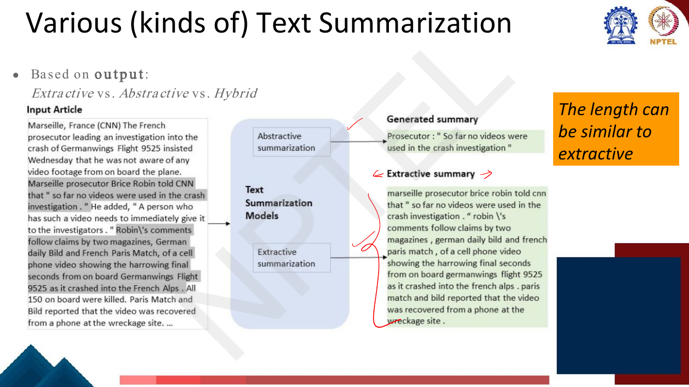

# Lec 35 — Text Summarization

> **Source:** `Week7.pdf` pp. 113–136 · **Week 7** · **Playlist:** Lec 35
> **Prereqs:** [Lec 28 — Span Tasks, T5, BART](../week-06/28-span-tasks-t5-bart.md), [Lec 19 — Decoding Strategies](../week-04/19-decoding-strategies.md)
> **Feeds into:** [Lec 55 — Retrieval-Augmented Generation](../week-11/55-retrieval-augmented-generation.md)

## Why this lecture exists

Every application so far has had a short answer: a span, a label, a reply turn. Summarization is the
first task where the *output* is long free text that no gold string uniquely determines — there are
many acceptable summaries of one document, and none of them is "the" answer. That breaks everything
downstream. You cannot train by exact match, you cannot score by exact match, and you cannot even
fit the input into a Transformer when the document is a 3,000-word earnings call.

So this lecture does three jobs at once. It gives the task taxonomy and the two model families
(extractive classification, abstractive generation). It shows what happens when the document is longer
than the context window. And it closes Week 7 with the evaluation machinery — **BLEU**, **ROUGE**,
**BARTScore** — that every generation task in this course, including the dialogue systems of
[Lec 33](33-dialogue-systems-1.md), is actually graded by.

## The ideas

### What text summarization is

The deck's definition: **automatically condensing the given document(s) to present the most relevant
information in a concise and quickly-readable format**. It is one of the oldest problems in NLP —
rule-based methods from the **1950s**, through statistical and neural methods, to **LLMs** today.

Two words in that definition are doing work. *Relevant* means the system must decide what matters, and
that decision is the task. *Concise* means there is a length budget, which forces the system to drop
things. A summarizer that keeps everything has not summarized.

### Taxonomy 1 — by output: extractive vs abstractive vs hybrid


*Fig. — Note how the extractive summary is literally the highlighted sentences of the input, lowercased and concatenated; the abstractive one is a new sentence that appears nowhere in the source. The deck's orange callout warns that an abstractive summary's **length can be similar to extractive** — abstractiveness is about where the words come from, not how short the output is. Page 116.*

| | **Extractive** | **Abstractive** |
|---|---|---|
| Operation | *select* sentences (or spans) verbatim from the source | *generate* new text |
| Model framing | binary classification per sentence | sequence-to-sequence generation |
| Grammaticality | guaranteed — the source was grammatical | learned, and usually good |
| Faithfulness | guaranteed — every word came from the source | **not** guaranteed; can hallucinate facts absent from the source |
| Compression | limited: you cannot go below one sentence | arbitrary — can fuse three sentences into one clause |
| Typical failure | redundancy, dangling pronouns, disconnected sentences | fluent but false statements |

That is the whole trade-off, and it is the single most examinable sentence in the first half of this
lecture: **extractive is always grammatical and faithful but rigid and redundant; abstractive is
fluent and compressive but can hallucinate.** "Dangling pronoun" is the classic extractive failure —
you pull sentence 7, which starts "He denied this", and the reader has no idea who *he* is.

**Hybrid** systems do both: extract first to cut the input down, then rewrite the extract. The deck's
own ECTSum system (below) is exactly that.

### Taxonomy 2 — by number of input documents

**Single-document** summarization takes one article in, one summary out. **Multi-document**
summarization takes a cluster of related documents — say ten news reports of the same event — and
produces one summary. Multi-document is harder for a reason worth naming: the inputs **overlap**, so
the system must detect and remove redundancy *across* documents, and it must reconcile contradictions
between sources. (This is also why ROUGE-2 was validated specifically on multi-document extractive
summarization — see the evaluation section.)

### Taxonomy 3 — by content/genre


*Fig. — A third axis the lecture gives but the written slide text barely records: **generic vs domain-specific**. Notice the genre spread — news, legal judgments, financial statements, government reports, book-length autobiography. Each needs a different notion of "relevant", which is the whole argument for the domain-specific case study later in the deck. Page 118.*

A **generic** summarizer answers "what is this document about?" for any reader. A **domain-specific**
one is built around what matters in that genre — for a financial filing, the numbers; for a legal
judgment, the holding. The deck does not show query-focused summarization, but it is the natural
fourth axis: condition the summary on a user query.

### Extractive summarization as sentence classification: BERTSum

Pre-neural extractive systems scored sentences with graph centrality (**LexRank** / centroid method),
or picked a set by **integer linear programming**, or greedily added sentences that were relevant but
unlike what was already chosen (**maximum marginal relevance**). BERTSum replaces all of it with one
clean idea.

![BERTSum slide: a BERT input with [CLS] inserted before every sentence and [SEP] after it, interleaved segment embeddings E_A/E_B, token + segment + positional embeddings summed, passed through Transformer layers, with each [CLS] output feeding a binary classifier — 0 = do not include in the summary, 1 = include](../../assets/pages/lec35/p-119.png)
*Fig. — Notice two modifications to vanilla BERT: a `[CLS]` is inserted before **every** sentence, not just at the start; and the segment embeddings **alternate** $E_A, E_B, E_A, \ldots$ per sentence so the model can tell adjacent sentences apart. The left panel lists the pre-neural methods BERTSum displaced. Page 119.*

**BERTSum** (Liu and Lapata, 2019) formulates extractive summarization as **sentence classification**:

1. Insert a `[CLS]` token before every sentence and a `[SEP]` after it, so a document of $k$ sentences
   has $k$ `[CLS]` positions.
2. Add **interval segment embeddings**: sentence $i$ gets $E_A$ if $i$ is odd, $E_B$ if even. Vanilla
   BERT's segment embeddings only distinguish two *sequences*; here they distinguish *alternating
   sentences*.
3. Run the stack. Each `[CLS]` output $\mathbf{t}_i$ is now a contextual representation of **sentence
   $i$ in the context of the whole document** — which is exactly the information you need, because
   whether a sentence belongs in the summary depends on the other sentences.
4. Score each sentence with a classifier head on its own `[CLS]`:
   $\hat{y}_i = \sigma(\mathbf{w}^\top \mathbf{t}_i + b)$, trained with binary cross-entropy against
   labels **1 = include, 0 = do not include**.
5. At inference, rank sentences by $\hat{y}_i$ and take the top few.

The elegance is that it needs no new architecture — it is BERT
([Lec 27](../week-06/27-bert-masked-lm.md)) with the `[CLS]` trick applied $k$ times instead of once.
The labels come for free: given a reference summary, mark the source sentences that best match it
(greedily, by ROUGE) as positive. That is called **oracle extractive labelling**.

### Abstractive summarization as a generation task

Abstractive summarization is plain sequence-to-sequence: **input = document(s), output = summary**.
Nothing about the architecture is summarization-specific. You re-use the language-modelling output
layer and generate with next-token prediction, decoding with the strategies of
[Lec 19](../week-04/19-decoding-strategies.md) — beam search is the usual choice here because
summaries should be conservative, not creative.

The deck's decision tree is practical and worth keeping:

| Situation | What to do | Models the deck names |
|---|---|---|
| You have a labelled dataset | **Finetune** an open-weight model | encoder-decoder (T5, Flan-T5) or decoder-only (GPT-2, LLaMA, Qwen, Mistral) |
| Labelling is feasible | label, then finetune | — |
| Labelling not feasible | **Prompt** an open-weight or proprietary instruction-finetuned (and aligned) model | Llama-3.1-8B-Instruct, Llama-2-7b-chat-hf, Qwen2.5-7B-Instruct, Mistral-Large-Instruct |

A separate slide splits the model landscape three ways: **fine-tuned on summarization datasets** (BART,
T5, PEGASUS, CTRLSum, BRIO — task-specific models trained per dataset), **instruction-tuned on multiple
tasks then prompted** (T0, FLAN, Instruct-GPT, text-davinci-002 — *not* trained on standard
summarization datasets), and **zero-shot prompting** of GPT-3 / PaLM / Turing-NLG, which the deck marks
as "not available or less effective than instruction-tuned counterparts". The encoder-decoder family
itself is [Lec 28](../week-06/28-span-tasks-t5-bart.md)'s.

### Pegasus: pretrain on something that looks like the task

Pegasus (Zhang et al., 2020) is a sibling of T5 and BART — same encoder-decoder shape, different
pretraining objective. The insight is one sentence: **design a pretraining objective that resembles the
downstream task**, and the transfer gets much cheaper.

![Pegasus pretraining diagram: an input "Pegasus is [MASK2] . [MASK1] It [MASK2] the model ." feeds a Transformer encoder whose output heads predict the masked tokens "mythical" and "names"; the encoder also feeds a Transformer decoder that generates the target text "It is pure white . <eos>" from the shifted-right input "<s> It is pure white ."](../../assets/pages/lec35/p-122.png)
*Fig. — Both objectives run **simultaneously**. Of the three original sentences, one ("It is pure white.") is replaced by `[MASK1]` and becomes the decoder's generation target — that is **GSG**. The two surviving sentences stay in the encoder input with individual tokens replaced by `[MASK2]` — that is ordinary **MLM**, predicted from the encoder side. Two mask symbols, two objectives, one forward pass. Page 122.*

**Gap Sentence Generation (GSG)** is the new objective: remove whole *sentences* from the document, and
make the decoder generate them back from the remaining text. Why this and not T5's span corruption?
Because generating a missing sentence conditioned on the rest of a document is structurally the same
operation as generating a summary conditioned on a document — the model is pretrained to write a
sentence that captures what the surrounding text is about.

That only works if the *removed* sentences look like summary sentences. Hence the deck's second Pegasus
page.


*Fig. — The title is the thesis: the gap sentences are chosen to **approximate a summary**. Note that **Principal** scores sentence $x_i$ by its ROUGE-1-F1 against *the rest of the document* — a sentence that overlaps heavily with everything else is, by that proxy, the document's most representative sentence. Page 123.*

Three selection strategies, $m$ sentences chosen without replacement from $D = \{x_i\}_n$:

- **Random** — uniformly select $m$ sentences. The control condition.
- **Lead** — select the first $m$. Cheap, and a strong baseline for news, where the first paragraph
  often *is* the summary (the journalistic "inverted pyramid").
- **Principal** — select the top-$m$ by importance, where importance is
  $s_i = \mathrm{rouge}(x_i,\, D \setminus \{x_i\})$, the ROUGE-1-F1 (Lin, 2004) of sentence $i$
  against the rest of the document.

Principal wins, and it wins because it is the strategy whose removed sentences most resemble a summary.
This is the lesson to carry out of the lecture: **pretraining objectives are not interchangeable — the
closer the objective is in shape to the task, the better the transfer.**

### Domain-specific example: summarizing earnings call transcripts

The deck works one real system end to end (Mukherjee et al., EMNLP 2022).

**The documents.** **Earnings Call Transcripts (ECTs)** are long, unstructured documents with an
**average length of 3K words**. The authors collected publicly hosted transcripts from **The Motley
Fool**, targeting the ECTs of **Russell 3000 Index** companies posted between **January 2019 and April
2022**.

**The references.** Expert-written **Reuters** articles corresponding to those earnings calls, used as
the reference summaries. They are **telegram-style bullet points** that precisely capture the important
metrics and numbers discussed in the call — e.g. "QUARTERLY EARNINGS PER SHARE $1.52.", "QUARTERLY TOTAL
NET SALES $97.28 BILLION VERSUS $89.58 BILLION REPORTED LAST YEAR." The **average summary length is
around 50 words**.

So: 3,000 words in, 50 words out, and the content that matters is *numbers*. That shapes everything —
including the evaluation, which has to check the numbers are right.

### The long-document problem


*Fig. — ECTSum's compression ratio of **103.67** is 3–8× every other dataset's, and that is the paper's claim to novelty: it is the hardest compression in the table even though its documents are not the longest. Also note its density of 2.43 — low, meaning the summaries are **not** copied spans, so an extractive system alone cannot win. Page 126.*

Three quantities, which the deck defines loosely and which you should know properly:

- **Compression ratio** — "the ratio between # tokens in a document and its summary",
  $\mathrm{CR} = |D| / |S|$. Higher = harder.
- **Coverage** — the fraction of summary tokens that appear inside an extractive fragment copied from
  the source. Coverage $= 1.0$ means every summary word came from the document.
- **Density** — the *average length of the extractive fragment* each summary token belongs to. High
  density means the summary copies long runs; low density means it copies at most single words.

Coverage and density together "quantify the extent to which a summary is derivative of the source
text". A purely extractive summary has coverage 1 and high density. ECTSum's 0.85 / 2.43 says: the
words are mostly the document's, but strung together in new orders — which is why the winning system is
hybrid.

**The architectural problem** is simpler than any of this: 3,000 words does not fit in a 512-token
encoder. Truncating throws away most of the call.

![Extract-then-paraphrase architecture: the original earnings-call document's sentences feed an Extractive Module (FinBERT → 768-dim [CLS] token embedding → sentence-level GRU → classification layer → summarization loss) producing an extractive summary of m sentences, which is then fed as "Input: Generic Inc. reports quarterly earnings per share of $4.67 in fourth quarter" to a Paraphrasing Module (T5 encoder → T5 decoder → paraphrasing loss) whose target is the telegram-style "Generic Inc. Q4 earnings per share $4.67"](../../assets/pages/lec35/p-127.png)
*Fig. — The two-stage fix. The extractive module is BERTSum's recipe with a domain-specific encoder (**FinBERT**) plus a **sentence-level GRU** over the 768-dim `[CLS]` embeddings before classification; the paraphrasing module is a **T5** that rewrites each extracted sentence into Reuters' telegram style. Only $m$ sentences, not 3,000 words, ever reach T5 — that is how the context limit is dodged. Page 127.*

**Extract-then-paraphrase** is the general pattern, not just this system's trick: use a cheap selector
to get under the context limit, then use an expensive generator on what survived. Note the division of
labour — the extractor decides *what*, the paraphraser decides *how*.

![Main results table: ROUGE-1/2/L, BERTScore, Num-Prec. and SummaC_CONV for unsupervised (LexRank 0.122/0.023/0.154/0.638, DSDR, PacSum), extractive (SummaRuNNer, BertSumExt 0.307/0.118/0.324/0.667, MatchSum 0.314/0.126/0.335/0.679), abstractive (BART 0.327/0.153/0.361/0.692/0.594/0.431, Pegasus 0.334/0.185/0.375/0.708/0.783/0.444, T5 0.363/0.209/0.413/0.728/0.796/0.508), long-document summarizers (BigBird, LongT5, LED 0.450/0.271/0.498/0.737/0.679/0.439) and Ours (ECT-BPS w/o paraphrasing 0.313/0.137/0.351/0.714; ECT-BPS 0.467/0.307/0.514/0.764/0.916/0.518)](../../assets/pages/lec35/p-128.png)
*Fig. — Read three things off this. (1) The ordering **unsupervised < extractive < abstractive < long-document < hybrid** holds on every metric. (2) The ablation at the bottom: removing the paraphrasing stage drops ROUGE-1 from **0.467 to 0.313** — the paraphraser, not the extractor, is doing most of the work. (3) The two boxed columns are **domain-specific evaluation metrics**: **Num-Prec.** (precision of the numbers reproduced) and **SummaC$_\text{CONV}$** (factual consistency). ECT-BPS reaches **0.916** numerical precision against Pegasus's 0.783 — on a financial task, getting the digits right is the point, and ROUGE alone would not have caught it. Page 128.*

### Very long documents and books


*Fig. — The caption on the slide states the baseline the two panels improve on: **"naive method is to generate summaries for each chunk and combine"**. Hierarchical merging is a balanced binary tree (parallelisable, $O(\log k)$ depth); incremental updating is a left-to-right fold (sequential, order-sensitive, and needs an explicit compression step when the running summary overflows). Page 129.*

Books break the chunking fix as well, because a per-chunk summary loses cross-chunk coherence — the
naive concatenation reads as a list, not a summary. Both repairs are **recursive summarization**:
summarize summaries. Hierarchical merging merges *with context* so a merged node knows roughly what the
other branches contained; incremental updating carries one running summary forward and compresses it
when it grows too long. Modern long-context LLMs attack the same problem from the architecture side
instead — [Lec 54](../week-11/54-long-sequence-modeling.md).

---

### Evaluation, part 1: BLEU

**BLEU** (**Bilingual Evaluation Understudy**, Papineni et al., 2002) measures n-gram overlap between a
machine translation output and a reference translation. The deck's slide is three lines and a formula:
compute precision for n-grams of size **1 to 4**, add a **brevity penalty** (for too-short
translations), and note that BLEU was **originally designed for MT evaluation but is widely used for
NLG evaluation**. Memorise this exact form:

$$\text{BLEU} = \underbrace{\min\!\left(1, \frac{\text{output-length}}{\text{reference-length}}\right)}_{\text{brevity penalty}} \times \left(\prod_{n=1}^{4} p_n\right)^{\frac{1}{4}}$$

The deck writes the brevity penalty as the **linear** $\min(1, c/r)$, which is **not** Papineni's
original exponential form — see "Beyond the slides", and follow the deck's version in this exam.

**Modified n-gram precision $p_n$.** The naive precision "how many candidate n-grams appear in the
reference, divided by how many candidate n-grams there are" is trivially gamed: output `the the the the
the the the` against `the cat is on the mat` scores $7/7 = 1.0$. The fix is **clipping** — count each
candidate n-gram at most as many times as it occurs in the reference:

$$p_n = \frac{\sum_{g \in \text{n-grams}(c)} \min\!\big(\text{Count}_c(g),\, \text{Count}_r(g)\big)}{\sum_{g \in \text{n-grams}(c)} \text{Count}_c(g)}$$

With clipping the spam candidate scores $2/7$, because "the" occurs twice in the reference. **This is
the single most asked-about detail of BLEU.**

**Why a geometric mean, over $n = 1$ to $4$?** Unigram precision measures whether you used the right
*words*; 4-gram precision measures whether you got the right *word order and phrasing*. A geometric
mean — unlike an arithmetic one — is **zero if any factor is zero**, so a candidate with no single
4-gram in common with the reference scores 0 no matter how good its unigrams are. That is deliberate
and brutal; it is also why BLEU on a single short sentence is usually 0 and why BLEU is meant to be
computed over a whole corpus.

**Why a brevity penalty?** Precision has no opinion about what you left out. Output just the two words
you are certain of and $p_n = 1$ for every $n$. The brevity penalty multiplies the score down whenever
the output is shorter than the reference, and does nothing ($=1$) when it is longer. **BLEU is
precision-oriented, and the brevity penalty is the only recall-ish component it has.** That is the
discriminating fact about BLEU.


*Fig. — The deck's own fully worked example, and the model for an exam question. System A has three of six correct words but almost no correct ordering, so one zero factor kills the geometric mean and BLEU is exactly **0%**. Both systems have the same length, so the brevity penalty **6/7 is identical** and cannot separate them. Worked out in full in N1. Page 131.*

### Evaluation, part 2: ROUGE


*Fig. — The title is the definition: the denominator is the **reference's** n-gram count, not the candidate's. That one swap turns precision into recall. Checked in N4. Page 132.*

**ROUGE** (Recall-Oriented Understudy for Gisting Evaluation, Lin 2004) is, in the deck's words, **"a
recall-based counterpart to BLEU"**.

$$\text{ROUGE-}n = \frac{\text{number of overlapping } n\text{-grams}}{\text{total } n\text{-grams in the reference summary}}$$

Everything follows from the denominator. BLEU divides by the **candidate's** n-gram count and so asks
*was what you said correct?*; ROUGE divides by the **reference's** and so asks *did you say what you
should have?* **ROUGE is recall-oriented, and that is right for summarization**, because the failure
mode you care about is a summary that *omits* the important content. A short summary that says only
true things is still a bad summary.

The deck notes that **ROUGE-2 has been shown to correlate somewhat well with human judgments for
multi-document extractive summarization tasks** — note the three qualifiers; it is not a general
endorsement.

**ROUGE-L** (not on the deck, but part of this chapter's canonical remit — it is reported in the deck's
own results table on page 128) uses the **longest common subsequence** instead of fixed-length n-grams.
A subsequence allows gaps: the LCS of `the quick brown fox jumps over the lazy dog` and
`a quick brown fox leaped over a lazy dog` is `quick brown fox over lazy dog`, length 6. Then

$$R_{\text{lcs}} = \frac{\text{LCS}(X,Y)}{|X|}, \quad P_{\text{lcs}} = \frac{\text{LCS}(X,Y)}{|Y|}, \quad F_{\text{lcs}} = \frac{(1+\beta^2)\,R_{\text{lcs}}P_{\text{lcs}}}{R_{\text{lcs}} + \beta^2 P_{\text{lcs}}}$$

with $X$ the reference and $Y$ the candidate. ROUGE-L's advantage over ROUGE-2 is that it rewards
in-order content words even when function words differ, so it does not punish legitimate paraphrase as
hard. **ROUGE-S** (skip-bigram: any ordered pair of words with gaps allowed) is the third variant; the
deck shows neither, and only ROUGE-1/2/L appear in its results.

### BLEU vs ROUGE

| | **BLEU** | **ROUGE** |
|---|---|---|
| Orientation | **precision** | **recall** |
| Denominator | n-grams in the **candidate** | n-grams in the **reference** |
| Orders used | geometric mean of $n = 1..4$ | reported per $n$ (ROUGE-1, ROUGE-2), or by LCS |
| Length control | explicit **brevity penalty** | none in ROUGE-$n$; implicit via the $F$ in ROUGE-L |
| Zero if | any $p_n = 0$ | no overlap at all |
| Built for | machine translation | summarization |
| Question it asks | "is what you said correct?" | "did you cover what mattered?" |

**Which to use where.** For translation, the output length is essentially fixed by the input and the
sin is saying something wrong — so precision plus a brevity penalty is the right shape. For
summarization, the output length is a free choice and the sin is leaving something out — so recall is
the right shape. In practice modern ROUGE implementations report **F-measure** rather than raw recall,
precisely because raw recall can be gamed by padding the summary (demonstrated in N5).

Both are surface-overlap metrics, and both therefore punish correct paraphrase and reward lexical
copying. [Lec 33](33-dialogue-systems-1.md) makes the full argument for why that breaks down on
dialogue; the same argument applies, more weakly, here.

### BARTScore

**BARTScore** (Yuan et al., NeurIPS 2021) drops surface overlap entirely. Treat evaluation as
generation: score a candidate by the **log-likelihood a pretrained seq2seq model (BART) assigns to it**
given some other text.

$$\text{BARTSCORE} = \sum_{t=1}^{m} \omega_t \log p(\mathbf{y}_t \mid \mathbf{y}_{<t}, \mathbf{x}, \theta)$$

$\mathbf{x}$ is the conditioning text, $\mathbf{y}$ the scored text of length $m$, and $\omega_t$ a
per-token weight that can be **IDF** (down-weight common words) or **uniform**. Because a pretrained
model's probabilities reflect meaning and fluency, two paraphrases of the same sentence score
similarly — which is exactly what BLEU and ROUGE cannot do. Note the scale: it is a sum of log
probabilities, so it is **negative, unbounded below, and comparable only within one evaluation setup**.


*Fig. — One formula, three metrics, chosen purely by which text you condition on. **The direction of the arrow is the exam question.** Page 134.*

| Direction | Conditional | Name | What it measures |
|---|---|---|---|
| $s \to h$ | $p(h \mid s, \theta)$ | **Faithfulness** | how likely the hypothesis could be generated from the **source document** — i.e. is it hallucinating? |
| $r \to h$ | $p(h \mid r, \theta)$ | **Precision** | how likely the hypothesis could be constructed from the **gold reference** |
| $h \to r$ | $p(r \mid h, \theta)$ | **Recall** | how easily the gold reference could be generated **by the hypothesis** |

Faithfulness is the one that is genuinely new: it needs **no reference at all**, only the source
document, which makes it usable where no gold summary exists — and it targets abstractive
summarization's characteristic failure directly. An $F$-score variant averages the precision and recall
directions.

## Worked numericals

The deck's page 131 is a fully worked BLEU table and page 132 a worked ROUGE-2; both are reproduced and
checked here. There is no page titled "Try this problem" anywhere in pp. 113–136.

### N1. The deck's BLEU table, computed by hand (page 131)
**Given:**
Reference (7 tokens): `Israeli officials are responsible for airport security`
System A (6 tokens): `Israeli officials responsibility of airport safety`
System B (6 tokens): `airport security Israeli officials are responsible`
**Find:** $p_1 \ldots p_4$, the brevity penalty, and BLEU for both systems.

**System A.**
1. Unigrams of A: {Israeli, officials, responsibility, of, airport, safety}. In the reference:
   Israeli ✓, officials ✓, airport ✓ → $p_1 = 3/6 = 0.5$.
2. Bigrams of A (5 of them): (Israeli officials) ✓, (officials responsibility) ✗, (responsibility of) ✗,
   (of airport) ✗, (airport safety) ✗ → $p_2 = 1/5 = 0.2$.
3. Trigrams of A (4): none match → $p_3 = 0/4 = 0$.
4. 4-grams of A (3): none match → $p_4 = 0/3 = 0$.
5. Geometric mean $= (0.5 \times 0.2 \times 0 \times 0)^{1/4} = 0$.
6. BP $= \min(1, 6/7) = 0.8571$.
7. BLEU $= 0.8571 \times 0 = \mathbf{0}$.

**System B.**
8. Unigrams: airport ✓, security ✓, Israeli ✓, officials ✓, are ✓, responsible ✓ → $p_1 = 6/6 = 1$.
9. Bigrams (5): (airport security) ✓, (security Israeli) ✗, (Israeli officials) ✓, (officials are) ✓,
   (are responsible) ✓ → $p_2 = 4/5 = 0.8$.
10. Trigrams (4): (airport security Israeli) ✗, (security Israeli officials) ✗,
    (Israeli officials are) ✓, (officials are responsible) ✓ → $p_3 = 2/4 = 0.5$.
11. 4-grams (3): (airport security Israeli officials) ✗, (security Israeli officials are) ✗,
    (Israeli officials are responsible) ✓ → $p_4 = 1/3 = 0.3333$.
12. Product $= 1 \times 0.8 \times 0.5 \times 0.3333 = 0.13333$.
13. Geometric mean $= 0.13333^{1/4}$. Take logs: $\ln 0.13333 = -2.0149$; $-2.0149/4 = -0.50372$;
    $e^{-0.50372} = 0.6043$.
14. BP $= \min(1, 6/7) = 0.8571$ — **identical to A's**, since both outputs are 6 tokens long.
15. BLEU $= 0.8571 \times 0.6043 = 0.5180$.

**Answer:** System A $= \mathbf{0\%}$, System B $= \mathbf{52\%}$. Both match the deck's table exactly.
The lesson: A and B share *five* of six correct words and have the *same* brevity penalty; the entire
gap is word order, caught by $p_3$ and $p_4$ and amplified to a total wipe-out by the geometric mean.

### N2. Clipping: why modified precision exists
**Given:** Candidate `the the the the the the the` (7 tokens). Reference `the cat is on the mat`.
**Find:** unmodified and modified unigram precision.

1. **Unmodified**: every candidate unigram ("the") does occur in the reference, so the naive count of
   matches is 7. $p_1^{\text{naive}} = 7/7 = \mathbf{1.00}$ — a perfect score for gibberish.
2. **Modified**: $\text{Count}_{\text{cand}}(\text{the}) = 7$; $\text{Count}_{\text{ref}}(\text{the}) = 2$.
3. Clip: $\min(7, 2) = 2$.
4. $p_1 = 2/7 = \mathbf{0.2857}$.
5. Full BLEU would be 0 anyway, since the candidate's bigram (the the) never occurs in the reference,
   so $p_2 = 0$ and the geometric mean collapses.

**Answer:** $1.00$ unclipped versus $0.2857$ clipped. **Clipping caps each n-gram's credit at its
reference count**, which is the only thing stopping repetition from inflating precision.

### N3. The brevity penalty's effect
**Given:** Reference (7 tokens) `Israeli officials are responsible for airport security`.
Candidate (4 tokens) `Israeli officials are responsible` — a correct but truncated output.
**Find:** BLEU with and without the brevity penalty, under both BP forms.

1. Unigrams (4): all four occur in the reference → $p_1 = 4/4 = 1$.
2. Bigrams (3): (Israeli officials), (officials are), (are responsible) — all present → $p_2 = 3/3 = 1$.
3. Trigrams (2): (Israeli officials are), (officials are responsible) — both present → $p_3 = 2/2 = 1$.
4. 4-grams (1): (Israeli officials are responsible) — present → $p_4 = 1/1 = 1$.
5. Geometric mean $= (1 \cdot 1 \cdot 1 \cdot 1)^{1/4} = 1.0$. **Without a brevity penalty this
   four-word fragment scores a perfect 100%.**
6. Deck's linear BP $= \min(1, c/r) = \min(1, 4/7) = 0.5714$ → BLEU $= \mathbf{0.5714}$.
7. Papineni's exponential BP $= e^{1 - r/c} = e^{1 - 7/4} = e^{-0.75} = 0.4724$ → BLEU $= \mathbf{0.4724}$.

**Answer:** $1.000$ without the penalty, $0.571$ (deck) or $0.472$ (original BLEU) with it. The penalty
is what makes "say less, say it perfectly" a losing strategy. Note the two BP forms disagree by 10
points here; **follow the deck's $\min(1, c/r)$ for this exam** (it is what reproduces the 52% in N1).

### N4. ROUGE-1, ROUGE-2 and ROUGE-L on the deck's pair (page 132)
**Given:**
Reference summary RS (9 tokens): `the quick brown fox jumps over the lazy dog`
Generated summary GS (9 tokens): `a quick brown fox leaped over a lazy dog`
**Find:** ROUGE-1, ROUGE-2 and ROUGE-L.

1. **ROUGE-1.** RS unigram counts: the ×2, quick, brown, fox, jumps, over, lazy, dog — 9 tokens total.
   GS has: a ×2, quick, brown, fox, leaped, over, lazy, dog.
2. Clipped overlap: quick 1, brown 1, fox 1, over 1, lazy 1, dog 1 $= 6$. ("the" is in RS twice and GS
   zero times; "jumps" vs "leaped" misses; "a" is not in RS.)
3. $\text{ROUGE-1} = 6/9 = \mathbf{0.6667}$.
4. **ROUGE-2.** RS bigrams (8): the quick, quick brown, brown fox, fox jumps, jumps over, over the,
   the lazy, lazy dog.
5. GS bigrams (8): a quick, quick brown, brown fox, fox leaped, leaped over, over a, a lazy, lazy dog.
6. Overlap: quick brown, brown fox, lazy dog $= 3$.
7. $\text{ROUGE-2} = 3/8 = \mathbf{0.375}$ — matches the deck exactly.
8. **ROUGE-L.** Find the LCS. Walk both sequences left to right keeping matches in order:
   quick → brown → fox → (jumps/leaped differ, skip) → over → (the/a differ, skip) → lazy → dog.
9. $\text{LCS} = $ `quick brown fox over lazy dog`, length $\mathbf{6}$. (Confirmed by the dynamic
   program in the Code section — no longer subsequence exists.)
10. $R_{\text{lcs}} = 6/9 = 0.6667$; $P_{\text{lcs}} = 6/9 = 0.6667$; with $\beta = 1$,
    $F_{\text{lcs}} = 2(0.6667)(0.6667)/(0.6667+0.6667) = \mathbf{0.6667}$.

**Answer:** ROUGE-1 $= 0.667$, ROUGE-2 $= 0.375$, ROUGE-L $= 0.667$. Notice **ROUGE-2 is far harsher
than ROUGE-1** on a good paraphrase — two single-word substitutions ("the"→"a", "jumps"→"leaped")
destroy *five* of eight bigrams while costing only three of nine unigrams. ROUGE-L recovers the
ROUGE-1 value because the LCS tolerates the gaps those substitutions create.

### N5. BLEU and ROUGE disagreeing on the same summary
**Given:** Reference summary R (10 tokens): `the board approved a dividend of fifty cents per share`.
Candidate A (7 tokens): `the board approved a dividend of fifty` — a truncated prefix.
Candidate B (18 tokens): `the board approved a dividend of fifty cents per share in the fourth quarter
after a long debate` — the full reference plus eight padding tokens.
**Find:** BLEU and ROUGE for each, and decide which candidate is better *as a summary*.

1. **A, BLEU.** Every n-gram of A is a prefix n-gram of R, so $p_1 = 7/7$, $p_2 = 6/6$, $p_3 = 5/5$,
   $p_4 = 4/4$, all $= 1$. Geometric mean $= 1$.
2. BP $= \min(1, 7/10) = 0.7$ → $\text{BLEU}_A = \mathbf{0.700}$.
3. **B, BLEU.** $p_1$: R's ten unigram types all appear in B; B repeats "the" and "a" but clipping caps
   each at 1, so clipped matches $= 10$ out of B's 18 unigrams → $p_1 = 10/18 = 0.5556$.
4. $p_2 = 9/17 = 0.5294$ (B's first nine bigrams are R's nine; the remaining eight are padding).
5. $p_3 = 8/16 = 0.5$; $p_4 = 7/15 = 0.4667$.
6. Product $= 0.5556 \times 0.5294 \times 0.5 \times 0.4667 = 0.06863$;
   geometric mean $= 0.06863^{1/4} = 0.5118$.
7. BP $= \min(1, 18/10) = 1$ (longer than the reference, so no penalty)
   → $\text{BLEU}_B = \mathbf{0.512}$.
8. **ROUGE.** A: overlapping unigrams $= 7$ of R's 10 → $\text{ROUGE-1}_A = 7/10 = \mathbf{0.700}$;
   overlapping bigrams $= 6$ of R's 9 → $\text{ROUGE-2}_A = 6/9 = \mathbf{0.667}$; LCS $= 7$ →
   $R_{\text{lcs}} = \mathbf{0.700}$.
9. B contains R verbatim as a prefix, so all of R's unigrams and bigrams are covered:
   $\text{ROUGE-1}_B = 10/10 = \mathbf{1.000}$, $\text{ROUGE-2}_B = 9/9 = \mathbf{1.000}$,
   LCS $= 10 \Rightarrow R_{\text{lcs}} = \mathbf{1.000}$.

**Answer:** **BLEU prefers A (0.700 vs 0.512); ROUGE prefers B (1.000 vs 0.700).** They disagree because
A is perfectly precise but drops `cents per share` — i.e. it truncates the *number*, the one fact the
summary exists to convey — while B says everything required plus some noise. For summarization **ROUGE
is right**: an omitted fact cannot be recovered by the reader, whereas padding can be skimmed past.

**Caveat worth knowing**, because it is the standard follow-up: raw ROUGE recall *can* be gamed by
padding. Scoring with the F-measure that real ROUGE packages report flips the verdict —
$P_1(B) = 10/18 = 0.556$, so $F_1(B) = 2(0.556)(1.0)/1.556 = 0.714$, against
$P_1(A) = 7/7 = 1.0$ and $F_1(A) = 2(1.0)(0.7)/1.7 = 0.824$. The deck's ROUGE-$n$ formula is pure
recall; the implementations are F-measures. Read the question carefully.

### N6. Compression ratio, coverage and density for an extractive summary
**Given:** A document of 5 sentences with token counts 12, 9, 11, 8, 10 (so $|D| = 50$ tokens). An
extractive system copies sentences 2 and 4 verbatim, giving $|S| = 9 + 8 = 17$ tokens. A second,
abstractive system also produces 17 tokens, of which the longest runs copied from $D$ have lengths
4, 3, 2, 1, 1 and the remaining 6 tokens are novel.
**Find:** compression ratio, coverage and density for each.

1. **Compression ratio** is identical for both, since it only looks at lengths:
   $\mathrm{CR} = |D|/|S| = 50/17 = \mathbf{2.94}$.
2. **Extractive coverage**: every one of the 17 summary tokens lies inside a fragment copied from $D$,
   so $\text{Coverage} = 17/17 = \mathbf{1.00}$. This is true of *every* extractive summary by
   construction — a coverage below 1 is proof the system generated something.
3. **Extractive density** $= \frac{1}{|S|}\sum_f |f|^2 = (9^2 + 8^2)/17 = (81+64)/17 = 145/17 = \mathbf{8.53}$.
4. **Abstractive coverage**: matched tokens $= 4+3+2+1+1 = 11$, so $11/17 = \mathbf{0.647}$.
5. **Abstractive density** $= (4^2 + 3^2 + 2^2 + 1^2 + 1^2)/17 = (16+9+4+1+1)/17 = 31/17 = \mathbf{1.82}$.
6. Compare to ECTSum on page 126: coverage **0.85**, density **2.43**. Coverage near 0.85 with density
   under 2.5 says the summaries reuse the document's *words* (the dollar figures, the company names)
   but almost never its *phrases* — which is precisely why a pure extractor scores 0.313 ROUGE-1 and
   extract-then-paraphrase scores 0.467.

**Answer:** CR $= 2.94$ for both; extractive (coverage 1.00, density 8.53) versus abstractive
(coverage 0.647, density 1.82).

**Erratum found while checking page 126.** The deck says compression ratio "represents the ratio between
# Tokens in a document and its summary", but the table's compression ratios are **not** the ratio of
the printed averages. ECTSum: $2916.44 / 49.23 = 59.2$, yet the table prints **103.67**. Every row
behaves the same way (ArXiv/PubMed $20.1$ vs $31.17$; BookSum $10.1$ vs $15.97$). The reason is that
the published ratio is the **mean of per-document ratios** $\mathbb{E}[|D_i|/|S_i|]$, while dividing the
printed column averages gives $\mathbb{E}[|D|]/\mathbb{E}[|S|]$ — and by Jensen's inequality the former
is always the larger. If an exam asks you to recompute a compression ratio from that table, you will
not reproduce the printed number, and you are not wrong.

## Code

Both blocks are self-contained pure Python and reproduce the hand computations above exactly.

```python
import math
from collections import Counter

def ngrams(toks, n):
    return [tuple(toks[i:i+n]) for i in range(len(toks) - n + 1)]

def modified_precision(cand, ref, n):
    """Clipped n-gram precision: each candidate n-gram counts at most as
    many times as it occurs in the reference."""
    c, r = Counter(ngrams(cand, n)), Counter(ngrams(ref, n))
    total = sum(c.values())
    if total == 0:
        return 0.0, 0, 0
    clipped = sum(min(cnt, r[g]) for g, cnt in c.items())
    return clipped / total, clipped, total

def bleu(cand, ref, N=4, bp="linear"):
    ps = [modified_precision(cand, ref, n)[0] for n in range(1, N + 1)]
    c, r = len(cand), len(ref)
    # "linear" is the deck's min(1, c/r); "exp" is Papineni's e^(1 - r/c)
    BP = min(1.0, c / r) if bp == "linear" else (1.0 if c > r else math.exp(1 - r / c))
    gm = 0.0 if min(ps) == 0 else math.exp(sum(math.log(p) for p in ps) / N)
    return BP * gm, ps, BP, gm

REF = "Israeli officials are responsible for airport security".split()
SYS = {"A": "Israeli officials responsibility of airport safety".split(),
       "B": "airport security Israeli officials are responsible".split()}

for name, cand in SYS.items():
    score, ps, BP, gm = bleu(cand, REF)
    frac = [modified_precision(cand, REF, n)[1:] for n in (1, 2, 3, 4)]
    print(f"System {name}: " + "  ".join(f"p{n}={a}/{b}" for n, (a, b) in zip((1,2,3,4), frac)))
    print(f"           geometric mean = {gm:.4f}   BP = {BP:.4f}   BLEU = {score:.4f} ({score*100:.0f}%)")

# clipping: without it, pure repetition scores a perfect 1.0
spam, r2 = "the the the the the the the".split(), "the cat is on the mat".split()
raw = sum(1 for w in spam if w in r2) / len(spam)
clip, a, b = modified_precision(spam, r2, 1)
print(f"\nspam candidate: unclipped p1 = {raw:.4f}   modified p1 = {a}/{b} = {clip:.4f}")
```

```
System A: p1=3/6  p2=1/5  p3=0/4  p4=0/3
           geometric mean = 0.0000   BP = 0.8571   BLEU = 0.0000 (0%)
System B: p1=6/6  p2=4/5  p3=2/4  p4=1/3
           geometric mean = 0.6043   BP = 0.8571   BLEU = 0.5180 (52%)

spam candidate: unclipped p1 = 1.0000   modified p1 = 2/7 = 0.2857
```

```python
from collections import Counter

def ngrams(toks, n):
    return [tuple(toks[i:i+n]) for i in range(len(toks) - n + 1)]

def rouge_n(gen, ref, n):
    """Recall: overlapping n-grams / total n-grams in the REFERENCE."""
    g, r = Counter(ngrams(gen, n)), Counter(ngrams(ref, n))
    overlap = sum(min(cnt, g[k]) for k, cnt in r.items())
    total = sum(r.values())
    return overlap, total, overlap / total

def lcs_length(a, b):
    """Longest common SUBSEQUENCE (not substring): gaps are allowed."""
    dp = [[0] * (len(b) + 1) for _ in range(len(a) + 1)]
    for i, x in enumerate(a, 1):
        for j, y in enumerate(b, 1):
            dp[i][j] = dp[i-1][j-1] + 1 if x == y else max(dp[i-1][j], dp[i][j-1])
    return dp[-1][-1]

def rouge_l(gen, ref, beta=1.0):
    L = lcs_length(gen, ref)
    R, P = L / len(ref), L / len(gen)
    F = 0.0 if R + P == 0 else ((1 + beta**2) * R * P) / (R + beta**2 * P)
    return L, R, P, F

RS = "the quick brown fox jumps over the lazy dog".split()     # reference
GS = "a quick brown fox leaped over a lazy dog".split()         # generated

for n in (1, 2):
    o, t, v = rouge_n(GS, RS, n)
    print(f"ROUGE-{n} = {o}/{t} = {v:.4f}")
L, R, P, F = rouge_l(GS, RS)
print(f"ROUGE-L: LCS = {L}  R_lcs = {R:.4f}  P_lcs = {P:.4f}  F_lcs = {F:.4f}")
print("LCS tokens:", "quick brown fox over lazy dog")
```

```
ROUGE-1 = 6/9 = 0.6667
ROUGE-2 = 3/8 = 0.3750
ROUGE-L: LCS = 6  R_lcs = 0.6667  P_lcs = 0.6667  F_lcs = 0.6667
LCS tokens: quick brown fox over lazy dog
```

Swap `rouge_n(gen, ref, n)` to `rouge_n(ref, gen, n)` and you have BLEU's unsmoothed precision instead
— the two metrics really are the same code with the arguments the other way round.

## Exam pack

### Must-memorise

| Item | Exactly this |
|---|---|
| Summarization | automatically condensing the given document(s) to present the most relevant information in a concise and quickly-readable format |
| Taxonomy by output | **extractive** vs **abstractive** vs **hybrid** |
| Taxonomy by input | **single-document** vs **multi-document** |
| Taxonomy by genre | **generic** vs **domain-specific** |
| Extractive trade-off | always grammatical and faithful; rigid and redundant |
| Abstractive trade-off | fluent and compressive; can hallucinate facts not in the source |
| BERTSum | extractive summarization as **sentence classification**: a `[CLS]` before **every** sentence; its output scores that sentence; **1 = include, 0 = exclude** |
| BERTSum segment embeddings | **interval** — alternate $E_A, E_B$ per sentence |
| Abstractive framing | seq2seq; input = document(s), output = summary |
| Pegasus objective | **Gap Sentence Generation (GSG)** + MLM, applied **simultaneously** |
| GSG | mask whole **sentences** with `[MASK1]`, generate them as the decoder target; other sentences stay in the input with `[MASK2]` token masking |
| Gap-sentence selection | **Random**, **Lead** (first $m$), **Principal** (top-$m$ by $s_i = \mathrm{rouge}(x_i, D\setminus\{x_i\})$, ROUGE-1-F1) |
| Pegasus's lesson | make the pretraining objective **resemble the downstream task** |
| Compression ratio | $\lvert D\rvert / \lvert S\rvert$ |
| Coverage / density | how derivative a summary is of the source; extractive ⇒ coverage $=1$ |
| Long-document fix | **extract-then-paraphrase** (cheap selector under the context limit, then a generator) |
| Book-length fix | **hierarchical merging** or **incremental updating** — both recursive summarization |
| BLEU | $\min\!\left(1, \frac{\text{output-length}}{\text{reference-length}}\right)\left(\prod_{n=1}^{4} p_n\right)^{1/4}$ |
| BLEU full name | **Bilingual Evaluation Understudy** (Papineni et al., 2002); built for MT |
| Modified precision | $p_n = \dfrac{\sum_g \min(\text{Count}_c(g), \text{Count}_r(g))}{\sum_g \text{Count}_c(g)}$ — clip by the reference count |
| BLEU orientation | **precision** |
| ROUGE-$n$ | $\dfrac{\text{overlapping } n\text{-grams}}{\text{total } n\text{-grams in the reference summary}}$ |
| ROUGE orientation | **recall** — "a recall-based counterpart to BLEU" |
| ROUGE-L | longest common **subsequence**; $R_{\text{lcs}} = \text{LCS}/\lvert X\rvert$, $P_{\text{lcs}} = \text{LCS}/\lvert Y\rvert$, $F_{\text{lcs}}$ their weighted harmonic mean |
| BARTScore | $\sum_{t=1}^{m}\omega_t \log p(\mathbf{y}_t \mid \mathbf{y}_{<t}, \mathbf{x}, \theta)$; $\omega_t$ IDF or uniform |
| BARTScore directions | $s\to h$ **faithfulness**; $r\to h$ **precision**; $h\to r$ **recall** |

### Numbers worth knowing

| Quantity | Value |
|---|---|
| BLEU n-gram orders | 1 to 4, combined by **geometric mean**, exponent $1/4$ |
| Deck's BLEU example | System A **0%**, System B **52%**; BP $= 6/7$ for both |
| Deck's ROUGE-2 example | $3/8 = 0.375$ |
| Rule-based summarization | 1950s |
| BERTSum | Liu and Lapata, **2019** |
| Pegasus | Zhang et al., **2020**; three gap-selection strategies |
| ECT average length | **3K words**; reference summary ≈ **50 words** |
| ECT source / index / window | The Motley Fool; **Russell 3000**; Jan 2019 – Apr 2022 |
| ECTSum dataset | 2,425 docs, coverage 0.85, density 2.43, **compression ratio 103.67**, 2916.44 doc tokens, 49.23 summary tokens |
| ECTSum vs others' compression | 103.67 vs ArXiv/PubMed 31.17, BigPatent 36.84, GovReport 19.01, BookSum 15.97, BillSum 13.64 |
| ECT-BPS results | ROUGE-1 **0.467**, ROUGE-2 0.307, ROUGE-L 0.514, BERTScore 0.764, Num-Prec. **0.916**, SummaC$_\text{CONV}$ 0.518 |
| ECT-BPS without paraphrasing | ROUGE-1 drops to **0.313** |
| Best prior baseline (LED) | ROUGE-1 0.450, ROUGE-2 0.271, ROUGE-L 0.498 |
| Pegasus on ECTSum | ROUGE-1 0.334, Num-Prec. 0.783 |
| BERTSum `[CLS]` count | one per sentence — $k$ sentences ⇒ $k$ classifications |
| BARTScore | Yuan et al., NeurIPS **2021** |

### Likely MCQ traps

- **"ROUGE is precision-based and BLEU recall-based."** Exactly backwards. BLEU = precision (divide by
  the candidate), ROUGE = recall (divide by the reference). The single highest-value discrimination in
  this lecture.
- **"BLEU has no recall component at all."** It has one: the **brevity penalty**. It is not recall, but
  it is the term that stops a short output from scoring 1.0.
- **Dividing ROUGE-$n$ by the generated summary's n-gram count.** The denominator is the **reference's**.
  If you use the candidate's you have computed precision.
- **Arithmetic instead of geometric mean in BLEU.** It is geometric, exponent $1/4$ — which is why a
  single $p_n = 0$ makes BLEU exactly 0.
- **Forgetting to clip.** Unmodified precision lets `the the the the the the the` score 1.0. Clipping
  caps each n-gram at its reference count.
- **Applying the brevity penalty to long outputs.** $\min(1, c/r) = 1$ whenever $c \ge r$. BLEU does
  **not** penalise verbosity directly — only the dropping precision does.
- **"Extractive summaries can hallucinate."** They cannot introduce facts absent from the source; every
  token is copied. Their failure modes are redundancy and dangling references.
- **"Abstractive means shorter."** No — the deck explicitly says an abstractive summary's length "can be
  similar to extractive". Abstractive is about *where the words come from*.
- **Confusing Pegasus's two masks.** `[MASK1]` = a whole **sentence** removed and generated by the
  decoder (GSG); `[MASK2]` = individual **tokens** masked in the surviving input (MLM). Both at once.
- **"Lead is Pegasus's best gap-selection strategy."** **Principal** is the one justified by the paper's
  thesis; Lead and Random are the comparisons.
- **Reversing the BARTScore directions.** $p(h \mid s)$ is **faithfulness** (needs no reference);
  $p(h \mid r)$ is **precision**; $p(r \mid h)$ is **recall**. The arrow points from the conditioning
  text to the scored text.
- **"BARTScore is a probability in $[0,1]$."** It is a sum of **log** probabilities — negative,
  unbounded below, comparable only within a fixed setup.
- **BERTSum classifies tokens.** It classifies **sentences**, one per `[CLS]`.
- **Assuming hierarchical merging and incremental updating are the naive baseline.** The naive baseline
  is "summarize each chunk and concatenate"; these two are the fixes.

### Self-test

1. State the extractive/abstractive trade-off in one sentence each.
2. Where does BERTSum insert `[CLS]`, and what does each one's output predict?
3. Write BLEU's formula exactly as the deck gives it.
4. A candidate has $p_1 = 0.9$, $p_2 = 0.6$, $p_3 = 0.4$, $p_4 = 0$, output length 12, reference length 10. What is BLEU?
5. Reference `a b c a b`, candidate `a a a a`. Give the unmodified and modified unigram precision.
6. Reference summary has 20 bigrams; the generated summary has 30 bigrams, 8 of which overlap. What is ROUGE-2?
7. Why is recall the right orientation for summarization and precision for translation?
8. What is GSG, and how does Pegasus choose which sentences to remove?
9. Which BARTScore direction needs no reference summary, and what does it measure?
10. A 3,000-word document must be summarized by a model with a 512-token encoder. Name the architecture the deck proposes and say which stage handles the length problem.
11. Compute ROUGE-L for reference `a b c d e` and candidate `a x c y e`.

<details><summary>Answers</summary>

1. Extractive: selects sentences verbatim, so it is always grammatical and faithful but rigid and redundant. Abstractive: generates new text, so it is fluent and can compress freely but may hallucinate facts not in the source.
2. Before **every sentence** (with `[SEP]` after each). Each `[CLS]` output feeds a binary classifier predicting whether that sentence belongs in the summary (1 = include, 0 = exclude).
3. $\text{BLEU} = \min\!\left(1, \frac{\text{output-length}}{\text{reference-length}}\right)\left(\prod_{i=1}^{4}\text{precision}_i\right)^{1/4}$.
4. **0.** $p_4 = 0$ zeroes the geometric mean, so the brevity penalty (which is 1 here, since $12 > 10$) is irrelevant.
5. Unmodified $= 4/4 = 1.0$. Modified: `a` occurs twice in the reference, so clipped count $= \min(4,2) = 2$, giving $2/4 = 0.5$.
6. $8/20 = 0.4$. The 30 is a distractor — ROUGE's denominator is the **reference's** count.
7. A summary's length is a free choice and its characteristic failure is omitting important content, so you measure coverage of the reference (recall). A translation's length is fixed by the source and its characteristic failure is saying something wrong, so you measure correctness of what was produced (precision), with a brevity penalty to stop truncation.
8. **Gap Sentence Generation**: whole sentences are masked out of the input with `[MASK1]` and the decoder must generate them. Selection is **Random**, **Lead** (first $m$), or **Principal** (top-$m$ by ROUGE-1-F1 of each sentence against the rest of the document) — Principal being the one that best approximates a summary.
9. **Faithfulness**, $s \to h$, i.e. $p(h \mid s, \theta)$. It measures how likely the hypothesis is to be generated from the **source document**, which is a direct test for hallucination and requires only the source.
10. **Extract-then-paraphrase.** The extractive module (FinBERT + sentence-level GRU + classifier) handles the length problem by selecting $m$ sentences; only those reach the T5 paraphraser.
11. LCS $=$ `a c e`, length 3. $R_{\text{lcs}} = 3/5 = 0.6$, $P_{\text{lcs}} = 3/5 = 0.6$, $F_{\text{lcs}} = 0.6$.

</details>

## Beyond the slides

**Gap:** The deck gives BLEU's brevity penalty as $\min(1, c/r)$, but the original paper uses
$\text{BP} = 1$ if $c > r$ and $e^{1 - r/c}$ otherwise.
**Why it matters:** They differ materially — on N3's four-word candidate, $0.571$ against $0.472$. Every
real implementation (`sacrebleu`, NLTK) uses the exponential form, so a number you compute by the deck's
formula will not match a number you compute with a library. The deck's own 52% in N1 is only
reproducible with the linear form, so **use the linear form in this exam** and know the other exists.

**Gap:** BLEU is defined against *multiple* references in the original paper; the deck shows only one.
**Why it matters:** With $k$ references, the clip for each candidate n-gram is the **maximum** count
across references, and the brevity penalty uses the *closest* reference length. This is why Papineni's
famous `the the the the the the the` example scores $2/7$ — "the" appears twice in one reference. If an
exam gives you two references, do not just concatenate them.

**Gap:** No mention of **BERTScore**, even though it appears as a column in the deck's own results
table on page 128.
**Why it matters:** BERTScore is the other standard model-based metric and the most likely companion to
BARTScore in an MCQ. It computes **greedy cosine-similarity matching between the contextual embeddings**
of candidate and reference tokens (optionally IDF-weighted), giving precision, recall and $F_1$. The
discrimination to hold: BERTScore compares **embeddings**; BARTScore uses **generation log-likelihood**.

**Gap:** Nothing on the known pathologies of ROUGE as an optimisation target.
**Why it matters:** ROUGE rewards lexical copying, so systems trained or selected on ROUGE drift toward
extractiveness, and a lead-3 baseline (just take the first three sentences) is famously hard to beat on
CNN/DailyMail. If your "abstractive" model's ROUGE improves while its density rises, it has learned to
copy, not to summarize. This is also why the ECTSum paper had to add Num-Prec. and SummaC — ROUGE is
blind to whether `$4.67` came out as `$4.76`.

**Gap:** Hallucination in abstractive summarization is named as a risk but never analysed.
**Why it matters:** The standard split is **intrinsic** hallucination (facts in the source, recombined
wrongly — "Q3" paired with Q4's revenue) and **extrinsic** (facts not in the source at all). BARTScore's
faithfulness direction targets exactly this, and it is the bridge to
[Lec 55](../week-11/55-retrieval-augmented-generation.md), where grounding in retrieved evidence is the
proposed fix.

## Cut from the slides

Pages 113 (title), 114 (outline), 135 (a references page reading only "Various papers cited in the
slides") and 136 ("Thank You") carry no teachable content and are dropped. Page 115's two bullets are
folded into the opening definition. Page 117's single/multi-document figure is described in prose
rather than embedded, since the figure is a clip-art restatement of its one-line caption; page 118's
genre taxonomy is embedded instead because its content is purely visual. Pages 130 and 133 are
transcribed rather than embedded — both are a formula plus one sentence, reproduced exactly in LaTeX
above, and the figure budget was better spent on page 131's worked BLEU table and page 134's three
BARTScore directions. Pages 120 and 121 overlap
heavily — both are "how do I get a model to generate a summary" decision trees from the same source —
so they are merged into one table plus one paragraph; the specific model roll-call (T0, FLAN,
text-davinci-002, GPT-3, PaLM, Turing-NLG) is kept because it is MCQ-shaped, but the
encoder-decoder/decoder-only architecture distinction behind it belongs to
[Lec 28](../week-06/28-span-tasks-t5-bart.md) and [Lec 29](../week-06/29-gpt-decoder-pretraining.md)
and is not re-derived here. `[CLS]`, segment embeddings and the BERT stack are referenced only, since
[Lec 27](../week-06/27-bert-masked-lm.md) owns them; decoding for the generation stage is
[Lec 19](../week-04/19-decoding-strategies.md)'s. ROUGE-L and ROUGE-S are **added** rather than cut —
the deck gives only ROUGE-$n$, but this chapter is the book's canonical owner of ROUGE and ROUGE-L is
reported in the deck's own results table, so omitting it would leave a hole. Likewise BERTScore appears
in that table with no definition anywhere in the deck; it is handled in "Beyond the slides".
