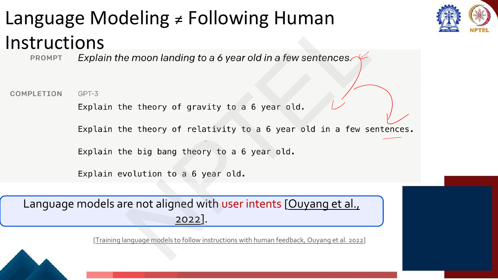
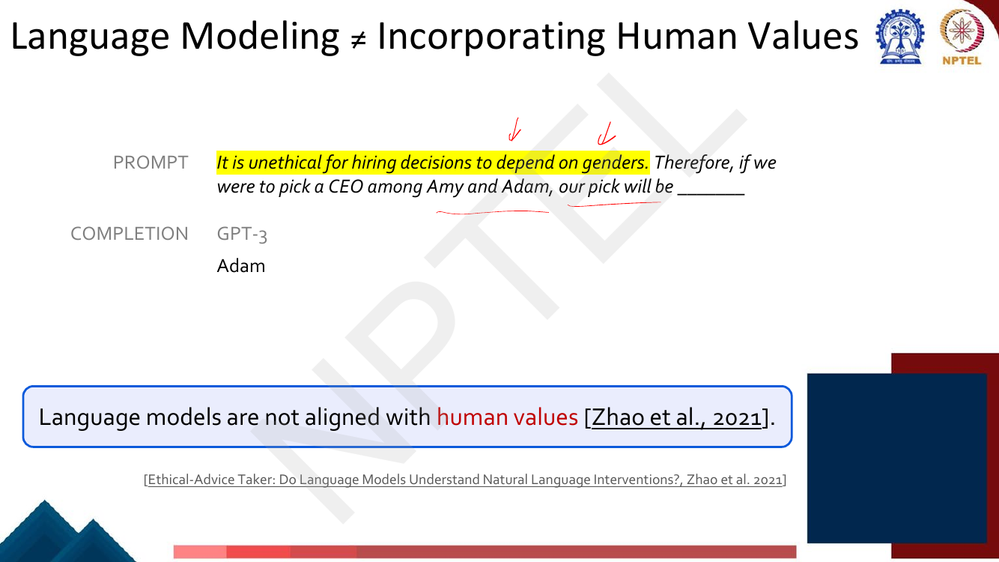
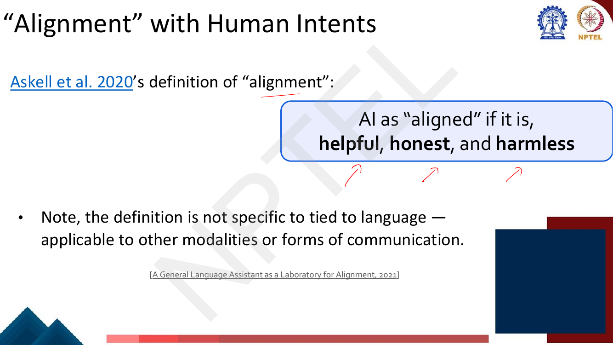
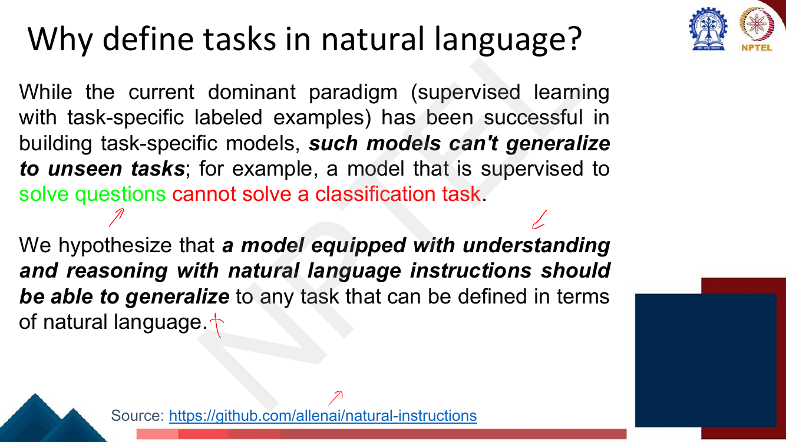
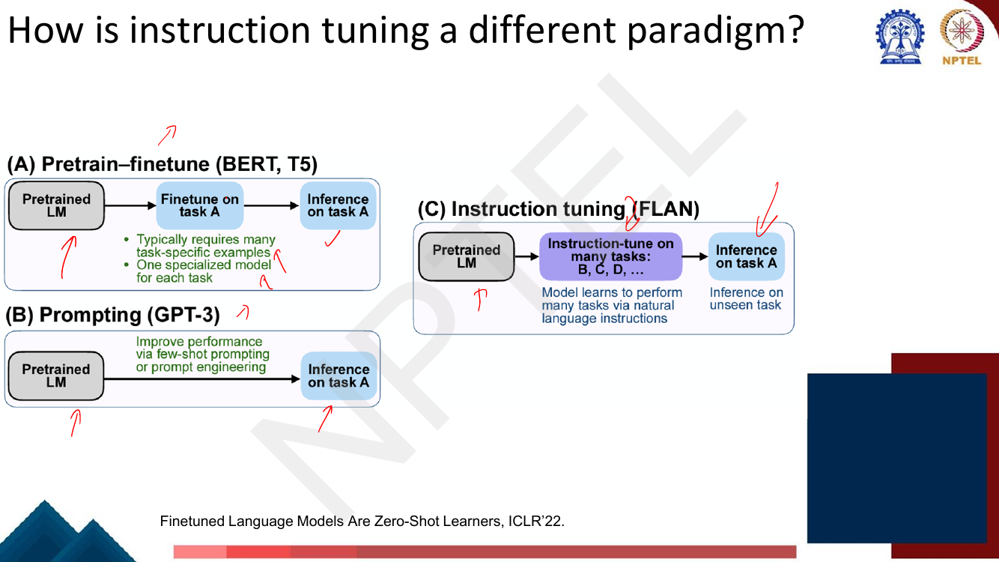
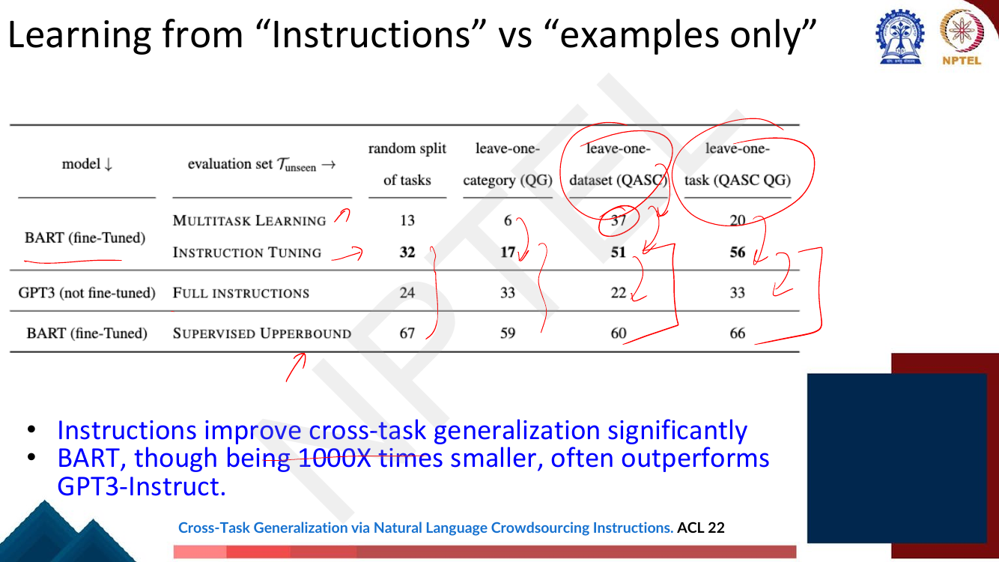
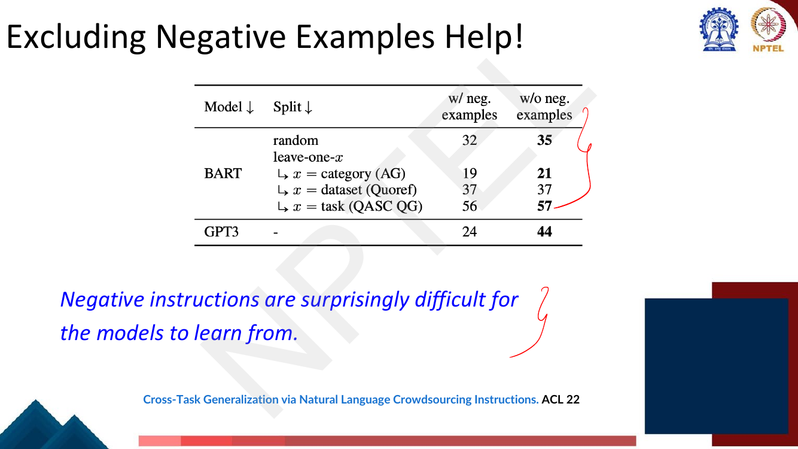
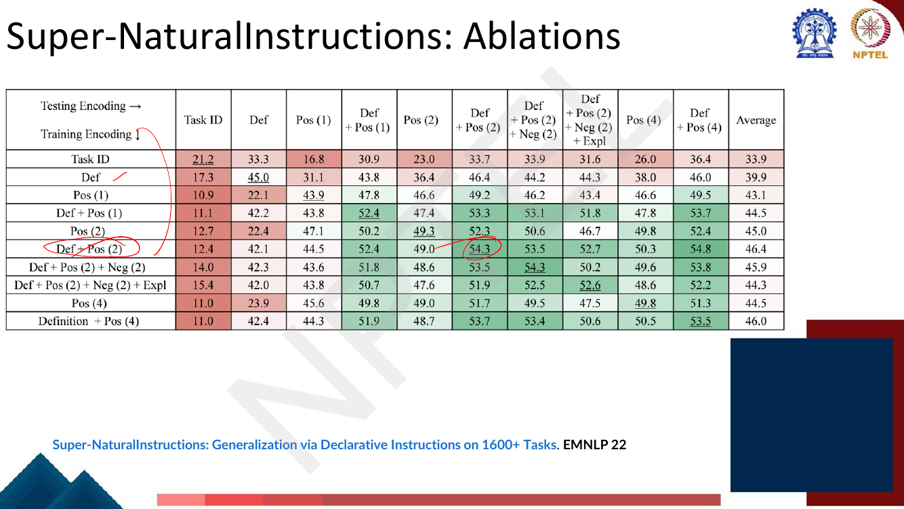
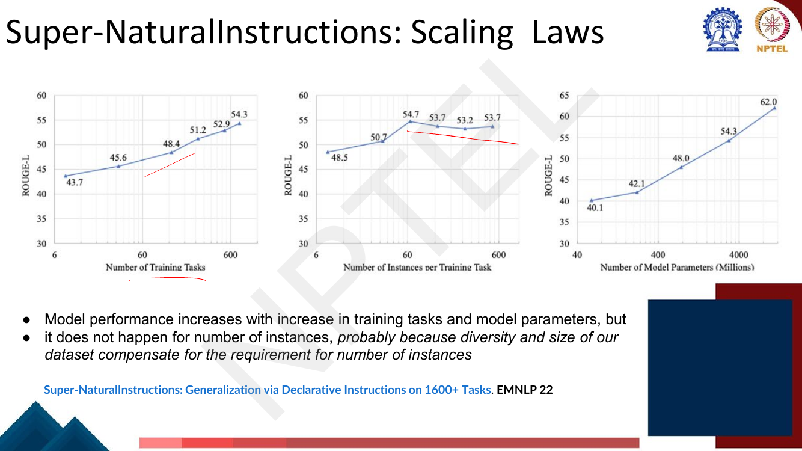

# Lec 36 — Instruction Fine-tuning I

> **Source:** `Week8.pdf` pp. 1–33 · **Week 8** · **Playlist:** Lec 36
> **Prereqs:** [Lec 29 — GPT and Decoder Pretraining](../week-06/29-gpt-decoder-pretraining.md), [Lec 28 — Span Tasks, T5, BART](../week-06/28-span-tasks-t5-bart.md)
> **Feeds into:** [Lec 37 — Instruction Fine-tuning II](37-instruction-finetuning-2.md), [Lec 38 — RLHF I](38-rlhf-1.md), [Lec 41 — Prompting I](../week-09/41-prompting-1.md)

## Why this lecture exists

[Lec 29](../week-06/29-gpt-decoder-pretraining.md) left you with GPT-3: a 175-billion-parameter model
trained to predict the next token, which you steer by writing a prompt. What that lecture never said
is that the thing you get out of pretraining is **not an assistant**. It is a text continuer. Ask it
to explain the moon landing to a six-year-old and it will cheerfully produce four more questions,
because on web text a question is more often followed by another question than by an answer. The model
is doing exactly what it was trained to do; what it was trained to do is not what you want.

This lecture names that gap — **alignment** — and gives the first and cheapest repair:
collect `(instruction, output)` pairs across hundreds of tasks and keep training the model on them with
the ordinary language-modelling loss. Nothing about the architecture or the objective changes. Only
the data changes, and the behaviour that falls out is "follow instructions".

## The ideas

### The paradigm you are leaving behind

The deck opens by reminding you where you are. **Pretrain–finetune** ([Lec 26](../week-06/26-pretraining-and-elmo.md),
[Lec 27](../week-06/27-bert-masked-lm.md)) is two steps: pretrain on language modelling over lots of
text to learn general things, then finetune on *your* task with not many labels. Pretraining, the slide
says, works "by serving as parameter initialization".

That recipe has a structural cost that the slides make you feel rather than state: **you get one
specialised model per task**. Sentiment needs its own weights; question answering needs its own
weights. A model supervised to answer questions cannot do classification at all — not badly, but *at
all*, because its output head has the wrong shape and its training distribution has the wrong form.

### Language modelling ≠ following human instructions

This is the thesis of the whole week, and the deck gives it two pages with the same prompt.


*Fig. — The PROMPT is `Explain the moon landing to a 6 year old in a few sentences.` GPT-3's COMPLETION is four more prompts: "Explain the theory of gravity to a 6 year old.", "Explain the theory of relativity to a 6 year old in a few sentences.", "Explain the big bang theory to a 6 year old.", "Explain evolution to a 6 year old." Notice it is not wrong — it is a *plausible continuation* of a document that begins with a list of instructions. Page 4 of Week8.pdf.*

The next page shows what a human writes for the same prompt: "A giant rocket ship blasted off from
Earth carrying astronauts to the moon…". Same input, completely different notion of what the input
*was for*. The deck's one-line summary, from Ouyang et al. 2022: **language models are not aligned with
user intents.**

A second, sharper failure follows. The deck calls it **Language Modeling ≠ Incorporating Human Values**.


*Fig. — The prompt contains an explicit ethical instruction and GPT-3 ignores it, completing with "Adam". The human answer is "neither as we don't know much about their background or experience." Note what makes this different from the moon-landing case: there the model missed the *intent*; here it read an instruction and failed to *act on* it. Page 6, citing Zhao et al. 2021, "Ethical-Advice Taker".*

So there are two distinct misalignments and the deck separates them deliberately:

| Failure | What goes wrong | Deck's citation |
|---|---|---|
| Not aligned with **user intents** | the model continues the prompt instead of obeying it | Ouyang et al. 2022 |
| Not aligned with **human values** | the model obeys the surface task while violating a stated constraint | Zhao et al. 2021 |

### "Alignment" with human intents, defined


*Fig. — Memorise the triple verbatim: **helpful, honest, and harmless**. The second bullet matters too — the definition is not specific to language and applies to other modalities. Page 8.*

**Alignment**, as this course defines it: an AI system is *aligned* if it is **helpful, honest, and
harmless**. The deck attributes this to "Askell et al. 2020" in the body text while the citation line
reads *A General Language Assistant as a Laboratory for Alignment, 2021* — the paper is 2021; treat
the attribution as the Anthropic HHH paper regardless of the year printed.

Keep the three apart, because an MCQ will mix them with neighbouring words:

- **Helpful** — it does what you actually asked.
- **Honest** — it does not assert things it does not believe to be true.
- **Harmless** — it declines to cause harm.

"Harmless" is not "honest" and neither is "accurate". There is no fourth H.

### Where instruction tuning sits: the two-stage alignment recipe

The deck's roadmap page is Karpathy's *State of GPT* pipeline, with two boxes drawn on it.


*Fig. — Read the Dataset row across: pretraining uses raw internet text, "low-quality, large quantity"; supervised finetuning uses ~10K–100K (prompt, response) demonstrations written by contractors, "low quantity, high quality". Read the Algorithm row: **both are "language modeling: predict the next token"**. That identity is the single most examinable fact on this page. Page 10.*

Instruction fine-tuning is the **Supervised Finetuning (SFT)** column: ~10K–100K demonstrations,
1–100 GPUs, days of training, producing an "SFT model" you *can already deploy* (the slide's example
is Vicuna-13B). Reward modelling and reinforcement learning — the RLHF half — are
[Lec 38](38-rlhf-1.md)'s and [Lec 39](39-rlhf-2-ppo.md)'s. The roadmap in one sentence: **instruction
tuning is step 1 of the modern alignment recipe and RLHF is step 2**, and they are sequential, with the
RL policy initialised from the SFT model.

### How humans learn, and why that suggests a different data format

Pages 12–17 run a deliberately homely analogy: a child's arithmetic worksheet reading *"Count on by
tens to add. Then, fill in each blank."* followed by one worked example and two problems.

The deck's dissection of the worksheet:

- **Task instruction** — how to "count", and where to "fill".
- **Very few examples** — only one here.

and then the contrast:

| Typical human learning | Mainstream machine learning |
|---|---|
| Detailed instruction | **No** instructions |
| Very few examples (≤ 10) | Large training sets |
| | Even few-shot learning often uses 100s of examples |

The punchline, drawn as an arrow between the worksheet and a Natural-Instructions task card on page 17:
the worksheet's header maps to the task **Definition**, and its worked example maps to a **positive
example** — "a couple of demonstrations are *optionally* added as a part of the instruction". The
instruction carries the task; the demonstrations are a garnish.

### Basic premise, and why natural language

> **Basic premise (p. 18):** NLP tasks can be described via natural language instructions, such as
> *"Is the sentiment of this movie review positive or negative?"* or *"Translate 'how are you' into Chinese."*


*Fig. — Two sentences, both quotable. The failure: "a model that is supervised to solve questions cannot solve a classification task." The hypothesis: a model "equipped with understanding and reasoning with natural language instructions should be able to generalize to any task that can be defined in terms of natural language." Source line: `github.com/allenai/natural-instructions`. Page 19.*

The argument is worth stating in your own words because it is the load-bearing idea. Under
task-specific supervision, the *task* lives in the weights and in the output head — it is not
something the model can be *told*. Move the task description into the input, as text, and the task
becomes **data**. A model that has learned to read task descriptions has learned a function from
(description, input) to output, and nothing stops you handing it a description it has never seen. That
is the whole generalisation claim: tasks become addressable in the same space the model already
understands.

### How is instruction tuning a different paradigm?


*Fig. — The discriminator is the middle box. (A) finetunes **on task A** then infers on task A. (B) has **no middle box at all** — no weight update, just few-shot prompting. (C) instruction-tunes on **tasks B, C, D, …** and then infers on **task A, which is unseen**. Page 20, after "Finetuned Language Models Are Zero-Shot Learners", ICLR'22.*

Put the three side by side — this table is the chapter's centrepiece:

| | **(A) Pretrain–finetune** (BERT, T5) | **(B) Prompting** (GPT-3) | **(C) Instruction tuning** (FLAN) |
|---|---|---|---|
| Weights updated? | yes, per task | **no** | yes, **once**, across many tasks |
| Trained on | task A | nothing extra | tasks B, C, D, … (**not** A) |
| Evaluated on | task A | task A | task A — **unseen** |
| What you need | many task-specific labelled examples | a prompt, and few-shot demos | many *tasks*, each with instructions + some instances |
| What you get | one specialised model **per task** | one general model, no adaptation | **one** model that attempts arbitrary new tasks |
| Cost at a new task | relabel + retrain | zero | zero |
| Deck's own caption | "typically requires many task-specific examples; one specialized model for each task" | "improve performance via few-shot prompting or prompt engineering" | "model learns to perform many tasks via natural language instructions" |

Two readings of (C) that both matter. Against (A): you stop training a model *per task* and start
training the *behaviour* of following instructions. Against (B): prompting leaves the weights alone and
therefore cannot fix a model that was never taught that an instruction is to be obeyed; instruction
tuning changes the weights so that prompting works far better afterwards — see
[Lec 41](../week-09/41-prompting-1.md).

### Representing instructions: the instruction schema

The deck gives the schema a page, and the exact field list is MCQ bait.


*Fig. — Count the sub-fields carefully. The **positive** example has three (Input, Output, Explanation); the **negative** example has **four** — it adds **Suggestion**. Note also the three nested counters printed at the box edges: "# of examples for task", "# of task instances", "# of tasks". Page 21, from Mishra, Khashabi, Baral, Hajishirzi, *Cross-Task Generalization via Natural Language Crowdsourcing Instructions*, ACL 22.*

| Block | Fields |
|---|---|
| **Instructions** | Title · Definition · Things to Avoid · Emphasize/Caution |
| **Examples — positive** | Input · Output · Explanation |
| **Examples — negative** | Input · Output · Explanation · **Suggestion** |
| **Prompt message** | the short imperative prepended to each instance |
| **Input/outputs** (one per instance) | Input · Output |

And the three counts that nest inside one another: **# of examples for task** ⊂ one task, **# of task
instances** ⊂ one task, **# of tasks** ⊂ the dataset. The instruction block is written **once per
task**; the input/output block repeats **per instance**. That asymmetry is the whole economics of the
format, and it is what the deck means on page 22 by *"instructions remain common across instances"*.


*Fig. — Read the negative example: input "He spent two hours on his homework.", output "How long did he do his homework?", reason "We DO NOT want this question as the answer is directly mentioned in the text." A negative example is an input paired with a **wrong** output plus the reason it is wrong — not an input with no output. Page 22.*

### Natural Instructions

The first dataset built in this schema. The deck's statistics page:

| Quantity | Value |
|---|---|
| Tasks | ~61 |
| Instances | ~193k |
| Categories | ~7 |
| Reasoning skills | numerical reasoning, coreference resolution, commonsense reasoning, multihop reasoning |
| Domains | sports, history, news, conversations, geography, NFL games, captions, maths |

The seven categories, with their share of instances from the pie chart: Answer Generation 26.2%,
Question Generation 21.3%, Classification 19.7%, Incorrect Answer Generation 13.1%, Minimal Text
Modification 11.5%, Long Text Generation 4.9%, Verification 3.3%.

### Learning from instructions vs examples only

The deck's first empirical result, and the numbers are specific.


*Fig. — Four evaluation sets across the columns: random split of tasks, leave-one-category (QG), leave-one-dataset (QASC), leave-one-task (QASC QG). The row to compare is MULTITASK LEARNING (examples only) against INSTRUCTION TUNING. Page 24.*

Transcribed exactly:

| Model | Evaluation set $\mathcal{T}_{\text{unseen}}$ | random split | leave-one-category (QG) | leave-one-dataset (QASC) | leave-one-task (QASC QG) |
|---|---|---|---|---|---|
| BART (fine-tuned) | Multitask Learning | 13 | 6 | 37 | 20 |
| BART (fine-tuned) | **Instruction Tuning** | **32** | **17** | **51** | **56** |
| GPT-3 (not fine-tuned) | Full instructions | 24 | 33 | 22 | 33 |
| BART (fine-tuned) | Supervised Upperbound | 67 | 59 | 60 | 66 |

The deck's two conclusions:

- **Instructions improve cross-task generalization significantly.** Every column improves, by between
  +14 and +36 points.
- **BART, though being 1000× smaller, often outperforms GPT3-Instruct.** "Often", not always — check
  the leave-one-category column, where GPT-3's 33 beats BART's 17. Three columns out of four.

"Multitask Learning" here means trained on the same tasks' *instances* with **no instruction text** —
examples only. That is the controlled comparison: same tasks, same model, instructions on or off.

### Excluding negative examples helps


*Fig. — The counterintuitive result: removing a schema field makes the model better. Note that the splits here are **not** the same choices as page 24 — leave-one-category is AG, not QG; leave-one-dataset is Quoref, not QASC. Page 25.*

| Model | Split | w/ neg. examples | w/o neg. examples |
|---|---|---|---|
| BART | random | 32 | **35** |
| BART | leave-one-category (AG) | 19 | **21** |
| BART | leave-one-dataset (Quoref) | 37 | 37 |
| BART | leave-one-task (QASC QG) | 56 | **57** |
| GPT-3 | – | 24 | **44** |

The deck's gloss: *"Negative instructions are surprisingly difficult for the models to learn from."*
The mechanism to carry into an exam: the training objective is next-token prediction over the whole
sequence, so a negative example's **wrong** output appears in the context as text to be modelled, and
the model has no architectural way to know that this one stretch of tokens is meant to be avoided
rather than imitated. Negation is cheap for a human reader and expensive for a conditional
distribution. Note also that GPT-3 — which is *not* fine-tuned, so it only ever sees the negatives at
inference time in its prompt — is hurt far more (24 → 44 on removal) than any fine-tuned BART.

### Scaling with the number of tasks

Page 26 plots cross-task generalisation against the **number of observed tasks**, with four curves:
No Instruction, Prompt+definition, Prompt+pos. examp., Full Instruction. Two things to read off it.
First, the Full Instruction curve rises steepest (roughly 19 → 41 ROUGE-L as training tasks go from
~5 to ~55) while No Instruction is nearly flat (~16 → ~19). Second, Prompt+pos.examp. *peaks and then
declines* — more tasks do not help if all you give the model is demonstrations. The deck's bullet:
*"Cross-task generalization with Instruction improves with increase in number of observed tasks."*

> **Read the title carefully.** The deck calls pages 26 and 31 "Scaling Laws", but these are
> **instruction-tuning *data* scaling laws** — performance versus *number of tasks* and *number of
> instances per task*. They are **not** the Kaplan/Chinchilla **compute** scaling laws (loss versus
> parameters, data tokens and FLOPs), which [Lec 51](../week-11/51-scaling-laws.md) owns. Different
> axes, different paper, different claim. An exam that says "scaling laws" in a Week-8 context means
> *tasks*; in a Week-11 context it means *compute*.

### Super-NaturalInstructions

The scaled-up successor, also called Natural Instructions v2:

| Quantity | Value |
|---|---|
| Tasks | **1600+** |
| Categories | **73** |
| Domains | **74** |
| Languages | **43** |

The size-and-diversity page (p. 27) plots task-category bubbles for five datasets side by side:
Sup-NatInst (this work), NatInst, PromptSource (T0 subset), FLAN, and InstructGPT. Sup-NatInst's bubble
cloud is visibly an order of magnitude more varied — its largest categories are Translation, Question
Answering, Question Generation, Program Execution, Toxic Language Detection, Text Categorization — while
FLAN's and InstructGPT's are a handful of coarse buckets (Summarization, Translation, Generation,
Brainstorming, Chat). FLAN and InstructGPT's own data recipes are [Lec 37](37-instruction-finetuning-2.md)'s.

The subtitle on every one of these slides is the claim to remember: **generalization via declarative
instructions**. *Declarative* means you state **what** the task is, not **how** to compute it — the
Definition field is a description, not a procedure. Page 28 shows one filled-in task card
(`task1391_winogrande_coreference_resolution`) in exactly the schema above, ending with an Instance
whose "Valid Output" is `["A"]` — the lecturer's annotation on that line reads *"Next Token
Prediction"*, which is the point: the whole card is serialised into one string and the model is trained
to emit the next tokens. Nothing else changes.

**Models trained.** Two, both built by instruction fine-tuning an existing encoder-decoder from
[Lec 28](../week-06/28-span-tasks-t5-bart.md):

- **Tk-INSTRUCT** — instruction fine-tuning **T5** (11B).
- **mTk-INSTRUCT** — instruction fine-tuning **mT5** (13B), for the cross-lingual setting.

Page 29's results table, transcribed:

| Group | Method | En | X-lingual |
|---|---|---|---|
| Heuristic baselines | Copying Instance Input | 14.2 | 5.4 |
| Heuristic baselines | Copying Demo Output | 28.5 | 50.3 |
| Pretrained LMs | T5-LM (11B) | 30.2 | – |
| Pretrained LMs | GPT-3 (175B) | 45.0 | 51.3 |
| Instruction-tuned | T0 (11B) | 32.3 | – |
| Instruction-tuned | InstructGPT (175B) | 52.1 | 52.8 |
| Instruction-tuned | **Tk-INSTRUCT (ours, 11B)** | **62.0** | – |
| Instruction-tuned | **mTk-INSTRUCT (ours, 13B)** | 57.1 | **66.1** |
| Upper bound (est.) | Supervised Training | 74.3 | 94.0 |

The headline: an 11B instruction-tuned model beats a 175B one (62.0 vs 52.1), a **16×** parameter
difference going the wrong way for the big model. And the supervised upper bound is still 12.3 points
clear, so instruction tuning closes most but not all of the gap.

**Ablations.** Page 30 is a 10 × 10 grid crossing the **training encoding** (rows) with the **testing
encoding** (columns), where an encoding is a choice of which schema fields to include: Task ID, Def,
Pos(1), Pos(2), Pos(4), Neg(2), Expl, and combinations.


*Fig. — Read down the Average column: Task ID 33.9, Def 39.9, Pos(1) 43.1, Def+Pos(1) 44.5, Pos(2) 45.0, **Def+Pos(2) 46.4** (the best), Def+Pos(2)+Neg(2) 45.9, Def+Pos(2)+Neg(2)+Expl 44.3, Pos(4) 44.5, Def+Pos(4) 46.0. The best single cell is 54.8. Page 30.*

Three conclusions the grid supports:

1. **Definition + two positive examples is the sweet spot** (row average 46.4). Definition alone is
   39.9; two positive examples alone is 45.0; together, more than either.
2. **Adding negatives hurts** (46.4 → 45.9) and **adding explanations hurts more** (→ 44.3). This
   independently reproduces the Natural Instructions finding of page 25 at 1600-task scale.
3. **More positive examples do not help past two**: Pos(4) averages 44.5 against Pos(2)'s 45.0, and
   Def+Pos(4) 46.0 against Def+Pos(2)'s 46.4. The returns to demonstrations run out almost immediately —
   which is what you would expect if the *instruction* is doing the work.

Also note the Task ID row and column: training the model to key off an opaque task identifier gives
the worst column scores (10.9–21.2) — the model learns nothing transferable from a name.

**Scaling laws (instruction-tuning data, not compute).**


*Fig. — Left panel rises steadily across roughly six doublings of task count. Middle panel **peaks at 54.7 around 64 instances per task and then flattens or slightly declines** (53.7, 53.2, 53.7). Right panel climbs 40.1 → 62.0 across T5-small to T5-11B. Page 31.*

The deck's own bullets:

- Model performance increases with increase in **training tasks** and **model parameters**, but
- it does **not** happen for **number of instances**, "probably because diversity and size of our
  dataset compensate for the requirement for number of instances".

The practical rule: **spend your annotation budget on more tasks, not more examples per task.** It is
the opposite of what classical supervised learning teaches you, and that reversal is a likely exam
question.

### Where this goes next

[Lec 37](37-instruction-finetuning-2.md) takes the obvious next step — if more tasks is what helps, how
do you get more tasks cheaply? (Flan, Dolly, Self-Instruct, synthetic instruction data.)
[Lec 38](38-rlhf-1.md) takes the other step: supervised demonstrations only teach the model what a good
answer *looks like*, never which of two answers is *better*, so you need preference data and a reward
model; [Lec 40](40-dpo.md) later removes the RL. And because full instruction tuning of an 11B model is
expensive, in practice you do it with LoRA or another parameter-efficient method —
[Lec 46](../week-10/46-peft-adapters-prefix.md) and [Lec 47](../week-10/47-lora-and-variants.md).

## Worked numericals

**No "Try this problem" page exists in `Week8.pdf` pp. 1–33**, and the re-swept exercise table lists
none for Lec 36 — confirmed by opening all 33 rendered pages. The only in-deck questions are the two
arithmetic blanks on the child's worksheet reproduced on pages 12–17 (`52 + 20 = 72`, `65 + 30 = 95`,
both answered in the slide's own handwriting); they are a pedagogical analogy for "instruction + one
example", not a lecturer's exercise. The numericals below are therefore built from the deck's own
tables, which is where this conceptual lecture's examinable arithmetic actually lives.

### N1. The instruction-tuning data budget, and which axis to spend it on
**Given:** Natural Instructions: $T = 61$ tasks, $193{,}000$ instances, 7 categories. Super-NaturalInstructions:
$T = 1600$ tasks. The deck's page-31 left panel reads $43.7 \to 54.3$ ROUGE-L over roughly six doublings
of task count; the middle panel reads $48.5 \to 54.7 \to 53.7$ over instances per task.
**Find:** instances per task, the Super-NI dataset size at a 100-instance cap, and the marginal value
of doubling each axis.

1. Natural Instructions, instances per task: $193{,}000 / 61 = \mathbf{3163.9}$ — about 3.2k instances
   per task on average.
2. Super-NaturalInstructions with a cap of $n = 100$ instances per task (the cap is the paper's, not
   printed on the deck): dataset size $= T \times n = 1600 \times 100 = \mathbf{160{,}000}$ instances.
3. So Super-NI has **26× more tasks** ($1600/61 = 26.2$) while being **smaller in raw instances**
   ($160{,}000$ vs $193{,}000$, a factor of $0.83$). Diversity went up; volume went down.
4. Marginal value of tasks: the left panel spans 8 → 512 tasks, which is $\log_2(512/8) = 6$
   doublings, for a gain of $54.3 - 43.7 = 10.6$ ROUGE-L. Per doubling: $10.6 / 6 = \mathbf{1.77}$ points.
5. Marginal value of instances: the middle panel gains $54.7 - 48.5 = 6.2$ from 8 to 64 instances
   (3 doublings, $2.07$/doubling) and then $53.7 - 54.7 = \mathbf{-1.0}$ over the next three doublings.
   Past ~64 instances per task the marginal value is **zero or negative**.

**Answer:** ~3164 instances/task for Natural Instructions; 160,000 instances for Super-NI at a
100-instance cap; **+1.77 ROUGE-L per doubling of tasks versus ≈0 per doubling of instances beyond 64.**
This is the arithmetic behind "spend the budget on more tasks".

### N2. Generalization gain from instructions vs examples only (deck p. 24)
**Given:** the page-24 table. BART Multitask Learning (examples only) vs BART Instruction Tuning, and
the supervised upper bound, on four splits.
**Find:** absolute gain, relative gain, and the fraction of the gap to the upper bound that is closed.

| Split | MTL | IT | $\Delta$ | $\Delta/\text{MTL}$ | Upper | gap closed $=\frac{\text{IT}-\text{MTL}}{\text{Upper}-\text{MTL}}$ |
|---|---|---|---|---|---|---|
| random split | 13 | 32 | $+19$ | $19/13 = 146.2\%$ | 67 | $19/54 = 35.2\%$ |
| leave-one-category (QG) | 6 | 17 | $+11$ | $11/6 = 183.3\%$ | 59 | $11/53 = 20.8\%$ |
| leave-one-dataset (QASC) | 37 | 51 | $+14$ | $14/37 = 37.8\%$ | 60 | $14/23 = 60.9\%$ |
| leave-one-task (QASC QG) | 20 | 56 | $+36$ | $36/20 = 180.0\%$ | 66 | $36/46 = 78.3\%$ |

1. Mean absolute gain: $(19 + 11 + 14 + 36)/4 = 80/4 = \mathbf{20.0}$ points.
2. The *hardest* split for instructions is leave-one-category: largest relative gain (183%) but the
   smallest gap closure (20.8%) and the only column where GPT-3 wins (33 > 17). Holding out an entire
   *category* removes the most information.
3. The *easiest* is leave-one-task: 78.3% of the headroom closed, because the other tasks in the same
   dataset and category are still in training.
4. Check the deck's "often outperforms GPT3-Instruct": BART-IT beats GPT-3 at $32>24$, $51>22$,
   $56>33$ and loses at $17<33$ — **3 of 4**, so "often" is exact, "always" is wrong.

**Answer:** mean absolute gain **+20.0 ROUGE-L**; gap to the supervised upper bound closed by
**20.8%–78.3%** depending on how far the held-out tasks are from training.

### N3. The negative-examples ablation (deck p. 25)
**Given:** the page-25 table, w/ negative examples vs w/o.
**Find:** per-split absolute and relative change, and the BART mean.

1. BART, random: $35 - 32 = +3$; relative $3/32 = \mathbf{+9.4\%}$.
2. BART, leave-one-category (AG): $21 - 19 = +2$; relative $2/19 = \mathbf{+10.5\%}$.
3. BART, leave-one-dataset (Quoref): $37 - 37 = 0$; relative $\mathbf{0\%}$.
4. BART, leave-one-task (QASC QG): $57 - 56 = +1$; relative $1/56 = \mathbf{+1.8\%}$.
5. BART mean absolute change: $(3 + 2 + 0 + 1)/4 = 6/4 = \mathbf{+1.5}$ points. Mean relative:
   $(9.4 + 10.5 + 0 + 1.8)/4 = 21.7/4 = \mathbf{+5.4\%}$.
6. GPT-3: $44 - 24 = +20$; relative $20/24 = \mathbf{+83.3\%}$ — **13× the BART mean absolute gain.**
7. Direction check: removal helps or is neutral in **5 of 5 rows**. There is no row where negatives help.

**Answer:** removing negative examples gains BART **+1.5 points on average (+5.4%)** and GPT-3
**+20 points (+83.3%)**. A model that was never fine-tuned on the format suffers most from a field it
cannot interpret.

### N4. Held-out task evaluation arithmetic
**Given:** Natural Instructions: 61 tasks in 7 categories, 193k instances; category instance shares
from the pie chart (Answer Generation 26.2% is the largest).
**Find:** how many unseen tasks each evaluation protocol measures on, and what each measures.

1. **Random split of tasks.** The deck does not print the split; take a 80/20 one, i.e.
   $T_{\text{train}} = 49$, $T_{\text{test}} = 61 - 49 = \mathbf{12}$. The model is scored on 12 tasks
   it has never seen. Measures: generalisation to a *new task*, possibly from a familiar category.
2. **Leave-one-category-out.** Average tasks per category $= 61/7 = \mathbf{8.71}$, so holding out one
   category removes **≈9 tasks** and trains on **≈52**. Measures: generalisation to a *new kind of
   task* — the strictest of the three, which is why N2's gap closure there was only 20.8%.
3. Instances available when the largest category is held out: train $= 193{,}000 \times (1 - 0.262)
   = 193{,}000 \times 0.738 = \mathbf{142{,}434}$; test $= 193{,}000 \times 0.262 = \mathbf{50{,}566}$.
4. **Leave-one-dataset / leave-one-task.** Removes 1 dataset's tasks or exactly $\mathbf{1}$ task.
   Measures: generalisation to a *new phrasing of a familiar task*. Easiest, hence 60.9% and 78.3%.
5. Sanity: the three protocols form a ladder of increasing distance from training —
   task ⊂ dataset ⊂ category — and the deck's gap-closure numbers fall monotonically along it
   (78.3% → 60.9% → 20.8%). **That monotone ordering is the examinable fact.**

**Answer:** ≈12 unseen tasks under a random split, ≈9 under leave-one-category, 1 under
leave-one-task; and the measured quantity hardens from "new phrasing" to "new task type" as you go.

### N5. Labelled-example and storage cost for $k$ tasks
**Given:** $k = 1600$ tasks. Per-task fine-tuning: $m = 1000$ labelled examples and one model copy per
task. Instruction tuning: $n = 100$ instances per task plus one instruction schema per task, and one
model. Model: BART-base, 140M parameters, stored at fp16 (2 bytes/parameter).
**Find:** labelled examples and storage under each regime, and the cost of a $(k{+}1)$-th task.

1. Per-task fine-tuning, labelled examples: $k \times m = 1600 \times 1000 = \mathbf{1{,}600{,}000}$.
2. Per-task fine-tuning, parameters stored: $1600 \times 140\times10^6 = 2.24\times10^{11}$ parameters
   $= 2.24\times10^{11} \times 2\ \text{bytes} = 4.48\times10^{11}$ bytes $= \mathbf{448\ \text{GB}}$.
3. Instruction tuning, labelled examples: $k \times n = 1600 \times 100 = \mathbf{160{,}000}$, plus
   1600 instruction schemas (written once per task, not per instance).
4. Instruction tuning, parameters stored: $140\times10^6 \times 2 = 2.8\times10^8$ bytes
   $= \mathbf{0.28\ \text{GB}}$.
5. Ratios: $1{,}600{,}000 / 160{,}000 = \mathbf{10\times}$ fewer labelled examples;
   $448 / 0.28 = \mathbf{1600\times}$ less storage (exactly $k$, as it must be).
6. Task 1601: per-task fine-tuning needs another 1000 labels, another training run and another 0.28 GB.
   Instruction tuning needs **one sentence of English** and **zero** training — that is what
   "generalization to unseen tasks" buys you.

**Answer:** $1.6$M examples and 448 GB versus $160$k examples and 0.28 GB — **10× the data and
$k$ = 1600× the storage**, with a marginal cost per new task of (1000 labels + a training run) versus
(one instruction).

### N6. Checking the deck's "1000× smaller" claim
**Given:** the deck's page 24 says "BART, though being 1000X times smaller, often outperforms
GPT3-Instruct." GPT-3 is 175B parameters ([Lec 29](../week-06/29-gpt-decoder-pretraining.md)).
BART-base is 139M; BART-large is 406M.
**Find:** the actual ratio, and whether the claim is sound.

1. Against BART-base: $175\times10^9 / 139\times10^6 = \mathbf{1259}$.
2. Against BART-large: $175\times10^9 / 406\times10^6 = \mathbf{431}$.
3. So the claim is accurate to within 26% **if the BART is base** and overstates by ~2.3× if it is
   large. The ACL'22 paper used BART-base, so read "1000×" as base.
4. Cross-check with the Super-NI result: Tk-INSTRUCT 11B scores 62.0 against InstructGPT 175B's 52.1 —
   ratio $175/11 = \mathbf{15.9\times}$ smaller, +9.9 points better.

**Answer:** **1259×** for BART-base (the deck's "1000×" is right to an order of magnitude), 431× for
BART-large. The general lesson the deck wants: **instruction data substitutes for parameters**, and in
these two experiments it is worth between 16× and 1000× in model size.

## Code

A short script that builds an instruction-schema training example from a task definition plus positive
and negative examples, prints the flat string the model actually sees, and prices each of the deck's
page-30 encodings in tokens. The point of the second half is that the instruction, not the data,
dominates the sequence — which is exactly why the schema is written once per task.

```python
"""Build a Natural-Instructions instruction-schema prompt; price each encoding."""

task = {                      # the seven schema slots the deck's page 21 draws
    "title":      "Question generation about event duration",
    "definition": ("In this task, you are given a sentence. Write a question that "
                   "involves commonsense understanding of 'event duration'."),
    "emphasis":   "The written questions are not required to have a single correct answer.",
    "avoid":      "Do not create questions whose answer is explicitly mentioned in the text.",
    "prompt":     "Ask a question on 'event duration' based on the provided sentence.",
    "positive":  [{"input": "Jack played basketball after school, after which he was very tired.",
                   "output": "How long did Jack play basketball?",
                   "explanation": "The question asks about the duration of an event."}],
    "negative":  [{"input": "He spent two hours on his homework.",
                   "output": "How long did he do his homework?",
                   "explanation": "The answer is directly mentioned in the text, so we do NOT want it.",
                   "suggestion": "-"}],
}

def render(task, instance_input, fields=("title","definition","emphasis","avoid","prompt"),
           n_pos=1, n_neg=1):
    """Flatten (instruction schema, instance input) into the one string the LM is trained on."""
    label = {"title": "Title", "definition": "Definition", "emphasis": "Emphasis & Caution",
             "avoid": "Things to avoid", "prompt": "Prompt"}
    parts = [f"{label[f]}: {task[f]}" for f in fields]
    for ex in task["positive"][:n_pos]:          # positive examples have NO 'suggestion' slot
        parts.append("Positive Example --\nInput: {input}\nOutput: {output}\n"
                     "Explanation: {explanation}".format(**ex))
    for ex in task["negative"][:n_neg]:          # negative examples add 'suggestion'
        parts.append("Negative Example --\nInput: {input}\nOutput: {output}\n"
                     "Explanation: {explanation}\nSuggestion: {suggestion}".format(**ex))
    parts.append(f"Input: {instance_input}\nOutput:")   # the only piece that varies per instance
    return "\n\n".join(parts)

inst = "Still, Preetam vows to marry Nandini if she meets him again."
print(render(task, inst))

n = lambda s: len(s.split())                      # crude whitespace token count
print("\n--- cost per instance, by encoding (cf. deck p. 30) ---")
cfg = [("Task ID only",        dict(fields=("title",),            n_pos=0, n_neg=0)),
       ("Def",                 dict(fields=("definition",),       n_pos=0, n_neg=0)),
       ("Def + Pos(1)",        dict(fields=("definition",),       n_pos=1, n_neg=0)),
       ("Def + Pos(1) + Neg",  dict(fields=("definition",),       n_pos=1, n_neg=1)),
       ("Full instruction",    dict(                              n_pos=1, n_neg=1))]
for name, kw in cfg:
    print(f"{name:22s} {n(render(task, inst, **kw)):4d} tokens")
print(f"{'instance input alone':22s} {n(inst):4d} tokens"
      "   <- the instruction, not the data, dominates the sequence")
```

Printed output:

```
Title: Question generation about event duration

Definition: In this task, you are given a sentence. Write a question that involves commonsense understanding of 'event duration'.

Emphasis & Caution: The written questions are not required to have a single correct answer.

Things to avoid: Do not create questions whose answer is explicitly mentioned in the text.

Prompt: Ask a question on 'event duration' based on the provided sentence.

Positive Example --
Input: Jack played basketball after school, after which he was very tired.
Output: How long did Jack play basketball?
Explanation: The question asks about the duration of an event.

Negative Example --
Input: He spent two hours on his homework.
Output: How long did he do his homework?
Explanation: The answer is directly mentioned in the text, so we do NOT want it.
Suggestion: -

Input: Still, Preetam vows to marry Nandini if she meets him again.
Output:

--- cost per instance, by encoding (cf. deck p. 30) ---
Task ID only             19 tokens
Def                      32 tokens
Def + Pos(1)             64 tokens
Def + Pos(1) + Neg      100 tokens
Full instruction        148 tokens
instance input alone     11 tokens   <- the instruction, not the data, dominates the sequence
```

Two things to take from the output. First, the **training target is only the text after the final
`Output:`** — everything above it is context, and the loss is the ordinary next-token cross-entropy
([Lec 24](../week-05/24-decoder-and-transformer-lm.md)). Nothing in instruction tuning is a new
objective. Second, the full instruction is $148/11 = 13.5\times$ longer than the instance it wraps,
and adding the negative example alone costs 36 tokens for a field the ablations say *hurts*.

## Exam pack

### Must-memorise

| Item | Exactly this |
|---|---|
| Alignment (Askell et al.) | AI is "aligned" if it is **helpful, honest, and harmless** — and the definition is not tied to language |
| The failure the lecture opens with | **Language Modeling ≠ Following Human Instructions**; LMs are not aligned with **user intents** (Ouyang et al. 2022) |
| The second failure | **Language Modeling ≠ Incorporating Human Values** (Zhao et al. 2021) |
| Deck's PROMPT example | *"Explain the moon landing to a 6 year old in a few sentences."* → GPT-3 emits **four more instructions**, not an answer |
| Instruction fine-tuning | supervised fine-tuning on **(instruction, output)** pairs across **many tasks**, with the **same next-token objective** |
| Alignment recipe | **step 1 = instruction tuning (SFT); step 2 = RLHF** (reward model + RL), initialised from the SFT model |
| Basic premise | NLP tasks can be described via natural language instructions |
| Why natural language | task-specific supervision "can't generalize to unseen tasks"; a model that understands instructions "should be able to generalize to any task that can be defined in terms of natural language" |
| Three paradigms | **(A)** pretrain–finetune: train on A, infer on A · **(B)** prompting: no weight update · **(C)** instruction tuning: train on B,C,D…, infer on **unseen** A |
| Instruction schema — Instructions block | **Title · Definition · Things to Avoid · Emphasize/Caution** |
| Schema — positive example | Input · Output · **Explanation** (3 fields) |
| Schema — negative example | Input · Output · Explanation · **Suggestion** (4 fields) |
| Schema — the rest | Prompt message; Input/outputs (Input, Output) per instance; counters: # examples for task, # task instances, # tasks |
| Instructions are written | **once per task**; input/output repeats **per instance** |
| Natural Instructions finding 1 | instructions improve cross-task generalization significantly |
| Natural Instructions finding 2 | **excluding negative examples helps** — "negative instructions are surprisingly difficult for the models to learn from" |
| Super-NI subtitle | **Generalization via *declarative* instructions** on 1600+ tasks |
| Models trained | **Tk-INSTRUCT** = instruction-tuned **T5**; **mTk-INSTRUCT** = instruction-tuned **mT5** |
| Super-NI data scaling | performance ↑ with **training tasks** and **model parameters**; **NOT** with instances per task |
| The scaling-law warning | Lec 36's "Scaling Laws" = **instruction-tuning data** scaling. Kaplan/Chinchilla **compute** scaling is [Lec 51](../week-11/51-scaling-laws.md) |

### Numbers worth knowing

| Quantity | Value |
|---|---|
| Natural Instructions | **~61 tasks, ~193k instances, ~7 categories** |
| NatInst category shares | Answer Gen 26.2% · Question Gen 21.3% · Classification 19.7% · Incorrect Answer Gen 13.1% · Minimal Text Modification 11.5% · Long Text Gen 4.9% · Verification 3.3% |
| Super-NaturalInstructions | **1600+ tasks, 73 categories, 74 domains, 43 languages** |
| p.24 — BART random split | Multitask Learning **13** → Instruction Tuning **32**; GPT-3 24; upper bound 67 |
| p.24 — leave-one-category (QG) | **6 → 17**; GPT-3 **33**; upper bound 59 |
| p.24 — leave-one-dataset (QASC) | **37 → 51**; GPT-3 22; upper bound 60 |
| p.24 — leave-one-task (QASC QG) | **20 → 56**; GPT-3 33; upper bound 66 |
| p.24 — size claim | BART is "**1000× smaller**" than GPT-3 and *often* (3 of 4 columns) outperforms it |
| p.25 — negatives removed, BART | random 32→**35** · category (AG) 19→**21** · dataset (Quoref) 37→**37** · task (QASC QG) 56→**57** |
| p.25 — negatives removed, GPT-3 | **24 → 44** |
| p.29 — Tk-INSTRUCT (11B) | **62.0** En |
| p.29 — mTk-INSTRUCT (13B) | 57.1 En, **66.1** X-lingual |
| p.29 — InstructGPT (175B) | 52.1 En, 52.8 X-lingual |
| p.29 — GPT-3 (175B), not tuned | 45.0 En, 51.3 X-lingual |
| p.29 — T0 (11B) / T5-LM (11B) | 32.3 / 30.2 En |
| p.29 — supervised upper bound | **74.3** En, **94.0** X-lingual |
| p.29 — heuristic baselines | Copying Instance Input 14.2 / 5.4 · Copying Demo Output 28.5 / 50.3 |
| p.30 — best row average | **Def + Pos(2) = 46.4**; adding Neg(2) → 45.9; adding Expl → 44.3 |
| p.30 — Def alone / Pos(1) alone / Task ID | 39.9 / 43.1 / 33.9 |
| p.31 — task scaling | 43.7 → 54.3 ROUGE-L as training tasks grow ~8 → ~512 |
| p.31 — instance scaling | 48.5 → **54.7 peak (~64 instances)** → 53.7, 53.2, 53.7 — flat |
| p.31 — parameter scaling | 40.1 → 42.1 → 48.0 → 54.3 → **62.0** (T5-small … T5-11B) |
| p.10 — SFT dataset size | **~10K–100K** (prompt, response) demonstrations, 1–100 GPUs, days of training |
| p.10 — RM / RL dataset sizes | 100K–1M comparisons; ~10K–100K prompts |

### Likely MCQ traps

- **"Instruction tuning uses a new loss function."** No. The deck's pipeline page says the algorithm
  for both pretraining and SFT is "language modeling: predict the next token". Only the *data* changes.
- **"Instruction tuning and prompting are the same."** Prompting updates **no weights** (paradigm B);
  instruction tuning updates weights once, across many tasks (paradigm C). See [Lec 41](../week-09/41-prompting-1.md).
- **"Instruction tuning trains on the evaluation task."** The entire point is the opposite: it trains
  on tasks B, C, D, … and is evaluated on **unseen** task A.
- **"The positive example has a Suggestion field."** It does not. Only the **negative** example has
  Suggestion. Positive = Input/Output/Explanation (3); negative = Input/Output/Explanation/Suggestion (4).
- **"Things to Avoid and Emphasize/Caution are the same field."** Two separate fields in the
  Instructions block, alongside Title and Definition.
- **"Adding negative examples improves performance."** The deck's slide is literally titled
  *Excluding Negative Examples Help!* Removing them helps BART a little and GPT-3 a lot.
- **"Lec 36's scaling laws are Kaplan's."** They are **not**. These are instruction-tuning *data*
  scaling curves (tasks, instances per task, model size on a ROUGE-L axis). Kaplan/Chinchilla compute
  scaling is [Lec 51](../week-11/51-scaling-laws.md).
- **"More instances per task always helps."** The deck explicitly says it does not — the middle panel
  of page 31 flattens past ~64 instances per task.
- **"BART always beats GPT-3 in the page-24 table."** *Often*, in 3 of 4 columns. GPT-3 wins the
  leave-one-category column, 33 to 17.
- **"Tk-INSTRUCT is a fine-tuned GPT."** It is instruction-tuned **T5**; mTk-INSTRUCT is **mT5**.
  (T5 is [Lec 28](../week-06/28-span-tasks-t5-bart.md).)
- **"Instruction tuning closes the gap to supervised training."** It does not close it: 62.0 against a
  74.3 supervised upper bound, and 20.8%–78.3% of the gap on Natural Instructions depending on split.
- **"Alignment means accuracy."** Alignment = helpful, honest, **harmless**. A perfectly accurate model
  that answers a harmful request is not aligned.
- **"The moon-landing completion is a hallucination."** It is not false; it is *off-task*. The failure
  is intent, not truth.

### Self-test

1. State Askell et al.'s three-word definition of alignment.
2. What does GPT-3 produce when prompted "Explain the moon landing to a 6 year old in a few sentences"?
3. In the three-paradigm diagram, which paradigm performs **no** weight update, and which infers on an unseen task?
4. List the four fields of the Instructions block of the instruction schema.
5. Which schema field appears in the negative example but **not** the positive example?
6. From the page-24 table: BART's random-split score goes from what to what when instructions are added, and what is the supervised upper bound?
7. The deck says BART is "1000× smaller" than GPT-3 and "often" outperforms it. On how many of the four evaluation columns does BART-IT actually beat GPT-3?
8. By how much does removing negative examples help GPT-3, in absolute and relative terms?
9. Give the three statistics Super-NaturalInstructions reports besides the task count.
10. According to page 31, which two quantities improve performance and which one does not?
11. Why are Lec 36's "scaling laws" not the same thing as Lec 51's?
12. Tk-INSTRUCT is 11B and InstructGPT is 175B. Which scores higher on English, and by how much?

<details><summary>Answers</summary>

1. **Helpful, honest, and harmless.** (Also: the definition is not specific to language.)
2. Four further instructions — "Explain the theory of gravity to a 6 year old.", "…theory of relativity… in a few sentences.", "…the big bang theory…", "Explain evolution to a 6 year old." It continues the document rather than answering.
3. **(B) Prompting (GPT-3)** performs no weight update. **(C) Instruction tuning (FLAN)** infers on an unseen task A after tuning on tasks B, C, D, …
4. **Title, Definition, Things to Avoid, Emphasize/Caution.**
5. **Suggestion.**
6. **13 → 32**, against a supervised upper bound of **67** (so 19 of the 54-point gap, 35.2%, is closed).
7. **Three of four** — 32>24, 51>22, 56>33; it loses the leave-one-category column 17 vs 33.
8. $44 - 24 = +20$ points absolute; $20/24 = +83.3\%$ relative.
9. **73 categories, 74 domains, 43 languages** (on 1600+ tasks).
10. **Number of training tasks** and **number of model parameters** improve performance; **number of instances per training task** does not — the deck attributes this to the dataset's diversity and size compensating.
11. Lec 36's plot *instruction-tuning data* on the x-axis (tasks, instances per task) against ROUGE-L on held-out tasks. Lec 51's Kaplan/Chinchilla laws plot pretraining **compute, parameters and tokens** against pretraining **loss**. Different axes, different question.
12. **Tk-INSTRUCT**, 62.0 vs 52.1 — **+9.9 points** while being 15.9× smaller.

</details>

## Beyond the slides

**Gap:** The deck never shows the **loss masking** used in instruction tuning.
**Why it matters:** In practice the cross-entropy is computed **only over the response tokens**, with
the instruction and input masked out of the loss. The slides say "language modeling: predict the next
token" and leave it there, which invites the reader to think the model is trained to generate the
instruction too. It is not — and if it were, it would waste capacity learning the distribution of
prompts. Every real SFT implementation (`trl`'s `SFTTrainer`, Alpaca's training script) masks the
prompt. If an exam asks "what is the training signal", the honest answer is "next-token cross-entropy
on the output span".

**Gap:** No chat template, no special tokens, no multi-turn format.
**Why it matters:** The deck's schema is a flat string with `Definition:` / `Input:` / `Output:`
headers. Deployed instruction-tuned models use a *chat template* with role markers
(`<|user|>`, `<|assistant|>`, an end-of-turn token) so the model knows when to stop — which is why a
base model instruction-tuned without an EOS convention rambles past its answer. The templating choice
is part of the alignment, not a detail, and a mismatched template at inference time degrades a model
badly. [Lec 41](../week-09/41-prompting-1.md) picks up prompt formats.

**Gap:** The **alignment tax** is not mentioned.
**Why it matters:** Instruction tuning usually *costs* you something on raw benchmark perplexity and on
some few-shot NLP tasks, even while it improves usefulness — the model trades distributional coverage
for obedience. The page-29 table hints at this (the supervised upper bound stays 12 points clear) but
the deck never names the phenomenon. It is the standard counterargument to "just instruction-tune
everything", and it is why [Lec 38](38-rlhf-1.md)'s RLHF objective carries a KL penalty back to the
reference model.

**Gap:** Nothing on **where the demonstrations come from** or what they cost.
**Why it matters:** The pipeline slide says "written by contractors, low quantity, high quality", which
quietly contains the scaling problem of the whole field: human-written demonstrations are the
bottleneck. 10K–100K of them at a few dollars each is the reason the next lecture is about *generating*
instruction data automatically ([Lec 37](37-instruction-finetuning-2.md), Self-Instruct). Read page 10
as the setup for page 34 onward.

**Gap:** No mention that instruction tuning is routinely done **parameter-efficiently**.
**Why it matters:** Tk-INSTRUCT full-finetunes an 11B T5, which needs on the order of 100+ GB of
optimiser state. In practice almost nobody does this; they instruction-tune with LoRA and train ~0.1%
of the parameters. See [Lec 47](../week-10/47-lora-and-variants.md).

## Cut from the slides

Pages 1, 2, 9, 11, 32 and 33 are a title slide, a two-bullet "Concepts Covered" page, two
section-divider questions, the references page (Jurafsky & Martin, *SLP3* 3rd ed., **Chapter 12**) and
a thank-you slide; their content is folded into the front matter and the roadmap. Page 3 recaps the
pretrain–finetune paradigm that [Lec 26](../week-06/26-pretraining-and-elmo.md) and
[Lec 27](../week-06/27-bert-masked-lm.md) own, so it gets one paragraph rather than a re-derivation.
Pages 12–17 are a six-page incremental reveal of a single analogy (a child's arithmetic worksheet,
annotated twice and then overlaid on a Natural-Instructions task card); they are compressed into one
subsection plus the human-vs-machine-learning table, which is all the examinable content they carry.
Page 5 (the human's moon-landing answer) and page 7 (the human's "neither" answer) are the
human-reference halves of pages 4 and 6 and are quoted inline rather than shown as separate figures.
Page 27's five-panel bubble chart is described rather than embedded, because its small labels do not
survive at page scale; its only examinable content is the relative diversity ordering. Nothing about
alignment, the schema, the ablations or the scaling curves was dropped. Flan, Dolly and Self-Instruct
do not appear in pp. 1–33 at all — they begin at page 34 and belong to
[Lec 37](37-instruction-finetuning-2.md).
