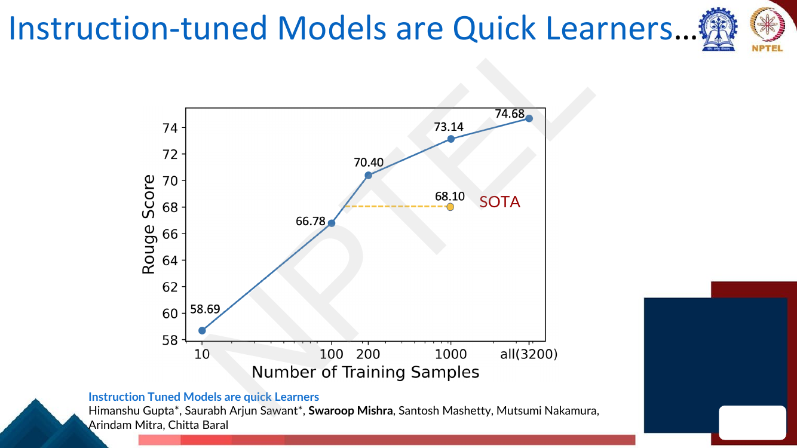
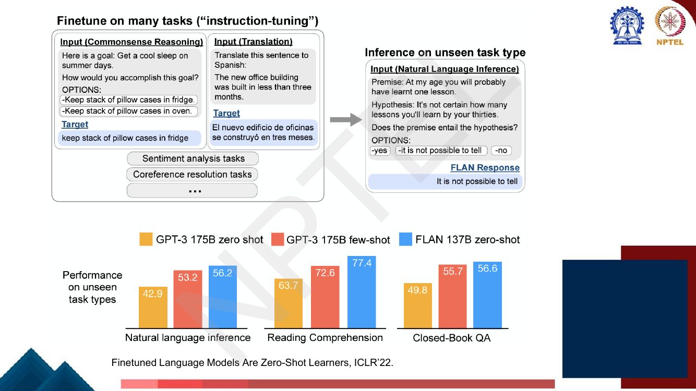
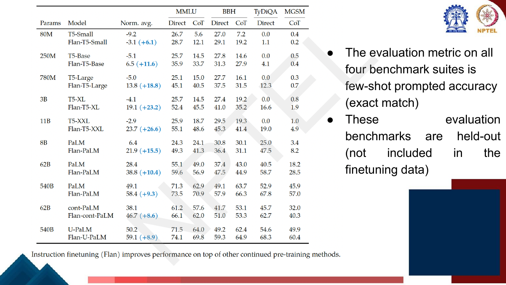
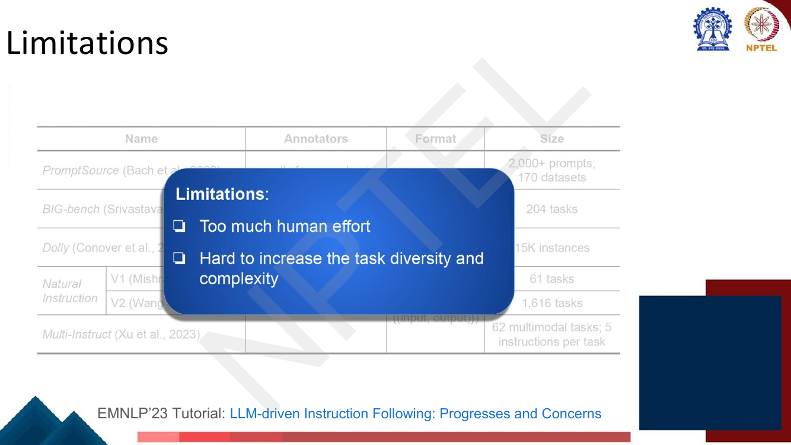

# Lec 37 — Instruction Fine-tuning II: Flan and Self-Instruct

> **Source:** `Week8.pdf` pp. 34–63 · **Week 8** · **Playlist:** Lec 37
> **Prereqs:** [Lec 36 — Instruction Fine-tuning I](36-instruction-finetuning-1.md)
> **Feeds into:** [Lec 38 — RLHF I](38-rlhf-1.md), [Lec 45 — Automatic Prompt Engineering](../week-09/45-automatic-prompt-engineering.md)

## Why this lecture exists

[Lec 36](36-instruction-finetuning-1.md) told you *what* instruction tuning is: take a pretrained LM,
fine-tune it on (instruction, input, output) triples drawn from many tasks, and it starts following
instructions on tasks it never saw. It did not tell you where those triples come from, and that turns
out to be the whole problem. Super-NaturalInstructions took NLP researchers across dozens of
institutions to assemble 1,616 tasks. Dolly took a company-wide contest at Databricks to produce
15,000 examples. Neither scales, and neither gives you the *diversity* that the scaling results in
Lec 36 said you need. This lecture gives three answers in increasing order of automation: multiply
each existing supervised dataset by writing several templates for it (Flan), pay humans to write
instructions from scratch (Dolly), or have the model write its own (Self-Instruct). The third is the
one worth remembering.

## The ideas

### Where we are, in one paragraph

Instruction tuning (SFT) is one of four things you can do to a pretrained LM, and the deck re-prints
Jurafsky's comparison on page 36: continued pretraining, parameter-efficient fine-tuning
([Lec 46](../week-10/46-peft-adapters-prefix.md)–[47](../week-10/47-lora-and-variants.md)), MLM
fine-tuning with a task head, and **instruction tuning**, which alone has "on unseen tasks" in its
inference column. The schema (instruction / input / output), the NaturalInstructions and
Super-NaturalInstructions datasets, and the argument that this is a different paradigm from
task-specific fine-tuning all belong to [Lec 36](36-instruction-finetuning-1.md). Everything here is
about the **supply of training data** that paradigm consumes. Alignment to *preferences* — reward
models, pairwise comparisons, RL — is a further step and belongs to
[Lec 38](38-rlhf-1.md); instruction tuning is plain supervised learning on text.

### Instruction-tuned models are quick learners

The deck opens with a claim that justifies everything after it. Gupta et al., *Instruction Tuned
Models are Quick Learners*, measure how many task-specific training examples an already
instruction-tuned model needs before it beats a model fine-tuned on **all** of them.


*Fig. — Read the bottom row first: full supervised fine-tuning of T5 on 100% of the data gets ROUGE-L 70.99. Tk-Instruct beats it using **6%** of the same data (70.40 is within noise) and clearly passes it at 25% (73.14). Zero-shot in-context learning alone gets only 54.30. Page 40 of `Week8.pdf`.*

The "quick learner" claim is therefore **sample efficiency in downstream adaptation**: once a model
has been instruction-tuned on many tasks, learning a *new* task costs it roughly an order of magnitude
fewer labelled examples. The reason is that instruction tuning has already taught the model the format
— read a task description, locate the input, emit the output in the requested shape — so the only
thing left to learn is the task's content.


*Fig. — The curve crosses the SOTA line (68.10) somewhere between 100 and 200 samples, out of 3,200 available. Note the sharp diminishing returns after 200: 200 → 3,200 is a 16× data increase for +4.3 ROUGE. Page 41.*

Two things to carry into the exam: the **metric is ROUGE-L** (defined in
[Lec 35](../week-07/35-text-summarization.md)), and the crossover is at **roughly 6% of the training
data**.

### Creating instructions at scale — the problem

If instruction tuning works better the more *tasks* you tune on, you need thousands of tasks phrased as
natural-language instructions. Writing them by hand is the bottleneck. The deck's framing (pages
37–39) is the Jurafsky one: you already have hundreds of **supervised NLP datasets** — sentiment,
NLI, extractive QA — sitting in key/value form.

| Task | Keys | A value |
|---|---|---|
| Sentiment | `text`, `label` | "Did not like the service that I was provided…", `0` |
| NLI | `premise`, `hypothesis`, `label` | "No weapons of mass destruction found in Iraq yet.", "Weapons of mass destruction found in Iraq.", `2` |
| Extractive Q/A | `context`, `question`, `answers` | Beyoncé passage, "When did Beyonce start becoming popular?", `{text: ['in the late 1990s'], answer_start: 269}` |

That is already (input, output); what is missing is the **instruction**. The fix is a *template* — a
string with slots for the keys — and the deck's second move is the important one: **write several
templates per dataset, not one**, because the model must not learn that "sentiment analysis" means one
exact sentence. Page 39 adds that a language model can itself be used to **paraphrase** the prompts,
which is the first hint of the self-generation idea that dominates the second half of this chapter.

### Flan: generating multiple templates from the same data

This is the Flan recipe, from Wei et al., *Finetuned Language Models Are Zero-Shot Learners*, ICLR'22.
Take one supervised dataset, write $k$ different natural-language templates for it, and render every
example under a randomly chosen template.


*Fig. — One (premise, hypothesis, label) row becomes four instruction examples. Notice the `<options>` slot: the label set is spelled out **in the prompt**, which is what lets a generative model do classification without a task-specific head. Page 44.*

Two mechanics worth stating precisely because they are easy to get wrong:

- **The label is verbalised.** `entailment` / `not entailment` become the strings `yes` / `no`, listed
  as `<options>`. The model's job is next-word prediction, not softmax over a fixed head.
- **Templates preserve the task category.** Flan's own definitions, on page 43: a **dataset** is an
  original data source (SQuAD); a **task category** is a unique task setup (extractive QA, query
  generation, context generation); a **task** is a unique ⟨dataset, task category⟩ pair, *with any
  number of templates*. So templates multiply *phrasings*, not tasks.


*Fig. — 473 datasets, 1,836 tasks. The held-out block is the whole point: MMLU, BBH, TyDiQA and MGSM are **never** in the finetuning mixture, so scores on them measure generalisation to unseen tasks, not memorisation. Page 43.*

The deck's named **evaluation metric** for those four held-out suites is **few-shot prompted accuracy
(exact match)**, and the benchmarks are **held out** — not included in the finetuning data. Both
clauses are printed on page 47 and both are MCQ bait.


*Fig. — The headline result: a **137B** instruction-tuned model **zero-shot** beats a **175B** model given **few-shot** examples, on all three unseen task types. Smaller model, no demonstrations, better score. Page 45.*


*Fig. — Every row improves, but the **size of the gain peaks in the middle**: +26.6 for T5-XXL (11B) against +9.3 for PaLM-540B. Instruction tuning helps most where the base model is weakest at following instructions. Also note TyDiQA-Direct: T5 scores 0.0 at every size and Flan-T5 rescues it — the base T5 simply does not emit an answer in the requested format. Page 47.*

Flan's own scaling levers, from page 42: number of tasks, model size (Flan-T5, Flan-PaLM), and
fine-tuning on **chain-of-thought** data ([Lec 43](../week-09/43-advanced-prompting.md) owns CoT). The
cost is negligible — page 46's table gives instruction fine-tuning as **0.2%–1.6% of pretraining
FLOPs**, falling as the model grows. The architectures: Flan-T5 is encoder–decoder with a span
corruption objective ([Lec 28](../week-06/28-span-tasks-t5-bart.md)), Flan-PaLM decoder-only with a
causal LM objective.

### Human-generated datasets, and Dolly

The alternative to multiplying templates is paying people to write instructions from nothing. The deck
tabulates the main efforts:

| Name | Annotators | Format | Size |
|---|---|---|---|
| **P3 / PromptSource** (Sanh et al., 2022) | NLP researchers | prompts | 2,000+ prompts; 170 datasets |
| **BIG-bench** (Srivastava et al., 2022) | 442 authors across 132 institutions | prompts | 204 tasks |
| **Dolly** (Conover et al., 2023) | Databricks employees | (instruction, *input*\*, output) | 15K instances |
| **Natural Instructions V1** (Mishra et al., 2022) | NLP researchers | (instruction, {(input, output)}) | 61 tasks |
| **Natural Instructions V2** (Wang et al., 2022) | NLP researchers | (instruction, {(input, output)}) | 1,616 tasks |
| **Multi-Instruct** (Xu et al., 2023) | NLP researchers | (instruction, {(input, output)}) | 62 multimodal tasks; 5 instructions per task |

\* the input field is optional — "write a poem about autumn" has no input.

**Dolly** is the one the deck develops. It is an open-source follow-up to InstructGPT: 15,000
instruction fine-tuning examples, every prompt/response pair written by Databricks employees, who were
motivated by a **contest in which the top 20 labellers won a prize**. The labellers were given **seven
specific task types**, and these are worth memorising as a list because they are a good cross-section
of what an assistant is asked to do:

1. **Open Q&A** — "Why do people like comedy movies?" (no single correct answer; world knowledge)
2. **Closed Q&A** — answerable from a given reference passage only
3. **Extract information from Wikipedia** — copy a paragraph, pull out entities or measurements
4. **Summarize information from Wikipedia**
5. **Brainstorming** — open-ended ideation with a list of options
6. **Classification** — judge class membership, or the sentiment of a passage
7. **Creative writing** — a poem, a love letter

A record is (Category, Instruction, Context, Response); the deck's example is Category = Creative
Writing, Instruction = "What should I do on a free afternoon in San Francisco?", Context = *empty*,
Response = a paragraph about Pier 39 and Golden Gate Park. Note the empty Context: in Dolly's schema
the input is optional, exactly as in the table above.

#### Limitations


*Fig. — The deck literally greys out the table to make the point. These are the only two limitations it names, so they are the only two an exam can ask for. Page 51.*

- **Too much human effort.** 15,000 examples needed an entire company; 1,616 tasks needed a research
  community.
- **Hard to increase task diversity and complexity.** This is the subtler and more damaging one.
  Crowdworkers converge: asked to invent tasks, people produce classification and short QA over and
  over, and almost never produce the long-tail, compositional, weird instructions that real users
  send. Paying more money buys more *volume* along the same few axes, not new axes.

Volume you can buy. Diversity you cannot. That is the gap Self-Instruct attacks.

### SELF-INSTRUCT

Wang et al., *SELF-INSTRUCT: Aligning Language Model with Self Generated Instructions*, ACL 2023. The
idea in one line: **seed a small pool of human-written tasks, then repeatedly ask the model to write
new tasks, generate their data, filter aggressively, and feed the survivors back into the pool.**


*Fig. — Follow the arrows: the loop closes. Survivors of Step 4 re-enter the Task Pool and become in-context examples for the next round of Step 1. That cycle is what makes this **bootstrapping** rather than one-shot generation. Page 52.*

#### Step 1 — Generating instructions

- Initialise the task pool with **175 seed tasks**, each with **1 instruction and 1 instance**.
- At every step, sample **8 task instructions** from the pool as in-context examples.
- Of those 8, **6 come from the human-written seeds and 2 from previously model-generated tasks**, to
  promote diversity.

The prompt template is nothing more than a numbered list that stops mid-item:

```text
Come up with a series of tasks:

Task 1: {instruction for existing task 1}
Task 2: {instruction for existing task 2}
...
Task 8: {instruction for existing task 8}
Task 9:
```

The model completes `Task 9:` and onwards. Note the 6/2 split carefully — it is the mechanism that
keeps the pool from drifting. All-human examples would never leave the seed distribution; all-model
examples would compound the model's own quirks until the pool collapses onto one phrasing. Six to two
is a deliberate anchor.

#### Step 2 — Classification-task identification

Before you can make data for a task you must know what *kind* of task it is. Self-Instruct's
definition is operational, not linguistic: **a task is a classification task if it has a small, limited
output label space.** The model decides this itself, few-shot, prompted with **12 classification and
19 non-classification instructions** from the seed tasks:

```text
Can the following task be regarded as a classification task with finite output labels?

Task: Given my personality and the job, tell me if I would be suitable.
Is it classification? Yes

Task: Give me an example of a time when you had to use your sense of humor.
Is it classification? No

Task: Replace the placeholders in the given text with appropriate named entities.
Is it classification? No
```

Why this step exists at all is answered by Step 3.

#### Step 3 — Instance generation

Now produce actual (input, output) pairs for each instruction, independently per instruction. The deck
is honest that this is the hard part: the model must *understand the task from the instruction alone*,
*figure out what additional input fields are even needed and invent them*, and *then solve the task*.
It works because pretrained LMs have seen instruction-input-output triples from other tasks in
context, so the pattern is familiar even when the task is not.

![Step 3 instance generation, with two example tasks routed by the Step 2 answer: "Find out if the given text is in favor of or against abortion" is Yes → Output-first, producing Class Label: Pro-abortion then an Input matching it; "Give me a quote from a famous person on this topic" is No → Input-first, producing Input: Topic: the importance of being honest then an Output. An orange callout reads "Why two modes? Input-based approach can generate inputs biased toward one label, especially for classification tasks (e.g., for grammar error detection, it usually generates grammatical input)."](../../assets/pages/lec37/p-055.png)
*Fig. — The routing is the content of this slide: the Step-2 Yes/No answer picks the template. The orange callout is the examinable justification; memorise the grammar-error-detection example. Page 55.*

#### The two prompt templates, and why both exist

**Input-first** — the default, used for **non-classification** tasks. The prompt asks the model to come
up with examples for the given instruction; it writes the input, then the output.


*Fig. — Note the second sentence of the header: if the task needs no input (like the exercise question), the model goes straight to the output, which is how 43.5% of Self-Instruct's instances end up with an empty input field. Page 56.*

**Output-first** — used for **classification** tasks. The prompt gives the task definition *and the
class labels*, then asks for an input that corresponds to **each** label.


*Fig. — Compare the field order with the previous figure. Here **Class label comes before Sentence**, and the labels cycle through the full label set. That ordering is the entire mechanism. Page 57.*

**This is the examinable subtlety of the whole lecture, so state it exactly.** If you let the model
write the input first and then label it, the model writes whatever input is most natural to write — and
what is most natural is overwhelmingly the majority class. The deck's example: asked to generate inputs
for *grammar error detection*, a language model writes grammatical sentences, because that is what
language models do. You end up with a classification dataset that is 90% one label, and a model
fine-tuned on it learns to answer "correct" and nothing else.

Generating the **output (the class label) first** inverts the causality. The label becomes a
*condition*, not a prediction: "here is the label `ungrammatical`, now write a sentence that deserves
it." Because the prompt walks through the labels, the generated inputs are spread evenly across them,
and the label distribution of the resulting dataset is balanced by construction.

| | Input-first | Output-first |
|---|---|---|
| Used for | non-classification tasks | classification tasks |
| Order generated | input, then output | class label, then input |
| Label distribution | skewed to the majority/natural class | balanced across the label set |
| Failure it avoids | — | a dataset that is almost all one label |

#### Step 4 — Filtering

Four filters, the first of which is the one you must be able to compute:

1. **ROUGE-L diversity filter.** A new instruction enters the task pool **only if its ROUGE-L
   similarity with *any* existing instruction is less than 0.7**. (Read "any" as "the maximum over all
   existing instructions" — one near-duplicate is enough to reject.) ROUGE-L is the
   longest-common-subsequence F-measure defined in
   [Lec 35](../week-07/35-text-summarization.md); with $\beta = 1$ it reduces to the pleasantly simple
   $$\text{ROUGE-L}(X, Y) = \frac{2\,\lvert \text{LCS}(X,Y)\rvert}{\lvert X\rvert + \lvert Y\rvert}.$$
2. **Keyword blacklist.** Drop instructions containing words like *image*, *picture*, *graph* — things
   a text-only LM cannot process.
3. **Instance deduplication.** Drop instances that are exactly identical, and drop instances with the
   **same input but different outputs** (a contradiction, so at least one is wrong).
4. **Heuristic validity checks.** Instruction too long or too short; instance output is just a
   repetition of the input; and similar cheap rules.

Filter 1 is doing something structural, not cosmetic. Without it, the loop would converge: the model
would resample paraphrases of whatever is already in the pool, the pool's effective size would stop
growing, and the fine-tuned model would be trained on one task wearing 50,000 costumes. The threshold
is a dial between diversity and yield — lower it and you keep fewer, more distinct instructions.

#### Example generations

Page 59 shows what comes out. Three characteristic ones:

| Instruction | Input | Output |
|---|---|---|
| Given an address and city, come up with the zip code. | Address: 123 Main Street, City: San Francisco | 94105 |
| Write a letter from the perspective of a cat. | **Null** | "Dear [Owner], I am writing to you today because I have a problem…" |
| How to write a code for converting degrees fahrenheit to celsius. | **Null** | `def convert_fahrenheit_to_celsius(fahr): celsius = (fahr - 32) * 5 / 9; return celsius` |

Note the two `Null` inputs and the fact that one output is Python. The generated tasks are *not* NLP
benchmark tasks — they are the sort of thing a user actually asks an assistant. That is the diversity
the human-written datasets could not buy.

#### Main findings

![Left: a statistics table — # of instructions 52,445, of which classification 11,584 and non-classification 40,861; # of instances 82,439, of which 35,878 have empty input; average instruction length 15.9 words, average non-empty input 12.7 words, average output 18.9 words. Right: a ROUGE-L results table — vanilla T5-LM 11B 25.7, GPT3 175B 6.8; instruction-tuned without SuperNI: T0 11B 33.1, GPT3+T0 training 37.9, GPT3-SELF-INST 39.9, InstructGPT-001 40.8; instruction-tuned with SuperNI: Tk-Instruct 11B 46.0, GPT3 + SuperNI 49.5, GPT3-SELF-INST + SuperNI 51.6](../../assets/pages/lec37/p-060.png)
*Fig. — Three results are circled on the slide. ① Self-Instruct lifts vanilla GPT-3 from **6.8 to 39.9** ROUGE-L — a 33-point jump from data the model wrote itself. ② That 39.9 lands within **0.9 points** of InstructGPT-001 (40.8), which used expensive human-written data. ③ Self-Instruct and human supervision are **complementary**: adding SuperNI on top gives 51.6 against 49.5 for SuperNI alone. Page 60.*

The three findings, stated plainly:

- **Self-Instruct works at all.** Vanilla GPT-3 scores 6.8 ROUGE-L on Super-NaturalInstructions'
  held-out tasks; tuned on its own generated data it scores 39.9.
- **It nearly matches human-written instruction data.** 39.9 vs InstructGPT-001's 40.8 — a gap of
  **0.9 ROUGE-L** between free synthetic data and paid human data.
- **It is additive, not a substitute.** 51.6 (Self-Instruct + SuperNI) > 49.5 (SuperNI alone) > 46.0
  (Tk-Instruct). Generated data adds coverage that curated data does not have.

The dataset itself: **52,445 instructions and 82,439 instances** from 175 seeds. Work the ratios in
[N3](#n3-self-instructs-yield-read-off-the-decks-statistics-table).

### The big insight: a model generating its own training data

Stop and notice what just happened. In Step 1 a language model wrote the task descriptions. In Step 3
the same model wrote the inputs and the answers. In Step 4 an automatic metric decided what to keep.
Then the model was fine-tuned on the result and got better. **No new human information entered the
loop after the 175 seeds.**

This is the first time in the course a model improves itself, and it is not the last:

- [Lec 44](../week-09/44-tool-aided-lms.md)'s Toolformer uses the same shape — the model generates
  candidate API calls, and a loss-based filter keeps only the ones that help.
- [Lec 45](../week-09/45-automatic-prompt-engineering.md) applies the identical idea to *prompts*
  rather than training data: propose candidates automatically, score them, keep the best.
- [Lec 38](38-rlhf-1.md)'s RLHF needs human preference labels — and its "AI feedback" variants
  (Constitutional AI, RLAIF) replace the human labeller with a model, which is Self-Instruct's move
  applied to the preference stage.

The thing that makes bootstrapping work rather than collapse is always the **filter**. A generator
alone drifts; a generator plus a diversity or correctness test is a search. Remember ROUGE-L < 0.7 as
the concrete instance of that principle.

### Benefits of instruction tuning — the deck's closing summary

Page 61 closes with four boxes:

- **Expressing task semantics by instruction is an alternative to using input–output examples.** You
  tell the model what to do instead of showing it 1,000 demonstrations.
- **Cheap to collect** — relative to full supervised datasets per task, and more so with Flan's
  templates or Self-Instruct's generation. (0.2%–1.6% of pretraining compute, per page 46.)
- **Facilitates cross-task generalization** — the held-out-benchmark results above.
- **User-friendly** — the interface is natural language, so a non-expert can specify a new task.

## Worked numericals

> **No "Try this problem" page exists in `Week8.pdf` pp. 34–63.** Every page in the range was opened as
> an image; pages 34 and 62–63 are title/reference/thank-you slides and the rest are content. The
> re-swept exercise table in `OWNERSHIP.md` lists no page for Lec 37, and that is correct. All five
> numericals below are constructed, using the deck's own figures wherever the deck gives any.

### N1. Template multiplication — what Flan's $k$ templates actually buy
**Given:** Flan's mixture, from page 43: $D = 473$ datasets rendered as $T = 1{,}836$ tasks, with up to
$k = 10$ templates written per task. SQuAD has $N = 87{,}599$ training examples and supports
$c = 2$ task categories (extractive QA and question generation).
**Find:** the number of distinct instruction phrasings, the multiplier over one-template-per-dataset,
and the instruction-example count obtainable from SQuAD alone.

1. With one template per dataset, the number of distinct instruction phrasings in the whole mixture is
   just $D = 473$.
2. With $k$ templates per *task*: $T \times k = 1{,}836 \times 10 = \mathbf{18{,}360}$ phrasings.
3. Multiplier: $18{,}360 / 473 = \mathbf{38.8\times}$.
4. SQuAD alone: it contributes $c = 2$ tasks, each with $k = 10$ templates, so $2 \times 10 = 20$
   distinct renderings per row.
5. Instruction examples from SQuAD: $N \times c \times k = 87{,}599 \times 20 = \mathbf{1{,}751{,}980}$.
6. **Sanity check on the deck's own arithmetic.** Sum the datasets across the four blocks on page 43:
   $55 + 69 + 9 + 372 = 505$, but the slide's text says 473. Sum the *tasks*:
   $193 + 80 + 9 + 1{,}554 = 1{,}836$ ✓. So the task count is exact and the dataset count is not a
   sum — **32 datasets appear in more than one mixture** (e.g. a dataset in both T0-SF and NIv2) and
   are counted once in the 473. If an MCQ asks you to add the four dataset counts, the answer is 505,
   and the deck's headline figure is 473.

**Answer:** 18,360 phrasings, **38.8×** more than one-per-dataset; 1,751,980 instruction examples from
SQuAD alone. The templates do not create new *tasks* — they create new *surface forms* for the same
task, which is precisely what stops the model binding a task to one wording.

### N2. The ROUGE-L filter applied, at threshold 0.7
**Given:** the task pool currently holds three instructions:

- $E_1$ = "Summarize the given article in a few sentences." (8 tokens)
- $E_2$ = "Write a brief summary of the given passage." (8 tokens)
- $E_3$ = "Translate the given sentence into French." (6 tokens)

Candidate $C_1$ = "Write a short summary of the given article." (8 tokens).
Threshold: admit only if ROUGE-L similarity with every existing instruction is $< 0.7$.
**Find:** ROUGE-L against each, and the decision.

1. With $\beta = 1$ the ROUGE-L $F$-measure simplifies. Writing $L = \lvert\text{LCS}\rvert$,
   $R_{\text{lcs}} = L/\lvert X\rvert$ and $P_{\text{lcs}} = L/\lvert Y\rvert$, so
   $$F_{\text{lcs}} = \frac{2 R_{\text{lcs}} P_{\text{lcs}}}{R_{\text{lcs}} + P_{\text{lcs}}}
   = \frac{2L}{\lvert X\rvert + \lvert Y\rvert}.$$
   Use this form; it saves a line of algebra every time.
2. **$C_1$ vs $E_1$.** $C_1 = $ [write, a, short, summary, of, the, given, article];
   $E_1 = $ [summarize, the, given, article, in, a, few, sentences]. The longest *order-preserving*
   common subsequence is [the, given, article] — positions 6,7,8 in $C_1$ and 2,3,4 in $E_1$, both
   increasing. ("a" matches too, at $C_1$ position 2 and $E_1$ position 6, but taking it blocks the
   other three.) $L = 3$.
3. $F = 2(3)/(8+8) = 6/16 = \mathbf{0.3750}$.
4. **$C_1$ vs $E_2$.** $E_2 = $ [write, a, brief, summary, of, the, given, passage]. Aligning:
   write ✓, a ✓, short≠brief, summary ✓, of ✓, the ✓, given ✓, article≠passage. $L = 6$.
5. $F = 2(6)/(8+8) = 12/16 = \mathbf{0.7500}$.
6. **$C_1$ vs $E_3$.** $E_3 = $ [translate, the, given, sentence, into, french]. LCS = [the, given],
   $L = 2$. $F = 2(2)/(8+6) = 4/14 = \mathbf{0.2857}$.
7. Maximum over the pool: $\max(0.3750,\, 0.7500,\, 0.2857) = 0.7500$.
8. $0.7500 \not< 0.7$ → **reject $C_1$**. It is a paraphrase of $E_2$ with two words swapped.
9. Now candidate $C_2$ = "Identify the sentiment of the given movie review." (8 tokens). Against
   $E_1$: LCS = [the, given], $L=2$, $F = 4/16 = 0.2500$. Against $E_2$: LCS = [of, the, given],
   $L=3$, $F = 6/16 = 0.3750$. Against $E_3$: LCS = [the, given], $L=2$, $F = 4/14 = 0.2857$.
10. Maximum $= 0.3750 < 0.7$ → **keep $C_2$**, and the pool grows to four.

**Answer:** $C_1$ is **rejected** (max similarity 0.75, driven by $E_2$); $C_2$ is **kept** (max
similarity 0.375). Note how little it takes to cross 0.7: $C_1$ and $E_2$ differ in only two of eight
tokens.

### N3. Self-Instruct's yield, read off the deck's statistics table
**Given:** page 60: 52,445 instructions (11,584 classification, 40,861 non-classification); 82,439
instances, of which 35,878 have empty input; average lengths 15.9 / 12.7 / 18.9 words for
instruction / non-empty input / output. Seeds: 175 tasks.
**Find:** the composition ratios and the amplification factor over the seed set.

1. Check the split closes: $11{,}584 + 40{,}861 = 52{,}445$ ✓ — no instruction is unclassified.
2. Classification share: $11{,}584 / 52{,}445 = 0.2209 = \mathbf{22.09\%}$. So the **output-first**
   template was used for about 22% of the generated tasks and **input-first** for the other
   $\mathbf{77.91\%}$.
3. Instances per instruction: $82{,}439 / 52{,}445 = \mathbf{1.572}$. The "generate multiple examples
   when possible" header in the input-first prompt yields about 1.6 on average, not many.
4. Empty-input share: $35{,}878 / 82{,}439 = 0.4352 = \mathbf{43.52\%}$. Non-empty instances:
   $82{,}439 - 35{,}878 = 46{,}561$ (**56.48%**). Nearly half the generated tasks need no input field
   at all — "write a letter from the perspective of a cat" has nothing to put there.
5. Amplification over the seeds: $52{,}445 / 175 = \mathbf{299.7\times}$ instructions, and
   $82{,}439/175 = \mathbf{471.1\times}$ instances. 175 hand-written tasks became ~300× as many.
6. Total generated text: $52{,}445 \times 15.9 + 46{,}561 \times 12.7 + 82{,}439 \times 18.9
   = 833{,}876 + 591{,}325 + 1{,}558{,}097 = \mathbf{2{,}983{,}297}$ words ≈ **3.0M words**.

**Answer:** 22.09% classification / 77.91% non-classification; 1.572 instances per instruction; 43.52%
empty-input; **299.7×** amplification from 175 seeds; ≈3.0M words of generated data.

> **Caveat you must state if asked for "retention rates".** The deck gives only **post-filter** counts.
> It never prints how many instructions were generated *before* the ROUGE-L and heuristic filters, so a
> per-stage retention rate is **not computable from these slides**. Compute the ratios above instead,
> and say so. (The paper reports that a large majority of generated instructions are discarded; the
> slide does not carry that number.)

### N4. Input-first vs output-first: the label distributions
**Given:** a binary grammar-error-detection task, labels {grammatical, ungrammatical}. Running the
**input-first** template 200 times yields 170 grammatical and 30 ungrammatical inputs. Running the
**output-first** template 200 times — cycling through both class labels — yields 104 grammatical and 96
ungrammatical.
**Find:** both class distributions, their entropies in bits, and the majority-class baseline accuracy.

1. **Input-first distribution:** $p = (170/200,\, 30/200) = (0.85,\, 0.15)$.
2. Entropy $H = -\sum_c p_c \log_2 p_c$. $\log_2 0.85 = -0.23447$, so $-0.85\log_2 0.85 = 0.19930$.
   $\log_2 0.15 = -2.73697$, so $-0.15\log_2 0.15 = 0.41055$.
3. $H_{\text{input-first}} = 0.19930 + 0.41055 = \mathbf{0.6098}$ bits.
4. **Output-first distribution:** $p = (104/200,\, 96/200) = (0.52,\, 0.48)$.
5. $\log_2 0.52 = -0.94342 \Rightarrow 0.49058$; $\log_2 0.48 = -1.05889 \Rightarrow 0.50827$.
6. $H_{\text{output-first}} = 0.49058 + 0.50827 = \mathbf{0.9988}$ bits, against a maximum of
   $\log_2 2 = 1$ bit. The output-first set is **99.88% of maximally balanced**; the input-first set is
   only 60.98%.
7. **Majority-class baseline.** A model that always answers "grammatical" scores $\mathbf{85\%}$ on the
   input-first data and $\mathbf{52\%}$ on the output-first data.
8. That is the damage: fine-tuned on the input-first set, a model is *rewarded* 85% of the time for
   ignoring the input entirely. There is almost no gradient signal pushing it to actually detect
   errors. On the output-first set the degenerate strategy is worth barely more than a coin flip.

**Answer:** input-first (0.85, 0.15), $H = 0.6098$ bits, majority baseline 85%; output-first
(0.52, 0.48), $H = 0.9988$ bits, majority baseline 52%. **Output-first produces the balanced dataset**,
which is exactly the deck's stated reason for having two templates.

### N5. Human annotation versus API generation — the cost argument
**Given:** target $N = 52{,}445$ instruction examples (Self-Instruct's actual count). Human assumptions
(editorial, stated so you can vary them): 10 minutes per example at \$20/hour, i.e. \$3.33 each. API
assumptions: the generated text totals ≈ 2.98M words (from N3), ≈1.33 tokens per word, and prompt
tokens run ≈3× completion tokens because eight in-context examples precede every call; pricing
\$0.02 per 1K tokens (GPT-3 `davinci` era, charged on prompt + completion alike).
**Find:** both totals and the ratio.

1. **Human cost:** $52{,}445 \times \$3.33 = \mathbf{\$174{,}800}$ (to 4 s.f.).
2. **Human time:** $52{,}445 \times 10\ \text{min} = 524{,}450$ min $= \mathbf{8{,}741}$ person-hours
   $\approx$ 4.4 person-years at 2,000 h/yr.
3. **API completion tokens:** $2{,}983{,}297 \times 1.33 = 3{,}967{,}785 \approx \mathbf{3.97\text{M}}$.
4. **API prompt tokens:** $3 \times 3.97\text{M} = \mathbf{11.90\text{M}}$.
5. **Total tokens:** $3.97 + 11.90 = 15.87$M.
6. **API cost:** $15.87 \times 10^6 \times \dfrac{\$0.02}{1000} = \mathbf{\$317}$.
7. **Ratio:** $\$174{,}800 / \$317 = \mathbf{551\times}$ cheaper.
8. Wall-clock matters as much as money: the API run is hours of parallel calls; the human run is
   4.4 person-years of coordinated annotation, which is why Dolly needed a company-wide contest to get
   15,000 examples — under these assumptions that is \$50,000 and 2,500 person-hours.

**Answer:** ≈\$174,800 and 8,741 person-hours for humans; ≈\$317 of API calls for the same count —
about **550× cheaper**, for a model that scores within **0.9 ROUGE-L** of the human-data baseline
(39.9 vs 40.8). The arithmetic is why every post-2023 open instruction dataset is at least partly
synthetic.

## Code

The ROUGE-L diversity filter of Step 4, in pure Python, run over the candidates from **N2**. No
dependencies; the LCS is a textbook dynamic program.

```python
# Self-Instruct Step 4: keep a newly generated instruction only if its
# ROUGE-L similarity to EVERY instruction already in the pool is < 0.7.

def tokens(s):
    """Lowercase, strip punctuation, split on whitespace."""
    return [w.strip(".,?!'\"").lower() for w in s.split() if w.strip(".,?!'\"")]

def lcs_len(a, b):
    """Longest common SUBSEQUENCE length (gaps allowed), by dynamic programming."""
    m, n = len(a), len(b)
    dp = [[0] * (n + 1) for _ in range(m + 1)]
    for i in range(1, m + 1):
        for j in range(1, n + 1):
            dp[i][j] = dp[i-1][j-1] + 1 if a[i-1] == b[j-1] else max(dp[i-1][j], dp[i][j-1])
    return dp[m][n]

def rouge_l(x, y):
    """ROUGE-L F-measure (beta = 1) = 2*LCS / (|x| + |y|)."""
    a, b = tokens(x), tokens(y)
    if not a or not b:
        return 0.0
    return 2.0 * lcs_len(a, b) / (len(a) + len(b))

pool = ["Summarize the given article in a few sentences.",
        "Write a brief summary of the given passage.",
        "Translate the given sentence into French."]
candidates = ["Write a short summary of the given article.",
              "Identify the sentiment of the given movie review.",
              "Describe the image shown in the picture."]      # blacklisted word
BLOCKED, THRESHOLD = {"image", "picture", "graph", "diagram", "photo"}, 0.7

for cand in candidates:
    if BLOCKED & set(tokens(cand)):                 # filter 2: keyword blacklist
        print(f"REJECT (keyword) : {cand}"); continue
    sims = [(rouge_l(cand, p), p) for p in pool]    # filter 1: ROUGE-L diversity
    best, _ = max(sims)
    print(f"{'KEEP  ' if best < THRESHOLD else 'REJECT'} "
          f"(max ROUGE-L = {best:.4f}) : {cand}")
    for s, p in sims:
        print(f"         {s:.4f}  vs  {p}")
    if best < THRESHOLD:
        pool.append(cand)                           # bootstrapping: the pool grows

print(f"\npool size after filtering: {len(pool)}")
```

Real printed output:

```text
REJECT (max ROUGE-L = 0.7500) : Write a short summary of the given article.
         0.3750  vs  Summarize the given article in a few sentences.
         0.7500  vs  Write a brief summary of the given passage.
         0.2857  vs  Translate the given sentence into French.
KEEP   (max ROUGE-L = 0.3750) : Identify the sentiment of the given movie review.
         0.2500  vs  Summarize the given article in a few sentences.
         0.3750  vs  Write a brief summary of the given passage.
         0.2857  vs  Translate the given sentence into French.
REJECT (keyword) : Describe the image shown in the picture.

pool size after filtering: 4
```

Every number reproduces N2 by hand. Two implementation points worth noticing. First, `pool.append`
inside the loop is the bootstrap — each kept instruction immediately becomes a filter for the next
candidate, so later candidates face a harder test. Second, the filter is $O(\lvert \text{pool}\rvert)$
per candidate, so at 52,445 instructions the naive version does ~1.4 billion LCS computations; the real
implementation indexes by n-gram overlap first and only runs ROUGE-L on near-neighbours.

## Exam pack

### Must-memorise

| Item | Exactly this |
|---|---|
| Flan paper | Wei et al., *Finetuned Language Models Are Zero-Shot Learners*, **ICLR'22** |
| Flan's data trick | **generate multiple templates from the same dataset** — one supervised dataset → $k$ instruction phrasings |
| Flan: dataset / task category / task | dataset = original source (SQuAD); task category = unique setup (extractive QA); **task = ⟨dataset, category⟩ pair, with any number of templates** |
| Flan evaluation metric | **few-shot prompted accuracy (exact match)** on all four benchmark suites |
| Flan held-out suites | **MMLU, BBH, TyDiQA, MGSM** — not in the finetuning data |
| Self-Instruct paper | Wang et al., *SELF-INSTRUCT: Aligning Language Model with Self Generated Instructions*, **ACL'23** |
| Self-Instruct's 4 steps | 1 instruction generation → 2 classification-task identification → 3 instance generation → 4 filtering (then loop) |
| Step 1 sampling | 8 in-context instructions per call: **6 human-written + 2 model-generated** |
| "Classification task" definition | a task with a **small, limited output label space** |
| Input-first | non-classification; generate **input then output** |
| Output-first | classification; generate **class label then input** |
| Why output-first | input-first biases inputs toward one label (grammar-error detection → grammatical inputs); conditioning on the label balances the class distribution |
| Filter 1 | add an instruction only if **ROUGE-L similarity with any existing instruction $< 0.7$** |
| ROUGE-L, $\beta=1$ | $2\lvert\text{LCS}(X,Y)\rvert / (\lvert X\rvert + \lvert Y\rvert)$ — see [Lec 35](../week-07/35-text-summarization.md) |
| Other filters | keyword blacklist (image/picture/graph); drop identical instances and same-input-different-output; heuristics (too long/short, output repeats input) |
| Dolly | 15K examples, **Databricks employees**, 7 task types, contest for the top 20 labellers |
| Human-data limitations | **too much human effort**; **hard to increase task diversity and complexity** |
| Benefits of instruction tuning | task semantics as an alternative to examples; cheap to collect; cross-task generalization; user-friendly |

### Numbers worth knowing

| Quantity | Value |
|---|---|
| Quick learners: instruction-tuned beats supervised SOTA at | **6%** of training samples (70.40 vs 70.99); 25% → 73.14 |
| Quick learners curve (ROUGE) | 10 → 58.69; 100 → 66.78; 200 → 70.40; 1000 → 73.14; all 3200 → 74.68; SOTA line **68.10** |
| Flan mixture | **473 datasets, 1,836 tasks** (block datasets sum to 505 — 32 are shared) |
| Flan blocks | T0-SF 55/14/193; Muffin 69/27/80; CoT 9/1/9; NIv2 372/108/**1554** |
| Flan held-out sizes | MMLU 57 tasks; BBH 27 tasks; TyDiQA 8 languages; MGSM 10 languages |
| Flan vs GPT-3 (unseen tasks) | NLI 42.9 / 53.2 / **56.2**; RC 63.7 / 72.6 / **77.4**; CBQA 49.8 / 55.7 / **56.6** (GPT-3 0-shot / GPT-3 few-shot / FLAN **137B** 0-shot) |
| Flan-T5 sizes | 80M, 250M, 780M, 3B, 11B (encoder–decoder, span corruption) |
| Instruction-tuning compute | **0.2%–1.6%** of pretraining FLOPs |
| Biggest Flan gain | T5-XXL 11B: $-2.9 \to 23.7$ (**+26.6**); Flan-PaLM 540B only +9.3 |
| Dolly | **15K** instances, Databricks, **7** task types, top **20** labellers rewarded |
| Natural Instructions V1 / V2 | 61 tasks / **1,616** tasks |
| BIG-bench | 204 tasks, 442 authors, 132 institutions |
| P3 / PromptSource | 2,000+ prompts, 170 datasets |
| Self-Instruct seeds | **175 tasks**, 1 instruction + 1 instance each |
| Step 2 few-shot prompt | **12** classification + **19** non-classification seed instructions |
| Self-Instruct output | **52,445** instructions; **11,584** classification; **40,861** non-classification |
| Self-Instruct instances | **82,439**; **35,878** with empty input (43.5%) |
| Self-Instruct lengths (words) | instruction **15.9**; non-empty input **12.7**; output **18.9** |
| Self-Instruct ROUGE-L results | GPT3 vanilla **6.8** → GPT3-SELF-INST **39.9**; InstructGPT-001 **40.8**; T0 33.1; Tk-Instruct 46.0; GPT3+SuperNI 49.5; **GPT3-SELF-INST+SuperNI 51.6** |
| The diversity threshold | ROUGE-L **< 0.7** |

### Likely MCQ traps

- **"Output-first is used for non-classification tasks."** Backwards. **Output-first → classification**
  (generate the label, then an input for it); **input-first → everything else**. If you remember only
  one fact from this lecture, remember this direction.
- **"Input-first is used because classification inputs are easier to write."** No — input-first is the
  *default*; output-first exists *because* input-first **skews the label distribution** on
  classification tasks.
- **"An instruction is kept if ROUGE-L > 0.7."** Inverted. It is kept if similarity is **less than**
  0.7; high similarity means it is a near-duplicate and gets **rejected**.
- **"ROUGE-L is compared against the seed tasks only."** No — against **any existing instruction** in
  the pool, which includes previously accepted model-generated ones. That is what makes it a
  bootstrapping loop.
- **"Flan's templates create new tasks."** No. Templates preserve the task category; a **task** is a
  ⟨dataset, category⟩ pair. Templates multiply *phrasings*.
- **"Flan is evaluated with ROUGE."** The deck says **few-shot prompted accuracy (exact match)** for
  MMLU/BBH/TyDiQA/MGSM. ROUGE-L is the metric in the *Quick Learners* and *Self-Instruct* results, not
  in the Flan-T5 table.
- **"FLAN is bigger than GPT-3."** FLAN is **137B**, GPT-3 is **175B**. The result is that the
  *smaller* model, *zero-shot*, beats the larger one *few-shot*.
- **Confusing the two sampling counts in Step 1.** 8 in-context instructions per call, **6 human + 2
  model** — not 8 human, not 4+4.
- **"Self-Instruct beat InstructGPT."** It got to **39.9 vs 40.8** — *within* 0.9, not above. It does
  exceed the SuperNI-only baseline when *combined* with it (51.6 vs 49.5).
- **"The 175 seeds are 175 instructions with many instances each."** One instruction and **one
  instance** per seed task.
- **Adding Flan's four dataset counts and reporting 505.** The deck's headline is **473**; 505 is the
  naive sum because 32 datasets appear in two mixtures.
- **"Dolly is model-generated."** Dolly is the **human** alternative — Databricks employees wrote every
  pair. Self-Instruct is the model-generated one.
- **Treating instruction tuning as alignment-complete.** It is supervised fine-tuning only; preference
  alignment is [Lec 38](38-rlhf-1.md).

### Self-test

1. State, in one sentence each, what Steps 1–4 of Self-Instruct do.
2. Why does Self-Instruct need to know whether a task is a classification task?
3. A new instruction has ROUGE-L similarities 0.31, 0.68 and 0.72 against three pool members. Kept or rejected, and why?
4. Compute ROUGE-L ($\beta=1$) between "sort the given list of numbers" (6 tokens) and "sort the list of words alphabetically" (6 tokens).
5. What is Flan's definition of a *task*, as distinct from a *dataset*?
6. Which metric does the Flan deck name for MMLU / BBH / TyDiQA / MGSM?
7. FLAN is 137B and GPT-3 is 175B. What is the headline comparison on unseen task types?
8. What fraction of Self-Instruct's instructions are classification tasks, and which prompt template did they use?
9. Name the deck's two stated limitations of human-generated instruction datasets.
10. At what percentage of the training data does an instruction-tuned model overtake fully supervised fine-tuning, per the *Quick Learners* slide?
11. Why does the Step-1 prompt mix 6 human-written with 2 model-generated instructions instead of using 8 of either?

<details><summary>Answers</summary>

1. **Step 1** — prompt the LM with 8 sampled instructions (6 human, 2 model) and have it write new ones. **Step 2** — few-shot prompt the LM to decide whether each new task is a classification task (small finite label set). **Step 3** — generate (input, output) instances, routing classification tasks to the output-first template and the rest to input-first. **Step 4** — filter: ROUGE-L < 0.7 against every pool member, keyword blacklist, instance dedup, validity heuristics; survivors go back into the pool.
2. Because the two task types need different instance-generation templates: generating the input first for a classification task biases the inputs toward one label, so classification tasks must generate the **label first** and then a matching input.
3. **Rejected.** The rule is "less than 0.7 against *any* existing instruction", i.e. the maximum must be below 0.7; 0.72 exceeds it.
4. Tokens: [sort, the, given, list, of, numbers] and [sort, the, list, of, words, alphabetically]. LCS = [sort, the, list, of] = 4. $F = 2(4)/(6+6) = 8/12 = \mathbf{0.6667}$ — just under 0.7, so it would (barely) be kept.
5. A **dataset** is an original data source (e.g. SQuAD); a **task** is a unique ⟨dataset, task category⟩ pair, which may carry any number of templates. 473 datasets yield 1,836 tasks.
6. **Few-shot prompted accuracy (exact match)**, on benchmarks held out of the finetuning data.
7. FLAN **zero-shot** beats GPT-3 **few-shot** on all three unseen task types despite being smaller: 56.2 vs 53.2 (NLI), 77.4 vs 72.6 (reading comprehension), 56.6 vs 55.7 (closed-book QA).
8. $11{,}584/52{,}445 = 22.09\%$, generated with the **output-first** template.
9. **Too much human effort**, and **hard to increase task diversity and complexity**.
10. About **6%** — Tk-Instruct instruction-tuned on 6% of the samples scores ROUGE-L 70.40 against supervised T5's 70.99 on 100%, and clearly exceeds it at 25% (73.14). On the per-sample curve the SOTA line (68.10) is crossed between 100 and 200 of 3,200 samples.
11. The human examples anchor the pool to the seed distribution's quality and format; the model-generated ones push it away from that distribution toward new task types. All-human in-context examples would never produce novel tasks; all-model examples would compound the model's own stylistic quirks and let the pool collapse onto a few phrasings.

</details>

## Beyond the slides

**Gap:** The deck never mentions **model collapse** — what happens when generated data is fed back in
repeatedly across generations.
**Why it matters:** Self-Instruct does one bootstrap round from a strong model (GPT-3) and filters
hard. Iterating the loop many times, or training a model on the output of a model trained on generated
data, measurably narrows the output distribution — tails disappear first. The ROUGE-L filter is the
only thing standing between Self-Instruct and that failure mode, which is why the threshold is not a
detail. If an exam asks "what is the risk of self-generated training data", the answer is loss of
diversity, and the mitigation is the diversity filter.

**Gap:** The deck does not say that Self-Instruct's data comes from a **different, stronger model** in
most practical uses.
**Why it matters:** The paper bootstraps GPT-3 from *itself*, which is the pure version. Almost every
follow-up — Alpaca (52K examples distilled from `text-davinci-003` into LLaMA-7B for about \$500),
Vicuna, WizardLM — generates from a *stronger* model and fine-tunes a *weaker* one. That is
**knowledge distillation through text**, not self-improvement, and it has a legal and licensing
dimension the pure version does not. Know the distinction; they are routinely conflated.

**Gap:** No mention of **what instruction tuning costs you**.
**Why it matters:** SFT on narrow instruction data causes measurable forgetting of pretraining
knowledge, and tuning on short, templated outputs teaches the model to be terse and formulaic.
There is also the "superficial alignment" position — that instruction tuning mostly selects an existing
response *style* rather than teaching new capability, which is the premise behind LIMA's claim that
1,000 carefully chosen examples suffice. That claim sits in direct tension with the 52,445-instruction
scale here, and the resolution — quality and diversity beat raw count — is the real lesson.

**Gap:** ROUGE-L is a **lexical** similarity measure, and the deck does not flag the consequence.
**Why it matters:** "Classify the sentiment of this review" and "Is this movie review positive or
negative?" are the same task with almost no shared subsequence, so ROUGE-L scores them as dissimilar
and both enter the pool. The filter removes *paraphrases*, not *semantic duplicates*. Modern pipelines
use embedding cosine similarity for exactly this reason. A plausible short-answer question.

## Cut from the slides

Page 34 is the NPTEL title slide, 35 the three-bullet "Concepts Covered" agenda, 62 the single
Jurafsky Chapter-12 reference, and 63 the thank-you slide — all dropped. Pages 36–37 are a verbatim
recap of material [Lec 36](36-instruction-finetuning-1.md) owns (the four-way fine-tuning comparison
figure and a full NaturalInstructions crowdworker instruction for extractive QA); compressed into the
one-paragraph recap at the top rather than re-taught. Page 42's Flan overview bullets are folded into
the Flan section. Page 46's full FLOPs table is reduced to its single examinable fact (0.2%–1.6% of
pretraining compute) plus the architecture/objective columns; the per-model FLOP figures are not
plausible MCQ material. Page 48's human-dataset table and page 49's Dolly task list are reproduced in
full as markdown rather than as images, which is more useful for revision. Page 50's single Dolly
record is quoted inline. Pages 53 and 54's prompt templates are transcribed as text blocks rather than
screenshotted, because you need to be able to read the exact wording. **No "Try this problem" page or
in-deck exercise exists anywhere in pages 34–63** — every page was opened as an image to confirm this.
Nothing about Flan, Dolly, Self-Instruct's four steps, the two prompt templates, the filtering rules,
or the results tables was dropped.
