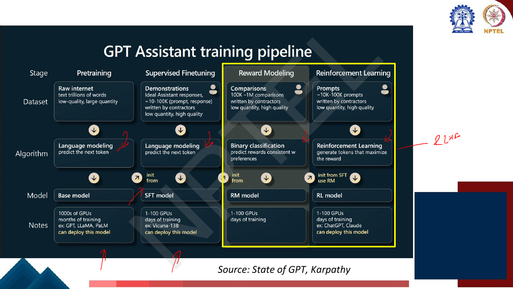
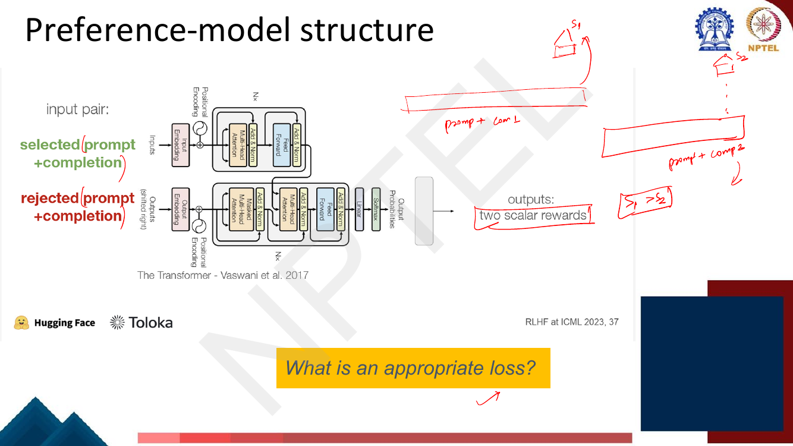

# Lec 38 — Reinforcement Learning from Human Feedback I

> **Source:** `Week8.pdf` pp. 64–89 · **Week 8** · **Playlist:** Lec 38
> **Prereqs:** [Lec 36 — Instruction Fine-tuning I](36-instruction-finetuning-1.md), [Lec 10 — Gradient Descent and Initialization](../week-02/10-gradient-descent-and-init.md)
> **Feeds into:** [Lec 39 — RLHF II: PPO](39-rlhf-2-ppo.md), [Lec 40 — Direct Preference Optimization](40-dpo.md)

## Why this lecture exists

Instruction tuning taught the model to *imitate*. You collected demonstrations — ideal assistant
responses written by contractors — and ran the ordinary next-token objective on them. That gets a base
model to answer rather than ramble, and it stops there, because imitation can only reproduce what a
human was willing to write down.

Two things it cannot do. It cannot say "this answer is **worse**" — the cross-entropy loss only ever
says "this answer is right", so every piece of training signal must be a positive example. And for
open-ended generation — summarise this, explain this, be helpful here — writing the ideal response is
expensive and slow, while *comparing* two candidate responses is fast and most people agree on the
answer. RLHF is the machinery for turning that cheap comparison signal into gradients. This lecture
builds the signal; [Lec 39](39-rlhf-2-ppo.md) builds the optimiser.

## The ideas

### Where this sits: the four-stage assistant pipeline

The deck opens with Karpathy's map of how an assistant is actually built. Memorise its shape — it is
the skeleton for the next three lectures.


*Fig. — Notice the dataset row: pretraining uses trillions of low-quality words, SFT uses 10–100K high-quality demonstrations, reward modelling uses 100K–1M **comparisons**, and RL uses 10–100K bare **prompts** with no answers at all. Notice also that "can deploy this model" appears under Base, SFT and RL but **not** under RM — the reward model is never served to users. Page 66.*

| Stage | Dataset | Algorithm | Output model | Compute |
|---|---|---|---|---|
| Pretraining | raw internet, trillions of words, low quality | language modelling | base model | 1000s of GPUs, months |
| Supervised fine-tuning | 10–100K (prompt, response) demonstrations, high quality | language modelling | SFT model | 1–100 GPUs, days |
| Reward modelling | 100K–1M comparisons | binary classification | RM model | 1–100 GPUs, days |
| Reinforcement learning | ~10K–100K prompts | RL: generate tokens that maximise the reward | RL model | 1–100 GPUs, days |

The arrows between columns matter too: the SFT model is **initialised from** the base model, the RM is
initialised from the SFT model, and the RL policy is initialised from the SFT model *and uses* the RM.
Nothing here is trained from scratch after stage 1.

### Why bother, given instruction tuning exists?

[Lec 36](36-instruction-finetuning-1.md) owns stage 2, so in two sentences: instruction tuning takes a
pretrained LM and fine-tunes it on (instruction, response) pairs with the ordinary next-token
cross-entropy, so the model learns the *format* and *habit* of answering instructions. It generalises
surprisingly well to unseen instructions.

Its limits are structural, not a matter of scale:

- **It can only imitate.** The loss is $-\log \pi_\theta(y \mid x)$ on a human-written $y$. The model is
  trained to be the demonstrator, which caps it at the demonstrator's quality.
- **There is no way to express "worse".** Cross-entropy on a demonstration is a one-sided signal. If a
  model produces a confidently wrong answer, SFT has no slot for the datum "that one was bad".
  Down-weighting a bad response is not expressible in the objective.
- **Writing the ideal answer is harder than picking the better one.** For "summarise this Reddit post"
  or "explain gravity to a five-year-old", producing the gold response takes an annotator minutes and
  two annotators will produce different things. Choosing between two candidate summaries takes seconds
  and annotators agree far more often. The economics of the labelling budget are the real argument.
- **The objective is a proxy.** Maximising the likelihood of human text is not the same as being
  helpful, honest or harmless. You want to optimise *the thing you want*, and the only available
  statement of that thing is human judgement.

RLHF replaces "copy this response" with "produce responses that humans would pick".

### History: the early OpenAI experiments

The deck pins the lineage to Stiennon et al., **"Learning to summarize with human feedback" (2020)**,
on Reddit TL;DR summarisation — the paper whose figure became the standard RLHF diagram.


*Fig. — The three panels are exactly the three phases, and the lecturer's annotation on the right spells out the starting point: Transformer → pretrain → IFT → "starting model". Note the loss box reads $\log(\sigma(r_j - r_k))$ **without a minus sign** — the paper is writing the quantity to maximise; the loss you minimise is its negative. Page 67.*

The timeline worth keeping:

| Year | What |
|---|---|
| 1952 | **Bradley–Terry** paired comparison model (the statistics, long predating any of this) |
| 2009 | Knox and Stone — model human preferences as a separate learned problem |
| 2015, 2018 | Phelps et al., Clark et al. — evidence that pairwise comparisons are more reliable than ratings |
| 2020 | **Stiennon et al.**, *Learning to summarize with human feedback* — RLHF on TL;DR |
| 2022 | Ouyang et al., InstructGPT — RLHF on general instructions; the ChatGPT recipe |

### The three phases


*Fig. — Read it left to right: phase 1 is instruction fine-tuning (done, [Lec 36](36-instruction-finetuning-1.md)); phase 2 is preference collection and reward-model training (this chapter); phase 3 is RL optimisation ([Lec 39](39-rlhf-2-ppo.md)). The orange box records that the first two are already covered by the time this slide reappears. Page 79.*

```
          ┌───────────────┐      ┌───────────────┐      ┌───────────────┐
 base LM →│  1. SFT       │ ───► │ 2. reward     │ ───► │ 3. RL         │
          │  demonstrations│  init │   model      │  score│   optimisation│
          │  → π_SFT      │      │ preferences   │      │ π_SFT → π_θ   │
          └───────────────┘      │ → r_θ         │      └───────────────┘
                  │              └───────────────┘              ▲
                  └──────────────── init ────────────────────────┘
```

### But why the reward model?

The deck asks this directly, and the answer is the hinge of the whole design.


*Fig. — The money icons are the point: every one of those scalars costs a human minute. Training a policy needs millions of them. Page 69.*

**Problem 1: a human in the training loop is impossibly expensive.** RL optimisation needs a reward for
*every* sampled generation, and a policy-gradient run takes on the order of $10^5$–$10^7$ sampled
responses. You cannot pay a person for each.

**Solution:** treat "what would a human say about this?" as an ordinary supervised NLP problem. Collect
a fixed, affordable dataset of human judgements once; fit a model $r_\theta(x, y)$ that predicts the
judgement; then query that model, which is free, for the rest of training. The deck writes it
$RM_\phi(s)$ — "train an LM $RM_\phi(s)$ to predict human preferences from an annotated dataset, then
optimize for $RM_\phi$ instead."

This is the single most important structural idea in RLHF, and it is also where RLHF's main failure
mode comes from: you are no longer optimising human preference, you are optimising a *model* of human
preference, and policies are very good at finding places where the two disagree. That is reward
hacking, and it is why [Lec 39](39-rlhf-2-ppo.md)'s KL penalty exists.

### How the feedback is collected


*Fig. — The annotator sees the full conversation (the prompt) and two completions, and moves a slider rather than typing anything. The lecturer's annotation marks the whole conversation as the prompt and the selector as the score. Page 71.*

The mechanics, which the exam can ask about directly:

1. Sample a prompt $x$ — here, a whole multi-turn conversation — from a prompt dataset.
2. Sample two (or more) completions from one or more policies. In Stiennon et al., "various policies
   are used to sample a set of summaries" and two are selected for evaluation.
3. A human reads both and marks which is better, on a graded scale — the deck's interface offers eight
   positions from "A is better" to "B is better", not a binary toggle.
4. Store the pair as $(x, y_w, y_l)$: prompt, **winning** (chosen) response, **losing** (rejected)
   response.

The criterion given to annotators is written on the interface itself: *"Choose the most helpful and
honest response."* What you write there is what you get — these instructions are the actual
specification of the values being installed, which is why [Lec 59](../week-12/59-trustworthy-llms-taxonomy.md)
treats helpfulness and harmlessness as design targets rather than emergent properties.

### Why pairwise? (this is the exam question)


*Fig. — The same text, three annotators, three very different numbers on the same scale — a spread of 3.4 points. That spread is pure noise: it carries no information about the summary. Page 72.*

**Problem 2: human judgements are noisy and miscalibrated.** Two distinct failures, and you should be
able to name both:

- **Noise** — the same annotator rating the same response on two different days gives different
  numbers.
- **Miscalibration** — annotators use the scale differently. A generous annotator's 7/10 and a harsh
  annotator's 7/10 denote different qualities. Worse, each annotator's offset drifts with the examples
  they happen to have seen recently. *My 7 is not your 7.*

Miscalibration is the lethal one, because it is a **bias, not noise** — it does not average away with
more annotators. If annotator A rates response 1 and annotator B rates response 2, the difference in
their scores confounds the quality difference with the annotator-offset difference, and the comparison
can invert (worked in N4 below).

**The fix:** never ask for an absolute number. Ask one annotator to rank two responses against each
other. The annotator's personal offset applies to both responses and **cancels exactly** in the
comparison. The output is an ordinal fact — $y_w \succ y_l$ — which is robust to any monotone
re-scaling of that person's internal quality scale.

Page 73 restates the same problem-and-solution and then shows the payoff: the three summaries line up
as $s_1 \succ s_3 \succ s_2$. The absolute numbers have vanished; only the ordering survives, and the
ordering is the thing annotators agree about.

So the training data is a table of comparisons — the deck's concrete example is three prompts, each
with two candidate answers and a `Chosen` column holding 1 or 2 (page 74). That is the entire dataset
format: $\mathcal{D} = \{(x^{(i)}, y_w^{(i)}, y_l^{(i)})\}$.

### The preference model's structure


*Fig. — The only architectural change is the grey box: the LM head (a $d_{\text{model}} \times \lvert V \rvert$ matrix producing a distribution over the vocabulary) is thrown away and replaced by a $d_{\text{model}} \times 1$ linear layer producing one number. The lecturer's sketch underneath marks that dimension. Page 75.*

Pin down three facts:

1. **Initialisation: the instruction-tuned LM.** Not the base model, not a fresh network. The reward
   model must already understand instructions and responses; you are only retraining its head and
   adjusting its body.
2. **Input: prompt concatenated with completion**, as one sequence. The reward is a function of the
   pair, $r_\theta(x, y)$ — the same response can be excellent for one prompt and terrible for another.
3. **Output: one scalar for the whole sequence.** Not a distribution, not a per-token score. In
   practice you read the final layer's hidden state at the last token position and push it through the
   scalar head.


*Fig. — Two forward passes of the **same** network, one per member of the pair, giving $r(x,y_w)$ and $r(x,y_l)$. The lecturer annotates the desired outcome as $s_1 > s_2$. This slide poses the deck's own exercise; page 77 answers it. Page 76.*

### Deriving the loss: the Bradley–Terry model

The deck asks "What is an appropriate loss?" and you should be able to construct the answer rather
than recall it. Here is the chain.

You have a scalar $r(x,y)$ per response and an observation of the form "$y_w$ beat $y_l$". You need a
probability model that turns scores into win probabilities, so that you can do maximum likelihood.

**Bradley–Terry (1952)** is the standard one. Give each item a positive *strength* $\lambda$, and model

$$P(i \succ j) = \frac{\lambda_i}{\lambda_i + \lambda_j}$$

Strengths must be positive, which is awkward for a neural network output, so parameterise them
exponentially: $\lambda_i = e^{r_i}$ with $r_i \in \mathbb{R}$ unconstrained. Substituting,

$$P(i \succ j) = \frac{e^{r_i}}{e^{r_i} + e^{r_j}} = \frac{1}{1 + e^{-(r_i - r_j)}} = \sigma(r_i - r_j)$$

dividing numerator and denominator by $e^{r_i}$ in the middle step. So for responses to a prompt $x$:

$$\boxed{\;P(y_w \succ y_l \mid x) = \sigma\!\big(r(x,y_w) - r(x,y_l)\big)\;}$$

with $\sigma(z) = 1/(1+e^{-z})$, the logistic sigmoid from
[Lec 8](../week-02/08-deep-neural-networks.md). Three things fall out immediately, all examinable:

- **It is a two-class softmax.** $\sigma(r_i - r_j)$ is exactly $\mathrm{softmax}([r_i, r_j])_1$.
  Preference modelling *is* binary classification on the reward difference — which is why Karpathy's
  pipeline table lists the reward-modelling algorithm as "binary classification".
- **Only reward *differences* are identified.** Adding a constant $c$ to every reward leaves every
  probability unchanged. The reward scale has an arbitrary origin, so "the reward model gave 3.7" is
  meaningless in isolation; only comparisons mean anything.
- **Equal rewards ⇒ $P = \sigma(0) = 0.5$.** A coin flip, as it should be.

Maximum likelihood over the preference dataset then writes itself. The likelihood of the observed
comparison is $\sigma(r(x,y_w) - r(x,y_l))$; take the negative log and average:

$$\mathcal{L}(\theta) = -\,\mathbb{E}_{(x,y_w,y_l)\sim\mathcal{D}}\Big[\log \sigma\big(r_\theta(x,y_w) - r_\theta(x,y_l)\big)\Big]$$

![Slide "Training the reward model" showing the Bradley-Terry [1952] paired comparison model and the objective J_RM(phi) = -E over (s^w, s^l) ~ D of log sigma(RM_phi(s^w) - RM_phi(s^l)), with "winning sample" and "losing sample" labelled and the note that s^w should score higher than s^l](../../assets/pages/lec38/p-077.png)
*Fig. — The deck's exact form, with the reward model written $RM_\phi$ and the objective $J_{RM}(\phi)$. This book writes the parameters $\theta$ and the loss $\mathcal{L}$ per the notation table; the deck itself switches to $r_\theta$ eight pages later. The superscripts $w$ and $l$ are "winning" and "losing", not exponents. Page 77.*

Equivalently, using $-\log\sigma(z) = \log(1 + e^{-z})$, the loss is the **softplus of the negative
margin** — a form that is numerically stable and the one you should implement.


*Fig. — The two-case analysis, which is prime MCQ material. Watch the slide's wording: it says the loss is "a small negative number" / "a very large negative number", describing $\log\sigma(\cdot)$ before the minus sign. **The loss itself, with the minus, is always positive**, small when the ordering is right and large when it is wrong. Page 78.*

Why this loss and not a simpler one? A plain hinge $\max(0, m - (r_w - r_l))$ would also push the
winner above the loser, but Bradley–Terry is the *maximum-likelihood* choice under an explicit
probability model, which means the output rewards are calibrated logits rather than arbitrary margins —
and that calibration is what [Lec 40](40-dpo.md) later exploits to eliminate the RL stage altogether.

### Reinforcement learning, from zero

Everything so far was supervised learning in disguise. Phase 3 is not, so here is the vocabulary. The
deck's framing:

> An agent interacts with an environment by taking actions. The environment returns a reward for the
> action and a new state (representation of the world at that moment). The agent uses a policy function
> to choose an action at a given state. Quite an open-ended learning paradigm. *(page 80)*

| Term | Symbol | Definition (the deck's wording, pages 81–83) |
|---|---|---|
| **Agent** | — | the thing that acts and learns |
| **Environment** | — | everything else; it receives actions and emits rewards and states |
| **State** | $s \in S$ | the current configuration or situation of the environment; $S$ is the state space |
| **Action** | $a \in A$ | a decision or move made by the agent; $A$ is the set of possible actions |
| **Reward** | $r$ | a **scalar** value indicating the desirability of an action or state |
| **Policy** | $\pi(a \mid s)$ | a strategy or rule the agent follows to decide which action to take in a given state |
| **Trajectory** | $\tau$ | a sequence of states, actions and rewards: $\tau = (s_0, a_0, r_0, s_1, a_1, r_1, \ldots, s_T, a_T, r_T)$ |
| **Trajectory distribution** | $P(\tau \mid \pi)$ | $p(s_0)\prod_{t=0}^{T}\pi(a_t\mid s_t)\,p(s_{t+1}\mid s_t,a_t)$ |


*Fig. — The trajectory distribution factorises into exactly three kinds of term: $p(s_0)$, the initial-state distribution; $\pi(a_t\mid s_t)$, the **only** part you control; and $p(s_{t+1}\mid s_t,a_t)$, the environment's transition probability. Learning in RL means changing the middle factor. Page 81.*

Three more, from page 82, which you need as vocabulary even though [Lec 39](39-rlhf-2-ppo.md) does the
work with them:

- **Value function** $V(s) = \mathbb{E}\big[\sum_{t=0}^{\infty}\gamma^t r_t \mid s_0 = s\big]$ — expected
  cumulative reward from state $s$.
- **Q-function** $Q(s,a) = \mathbb{E}\big[\sum_{t=0}^{\infty}\gamma^t r_t \mid s_0 = s, a_0 = a\big]$ —
  the same, but committing to action $a$ first.
- **Advantage** $A(s,a) = Q(s,a) - V(s)$ — how much better this action is than the policy's average
  behaviour in that state. The lecturer annotates $V(s)$ as the "baseline".

And the goal (page 83): **maximise expected cumulative reward**,

$$\max_\theta \; \mathbb{E}_{s \sim \rho_\pi,\, a \sim \pi_\theta}\Big[\sum_{t=0}^{\infty}\gamma^t r_t\Big]$$

where $\rho_\pi$ is the state distribution under $\pi$ and $\gamma \in [0,1]$ is the **discount factor**
(future reward is worth less than present reward; $\gamma$ also keeps the infinite sum finite). The
**return** is that discounted sum along one trajectory; the finite-horizon undiscounted version is
written $J(\pi_\theta) = \mathbb{E}_{\tau \sim \pi_\theta}\big[\sum_{t}^{T} r_t\big]$.

This is the deepest difference from everything before it: you are not given a target and asked to match
it. You are given a *score* on whole behaviours and asked to produce behaviours that score well. There
is no gradient of the reward with respect to your parameters — the reward is a black box that eats a
sampled sequence. Getting a gradient out of that is [Lec 39](39-rlhf-2-ppo.md)'s entire subject.

### Mapping RL onto language modelling

This is the move that makes the whole thing click. Each RL object has exactly one counterpart:

| RL | Language modelling |
|---|---|
| policy $\pi_\theta$ | the language model itself — token distribution given context ([Lec 19](../week-04/19-decoding-strategies.md) is how it samples) |
| state $s_t$ | the prompt plus the tokens generated so far: $s_t = (x, y_{<t})$ |
| action $a_t$ | emitting the next token $y_t$ |
| action space $A$ | the vocabulary $V$ — typically 32K–100K actions per step |
| reward $r_t$ | $0$ for every intermediate token; $r_\theta(x,y)$ at the final token only |
| trajectory $\tau$ | one complete generated response |
| episode | one prompt → one response; then it ends |
| return | just $r_\theta(x,y)$, since every other term is zero |

Two consequences you must be able to state:

- **The reward is extremely sparse.** One scalar for a 300-token response. Every token in that
  response gets credited with the same number, including the good ones in a bad answer. This is the
  **credit-assignment problem**, and it is what makes language RL hard.
- **The action space is enormous.** 50,000 choices at each of $T$ steps means $50{,}000^T$ possible
  trajectories, so you can only ever sample a vanishing fraction of them.

### The standard RLHF loop, and how it differs from textbook RL

The deck spends three pages on the differences, one per page, around the same diagram.


*Fig. — Trace the loop: prompt in, completion out, reward model scores the completion, the score drives a gradient **ascent** step on the policy (note the plus sign — you are maximising, not minimising). The deck writes the learning rate $\alpha$; this book writes $\eta$ ([Lec 10](../week-02/10-gradient-descent-and-init.md)). Page 84.*

**Difference 1 — a reward *model*, not a reward function (page 84).** Classical RL has a programmatic
reward: the game score, +1 for a win. RLHF substitutes a learned model $r_\theta(s_t, a_t)$ of human
preference. The deck's framing is positive — "this gives the designer a substantial increase in the
flexibility of the approach and control over the final results" — and it is the thing that makes RL
applicable to a domain with no score function at all.

**Difference 2 — no state transitions (page 85).** "The initial states for the domain are prompts
sampled from a training dataset and the 'action' is the completion to said prompt. During standard
practices, this action does not impact the next state." The next prompt is drawn independently from the
dataset; nothing the model does changes what it is asked next. Every episode is one step long at the
response level. This collapses a sequential decision problem into something much closer to a contextual
bandit, and it is why RLHF can get away with a comparatively simple algorithm.

**Difference 3 — response-level rewards (page 86).** "RLHF attribution of reward is done for an entire
sequence of actions, composed of multiple generated tokens, rather than in a fine-grained manner."
One scalar per response, not per token. Restated from the other direction: at the *token* level there
are real state transitions (each token extends the context), but there is no reward until the end; at
the *response* level there is a reward but no transition. Both views appear in the deck and they are
consistent — they are the same process at two granularities.

Page 87 draws the same loop one more time, concretely: a prompt dataset supplies $x$ = *"A dog is..."*,
the tuned language model (labelled **RL Policy**, with "Parameters Frozen\*") generates
$y$ = *"man's best friend"*, and that text goes into the Reward (Preference) Model, which emits
$r_\theta$. The frozen-parameters note matters in practice: you cannot hold a full fine-tune, a reward
model and a reference model in GPU memory at once, so the policy is usually adapted with PEFT
([Lec 46](../week-10/46-peft-adapters-prefix.md)).

What is deliberately missing here is how $r_\theta(x,y)$ becomes a gradient on $\theta$, and what stops
the policy from degenerating into whatever nonsense maximises the reward model. Those are the RLHF
objective, the policy-gradient theorem, the KL penalty against the reference policy $\pi_{\text{ref}}$,
the advantage/baseline, and the PPO loss — all of them [Lec 39](39-rlhf-2-ppo.md)'s. The alternative of
skipping the RL stage entirely, by exploiting the fact that the Bradley–Terry optimum has a closed form
in terms of the policy, is [Lec 40](40-dpo.md)'s (DPO, KTO, inference-time alignment).

## Worked numericals

The deck's page range contains **one** in-deck exercise: page 76's yellow banner **"What is an
appropriate loss?"**, posed under the two-scalar-output diagram and answered on page 77. It is worked
as N1. (It is not in the course's exercise table, which does not list Lec 38 at all.) The remaining
four are built to the shape the exam uses.

### N1. The deck's own exercise (page 76): what is an appropriate loss?
**Given:** a reward model that, for one preference example, outputs two scalars — $r(x,y_w)$ for the
selected (prompt+completion) and $r(x,y_l)$ for the rejected one. Page 76 asks what loss to train on.
**Find:** the loss, derived rather than recalled.

1. The only usable information in the label is the *ordering*: $y_w \succ y_l$. So the loss must depend
   on the two rewards only through their difference $\Delta = r(x,y_w) - r(x,y_l)$ (a loss depending on
   the absolute values would be fitting numbers nobody supplied).
2. Convert $\Delta$ into a probability of the observed outcome. Bradley–Terry with exponential
   strengths gives $P(y_w \succ y_l) = \sigma(\Delta)$ — derived above.
3. Maximum likelihood on the observed comparison means maximising $\log \sigma(\Delta)$, i.e.
   minimising $-\log\sigma(\Delta)$.
4. Average over the dataset:
   $\mathcal{L}(\theta) = -\mathbb{E}_{(x,y_w,y_l)\sim\mathcal{D}}\big[\log\sigma\big(r_\theta(x,y_w) - r_\theta(x,y_l)\big)\big]$.
5. Sanity-check the two regimes the deck draws on page 78. If $\Delta > 0$ then $\sigma(\Delta) > 0.5$,
   $\log\sigma(\Delta) \in (-0.693, 0)$, and the loss is small and positive. If $\Delta < 0$ then
   $\sigma(\Delta) < 0.5$ and the loss exceeds $0.693$, growing without bound as $\Delta \to -\infty$.

**Answer:** $\mathcal{L} = -\log\sigma\big(r(x,y_w) - r(x,y_l)\big)$, the Bradley–Terry negative
log-likelihood. This matches page 77 exactly.

### N2. Bradley–Terry preference probabilities, and where they saturate
**Given:** a trained reward model. For several prompt/response pairs you observe the reward margin
$\Delta = r(x,y_w) - r(x,y_l)$.
**Find:** $P(y_w \succ y_l) = \sigma(\Delta)$ for $\Delta = 0, 0.5, 1, 2, 4, 6.8, 10$, and the
corresponding loss $-\log\sigma(\Delta)$.

1. $\sigma(0) = 1/(1+e^0) = 1/2 = 0.500000$. Loss $= -\ln 0.5 = 0.693147$.
2. $\Delta = 0.5$: $e^{-0.5} = 0.606531$, so $\sigma = 1/1.606531 = 0.622459$; loss $= 0.474077$.
3. $\Delta = 1$: $e^{-1} = 0.367879$, $\sigma = 1/1.367879 = 0.731059$; loss $= 0.313262$.
4. $\Delta = 2$: $e^{-2} = 0.135335$, $\sigma = 1/1.135335 = 0.880797$; loss $= 0.126928$.
5. $\Delta = 4$: $e^{-4} = 0.018316$, $\sigma = 1/1.018316 = 0.982014$; loss $= 0.018150$.
6. $\Delta = 6.8$ (the deck's own $8.0 - 1.2$ from page 69): $e^{-6.8} = 0.001111$,
   $\sigma = 0.998887$; loss $= 0.001113$.
7. $\Delta = 10$: $e^{-10} = 0.0000454$, $\sigma = 0.999955$; loss $= 0.0000454$.

| $\Delta$ | 0 | 0.5 | 1 | 2 | 4 | 6.8 | 10 |
|---|---|---|---|---|---|---|---|
| $P(y_w \succ y_l)$ | 0.5000 | 0.6225 | 0.7311 | 0.8808 | 0.9820 | 0.9989 | 1.0000 |
| loss | 0.6931 | 0.4741 | 0.3133 | 0.1269 | 0.0182 | 0.0011 | 0.0000 |

**Answer:** see the table. Note the shape — going from a margin of 0 to 2 buys you 38 points of
probability; going from 4 to 10 buys you less than 2. **The model saturates:** past a margin of roughly
4 the loss is already negligible, so there is almost no gradient left to push the rewards further
apart. This is why trained reward models do not produce unbounded reward scales.

### N3. The reward-model loss on a batch of three preference pairs
**Given:** a batch of three pairs with reward-model outputs

| pair | $r(x,y_w)$ | $r(x,y_l)$ |
|---|---|---|
| A | 2.0 | 0.5 |
| B | 1.0 | 1.2 |
| C | 3.0 | $-1.0$ |

**Find:** the per-pair losses and the mean batch loss, with every sigmoid and log evaluated.

1. Margins: $\Delta_A = 2.0 - 0.5 = 1.5$; $\Delta_B = 1.0 - 1.2 = -0.2$; $\Delta_C = 3.0 - (-1.0) = 4.0$.
   Pair B is **ranked wrongly** by the current model.
2. $\sigma(1.5)$: $e^{-1.5} = 0.223130$, so $\sigma = 1/1.223130 = 0.817574$.
3. $\mathcal{L}_A = -\ln(0.817574) = 0.201413$.
4. $\sigma(-0.2)$: $e^{0.2} = 1.221403$, so $\sigma = 1/2.221403 = 0.450166$.
5. $\mathcal{L}_B = -\ln(0.450166) = 0.798139$.
6. $\sigma(4.0)$: $e^{-4} = 0.018316$, so $\sigma = 0.982014$.
7. $\mathcal{L}_C = -\ln(0.982014) = 0.018150$.
8. Mean: $(0.201413 + 0.798139 + 0.018150)/3 = 1.017702/3 = 0.339234$.

**Answer:** $\mathcal{L}_A = 0.2014$, $\mathcal{L}_B = 0.7981$, $\mathcal{L}_C = 0.0182$; mean batch
loss $= \mathbf{0.3392}$. The misordered pair B contributes 78% of the total loss despite being one
third of the batch — exactly the behaviour you want, and the reason the mean is dominated by the
examples the model currently gets wrong. (Cross-check: $\mathcal{L}_B > \ln 2 = 0.6931$ confirms the
ordering is wrong; $\mathcal{L}_A, \mathcal{L}_C < 0.6931$ confirms those two are right.)

### N4. One gradient step, and why it vanishes
**Given:** a toy reward model whose "parameters" are the two reward scalars themselves (so the chain
rule stops at the rewards). Learning rate $\eta = 0.5$.
**Find:** the gradient of $\mathcal{L} = -\log\sigma(\Delta)$ with respect to $r_w$ and $r_l$, and the
effect of one step, for (a) a near-tied pair $r_w = 0.3, r_l = 0.1$ and (b) a confident pair
$r_w = 5.0, r_l = 0.0$.

1. Write $\mathcal{L} = \log(1 + e^{-\Delta})$ with $\Delta = r_w - r_l$. Then
   $\dfrac{d\mathcal{L}}{d\Delta} = \dfrac{-e^{-\Delta}}{1+e^{-\Delta}} = -\big(1 - \sigma(\Delta)\big)$.
2. Chain rule: $\dfrac{\partial \mathcal{L}}{\partial r_w} = -(1-\sigma(\Delta))$ and
   $\dfrac{\partial \mathcal{L}}{\partial r_l} = +(1-\sigma(\Delta))$ — **equal and opposite**.
3. Gradient descent, $r \leftarrow r - \eta \nabla$, therefore moves
   $r_w \leftarrow r_w + \eta(1-\sigma(\Delta))$ (**up**) and $r_l \leftarrow r_l - \eta(1-\sigma(\Delta))$
   (**down**), by the same amount. The margin grows by $2\eta(1-\sigma(\Delta))$ and the midpoint never
   moves — consistent with rewards being identified only up to a shift.
4. **Case (a), near-tie:** $\Delta = 0.2$, $\sigma(0.2) = 0.549834$, so $1-\sigma = 0.450166$. Step size
   $= 0.5 \times 0.450166 = 0.225083$.
   New rewards: $r_w = 0.3 + 0.225083 = 0.525083$; $r_l = 0.1 - 0.225083 = -0.125083$.
   New margin $= 0.650166$. Loss falls from $\log(1+e^{-0.2}) = 0.598139$ to
   $\log(1+e^{-0.650166}) = 0.419998$.
5. **Case (b), already confident:** $\Delta = 5.0$, $\sigma(5) = 0.993307$, so $1-\sigma = 0.006693$.
   Step size $= 0.5 \times 0.006693 = 0.003346$ — **67× smaller** than in case (a). The loss is already
   $0.006715$ and barely moves.

**Answer:** the gradient magnitude is exactly $1 - \sigma(\Delta) = P(\text{model is wrong})$. It
pushes the winner up and the loser down by equal amounts, it is largest ($0.5\eta$) when the model is
undecided, and it **vanishes exponentially** once the model already prefers the winner. The reward
model therefore spends its capacity on the pairs it currently gets wrong and stops inflating margins it
has already settled — the saturation effect from N2, seen from the gradient side.

### N5. Annotation cost: pairwise versus absolute
**Given:** $n$ candidate responses to one prompt, to be put in rank order. Annotator A systematically
rates $+1.5$ above the truth; annotator B rates $-1.0$ below it.
**Find:** (i) how many comparisons a full ranking needs; (ii) why the apparent cost advantage of
absolute ratings is illusory.

1. **Absolute ratings:** $n$ judgements, one per response. Linear — clearly the cheapest count.
2. **All pairwise comparisons:** $\binom{n}{2} = n(n-1)/2$. For $n = 8$ that is 28; for $n = 100$,
   4,950. Quadratic, and prohibitive.
3. **Pairwise, but sorted:** you do not need all pairs. Ranking $n$ items is comparison sorting, so
   $\Theta(n\log n)$ comparisons suffice, and the information-theoretic floor is
   $\log_2(n!)$ comparisons — each answer yields at most one bit, and there are $n!$ orderings.
   For $n = 8$: $\log_2(8!) = \log_2 40320 = 15.30$, so at least **16** comparisons, against 28 for all
   pairs and 8 for ratings. For $n = 100$: $\log_2(100!) = 524.8$, so ~525 comparisons against 4,950.
4. **Now the calibration cost.** Two responses have true qualities $q_1 = 7.0$ and $q_2 = 6.5$, so
   $y_1$ is genuinely better by $0.5$.
   - *Absolute, two annotators:* A rates $y_1$ as $7.0 + 1.5 = 8.5$; B rates $y_2$ as $6.5 - 1.0 = 5.5$.
     Apparent gap $= 3.0$ against a true gap of $0.5$ — **inflated 6×**.
   - *Absolute, annotators swapped:* A rates $y_2$ as $6.5 + 1.5 = 8.0$; B rates $y_1$ as
     $7.0 - 1.0 = 6.0$. Now $y_2$ appears better by $2.0$ — **the ordering has inverted**, and the
     label is simply wrong.
   - *Pairwise, one annotator:* A sees $8.5$ vs $8.0$ and picks $y_1$. Correct. B sees $6.0$ vs $5.5$
     and picks $y_1$. Correct. **The offset cancels in the difference**, for every annotator.
5. The deck's own evidence for step 4 is page 72: three annotators give the same summary $4.1$, $6.6$
   and $3.2$ — a spread of $3.4$ on a 10-point scale, more than six times the true quality gap in this
   example.

**Answer:** absolute ratings cost $n$ labels but produce an ordering that can invert whenever two
responses are scored by different annotators; pairwise costs $\log_2(n!) \approx 16$ labels for $n=8$
(up to 28 if you take all pairs) and is invariant to each annotator's personal offset. **You pay more
labels to buy bias-free labels**, and since miscalibration is a bias it would not have averaged away
no matter how many absolute ratings you collected.

### N6. A 5-token generation as an RL trajectory
**Given:** prompt $x =$ `"Explain gravity:"`. The policy generates the 5 tokens
`It`, `pulls`, `things`, `down`, `<EOS>`. The reward model scores the finished response
$r_\theta(x,y) = 1.8$. Vocabulary $\lvert V\rvert = 50{,}000$.
**Find:** every state, action and reward; the return with $\gamma = 1$ and with $\gamma = 0.9$; the size
of the trajectory space.

| $t$ | state $s_t$ | action $a_t$ | reward $r_t$ |
|---|---|---|---|
| 0 | `Explain gravity:` | `It` | **0** |
| 1 | `Explain gravity: It` | `pulls` | **0** |
| 2 | `Explain gravity: It pulls` | `things` | **0** |
| 3 | `Explain gravity: It pulls things` | `down` | **0** |
| 4 | `Explain gravity: It pulls things down` | `<EOS>` | **1.8** (terminal) |

1. $s_0$ is the prompt alone; $s_{t+1} = s_t \oplus a_t$ (concatenate the emitted token). The transition
   is deterministic — there is no environment randomness at the token level.
2. Every intermediate reward is **exactly zero**. The reward model is only called once, on the complete
   response, and its scalar is attached to the last step.
3. The trajectory is
   $\tau = (s_0,a_0,0,\;s_1,a_1,0,\;s_2,a_2,0,\;s_3,a_3,0,\;s_4,a_4,1.8)$.
4. Undiscounted return: $G = 0+0+0+0+1.8 = \mathbf{1.8}$.
5. Discounted at $\gamma = 0.9$, from $t=0$: $G_0 = \gamma^4 \cdot 1.8 = 0.6561 \times 1.8 = \mathbf{1.18098}$.
   (All other terms are zero, so the return is just the terminal reward pushed back four steps.)
6. Trajectory space: $\lvert V\rvert^5 = 50{,}000^5 = 3.125\times 10^{23}$ distinct 5-token responses.

**Answer:** four zero rewards and one terminal reward of 1.8; $G = 1.8$ undiscounted, $1.18098$ at
$\gamma = 0.9$. **Both the credit-assignment problem and the exploration problem are visible in one
table**: all five actions must share one number, and that number was sampled from $3.1\times10^{23}$
possibilities. A 300-token response is the same picture with 299 zeros.

## Code

NumPy Bradley–Terry: the loss, its exact gradient, and what a few gradient-descent steps do to the
reward separation. The "reward model" is a lookup table of one scalar per response, so the arithmetic
is visible; a real reward model just puts a transformer between the response and the scalar. The first
block reproduces N3 and the step sizes reproduce N4.

```python
import numpy as np

def sigmoid(z):
    return 1.0 / (1.0 + np.exp(-z))

# A toy preference dataset: three (prompt, winner, loser) pairs.
# The "reward model" here is a lookup table: one free scalar per response,
# so we can watch the Bradley-Terry gradient move rewards without a transformer.
names  = ["A_win", "A_los", "B_win", "B_los", "C_win", "C_los"]
r      = np.array([2.0,     0.5,     1.0,     1.2,     3.0,    -1.0])
pairs  = [(0, 1), (2, 3), (4, 5)]          # (winner index, loser index)

def loss_and_grad(r):
    g = np.zeros_like(r)
    losses = []
    for w, l in pairs:
        d = r[w] - r[l]                     # reward margin
        p = sigmoid(d)                      # P(y_w > y_l) under Bradley-Terry
        losses.append(-np.log(p))           # = log(1 + exp(-d)), the softplus form
        g[w] += -(1.0 - p)                  # winner's reward is pushed UP
        g[l] += +(1.0 - p)                  # loser's reward is pushed DOWN
    return np.array(losses), np.mean(losses), g / len(pairs)

losses, mean_loss, grad = loss_and_grad(r)
for (w, l), d_, L in zip(pairs, r[[0, 2, 4]] - r[[1, 3, 5]], losses):
    print(f"pair {names[w]:>5}>{names[l]:<5}  margin {d_:+.2f}  "
          f"P(win) {sigmoid(d_):.6f}  loss {L:.6f}")
print(f"mean loss = {mean_loss:.6f}\n")

eta = 0.5
for step in range(6):
    losses, mean_loss, grad = loss_and_grad(r)
    sep = np.mean(r[[0, 2, 4]] - r[[1, 3, 5]])
    print(f"step {step}  mean loss {mean_loss:.6f}  mean margin {sep:+.6f}  "
          f"margins {np.round(r[[0,2,4]] - r[[1,3,5]], 4)}")
    r = r - eta * grad                      # plain gradient descent
```

Real printed output:

```
pair A_win>A_los  margin +1.50  P(win) 0.817574  loss 0.201413
pair B_win>B_los  margin -0.20  P(win) 0.450166  loss 0.798139
pair C_win>C_los  margin +4.00  P(win) 0.982014  loss 0.018150
mean loss = 0.339234

step 0  mean loss 0.339234  mean margin +1.766667  margins [ 1.5 -0.2  4. ]
step 1  mean loss 0.303393  mean margin +1.850027  margins [ 1.5608 -0.0167  4.006 ]
step 2  mean loss 0.273022  mean margin +1.927315  margins [1.6187 0.1513 4.012 ]
step 3  mean loss 0.247255  mean margin +1.999027  margins [1.6738 0.3054 4.0179]
step 4  mean loss 0.225321  mean margin +2.065674  margins [1.7264 0.4468 4.0238]
step 5  mean loss 0.206559  mean margin +2.127756  margins [1.7768 0.5769 4.0296]
```

Three things to read off this output, all of them the lecture's points made numerically:

- The per-pair losses and mean $0.339234$ match **N3** exactly.
- Pair **B** starts misordered at margin $-0.20$ and crosses zero by step 2 — the loss repaired the
  ordering, which is the whole job.
- Compare the columns: over five steps pair B's margin moves $-0.20 \to 0.58$ (a change of $0.78$)
  while pair C's moves $4.000 \to 4.030$ (a change of $0.03$), **26× less**, from the identical learning
  rate. That is the $1-\sigma(\Delta)$ factor of **N4**: the gradient has already vanished on the pair
  the model is confident about.

## Exam pack

### Must-memorise

| Item | Exactly this |
|---|---|
| Bradley–Terry (year) | **1952**, paired comparison model |
| Preference probability | $P(y_w \succ y_l \mid x) = \sigma\big(r(x,y_w) - r(x,y_l)\big)$ |
| Derivation | $P(i\succ j) = \lambda_i/(\lambda_i+\lambda_j)$ with $\lambda = e^{r}$ gives $e^{r_i}/(e^{r_i}+e^{r_j}) = \sigma(r_i-r_j)$ |
| Reward-model loss | $\mathcal{L}(\theta) = -\mathbb{E}_{(x,y_w,y_l)\sim\mathcal{D}}\big[\log\sigma\big(r_\theta(x,y_w)-r_\theta(x,y_l)\big)\big]$ |
| Equivalent stable form | $\mathcal{L} = \log\big(1+e^{-\Delta}\big)$, the softplus of the negative margin |
| Gradient | $\partial\mathcal{L}/\partial r_w = -(1-\sigma(\Delta))$, $\partial\mathcal{L}/\partial r_l = +(1-\sigma(\Delta))$ |
| RM architecture | base **instruction-tuned** LM with the LM head replaced by a $d_{\text{model}}\times 1$ scalar head |
| RM input / output | input = prompt **+** completion concatenated; output = **one scalar per response**, not per token |
| Three phases | (1) SFT, (2) reward-model training on preferences, (3) RL optimisation of the policy against the RM |
| Problem 1 | human-in-the-loop is expensive → learn a model of preference and query that |
| Problem 2 | human judgements are noisy and miscalibrated → ask for pairwise comparisons |
| RL goal | $\max_\theta \mathbb{E}\big[\sum_t \gamma^t r_t\big]$, $\gamma$ = discount factor |
| Trajectory | $\tau = (s_0,a_0,r_0,\ldots,s_T,a_T,r_T)$ |
| Trajectory distribution | $P(\tau\mid\pi) = p(s_0)\prod_{t=0}^{T}\pi(a_t\mid s_t)\,p(s_{t+1}\mid s_t,a_t)$ |
| Advantage | $A(s,a) = Q(s,a) - V(s)$ |
| RL ↔ LM map | policy = LM; state = prompt + tokens so far; action = next token; reward = RM score **at the end only**; trajectory = one response |
| Three RLHF differences | reward **model** not function; **no state transitions**; **response-level** rewards |

### Numbers worth knowing

| Quantity | Value |
|---|---|
| SFT demonstrations (Karpathy, p. 66) | **10–100K** (prompt, response) pairs, high quality |
| Reward-model comparisons (p. 66) | **100K–1M** comparisons |
| RL-stage prompts (p. 66) | **~10K–100K** prompts (no responses) |
| Pretraining data / compute (p. 66) | trillions of words; 1000s of GPUs; months |
| SFT / RM / RL compute (p. 66) | 1–100 GPUs; days each |
| Deployable stages (p. 66) | Base, SFT, RL — **not** RM |
| Example models (p. 66) | base: GPT, LLaMA, PaLM · SFT: Vicuna-13B · RL: ChatGPT, Claude |
| Bradley–Terry | 1952 |
| Knox and Stone (model preferences separately) | 2009 |
| Pairwise-reliability citations | Phelps et al. 2015; Clark et al. 2018 |
| Stiennon et al., *Learning to summarize with human feedback* | 2020, Reddit TL;DR |
| Deck's reward example (p. 69) | $R(s_1)=8.0$, $R(s_2)=1.2$ → margin 6.8 → $P = 0.9989$ |
| Deck's miscalibration example (p. 72) | $R(s_3) = 4.1?\;6.6?\;3.2?$ — spread 3.4 |
| Deck's ranking (p. 73) | $s_1 \succ s_3 \succ s_2$ |
| Feedback slider (p. 71) | **8 positions**, "A is better" → "B is better" (not binary) |
| $\sigma(0)$, loss at a tie | $0.5$, $\ln 2 = 0.6931$ |
| Loss at margin 2 / 4 | $0.1269$ / $0.0182$ |
| Deck's reference | Nathan Lambert, *A Little Bit of Reinforcement Learning from Human Feedback*, rlhfbook.com |

### Likely MCQ traps

- **"The reward model gives a reward per token."** No — **one scalar per (prompt, response) pair**,
  attached to the final step. Page 86 states this explicitly as "response level rewards". Per-token
  reward shaping exists in the literature but is not what the deck teaches.
- **"The reward model is initialised from the base pretrained model."** No — from the **instruction-tuned**
  model (page 75: "starting point: a base **instruction-tuned** language model").
- **"The reward model keeps the LM head and adds a layer on top."** The LM head is **replaced** by a
  new scalar final layer. The vocabulary softmax is gone.
- **Sign of the loss.** $\log\sigma(\Delta)$ is always negative; the loss is $-\log\sigma(\Delta)$ and
  is always **positive**. Page 78's "small negative number" describes the pre-minus quantity, and the
  Stiennon figure on page 67 prints "loss $= \log(\sigma(r_j - r_k))$" without the minus. If an option
  offers $+\log\sigma(\cdot)$ as the loss, it is the objective to *maximise*, not the loss to minimise.
- **$P(y_w \succ y_l) = \sigma(r(x,y_w))$.** The sigmoid takes the **difference**. A single reward in
  isolation means nothing — rewards are identified only up to an additive constant.
- **"Pairwise comparison needs fewer annotations than absolute rating."** It needs **more** labels
  ($\log_2 n!$ or $\binom{n}{2}$ versus $n$). The argument for pairwise is **reliability**, not cost.
- **"Pairwise helps because it averages out noise."** Partly, but the sharper reason is that it cancels
  each annotator's **calibration offset**, which is a bias and would never average away.
- **Confusing the two "whys".** Problem **1** (expensive) → the **reward model**. Problem **2** (noisy
  and miscalibrated) → **pairwise comparisons**. Papers swap these in distractors.
- **"In RLHF the state transitions as the episode proceeds."** At the response level, page 85 says
  explicitly **no state transitions exist** — the completion does not affect the next prompt. (At the
  token level the context does grow; know which granularity the question means.)
- **"The action is the whole response."** In the deck's *response-level* framing yes; in the token-level
  framing used for the policy gradient, the action is **one token** and the action space is the
  vocabulary. Both appear; read the question.
- **"Instruction tuning can also express that an answer is bad."** No. Cross-entropy on a demonstration
  is a one-sided, imitation-only signal. That gap is the motivation for RLHF.
- **Reward hacking is not mentioned as a benefit.** The deck frames the learned reward model as giving
  the designer *flexibility and control* (page 84). The hazard it introduces is real but is
  [Lec 39](39-rlhf-2-ppo.md)'s KL penalty to fix.
- **$\gamma$ versus $\eta$.** $\gamma$ is the discount factor in $[0,1]$; the deck's $\alpha$ in
  $\theta_{t+1} = \theta_t + \alpha\nabla_\theta J(\pi_\theta)$ is the learning rate, written $\eta$
  here. And note the **plus** sign — phase 3 is gradient *ascent*.

### Self-test

1. State the Bradley–Terry preference probability and derive it from strengths $\lambda_i$.
2. A reward model outputs $r(x,y_w) = 2.4$ and $r(x,y_l) = 0.9$. Give $P(y_w \succ y_l)$ and the loss.
3. Why is a reward model needed at all, in one sentence?
4. Why pairwise rather than absolute ratings? Give the *bias* argument, not just "less noise".
5. What exactly is changed architecturally when you turn an instruction-tuned LM into a reward model?
6. Map state, action, reward and trajectory onto a language model generating a response.
7. For a 40-token response, how many of the 40 rewards are non-zero, and what problem does that create?
8. Name the three phases of RLHF and which model initialises which.
9. Why does the reward-model gradient shrink once the model already prefers the winner?
10. The deck lists three ways the RLHF loop differs from textbook RL. Name them.
11. Two responses get rewards 5.0 and 2.0. What happens to $P(y_w \succ y_l)$ if you add 100 to both?

<details><summary>Answers</summary>

1. $P(y_w \succ y_l) = \sigma(r(x,y_w) - r(x,y_l))$. From $P(i\succ j) = \lambda_i/(\lambda_i+\lambda_j)$, substitute $\lambda = e^r$ to make strengths positive and unconstrained, then divide top and bottom by $e^{r_i}$: $e^{r_i}/(e^{r_i}+e^{r_j}) = 1/(1+e^{-(r_i-r_j)}) = \sigma(r_i - r_j)$.
2. $\Delta = 1.5$, $\sigma(1.5) = 0.817574$, loss $= -\ln 0.817574 = 0.201413$.
3. Because RL needs a reward for every one of millions of sampled generations and you cannot put a human in that loop, so you fit a model to a fixed set of human judgements and query it instead.
4. Annotators differ in how they use a numeric scale; that offset is a **bias**, so it does not average away with more annotators and can invert the apparent ordering when two responses are rated by different people. A pairwise judgement by one annotator applies the same offset to both responses, so it cancels exactly.
5. The LM head ($d_{\text{model}} \times \lvert V\rvert$, producing a vocabulary distribution) is removed and replaced by a $d_{\text{model}} \times 1$ linear head producing one scalar; the input is the prompt and completion concatenated.
6. Policy = the LM; state = prompt plus tokens generated so far; action = emitting the next token (action space = the vocabulary); reward = 0 at every step except the last, where it is the reward model's scalar; trajectory = the complete generated response.
7. Exactly **one** (the last). Credit assignment: all 40 token-choices must share one scalar, so the learning signal cannot tell which tokens were responsible.
8. (1) supervised fine-tuning on demonstrations → $\pi_{\text{SFT}}$, initialised from the base model; (2) reward-model training on preference pairs → $r_\theta$, initialised from the SFT model; (3) RL optimisation of the policy against $r_\theta$, with the policy initialised from the SFT model.
9. The gradient magnitude is $1 - \sigma(\Delta)$, the model's probability of being wrong, which decays exponentially as the margin $\Delta$ grows. At $\Delta = 5$ it is 0.0067 — 67× smaller than at $\Delta = 0.2$.
10. A learned reward **model** replaces a programmatic reward function; **no state transitions** exist (the completion does not change the next prompt); rewards are attributed at the **response level**, not per token.
11. Nothing — $P = \sigma(5.0 - 2.0) = \sigma(3.0) = 0.9526$ either way. Bradley–Terry depends only on the difference, so the reward scale has an arbitrary origin.

</details>

## Beyond the slides

**Gap:** The deck never says what happens when annotators *disagree with each other*, or how you
measure that.
**Why it matters:** The standard numbers are inter-annotator agreement rates of roughly 70–80% on
helpfulness comparisons — meaning around a quarter of your "ground truth" labels are contested. That
figure is the practical ceiling on reward-model accuracy: a reward model reaching 75% agreement with
held-out human labels may already be at human level, and chasing higher validation accuracy past that
point is fitting annotator idiosyncrasy. The deck's "noisy and miscalibrated" claim has a number
attached to it in the literature and the exam could ask for the intuition.

**Gap:** The deck gives the Bradley–Terry model with no mention of **ties**, despite its own page 71
interface offering an eight-point slider rather than a binary choice.
**Why it matters:** The slider produces graded preferences ("slightly better" vs "much better"), but the
loss on page 77 consumes only a binary winner/loser. The usual fixes are to discard near-ties, or to
weight each pair's loss by the strength of the preference, or to use the Rao–Kupper extension of
Bradley–Terry that models ties explicitly. There is a visible mismatch between the interface the deck
shows and the loss it writes down, and noticing it is a good sign you understood both.

**Gap:** Nothing is said about **$K$-wise comparisons**, although InstructGPT — the paper the whole
recipe comes from — used them.
**Why it matters:** Showing an annotator $K$ responses at once and asking for a full ranking yields
$\binom{K}{2}$ pairs from one reading session, which is far cheaper per pair than $\binom{K}{2}$
independent sessions. InstructGPT used $K$ between 4 and 9 and trained on all $\binom{K}{2}$ pairs from
a prompt **in a single batch**, specifically to avoid overfitting: if the pairs are scattered across
epochs, each completion is seen many times and the reward model memorises it. This is the main
practical detail of reward-model training that the deck omits.

**Gap:** The reward-model loss is given with no regularisation and no discussion of the arbitrary
reward scale.
**Why it matters:** Because only differences are identified (N4, self-test 11), nothing pins the
absolute level, and it drifts during training. Production implementations add a small penalty on the
mean reward, or normalise rewards to zero mean over the batch before the RL stage, so that the
policy-gradient update of [Lec 39](39-rlhf-2-ppo.md) sees a stable scale. A reward model whose outputs
drift upward over training is not learning anything — the probabilities are unchanged.

**Gap:** The deck does not say that **the reward model is discarded after training**.
**Why it matters:** It is a training-time artefact only, never served to users — which is exactly what
Karpathy's table encodes by omitting "can deploy this model" from the RM column. It also explains why
[Lec 40](40-dpo.md)'s DPO is attractive: if the reward model only ever exists to supply a signal, and
that signal has a closed form in terms of the policy itself, you can skip building it.

## Cut from the slides

Pages 64, 65, 88 and 89 are the title, concepts-covered, references and thank-you slides; their content
is folded into the front matter and the exam pack (page 65's three bullets — three phases of RLHF,
reward models, RL basics and RLHF — are this chapter's section structure). Page 68 is an earlier,
less complete version of the three-phases diagram on page 79 (same slide, with only the first phase
annotated as covered); only page 79 is reproduced. Page 70 is page 71 without the "human rates better
response" annotation — one figure covers both. Page 73 states Problem 2 and its solution verbatim
again from page 72, adding only the $s_1 \succ s_3 \succ s_2$ ranking, so the two are merged into one
figure plus a sentence. Page 87 redraws page 84's loop with a concrete prompt and completion; it is
described rather than shown. Page 74's
three-row example table (Shanghai / gravity / 2+2) is described in one sentence rather than reproduced,
since its content is the data *format*, which the text states precisely. Pages 82 and 83 (value, Q,
advantage, discounted objective, finite-horizon return) are given as vocabulary only: the optimisation
machinery that uses them — the policy-gradient theorem, the KL penalty, baselines and the PPO loss — is
[Lec 39](39-rlhf-2-ppo.md)'s by the ownership map, and deriving it here would spoil it. Nothing on the
preference model, the reward-model loss, or the RL↔LM mapping was dropped.
