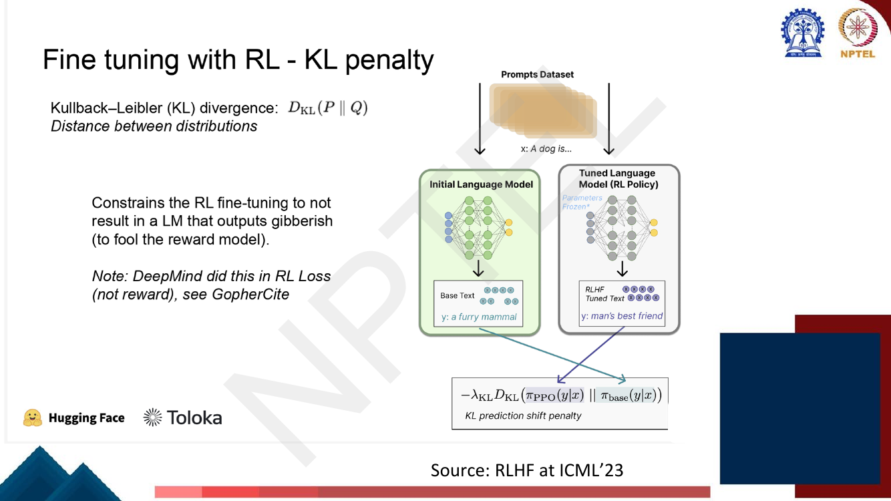
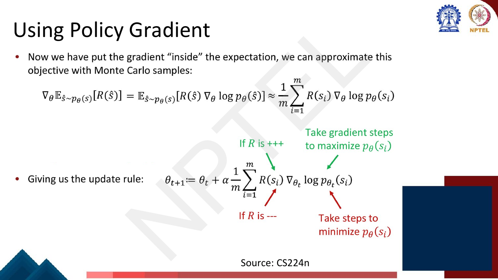
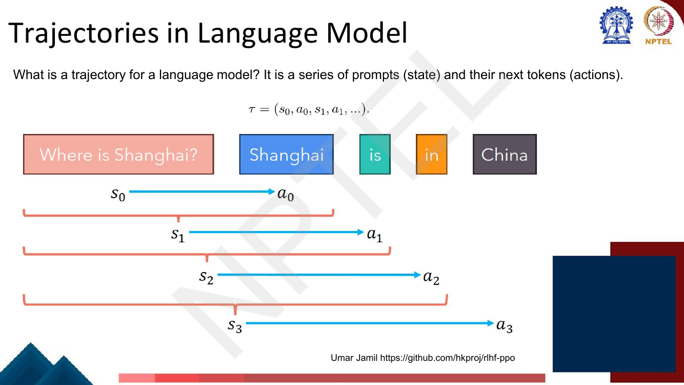
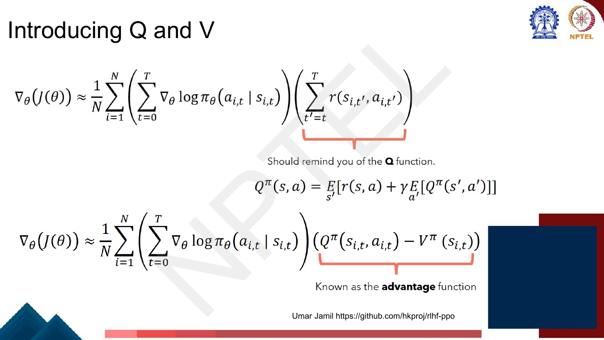

# Lec 39 — RLHF II: Policy Gradient and PPO

> **Source:** `Week8.pdf` pp. 90–116 · **Week 8** · **Playlist:** Lec 39
> **Prereqs:** [Lec 38 — RLHF I](38-rlhf-1.md), [Lec 10 — Gradient Descent and Initialization](../week-02/10-gradient-descent-and-init.md)
> **Feeds into:** [Lec 40 — Direct Preference Optimization](40-dpo.md), [Lec 60 — Machine Unlearning](../week-12/60-machine-unlearning.md)

## Why this lecture exists

Lecture 38 left you with a reward model: a network that reads a prompt and a response and returns one
number saying how much a human would like it. It also left you with the obvious next question and no
answer to it — *how do you actually change the language model's weights to make that number go up?*

You cannot backpropagate through it. The reward is computed on a string of **sampled** tokens, and
sampling is not differentiable; nor is the reward model guaranteed to be differentiable with respect to
anything you control. So this lecture builds the optimiser from scratch: the policy-gradient estimator
that gets a gradient out of a non-differentiable reward, the variance reductions that make it usable,
and **PPO**, the algorithm that actually ships. It also installs the leash — the KL penalty — without
which the whole procedure produces high-reward gibberish.

## The ideas

### Where we are

[Lec 38](38-rlhf-1.md) gave you the three stages — supervised fine-tuning, then a reward model
$r_\phi(x,y)$ trained on pairwise human preferences with the Bradley-Terry loss, then RL — plus the RL
vocabulary (agent, environment, state, action, policy, reward). This chapter is stage three and
nothing else. The reward model is a frozen black box from here on.

Two renamings before we start. The **policy** $\pi_\theta$ *is* the language model being tuned: given a
state it returns a distribution over next tokens. The **reference policy** $\pi_{\text{ref}}$ is a
frozen copy of the SFT model you started from. The deck calls these the "Tuned Language Model (RL
Policy)" and the "Initial Language Model", and in formulas writes them $\pi_{\text{PPO}}$ /
$\pi_{\text{base}}$ (page 96) and $p^{RL}_\theta$ / $p^{PT}$ (page 97). Same two objects throughout.

### The RLHF objective

What you want to maximise is the expected reward of what your model generates:

$$J(\theta) = \mathbb{E}_{x\sim\mathcal{D},\ y\sim\pi_\theta(\cdot\mid x)}\big[r_\phi(x,y)\big]$$

Prompts $x$ come from a prompt dataset; responses $y$ come from the policy itself. That self-reference
is what makes this reinforcement learning rather than supervised learning: **the data distribution you
are evaluated on depends on the parameters you are optimising.**

That objective on its own is not enough, and the fix is the single most examinable idea in the
chapter. The full objective is

$$\boxed{\;\max_\theta\ \mathbb{E}_{x\sim\mathcal{D},\ y\sim\pi_\theta}\big[r_\phi(x,y)\big] \;-\; \beta\, D_{\mathrm{KL}}\big(\pi_\theta \,\|\, \pi_{\text{ref}}\big)\;}$$

Before explaining why the second term exists, we have to define it, because this chapter owns that
definition for the whole book.

### KL divergence — the definition used in all 60 chapters

The **Kullback–Leibler divergence** from $p$ to $q$ is

$$D_{\mathrm{KL}}(q \,\|\, p) \;=\; \mathbb{E}_{q}\!\left[\log \frac{q(x)}{p(x)}\right] \;=\; \sum_x q(x)\,\log\frac{q(x)}{p(x)}$$

Read it as: *how many extra nats you pay, on average, for coding samples from $q$ using a code built
for $p$.* The expectation is taken under the **first** argument. That is the whole content of the
notation, and getting it backwards is the commonest error on this topic.

**It is non-negative.** Because $\log$ is concave, Jensen's inequality gives

$$-D_{\mathrm{KL}}(q\|p) = \mathbb{E}_q\!\left[\log\frac{p}{q}\right] \le \log \mathbb{E}_q\!\left[\frac{p}{q}\right] = \log \sum_x q(x)\frac{p(x)}{q(x)} = \log \sum_x p(x) = \log 1 = 0$$

so $D_{\mathrm{KL}}(q\|p) \ge 0$, with equality **iff $q = p$ everywhere**. This is why it works as a
penalty: it is zero when the policy has not moved and grows as it does.

**It is not symmetric.** $D_{\mathrm{KL}}(q\|p) \ne D_{\mathrm{KL}}(p\|q)$ in general, and it does not
satisfy the triangle inequality. **It is therefore not a distance or a metric** — the deck's page 96
calls it "distance between distributions", which is a useful slogan and formally wrong. Say
"divergence". Numerical N6 shows a pair of distributions whose two KLs differ by a factor of 1.9.

The asymmetry has a name and a consequence:

| | Written | Expectation under | Behaviour | What it does |
|---|---|---|---|---|
| **Forward KL** | $D_{\mathrm{KL}}(p \,\|\, \pi_\theta)$ | the *target* $p$ | **mode-covering** (mass-covering) | $\pi_\theta$ must put mass wherever $p$ has mass, or $\log(p/\pi_\theta)\to\infty$. Produces a blurry average that spreads over all modes. |
| **Reverse KL** | $D_{\mathrm{KL}}(\pi_\theta \,\|\, p)$ | the *model* $\pi_\theta$ | **mode-seeking** (zero-forcing) | $\pi_\theta$ is only penalised where it *itself* puts mass, so it can safely ignore modes. Collapses onto one high-probability mode. |

The mechanism in one line each. In the forward direction the penalty is weighted by $p$, so any $x$
where $p(x)$ is large and $\pi_\theta(x) \approx 0$ costs you enormously — the model is forced to cover
everything. In the reverse direction the weight is $\pi_\theta(x)$, so a region where $\pi_\theta$ is
zero contributes nothing at all no matter what $p$ does there — the model is free to pick one mode and
sit on it.

**RLHF uses the reverse KL**: the expectation is under $\pi_\theta$, the thing you are training, because
that is what you can sample from. Mode-seeking is arguably a feature here — you want one good answer,
not a smear over all plausible ones — but it is also the mechanism behind the well-known *diversity
collapse* of RLHF'd models. Lec 50's MiniLLM makes the same choice for distillation and Lec 60's
unlearning objectives use KL as a retain-set constraint; both link here.

**The single-sample estimator.** You cannot sum over all sequences $y$, so the deck does not compute
$D_{\mathrm{KL}}$ exactly. Page 97 folds it into the reward, per sample:

$$\tilde r(x,y) \;=\; r_\phi(x,y) \;-\; \beta \log \frac{\pi_\theta(y\mid x)}{\pi_{\text{ref}}(y\mid x)}$$

Take the expectation under $y \sim \pi_\theta$ and you recover the boxed objective exactly:
$\mathbb{E}_{\pi_\theta}[\log(\pi_\theta/\pi_{\text{ref}})]$ *is* $D_{\mathrm{KL}}(\pi_\theta\|\pi_{\text{ref}})$
by definition. So the deck's two presentations — "penalty on the reward" (page 97) and "penalty on the
loss" (page 96's $-\lambda_{\mathrm{KL}} D_{\mathrm{KL}}$) — are the same objective; which one you
implement only changes where the term enters the computation graph. The deck's note *"DeepMind did
this in RL Loss (not reward), see GopherCite"* is pointing at exactly that choice.

### Why the KL penalty is there: reward hacking


*Fig. — Both models see the same prompt; the penalty compares their output distributions. The slide's wording — "constrains the RL fine-tuning to not result in a LM that outputs gibberish (to fool the reward model)" — is the whole argument in one sentence. Note the term is **subtracted**. Page 96.*

$r_\phi$ is not the real human preference. It is a neural network fitted to a finite set of comparisons,
and like any fitted model it is accurate near its training distribution and arbitrary far from it.
Maximising it without constraint is a search for the inputs where the approximation is *most wrong in
your favour*. The policy will find them. It drifts arbitrarily far from the reference model and lands
on degenerate text that scores enormously under $r_\phi$ and is worthless to a human — repeated
flattery, a particular punctuation tic, a sentence fragment the reward model happens to love.

This failure has two interchangeable names: **reward hacking** and **reward-model
over-optimisation**. State it in those terms.

**The KL term is a leash.** It does not stop the policy from improving; it charges it for every nat of
distance it moves from $\pi_{\text{ref}}$. $\beta$ sets the length of the leash: $\beta \to 0$ is no
leash (free reward hacking), $\beta \to \infty$ freezes the policy at $\pi_{\text{ref}}$. Everything
useful happens in between, and the deck shows you exactly what that trade-off looks like.


*Fig. — The two curves are the entire argument. The reward model's own prediction (dashed) says the policy keeps getting better forever. Real human preference (solid) peaks at a KL of about 10 at ≈0.47 and has collapsed below the starting point by KL 250. Everything right of the peak is reward hacking. The formula underneath is the per-sample KL-penalised reward. Page 97.*

Two things to extract from that figure for an MCQ. First, the gap between the dashed and solid curves
*is* the error in the reward model, and it widens monotonically with KL. Second, the optimum is at a
**finite, small** KL — tuning $\beta$ is tuning for that peak, and there is no "more optimisation is
better" regime.

### Why you cannot just take the gradient

Page 93 states the problem: it writes the gradient-ascent update
$\theta_{t+1} := \theta_t + \alpha\,\nabla_{\theta_t}\mathbb{E}_{\hat s \sim p_{\theta_t}(s)}[R(\hat s)]$
and hangs two annotations off it — *"how do we estimate this expectation??"* and *"what if our reward
function is non-differentiable??"*. (The deck writes the learning rate as $\alpha$; this book writes
$\eta$. It also writes $\hat s$ for a **sampled sequence** here, while six pages later $s_t$ is a
**state** — two unrelated meanings of $s$ inside one lecture.)

The two obstacles, precisely:

1. **How do you estimate the expectation?** It is a sum over every sequence the model could generate —
   $|V|^T$ terms. Intractable.
2. **What if the reward is non-differentiable?** $r_\phi$ is applied to discrete sampled tokens. There
   is no $\partial r/\partial \theta$ to chain through, because the sampling step in between has no
   usable derivative.

Policy gradient solves both at once, and it does so without ever differentiating $r$.

### Policy gradient and the log-derivative trick


*Fig. — Four lines, and the only non-obvious one is the middle: $\nabla p = p \nabla \log p$ is just the chain rule read backwards. Notice $R$ is never differentiated anywhere in the derivation. Page 94.*

Write the expectation as a sum and push the gradient inside:

$$\nabla_\theta\, \mathbb{E}_{y \sim \pi_\theta}[r(y)] \;=\; \nabla_\theta \sum_y r(y)\, \pi_\theta(y) \;=\; \sum_y r(y)\, \nabla_\theta \pi_\theta(y)$$

The first step is the definition of an expectation, the second is linearity of the gradient. $r(y)$
survives untouched because it does not depend on $\theta$ — *this is the step that removes the
differentiability requirement.*

Now the **log-derivative trick**. By the chain rule,

$$\nabla_\theta \log \pi_\theta(y) = \frac{1}{\pi_\theta(y)}\nabla_\theta \pi_\theta(y)
\qquad\Longrightarrow\qquad
\nabla_\theta \pi_\theta(y) = \pi_\theta(y)\, \nabla_\theta \log \pi_\theta(y)$$

Substitute it back and a probability reappears in front of the summand, which means the sum is an
expectation again:

$$\sum_y r(y)\,\nabla_\theta \pi_\theta(y) \;=\; \sum_y \pi_\theta(y)\, r(y)\, \nabla_\theta \log \pi_\theta(y) \;=\; \mathbb{E}_{y\sim\pi_\theta}\big[\, r(y)\, \nabla_\theta \log \pi_\theta(y)\,\big]$$

That is the **REINFORCE estimator**. The gradient of an expectation has become an expectation of a
gradient, and an expectation you can estimate by sampling:

$$\nabla_\theta J \;\approx\; \frac{1}{m}\sum_{i=1}^{m} r(y_i)\, \nabla_\theta \log \pi_\theta(y_i),
\qquad
\theta \leftarrow \theta + \eta\, \frac{1}{m}\sum_{i=1}^{m} r(y_i)\, \nabla_\theta \log \pi_\theta(y_i)$$


*Fig. — The two coloured annotations are the intuition and they are worth memorising verbatim. The reward is a scalar multiplier on a log-likelihood gradient; its **sign** sets the direction and its **magnitude** sets the step size. Page 95.*

**The intuition.** $\nabla_\theta \log \pi_\theta(y)$ is exactly the gradient you would use to train on
$y$ as if it were ground truth — ordinary maximum-likelihood. REINFORCE multiplies it by the reward.
So: *sample your own output, then do supervised learning on it with the reward as the weight.* Good
outputs ($r > 0$) get their log-probability pushed up; bad outputs ($r < 0$) get it pushed down. The
model teaches itself from its own samples, graded.

One consequence that trips people up: if every reward is positive, every single sample has its
probability *increased*, and the policy only improves because high-reward samples are pushed harder
than low-reward ones. That is a weak signal and part of why baselines (below) matter so much.

### Thinking in terms of trajectories

REINFORCE as written treats a whole response as one atomic action. Real RL decomposes it. A
**trajectory** is an alternating sequence of states and actions starting from an initial state:

$$\tau = (s_0, a_0, s_1, a_1, \ldots)$$

The environment is stochastic — $s_{t+1} \sim P(\cdot \mid s_t, a_t)$ — so a trajectory has a
probability

$$P(\tau \mid \pi) = \rho_0(s_0) \prod_{t=0}^{T-1} P(s_{t+1}\mid s_t, a_t)\, \pi(a_t \mid s_t)$$

where $\rho_0$ is the initial-state distribution. (Careful: the deck's $\rho_0$ here is unrelated to the
importance ratio $\rho_t$ later in the same deck.) The return is **discounted**:

$$R(\tau) = \sum_{t=0}^{\infty} \gamma^t r_t, \qquad 0 < \gamma \le 1$$

with $\gamma$ expressing a preference for immediate over future reward. For RLHF with a single
end-of-sequence reward, $\gamma$ is normally set to 1 and the discounting disappears — but know the
definition.

Redo the derivation with trajectories and the only thing that changes is that
$\log P(\tau\mid\theta)$ factors. The transition terms $P(s_{t+1}\mid s_t,a_t)$ and $\rho_0(s_0)$ do not
depend on $\theta$, so their gradients vanish, leaving only the policy terms:

$$\nabla_\theta J(\pi_\theta) = \mathbb{E}_{\tau\sim\pi_\theta}\left[\sum_{t=0}^{T}\nabla_\theta \log \pi_\theta(a_t\mid s_t)\, R(\tau)\right]
\;\approx\; \hat g = \frac{1}{|\mathcal{D}|}\sum_{\tau\in\mathcal{D}}\sum_{t=0}^{T}\nabla_\theta \log \pi_\theta(a_t\mid s_t)\, R(\tau)$$

**That the environment model drops out is the point of the whole derivation** — you never need to know
the transition dynamics. For a language model you do know them, and knowing them makes the next page
easy.

### Trajectories in a language model


*Fig. — The single most useful picture in the lecture. **State = everything generated so far (prompt included). Action = the next token.** The state grows by one token per step, so the transition is deterministic: $s_{t+1} = s_t \,\|\, a_t$. Page 100.*

So for an LM:

| RL concept | Language-model realisation |
|---|---|
| state $s_t$ | the prompt concatenated with all tokens generated so far |
| action $a_t$ | the next token — the action space is the vocabulary $V$ |
| policy $\pi_\theta(a_t\mid s_t)$ | the softmax over the vocabulary at position $t$ |
| transition $P(s_{t+1}\mid s_t,a_t)$ | deterministic concatenation; probability 1 |
| trajectory $\tau$ | one generated response |
| episode end | the EOS token, or the length limit |

The deterministic transition is the simplification that makes RLHF tractable: all the stochasticity
lives in the policy, which is exactly the thing you are optimising.

### Calculating log probabilities


*Fig. — The practical recipe for the $\log \pi_\theta(a_t\mid s_t)$ factor. Four steps, bottom to top. The causal mask is what makes this a single forward pass rather than $T$ of them. Page 102.*

To get every $\log \pi_\theta(a_t \mid s_t)$ in the trajectory you do **one** forward pass over the full
prompt-plus-response sequence:

1. Run the sequence through the policy. Because of the **causal mask**
   ([Lec 24](../week-05/24-decoder-and-transformer-lm.md)), hidden state $t$ encodes only tokens
   $\le t$ — which is precisely the definition of $s_t$.
2. Apply the output projection to **all** positions at once to get logits.
3. Apply `log_softmax`, i.e. $\log(\mathrm{softmax}(x))$, to get log-probabilities over the vocabulary
   at every position.
4. **Gather** the single entry corresponding to the token actually generated. That is
   $\log\pi_\theta(a_t\mid s_t)$.

Step 4 is the one people get wrong: you want the log-probability of the *action taken*, not the max,
not the entropy, not the whole row.

### Calculating rewards

Page 103 draws the other factor, $R(\tau)$, the same way: the token sequence goes through a transformer
labelled "Reward model", and a **linear layer with only one output feature** sits on each hidden state
at the *response* positions (not the prompt), emitting Reward($t{=}0$) … Reward($t{=}3$).
Architecturally the reward model is just an LM with its vocabulary-sized head replaced by a scalar one.

The reward model from [Lec 38](38-rlhf-1.md) is a separate network with the same backbone shape and a
scalar head. In practice RLHF uses only the reward at the **final** token — the score of the complete
response — and sets $r_t = 0$ elsewhere, then adds the per-token KL penalty
$-\beta\log(\pi_\theta/\pi_{\text{ref}})$ at every position. The deck draws a reward at every position,
which is the general case.

### The high-variance problem

The REINFORCE estimator is **unbiased** — in expectation it equals the true gradient, so with enough
samples it converges. The deck states this explicitly and then states the catch: **it has very high
variance**. In practice that means your gradient estimate from a realistic batch points in a direction
that is only loosely related to the true one, training is unstable, and you need either enormous
batches or a smaller learning rate than you can afford.

Where does the variance come from? Three places, and the deck fixes two of them:

- Every action in the trajectory is multiplied by the **same** scalar $R(\tau)$, including rewards that
  arrived *before* the action was taken. Pure noise. → fixed by reward-to-go.
- $R(\tau)$ has an arbitrary offset. If all returns are around $+1000$ with a spread of $\pm 1$, the
  estimator is dominated by the irrelevant 1000. → fixed by a baseline.
- Sampling the trajectory itself. → mitigated by larger batches; not addressed here.

### Fix 1: "you can't alter the past" — reward-to-go


*Fig. — The only change is the lower limit of the inner sum: $\sum_{t'=0}^{T} \to \sum_{t'=t}^{T}$. One index, and it is one of the two things that make policy gradient work at all. Page 105.*

An action at time $t$ cannot have caused a reward received at time $t' < t$. Causality says those terms
contribute nothing in expectation; they are pure variance. So drop them:

$$\nabla_\theta J(\theta) \approx \frac{1}{N}\sum_{i=1}^{N}\left(\sum_{t=0}^{T}\nabla_\theta\log\pi_\theta(a_{i,t}\mid s_{i,t})\right)\left(\sum_{t'=t}^{T} r(s_{i,t'}, a_{i,t'})\right)$$

The inner right-hand sum is the **reward-to-go**, $G_t = \sum_{t'=t}^{T} r_{t'}$. The deck says "it has
been proven that past terms cancel out in expectation"; the proof is the same baseline argument below,
applied to a term that is independent of $a_t$. N2 shows the variance collapse on a concrete trajectory.

### Fix 2: baselines


*Fig. — Why a state-dependent baseline is the right one: the two example prefixes deserve different reference points. Measuring a continuation of the second against the first's standard would be meaningless. Page 106.*

Subtract a **baseline** $b$ from the return:

$$\nabla_\theta J(\theta) \approx \frac{1}{N}\sum_{i=1}^{N}\left(\sum_{t=0}^{T}\nabla_\theta\log\pi_\theta(a_{i,t}\mid s_{i,t})\right)\left(\sum_{t'=t}^{T} r(s_{i,t'},a_{i,t'}) - b\right)$$

**Why this is unbiased.** The extra term you have introduced is
$\mathbb{E}_{a\sim\pi_\theta}\big[\nabla_\theta \log \pi_\theta(a\mid s)\, b(s)\big]$. Provided $b$ does
not depend on the action $a$:

$$\mathbb{E}_{a\sim\pi_\theta}\!\big[\nabla_\theta \log \pi_\theta(a\mid s)\big] \, b(s)
= b(s)\sum_a \pi_\theta(a\mid s)\, \frac{\nabla_\theta \pi_\theta(a\mid s)}{\pi_\theta(a\mid s)}
= b(s)\, \nabla_\theta \sum_a \pi_\theta(a\mid s)
= b(s)\, \nabla_\theta 1 = 0$$

The sum of the probabilities is the constant 1, whose gradient is zero. **So the baseline changes
nothing in expectation and can change the variance a great deal** — you get the variance reduction for
free. The condition is that $b$ must be a function of the state only. A baseline that peeked at the
action would bias the estimate.

The deck's choice of baseline is the **value function** $V^\pi(s)$: the expected future reward from
state $s$ when acting according to $\pi$ thereafter. That is the natural reference point — "how good
did I expect this situation to be before I chose anything?"

### The value head


*Fig. — The value head: one extra linear layer, one scalar out per position. Architecturally identical to the reward head on page 103; the difference is what it predicts (expected future return, not the human score) and that it is trained jointly with the policy. Page 107.*

You cannot compute $V^\pi(s)$ in closed form, so you learn it. The deck's answer is **"an additional
linear layer on top of our language model"** that maps each hidden state to one number, $V_\theta(s_t)$.
It is trained by regression against the observed returns — that is PPO's $\mathcal{L}_{\mathrm{VF}}$
term, below. Note that it shares the transformer backbone with the policy, which is cheap but couples
the two objectives.

### Q, V and the advantage


*Fig. — The reward-to-go **is** a one-sample estimate of $Q^\pi(s_t,a_t)$, and the baseline **is** $V^\pi(s_t)$, so "reward-to-go minus baseline" was the advantage all along. Page 108.*

Three definitions. Memorise all three; the exam discriminates between them.

| Symbol | Name | Definition | In words |
|---|---|---|---|
| $Q^\pi(s,a)$ | action-value | $\mathbb{E}_{s'}\big[r(s,a) + \gamma\, \mathbb{E}_{a'}[Q^\pi(s',a')]\big]$ | expected return if you take action $a$ in state $s$ and follow $\pi$ after |
| $V^\pi(s)$ | state-value | $\mathbb{E}_{a\sim\pi}[Q^\pi(s,a)]$ | expected return from $s$ if you follow $\pi$ **including the choice at $s$** |
| $A^\pi(s,a)$ | advantage | $Q^\pi(s,a) - V^\pi(s)$ | how much better this action was than the policy's own average |

The discriminator: $Q$ *commits* to a specific action at $s$; $V$ *averages over* the policy's actions
at $s$. Hence the identity $V^\pi(s) = \sum_a \pi(a\mid s) Q^\pi(s,a)$ and the immediate corollary
$\mathbb{E}_{a\sim\pi}[A^\pi(s,a)] = 0$ — **under its own policy the advantage averages to zero**.
Verify that in N3; it is a clean MCQ answer and a one-line sanity check on any implementation.

**Interpreting the advantage.** The deck: *"the advantage function tells us how much better it is to
choose a particular action $a$ in a state $s$ over the average expectation we get by choosing randomly
an action in the same state $s$."* That is what you actually want to reinforce. The raw return tells
you that a response was good; the advantage tells you whether it was good **because of this choice** or
merely because the situation was already good. Only the second is information about the action.

So the gradient becomes

$$\nabla_\theta J(\theta) \approx \frac{1}{N}\sum_{i=1}^{N}\sum_{t=0}^{T}\nabla_\theta\log\pi_\theta(a_{i,t}\mid s_{i,t})\; A^\pi(s_{i,t},a_{i,t})$$

**The advantage term for LMs.** State = "Where is Shanghai?", action = the next token. Emitting
`Shanghai` leads to a good response and a high reward, so $A > 0$ and the gradient step raises
$\log\pi_\theta(\texttt{Shanghai}\mid s)$ — the model picks it more often next time it sees that prompt.
Emitting `Chocolate` leads to a bad response, $A < 0$, and the step *lowers* that token's
log-probability. Credit assignment down to the individual token is exactly what the advantage buys you.

### Off-policy learning via importance sampling

The estimator requires $\tau \sim \pi_\theta$: samples from the **current** policy. The moment you take
one gradient step, $\theta$ has changed and all your samples are stale. But generating from a large LM
is far more expensive than a gradient step, and neural networks are trained with many small steps. So
on-policy learning wastes almost all of its compute on generation.

**Importance sampling** lets you evaluate an expectation under $p$ using samples drawn from $q$:

$$\mathbb{E}_{x\sim p}[f(x)] = \int p(x)f(x)\,dx = \int q(x)\frac{p(x)}{q(x)} f(x)\, dx = \mathbb{E}_{x\sim q}\!\left[\frac{p(x)}{q(x)} f(x)\right]$$

Multiply and divide by $q(x)$; that is the entire derivation. Applied to the policy gradient with
$q = \pi_{\theta_{\text{old}}}$, the policy that actually produced the samples:

$$\nabla_\theta J \approx \mathbb{E}_{\tau \sim \pi_{\theta_{\text{old}}}}\left[\sum_t \rho_t \,\nabla_\theta \log \pi_\theta(a_t\mid s_t)\, A_t\right],
\qquad
\rho_t = \frac{\pi_\theta(a_t\mid s_t)}{\pi_{\theta_{\text{old}}}(a_t\mid s_t)}$$

$\rho_t$ is the **importance ratio** (or probability ratio), and it is the object the PPO loss is
built around. $\rho_t = 1$ means the new policy would have made the same choice with the same
probability; $\rho_t > 1$ means it now prefers that action more.


*Fig. — This loop is what makes PPO sample-efficient: one expensive generation pass feeds $K$ cheap gradient epochs. The deck's footnote matters — **you do not hold two copies of the policy**; you sample trajectories, cache their log-probabilities, and reuse the cache. Page 113.*

The deck names the two policies $\theta_{\text{offline}}$ (the sampler, elsewhere $\theta_{\text{old}}$)
and $\theta_{\text{online}}$ (the one being updated). After $K$ epochs they are resynchronised and you
generate again.

And here is the catch that creates PPO. Importance sampling is only well-behaved while $q$ is close to
$p$. As $\pi_\theta$ drifts away from $\pi_{\theta_{\text{old}}}$ over those $K$ epochs, $\rho_t$ can
explode, a single sample can dominate the whole batch, and the policy takes a catastrophic step it
cannot recover from. You need to stop $\rho_t$ from wandering far from 1.

### The PPO loss


*Fig. — The destination of the whole lecture. Three terms: the clipped surrogate, the value-head regression, and an entropy bonus. Page 114.*

$$\mathcal{L}_{\text{POLICY}} = \mathbb{E}_t\Big[\min\big(\rho_t \hat A_t,\ \ \mathrm{clip}(\rho_t,\, 1-\epsilon,\, 1+\epsilon)\,\hat A_t\big)\Big]$$

This is maximised. $\mathrm{clip}(\rho, 1-\epsilon, 1+\epsilon)$ returns $\rho$ if it is inside the band
and the nearer endpoint otherwise; $\epsilon$ is typically $0.2$, so the band is $[0.8, 1.2]$.

**What the clipping does.** Inside the band, $\mathrm{clip}(\rho)=\rho$, both arguments of the $\min$
are equal, and the loss is the plain importance-weighted policy gradient. Outside the band, the clipped
branch is **constant in $\theta$** — its gradient is exactly zero. The clipped term therefore says:
*past this ratio I will pay you nothing more for moving further.* The incentive to take a huge step
from one batch of stale samples disappears. This is what "proximal" means in Proximal Policy
Optimization: keep the new policy proximal to the old one, enforced by the objective itself rather than
by a hard constraint.

**Why the $\min$ is there, and the asymmetry.** The $\min$ takes the *smaller* of the two terms, which
makes the objective a **pessimistic lower bound** on the unclipped surrogate. Work through the four
cases with $\epsilon = 0.2$:

| Advantage | Ratio | Which term is smaller | Effect |
|---|---|---|---|
| $A > 0$ | $\rho > 1+\epsilon$ | clipped $(1{+}\epsilon)A$ | **clipped** — gain is capped at $1.2A$, gradient zero |
| $A > 0$ | $\rho < 1-\epsilon$ | unclipped $\rho A$ | **not clipped** — full gradient pushes $\rho$ back up |
| $A < 0$ | $\rho > 1+\epsilon$ | unclipped $\rho A$ (more negative) | **not clipped** — full penalty, gradient pushes $\rho$ back down |
| $A < 0$ | $\rho < 1-\epsilon$ | clipped $(1{-}\epsilon)A$ | **clipped** — credit is capped at $0.8A$, gradient zero |

Read the pattern. Clipping only ever **lowers** the objective, and it binds only when the update has
already moved the ratio *in the direction the advantage wants* and gone too far. When the ratio has
moved the **wrong** way, the $\min$ selects the unclipped term and the full gradient flows — the
algorithm never caps its own ability to undo a mistake.

That is the asymmetry exams probe: **improvements are capped, harms are not.** Row three is the
single most examinable computation in the chapter — ratio above the band with a *negative* advantage,
and the answer is "no clipping", which is the opposite of what the phrase "ratio is outside the band"
suggests. N5 works it numerically.

**The other two terms.**

$$\mathcal{L}_{\mathrm{VF}} = \tfrac{1}{2}\Big\|\,V_\theta(s) - \big(\textstyle\sum_{t=0}^{T}\gamma^t r_t \mid s_0 = s\big)\Big\|_2^2
\qquad
\mathcal{L}_{\mathrm{ENTROPY}} = -\sum_x p(x)\log p(x)$$

$\mathcal{L}_{\mathrm{VF}}$ is plain squared-error regression training the value head against the
realised discounted return — the baseline has to be learned, and this is where. $\mathcal{L}_{\mathrm{ENTROPY}}$
is the entropy of the policy's output distribution, added as a **bonus** to discourage premature
collapse onto one token. The deck combines them:

$$\mathcal{L}_{\mathrm{PPO}} = \mathcal{L}_{\text{POLICY}} + c_1 \mathcal{L}_{\mathrm{VF}} + c_2 \mathcal{L}_{\mathrm{ENTROPY}}$$

**Sign warning.** The deck prints all plus signs, but $\mathcal{L}_{\mathrm{VF}}$ is an *error* being
minimised while the whole expression is being *maximised*. Schulman et al. (2017), eq. 9, write
$\mathcal{L} = \hat{\mathbb{E}}_t[\mathcal{L}^{\mathrm{CLIP}}_t - c_1 \mathcal{L}^{\mathrm{VF}}_t + c_2 S[\pi_\theta](s_t)]$
— value error **subtracted**, entropy added. Follow the paper's signs; the deck's page 114 is
inconsistent as printed. (It also prints $V_{\theta(s)}$ for $V_\theta(s)$.)

Note where the KL penalty is **not**: it is not in $\mathcal{L}_{\mathrm{PPO}}$. In the InstructGPT
recipe the KL term is baked into $r_t$ before the advantage is computed (page 97's $\tilde r$). This
is the standard arrangement and a thing an exam can ask about.

### What this costs, and why Lec 40 exists

Count what has to be in GPU memory to run one PPO step:

| Model | Role | Trained? |
|---|---|---|
| **Policy** $\pi_\theta$ | generates, and is updated | yes |
| **Reference** $\pi_{\text{ref}}$ | supplies the KL penalty | frozen |
| **Reward model** $r_\phi$ | scores completions | frozen |
| **Value head / critic** $V_\theta$ | supplies the baseline | yes |

**Four models.** Two of them trained, all four resident. On top of that: generation in the loop (slow),
an estimator that is unbiased but noisy, an importance ratio that destabilises as soon as it drifts,
and at least $\beta$, $\epsilon$, $\gamma$, $K$, $c_1$, $c_2$ and the learning rate to tune — with a
failure mode (reward hacking) that does not show up in the training curves, because the reward model's
own number keeps rising while quality falls.

That is the complaint [Lec 40](40-dpo.md) answers. DPO eliminates the reward model and the RL loop
entirely, reducing alignment to a single supervised loss on preference pairs.

## Worked numericals

The deck contains **no "Try this problem" page** anywhere in pages 90–116 — every page is exposition
or a derivation. All six below are constructed to match the exam's shape.

### N1. One REINFORCE gradient step by hand
**Given:** a 3-token trajectory from the prompt `Where is Shanghai?`. At each step the policy is a
softmax over a 3-word vocabulary, with logits $z = \log \pi$ so the printed probabilities are exact.
Terminal reward $R(\tau) = +2$, learning rate $\eta = 0.1$, no discounting.

| $t$ | vocabulary | $\pi_\theta$ | action taken |
|---|---|---|---|
| 0 | (Shanghai, Chocolate, China) | $(0.5,\,0.3,\,0.2)$ | Shanghai |
| 1 | (is, was, in) | $(0.8,\,0.1,\,0.1)$ | is |
| 2 | (China, Japan, Chocolate) | $(0.25,\,0.25,\,0.5)$ | China |

**Find:** the trajectory log-probability, each step's gradient contribution, and the direction of the update.

1. Log-probabilities of the actions taken:
   $\log 0.5 = -0.693147$, $\log 0.8 = -0.223144$, $\log 0.25 = -1.386294$.
2. Sum: $-0.693147 - 0.223144 - 1.386294 = -2.302585$. Check: $e^{-2.302585} = 0.1 = 0.5\times0.8\times0.25$ ✓
3. For a softmax, the gradient of $\log\pi_\theta(a)$ with respect to the logit vector is
   $\nabla_{\mathbf{z}}\log\pi_\theta(a) = \mathbf{e}_a - \boldsymbol{\pi}$ (one-hot minus the
   probability vector). Per step:
   - $t=0$: $(1,0,0) - (0.5,0.3,0.2) = (0.5,\,-0.3,\,-0.2)$
   - $t=1$: $(1,0,0) - (0.8,0.1,0.1) = (0.2,\,-0.1,\,-0.1)$
   - $t=2$: $(1,0,0) - (0.25,0.25,0.5) = (0.75,\,-0.25,\,-0.5)$
4. Multiply each by $R(\tau) = 2$:
   $(1.0,-0.6,-0.4)$, $\quad(0.4,-0.2,-0.2)$, $\quad(1.5,-0.5,-1.0)$.
5. Ascent step at $t=0$: $z \leftarrow (-0.693147,-1.203973,-1.609438) + 0.1(1.0,-0.6,-0.4)
   = (-0.593147,\,-1.263973,\,-1.649438)$. Re-softmaxed: $\boldsymbol\pi' = (0.5379,\,0.2750,\,0.1871)$.
6. Same at $t=1$: $\boldsymbol\pi' = (0.8094,\,0.0953,\,0.0953)$. At $t=2$: $\boldsymbol\pi' = (0.2962,\,0.2425,\,0.4613)$.

**Answer:** $\log P = -2.302585$ ($P = 0.1$). Every action taken had its probability **increased**
($0.5\to0.5379$, $0.8\to0.8094$, $0.25\to0.2962$) and every alternative decreased, because $R > 0$.
The largest move is at $t = 2$, where the action taken was the least likely — the gradient
$1 - \pi(a)$ is biggest where the model was most surprised by its own choice. **Had $R = -2$, every
sign flips and all three actions become less likely.**

### N2. Reward-to-go versus total reward
**Given:** the same 3-step trajectory. The per-step rewards are $r_0$, $r_1 = 0$, $r_2 = +3$, where
$r_0$ is a bonus delivered **before the action at $t=1$** and is $+5$ or $-5$ with probability $\tfrac12$
each, independent of everything the policy does. $\gamma = 1$.
**Find:** the scalar multiplying $\nabla_\theta\log\pi_\theta(a_1\mid s_1)$ under each estimator, and its variance.

1. **Total reward.** $R(\tau) = r_0 + r_1 + r_2$, so the weight is $+5+0+3 = 8$ or $-5+0+3 = -2$.
2. Mean: $\tfrac12(8) + \tfrac12(-2) = 3$.
3. Variance: $\tfrac12(8-3)^2 + \tfrac12(-2-3)^2 = \tfrac12(25) + \tfrac12(25) = \mathbf{25}$.
4. **Reward-to-go.** $G_1 = \sum_{t'=1}^{2} r_{t'} = 0 + 3 = 3$, for **both** values of $r_0$ — $r_0$ is
   in the past and is dropped.
5. Mean: $3$. Variance: $\mathbf{0}$.

**Answer:** both estimators have mean 3, so dropping the past terms is **unbiased**; the variance falls
from 25 to 0. The past reward was pure noise: it could not have been caused by $a_1$, so including it
only injected $\pm 5$ of randomness into every gradient. For completeness the three reward-to-go values
on this trajectory are $G_0 = r_0 + 3$, $G_1 = 3$, $G_2 = 3$.

### N3. A baseline: same expected gradient, far less variance
**Given:** one state $s$ with three actions, $\boldsymbol\pi = (0.5, 0.3, 0.2)$ and returns
$G = (10, 8, 6)$. Baseline $b = V^\pi(s)$. Look at the gradient component for the **first** logit,
for which $\nabla_{z_0}\log\pi(a) = \mathbb{1}[a=0] - \pi_0$.
**Find:** $V^\pi(s)$, the advantages, and the mean and variance of the estimator with and without the baseline.

1. $V^\pi(s) = \sum_a \pi(a)G(a) = 0.5(10) + 0.3(8) + 0.2(6) = 5 + 2.4 + 1.2 = \mathbf{8.6}$.
2. Advantages: $A = G - V = (10-8.6,\ 8-8.6,\ 6-8.6) = (\mathbf{+1.4},\ \mathbf{-0.6},\ \mathbf{-2.6})$.
3. Check: $\mathbb{E}_\pi[A] = 0.5(1.4) + 0.3(-0.6) + 0.2(-2.6) = 0.7 - 0.18 - 0.52 = \mathbf{0}$ ✓
4. Per-action estimator **without** baseline: $(1-0.5)(10) = 5$; $(0-0.5)(8) = -4$; $(0-0.5)(6) = -3$.
5. Its mean: $0.5(5) + 0.3(-4) + 0.2(-3) = 2.5 - 1.2 - 0.6 = \mathbf{0.70}$.
6. Second moment: $0.5(25) + 0.3(16) + 0.2(9) = 12.5 + 4.8 + 1.8 = 19.1$. Variance $= 19.1 - 0.70^2 = \mathbf{18.61}$.
7. Per-action estimator **with** baseline: $(0.5)(1.4) = 0.7$; $(-0.5)(-0.6) = 0.3$; $(-0.5)(-2.6) = 1.3$.
8. Its mean: $0.5(0.7) + 0.3(0.3) + 0.2(1.3) = 0.35 + 0.09 + 0.26 = \mathbf{0.70}$ — **identical**.
9. Second moment: $0.5(0.49) + 0.3(0.09) + 0.2(1.69) = 0.245 + 0.027 + 0.338 = 0.61$. Variance $= 0.61 - 0.49 = \mathbf{0.12}$.

**Answer:** expected gradient $0.70$ either way (unbiased, as the $\nabla\sum_a\pi = \nabla 1 = 0$
proof guarantees); variance falls $18.61 \to 0.12$, a factor of **155**. Note *why*: without the
baseline every return is positive, so the estimator's magnitude is dominated by the irrelevant offset
of $\approx 8.6$ shared by all three actions.

### N4. The KL penalty, and the trade-off as $\beta$ varies
**Given:** a 4-token vocabulary with reference $\pi_{\text{ref}} = (0.25, 0.25, 0.25, 0.25)$. Two
candidate policies: $\pi_A = (0.5, 0.25, 0.15, 0.10)$ with reward $1.2$, and
$\pi_B = (0.9, 0.05, 0.03, 0.02)$ with reward $2.0$.
**Find:** both KL divergences, the penalised objective at $\beta = 0.1$ and $\beta = 2.0$, and the $\beta$ at which the winner flips.

1. $D_{\mathrm{KL}}(\pi_A\|\pi_{\text{ref}}) = \sum_i \pi_A(i)\log\frac{\pi_A(i)}{0.25}$, term by term:
   - $0.5\log 2 = 0.5(0.693147) = +0.346574$
   - $0.25\log 1 = 0$
   - $0.15\log 0.6 = 0.15(-0.510826) = -0.076624$
   - $0.10\log 0.4 = 0.10(-0.916291) = -0.091629$
2. Sum: $0.346574 + 0 - 0.076624 - 0.091629 = \mathbf{0.178321}$ nats. (Positive, as it must be — note
   that individual terms can be negative; only the total is guaranteed non-negative.)
3. $D_{\mathrm{KL}}(\pi_B\|\pi_{\text{ref}})$:
   $0.9\log 3.6 = 1.152841$; $0.05\log 0.2 = -0.080472$; $0.03\log 0.12 = -0.063608$;
   $0.02\log 0.08 = -0.050515$. Sum $= \mathbf{0.958246}$.
4. At $\beta = 0.1$: $\;A: 1.2 - 0.1(0.178321) = \mathbf{1.18217}$; $\;B: 2.0 - 0.1(0.958246) = \mathbf{1.90418}$. **B wins.**
5. At $\beta = 2.0$: $\;A: 1.2 - 2(0.178321) = \mathbf{0.84336}$; $\;B: 2.0 - 2(0.958246) = \mathbf{0.08351}$. **A wins.**
6. Crossover: solve $1.2 - \beta(0.178321) = 2.0 - \beta(0.958246)$
   $\Rightarrow \beta(0.958246 - 0.178321) = 0.8 \Rightarrow \beta = 0.8 / 0.779925 = \mathbf{1.0257}$.

**Answer:** $D_{\mathrm{KL}}(\pi_A\|\pi_{\text{ref}}) = 0.1783$, $D_{\mathrm{KL}}(\pi_B\|\pi_{\text{ref}}) = 0.9582$;
B is preferred for $\beta < 1.0257$ and A for $\beta > 1.0257$. **$\beta$ is literally the exchange rate
between reward and distance from the reference model.** The sharp, high-reward policy B is the reward
hacker; a large enough $\beta$ refuses to buy its extra 0.8 of reward at the price of 0.78 extra nats.

### N5. The PPO clipped objective, all three cases
**Given:** $\epsilon = 0.2$, so the clip band is $[0.8,\, 1.2]$.
**Find:** the unclipped term, the clipped term and the $\min$ for (i) $\rho=1.1,\ \hat A=+2$;
(ii) $\rho=1.5,\ \hat A=+2$; (iii) $\rho=1.5,\ \hat A=-1$; and for contrast (iv) $\rho=0.5,\ \hat A=-1$.

1. **(i) $\rho = 1.1$, $\hat A = +2$ (inside the band).**
   Unclipped: $1.1 \times 2 = 2.20$. $\mathrm{clip}(1.1, 0.8, 1.2) = 1.1$, so clipped $= 2.20$.
   $\min(2.20, 2.20) = \mathbf{2.20}$. **Clipping has no effect; the gradient is the ordinary one.**
2. **(ii) $\rho = 1.5$, $\hat A = +2$ (above the band, good action).**
   Unclipped: $1.5\times2 = 3.00$. $\mathrm{clip}(1.5,0.8,1.2) = 1.2$, so clipped $= 1.2\times2 = 2.40$.
   $\min(3.00, 2.40) = \mathbf{2.40}$. **Clipping binds.** The objective is flat in $\theta$ here, so the
   gradient is **zero**: no further reward for pushing this already-boosted action higher.
3. **(iii) $\rho = 1.5$, $\hat A = -1$ (above the band, bad action).**
   Unclipped: $1.5 \times (-1) = -1.50$. Clipped: $1.2 \times (-1) = -1.20$.
   $\min(-1.50, -1.20) = \mathbf{-1.50}$ — the **unclipped** term, because $-1.50 < -1.20$.
   **Clipping does not bind.** The full penalty survives and the gradient pushes $\rho$ back down.
4. **(iv) $\rho = 0.5$, $\hat A = -1$ (below the band, bad action).**
   Unclipped: $-0.50$. Clipped: $0.8\times(-1) = -0.80$. $\min(-0.50,-0.80) = \mathbf{-0.80}$.
   **Clipping binds**, capping the credit for having already suppressed this action.

**Answer:** (i) $2.20$, (ii) $2.40$, (iii) $-1.50$, (iv) $-0.80$. Case (iii) is the one to carry into
the exam: **a ratio outside the band does not imply clipping.** The $\min$ clips only when clipping
would lower the objective, which happens exactly when the policy has already moved in the direction the
advantage wanted. Improvements are capped; harms are not.

### N6. Forward versus reverse KL on the same pair
**Given:** $q = (0.98, 0.01, 0.005, 0.005)$ — a confident policy — and $p = (0.25,0.25,0.25,0.25)$.
**Find:** $D_{\mathrm{KL}}(q\|p)$ and $D_{\mathrm{KL}}(p\|q)$, and say what the difference means.

1. **Reverse**, $D_{\mathrm{KL}}(q\|p) = \sum q\log(q/p)$:
   $0.98\log 3.92 = 0.98(1.366092) = +1.338770$;
   $0.01\log 0.04 = 0.01(-3.218876) = -0.032189$;
   $0.005\log 0.02 = -0.019560$, twice $= -0.039120$.
   Total $= \mathbf{1.267461}$ nats.
2. **Forward**, $D_{\mathrm{KL}}(p\|q) = \sum p\log(p/q)$:
   $0.25\log(0.25/0.98) = 0.25(-1.366092) = -0.341523$;
   $0.25\log 25 = 0.25(3.218876) = +0.804719$;
   $0.25\log 50 = 0.25(3.912023) = +0.978006$, twice $= +1.956012$.
   Total $= \mathbf{2.419208}$ nats.
3. Ratio: $2.419208 / 1.267461 = 1.909$.

**Answer:** $D_{\mathrm{KL}}(q\|p) = 1.2675$, $D_{\mathrm{KL}}(p\|q) = 2.4192$ — the same two
distributions, two different numbers, **so KL is not symmetric and not a distance**. Look at where the
mass sits: in the forward direction the dominant contributions come from the three tokens $q$ has
nearly abandoned ($+0.80$ and $2\times +0.98$), because $p$ still has mass there and it is punished
hard. In the reverse direction those terms are weighted by $q$'s own tiny probabilities and almost
vanish. That is precisely mode-covering versus mode-seeking: the forward KL will not let you abandon a
mode; the reverse KL will.

## Code

```python
import numpy as np
rng = np.random.default_rng(0)

# ---------- 1. REINFORCE with and without a baseline ----------------------
# One state, three actions, fixed returns. The policy is a softmax over logits z.
pi = np.array([0.5, 0.3, 0.2])            # pi_theta(a | s)
G  = np.array([10.0, 8.0, 6.0])           # return observed after each action
V  = float(pi @ G)                        # the value head's target: E_pi[G]
A  = G - V                                # advantage

def grad_logit0(a, weight):
    """d/dz_0 of log pi(a|s), times a scalar weight:  (e_a - pi)[0] * weight."""
    return ((1.0 if a == 0 else 0.0) - pi[0]) * weight

raw  = np.array([grad_logit0(a, G[a]) for a in range(3)])   # no baseline
base = np.array([grad_logit0(a, A[a]) for a in range(3)])   # baseline = V(s)

for name, v in (("no baseline", raw), ("baseline V(s)", base)):
    mean = float(pi @ v)
    var  = float(pi @ v**2) - mean**2
    print(f"{name:>14}: samples {np.round(v,3)}  E[g0] = {mean:.4f}  Var = {var:.4f}")
print(f"V(s) = {V}, advantages = {A}, E[A] = {float(pi @ A):.1e}")

# Monte-Carlo confirmation: same mean, far tighter spread.
draws   = rng.choice(3, size=20000, p=pi)
mc_raw  = np.array([grad_logit0(a, G[a]) for a in draws])
mc_base = np.array([grad_logit0(a, A[a]) for a in draws])
print(f"MC(20k)  no baseline: mean {mc_raw.mean():.4f}  var {mc_raw.var():.4f}")
print(f"MC(20k)  baseline   : mean {mc_base.mean():.4f}  var {mc_base.var():.4f}")

# ---------- 2. PPO clipped surrogate over a range of ratios ---------------
eps = 0.2
print(f"\n  rho  | A=+2: unclip  clip    min   | A=-1: unclip  clip    min")
print("-------+------------------------------+-----------------------------")
for rho in [0.5, 0.7, 0.8, 0.9, 1.0, 1.1, 1.2, 1.5, 2.0]:
    row = f" {rho:4.2f}  |"
    for Adv in (2.0, -1.0):
        u = rho * Adv
        c = np.clip(rho, 1 - eps, 1 + eps) * Adv
        row += f" {u:7.2f} {c:7.2f} {min(u, c):7.2f}  |"
    print(row)
```

Printed output:

```
   no baseline: samples [ 5. -4. -3.]  E[g0] = 0.7000  Var = 18.6100
 baseline V(s): samples [0.7 0.3 1.3]  E[g0] = 0.7000  Var = 0.1200
V(s) = 8.600000000000001, advantages = [ 1.4 -0.6 -2.6], E[A] = -1.4e-15
MC(20k)  no baseline: mean 0.6710  var 18.6120
MC(20k)  baseline   : mean 0.6998  var 0.1208

  rho  | A=+2: unclip  clip    min   | A=-1: unclip  clip    min
-------+------------------------------+-----------------------------
 0.50  |    1.00    1.60    1.00  |   -0.50   -0.80   -0.80  |
 0.70  |    1.40    1.60    1.40  |   -0.70   -0.80   -0.80  |
 0.80  |    1.60    1.60    1.60  |   -0.80   -0.80   -0.80  |
 0.90  |    1.80    1.80    1.80  |   -0.90   -0.90   -0.90  |
 1.00  |    2.00    2.00    2.00  |   -1.00   -1.00   -1.00  |
 1.10  |    2.20    2.20    2.20  |   -1.10   -1.10   -1.10  |
 1.20  |    2.40    2.40    2.40  |   -1.20   -1.20   -1.20  |
 1.50  |    3.00    2.40    2.40  |   -1.50   -1.20   -1.50  |
 2.00  |    4.00    2.40    2.40  |   -2.00   -1.20   -2.00  |
```

Read the last two rows of the right-hand block: the `min` column keeps the **unclipped** value
($-1.50$, $-2.00$), not the clipped $-1.20$. The first block reproduces N3 exactly — same expected gradient
$0.70$, variance $18.61 \to 0.12$ — and the Monte-Carlo lines confirm it on real samples. The second
block reproduces N5: in the $A = +2$ column the `min` column stops rising at $2.40$ (the ceiling), while
in the $A = -1$ column it keeps falling past $-1.20$ — the floor is **not** enforced when the advantage
is negative and the ratio is too high. That column pair *is* the asymmetry.

## Exam pack

### Must-memorise

| Item | Exactly this |
|---|---|
| RLHF objective | $\max_\theta \mathbb{E}_{x\sim\mathcal{D},\,y\sim\pi_\theta}[r_\phi(x,y)] - \beta D_{\mathrm{KL}}(\pi_\theta\|\pi_{\text{ref}})$ |
| KL divergence | $D_{\mathrm{KL}}(q\|p) = \mathbb{E}_q[\log(q/p)] = \sum_x q(x)\log\frac{q(x)}{p(x)}$ |
| KL properties | $\ge 0$, $=0$ iff $q=p$; **not symmetric**, **not a distance/metric** |
| Forward vs reverse | forward $D_{\mathrm{KL}}(p\|\pi_\theta)$ = mode-**covering**; reverse $D_{\mathrm{KL}}(\pi_\theta\|p)$ = mode-**seeking**. RLHF uses reverse |
| Per-sample KL reward | $\tilde r = r_\phi(x,y) - \beta\log\frac{\pi_\theta(y\mid x)}{\pi_{\text{ref}}(y\mid x)}$ |
| Why the KL penalty | stops **reward hacking / reward-model over-optimisation** — a leash on drift from $\pi_{\text{ref}}$ |
| Log-derivative trick | $\nabla_\theta p_\theta = p_\theta \nabla_\theta \log p_\theta$ |
| REINFORCE | $\nabla_\theta J = \mathbb{E}[\,R\,\nabla_\theta\log\pi_\theta(a\mid s)\,]$ |
| Trajectory | $\tau = (s_0,a_0,s_1,a_1,\ldots)$; $P(\tau\mid\pi) = \rho_0(s_0)\prod_t P(s_{t+1}\mid s_t,a_t)\pi(a_t\mid s_t)$ |
| LM trajectory | state = prompt + tokens so far; action = next token; transition deterministic |
| Discounted return | $R(\tau) = \sum_{t\ge0}\gamma^t r_t$ |
| Vanilla PG problem | **unbiased but high variance** |
| Reward-to-go | $\sum_{t'=t}^{T} r_{t'}$ — drop rewards earned before the action |
| Baseline unbiasedness | $\mathbb{E}_\pi[\nabla\log\pi(a\mid s)]b(s) = b(s)\nabla\sum_a\pi = b(s)\nabla 1 = 0$ |
| Value head | "an additional linear layer on top of the LM" estimating $V(s_t)$ |
| $Q$ | $Q^\pi(s,a) = \mathbb{E}_{s'}[r(s,a) + \gamma\,\mathbb{E}_{a'}[Q^\pi(s',a')]]$ |
| $V$ | $V^\pi(s) = \mathbb{E}_{a\sim\pi}[Q^\pi(s,a)]$ |
| Advantage | $A^\pi(s,a) = Q^\pi(s,a) - V^\pi(s)$; $\mathbb{E}_{a\sim\pi}[A] = 0$ |
| Importance sampling | $\mathbb{E}_{x\sim p}[f] = \mathbb{E}_{x\sim q}[\tfrac{p}{q}f]$ |
| PPO ratio | $\rho_t = \pi_\theta(a_t\mid s_t)/\pi_{\theta_{\text{old}}}(a_t\mid s_t)$ |
| **PPO clipped loss** | $\mathcal{L} = \mathbb{E}[\min(\rho_t \hat A_t,\ \mathrm{clip}(\rho_t,1-\epsilon,1+\epsilon)\hat A_t)]$ |
| What the $\min$ does | makes the bound **pessimistic**: clips only when clipping *lowers* the objective |
| Full PPO loss | $\mathcal{L}_{\mathrm{PPO}} = \mathcal{L}_{\text{POLICY}} + c_1\mathcal{L}_{\mathrm{VF}} + c_2\mathcal{L}_{\mathrm{ENTROPY}}$ (deck's signs; paper subtracts $c_1\mathcal{L}_{\mathrm{VF}}$) |
| Four models in memory | policy, reference, reward model, value head |

### Numbers worth knowing

| Quantity | Value |
|---|---|
| PPO clip parameter $\epsilon$ | typically **0.2** → band $[0.8, 1.2]$ |
| Deck's over-optimisation plot (p. 97) x-axis | KL from supervised baseline: 0, 2, 5, 10, 25, 75, 250 |
| Peak of actual human preference on that plot | $\approx 0.47$ at KL $\approx 10$, falling to $\approx 0.05$ at KL 250 |
| RM's own prediction on that plot | rises monotonically to $1.0$ — never warns you |
| Discount $\gamma$ in RLHF | effectively **1** (single terminal reward); deck states $R(\tau)=\sum\gamma^t r_t$ in general |
| Models resident per PPO step | **4** (2 trained, 2 frozen) |
| Reward-head / value-head width | a linear layer with **one** output feature |
| N3's variance reduction from a baseline | $18.61 \to 0.12$ ($\approx 155\times$) |
| N4's crossover $\beta$ | $1.0257$ |
| KL units | **nats** if $\log = \ln$; bits if $\log_2$ |

### Likely MCQ traps

- **"$D_{\mathrm{KL}}$ is a distance between distributions."** The deck's page 96 says this; it is
  wrong. KL is asymmetric and violates the triangle inequality. It is a *divergence*.
- **Which argument the expectation is over.** $D_{\mathrm{KL}}(q\|p)$ averages under the **first**
  argument $q$. Swap them and you get a different number (N6: 1.2675 vs 2.4192).
- **Forward/reverse mapped to the wrong behaviour.** Forward $D_{\mathrm{KL}}(p\|\pi_\theta)$ =
  mode-covering/mass-covering; reverse $D_{\mathrm{KL}}(\pi_\theta\|p)$ = mode-seeking/zero-forcing.
  RLHF, and MiniLLM in [Lec 50](../week-10/50-pruning-and-distillation.md), use **reverse**.
- **"PPO's clipping bounds the KL."** No. Clipping bounds the *probability ratio* per token. The KL to
  the reference model is a **separate** term, applied through the reward. Two different leashes with
  two different reference policies ($\pi_{\theta_{\text{old}}}$ vs $\pi_{\text{ref}}$).
- **"A ratio outside $[1-\epsilon, 1+\epsilon]$ is always clipped."** The most examinable trap.
  $\rho > 1+\epsilon$ with $\hat A < 0$ is **not** clipped — the $\min$ takes the more negative
  unclipped term (N5 case iii).
- **"The min makes PPO optimistic."** The opposite. $\min$ is pessimistic: it takes the lower bound.
- **Clipping changes the gradient magnitude.** In the clipped region the gradient is exactly **zero**,
  not merely reduced — the clipped branch is constant in $\theta$.
- **"Reward-to-go / baselines bias the estimator."** Neither does. Both are variance reductions with
  provably zero effect on the expectation.
- **A baseline that depends on the action.** That *would* bias the gradient. The proof needs $b$ to be
  a function of the state alone.
- **Confusing $Q$ with $V$.** $Q(s,a)$ fixes the action; $V(s)$ averages over the policy's actions. The
  advantage is $Q - V$, never $V - Q$.
- **Confusing the reward head with the value head.** Same architecture, different jobs: the reward
  model (frozen, from Lec 38) predicts *human preference*; the value head (trained, inside the policy)
  predicts *expected future return* and exists only as a baseline.
- **"REINFORCE needs a differentiable reward."** It does not — that is the entire point of the
  log-derivative trick. $R$ is never differentiated.
- **"Policy gradient has low variance because it's unbiased."** Unbiasedness and variance are
  independent properties. Vanilla PG is unbiased *and* high-variance; the deck says so explicitly.
- **$s$ means two things in this deck.** Pages 93–95 (CS224n) use $\hat s$ for a *sampled sequence*;
  pages 99 onward (Umar Jamil) use $s_t$ for a *state*. Likewise $\rho_0$ on page 99 is the
  initial-state distribution, unrelated to the importance ratio $\rho_t$.

### Self-test

1. Write the RLHF objective in full, including the penalty term, and name every symbol.
2. State the log-derivative trick and say which step of the policy-gradient derivation it enables.
3. Why does policy gradient work when the reward function is non-differentiable?
4. $\epsilon = 0.2$, $\rho_t = 1.4$, $\hat A_t = -3$. Compute the unclipped term, the clipped term and the PPO objective. Does clipping bind?
5. $\pi_\theta = (0.6, 0.4)$, $\pi_{\text{ref}} = (0.5, 0.5)$. Compute $D_{\mathrm{KL}}(\pi_\theta\|\pi_{\text{ref}})$ in nats.
6. Prove in two lines that subtracting a state-dependent baseline leaves the policy gradient unbiased.
7. A policy achieves a huge reward-model score but its outputs are unreadable. Name the phenomenon and the mechanism that prevents it.
8. In a language model, what exactly is the state at time $t$, and what is the action?
9. For a state with $\pi = (0.4,0.6)$ and $Q = (5, 10)$, compute $V$ and both advantages. Check they average to zero under $\pi$.
10. Name the four models that must be in memory for a PPO step and what each is for.
11. Which of $D_{\mathrm{KL}}(p\|q)$ and $D_{\mathrm{KL}}(q\|p)$ is mode-seeking, and which does RLHF use?
12. Why does PPO need importance sampling at all?

<details><summary>Answers</summary>

1. $\max_\theta \mathbb{E}_{x\sim\mathcal{D},\, y\sim\pi_\theta(\cdot\mid x)}[r_\phi(x,y)] - \beta D_{\mathrm{KL}}(\pi_\theta\|\pi_{\text{ref}})$. $x$ = prompt from the prompt dataset, $y$ = response sampled from the policy $\pi_\theta$, $r_\phi$ = frozen reward model from Lec 38, $\pi_{\text{ref}}$ = frozen SFT model, $\beta$ = penalty strength.
2. $\nabla_\theta p_\theta = p_\theta\nabla_\theta\log p_\theta$. It turns $\sum_y R(y)\nabla p_\theta(y)$ back into an expectation $\mathbb{E}_{y\sim\pi_\theta}[R\,\nabla\log\pi_\theta]$, which you can estimate by sampling.
3. Because $R$ is treated as a constant coefficient throughout; the gradient is taken only of $\log\pi_\theta$, which is the differentiable part. $R$ is never differentiated.
4. Unclipped $= 1.4\times(-3) = -4.2$. $\mathrm{clip}(1.4,0.8,1.2)=1.2$, clipped $= -3.6$. $\min(-4.2,-3.6) = -4.2$, the unclipped term. **Clipping does not bind** — negative advantage above the band.
5. $0.6\ln(1.2) + 0.4\ln(0.8) = 0.6(0.182322) + 0.4(-0.223144) = 0.109393 - 0.089258 = 0.020135$ nats.
6. $\mathbb{E}_{a\sim\pi}[\nabla_\theta\log\pi_\theta(a\mid s)]\,b(s) = b(s)\sum_a \pi_\theta(a\mid s)\frac{\nabla\pi_\theta(a\mid s)}{\pi_\theta(a\mid s)} = b(s)\nabla_\theta\sum_a\pi_\theta(a\mid s) = b(s)\nabla_\theta 1 = 0$.
7. Reward hacking / reward-model over-optimisation. Prevented by the KL penalty $-\beta D_{\mathrm{KL}}(\pi_\theta\|\pi_{\text{ref}})$, which charges the policy for drifting from the reference model.
8. State $s_t$ = the prompt concatenated with every token generated so far. Action $a_t$ = the single next token, drawn from the vocabulary. The transition $s_{t+1} = s_t \,\|\, a_t$ is deterministic.
9. $V = 0.4(5) + 0.6(10) = 2 + 6 = 8$. $A = (5-8,\ 10-8) = (-3, +2)$. Check: $0.4(-3) + 0.6(2) = -1.2 + 1.2 = 0$ ✓
10. Policy $\pi_\theta$ (trained, generates); reference $\pi_{\text{ref}}$ (frozen, KL penalty); reward model $r_\phi$ (frozen, scores completions); value head / critic (trained, supplies the baseline).
11. Reverse KL, $D_{\mathrm{KL}}(q\|p)$ with the expectation under the model, is mode-seeking — and that is the one RLHF uses, because it is the distribution you can sample from.
12. Generating from the LM is far more expensive than a gradient step. Importance sampling lets one batch of generated trajectories feed $K$ epochs of updates by reweighting with $\rho_t = \pi_\theta/\pi_{\theta_{\text{old}}}$. That reuse is also what forces the clipping, since the ratio destabilises as the policies separate.

</details>

## Beyond the slides

**Gap:** The deck writes $\hat A_t$ in the PPO loss but never says how it is computed from the value
head. It is not $G_t - V(s_t)$ in practice.
**Why it matters:** Every real implementation uses **Generalized Advantage Estimation (GAE)**:
$\hat A_t = \sum_{l\ge 0}(\gamma\lambda)^l \delta_{t+l}$ where $\delta_t = r_t + \gamma V(s_{t+1}) - V(s_t)$
is the TD residual. $\lambda$ (typically 0.95) interpolates between a low-variance, high-bias one-step
estimate ($\lambda = 0$) and the high-variance Monte-Carlo return ($\lambda = 1$). If you read the
TRL/InstructGPT code, GAE is the first thing you hit, and $\lambda$ is a hyperparameter the deck never
mentions.

**Gap:** PPO's predecessor and the meaning of "proximal" are never explained.
**Why it matters:** **TRPO** enforced the same idea as a hard constraint,
$D_{\mathrm{KL}}(\pi_{\theta_{\text{old}}}\|\pi_\theta) \le \delta$, solved with a second-order
trust-region method. PPO's contribution is replacing that expensive constrained problem with a
first-order clipped objective you can optimise with Adam
([Lec 10](../week-02/10-gradient-descent-and-init.md)). Knowing this makes "why clip at all?" obvious:
clipping *is* the trust region, implemented cheaply. There is also a **KL-penalty variant** of PPO
(adaptive $\beta$ on $D_{\mathrm{KL}}(\pi_{\theta_{\text{old}}}\|\pi_\theta)$) in the same paper, which
is easy to confuse with the RLHF KL-to-reference term.

**Gap:** The deck gives no hyperparameter values at all — not $\epsilon$, $\beta$, $\gamma$, $c_1$,
$c_2$ or $K$.
**Why it matters:** An MCQ asking "what is the usual value of the PPO clip parameter?" expects
**0.2**. Other common defaults: $\gamma = 1$ for RLHF, $\lambda_{\mathrm{GAE}} = 0.95$, $K = 4$ epochs,
$c_1 \approx 0.5$ (value), $c_2 \approx 0$–$0.01$ (entropy), $\beta$ adaptive around $0.01$–$0.1$.

**Gap:** Nothing is said about how the KL penalty is actually estimated per token, or that the naive
estimator can go negative.
**Why it matters:** Implementations use $\log(\pi_\theta/\pi_{\text{ref}})$ at a single sampled token,
which is an unbiased estimate of the KL but has high variance and **can be negative for an individual
sample**, even though the true KL cannot. (Schulman's "$k_3$" estimator,
$\frac{\pi_{\text{ref}}}{\pi_\theta} - 1 - \log\frac{\pi_{\text{ref}}}{\pi_\theta}$, is unbiased *and*
non-negative and is now standard.) If you ever see a negative KL in a training log, this is why — not a
bug.

**Gap:** No mention of the simpler alternatives that often match PPO.
**Why it matters:** **REINFORCE with a leave-one-out baseline (RLOO)** and **GRPO** (which drops the
value head entirely and uses the mean reward of a group of sampled responses as the baseline) remove
one of the four models and are competitive on LM alignment. GRPO is what DeepSeek-R1 used. The direct
line from this chapter is: the value head is the most fragile part of PPO, and both of these replace it
with a sample-based baseline — which is exactly N3's computation done over a group.

## Cut from the slides

Pages 90, 91, 115 and 116 are the title, concepts-covered, references and thank-you slides; nothing was
lost. Page 92 ("Fine tuning with RL — using a reward model") and page 98 ("Fine tuning with RL —
feedback & training") are the HuggingFace/Toloka pipeline diagram shown twice with pieces added; it is
[Lec 38](38-rlhf-1.md)'s loop, so I used page 98's version only implicitly and spent the space on the
mathematics instead — page 98's one genuinely new content is the note "policy gradient updates the
policy LM directly" and "often some parameters of the policy are frozen", both folded into the text.
Page 93 (the motivating "RLHF Objective" slide) and page 103 ("Calculating rewards") are described in
prose rather than shown, to stay inside the figure budget — page 94 reprints 93's equation inside the
derivation, and 103's architecture is one sentence. Pages 111 and 112 are one idea (importance
sampling) across two slides and are merged. The deck's $\mathcal{L}_{\mathrm{VF}}$ and $\mathcal{L}_{\mathrm{ENTROPY}}$ are
kept but compressed, since the clipped surrogate is where the marks are. Nothing concerning KL, policy
gradient, variance reduction, the advantage, importance sampling or the PPO loss was dropped.
