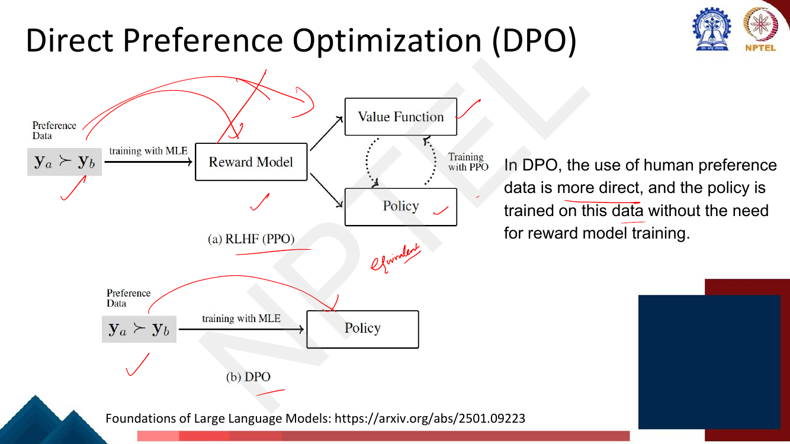
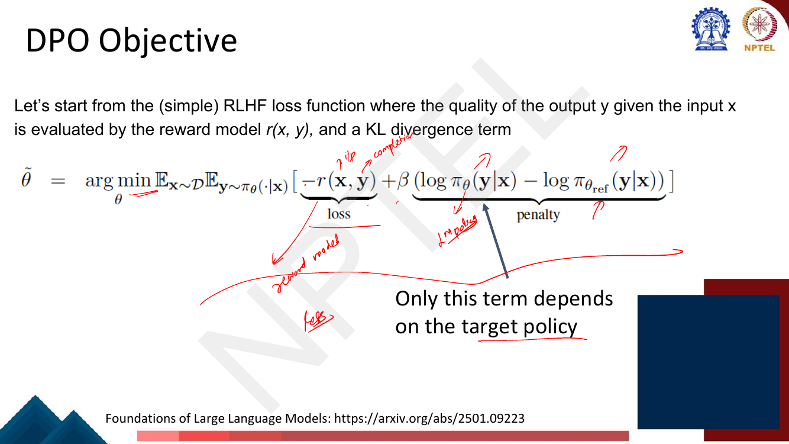
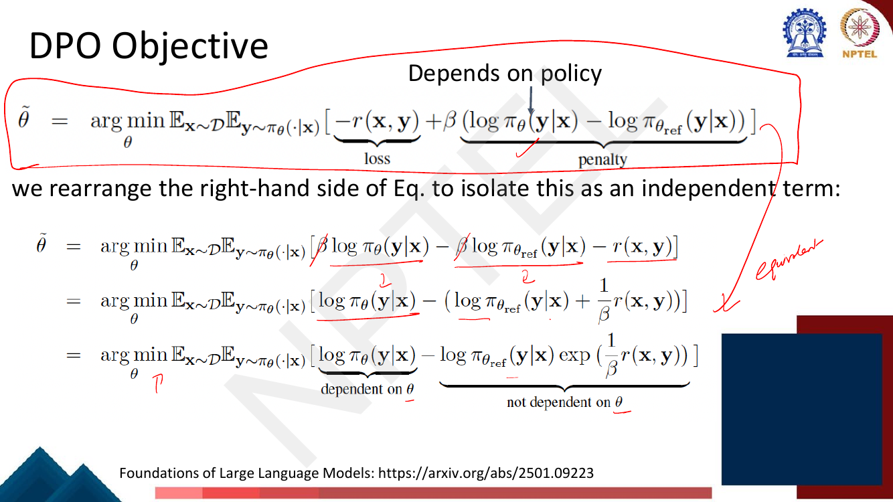
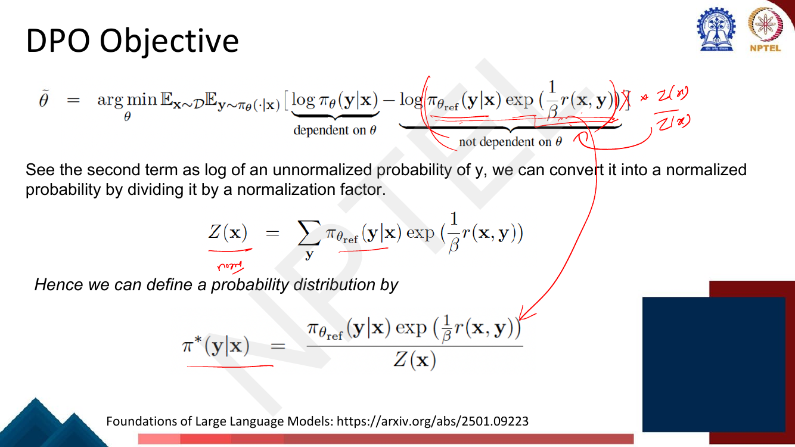
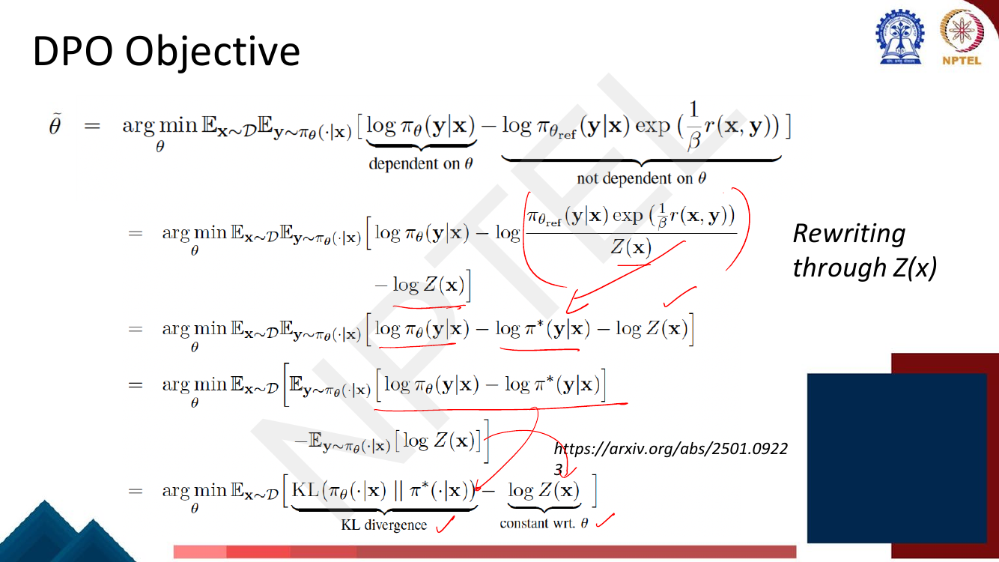
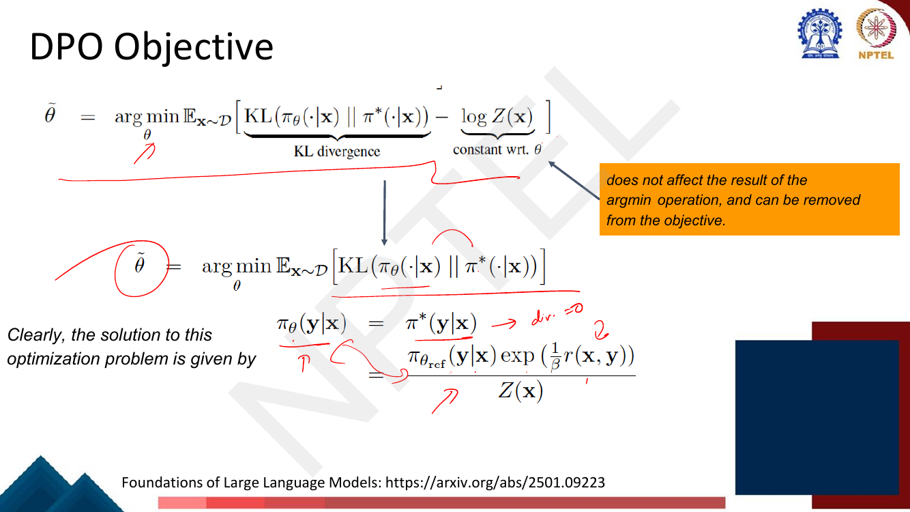
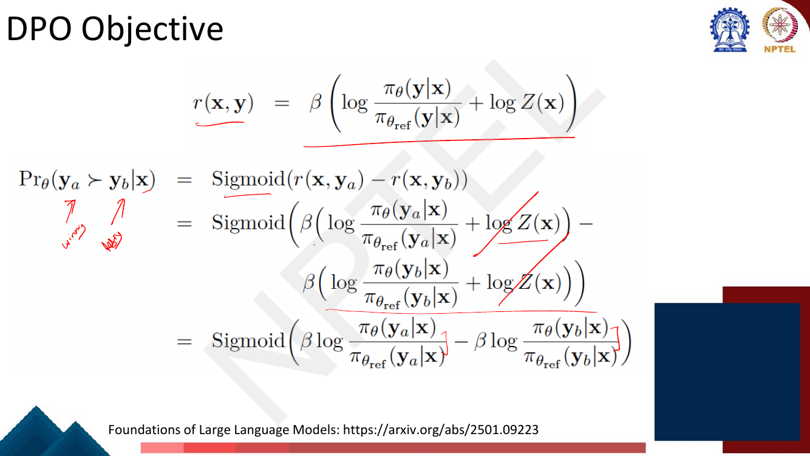
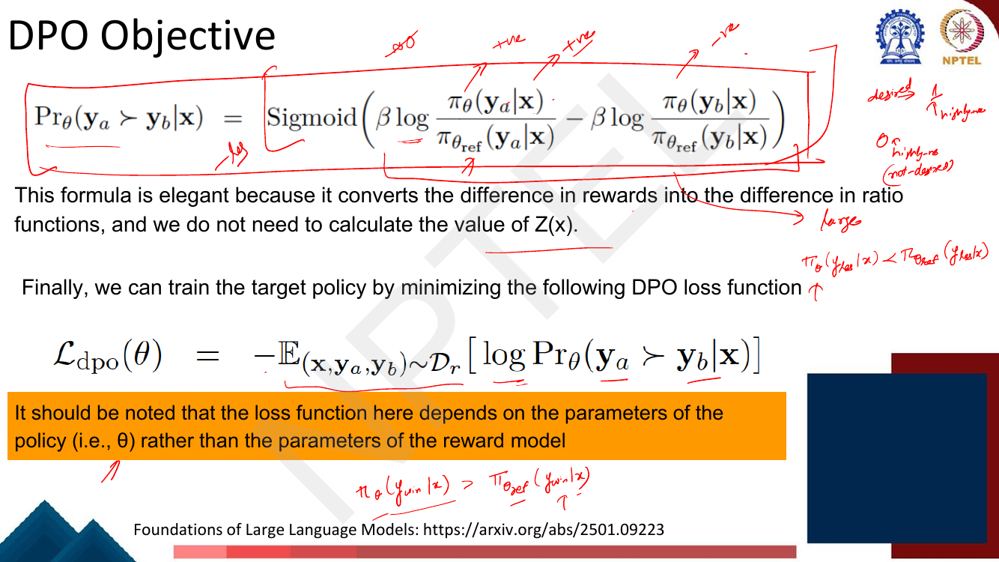
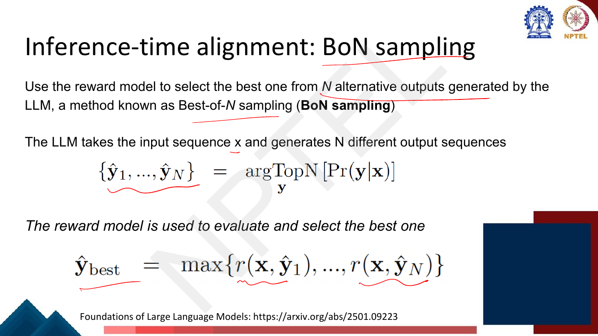

# Lec 40 — Aligning to User Preferences via Direct Preference Optimization

> **Source:** `Week8.pdf` pp. 117–137 · **Week 8** · **Playlist:** Lec 40
> **Prereqs:** [Lec 39 — RLHF II: PPO](39-rlhf-2-ppo.md), [Lec 38 — RLHF I](38-rlhf-1.md)
> **Feeds into:** [Lec 59 — Trustworthy LLMs: the taxonomy](../week-12/59-trustworthy-llms-taxonomy.md)

## Why this lecture exists

Lecture 39 left you with a working but ugly machine. To run PPO you need four networks resident at
once — policy, frozen reference, reward model, value head — a sampling loop that regenerates
completions every few updates, and a clipping hyperparameter that, tuned badly, collapses the model.
Worse, the whole thing rests on a reward model that is itself a noisy fit to human labels; a bad
reward model quietly corrupts everything downstream.

This lecture removes the reward model. The observation is that the RLHF objective you already wrote
down has a **closed-form optimal policy** expressed in terms of the reward. Read that relation
backwards and you get the reward expressed in terms of the optimal policy. Substitute that into the
Bradley-Terry preference likelihood and every reward term cancels. What survives is an ordinary
supervised classification loss on preference pairs — no RL, no sampling, two models instead of four.
That is Direct Preference Optimization, and it closes the alignment arc.

## The ideas

### What DPO replaces

The deck's own framing (p. 119): *"Training a reliable reward model is itself not an easy task, and a
poorly trained reward model can greatly affect the outcome of policy learning."* DPO "simplifies the
training framework by eliminating the need to explicitly model rewards" and "directly optimizes the
policy based on user preferences".


*Fig. — The figure from the DPO paper, titled "Your Language Model is Secretly a Reward Model". Notice that both pipelines start from the same preference data `y_w ≻ y_l`; DPO deletes the entire middle column. Page 119 of `Week8.pdf`.*

The second diagram is the one to memorise for an MCQ, because it counts the boxes:


*Fig. — PPO's path has three trained components downstream of the data (reward model, value function, policy) plus the frozen reference that is not drawn; DPO has one. The lecturer has written "equivalent" between the two, which is the claim the derivation makes good. Page 120.*

### The starting point: the RLHF objective

[Lec 39](39-rlhf-2-ppo.md) owns this objective — the reward term, the KL penalty, policy gradient and
the PPO loss are all its property. You need only the statement. The deck writes the minimisation form
(p. 121):

$$\tilde\theta = \arg\min_\theta \ \mathbb{E}_{\mathbf{x}\sim\mathcal{D}}\ \mathbb{E}_{\mathbf{y}\sim\pi_\theta(\cdot\mid\mathbf{x})}\Big[\underbrace{-r(\mathbf{x},\mathbf{y})}_{\text{loss}} + \beta\underbrace{\big(\log\pi_\theta(\mathbf{y}\mid\mathbf{x}) - \log\pi_{\text{ref}}(\mathbf{y}\mid\mathbf{x})\big)}_{\text{penalty}}\Big]$$

Three things to fix in your head before the algebra starts.

- $\mathbf{x}$ is the prompt, $\mathbf{y}$ the completion, $r$ the reward model from
  [Lec 38](38-rlhf-1.md), and $\pi_{\text{ref}}$ the frozen SFT model.
- The penalty bracket is the inside of a KL divergence: its expectation under $\pi_\theta$ *is*
  $D_{\mathrm{KL}}(\pi_\theta \,\|\, \pi_{\text{ref}})$. $\beta$ is the KL coefficient, exactly as in
  Lec 39.
- The lecturer annotates the slide **"Only this term depends on the target policy"**, pointing at
  $\log\pi_\theta$. That single observation is the whole derivation in embryo: $r$ and
  $\pi_{\text{ref}}$ are fixed functions; only $\pi_\theta$ is free.


*Fig. — The lecturer's red annotations label $\mathbf{x}$ as "i/p", $\mathbf{y}$ as "completion", and mark $r$ as the reward model. Page 121.*

### Step 1 — rearrange into a difference of two log-terms

Divide through by $\beta$ (which does not move the $\arg\min$) and group:

$$\tilde\theta = \arg\min_\theta \mathbb{E}\Big[\log\pi_\theta(\mathbf{y}\mid\mathbf{x}) - \Big(\log\pi_{\text{ref}}(\mathbf{y}\mid\mathbf{x}) + \tfrac{1}{\beta}r(\mathbf{x},\mathbf{y})\Big)\Big]$$

and then fold the sum of logs into a log of a product:

$$= \arg\min_\theta \mathbb{E}\Big[\underbrace{\log\pi_\theta(\mathbf{y}\mid\mathbf{x})}_{\text{depends on }\theta} - \underbrace{\log\Big(\pi_{\text{ref}}(\mathbf{y}\mid\mathbf{x})\exp\big(\tfrac{1}{\beta}r(\mathbf{x},\mathbf{y})\big)\Big)}_{\text{not dependent on }\theta}\Big]$$


*Fig. — The deck's heading for this page is literally **"Depends on policy"**. Follow the two underlined $\beta$s cancelling in line one; the whole move is just dividing by $\beta$ and taking $\exp$ inside the log. Page 122.*

### Step 2 — the second term is an unnormalised distribution

The deck now makes the point that this form is "not ideal", because we would rather see a difference
between two *distributions* and read it as a divergence. The second term is a non-negative function of
$\mathbf{y}$, so it is a probability distribution up to a constant. Normalise it (p. 124):

$$Z(\mathbf{x}) = \sum_{\mathbf{y}} \pi_{\text{ref}}(\mathbf{y}\mid\mathbf{x})\exp\Big(\tfrac{1}{\beta}r(\mathbf{x},\mathbf{y})\Big), \qquad \pi^*(\mathbf{y}\mid\mathbf{x}) = \frac{\pi_{\text{ref}}(\mathbf{y}\mid\mathbf{x})\exp\big(\tfrac{1}{\beta}r(\mathbf{x},\mathbf{y})\big)}{Z(\mathbf{x})}$$

$Z(\mathbf{x})$ is the **partition function**: a sum over *every possible completion* $\mathbf{y}$.
It is astronomically intractable — you could never compute it — and the entire elegance of DPO is that
you will never have to.


*Fig. — Note $Z$ depends on $\mathbf{x}$ only, not on $\mathbf{y}$ and not on $\theta$ — that is what makes it cancellable twice over. Page 124.*

### Step 3 — the objective collapses to a KL, and the optimum is $\pi^*$

Rewrite the second term through $Z$. Because $\log(A/Z) = \log A - \log Z$, you pick up a stray
$-\log Z(\mathbf{x})$, and the objective becomes

$$\tilde\theta = \arg\min_\theta \mathbb{E}_{\mathbf{x}\sim\mathcal{D}}\Big[\underbrace{D_{\mathrm{KL}}\big(\pi_\theta(\cdot\mid\mathbf{x})\,\|\,\pi^*(\cdot\mid\mathbf{x})\big)}_{\text{KL divergence}} - \underbrace{\log Z(\mathbf{x})}_{\text{constant wrt }\theta}\Big]$$


*Fig. — The inner expectation $\mathbb{E}_{\mathbf{y}\sim\pi_\theta}[\log\pi_\theta - \log\pi^*]$ is by definition $D_{\mathrm{KL}}(\pi_\theta\|\pi^*)$, and $\mathbb{E}_{\mathbf{y}\sim\pi_\theta}[\log Z(\mathbf{x})] = \log Z(\mathbf{x})$ because $Z$ does not depend on $\mathbf{y}$. Page 125.*

$\log Z(\mathbf{x})$ contains no $\theta$, so it cannot change which $\theta$ minimises the
expression; drop it. You are left minimising a KL divergence over $\theta$, and a KL is minimised —
at exactly zero — when the two distributions coincide. Therefore

$$\boxed{\ \pi_\theta(\mathbf{y}\mid\mathbf{x}) \;=\; \pi^*(\mathbf{y}\mid\mathbf{x}) \;=\; \frac{\pi_{\text{ref}}(\mathbf{y}\mid\mathbf{x})\exp\big(\tfrac{1}{\beta}r(\mathbf{x},\mathbf{y})\big)}{Z(\mathbf{x})}\ }$$


*Fig. — The orange callout states the rule exactly: $\log Z(\mathbf{x})$ "does not affect the result of the argmin operation, and can be removed". The lecturer writes "div → 0" beside the solution. Page 126.*

This is the **closed-form optimal policy of RLHF**. It says the aligned model is the reference model
reweighted exponentially by reward, with temperature $\beta$. It has been known since before DPO; what
DPO does is read it in the other direction.

### Step 4 — invert it: the reward in terms of the policy

Take logs of the boxed equation and solve for $r$:

$$r(\mathbf{x},\mathbf{y}) = \beta\Big(\log\frac{\pi_\theta(\mathbf{y}\mid\mathbf{x})}{\pi_{\text{ref}}(\mathbf{y}\mid\mathbf{x})} + \log Z(\mathbf{x})\Big)$$


*Fig. — The deck's own emphasis: a representation of the **reward model based on the policy**. The handwriting in the top right shows the algebra: $\exp(\frac{1}{\beta}r) = \frac{\pi_\theta}{\pi_{\text{ref}}}Z$, so $r = \beta[\log\frac{\pi_\theta}{\pi_{\text{ref}}} + \log Z]$. Page 127.*

This is the **"Depends on policy"** claim made literal. Any language model, paired with a reference,
already defines a reward function — the scaled log-ratio of its own probability to the reference's.
Hence the DPO paper's title: *your language model is secretly a reward model*. Define the
**implicit reward**

$$\hat r_\theta(\mathbf{x},\mathbf{y}) = \beta\log\frac{\pi_\theta(\mathbf{y}\mid\mathbf{x})}{\pi_{\text{ref}}(\mathbf{y}\mid\mathbf{x})}$$

which is $r$ minus the unknown $\beta\log Z(\mathbf{x})$ — the same for every completion of a given
prompt.

### Step 5 — substitute into Bradley-Terry; $Z$ cancels

Bradley-Terry ([Lec 38](38-rlhf-1.md)) says the probability that $\mathbf{y}_a$ is preferred over
$\mathbf{y}_b$ is the sigmoid of the reward *difference*. Substitute:

$$\begin{aligned}
\Pr{}_\theta(\mathbf{y}_a \succ \mathbf{y}_b \mid \mathbf{x}) &= \sigma\big(r(\mathbf{x},\mathbf{y}_a) - r(\mathbf{x},\mathbf{y}_b)\big)\\
&= \sigma\Big(\beta\big(\log\tfrac{\pi_\theta(\mathbf{y}_a\mid\mathbf{x})}{\pi_{\text{ref}}(\mathbf{y}_a\mid\mathbf{x})} + \log Z(\mathbf{x})\big) - \beta\big(\log\tfrac{\pi_\theta(\mathbf{y}_b\mid\mathbf{x})}{\pi_{\text{ref}}(\mathbf{y}_b\mid\mathbf{x})} + \log Z(\mathbf{x})\big)\Big)\\
&= \sigma\Big(\beta\log\frac{\pi_\theta(\mathbf{y}_a\mid\mathbf{x})}{\pi_{\text{ref}}(\mathbf{y}_a\mid\mathbf{x})} - \beta\log\frac{\pi_\theta(\mathbf{y}_b\mid\mathbf{x})}{\pi_{\text{ref}}(\mathbf{y}_b\mid\mathbf{x})}\Big)
\end{aligned}$$


*Fig. — The two red strikethroughs are the whole trick: because both completions share the same prompt, they share the same $Z(\mathbf{x})$, and a difference annihilates it. Page 128.*

**Both $Z$ and $r$ are gone.** $Z$ cancels because the two completions share a prompt; $r$ is gone
because it was only ever written in terms of $\pi_\theta$ and $\pi_{\text{ref}}$.

### The DPO loss

Maximum likelihood on the preference dataset $\mathcal{D}_r$ of triples
$(\mathbf{x}, \mathbf{y}_w, \mathbf{y}_l)$ — prompt, winner, loser — gives the deck's loss (p. 129):

$$\mathcal{L}_{\text{dpo}}(\theta) = -\mathbb{E}_{(\mathbf{x},\mathbf{y}_a,\mathbf{y}_b)\sim\mathcal{D}_r}\big[\log \Pr{}_\theta(\mathbf{y}_a \succ \mathbf{y}_b\mid\mathbf{x})\big]$$

which expanded is the form you must be able to write from memory:

$$\mathcal{L}_{\text{DPO}}(\theta) = -\mathbb{E}_{(\mathbf{x},\mathbf{y}_w,\mathbf{y}_l)}\left[\log\sigma\left(\beta\log\frac{\pi_\theta(\mathbf{y}_w\mid\mathbf{x})}{\pi_{\text{ref}}(\mathbf{y}_w\mid\mathbf{x})} - \beta\log\frac{\pi_\theta(\mathbf{y}_l\mid\mathbf{x})}{\pi_{\text{ref}}(\mathbf{y}_l\mid\mathbf{x})}\right)\right]$$

Read it piece by piece:

| Piece | What it is |
|---|---|
| $\log\frac{\pi_\theta(\mathbf{y}\mid\mathbf{x})}{\pi_{\text{ref}}(\mathbf{y}\mid\mathbf{x})}$ | how much *more* likely the trained policy makes this completion than the frozen SFT model does |
| $\beta\times$ that | the **implicit reward** $\hat r_\theta$ |
| the difference | the Bradley-Terry logit for "winner beats loser" |
| $\sigma(\cdot)$, $-\log$ | binary cross-entropy — identical in form to logistic regression |
| $\beta$ | the KL coefficient of Lec 39, now controlling how far the policy may drift from $\pi_{\text{ref}}$ |


*Fig. — The deck's own emphasis, in the orange box: "the loss function here depends on the parameters of the policy (i.e. θ) rather than the parameters of the reward model". The handwriting spells out the two desired directions — push the winner's ratio up, push the loser's below 1. Page 129.*

The loss is a **supervised binary classification loss**. There is no sampling from $\pi_\theta$, no
advantage estimate, no clipping, no value head. You hold two models — $\pi_\theta$ (trainable) and
$\pi_{\text{ref}}$ (frozen, forward passes only) — run four forward passes per training example
(winner and loser through each), and backpropagate.

> **Not on the deck but essential:** in practice $\pi_\theta(\mathbf{y}\mid\mathbf{x})$ is the
> *sequence* probability, i.e. the sum of per-token log-probabilities over the completion's tokens.
> You never form the product; you work in log space throughout.

### The gradient and why it self-weights

The deck does not show the gradient; it is worth 60 seconds because it explains DPO's behaviour.
Writing $u = \hat r_\theta(\mathbf{x},\mathbf{y}_w) - \hat r_\theta(\mathbf{x},\mathbf{y}_l)$ and using
$\frac{d}{du}[-\log\sigma(u)] = -(1-\sigma(u)) = -\sigma(-u)$:

$$\nabla_\theta \mathcal{L}_{\text{DPO}} = -\beta\,\mathbb{E}\Big[\underbrace{\sigma(-u)}_{\text{weight}}\big(\nabla_\theta\log\pi_\theta(\mathbf{y}_w\mid\mathbf{x}) - \nabla_\theta\log\pi_\theta(\mathbf{y}_l\mid\mathbf{x})\big)\Big]$$

The bracket raises the log-likelihood of the preferred completion and lowers the dispreferred one —
ordinary likelihood arithmetic. The scalar out front, $\sigma(-u)$, is **how wrong the implicit reward
model currently is**: it is near $1$ when the model ranks the pair backwards and near $0$ when the
model already ranks it correctly by a wide margin. Examples the model gets right contribute almost
nothing to the update. This is the same self-weighting that makes logistic regression focus on points
near its decision boundary, and it is why DPO trains stably without clipping.

### KTO — one label instead of a pair

![Slide: DPO Variant KTO with its arXiv link, the loss L_KTO = E[1 - h-hat(x,y;beta)] and the two-case definition of h-hat using a sigmoid of beta log-ratio minus an expected KL term for desirable y, and the negation for undesirable y.](../../assets/pages/lec40/p-130.png)
*Fig. — The two cases are mirror images: for a desirable $y$ you want the log-ratio **above** the average KL; for an undesirable $y$ you want it **below**. The deck's one-line summary is "Implements a strategy that utilizes a single preference". Page 130, arXiv 2402.01306.*

**KTO** (Kahneman-Tversky Optimization) keeps DPO's implicit reward but drops the requirement for a
*pair*:

$$\mathcal{L}_{\text{KTO}}(\pi_\theta,\pi_{\text{ref}};\beta) = \mathbb{E}_{x,y\sim\mathcal{D}}\big[1 - \hat h(x,y;\beta)\big]$$
$$\hat h(x,y;\beta) = \begin{cases}\sigma\Big(\beta\log\frac{\pi_\theta(y\mid x)}{\pi_{\text{ref}}(y\mid x)} - \mathbb{E}_{x'\sim\mathcal{D}}\big[\beta D_{\mathrm{KL}}(\pi_\theta\|\pi_{\text{ref}})\big]\Big) & y \text{ desirable}\\ \sigma\Big(\mathbb{E}_{x'\sim\mathcal{D}}\big[\beta D_{\mathrm{KL}}(\pi_\theta\|\pi_{\text{ref}})\big] - \beta\log\frac{\pi_\theta(y\mid x)}{\pi_{\text{ref}}(y\mid x)}\Big) & y \text{ undesirable}\end{cases}$$

The dataset-level KL term plays the role DPO gives to "the other completion in the pair": it is the
**reference point** against which a single example is judged good or bad — the Kahneman-Tversky
prospect-theory idea that humans evaluate outcomes as gains or losses relative to a reference, not in
absolute terms. The practical payoff is large: a binary thumbs-up/thumbs-down label on one output is
far cheaper to collect (and is already logged by every deployed chat product) than a human ranking two
outputs against each other.

### DPO's advantages, honestly, and PPO's

The deck gives each its own page, which tells you it expects you to argue both sides.

**DPO (p. 131)** — "simplicity and efficiency"; it "directly optimizes for preference-based feedback";
it is "more sample-efficient, as it learns from a **fixed dataset** without the need for the
computationally expensive sampling process used in PPO". The slide's bottom line, which is the
examinable sentence: **DPO can broadly be viewed as an offline reinforcement learning method.**

**PPO (p. 132)** — online methods "require exploring new states through interaction with the
environment (using the reward model as a proxy)". That buys three things DPO cannot have: continuous
adaptation from real-time feedback; freedom from "the static nature of pre-collected data", so the
model "can discover new problem-solving strategies"; and broader coverage of state-action pairs, hence
**better generalization** — which the slide calls "a critical aspect in applying such large models".

The sharp version: DPO can only ever learn to rank the completions somebody already wrote down. Once
the policy has beaten every pair in $\mathcal{D}_r$, there is nothing left to learn. PPO keeps
generating fresh completions, scoring them, and improving on its own current behaviour — so it can
climb past the ceiling of its preference dataset, at the cost of four models and an unstable loop.

### Inference-time alignment and Best-of-$N$

Page 133 asks the pivot question: *"What if we have a reward model but do not want to train an RL
policy? Can we still use it at inference time?"* The motivation is that fine-tuning at all is
expensive and unstable.


*Fig. — Two equations only: generate $N$ candidates, then take the arg max of the reward model over them. No gradient is ever computed. Page 134.*

$$\{\hat{\mathbf{y}}_1,\dots,\hat{\mathbf{y}}_N\} = \operatorname*{arg\,TopN}_{\mathbf{y}} \big[\Pr(\mathbf{y}\mid\mathbf{x})\big], \qquad \hat{\mathbf{y}}_{\text{best}} = \max\{r(\mathbf{x},\hat{\mathbf{y}}_1),\dots,r(\mathbf{x},\hat{\mathbf{y}}_N)\}$$

(The second equation as printed takes a $\max$ where it means $\arg\max$ — it returns a sequence, not
a score. Read it as "the candidate with the highest reward".) The $N$ candidates come from the
sampling and decoding machinery of [Lec 19](../week-04/19-decoding-strategies.md) — temperature or
nucleus sampling, not $N$ independent beams.

**BoN as a training method (p. 135).** Run BoN over a prompt set, keep the winners, and fine-tune the
LLM on them with ordinary cross-entropy. "In this way, we can introduce human preferences into the
training of LLMs via a much simpler approach compared to RLHF." The deck names it: **"Also known as
*rejection sampling*"** — in the literature also RAFT or rejection-sampling fine-tuning, and the method
behind Llama-2-Chat's early alignment rounds.

The economics are the thing to remember. **BoN pays $N\times$ at inference, forever, on every single
request. Training pays once.** That makes BoN excellent for a prototype, an evaluation harness, or a
low-traffic deployment, and poor for a product serving millions of queries — see N6.

### The master comparison

| | **PPO** | **DPO** | **KTO** | **BoN** |
|---|---|---|---|---|
| Needs a reward model? | **Yes**, trained separately | **No** | **No** | **Yes**, at inference |
| Data required | pairwise preferences (for the RM) | pairwise preferences | **single binary** good/bad labels | pairwise preferences (for the RM) |
| Models in memory (training) | 4: policy, reference, reward, value | **2**: policy, reference | 2: policy, reference | — (no training) |
| Models at inference | 1 | 1 | 1 | **2**: policy + reward model |
| Online or offline | **online / on-policy** | offline | offline | offline generation, online selection |
| Samples during training? | yes, every few updates | no | no | n/a |
| Cost sits at | training (heavy) | training (moderate) | training (moderate) | **inference, $N\times$, forever** |
| Can exceed the preference dataset? | **yes** | no | no | only up to what the RM can rank |
| Main failure mode | instability, reward hacking, tuning | overfits the offline pairs; drifts off-distribution | reference-point KL estimate is noisy | reward hacking at large $N$ |

One sentence forward: alignment is the *tool*; the *goal* is trustworthiness — safety, harmlessness,
truthfulness and the rest of the taxonomy belong to
[Lec 59](../week-12/59-trustworthy-llms-taxonomy.md). And when the problem is not "make the model
prefer X" but "make the model forget X", the alternative is machine unlearning
([Lec 60](../week-12/60-machine-unlearning.md)).

## Worked numericals

Throughout, $\sigma(z) = 1/(1+e^{-z})$ and $\log = \ln$.

### N1. Page 129 — which way must the ratios move, and what loss does each case give?

**Source note.** The re-swept exercise table lists `Week8.pdf` **p. 129** for this lecture. Opened as
an image, **page 129 is not a "Try this problem" page** — it is the DPO-loss slide. It appears to have
been caught by the sweep's "calculate the value of" pattern ("we do not need to calculate the value of
$Z(\mathbf{x})$"). **I am reporting it as a false positive.** What page 129 *does* carry is the
lecturer's handwritten reasoning in the margin, which poses a question in everything but name:
*"desired: $\pi_\theta(y_{\text{win}}\mid x) / \pi_{\theta_{\text{ref}}}(y_{\text{win}}\mid x)$ large"*
and *"$\pi_\theta(y_{\text{los}}\mid x) < \pi_{\theta_{\text{ref}}}(y_{\text{los}}\mid x)$"*, with "+ve"
over the winner term and "−ve" over the loser term, and "0 if highly −ve (not-desired)". **The deck
gives no numbers and no worked solution.** I derive it below. No other exercise page exists anywhere
in pp. 117–137 — every page in the range was opened and checked.

**Given:** the DPO loss $\mathcal{L} = -\log\sigma(u)$ with
$u = \beta\log\frac{\pi_\theta(y_w)}{\pi_{\text{ref}}(y_w)} - \beta\log\frac{\pi_\theta(y_l)}{\pi_{\text{ref}}(y_l)}$.
**Find:** the sign each log-ratio must take, and $\mathcal{L}$ at $u = +5, 0, -5$.

1. $\mathcal{L} = -\log\sigma(u)$ is strictly decreasing in $u$, so minimising the loss means
   **maximising $u$**.
2. $u$ is increasing in the winner's log-ratio and decreasing in the loser's. So training drives
   $\log\frac{\pi_\theta(y_w)}{\pi_{\text{ref}}(y_w)} \to +$ , i.e.
   $\pi_\theta(y_w) > \pi_{\text{ref}}(y_w)$ — the policy must make the winner **more** likely than
   the SFT model did; and
   $\log\frac{\pi_\theta(y_l)}{\pi_{\text{ref}}(y_l)} \to -$, i.e.
   $\pi_\theta(y_l) < \pi_{\text{ref}}(y_l)$ — the loser **less** likely. Exactly the lecturer's two
   annotations.
3. $u = +5$ (model strongly correct): $\sigma(5) = 1/(1+e^{-5}) = 1/1.0067379 = 0.9933071$;
   $\mathcal{L} = -\log 0.9933071 = \mathbf{0.0067154}$.
4. $u = 0$ (model indifferent): $\sigma(0) = 0.5$; $\mathcal{L} = -\log 0.5 = \mathbf{0.6931472}$.
   This is the loss of a model that has learned nothing, and it is the number to compare any DPO
   training curve against.
5. $u = -5$ (model strongly backwards): $\sigma(-5) = 0.0066929$;
   $\mathcal{L} = -\log 0.0066929 = \mathbf{5.0067154}$.
6. The gradient weight $\sigma(-u)$ at these three points is $0.00669$, $0.5$, $0.99331$ — confirming
   the lecturer's "0 if highly −ve": a pair the model already ranks correctly produces essentially no
   update.

**Answer:** $\pi_\theta(y_w)/\pi_{\text{ref}}(y_w)$ must grow above 1 and
$\pi_\theta(y_l)/\pi_{\text{ref}}(y_l)$ must fall below 1; the loss is $0.0067$ / $0.6931$ / $5.0067$
at $u = +5/0/-5$, with $\ln 2 = 0.6931$ as the "no information" baseline. **Deck gave no solution.**

### N2. Compute the DPO loss for two preference pairs

**Given:** $\beta = 0.1$ and sequence probabilities

| Pair | $\pi_\theta(y_w)$ | $\pi_{\text{ref}}(y_w)$ | $\pi_\theta(y_l)$ | $\pi_{\text{ref}}(y_l)$ |
|---|---|---|---|---|
| A | 0.60 | 0.50 | 0.20 | 0.40 |
| B | 0.30 | 0.50 | 0.45 | 0.30 |

**Find:** $\mathcal{L}_{\text{DPO}}$ averaged over the two pairs.

1. **Pair A, winner log-ratio:** $\log(0.60/0.50) = \log 1.2 = 0.1823216$.
2. **Pair A, loser log-ratio:** $\log(0.20/0.40) = \log 0.5 = -0.6931472$.
3. **Pair A margin:** $u_A = 0.1\times(0.1823216 - (-0.6931472)) = 0.1 \times 0.8754687 = 0.0875469$.
4. **Pair A sigmoid:** $e^{-0.0875469} = 0.9161758$; $\sigma = 1/1.9161758 = 0.5218728$.
5. **Pair A loss:** $-\log 0.5218728 = 0.6503315$.
6. **Pair B, winner log-ratio:** $\log(0.30/0.50) = \log 0.6 = -0.5108256$.
7. **Pair B, loser log-ratio:** $\log(0.45/0.30) = \log 1.5 = 0.4054651$.
8. **Pair B margin:** $u_B = 0.1\times(-0.5108256 - 0.4054651) = 0.1\times(-0.9162907) = -0.0916291$.
9. **Pair B sigmoid:** $e^{0.0916291} = 1.0959585$; $\sigma = 1/2.0959585 = 0.4771087$.
10. **Pair B loss:** $-\log 0.4771087 = 0.7400108$.
11. **Mean:** $(0.6503315 + 0.7400108)/2 = 0.6951712$.

**Answer:** $\mathcal{L}_{\text{DPO}} = \mathbf{0.6951712}$. Pair A is ranked correctly (loss below
$\ln 2 = 0.6931$); pair B is ranked **backwards** — the policy has made the *loser* more likely than
the reference did — so its loss exceeds $\ln 2$ and it will dominate the gradient.

### N3. The implicit rewards for those same completions

**Given:** the same table, $\beta = 0.1$. **Find:** $\hat r_\theta$ for all four completions, with no
reward model anywhere.

1. $\hat r_\theta = \beta\log\frac{\pi_\theta}{\pi_{\text{ref}}}$ — the log-ratios are already computed
   in N2, so just multiply by $0.1$.
2. Pair A winner: $0.1 \times 0.1823216 = \mathbf{+0.0182322}$.
3. Pair A loser: $0.1 \times (-0.6931472) = \mathbf{-0.0693147}$.
4. Pair B winner: $0.1 \times (-0.5108256) = \mathbf{-0.0510826}$.
5. Pair B loser: $0.1 \times 0.4054651 = \mathbf{+0.0405465}$.
6. Reward margins: $A: 0.0182322 - (-0.0693147) = +0.0875469$ (= $u_A$, as it must be);
   $B: -0.0510826 - 0.0405465 = -0.0916291$ (= $u_B$).

**Answer:** the four implicit rewards are $+0.0182$, $-0.0693$, $-0.0511$, $+0.0405$. The policy
scores pair A's winner above its loser and pair B's winner **below** its loser — a complete preference
judgement produced by two language models and a logarithm, with no reward network trained or stored.
Note these rewards are only defined up to the per-prompt constant $\beta\log Z(\mathbf{x})$, which is
why only *differences within a prompt* are meaningful.

### N4. The effect of $\beta$

**Given:** the same two pairs. **Find:** the loss at $\beta = 0.05, 0.1, 0.5, 1.0$, and the
deviation-from-reference each $\beta$ demands.

1. The log-ratios do not depend on $\beta$; only the scaling does. $u = \beta \times 0.8754687$ for
   pair A and $\beta \times (-0.9162907)$ for pair B.

| $\beta$ | $u_A$ | $\mathcal{L}_A$ | $u_B$ | $\mathcal{L}_B$ | mean $\mathcal{L}$ |
|---|---|---|---|---|---|
| 0.05 | 0.0437734 | 0.6715000 | −0.0458145 | 0.7163168 | **0.6939084** |
| 0.10 | 0.0875469 | 0.6503315 | −0.0916291 | 0.7400108 | **0.6951712** |
| 0.50 | 0.4377344 | 0.4980426 | −0.4581454 | 0.9482307 | **0.7231367** |
| 1.00 | 0.8754687 | 0.3483067 | −0.9162907 | 1.2527630 | **0.8005348** |

2. **Reading the table:** larger $\beta$ *amplifies* the same log-ratios — it rewards the correctly
   ranked pair harder and punishes the mis-ranked pair harder. At $\beta \to 0$ every margin collapses
   to 0 and every loss to $\ln 2 = 0.6931$: the loss becomes blind to the policy.
3. **The deviation trade-off, stated as a target.** Ask what log-ratio gap the policy must achieve to
   push the sigmoid up to $0.9$. That needs $u = \log 9 = 2.1972246$, so the required gap is
   $\log\frac{\pi_\theta(y_w)}{\pi_{\text{ref}}(y_w)} - \log\frac{\pi_\theta(y_l)}{\pi_{\text{ref}}(y_l)} = 2.1972246/\beta$:

| $\beta$ | required gap (nats) | as a probability-ratio factor |
|---|---|---|
| 0.05 | 43.944 | $e^{43.944} \approx 1.2\times10^{19}$ |
| 0.10 | 21.972 | $e^{21.972} \approx 3.49\times10^{9}$ |
| 0.50 | 4.394 | $\approx 81$ |
| 1.00 | 2.197 | $= 9$ |

**Answer:** small $\beta$ demands an enormous departure from $\pi_{\text{ref}}$ to reach the same
confidence, so the policy drifts far from the SFT model; large $\beta$ reaches it with a tiny
departure and keeps the policy near the reference. $\beta$ is the KL leash, exactly as in Lec 39.
Typical published values are $\beta \in [0.1, 0.5]$.

### N5. Memory accounting — PPO versus DPO at 7B

**Given:** a 7-billion-parameter policy, bf16 weights (2 bytes/param), Adam with mixed precision
(fp32 master copy + fp32 first and second moments = 12 bytes/param, plus bf16 gradients = 2), and the
simplifying assumption that reward and value models are also 7B. $1\text{ GB} = 10^9$ bytes.
**Find:** resident parameter memory under each method.

1. **One model's weights, bf16:** $7\times10^9 \times 2 = 14\times10^9$ bytes $= 14$ GB.
2. **One *trainable* model, full training state:** $2 + 2 + 4 + 4 + 4 = 16$ bytes/param, so
   $7\times10^9\times16 = 112$ GB.
3. **PPO, weights only:** policy + reference + reward + value $= 4\times14 = \mathbf{56}$ **GB**.
4. **DPO, weights only:** policy + reference $= 2\times14 = \mathbf{28}$ **GB**.
5. **PPO, full training footprint:** frozen reward + frozen reference $= 2\times14 = 28$ GB; trainable
   policy + trainable value $= 2\times112 = 224$ GB. Total $= \mathbf{252}$ **GB**.
6. **DPO, full training footprint:** frozen reference $= 14$ GB; trainable policy $= 112$ GB.
   Total $= \mathbf{126}$ **GB**.

**Answer:** DPO halves it — **56 → 28 GB** of weights, **252 → 126 GB** of full training state. On
80 GB GPUs that is **4 GPUs for a PPO run against 2 for a DPO run** ($\lceil 252/80\rceil = 4$ vs
$\lceil 126/80\rceil = 2$). Neither figure includes activations or KV cache, and in practice reward
and value models are often smaller than the policy (1B–7B), which softens but does not remove the gap.

### N6. BoN economics at $N = 16$

**Given:** a 7B model, $\approx 2P$ FLOPs per token at inference ($P$ = parameters), 500 generated
tokens per response, a 7B reward model scoring a 600-token prompt+response, $N = 16$, and a DPO run
over 60,000 preference pairs of 600 tokens each. **Find:** the inference multiplier and the
break-even request count.

1. **Baseline, one generation:** $2 \times 7\times10^9 \times 500 = 7.0\times10^{12}$ FLOPs.
2. **BoN-16 generation:** $16 \times 7.0\times10^{12} = 1.12\times10^{14}$ FLOPs — the headline
   multiplier is simply $N = \mathbf{16\times}$.
3. **Reward scoring:** 16 candidates, prefill only, $2\times7\times10^9\times600$ each
   $= 1.344\times10^{14}$ FLOPs.
4. **Total per BoN request:** $1.12\times10^{14} + 1.344\times10^{14} = 2.464\times10^{14}$;
   **extra over baseline** $= 2.464\times10^{14} - 7.0\times10^{12} = 2.394\times10^{14}$ FLOPs.
5. **DPO training cost.** Tokens processed $= 60{,}000 \times 2 \text{ seqs} \times 600 = 7.2\times10^{7}$.
   Per token: policy forward+backward $= 6P$, frozen reference forward $= 2P$, so $8P$.
   FLOPs $= 8 \times 7\times10^9 \times 7.2\times10^7 = 4.032\times10^{18}$.
6. **Break-even, generation cost only:** $4.032\times10^{18} / (1.12\times10^{14} - 7\times10^{12})
   = 4.032\times10^{18}/1.05\times10^{14} = \mathbf{38{,}400}$ **requests**.
7. **Break-even including reward scoring:** $4.032\times10^{18}/2.394\times10^{14} \approx
   \mathbf{16{,}842}$ **requests**.

**Answer:** BoN-16 costs $16\times$ the generation compute per request forever and breaks even against
a single DPO run after roughly **17,000–38,000 requests** — under a day of traffic for any real
product. BoN is the right call for prototypes and evaluation; training is the right call for
deployment. (Wall-clock skews further against BoN: generation is memory-bandwidth bound and
sequential, while reward scoring is a parallel prefill.)

## Code

NumPy DPO loss over a small preference dataset, printing implicit rewards, per-pair loss, and a
$\beta$ sweep. The first two rows are N2's pairs, so the output must match the hand computation.

```python
import numpy as np

sigmoid = lambda z: 1.0 / (1.0 + np.exp(-z))

# (pi_theta(y_w), pi_ref(y_w), pi_theta(y_l), pi_ref(y_l)) -- sequence probabilities
data = np.array([
    [0.60, 0.50, 0.20, 0.40],   # pair A from N2: policy ranks it correctly
    [0.30, 0.50, 0.45, 0.30],   # pair B from N2: policy ranks it BACKWARDS
    [0.70, 0.40, 0.05, 0.25],   # strongly correct
    [0.25, 0.25, 0.25, 0.25],   # policy == reference: zero implicit reward both sides
])

def dpo(data, beta):
    pw, rw, pl, rl = data.T
    r_w = beta * np.log(pw / rw)          # implicit reward, winner
    r_l = beta * np.log(pl / rl)          # implicit reward, loser
    u   = r_w - r_l                       # Bradley-Terry logit
    loss = -np.log(sigmoid(u))            # per-pair DPO loss
    return r_w, r_l, u, loss

r_w, r_l, u, loss = dpo(data, beta=0.1)
print("beta = 0.1")
print(" pair   r_hat(w)    r_hat(l)      margin     sigma      loss")
for i in range(len(data)):
    print(f"   {i}  {r_w[i]:+10.7f}  {r_l[i]:+10.7f}  {u[i]:+10.7f}  "
          f"{sigmoid(u[i]):.6f}   {loss[i]:.7f}")
print(f" mean loss (all 4) = {loss.mean():.7f}")
print(f" mean loss (N2 pairs A,B only) = {loss[:2].mean():.7f}")

print("\nbeta sweep, mean loss over pairs A and B only:")
for beta in (0.05, 0.1, 0.5, 1.0):
    _, _, _, L = dpo(data[:2], beta)
    need = np.log(9.0) / beta            # log-ratio gap needed for sigma = 0.9
    print(f"  beta={beta:<5} mean L={L.mean():.7f}   gap for sigma=0.9: {need:7.3f} nats")
```

Printed output:

```
beta = 0.1
 pair   r_hat(w)    r_hat(l)      margin     sigma      loss
   0  +0.0182322  -0.0693147  +0.0875469  0.521873   0.6503315
   1  -0.0510826  +0.0405465  -0.0916291  0.477109   0.7400108
   2  +0.0559616  -0.1609438  +0.2169054  0.554015   0.5905640
   3  +0.0000000  +0.0000000  +0.0000000  0.500000   0.6931472
 mean loss (all 4) = 0.6685134
 mean loss (N2 pairs A,B only) = 0.6951712

beta sweep, mean loss over pairs A and B only:
  beta=0.05  mean L=0.6939084   gap for sigma=0.9:  43.944 nats
  beta=0.1   mean L=0.6951712   gap for sigma=0.9:  21.972 nats
  beta=0.5   mean L=0.7231367   gap for sigma=0.9:   4.394 nats
  beta=1.0   mean L=0.8005348   gap for sigma=0.9:   2.197 nats
```

Pair 3 is the sanity check: when $\pi_\theta = \pi_{\text{ref}}$ everywhere, both implicit rewards are
exactly 0, the margin is 0, and the loss is $\ln 2 = 0.6931472$ — the untrained starting point of
every DPO run.

## Exam pack

### Must-memorise

| Item | Exactly this |
|---|---|
| RLHF closed-form optimum | $\pi^*(\mathbf{y}\mid\mathbf{x}) = \frac{1}{Z(\mathbf{x})}\pi_{\text{ref}}(\mathbf{y}\mid\mathbf{x})\exp\!\big(\tfrac{1}{\beta}r(\mathbf{x},\mathbf{y})\big)$ |
| Partition function | $Z(\mathbf{x}) = \sum_{\mathbf{y}}\pi_{\text{ref}}(\mathbf{y}\mid\mathbf{x})\exp\!\big(\tfrac{1}{\beta}r(\mathbf{x},\mathbf{y})\big)$ |
| The inversion | $r(\mathbf{x},\mathbf{y}) = \beta\big(\log\frac{\pi_\theta(\mathbf{y}\mid\mathbf{x})}{\pi_{\text{ref}}(\mathbf{y}\mid\mathbf{x})} + \log Z(\mathbf{x})\big)$ |
| Implicit reward | $\hat r_\theta(\mathbf{x},\mathbf{y}) = \beta\log\frac{\pi_\theta(\mathbf{y}\mid\mathbf{x})}{\pi_{\text{ref}}(\mathbf{y}\mid\mathbf{x})}$ |
| Preference probability | $\Pr_\theta(\mathbf{y}_a\succ\mathbf{y}_b\mid\mathbf{x}) = \sigma\big(\hat r_\theta(\mathbf{x},\mathbf{y}_a) - \hat r_\theta(\mathbf{x},\mathbf{y}_b)\big)$ |
| **DPO loss** | $-\mathbb{E}\big[\log\sigma\big(\beta\log\frac{\pi_\theta(\mathbf{y}_w\mid\mathbf{x})}{\pi_{\text{ref}}(\mathbf{y}_w\mid\mathbf{x})} - \beta\log\frac{\pi_\theta(\mathbf{y}_l\mid\mathbf{x})}{\pi_{\text{ref}}(\mathbf{y}_l\mid\mathbf{x})}\big)\big]$ |
| DPO gradient weight | $\sigma(-u)$, large when the implicit reward model is wrong |
| Why $Z$ vanishes | both completions share the prompt $\mathbf{x}$, so $\log Z(\mathbf{x})$ cancels in the difference |
| DPO is | **offline** RL; a supervised binary-classification loss |
| KTO loss | $\mathbb{E}[1 - \hat h(x,y;\beta)]$, $\hat h$ a sigmoid of the log-ratio against the dataset-mean $\beta D_{\mathrm{KL}}$, sign flipped for undesirable $y$ |
| BoN | $\hat{\mathbf{y}}_{\text{best}} = \arg\max_i r(\mathbf{x},\hat{\mathbf{y}}_i)$ over $N$ sampled candidates |
| BoN for training | = **rejection sampling** (RAFT) |
| DPO paper title | *Direct Preference Optimization: Your Language Model is Secretly a Reward Model* |

### Numbers worth knowing

| Quantity | Value |
|---|---|
| Models in memory: PPO / DPO (training) | **4** / **2** |
| PPO's four | policy, reference, reward model, value function |
| DPO's two | policy (trainable), reference (frozen) |
| Forward passes per DPO example | **4** (winner + loser, through policy and reference) |
| 7B bf16 weights, one model | 14 GB |
| PPO vs DPO, weights only, 7B | 56 GB vs 28 GB |
| PPO vs DPO, full Adam training state, 7B | 252 GB vs 126 GB |
| Loss of an untrained DPO policy ($\pi_\theta=\pi_{\text{ref}}$) | $\ln 2 = 0.6931$ |
| Typical $\beta$ | 0.1 – 0.5 |
| Log-ratio gap for $\sigma = 0.9$ at $\beta=0.1$ | $\log 9/0.1 = 21.97$ nats |
| BoN inference multiplier | $N\times$ generation, $+N$ reward passes |
| KTO arXiv | 2402.01306 |
| Deck's primary source | *Foundations of Large Language Models*, arXiv 2501.09223 |

### Likely MCQ traps

- **"DPO eliminates the reference model."** No — it eliminates the **reward model** and the **value
  function**. $\pi_{\text{ref}}$ is still required, frozen, for every log-ratio. Four models become
  two, not one.
- **"DPO is reinforcement learning."** The deck's own words: DPO "can broadly be viewed as an
  **offline** reinforcement learning method". Mechanically the loss is supervised binary
  cross-entropy; there is no sampling from $\pi_\theta$, no reward signal, no advantage.
- **"$Z(\mathbf{x})$ is approximated / estimated."** It is **exactly cancelled**, because the winner
  and loser share the prompt. Nothing is approximated. This is the single most elegant step and the
  most likely thing to be asked.
- **$\beta$ large vs small.** Large $\beta$ = strong KL penalty = policy **stays near** the reference.
  Small $\beta$ = weak leash = large drift. In the loss it looks inverted (large $\beta$ gives larger
  margins), so reason from "what gap is needed to saturate the sigmoid" (N4), not from the sign.
- **Winner/loser direction.** The winner's ratio goes **up** ($\pi_\theta > \pi_{\text{ref}}$), the
  loser's goes **down**. Swapping them gives $-u$ and a loss above $\ln 2$.
- **KTO vs DPO data.** KTO needs **one binary label per example**; DPO needs a **pair** on the same
  prompt. KTO is not "DPO without a reference model" — it still uses $\pi_{\text{ref}}$.
- **BoN vs beam search.** BoN **samples** $N$ candidates and ranks them with a *reward model*; beam
  search ([Lec 19](../week-04/19-decoding-strategies.md)) ranks by *likelihood*. Different objective,
  different machinery.
- **BoN as training = rejection sampling**, not "rejection sampling" in the Monte-Carlo-statistics
  sense. The deck uses the alignment-literature meaning.
- **"PPO is strictly worse."** The deck gives PPO its own advantage slide: online exploration, freedom
  from the static dataset, broader state-action coverage, better **generalization**. DPO cannot exceed
  its offline pairs.

### Self-test

1. Write the closed-form optimal policy of the KL-regularised RLHF objective.
2. Why can $\log Z(\mathbf{x})$ be dropped from the $\arg\min$, and separately, why does it cancel in
   Bradley-Terry? (Two different reasons.)
3. State the DPO loss and name every symbol.
4. How many models are resident during PPO training? During DPO? Name them.
5. With $\beta = 0.1$, $\pi_\theta(y_w)=0.6$, $\pi_{\text{ref}}(y_w)=0.5$, $\pi_\theta(y_l)=0.2$,
   $\pi_{\text{ref}}(y_l)=0.4$ — compute the loss.
6. What does the factor $\sigma(-u)$ in the DPO gradient mean operationally?
7. What data does KTO need that DPO does not, and what does it need *less* of?
8. Give one capability PPO has that DPO structurally cannot have, and say why.
9. At $N=16$, by what factor does BoN multiply generation compute per request? Where does that cost
   sit relative to a training run?
10. A DPO run starts and the loss sits flat at 0.6931. What is the policy doing?

<details><summary>Answers</summary>

1. $\pi^*(\mathbf{y}\mid\mathbf{x}) = \pi_{\text{ref}}(\mathbf{y}\mid\mathbf{x})\exp(\frac{1}{\beta}r(\mathbf{x},\mathbf{y}))/Z(\mathbf{x})$ with $Z(\mathbf{x}) = \sum_{\mathbf{y}}\pi_{\text{ref}}(\mathbf{y}\mid\mathbf{x})\exp(\frac{1}{\beta}r(\mathbf{x},\mathbf{y}))$.
2. From the $\arg\min$: it contains no $\theta$, so it shifts the objective by a constant and cannot move the minimiser. From Bradley-Terry: the winner and loser share the same prompt $\mathbf{x}$, hence the same $Z(\mathbf{x})$, and the model takes a *difference* of rewards, so the two $\beta\log Z$ terms subtract to zero. The second is an exact cancellation, not an approximation.
3. $\mathcal{L}_{\text{DPO}} = -\mathbb{E}_{(\mathbf{x},\mathbf{y}_w,\mathbf{y}_l)\sim\mathcal{D}_r}[\log\sigma(\beta\log\frac{\pi_\theta(\mathbf{y}_w\mid\mathbf{x})}{\pi_{\text{ref}}(\mathbf{y}_w\mid\mathbf{x})} - \beta\log\frac{\pi_\theta(\mathbf{y}_l\mid\mathbf{x})}{\pi_{\text{ref}}(\mathbf{y}_l\mid\mathbf{x})})]$. $\mathbf{x}$ prompt, $\mathbf{y}_w$ preferred completion, $\mathbf{y}_l$ dispreferred, $\pi_\theta$ trainable policy, $\pi_{\text{ref}}$ frozen SFT reference, $\beta$ the KL coefficient, $\sigma$ the logistic sigmoid.
4. PPO: **four** — policy, frozen reference, reward model, value function. DPO: **two** — policy (trainable) and frozen reference.
5. Log-ratios $\log 1.2 = 0.1823216$ and $\log 0.5 = -0.6931472$; margin $0.1\times0.8754687 = 0.0875469$; $\sigma = 0.5218728$; loss $= \mathbf{0.6503315}$.
6. It is the probability the current implicit reward model assigns to the *wrong* ordering — i.e. how wrong it is on this pair. Pairs already ranked correctly by a wide margin get a weight near 0 and barely move the parameters; mis-ranked pairs get a weight near 1 and dominate the update.
7. KTO needs a **binary desirable/undesirable label per single example**; it does *not* need a matched pair of completions on the same prompt. That makes the data far cheaper — thumbs-up/down logs suffice. It still needs $\pi_{\text{ref}}$.
8. PPO can generate fresh on-policy completions, score them with the reward model and improve on its own current behaviour, so it can surpass the quality ceiling of the fixed preference dataset and explore a wider range of state-action pairs (the deck's generalization argument). DPO only ever sees the offline pairs in $\mathcal{D}_r$.
9. $16\times$ generation compute, plus 16 reward-model forward passes, on **every request, forever**. Training pays once; at a 7B scale the crossover is of order $10^4$ requests (N6: 16,842 including reward scoring, 38,400 on generation alone).
10. Nothing useful: $0.6931 = \ln 2 = -\log\sigma(0)$, so every margin is zero — $\pi_\theta$ is still equal to $\pi_{\text{ref}}$ on the data (or $\beta$ is effectively 0, or the reference and policy weights are accidentally tied).

</details>

## Beyond the slides

**Gap: DPO's known failure mode — it can push *both* probabilities down.**
**Why it matters:** the loss only constrains the *difference* of log-ratios. A policy can reduce
$\pi_\theta(\mathbf{y}_l)$ a lot and $\pi_\theta(\mathbf{y}_w)$ a little and still drive the loss to
zero, so the preferred completion's absolute likelihood can *fall* during DPO training. The
probability mass goes to unseen, off-distribution text. This is the empirical motivation for IPO,
cDPO and DPOP, none of which the deck mentions, and it is the honest counterweight to the deck's
"DPO is simply better" tone.

**Gap: the deck never names ORPO or SimPO, the reference-free variants.**
**Why it matters:** a natural follow-up question — "can we drop $\pi_{\text{ref}}$ too?" — has a real
answer. SimPO replaces the log-ratio with a length-normalised average log-probability plus a margin,
and ORPO folds an odds-ratio preference term into the SFT loss itself, getting to **one** model in
memory. Knowing these exist completes the 4 → 2 → 1 progression.

**Gap: sequence probabilities are length-biased, and the deck's $\pi(\mathbf{y}\mid\mathbf{x})$ hides it.**
**Why it matters:** $\log\pi(\mathbf{y}\mid\mathbf{x})$ is a *sum* over tokens, so longer completions
have more negative log-probability. If winners are systematically longer than losers, DPO learns
length rather than quality — the well-documented DPO verbosity bias. Length normalisation is the
standard fix and the reason SimPO exists.

**Gap: BoN's reward hacking grows with $N$.**
**Why it matters:** the deck presents larger $N$ as unambiguously better. It is not: the reward model
is an imperfect proxy, and $\arg\max$ over more samples is precisely a search for the proxy's
exploitable errors. Measured true quality rises with $N$ and then falls — the KL between the BoN
distribution and the base policy grows roughly like $\log N - \frac{N-1}{N}$, and past a few dozen
samples you are optimising the reward model's mistakes.

## Cut from the slides

Pages 117 (title), 118 ("Concepts Covered": DPO objective, advantages of DPO and PPO, BoN sampling),
136 (a one-line references page naming *Foundations of Large Language Models*, arXiv 2501.09223) and
137 ("Thank You") carry no teachable content and are folded into the structure above. Pages 123 and 125
are compressed: 123 is a prose justification for wanting the objective in divergence form, and 125 is
the five-line algebra of rewriting through $Z(\mathbf{x})$ — I gave the motivation and the endpoint and
collapsed the intermediate lines, since each is a mechanical application of $\log(A/B)=\log A-\log B$
shown in the embedded figure anyway. I did **not** re-derive the RLHF objective, the KL penalty, policy
gradient, PPO's clipped loss, or the definition of KL divergence ([Lec 39](39-rlhf-2-ppo.md) owns all
of them), nor Bradley-Terry or how preference data is collected ([Lec 38](38-rlhf-1.md)), nor the
sampling methods that produce BoN's $N$ candidates ([Lec 19](../week-04/19-decoding-strategies.md)).
The DPO gradient, the length-bias problem, the reference-free variants and BoN's reward-hacking curve
are not on the deck at all and are flagged as editorial where they appear.
