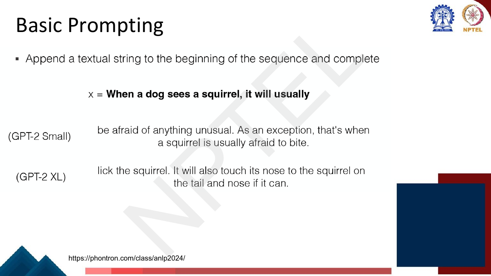
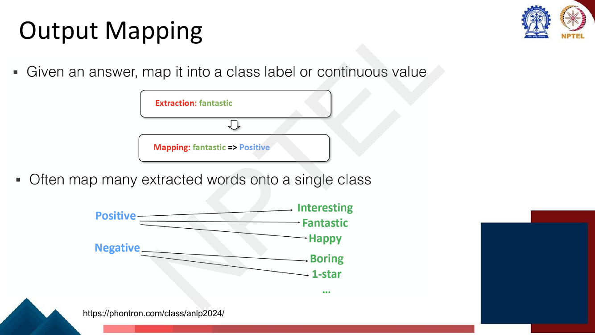
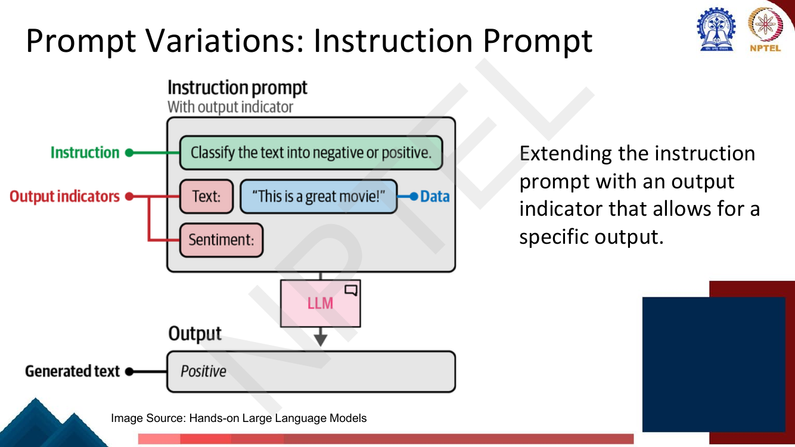
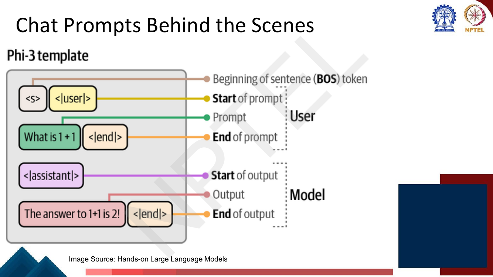
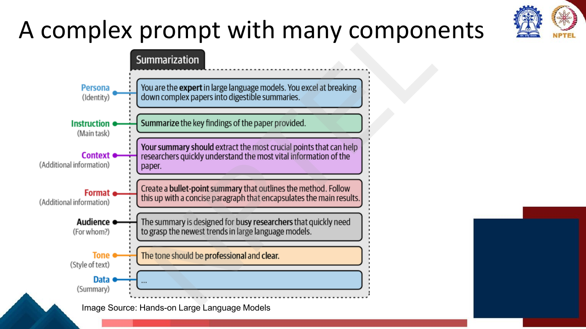
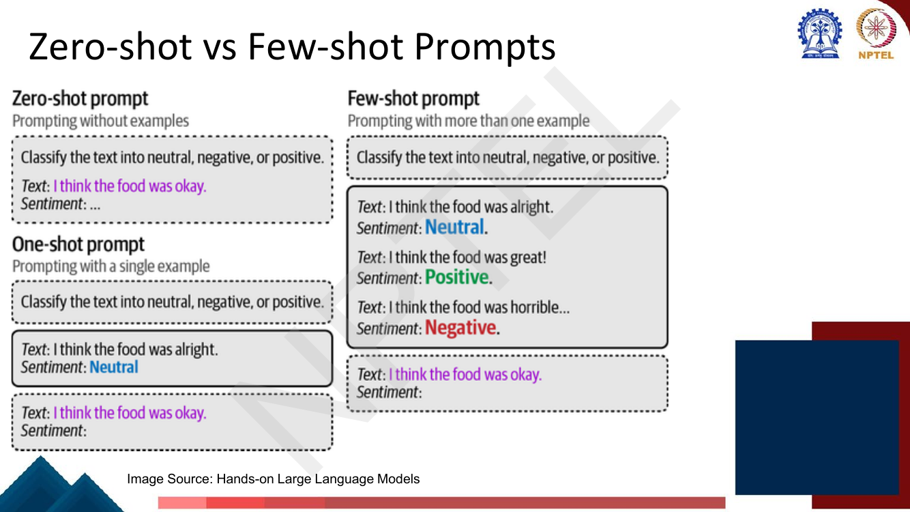
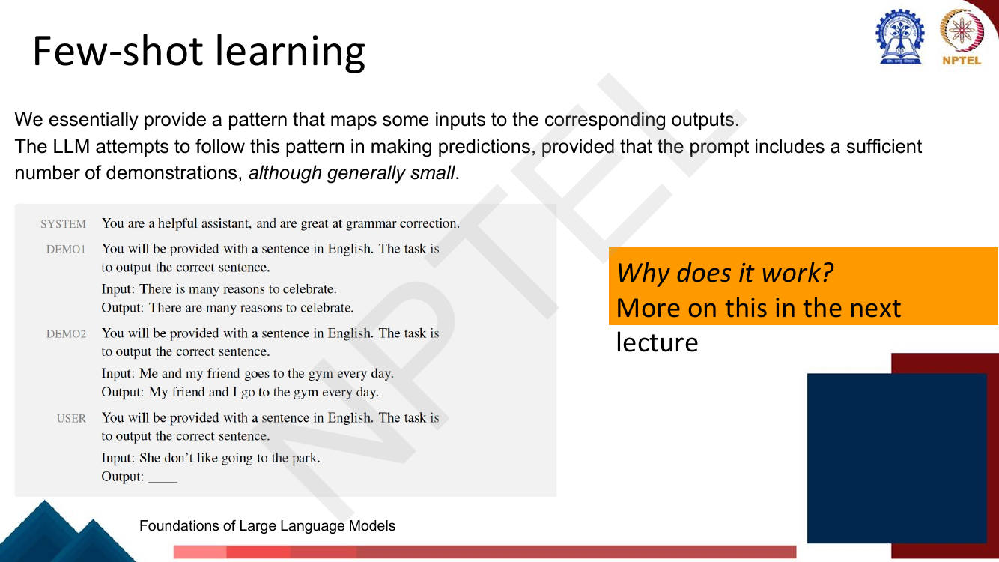

# Lec 41 — Prompting I

> **Source:** `Week9.pdf` pp. 1–25 · **Week 9** · **Playlist:** Lec 41
> **Prereqs:** [Lec 29 — GPT and Decoder Pretraining](../week-06/29-gpt-decoder-pretraining.md), [Lec 36 — Instruction Fine-tuning I](../week-08/36-instruction-finetuning-1.md)
> **Feeds into:** [Lec 42 — Why In-Context Learning Works](42-why-icl-works.md), [Lec 43 — Advanced Prompting](43-advanced-prompting.md), [Lec 45 — Automatic Prompt Engineering](45-automatic-prompt-engineering.md)

## Why this lecture exists

Everything up to Week 8 assumed that using a pretrained model meant *changing* it. BERT got a
classification head and a fine-tuning run; instruction tuning updated every weight on a mixture of
tasks. Each new task cost you a training job, a labelled dataset, and a separate copy of the model.

This lecture removes all three. Once a model is large enough and has been instruction-tuned, you can
specify a task by *writing it down* — in the same text channel the model reads anyway — and read the
answer out of the generated continuation. The weights never move. That turns "add a task" from an
engineering project into an editing task, and it turns the task interface into a design problem: what
exactly do you write, how do you format demonstrations, and how do you convert free-running text back
into a label? Those three questions are this lecture.

## The ideas

### What prompting is

The deck's definition, worth memorising verbatim:

> **Prompting is encouraging a pre-trained model to make particular predictions by providing a textual
> "prompt" specifying the task to be done.**

Nothing in that sentence mentions training. A prompt is an *input*, not an update. The model you
prompt is bit-for-bit the model you downloaded.

The slide's cartoon makes the point by handing the same kind of object to three different models:
`JDK is developed by ___` to BERT, `This is a super long text. TL;DR:` to BART, `Birds can ___` to
ERNIE. One text channel, three tasks, zero task-specific machinery.

This is the final stage of the arc the course has been walking: **rule-based → statistical →
train-from-scratch → pretrain-then-fine-tune → pretrain-then-prompt**. The last transition is the one
that matters here, because it is the one that makes the *task* a string.

### Basic prompting

The crudest form: **append a textual string to the beginning of the sequence and let the model
complete it.** No instruction, no examples.


*Fig. — The deck's example. `x = "When a dog sees a squirrel, it will usually"`. GPT-2 Small continues with something incoherent about squirrels being afraid to bite; GPT-2 XL continues with "lick the squirrel". Notice what is being demonstrated: the prompt is identical, so the quality difference is entirely the model's. Page 4.*

Two things to take from that slide. First, a bare completion prompt works on a *base* language model —
there is no assistant, no instruction-following, just next-token prediction
([Lec 29](../week-06/29-gpt-decoder-pretraining.md)). Second, **prompting quality is bounded by model
quality.** The same prompt that fails on GPT-2 Small works on GPT-2 XL. Prompt engineering cannot
manufacture a capability the model does not have.

### Prompt templates

A **prompt template** is a string with a hole in it. You fill the hole with the actual input, and
leave a second hole `[z]` for the model to fill.

![Slide: a three-box flow — Input x = "I love this movie", Template [x] Overall, it was [z], Prompting x' = "I love this movie. Overall it was [z]", with the caption that [z] is to be filled by the pretrained LM](../../assets/pages/lec41/p-005.png)
*Fig. — The deck's notation, which the rest of the lecture uses: `[X]` is the slot you fill, `[Z]` is the slot the model fills. The template is a pure function of the input; the model never sees the brackets. Page 5.*

Formally, a template is a function $f_{\text{prompt}}$ from an input $x$ to a filled string $x'$:

$$x' = f_{\text{prompt}}(x) = \texttt{"[X] Overall, it was [Z]"}\big|_{\texttt{[X]} \leftarrow x}$$

Calling it a function is not pedantry — it is the whole engineering value. The template is written
once and applied to every example in your dataset, exactly like a `sklearn` transformer. The code
section below implements it as literally a Python function.

The deck's table of templates is the single most examinable slide in the lecture, because it shows
that **wildly different NLP tasks collapse onto the same two-slot shape**:

![Slide: a table of Type / Task / Input [X] / Template / Answer [Z] rows covering sentiment, topics, intention, aspect sentiment, NLI, NER, summarization and translation](../../assets/pages/lec41/p-006.png)
*Fig. — Seven task types, one mechanism. Note the structural variety: NLI uses **two** input slots (`[X1]? [Z], [X2]`), NER puts the entity in a second slot and asks for its type, and summarization is just `[X] TL;DR: [Z]`. "CLS" is the deck's abbreviation for classification. Page 6.*

| Type | Task | Template | Answer `[Z]` ranges over |
|---|---|---|---|
| Text CLS | Sentiment | `[X] The movie is [Z].` | great, fantastic, … |
| Text CLS | Topics | `[X] The text is about [Z].` | sports, science, … |
| Text CLS | Intention | `[X] The question is about [Z].` | quantity, city, … |
| Text-span CLS | Aspect sentiment | `[X] What about service? [Z].` | Bad, Terrible, … |
| Text-pair CLS | NLI | `[X1]? [Z], [X2]` | Yes, No, … |
| Tagging | NER | `[X1][X2] is a [Z] entity.` | organization, location, … |
| Text generation | Summarization | `[X] TL;DR: [Z]` | free text |
| Text generation | Translation | `French: [X] English: [Z]` | free text |

Read the "Answer" column carefully. For the classification rows, `[Z]` is **not** a class index — it
is an English word that the model might emit. That is the hinge the next three subsections turn on.

### The three-stage pipeline: answer prediction → output selection → output mapping

The deck splits "run the prompt" into three distinct steps. Exam questions love this decomposition
because students collapse it into one.

**Stage 1 — Answer prediction.** Given the prompt, the model predicts text. The deck's example:
`x' = "I love this movie. Overall it was [z]"` becomes `"I love this movie. Overall it was fantastic"`.
Mechanically this is ordinary decoding — greedy, beam, sampling, whatever you configured
([Lec 19](../week-04/19-decoding-strategies.md)). Nothing new happens here. The prompt is just a
prefix.

**Stage 2 — Output selection.** *From a longer response, select the information indicative of an
answer.* Real models do not stop at one word. A model might emit
`"...Overall it was a movie that was simply fantastic"`, and you need `fantastic` out of that. The
deck names three extraction strategies by task type:

| Task type | Extraction method |
|---|---|
| Classification | identify keywords |
| Regression / numerical | identify numbers |
| Code | pull out code snippets in triple backticks |

The deck's companion list on the answer-prediction slide widens this: you might take the output
as-is, format it for visualisation, select only parts of it, or **map the outputs to other actions** —
that last one being the seed of tool use, which is [Lec 44](44-tool-aided-lms.md)'s.

**Stage 3 — Output mapping.** *Given an answer, map it into a class label or continuous value.*
`fantastic` ⟹ `Positive`.


*Fig. — The many-to-one structure is the part to remember: **Positive** ← {Interesting, Fantastic, Happy}, **Negative** ← {Boring, 1-star}. One class, many surface words. The mapping is something you choose, not something the model provides. Page 9.*

This mapping has a name in the literature the deck cites (Liu et al., *Pre-train, Prompt, and
Predict*): the **verbalizer**. It is a function $v$ from the label set to sets of vocabulary tokens,

$$v(\text{Positive}) = \{\text{interesting},\ \text{fantastic},\ \text{happy}\}, \qquad
v(\text{Negative}) = \{\text{boring},\ \text{1-star}\}$$

and prompting-as-classification runs it backwards: score the tokens in each $v(y)$ under the model's
next-token distribution, and pick the label whose token set scores highest.

**Why this is subtle, and why it is examined.** In a fine-tuned classifier, the output layer has
exactly $|\mathcal{Y}|$ units and the class is an index. In prompting, the "output layer" is the LM
head over the entire vocabulary $V$ — tens of thousands of units — and `positive` is just one token
competing with `the`, `a`, `not`, and 50,000 others. Three consequences follow:

1. **The probabilities do not sum to 1 over the label set.** You must *renormalise* over the
   verbalizer tokens to get a class distribution. Numerical N2 does this; typically only a few percent
   of the total probability mass sits on the label tokens at all.
2. **The verbalizer is a design choice with real consequences.** Choose `Positive`/`Negative` instead
   of `positive`/`negative` and you are scoring *different tokens*, which carry *different
   probabilities*. Numerical N3 shows the same forward pass flipping its prediction under that one
   change. Picking label tokens automatically is [Lec 45](45-automatic-prompt-engineering.md)'s.
3. **An unconstrained model can answer off-manifold.** Ask for `negative or positive` and a model may
   reply `The sentiment is clearly favourable`. Output selection exists precisely to cope with that,
   and the output indicator (next section) exists to make it rarer.

### Prompt variations: basic vs instruction

The deck gives each its own page, and the contrast is a near-certain MCQ.

A **basic prompt** has no instruction. `The sky is` → `blue.` The LLM, as the deck says, *will simply
try to complete the sentence*. This is pure next-token prediction and works on any base LM.

An **instruction prompt** has two components: **the instruction itself** and **the data it refers
to**.

- Instruction: `Classify the text into negative or positive.`
- Data: `"This is a great movie!"`
- Output: `The text is positive.`

Notice the output is a *sentence*, not a label — which is exactly the output-selection problem again.
So the deck extends the instruction prompt with a third component:


*Fig. — The **output indicator** is the pair of labels `Text:` and `Sentiment:`. Adding them changes the model's output from the sentence "The text is positive." to the bare token "Positive" — which needs no extraction step at all. The indicator does the work that a `[CLS]` head would do in a fine-tuned model. Page 12.*

| | Basic prompt | Instruction prompt | + output indicator |
|---|---|---|---|
| Components | data only | instruction + data | instruction + output indicator + data |
| Model does | completes the sentence | follows the instruction | follows it *in a fixed format* |
| Example output | `blue.` | `The text is positive.` | `Positive` |
| Needs | any base LM | an instruction-tuned LM | an instruction-tuned LM |

That "needs" row is the connection the deck leaves implicit: a base LM has no reason to obey an
imperative sentence. It obeys because [Lec 36](../week-08/36-instruction-finetuning-1.md) trained it
to, on a mixture of tasks phrased as instructions. **Instruction tuning is why prompting works at
all** on modern models.

### Chat prompts behind the scenes

A chat interface looks like a conversation with turns. It is not. **Behind the scenes, messages are
converted to a single token string** — one flat sequence fed to the same decoder-only LM as always.
The turn structure is encoded by *special tokens and role markers inside that string*.

![Slide: LLaMa and Alpaca chat templates side by side, with Sys / User / Asst. rows, showing [INST], <<SYS>>, <</SYS>>, [/INST] for LLaMa and ### Instruction: / ### Response: for Alpaca](../../assets/pages/lec41/p-013.png)
*Fig. — Two models, two incompatible conventions for the same three roles. LLaMA uses `[INST]…[/INST]` with `<<SYS>>…<</SYS>>` nested for the system message; Alpaca uses literal markdown-ish headers `### Instruction:` and `### Response:`. The assistant's reply carries **no** marker in either — it is simply what follows. Page 13.*

The format is **model-specific and not interchangeable.** Feed Alpaca's `###` headers to a LLaMA-chat
checkpoint and you get a measurable quality drop, because the model was fine-tuned to expect the other
delimiters. This is why `transformers` ships a `chat_template` with each tokenizer.

The second slide names the pieces precisely:


*Fig. — Phi-3's template, fully annotated. `<s>` = beginning-of-sentence, once per conversation. `<|user|>` starts a prompt, `<|end|>` closes it; `<|assistant|>` starts the model's output, `<|end|>` closes it. These are **single tokens in the vocabulary**, not character sequences the model parses. Page 14.*

The mechanics, stated plainly because they clarify a great deal:

1. Your message list is rendered into one string by the template.
2. The string ends with the *opening* marker of an assistant turn — `<|assistant|>` — and nothing
   after it. That is how the model knows it is its turn.
3. The model generates until it emits `<|end|>`, which the runtime uses as a stop token.
4. Next turn, the whole conversation is re-rendered and re-sent. **The model is stateless**; the
   illusion of memory is just the growing prefix.

Point 4 is the one that surprises people, and it is why long conversations get expensive: every turn
re-pays for the entire history. Numerical N5 counts the special-token overhead this adds.

### Prompt engineering strategies

The deck's single strategy page, with a three-stage worked example:

> **Describing the task as clearly as possible.** Particularly important when we want the output of the
> LLM to meet certain expectations.

| Stage | Prompt | Problem it fixes |
|---|---|---|
| Simple | `Tell me about climate change.` | — |
| Specific and detailed | `Provide a detailed explanation of the causes and effects of climate change, including the impact on global temperatures, weather patterns, and sea levels. Also, discuss possible solutions and actions being taken to mitigate these effects.` | the model "may generate a response that addresses any aspect of climate change, which may not align with our specific interests" |
| + audience and length | `Explain the causes and effects of climate change to a 10-year-old child. Talk about how it affects the weather, sea levels, and temperatures. Also, mention some things people are doing to help. Try to explain in simple terms and do not exceed 500 words.` | register and output length were unconstrained |

The generalisable lesson: **underspecification is the default failure mode.** The model will answer
*some* version of your question; specificity is how you choose which. Each revision added a constraint
— scope, then sub-topics, then audience, then length.

### Asking an LLM to follow a reasoning pattern

The deck gives one page to this. The argument: *since solving math problems requires a detailed
reasoning process, LLMs would probably make mistakes if they attempted to work out the answer
directly, so we can explicitly ask LLMs to follow a given reasoning process before coming to a
conclusion.* Its example assigns a persona ("You are a mathematician") and then four named steps:
Problem Interpretation → Strategy Formulation → Detailed Calculation → Solution Review.

That is all you need here. The theory of *why* step-by-step generation helps, chain-of-thought
prompting proper, and its descendants are [Lec 43](43-advanced-prompting.md)'s — the deck itself says
"more detailed discussion on how to improve prompting through more reasoning later".

### Multiple rounds of interaction

Prompting need not be one shot. The deck's two-round pattern:

1. **Round 1** — `You will be provided with a math problem. Please solve the problem. {*problem*}`
2. **Round 2** — `You will be provided with a math problem, along with a solution. Evaluate the
   correctness of this solution, and identify any errors if present. Then, work out your own solution.
   Problem: {*problem*}  Solution: {*solution*}`

The output of round 1 is *programmatically substituted into the template of round 2*. This is the
cheapest form of self-correction, and it is important to see it for what it is: still pure prompting,
with the orchestration living in your code, not in the model.

### A complex prompt with many components

The anatomy of a production prompt. The deck's summarization example decomposes into seven labelled
blocks:


*Fig. — Seven components, each a separate line of the same string. The ordering matters less than the presence of each. **Data comes last**, immediately before the model's turn — the standard arrangement, since the thing to act on should be nearest the generation point. Page 20.*

| Component | Question it answers | The deck's text |
|---|---|---|
| **Persona** | Identity | "You are the **expert** in large language models. You excel at breaking down complex papers into digestible summaries." |
| **Instruction** | Main task | "**Summarize** the key findings of the paper provided." |
| **Context** | Additional information | "Your summary should extract the most crucial points that can help researchers quickly understand the most vital information of the paper." |
| **Format** | Additional information | "Create a **bullet-point summary** that outlines the method. Follow this up with a concise paragraph that encapsulates the main results." |
| **Audience** | For whom? | "The summary is designed for **busy researchers** that quickly need to grasp the newest trends in large language models." |
| **Tone** | Style of text | "The tone should be **professional** and **clear**." |
| **Data** | The input | the paper itself |

Memorise the seven names and their one-word glosses. A question of the form "which component of a
complex prompt specifies *for whom* the output is written?" is as straightforward as MCQs get.

### Zero-shot vs few-shot prompts

The definitions, exactly as the deck gives them:

| Name | Definition | Demonstrations |
|---|---|---|
| **Zero-shot prompt** | prompting **without examples** | 0 |
| **One-shot prompt** | prompting with **a single example** | 1 |
| **Few-shot prompt** | prompting with **more than one example** | $k \geq 2$ |


*Fig. — The same instruction heads all three. What changes is the block of **demonstrations** between the instruction and the query: filled input–output pairs in exactly the format you want back. The final query is left with `Sentiment:` dangling and no answer — that dangling slot is `[Z]`. Page 21.*

Two details that get lost:

- The demonstrations are **filled templates**, not a separate data structure. A demonstration is
  `Text: I think the food was great!\nSentiment: Positive.` — the same template as the query, with the
  answer slot already filled in. The query's slot is left empty, so the model's next-token prediction
  lands in it.
- The deck's examples use a **three-class** label set (`neutral, negative, positive`) with three
  demonstrations, one per class. Balanced demonstrations are good practice, not a requirement.

### Few-shot prompting with chat prompts

With a chat model you do not paste the demonstrations into one user message. You format them as
**prior turns**, so the demonstration answers sit in the assistant role where the real answer will go.


*Fig. — The deck's exact note: "For OpenAI models, add `"role": "system"` and a `"name": "example_assistant"` etc." The two boxed entries are the one demonstration — a jargon sentence and its plain-English rewrite — carried as named system messages so the model reads them as examples rather than as real conversation history. Page 22.*

The general shape, model-agnostic, is a turn alternation:

```
system    : <the instruction>
user      : <demo input 1>      assistant : <demo output 1>
user      : <demo input 2>      assistant : <demo output 2>
...
user      : <the real query>    assistant : ← model generates here
```

The deck's closing few-shot slide shows the same thing with explicit `SYSTEM` / `DEMO1` / `DEMO2` /
`USER` labels for a grammar-correction task:


*Fig. — Note that each demonstration **repeats the task statement** ("You will be provided with a sentence in English. The task is to output the correct sentence.") before its Input/Output pair. Redundant to a human; it makes the pattern unambiguous to the model. The final `Output: ____` is the slot. Page 23.*

### Few-shot learning — and what "learning" does not mean here

The deck's closing framing:

> We essentially provide a pattern that maps some inputs to the corresponding outputs. The LLM attempts
> to follow this pattern in making predictions, provided that the prompt includes a sufficient number
> of demonstrations, **although generally small**.

Now the sentence this chapter exists to make unambiguous. **"Few-shot learning" here involves no weight
updates whatsoever.** There is no gradient, no optimiser step, no backward pass, no new parameters.
The model's $\theta$ after answering is byte-identical to $\theta$ before. The only thing that changed
is the *input string*.

This is why the phenomenon has a second name — **in-context learning** — which is the more honest one:
whatever adaptation happens, happens inside one forward pass, in the activations, and is discarded the
moment the context is cleared. [Lec 29](../week-06/29-gpt-decoder-pretraining.md) established the
phenomenon with GPT-3: a model large enough learns tasks from demonstrations in its prompt. This
lecture is about *how to write those demonstrations*.

Three practical corollaries of "no weight updates":

- Demonstrations cost **context window and money, every single query**, forever. Fine-tuning pays once;
  few-shot prompting pays per call. Numericals N1 and N4 put numbers on both halves.
- Nothing accumulates. A hundred demonstrations in call #1 teach the model nothing about call #2.
- You cannot exceed the context window, so $k$ is hard-capped by arithmetic, not by data availability.

**Why does it work at all?** The deck ends with that question in an orange box and defers it: *"More on
this in the next lecture."* So does this chapter — the induction-head explanation, the residual-stream
story, the order sensitivity of demonstrations, and the genuinely counterintuitive finding about
demonstration labels all belong to [Lec 42](42-why-icl-works.md). Read it next; the punchline is worth
the wait.

## Worked numericals

**No "Try this problem" page, and no in-deck exercise of any kind, appears in `Week9.pdf` pp. 1–25.**
All 25 pages were opened and checked as images. The ownership map's re-swept exercise table lists no
page for Lec 41, and that is correct. The five numericals below are constructed in the style the exam
uses for this material: token budgets, verbalizer probabilities, and cost.

### N1. Token budget for a few-shot prompt, and the largest $k$ that fits
**Given:** an instruction of 18 tokens; each demonstration (input text + `Sentiment:` + label +
separator) is 42 tokens; the query block is 31 tokens; you reserve 16 tokens for the model's answer.
The context window is $c = 2048$ tokens (GPT-3's, from [Lec 29](../week-06/29-gpt-decoder-pretraining.md)).
**Find:** the prompt length at $k = 16$, and the largest $k$ that fits.

1. Total token cost as a function of $k$:
   $$N(k) = \underbrace{18}_{\text{instruction}} + \underbrace{42k}_{\text{demos}} + \underbrace{31}_{\text{query}} + \underbrace{16}_{\text{reserved output}} = 65 + 42k$$
2. At $k = 16$: $N = 65 + 42 \times 16 = 65 + 672 = \mathbf{737}$ tokens. Fits comfortably.
3. The constraint is $N(k) \le 2048$, i.e. $42k \le 2048 - 65 = 1983$.
4. $k \le 1983/42 = 47.214\ldots$, so $k_{\max} = \lfloor 47.214 \rfloor = \mathbf{47}$.
5. Verify both sides. $k=47$: $65 + 42(47) = 65 + 1974 = 2039 \le 2048$ ✓.
   $k=48$: $65 + 42(48) = 65 + 2016 = 2081 > 2048$ ✗.
6. Sanity note: at $k = 47$ the demonstrations occupy $1974/2039 = 96.8\%$ of the prompt. The task
   itself is 3% of what you are paying for.

**Answer:** 737 tokens at 16-shot; $k_{\max} = \mathbf{47}$. The common error is forgetting to reserve
room for the *output* — without the 16-token reserve you would compute $k_{\max} = 47$ as well here
($(2048-49)/42 = 47.6$), but with a 128-token reserve it drops to 45, and on a short window it matters
a great deal.

### N2. Output mapping — turning a next-token distribution into a class distribution
**Given:** the prompt `Text: ... \nSentiment:` is run through the model. At the slot `[z]`, the
next-token distribution over the 50,257-token vocabulary has these entries (all others pooled):

| token | probability |
|---|---|
| `positive` | 0.0300 |
| `negative` | 0.0200 |
| `Positive` | 0.0120 |
| `Negative` | 0.0280 |
| `good` | 0.0450 |
| `not` | 0.0600 |
| all other 50,251 tokens | 0.8050 |

The verbalizer is $v(\text{Positive}) = \{\texttt{positive}\}$, $v(\text{Negative}) = \{\texttt{negative}\}$.
**Find:** the class distribution and the prediction.

1. Check the distribution is valid:
   $0.0300+0.0200+0.0120+0.0280+0.0450+0.0600+0.8050 = 1.0000$ ✓
2. Collect the verbalizer mass:
   $p_+ = P(\texttt{positive}) = 0.0300$, $p_- = P(\texttt{negative}) = 0.0200$.
3. Total mass on label tokens: $Z = 0.0300 + 0.0200 = \mathbf{0.0500}$ — i.e. **5% of the model's
   probability is on either label word**; 95% is on something else entirely.
4. Renormalise:
   $$P(\text{Positive} \mid x) = \frac{0.0300}{0.0500} = \mathbf{0.60}, \qquad P(\text{Negative} \mid x) = \frac{0.0200}{0.0500} = \mathbf{0.40}$$
5. Check they sum to 1: $0.60 + 0.40 = 1.00$ ✓
6. Predict $\arg\max = $ **Positive**.

**Answer:** $P(\text{Positive}) = 0.60$, $P(\text{Negative}) = 0.40$, prediction **Positive**. The step
that is examined is step 4 — **you must renormalise**. Reporting 0.03 as "the probability of positive"
is wrong; that is the probability of a *token*, not of a *class*.

### N3. The same distribution, a different verbalizer, the opposite answer
**Given:** the distribution of N2, unchanged. Now the verbalizer is capitalised:
$v(\text{Positive}) = \{\texttt{Positive}\}$, $v(\text{Negative}) = \{\texttt{Negative}\}$ — the natural
choice if your prompt reads `Sentiment:` and your demonstrations wrote `Positive.`
**Find:** the class distribution and the prediction, and compare.

1. $p_+ = P(\texttt{Positive}) = 0.0120$, $p_- = P(\texttt{Negative}) = 0.0280$.
2. $Z = 0.0120 + 0.0280 = 0.0400$.
3. $P(\text{Positive}) = 0.0120/0.0400 = \mathbf{0.30}$, $P(\text{Negative}) = 0.0280/0.0400 = \mathbf{0.70}$.
4. Prediction: **Negative**.
5. Now a third option — *pool* both casings, $v(\text{Positive}) = \{\texttt{positive},\texttt{Positive}\}$:
   $p_+ = 0.0300 + 0.0120 = 0.0420$, $p_- = 0.0200 + 0.0280 = 0.0480$, $Z = 0.0900$.
   $P(\text{Positive}) = 0.0420/0.0900 = 0.4667$ → **Negative**.

| Verbalizer | mass $Z$ | $P(\text{Positive})$ | prediction |
|---|---|---|---|
| `positive` / `negative` | 0.0500 | 0.6000 | **Positive** |
| `Positive` / `Negative` | 0.0400 | 0.3000 | **Negative** |
| pooled, both casings | 0.0900 | 0.4667 | **Negative** |

**Answer:** the prediction flips from **Positive** to **Negative** on the identical forward pass. One
model, one prompt, one probability vector, three verbalizers, two different answers. **Output mapping
is a real design decision, not bookkeeping.** In practice you also have to worry about the leading
space (` positive` and `positive` are *different tokens* in a BPE vocabulary —
[Lec 2](../week-01/02-text-processing-tokenization.md)), which is the single most common source of
silently broken verbalizers.

### N4. What few-shot prompting actually costs
**Given:** $N = 200{,}000$ queries. Pricing is \$0.50 per million input tokens and \$1.50 per million
output tokens. Using N1's numbers, the zero-shot prompt is $18 + 31 = 49$ input tokens; the 16-shot
prompt is $49 + 16 \times 42 = 721$ input tokens. The answer is 3 output tokens either way.
**Find:** the total cost of each, and the ratio.

1. **Zero-shot input tokens:** $200{,}000 \times 49 = 9{,}800{,}000 = 9.8$M.
   Cost $= 9.8 \times \$0.50 = \$4.90$.
2. **Output tokens (both cases):** $200{,}000 \times 3 = 600{,}000 = 0.6$M.
   Cost $= 0.6 \times \$1.50 = \$0.90$.
3. **Zero-shot total** $= \$4.90 + \$0.90 = \mathbf{\$5.80}$.
4. **16-shot input tokens:** $200{,}000 \times 721 = 144{,}200{,}000 = 144.2$M.
   Cost $= 144.2 \times \$0.50 = \$72.10$.
5. **16-shot total** $= \$72.10 + \$0.90 = \mathbf{\$73.00}$.
6. Ratio: $\$73.00 / \$5.80 = \mathbf{12.6\times}$. Extra spend for 16 demonstrations: $\$67.20$.
7. Why the ratio is 12.6 and not 14.7 (the input-token ratio $721/49$): the 3 output tokens are priced
   3× higher and are the same in both cases, which dilutes the input blow-up slightly.

**Answer:** \$5.80 zero-shot vs \$73.00 at 16-shot — **12.6× more expensive**, for a prompt that is
14.7× longer on the input side. This is the arithmetic behind "fine-tuning amortises, prompting does
not": the demonstrations are re-transmitted and re-encoded on every single call. (Prompt caching, which
reuses the KV cache of the shared 690-token prefix, is the standard mitigation — see Beyond the slides.)

### N5. Chat-template token overhead
**Given:** the Phi-3 template from page 14. Per conversation: one `<s>` BOS token. Per turn: an opening
role marker (`<|user|>` or `<|assistant|>`) and a closing `<|end|>` — 2 special tokens. To cue
generation, one trailing `<|assistant|>`. A conversation has **5 user turns of 25 content tokens each**
and **4 assistant replies of 60 content tokens each**; the model is about to produce the 5th reply.
**Find:** the special-token overhead, absolutely and as a fraction.

1. Content tokens: $5 \times 25 + 4 \times 60 = 125 + 240 = 365$.
2. Turns rendered: $5 + 4 = 9$. Special tokens for turns: $9 \times 2 = 18$.
3. Plus 1 BOS, plus 1 trailing `<|assistant|>`: $18 + 1 + 1 = \mathbf{20}$ special tokens.
4. Total prompt length $= 365 + 20 = 385$ tokens.
5. Overhead fraction $= 20/385 = 0.0519 = \mathbf{5.2\%}$.
6. Now the same 9 turns with short messages — 8 content tokens each:
   content $= 9 \times 8 = 72$; total $= 72 + 20 = 92$; overhead $= 20/92 = \mathbf{21.7\%}$.

**Answer:** 20 special tokens, **5.2%** overhead on long turns but **21.7%** on short chatty ones. The
overhead is a fixed 2 tokens per turn, so it is invisible for essay-length exchanges and significant
for rapid back-and-forth. Note also that at turn 5 you are re-sending all 385 tokens — nothing is
remembered, so the per-conversation cost grows quadratically in the number of turns.

## Code

Pure Python, no dependencies. Part 1 renders the zero-shot and few-shot strings; part 2 renders the
same few-shot prompt in Phi-3 chat format; part 3 performs the verbalizer renormalisation of N2 and N3.

```python
# ---------------------------------------------------------------
# 1. A prompt template is a FUNCTION from inputs to a filled string
# ---------------------------------------------------------------
TEMPLATE = "{instruction}\n\nText: {x}\nSentiment:"
INSTRUCTION = "Classify the text into negative or positive."

def zero_shot(x):
    return TEMPLATE.format(instruction=INSTRUCTION, x=x)

def few_shot(x, demos):
    """demos: list of (text, label). Demonstrations are prior FILLED templates."""
    parts = [INSTRUCTION, ""]
    for text, label in demos:
        parts.append(f"Text: {text}\nSentiment: {label}.\n")
    parts.append(f"Text: {x}\nSentiment:")          # answer slot left empty = [Z]
    return "\n".join(parts)

DEMOS = [("I think the food was alright.", "Neutral"),
         ("I think the food was great!",   "Positive"),
         ("I think the food was horrible...", "Negative")]
QUERY = "I think the food was okay."

print("=== ZERO-SHOT STRING SENT TO THE MODEL ===")
print(repr(zero_shot(QUERY)))
print("\n=== 3-SHOT STRING SENT TO THE MODEL ===")
print(repr(few_shot(QUERY, DEMOS)))

# ---------------------------------------------------------------
# 2. The same 3-shot prompt as a chat prompt (Phi-3 template, p. 14).
#    Demonstrations become PRIOR TURNS, not one long user message.
# ---------------------------------------------------------------
def phi3(messages):
    s = "<s>"                                       # BOS, once per conversation
    for role, content in messages:
        s += f"<|{role}|>\n{content}<|end|>\n"      # 2 special tokens per turn
    return s + "<|assistant|>\n"                    # cue the model to generate

msgs = [("user", INSTRUCTION)]
for text, label in DEMOS:
    msgs += [("user", f"Text: {text}"), ("assistant", label)]
msgs += [("user", f"Text: {QUERY}")]

print("\n=== 3-SHOT AS A CHAT PROMPT (Phi-3 template) ===")
print(phi3(msgs))
n_turns = len(msgs)
print("turns =", n_turns, " special tokens =", 1 + 2*n_turns + 1)   # N5's formula

# ---------------------------------------------------------------
# 3. OUTPUT MAPPING: renormalise over verbalizer tokens (matches N2, N3)
# ---------------------------------------------------------------
dist = {"positive": 0.0300, "negative": 0.0200,
        "Positive": 0.0120, "Negative": 0.0280,
        "good": 0.0450, "not": 0.0600, "<other 50251 tokens>": 0.8050}
print("\nsum of full distribution =", round(sum(dist.values()), 6))

def verbalize(dist, pos_tokens, neg_tokens):
    p = sum(dist[t] for t in pos_tokens)
    n = sum(dist[t] for t in neg_tokens)
    mass = p + n                     # NOT 1.0 -- this is the whole point
    return p/mass, n/mass, mass

for name, pos, neg in [("lowercase",   ["positive"], ["negative"]),
                       ("capitalised", ["Positive"], ["Negative"]),
                       ("pooled", ["positive","Positive"], ["negative","Negative"])]:
    p, n, mass = verbalize(dist, pos, neg)
    print(f"{name:12s} mass={mass:.4f}  P(+)={p:.4f}  P(-)={n:.4f}  "
          f"-> {'POSITIVE' if p > n else 'NEGATIVE'}")
```

Real printed output:

```
=== ZERO-SHOT STRING SENT TO THE MODEL ===
'Classify the text into negative or positive.\n\nText: I think the food was okay.\nSentiment:'

=== 3-SHOT STRING SENT TO THE MODEL ===
'Classify the text into negative or positive.\n\nText: I think the food was alright.\nSentiment: Neutral.\n\nText: I think the food was great!\nSentiment: Positive.\n\nText: I think the food was horrible...\nSentiment: Negative.\n\nText: I think the food was okay.\nSentiment:'

=== 3-SHOT AS A CHAT PROMPT (Phi-3 template) ===
<s><|user|>
Classify the text into negative or positive.<|end|>
<|user|>
Text: I think the food was alright.<|end|>
<|assistant|>
Neutral<|end|>
<|user|>
Text: I think the food was great!<|end|>
<|assistant|>
Positive<|end|>
<|user|>
Text: I think the food was horrible...<|end|>
<|assistant|>
Negative<|end|>
<|user|>
Text: I think the food was okay.<|end|>
<|assistant|>

turns = 8  special tokens = 18

sum of full distribution = 1.0
lowercase    mass=0.0500  P(+)=0.6000  P(-)=0.4000  -> POSITIVE
capitalised  mass=0.0400  P(+)=0.3000  P(-)=0.7000  -> NEGATIVE
pooled       mass=0.0900  P(+)=0.4667  P(-)=0.5333  -> NEGATIVE
```

Three things to read off this output. The `repr()` of the few-shot prompt is the **literal string the
model sees** — one flat sequence, newlines and all; "demonstrations" are not a separate channel. The
chat rendering ends with a bare `<|assistant|>\n` and nothing after it, which is exactly how the model
knows to start. And the last three lines reproduce N2 and N3: same `dist`, different verbalizer,
flipped prediction.

## Exam pack

### Must-memorise

| Item | Exactly this |
|---|---|
| Prompting (deck's definition) | encouraging a pre-trained model to make particular predictions by providing a textual "prompt" specifying the task to be done |
| Basic prompting | append a textual string to the beginning of the sequence and complete |
| Prompt template | a string with `[X]` (you fill) and `[Z]` (the LM fills); a function $x \mapsto x'$ |
| The three stages, in order | **answer prediction → output selection → output mapping** |
| Answer prediction | given a prompt, predict the answer |
| Output selection | from a longer response, select the information indicative of an answer |
| Output mapping | given an answer, map it into a class label or continuous value |
| Verbalizer | the label → token-set map; "often map many extracted words onto a single class" |
| Extraction by task | classification → keywords; regression/numerical → numbers; code → triple-backtick snippets |
| Basic prompt | no instruction; the LLM simply completes the sentence |
| Instruction prompt | two components: the **instruction** and the **data** it refers to |
| Output indicator | the extra component (`Text:` / `Sentiment:`) that forces a specific output format |
| Chat prompts | messages are converted to **token strings**; roles are special tokens, format is model-specific |
| Phi-3 markers | `<s>` BOS, `<\|user\|>` start of prompt, `<\|end\|>` end, `<\|assistant\|>` start of output |
| Zero-shot | prompting **without** examples |
| One-shot | prompting with **a single** example |
| Few-shot | prompting with **more than one** example |
| Few-shot learning | a pattern mapping inputs to outputs that the LLM follows — **with no weight updates** |
| Seven components of a complex prompt | Persona, Instruction, Context, Format, Audience, Tone, Data |
| Prompt-engineering rule | describe the task as clearly as possible; add scope, audience, length |

### Numbers worth knowing

| Quantity | Value |
|---|---|
| Stages in the deck's prompting pipeline | **3** (answer prediction, output selection, output mapping) |
| Components of a basic instruction prompt | **2** (instruction, data); **3** with an output indicator |
| Components in the deck's complex prompt | **7** |
| Task rows in the template table (p. 6) | **8** across 4 types (Text CLS, Text-span CLS, Text-pair CLS, Tagging, Text Generation) |
| Demonstrations in the deck's few-shot example | **3** (one per class: Neutral, Positive, Negative) |
| Special tokens per chat turn (Phi-3) | **2** (opening role marker + `<\|end\|>`) |
| Reasoning steps in the "mathematician" prompt (p. 18) | **4** (Interpretation, Strategy, Calculation, Review) |
| Rounds in the deck's self-correction pattern (p. 19) | **2** |
| Deck's length constraint example | "do not exceed **500 words**" |
| Deck's audience example | a **10-year-old child** |
| Models named for chat templates | LLaMA, Alpaca, Phi-3 |
| Models named for basic prompting | GPT-2 Small, GPT-2 XL |
| Key citations | *Pre-train, Prompt, and Predict* (arXiv 2107.13586); *Foundations of Large Language Models* (arXiv 2501.09223); *Hands-on Large Language Models* |

### Likely MCQ traps

- **"Few-shot learning updates the model's weights."** It does not. No gradient, no optimiser step,
  no new parameters. The only thing that changes is the input string. This is the single most likely
  trap in the lecture.
- **"Zero-shot means no instruction."** No — zero-shot means **no examples**. A zero-shot prompt
  usually *does* contain an instruction. "No instruction" is a *basic* prompt.
- **"One-shot is a kind of zero-shot."** No. Zero-shot = 0 examples, one-shot = 1, few-shot = more
  than one. The deck gives all three separately.
- **Confusing output selection with output mapping.** Selection pulls `fantastic` out of a longer
  sentence (text → text). Mapping converts `fantastic` into `Positive` (text → label). They are stages
  2 and 3, in that order.
- **"The model outputs a class probability directly."** It outputs a distribution over the *whole
  vocabulary*. You must restrict to the verbalizer tokens and **renormalise** — the raw token
  probability is not a class probability.
- **"The verbalizer is part of the model."** It is a design choice you make. Changing it can flip the
  prediction on an unchanged forward pass (N3).
- **"Chat is a different kind of model."** It is the same decoder-only LM. The conversation is
  flattened into one string with role markers; the model is stateless between turns.
- **"Chat templates are standardised."** They are not. LLaMA's `[INST]`/`<<SYS>>` and Alpaca's
  `### Instruction:` are mutually incompatible, and using the wrong one degrades quality.
- **"Output indicator" vs "instruction".** The instruction says *what to do*; the output indicator
  (`Text:` / `Sentiment:`) fixes *what shape the answer takes*.
- **"Prompt engineering can make a small model behave like a large one."** The page-4 GPT-2
  Small/XL contrast says otherwise — the same prompt, very different outputs.
- **Attributing chain-of-thought to this lecture.** Page 18 only says you *can* ask the model to follow
  a reasoning pattern, and explicitly defers. CoT is [Lec 43](43-advanced-prompting.md)'s.
- **Attributing "why ICL works" to this lecture.** Page 23 asks the question and defers to
  [Lec 42](42-why-icl-works.md).
- **Persona vs Audience.** Persona = who the *model* is ("You are the expert…"). Audience = who the
  output is *for* ("busy researchers"). Both are in the seven components; they are easy to swap.

### Self-test

1. State the deck's definition of prompting in one sentence.
2. Name the three stages of the prompting pipeline in order, and say in one phrase what each does.
3. A prompt template for NLI is `[X1]? [Z], [X2]`. How many input slots does it have, and what does the model fill?
4. Give the three components of an instruction prompt with an output indicator, using the deck's movie example.
5. A model's next-token distribution gives $P(\texttt{positive}) = 0.015$ and $P(\texttt{negative}) = 0.045$. What is $P(\text{Positive})$ as a class probability, and what fraction of the model's mass was on label tokens at all?
6. What is the difference between a zero-shot, a one-shot and a few-shot prompt?
7. In the Phi-3 chat template, what marks the end of the model's output, and what does the rendered string end with just before generation starts?
8. An instruction is 20 tokens, each of $k$ demonstrations is 50 tokens, the query is 30 tokens, and you reserve 100 for the answer. The context window is 4096. What is $k_{\max}$?
9. Does few-shot prompting change the model's parameters? Justify your answer in one sentence.
10. Name the seven components of the deck's complex summarization prompt.

<details><summary>Answers</summary>

1. Encouraging a pre-trained model to make particular predictions by providing a textual "prompt" specifying the task to be done.
2. **Answer prediction** — given a prompt, the model predicts text; **output selection** — from that longer response, extract the part indicative of an answer; **output mapping** — convert that extracted text into a class label or continuous value.
3. Two input slots (`[X1]` and `[X2]`); the model fills `[Z]`, which ranges over answers like Yes / No.
4. Instruction: "Classify the text into negative or positive." Output indicators: `Text:` and `Sentiment:`. Data: "This is a great movie!". The output becomes the bare token `Positive`.
5. $Z = 0.015 + 0.045 = 0.060$, so $P(\text{Positive}) = 0.015/0.060 = 0.25$ and the prediction is Negative. Only **6%** of the model's probability mass was on either label token.
6. Zero-shot has no examples; one-shot has exactly one; few-shot has more than one. All three may still carry an instruction.
7. The `<|end|>` token marks the end of output. Just before generation, the rendered string ends with the opening marker `<|assistant|>` and nothing after it.
8. $N(k) = 20 + 50k + 30 + 100 = 150 + 50k \le 4096 \Rightarrow 50k \le 3946 \Rightarrow k \le 78.92$, so $k_{\max} = \mathbf{78}$. (Check: $150 + 3900 = 4050 \le 4096$; $k=79$ gives 4100 ✗.)
9. No. The demonstrations are part of the input string only; there is no gradient, no optimiser step and no parameter change, which is why the phenomenon is more accurately called *in-context* learning.
10. Persona, Instruction, Context, Format, Audience, Tone, Data.

</details>

## Beyond the slides

**Gap:** The deck never says how many demonstrations is "enough", nor that **performance saturates**.
**Why it matters:** The slide says "a sufficient number of demonstrations, although generally small"
and stops. The empirical picture is that most of the gain arrives by $k \approx 4$–$8$, and beyond
roughly 32 the curve is flat or noisy while cost grows linearly (N4). An exam question of the form
"what happens as you keep adding demonstrations?" has the answer *diminishing returns, then linear
cost for nothing* — not "it keeps improving".

**Gap:** The LLaMA template on page 13 is drawn **incorrectly**.
**Why it matters:** The slide shows the system block wrapped in its own `[INST] <<SYS>>…<</SYS>>
[/INST]` and the user message in a *second*, separate `[INST]…[/INST]`. The real Llama-2-chat format
nests the system block *inside the first user turn*:
`<s>[INST] <<SYS>>\n{system}\n<</SYS>>\n\n{user} [/INST] {assistant} </s>`. Likewise, the deck labels
Alpaca's user turn `### Instruction:` a second time, where Alpaca actually uses `### Input:` for the
data. If an exam quotes the slide, answer from the slide — but do not copy either template into real
code. The examinable *idea* (roles become special tokens in one flat string, and the format is
model-specific) is correct on both.

**Gap:** Page 22's few-shot chat format — `"role": "system"` with `"name": "example_user"` — is an
**obsolete OpenAI-specific convention**.
**Why it matters:** Current practice is to use the ordinary `user` and `assistant` roles for
demonstrations, exactly as the code block above does; the `name`-on-a-system-message trick was a
workaround for an older API. The deck's underlying point — demonstrations go in as *prior turns*, not
as one pasted blob — is the part that generalises and the part worth remembering.

**Gap:** No mention of **prompt caching**, the standard fix for N4's cost blow-up.
**Why it matters:** Every query in a few-shot workload shares an identical prefix (instruction +
demonstrations — 690 of the 721 tokens in N4). Providers let you cache that prefix's KV tensors
([Lec 25](../week-05/25-efficient-transformers.md)) and charge a fraction for cache hits, which cuts
the 12.6× penalty to something near 2×. It changes the economics of few-shot prompting entirely and is
the main reason long prompts are viable in production.

**Gap:** The deck does not say that prompting **competes with** fine-tuning on a measurable axis.
**Why it matters:** The decision rule is simple and worth carrying: prompting wins when you have few
labelled examples, need many tasks from one model copy, or need to iterate fast; fine-tuning (or PEFT
— [Lec 46](../week-10/46-peft-adapters-prefix.md), [Lec 47](../week-10/47-lora-and-variants.md)) wins
at high query volume, because it moves the demonstrations out of the per-call cost and into the
weights once. N4 is the arithmetic behind that sentence.

## Cut from the slides

Page 1 is the title card, page 2 the three-bullet "Concepts Covered" list (reproduced as this
chapter's structure), page 24 the reference list (folded into the citations above) and page 25 the
"Thank You" card — none carry content. Pages 15–17 are a three-page incremental reveal of **one**
climate-change prompt being refined twice; they are compressed into a single three-row table, which
loses nothing since the prompts themselves are quoted in full. Pages 10–12 are three pages of the same
figure family (basic → instruction → instruction-with-indicator); the first two are summarised in the
comparison table and only page 12, which adds the output indicator, is shown as an image. Page 18's
four-step "mathematician" prompt is quoted by its step names only, because the reasoning content
belongs to [Lec 43](43-advanced-prompting.md) and expanding it here would cross an ownership boundary.
Page 23's orange "Why does it work?" box is deliberately left as a cliffhanger for
[Lec 42](42-why-icl-works.md). Nothing about templates, the three-stage pipeline, chat formats, prompt
components, or the zero/one/few-shot distinction was dropped. **No exercise page exists in pp. 1–25** —
all 25 pages were opened and verified as images.
