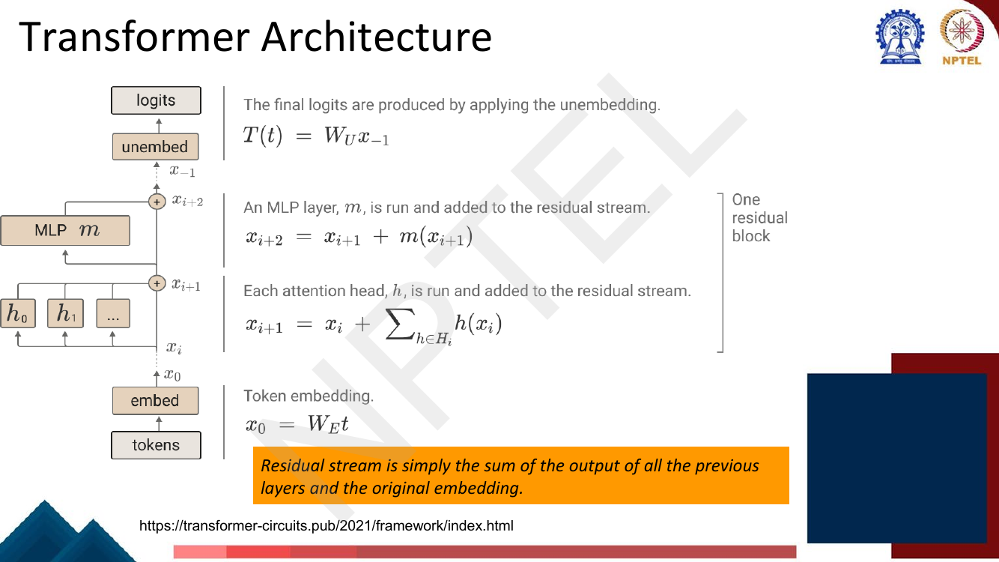
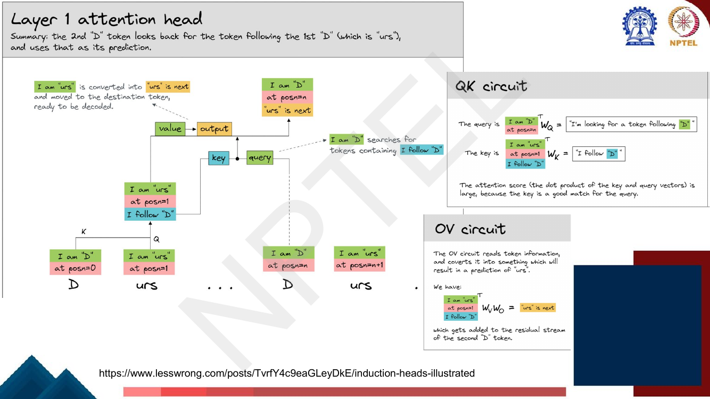
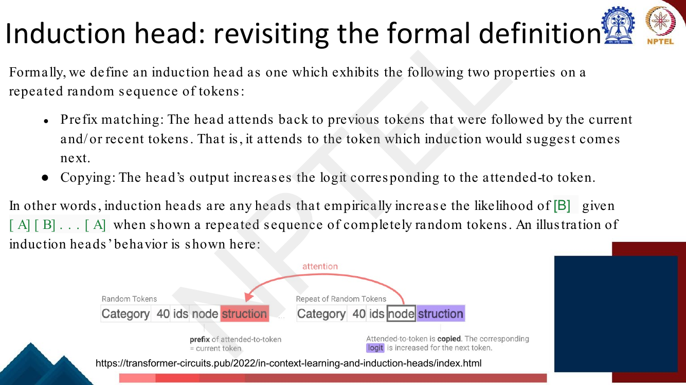
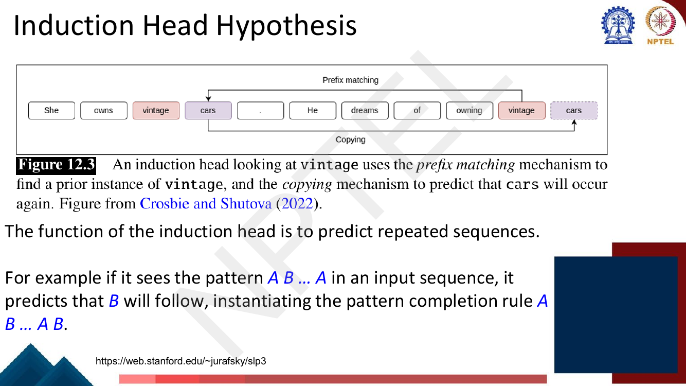
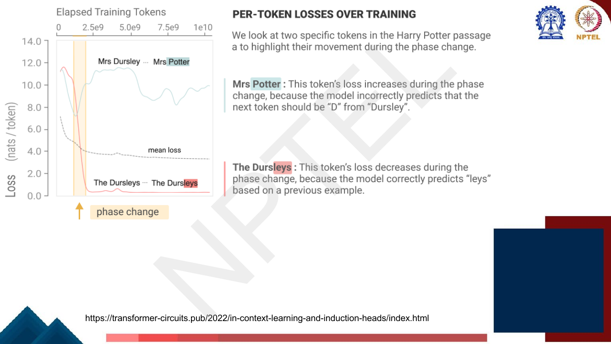
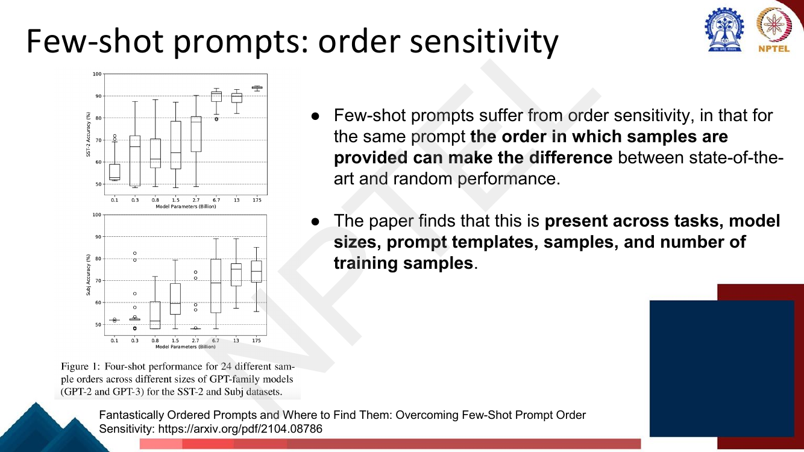

# Lec 42 — Prompting: Why Does In-Context Learning Work?

> **Source:** `Week9.pdf` pp. 26–52 · **Week 9** · **Playlist:** Lec 42
> **Prereqs:** [Lec 41 — Prompting I](41-prompting-1.md), [Lec 22 — Self-Attention and Multi-Head Attention](../week-05/22-self-attention-and-multihead.md)
> **Feeds into:** [Lec 43 — Advanced Prompting](43-advanced-prompting.md), [Lec 58 — Interpretability: FFN and Causal Tracing](../week-12/58-interpretability-ffn-and-causal-tracing.md)

## Why this lecture exists

[Lec 29](../week-06/29-gpt-decoder-pretraining.md) and [Lec 41](41-prompting-1.md) told you that
in-context learning happens: paste $k$ solved examples into the prompt and accuracy goes up. Neither
said *how*. That gap should bother you, because nothing about the model changed. The weights are
frozen. No gradient was computed, no optimiser step was taken, nothing was stored between the examples
and the question. Whatever "learning" means here, it is happening inside a single forward pass, and it
has to be implemented by matrix multiplications that were already there.

This lecture gives the leading mechanistic answer — the **induction head**, a two-attention-head
circuit that completes repeated patterns — and then undermines your confidence in the word "learning"
with two empirical results: shuffling the demonstrations can swing accuracy from state-of-the-art to
chance, and replacing every demonstration label with a *random* one barely hurts at all.

## The ideas

### The question, stated precisely

The deck's definition (p. 28) is worth memorising verbatim, because every clause is load-bearing.
**In-context learning** means language models learning to

- do new tasks,
- better predict tokens, or
- generally reduce their loss,

**during the forward pass at inference time**, and **without any gradient-based updates to the
model's parameters**.

The second pair of clauses is what makes this mysterious. "Reduce their loss" is deliberately broader
than "do a task": a model that merely gets better at predicting token 500 than token 50 of an ordinary
document is already doing in-context learning by this definition. That broad version is the one the
measurement later in this chapter actually tracks.

### The residual stream: the reframing that makes circuits possible

To explain a mechanism you need a vocabulary for talking about *where information lives* inside a
Transformer. The deck borrows one from Anthropic's *A Mathematical Framework for Transformer Circuits*
(Elhage et al., 22 December 2021).

You already know the residual connection from [Lec 22](../week-05/22-self-attention-and-multihead.md):
each sublayer computes something and adds it to its input. The circuits reframing is to stop thinking
of that as "a layer with a shortcut" and start thinking of it as **one persistent vector per token
position that every component reads from and writes to**. The deck's slogan: *the residual stream is
simply the sum of the output of all the previous layers and the original embedding.*


*Fig. — Read the four equations bottom to top. Every arrow into the stream is a `+`. Nothing ever overwrites the stream; components only add to it. Page 32 of Week9.pdf.*

Written out, with $\mathbf{x}^{(i)}$ the residual stream at a position after $i$ updates:

$$\mathbf{x}^{(0)} = \mathbf{W}_E\mathbf{t}, \qquad
\mathbf{x}^{(i+1)} = \mathbf{x}^{(i)} + \sum_{h \in H_i} h(\mathbf{x}^{(i)}), \qquad
\mathbf{x}^{(i+2)} = \mathbf{x}^{(i+1)} + m(\mathbf{x}^{(i+1)}), \qquad
T(\mathbf{t}) = \mathbf{W}_U \mathbf{x}^{(-1)}$$

Unrolling the recursion gives the whole point: $\mathbf{x}^{(-1)}$ is literally the embedding plus the
sum of every head's and every MLP's output. **Layers do not transform the stream; they add to it.**
That additivity is what lets you attribute a final logit to one specific head twenty layers back,
which is what "circuit analysis" means.

Two complementary motions, from the deck's residual-stream slide (p. 33):

- **Attention heads move information *across* residual streams** — from token $j$'s stream to token
  $i$'s stream. They are the only components that do so.
- **MLPs move information *across dimensions within* a single residual stream.** They never see
  another position. (What MLPs compute is [Lec 58](../week-12/58-interpretability-ffn-and-causal-tracing.md)'s
  topic.)

### Important notions: reading, writing, and subspaces

The residual stream has a fixed width $d_{\text{model}}$, but a 12-layer model has well over a hundred
heads all writing into it. If they all wrote to the same directions they would scribble over each
other. They do not, and the deck's "Important notions" pages (34–35) say why:

- Different heads in each layer can be thought of as **operating independently**, reading from and
  writing into the residual stream.
- $\mathbf{W}_Q, \mathbf{W}_K, \mathbf{W}_V$ **read from** (project from) the stream;
  $\mathbf{W}_O$ **writes to** (embeds into) the stream.
- Heads **compose to form circuits**. The deck names **$K$-composition**: the output of one head is
  used to build the *key* vector of a later head. That is exactly the induction circuit.
- $\mathbf{W}_{QK} := \mathbf{W}_Q\mathbf{W}_K^\top$ is the **QK circuit**. It is a bilinear form:
  $\mathbf{v}_i^\top \mathbf{W}_{QK}\mathbf{v}_j$ is the attention paid by token $i$ to token $j$.
  It tells you **which tokens information moves to and from**.
- $\mathbf{W}_{OV} := \mathbf{W}_V\mathbf{W}_O$ is the **OV circuit**. It maps a residual-stream vector
  to a residual-stream vector: it tells you **what information is moved** from a token, given that the
  token is attended to.

That QK/OV factorisation is the single cleanest idea in the chapter: **where to look** and **what to
copy** are separate, independently analysable matrices.


*Fig. — Four subspaces, four meanings: "this token is X", "this token is at position X", "the next token will be X", "the previous token was X". The fourth has no weight matrix of its own — it is scratch space the model invented. Page 36.*

The four subspaces the deck labels are:

| Subspace | Reads as | Comes from |
|---|---|---|
| token encoding | "this token is $X$" | rows of $\mathbf{W}_E$ |
| positional encoding | "this token is at position $X$" | rows of $\mathbf{W}_{pos}$ |
| decoding | "the next token will be $X$" | columns of $\mathbf{W}_U$ |
| prev-token | "the previous token was $X$" | **intermediate information** — not any weight matrix |

The deck's worked illustration (**"An example: Embedding"**, p. 37) takes the sequence
`D urs … D urs` — the tokenised fragment of *Dursley* from the Harry Potter opening — and shows
each position after embedding carrying exactly two filled blocks: `I am "D"` + `at posn=0`, then
`I am "urs"` + `at posn=1`, and so on. The decoding and prev-token blocks are empty.

The deck's notation for this is worth copying, because it makes the whole circuit readable at a
glance. A one-hot token vector written $\texttt{"A"}$ gives $\texttt{"A"}^\top\mathbf{W}_E$ = the block
`I am "A"`; a one-hot position vector $n$ gives $n^\top\mathbf{W}_{pos}$ = the block `at posn=n`.
Embedding is just the sum of those two, so **after embedding only two of the four subspaces are
occupied**, and any subspace you see filled later must have been written by some head or MLP you can
point at. That is the whole method: track which block gets filled, by whom, and when.

### The two-head induction circuit, step by step

**Layer 0 — the previous-token head.** Its QK circuit uses positions only: the query at position $t$
says "I'm looking for position $t-1$", the key at position $j$ says "I'm at position $j$", and the dot
product is large exactly when $j = t-1$. Its OV circuit reads the source token's *identity* and writes
it into the *prev-token subspace* of the destination. So after layer 0, position 1 (holding `urs`)
carries `I am "urs"` **and** `I follow "D"`.


*Fig. — Note the OV circuit writes to a **different subspace** than it reads from, so it does not erase the destination's own token identity. That is what makes the two pieces of information co-exist at one position. Page 38.*

**Layer 1 — the induction head.** Now the second `D`, at position $n$, forms a query from its own
token identity that reads "I'm looking for a token following `D`". The keys are read out of the
prev-token subspace — which only layer 0 could have filled. Position 1's key says `I follow "D"`, so
the score is large and the head attends there. Its OV circuit then converts `I am "urs"` into
`"urs" is next` and writes that into the decoding subspace of position $n$.


*Fig. — The key here is built from information another head wrote. That is $K$-composition, and it is why a one-layer model cannot have induction heads. Page 39.*


*Fig. — Trace the two hops: position 0 → position 1 (layer 0), then position 1 → position $n$ (layer 1). Two attention operations in series; the prediction falls out of $\mathbf{W}_U$. Page 40.*

Compressed to a diagram:

```
layer 0 (previous-token head)      layer 1 (induction head)
   [A]  --writes "I follow A"-->  [B]  <--attends-- [A]  ==> predict [B]
   pos0                          pos1              pos n
```

### The formal definition

The deck revisits the definition explicitly (p. 41). An **induction head** is a head exhibiting two
properties on a repeated random sequence of tokens:

1. **Prefix matching** — the head attends back to previous tokens that were followed by the current
   and/or recent tokens. That is, it attends to the token which induction would suggest comes next.
2. **Copying** — the head's output **increases the logit corresponding to the attended-to token**.

> In other words, induction heads are any heads that empirically increase the likelihood of **[B]**
> given **[A] [B] … [A]** when shown a repeated sequence of completely random tokens.


*Fig. — "Completely random tokens" is the crucial control: no amount of English grammar can help you, so a head that still succeeds must be doing pattern completion, not recall. Page 41.*


*Fig. — Two arcs, two mechanisms: prefix matching finds the earlier `vintage`, copying promotes whatever followed it. The deck states the rule as $A\,B \ldots A \Rightarrow B$, completing to $A\,B \ldots A\,B$. Page 29.*

**Memorise the pattern: `[A][B] … [A] → [B]`.** It is the single most examinable sentence in Week 9.
The deck adds that induction heads are a **circuit** — an abstract component of a network — found
inside the attention computation, and **discovered by studying mini language models with only 1–2
attention heads**.

### The evidence that induction heads explain ICL

The 2022 follow-up paper gives six arguments; the deck reproduces all of them (pp. 42, 45).

| # | Name | Claim |
|---|---|---|
| 1 | Macroscopic co-occurrence | Models undergo a **phase change** early in training during which induction heads form and in-context learning improves dramatically — *simultaneously* |
| 2 | Macroscopic co-perturbation | Architectural changes that shift *whether and when* induction heads can form shift the ICL improvement in a precisely matching way |
| 3 | Direct ablation | Knocking out induction heads at test time in small models greatly decreases in-context learning |
| 4 | Specific examples of generality | The same narrowly-defined heads empirically implement more abstract in-context behaviours too |
| 5 | Mechanistic plausibility | For small models the mechanism is fully explainable, and it suggests natural ways to repurpose it for more general ICL |
| 6 | Continuity small → large | The evidence is strongest for small models, but the relevant behaviours vary **smoothly** with scale, so the simplest explanation is that the mechanism is the same |

Arguments 1–3 are correlation, intervention-on-the-architecture, and intervention-on-the-model
respectively — a rising ladder of causal strength. Argument 6 is an honest admission: nobody has
verified this inside a 175B model.

### The ICL score, and why the 500th token

To make "in-context learning improved" into a number you can plot against training step, the paper
defines

$$\text{ICL score} = \mathcal{L}_{500} - \mathcal{L}_{50}$$

— **the loss of the 500th token in the context minus the average loss of the 50th token in the
context, averaged over dataset examples.** Because improvement *with* more context *is* in-context
learning by the deck's own definition, a model that exploits context posts a **negative** score, and
more negative is better.

**Why this choice?** The deck answers directly: the 500th token is near the end of a length-512
context (so it has nearly all the available context), and the 50th token is far enough in that some
basic properties of the text have been established — **such as language and document type** — while
still being near the start. Choosing token 1 instead would confound real in-context learning with the
model simply working out what language it is reading.


*Fig. — The headline: **models with more than one layer have an abrupt improvement in in-context learning**; the one-layer model has no sudden improvement at all. One layer cannot do $K$-composition, so it cannot form an induction head. Page 43.*

The one-layer control is the cleanest piece of evidence in the deck. An induction head needs a
*previous-token* head to supply its keys; a single attention layer has nothing to compose with. And
exactly the single-layer model shows no phase change.


*Fig. — The same mechanism that makes `The Dursleys` cheap makes `Mrs Potter` expensive: the induction head blindly copies the earlier continuation. The loss **goes up** on that token at the phase change. Page 44.*

That rising curve is the best proof that the deck is describing a real mechanism and not a just-so
story: a mechanism that only ever helped would be indistinguishable from "the model got better".

### From copying to few-shot classification

There is an obvious objection: literal copying explains `The Durs|leys`, but a few-shot sentiment
prompt never repeats a token. How does $[A][B]\ldots[A] \to [B]$ become "classify this review"?

Argument 4 is the deck's answer, and the step is **fuzzy matching**. Nothing in the QK circuit forces
$[A]$ to be the *same* token; it only has to produce a *similar key*. Once the prefix match is
approximate, the same circuit implements: find the earlier context most similar to the current one,
and copy forward whatever followed it. In a prompt of the form
`Text: … Sentiment: Positive / Text: … Sentiment: Negative / Text: … Sentiment:`, the token
`Sentiment:` is *literally repeated*, so prefix matching locks onto the earlier `Sentiment:` tokens
and copying promotes the strings that followed them — `Positive`, `Negative`. That alone fixes the
**format** and the **label space** without the model understanding a single review. Hold that thought:
it is exactly what the counterintuitive results below turn out to measure.

### Recap: zero-shot vs few-shot, and three awkward questions

[Lec 41](41-prompting-1.md) owns the templates; the recap slide (p. 46) only reminds you that a
**zero-shot** prompt has no examples, a **one-shot** prompt has one, and a **few-shot** prompt has
more than one, before posing three questions the rest of the lecture answers: *which examples to
choose? does the order matter? are all labels needed?* (The first is
[Lec 43](43-advanced-prompting.md)'s demonstration-selection topic.)

### Order sensitivity


*Fig. — Each box is **one set of four examples, 24 orderings**. The spread at 1.5B on SST-2 runs from chance (~50%) to ~90%. The spread narrows with scale but never closes. Page 47.*

Few-shot prompts suffer from **order sensitivity**: for the same prompt, the order in which the
samples are provided can make the difference between **state-of-the-art and random performance**. The
paper (*Fantastically Ordered Prompts and Where to Find Them*, arXiv 2104.08786) finds this **across
tasks, model sizes, prompt templates, samples, and number of training samples** — it is not an
artefact of one setup.

Take the implication seriously. A system that had genuinely *learned* $f: x \mapsto y$ from four
labelled pairs would be invariant to their order; a set has no order. Sensitivity to permutation says
the model is conditioning on the prompt as a *sequence*, with recency and surface-form effects, not
distilling a function from it. This is precisely why [Lec 43](43-advanced-prompting.md) spends effort
on selecting and ordering demonstrations.

### Some very counterintuitive effects


*Fig. — Compare each orange bar to the red bar beside it, not to the blue one. The blue→orange jump is large; the orange→red drop is tiny. For MetaICL classification the random bar is actually **higher**. Page 48.*

Min et al. (*Rethinking the Role of Demonstrations*, arXiv 2202.12837) replaced every label in the
demonstrations with a label drawn uniformly at random from the label set. **In-context learning
performance drops only marginally.** The ablation over $k$ (p. 49) shows the gold and random curves
tracking each other from $k=4$ to $k=32$, both rising steeply from $k=0$ to $k=4$ and then flattening;
and a sweep over the fraction of correct labels (100% / 75% / 50% / 25% / 0%) shows an almost flat
line far above the no-demonstrations bar.

So what *are* the demonstrations doing? The deck's closing synthesis slide decomposes a demonstration
into four ingredients and ablates each:


*Fig. — Read the tick table on the right, then find the two conditions that collapse: **random labels only** (no inputs, so no format) and **no demonstrations**. Dropping the input–label **mapping** alone costs almost nothing. Page 50.*

| Ingredient | Symbol | What it is |
|---|---|---|
| **Format** | $F$ | that the prompt is a sequence of input-then-label pairs in a fixed layout |
| **Label space** | $L$ | which strings are legal answers |
| **Input distribution** | $I$ | what the inputs look like — domain, style, length |
| **Input–label mapping** | $M$ | which label actually goes with which input |

Gold labels keep all four; random labels keep $F, L, I$ and destroy $M$ — and barely lose accuracy.
Conditions that destroy $F$ (labels with no inputs) collapse toward the no-demonstration baseline.
The deck's one-line verdict: **"the format is likely easier to exploit than the input–label
mapping."**

The honest conclusion is that demonstrations largely **locate a task the model already knows** rather
than teaching it a new one — they tell it *which* distribution to condition on, not *what* the
function is. That is consistent with the induction-head story (a copying mechanism naturally picks up
format and label space) but it is not proof of it. **Why in-context learning works remains an open
research question**, with at least three live accounts: induction heads and circuit-level pattern
completion; ICL as *implicit gradient descent* in the forward pass; and ICL as *task location* or
Bayesian retrieval of a latent task variable from pretraining.

## Worked numericals

No page in pp. 26–52 carries a "Try this problem" exercise, or any in-deck question — all 27 pages
were opened and checked. The following are built to be computable by hand in an exam.

### N1. Trace a two-head induction circuit by hand (the chapter's centrepiece)
**Given:** vocabulary $\{\texttt{<s>}, \texttt{D}, \texttt{urs}, \texttt{z}\}$ with one-hot token
identities, and the sequence (positions 1–6)

$$\texttt{<s>}\;\; \texttt{D}\;\; \texttt{urs}\;\; \texttt{z}\;\; \texttt{z}\;\; \texttt{D}$$

a pattern $[A][B]\ldots[A]$ with $A=\texttt{D}$, $B=\texttt{urs}$. The **previous-token head** in layer
0 scores $s_{tj} = 4$ if $j = t-1$ and $0$ otherwise, causally masked. The **induction head** in layer
1 forms its query from the current token's identity, scaled by 3, and its key from each position's
prev-token subspace; its OV circuit adds $5\alpha$ to the logit of each attended token.
**Find:** both attention patterns at position 6 and the predicted next token.

1. **Layer 0, position 3.** Scores over $j=1,2,3$ are $(0, 4, 0)$. Exponentials $(1, 54.598, 1)$, sum
   $56.598$. So $\alpha_{3,2} = 54.598/56.598 = 0.96466$ and $\alpha_{3,1} = \alpha_{3,3} = 1/56.598 = 0.01767$.
2. Position 3's **prev-token subspace** is $\sum_j \alpha_{3,j}\,\mathbf{e}_{w_j}$ with
   $w_1 = \texttt{<s>}, w_2 = \texttt{D}, w_3 = \texttt{urs}$:
   $[\texttt{<s>}{=}0.01767,\;\texttt{D}{=}0.96466,\;\texttt{urs}{=}0.01767,\;\texttt{z}{=}0]$.
   **Position 3 now says "I follow D".** This is the whole job of layer 0.
3. **Layer 0, position 6.** Six positions, sum $= 54.598 + 5 = 59.598$, so $\alpha_{6,5} = 0.91611$ and
   the other five are $1/59.598 = 0.016779$. Its prev-token subspace is dominated by `z`
   ($0.016779 + 0.91611 = 0.93289$), with $\texttt{D} = 2 \times 0.016779 = 0.033558$.
4. **Layer 1, position 6.** Token is `D`, so $\mathbf{q}_6 = 3\,\mathbf{e}_{\texttt{D}}$ in prev-token
   coordinates. Each score is $3 \times (\text{the D-component of that position's prev subspace})$:

   | $j$ | 1 | 2 | 3 | 4 | 5 | 6 |
   |---|---|---|---|---|---|---|
   | D-component | 0 | 0.01799 | **0.96466** | 0.017365 | 0.017065 | 0.033558 |
   | score | 0 | 0.05397 | **2.89398** | 0.05210 | 0.05120 | 0.10067 |

5. Softmax: exponentials $(1.000, 1.0555, 18.065, 1.0535, 1.0525, 1.1059)$, sum $= 23.332$.
   $\alpha_{6,3} = 18.065/23.332 = \mathbf{0.7742}$; every other weight is $\approx 0.045$.
   **The induction head attends to position 3, which holds `urs`.**
6. **Copying.** Logit contributions $= 5\sum_j \alpha_{6,j}\mathbf{e}_{w_j}$:
   $\texttt{<s>} = 5(0.0429) = 0.2143$; $\texttt{D} = 5(0.0452 + 0.0474) = 0.4632$;
   $\texttt{urs} = 5(0.7742) = 3.8712$; $\texttt{z} = 5(0.0452 + 0.0451) = 0.4513$.
7. Softmax of $(0.2143, 0.4632, 3.8712, 0.4513)$: exponentials $(1.239, 1.589, 48.00, 1.570)$,
   sum $= 52.40$. $P(\texttt{urs}) = 48.00/52.40 = 0.9161$.

**Answer:** the previous-token head puts $0.916$ on position 5 and the induction head puts $0.774$ on
position 3; the prediction is $\texttt{urs}$ with $P = \mathbf{0.916}$. Exactly $[A][B]\ldots[A] \to [B]$.

### N2. The in-context learning score
**Given:** a checkpoint whose average loss on the 50th token of the context is
$\mathcal{L}_{50} = 3.42$ nats and on the 500th token is $\mathcal{L}_{500} = 2.95$ nats. A second,
earlier checkpoint has $\mathcal{L}_{50} = 4.10$ and $\mathcal{L}_{500} = 3.95$.
**Find:** both ICL scores, the change, and its meaning in perplexity terms.

1. Later checkpoint: $\text{ICL} = \mathcal{L}_{500} - \mathcal{L}_{50} = 2.95 - 3.42 = \mathbf{-0.47}$ nats.
2. Earlier checkpoint: $3.95 - 4.10 = \mathbf{-0.15}$ nats.
3. Change across the phase change: $-0.47 - (-0.15) = \mathbf{-0.32}$ nats — the score became more
   negative, i.e. in-context learning improved.
4. In perplexity terms ([Lec 4](../week-01/04-ngram-lm-2-smoothing-perplexity.md)), the later model is
   $e^{0.47} = 1.60\times$ less perplexed at token 500 than at token 50; the earlier model only
   $e^{0.15} = 1.16\times$.

**Answer:** $-0.47$ and $-0.15$ nats, an improvement of $0.32$ nats. **Negative is good and more
negative is better** — the sign convention is a guaranteed trap, because the quantity is written
"late minus early".

### N3. Order sensitivity, quantified
**Given:** the same four demonstrations presented in six different orders give SST-2 accuracies
$54.2, 61.8, 88.4, 72.0, 85.6, 67.4$ (%). Majority-class baseline is 50%.
**Find:** mean, range and standard deviation, and what the spread implies.

1. Sum $= 54.2+61.8+88.4+72.0+85.6+67.4 = 429.4$. Mean $= 429.4/6 = \mathbf{71.57}\%$.
2. Range $= 88.4 - 54.2 = \mathbf{34.2}$ percentage points.
3. Squared deviations: $(-17.37)^2 = 301.60$, $(-9.77)^2 = 95.39$, $(16.83)^2 = 283.36$,
   $(0.43)^2 = 0.19$, $(14.03)^2 = 196.93$, $(-4.17)^2 = 17.36$. Sum $= 894.83$.
4. Sample variance $= 894.83/5 = 178.97 \Rightarrow s = \mathbf{13.38}$ points.
   (Population: $894.83/6 = 149.14 \Rightarrow \sigma = 12.21$.)
5. The worst ordering, $54.2\%$, is $4.2$ points above a coin flip; the best, $88.4\%$, is near
   state of the art. **Identical information, identical model, 34-point swing.**

**Answer:** mean $71.57\%$, range $34.2$, $s = 13.38$. Reporting a single few-shot accuracy without
saying how the demonstrations were ordered is close to meaningless.

### N4. How much of the few-shot gain survives label randomisation?
**Given:** approximate macro-F1 read off the deck's classification chart (p. 48) for GPT-3 (175B):
no demonstrations $40.7$, demonstrations with gold labels $57.4$, with random labels $55.1$.
**Find:** the fraction of the few-shot gain that survives, and what it implies.

1. Gain from gold demonstrations: $57.4 - 40.7 = \mathbf{16.7}$ points.
2. Gain from random-label demonstrations: $55.1 - 40.7 = \mathbf{14.4}$ points.
3. Fraction surviving $= 14.4/16.7 = \mathbf{0.862}$, i.e. **86.2%**.
4. Therefore at most $57.4 - 55.1 = 2.3$ points — $13.8\%$ of the gain — can be attributed to the
   **correct input–label mapping**. Everything else is format, label space and input distribution.
5. Same computation for MetaICL (774M): $42.8 \to 56.4$ gold $= 13.6$; $42.8 \to 57.2$ random $= 14.4$;
   ratio $= 14.4/13.6 = 1.059$ — **more than 100% survives**; random labels scored *higher* here.
   For GPT-J (6B): $24.1$ vs $21.0$, ratio $0.871$.

**Answer:** ~86% of GPT-3's few-shot gain survives label randomisation. The demonstrations are mostly
teaching the model *what kind of thing to output*, not *which output goes with which input*.

### N5. A copying attention head, and why sharpness matters
**Given:** a copy head over the five context tokens `the cat sat on mat`, base logits all zero, OV
circuit adding $\lambda\alpha_w$ to the logit of token $w$ with $\lambda = 5$.
**Find:** the output distribution for a sharp attention pattern
$\boldsymbol\alpha = (0.02, 0.05, 0.86, 0.04, 0.03)$ and a diffuse one
$\boldsymbol\alpha = (0.15, 0.20, 0.30, 0.20, 0.15)$.

1. Sharp: logits $= 5\boldsymbol\alpha = (0.10, 0.25, 4.30, 0.20, 0.15)$.
2. Exponentials $(1.1052, 1.2840, 73.700, 1.2214, 1.1618)$, sum $= 78.472$.
3. $P(\texttt{sat}) = 73.700/78.472 = \mathbf{0.9392}$.
4. Diffuse: logits $= (0.75, 1.00, 1.50, 1.00, 0.75)$; exponentials
   $(2.1170, 2.7183, 4.4817, 2.7183, 2.1170)$, sum $= 14.152$.
5. $P(\texttt{sat}) = 4.4817/14.152 = \mathbf{0.3167}$.

**Answer:** $0.939$ vs $0.317$. The OV circuit is identical in both cases — **copying strength is set
entirely by how sharp the QK circuit makes the attention**. This is why the two halves of the formal
definition (prefix matching *and* copying) are both required: a head that copies but attends diffusely
predicts nothing in particular.

## Code

A NumPy simulation of the full two-head induction circuit, reproducing N1 exactly.

```python
import numpy as np
np.set_printoptions(precision=4, suppress=True)

VOCAB = ["<s>", "D", "urs", "z"]                 # 4-token toy vocabulary
seq   = ["<s>", "D", "urs", "z", "z", "D"]       # pattern [A][B] ... [A],  A=D, B=urs
T, V  = len(seq), len(VOCAB)
tok   = np.eye(V)[[VOCAB.index(w) for w in seq]] # one-hot token-identity subspace, rows = positions

def causal_softmax(scores):                      # row-wise softmax under a causal mask
    m = np.tril(np.ones_like(scores)).astype(bool)
    s = np.where(m, scores, -np.inf)
    s = s - s.max(axis=1, keepdims=True)
    e = np.exp(s) * m
    return e / e.sum(axis=1, keepdims=True)

# ---- Layer 0: PREVIOUS-TOKEN head. QK circuit uses positions only: score 4 iff j == t-1
pos    = np.arange(T)
S0     = 4.0 * (pos[None, :] == pos[:, None] - 1)
A0     = causal_softmax(S0)
prev   = A0 @ tok                                # OV circuit writes it into the prev-token subspace

# ---- Layer 1: INDUCTION head. Query = "whose previous token was the token I am", from tok; key = prev
q      = 3.0 * tok                               # W_Q maps token-identity -> prev-token subspace
S1     = q @ prev.T
A1     = causal_softmax(S1)
logits = 5.0 * (A1 @ tok)                        # OV circuit copies the attended token into the logits
p      = np.exp(logits - logits.max(1, keepdims=True))
p     /= p.sum(1, keepdims=True)

print("sequence:", seq)
print("\nLayer 0 (previous-token head) attention, row 6 =", A0[5].round(5))
print("prev-token subspace at pos 3 ('urs'):", dict(zip(VOCAB, prev[2].round(5).tolist())))
print("\nLayer 1 (induction head) scores at pos 6 :", S1[5].round(5))
print("Layer 1 (induction head) attention at pos 6:", A1[5].round(5))
print("argmax attends to position", A1[5].argmax() + 1, "=", seq[A1[5].argmax()])
print("\nlogits at pos 6:", dict(zip(VOCAB, logits[5].round(4).tolist())))
print("P(next) :", dict(zip(VOCAB, p[5].round(4).tolist())))
print("prediction:", VOCAB[int(p[5].argmax())])
```

Real printed output:

```
sequence: ['<s>', 'D', 'urs', 'z', 'z', 'D']

Layer 0 (previous-token head) attention, row 6 = [0.0168 0.0168 0.0168 0.0168 0.9161 0.0168]
prev-token subspace at pos 3 ('urs'): {'<s>': 0.01767, 'D': 0.96466, 'urs': 0.01767, 'z': 0.0}

Layer 1 (induction head) scores at pos 6 : [0.     0.054  2.894  0.0521 0.0512 0.1007]
Layer 1 (induction head) attention at pos 6: [0.0429 0.0452 0.7742 0.0452 0.0451 0.0474]
argmax attends to position 3 = urs

logits at pos 6: {'<s>': 0.2143, 'D': 0.4632, 'urs': 3.8712, 'z': 0.4513}
P(next) : {'<s>': 0.0236, 'D': 0.0303, 'urs': 0.9161, 'z': 0.03}
prediction: urs
```

Three things to notice by experiment. Delete the `prev = A0 @ tok` line and feed `tok` directly as the
layer-1 key — the induction head's scores become flat and the prediction collapses, because that is a
one-layer model and $K$-composition is gone. Change `seq` to `["<s>", "D", "urs", "z", "z", "z"]`
(no repeat of $A$) and the attention becomes nearly uniform: nothing to match. And raise the `4.0` in
`S0` to `8.0` — the previous-token head sharpens, position 3's D-component rises toward 1, and
$P(\texttt{urs})$ climbs, which is exactly the sharpness effect of N5.

## Exam pack

### Must-memorise

| Item | Exactly this |
|---|---|
| In-context learning | learning to do new tasks / better predict tokens / reduce loss, **during the forward pass at inference time**, **without any gradient-based updates to the parameters** |
| Induction-head pattern | **`[A][B] … [A] → [B]`**, instantiating the completion rule $A\,B \ldots A\,B$ |
| Induction head, property 1 | **Prefix matching** — attends back to previous tokens that were followed by the current and/or recent tokens |
| Induction head, property 2 | **Copying** — its output **increases the logit of the attended-to token** |
| Residual stream | the **sum** of the outputs of all previous layers and the original embedding |
| Residual-stream update | $\mathbf{x}^{(i+1)} = \mathbf{x}^{(i)} + \sum_{h\in H_i} h(\mathbf{x}^{(i)})$; $\mathbf{x}^{(i+2)} = \mathbf{x}^{(i+1)} + m(\mathbf{x}^{(i+1)})$ |
| Embed / unembed | $\mathbf{x}^{(0)} = \mathbf{W}_E\mathbf{t}$; $T(\mathbf{t}) = \mathbf{W}_U\mathbf{x}^{(-1)}$ |
| Reads vs writes | $\mathbf{W}_Q,\mathbf{W}_K,\mathbf{W}_V$ **read from** the stream; $\mathbf{W}_O$ **writes to** it |
| QK circuit | $\mathbf{W}_{QK} = \mathbf{W}_Q\mathbf{W}_K^\top$ — **which tokens** information moves to and from |
| OV circuit | $\mathbf{W}_{OV} = \mathbf{W}_V\mathbf{W}_O$ — **what information** is moved from an attended token |
| $K$-composition | one head's output is used to build a later head's **key** vector — the induction circuit |
| The two heads | layer-$l$ **previous-token head** writes "I follow $X$"; later **induction head** matches on it and copies |
| Attention vs MLP | attention moves info **across** residual streams; MLPs move it **across dimensions within** one |
| ICL score | $\mathcal{L}_{500} - \mathcal{L}_{50}$, averaged over dataset examples; **negative = better** |
| Why 500 and 50 | 500 is near the end of a **length-512** context; 50 is far enough in that language and document type are established, yet near the start |
| Phase change | induction heads form and ICL improves **simultaneously**, early in training |
| One-layer control | a one-layer attention-only model shows **no sudden improvement** — it cannot do $K$-composition |
| Order sensitivity | the same demonstrations in a different order can swing between **state-of-the-art and random** performance |
| Random-label result | replacing demonstration labels with random ones drops performance **only marginally** |
| The four ingredients | **Format, Label space, Input distribution, Input–Label mapping** ($F, L, I, M$) |
| Deck's verdict | "**the format is likely easier to exploit than the input–label mapping**" |

### Numbers worth knowing

| Quantity | Value |
|---|---|
| Context length in the ICL-score definition | **512** tokens |
| Tokens compared | **500th** vs **50th** |
| Models in which induction heads were discovered | mini LMs with **1–2 attention heads** |
| Layers needed for an induction head | **≥ 2** (one-layer models show no phase change) |
| Arguments in *In-context Learning and Induction Heads* | **6** |
| Order-sensitivity study | **24** orderings of a **four-shot** prompt, GPT-2/GPT-3, SST-2 and Subj |
| Min et al. models | MetaICL **774M**, GPT-J **6B**, GPT-3 **175B** |
| Min et al. $k$ sweep | $k = 0, 4, 8, 16, 32$; most of the gain arrives by $k=4$ |
| Min et al. correctness sweep | 100% / 75% / 50% / 25% / 0% correct labels — nearly flat |
| GPT-3 classification macro-F1 (p. 48, approx.) | no demos ≈ 40.7, gold ≈ 57.4, random ≈ 55.1 |
| *A Mathematical Framework for Transformer Circuits* | Elhage et al., Anthropic, **22 Dec 2021** |
| *In-context Learning and Induction Heads* | Anthropic, **2022** |
| Order-sensitivity paper | arXiv **2104.08786** |
| Min et al. paper | arXiv **2202.12837** |

### Likely MCQ traps

- **"In-context learning performs a gradient update on the model."** It does not. The defining clause
  is *without any gradient-based updates to the parameters*. (Some researchers argue the forward pass
  *simulates* gradient descent — that is a hypothesis about what the computation resembles, not a
  claim that weights change.)
- **Reversing the ICL score.** It is $\mathcal{L}_{500} - \mathcal{L}_{50}$, late minus early, and a
  **negative** value means good in-context learning. "Higher score is better" is wrong.
- **"The 500th token is chosen because it is the last token."** No — the context is 512 long, so 500 is
  *near* the end. And 50, not 1, is the baseline **because the first few dozen tokens are spent
  establishing language and document type**, which would be confounded with real ICL.
- **Swapping prefix matching and copying.** Prefix matching is the **QK** half (where to attend);
  copying is the **OV** half (increasing the attended token's logit).
- **"An induction head is a single head."** It is a **circuit** of (at least) two heads in different
  layers — a previous-token head plus the induction head. A one-layer model cannot have one.
- **"$K$-composition means composing queries."** No: $K$-composition is when one head's output builds a
  later head's **key**.
- **"The residual stream is the skip connection."** In this framing the stream *is* the hidden state,
  and every sublayer adds into it; the "skip" is the default path, not an extra.
- **"Different heads interfere because they share the residual stream."** They write to and read from
  **different subspaces**, which is what lets them operate independently at the same width.
- **"MLPs move information between token positions."** Only attention does that. MLPs act within one
  position's stream.
- **"Random labels destroy in-context learning."** They cost only a few points. What matters far more
  is **format**; removing the inputs (labels only) collapses performance.
- **"Order sensitivity disappears at scale."** The box plots narrow with size but the spread persists
  even at 175B.
- **"Induction heads always reduce loss."** The deck's own figure shows the loss on `Mrs Potter`
  *rising* at the phase change, because the head blindly copies `Dursley`'s continuation.
- **Confusing induction heads with FFN key-value memories.** Different mechanism, different chapter —
  see [Lec 58](../week-12/58-interpretability-ffn-and-causal-tracing.md).

### Self-test

1. State the induction-head pattern-completion rule in symbols.
2. Give both defining properties of an induction head, and say which weight matrices implement each.
3. Why can a one-layer attention-only Transformer not contain an induction head?
4. Write the ICL score and say which sign indicates better in-context learning.
5. Why is the baseline the 50th token rather than the 1st?
6. A checkpoint has $\mathcal{L}_{50} = 3.80$ and $\mathcal{L}_{500} = 3.38$. What is its ICL score?
7. Six orderings of the same demonstrations score $54.2, 61.8, 88.4, 72.0, 85.6, 67.4$. Give the range,
   and say what it implies about calling this "learning".
8. Gold-label few-shot gives 57.4, random-label 55.1, no demonstrations 40.7. What fraction of the
   few-shot gain survives randomisation?
9. Name the four ingredients of a demonstration in the Min et al. decomposition, and say which one
   turns out to matter least.
10. In one sentence each, distinguish the QK circuit from the OV circuit.
11. What does it mean to say attention heads move information *across* residual streams while MLPs move
    it *within* one?
12. Name two competing explanations for in-context learning other than induction heads.

<details><summary>Answers</summary>

1. $[A][B] \ldots [A] \to [B]$, completing the sequence to $A\,B \ldots A\,B$.
2. **Prefix matching** — attends back to previous tokens that were followed by the current/recent
   tokens; implemented by the **QK circuit** $\mathbf{W}_Q\mathbf{W}_K^\top$. **Copying** — increases the
   logit of the attended-to token; implemented by the **OV circuit** $\mathbf{W}_V\mathbf{W}_O$.
3. The induction head's key must be built from a *previous-token head's output* ($K$-composition). With
   one attention layer there is no earlier head to compose with. Empirically, one-layer models show no
   phase change in the ICL score.
4. $\text{ICL score} = \mathcal{L}_{500} - \mathcal{L}_{50}$; **more negative is better**.
5. By token 50 the model has established basic properties of the text such as language and document
   type, so the comparison isolates genuine use of context rather than document identification.
6. $3.38 - 3.80 = -0.42$ nats.
7. Range $= 88.4 - 54.2 = 34.2$ points, from near the 50% majority baseline to near state of the art.
   A procedure that genuinely learned a function from a *set* of labelled pairs would be
   order-invariant; this is not.
8. $(55.1-40.7)/(57.4-40.7) = 14.4/16.7 = 0.862$, i.e. **86.2%**.
9. **Format, label space, input distribution, input–label mapping.** The **input–label mapping** matters
   least — randomising it costs only a few points.
10. QK ($\mathbf{W}_Q\mathbf{W}_K^\top$) decides **which** tokens information moves between; OV
    ($\mathbf{W}_V\mathbf{W}_O$) decides **what** information is moved from an attended token.
11. Attention is the only component that reads another position's residual stream and writes the result
    into this one; an MLP sees only its own position's vector and remixes its dimensions.
12. In-context learning as **implicit gradient descent** performed by the forward pass, and ICL as
    **task location / Bayesian retrieval** of a latent task the model already learned in pretraining.

</details>

## Beyond the slides

**Gap:** The deck never says induction heads were found by **ablation and attention-pattern
inspection** on *attention-only* models with the MLPs removed.
**Why it matters:** The clean two-head story holds in a stripped model. In a real model with MLPs, the
same circuit exists but is entangled with everything else, which is exactly why Argument 6 has to
appeal to continuity rather than direct verification. Knowing the simplification keeps you honest about
how strong the claim actually is.

**Gap:** The deck states the induction-head hypothesis but never names the **competing explanations**,
even while its own final slide undercuts the mechanism.
**Why it matters:** The two live alternatives are (i) **ICL as implicit gradient descent** — a linear
attention layer can be written so that one forward pass performs a step of gradient descent on a
regression problem defined by the demonstrations, so the model "trains" a tiny implicit model inside
its activations; and (ii) **ICL as task location / Bayesian inference** — the demonstrations are
evidence that updates a posterior over a latent task variable the model already learned in
pretraining. The Min et al. result is far more comfortable for (ii) than for (i). An exam question
asking "is in-context learning fully understood?" wants **no**.

**Gap:** Nothing is said about **calibration** as the practical fix for order sensitivity.
**Why it matters:** Much of the order effect is a *prior* shift — the model becomes biased toward
whichever label appeared last or most. Contextual calibration (feeding a content-free input like
"N/A", measuring the resulting label distribution, and dividing it out) recovers a large part of the
gap at zero training cost. It is the standard answer to "what do you do about order sensitivity?"
alongside [Lec 43](43-advanced-prompting.md)'s demonstration selection.

**Gap:** The deck does not connect induction heads to the **copying behaviour you already rely on**.
**Why it matters:** Induction heads are why language models are good at few-shot *format* imitation,
at repeating a rare proper noun or a code identifier they saw 2,000 tokens ago, and — the dark side —
at verbatim regurgitation of training data. One circuit explains a surprising amount of observed
behaviour, good and bad.

## Cut from the slides

Page 26 is the title slide, 27 the concepts list, 51 the references and 52 "Thank You" — none carry
content. Page 31 is the title page of *A Mathematical Framework for Transformer Circuits*; its
citation is folded into the residual-stream section rather than reproduced. Pages 34 and 35
("Important notions", two slides) are compressed into one bulleted block plus the QK/OV definitions,
since the second slide is purely the two circuit matrices. Pages 37–40 are a four-slide incremental
build of a single worked example (embedding → layer 0 → layer 1 → everything together); three of the
four are embedded as figures and the fourth, the embedding slide, is described in prose, because the
numerical trace in N1 does the same job with actual numbers. Page 49 (the $k$-ablation and
label-correctness sweep) is summarised in a sentence rather than embedded, as page 48 and page 50
carry the same message with better charts. Pages 42 and 45 list six arguments across two slides and
are merged into one table. Nothing on self-attention, Q/K/V or the residual *connection* is re-derived
— that is [Lec 22](../week-05/22-self-attention-and-multihead.md)'s. Prompt templates and the zero-/
few-shot definitions on page 46 get one recap sentence and a link to
[Lec 41](41-prompting-1.md); demonstration selection is deferred to
[Lec 43](43-advanced-prompting.md); FFN key-value memories and causal tracing are
[Lec 58](../week-12/58-interpretability-ffn-and-causal-tracing.md)'s.
