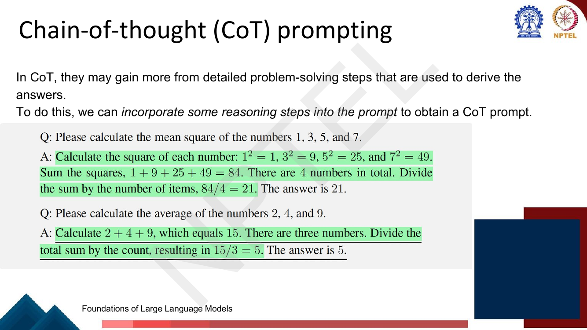
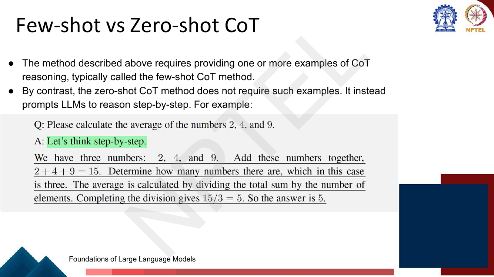
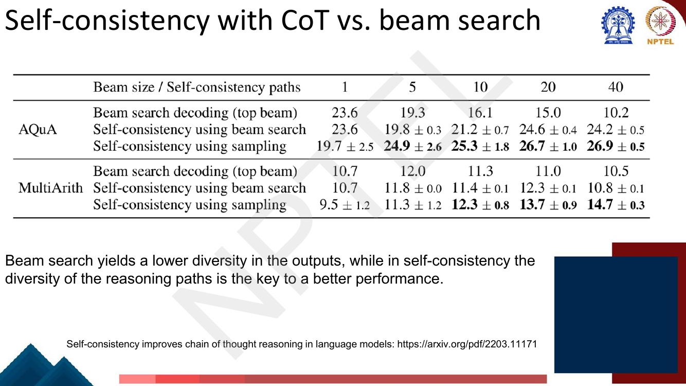
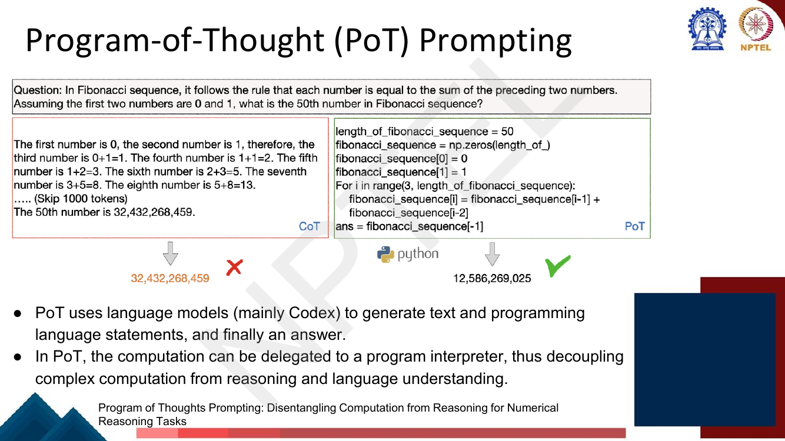

# Lec 43 — Advanced Prompting Techniques

> **Source:** `Week9.pdf` pp. 53–74 · **Week 9** · **Playlist:** Lec 43
> **Prereqs:** [Lec 41 — Prompting I](41-prompting-1.md), [Lec 42 — Why In-Context Learning Works](42-why-icl-works.md)
> **Feeds into:** [Lec 44 — Tool-aided Language Models](44-tool-aided-lms.md), [Lec 45 — Automatic Prompt Engineering](45-automatic-prompt-engineering.md)

## Why this lecture exists

Lecture 41 gave you a prompt template and a few demonstrations. Lecture 42 then showed that the thing
is fragile: reorder the demonstrations and accuracy swings, and the model is leaning on *format* more
than on the input–label mapping. That leaves two open questions, and this lecture answers both.

First: if which demonstrations you pick matters, how do you pick them? Second, and far more
consequential: a frozen model asked to answer a multi-step question in one shot has exactly one
forward pass per output token in which to do all the work, and it fails on problems a child could do.
The fix is not a bigger model or a fine-tune — it is to make the model *write its working out*. That
single idea, chain-of-thought, spawns the whole family of methods here: sampling many chains and
voting, searching a tree of partial chains, decomposing into sub-questions, and handing the arithmetic
to a Python interpreter. None of them touch a single weight.

## The ideas

### Demonstration selection

[Lec 42](42-why-icl-works.md) established that in-context learning is sensitive to *which* examples
you show and in *what order*; this section is the constructive response to the first half of that.


*Fig. — The deck's whole static recipe in three bullets. Notice "dynamically retrieve **for each input**": there is no single best fixed prompt, only a best prompt per query. Page 55.*

The deck's recommendation is **similarity-based retrieval**. Embed every candidate demonstration in
your training pool once, offline. At inference, embed the test input $\mathbf{x}_{\text{test}}$, score
every candidate $\mathbf{d}_j$ by cosine similarity

$$\text{sim}(\mathbf{x}_{\text{test}}, \mathbf{d}_j) = \frac{\mathbf{x}_{\text{test}} \cdot \mathbf{d}_j}{\lVert \mathbf{x}_{\text{test}} \rVert \, \lVert \mathbf{d}_j \rVert}$$

and keep the top-$T$ (the slide's letter; $k$ elsewhere in this book). This is exactly the dense
bi-encoder retrieval of [Lec 31](../week-07/31-question-answering-1.md) pointed at your own training
set instead of at Wikipedia, so the cost structure is the same: one embedding pass per candidate
offline, one nearest-neighbour search online.

Four strategies are worth holding in your head, only the first two of which the deck develops:

| Strategy | How it picks | Strength | Weakness |
|---|---|---|---|
| **Random** | uniform from the pool | zero cost, no bias toward any region of the input space | high variance; the deck's baseline |
| **Similarity (retrieval)** | top-$T$ nearest neighbours of the test input in embedding space | demonstrations share vocabulary and structure with the query; the deck's recommendation | near-duplicates waste slots; can over-narrow the format the model copies |
| **Diversity** | spread the $T$ picks across the pool (e.g. cluster, take one per cluster) | covers more label types and phrasings; guards against all-one-label prompts | some picks are irrelevant to this query |
| **Difficulty** | prefer examples the model finds hard, or that match the query's complexity | a trivial demonstration teaches a trivial reasoning depth | needs a per-example difficulty score, so an extra scoring pass |

Similarity and diversity pull against each other, and practical systems do both: retrieve a wide
candidate set by similarity, then de-duplicate within it.

The deck then asks on the same slide, *"You may even learn how to select these dynamically. How?"* and
answers itself over the next two pages with **Dynamic Prompt Learning via Policy Gradient**
(arXiv 2209.14610). Treat selection as a bandit problem: the **agent** samples in-context examples
$e_i$ from a candidate pool for a training problem $p_i$; the **environment** builds the prompt, runs
GPT-3, and returns reward $r_i = 1$ if the predicted answer $\hat{a}_i$ is correct and $0$ otherwise.

The slide's diagram (page 57) is worth picturing: inside the **agent** sit a frozen pretrained LM and
a one-layer network $\theta$; the action $(e_i, p_i)$ crosses into the **environment**, where a
*Prompt Creator* assembles the prompt and a *GPT-3 Engine* produces $\hat{a}_i$; the reward $r_i$
crosses back. The policy is a softmax over candidates, scored by a dot product of two projected BERT embeddings:

$$\mathbf{h}(e_i) = \mathbf{W}\,\text{BERT}(e_i) + \mathbf{b}, \qquad
\mathbf{h}(p_i) = \mathbf{W}\,\text{BERT}(p_i) + \mathbf{b}$$

$$\pi_\theta(e_i \mid p_i) = \frac{\exp[\mathbf{h}(e_i)\cdot\mathbf{h}(p_i)]}{\sum_{e'_i \in E_{\text{cand}}} \exp[\mathbf{h}(e'_i)\cdot\mathbf{h}(p_i)]}$$

The slide's own gloss is the thing to remember: *if the predicted answer is correct, update the policy
so the probability of selecting the same prompts gets higher; otherwise reduce it.* **Pretrained
embeddings are frozen; only the one-layer NN is trained, via policy gradient** — the same REINFORCE
machinery as [Lec 39](../week-08/39-rlhf-2-ppo.md), with a 0/1 correctness reward instead of a reward
model. Note what this is *not*: it does not change the LLM at all. That distinction is the whole of
[Lec 45](45-automatic-prompt-engineering.md).

### Chain-of-thought prompting

Here is the failure the method exists to repair. The deck asks for the average of 2, 4 and 9.

Page 58 shows two prompts. Asked cold, the model answers *"The answer is 6."* Given a correct
demonstration first — the average of 1, 3, 5 and 7 is 4 — it answers *"The answer is 7."* The true
answer is **5**. The deck's callout: *"Although we have shown a similar question-answer pair, it
remains difficult for the LLM to reason out the correct answer."* So the problem is neither the format
nor the absence of an example.

The diagnosis: the demonstration shows the model **what an answer looks like**, not **how an answer is
produced**. A transformer emits one token per forward pass, so "the answer is 5" gives it exactly one
pass in which to add three numbers and divide. There is nowhere to put the intermediate 15.

**Chain-of-thought (CoT) prompting** instructs the LLM, in the deck's words, *to generate reasoning
steps* or *to learn from demonstrations of detailed reasoning processes provided in the prompts*. You
put the working-out into the demonstration's answer, and the model copies the habit.


*Fig. — The demonstration is now a **process**, not a result, and the model's answer mirrors its shape step for step. Same question as the previous page, now right. Page 59.*

**Why it works.** Two mechanisms, and the exam wants both named:

1. **More computation per problem.** Every emitted reasoning token is another full forward pass whose
   result is written into the context and is readable by all later passes. The chain is a scratchpad.
   A model with a fixed depth $L$ gets $L$ layers of computation per token; a 60-token chain buys it
   $60L$ layers of serial computation instead of $L$. Problems needing more serial steps than the
   architecture has layers are simply unreachable without it.
2. **Decomposition.** A hard problem becomes a sequence of steps each of which is individually easy —
   and each easy step is the kind of thing the pretraining data is full of, so the model is in
   distribution at every point.

The deck's own "CoT prompting: Advantage" page lists four benefits:

- **Decomposes complex problems** into smaller sequential reasoning steps, mirroring human
  problem-solving; especially effective for multi-step reasoning.
- **Transparency and interpretability** — all reasoning steps are visible, so you can see how the
  conclusion was reached.
- **Trust** — users who can follow the logic are more likely to trust the prediction, which matters in
  medicine, education and finance.
- **It is an in-context learning approach**, so it applies to most well-trained off-the-shelf LLMs and
  adapts them to new problem types cheaply.

That last bullet is the examinable one: CoT is *prompting*, not training. No gradients, no weights.

#### The temporal-sequencing example

The deck's showcase is a BIG-bench-style temporal reasoning task.


*Fig. — Watch what the chain actually does: it reconstructs the full timetable (5–6am mall, 6–11am theater, 11am–1pm cafe, 1–3pm office, 3–5pm airport, 5–6pm free) and only then eliminates. Answer-only has to do all six eliminations in one token. Page 61.*

This is the cleanest possible illustration of mechanism 1. The question has a bounded number of
options but requires building and scanning a six-slot timetable. Answer-only prompting outputs **(B)**
— wrong. CoT writes the timetable down, reads off the single free window, and outputs **(C)** —
correct. Nothing changed but the number of tokens the model was allowed to spend.

### Few-shot vs zero-shot CoT


*Fig. — The entire zero-shot method is the highlighted five words. Everything underneath is the model's own output. Page 62.*

| | Few-shot CoT | Zero-shot CoT |
|---|---|---|
| **What you supply** | one or more demonstrations *with worked reasoning* | a trigger phrase and nothing else |
| **Prompt cost** | large — each demonstration now carries a full rationale | ~5 tokens |
| **Where the reasoning style comes from** | your hand-written demonstrations | the model's priors |
| **Best when** | the task has a specific required reasoning format | you have no demonstrations, or the task is generic |

**Zero-shot CoT** is the one to memorise. You append the trigger phrase to the answer slot and the
model produces the reasoning unprompted. The deck prints it as:

> **"Let's think step-by-step."**

Note carefully: the deck writes it hyphenated on page 62 and **unhyphenated** — *"Let's think step by
step."* — on the temporal-sequencing figure on page 61. The original paper (Kojima et al., 2022) uses
the unhyphenated form. Any MCQ quoting either is quoting this phrase; recognise both renderings.

### Self-consistency with CoT

A single chain is a single sample. If one step goes wrong, the whole answer goes wrong, and greedy
decoding gives you no second opinion. **Self-consistency** replaces "decode one chain greedily" with
"sample many chains, then vote on the final answers".


*Fig. — The key phrase is **"marginalize out reasoning paths to aggregate final answers"**: the chains are a nuisance variable, and only the answer is voted on. Greedy's single chain gives \$14 and is wrong. Page 63.*

The procedure, in three steps:

1. Prompt with few-shot CoT.
2. **Sample** $m$ chains at non-zero temperature — ordinary ancestral sampling or top-$p$, exactly as
   in [Lec 19](../week-04/19-decoding-strategies.md). Temperature is not optional; at $\tau \to 0$ you
   get $m$ copies of the greedy chain and the vote is meaningless.
3. Extract the final answer from each chain and take the **majority vote**.

**Why it works.** There are many valid ways to reach a correct answer and they all land on the same
number, so correct chains *pile up on one value*. Errors, by contrast, are idiosyncratic: a dropped
term here, an inverted sign there, and each wrong chain lands somewhere different. Agreement is
therefore evidence of correctness even though no individual chain is verified. The deck's own framing
on the Tree-of-Thought slide calls this component simply **CoT-SC**.

Page 64 plots accuracy against the number of sampled paths on four benchmarks — **MultiArith, SVAMP,
Commonsense QA and ARC (Challenge)** — over **LaMDA-137B**. Greedy decoding is a flat orange line;
self-consistency is a blue curve above it in every panel. Two things to read off: the gain is large
(MultiArith ≈52% flat versus ≈76% at 40 paths), and it is **monotone in the number of sampled paths**,
with clear diminishing returns past about 20. The deck's caption: *"Sampling a higher number of
diverse reasoning paths consistently improves reasoning accuracy."*

#### Self-consistency vs beam search

The deck gives this its own page, so expect it on the exam.


*Fig. — Read the top row of each block left to right: beam search's top beam gets **worse** as the beam widens (AQuA 23.6 → 10.2). Widening the beam concentrates on higher-likelihood text, not on better reasoning. Page 65.*

| | Beam search | Self-consistency |
|---|---|---|
| **Goal** | find the single highest-probability sequence | estimate the most probable *answer* |
| **How candidates relate** | kept because they score well; near-duplicates of each other | drawn independently; deliberately diverse |
| **Temperature** | effectively greedy within the beam | must be $> 0$ |
| **Output rule** | take the top-scoring beam | take the modal answer across samples |
| **What more candidates buy** | higher likelihood, not higher accuracy | more votes, so a better estimate of the mode |

The deck's one-line verdict: *"Beam search yields a lower diversity in the outputs, while in
self-consistency the diversity of the reasoning paths is the key to a better performance."* The
crucial conceptual point is that **likelihood is not correctness**. A fluent, confident, wrong chain
can be the highest-probability sequence; that is precisely the greedy failure on page 63.

### Tree-of-Thought (ToT)

CoT commits to one step and never reconsiders. Self-consistency runs several whole chains but cannot
share work between them or abandon a chain midway. **Tree-of-Thought** makes the intermediate states
first-class: each node is a *thought* (a partial solution), the LLM proposes several children per
node, a second LLM call **evaluates** each child, and a classical search drives the expansion.


*Fig. — The four-way taxonomy worth memorising: IO → CoT → CoT-SC → ToT, in order of increasing inference compute. Green nodes survive evaluation; red ones are pruned. Page 66.*

Four components, all of them prompts:

1. **Thought decomposition** — what counts as one step (here, one arithmetic operation).
2. **Thought generation** — a *propose prompt* asks the LM for candidate next steps.
3. **State evaluation** — a *value prompt* asks the LM to rate each state, in the paper's case
   `sure / likely / impossible`. The deck notes the evaluator may instead be a **majority vote**.
4. **Search** — **BFS or DFS** over the evaluated tree, with pruning and therefore **backtracking**.


*Fig. — The value prompt is doing the real work: it kills the `10 13 13` branch before any tokens are spent extending it. The surviving green path is 10−4=6, 13−9=4, 4×6=24. Page 67.*

**Game of 24** is the deck's example: use four numbers and $+,-,\times,\div$ to make 24. It is the
ideal ToT task because partial states are cheaply checkable and a wrong first move is fatal — exactly
the shape CoT cannot handle, because CoT has no way to say "that branch is dead, go back".

**When ToT beats CoT:** problems needing **exploration, lookahead, or backtracking** — puzzles,
planning, constrained generation, search over a combinatorial space. **When it does not:** anything a
single pass of reasoning already solves, where ToT just multiplies the bill.

**What it costs:** with branching factor $b$, depth $d$ and one evaluation call per generated node,
you make on the order of $b^d$ generation calls plus $b^d$ evaluation calls, against CoT's one. Even
with aggressive pruning, ToT is typically one to two orders of magnitude more expensive per problem
than CoT. That is the trade, and it is the reason ToT is not the default.

### Self-Ask


*Fig. — The template is rigid and that is the point: "Are follow up questions needed here:", then alternating "Follow up:" / "Intermediate answer:" lines, then "So the final answer is:". Note CoT fails here — it retrieves 1911 correctly and then still names the wrong president. Page 68.*

**Self-Ask** (Press et al., *Measuring and Narrowing the Compositionality Gap in Language Models*)
makes the decomposition explicit and *structured*. Rather than free-form reasoning, the model is
prompted to emit **its own follow-up sub-questions** and answer each one before composing the final
answer. The scaffold is what distinguishes it from CoT: CoT writes a paragraph, Self-Ask writes a
question–answer dialogue with itself.

The target failure is the **compositionality gap** — a model knows fact A and knows fact B but cannot
chain them. Here it knows superconductivity was discovered in 1911 and knows who was president in
1911, yet free-form CoT still produces "Woodrow Wilson" (president 1913–1921, not 1911).

#### Self-Ask + search engine


*Fig. — The LM never answers its own follow-ups here. Each "Follow up:" line is intercepted, sent to the search engine, and the response is written back into the context as the "Intermediate answer:". Page 69.*

Because the sub-questions are *syntactically identifiable* — every one begins with `Follow up:` — you
can intercept them and route them to an external retriever instead of letting the model answer from
memory. Generation is paused, the search result is spliced into the context, and generation resumes.
This fixes exactly the failures parametric memory causes: stale facts ("the *current* tallest tower")
and facts the model never memorised. It is the first genuine tool call in this course, and the full
treatment of tool-augmented LMs is [Lec 44](44-tool-aided-lms.md)'s; the systematic version of
"retrieve, then condition on what you retrieved" is RAG, which
[Lec 55](../week-11/55-retrieval-augmented-generation.md) owns.

### PAL and PoT: offload the computation

LLMs are unreliable at multi-digit arithmetic and symbolic manipulation, because they are doing it by
pattern-matching over tokens rather than by executing an algorithm. The fix is not to make them
better at it — it is to not ask them.


*Fig. — PAL's output interleaves natural-language comments (blue) with Python (red). The LM's job ends at `answer = ...`; `print(answer)` is run by the interpreter. Page 70.*

**PAL (Program-aided Language Models)** generates intermediate steps *and Python code*. The deck's
sentence is the one to quote: *"This shifts the role of running the reasoning steps from the language
model to the Python interpreter."* The division of labour is:

| Step | Who does it |
|---|---|
| Read the problem, identify the quantities | the LM |
| Decide *what* to compute | the LM |
| Actually compute it | the **interpreter** |

**PoT (Program-of-Thought)** is the sibling, and the deck draws the distinction in emphasis rather
than in mechanism: PoT *"uses language models (mainly Codex) to generate text and programming language
statements, and finally an answer"*, and *"the computation can be delegated to a program interpreter,
thus decoupling complex computation from reasoning and language understanding."* In practice: PAL
interleaves natural-language comments with code as a direct CoT analogue; PoT emphasises the
*decoupling* of computation from reasoning and leans on a code model, extending beyond arithmetic to
symbolic solving via SymPy.


*Fig. — Note how CoT's cost scales: it must emit every one of the 50 terms. PoT emits a constant-size loop regardless of $n$. Beware — the printed code and the printed answer do not actually match; see the numericals. Page 71.*

The deck's second PoT example is a compound-vs-simple interest problem where CoT sets up the cubic
correctly, then panics and applies the *quadratic* formula to it, producing a negative interest rate.
PoT instead hands the symbolic equation to **SymPy**'s `solve`. The lesson generalises past
arithmetic: anything with an exact algorithm — sorting, date arithmetic, equation solving, unit
conversion — should be executed, not generated. The deck closes that page by asking *"Can we also
augment other tools?"*, which is the cue for [Lec 44](44-tool-aided-lms.md).

### The master table

| Technique | What it adds over the previous row | Use it when | Cost |
|---|---|---|---|
| **Direct / IO prompting** | — | the answer needs no intermediate steps | 1 call, ~5 output tokens |
| **Demonstration selection** | per-query retrieval of the $T$ nearest demonstrations | you have a labelled pool and queries vary in type | 1 call + 1 nearest-neighbour search; prompt grows by $T$ examples |
| **Few-shot CoT** | worked rationales inside the demonstrations | multi-step arithmetic, commonsense, symbolic reasoning | 1 call; prompt ~4× longer, output ~10× longer |
| **Zero-shot CoT** | the trigger phrase "Let's think step-by-step" | same, but you have no rationales to write | 1 call; ~5 extra prompt tokens, output ~10× longer |
| **Self-consistency (CoT-SC)** | $m$ sampled chains + majority vote | accuracy matters more than latency; the answer is a short extractable value | **$m$ calls** (typically 5–40), $m\times$ CoT output |
| **Tree-of-Thought** | explicit state evaluation, pruning, backtracking, BFS/DFS | exploration or lookahead is required; partial states are checkable | $\mathcal{O}(b^d)$ generation **and** evaluation calls |
| **Self-Ask** | self-generated follow-up sub-questions in a fixed template | compositional, multi-hop questions | 1 call (or 1 per hop if interleaved) |
| **Self-Ask + search** | sub-questions routed to a retriever | facts are fresh, rare, or outside the model | 1 LM call per hop + 1 search per hop |
| **PAL / PoT** | code emitted and executed by an interpreter | arithmetic, symbolic manipulation, anything with an exact algorithm | 1 call + 1 sandboxed execution |

## Worked numericals

The deck contains no page titled "Try this problem". It does contain **seven embedded computations**
that function as exercises — on pages 58, 59, 63, 67, 70, 71 and 72 — and the first five are worked
below along with the deck's own answers. The two the deck gets *wrong* are worked in N5.

### N1. The deck's CoT examples (pages 58, 59, 62)
**Given:** the three questions the deck poses to the LLM.
**Find:** the correct answers, and the errors the model makes without CoT.

1. Average of 2, 4, 9: $\;2+4+9 = 15$; three numbers; $15/3 = \mathbf{5}$.
2. The deck's zero-shot model answers **6**; the one-shot model, given a *correct* demonstration
   (average of 1, 3, 5, 7), answers **7**. Both wrong, by $+1$ and $+2$.
3. Average of 1, 3, 5, 7 (the demonstration): $1+3+5+7 = 16$, $16/4 = \mathbf{4}$ ✓ — the
   demonstration itself is right, which rules out "bad demonstration" as the explanation.
4. Mean square of 1, 3, 5, 7 (the CoT demonstration, page 59):
   $1^2 = 1,\; 3^2 = 9,\; 5^2 = 25,\; 7^2 = 49$; sum $= 1 + 9 + 25 + 49 = 84$; four numbers;
   $84/4 = \mathbf{21}$ ✓ matches the deck.
5. With CoT (pages 59 and 62) the same model now writes $2+4+9=15$, then $15/3=5$, and answers
   **5** ✓.

**Answer:** 5, 4 and 21. The model's zero-shot and one-shot errors (6 and 7) vanish the moment the
demonstration carries a *process* rather than a *result* — which is the lecture's entire thesis.

### N2. Self-consistency majority vote, and why greedy loses (page 63)
**Given:** the deck's problem — Janet's ducks lay 16 eggs per day; she eats 3 for breakfast, bakes
muffins for her friends with 4, and sells the remainder at \$2 per egg. Five chains are sampled, with
these final answers and chain probabilities:

| Chain | Final answer | $P(\text{chain})$ |
|---|---|---|
| A | \$18 | 0.20 |
| B | \$26 | 0.24 |
| C | \$18 | 0.18 |
| D | \$14 | 0.22 |
| E | \$18 | 0.16 |

**Find:** the ground truth, the greedy answer, the self-consistency answer, and the accuracy gain.

1. Ground truth: $16 - 3 - 4 = 9$ eggs remain; $9 \times \$2 = \mathbf{\$18}$.
2. **Greedy / single highest-probability chain:** $\max(0.20, 0.24, 0.18, 0.22, 0.16) = 0.24$, which
   is chain **B**, answering **\$26**. *Wrong.*
3. **Majority vote:** \$18 appears 3 times, \$26 once, \$14 once. $3/5 = 60\%$ of the mass is on
   \$18 → **\$18**. *Right.*
4. Sanity check that the vote is not an artefact of ignoring probabilities: summing mass per answer,
   $\$18 \to 0.20+0.18+0.16 = 0.54$; $\$26 \to 0.24$; $\$14 \to 0.22$. The weighted vote agrees with
   the unweighted one, but the **argmax over single chains does not**. This is the argument for
   self-consistency in one line: the mode of the answer distribution is not the answer of the modal
   chain, because correct reasoning is many-to-one and wrong reasoning is one-to-one.
5. Expected accuracy gain, modelled: suppose each sampled chain is independently correct with
   probability $p = 0.6$ and wrong chains scatter over many distinct values so they never form a
   majority. Then majority voting over $m = 5$ succeeds with probability
   $$\sum_{k=3}^{5}\binom{5}{k}(0.6)^k(0.4)^{5-k} = 10(0.216)(0.16) + 5(0.1296)(0.4) + 0.07776$$
   $$= 0.3456 + 0.2592 + 0.07776 = 0.68256.$$
6. So $60.0\% \to 68.3\%$, a gain of **+8.3 points** from five samples. Repeating at
   $m = 11, 21, 41$ gives 75.4%, 82.6%, 90.4% — monotone with diminishing returns, exactly the shape
   of the deck's page-64 curves.

**Answer:** truth \$18; greedy \$26 (wrong); self-consistency \$18 (right); modelled accuracy
$60\% \to 68.3\%$ at $m=5$ and $90.4\%$ at $m=41$.

### N3. CoT token cost and the cost multiplier
**Given:** a direct-answer prompt of 120 input tokens producing 5 output tokens; the CoT version of
the same prompt has 520 input tokens (six demonstrations now carry rationales) and produces 60 output
tokens. Pricing \$0.50 per million input tokens and \$1.50 per million output tokens.
**Find:** extra tokens per query, cost per query, the multiplier, and the bill for $N = 10{,}000$
queries.

1. Extra tokens per query: $(520 + 60) - (120 + 5) = 580 - 125 = \mathbf{455}$ tokens.
2. Direct cost per query:
   $120 \times 0.5\times10^{-6} + 5 \times 1.5\times10^{-6} = 6.00\times10^{-5} + 7.5\times10^{-6} = 6.75\times10^{-5}$.
3. CoT cost per query:
   $520 \times 0.5\times10^{-6} + 60 \times 1.5\times10^{-6} = 2.60\times10^{-4} + 9.0\times10^{-5} = 3.50\times10^{-4}$.
4. Multiplier: $3.50\times10^{-4} / 6.75\times10^{-5} = \mathbf{5.19\times}$.
5. For $N = 10{,}000$: direct $= \$0.675$; CoT $= \$3.50$.
6. Latency is worse than cost suggests: generation is serial in output tokens, so wall-clock time
   scales as $60/5 = \mathbf{12\times}$, not 5.19×.

**Answer:** +455 tokens per query, 5.19× the cost, \$0.675 → \$3.50 per 10,000 queries, and ~12×
the latency. **Zero-shot CoT** collapses the input term — 125 prompt tokens, not 520 — and so costs
about half of few-shot CoT while keeping most of the output-side benefit.

### N4. Self-consistency compute, and the price of an accuracy point
**Given:** the CoT configuration from N3, with $m = 40$ sampled chains per query (the deck's largest
setting on page 64). MultiArith accuracy reads off that chart at ≈52% greedy and ≈76% at 40 paths.
**Find:** the cost per query, the multiplier over direct prompting, and the cost per accuracy point.

1. Self-consistency makes $m$ independent calls, each a full CoT call:
   $40 \times 3.50\times10^{-4} = \mathbf{\$0.014}$ per query.
2. Against direct prompting: $0.014 / 6.75\times10^{-5} = \mathbf{207\times}$.
3. Against single-chain CoT: exactly $m = \mathbf{40\times}$ — self-consistency adds no prompt
   engineering, only samples.
4. For $N = 10{,}000$ queries: $\$140$, versus \$3.50 for one CoT chain and \$0.675 for direct.
5. Accuracy bought: $76 - 52 = 24$ points, for $\$140 - \$0.675 = \$139.3$, i.e. **\$5.80 per
   accuracy point per 10,000 queries**.
6. Where to stop: the curve is concave, so the first few samples are nearly free accuracy and the last
   twenty are not. From N2's model, $m=5$ already recovers about a third of the achievable gain at
   one-eighth of the cost. Output tokens, not input tokens, dominate — $40 \times 60 = 2400$ output
   tokens per query.

**Answer:** \$0.014 per query, **207×** direct prompting and **40×** single-chain CoT, \$140 per
10,000 queries, ≈\$5.80 per accuracy point.

### N5. The two PoT examples — and two slide errors (pages 71, 72)
**Given:** the deck's Fibonacci and compound-interest PoT slides.
**Find:** what the printed code actually returns, and whether it matches the printed answer.

**(a) Fibonacci.** The slide asks for the 50th Fibonacci number with $F_0 = 0, F_1 = 1$, prints a
`numpy` loop, and reports **12,586,269,025**.

1. The printed code allocates `np.zeros(50)`, sets indices 0 and 1, and loops
   `for i in range(3, 50)` — note **3**, not 2. Index 2 is therefore never written and stays 0.
2. Running it exactly as printed returns **2,971,215,073**.
3. Fixing the loop to `range(2, 50)` returns `sequence[-1]` $=$ `sequence[49]` $= F_{49} =$
   **7,778,742,049**.
4. The printed answer **12,586,269,025** is $F_{50}$, which requires an array of length **51**.
5. So there are three different numbers in play, and the slide's code does not produce the slide's
   output. The CoT answer it is compared against, 32,432,268,459, is not a Fibonacci number at all.

**(b) Compound vs simple interest.** \$20,000 saved; after three years the compound-interest sum
exceeds the simple-interest sum by \$1,000; find the rate $x$.

1. Simple: $20000 + 20000 \cdot 3x = 20000 + 60000x$.
2. Compound: $20000(1+x)^3 = 20000 + 60000x + 60000x^2 + 20000x^3$.
3. Difference: $60000x^2 + 20000x^3 = 1000$, i.e. $20x^3 + 60x^2 - 1 = 0$ — which is exactly what the
   slide's CoT text derives.
4. The deck's CoT then applies the **quadratic** formula to a **cubic** and gets $x = -0.051333$ — a
   negative interest rate, visibly absurd. That part of the slide is correctly marked wrong.
5. Solving the cubic: at $x = 0.12$, $20(0.001728) + 60(0.0144) - 1 = 0.0346 + 0.864 - 1 = -0.101$;
   at $x = 0.13$, $0.0439 + 1.014 - 1 = +0.058$. The root is between; to six figures
   $x = \mathbf{0.126462}$, i.e. **12.65%**.
6. The slide's PoT answer is **0.24814**. Substituting it back:
   $20000(1.24814)^3 - (20000 + 60000(0.24814)) = \$4000$, not \$1000. So 0.24814 solves the
   *four-thousand-dollar* version of the question.

**Answer:** (a) printed code → 2,971,215,073; corrected code → 7,778,742,049; printed answer
12,586,269,025 — **all three differ**. (b) the correct rate is **12.65%**, not the slide's 24.814%.
This does not undermine PoT; it sharpens it. **The interpreter guarantees the arithmetic, not the
semantics.** A wrong program is executed faithfully and returns a wrong number with full confidence —
which is precisely why PAL/PoT outputs are easier to *audit* than prose chains, and why auditing them
is still necessary.

### N6. Demonstration selection by cosine similarity
**Given:** test input embedding $\mathbf{x}_{\text{test}} = [1, 2, 2]$ and a candidate pool of five
demonstrations $\mathbf{d}_1 = [2,4,4]$, $\mathbf{d}_2 = [2,0,0]$, $\mathbf{d}_3 = [0,3,4]$,
$\mathbf{d}_4 = [1,1,1]$, $\mathbf{d}_5 = [-1,2,0]$.
**Find:** the cosine similarities and the top-2 demonstrations.

1. $\lVert \mathbf{x}_{\text{test}} \rVert = \sqrt{1 + 4 + 4} = \sqrt{9} = 3$.
2. $\mathbf{d}_1$: dot $= 1(2) + 2(4) + 2(4) = 2 + 8 + 8 = 18$; $\lVert\mathbf{d}_1\rVert = \sqrt{4+16+16} = 6$;
   $\cos = 18/(3 \times 6) = \mathbf{1.0000}$.
3. $\mathbf{d}_2$: dot $= 2 + 0 + 0 = 2$; norm $= 2$; $\cos = 2/6 = \mathbf{0.3333}$.
4. $\mathbf{d}_3$: dot $= 0 + 6 + 8 = 14$; norm $= \sqrt{0+9+16} = 5$; $\cos = 14/15 = \mathbf{0.9333}$.
5. $\mathbf{d}_4$: dot $= 1 + 2 + 2 = 5$; norm $= \sqrt{3} = 1.7321$; $\cos = 5/(3 \times 1.7321) = 5/5.1962 = \mathbf{0.9623}$.
6. $\mathbf{d}_5$: dot $= -1 + 4 + 0 = 3$; norm $= \sqrt{1+4} = 2.2361$; $\cos = 3/6.7082 = \mathbf{0.4472}$.
7. Ranking: $\mathbf{d}_1 (1.0000) > \mathbf{d}_4 (0.9623) > \mathbf{d}_3 (0.9333) > \mathbf{d}_5 (0.4472) > \mathbf{d}_2 (0.3333)$.
8. Top-$T$ with $T = 2$: $\{\mathbf{d}_1, \mathbf{d}_4\}$.
9. Note $\mathbf{d}_1 = 2\mathbf{x}_{\text{test}}$ exactly — cosine is scale-invariant, so a
   *longer* version of the same example scores a perfect 1.0. If the pool also held $[3,6,6]$ it would
   also score 1.0 and consume the second slot with no new information. **That is the argument for
   diversity-aware selection on top of similarity.**

**Answer:** top-2 are $\mathbf{d}_1$ (1.0000) and $\mathbf{d}_4$ (0.9623).

## Code

```python
from collections import Counter

# ---------------------------------------------------------------
# 1. Self-consistency: majority vote over sampled reasoning chains
# ---------------------------------------------------------------
# Each item is (reasoning_text, final_answer, chain_probability).
# These are the three chains the deck draws on page 63, plus two more.
chains = [
    ("16 - 3 - 4 = 9 eggs left; 9 * $2 = $18",            18, 0.20),
    ("she sells 2 * (16 - 4 - 3) = $26 per day",          26, 0.24),
    ("16 - 3 = 13, then 13 - 4 = 9, 9 * $2 = $18",        18, 0.18),
    ("3 + 4 = 7 eggs used; she sells 7 * $2 = $14",       14, 0.22),
    ("eats 3, bakes with 4, sells 9 at $2 each = $18",    18, 0.16),
]

def self_consistency(samples):
    """Marginalise out the reasoning: vote on final answers only."""
    votes = Counter(ans for _, ans, _ in samples)
    winner, count = votes.most_common(1)[0]
    return winner, count, votes

greedy = max(chains, key=lambda c: c[2])          # single highest-prob chain
answer, count, votes = self_consistency(chains)

print("vote table      :", dict(votes))
print("greedy chain    : $%d  (p = %.2f)" % (greedy[1], greedy[2]))
print("majority vote   : $%d  (%d of %d chains)" % (answer, count, len(chains)))

# probability-weighted version: sum the mass of each distinct answer
mass = Counter()
for _, ans, p in chains:
    mass[ans] += p
print("summed mass     :", {k: round(v, 2) for k, v in mass.items()})

# ---------------------------------------------------------------
# 2. PAL: let an interpreter do the arithmetic
# ---------------------------------------------------------------
QUESTION = ("The bakery baked 200 loaves. They sold 93 in the morning and "
            "39 in the afternoon. A grocery store returned 6 unsold loaves. "
            "How many loaves do they have left?")

# (a) what the LM says in natural language -- the deck's page-70 failure
llm_natural_language_answer = 62          # "200 - 132 - 6 = 62"

# (b) what the LM emits under a PAL prompt: a program, not a number
generated_code = """
loaves_baked = 200
loaves_sold_morning = 93
loaves_sold_afternoon = 39
loaves_returned = 6
answer = loaves_baked - loaves_sold_morning - loaves_sold_afternoon + loaves_returned
"""

scope = {}
exec(generated_code, scope)               # the Python interpreter, not the LM
pal_answer = scope["answer"]

print("\nquestion        :", QUESTION[:40], "...")
print("LM in words     :", llm_natural_language_answer, "(wrong)")
print("LM code, exec'd :", pal_answer, "(right)")
print("ground truth    :", 200 - 93 - 39 + 6)
```

```
vote table      : {18: 3, 26: 1, 14: 1}
greedy chain    : $26  (p = 0.24)
majority vote   : $18  (3 of 5 chains)
summed mass     : {18: 0.54, 26: 0.24, 14: 0.22}

question        : The bakery baked 200 loaves. They sold 9 ...
LM in words     : 62 (wrong)
LM code, exec'd : 74 (right)
ground truth    : 74
```

Two things to take from the output. The vote table is the entire self-consistency algorithm — the
reasoning strings are never compared, only the extracted answers, which is what "marginalise out the
reasoning paths" means operationally. And the `exec` line is the entire PAL idea: the LM's last
contribution is the string `answer = loaves_baked - ... + loaves_returned`, and everything numerical
after that point is Python's. In production that `exec` runs in a sandbox, because the model is
writing the code.

## Exam pack

### Must-memorise

| Item | Exactly this |
|---|---|
| Demonstration selection, deck's rule | retrieve demonstrations **similar to the current input**, dynamically, per input — top-$T$ by embedding similarity |
| Learned selection | one-layer NN over **frozen** BERT embeddings, trained by **policy gradient**; reward = answer correct |
| Selection policy | $\pi_\theta(e_i \mid p_i) = \dfrac{\exp[\mathbf{h}(e_i)\cdot\mathbf{h}(p_i)]}{\sum_{e'_i \in E_{\text{cand}}}\exp[\mathbf{h}(e'_i)\cdot\mathbf{h}(p_i)]}$ |
| Chain-of-thought | instruct the LLM **to generate reasoning steps**, or **to learn from demonstrations of detailed reasoning processes** |
| Why CoT works | (i) more forward-pass computation per problem; (ii) decomposition into individually easy steps |
| CoT's four stated advantages | decomposition · transparency/interpretability · trust · it is in-context learning, so works off-the-shelf |
| Few-shot CoT | demonstrations contain worked rationales |
| **Zero-shot CoT** | append **"Let's think step-by-step."** — no demonstrations at all |
| Self-consistency | sample $m$ diverse chains at $\tau > 0$, then **majority vote over the final answers** |
| Self-consistency slogan | *marginalize out reasoning paths to aggregate final answers* |
| Self-consistency vs beam search | beam search = low diversity, searches for one high-probability sequence; self-consistency = **diversity of reasoning paths is the key** |
| ToT components | thought decomposition · thought generation (propose prompt) · state evaluation (value prompt) · search |
| ToT search | **BFS or DFS**; each state evaluated by a **classifier via a prompt** or by **majority vote** |
| ToT taxonomy order | IO → CoT → CoT-SC → ToT |
| Self-Ask | the model emits its own **follow-up sub-questions** and intermediate answers, then "So the final answer is:" |
| Self-Ask + search | each `Follow up:` is routed to a **search engine**; its response becomes the `Intermediate answer:` |
| PAL | generates intermediate steps **and Python code**; *"shifts the role of running the reasoning steps from the language model to the Python interpreter"* |
| PoT | generates text + programming-language statements + an answer; **decouples complex computation from reasoning and language understanding**; mainly **Codex** |

### Numbers worth knowing

| Quantity | Value |
|---|---|
| Self-consistency base model in the deck | **LaMDA-137B** |
| Self-consistency paths plotted | 1, 5, 10, 20, 40 — gains monotone, diminishing past ~20 |
| MultiArith (page 64 chart) | greedy ≈52% flat; self-consistency ≈76% at 40 paths |
| AQuA, beam-search top beam (page 65) | 23.6 / 19.3 / 16.1 / 15.0 / **10.2** at beam 1/5/10/20/40 — it gets **worse** |
| AQuA, self-consistency with sampling | 19.7 / 24.9 / 25.3 / 26.7 / **26.9** |
| AQuA, self-consistency with beam search | 23.6 / 19.8 / 21.2 / 24.6 / 24.2 |
| MultiArith (page 65 table) | beam top: 10.7→10.5; SC+sampling: 9.5→**14.7** |
| ToT benchmark task | **Game of 24** — four numbers, $+-\times\div$, make 24 |
| Game of 24 deck instance | input **4 9 10 13**; solution 10−4=6, 13−9=4, 4×6=24 |
| ToT value-prompt labels | **sure / likely / impossible** |
| Self-Ask deck answer | superconductivity discovered **1911** → president **William Howard Taft** (CoT wrongly says Woodrow Wilson; direct wrongly says F. D. Roosevelt) |
| PAL deck answer | 200 − 93 − 39 + 6 = **74** (CoT says 62) |
| Key papers | Self-consistency arXiv 2203.11171 · ToT 2305.10601 · Self-Ask 2210.03350 · PAL 2211.10435 · Dynamic prompt selection 2209.14610 |

### Likely MCQ traps

- **"Chain-of-thought fine-tunes the model."** No. CoT is pure in-context learning — the deck's fourth
  advantage bullet says so explicitly. No weights change in *any* technique in this lecture.
- **"Self-consistency picks the highest-probability chain."** No — that is greedy decoding, and N2
  shows it losing. Self-consistency takes the **mode of the answers**, discarding the chains.
- **"Self-consistency works with greedy decoding."** It cannot. At $\tau = 0$ every sample is
  identical; you need **temperature > 0** to get diverse paths
  ([Lec 19](../week-04/19-decoding-strategies.md)).
- **"Beam search with a wide beam is just self-consistency."** No. Beam search optimises sequence
  likelihood and yields *low diversity*; the deck's own table shows top-beam accuracy **falling** as
  the beam widens. Self-consistency needs independent samples.
- **Zero-shot CoT means zero demonstrations, not zero prompting.** You still add the trigger phrase.
  "Zero-shot" refers to demonstrations, exactly as in [Lec 41](41-prompting-1.md).
- **Confusing CoT-SC with ToT.** CoT-SC runs $m$ **complete, independent** chains and votes at the end.
  ToT branches at **every intermediate step**, evaluates partial states, prunes, and **backtracks**.
  Only ToT has backtracking.
- **"ToT always beats CoT."** Only when the problem needs exploration or lookahead. On single-path
  problems it burns $\mathcal{O}(b^d)$ calls for nothing.
- **"PAL/PoT make the model better at arithmetic."** They make the model *avoid* arithmetic. The
  interpreter computes; the model only decides what to compute.
- **PAL vs Self-Ask+search.** PAL calls an **interpreter** (computation); Self-Ask+search calls a
  **retriever** (knowledge). Both are tool use, and both hand off to [Lec 44](44-tool-aided-lms.md).
- **"Similarity-based demonstration selection is the only strategy."** It is the deck's
  *recommendation*, not the only option; diversity and difficulty are real alternatives, and pure
  similarity can select near-duplicates (N6, step 9).
- **In the policy-gradient selector, the LLM is not trained.** Only a one-layer NN over frozen
  embeddings is. GPT-3 sits inside the environment as a black box.
- **"Self-consistency requires an answer extractor."** True, and it is a real limitation: majority
  voting needs answers that can be compared for equality. It does not apply to open-ended generation.

### Self-test

1. State the zero-shot CoT trigger phrase exactly as the deck prints it.
2. Give the two reasons chain-of-thought improves multi-step reasoning.
3. Five sampled chains answer 7, 12, 7, 7, 3 with probabilities 0.15, 0.30, 0.20, 0.20, 0.15. What does greedy decoding output? What does self-consistency output?
4. Why does widening a beam not give you self-consistency?
5. Name the four components of Tree-of-Thought and the two search strategies the deck mentions.
6. In Self-Ask + search engine, which text is sent to the search engine and where does its response go?
7. One sentence: what does PAL shift, and to what?
8. A CoT prompt adds 400 input and 55 output tokens per query over direct prompting. At \$0.50/M input and \$1.50/M output, what is the extra cost for 20,000 queries?
9. Why must self-consistency sample at non-zero temperature?
10. Give one failure mode of similarity-based demonstration selection.

<details><summary>Answers</summary>

1. **"Let's think step-by-step."** (Page 62; page 61 and the original paper print it unhyphenated, *"Let's think step by step."*)
2. (i) It buys more forward-pass computation — each reasoning token is another pass whose result enters the context; (ii) it decomposes the problem into individually easy steps that are in-distribution for the pretrained model.
3. Greedy takes the highest-probability single chain, $p = 0.30$, answering **12**. Self-consistency votes: 7 appears three times, 12 once, 3 once → **7**.
4. Beam search keeps candidates *because they are high-likelihood*, so the beams are near-duplicates of one another — low diversity. Self-consistency depends on diverse independent samples; the deck's table even shows top-beam accuracy dropping from 23.6 to 10.2 as the beam widens.
5. Thought decomposition, thought generation (propose prompt), state evaluation (value prompt, `sure`/`likely`/`impossible` or majority vote), and search — **BFS or DFS**.
6. The text after `Follow up:` is sent as the query; the search engine's response is written back into the context as the `Intermediate answer:` line, and generation resumes.
7. PAL shifts the role of *running* the reasoning steps from the language model to the **Python interpreter**.
8. $400 \times 0.5\times10^{-6} = 2.0\times10^{-4}$; $55 \times 1.5\times10^{-6} = 8.25\times10^{-5}$; total $2.825\times10^{-4}$ per query; $\times 20{,}000 = \mathbf{\$5.65}$.
9. At $\tau = 0$ decoding is deterministic, so all $m$ samples are the identical greedy chain and the majority vote returns the greedy answer. Diversity of reasoning paths is what the method exploits.
10. It can retrieve near-duplicate demonstrations (cosine is scale-invariant, so $[2,4,4]$ and $[3,6,6]$ both score 1.0 against $[1,2,2]$), spending slots on redundant information; it can also over-narrow the demonstrated format or produce an all-one-label prompt.

</details>

## Beyond the slides

**Gap:** The deck never says that CoT is an **emergent** ability — it does not help, and often hurts,
models below roughly 10B parameters.
**Why it matters:** In the original Wei et al. (2022) paper the CoT curves are flat or negative for
small models and only break away above ~100B. This is the single most-cited fact about CoT and the
deck omits it. It also explains why every result on these slides uses a 137B model.

**Gap:** No mention that the printed chain need not be the model's actual computation — **faithfulness**.
**Why it matters:** The deck sells CoT's "transparency and interpretability" as an advantage, but
later work shows models can produce a plausible chain and an answer that does not follow from it, and
can be steered to a wrong answer while still writing a confident-looking chain. Treat a chain as an
*aid* to auditing, not proof of the reasoning. This bears directly on
[Lec 59](../week-12/59-trustworthy-llms-taxonomy.md)'s trustworthiness categories.

**Gap:** The deck's two self-consistency pages give **inconsistent accuracy scales** and never
reconciles them. Page 64's MultiArith chart shows greedy ≈52% and self-consistency ≈76%; page 65's
MultiArith table shows 10.7 and 14.7 on the same benchmark name.
**Why it matters:** Both are from the same paper but different model/setting columns (the chart is
LaMDA-137B with CoT; the table is a different configuration). If an MCQ quotes a MultiArith number,
check whether it is asking about the chart or the table — they disagree by a factor of five.

**Gap:** Nothing is said about **self-consistency's answer-extraction requirement** or about
**weighted voting**.
**Why it matters:** Majority voting presumes answers you can test for equality — a number, a label, a
span. It does not extend to summarisation or open generation, which is a hard limit on the method. The
original paper also tried probability-weighted voting and found it no better than unweighted, which is
a plausible exam discriminator and is counterintuitive (N2 step 4 shows a case where they agree, but
they need not).

**Gap:** The deck shows PAL/PoT generating code and never mentions that executing model-generated code
requires a **sandbox**.
**Why it matters:** `exec` on an LLM's output is a remote code execution path. Every production
PAL/PoT system runs the generated program in a restricted interpreter with no filesystem or network
access and a timeout. The code block above says so in a comment; the slides do not say it at all.

## Cut from the slides

Page 53 is the title card, page 54 the "Concepts Covered" list, page 73 the reference list (Jurafsky &
Martin SLP3 Chapter 12, *Hands-on Large Language Models*, *Foundations of Large Language Models*), and
page 74 the "Thank You" card — none carry teachable content. Pages 56 and 57 are the same
policy-gradient architecture diagram, page 57 adding the three equations and the "frozen embeddings"
callout; only page 57 is reproduced. Pages 71 and 72 repeat an identical two-bullet PoT definition
under two different worked examples; the bullets are quoted once and both examples are worked in N5,
with the deck's arithmetic errors flagged rather than copied. Page 72's closing rhetorical question —
*"Can we also augment other tools?"* — is the handoff to [Lec 44](44-tool-aided-lms.md) and is noted,
not answered here. The self-consistency demonstration prompt's first example (3 cars + 2 cars = 5) is
not worked separately, since it is the trivial half of a two-shot prompt. Nothing in the deck's
technique coverage was dropped.
