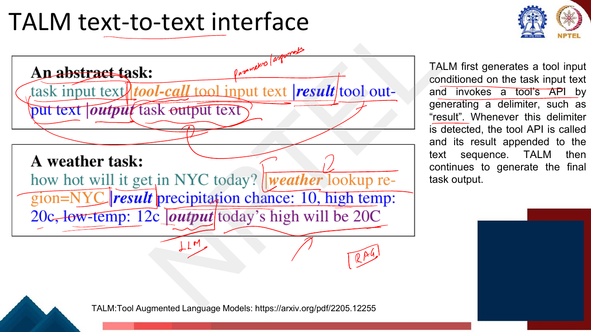
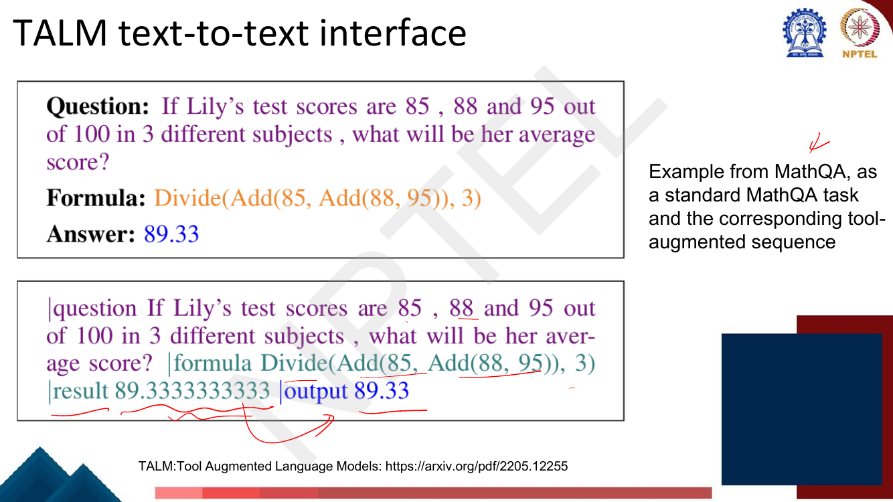
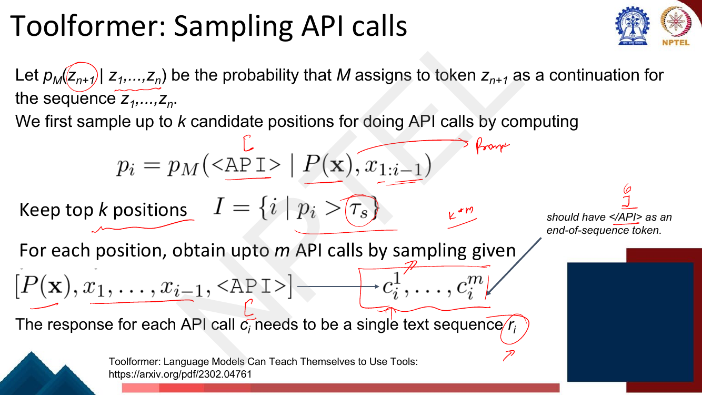
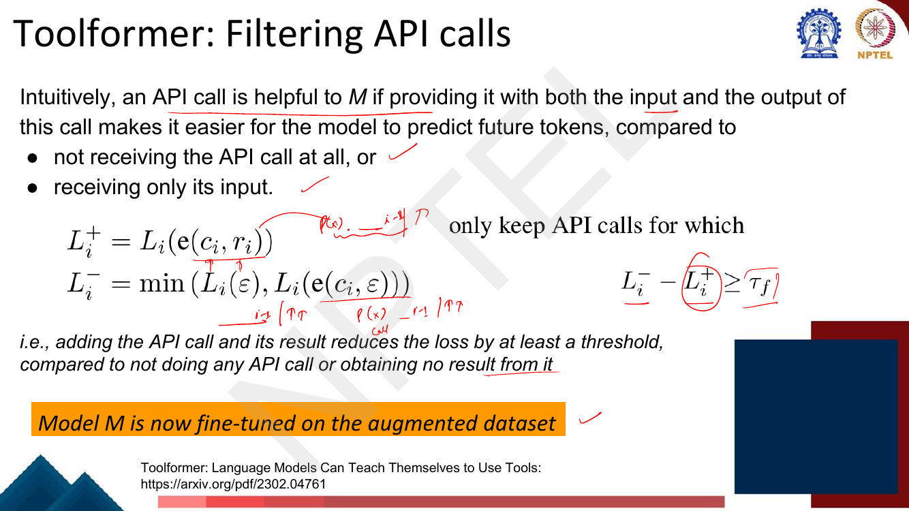

# Lec 44 — Tool-aided Language Models

> **Source:** `Week9.pdf` pp. 75–92 · **Week 9** · **Playlist:** Lec 44
> **Prereqs:** [Lec 43 — Advanced Prompting](43-advanced-prompting.md), [Lec 41 — Prompting I](41-prompting-1.md)
> **Feeds into:** [Lec 55 — Retrieval-Augmented Generation](../week-11/55-retrieval-augmented-generation.md)

## Why this lecture exists

Everything so far has tried to make the language model itself better — more parameters, better
prompts, chain-of-thought, instruction tuning, alignment. This lecture takes the opposite route: stop
asking the model to do things it is structurally bad at, and let it **call a program that is good at
them**.

The lecturer's framing is blunt. For complex reasoning the LM *struggles*; for real-world information
it is *fundamentally unable*. No amount of scale fixes the second one — the weights were frozen on a
particular day, and today's weather is not in them. So the lecture defines what a "tool" is for an LM,
shows the text-to-text interface that makes tool calls just more tokens, and then spends seven pages
on **Toolformer**, whose claim is that a model can teach *itself* where tool calls belong, with no
human labelling the positions.

## The ideas

### Why tools?


*Fig. — The deck gives exactly **two** motivations, and they are not symmetric. Complex reasoning is something the LM does badly ("Struggle"); real-world access is something it cannot do at all ("Fundamentally unable"). Page 77.*

Memorise the two words, because the discrimination is MCQ-shaped: **struggle** vs **fundamentally
unable**. The figure splits them the same way — a calculator *facilitates* something the model was
already attempting token by token ("① multiply 1.6 to 35.223 … ④ result is 453.7"), while `get_time()`
*extends* the model into a world it has no access to.

Unpacking those two into the failure modes a tool repairs:

| Failure | Why the LM can't fix it internally | Tool |
|---|---|---|
| Multi-digit arithmetic | every digit is a sampled token; errors compound multiplicatively (N2) | calculator |
| Frozen knowledge cutoff | the weights were fixed at training time | search / Wikipedia |
| Private or enterprise data | never in the pretraining corpus, by construction | database / API |
| Live state — time, weather, prices | changes after the forward pass is over | `get_time()`, weather server |
| Acting in the world | generating text about booking a flight is not booking a flight | any side-effecting API |

The first row is "struggle"; the other four are "fundamentally unable".

### The definition

The deck boxes this sentence in orange, and the lecturer circles it. Learn it verbatim:

> **An LM-used tool is a function interface to a computer program that runs external to the LM, where
> the LM generates the function calls and input arguments in order to use the tool.**

Three load-bearing clauses: it is a **function interface** (not a retrieved document, not a plugin UI);
the program runs **external to the LM** (so its output is not a model prediction and carries none of
the model's uncertainty); and **the LM generates the call and the arguments** (so tool use is a
*generation* problem, which is why it can be trained with a language-modelling loss at all).


*Fig. — Two taxonomies on one slide. **Tool Use** = switching between text-generation mode and tool-execution mode. **Tool Learning** = inference-time prompting vs learning by training. The second split is exactly the Lec 43 / Lec 44 boundary. Page 78.*

That second list is the cleanest statement of this chapter's scope. **Inference-time prompting** —
getting tool-like behaviour out of a frozen model by what you write in the prompt — is
[Lec 43](43-advanced-prompting.md)'s territory: Self-Ask with a search engine, PAL and PoT, which also
execute code but do so because the *prompt* told them to. **Learning by training** is this chapter:
the tool-calling behaviour is in the weights. Same end behaviour, opposite mechanism; expect to be
asked which is which.

### TALM and the text-to-text interface

**TALM** (Tool Augmented Language Models, Parisi et al. 2022) contributes the interface. A plain LM is
`input → output`. A TALM is `input → tool input → tool result → output`, with the two middle boxes
produced and consumed as *text*.

![Slide contrasting a plain Language Model (input → output) with a Tool Augmented Language Model (input → tool input → [call external tool] → tool result → output), with "append tool result" annotated](../../assets/pages/lec44/p-079.png)
*Fig. — The whole architecture. The model never leaves its own modality: the tool's input is text it generated, the tool's result is text appended to its context. Page 79.*

The mechanism is a **delimiter**. TALM generates a tool input conditioned on the task input, then
generates a delimiter such as `|result`. Whenever that delimiter is detected, decoding stops, the tool
API is called, its result is appended to the sequence, and generation continues to the final output.


*Fig. — The abstract template and its instance. Four fields, three delimiters: `|tool-call`, `|result`, `|output`. The weather task returns "precipitation chance: 10, high temp: 20c, low temp: 12c" and the model summarises it as "today's high will be 20C" — the model still has to *read* the tool output. Page 80.*


*Fig. — The MathQA example. Note the division of labour: the LM produces the **formula**, the tool produces the **exact value** 89.3333333333, and the LM produces the **rounded output** 89.33. The LM never does the arithmetic. Page 81.*

Why "text-to-text" matters: because the call, the arguments and the result are all token sequences,
tool use needs **no new architecture, no new loss, and no new output head**. It is ordinary
next-token prediction over a corpus that happens to contain tool calls. That is what makes Toolformer
possible.

### Toolformer

**Toolformer** (Schick et al. 2023) — subtitle *"Language Models Can Teach Themselves to Use Tools"* —
is the centre of this lecture. Its claim: a model learns *where* tool calls help and *what arguments*
to pass **in a self-supervised way**, from plain text, with no human annotating a single call site.


*Fig. — Learned calls, inline in running text. Each call sits exactly where it earns its keep: `Calculator(400 / 1400) → 0.29` appears immediately before the text writes "29%". Page 82.*

#### Representation

An API call is a tuple $c = (a_c, i_c)$: $a_c$ is the **API name**, $i_c$ is the **input**. With result
$r$, the two linearizations are

$$e(c) = \texttt{<API>}\; a_c(i_c)\; \texttt{</API>}$$
$$e(c, r) = \texttt{<API>}\; a_c(i_c) \to r\; \texttt{</API>}$$

The footnote on the slide matters: in practice the token sequences `[`, `]` and `->` stand in for
`<API>`, `</API>` and `→`, **so the approach works without modifying the existing LM's vocabulary**.
No new embeddings, no resized softmax. Easy exam question, easy to miss.

#### The pipeline

Given a dataset $\mathcal{C}$ of plain texts, convert it into $\mathcal{C}^*$ augmented with API calls,
then fine-tune on $\mathcal{C}^*$.


*Fig. — The whole method on one slide. Both candidate calls executed fine; only $c^1$ survives, because only $c^1$'s result helps predict "**the Steel City**". Correctness of the call is never checked — only usefulness. Page 84.*

**Step 1 — sampling positions and calls.** Let $p_M(z_{n+1} \mid z_1,\ldots,z_n)$ be the probability $M$
assigns to the next token. For a hand-written few-shot prompt $P(\mathbf{x})$ that asks the model to
annotate text with calls, compute at every position $i$

$$p_i = p_M\!\left(\texttt{<API>} \mid P(\mathbf{x}), x_{1:i-1}\right)$$

— the model's own probability of *starting* a call there. Keep

$$I = \{\, i \mid p_i > \tau_s \,\}$$

and take the **top $k$** of those. For each surviving position, sample up to $m$ candidate calls
$c_i^1,\ldots,c_i^m$ from $[P(\mathbf{x}), x_1,\ldots,x_{i-1}, \texttt{<API>}]$, stopping at `</API>`
as the end-of-sequence token. The lecturer's emphasis on the sampling slide: *"do not worry about the
output, but the probability distributions to sample the API call"* — step 1 produces **candidates**,
not answers.


*Fig. — Two different thresholds live in this method: $\tau_s$ here (sampling, on a **probability**) and $\tau_f$ on the next slide (filtering, on a **loss difference**). Do not swap them. Page 86.*

**Step 2 — execute.** Each candidate $c_i$ is run against its real API; the response $r_i$ must be a
single text sequence. That is the only constraint on what can be a tool.

**Step 3 — filtering. This is the paper.** Let $L_i(\mathbf{z})$ be the weighted cross-entropy loss $M$
incurs on the tokens **after** position $i$ when $\mathbf{z}$ is prepended. Define

$$L_i^{+} = L_i\big(e(c_i, r_i)\big) \qquad\qquad L_i^{-} = \min\Big(L_i(\varepsilon),\; L_i\big(e(c_i,\varepsilon)\big)\Big)$$

and **keep the call only if**

$$\boxed{\,L_i^{-} - L_i^{+} \;\ge\; \tau_f\,}$$


*Fig. — The criterion in full. $\varepsilon$ is the empty sequence, so $L_i(\varepsilon)$ is "no call at all" and $L_i(e(c_i,\varepsilon))$ is "the call, but no result". The **min** over those two is what makes the test honest. Page 87.*

Read the criterion in words: *adding the API call **and its result** must reduce the loss on the
following tokens by at least $\tau_f$, compared with the better of (no call at all) and (the call with
no result).*

The `min` is the subtle part and the thing to understand. Comparing against $L_i(\varepsilon)$ alone
would reward calls whose *question text* happens to be a useful hint — writing
`QA("What is the capital of France?")` before the word "Paris" makes "Paris" easier to predict whether
or not any API ever runs. Taking the minimum of the two baselines strips that credit away, so a call
survives only if **the result** did the work. Nothing here checks that the result is *correct*; the
criterion is purely "did this make the next tokens cheaper to predict". Correctness is inherited from
the tool.


*Fig. — The deck's own filter scores, in nats. The WikiSearch call scores 5.49 because the retrieved passage contains almost the exact continuation; the calculator scores only 1.59 because the surrounding text repeats "(735 / 499)" anyway. All four clear any sane $\tau_f$. Page 88.*

**Step 4 — fine-tune.** $M$ is fine-tuned with the ordinary language-modelling objective on
$\mathcal{C}^*$ — the *same* texts it was trained on, now with the surviving calls interleaved. Two
consequences: the model's general abilities are preserved, because the underlying text is unchanged;
and the model learns to emit calls *in the positions where they helped it*, because those are the only
positions where a call appears. Fine-tuning mechanics are
[Lec 36](../week-08/36-instruction-finetuning-1.md)'s; what is new here is that the labels are the
model's own.

**Step 5 — inference.** Decode normally until $M$ produces the `→` token, which signals that it expects
an API response next. **Interrupt decoding**, call the API, then continue after inserting both the
response and the `</API>` token. One special token drives the whole control flow — the same
interrupt-on-a-token idea as any constrained decoder ([Lec 19](../week-04/19-decoding-strategies.md)).


*Fig. — The five tools, with the deck's example inputs. Note **Calendar takes $\varepsilon$ as input** — a tool may need no arguments at all, which is why $i_c$ can be empty. Page 89.*

### Many recent works

The closing survey page names three successors. Know the names and their one-line claims:

| Work | Claim |
|---|---|
| **ToolLLM** | *Facilitating Large Language Models to Master 16000+ Real-world APIs* — scale, from a handful of tools to a whole API ecosystem |
| **Gorilla** | *Large Language Model Connected with Massive APIs* — generating correct API calls against large, versioned documentation |
| **HuggingGPT** | *Solving AI Tasks with ChatGPT and its Friends in Hugging Face* — the LM as a planner that dispatches to other **models** as tools |

The number **16000+** is the memorable one.

### The lineage: from GUS to function calling

Worth noticing, because it reframes the whole lecture. The frame-based GUS architecture from
[Lec 34](../week-07/34-dialogue-systems-2.md) — 1977 — did exactly this: fill the slots of a frame from
the user's utterance, then issue a database query with those slots as arguments, then verbalise the
result. Toolformer's $c = (a_c, i_c)$ is a frame name plus its filled slots, and today's "function
calling" APIs are the same shape again. What changed in fifty years is not the control flow but
**where the slot-filler comes from**: hand-written rules, then a supervised classifier, now a model
that labelled its own training data.

Retrieval is the single most important tool of all, and it gets its own treatment in
[Lec 55](../week-11/55-retrieval-augmented-generation.md) — the lecturer in fact writes "RAG" in the
margin of page 80. Retrievers themselves (BM25, dense bi-encoders) are
[Lec 31](../week-07/31-question-answering-1.md)'s.

## Worked numericals

No page in pp. 75–92 carries a "Try this problem" exercise — all 18 pages were opened and checked. The
following are built from the deck's own figures.

### N1. Applying the Toolformer filter
**Given:** at position $i$ in *"If Venus had an atmosphere similar to Earth's then you would expect
Venus' mean temperature to be 499 K rather than 735 K which is ___ times hotter than it should be"*,
three candidate calls, with losses in nats on the following tokens. Threshold $\tau_f = 1.0$.

| Candidate | $L_i(\varepsilon)$ | $L_i(e(c,\varepsilon))$ | $L_i(e(c,r))$ |
|---|---|---|---|
| A: `Calculator(735/499) → 1.47` | 3.47 | 3.61 | 1.88 |
| B: `QA("capital of France?") → Paris` | 3.60 | 2.20 | 1.90 |
| C: `Calculator(2+2) → 4` | 1.40 | 1.45 | 1.25 |

**Find:** which calls survive.

1. **A:** $L_i^{+} = 1.88$. $L_i^{-} = \min(3.47,\, 3.61) = 3.47$.
2. Gain $= 3.47 - 1.88 = 1.59 \ge 1.0$ → **keep**. (This is the deck's own 1.59 on page 88.)
3. **B:** $L_i^{+} = 1.90$. $L_i^{-} = \min(3.60,\, 2.20) = \mathbf{2.20}$ — the *call-without-result* baseline is the smaller one.
4. Gain $= 2.20 - 1.90 = 0.30 < 1.0$ → **discard**.
5. The trap: had you compared against $L_i(\varepsilon)$ only, you would get $3.60 - 1.90 = 1.70 \ge 1.0$ and wrongly keep it. The question string alone was doing the work, not the API result.
6. **C:** $L_i^{+} = 1.25$. $L_i^{-} = \min(1.40,\,1.45) = 1.40$. Gain $= 0.15 < 1.0$ → **discard**: the model already knew $2+2$, so the call buys almost nothing.

**Answer:** keep **A only**; 1 of 3 survives. $\tau_f$ is a knob on precision — raising it keeps fewer,
higher-value calls.

### N2. Why arithmetic needs a tool
**Given:** an LM emits an 8-digit product one digit-token at a time, independently correct with
probability $p$ per digit. A calculator returns the exact value with probability 1.
**Find:** the probability the whole answer is right, at $p = 0.95$, $0.98$, $0.99$.

1. All 8 digits must be right: $P = p^{8}$.
2. $0.95^{8} = 0.6634$.
3. $0.98^{8} = 0.8508$.
4. $0.99^{8} = 0.9227$.
5. The deck's own example, done exactly: $(35.223 \times 1.6)^2 / 7 = 56.3568^2 / 7 = 3176.0889/7 = 453.7270$, printed on the slide as **453.7**.

**Answer:** even a 99%-per-digit model is wrong on **7.7%** of 8-digit answers; at 95% it is wrong on
**34%**. Accuracy compounds *multiplicatively* in sequence length, which is why no realistic per-token
accuracy rescues long arithmetic — and why "struggle" (not "unable") is still fatal in practice.

### N3. Candidate-call yield through the pipeline
**Given:** a 150-token document. Sampling keeps the top $k = 5$ positions by $p_i$; each kept position
yields $m = 5$ candidate calls; after execution, 4 calls clear $\tau_f$. The corpus has 25,000 documents.
**Find:** the retention rate at each stage, and the corpus totals.

1. Positions considered: 150. Positions kept: 5. Rate $= 5/150 = 0.0333 = \mathbf{3.33\%}$.
2. Calls sampled and executed: $5 \times 5 = 25$. Every candidate is executed, so step 2 retains 100%.
3. Calls surviving the filter: 4. Rate $= 4/25 = \mathbf{16\%}$.
4. End-to-end: $4 / (150 \times 5) = 4/750 = 0.00533 = \mathbf{0.53\%}$ of all (position, candidate) slots.
5. Corpus scale: $25{,}000 \times 5 = 125{,}000$ positions, $25{,}000 \times 25 = \mathbf{625{,}000}$ API executions, $25{,}000 \times 4 = \mathbf{100{,}000}$ surviving calls in $\mathcal{C}^*$.

**Answer:** 3.33% / 100% / 16%, 0.53% overall; 625,000 executions to obtain 100,000 training calls.
**The expensive stage is execution, not filtering** — you pay for every candidate and keep one in six.

### N4. Does a tool call pay for itself?
**Given:** without the tool, an answer costs 85 generated tokens and is correct 57% of the time. With
the tool, it costs 85 + 48 = 133 tokens plus one 320 ms API round trip, and is correct 94% of the time.
Generation runs at 5 ms/token.
**Find:** the latency multiplier, the token cost per *correct* answer, and the break-even accuracy.

1. Latency without: $85 \times 0.005 = 0.425$ s.
2. Latency with: $133 \times 0.005 + 0.320 = 0.665 + 0.320 = 0.985$ s.
3. Multiplier $= 0.985 / 0.425 = \mathbf{2.32\times}$.
4. Tokens per correct answer, without: $85 / 0.57 = 149.1$.
5. Tokens per correct answer, with: $133 / 0.94 = 141.5$.
6. Break-even accuracy $a$: solve $133/a = 149.1 \Rightarrow a = 133/149.1 = 0.8919$.

**Answer:** the tool is **2.32× slower** per call but **cheaper per correct answer** (141.5 vs 149.1
tokens). It only pays off above **89.2%** accuracy — a call that lifts accuracy from 57% to, say, 80%
would still be a net loss on tokens-per-correct-answer, which is exactly why Toolformer filters calls
instead of calling always.

### N5. How stale is a frozen model?
**Given:** knowledge cutoff January 2023; today is October 2026, so the model is 45 months stale.
**Find:** the fraction of time-sensitive queries it cannot answer, under two models of query recency.

1. **Uniform** over the last 10 years (120 months): fraction after cutoff $= 45/120 = \mathbf{37.5\%}$.
2. **Exponential recency**, half-life 12 months: the fraction of queries about the last 45 months is
   $1 - 2^{-45/12} = 1 - 2^{-3.75}$.
3. $2^{-3.75} = e^{-3.75 \ln 2} = e^{-2.5993} = 0.0743$.
4. So the fraction $= 1 - 0.0743 = \mathbf{92.6\%}$.

**Answer:** 37.5% under uniform recency, **92.6%** under realistic recency-weighted traffic. Because
real queries skew hard toward recent events, a cutoff that *looks* like it covers "most of history"
misses almost all of the questions people actually ask. This is the "fundamentally unable" half of
page 77, quantified.

## Code

**Block 1 — the filter.** Candidate calls, their three losses, and the keep/discard decision. The first
four rows reproduce the deck's page-88 scores exactly.

```python
# ---------------------------------------------------------------
# Toolformer's self-supervised filter, exactly as on Week9.pdf p.87
#   L+_i = L_i( e(c_i, r_i) )                 call AND result
#   L-_i = min( L_i(eps), L_i(e(c_i, eps)) )  no call  OR  call w/o result
#   keep  <=>  L-_i - L+_i >= tau_f
# ---------------------------------------------------------------
tau_f = 1.0   # filtering threshold, in nats of loss on the NEXT tokens

# (label, L_i(eps), L_i(e(c,eps)), L_i(e(c,r)))
candidates = [
    ("Calculator(735/499)->1.47", 3.47, 3.61, 1.88),
    ("QA(length of the Nile?)",   4.02, 3.95, 1.87),
    ("Calendar()->Thu Mar 9",     2.90, 3.33, 0.79),
    ("WikiSearch(Flodden)",       7.10, 6.95, 1.46),
    ("QA(capital of France?)",    3.60, 2.20, 1.90),   # result adds nothing
    ("Calculator(2+2)->4",        1.40, 1.45, 1.25),   # model knew it already
]

print(f"{'candidate':<28}{'L+':>6}{'L-':>6}{'L- - L+':>9}  {'keep?':>5}")
kept = []
for name, L_eps, L_call_only, L_plus in candidates:
    L_minus = min(L_eps, L_call_only)
    gain = L_minus - L_plus
    keep = gain >= tau_f
    kept.append(keep)
    print(f"{name:<28}{L_plus:6.2f}{L_minus:6.2f}{gain:9.2f}  {str(keep):>5}")

print(f"\nkept {sum(kept)}/{len(kept)} candidates at tau_f = {tau_f}")

# The trap: scoring against L_i(eps) ALONE instead of the min
print("\nif you (wrongly) used only L_i(eps):")
for name, L_eps, L_call_only, L_plus in candidates:
    naive, correct = L_eps - L_plus, min(L_eps, L_call_only) - L_plus
    if (naive >= tau_f) != (correct >= tau_f):
        print(f"  {name}: naive gain {naive:.2f} (keep) vs true gain {correct:.2f} (discard)")
```

```
candidate                       L+    L-  L- - L+  keep?
Calculator(735/499)->1.47     1.88  3.47     1.59   True
QA(length of the Nile?)       1.87  3.95     2.08   True
Calendar()->Thu Mar 9         0.79  2.90     2.11   True
WikiSearch(Flodden)           1.46  6.95     5.49   True
QA(capital of France?)        1.90  2.20     0.30  False
Calculator(2+2)->4            1.25  1.40     0.15  False

kept 4/6 candidates at tau_f = 1.0

if you (wrongly) used only L_i(eps):
  QA(capital of France?): naive gain 1.70 (keep) vs true gain 0.30 (discard)
```

The last two lines are the whole point of the `min`: without it you would admit a call that never
needed to run.

**Block 2 — inference.** The LM emits a call, decoding is interrupted at `->`, the tool runs, the
result is spliced in, generation continues. The "LM" is a canned token stream so that the control flow
is the only moving part.

```python
# ---------------------------------------------------------------
# Inference (Week9.pdf p.89): decode until "->", interrupt, execute,
# splice the result back in, continue.
# ---------------------------------------------------------------
import re, ast, operator

TOOLS = {
    "Calculator": lambda s: f"{_safe_eval(s):.2f}",
    "Calendar":   lambda s: "Today is Monday, January 30, 2023.",
}
_OPS = {ast.Add: operator.add, ast.Sub: operator.sub,
        ast.Mult: operator.mul, ast.Div: operator.truediv}

def _safe_eval(expr):                      # arithmetic only, no exec()
    def ev(n):
        if isinstance(n, ast.Constant):   return n.value
        if isinstance(n, ast.BinOp):      return _OPS[type(n.op)](ev(n.left), ev(n.right))
        if isinstance(n, ast.UnaryOp):    return -ev(n.operand)
        raise ValueError(n)
    return ev(ast.parse(expr, mode="eval").body)

# What the finetuned LM emits, token by token. It stops at "->".
LM_STREAM = ["Out", "of", "1400", "participants,", "400", "(or",
             "<API>", "Calculator(400/1400)", "->",      # <- interrupt here
             "29%)", "passed", "the", "test."]

out, i = [], 0
while i < len(LM_STREAM):
    tok = LM_STREAM[i]; out.append(tok); i += 1
    if tok != "->":
        continue
    # --- decoding interrupted: recover the pending call from the buffer
    call = out[-2]                                  # e.g. Calculator(400/1400)
    name, arg = re.match(r"(\w+)\((.*)\)", call).groups()
    result = TOOLS[name](arg)
    out += [result, "</API>"]                       # splice result + close tag
    print(f"  [interrupt] {name}({arg!r}) -> {result}")

print("\nfinal text:", " ".join(out))
print("raw value :", 400/1400)
```

```
  [interrupt] Calculator('400/1400') -> 0.29

final text: Out of 1400 participants, 400 (or <API> Calculator(400/1400) -> 0.29 </API> 29%) passed the test.
raw value : 0.2857142857142857
```

That reconstructs the deck's page-82 example. Note the tool, not the model, produced `0.29`.

## Exam pack

### Must-memorise

| Item | Exactly this |
|---|---|
| Deck's definition of a tool | "a **function interface to a computer program that runs external to the LM**, where the LM generates the function calls and input arguments in order to use the tool" |
| Why tools (deck's two) | complex reasoning → **Struggle**; real-world information → **Fundamentally unable** |
| Tool Use | switching between **text-generation mode** and **tool-execution mode** |
| Tool Learning | **inference-time prompting** (Lec 43) vs **learning by training** (Lec 44) |
| TALM pipeline | input → tool input → *call* → tool result (appended) → output |
| TALM mechanism | generate a **delimiter** (e.g. `&#124;result`); on detection, call the API and append its result |
| API-call tuple | $c = (a_c, i_c)$: API name, input |
| Linearization | $e(c) = \texttt{<API>}\,a_c(i_c)\,\texttt{</API>}$; $e(c,r) = \texttt{<API>}\,a_c(i_c) \to r\,\texttt{</API>}$ |
| Toolformer's four pipeline steps | **sample** calls → **execute** → **filter** → **fine-tune** (then inference) |
| Sampling positions | $p_i = p_M(\texttt{<API>} \mid P(\mathbf{x}), x_{1:i-1})$; keep $I = \{i \mid p_i > \tau_s\}$, top $k$ |
| Filter: positive term | $L_i^{+} = L_i(e(c_i, r_i))$ |
| Filter: negative term | $L_i^{-} = \min\big(L_i(\varepsilon),\, L_i(e(c_i,\varepsilon))\big)$ |
| **Keep rule** | $L_i^{-} - L_i^{+} \ge \tau_f$ |
| Inference | decode until `→`, **interrupt**, call API, insert response **and** `</API>`, continue |
| No vocabulary change | `<API>`, `</API>`, `→` are implemented as `[`, `]`, `->` |

### Numbers worth knowing

| Quantity | Value |
|---|---|
| Toolformer's tools | **5**: Question Answering, Wikipedia Search, Calculator, Calendar, Machine Translation |
| Deck's filter scores ($L_i^- - L_i^+$) | WikiSearch **5.49**, Calendar **2.11**, QA **2.08**, Calculator **1.59** |
| Deck's calculator example | `Calculator(400 / 1400) → 0.29`; `27 + 4 * 2 → 35`; `Calculator(735/499) → 1.47` |
| Deck's motivating arithmetic | $(35.223 \times 1.6)^2 / 7 = 453.7$ |
| MathQA example | 85, 88, 95 → `Divide(Add(85, Add(88, 95)), 3)` → result 89.3333333333 → output **89.33** |
| Calendar's example output | "Today is Monday, **January 30, 2023**" |
| ToolLLM | **16000+** real-world APIs |
| Papers | TALM arXiv **2205.12255** (2022); Toolformer arXiv **2302.04761** (2023) |
| Toolformer's two thresholds | $\tau_s$ (sampling, a probability), $\tau_f$ (filtering, a loss difference) |
| Sampling hyperparameters | top **$k$** positions, up to **$m$** calls per position |

### Likely MCQ traps

- **"Toolformer filters out calls whose results are wrong."** No. The filter never checks correctness —
  only whether the call **reduces the loss on the following tokens**. A wrong-but-predictive result
  would survive.
- **"$L_i^-$ is the loss without the API call."** Incomplete. $L_i^-$ is the **minimum** of (no call)
  and (call with no result). Taking only the first wrongly credits the call's *question text*. See N1.
- **Sign of the keep rule.** It is $L_i^- - L_i^+ \ge \tau_f$ — the *baseline minus the augmented* loss.
  $L^+$ should be the **smaller** number for a useful call; writing $L^+ - L^-$ inverts every decision.
- **"Toolformer needs human annotation of where tool calls go."** The entire claim of the paper is that
  it does not — the labels come from the model's own loss. *Self-supervised*.
- **"Toolformer needs new tokens added to the vocabulary."** No — `[`, `]`, `->` are used so the
  existing vocabulary is untouched.
- **$\tau_s$ vs $\tau_f$.** $\tau_s$ thresholds a **probability** at step 1; $\tau_f$ thresholds a
  **loss difference** at step 3. Different units, different stages.
- **"PAL/PoT and Toolformer are the same approach."** Both end up executing code, but PAL/PoT are
  **inference-time prompting** of a frozen model ([Lec 43](43-advanced-prompting.md)); Toolformer is
  **learning by training**. The deck's page 78 draws exactly this line.
- **"TALM invented Toolformer's filtering."** No. TALM contributes the **text-to-text interface** and
  the delimiter; the self-supervised loss filter is Toolformer's.
- **Which token triggers the interrupt at inference?** `→` (printed as `->`), not `<API>` and not
  `</API>`. `</API>` is what gets *inserted* after the response.
- **"Calendar takes a question as input."** It takes $\varepsilon$ — the empty input.
- **"Fine-tuning uses a new objective."** It is plain language modelling on $\mathcal{C}^*$, the same
  texts with calls interleaved.

### Self-test

1. Quote the deck's definition of an LM-used tool.
2. The deck gives two reasons for tools. Which one does it call "fundamentally unable", and why can't scale fix it?
3. Write $e(c)$ and $e(c, r)$.
4. $L_i(\varepsilon) = 4.1$, $L_i(e(c,\varepsilon)) = 2.6$, $L_i(e(c,r)) = 2.0$, $\tau_f = 1.0$. Keep or discard?
5. What exactly does $\tau_s$ threshold, and at which pipeline step?
6. Name Toolformer's five APIs.
7. Why does the filter take a **min** over two baselines rather than comparing with "no call" alone?
8. At inference, which token interrupts decoding, and what two things are inserted before it resumes?
9. In what sense is Toolformer self-supervised?
10. Give the one-sentence difference between PAL (Lec 43) and Toolformer.

<details><summary>Answers</summary>

1. "An LM-used tool is a function interface to a computer program that runs external to the LM, where the LM generates the function calls and input arguments in order to use the tool."
2. **Access to real-world information.** The weights are frozen at training time, so live state (time, weather, prices) and post-cutoff events are simply absent — more parameters cannot add information that was never in the data.
3. $e(c) = \texttt{<API>}\,a_c(i_c)\,\texttt{</API>}$ and $e(c,r) = \texttt{<API>}\,a_c(i_c) \to r\,\texttt{</API>}$.
4. $L^+ = 2.0$, $L^- = \min(4.1, 2.6) = 2.6$, gain $= 0.6 < 1.0$ → **discard**. (Against $L_i(\varepsilon)$ alone you would have got 2.1 and kept it — the trap.)
5. It thresholds $p_i = p_M(\texttt{<API>} \mid P(\mathbf{x}), x_{1:i-1})$, the probability of starting a call at position $i$, at **step 1 (sampling candidate positions)**. The top $k$ positions above it are kept.
6. Question Answering, Wikipedia Search, Calculator, Calendar, Machine Translation.
7. Because the call's *input text* can itself make the continuation easier to predict even with no result. Comparing against $\min$ removes that credit, so only calls whose **result** helped survive.
8. The `→` token. The API **response** and the `</API>` token are both inserted, then decoding continues.
9. No human labels where calls belong or which are useful. The supervision signal is the model's own loss on the following tokens; the training corpus is plain text it was already trained on.
10. PAL writes a program by **prompting a frozen model** at inference time; Toolformer **fine-tunes** the model on self-filtered data so the calls come from the weights.

</details>

## Beyond the slides

**Gap:** The deck never reports a single Toolformer result number.
**Why it matters:** The headline is that a 6.7B GPT-J fine-tuned with Toolformer beats a 175B GPT-3 on
several zero-shot benchmarks (e.g. LAMA, math datasets) *because of the tools*, while language
modelling perplexity is essentially unchanged. The "unchanged perplexity" half is as important as the
gain: it is the evidence that fine-tuning on $\mathcal{C}^*$ did not damage the base model.

**Gap:** Nothing is said about what Toolformer **cannot** do.
**Why it matters:** The method learns calls that help predict the *immediately following* tokens, so it
produces **single, independent, non-chained** calls. It cannot learn to use one tool's output as
another tool's input, and it cannot learn interactive multi-turn tool use. That limitation is exactly
the gap ToolLLM, Gorilla and HuggingGPT (page 90) exist to fill, and it is the most likely short-answer
question the deck leaves hanging.

**Gap:** The cost of step 2 is invisible on the slides.
**Why it matters:** Every sampled candidate is executed against a real API before the filter can score
it (N3: 625,000 executions for 100,000 kept calls). For a search engine or a paid API this dominates
the cost of the method, and it is why the sampling threshold $\tau_s$ and the top-$k$ cut exist at all —
they are a budget, not a quality filter.

**Gap:** Modern "function calling" / tool-use APIs are never connected to this.
**Why it matters:** Today's production pattern — pass a JSON schema of available functions, the model
emits a structured call, you execute it and return the result — is Toolformer's inference loop with a
typed schema instead of free text, trained on human-written and synthetic tool-use data rather than
self-filtered data. Knowing that the lineage runs GUS (1977) → TALM → Toolformer → function calling
makes the whole area one idea instead of four.

## Cut from the slides

Pages 75 (title), 76 (concepts covered), 91 (references) and 92 (thank you) carry no content and are
not reproduced. Page 83's linearization slide is typeset as math rather than shown as an image, and
page 85 (the hand-written few-shot prompt that elicits candidate calls) is described in prose rather
than embedded — its content is one instruction plus two worked input/output pairs, and the lecturer's
own annotation says to attend to the sampling distribution, not the prompt's output. Page 90's survey
is compressed into a three-row table. **Nothing substantive was dropped**: all seven Toolformer pages
(82–89) are covered, and every equation on pages 86 and 87 appears here. The deck's brief marginal
"RAG" note on page 80 is handled by a forward link rather than developed, since
[Lec 55](../week-11/55-retrieval-augmented-generation.md) owns retrieval-augmented generation.
