# Lec 46 — Parameter-Efficient Fine-Tuning I: Adapters and Prefix-Tuning

> **Source:** `Week10(Lec 46-48,50).pdf` pp. 1–22 · **Week 10** · **Playlist:** Lec 46
> **Prereqs:** [Lec 45 — Automatic Prompt Engineering](../week-09/45-automatic-prompt-engineering.md), [Lec 36 — Instruction Fine-Tuning I](../week-08/36-instruction-finetuning-1.md)
> **Feeds into:** [Lec 47 — LoRA and Variants](47-lora-and-variants.md), [Lec 48 — Quantization and QLoRA I](48-quantization-qlora-1.md)

## Why this lecture exists

Weeks 8 and 9 gave you two ways to make a pretrained model do your task. Full fine-tuning
([Lec 36](../week-08/36-instruction-finetuning-1.md)) updates every weight and works well — but it
hands you a complete private copy of the model for each task. At 7 billion parameters that is 14 GB
per customer per task, and the copies cannot share a GPU. Prompting
([Lec 41](../week-09/41-prompting-1.md)–[45](../week-09/45-automatic-prompt-engineering.md)) touches
no weights at all, but pays the prompt's token cost on every single forward pass and is brittle to
wording.

This lecture is the synthesis. Freeze the backbone, train a *tiny* new set of parameters, and get
full-fine-tuning accuracy with roughly 1% of the storage. The deck organises the whole family into
three perspectives — function, input, parameter — and develops the first two. The third, LoRA, is
[Lec 47](47-lora-and-variants.md).

## The ideas

### Why prompting was not the answer

The deck opens by closing the door on Week 9. Four named downsides, and they are an almost certain
list-matching MCQ:

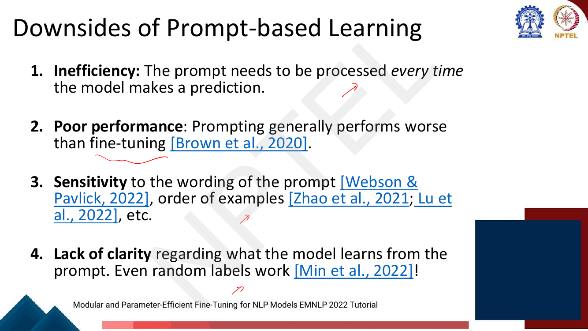
*Fig. — Memorise the four headers and the citation attached to each; the lecturer underlines all four. Page 3 of Week10(Lec 46-48,50).pdf.*

| # | Downside | What it actually means | Cited |
|---|---|---|---|
| 1 | **Inefficiency** | The prompt is re-processed on *every* prediction. A 500-token few-shot prompt is 500 tokens of attention you pay forever. | — |
| 2 | **Poor performance** | Prompting generally underperforms fine-tuning. | Brown et al., 2020 |
| 3 | **Sensitivity** | To the *wording* of the prompt, and to the *order* of the in-context examples. | Webson & Pavlick 2022; Zhao et al. 2021; Lu et al. 2022 |
| 4 | **Lack of clarity** | We do not know what the model learns from a prompt — **even random labels work**. | Min et al., 2022 |

Downside 1 is the one that motivates this lecture arithmetically. A learned prefix is also "tokens",
but it is a *fixed* small number you chose, not a hand-written demonstration block — and it is trained
rather than guessed, which kills downsides 2 and 3 as well.

### From fine-tuning to parameter-efficient fine-tuning

The deck's framing (p. 4): **fine-tuning all parameters is impractical with large models**, and
**state-of-the-art models are massively overparameterised** — so parameter-efficient fine-tuning
*matches* full fine-tuning in many cases. One pretraining run (BERT, BART, ERNIE, GPT-3, PaLM) feeds
many downstream tasks (classification, sequence labeling, question answering, …) through a thin
adaptation step.

Make the cost concrete, because this is the argument the exam wants. Under full fine-tuning you store

$$\text{storage} = (\text{number of tasks}) \times |\theta|$$

Every task gets its own complete $|\theta|$. Under PEFT you store

$$\text{storage} = |\theta| + (\text{number of tasks}) \times |\phi|, \qquad |\phi| \ll |\theta|$$

one shared frozen backbone plus a per-task sliver. The crossover is immediate: at two tasks PEFT is
already cheaper. At a hundred it is two orders of magnitude cheaper (N4 below). The *definition* the
deck gives is the one to write in an exam: **full fine-tuning updates all model parameters;
parameter-efficient fine-tuning updates a small subset.**

### The three perspectives on PEFT

This is the deck's own organising frame and the spine of Weeks 10's first two lectures. Every PEFT
method answers the same question — *where do the new trainable parameters live?* — and there are
exactly three answers.

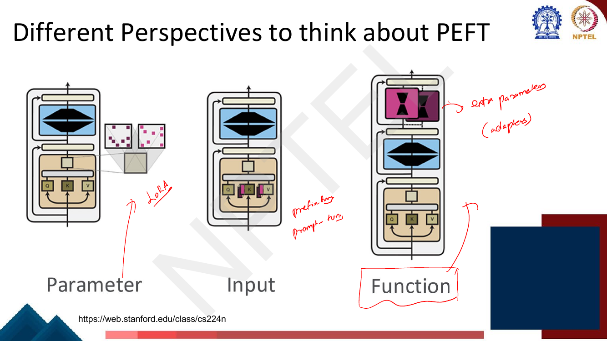
*Fig. — The lecturer writes the method name onto each column in red. Left = LoRA, middle = prefix/prompt-tuning, right = adapters. The pink blocks mark where the new parameters sit in each case. Page 6.*

| Perspective | New parameters live… | Method | Owner |
|---|---|---|---|
| **Functional** (function composition) | in **new modules inserted between** existing layers | **Adapters** | this chapter |
| **Input** (input composition) | in **extra vectors prepended to the sequence** | **Prefix-tuning**, prompt-tuning | this chapter (prefix); [Lec 45](../week-09/45-automatic-prompt-engineering.md) (prompt) |
| **Parameter** (parameter composition) | in a **low-rank reparameterisation of the existing weights**, $\mathbf{W} + \Delta\mathbf{W}$ | **LoRA**, KronA, VeRA | [Lec 47](47-lora-and-variants.md) |

The distinction that matters at inference: the parameter perspective can be *merged back* into
$\mathbf{W}$ and costs nothing extra at test time; the functional perspective adds genuinely new
matrix multiplies; the input perspective adds genuinely new sequence positions. Hold that thought —
it is the trade-off table at the end of each half of this deck.

The deck's formal statement of the functional perspective (p. 7):

$$f'_i(\mathbf{x}) = f_{\theta_i}(\mathbf{x}) \odot f_{\phi_i}(\mathbf{x})$$

where $f_{\theta_i}$ is the frozen pretrained function at position $i$ and $f_{\phi_i}$ is the new
task-specific one. (This chapter follows the deck in using $\theta$ for the **frozen** pretrained
parameters and $\phi$ for the **new trainable** ones — the only place in this book where $\phi$
carries meaning, because PEFT needs two parameter symbols at once.) The slide's own gloss: *"Main purpose of functions $f_{\phi_i}$ added to a
pre-trained model is to adapt it → Functions are also known as 'adapters'."* The $\odot$ here is the
deck's generic *composition* operator, not elementwise multiplication — as the next slide shows, the
actual composition used is addition through a residual.

### Adapters: the framework

**An adapter** is a small bottleneck module inserted inside a frozen Transformer block (Houlsby et
al., 2019). Three pieces and a skip connection:

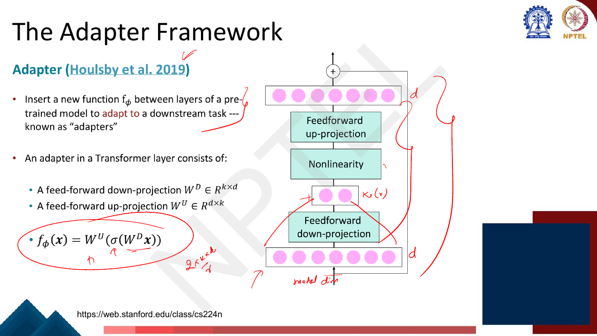
*Fig. — Notice the bottleneck: the pink row in the middle is only two units wide while the rows above and below are seven. The "+" at the very top is the residual connection — the adapter's output is added to its input, not substituted for it. Page 8.*

$$f_\phi(\mathbf{x}) = \mathbf{W}^U\big(\sigma(\mathbf{W}^D\mathbf{x})\big)$$

with $\mathbf{W}^D \in \mathbb{R}^{r \times d}$ the **down-projection**, $\sigma$ a nonlinearity
(ReLU/GELU), and $\mathbf{W}^U \in \mathbb{R}^{d \times r}$ the **up-projection**. Here $d \equiv
d_{\text{model}}$ is the model width and $r$ is the **bottleneck dimension** with $r \ll d$.

> **Deck notation:** slide 8 calls the bottleneck $k$ and writes $\mathbf{W}^D \in R^{k\times d}$;
> slide 10 calls the same quantity $r$. This book uses $r$ throughout, matching the contract's LoRA
> rank. The lecturer's handwritten "$2 \times k \times d$" on slide 8 is the weights-only count.

And the residual, which the diagram shows but the formula omits:

$$\text{Adapter}(\mathbf{x}) = \mathbf{x} + \mathbf{W}^U\big(\sigma(\mathbf{W}^D\mathbf{x})\big)$$

**Why the bottleneck.** The down-projection forces the task-specific update through an
$r$-dimensional channel. Two matrices of total size $2dr$ replace one of size $d^2$; at $d = 1024$ and
$r = 64$ that is 131 K parameters instead of 1.05 M, a 8× saving *per matrix* — and you only insert a
handful of them, instead of retraining all of them.

**Why the residual, and why near-zero initialisation.** This is the detail that makes adapters train
at all, and the deck shows it only as a "+" in a diagram. Initialise $\mathbf{W}^U$ at (or near) zero.
Then at step 0, $\mathbf{W}^U \sigma(\mathbf{W}^D\mathbf{x}) = \mathbf{0}$, so
$\text{Adapter}(\mathbf{x}) = \mathbf{x}$ exactly — the adapter is the **identity function**, and the
whole network computes exactly what the pretrained network computed. You start training from the
pretrained model's behaviour, not from a randomly perturbed version of it, so the first gradient steps
are informative instead of corrective. Worked numerically in N5. (Near-zero init is Houlsby's, stated
in the paper, not on these slides — flagged as editorial.)

### How many adapters per layer?

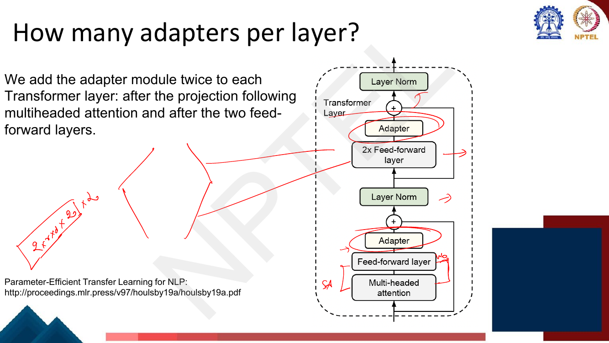
*Fig. — Both adapters sit INSIDE the existing residual branch — after the sublayer, before the "+" and the LayerNorm. The lecturer's handwritten "$2 \times r \times d \times 2$, $\times 2$" in the corner is him building the parameter count live. Page 9.*

The deck's answer, verbatim: *"We add the adapter module twice to each Transformer layer: after the
projection following multiheaded attention and after the two feed-forward layers."*

So **2 adapters per layer**, and for an $L$-layer stack, **$2L$ adapters** in total. The two insertion
points are the two sublayers of a Transformer block
([Lec 22](../week-05/22-self-attention-and-multihead.md)): self-attention and the position-wise FFN.
Note the exact placement — *after* the output projection of multi-head attention, and *after* the FFN's
second linear layer, in both cases before the residual add and LayerNorm. An adapter placed after the
LayerNorm would be outside the block's residual stream and is not what Houlsby does.

### How many parameters?

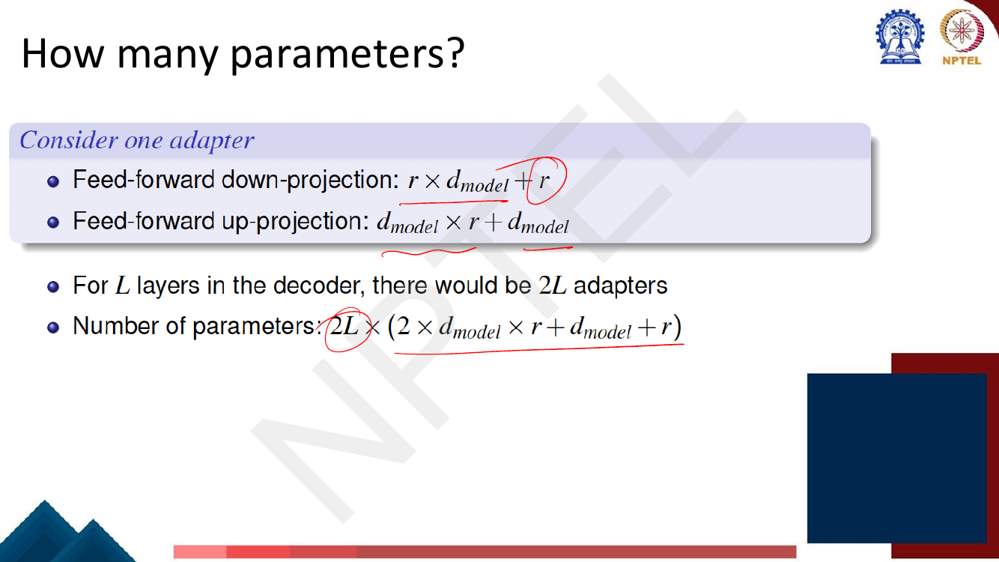
*Fig. — The deck answers its own question. Note the biases are counted: "+r" on the down-projection and "+d_model" on the up-projection. Page 10 — the re-swept exercise table flags this page, but it is a teaching slide with the derivation printed, not an exercise.*

Build it up. One adapter:

| Piece | Shape | Parameters |
|---|---|---|
| Down-projection $\mathbf{W}^D$ + bias | $r \times d$, bias $r$ | $rd + r$ |
| Up-projection $\mathbf{W}^U$ + bias | $d \times r$, bias $d$ | $dr + d$ |
| **One adapter** | | $\mathbf{2dr + d + r}$ |

and for $L$ layers with 2 adapters each:

$$|\phi|_{\text{adapters}} = 2L\,(2\,d_{\text{model}}\,r + d_{\text{model}} + r)$$

This is the deck's formula, written on the slide. The useful approximation is $|\phi| \approx 4Ldr$,
dropping the biases — compare that to a full Transformer stack's $\approx 12Ld^2$
([the pinned convention from Lec 23/24](../week-05/23-positional-encoding-and-encoder.md)):

$$\frac{|\phi|_{\text{adapters}}}{|\theta|} \approx \frac{4Ldr}{12Ld^2} = \frac{r}{3d}$$

**The fraction depends only on $r/d$ — not on depth.** Deeper models do not make adapters relatively
more expensive. At $r/d = 1/32$ you get about 1%. That single ratio is the cleanest thing to carry
into the exam.

### How is the performance?

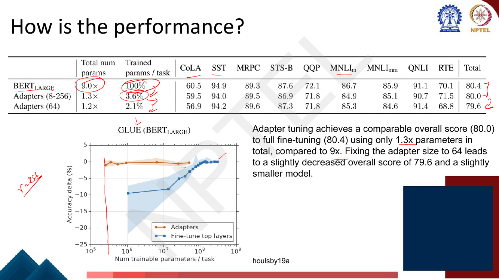
*Fig. — Read the two leftmost columns, not the task scores. "9.0×" is the total storage for the nine GLUE tasks under full fine-tuning; adapters need 1.3×. In the plot, the orange adapter curve stays flat at zero delta down to 10^6 parameters while the blue "fine-tune top layers" curve falls off a cliff. Page 11.*

| Method | Total num params | Trained params / task | GLUE total |
|---|---|---|---|
| BERT$_{\text{LARGE}}$ (full FT) | **9.0×** | **100%** | **80.4** |
| Adapters (8–256) | 1.3× | 3.6% | **80.0** |
| Adapters (64) | 1.2× | 2.1% | 79.6 |

The deck's own sentence: *"Adapter tuning achieves a comparable overall score (80.0) to full
fine-tuning (80.4) using only 1.3× parameters in total, compared to 9×. Fixing the adapter size to 64
leads to a slightly decreased overall score of 79.6 and a slightly smaller model."*

Three things to extract. (i) **0.4 GLUE points for a 7× storage saving** — that is the whole case for
PEFT in one number. (ii) "8–256" means the bottleneck $r$ was **tuned per task**; fixing $r = 64$
costs another 0.4 points. (iii) The plot's comparison is against *fine-tuning only the top $n$ layers*,
the obvious cheap baseline, and adapters dominate it everywhere below $10^8$ trainable parameters.
Freezing the bottom of the network is a much worse way to spend a parameter budget than inserting
small modules throughout it.

### Adapters in parallel

Houlsby's adapters are **sequential**: the block's output flows *through* the adapter. Stickland &
Murray's **Projected Attention Layers (PALs)** put the adapter **in parallel** with the sublayer
instead.

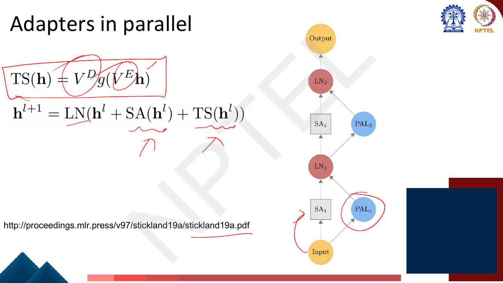
*Fig. — In the diagram the input fans out to BOTH the SA box and the PAL circle, and the two outputs are summed at the LayerNorm. Compare page 9, where the adapter sits in series after the sublayer. Page 12.*

$$\text{TS}(\mathbf{h}) = \mathbf{V}^D g(\mathbf{V}^E\mathbf{h}), \qquad
\mathbf{h}^{(l+1)} = \text{LN}\big(\mathbf{h}^{(l)} + \text{SA}(\mathbf{h}^{(l)}) + \text{TS}(\mathbf{h}^{(l)})\big)$$

The module $\text{TS}$ ("task-specific") has the same down–nonlinearity–up shape, with $\mathbf{V}^E$
the encoder/down matrix and $\mathbf{V}^D$ the decoder/up matrix. The difference is purely the wiring:

| | Sequential (Houlsby) | Parallel (PALs) |
|---|---|---|
| Composition | $\mathbf{h} \leftarrow \text{Adapter}(\text{SA}(\mathbf{h}))$ | $\mathbf{h} \leftarrow \text{SA}(\mathbf{h}) + \text{TS}(\mathbf{h})$ |
| Input to the adapter | the sublayer's **output** | the sublayer's **input** |
| Latency | adds to the critical path | can run **concurrently** with the sublayer |
| Parameter count | identical for the same $r$ | identical for the same $r$ |

The practical argument for parallel is the third row: a sequential adapter lengthens the dependency
chain, a parallel one does not, so on hardware with spare capacity it is nearly free in wall-clock
time. In PALs the $\text{TS}$ module also contains a small self-attention of its own, which is why the
paper's name is *attention* layers.

### The functional perspective: the trade-off table

Page 13 scores the functional perspective on four axes. The lecturer circles the third cell and
writes "downside" next to it.

| Axis | Function composition (adapters) |
|---|---|
| Parameter efficiency | Adapters depend on the **hidden size** (so cost scales with $d$, not with $d^2$) |
| Training efficiency | **Does not require gradients of frozen params** |
| Inference efficiency | **New functions increase the number of operations** ← the downside |
| Performance | Match or outperform standard fine-tuning |

The training-efficiency row deserves a sentence of mechanism. Freezing a weight does not spare you the
*backward pass through* it — gradients must still flow down to the lowest adapter. What you save is the
**gradient computation with respect to the frozen weights themselves** (you never form
$\partial\mathcal{L}/\partial\mathbf{W}$ for frozen $\mathbf{W}$) and, far more importantly, the
**optimizer state**: Adam keeps two moments per *trainable* parameter, so the memory accounting
collapses from $16|\theta|$ bytes to $2|\theta| + 16|\phi|$. That arithmetic is
[Lec 48](48-quantization-qlora-1.md)'s.

### Prefix-tuning: the input perspective

**Prefix-tuning** prepends a short sequence of **learned continuous vectors** to the input — and,
crucially, **at every layer** — while freezing every pretrained weight.

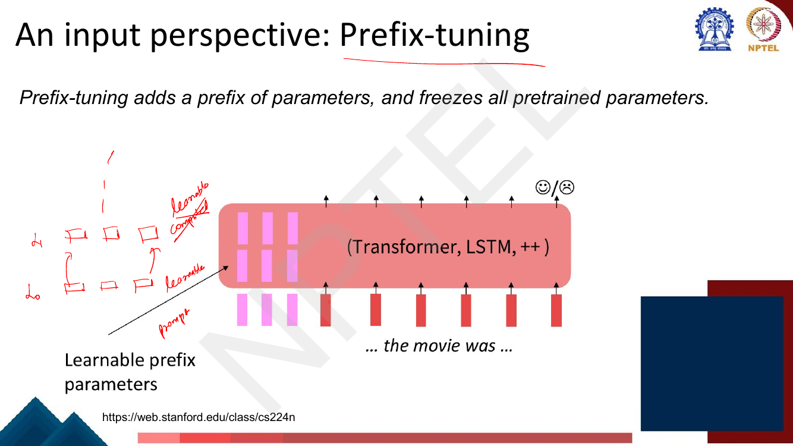
*Fig. — The pink columns are not tokens. They are free real-valued vectors with no entry in the vocabulary, optimised by gradient descent. Note they enter at the hidden-state rows as well as the input row. Page 14.*

The deck's sentence: *"Prefix-tuning adds a prefix of parameters, and freezes all pretrained
parameters."* The key word is **parameters**, not tokens — the prefix is never discretised back into
words.

### Task-specific prefixes

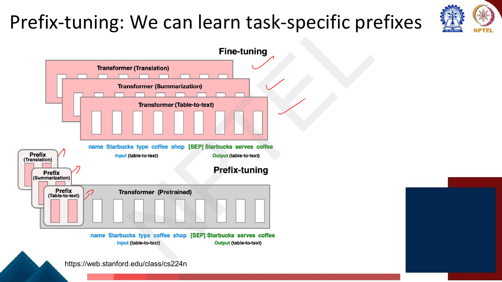
*Fig. — This is the whole economic argument in one picture: three full pink Transformers versus one grey Transformer and three thumbnails. Swapping tasks means swapping the small box. Page 15.*

One frozen backbone serves many tasks. At serving time you keep a single copy of the model in GPU
memory and switch prefixes per request — which also means you can **batch requests for different
tasks together**, since the only thing that differs is the leading rows of the activation matrix.
Full fine-tuning cannot do this at all: different tasks mean different weights, hence different
models, hence different GPUs.

### How does it work?

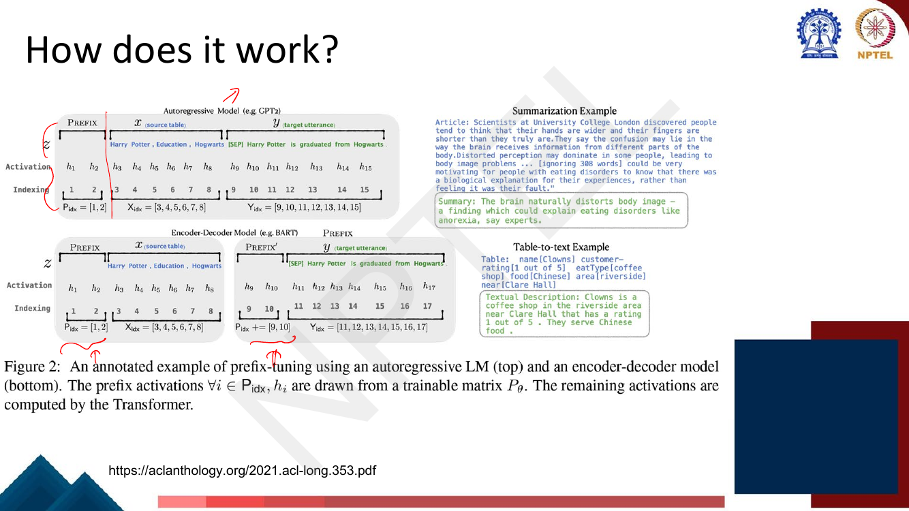
*Fig. — The caption is the mechanism: "The prefix activations ∀i ∈ P_idx, h_i are drawn from a trainable matrix P_θ. The remaining activations are computed by the Transformer." Note the encoder-decoder case needs TWO prefixes, P_idx = [1,2] and P_idx += [9,10]. Page 16.*

The mechanism, stated precisely. Write $\mathbf{z} = [\text{PREFIX}; \mathbf{x}; \mathbf{y}]$ and let
$P_{\text{idx}}$ be the set of prefix positions. At every layer:

$$\mathbf{h}_i^{(l)} = \begin{cases}
\mathbf{P}_\theta[i, :, l] & \text{if } i \in P_{\text{idx}} \quad (\textbf{read from the trainable table})\\
\text{TransformerBlock}^{(l)}\big(\mathbf{h}_{\le i}^{(l-1)}\big) & \text{otherwise} \quad (\textbf{computed as usual})
\end{cases}$$

So a prefix position's activation is **never computed** — it is *looked up*. Everything else runs as a
normal Transformer. The deck's p. 17 states it as *"For prefix tokens, activations are taken directly
from a trainable parameter set."*

**Why this changes the model's behaviour.** Inside self-attention
([Lec 22](../week-05/22-self-attention-and-multihead.md)), every real token at position $j$ computes a
query $\mathbf{q}_j$ and attends over the keys of all positions $i \le j$. The prefix positions
project through the same frozen $\mathbf{W}^K, \mathbf{W}^V$ and therefore contribute **extra keys and
values** that every real token can attend to:

$$\alpha_{ji} = \mathrm{softmax}_i\!\left(\frac{\mathbf{q}_j^\top \mathbf{k}_i}{\sqrt{d_k}}\right),
\qquad i \in P_{\text{idx}} \cup \{1,\dots,j\}$$

The learned prefix is therefore a **task-specific memory that every position can read**. Gradient
descent is free to put whatever is useful there, because the vectors live in $\mathbb{R}^{d}$ rather
than in the discrete vocabulary — which is exactly why they outperform any hand-written or
discretely-searched prompt.

Two structural consequences worth noticing. The prefix sits at positions $1..|P_{\text{idx}}|$, so for
a **decoder-only** model under causal masking it is visible to *everything* downstream. For an
**encoder-decoder**, the diagram shows two separate prefixes — one before the source $\mathbf{x}$ for
the encoder and one before the target $\mathbf{y}$ for the decoder — because a decoder-side prefix
cannot be seen by the encoder.

### Which layers do we tune?


*Fig. — The two formulas differ by exactly a factor of L. The top box IS prompt-tuning; the bottom box IS prefix-tuning. Page 17.*

| Variant | Trainable parameters | What it is |
|---|---|---|
| **Only the embedding layer** | $d_{\text{model}} \times \lvert P_{\text{idx}}\rvert$ | **prompt-tuning** — [Lec 45](../week-09/45-automatic-prompt-engineering.md) |
| **All layers** | $d_{\text{model}} \times \lvert P_{\text{idx}}\rvert \times L$ | **prefix-tuning** — this chapter |

> **THE BOUNDARY.** [Lec 45](../week-09/45-automatic-prompt-engineering.md) owns **prompt-tuning**:
> soft prompts injected at the **input embedding layer only**, after which the model runs normally and
> the prompt's representations evolve layer by layer like any other token's. This chapter owns
> **prefix-tuning**: learned vectors **re-injected at every layer**, overwriting what the block would
> otherwise have computed at those positions. Same idea, one structural difference, and
> **$L$ times the parameters**. If an exam asks "which method adds parameters at every layer?" the
> answer is prefix-tuning; "which adds them only at the input?" is prompt-tuning.

The expressive argument for going deep: with input-only soft prompts, the only lever you have on layer
20's behaviour is whatever survived 20 layers of frozen computation. With prefix-tuning you can set
layer 20's prefix activations directly. The deck's p. 20 trade-off row — *"Requires large models to
perform well"* — is about the input-only end of this spectrum; prompt-tuning only catches up with full
fine-tuning past roughly 10 B parameters, while prefix-tuning works at GPT-2 scale.

> **Erratum — the factor of 2.** The deck's formula is $d_{\text{model}} \times \lvert
> P_{\text{idx}}\rvert \times L$, counting **one $d$-dimensional activation per prefix position per
> layer**. Li & Liang's paper stores a *separate key and value* per position per layer, giving
> $2 \times d_{\text{model}} \times \lvert P_{\text{idx}}\rvert \times L$ — twice the deck's number;
> the same is true of P-Tuning v2 and of every `peft` implementation. **Follow the deck's formula for
> this exam** (Lec 47's own worked exercise on p. 35 uses it), but know the factor of 2 exists and why.

### Can we also do infix?

Page 18 asks the obvious follow-up question.

$$\mathbf{z} = \{\text{PREFIX}; \mathbf{x}; \mathbf{y}\} \quad\text{vs.}\quad \mathbf{z} = \{\mathbf{x}; \text{INFIX}; \mathbf{y}\}$$

An **infix** is the same learned vectors placed *between* the input and the output rather than before
both. The deck's three findings:

- For **decoder-only** models, prefixing can affect the activations of **both $\mathbf{x}$ and
  $\mathbf{y}$**; infixing **only impacts $\mathbf{y}$**. This follows directly from the causal mask:
  a position can only attend leftward, so tokens of $\mathbf{x}$ cannot see anything placed after them.
- **Infixing slightly underperforms prefix** — unsurprising, given it influences strictly less of the
  computation.
- **Both can be used together.** (Lec 47's exercise does exactly this: prefix length 4 *and* infix
  length 4.)

### Prefix-tuning: how is the performance?

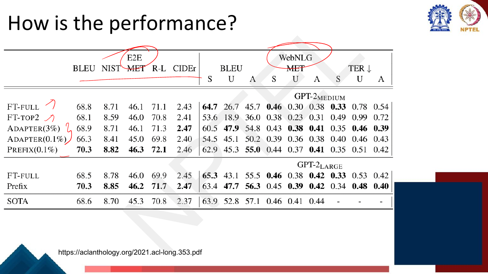
*Fig. — Read the E2E BLEU column: PREFIX(0.1%) scores 70.3, beating FT-FULL's 68.8 while training a thousandth of the parameters. Bold entries are column winners. Page 19.*

| GPT-2$_{\text{MEDIUM}}$ | E2E BLEU | E2E NIST | E2E MET | E2E R-L | E2E CIDEr |
|---|---|---|---|---|---|
| FT-FULL | 68.8 | 8.71 | 46.1 | 71.1 | 2.43 |
| FT-TOP2 | 68.1 | 8.59 | 46.0 | 70.8 | 2.41 |
| ADAPTER (3%) | 68.9 | 8.71 | 46.1 | 71.3 | **2.47** |
| ADAPTER (0.1%) | 66.3 | 8.41 | 45.0 | 69.8 | 2.40 |
| **PREFIX (0.1%)** | **70.3** | **8.82** | **46.3** | **72.1** | 2.46 |

Two readings. (i) **At equal budget (0.1%), prefix beats adapters** on every E2E metric — 70.3 vs 66.3
BLEU. The per-layer injection buys real capacity. (ii) **Prefix at 0.1% beats full fine-tuning**
(70.3 vs 68.8). With a small dataset like E2E, full fine-tuning overfits; constraining the update to
a 0.1% subspace is a regulariser. The GPT-2$_{\text{LARGE}}$ rows repeat the result at a larger scale
(Prefix 70.3 vs FT-FULL 68.5), and both beat the then-SOTA 68.6. Metrics: BLEU/METEOR/ROUGE-L are
[Lec 35](../week-07/35-text-summarization.md)'s; TER has a **↓** arrow — lower is better.

### The input perspective: the trade-off table

Page 20 is the matching table for the input perspective. Note that its middle cell spans both the
training- and inference-efficiency columns — one mechanism, two costs.

| Axis | Input composition (prefix/prompt-tuning) |
|---|---|
| Parameter efficiency | Only add a small number of parameters |
| Training **and** inference efficiency | **Extends the model's context window** |
| Performance | **Requires large models to perform well** |

The middle cell is the honest weakness. Prepending $p$ vectors makes every sequence $p$ tokens longer,
and attention is $O(n^2)$ ([Lec 25](../week-05/25-efficient-transformers.md)), so prefix-tuning taxes
*both* training and inference. Compare the two downsides side by side, because an MCQ will:

| Method | Inference cost | Can it be merged away? |
|---|---|---|
| Adapters | extra **operations** (two matmuls per sublayer) | No |
| Prefix-tuning | extra **sequence positions** | No |
| LoRA ([Lec 47](47-lora-and-variants.md)) | **none** — $\Delta\mathbf{W}$ folds into $\mathbf{W}$ | **Yes** |

That last row is the entire motivation for next lecture.

## Worked numericals

### N1. Adapter parameter count — the deck's own formula (page 10)

The re-swept exercise table flags page 10. It is **not** an exercise: it is a teaching slide that
states the derivation and prints the answer. Working it anyway, since it is the deck's one piece of
examinable arithmetic.

**Given:** BERT$_{\text{LARGE}}$ — $d_{\text{model}} = 1024$, $L = 24$ layers, $\approx 340$ M
parameters. Houlsby adapters with bottleneck $r = 64$, two per layer, biases included.
**Find:** the number of trainable parameters, and the fraction of the model.

1. Down-projection, one adapter: $\mathbf{W}^D$ is $r \times d_{\text{model}} = 64 \times 1024$, plus
   a bias of length $r$:
   $$64 \times 1024 + 64 = 65{,}536 + 64 = 65{,}600$$
2. Up-projection, one adapter: $\mathbf{W}^U$ is $d_{\text{model}} \times r = 1024 \times 64$, plus a
   bias of length $d_{\text{model}}$:
   $$1024 \times 64 + 1024 = 65{,}536 + 1{,}024 = 66{,}560$$
3. One adapter total: $65{,}600 + 66{,}560 = 132{,}160$. Check against the closed form
   $2d r + d + r = 2(1024)(64) + 1024 + 64 = 131{,}072 + 1{,}088 = 132{,}160$. ✓
4. Number of adapters: 2 per layer × 24 layers $= 48$.
5. Total: $48 \times 132{,}160 = 6{,}343{,}680$.
6. As a fraction: $6{,}343{,}680 / 340{,}000{,}000 = 0.018658 = \mathbf{1.87\%}$.
7. Sanity-check against the rule of thumb $r/(3d) = 64/3072 = 2.08\%$ — within 12%, and against the
   deck's own page-11 row, which reports **2.1%** trained params for Adapters(64). The gap is the
   LayerNorm parameters and the task classification head, which Houlsby also trains and the formula
   on page 10 does not count.

**Answer:** $2L(2d_{\text{model}}r + d_{\text{model}} + r) = 48 \times 132{,}160 =
\mathbf{6{,}343{,}680}$ trainable parameters, **1.87%** of BERT$_{\text{LARGE}}$ by the slide's
formula, reconciling with the deck's reported 2.1% once LayerNorms and the head are added.

### N2. Sizing the bottleneck to hit a 1% budget

**Given:** the same BERT$_{\text{LARGE}}$ ($d = 1024$, $L = 24$, 340 M).
**Find:** the bottleneck $r$ that makes the adapters exactly 1% of the model.

1. Budget: $0.01 \times 340{,}000{,}000 = 3{,}400{,}000$ parameters.
2. Set the formula equal to it: $48(2 \cdot 1024 \cdot r + 1024 + r) = 3{,}400{,}000$.
3. Expand: $48(2048r + r + 1024) = 48(2049r + 1024) = 98{,}352r + 49{,}152$.
4. Solve: $98{,}352r = 3{,}400{,}000 - 49{,}152 = 3{,}350{,}848$, so $r = 34.07$.
5. Take $r = 34$: $2(1024)(34) + 1024 + 34 = 69{,}632 + 1{,}058 = 70{,}690$ per adapter;
   $48 \times 70{,}690 = 3{,}393{,}120$.
6. Fraction: $3{,}393{,}120/340{,}000{,}000 = 0.9980\%$.
7. Cross-check the rule of thumb: $r/(3d) = 34/3072 = 1.107\%$ — the right order, slightly high
   because the exact formula's $12Ld^2$ denominator understates BERT (which also carries a 30,522-word
   embedding matrix).

**Answer:** $r = \mathbf{34}$ gives **3,393,120** trainable parameters $= \mathbf{0.998\%}$ of the
model. Compressing a 340 M-parameter model's task adaptation into 3.4 M costs a bottleneck of 34 out
of 1024 — a factor of **30× narrower** than the model width.

### N3. Prefix-tuning vs prompt-tuning — the $L\times$ gap

**Given:** GPT-2$_{\text{MEDIUM}}$ — $d_{\text{model}} = 1024$, $L = 24$, $\approx 355$ M parameters.
Prefix length $\lvert P_{\text{idx}}\rvert = p = 10$.
**Find:** trainable parameters under prompt-tuning (input only) and prefix-tuning (all layers), and
their ratio.

1. **Prompt-tuning** — page 17's top box, $d_{\text{model}} \times p$:
   $$1024 \times 10 = 10{,}240 \text{ parameters} = 0.0029\% \text{ of the model}$$
2. **Prefix-tuning** — page 17's bottom box, $d_{\text{model}} \times p \times L$:
   $$1024 \times 10 \times 24 = 245{,}760 \text{ parameters} = 0.0692\% \text{ of the model}$$
3. Ratio: $245{,}760/10{,}240 = 24 = L$. **Prefix-tuning costs exactly $L$ times prompt-tuning**,
   because it stores one vector per position *per layer* instead of one per position.
4. Under the paper's key-and-value accounting ($2dpL$): $2 \times 245{,}760 = 491{,}520$ parameters
   $= 0.1385\%$, and the ratio becomes $2L = 48$. The 0.1385% figure is why the deck's page-19 table
   labels the row **PREFIX (0.1%)**; the deck's own formula would have given 0.07%.
5. For comparison, the adapters of N1 at $r = 64$ cost 6.34 M — **26× more than prefix-tuning at
   $p = 10$**, which is why prefix wins the equal-budget comparison on page 19.

**Answer:** prompt-tuning **10,240**; prefix-tuning **245,760** by the deck's formula (**491,520**
counting keys and values separately). The gap is exactly a factor of $L = 24$ (or $2L = 48$), and
that factor *is* the difference between the two methods.

### N4. Storage for 100 tasks: full fine-tuning vs adapters

**Given:** Llama-2-7B — $d_{\text{model}} = 4096$, $L = 32$, $6.738 \times 10^9$ parameters, stored in
**fp16 = 2 bytes per parameter**. You must serve **100 tasks**. Adapters with $r = 16$, two per layer.
**Find:** total disk for each strategy.

1. One full copy of the model: $6.738 \times 10^9 \times 2 = 1.3476 \times 10^{10}$ bytes
   $= \mathbf{13.48\ \text{GB}}$.
2. **Full fine-tuning**, one copy per task: $100 \times 13.48 = \mathbf{1{,}347.6\ \text{GB}} \approx
   1.35\ \text{TB}$.
3. One adapter: $2dr + d + r = 2(4096)(16) + 4096 + 16 = 131{,}072 + 4{,}112 = 135{,}184$.
4. Adapters per task: $2L = 64$, so $64 \times 135{,}184 = 8{,}651{,}776 \approx 8.65$ M parameters.
5. Bytes per task: $8{,}651{,}776 \times 2 = 17{,}303{,}552 = \mathbf{17.3\ \text{MB}}$.
6. **Adapters**, one shared backbone plus 100 slivers:
   $$13.48\ \text{GB} + 100 \times 17.3\ \text{MB} = 13.48 + 1.73 = \mathbf{15.21\ \text{GB}}$$
7. Ratio: $1347.6/15.21 = \mathbf{88.6\times}$ less storage.
8. The serving consequence matters more than the disk: all 100 tasks share **one** set of frozen
   weights in GPU memory, so they fit on one accelerator. Under full fine-tuning you need 100 × 13.48
   GB resident, i.e. roughly **17 A100-80GBs just to hold the weights**.

**Answer:** **1,347.6 GB** for full fine-tuning versus **15.21 GB** for adapters — an **88.6×**
saving, and the difference between 100 GPUs and one.

### N5. A zero-initialised adapter leaves the block output unchanged

**Given:** $d_{\text{model}} = 4$, bottleneck $r = 2$, ReLU nonlinearity. Sublayer output
$\mathbf{x} = [1, -2, 3, 0.5]^\top$. Down-projection initialised small-random,
$$\mathbf{W}^D = \begin{bmatrix} 0.10 & -0.20 & 0.30 & 0.40 \\ -0.50 & 0.10 & 0.20 & -0.30\end{bmatrix}, \quad \mathbf{b}^D = \mathbf{0}$$
and the up-projection initialised to zero, $\mathbf{W}^U = \mathbf{0}_{4\times 2}$,
$\mathbf{b}^U = \mathbf{0}$.
**Find:** $\text{Adapter}(\mathbf{x})$, and what it becomes after one hypothetical update sets
$\mathbf{W}^U_{1,1} = 0.5$.

1. Down-project: $\mathbf{W}^D\mathbf{x}$, row 1:
   $0.10(1) + (-0.20)(-2) + 0.30(3) + 0.40(0.5) = 0.10 + 0.40 + 0.90 + 0.20 = 1.60$.
2. Row 2: $(-0.50)(1) + 0.10(-2) + 0.20(3) + (-0.30)(0.5) = -0.50 - 0.20 + 0.60 - 0.15 = -0.25$.
3. ReLU: $\sigma([1.60, -0.25]^\top) = [1.60, 0]^\top$. The bottleneck is **not** zero — information
   is flowing.
4. Up-project: $\mathbf{W}^U [1.60, 0]^\top = \mathbf{0}_{4}$, because every entry of $\mathbf{W}^U$
   is 0.
5. Residual: $\text{Adapter}(\mathbf{x}) = \mathbf{x} + \mathbf{0} = [1, -2, 3, 0.5]^\top$ — **exactly
   the input**. The block, and therefore the whole network, computes precisely what the pretrained
   model computed.
6. Now set $\mathbf{W}^U_{1,1} = 0.5$ (one gradient step). Up-projection becomes
   $[0.5 \times 1.60, 0, 0, 0]^\top = [0.8, 0, 0, 0]^\top$, so
   $\text{Adapter}(\mathbf{x}) = [1.8, -2, 3, 0.5]^\top$ — a small, controlled departure.
7. Contrast: with $\mathbf{W}^U$ also small-random, say first row $[0.1, -0.3]$, step 4 would give
   $0.1(1.60) + (-0.3)(0) = 0.16$ and the output would be $[1.16, \ldots]$ at **step 0**, before any
   learning — a random perturbation of a carefully pretrained function, at $2L = 48$ places at once.

**Answer:** with $\mathbf{W}^U = \mathbf{0}$ the adapter is the **identity**,
$\text{Adapter}(\mathbf{x}) = \mathbf{x} = [1, -2, 3, 0.5]^\top$, so training starts from the
pretrained model's exact behaviour. Note the gradient is *not* zero —
$\partial\mathcal{L}/\partial\mathbf{W}^U = \delta \cdot \sigma(\mathbf{W}^D\mathbf{x})^\top \ne
\mathbf{0}$ since the bottleneck activation $[1.60, 0]^\top$ is non-zero — so the module escapes the
identity on the first step. Zeroing *both* matrices would stall it permanently.

## Code

An adapter in 15 lines of NumPy, demonstrating the identity-at-initialisation property, plus the
parameter-count calculator that reproduces every number in the numericals above.

```python
import numpy as np

# ---------- 1. An adapter module, exactly as on slide 8 ----------
class Adapter:
    """f(x) = x + W_U sigma(W_D x + b_D) + b_U   -- bottleneck r << d."""
    def __init__(self, d, r, zero_init=True, seed=0):
        rng = np.random.default_rng(seed)
        # down-projection r x d, up-projection d x r (the deck's W^D, W^U)
        self.W_D = rng.normal(0, 1e-2, (r, d)); self.b_D = np.zeros(r)
        if zero_init:                      # near-identity at step 0
            self.W_U = np.zeros((d, r))
        else:
            self.W_U = rng.normal(0, 1e-2, (d, r))
        self.b_U = np.zeros(d)
    def n_params(self):
        return self.W_D.size + self.b_D.size + self.W_U.size + self.b_U.size
    def __call__(self, x):
        h = np.maximum(0.0, self.W_D @ x + self.b_D)   # down-project + ReLU
        return x + (self.W_U @ h + self.b_U)           # up-project + residual

d, r = 8, 2
x = np.arange(1., d + 1.)
print("input                :", x)
print("zero-init adapter out:", Adapter(d, r, zero_init=True)(x))
print("trained-ish adapter  :", np.round(Adapter(d, r, zero_init=False)(x), 6))
print("params in one adapter: 2*d*r + d + r =", 2*d*r + d + r,
      "| counted:", Adapter(d, r).n_params())
```

```
input                : [1. 2. 3. 4. 5. 6. 7. 8.]
zero-init adapter out: [1. 2. 3. 4. 5. 6. 7. 8.]
trained-ish adapter  : [0.998999 2.000757 2.999764 3.998776 5.001662 5.998632 6.999158 7.998142]
params in one adapter: 2*d*r + d + r = 42 | counted: 42
```

The zero-init row is *bit-identical* to the input. The random-init row is already perturbed in the
sixth decimal place before a single gradient step — multiply that by 48 insertion points and a deep
stack and you see why near-zero initialisation is not optional.

```python
# ---------- 2. Trainable-parameter calculator ----------
def full_ft(total, **_):            return total
def adapters(total, d, L, r, **_):  return 2*L * (2*d*r + d + r)   # slide 10
def prefix(total, d, L, p, **_):    return d * p * L               # slide 17
def prompt(total, d, p, **_):       return d * p                   # Lec 45

MODELS = {                        # name: (d_model, L, total params)
    "BERT-LARGE": (1024, 24, 340_000_000),
    "GPT-2-MEDIUM": (1024, 24, 355_000_000),
    "Llama-2-7B": (4096, 32, 6_738_000_000),
}
for name, (d, L, tot) in MODELS.items():
    print(f"\n{name}  d={d} L={L} total={tot:,}")
    for label, fn, kw in [("full fine-tuning", full_ft, {}),
                          ("adapters r=64",    adapters, dict(r=64)),
                          ("adapters r=16",    adapters, dict(r=16)),
                          ("prefix-tuning p=10", prefix, dict(p=10)),
                          ("prompt-tuning p=10", prompt, dict(p=10))]:
        n = fn(tot, d=d, L=L, **kw)
        print(f"  {label:<20} {n:>13,}   {100*n/tot:7.4f}% of model")
```

```
BERT-LARGE  d=1024 L=24 total=340,000,000
  full fine-tuning       340,000,000   100.0000% of model
  adapters r=64            6,343,680    1.8658% of model
  adapters r=16            1,622,784    0.4773% of model
  prefix-tuning p=10         245,760    0.0723% of model
  prompt-tuning p=10          10,240    0.0030% of model

GPT-2-MEDIUM  d=1024 L=24 total=355,000,000
  full fine-tuning       355,000,000   100.0000% of model
  adapters r=64            6,343,680    1.7870% of model
  adapters r=16            1,622,784    0.4571% of model
  prefix-tuning p=10         245,760    0.0692% of model
  prompt-tuning p=10          10,240    0.0029% of model

Llama-2-7B  d=4096 L=32 total=6,738,000,000
  full fine-tuning     6,738,000,000   100.0000% of model
  adapters r=64           33,820,672    0.5019% of model
  adapters r=16            8,651,776    0.1284% of model
  prefix-tuning p=10       1,310,720    0.0195% of model
  prompt-tuning p=10          40,960    0.0006% of model
```

Notice the adapter rows: the *absolute* count is identical for BERT-LARGE and GPT-2-MEDIUM (same $d$
and $L$), and the *percentage* for Llama-2-7B is four times smaller at the same $r$ — because the
fraction is $\approx r/(3d)$ and $d$ quadrupled. Bigger models are proportionally cheaper to adapt.

## Exam pack

### Must-memorise

| Item | Exactly this |
|---|---|
| Four downsides of prompt-based learning | Inefficiency · Poor performance · Sensitivity (wording, example order) · Lack of clarity (random labels work) |
| Full fine-tuning vs PEFT | Update **all** model parameters vs update a **small subset** |
| The three perspectives | **Functional** → adapters · **Input** → prefix-tuning · **Parameter** → LoRA |
| Adapter function | $f_\phi(\mathbf{x}) = \mathbf{W}^U(\sigma(\mathbf{W}^D\mathbf{x}))$, used as $\mathbf{x} + f_\phi(\mathbf{x})$ |
| Adapter shapes | $\mathbf{W}^D \in \mathbb{R}^{r\times d}$ (down), $\mathbf{W}^U \in \mathbb{R}^{d\times r}$ (up), $r \ll d$ |
| Adapters per layer | **2** — after the projection following multi-head attention, and after the two feed-forward layers |
| Adapter parameter count | $2L\,(2d_{\text{model}}r + d_{\text{model}} + r)$; $\approx r/(3d)$ of the model |
| Adapter initialisation | $\mathbf{W}^U \approx \mathbf{0}$ so the module starts as the **identity** |
| Parallel adapters (PALs) | $\text{TS}(\mathbf{h}) = \mathbf{V}^Dg(\mathbf{V}^E\mathbf{h})$; $\mathbf{h}^{(l+1)} = \text{LN}(\mathbf{h}^{(l)} + \text{SA}(\mathbf{h}^{(l)}) + \text{TS}(\mathbf{h}^{(l)}))$ |
| Prefix-tuning | Learned continuous vectors prepended **at every layer**; all pretrained weights frozen |
| Prefix mechanism | $\mathbf{h}_i = \mathbf{P}_\theta[i]$ for $i \in P_{\text{idx}}$ (read, not computed); elsewhere the Transformer computes as usual |
| Prefix parameter count | **All layers:** $d_{\text{model}}\lvert P_{\text{idx}}\rvert L$ · **Embeddings only:** $d_{\text{model}}\lvert P_{\text{idx}}\rvert$ |
| Prompt vs prefix | Prompt-tuning = **input layer only** ([Lec 45](../week-09/45-automatic-prompt-engineering.md)) · Prefix-tuning = **every layer** · ratio $= L$ |
| Infix | $\{\mathbf{x};\text{INFIX};\mathbf{y}\}$; in decoder-only models affects **only $\mathbf{y}$**; slightly underperforms prefix; combinable |
| Adapter downside | **New functions increase the number of operations** at inference |
| Prefix downside | **Extends the model's context window**; **requires large models to perform well** |

### Numbers worth knowing

| Quantity | Value | Source |
|---|---|---|
| Houlsby GLUE, BERT$_{\text{LARGE}}$ full fine-tuning | total params **9.0×**, trained **100%**, GLUE **80.4** | p. 11 |
| Houlsby GLUE, Adapters (8–256) | **1.3×**, **3.6%**, GLUE **80.0** | p. 11 |
| Houlsby GLUE, Adapters (64) | **1.2×**, **2.1%**, GLUE **79.6** | p. 11 |
| Adapters per Transformer layer | **2** | p. 9 |
| E2E BLEU, GPT-2$_{\text{MEDIUM}}$ | FT-FULL **68.8** · FT-TOP2 **68.1** · ADAPTER(3%) **68.9** · ADAPTER(0.1%) **66.3** · **PREFIX(0.1%) 70.3** | p. 19 |
| E2E BLEU, GPT-2$_{\text{LARGE}}$ | FT-FULL **68.5** · Prefix **70.3** · SOTA **68.6** | p. 19 |
| Prefix-tuning trainable fraction (as labelled) | **0.1%** | p. 19 |
| Papers named | Houlsby et al. **2019** (adapters) · Stickland & Murray **2019** (PALs) · Li & Liang **2021**, ACL (prefix-tuning) | pp. 8, 12, 16 |
| Downside citations | Brown **2020** · Webson & Pavlick **2022** · Zhao **2021** · Lu **2022** · Min **2022** | p. 3 |
| Models named as "too big to fully fine-tune" | BERT, BART, ERNIE, GPT-3 (175B), PaLM | p. 4 |
| Deck's umbrella source | *Modular and Parameter-Efficient Fine-Tuning for NLP Models*, **EMNLP 2022 Tutorial** | p. 21 |

### Likely MCQ traps

- **Prompt-tuning vs prefix-tuning.** Both prepend learned continuous vectors. **Prompt-tuning
  injects only at the input embedding layer** ($d\lvert P_{\text{idx}}\rvert$ parameters);
  **prefix-tuning injects at every layer** ($d\lvert P_{\text{idx}}\rvert L$). If the question
  mentions "every layer", "all layers", or an $L$ in the parameter formula, it is prefix-tuning.
- **Soft prompts are not tokens.** They are free vectors in $\mathbb{R}^{d}$ with no vocabulary entry.
  "Prefix-tuning searches for the best natural-language prompt" describes
  [Lec 45](../week-09/45-automatic-prompt-engineering.md)'s *discrete* search, not prefix-tuning.
- **Two adapters per layer, not one.** And they go after the attention *projection* and after the
  *second* FFN layer — inside the residual branch, before the LayerNorm. "One adapter per layer, after
  the LayerNorm" is the wrong answer on both counts.
- **Which perspective is LoRA?** **Parameter**, not functional. Adapters add new *functions*; LoRA
  reparameterises *existing* weights. Prefix-tuning is **input**. Getting the three-way mapping
  backwards is the single most likely taxonomy question.
- **Only LoRA has zero inference overhead.** Adapters add operations; prefix-tuning adds sequence
  positions. If the question asks which PEFT method can be *merged into the base weights*, neither
  method in this lecture qualifies — see [Lec 47](47-lora-and-variants.md).
- **"Does not require gradients of frozen params" ≠ "no backward pass".** Gradients still flow
  *through* the frozen weights to reach lower adapters. What you skip is forming
  $\partial\mathcal{L}/\partial\mathbf{W}$ for frozen $\mathbf{W}$, and the optimizer state for them.
- **The parameter fraction is $\approx r/(3d)$ — independent of $L$.** A question implying that
  adapters become relatively more expensive on deeper models is wrong; both numerator and denominator
  carry $L$.
- **Prefix beats full fine-tuning on E2E (70.3 vs 68.8).** Counterintuitive, so it is attractive bait.
  The reason is regularisation on a small dataset, not raw capacity.
- **Adapter fractions are quoted two ways.** The deck's page-11 "2.1%" counts LayerNorms and the task
  head; page 10's formula gives 1.87% for the same configuration. Say which you are using.
- **Infix affects only $\mathbf{y}$ in decoder-only models** because of causal masking — not because
  of a design choice. In an encoder-decoder, that logic does not apply the same way, which is why the
  page-16 figure shows two separate prefixes.
- **Zero-initialising *both* projections is wrong.** Only $\mathbf{W}^U$ goes to zero; a zero
  $\mathbf{W}^D$ makes the bottleneck activation zero and the gradient on $\mathbf{W}^U$ vanishes too,
  stalling the module forever.

### Self-test

1. Name the deck's three perspectives on PEFT and the method associated with each.
2. Write the adapter function and the shapes of its two matrices.
3. Where exactly in a Transformer layer do the two adapters go, and how many are there in an
   $L$-layer model?
4. Give the deck's adapter parameter formula and evaluate it for $d_{\text{model}} = 768$, $L = 12$,
   $r = 48$.
5. State the two prefix-tuning parameter formulas from page 17 and say which corresponds to
   prompt-tuning.
6. In prefix-tuning, how is $\mathbf{h}_i$ obtained for a prefix position $i$, and how for a real
   token?
7. Why does a near-zero-initialised adapter not break the pretrained model at step 0, and why does it
   still learn?
8. What is the deck's named downside of the functional perspective, and of the input perspective?
9. On E2E with GPT-2$_{\text{MEDIUM}}$, which of FT-FULL, ADAPTER(0.1%) and PREFIX(0.1%) gets the best
   BLEU, and what is it?
10. For decoder-only models, which activations can a prefix affect, and which can an infix affect?

<details><summary>Answers</summary>

1. **Functional** → adapters (insert new modules); **Input** → prefix-tuning / prompt-tuning (prepend
   learned vectors); **Parameter** → LoRA and its variants (reparameterise existing weights,
   [Lec 47](47-lora-and-variants.md)).
2. $f_\phi(\mathbf{x}) = \mathbf{W}^U(\sigma(\mathbf{W}^D\mathbf{x}))$, applied as
   $\mathbf{x} + f_\phi(\mathbf{x})$. $\mathbf{W}^D \in \mathbb{R}^{r\times d_{\text{model}}}$ (down),
   $\mathbf{W}^U \in \mathbb{R}^{d_{\text{model}}\times r}$ (up), $r \ll d_{\text{model}}$.
3. **Twice per layer**: after the projection following multi-headed attention, and after the two
   feed-forward layers — both inside the residual branch, before the LayerNorm. **$2L$** adapters in
   total.
4. $2L(2d r + d + r) = 24 \times (2 \cdot 768 \cdot 48 + 768 + 48) = 24 \times (73{,}728 + 816) =
   24 \times 74{,}544 = \mathbf{1{,}789{,}056}$. (About 1.6% of BERT-base's 110 M; rule of thumb
   $r/3d = 48/2304 = 2.08\%$.)
5. Embeddings only: $d_{\text{model}} \times \lvert P_{\text{idx}}\rvert$ — this is **prompt-tuning**
   ([Lec 45](../week-09/45-automatic-prompt-engineering.md)). All layers:
   $d_{\text{model}} \times \lvert P_{\text{idx}}\rvert \times L$ — this is **prefix-tuning**.
6. For $i \in P_{\text{idx}}$, $\mathbf{h}_i$ is **read directly from the trainable matrix
   $\mathbf{P}_\theta$** — never computed. For every other position it is computed by the frozen
   Transformer block as usual, attending over the prefix's keys and values.
7. With $\mathbf{W}^U = \mathbf{0}$ the residual branch contributes exactly $\mathbf{0}$, so
   $\text{Adapter}(\mathbf{x}) = \mathbf{x}$ and the network reproduces the pretrained function. It
   still learns because $\partial\mathcal{L}/\partial\mathbf{W}^U = \delta\,\sigma(\mathbf{W}^D
   \mathbf{x})^\top$, which is non-zero as long as $\mathbf{W}^D$ is not also zero.
8. Functional: **new functions increase the number of operations** at inference. Input: it **extends
   the model's context window** (so it costs time in training *and* inference) and it **requires large
   models to perform well**.
9. **PREFIX(0.1%)** with **70.3**, ahead of FT-FULL's 68.8 and ADAPTER(0.1%)'s 66.3.
10. A **prefix** can affect the activations of **both $\mathbf{x}$ and $\mathbf{y}$**; an **infix**
    affects **only $\mathbf{y}$**, because causal masking prevents $\mathbf{x}$'s tokens from
    attending to anything placed after them.

</details>

## Beyond the slides

**Gap: near-zero initialisation of $\mathbf{W}^U$ is never stated on these slides.** The deck shows
the "+" residual on page 8 and says nothing about how the adapter is initialised.
**Why it matters:** without it, inserting 48 randomly-initialised modules into a trained network
perturbs its function at 48 places simultaneously, and the first thousand steps are spent undoing the
damage rather than learning the task. It is the single design choice that makes adapters trainable,
and N5 shows it costs nothing.

**Gap: the deck's prefix-tuning parameter formula omits the factor of 2 for keys and values.**
Page 17 gives $d_{\text{model}}\lvert P_{\text{idx}}\rvert L$; Li & Liang's paper and every modern
implementation (P-Tuning v2, HuggingFace `peft`) store a separate key *and* value per position per
layer, i.e. $2d_{\text{model}}\lvert P_{\text{idx}}\rvert L$.
**Why it matters:** the deck's own page-19 table labels prefix-tuning "0.1%", which only reproduces
under the ×2 accounting (0.1385% vs 0.069% for GPT-2$_{\text{MEDIUM}}$ at $p = 10$). Use the deck's
formula on the exam — Lec 47's worked exercise depends on it — but know the discrepancy exists.

**Gap: reparameterisation during prefix training.** Li & Liang found that optimising
$\mathbf{P}_\theta$ directly is unstable, so they train a smaller matrix $\mathbf{P}'_\theta$ and map
it through an MLP, $\mathbf{P}_\theta[i,:] = \text{MLP}(\mathbf{P}'_\theta[i,:])$, discarding the MLP
after training. **Why it matters:** it explains why reported prefix parameter counts sometimes differ
from the formula, and it is the honest answer to "why would 0.1% of parameters be hard to optimise?"
— the loss surface in prefix space is badly conditioned.

**Gap: AdapterFusion and adapter composition.** Because adapters are modular, you can train one per
task and then learn a small attention mechanism over several of them, combining skills without
retraining. The deck's page-7 line *"most commonly used in multi-task learning where modules of
different tasks are composed"* hints at this and then drops it. **Why it matters:** modularity — not
just parameter count — is the reason the EMNLP tutorial this deck is drawn from is called
*Modular* and Parameter-Efficient Fine-Tuning.

**Gap: BitFit, the simplest PEFT baseline of all.** Train only the **bias terms** of the frozen model
— about 0.08% of parameters — and nothing else. **Why it matters:** it is the natural "is a bottleneck
module really necessary?" control, it is competitive on GLUE at BERT scale, and an exam listing PEFT
methods may include it. It belongs to no perspective cleanly, which is a useful limit case for the
deck's three-way taxonomy.

## Cut from the slides

Pages 1 and 2 are the title and contents slides, and pages 21–22 are the references and "Thank you"
slides; their only content — the EMNLP'22 tutorial citation — is recorded in the Numbers table.
I compressed page 11's nine per-task GLUE columns into the three summary columns (total params,
trained params, GLUE total), since the deck's own commentary and the lecturer's annotations key on
those three and not on CoLA-vs-STS-B; likewise page 19's WebNLG half, whose nine sub-columns
(S/U/A for BLEU, MET and TER) restate the E2E conclusion without changing it — the one extra fact
there, that ADAPTER(3%) wins several WebNLG-Unseen cells, is noted implicitly by the "at equal budget"
framing. Pages 13 and 20's trade-off tables are reproduced in full because the lecturer circles cells
on both. LoRA, KronA and VeRA appear on page 6's taxonomy only and are handed to
[Lec 47](47-lora-and-variants.md) with a single sentence each, as are quantization and QLoRA
([Lec 48](48-quantization-qlora-1.md)) and pruning and distillation
([Lec 50](50-pruning-and-distillation.md)). Prompt-tuning is named and contrasted but never derived —
it is [Lec 45](../week-09/45-automatic-prompt-engineering.md)'s. Finally, the course's first brush
with low-rank weight factorisation was `Week2.pdf` p. 63, whose composed network has a rank-1
$\boldsymbol\Psi$; that thread is picked up by [Lec 47](47-lora-and-variants.md), not here.
