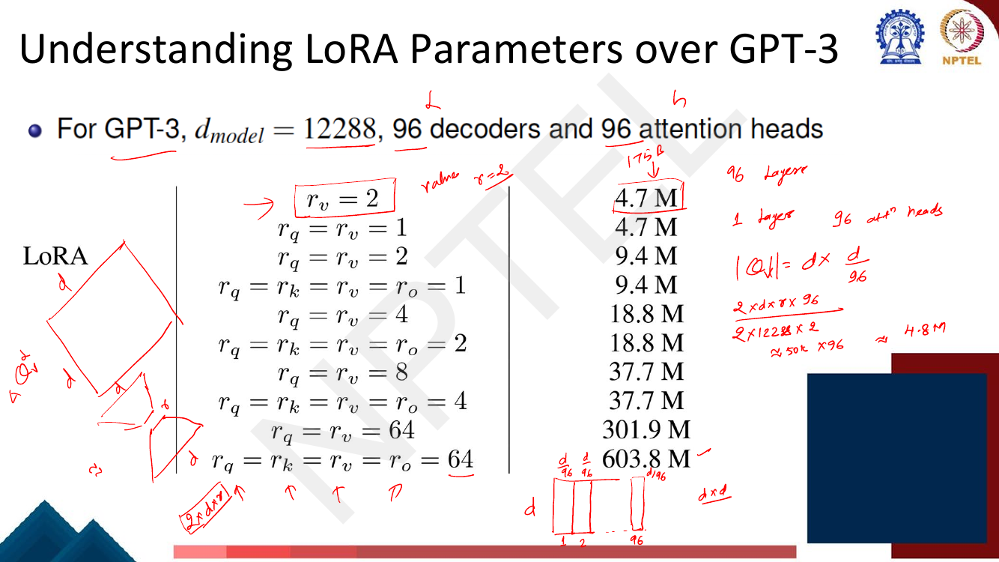

# Lec 47 — LoRA and Its Variants

> **Source:** `Week10(Lec 46-48,50).pdf` pp. 23–49 · **Week 10** · **Playlist:** Lec 47
> **Prereqs:** [Lec 46 — PEFT I: Adapters and Prefix-Tuning](46-peft-adapters-prefix.md), [matrix rank and factorisation (companion course)](../../../GenAIforCV/notes/week-01/04-linear-algebra.md)
> **Feeds into:** [Lec 48 — Quantization and QLoRA I](48-quantization-qlora-1.md)

## Why this lecture exists

Lecture 46 gave you two of the three ways to make fine-tuning cheap: bolt small **functions** into the
network (adapters), or push learned vectors into the **input** (prefix-tuning). Both work, and both
have the same structural defect — they change the shape of the computation. An adapter is an extra
sequential module every token must pass through, so it costs latency at inference forever, and a
prefix eats context length.

The third perspective asks a different question. Do not add anything to the network; instead ask what
the *weight update itself* looks like, and parameterise that cheaply. If $\Delta\mathbf{W}$ can be
written as the product of two thin matrices, you can train the thin matrices, then **add the product
back into the original weights** and ship a model that is byte-for-byte the same shape as the one you
started with. That is LoRA. It is the most widely deployed PEFT method in existence, the one every
downstream lecture in this week builds on, and the most examinable idea in Week 10.

## The ideas

### The parameter perspective — completing Lec 46's trio

The deck's recurring three-panel slide names the three places you can intervene: **parameter**,
**input**, **function**. Lec 46 owns the input panel (prefix-tuning) and the function panel
(adapters), and [Lec 45](../week-09/45-automatic-prompt-engineering.md) owns prompt-tuning, which is
the input panel at the embedding layer only. This lecture owns the parameter panel: you leave the
architecture untouched and constrain *how the weights are allowed to change*.

Set the problem up as the deck does. You have a pretrained autoregressive LM $P_\theta(y \mid x)$.
(A notation warning: these slides write the parameters as $\boldsymbol\phi$ — $\phi_o$ for the
pretrained set, $\Delta\phi$ for the update — while [Lec 46](46-peft-adapters-prefix.md)'s slides use
$\theta$ for the *frozen pretrained* weights and $\phi$ for the *new trainable* ones. The two
lectures' $\phi$ therefore mean opposite things. This book writes $\theta$ for parameters throughout,
per the contract, and $\Theta$ for the small PEFT parameterisation, which is the deck's own symbol.)
Full fine-tuning updates $\theta_0 \to \theta_0 + \Delta\theta$ by maximising the conditional
log-likelihood

$$\max_{\theta}\ \sum_{(x,y)} \sum_{t=1}^{|y|} \log P_{\theta}(y_t \mid x, y_{<t})$$

The cost is not the optimisation; it is the bookkeeping. **$|\Delta\theta| = |\theta_0|$** — the update
is exactly as big as the model. For GPT-3, $|\theta_0| = 175$ billion, so every task you adapt to
costs another 175-billion-parameter checkpoint. The deck's words: "expensive and challenging for
storing and deploying many independent instances".

Page 27's key idea, in the deck's own words: *encode the task-specific parameter increment
$\Delta\theta = \Delta\theta(\Theta)$ by a smaller-sized set of parameters $\Theta$, with
$|\Theta| \ll |\theta_0|$*, so that

$$\max_{\Theta}\ \sum_{(x,y)} \sum_{t=1}^{|y|} \log P_{\theta_0 + \Delta\theta(\Theta)}(y_t \mid x, y_{<t})$$

You train $\Theta$ and reconstruct $\Delta\theta$ from it. LoRA, KronA and VeRA are three answers to
"what should that function be?".

### LoRA: low-rank parameterised update matrices

Take one weight matrix $\mathbf{W}_0 \in \mathbb{R}^{d \times k}$ of the frozen pretrained model. LoRA
constrains its update to be a product of two thin matrices:

$$\mathbf{W}_0 + \Delta\mathbf{W} = \mathbf{W}_0 + \mathbf{B}\mathbf{A}, \qquad
\mathbf{B} \in \mathbb{R}^{d \times r},\ \ \mathbf{A} \in \mathbb{R}^{r \times k},\ \ r \ll \min(d,k)$$

$\mathbf{W}_0$ is frozen and receives no gradient. **Only $\mathbf{A}$ and $\mathbf{B}$ are
trainable.** The parameter count falls from $dk$ to $r(d+k)$ — for a square matrix, from $d^2$ to
$2dr$.


*Fig. — Read the orange path bottom-to-top: $\mathbf{x}$ goes down into $\mathbf{A}$ (an $r$-dimensional bottleneck), up through $\mathbf{B}$, and the result is **added** to the frozen path, not chained after it. That parallelism is what makes merging possible later. Note the two initialisations printed in the trapezoids. Page 28.*

**The hypothesis that justifies it.** The deck's first bullet, citing Aghajanyan et al. (2020):
*updates to the weights have a low "intrinsic rank" during adaptation*. Read that carefully, because
the exam will try to make you misstate it:

> The claim is **not** that the pretrained weight matrix $\mathbf{W}_0$ is low-rank. $\mathbf{W}_0$ is
> generically full rank — it had to store everything the model learned from the whole pretraining
> corpus. The claim is that the **change** $\Delta\mathbf{W}$ needed to specialise that matrix to one
> downstream task lives in a very low-dimensional subspace.

That is plausible: a single task is a tiny slice of what the model already knows, so adapting to it
should require re-weighting a handful of directions rather than rebuilding the matrix. The empirical
evidence is in the rank ablation below — $r = 1$ or $2$ is often already enough.

**Initialisation.** $\mathbf{A}$ is drawn from a Gaussian $\mathcal{N}(0,\sigma^2)$; $\mathbf{B}$ is
**zero**. Therefore $\Delta\mathbf{W} = \mathbf{B}\mathbf{A} = \mathbf{0}$ at step 0 and the adapted
model is *exactly* the pretrained model before any training happens. This matters for two reasons:
you never damage the pretrained function with a random perturbation, and the optimisation starts from
a known-good point. It is the same instinct as the adapter's near-identity initialisation in
[Lec 46](46-peft-adapters-prefix.md). The asymmetry is deliberate — if *both* were zero no gradient
would ever flow (the gradient of $\mathbf{B}\mathbf{A}$ with respect to $\mathbf{A}$ is proportional
to $\mathbf{B}$, and vice versa), so exactly one of them must be zero.

### What happens during training and inference


*Fig. — The highlighted box is the single most examinable sentence in the chapter. The two-path form is a **training-time** convenience; at deployment you collapse it into one matrix. Page 29.*

**During training**, $\mathbf{W}_0$ is frozen and the forward pass runs both paths:

$$\mathbf{h} = \mathbf{W}_0\mathbf{x} + \Delta\mathbf{W}\mathbf{x} = \mathbf{W}_0\mathbf{x} + \mathbf{B}\mathbf{A}\mathbf{x}$$

Gradients flow only into $\mathbf{A}$ and $\mathbf{B}$. The optimiser state (momentum, Adam's second
moment) is therefore also only kept for $\mathbf{A}$ and $\mathbf{B}$, which is where most of the
actual GPU-memory saving comes from — see [Lec 48](48-quantization-qlora-1.md).

**At inference**, compute $\mathbf{W} = \mathbf{W}_0 + \mathbf{B}\mathbf{A}$ once, store that, and
throw the factors away. The deployed layer is an ordinary $d \times k$ matrix multiply.

> **LoRA adds ZERO inference latency.** This is its decisive advantage over adapters. An adapter is a
> *sequential* module — the activation must go through the bottleneck and come back before the next
> sublayer can start, so it adds wall-clock time on every token, forever. A LoRA update is *parallel*
> and linear in $\mathbf{x}$, so it distributes: $\mathbf{W}_0\mathbf{x} + \mathbf{B}\mathbf{A}\mathbf{x}
> = (\mathbf{W}_0 + \mathbf{B}\mathbf{A})\mathbf{x}$. The KronA deck measures exactly this — LoRA
> 100% inference latency against an adapter's **146%** (page 43).

Merging is reversible: to swap tasks you subtract $\mathbf{B}\mathbf{A}$ and add
$\mathbf{B}'\mathbf{A}'$. That is how a single served base model hosts thousands of per-user adapters.

### The $\alpha/r$ scaling

Implementations (and this book's notation table) write the update with a scalar in front:

$$\mathbf{h} = \mathbf{W}_0\mathbf{x} + \frac{\alpha}{r}\,\mathbf{B}\mathbf{A}\mathbf{x}$$

**This factor is not on the deck** — page 29 shows the unscaled form — but you should know why it
exists, because it is standard everywhere LoRA is used. Each entry of $\mathbf{B}\mathbf{A}$ is a sum
of $r$ products, so the typical magnitude of $\Delta\mathbf{W}$ grows with $r$. Without the scaling,
doubling the rank silently doubles the effective step size and you would have to retune the learning
rate $\eta$ every time you changed $r$. Dividing by $r$ cancels that growth, so $\alpha$ becomes a
rank-independent knob: **$\alpha/r$ decouples the rank from the learning rate.** Worked numerically in
N4. Note $\alpha = r$ gives a scaling of exactly 1, i.e. the deck's formula.

### Which weight matrices to apply LoRA to?

A Transformer block has four attention projections — $\mathbf{W}_q, \mathbf{W}_k, \mathbf{W}_v,
\mathbf{W}_o$ — plus two feed-forward matrices
([Lec 22](../week-05/22-self-attention-and-multihead.md)). The LoRA paper fixes a budget of 18M
trainable parameters on GPT-3 and spends it different ways.


*Fig. — Both tables point the same way. Top: **adapting $\mathbf{W}_q$ and $\mathbf{W}_v$ together beats spending the whole budget on any single matrix**, even at a quarter of the rank. Bottom: the columns are flat — $r=1$ is within a point of $r=64$. Page 30.*

The headline numbers, which are worth memorising:

| Weight types (rank) | WikiSQL (±0.5) | MultiNLI (±0.1) |
|---|---|---|
| $\mathbf{W}_q$ ($r{=}8$) | 70.4 | 91.0 |
| $\mathbf{W}_k$ ($r{=}8$) | 70.0 | 90.8 |
| $\mathbf{W}_v$ ($r{=}8$) | 73.0 | 91.0 |
| $\mathbf{W}_o$ ($r{=}8$) | 73.2 | 91.3 |
| $\mathbf{W}_q,\mathbf{W}_k$ ($r{=}4$) | 71.4 | 91.3 |
| **$\mathbf{W}_q,\mathbf{W}_v$ ($r{=}4$)** | **73.7** | 91.3 |
| $\mathbf{W}_q,\mathbf{W}_k,\mathbf{W}_v,\mathbf{W}_o$ ($r{=}2$) | **73.7** | **91.7** |

The deck's own gloss: *"Adapting both $\mathbf{W}_q$ and $\mathbf{W}_v$ gives the best performance
overall."* And on rank: *"LoRA already performs competitively with a very small $r$"* — on WikiSQL
with $\{\mathbf{W}_q,\mathbf{W}_v\}$ the scores run 73.4 / 73.3 / 73.7 / 73.8 / 73.5 for
$r = 1,2,4,8,64$. Spreading a fixed budget across *more matrices at lower rank* beats concentrating it.
That is itself evidence for the low-intrinsic-rank hypothesis.

### Understanding LoRA parameters over GPT-3


*Fig. — The handwriting is the formula you need: $2 \times d_{\text{model}} \times r \times L$ per adapted matrix type. Everything in the right-hand column is that formula evaluated. Page 31.*

GPT-3: $d_{\text{model}} = 12288$, $L = 96$ decoder layers, 96 attention heads. Each attention
projection is $d \times d$, so one LoRA pair costs $dr + rd = 2dr$ parameters, and across the stack:

$$|\Theta| = 2 \times d_{\text{model}} \times L \times \sum_i r_i$$

where the sum runs over the adapted matrix types. Evaluate it:

| Configuration | $\sum_i r_i$ | Trainable parameters |
|---|---|---|
| $r_v = 2$ | 2 | 4.7 M |
| $r_q = r_v = 1$ | 2 | 4.7 M |
| $r_q = r_v = 2$ | 4 | 9.4 M |
| $r_q = r_k = r_v = r_o = 1$ | 4 | 9.4 M |
| $r_q = r_v = 4$ | 8 | 18.8 M |
| $r_q = r_k = r_v = r_o = 2$ | 8 | 18.8 M |
| $r_q = r_v = 8$ | 16 | 37.7 M |
| $r_q = r_k = r_v = r_o = 4$ | 16 | 37.7 M |
| $r_q = r_v = 64$ | 128 | 301.9 M |
| $r_q = r_k = r_v = r_o = 64$ | 256 | 603.8 M |

Check one by hand: $2 \times 12288 \times 96 \times 2 = 4{,}718{,}592 \approx 4.7$ M. ✓ Notice the
pairing — only $\sum_i r_i$ matters, so $\{q,v\}$ at $r{=}1$ costs exactly what $v$ alone at $r{=}2$
costs. The exam can key on that.

### LoRA in practice: scaling to GPT-3


*Fig. — The row to burn in: **GPT-3 LoRA at 4.7M trainable parameters beats full fine-tuning's 175,255.8M on MNLI-m (91.7 vs 89.5) and SAMSum**, with WikiSQL within 0.4. The scatter plots show prefix methods *degrading* past a few million parameters while LoRA's curve stays flat — "better scalability". Page 33.*

| GPT-3 method | Trainable params | WikiSQL (%) | MNLI-m (%) | SAMSum R1/R2/RL |
|---|---|---|---|---|
| Fine-tune (FT) | 175,255.8 M | **73.8** | 89.5 | 52.0/28.0/44.5 |
| BitFit | 14.2 M | 71.3 | 91.0 | 51.3/27.4/43.5 |
| PreEmbed | 3.2 M | 63.1 | 88.6 | 48.3/24.2/40.5 |
| PreLayer | 20.2 M | 70.1 | 89.5 | 50.8/27.3/43.5 |
| Adapter$^{\mathrm H}$ | 7.1 M | 71.9 | 89.8 | 53.0/28.9/44.8 |
| Adapter$^{\mathrm H}$ | 40.1 M | 73.2 | **91.5** | 53.2/29.0/45.1 |
| **LoRA** | **4.7 M** | 73.4 | **91.7** | **53.8/29.8/45.9** |
| **LoRA** | 37.7 M | **74.0** | 91.6 | 53.4/29.2/45.1 |

Full fine-tuning uses **37,288×** more trainable parameters than the 4.7M LoRA row and loses on two of
the three benchmarks. The deck's summary: *"LoRA matches or exceeds the fine-tuning baseline on all
three datasets"* and *"LoRA exhibits better scalability and task performance."*

On the smaller GPT-2 (page 32, E2E NLG Challenge), the same story at a smaller scale: GPT-2 Medium
full FT has 354.92M trainable parameters and scores BLEU 68.2; **GPT-2 M LoRA has 0.35M and scores
BLEU 70.4**, NIST 8.85, METEOR 46.8, ROUGE-L 71.8, CIDEr 2.53 — best in every column. GPT-2 Large:
774.03M (FT, BLEU 68.5) versus 0.77M (LoRA, BLEU 70.4, ROUGE-L 72.0).

### The comparison-of-PEFT-methods table


*Fig. — Scan the WikiSQL column down. PrefixEmbed never exceeds 63.1 at any size; PrefixLayer peaks at 70.1; Adapter$^{\mathrm H}$ needs 21.2M to reach 73.2; **LoRA reaches 73.4 at 4.7M**. More parameters stop helping — PrefixEmbed at 6.4M is *worse* (55.9) than at 1.7M (60.6). Page 34.*

Two things on that slide beyond the LoRA block. $l_p$ is the prefix length and $l_i$ the infix length —
the same hyperparameters the page-35 exercise uses. And Adapter$^{\mathrm H}$ at $r = 64$ costs 304.4M
parameters for 72.6 on WikiSQL, *worse* than its own $r=4$ row at 21.2M (73.2). Parameter-efficient
methods are not monotone in capacity.

### KronA — the Kronecker adapter

LoRA's limitation is baked into its name: $\mathbf{B}\mathbf{A}$ has rank at most $r$, so the update
can only move the weight matrix within an $r$-dimensional subspace. The deck states the complaint
directly: *"low-rank decomposition suffers from limited representation power, KronA uses a different
method, which is not low-rank."*

**The Kronecker product.** For $\mathbf{A} \in \mathbb{R}^{a_1 \times a_2}$ and
$\mathbf{B} \in \mathbb{R}^{b_1 \times b_2}$,

$$\mathbf{A} \otimes \mathbf{B} = \begin{bmatrix} a_{11}\mathbf{B} & \cdots & a_{1n}\mathbf{B} \\
\vdots & \ddots & \vdots \\ a_{m1}\mathbf{B} & \cdots & a_{mn}\mathbf{B}\end{bmatrix}
\in \mathbb{R}^{(a_1b_1) \times (a_2b_2)}$$

Every entry of $\mathbf{A}$ is replaced by a full scaled copy of $\mathbf{B}$. The result has
$w_1 = a_1 b_1$ rows and $w_2 = a_2 b_2$ columns, and — the fact that does all the work —

$$\operatorname{rank}(\mathbf{A} \otimes \mathbf{B}) = \operatorname{rank}(\mathbf{A}) \cdot \operatorname{rank}(\mathbf{B})$$

![Slide "Kronecker product: example" from a Medium tutorial: given X = [[1,2],[3,4]] and Y = [[5,6,7],[8,9,10]], X⊗Y expands to a 4×6 matrix [[5,6,7,10,12,14],[8,9,10,16,18,20],[15,18,21,20,24,28],[24,27,30,32,36,40]] and Y⊗X to a different 4×6 matrix](../../assets/pages/lec47/p-38.png)
*Fig. — The deck's own worked example, with both orders computed. **$\mathbf{X}\otimes\mathbf{Y} \neq \mathbf{Y}\otimes\mathbf{X}$** — same shape, same multiset of entries, different arrangement. The Kronecker product is not commutative. Worked by hand in N2. Page 38.*

KronA replaces the low-rank product with a Kronecker product. The tuned weight is

$$\mathbf{W}_{\text{tuned}} = \mathbf{W} + s\,[\mathbf{A}_k \otimes \mathbf{B}_k], \qquad
\mathbf{Y} = \mathbf{X}\mathbf{W} + s\,\mathbf{X}[\mathbf{A}_k \otimes \mathbf{B}_k]$$

with $s$ a scalar, exactly parallel to LoRA's $\alpha/r$.


*Fig. — The parameter budgets are comparable ($a_1a_2 + b_1b_2$ versus $2d_h r$) but the ranks are not. The handwriting sets $a_i \approx b_i \approx \sqrt{d_h}$, which gives $a_1a_2 + b_1b_2 \approx 2d_h$ — the cost of **LoRA at $r=1$** — while the Kronecker product can reach full rank $d_h$. Page 39.*

| | Factors | Shapes | Trainable params | Constraint | Rank of $\Delta\mathbf{W}$ |
|---|---|---|---|---|---|
| **KronA** | $\mathbf{A}_k$, $\mathbf{B}_k$ | $a_1{\times}a_2$, $b_1{\times}b_2$ | $a_1a_2 + b_1b_2$ | $a_1b_1 = a_2b_2 = d_h$ | up to $\operatorname{rank}(\mathbf{A}_k)\operatorname{rank}(\mathbf{B}_k)$ |
| **LoRA** | $\mathbf{A}$ (down), $\mathbf{B}$ (up) | $d_h{\times}r$, $r{\times}d_h$ | $2d_hr$ | $r < d_h/2$ | $\le r$ |

That is the whole argument: **for the same parameter budget a Kronecker factorisation reaches a far
higher rank than a low-rank product.** N6 does it on 4×4 matrices — 8 parameters buy rank 4 with
Kronecker and rank 1 with LoRA.

Two further deck points. First, you never have to build $\mathbf{A}\otimes\mathbf{B}$ explicitly
(page 40): the module's output can be computed as

$$(\mathbf{A}\otimes\mathbf{B})\mathbf{x} = \gamma\!\left(\mathbf{B}\,\eta_{b_2 \times a_2}(\mathbf{x})\,\mathbf{A}^\top\right)$$

where $\eta_{m\times n}(\mathbf{y})$ reshapes a vector $\mathbf{y}\in\mathbb{R}^{mn}$ into an
$m\times n$ matrix and $\gamma(\mathbf{Y})$ flattens a matrix back into a vector by stacking its
columns. This is a FLOP-saving identity, not an exercise — two small matrix products replace one
enormous one.

Second, the **variations** (page 42). Plain KronA attaches to the PLM *weight matrices* and merges
away. **KronA$^{\mathrm B}$** instead works in parallel to the whole FFN *block*:
$\mathbf{Y} = \mathrm{FFN}(\mathbf{X}) + s\mathbf{X}[\mathbf{A}_k \otimes \mathbf{B}_k]$.
**KronA$^{\mathrm B}_{\text{res}}$** adds a scaled residual connection inside that module,
$\mathbf{Y} = \mathrm{FFN}(\mathbf{X}) + s\mathbf{X}[\mathbf{A}_K \otimes \mathbf{B}_K] + s_{\text{res}}\mathbf{X}$,
"to further improve the representation power". Only plain KronA merges — and the deck says so:
*"Once fine-tuned, the Kronecker factors are multiplied, then scaled and merged to the original PLM
weight matrix. Therefore, similar to LoRA, KronA does not increase the inference time."*


*Fig. — Two separate lessons. Top: KronA beats LoRA on GLUE average (**86.14 vs 85.73**) at the same 0.07% parameter budget, and KronA$^{\mathrm B}_{\text{res}}$ reaches 86.57 — above full fine-tuning's 85.65. Bottom: the **inference-latency row is the mergeability test**. FT, LoRA, KronA and BitFit all sit at 100%; every method that leaves a module in the forward path pays — Adapter 146%, Compacter 181%, and KronA's own non-merging variants 127% and 136%. Page 43.*

### VeRA — vector-based random matrix adaptation

VeRA pushes the parameter perspective to its limit. Keep LoRA's two matrices, but **freeze both as
random matrices and share them across every layer**; train only two small scaling vectors.


*Fig. — Follow the colours: in VeRA the two trapezoids turn blue (frozen) and only the two thin bars stay orange (trainable). $\mathbf{d}$ is initialised to **1** and $\mathbf{b}$ to **0** — so, exactly as in LoRA, the update is zero at step 0. Page 44.*

The two formulations, side by side (page 45):

$$\textbf{LoRA:}\quad \mathbf{h} = \mathbf{W}_0\mathbf{x} + \mathbf{B}\mathbf{A}\mathbf{x},
\qquad |\Theta| = 2 \times L_{\text{tuned}} \times d_{\text{model}} \times r$$

$$\textbf{VeRA:}\quad \mathbf{h} = \mathbf{W}_0\mathbf{x} + \boldsymbol\Lambda_b \mathbf{B} \boldsymbol\Lambda_d \mathbf{A}\mathbf{x},
\qquad |\Theta| = L_{\text{tuned}} \times (d_{\text{model}} + r)$$

$\boldsymbol\Lambda_b$ and $\boldsymbol\Lambda_d$ are diagonal matrices holding the trainable vectors
$\mathbf{b} \in \mathbb{R}^{m}$ and $\mathbf{d} \in \mathbb{R}^{r}$ — so $\boldsymbol\Lambda_d$
rescales the $r$ rows of $\mathbf{A}$ and $\boldsymbol\Lambda_b$ rescales the $m$ rows of
$\mathbf{B}$. Here $L_{\text{tuned}}$ counts *adapted matrices*, not layers: adapting query and key
in a 12-layer encoder gives $L_{\text{tuned}} = 24$.

Stare at the two counts. **LoRA's is linear in $r$. VeRA's is linear in $d_{\text{model}} + r$, and
since $r \ll d_{\text{model}}$ it is almost flat in $r$.** Raising the rank in VeRA costs
$L_{\text{tuned}}$ extra parameters per unit of $r$; in LoRA it costs
$2 L_{\text{tuned}} d_{\text{model}}$.


*Fig. — Read across the RoBERTa-base row at rank 256: LoRA needs **9437.1K parameters / 36MB**, VeRA needs **24.5K / 96KB** — a 384× gap, growing with $r$ because only one of the two columns grows. GPT-3 at rank 256: 4.6GB versus 33MB. Page 46.*

| Model | Rank | LoRA params | LoRA bytes | VeRA params | VeRA bytes |
|---|---|---|---|---|---|
| RoBERTa-base | 1 / 16 / 256 | 36.8K / 589.8K / 9437.1K | 144KB / 2MB / 36MB | 18.4K / 18.8K / 24.5K | 72KB / 74KB / 96KB |
| RoBERTa-large | 1 / 16 / 256 | 98.3K / 1572.8K / 25165.8K | 384KB / 6MB / 96MB | 49.2K / 49.5K / 61.4K | 192KB / 195KB / 240KB |
| GPT-3 | 1 / 16 / 256 | 4.7M / 75.5M / 1207.9M | 18MB / 288MB / 4.6GB | 2.4M / 2.8M / 8.7M | 9.1MB / 10.5MB / 33MB |

Both methods are applied to the query and key layers of every block. The RoBERTa rows reproduce
exactly from the two formulas (checked in N7); **the GPT-3 VeRA column does not** — see "Cut from the
slides".

VeRA's performance (page 47), on GLUE:

| | Method | Trainable params | SST-2 | MRPC | CoLA | QNLI | RTE | STS-B | **Avg** |
|---|---|---|---|---|---|---|---|---|---|
| BASE | FT | 125 M | 94.8 | 90.2 | 63.6 | 92.8 | 78.7 | 91.2 | 85.2 |
| BASE | LoRA | 0.3 M | 95.1 | 89.7 | 63.4 | 93.3 | 86.6 | 91.5 | **86.6** |
| BASE | **VeRA** | **0.043 M** | 94.6 | 89.5 | **65.6** | 91.8 | 78.7 | 90.7 | 85.2 |
| LARGE | LoRA | 0.8 M | 96.2 | 90.2 | 68.2 | 94.8 | 85.2 | 92.3 | **87.8** |
| LARGE | **VeRA** | **0.061 M** | 96.1 | 90.9 | 68.0 | 94.4 | 85.9 | 91.7 | **87.8** |

On RoBERTa-large VeRA **ties** LoRA's 87.8 average with **13× fewer** trainable parameters (0.061M vs
0.8M), and matches full fine-tuning's 125M with 0.043M on base. The honest reading: on the base model
VeRA is 1.4 points behind LoRA (85.2 vs 86.6), carried by a weak RTE; the parity claim is a
large-model result.

### The master comparison

| Method | Trainable params (GPT-3 scale) | Where it lives | Inference latency | Mergeable? | Use it when |
|---|---|---|---|---|---|
| **Full fine-tuning** | 175,255.8 M (100%) | everywhere | 100% | n/a | you have one task, unlimited storage, and lots of GPU memory |
| **Adapters** | 7.1–40.1 M | sequential module inside each block | **146%** | **no** | you want modularity and can pay per-token latency |
| **Prefix-tuning** | 3.2 M (PreEmbed) – 20.2 M (PreLayer) | keys/values prepended at each layer | ~100% but **eats context length** | no | the task is steerable and you cannot touch weights |
| **LoRA** | **4.7 M** (0.0027%) | parallel low-rank update to $\mathbf{W}_q,\mathbf{W}_v$ | **100%** | **yes** | the default — thousands of per-task/per-user adapters over one served base |
| **KronA** | ~same as LoRA $r{=}1$ ($\approx 2d_h$) | parallel Kronecker update to weight matrices | **100%** | **yes** (plain KronA only) | you want more rank than LoRA buys at that budget |
| **VeRA** | **0.043–0.061 M** on RoBERTa | two scaling vectors over frozen shared random $\mathbf{A},\mathbf{B}$ | 100% | yes | you must store thousands of task vectors and storage, not quality, is the binding constraint |

A one-line forward pointer: [Lec 48/49](48-quantization-qlora-1.md) keep LoRA exactly as it is here
and quantize the *frozen base* to 4 bits — that combination is QLoRA.

## Worked numericals

### N1. The deck's own exercise — 10,000 personalised GPT-3 models (page 35)

**Given** (verbatim from the slide): GPT-3 for query auto-completion, personalised by fine-tuning
individually for **10,000 users**. Three options: (1) prefix-tuning at all layers, prefix length 4 and
infix length 4; (2) LoRA on the query and key matrices at all layers, rank $r=2$; (3) adapters, 2 per
layer, projection dimension 2.
**Find:** the number of trainable parameters each option needs.


*Fig. — The deck answers this one **on the same slide, in handwriting, at the level of formulas only** — no arithmetic is carried out. The three expressions below the question are the lecturer's. Page 35.*

GPT-3 constants, from page 31: $d_{\text{model}} = 12288$, $L = 96$ layers.

**Option 1 — prefix-tuning, all layers.** Prefix-tuning injects learned **key and value** vectors at
every layer, so each of the $4 + 4 = 8$ virtual positions costs $2 \times d_{\text{model}}$. The
lecturer's handwriting on this slide reads $(4+4) \times d_{\text{model}} \times 2 \times L$, so the
factor of 2 is his.

1. Per layer: $(4+4) \times 12288 \times 2 = 8 \times 24576 = 196{,}608$.
2. All layers: $196{,}608 \times 96 = 18{,}874{,}368 \approx \mathbf{18.87\ M}$ per user.
3. All users: $18{,}874{,}368 \times 10{,}000 = 1.887 \times 10^{11} \approx \mathbf{188.7\ B}$.

> **⚠ The deck contradicts itself on this factor of 2 — give both numbers.**
> [Lec 46](46-peft-adapters-prefix.md)'s page 17 prints the all-layer prefix-tuning cost as
> $d_{\text{model}} \times \lvert P_{\text{idx}}\rvert \times L$, with **no** factor of 2, whereas the
> handwritten solution on *this* page uses $\times 2$. Li & Liang's paper, P-Tuning v2 and
> HuggingFace `peft` all store a separate key **and** value per prefix position per layer, so
> $2 \cdot d \cdot \lvert P_{\text{idx}}\rvert \cdot L$ is correct — and Lec 46's own page 19 table,
> which labels prefix-tuning "0.1%", only reproduces under the $\times 2$ accounting. Under page 17's
> formula the answer here is $8 \times 12288 \times 96 = \mathbf{9{,}437{,}184} \approx 9.44$ M per
> user (94.4 B for 10,000 users) — which **exactly ties LoRA**. State which convention you are using;
> page 35's handwriting (the $\times 2$ form) is the one this deck's own exercise is solved with.

**Option 2 — LoRA on $\mathbf{W}_q,\mathbf{W}_k$ at $r = 2$.** Each projection is $d \times d$, so one
LoRA pair costs $2dr$.

4. Per matrix: $2 \times 12288 \times 2 = 49{,}152$.
5. Two matrices per layer: $49{,}152 \times 2 = 98{,}304$.
6. All layers: $98{,}304 \times 96 = 9{,}437{,}184 \approx \mathbf{9.44\ M}$ per user.
7. All users: $9{,}437{,}184 \times 10{,}000 = 9.437 \times 10^{10} \approx \mathbf{94.4\ B}$.
8. Cross-check against the deck's own table (page 31): $r_q = r_v = 2 \Rightarrow 9.4$ M. ✓

**Option 3 — adapters, 2 per layer, bottleneck 2.** An adapter is down-project to 2, non-linearity,
up-project back to $d$, following the lecturer's handwriting which counts both biases.

9. Down-projection: $d \times 2 = 24{,}576$ weights $+\ 2$ biases.
10. Up-projection: $2 \times d = 24{,}576$ weights $+\ d = 12{,}288$ biases.
11. One adapter: $24{,}576 + 2 + 24{,}576 + 12{,}288 = 61{,}442 = 5d + 2$.
12. Two per layer: $122{,}884 \approx 10 \times d_{\text{model}}$ — the lecturer's shortcut.
13. All layers: $122{,}884 \times 96 = 11{,}796{,}864 \approx \mathbf{11.80\ M}$ per user.
14. All users: $1.1797 \times 10^{11} \approx \mathbf{118.0\ B}$.

**Comparison.**

| Option | Per user | 10,000 users | vs LoRA |
|---|---|---|---|
| LoRA ($\mathbf{W}_q,\mathbf{W}_k$, $r=2$) | 9,437,184 (9.44 M) | 94.4 B | 1.00× |
| Adapters (2/layer, dim 2) | 11,796,864 (11.80 M) | 118.0 B | 1.25× |
| Prefix-tuning ($l_p = l_i = 4$), K+V | 18,874,368 (18.87 M) | 188.7 B | 2.00× |
| *Prefix-tuning, under Lec 46 p. 17's formula* | *9,437,184 (9.44 M)* | *94.4 B* | *1.00×* |
| *(Full fine-tuning)* | 175,000 M | 1.75 × 10$^{15}$ | 18,544× |

**Answer: LoRA is cheapest (9.44 M/user), adapters cost 1.25× that, and prefix-tuning 2.00× under the
key-and-value accounting the lecturer writes on this slide** — or exactly ties LoRA if you use Lec
46's page-17 formula instead. Two further remarks worth carrying into the exam. First, if you count
adapter *weights only* and drop the biases, adapters come to $2(2d+2d)L = 8dL = 9{,}437{,}184$ —
numerically **identical** to LoRA, so the ranking hinges on the bias convention; state yours. Second,
the storage story: at fp16, LoRA is 18.9 MB per user and 189 GB for all 10,000, against 350 GB *per
user* and 3.5 PB in total for full fine-tuning.

**Did the deck give a solution?** Yes — handwritten on the same slide, but only the three formulas.
No numbers are evaluated. My formulas agree with the lecturer's exactly; the arithmetic above is mine.

### N2. The deck's Kronecker product, by hand (page 38)

**Given:** $\mathbf{X} = \begin{bmatrix}1&2\\3&4\end{bmatrix}$,
$\mathbf{Y} = \begin{bmatrix}5&6&7\\8&9&10\end{bmatrix}$.
**Find:** $\mathbf{X}\otimes\mathbf{Y}$ and $\mathbf{Y}\otimes\mathbf{X}$, their shapes and ranks.

1. Shape: $\mathbf{X}$ is $2\times2$, $\mathbf{Y}$ is $2\times3$, so both products are
   $(2\cdot2)\times(2\cdot3) = 4 \times 6$.
2. $\mathbf{X}\otimes\mathbf{Y}$ is a $2\times2$ grid of blocks $x_{ij}\mathbf{Y}$:
   $1\mathbf{Y} = \begin{bmatrix}5&6&7\\8&9&10\end{bmatrix}$,
   $2\mathbf{Y} = \begin{bmatrix}10&12&14\\16&18&20\end{bmatrix}$,
   $3\mathbf{Y} = \begin{bmatrix}15&18&21\\24&27&30\end{bmatrix}$,
   $4\mathbf{Y} = \begin{bmatrix}20&24&28\\32&36&40\end{bmatrix}$.
3. Assembled:
   $$\mathbf{X}\otimes\mathbf{Y} = \begin{bmatrix}
   5&6&7&10&12&14\\ 8&9&10&16&18&20\\ 15&18&21&20&24&28\\ 24&27&30&32&36&40\end{bmatrix}$$
4. $\mathbf{Y}\otimes\mathbf{X}$ is a $2\times3$ grid of blocks $y_{ij}\mathbf{X}$:
   $5\mathbf{X} = \begin{bmatrix}5&10\\15&20\end{bmatrix}$, $6\mathbf{X} = \begin{bmatrix}6&12\\18&24\end{bmatrix}$, and so on.
5. Assembled:
   $$\mathbf{Y}\otimes\mathbf{X} = \begin{bmatrix}
   5&10&6&12&7&14\\ 15&20&18&24&21&28\\ 8&16&9&18&10&20\\ 24&32&27&36&30&40\end{bmatrix}$$
6. Rank: $\det\mathbf{X} = 1\cdot4 - 2\cdot3 = -2 \neq 0$ so $\operatorname{rank}\mathbf{X} = 2$;
   $\mathbf{Y}$'s first two columns give $\det\begin{bmatrix}5&6\\8&9\end{bmatrix} = 45-48 = -3 \neq 0$
   so $\operatorname{rank}\mathbf{Y} = 2$. Hence
   $\operatorname{rank}(\mathbf{X}\otimes\mathbf{Y}) = 2 \times 2 = 4$, which is full row rank for a
   $4\times6$ matrix.

**Answer:** both are $4\times6$ of rank 4, both match the slide exactly, and
$\mathbf{X}\otimes\mathbf{Y} \neq \mathbf{Y}\otimes\mathbf{X}$ — **the Kronecker product is not
commutative**. The deck gives both answers printed on the slide; mine agree entry for entry.

### N3. LoRA parameter count and compression ratio

**Given:** $d = k = 4096$, rank $r = 8$.
**Find:** the size of a full $\Delta\mathbf{W}$, the size of $\mathbf{B}\mathbf{A}$, the compression
ratio, and the fraction of a 32-layer, 6.74 B-parameter model.

1. Full update: $\Delta\mathbf{W} \in \mathbb{R}^{4096\times4096}$, so
   $4096 \times 4096 = \mathbf{16{,}777{,}216}$ parameters (16.78 M for **one** matrix).
2. $\mathbf{B} \in \mathbb{R}^{4096\times8}$: $4096 \times 8 = 32{,}768$.
3. $\mathbf{A} \in \mathbb{R}^{8\times4096}$: $8 \times 4096 = 32{,}768$.
4. Together: $32{,}768 + 32{,}768 = \mathbf{65{,}536} = 2dr$.
5. Compression ratio: $\dfrac{16{,}777{,}216}{65{,}536} = \mathbf{256\times}$. In closed form
   $\dfrac{d^2}{2dr} = \dfrac{d}{2r} = \dfrac{4096}{16} = 256$. **Memorise $d/2r$.**
6. As a fraction of the one matrix: $1/256 = 0.390625\%$.
7. Now the whole model: 32 layers, LoRA on $\mathbf{W}_q$ and $\mathbf{W}_v$ (the deck's recommended
   pair) $\Rightarrow 2$ matrices per layer.
8. Per layer: $2 \times 65{,}536 = 131{,}072$.
9. All layers: $131{,}072 \times 32 = \mathbf{4{,}194{,}304} \approx 4.19$ M trainable parameters.
10. Fraction of the model: $\dfrac{4{,}194{,}304}{6{,}738{,}415{,}616} = 6.224\times10^{-4} = \mathbf{0.062\%}$.
11. If instead you adapt all four attention projections: $8{,}388{,}608 \approx 8.39$ M $= 0.124\%$.

**Answer:** $\Delta\mathbf{W}$ would need 16,777,216 parameters; $\mathbf{B}\mathbf{A}$ needs 65,536 —
a **256× compression**. Across a 32-layer 7 B model adapting $\mathbf{W}_q,\mathbf{W}_v$, LoRA trains
**4.19 M parameters, 0.062% of the model**. At fp16 the whole adapter is 8.4 MB, small enough to email.

### N4. Why the $\alpha/r$ scaling exists

**Given:** a LoRA pair in which, for the sake of clean arithmetic, every entry of $\mathbf{A}$ equals
$a = 0.1$ and every entry of $\mathbf{B}$ equals $b = 0.2$.
**Find:** how $|\Delta\mathbf{W}|$ behaves as $r$ varies, with and without the $\alpha/r$ factor
($\alpha = 16$).

1. Each entry of the product: $(\mathbf{B}\mathbf{A})_{ij} = \sum_{m=1}^{r} b_{im}a_{mj} = r\,ab = 0.02r$.
2. Unscaled, $r=2$: $0.04$. $r=8$: $0.16$. $r=32$: $0.64$. $r=128$: $2.56$.
3. So the update magnitude is **exactly proportional to $r$** — a 64× change across that sweep.
4. Scaled: $\dfrac{\alpha}{r}(\mathbf{B}\mathbf{A})_{ij} = \dfrac{16}{r}\cdot 0.02r = 0.32$,
   for every $r$. The $r$ cancels.
5. Check all four: $\frac{16}{2}(0.04) = 0.32$; $\frac{16}{8}(0.16) = 0.32$;
   $\frac{16}{32}(0.64) = 0.32$; $\frac{16}{128}(2.56) = 0.32$. ✓

**Answer:** without the scaling, raising $r$ from 2 to 128 multiplies every entry of
$\Delta\mathbf{W}$ by 64, so the effective step size changes and $\eta$ would have to be retuned.
With $\alpha/r$ it stays at 0.32 regardless. **The scaling decouples the rank from the learning rate.**
(With genuinely random $\mathbf{A},\mathbf{B}$ the growth is $\sqrt{r}$ rather than $r$, so $\alpha/r$
is a slightly conservative choice — which is why $\alpha$ is usually set to $2r$ or to a fixed 16 or
32 in practice. $\alpha = r$ reproduces the deck's unscaled formula exactly.)

### N5. Merging, demonstrated numerically

**Given:** $\mathbf{W}_0 = \begin{bmatrix}1&2\\3&4\end{bmatrix}$, $r = 1$,
$\mathbf{B} = \begin{bmatrix}1\\2\end{bmatrix}$, $\mathbf{A} = \begin{bmatrix}0.5&-1\end{bmatrix}$,
input $\mathbf{x} = \begin{bmatrix}2\\3\end{bmatrix}$, no scaling ($\alpha = r$).
**Find:** $\mathbf{h}$ via the two-path form and via the merged matrix.

1. Two-path, frozen branch: $\mathbf{W}_0\mathbf{x} = \begin{bmatrix}1(2)+2(3)\\3(2)+4(3)\end{bmatrix}
   = \begin{bmatrix}8\\18\end{bmatrix}$.
2. LoRA branch, inner first: $\mathbf{A}\mathbf{x} = 0.5(2) + (-1)(3) = 1 - 3 = -2$.
3. $\mathbf{B}(\mathbf{A}\mathbf{x}) = \begin{bmatrix}1\\2\end{bmatrix}(-2) = \begin{bmatrix}-2\\-4\end{bmatrix}$.
4. $\mathbf{h} = \begin{bmatrix}8\\18\end{bmatrix} + \begin{bmatrix}-2\\-4\end{bmatrix}
   = \begin{bmatrix}6\\14\end{bmatrix}$.
5. Merged route: $\mathbf{B}\mathbf{A} = \begin{bmatrix}1\\2\end{bmatrix}\begin{bmatrix}0.5&-1\end{bmatrix}
   = \begin{bmatrix}0.5&-1\\1&-2\end{bmatrix}$ (rank 1, as it must be).
6. $\mathbf{W} = \mathbf{W}_0 + \mathbf{B}\mathbf{A} = \begin{bmatrix}1.5&1\\4&2\end{bmatrix}$.
7. $\mathbf{W}\mathbf{x} = \begin{bmatrix}1.5(2)+1(3)\\4(2)+2(3)\end{bmatrix}
   = \begin{bmatrix}3+3\\8+6\end{bmatrix} = \begin{bmatrix}6\\14\end{bmatrix}$. ✓
8. Cost, for general $d,k$: two-path needs $dk + r(d+k)$ multiply–adds, merged needs $dk$. The saving
   is the $r(d+k)$ term — and more importantly the merged form is a *single* kernel launch, with no
   extra memory traffic.

**Answer:** both routes give $\mathbf{h} = (6, 14)^\top$, **identical** — because
$\mathbf{W}_0\mathbf{x} + \mathbf{B}\mathbf{A}\mathbf{x} = (\mathbf{W}_0 + \mathbf{B}\mathbf{A})\mathbf{x}$
is just distributivity. This is the *entire* reason LoRA is latency-free, and it is exactly what an
adapter cannot do, because an adapter's non-linearity sits between the two projections and blocks the
factorisation.

### N6. Kronecker versus low-rank at an equal parameter budget

**Given:** a target update of shape $4\times4$ and a budget of **8 trainable parameters**.
**Find:** the rank each parameterisation can reach.

1. **KronA route.** Choose $\mathbf{A}_k = \begin{bmatrix}1&2\\3&4\end{bmatrix}$ ($2\times2$) and
   $\mathbf{B}_k = \begin{bmatrix}0&1\\1&0\end{bmatrix}$ ($2\times2$). Budget used:
   $a_1a_2 + b_1b_2 = 4 + 4 = 8$. ✓ Constraint check: $a_1b_1 = 2\cdot2 = 4 = d_h$ ✓,
   $a_2b_2 = 4 = d_h$ ✓.
2. $\mathbf{A}_k \otimes \mathbf{B}_k = \begin{bmatrix}
   0&1&0&2\\ 1&0&2&0\\ 0&3&0&4\\ 3&0&4&0\end{bmatrix}$ — shape $4 \times 4$. ✓
3. Rank: $\operatorname{rank}(\mathbf{A}_k)\operatorname{rank}(\mathbf{B}_k) = 2 \times 2 = \mathbf{4}$,
   i.e. **full rank**. Verify directly: columns 1 and 3 are $(0,1,0,3)^\top$ and $(0,2,0,4)^\top$,
   independent since $\det\begin{bmatrix}1&2\\3&4\end{bmatrix} = -2 \neq 0$; columns 2 and 4 are
   $(1,0,3,0)^\top$ and $(2,0,4,0)^\top$, independent for the same reason; and the two pairs occupy
   disjoint coordinates, so all four are independent.
4. **LoRA route, same budget.** $2d_h r = 8$ with $d_h = 4$ gives $r = 1$.
5. $\mathbf{B}\mathbf{A}$ with $\mathbf{B}\in\mathbb{R}^{4\times1}, \mathbf{A}\in\mathbb{R}^{1\times4}$
   is an outer product, so $\operatorname{rank} \le \mathbf{1}$ no matter what you put in it.

**Answer:** eight parameters buy **rank 4** as a Kronecker product and **rank 1** as a low-rank
product. Scaled up: at $d_h = 768$, splitting as $a_1 = 24, a_2 = 32, b_1 = 32, b_2 = 24$ costs
$24(32) + 32(24) = 1536 = 2d_h$ — exactly LoRA at $r = 1$ — yet reaches rank up to
$24 \times 24 = 576$ instead of 1. That is the whole KronA argument: the deck's *"Kronecker product
decomposition maintains the rank"*.

### N7. VeRA versus LoRA parameter growth with rank

**Given:** RoBERTa-base, $d_{\text{model}} = 768$, 12 layers, both methods applied to the query and
key layers $\Rightarrow L_{\text{tuned}} = 12 \times 2 = 24$.
**Find:** trainable parameters at $r = 1, 8, 64, 256$.

1. LoRA: $|\Theta| = 2 L_{\text{tuned}} d_{\text{model}} r = 2(24)(768)r = 36{,}864\,r$.
2. VeRA: $|\Theta| = L_{\text{tuned}}(d_{\text{model}} + r) = 24(768 + r)$.

| $r$ | LoRA | VeRA | LoRA $\div$ VeRA |
|---|---|---|---|
| 1 | $36{,}864(1) = 36{,}864$ | $24(769) = 18{,}456$ | 2.0× |
| 8 | $36{,}864(8) = 294{,}912$ | $24(776) = 18{,}624$ | 15.8× |
| 64 | $36{,}864(64) = 2{,}359{,}296$ | $24(832) = 19{,}968$ | 118.2× |
| 256 | $36{,}864(256) = 9{,}437{,}184$ | $24(1024) = 24{,}576$ | **384.0×** |

3. Growth check: LoRA multiplies by 256 going from $r=1$ to $r=256$ (perfectly linear). VeRA
   multiplies by $24{,}576/18{,}456 = 1.33$ — essentially flat, because $r$ is a small additive term
   next to $d_{\text{model}} = 768$.
4. Against the deck (page 46): $r=1 \to$ 36.8K / 18.4K ✓; $r=16 \to 36{,}864(16) = 589{,}824 =$
   589.8K and $24(784) = 18{,}816 =$ 18.8K ✓; $r=256 \to$ 9437.1K / 24.5K ✓. All six reproduce.

**Answer:** LoRA grows **linearly** in $r$ (36,864 parameters per unit of rank); VeRA grows by only
24 per unit of rank, so its count is almost constant. At $r = 256$ the gap is **384×**.

## Code

```python
import numpy as np

class LoRALinear:
    """y = W0 @ x + (alpha/r) * (B @ A) @ x ;  W0 frozen, A/B trainable."""
    def __init__(self, d, k, r, alpha, seed=0):
        rng = np.random.default_rng(seed)
        self.W0 = rng.normal(0, 0.1, (d, k))       # "pretrained", frozen
        self.A  = rng.normal(0, 0.02, (r, k))      # Gaussian init
        self.B  = np.zeros((d, r))                 # ZERO init -> dW = 0
        self.s  = alpha / r                        # the alpha/r scaling

    def forward(self, x):                          # two-path form (training)
        return self.W0 @ x + self.s * (self.B @ (self.A @ x))

    def merged(self):                              # W = W0 + (alpha/r) B A
        return self.W0 + self.s * (self.B @ self.A)

d, k, r, alpha = 6, 6, 2, 4
layer = LoRALinear(d, k, r, alpha)
x = np.arange(1., k + 1.)

# (i) identity at initialisation, because B = 0
print("(i)  max |LoRA(x) - W0 x| at init :", np.abs(layer.forward(x) - layer.W0 @ x).max())

# ... now pretend training happened: B becomes non-zero
layer.B = np.random.default_rng(7).normal(0, 0.05, (d, r))

# (ii) merging is exact
two_path, merged = layer.forward(x), layer.merged() @ x
print("(ii) max |two-path - merged|     :", np.abs(two_path - merged).max())
print("     agree to 1e-12?              ", np.allclose(two_path, merged, atol=1e-12))

# (iii) parameter-count table, d = k = 4096, 32 layers, LoRA on W_q and W_v
D, L, NMAT, FULL = 4096, 32, 2, 6_738_415_616
print("\n  r |  per-matrix  |  whole model  | % of 7B model | full dW ratio")
for rr in (1, 2, 4, 8, 16, 64, 256):
    per = 2 * D * rr
    tot = per * NMAT * L
    print(f"{rr:>3} | {per:>12,} | {tot:>13,} | {100*tot/FULL:>12.4f}% | {D*D/per:>8.1f}x")

# the alpha/r scaling keeps the update magnitude flat as r varies
print("\n  r | mean|dW| unscaled | mean|dW| with alpha/r  (alpha = 16)")
for rr in (2, 8, 32, 128):
    A = np.full((rr, 8), 0.1); B = np.full((8, rr), 0.2)
    dW = B @ A
    print(f"{rr:>3} | {np.abs(dW).mean():>17.4f} | {np.abs(16/rr*dW).mean():>22.4f}")

# Kronecker product: the deck's own example (page 38)
X = np.array([[1, 2], [3, 4]])
Y = np.array([[5, 6, 7], [8, 9, 10]])
print("\nX (x) Y =\n", np.kron(X, Y), "\nshape", np.kron(X, Y).shape,
      " rank", np.linalg.matrix_rank(np.kron(X, Y)))
print("Y (x) X =\n", np.kron(Y, X))
print("commutative?", np.array_equal(np.kron(X, Y), np.kron(Y, X)))

# equal budget: Kronecker rank vs low-rank rank
A2 = np.array([[1., 2.], [3., 4.]]); B2 = np.array([[0., 1.], [1., 0.]])
K = np.kron(A2, B2)
lo = np.outer(np.array([1., 2., 3., 4.]), np.array([1., 0., 1., 0.]))   # rank-1, 8 params
print(f"\n8 params, 4x4 target:  Kronecker rank = {np.linalg.matrix_rank(K)}"
      f" | LoRA r=1 rank = {np.linalg.matrix_rank(lo)}")

# VeRA vs LoRA growth, RoBERTa-base: d=768, 12 layers, q+k -> L_tuned = 24
dm, Lt = 768, 24
print("\n  r |      LoRA |    VeRA | LoRA/VeRA")
for rr in (1, 8, 64, 256):
    lora, vera = 2 * Lt * dm * rr, Lt * (dm + rr)
    print(f"{rr:>3} | {lora:>9,} | {vera:>7,} | {lora/vera:>8.1f}x")
```

Real output:

```
(i)  max |LoRA(x) - W0 x| at init : 0.0
(ii) max |two-path - merged|     : 2.220446049250313e-16
     agree to 1e-12?               True

  r |  per-matrix  |  whole model  | % of 7B model | full dW ratio
  1 |        8,192 |       524,288 |       0.0078% |   2048.0x
  2 |       16,384 |     1,048,576 |       0.0156% |   1024.0x
  4 |       32,768 |     2,097,152 |       0.0311% |    512.0x
  8 |       65,536 |     4,194,304 |       0.0622% |    256.0x
 16 |      131,072 |     8,388,608 |       0.1245% |    128.0x
 64 |      524,288 |    33,554,432 |       0.4980% |     32.0x
256 |    2,097,152 |   134,217,728 |       1.9918% |      8.0x

  r | mean|dW| unscaled | mean|dW| with alpha/r  (alpha = 16)
  2 |            0.0400 |                 0.3200
  8 |            0.1600 |                 0.3200
 32 |            0.6400 |                 0.3200
128 |            2.5600 |                 0.3200

X (x) Y =
 [[ 5  6  7 10 12 14]
 [ 8  9 10 16 18 20]
 [15 18 21 20 24 28]
 [24 27 30 32 36 40]] 
shape (4, 6)  rank 4
Y (x) X =
 [[ 5 10  6 12  7 14]
 [15 20 18 24 21 28]
 [ 8 16  9 18 10 20]
 [24 32 27 36 30 40]]
commutative? False

8 params, 4x4 target:  Kronecker rank = 4 | LoRA r=1 rank = 1

  r |      LoRA |    VeRA | LoRA/VeRA
  1 |    36,864 |  18,456 |      2.0x
  8 |   294,912 |  18,624 |     15.8x
 64 | 2,359,296 |  19,968 |    118.2x
256 | 9,437,184 |  24,576 |    384.0x
```

Three things to notice. Line (i) is **exactly** 0.0, not approximately — with $\mathbf{B} = \mathbf{0}$
the LoRA branch contributes literally nothing, so the model at initialisation *is* the pretrained
model. Line (ii) is $2.2\times10^{-16}$, one unit in the last place of a float64: merging is exact up
to floating-point rounding, which is the whole latency argument. And the $r$-sweep table reproduces
N3 exactly ($r=8$: 65,536 per matrix, 4,194,304 total, 0.0622%, 256× compression).

## Exam pack

### Must-memorise

| Item | Exactly this |
|---|---|
| LoRA decomposition | $\mathbf{W}_0 + \Delta\mathbf{W} = \mathbf{W}_0 + \mathbf{B}\mathbf{A}$, $\mathbf{B}\in\mathbb{R}^{d\times r}$, $\mathbf{A}\in\mathbb{R}^{r\times k}$, $r \ll \min(d,k)$ |
| LoRA forward pass | $\mathbf{h} = \mathbf{W}_0\mathbf{x} + \Delta\mathbf{W}\mathbf{x} = \mathbf{W}_0\mathbf{x} + \mathbf{B}\mathbf{A}\mathbf{x}$ (scaled by $\alpha/r$ in practice) |
| The hypothesis | the **update** $\Delta\mathbf{W}$ has low intrinsic rank during adaptation — **not** $\mathbf{W}_0$ (Aghajanyan et al. 2020) |
| Initialisation | $\mathbf{A} \sim \mathcal{N}(0,\sigma^2)$, $\mathbf{B} = \mathbf{0}$, so $\Delta\mathbf{W} = \mathbf{0}$ at step 0 |
| What is frozen | $\mathbf{W}_0$; only $\mathbf{A}$ and $\mathbf{B}$ receive gradients |
| At inference | merge: $\mathbf{W} = \mathbf{W}_0 + \mathbf{B}\mathbf{A}$ → **no additional latency** |
| Parameters, one $d\times k$ matrix | $r(d+k)$; square case $2dr$ |
| Compression ratio (square) | $d^2 / 2dr = d/(2r)$ |
| LoRA over a stack | $\lvert\Theta\rvert = 2 \times L_{\text{tuned}} \times d_{\text{model}} \times r$ |
| Best matrices to adapt | $\mathbf{W}_q$ and $\mathbf{W}_v$ |
| Kronecker product | $\mathbf{A}\otimes\mathbf{B}$: replace each $a_{ij}$ by $a_{ij}\mathbf{B}$; shape $(a_1b_1)\times(a_2b_2)$ |
| Kronecker rank | $\operatorname{rank}(\mathbf{A}\otimes\mathbf{B}) = \operatorname{rank}(\mathbf{A})\cdot\operatorname{rank}(\mathbf{B})$ — **not** low-rank |
| KronA update | $\mathbf{W}_{\text{tuned}} = \mathbf{W} + s[\mathbf{A}_k \otimes \mathbf{B}_k]$ |
| KronA params / constraint | $a_1a_2 + b_1b_2$ subject to $a_1b_1 = a_2b_2 = d_h$ |
| KronA fast product | $(\mathbf{A}\otimes\mathbf{B})\mathbf{x} = \gamma(\mathbf{B}\,\eta_{b_2\times a_2}(\mathbf{x})\,\mathbf{A}^\top)$ |
| VeRA update | $\mathbf{h} = \mathbf{W}_0\mathbf{x} + \boldsymbol\Lambda_b\mathbf{B}\boldsymbol\Lambda_d\mathbf{A}\mathbf{x}$; $\mathbf{A},\mathbf{B}$ **frozen random, shared across layers** |
| VeRA params | $\lvert\Theta\rvert = L_{\text{tuned}} \times (d_{\text{model}} + r)$ |
| VeRA init | $\mathbf{d} = \mathbf{1}$, $\mathbf{b} = \mathbf{0}$ |
| Mergeable (zero latency) | full FT, **LoRA**, **plain KronA**, BitFit, VeRA |
| Not mergeable | adapters, Compacter, KronA$^{\mathrm B}$, KronA$^{\mathrm B}_{\text{res}}$ |

### Numbers worth knowing

| Quantity | Value |
|---|---|
| GPT-3 shape (page 31) | $d_{\text{model}} = 12288$, 96 decoder layers, 96 attention heads, 175 B parameters |
| GPT-3 LoRA, $r_q{=}r_v{=}1$ (or $r_v{=}2$) | **4.7 M** trainable |
| GPT-3 LoRA, $r_q{=}r_v{=}2$ (or all four at 1) | 9.4 M |
| GPT-3 LoRA, $r_q{=}r_v{=}8$ (or all four at 4) | 37.7 M |
| GPT-3 LoRA, all four at $r{=}64$ | 603.8 M |
| GPT-3 full fine-tuning | 175,255.8 M; WikiSQL **73.8**, MNLI-m 89.5, SAMSum 52.0/28.0/44.5 |
| **GPT-3 LoRA 4.7 M** | WikiSQL 73.4, **MNLI-m 91.7**, **SAMSum 53.8/29.8/45.9** |
| **GPT-3 LoRA 37.7 M** | **WikiSQL 74.0**, MNLI-m 91.6, SAMSum 53.4/29.2/45.1 |
| GPT-3 Adapter$^{\mathrm H}$ | 7.1 M → 71.9/89.8; 40.1 M → 73.2/91.5 |
| GPT-3 PreEmbed / PreLayer / BitFit | 3.2 M → 63.1 · 20.2 M → 70.1 · 14.2 M → 71.3 (WikiSQL) |
| GPT-2 M: FT vs LoRA (E2E) | 354.92 M, BLEU 68.2 vs **0.35 M, BLEU 70.4**, CIDEr 2.53 |
| GPT-2 L: FT vs LoRA (E2E) | 774.03 M, BLEU 68.5 vs **0.77 M, BLEU 70.4**, ROUGE-L 72.0 |
| Best weight-type ablation (18M budget) | $\{\mathbf{W}_q,\mathbf{W}_v\}$ $r{=}4$: 73.7/91.3 · all four $r{=}2$: 73.7/**91.7** |
| Rank sweep, $\{\mathbf{W}_q,\mathbf{W}_v\}$ WikiSQL | $r{=}1,2,4,8,64$ → 73.4, 73.3, 73.7, 73.8, 73.5 |
| KronA GLUE average | FT 85.65 · LoRA 85.73 · **KronA 86.14** · KronA$^{\mathrm B}$ 86.28 · KronA$^{\mathrm B}_{\text{res}}$ **86.57** |
| **Inference latency (%)** | FT 100 · LoRA 100 · KronA 100 · BitFit 100 · PA 113 · KronA$^{\mathrm B}$ 127 · KronA$^{\mathrm B}_{\text{res}}$ 136 · **Adapter 146** · Compacter 181 |
| Training time (%) | FT 100 · BitFit 64 · PA 71 · LoRA 72 · Adapter 73 · KronA$^{\mathrm B}$ 74 · KronA 75 |
| VeRA vs LoRA, RoBERTa-base $r{=}256$ | 24.5K (96KB) vs 9437.1K (36MB) |
| VeRA vs LoRA, GPT-3 $r{=}256$ | 8.7M (33MB) vs 1207.9M (4.6GB) |
| VeRA GLUE (RoBERTa-large) | **0.061 M** → Avg **87.8**, tying LoRA's 0.8 M |
| VeRA GLUE (RoBERTa-base) | 0.043 M → Avg 85.2 (LoRA 0.3 M → 86.6; FT 125 M → 85.2) |
| Adapter sizing on GPT-3 (page 34) | $r{=}1$: 7.1M · $r{=}4$: 21.2M · $r{=}8$: 40.1M · $r{=}16$: 77.9M · $r{=}64$: 304.4M |

### Likely MCQ traps

- **"LoRA assumes the pretrained weight matrix $\mathbf{W}_0$ is low-rank."** No. The hypothesis is
  about the **update** $\Delta\mathbf{W}$. $\mathbf{W}_0$ is full rank and is never factorised.
- **Swapping the initialisations.** $\mathbf{A}$ is **Gaussian**, $\mathbf{B}$ is **zero**. If you set
  both to zero nothing ever trains; if you set both random you corrupt the pretrained model at step 0.
- **"LoRA and adapters both add inference latency."** LoRA adds **none** (it merges). Adapters add
  **46%** on the KronA benchmark. This is the chapter's headline discrimination.
- **"Adapters can also be merged."** They cannot — a non-linearity sits between the two projections,
  so the module is not a linear map and cannot be absorbed into $\mathbf{W}_0$.
- **"KronA is a low-rank method."** The deck says the opposite in so many words: KronA *"is not
  low-rank"*, and the Kronecker product *maintains* rank.
- **$\operatorname{rank}(\mathbf{A}\otimes\mathbf{B})$ is the *product* of the ranks, not the sum or the min.**
- **"The Kronecker product is commutative."** It is not: $\mathbf{X}\otimes\mathbf{Y} \neq
  \mathbf{Y}\otimes\mathbf{X}$ (page 38 prints both). Shapes agree only when the factors are square.
- **"In VeRA, $\mathbf{A}$ and $\mathbf{B}$ are trained."** They are **frozen random matrices shared
  across all layers**; only the vectors $\mathbf{b}$ and $\mathbf{d}$ train.
- **"VeRA's parameter count does not depend on $r$ at all."** It does — $L_{\text{tuned}}(d+r)$ — but
  only weakly, because $r \ll d_{\text{model}}$. "Barely grows" ≠ "constant".
- **Counting $\mathbf{B}\mathbf{A}$ as $r(d+k)$ versus $2dr$.** The second is the *square* special
  case $d = k$. For a non-square matrix use $r(d+k)$.
- **"Adapting $\mathbf{W}_k$ helps most."** It is the *worst* single choice (70.0 on WikiSQL).
  $\mathbf{W}_q$ **and** $\mathbf{W}_v$ is the deck's recommendation.
- **"Higher $r$ is always better."** The ablation is flat from $r=1$ to $r=64$, and on WikiSQL $r=64$
  (73.5) is slightly *below* $r=8$ (73.8). Likewise Adapter$^{\mathrm H}$ at $r=64$ (304.4M, 72.6) is
  worse than at $r=4$ (21.2M, 73.2).
- **Confusing prefix-tuning with prompt-tuning.** Prefix-tuning (Lec 46) inserts learned vectors at
  **every layer**; prompt-tuning ([Lec 45](../week-09/45-automatic-prompt-engineering.md)) only at the
  input embeddings. On page 34 these are "PrefixLayer" and "PrefixEmbed".
- **"$\alpha$ is the learning rate."** In this book $\eta$ is the learning rate; $\alpha$ is LoRA's
  scaling numerator. The deck uses neither — it writes the unscaled form.
- **Dropping the factor of 2 in a prefix-tuning parameter count.** Each prefix position needs a
  **key and a value** vector per layer, so the cost is $2 \cdot d_{\text{model}} \cdot \lvert P_{\text{idx}}\rvert \cdot L$.
  Lec 46's page 17 prints it without the 2 while page 35's handwritten solution includes it — if a
  question hinges on this, say which convention you used (N1).

### Self-test

1. State the LoRA hypothesis precisely, and say what it is *not* claiming.
2. $\mathbf{W}_0 \in \mathbb{R}^{1024\times4096}$, $r = 16$. How many trainable parameters does one LoRA pair add, and what is the compression ratio against a full $\Delta\mathbf{W}$?
3. Why is $\mathbf{B}$ initialised to zero rather than $\mathbf{A}$, and why not both?
4. Exactly why does LoRA add no inference latency while an adapter does?
5. GPT-3 ($d = 12288$, $L = 96$): how many trainable parameters for $r_q = r_k = r_v = r_o = 4$?
6. Compute $\begin{bmatrix}2&0\\1&3\end{bmatrix} \otimes \begin{bmatrix}1&1\\0&1\end{bmatrix}$ and give its rank.
7. With 1536 trainable parameters for a $768\times768$ update, what maximum rank can LoRA reach, and what can KronA reach?
8. In VeRA, which tensors are trainable and which are shared? Give the parameter-count formula.
9. RoBERTa-large ($d = 1024$, 24 layers, query and key adapted), $r = 16$: compute both LoRA's and VeRA's trainable parameter counts.
10. On the KronA latency row, which four methods sit at 100%, and what single property do they share?

<details><summary>Answers</summary>

1. The **update** $\Delta\mathbf{W}$ learned during adaptation has low intrinsic rank, so it can be written $\mathbf{B}\mathbf{A}$ with $r \ll \min(d,k)$. It is **not** a claim that the pretrained $\mathbf{W}_0$ is low-rank — $\mathbf{W}_0$ is generically full rank and is never factorised.
2. $r(d+k) = 16(1024 + 4096) = 16 \times 5120 = 81{,}920$. Full $\Delta\mathbf{W}$ is $1024 \times 4096 = 4{,}194{,}304$. Ratio $= 4{,}194{,}304/81{,}920 = 51.2\times$.
3. So that $\Delta\mathbf{W} = \mathbf{B}\mathbf{A} = \mathbf{0}$ at step 0 and training starts from the pretrained model exactly. Not both: the gradient with respect to $\mathbf{A}$ is proportional to $\mathbf{B}$ and vice versa, so if both are zero no gradient ever flows and neither moves.
4. $\mathbf{W}_0\mathbf{x} + \mathbf{B}\mathbf{A}\mathbf{x} = (\mathbf{W}_0 + \mathbf{B}\mathbf{A})\mathbf{x}$ — the LoRA branch is **linear and parallel**, so it distributes and can be merged into one matrix before deployment. An adapter is **sequential** and contains a non-linearity between its projections, so it is not a linear map and must stay in the forward path.
5. $2 \times 12288 \times 96 \times (4+4+4+4) = 2 \times 12288 \times 96 \times 16 = 37{,}748{,}736 \approx 37.7$ M.
6. Blocks $2\mathbf{B}, 0\mathbf{B}; 1\mathbf{B}, 3\mathbf{B}$ give $\begin{bmatrix}2&2&0&0\\0&2&0&0\\1&1&3&3\\0&1&0&3\end{bmatrix}$. Rank $= \operatorname{rank}\begin{bmatrix}2&0\\1&3\end{bmatrix}\cdot\operatorname{rank}\begin{bmatrix}1&1\\0&1\end{bmatrix} = 2\times2 = 4$.
7. LoRA: $2d_hr = 1536$ with $d_h = 768$ gives $r = 1$, so rank 1. KronA: e.g. $a_1{=}24, a_2{=}32, b_1{=}32, b_2{=}24$ costs $24(32)+32(24) = 1536$ and reaches rank up to $\min(24,32)\cdot\min(32,24) = 24 \times 24 = 576$.
8. Trainable: the two scaling vectors $\mathbf{b}$ and $\mathbf{d}$ (as diagonal $\boldsymbol\Lambda_b, \boldsymbol\Lambda_d$). Frozen and **shared across all layers**: the random matrices $\mathbf{A}$ and $\mathbf{B}$. $\lvert\Theta\rvert = L_{\text{tuned}}(d_{\text{model}} + r)$.
9. $L_{\text{tuned}} = 24 \times 2 = 48$. LoRA $= 2(48)(1024)(16) = 1{,}572{,}864 \approx 1572.8$K ✓ (deck's figure). VeRA $= 48(1024+16) = 48 \times 1040 = 49{,}920 \approx 49.5$K ✓.
10. Fine-tuning, LoRA, KronA and BitFit. All four modify (or merge into) the existing weight matrices and leave **no extra module in the forward path** at inference.

</details>

## Beyond the slides

**Gap:** The deck never shows the $\alpha/r$ scaling, yet every implementation (`peft`,
`bitsandbytes`, every HuggingFace recipe) has `lora_alpha` as a headline hyperparameter.
**Why it matters:** You will meet it the first time you run LoRA, and an exam question phrased from a
textbook rather than this deck may include it. Know that $\mathbf{h} = \mathbf{W}_0\mathbf{x} +
\frac{\alpha}{r}\mathbf{B}\mathbf{A}\mathbf{x}$, that it exists to keep the update magnitude
independent of $r$, and that $\alpha = r$ recovers the deck's formula (N4).

**Gap:** The slides say LoRA is parameter-efficient but never separate **trainable parameters** from
**GPU memory**.
**Why it matters:** The large saving is not the weights — it is the optimiser state and the activation
gradients. Adam keeps two moments per *trainable* parameter, so 4.7M LoRA parameters carry ~9.4M
optimiser slots instead of 350B. That is the argument [Lec 48](48-quantization-qlora-1.md) opens with,
and it is why LoRA fine-tuning fits on one GPU while full fine-tuning does not.

**Gap:** Nothing is said about **serving many LoRA adapters at once**, which is the main industrial
use.
**Why it matters:** Because $\mathbf{B}\mathbf{A}$ is tiny and merging is reversible, one copy of the
base model in GPU memory can serve thousands of per-user adapters, swapping or batching them per
request. That is precisely the page-35 exercise's scenario, and it is the reason LoRA won over
adapters commercially, not just in benchmarks.

**Gap:** The deck shows VeRA's result but never explains *why* training two scaling vectors over
**random** frozen matrices works at all.
**Why it matters:** The intuition is that a random $r\times k$ projection already spans a usable
random subspace (Johnson–Lindenstrauss style), so adaptation only needs to choose *how much of each
random direction to use* — which is exactly what the diagonal $\boldsymbol\Lambda_d, \boldsymbol\Lambda_b$
do. Same family of argument as random-feature methods. If an MCQ asks "what do $\mathbf{b}$ and
$\mathbf{d}$ learn?", the answer is per-direction and per-output-dimension scalings, not a new subspace.

**Gap:** No mention of where LoRA *fails*.
**Why it matters:** Low-rank updates cannot teach genuinely new knowledge well — continued
pretraining on a new domain or a new language typically needs full fine-tuning or at least very high
rank, because the required change is not low-rank. The ablation flatness in $r$ is evidence for
*task adaptation*, not for knowledge injection. Worth one line if asked when **not** to use LoRA.

## Cut from the slides

Pages 23–24 are the lecture title and agenda, page 25 is the three-perspectives figure already shown in
[Lec 46](46-peft-adapters-prefix.md) (recalled in one paragraph rather than re-taught), page 41 is the
lecturer's whiteboard working for page 40's reshape identity (its conclusion is quoted; the sketch adds
nothing beyond the printed equation), and pages 48–49 are the reference slide (Kamath, Uday, et al.,
*Large Language Models: A Deep Dive*, 2024) and "Thank you". Page 26's full-fine-tuning objective is
compressed to one equation since [Lec 46](46-peft-adapters-prefix.md) owns the PEFT framing; page 32's
GPT-2 E2E table is quoted as prose rather than embedded, because page 33's GPT-3 table makes the same
point at the scale the exam will use. Adapters and prefix-tuning themselves are **not** re-taught —
they are Lec 46's.

Four things found on the pages that the ownership map did not anticipate, recorded here for the
record. **(0) Page 35's handwritten prefix-tuning formula includes a factor of 2 that
[Lec 46](46-peft-adapters-prefix.md)'s page 17 formula omits** — see the boxed note in N1. The deck is
internally inconsistent; the $\times 2$ (key-and-value) form is both correct in the literature and the
one the exercise's own solution uses, so N1 leads with it and prints the alternative. **(1) Page 40 is
not an exercise** — the re-swept exercise table lists it, but it is a teaching
slide stating the Kronecker fast-product identity $(\mathbf{A}\otimes\mathbf{B})\mathbf{x} =
\gamma(\mathbf{B}\eta_{b_2\times a_2}(\mathbf{x})\mathbf{A}^\top)$; the sweep matched the phrase
"calculate the output". It is taught above, not worked as a problem. **(2) Page 35 is a genuine
exercise and the deck answers it on the same slide**, in handwriting, at the level of formulas only —
no arithmetic. N1 carries it through to numbers. **(3) The GPT-3 rows of page 46's VeRA table do not
follow the VeRA formula printed on page 45.** With $d_{\text{model}} = 12288$ and
$L_{\text{tuned}} = 192$, the formula $L_{\text{tuned}}(d_{\text{model}} + r)$ gives 2.36M / 2.36M /
2.41M at $r = 1/16/256$, but the slide prints **2.4M / 2.8M / 8.7M**. The printed column is reproduced
exactly by $L_{\text{tuned}}\,d_{\text{model}} + 2 d_{\text{model}} r$ (= 2,383,872 / 2,752,512 /
8,650,752), i.e. it *additionally* counts one shared $\mathbf{A},\mathbf{B}$ pair — which the RoBERTa
rows, which match the formula to the digit, do not. **Use the page-45 formula** for any exam
calculation; quote the printed GPT-3 figures if asked to recall the table, and do not try to
reconcile them.
