# Lec 48 — Quantization and QLoRA I

> **Source:** `Week10(Lec 46-48,50).pdf` pp. 50–73 · **Week 10** · **Playlist:** Lec 48
> **Prereqs:** [Lec 47 — LoRA and Variants](47-lora-and-variants.md)
> **Feeds into:** [Lec 49 — QLoRA II](49-qlora-2.md), [Lec 52 — Modern LLMs and Activations](../week-11/52-modern-llms-and-activations.md)

## Why this lecture exists

Lecture 47 made fine-tuning cheap in *trainable parameters*: freeze $\mathbf{W}$, learn a rank-$r$
update $\mathbf{B}\mathbf{A}$, and you update a thousandth of the weights. But a frozen weight still
occupies memory. You still have to hold the whole base model on the GPU to run a forward pass through
it, and that is what actually stops you fine-tuning a 70-billion-parameter model on the card in your
desk.

So this lecture does the accounting properly. It asks where every byte of GPU memory goes during
fine-tuning, shows that LoRA deletes three of the four buckets but not the largest one, and then
attacks the remaining bucket directly: store the frozen base model at **4 bits per weight** instead of
16. That is QLoRA. The machinery that makes 4 bits work without destroying the model is
**quantization**, and in particular a data type called **NF4** built out of the quantiles of a normal
distribution.

## The ideas

### Where GPU memory goes: model state

Fine-tuning holds four distinct things on the GPU. The deck's accounting is for a model with $\theta$
parameters trained with **Adam** in a **mixed-precision** setting, and it is worth memorising exactly
as printed.

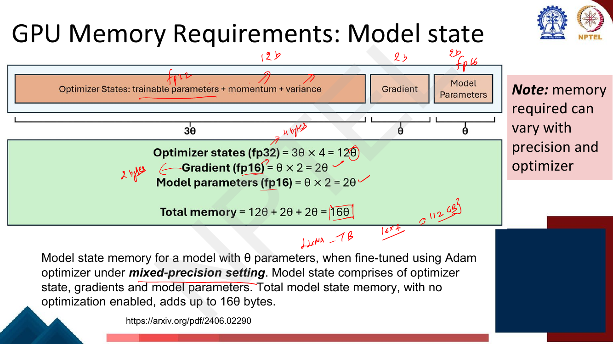
*Fig. — Note the bracket widths: the optimizer state alone is three slots wide (master weights + momentum + variance) and is stored in fp32, which is why it dominates. The lecturer's margin note reads $16 \times 7 \approx 112$ GB for a 7B model. Page 52.*

Read it bucket by bucket:

| Bucket | What it is | Precision | Bytes per parameter |
|---|---|---|---|
| **Model parameters** | the fp16 weights used in the forward pass | fp16 | $2\theta$ |
| **Gradients** | $\partial\mathcal{L}/\partial\theta$, same shape as the weights | fp16 | $2\theta$ |
| **Optimizer state** | fp32 **master copy** of the weights + Adam's **momentum** + Adam's **variance** — three slots | fp32 | $3\theta \times 4 = 12\theta$ |
| **Total model state** | | | $\mathbf{16\theta}$ **bytes** |

The two moments come from Adam: it keeps a first moment (momentum, $\mathbf{m}$) and a second moment
(uncentred variance, $\mathbf{v}$) **per parameter**, which is derived in
[Lec 10](../week-02/10-gradient-descent-and-init.md). Take that as given here — the only fact this
chapter needs is *two extra full-size tensors per parameter, in fp32*.

The deck's own caveat is on the slide: **memory required varies with precision and optimizer.** Plain
SGD has no moments at all; SGD with momentum has one. That caveat becomes the deck's "conservative"
12-byte figure later.

### Why there is an fp32 master copy

The third slot in the optimizer state surprises people: if the weights are already stored in fp16,
why store them *again* in fp32?

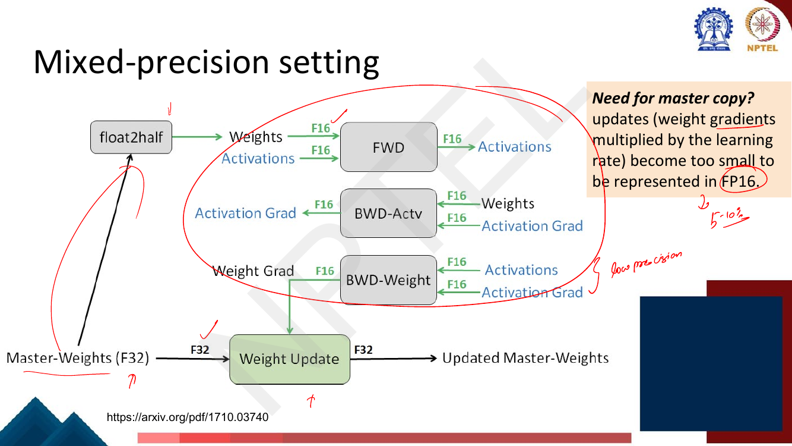
*Fig. — Everything inside the red circle runs in F16; only the weight update at the bottom runs in F32. The box on the right gives the reason: the update $\eta \cdot \nabla$ is too small to be representable in FP16. Page 53.*

**Mixed precision** means: do the expensive matrix multiplies (forward, backward) in fp16, because
they are fast and the activations are large; but do the **weight update** in fp32 on a master copy,
then cast down to fp16 for the next step.

The reason is the one the slide gives. An update is a gradient multiplied by a learning rate, so it is
typically several orders of magnitude smaller than the weight it is added to. fp16 has about 10 bits
of mantissa, so adding a number $10^{-4}$ times smaller than the weight changes nothing at all — the
update is swallowed by rounding and the model simply stops learning. The lecturer's annotation on the
slide ("5–10%") is the share of updates that vanish this way in the original paper's experiments.
Keeping a 4-byte master copy fixes it, at the cost of $4\theta$ bytes.

### Activation memory — the part people forget

Model state is only half the story. Every intermediate tensor produced in the forward pass must be
**kept alive until the backward pass consumes it**. That is activation memory, and unlike model state
it scales with your *batch size* and *sequence length*, not just with the model.

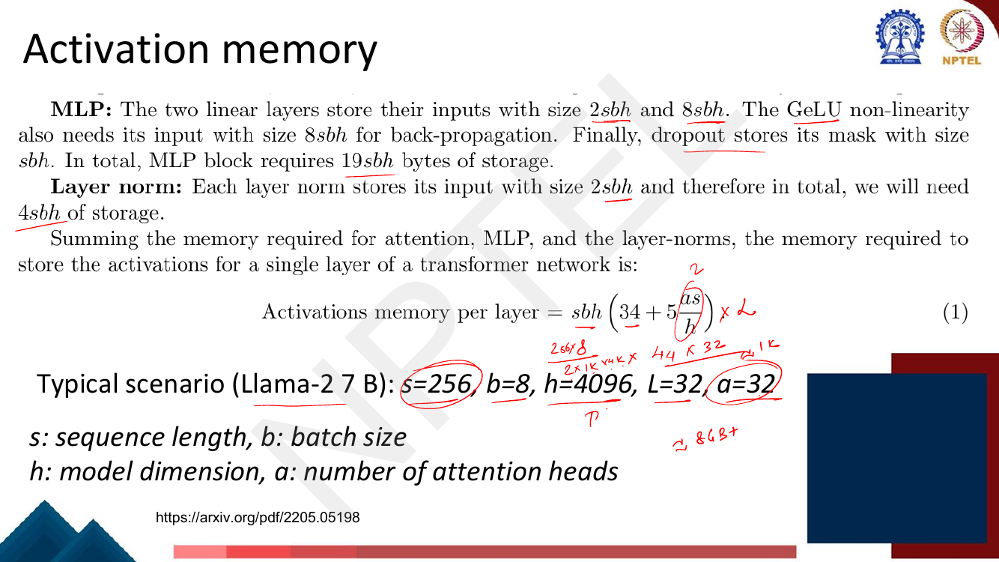
*Fig. — Note the $5as/h$ term: it is the attention matrix, and it is the one that grows **quadratically** in sequence length. The lecturer's margin arithmetic multiplies $44 \times 32 \approx 1\text{K}$ and lands on "$\approx 8$ GB+". Page 55.*

The deck builds the formula from the attention block ($11sbh + 5as^2b$ bytes), the MLP block
($19sbh$) and the layer norms ($4sbh$), giving per transformer layer

$$\text{Activation memory per layer} = sbh\left(34 + 5\frac{as}{h}\right) \text{ bytes}$$

with $s$ = sequence length, $b$ = batch size, $h$ = model dimension, $a$ = number of attention heads,
and you multiply by $L$ layers for the whole stack. Work the deck's own scenario (Llama-2 7B:
$s=256$, $b=8$, $h=4096$, $L=32$, $a=32$):

1. $sbh = 256 \times 8 \times 4096 = 8{,}388{,}608$ bytes.
2. $5as/h = 5 \times 32 \times 256 / 4096 = 40960/4096 = 10$.
3. Per-layer factor $= 34 + 10 = 44$.
4. Whole stack $= 8{,}388{,}608 \times 44 \times 32 = 11{,}811{,}160{,}064$ bytes $\approx$ **11.8 GB**
   (11.0 GiB).

The lecturer rounds $44 \times 32 = 1408$ down to $1024$ and says "$\approx$ 8 GB+"; the exact figure
is 11.8 GB. Either way the message holds: **activations alone cost more than a consumer GPU has, at a
sequence length of only 256.** Note also that the $5as^2b$ term is quadratic in $s$ — doubling the
sequence length to 512 does not double activation memory, it more than doubles it. That quadratic term
is the same one [Lec 25](../week-05/25-efficient-transformers.md) attacks with efficient-attention
schemes.

### Fine-tuning is expensive

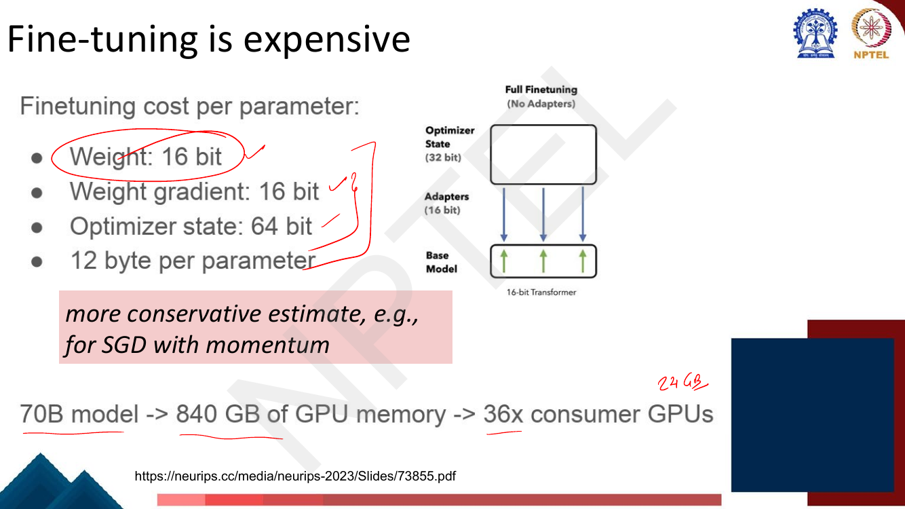
*Fig. — This slide uses the **conservative** 12-byte figure (optimizer state 64 bit, not the 96 bit that full Adam needs), as the pink box says. The lecturer writes "24 GB" next to "consumer GPUs": $840/24 = 35 \to$ 36 cards. Page 56.*

The deck now switches to a per-parameter *bit* budget, which is the form the rest of the lecture uses:

- Weight: **16 bit**
- Weight gradient: **16 bit**
- Optimizer state: **64 bit**
- Total: 96 bit = **12 byte per parameter**

This is a *more conservative* estimate than the 16-byte Adam figure — the deck's pink note says "e.g.,
for SGD with momentum". Both numbers are on the deck and both are examinable; be ready to say which
assumption each one makes.

The headline: a **70B model needs 840 GB**, which is **36 consumer GPUs**.

### Fine-tuning with LoRA — and exactly what it does not fix

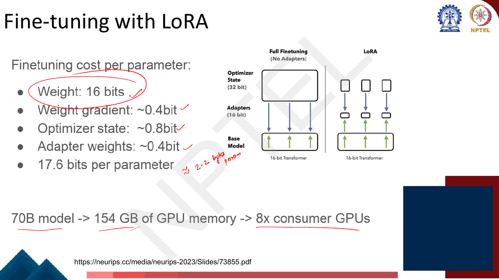
*Fig. — Compare line 1 with the previous slide: **it has not moved**. Only lines 2–4 shrank. The lecturer's note converts 17.6 bits to "≈ 2.2 bytes/param". Page 57.*

Recall [LoRA](47-lora-and-variants.md) in one sentence: freeze $\mathbf{W}$ and learn
$\Delta\mathbf{W} = \mathbf{B}\mathbf{A}$ with $\mathbf{B} \in \mathbb{R}^{d\times r}$,
$\mathbf{A} \in \mathbb{R}^{r\times k}$ and $r \ll d$. Now read the budget again:

| Bucket | Full fine-tuning | LoRA | What happened |
|---|---|---|---|
| Weight | 16 bit | **16 bit** | **unchanged — the frozen base still sits in memory** |
| Weight gradient | 16 bit | ~0.4 bit | only the adapters get gradients |
| Optimizer state | 64 bit | ~0.8 bit | only the adapters get Adam moments |
| Adapter weights | — | ~0.4 bit | new, and tiny |
| **Total** | 12 byte | **17.6 bit ≈ 2.2 byte** | 5.5× smaller |

**This is the examinable point of the lecture.** LoRA removes the *gradients* and the *optimizer
state* for the frozen weights, because you do not compute or store either for a parameter you are not
updating. It does **not** remove the weights themselves: you still run a full forward pass through the
base model, so every base weight must be resident. The ~0.4 and ~0.8 bit figures are the adapter's
gradient and optimizer cost *amortised over all base parameters* — they are small precisely because
the adapters are ~0.1–1% of the model.

Result: **70B → 154 GB → 8 consumer GPUs.** Better than 36. Still not one.

### QLoRA: a 4-bit frozen base model + LoRA adapters

The one-line idea: *if the base weights are frozen and the biggest remaining cost is storing them,
store them in fewer bits.*

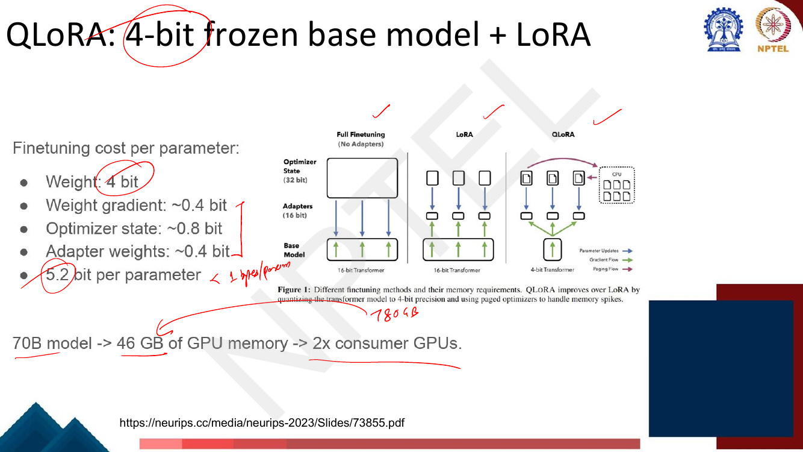
*Fig. — Only line 1 changed again, 16 bit → 4 bit, and that single change takes 154 GB to 46 GB. The figure's three panels (Full / LoRA / QLoRA) are the whole lecture in one picture; the purple "Paging Flow" arrow to CPU belongs to [Lec 49](49-qlora-2.md). Page 58.*

> **Erratum (page 58).** The four bullets sum to $4 + 0.4 + 0.8 + 0.4 = 5.6$ bits, but the slide prints
> **5.2 bit per parameter**. The 46 GB figure is consistent with **5.2** ($70\times10^9 \times 5.2/8 =
> 45.5$ GB), not with 5.6 (which gives 49 GB). The LoRA slide's arithmetic
> ($16+0.4+0.8+0.4 = 17.6$) is correct, so this is a slip on the QLoRA line only. Quote the deck's
> 5.2 bits / 46 GB pair, because they are internally consistent.

The deck then gives the saving against its own conservative baseline:

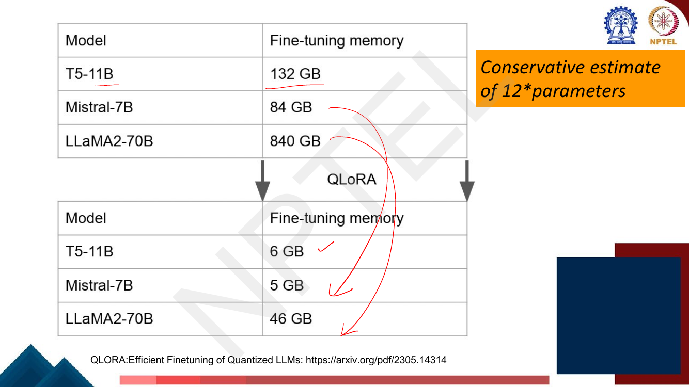
*Fig. — The top table is just $12 \times$ parameters in GB ($11\times12=132$, $7\times12=84$, $70\times12=840$). The bottom table is QLoRA's measured footprint from the QLoRA paper. The lecturer's arrows trace the 840 → 46 collapse. Page 59.*

### From LoRA to QLoRA: PTQ vs QAT

Before the mechanism, the deck draws a distinction you should be able to state:

- **Post-Training Quantization (PTQ)** — convert the weights of an *already trained* model to lower
  precision, with no retraining. Cheap, and it **may degrade performance**.
- **Quantization-Aware Training (QAT)** — integrate the weight conversion *into* training, so the
  model learns around the quantization error. Better results. **The deck files QLoRA here.**

QLoRA in the deck's two bullets: *"uses a high-precision technique to quantize a pretrained model to
4-bit"*, then *"adds a small set of learnable low-rank adapter weights, tuned by back-propagating
gradients through the quantized weights."* That second clause is what makes it QAT-flavoured: the
gradient flows *through* the 4-bit frozen weights into the 16-bit adapters, so the adapters can
compensate for quantization error.

### What is quantization?

**Quantization** is mapping a high-precision range onto a small, finite set of discrete levels, so
that each value can be stored as an index into that set instead of as a full number.

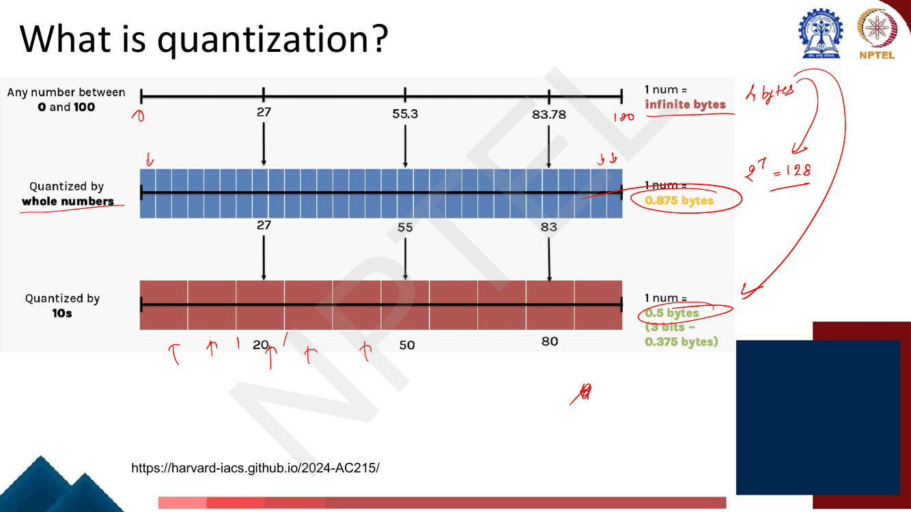
*Fig. — Follow 55.3 down the page: exact → 55 → 50. Each row is coarser and cheaper. $0.875$ bytes $=7$ bits because $2^7 = 128 \ge 101$ whole numbers; the lecturer writes $2^7 = 128$ in the margin. Page 61.*

Three readings of that slide:

1. A real number on $[0,100]$ needs unbounded precision — the slide says "**infinite bytes**".
2. Allow only whole numbers: 101 possible values, so 7 bits = **0.875 bytes** per number.
3. Allow only multiples of 10: 11 possible values, so 4 bits = **0.5 bytes** (the slide notes 3 bits
   $\approx 0.375$ bytes would do if you had 8 levels).

And notice the cost: 55.3 became 55, then 50. **Quantization is lossy by construction.** The whole
design problem is *where to put the levels* so the loss hurts least.

### Absmax quantization, the quantization constant, and dequantization

The deck's scheme is **absmax** (absolute-maximum, symmetric) quantization. To go from fp32 to int8:

$$\mathbf{X}^{\text{Int8}} = \operatorname{round}\!\left(\frac{127}{\operatorname{absmax}(\mathbf{X}^{\text{FP32}})}\,\mathbf{X}^{\text{FP32}}\right) = \operatorname{round}\!\left(c^{\text{FP32}}\,\mathbf{X}^{\text{FP32}}\right)$$

Three pieces:

- **127** is the largest magnitude a signed 8-bit integer can hold (the deck says the range is $-127$
  to $127$ — symmetric, so the code for $-128$ goes unused).
- $\operatorname{absmax}(\mathbf{X}) = \max_i |x_i|$ is the largest magnitude actually present.
- $c^{\text{FP32}} = 127/\operatorname{absmax}(\mathbf{X})$ is the **scale factor**, which the deck
  calls the **quantization constant**. It stretches the data so its extreme value lands exactly on the
  extreme code. It must be **stored alongside the quantized tensor** — you cannot recover anything
  without it. (Storing one $c$ per small *block* rather than per tensor, and then quantizing the $c$s
  themselves, is **double quantization** → [Lec 49](49-qlora-2.md).)

To **dequantize**, divide it back out:

$$\mathbf{X}^{\text{FP32}} = \frac{\mathbf{X}^{\text{Int8}}}{c^{\text{FP32}}}$$

The deck works this through six pages (62–67) on a ten-element array; N4 reproduces every step. Its one
structural guarantee is worth stating now: the element equal to the absmax maps to exactly $\pm 127$,
so **the extreme value of the tensor is always represented exactly**.

You do not get the original back. The round-trip is $\hat{x}_i = \operatorname{round}(cx_i)/c$, and
the error is bounded by half a step:

$$|\hat{x}_i - x_i| \le \frac{1}{2c} = \frac{\operatorname{absmax}(\mathbf{X})}{2 \times 127}$$

The deck calls this the **dequantization error**. Note what the bound depends on: the *absmax*. One
large outlier inflates $\operatorname{absmax}$, which shrinks $c$, which coarsens the grid for
*every* value in the tensor. That is the practical weakness of absmax quantization and the reason real
implementations quantize in small blocks.

### QLoRA's three major innovations

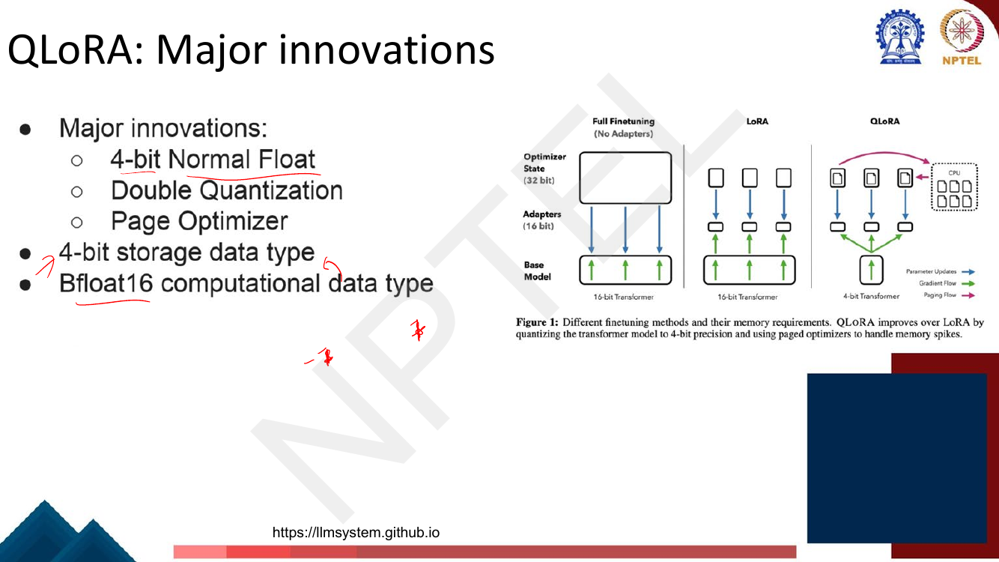
*Fig. — The last two lines are the key architectural statement: QLoRA **stores** in 4 bits but **computes** in bfloat16 — weights are dequantized on the fly, one block at a time, for each matrix multiply. Page 68.*

1. **4-bit NormalFloat (NF4)** — this chapter, below.
2. **Double Quantization** — [Lec 49](49-qlora-2.md).
3. **Paged Optimizers** — [Lec 49](49-qlora-2.md).

Plus the storage/compute split: **4-bit storage data type, bfloat16 computational data type.**

### QLoRA ingredient 1: 4-bit NormalFloat (NF4)

4 bits gives you $2^4 = 16$ buckets. The question NF4 answers is *where to put them*.

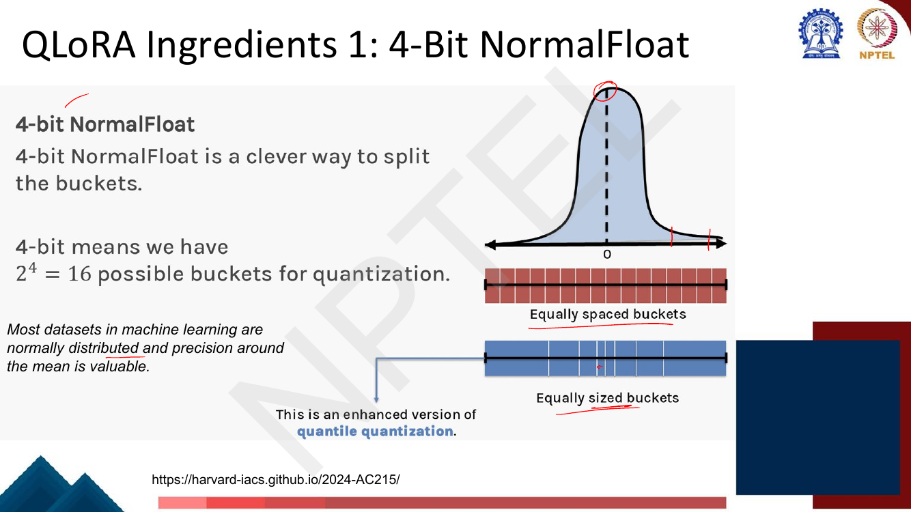
*Fig. — The red strip (equally spaced) puts most of its buckets in the tails where almost no weights live; the blue strip (equally sized) crowds them near 0 where almost all weights live. Page 69.*

The argument, in three steps:

1. **Neural network weights are approximately normally distributed**, zero-mean. The slide states it
   as "most datasets in machine learning are normally distributed and **precision around the mean is
   valuable**."
2. **Uniform (equally spaced) quantization ignores that.** Its 16 levels are spread evenly across
   $[-\text{absmax}, +\text{absmax}]$, so several of them sit far out in the tails where essentially
   no weight ever lands — wasted codes — while the dense region near zero, where the overwhelming
   majority of weights are, gets only two or three levels.
3. **NF4 instead places its levels at the quantiles of a normal distribution** — "equally sized
   buckets". Each bucket then holds **roughly equal probability mass**, i.e. roughly the same number
   of weights. The deck calls this "an enhanced version of **quantile quantization**".

Why equal mass is the right target: if every code is used equally often, the code is
**information-theoretically optimal** for that distribution — all 4 bits carry a full bit of
information each. A code that sends 60% of its values to one level is wasting most of its 16 symbols.

#### The exact values of the NF4 data type

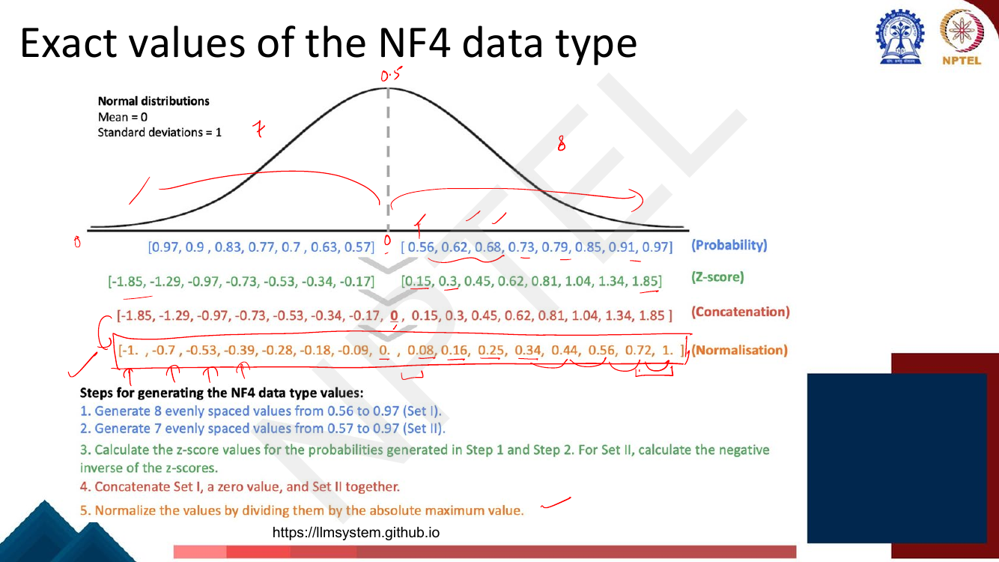
*Fig. — Read it bottom-to-top: the orange row is the actual data type; the rows above show where it came from. Note the asymmetry the lecturer marks "7" on the left and "8" on the right. Page 70.*

The deck's five construction steps, verbatim:

1. Generate **8** evenly spaced values from **0.56 to 0.97** (Set I).
2. Generate **7** evenly spaced values from **0.57 to 0.97** (Set II).
3. Calculate the **z-score** values for the probabilities in Step 1 and Step 2. For Set II, calculate
   the negative inverse of the z-scores.
4. **Concatenate** Set I, a zero value, and Set II together.
5. **Normalize** the values by dividing them by the absolute maximum value.

and the four rows it prints:

| Row | Negative side (7) | | Positive side (8) |
|---|---|---|---|
| **Probability** | 0.97, 0.9, 0.83, 0.77, 0.7, 0.63, 0.57 | — | 0.56, 0.62, 0.68, 0.73, 0.79, 0.85, 0.91, 0.97 |
| **Z-score** | −1.85, −1.29, −0.97, −0.73, −0.53, −0.34, −0.17 | — | 0.15, 0.3, 0.45, 0.62, 0.81, 1.04, 1.34, 1.85 |
| **Concatenation** | −1.85, −1.29, −0.97, −0.73, −0.53, −0.34, −0.17 | **0** | 0.15, 0.3, 0.45, 0.62, 0.81, 1.04, 1.34, 1.85 |
| **Normalisation (÷ 1.85)** | −1.0, −0.7, −0.53, −0.39, −0.28, −0.18, −0.09 | **0** | 0.08, 0.16, 0.25, 0.34, 0.44, 0.56, 0.72, 1.0 |

**The NF4 data type, as printed on the deck:**

$$\{-1.0,\, -0.7,\, -0.53,\, -0.39,\, -0.28,\, -0.18,\, -0.09,\, 0,\, 0.08,\, 0.16,\, 0.25,\, 0.34,\, 0.44,\, 0.56,\, 0.72,\, 1.0\}$$

Four things to take from this:

- **Why z-scores at all.** A probability $p$ maps to the value $z$ with $\Phi(z) = p$, i.e. the
  $p$-quantile of the standard normal. Evenly spaced *probabilities* therefore become unevenly spaced
  *values* — densely packed near 0 and far apart in the tails. That is exactly the "equally sized
  buckets" picture.
- **Why 0.97 and not 1.0.** $\Phi^{-1}(1) = \infty$. You have to stop short of the tail, so the
  construction uses an offset (the deck rounds it to 0.97) and then rescales so the extreme level is
  exactly $\pm 1.0$. That makes the type *normalised*: NF4 values live in $[-1, 1]$, which is why you
  divide your tensor by its absmax before quantizing.
- **It is asymmetric: 8 positive levels, 7 negative, plus one exact zero.** 7 + 1 + 8 = 16. This is
  deliberate — using 8 on both sides plus a zero would need 17 codes. **An exact zero is essential**:
  padding, masked positions and pruned weights must map to exactly 0.0, not to 0.03.
- The spacing near zero is 0.08–0.09; the spacing near the ends is 0.28. **Three and a half times the
  resolution near the mean**, which is where the weights are.

Compare with a uniform signed 4-bit grid, which can only offer $k/7$ for $k = -7,\ldots,7$: 15 levels
(one code wasted), evenly spaced at $0.143$ everywhere. NF4 has finer resolution than that near zero
and coarser in the tails, which is the right trade for Gaussian data. N5 measures the difference.

#### The deck's 2-bit worked example

![Slide: QLoRA quantization example for 2-bit — map {index 0,1,2,3 → values −1.0, 0.3, 0.5, 1.0}, input tensor [10, −3, 5, 4], four numbered steps through normalize, find closest, store index, dequantize](../../assets/pages/lec48/p-71.png)
*Fig. — A 2-bit toy with the same four-step procedure NF4 uses at 4 bits; the orange box says "we saw how to get these values for NF4". Follow the $-3$: it comes back as $+3$. Page 71.*

The deck's general recipe, which applies verbatim to NF4:

1. **Normalize** $\mathbf{X}$ into $[-1.0, 1.0]$ by dividing by $\operatorname{absmax}(\mathbf{X})$.
2. **Find the closest value in the data type** (rounding for integers; in general, **binary search**
   over the sorted level table).
3. Store the **index**, not the value.
4. **Dequantize**: load index → look up → denormalize by multiplying by $\operatorname{absmax}$.

Step 3 is the whole point. With 16 levels you store a 4-bit index per weight; the level *table* is 16
numbers stored once for the entire model, and the absmax is one number per block. Step 2's binary
search is why a non-uniform type costs no more storage than a uniform one — only a table lookup.

It is worked in full as N6 below.

### Quantization and pruning

Quantization makes each weight cheaper; **pruning** removes weights entirely; **distillation** trains
a smaller model to imitate a larger one. All three are compression, and
[Lec 50](50-pruning-and-distillation.md) contrasts them directly.

## Worked numericals

**None of pages 50–73 is a "Try this problem" exercise page** — this deck has no student exercise in
range. Pages 62–67 and page 71 are the *lecturer's own worked examples*, with answers printed; N4 and
N6 reproduce them and check them. The rest are built to the deck's formulas.

### N1. Full fine-tuning memory for a 7B model under mixed-precision Adam
**Given:** $\theta = 7 \times 10^9$ parameters, Adam, mixed precision, the page-52 accounting.
**Find:** memory per bucket and the total; does it fit a 24 GB card?

1. **fp16 model parameters:** $2\theta = 2 \times 7\times10^9 = 14\times10^9$ bytes $= 14$ GB.
2. **fp16 gradients:** $2\theta = 14$ GB.
3. **fp32 master weights:** $4\theta = 28$ GB.
4. **Adam first moment $\mathbf{m}$ (fp32):** $4\theta = 28$ GB.
5. **Adam second moment $\mathbf{v}$ (fp32):** $4\theta = 28$ GB.
6. Optimizer state (3, 4, 5 together) $= 12\theta = 84$ GB — **75% of the total**.
7. Total model state $= 14 + 14 + 84 = 16\theta = 112 \times 10^9$ bytes $= \mathbf{112}$ **GB**.
8. Against a 24 GB consumer card: $112/24 = 4.67$, so **5 cards minimum**, and that is before a single
   byte of activations (another ~11.8 GB at $s{=}256$, $b{=}8$ — see the activation derivation above).

**Answer:** **112 GB** of model state; it does **not** fit on a 24 GB GPU, by a factor of 4.7. Using
the deck's *conservative* 12 bytes/parameter instead gives $7 \times 12 = 84$ GB — still 3.5 cards.
The same accounting at 70B: $70 \times 12 = \mathbf{840}$ **GB** $\to$ $840/24 = 35 \to$ **36 consumer
GPUs**, which is exactly the deck's page-56 claim.

### N2. The same 7B model under LoRA
**Given:** the page-57 budget — weight 16 bit, gradient ~0.4 bit, optimizer state ~0.8 bit, adapter
weights ~0.4 bit.
**Find:** what disappeared, what did not, and the new total.

1. **Weights: 16 bit — unchanged.** The base model is frozen but still resident for the forward pass.
   $7\times10^9 \times 2 = 14$ GB.
2. **Gradients: 16 → ~0.4 bit.** You only differentiate w.r.t. the adapters, so 97.5% of the gradient
   memory is gone: $7\times10^9 \times 0.4/8 = 0.35$ GB.
3. **Optimizer state: 64 → ~0.8 bit.** Adam's two moments exist only for the adapters:
   $7\times10^9 \times 0.8/8 = 0.70$ GB.
4. **Adapter weights: ~0.4 bit**, a new cost: $0.35$ GB.
5. Total $= 16 + 0.4 + 0.8 + 0.4 = \mathbf{17.6}$ **bits/parameter** $= 2.2$ bytes/parameter.
6. $7\times10^9 \times 2.2 = \mathbf{15.4}$ **GB**.
7. Ratio against full fine-tuning's conservative 84 GB: $12/2.2 = 5.45\times$ smaller.

**Answer:** **15.4 GB**, down from 84 GB. **The weights line did not move**: of the 17.6 bits, **16 —
91% — is still the frozen base model.** LoRA has made the optimizer free and left the base model
exactly as expensive as it was. At 70B this is $70 \times 2.2 = \mathbf{154}$ **GB** $\to$ **8
consumer GPUs** (the deck's page-57 figure).

### N3. The same 7B model under QLoRA
**Given:** the page-58 budget — weight **4 bit**, everything else as in N2.
**Find:** the new total, and whether it fits one card.

1. The only line that changes is the one LoRA could not touch: $16 \to 4$ bits.
2. Deck's printed total: **5.2 bit per parameter** (see the page-58 erratum above; the bullets sum to
   5.6).
3. $7\times10^9 \times 5.2/8 = 7\times10^9 \times 0.65 = \mathbf{4.55}$ **GB**.
4. Add the deck's typical-scenario activations (11.8 GB) and you are at ~16.4 GB — **inside a 24 GB
   card**, which neither of the previous two settings came close to.
5. At 70B: $70\times10^9 \times 5.2/8 = 45.5 \approx \mathbf{46}$ **GB** $\to$ **2 consumer GPUs**.

**Answer:** **4.55 GB** of model state for 7B — it fits on a single 24 GB GPU with room for
activations. The full chain, in the deck's own numbers for 70B: **840 GB → 154 GB → 46 GB**, i.e. 36
GPUs → 8 GPUs → 2 GPUs. Learn that chain; it is the single most examinable thing in Week 10.

### N4. The deck's FP32 → Int8 example (pages 62–67), reproduced and checked
**Given:** $\mathbf{X}^{\text{FP32}} = [1.5,\, 2.3,\, 3.7,\, 4.1,\, 5.6,\, 6.8,\, 7.9,\, 8.4,\, 9.2,\, 10.2]$.
**Find:** the quantization constant, the Int8 codes, the dequantized values, and the error.

1. $\operatorname{absmax}(\mathbf{X}) = 10.2$.
2. $c^{\text{FP32}} = 127/10.2 = \mathbf{12.4509}$ (the deck's figure, page 65).
3. Multiply and round:

| $x$ | $c\,x$ | round | deck prints | $\hat{x} = q/c$ | $\lvert\hat{x}-x\rvert$ |
|---|---|---|---|---|---|
| 1.5 | 18.6765 | **19** | **18** ✗ | 1.5260 | 0.0260 |
| 2.3 | 28.6373 | 29 | 29 ✓ | 2.3291 | 0.0291 |
| 3.7 | 46.0686 | 46 | 46 ✓ | 3.6945 | 0.0055 |
| 4.1 | 51.0490 | 51 | 51 ✓ | 4.0961 | 0.0039 |
| 5.6 | 69.7255 | **70** | **69** ✗ | 5.6220 | 0.0220 |
| 6.8 | 84.6667 | 85 | 85 ✓ | 6.8268 | 0.0268 |
| 7.9 | 98.3627 | 98 | 98 ✓ | 7.8709 | 0.0291 |
| 8.4 | 104.5882 | 105 | 105 ✓ | 8.4331 | 0.0331 |
| 9.2 | 114.5490 | 115 | 115 ✓ | 9.2362 | 0.0362 |
| 10.2 | 127.0000 | 127 | 127 ✓ | 10.2000 | 0.0000 |

4. Error bound check: $\tfrac{1}{2c} = 1/24.902 = 0.0402$, and the largest observed error is 0.0362.
   Within bound ✓.
5. **Erratum.** $18.6765$ rounds to **19**, not 18, and $69.7255$ rounds to **70**, not 69. The deck
   prints 18 and 69 — those two entries are truncated rather than rounded, while the other eight
   (e.g. $84.6667 \to 85$) are correctly rounded. The slide is internally inconsistent. In an exam,
   apply the printed formula, which says $\operatorname{round}$.
6. Now redo it at **4 bits** ($q_{\max} = 2^3 - 1 = 7$): $c = 7/10.2 = 0.68627$, codes
   $[1,2,3,3,4,5,5,6,6,7]$, dequantized
   $[1.457, 2.914, 4.371, 4.371, 5.829, 7.286, 7.286, 8.743, 8.743, 10.2]$, total absolute error
   **3.729** against int8's **0.212**.

**Answer:** $c = 12.4509$; codes $[19, 29, 46, 51, 70, 85, 98, 105, 115, 127]$ (the deck prints 18 and
69 in positions 1 and 5); maximum dequantization error $0.0362$. Dropping to 4 bits multiplies the
total error by **17.6×** — which is the problem NF4 exists to soften. Note too that 4-bit *collapsed*
distinct inputs: 3.7 and 4.1 both became 4.371.

### N5. NF4 vs uniform 4-bit on normally distributed weights
**Given:** a block of weights $\mathbf{w} = [0.12,\, -0.35,\, 0.78,\, -1.60,\, 0.05,\, 0.42,\, -0.21,\, 1.10]$
(zero-centred, bell-shaped). Quantize to 4 bits two ways and compare total error.
**Find:** which data type loses less.

1. $\operatorname{absmax}(\mathbf{w}) = 1.60$. Normalise:
   $\mathbf{w}/1.6 = [0.075,\, -0.21875,\, 0.4875,\, -1.0,\, 0.03125,\, 0.2625,\, -0.13125,\, 0.6875]$.
2. **Uniform int4** levels: $k/7$, $k = -7\ldots 7$, i.e. steps of $0.1429$.
3. **NF4** levels: the 16 values from page 70.
4. Nearest-level assignment and reconstruction ($\times 1.6$):

| $w$ | $w/1.6$ | uniform level | recon | err | NF4 level | recon | err |
|---|---|---|---|---|---|---|---|
| 0.12 | 0.0750 | 0.1429 | 0.2286 | 0.1086 | **0.08** | 0.1280 | **0.0080** |
| −0.35 | −0.2188 | −0.2857 | −0.4571 | 0.1071 | **−0.18** | −0.2880 | **0.0620** |
| 0.78 | 0.4875 | 0.4286 | 0.6857 | 0.0943 | **0.44** | 0.7040 | **0.0760** |
| −1.60 | −1.0000 | −1.0000 | −1.6000 | 0.0000 | −1.00 | −1.6000 | 0.0000 |
| 0.05 | 0.0313 | 0.0000 | 0.0000 | 0.0500 | 0.00 | 0.0000 | 0.0500 |
| 0.42 | 0.2625 | 0.2857 | 0.4571 | 0.0371 | **0.25** | 0.4000 | **0.0200** |
| −0.21 | −0.1313 | −0.1429 | −0.2286 | 0.0186 | −0.09 | −0.1440 | 0.0660 |
| 1.10 | 0.6875 | 0.7143 | 1.1429 | 0.0429 | **0.72** | 1.1520 | **0.0520** |

5. Totals: uniform $\sum|{\cdot}| = \mathbf{0.4586}$, MSE $= 0.004777$. NF4
   $\sum|{\cdot}| = \mathbf{0.3340}$, MSE $= 0.002455$.
6. At scale (100,000 draws from $\mathcal{N}(0,1)$, same procedure): uniform MSE $= 0.0380$, NF4
   MSE $= 0.0162$ — NF4 is **2.35× better**.

**Answer:** NF4 wins, with 27% less total absolute error on this block and **49% less MSE**; on a
genuinely Gaussian tensor the MSE gap widens to 2.35×. Trace *where* it wins: the small values
(0.12, 0.42) land on levels NF4 has and uniform does not. Where it loses — the single value at −0.21 —
is in the mid-range that uniform's even spacing happens to cover. **NF4 trades tail accuracy for
centre accuracy, and that is the right trade only because the data is normal.** On uniformly
distributed data it would lose.

### N6. The deck's 2-bit quantization example (page 71), step by step
**Given:** the 2-bit data type $\{$index 0,1,2,3 $\to$ values $-1.0,\, 0.3,\, 0.5,\, 1.0\}$ and the
input tensor $\mathbf{X} = [10,\, -3,\, 5,\, 4]$.
**Find:** the stored indices and the dequantized tensor.

1. **Normalize with absmax.** $\operatorname{absmax}(\mathbf{X}) = 10$, so
   $\mathbf{X}/10 = [1,\, -0.3,\, 0.5,\, 0.4]$.
2. **Find the closest value in the data type.** Distances to $\{-1.0, 0.3, 0.5, 1.0\}$:
   - $1 \to$ exactly $1.0$.
   - $-0.3 \to$ $|{-0.3}-(-1.0)| = 0.7$, $|{-0.3}-0.3| = \mathbf{0.6}$, $|{-0.3}-0.5| = 0.8$,
     $|{-0.3}-1.0| = 1.3$. Nearest is $\mathbf{0.3}$ — a **positive** level.
   - $0.5 \to$ exactly $0.5$.
   - $0.4 \to |0.4-0.3| = 0.1$ and $|0.4-0.5| = 0.1$ — a **tie**; the deck breaks it upward to $0.5$.

   Result: $[1.0,\, 0.3,\, 0.5,\, 0.5]$.
3. **Find the associated index** and store it: $[3,\, 1,\, 2,\, 2]$ — four 2-bit codes, 1 byte total
   (versus 16 bytes as fp32).
4. **Dequantize.** Load $[3,1,2,2]$ → look up $[1.0, 0.3, 0.5, 0.5]$ → denormalize ($\times 10$) →
   $[10,\, 3,\, 5,\, 5]$.
5. Errors: $10 \to 10$ (0), $-3 \to +3$ (**6**), $5 \to 5$ (0), $4 \to 5$ (1).

**Answer:** indices $[3, 1, 2, 2]$, dequantized $[10,\, 3,\, 5,\, 5]$ — the deck's answer exactly. The
instructive failure is the second element: **$-3$ comes back as $+3$, a sign flip**, because this toy
data type has only one negative level and $-0.3$ is closer to $+0.3$ than to $-1.0$. That is what a
badly-placed level grid does, and it is precisely why NF4 spends 7 of its 16 codes on the negative
side with fine spacing near zero.

## Code

```python
import numpy as np

# ---------- absmax quantize / dequantize to n bits -----------------------
def absmax_quantize(x, bits):
    """Symmetric absmax quantization. Returns (scale c, integer codes, dequantized)."""
    qmax = 2 ** (bits - 1) - 1              # 127 for int8, 7 for int4
    c = qmax / np.abs(x).max()              # the 'quantization constant'
    q = np.round(c * x).astype(int)         # X^Int = round(c * X^FP32)
    return c, q, q / c                      # dequantize: X^FP32 = X^Int / c

X = np.array([1.5, 2.3, 3.7, 4.1, 5.6, 6.8, 7.9, 8.4, 9.2, 10.2])  # the deck's array
for bits in (8, 4):
    c, q, dq = absmax_quantize(X, bits)
    err = np.abs(dq - X)
    print(f"{bits}-bit: c={c:.4f}  q={q}")
    print(f"        dequant={np.round(dq,3)}")
    print(f"        total|err|={err.sum():.4f}  max|err|={err.max():.4f}  bound={1/(2*c):.4f}")
# 8-bit: c=12.4509  q=[ 19  29  46  51  70  85  98 105 115 127]
#         dequant=[ 1.526  2.329  3.694  4.096  5.622  6.827  7.871  8.433  9.236 10.2  ]
#         total|err|=0.2118  max|err|=0.0362  bound=0.0402
# 4-bit: c=0.6863  q=[1 2 3 3 4 5 5 6 6 7]
#         dequant=[ 1.457  2.914  4.371  4.371  5.829  7.286  7.286  8.743  8.743 10.2  ]
#         total|err|=3.7286  max|err|=0.6714  bound=0.7286
# NOTE: the deck prints 18 and 69 in positions 1 and 5; round() gives 19 and 70.

# ---------- NF4 (quantile levels) vs uniform int4 ------------------------
NF4 = np.array([-1.0, -0.7, -0.53, -0.39, -0.28, -0.18, -0.09, 0.0,
                 0.08,  0.16, 0.25,  0.34,  0.44,  0.56,  0.72, 1.0])   # the deck's 16 values
UNIFORM = np.arange(-7, 8) / 7.0                                        # 15 evenly spaced levels

def levelwise_quantize(x, levels):
    """Normalize by absmax, snap to nearest level (step 2 of the deck's recipe), denormalize."""
    s = np.abs(x).max()
    idx = np.abs(levels[None, :] - (x / s)[:, None]).argmin(axis=1)      # 'binary search'
    return idx, levels[idx] * s

w = np.array([0.12, -0.35, 0.78, -1.60, 0.05, 0.42, -0.21, 1.10])       # N5's block
for name, lv in (("NF4", NF4), ("uniform int4", UNIFORM)):
    idx, rec = levelwise_quantize(w, lv)
    print(f"{name:13s} recon={np.round(rec,4)}  sum|err|={np.abs(rec-w).sum():.4f}"
          f"  MSE={np.mean((rec-w)**2):.6f}")
# NF4           recon=[ 0.128 -0.288  0.704 -1.6    0.     0.4   -0.144  1.152]  sum|err|=0.3340  MSE=0.002455
# uniform int4  recon=[ 0.2286 -0.4571  0.6857 -1.6     0.      0.4571 -0.2286  1.1429]  sum|err|=0.4586  MSE=0.004777

g = np.random.default_rng(0).standard_normal(100_000)                   # genuinely Gaussian weights
for name, lv in (("NF4", NF4), ("uniform int4", UNIFORM)):
    _, rec = levelwise_quantize(g, lv)
    print(f"{name:13s} 100k N(0,1): MSE={np.mean((rec-g)**2):.6f}")
# NF4           100k N(0,1): MSE=0.016206
# uniform int4  100k N(0,1): MSE=0.038046      <- 2.35x worse

# ---------- the deck's 2-bit example, page 71 ---------------------------
TWOBIT = np.array([-1.0, 0.3, 0.5, 1.0])
idx, rec = levelwise_quantize(np.array([10.0, -3.0, 5.0, 4.0]), TWOBIT)
print("2-bit indices:", idx, " dequantized:", rec)
# 2-bit indices: [3 1 2 2]  dequantized: [10.  3.  5.  5.]   <- matches the slide; -3 -> +3
```

Every printed number above matches N4, N5 and N6 by hand. The one place code and slide disagree is
flagged in the comment: `np.round` gives 19 and 70 where the deck prints 18 and 69.

## Exam pack

### Must-memorise

| Item | Exactly this |
|---|---|
| Model state (Adam, mixed precision) | $2\theta$ (fp16 weights) $+\,2\theta$ (fp16 grads) $+\,12\theta$ (fp32 optimizer) $= \mathbf{16\theta}$ bytes |
| The 3 slots inside the optimizer state | fp32 **master weights** + Adam **momentum** + Adam **variance**, 4 bytes each |
| Deck's conservative budget | weight 16 bit + grad 16 bit + optimizer 64 bit $= 96$ bit $= \mathbf{12}$ **bytes/param** |
| Why an fp32 master copy | $\eta\nabla$ is too small to be representable in FP16 — the update vanishes |
| Activation memory per layer | $sbh\left(34 + 5\dfrac{as}{h}\right)$ bytes; $\times L$ for the stack |
| LoRA per-parameter cost | 16 + 0.4 + 0.8 + 0.4 $= \mathbf{17.6}$ bit $\approx 2.2$ byte |
| QLoRA per-parameter cost | weight **4 bit** + 0.4 + 0.8 + 0.4; deck prints **5.2 bit** |
| What LoRA removes / does not | removes **gradients and optimizer state** for frozen weights; **does not** remove the weights |
| Absmax quantization | $\mathbf{X}^{\text{Int8}} = \operatorname{round}\!\big(c^{\text{FP32}}\mathbf{X}^{\text{FP32}}\big)$, $c^{\text{FP32}} = \dfrac{127}{\operatorname{absmax}(\mathbf{X}^{\text{FP32}})}$ |
| Dequantization | $\mathbf{X}^{\text{FP32}} = \mathbf{X}^{\text{Int8}} / c^{\text{FP32}}$ |
| Quantization constant | the scale $c$; must be stored with the tensor |
| PTQ vs QAT | PTQ = convert after training, may degrade; QAT = convert during training, better — **QLoRA is QAT** |
| QLoRA's 3 innovations | **4-bit NormalFloat**, **Double Quantization**, **Paged Optimizers** |
| QLoRA storage / compute types | **4-bit storage**, **bfloat16 computation** |
| NF4 idea | weights are ~normally distributed → place the 16 levels at **normal quantiles**, so buckets hold **equal probability mass** |
| NF4 values | $-1.0,\,-0.7,\,-0.53,\,-0.39,\,-0.28,\,-0.18,\,-0.09,\,0,\,0.08,\,0.16,\,0.25,\,0.34,\,0.44,\,0.56,\,0.72,\,1.0$ |
| NF4 split | **7 negative + exact 0 + 8 positive** = 16 |
| Quantization recipe | normalize by absmax → nearest level (binary search) → **store the index** → dequantize = lookup + denormalize |

### Numbers worth knowing

| Quantity | Value |
|---|---|
| Bytes per parameter, full fine-tuning (Adam, mixed precision) | **16** |
| Bytes per parameter, deck's conservative estimate | **12** |
| Bits per parameter — full / LoRA / QLoRA | 96 / **17.6** / **5.2** |
| 70B model: full fine-tuning | **840 GB** → **36×** consumer GPUs |
| 70B model: LoRA | **154 GB** → **8×** consumer GPUs |
| 70B model: QLoRA | **46 GB** → **2×** consumer GPUs |
| Deck's QLoRA table (full → QLoRA) | T5-11B 132 → **6 GB**; Mistral-7B 84 → **5 GB**; LLaMA2-70B 840 → **46 GB** |
| Consumer GPU assumed | **24 GB** |
| Int8 range used | $-127$ to $127$ (symmetric; $-128$ unused) |
| Deck's example: absmax / $c$ | $10.2$ / $127/10.2 = \mathbf{12.4509}$ |
| Deck's Int8 output | 18, 29, 46, 51, 69, 85, 98, 105, 115, 127 *(18 and 69 are mis-rounded; see N4)* |
| 4-bit buckets | $2^4 = \mathbf{16}$ |
| Activation scenario (Llama-2 7B) | $s{=}256$, $b{=}8$, $h{=}4096$, $L{=}32$, $a{=}32$ → per-layer factor 44 → **≈ 11.8 GB** (deck says "≈ 8 GB+") |
| Attention-block activation cost | $11sbh + 5as^2b$; MLP $19sbh$; layer norms $4sbh$ |
| NF4 construction probabilities | Set I: 8 values 0.56→0.97; Set II: 7 values 0.57→0.97 |
| NF4 normalisation divisor | $1.85$ (the extreme z-score) |

### Likely MCQ traps

- **"LoRA removes the memory cost of the base model."** It does **not**. LoRA removes gradients and
  optimizer state for frozen weights; the 16-bit weights themselves are untouched (16 of LoRA's 17.6
  bits). Removing *them* is QLoRA's job.
- **"The optimizer state is just the two Adam moments."** The deck's $12\theta$ is **three** fp32
  slots: master weights **plus** momentum **plus** variance. Counting only the moments gives $8\theta$
  and a total of $12\theta$ — which happens to collide numerically with the deck's *other*,
  conservative figure. Know which slide you are being asked about.
- **12 bytes vs 16 bytes per parameter.** $16\theta$ is the page-52 Adam/mixed-precision figure;
  $12\theta$ is the page-56 *conservative* figure ("e.g. SGD with momentum"). Both are on the deck.
- **"Quantization is lossless if you keep the scale factor."** No. The $\operatorname{round}$ step
  destroys information permanently; the scale only undoes the stretching.
- **"NF4 levels are equally spaced."** The opposite. Equally spaced is the *uniform* type NF4 is
  arguing against; NF4's buckets are equally *sized in probability*, so its levels are dense near 0
  and sparse in the tails.
- **"NF4 has 8 positive and 8 negative values."** 7 negative, 8 positive, plus an exact zero. An exact
  zero is mandatory, which is why the split is odd.
- **"NF4 is better than uniform quantization for any data."** Only for approximately **normally
  distributed** data. On uniform data its clustering near zero is a liability.
- **Which innovation is which.** NF4 = the *data type*. Double quantization = quantizing the
  *quantization constants* ([Lec 49](49-qlora-2.md)). Paged optimizers = NVIDIA unified memory for
  optimizer-state **spikes** ([Lec 49](49-qlora-2.md)). Don't swap them.
- **"QLoRA computes in 4 bits."** It **stores** in 4 bits and **computes** in bfloat16 — weights are
  dequantized on the fly.
- **"QLoRA is post-training quantization."** The deck classifies it under **QAT**, because gradients
  are back-propagated through the quantized weights into the adapters.
- **Forgetting activations.** Model state is not the whole GPU budget. At $b{=}8$, $s{=}256$,
  Llama-2 7B's activations alone are ~11.8 GB — more than the QLoRA model state.
- **"Quantization and pruning are the same compression."** Quantization keeps every weight and shrinks
  each one; pruning deletes weights ([Lec 50](50-pruning-and-distillation.md)).
- **$c$ vs $1/c$.** You **multiply** by $c$ to quantize and **divide** by $c$ to dequantize. Inverting
  that gives nonsense by a factor of $c^2$.

### Self-test

1. A model has 13B parameters. Give the model-state memory for full fine-tuning with Adam in mixed precision.
2. Which *three* tensors make up the $12\theta$ optimizer state, and in what precision?
3. Why does mixed-precision training keep an fp32 master copy of the weights?
4. Under LoRA, which memory bucket is unchanged relative to full fine-tuning, and what fraction of LoRA's 17.6 bits is it?
5. Quantize $\mathbf{X} = [2.0, -4.0, 8.0]$ to Int8 with absmax. Give $c$, the codes and the dequantized values.
6. Write down the 16 NF4 values. How many are negative, and why is that number not 8?
7. State the deck's 70B memory chain for full fine-tuning, LoRA and QLoRA, with the GPU counts.
8. Using the 2-bit type $\{-1.0, 0.3, 0.5, 1.0\}$, quantize and dequantize $[-8, 2, 8]$.
9. Compute activation memory per layer for $s{=}512$, $b{=}4$, $h{=}4096$, $a{=}32$. Compare with $s{=}256$, $b{=}8$ (same token count).
10. Is QLoRA PTQ or QAT, and what one fact decides it?
11. Why is an exact 0.0 level essential in a weight data type?

<details><summary>Answers</summary>

1. $16 \times 13\times10^9 = 208$ GB. (Breakdown: 26 GB fp16 weights + 26 GB fp16 grads + 156 GB fp32 optimizer state.)
2. The fp32 **master copy of the weights**, Adam's **first moment** (momentum) and Adam's **second moment** (variance) — 4 bytes each, $3\theta \times 4 = 12\theta$.
3. The update $\eta\nabla$ is orders of magnitude smaller than the weight; in FP16 it rounds away entirely and learning stalls. The fp32 copy preserves it.
4. The **weights**: still 16 bit, i.e. $16/17.6 = 90.9\%$ of LoRA's budget. LoRA removed the gradients and optimizer state, not the base model.
5. $\operatorname{absmax} = 8$, $c = 127/8 = 15.875$. Codes: $\operatorname{round}(31.75) = 32$, $\operatorname{round}(-63.5) = -64$ (round-half-away), $\operatorname{round}(127) = 127$ → $[32, -64, 127]$. Dequantized: $[2.0157, -4.0315, 8.0]$.
6. $-1.0, -0.7, -0.53, -0.39, -0.28, -0.18, -0.09, 0, 0.08, 0.16, 0.25, 0.34, 0.44, 0.56, 0.72, 1.0$. **Seven** are negative: 4 bits give only 16 codes, and one must be spent on an exact zero, so the two sides cannot both have 8.
7. Full fine-tuning **840 GB → 36×** 24 GB GPUs; LoRA **154 GB → 8×**; QLoRA **46 GB → 2×**.
8. $\operatorname{absmax} = 8$ → normalized $[-1.0, 0.25, 1.0]$. Nearest levels: $-1.0 \to -1.0$; $0.25$ is $0.05$ from $0.3$ and $0.25$ from $0.5$ → $0.3$; $1.0 \to 1.0$. Indices $[0, 1, 3]$. Dequantized $\times 8 = [-8, 2.4, 8]$.
9. $sbh = 512\times4\times4096 = 8{,}388{,}608$ (same as before); $5as/h = 5\times32\times512/4096 = 20$; factor $= 54$. Per layer $= 452{,}984{,}832$ bytes vs $369{,}098{,}752$ at $s{=}256,b{=}8$ — **22.7% more for the same number of tokens**, because the $5as^2b$ term is quadratic in $s$.
10. **QAT.** The deciding fact: gradients are back-propagated *through* the quantized 4-bit weights into the 16-bit adapters, so training happens with the quantization in the loop.
11. Padding, attention-masked positions and pruned weights must reconstruct as exactly zero; a nearest level of 0.03 would inject spurious signal into every masked slot.

</details>

## Beyond the slides

**Gap:** The deck never says how NF4's **block size** works, only that there is one quantization
constant per tensor in the worked example.
**Why it matters:** A single absmax for a whole weight matrix is unusable — one outlier coarsens the
grid for millions of weights (the error bound $\frac{1}{2c}$ scales with absmax). QLoRA in practice
quantizes in **blocks of 64 weights**, each with its own constant. That immediately creates a new
problem — one fp32 constant per 64 weights is $32/64 = 0.5$ extra bits per parameter, a 12% overhead
on a 4-bit type — and that problem is exactly what **double quantization** solves in
[Lec 49](49-qlora-2.md). Knowing the block size makes Lec 49's arithmetic make sense.

**Gap:** The deck's NF4 construction says "evenly spaced values from 0.56 to 0.97" without explaining
where 0.97 comes from.
**Why it matters:** The QLoRA paper uses an offset $\delta = \tfrac{1}{2}\left(\tfrac{1}{32} +
\tfrac{1}{30}\right) = 0.9677083$, so the quantiles run over $[1-\delta, \delta]$. The deck rounds it
to 0.97. If an exam asks "why not 1.0?", the answer is that $\Phi^{-1}(1) = \infty$ — you must
truncate the tail somewhere, and the offset is that truncation point.

**Gap:** "Symmetric" vs "asymmetric" (zero-point) quantization is never named.
**Why it matters:** Absmax as taught is *symmetric*: the grid is centred on zero and the same scale
serves both signs. The alternative stores a **zero-point** offset as well as a scale, mapping
$[\min, \max]$ rather than $[-\text{absmax}, +\text{absmax}]$. Symmetric is right for weights (which
are zero-centred) and wrong for post-ReLU activations (which are non-negative, so half the symmetric
grid is wasted). A plausible MCQ discriminator.

**Gap:** Nothing is said about **inference-time** quantization, which is where most practitioners
actually meet the topic.
**Why it matters:** GPTQ, AWQ and llama.cpp's k-quants are all PTQ methods for serving, not
fine-tuning, and they have a different objective: preserve *layer outputs* on calibration data, not
preserve *weights*. QLoRA is a *training* method that happens to use quantization. Don't conflate
them. KV-cache memory, the other big inference cost, is
[Lec 25](../week-05/25-efficient-transformers.md); modern architectural efficiency is
[Lec 52](../week-11/52-modern-llms-and-activations.md).

**Gap:** The deck asserts weights are normally distributed and moves on.
**Why it matters:** It is an empirical claim, not a theorem, and it is roughly true for well-trained
transformer weight matrices largely because of how they are initialised ([Lec
10](../week-02/10-gradient-descent-and-init.md)) and regularised. It is *not* true of activations,
which have heavy-tailed outlier channels — the reason LLM.int8() needed a separate outlier path and
the reason NF4 is used for **weights only**.

## Cut from the slides

Pages 50, 51, 72 and 73 are the title, the "concepts covered" list, the single reference (Kamath et
al., *Large Language Models: A Deep Dive*, 2024) and the "Thank You" card; they carry no teaching
content. Pages 62–67 are a six-page reveal of one worked example — the FP32 array, the Int8 range, the
formula, the substitution $c = 12.4509$, the result, the dequantization — compressed here into one
formula block plus N4. Page 54 is the first half of the activation-memory derivation (the per-component
breakdown of the attention block: $2sbh$ for the projection input, $4sbh$ for $QK^\top$, $2as^2b$ for
softmax, and so on); only its total, $11sbh + 5as^2b$, is quoted, since the per-component arithmetic
is Korthikanti et al.'s and the exam will ask for the assembled formula. The figure on pages 56–58
(Full / LoRA / QLoRA panels) repeats three times with one extra column each time; it is shown once, at
page 58, where it is complete. Double quantization and paged optimizers appear on page 68's list and
are deliberately left to [Lec 49](49-qlora-2.md).
</content>
</invoke>
