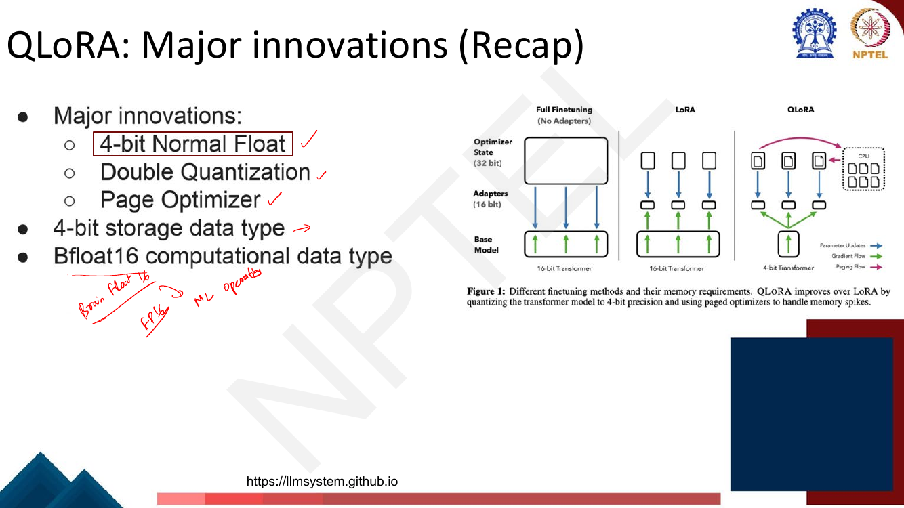
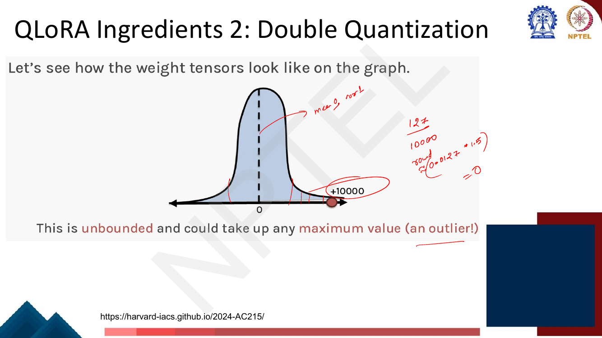
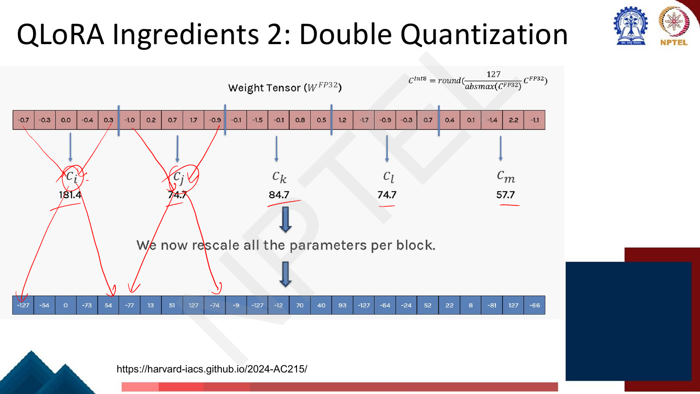
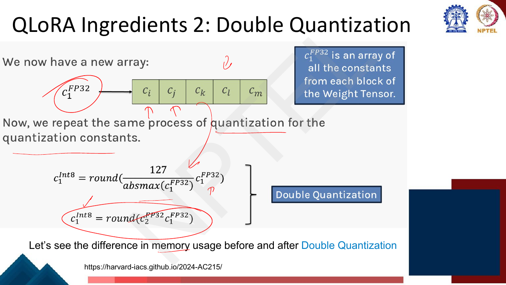
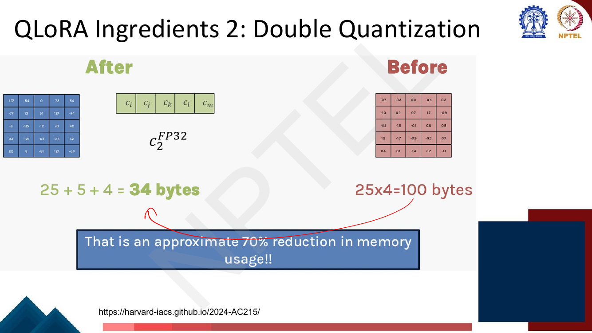
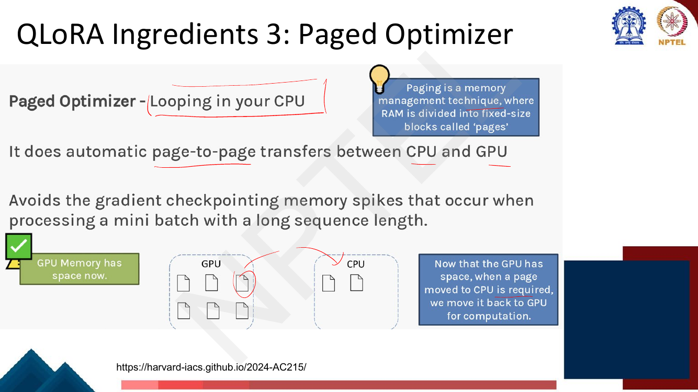
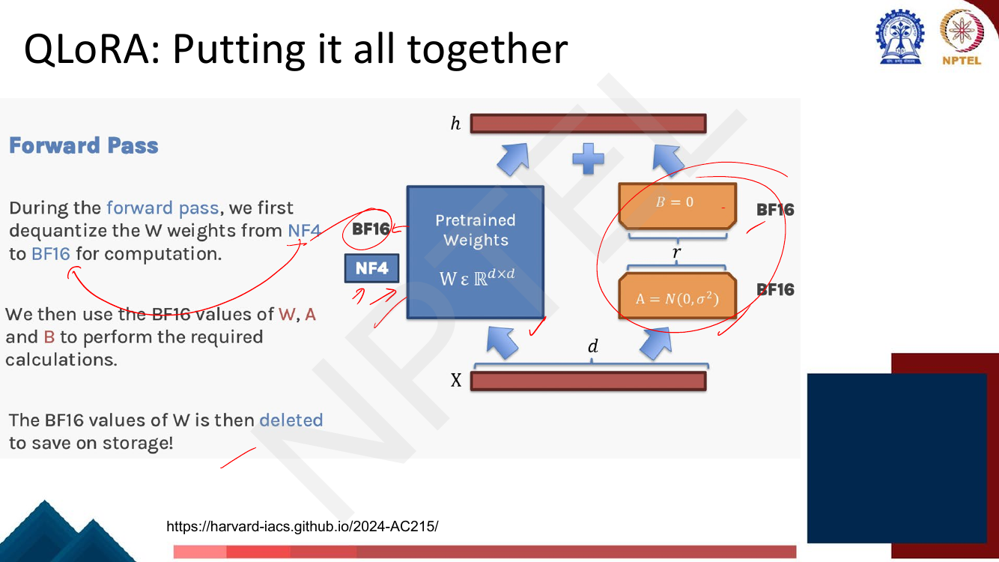
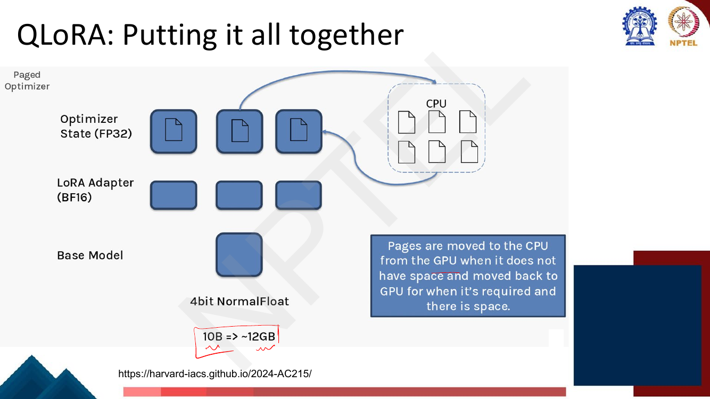
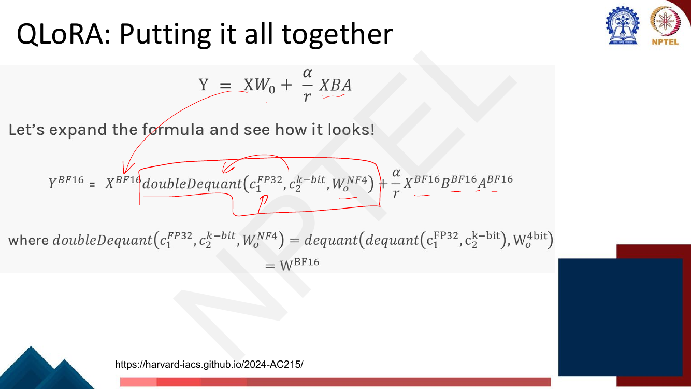

# Lec 49 — QLoRA II: Double Quantization and Paged Optimizers

> **Source:** `Week10(Lec 49).pdf` pp. 1–28 · **Week 10** · **Playlist:** Lec 49
> **Prereqs:** [Lec 48 — Quantization and QLoRA I](48-quantization-qlora-1.md), [Lec 47 — LoRA and Variants](47-lora-and-variants.md)
> **Feeds into:** [Lec 50 — Pruning and Distillation](50-pruning-and-distillation.md)

## Why this lecture exists

Lecture 48 shrank the frozen base model from 16 bits per weight to 4 with NF4, and stopped there. Two
things were left unsaid, and both are the difference between a method that works on a slide and a
method that works on your GPU.

The first is that quantization is not free. Every quantized block carries a **scale factor** stored at
full precision, and at realistic block sizes that bookkeeping costs you half a bit on every single
parameter — more than a tenth of your 4-bit budget. The second is that peak memory, not average
memory, is what crashes a training run: a single spike on one long batch kills a job that has been
running for three days. This lecture fixes both, then assembles the whole of QLoRA into one picture.

## The ideas

### The three innovations, in one place

The deck opens by re-listing what QLoRA is made of, because you need all three before the final
picture makes sense.


*Fig. — The lecturer ticks all three and annotates the two data types: **4-bit storage** and **BFloat16 (Brain Float 16) computational** type. Hold on to that split — it is the single most misunderstood thing in QLoRA, and the "putting it all together" section below turns on it. Page 3.*

| # | Innovation | What it does | Owned by |
|---|---|---|---|
| 1 | **4-bit NormalFloat (NF4)** | an information-theoretically optimal 4-bit data type for zero-centred normally distributed weights | [Lec 48](48-quantization-qlora-1.md) |
| 2 | **Double quantization** | quantizes the quantization constants, saving ~0.37 bits/parameter | this chapter |
| 3 | **Paged optimizers** | pages optimizer state to CPU RAM on memory spikes instead of crashing | this chapter |

The deck also pins the two data types: **4-bit is the *storage* type, BFloat16 is the *computational*
type.** Those are different things.

### Ingredient 2: double quantization

#### The problem: one scale for the whole tensor

Recall the absmax scheme from [Lec 48](48-quantization-qlora-1.md): you squash a float tensor into
8-bit integers by multiplying by a constant $c$ chosen so the largest-magnitude entry lands on 127,

$$\mathbf{W}^{\text{Int8}} = \operatorname{round}\!\left(\frac{127}{\operatorname{absmax}(\mathbf{W}^{\text{FP32}})}\,\mathbf{W}^{\text{FP32}}\right), \qquad c^{\text{FP32}} = \frac{127}{\operatorname{absmax}(\mathbf{W}^{\text{FP32}})}$$

That $\operatorname{absmax}$ is **unbounded**. Nothing stops one weight in a hundred million from being
enormous, and when it is, it alone sets $c$ for every other weight in the tensor.


*Fig. — The lecturer's handwriting works the damage: with $\operatorname{absmax} = 10000$ the constant is $127/10000 = 0.0127$, so an ordinary weight of 1.5 quantizes to $\operatorname{round}(0.0127 \times 1.5) = 0$. One outlier has flattened the entire distribution to zero. Page 5.*

The deck's phrasing for this is that the outlier **introduces bias into the quantization process** —
the reconstruction error is not spread evenly, it is concentrated on the bulk of the weights, which is
exactly where it hurts.

#### Step 1: block-wise quantization

The fix is local scales. Flatten the tensor, chop it into fixed-size **blocks**, and give each block
its own quantization constant computed from that block's own absmax. The deck is explicit that this is
*the first step in double quantization*, not a separate idea.


*Fig. — The flattening is row-major, and the lecturer writes $c_i = 127/\operatorname{absmax}(\text{block 1})$ beside the first arrow. The whole point is damage containment: an outlier now corrupts only its own 64 neighbours. Page 8.*


*Fig. — Check one: block 1's absmax is 0.7, and $127/0.7 = 181.43$. Notice the **last** block's rescaled values are identical to what whole-tensor quantization produced, because that block contains the global outlier 2.2 — every *other* block is what gains resolution. **Caution:** all five constants reproduce exactly, and so does block 1's Int8 row, but blocks 2–5 of the printed strip do not — the displayed weights are rounded to one decimal, so recomputing from them gives integers off by up to 7. Trust the constants, not the strip. Page 9.*

#### Step 2: quantize the constants themselves

Now count the cost. You have replaced one FP32 constant with $N/B$ of them, where $B$ is the block
size. At the realistic $B = 64$, that is

$$\frac{32 \text{ bits}}{64 \text{ parameters}} = \mathbf{0.5 \text{ bits per parameter}}$$

sitting on top of your 4 bits. You set out to spend 4 bits per weight and you are spending 4.5 — a
12.5% overrun, purely on bookkeeping.

The constants are themselves just an array of floats. So quantize *them*.


*Fig. — The second-level equation is the first-level equation applied to the constant array: $c_1^{\text{Int8}} = \operatorname{round}\!\big(\tfrac{127}{\operatorname{absmax}(c_1^{\text{FP32}})} c_1^{\text{FP32}}\big) = \operatorname{round}(c_2^{\text{FP32}} c_1^{\text{FP32}})$. There is no third level — $c_2$ stays in FP32. Page 10.*

In QLoRA proper the second level uses **8-bit floats with a block size of 256**. So each first-level
constant now costs 8 bits instead of 32, plus its share of one FP32 second-level constant per 256 of
them:

$$\text{bits per first-level constant} = 8 + \frac{32}{256} = 8.125$$

$$\text{bits per parameter} = \frac{8.125}{64} = \mathbf{0.127}$$

The saving is $0.5 - 0.127 = \mathbf{0.373}$ bits per parameter. That sounds like nothing until you
multiply it by 65 billion — see **N2**. Note what the method does *not* touch: the weights are still
NF4, still 4 bits. Double quantization is purely an attack on the metadata.

#### The ledger on the deck's own example


*Fig. — 34 bytes against 100. Two cautions: the exact reduction is 66%, not 70%; and the honest comparison for double quantization alone is 34 against **45** (block-wise with FP32 constants), which the lecturer writes in the margin of the previous slide. Page 13.*

Worked in full in **N1**. The toy is small enough that its block structure is unrealistic — with
5-element blocks the overhead is enormous — but the arithmetic is exactly the arithmetic you will be
asked for.

### Ingredient 3: paged optimizers

#### First, what gradient checkpointing already does

The deck motivates this by the error everyone has seen: **running out of memory**. Its first answer is
**gradient checkpointing** — during the forward pass, discard activations as soon as the next layer has
consumed them, keeping only a checkpoint every $\sqrt{n}$ layers for an $n$-layer network, and
recompute the discarded ones during the backward pass. You trade compute for memory. The companion
course derives this properly in
[its backpropagation chapter](../../../GenAIforCV/notes/week-02/09-backpropagation.md).

The deck's point is that it is **not enough**:

> This allows us to mitigate the OOM (Out of memory) error to some extent, but it doesn't get rid of
> it! We still see some **memory spikes** especially when we pass in long sequences in the batch.
> — page 20

That is the crux. Average memory is fine. **Peak** memory is not, because activation memory scales
with sequence length, so one long batch — or the moment a checkpoint boundary forces a block of
recomputation — briefly demands far more than the steady state. A single such spike aborts the run.

#### Paging


*Fig. — The definition box: "Paging is a memory management technique, where RAM is divided into fixed-size blocks called 'pages'." The mechanism is NVIDIA unified memory doing automatic page-to-page transfers between CPU and GPU. Page 21.*

The idea is lifted wholesale from operating systems. When a program needs more RAM than physically
exists, the OS evicts pages to disk and faults them back in on access. Here the GPU is the RAM and
**CPU RAM is the disk**. When GPU memory runs short, pages of **optimizer state** are evicted to CPU
RAM automatically; when a page is needed again and there is room, it is faulted back.

Why optimizer state rather than weights or activations? Because it is the biggest thing that is *not*
needed during the forward and backward passes. Adam keeps a first and second moment per trainable
parameter ([Lec 10](../week-02/10-gradient-descent-and-init.md)) — two FP32 numbers that are read and
written only in the update step, and sit idle for the rest of each iteration. That makes it the ideal
eviction candidate.

**State the trade-off, because the exam will ask for it:** paging does not reduce memory *usage*. It
costs you a PCIe round trip (**N5** puts a number on it) and buys you the guarantee that a spike
degrades throughput instead of killing the process. You pay a little speed, sometimes, to never crash.
It is a reliability mechanism, not a compression mechanism.

### QLoRA: putting it all together


*Fig. — Read the three bullets in order: dequantize NF4 → BF16; compute with BF16 $\mathbf{W}$, $\mathbf{A}$, $\mathbf{B}$; **delete the BF16 $\mathbf{W}$**. The dequantized tensor exists only for the duration of one layer's matmul. Page 22.*

**This is the thing readers miss: 4-bit is a storage format, not a compute format.** No arithmetic
happens in 4 bits. On every forward pass, each weight tensor is dequantized to BFloat16 one block at a
time, the matmul runs in BF16, and the BF16 copy is thrown away immediately. Peak memory therefore
holds the whole model in 4 bits plus *one layer* in 16 bits, not the whole model in 16 bits. The
backward pass (page 23) is pure LoRA: $\mathbf{W}$ stays frozen, gradients flow only through the
adapters, and $\mathbf{W}$ is never updated — so it never needs to be re-quantized.


*Fig. — The complete picture. Only the top tier pages; the base model never leaves the GPU. The lecturer's handwritten figure in the corner is the deck's only concrete memory claim: **10B parameters ⇒ ~12 GB**. Page 24.*

Mathematically, the deck expands LoRA's forward pass
$\mathbf{Y} = \mathbf{X}\mathbf{W}_0 + \tfrac{\alpha}{r}\mathbf{X}\mathbf{B}\mathbf{A}$
([Lec 47](47-lora-and-variants.md)) into the QLoRA form:

$$\mathbf{Y}^{\text{BF16}} = \mathbf{X}^{\text{BF16}}\,\text{doubleDequant}\!\left(c_1^{\text{FP32}}, c_2^{k\text{-bit}}, \mathbf{W}^{\text{NF4}}\right) + \frac{\alpha}{r}\mathbf{X}^{\text{BF16}}\mathbf{B}^{\text{BF16}}\mathbf{A}^{\text{BF16}}$$

$$\text{doubleDequant}\!\left(c_1^{\text{FP32}}, c_2^{k\text{-bit}}, \mathbf{W}^{\text{NF4}}\right) = \text{dequant}\!\left(\text{dequant}(c_1^{\text{FP32}}, c_2^{k\text{-bit}}),\, \mathbf{W}^{\text{4bit}}\right) = \mathbf{W}^{\text{BF16}}$$


*Fig. — Read the nesting inside-out: recover the block constants first, then use them to recover the weights. **Warning:** on this page (copied from the QLoRA paper) $c_1$ is the FP32 **second-level** constant and $c_2$ is the $k$-bit **first-level** constant — the opposite of pages 10 and 12, where $c_1$ was the first-level array. Page 26.*

Everything is now in place: a 4-bit NF4 frozen base, its constants double-quantized, 16-bit LoRA
adapters on top, and an optimizer that pages rather than dies.

## Worked numericals

The deck contains no page titled "Try this problem". It does contain **one in-deck exercise with the
lecturer's handwritten solution** — pages 11–13 pose "the total memory used was: ___" and work four
variants in the margin. That is N1.

### N1. The deck's memory ledger (pages 11–13, lecturer's own working)
**Given:** a $5\times5$ FP32 weight tensor (25 values), block-wise Int8 quantization with 5 blocks of 5,
second-level Int8 quantization of the 5 constants with one FP32 constant.
**Find:** total bytes under four storage schemes.

1. **FP32, unquantized:** $25 \times 4 = \mathbf{100}$ bytes. *(The slide's "Before".)*
2. **Single whole-tensor Int8:** 25 codes at 1 byte, plus one FP32 constant:
   $25 \times 1 + 4 = \mathbf{29}$ bytes. *(Lecturer's "29 bytes".)*
3. **Block-wise Int8, FP32 constants:** 25 codes plus 5 constants at 4 bytes:
   $25 + 5\times4 = 25 + 20 = \mathbf{45}$ bytes. *(Lecturer's "45 bytes".)*
4. **Double quantization:** 25 codes, 5 constants now at 1 byte, plus one FP32 second-level constant:
   $25 + 5 + 4 = \mathbf{34}$ bytes. *(Slide's "34 bytes".)*
5. Reduction against FP32: $(100-34)/100 = 66\%$. **The slide says "approximately 70%" — it is 66%.**
6. Reduction attributable to double quantization *itself*: $(45-34)/45 = 24.4\%$.
7. In bits per parameter: $32 \to 9.28 \to 14.40 \to 10.88$.

**Answer:** **100 / 29 / 45 / 34 bytes**. Step 7 carries a sting: on this toy, plain whole-tensor
quantization (9.28 bits/param) beats double quantization (10.88), because 5-element blocks make the
constants a quarter of the file. Double quantization only pays at realistic block sizes — which is N2.

### N2. The double-quantization saving, derived, and scaled to 65B
**Given:** first-level block size $B_1 = 64$ with FP32 (32-bit) constants; second level uses 8-bit
constants with block size $B_2 = 256$, each second-level block carrying one FP32 constant.
**Find:** constant overhead in bits per parameter before and after, and the saving on a 65B model.

1. **Before.** One 32-bit constant per 64 weights: $32/64 = \mathbf{0.5}$ bits/parameter.
2. **After, first term.** Each constant is now 8 bits: $8/64 = 0.125$ bits/parameter.
3. **After, second term.** One FP32 constant per 256 first-level constants, i.e. per
   $256 \times 64 = 16{,}384$ weights: $32/16{,}384 = 0.001953$ bits/parameter.
4. Total after: $0.125 + 0.001953 = \mathbf{0.126953} \approx 0.127$ bits/parameter.
   *(Equivalently: each constant costs $8 + 32/256 = 8.125$ bits, and $8.125/64 = 0.126953$.)*
5. **Saving:** $0.5 - 0.126953 = \mathbf{0.373}$ bits/parameter — a $3.94\times$ reduction in overhead.
6. On 65B parameters, before: $65\times10^9 \times 0.5 / 8 = 4.0625\times10^9$ bytes $= \mathbf{4.06}$ GB.
7. After: $65\times10^9 \times 0.126953 / 8 = 1.0315\times10^9$ bytes $= \mathbf{1.03}$ GB.
8. Saved: $4.06 - 1.03 = \mathbf{3.03}$ GB (2.82 GiB).

**Answer:** $0.5 \to 0.127$ bits/parameter, saving **0.373 bits/parameter ≈ 3.03 GB on a 65B model**.
Three gigabytes of pure bookkeeping, removed.

### N3. Effective bits per parameter, and does 65B fit on one 48 GB card?
**Given:** NF4 base at 4 bits plus the overheads from N2; LoRA adapters at 0.5% of base parameters in
BF16; Adam state in FP32. Work in GB $=10^9$ bytes, as GPU vendors do.
**Find:** effective bits/parameter and a full memory budget.

1. **Without** double quantization: $4 + 0.5 = \mathbf{4.5}$ bits/parameter.
2. **With** double quantization: $4 + 0.127 = \mathbf{4.127}$ bits/parameter.
3. Base model, 65B at 4.5 bits: $65\times10^9 \times 4.5/8 = 36.56$ GB.
4. Base model, 65B at 4.127 bits: $65\times10^9 \times 4.127/8 = \mathbf{33.53}$ GB. (Step 3 minus N2's 3.03 ✓)
5. Adapters: $0.005 \times 65\times10^9 = 325$M params. BF16 weights $325\times10^6 \times 2 = 0.65$ GB.
6. Adapter gradients, BF16: another $0.65$ GB.
7. Adam $\mathbf{m}$ and $\mathbf{v}$, FP32: $325\times10^6 \times 2 \times 4 = 2.60$ GB — **this is the
   part that pages**.
8. Subtotal: $33.53 + 0.65 + 0.65 + 2.60 = \mathbf{37.43}$ GB, leaving $48 - 37.43 = 10.6$ GB for
   activations, the transient BF16 dequantization buffer and CUDA overhead.

**Answer:** **4.5 → 4.127 bits/parameter**, and a 65B QLoRA job budgets at **≈37.4 GB** of static
state on a 48 GB card. It fits — with about 10 GB of headroom that gradient checkpointing must keep
the activations inside, and that paged optimizers protect when it momentarily cannot. Sanity check
against the deck's own handwritten "10B ⇒ ~12 GB" (page 24): base $= 10\times10^9 \times 4.127/8 =
5.16$ GB, adapter-side state $\approx 0.6$ GB, leaving ~6 GB for activations and buffers — consistent.

### N4. Why block size 64, and not 32 or 256
**Given:** the overhead formulas from N2 with $B_1 \in \{32, 64, 128, 256\}$.
**Find:** the overhead at each, and the direction quantization error moves.

| $B_1$ | FP32-constant overhead $32/B_1$ | After double quant. $8.125/B_1$ | Effective bits/param (NF4 + DQ) | RMS error (measured, see Code) |
|---|---|---|---|---|
| 32 | 1.000 | 0.2539 | 4.254 | 0.00884 |
| **64** | **0.500** | **0.1270** | **4.127** | **0.01142** |
| 128 | 0.250 | 0.0635 | 4.064 | 0.01543 |
| 256 | 0.125 | 0.0317 | 4.032 | 0.02085 |

1. Memory wants $B_1$ **large**: going 32 → 256 cuts the overhead 8×, from 1.0 to 0.125 bits/parameter.
2. Accuracy wants $B_1$ **small**: with $B$ draws from a zero-mean distribution, the expected block
   absmax grows like $\sqrt{2\ln B}$ — $2.63, 2.88, 3.11, 3.33$ for $B = 32, 64, 128, 256$ — so the
   quantization step widens and more weights share each code. The measured RMS error rises
   monotonically, $2.36\times$ from 32 to 256.
3. At $B_1 = 64$ the overhead after double quantization is 0.127 bits — **3.1% of the 4-bit budget**.
   Halving the block again to 32 would cost 0.127 extra bits to buy a 23% error reduction; doubling to
   128 saves only 0.064 bits and costs 35% more error.

**Answer:** **64 is the knee of the curve.** Past it the memory return collapses (you are shaving
hundredths of a bit) while the error keeps climbing. Note the second-level block size is 256, not 64 —
a constant array is small and smooth, so it tolerates coarser blocking.

### N5. What one page-out actually costs
**Given:** 325M adapter parameters (from N3), Adam state in FP32, PCIe 3.0 ×16 at an achievable
12 GB/s and PCIe 4.0 ×16 at 25 GB/s. A 65B training step takes 2.5 s.
**Find:** the time cost of evicting and re-faulting the optimizer state.

1. Optimizer state: $325\times10^6 \times 2 \text{ moments} \times 4 \text{ bytes} = 2.6\times10^9$ bytes $= 2.6$ GB.
2. Page-out on PCIe 3.0: $2.6 / 12 = 0.2167$ s.
3. Round trip (out then back in): $2 \times 0.2167 = \mathbf{0.433}$ s.
4. As a fraction of one step: $0.433 / 2.5 = \mathbf{17.3\%}$ — if it happened every step.
5. On PCIe 4.0: $2\times(2.6/25) = 0.208$ s, i.e. $8.3\%$ of a step.
6. Realistically a spike hits perhaps 1 step in 20, so the amortised cost is $17.3/20 = \mathbf{0.87\%}$
   (PCIe 3.0) or $0.42\%$ (PCIe 4.0).

**Answer:** a full round trip costs **≈0.43 s on PCIe 3.0**, amortising to **under 1% of training
throughput**. Compare that with the alternative — an OOM crash on day three of a multi-day run, which
costs you every hour since the last checkpoint. **That asymmetry is the whole argument for paged
optimizers.**

## Code

A NumPy double-quantization simulator. The first half reproduces the deck's 25-value toy exactly
(including its printed constants 181.4 / 74.7 / 84.7 / 74.7 / 57.7 and its 100 / 29 / 45 / 34 byte
ledger); the second half runs the real QLoRA configuration and reproduces N2 and N4.

```python
import numpy as np

# ---------- the deck's 5x5 toy tensor (pp. 7-13) -------------------------
W = np.array([-0.7,-0.3, 0.0,-0.4, 0.3,
              -1.0, 0.2, 0.7, 1.7,-0.9,
              -0.1,-1.5,-0.1, 0.8, 0.5,
               1.2,-1.7,-0.9,-0.3, 0.7,
               0.4, 0.1,-1.4, 2.2,-1.1], dtype=np.float32)

def absmax_quant(x, levels=127):
    """int8 absmax quantization: returns the integer codes and the constant c."""
    c = levels / np.abs(x).max()          # c = 127 / absmax, as on the slides
    return np.round(x * c).astype(np.int16), np.float32(c)

def blockwise(x, block):
    """Split x into blocks, quantize each, return codes and the constant array."""
    blocks = x.reshape(-1, block)
    out = [absmax_quant(b) for b in blocks]
    return np.stack([q for q, _ in out]), np.array([c for _, c in out], np.float32)

codes, c1 = blockwise(W, 5)                 # level 1: five blocks, five constants
print("block constants c1 =", np.round(c1, 1))

c1_codes, c2 = absmax_quant(c1)             # level 2: quantize the constants
print("c1 as int8        =", c1_codes, "   c2 =", round(float(c2), 4))
print("c1 recovered      =", np.round(c1_codes / c2, 1))

n = W.size                                   # the ledger the lecturer writes in the margin
for name, by in {"FP32, no quantization"      : n*4,
                 "single (whole-tensor) int8" : n*1 + 4,
                 "block-wise, FP32 constants" : n*1 + len(c1)*4,
                 "double quantization"        : n*1 + len(c1)*1 + 4}.items():
    print(f"{name:<28} {by:>4} bytes   {8*by/n:6.2f} bits/param")

# ---------- the real setting: block 64, 8-bit 2nd level, block 256 -------
def bits_per_param(B1=64, c1_bits=32, B2=256, c2_bits=32, base=4):
    lvl1 = c1_bits / B1                      # one FP32 constant per B1 weights
    lvl2 = (8 + c2_bits / B2) / B1           # constant now 8-bit + its own constant
    return base + lvl1, base + lvl2, lvl1, lvl2

for B1 in (32, 64, 128, 256):
    no_dq, dq, o1, o2 = bits_per_param(B1)
    print(f"block {B1:>3}: overhead {o1:6.4f} -> {o2:6.4f} bits/param "
          f"| effective {no_dq:6.4f} -> {dq:6.4f} bits/param")

P = 65e9                                     # scale N2 to a 65B model
_, _, o1, o2 = bits_per_param(64)
print(f"\n65B: constants cost {P*o1/8/2**30:5.2f} GiB -> {P*o2/8/2**30:5.2f} GiB "
      f"(saved {P*(o1-o2)/8/2**30:.2f} GiB)")

rng = np.random.default_rng(0)               # N4: error moves the other way
x = rng.standard_normal(65536).astype(np.float32)
x[rng.integers(0, x.size, 20)] *= 30         # a few outliers, as in real weights
for B1 in (32, 64, 128, 256):
    q, c = blockwise(x, B1)
    err = np.sqrt(np.mean((q / c[:, None] - x.reshape(-1, B1))**2))
    print(f"block {B1:>3}: RMS quantization error {err:.5f}")
```

```
block constants c1 = [181.4  74.7  84.7  74.7  57.7]
c1 as int8        = [127  52  59  52  40]    c2 = 0.7
c1 recovered      = [181.4  74.3  84.3  74.3  57.1]
FP32, no quantization         100 bytes    32.00 bits/param
single (whole-tensor) int8     29 bytes     9.28 bits/param
block-wise, FP32 constants     45 bytes    14.40 bits/param
double quantization            34 bytes    10.88 bits/param
block  32: overhead 1.0000 -> 0.2539 bits/param | effective 5.0000 -> 4.2539 bits/param
block  64: overhead 0.5000 -> 0.1270 bits/param | effective 4.5000 -> 4.1270 bits/param
block 128: overhead 0.2500 -> 0.0635 bits/param | effective 4.2500 -> 4.0635 bits/param
block 256: overhead 0.1250 -> 0.0317 bits/param | effective 4.1250 -> 4.0317 bits/param

65B: constants cost  3.78 GiB ->  0.96 GiB (saved 2.82 GiB)
block  32: RMS quantization error 0.00884
block  64: RMS quantization error 0.01142
block 128: RMS quantization error 0.01543
block 256: RMS quantization error 0.02085
```

The `c1 recovered` line is the price of the second level: 74.7 comes back as 74.3, an error of 0.5%.
That error multiplies every weight in its block — which is why the second level uses 8 bits and not 4.

## Exam pack

### Must-memorise

| Item | Exactly this |
|---|---|
| QLoRA's three innovations | 4-bit NormalFloat · Double Quantization · Paged Optimizers |
| Storage vs compute type | 4-bit **storage**, BFloat16 **computational** |
| Block-wise quantization | one quantization constant $c = 127/\operatorname{absmax}(\text{block})$ per block, not per tensor |
| Why block-wise | "if there are any outliers in a block, they won't affect the quantisation in the other blocks" |
| Double quantization, in words | quantize the **quantization constants** (first level 32-bit → 8-bit) |
| Second-level equation | $c_1^{\text{Int8}} = \operatorname{round}(c_2^{\text{FP32}} c_1^{\text{FP32}})$ |
| Constant overhead, before | $32/64 = 0.5$ bits/parameter |
| Constant overhead, after | $(8 + 32/256)/64 = 0.127$ bits/parameter |
| Saving | $\approx 0.373$ bits/parameter |
| Paged optimizer | NVIDIA unified memory doing automatic page-to-page transfers of **optimizer state** between GPU and CPU |
| What paging solves | **memory spikes** (long sequences / gradient-checkpointing boundaries), not average memory |
| Gradient checkpointing | discard activations, recompute in the backward pass; checkpoint every $\sqrt{n}$ layers |
| QLoRA forward pass | $\mathbf{Y}^{\text{BF16}} = \mathbf{X}\,\text{doubleDequant}(c_1^{\text{FP32}}, c_2^{k\text{-bit}}, \mathbf{W}^{\text{NF4}}) + \tfrac{\alpha}{r}\mathbf{X}\mathbf{B}\mathbf{A}$ |
| The dequantized $\mathbf{W}^{\text{BF16}}$ | is **deleted** after the layer's matmul |

### Numbers worth knowing

| Quantity | Value |
|---|---|
| First-level block size | **64** |
| Second-level block size | **256** |
| Second-level precision | **8-bit** |
| Overhead before / after double quantization | **0.5 / 0.127** bits per parameter |
| Saving | **0.373** bits per parameter |
| Effective bits/parameter, NF4 + constants | **4.5** before, **4.127** after |
| Deck's toy ledger (25 weights) | 100 → 29 (single) → 45 (block-wise) → **34** bytes (double) |
| Deck's claimed reduction on the toy | "approximately 70%" (exact: **66%**) |
| Deck's only memory claim | **10B parameters ⇒ ~12 GB** (handwritten, p. 24) |
| 65B base under QLoRA | ≈ **33.5 GB**; fits a single **48 GB** GPU |
| Checkpoint spacing | every $\sqrt{n}$ layers for $n$ layers |
| Deck's absmax constant | $127/\operatorname{absmax}$ (Int8 in the worked example) |
| Deck's single reference | Kamath, Uday, et al., *Large Language Models: A Deep Dive*, 2024 |

### Likely MCQ traps

- **"Double quantization quantizes the weights twice."** No. The weights are quantized **once**, to
  NF4. What is quantized a second time is the **array of quantization constants**. The weights never
  go below 4 bits.
- **"QLoRA computes in 4 bits."** No. 4-bit is a *storage* type. Every matmul runs in BFloat16 on a
  dequantized copy that is discarded immediately. If a question says "4-bit matrix multiplication", it
  is wrong.
- **"Paged optimizers reduce memory usage."** No — they *relocate* it on demand. They convert an OOM
  crash into a slowdown. Total memory consumed is unchanged; **peak GPU** memory is capped.
- **"Paging moves the model weights."** No: it is the **optimizer state** that pages. The base model
  and the adapters stay resident.
- **"Gradient checkpointing solves the OOM problem."** The deck explicitly says it mitigates it "to
  some extent, but it doesn't get rid of it" — spikes survive. That is precisely why ingredient 3
  exists.
- **Overhead direction with block size.** Overhead $=32/B$ *falls* as $B$ grows, while quantization
  error *rises*. A question asking "what does increasing the block size do?" needs both halves.
- **0.127 vs 0.125.** The 8-bit constants alone give $8/64 = 0.125$; the extra 0.002 is the
  second-level FP32 constant amortised over $64\times256 = 16{,}384$ weights. The published figure is
  **0.127**.
- **Which block size is 256?** The **second** level. The first is 64. Swapping them is the single
  easiest arithmetic trap in this lecture.
- **$c_1$ vs $c_2$.** On the deck's teaching pages (10, 12) $c_1$ is the first-level array and $c_2$ is
  the FP32 second-level constant. On the paper-sourced page 26 the roles are **reversed**. Read the
  superscript, not the subscript: whichever one is FP32 is the outermost.

### Self-test

1. At block size 64 with FP32 quantization constants, what is the overhead in bits per parameter, and
   why?
2. Double quantization uses 8-bit constants with a second-level block size of 256. Derive the 0.127
   figure.
3. Your friend says QLoRA stores weights in 4 bits so a 4-bit GPU kernel does the matmul. What is wrong?
4. Why is *optimizer state* the thing that gets paged, rather than weights or activations?
5. The deck's toy gets 100 bytes down to 34. How much of that is due to double quantization as opposed
   to quantization in general?
6. Gradient checkpointing already saves activation memory. Why does QLoRA still need paged optimizers?
7. If you raised the first-level block size from 64 to 256, what happens to memory and to accuracy?
8. Write the QLoRA forward-pass equation and say what `doubleDequant` does, inside-out.
9. A 13B model under QLoRA: how many GB do the base weights occupy with and without double quantization?

<details><summary>Answers</summary>

1. $32/64 = 0.5$ bits/parameter. Block-wise quantization stores one FP32 (32-bit) scale factor per
   block of 64 weights, and that cost is amortised over the 64 weights in the block.
2. Each first-level constant becomes 8 bits, and one FP32 constant is kept per second-level block of
   256 of them: $8 + 32/256 = 8.125$ bits per constant. Divide by the first-level block size:
   $8.125/64 = 0.126953 \approx 0.127$ bits/parameter. Saving $= 0.5 - 0.127 = 0.373$.
3. 4-bit is the **storage** format only. On each forward pass the weights are dequantized to BFloat16,
   the matmul runs in BF16, and the BF16 copy is deleted. The BFloat16 computational data type is
   named explicitly on page 3.
4. Because Adam's $\mathbf{m}$ and $\mathbf{v}$ are large (two FP32 numbers per trainable parameter)
   but are touched **only in the update step** — they sit idle through the forward and backward passes,
   so evicting them costs nothing until the update. Weights and activations are needed continuously.
5. $100 \to 45$ bytes is block-wise Int8 quantization. $45 \to 34$ is double quantization: an 11-byte,
   24.4% further saving. Quoting "66% from double quantization" is the error the slide invites.
6. Checkpointing lowers *average* activation memory but spikes survive — long sequences in a batch and
   recomputation at checkpoint boundaries still produce transient peaks. The deck: it mitigates OOM
   "to some extent, but it doesn't get rid of it". One spike aborts the run; paging absorbs it.
7. Memory improves: overhead falls from 0.127 to 0.032 bits/parameter (0.095 bits/parameter saved, about
   0.77 GB on 65B). Accuracy worsens: block absmax grows roughly as $\sqrt{2\ln B}$, so the step size
   widens — the measured RMS error rose from 0.0114 to 0.0209, an 83% increase. 64 is the compromise.
8. $\mathbf{Y}^{\text{BF16}} = \mathbf{X}^{\text{BF16}}\,\text{doubleDequant}(c_1^{\text{FP32}}, c_2^{k\text{-bit}}, \mathbf{W}^{\text{NF4}}) + \tfrac{\alpha}{r}\mathbf{X}^{\text{BF16}}\mathbf{B}^{\text{BF16}}\mathbf{A}^{\text{BF16}}$.
   Inside-out: the inner `dequant` recovers the first-level block constants from their quantized form;
   the outer `dequant` uses those constants to recover $\mathbf{W}^{\text{BF16}}$ from the NF4 codes.
9. Without: $13\times10^9 \times 4.5/8 = 7.31$ GB. With: $13\times10^9 \times 4.127/8 = 6.71$ GB.
   Saving $0.61$ GB, which is $13\times10^9 \times 0.373/8$ ✓.

</details>

## Beyond the slides

**Gap:** The deck never states the empirical result that double quantization is *lossless* in
accuracy. **Why it matters:** the obvious objection to quantizing your scale factors is that errors in
a scale factor multiply every weight in its block. The QLoRA paper's ablations show no measurable
degradation on 5-shot MMLU — which is why double quantization is on by default in `bitsandbytes`
(`bnb_4bit_use_double_quant=True`). Without that, a reasonable student would assume it is an
accuracy-for-memory trade, and it is not; it is close to free.

**Gap:** The deck gives no inference-side picture. **Why it matters:** QLoRA's dequantize-compute-discard
loop costs real time — a QLoRA forward pass is slower than a BF16 one, because you pay a dequantization
kernel per layer. QLoRA is a *fine-tuning* method; for deployment you typically merge the adapters
([Lec 47](47-lora-and-variants.md)) and re-quantize, or serve in a format built for inference.

**Gap:** The second-level data type is not named on the slides. **Why it matters:** the paper uses
**FP8** (8-bit float), not Int8, for the second level, because the constants are all positive and span
several orders of magnitude — a format with an exponent handles that better than a linear integer grid.
The deck's worked example uses Int8 throughout, which is fine pedagogically but is not what
`bitsandbytes` does.

**Gap:** Nothing is said about *which* parameters the method leaves alone. **Why it matters:** in
practice embeddings, the LM head and LayerNorm parameters are usually kept at higher precision, because
they are a small fraction of the parameters but quantize badly. An exam question about "which parts of
the model are in NF4" has a more nuanced answer than "all of them".

## Cut from the slides

Almost nothing, because there was almost nothing to cut. **Of 28 PDF pages this deck has roughly seven
genuinely distinct content ideas** — pages 1, 2, 27 and 28 are title, outline, references and "Thank
you"; pages 4–7 are one build-up (the outlier problem) revealed across four slides; pages 10–13 repeat
the same before/after ledger three times with the comparison re-staged; pages 14–20 are a seven-slide
animation of one four-node network illustrating gradient checkpointing; pages 22–26 are the single
"putting it all together" synthesis. I have compressed each reveal sequence into one explanation and
one figure. I dropped page 4's whole-tensor rescaled tensor (its printed Int8 values do not reproduce
from the printed one-decimal weights — see the report note) and page 25's LoRA equation, which
[Lec 47](47-lora-and-variants.md) owns in full. Gradient checkpointing genuinely is on this deck
(pp. 14–20), so I taught it in one paragraph rather than only linking out; the full derivation stays
with the companion course. NF4 itself, the absmax scheme and the GPU memory accounting are
[Lec 48](48-quantization-qlora-1.md)'s and are recalled here in two sentences only.
