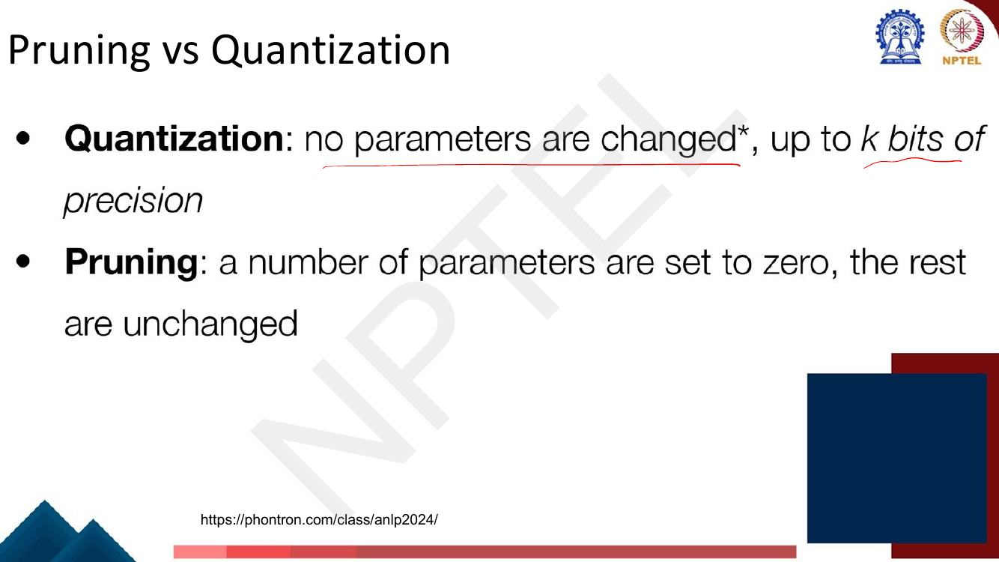
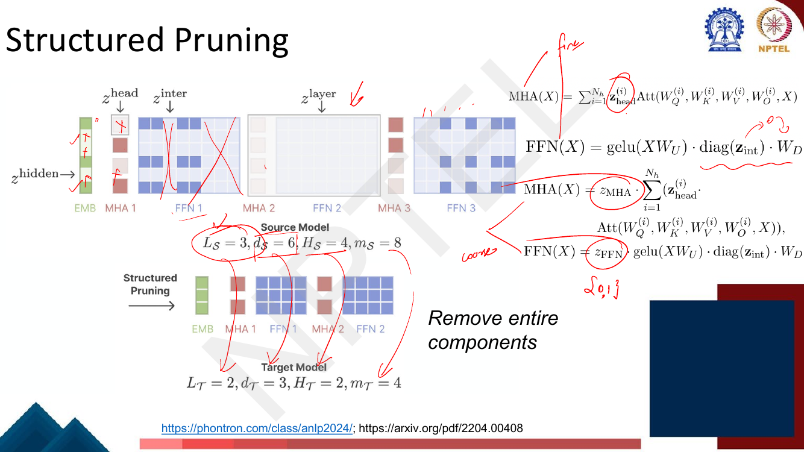

# Lec 50 — Other Parameter Efficient Methods: Pruning, Distillation

> **Source:** `Week10(Lec 46-48,50).pdf` pp. 74–91 · **Week 10** · **Playlist:** Lec 50
> **Prereqs:** [Lec 48 — Quantization and QLoRA I](48-quantization-qlora-1.md), [Lec 39 — RLHF II: PPO](../week-08/39-rlhf-2-ppo.md) (for KL divergence)
> **Feeds into:** [Lec 52 — Modern LLMs and Architecture Variations](../week-11/52-modern-llms-and-activations.md)

## Why this lecture exists

Week 10 has spent four lectures making a large model *cheaper to adapt*: adapters, LoRA, quantization.
Every one of those leaves the model the size it was. The deployed network still has 110 million or 70
billion parameters, and you still pay for all of them at every forward pass.

This lecture closes the week with the two remaining ways to make the model itself smaller. The deck
opens by putting all three side by side, and that comparison is the frame for everything that follows:
quantization makes each weight **cheaper to store**, pruning **deletes weights outright**, and
distillation **trains a different, smaller model** to behave like the big one. They are not
alternatives to each other — they compose — but they fail in different ways, and the exam tests
whether you can tell which is which.

## The ideas

### The three families, in the deck's own words


*Fig. — The discrimination the lecturer underlines in red: quantization changes **no** parameter, only its precision; pruning changes **some** parameters (to exactly zero) and leaves every other one untouched. Page 76.*

Nine slides later (page 84) the deck repeats the same two bullets with a third appended, and that
third line is the one to memorise: **"Distillation: ~all parameters are changed."** Distillation does
not edit the big model at all; it produces a *different* network whose every weight is new.

| Family | What happens to the weights | Model shape afterwards | Owner |
|---|---|---|---|
| **Quantization** | none changed; stored in $k$ bits | identical | [Lec 48](48-quantization-qlora-1.md) |
| **Pruning** | some set to exactly 0, rest untouched | same (unstructured) or smaller (structured) | this chapter |
| **Distillation** | ~all changed — it is a new model | smaller by construction | this chapter |

Quantization, NF4 and QLoRA belong to [Lec 48](48-quantization-qlora-1.md) and
[Lec 49](49-qlora-2.md); LoRA and adapters to [Lec 46](46-peft-adapters-prefix.md) and
[Lec 47](47-lora-and-variants.md). This chapter recalls them only to contrast.

---

### Half 1 — Pruning

#### The Lottery Ticket Hypothesis


*Fig. — The legend gives **percentage of weights remaining**, not percentage pruned. The green 21.1% curve sits **above** the blue 100.0% curve for the whole run; only at 3.6% and 1.9% does accuracy fall back. Page 77.*

Frankle and Carbin's claim, stated in full:

> A randomly-initialised dense network contains a sparse subnetwork — a **winning ticket** — that,
> when trained **in isolation from the same initialisation**, reaches the full network's test accuracy
> in at most the same number of iterations.

**The clause "from the same initialisation" is the whole hypothesis, and the deck's slide omits it.**
Without it the claim is boring: of course some small architecture can be trained to do the job. With
it the claim is surprising, because it says the *random draw* already contained the solution. The
mask alone is not enough and the initial values alone are not enough — you need the particular
weights the particular mask was drawn around. Re-initialise the same mask randomly and the subnetwork
trains *worse* than the dense model. Expect an MCQ on exactly this.

How you find a ticket (iterative magnitude pruning, the procedure that produced the curves above):

1. Initialise the dense network at $\theta_0$ and train it to convergence.
2. Prune the smallest-magnitude $p\%$ of weights, producing a mask $\mathbf{m}$.
3. **Reset** the surviving weights to their values in $\theta_0$ — not to new random values.
4. Repeat from step 1 on the masked network.

Step 3 is the "rewinding" step, and it is what makes the experiment a test of the hypothesis rather
than ordinary pruning.

#### Magnitude pruning


*Fig. — The blue "pruned" curve holds flat to ~40% and then collapses to near 0 BLEU by 90%. The orange "pruned **and retrained**" curve is still at ~20 BLEU at 80–90%. Retraining is doing almost all the work. Page 78.*

The rule is as simple as it sounds. Score each weight by $S_{ij} = |W_{ij}|$, sort, zero the bottom
$X\%$. The justification is a first-order one: setting a weight to zero perturbs the layer's output by
roughly $|W_{ij}|\,\|\mathbf{x}_j\|$, so if all inputs were comparable the smallest weights do the
least damage. Hold on to that "if" — Wanda attacks it directly in two slides' time.

Three distinctions ride on this slide:

- **Unstructured vs structured.** The deck labels magnitude pruning *unstructured*: individual
  scalars are zeroed, wherever they fall, and the matrix keeps its shape. **Structured** pruning
  removes whole rows, heads, neurons or layers, so the matrix actually shrinks.
- **One-shot vs iterative.** One-shot prunes to the target sparsity in a single cut. Iterative prunes
  a little, retrains, prunes again. Iterative is reliably better at high sparsity and is what the
  lottery-ticket procedure uses.
- **Prune-then-retrain vs sparse-from-scratch.** The deck's third (red) curve trains a network that
  was sparse from the beginning. It tracks the retrained curve closely — slightly below it — which is
  the deck's quiet evidence for the lottery-ticket story: the dense model is not strictly necessary,
  but it is the easiest way to find out *which* sparse model to train.

#### Movement pruning


*Fig. — Both scatter plots show the same cloud. Magnitude pruning (left, red) keeps a **horizontal/vertical band** — anything far from 0. Movement pruning (right, yellow) keeps the points that travelled **outward along the diagonal**. The lecturer has annotated the axes "pretrained mag." and "fine-tuned mag.". Page 79.*

Magnitude pruning asks one question: *how big is this weight?* Movement pruning (Sanh et al., 2020)
asks a different one: *is this weight moving away from zero, or toward it, as I fine-tune?*

The formal score accumulates the weight against its gradient over fine-tuning:

$$S_{ij} \;=\; -\sum_{t} \left(\frac{\partial \mathcal{L}}{\partial W_{ij}}\right)^{(t)} W_{ij}^{(t)}$$

Since a gradient step moves $W_{ij}$ by $-\eta \,\partial\mathcal{L}/\partial W_{ij}$, this is (up to
$\eta$) the accumulated $W_{ij}\,\Delta W_{ij}$: **positive when the weight is being pushed further
from zero, negative when it is being pulled toward zero.** For hand computation the clean proxy is

$$S_{ij} \;\approx\; |W_{ij}^{\text{fine}}| - |W_{ij}^{\text{pre}}|$$

**Why it wins in transfer learning**, which is the examinable sentence: fine-tuning barely moves the
weights (the scatter plots hug the diagonal), so the large weights after fine-tuning are almost
exactly the large weights from *pretraining*. Magnitude pruning therefore selects for "important
during pretraining", which is not the question you asked. A weight that was 0.9 in the pretrained
checkpoint and is still 0.7 after fine-tuning is large but **irrelevant to your task** — the task
never used it. A weight that was 0.05 and grew to 0.35 is small but is exactly what the task built.
Magnitude alone cannot see the difference; movement is defined by it. Worked in full as **N2** below.

#### Wanda — pruning by weights *and* activations


*Fig. — Two things change at once. The **score** gains an activation factor, and the **grouping** changes from per-layer (global over the matrix) to **per-output (per row)**. Both changes are needed to reproduce the slide's right-hand matrix. Page 80.*

Magnitude pruning silently assumes every input feature has comparable scale. In a trained
Transformer that is false — LLMs have a handful of **outlier feature dimensions** whose activations
are one to two orders of magnitude larger than the rest (the same outliers that make INT8
quantization hard; see [Lec 48](48-quantization-qlora-1.md)). A weight of 0.1 sitting on a feature
whose activations are 100 contributes more to the output than a weight of 1.0 on a feature whose
activations are 0.01.

Wanda's fix is to put the activation into the score. For a weight matrix $\mathbf{W}$ with input
feature activations $\mathbf{X}$ collected over a small calibration set:

$$S_{ij} \;=\; |W_{ij}| \cdot \lVert \mathbf{X}_j \rVert_2$$

where $\lVert\mathbf{X}_j\rVert_2$ is the $\ell_2$ norm of the $j$-th input feature aggregated across
all calibration tokens. Two further details from the slide, both examinable:

- **Scores are compared per output row, not globally.** Each row of $\mathbf{W}$ keeps its own top
  $(1-s)$ fraction. This guarantees no output neuron is wiped out entirely, which global ranking can
  do.
- **No retraining and no gradients.** Wanda needs one forward pass over a calibration set and nothing
  else — which is the practical reason it is used on models too large to fine-tune.

N1 works the slide's own matrix end to end.

#### Structured pruning


*Fig. — The five mask families, from coarsest to finest: whole FFN layers, FFN intermediate dimensions, whole MHA layers, individual attention heads, and hidden dimensions. Page 81.*

Structured pruning removes **whole components**. The deck (following CoFi, arXiv 2204.00408) makes
them learned binary gates $\mathbf{z} \in \{0,1\}$ multiplying each unit:

$$\mathrm{MHA}(\mathbf{X}) = z_{\text{MHA}} \cdot \sum_{i=1}^{N_h} z^{(i)}_{\text{head}} \cdot \mathrm{Att}\big(\mathbf{W}_Q^{(i)}, \mathbf{W}_K^{(i)}, \mathbf{W}_V^{(i)}, \mathbf{W}_O^{(i)}, \mathbf{X}\big)$$

$$\mathrm{FFN}(\mathbf{X}) = z_{\text{FFN}} \cdot \mathrm{gelu}(\mathbf{X}\mathbf{W}_U)\cdot \mathrm{diag}(\mathbf{z}_{\text{int}})\cdot \mathbf{W}_D$$


*Fig. — The arithmetic of the deck's example: $L_\mathcal{S}=3, d_\mathcal{S}=6, H_\mathcal{S}=4, m_\mathcal{S}=8$ becomes $L_\mathcal{T}=2, d_\mathcal{T}=3, H_\mathcal{T}=2, m_\mathcal{T}=4$. Every dimension is literally smaller — the resulting network is a dense Transformer again. Page 82.*

**The practical point the exam wants.** Unstructured sparsity rarely produces a real speedup on
standard hardware. A GPU's dense matrix multiply runs the same number of fused multiply-adds whether
the operands are zero or not; zeros do not make BLAS faster. To cash in unstructured sparsity you
need a sparse kernel, and sparse kernels only beat dense ones at extreme sparsity (~95%+) because of
the index-chasing overhead — and you must *store* those indices, which eats the memory saving too
(see N2, step 5). Structured pruning sidesteps all of it: delete a head and the matrices are
genuinely smaller, so every existing dense kernel runs faster with no special support.

The trade is accuracy. At equal compression, unstructured pruning preserves accuracy better — it has
far more freedom about *which* parameters to drop. **Unstructured = better accuracy per parameter
removed; structured = actual wall-clock speedup.** That is the discrimination.

Attention heads as prunable units connect to [Lec 22](../week-05/22-self-attention-and-multihead.md);
Voita et al.'s finding that most heads can be removed with little loss is the empirical licence for
$z_{\text{head}}$.

---

### Half 2 — Distillation

#### The basic idea: weak supervision

Page 83 gives the definition in one sentence: **"Train one model (the “student”) to replicate the
behavior of another model (the “teacher”)."** Note "replicate the *behavior*" — not the weights, not
the architecture.


*Fig. — Distillation is framed as a special case of **weak supervision**: the teacher manufactures labels for unlabelled text and the student trains on them as if they were gold. The 1995 and 1998 citations are there to make the point that nothing here is new except the teacher. Page 85.*

The practical consequence of this framing: distillation needs **no labelled data**. Point the teacher
at any raw text, keep its outputs, train the student on them. That is why distillation scales when
annotation does not.

#### Hard vs soft targets — the heart of distillation


*Fig. — The circled 57.0% is the point of the lecture. With **3%** of the labels, soft targets recover almost all of the 58.9% that 100% of the hard labels bought; hard labels on the same 3% collapse to 44.5%. Page 86.*

A **hard target** is the one-hot label: "Positive". A **soft target** is the teacher's whole output
distribution: "Positive 0.9, Neutral 0.08, Negative 0.01". The extra content is not the 0.9 — it is
the *relative* sizes of the other two. The teacher is telling the student that this example is eight
times closer to Neutral than to Negative; that this is a mild positive, not a scathing one. Hinton
calls that relative structure **dark knowledge**, and the deck's table measures what it is worth: it
is the difference between 44.5% and 57.0%.

Notice the middle row carefully, because it is a trap. *Train* accuracy goes **up** when you cut to 3%
of the data (63.4 → 67.3): the small model memorises a small set. Test accuracy craters (58.9 → 44.5).
Soft targets fix the test number while *lowering* the train number (65.4) — they act as a
regulariser, not as extra capacity.

**Temperature.** The problem with soft targets is that a confident teacher's distribution is nearly
one-hot, so the dark knowledge is numerically invisible — a difference between $10^{-7}$ and
$10^{-9}$ contributes nothing to a loss. The fix is to divide the logits by a temperature $T > 1$
before the softmax:

$$p_i^{(T)} \;=\; \frac{\exp(z_i / T)}{\sum_{j} \exp(z_j / T)}$$

This is the same mechanism [Lec 19](../week-04/19-decoding-strategies.md) owns for sampling, used for
a different purpose. $T = 1$ is the ordinary softmax; $T \to 0$ sharpens to one-hot; $T \to \infty$
flattens to uniform. A clean way to see it: for any two classes the odds ratio is

$$\frac{p_i^{(T)}}{p_j^{(T)}} = \exp\!\left(\frac{z_i - z_j}{T}\right)$$

so raising $T$ shrinks every log-odds gap by the same factor $T$ — the ranking never changes, only the
contrast. N3 computes this at $T = 1, 3, 10$.

**The combined loss.** Train the student on both signals:

$$\mathcal{L} \;=\; \lambda\, T^2 \, D_{\mathrm{KL}}\!\big(p^{(T)}_{\text{teacher}} \,\|\, q^{(T)}_{\text{student}}\big) \;+\; (1-\lambda)\,\mathcal{L}_{\text{CE}}\big(y, q^{(1)}_{\text{student}}\big)$$

The first term matches the softened distributions (the student is softened at the **same** $T$); the
second is ordinary cross-entropy against the gold label at $T = 1$. The $T^2$ factor exists because
the gradient of the soft term scales as $1/T^2$, so without it the two terms fall out of balance
whenever you change $T$. Worked as N4.

> **Erratum — not on the deck.** Pages 83–86 never mention temperature, never write the KL term, and
> never give the combined loss. The slide shows only the teacher's output table. The equations above
> are standard Hinton et al. (2015) and are supplied here because the exam's numericals need them;
> the deck's own equations appear only on page 87, for the sequence case.

#### Sequence-level distillation


*Fig. — The approximation sign in $\mathcal{L}_{\text{SEQ-KD}} \approx$ is load-bearing: the true sequence-level objective sums over **all** sequences $\mathbf{t} \in \mathcal{T}$, which is intractable, so it is replaced by the single mode $\hat{\mathbf{y}}$ the teacher actually generated. Page 87.*

For generation there are two things you could match (Kim and Rush, 2016).

**Word-level KD** applies the soft-target idea at every time step: at position $j$, match the
teacher's distribution over the vocabulary, conditioned on the *gold* prefix.

$$\mathcal{L}_{\text{WORD-KD}} \;=\; -\sum_{j=1}^{J}\sum_{k=1}^{|V|} q(t_j = k \mid \mathbf{s}, \mathbf{t}_{<j})\,\log p(t_j = k \mid \mathbf{s}, \mathbf{t}_{<j})$$

**Sequence-level KD** matches whole outputs instead. In principle you maximise the teacher's
probability of every sequence; in practice you take the teacher's single best decode $\hat{\mathbf{y}}$
and train on it as if it were the reference:

$$\mathcal{L}_{\text{SEQ-KD}} \;\approx\; -\sum_{\mathbf{t}\in\mathcal{T}} \mathbb{1}\{\mathbf{t} = \hat{\mathbf{y}}\} \log p(\mathbf{t} \mid \mathbf{s}) \;=\; -\log p(\mathbf{t} = \hat{\mathbf{y}} \mid \mathbf{s})$$

That collapse to a single term is why sequence-level KD is operationally trivial: **run the teacher
over your source corpus, keep its outputs, and train the student on that synthetic parallel corpus
with ordinary cross-entropy.** The deck's final line mixes it with the real references:

$$\mathcal{L} = (1-\alpha)\,\mathcal{L}_{\text{SEQ-NLL}} + \alpha\, \mathcal{L}_{\text{SEQ-KD}}$$

The distinction to hold: word-level matches *distributions* at gold-forced positions; sequence-level
matches *outputs* at the student's own positions. Only the second one ever lets the student see its
own prefixes.

#### DistilBERT


*Fig. — The two tables are the MCQ mine. 66M against 110M is **60%**; 410s against 668s is a **1.63×** inference speedup; the 0.64-point IMDb gap is **99.3%** of the teacher. Page 88.*

DistilBERT (Sanh et al., 2019) is the canonical case. Three design choices on the slide:

- **Half the layers (6 instead of 12), same width.** Depth is halved, $d_{\text{model}}$ is not. N6
  shows why that still lands on exactly 60%: the 24M-parameter embedding matrix is untouched by
  halving the stack.
- **Initialise from alternating teacher layers.** Take BERT's layers 1, 3, 5, 7, 9, 11 as the
  student's starting point rather than random init. This is possible precisely *because* the width
  matches.
- **Three losses.** The distillation (soft-target) loss, the supervised MLM loss, and a **cosine
  similarity** between the teacher's and the student's hidden-state vectors. The slide's sub-bullet
  is the memorable bit: *"Supervised loss doesn't help much."* The dark knowledge, not the gold
  labels, is carrying the training.

Note the asymmetry in the results table: IMDb classification loses 0.64 points (99.3% retained) but
SQuAD extraction loses 2.7 F1 (96.9%). **Harder, more structured tasks lose more under distillation.**
The third row, DistilBERT (D), is the variant distilled a second time on the downstream task, which
recovers more than half of that gap (86.9 vs 85.8).

#### MiniLLM: reverse KL divergence

![Slide titled MiniLLM: Reverse KL Divergence, with two diagrams. Left, Sequence-Level KD: prompt x to student giving q_theta, teacher sampling y from p, forward KLD with loss KL[p||q_theta]. Right, MiniLLM: prompt x to student which samples y from q_theta, teacher gives p, Reverse KLD with loss KL[q_theta||p]. Caption notes sequence-level KD forces the student to memorize all samples generated by the teacher while MiniLLM improves its generated texts with the teacher's feedback, and a highlighted line: prevents the student model from overestimating the low-probability regions of the teacher distribution](../../assets/pages/lec50/p-89.png)
*Fig. — Look at where the red arrow starts. In forward KLD the samples $\mathbf{y}$ come from the **teacher**; in reverse KLD they come from the **student**, and the teacher only scores them. That change of sampling distribution is the entire method. Page 89.*

[Lec 39](../week-08/39-rlhf-2-ppo.md) owns $D_{\mathrm{KL}}$'s definition and the forward-vs-reverse
distinction — one line of recall: $D_{\mathrm{KL}}(a\,\|\,b) = \sum_i a_i \log (a_i/b_i)$ is an
expectation **under the first argument**, so whichever distribution sits on the left decides which
regions the penalty is even measured over. Here is what that buys in distillation.

**Standard distillation minimises the forward KL** $D_{\mathrm{KL}}(p_{\text{teacher}} \,\|\,
q_{\text{student}})$. The expectation runs over the teacher, so every region where $p > 0$ is
inspected, and the penalty $\log(p/q)$ blows up wherever $q \to 0$ while $p > 0$. Forward KL is
therefore **zero-avoiding / mode-covering**: the student must put mass everywhere the teacher does.

For a classifier that is fine. For a *generator* it is a disaster, and the reason is capacity. A
teacher LLM's distribution over text has an enormous low-probability tail. A student with a tenth of
the parameters cannot represent both the modes and the tail, so forced to cover everything it smears
probability thinly across regions the teacher barely supports. At decoding time you sample from the
student, and those smeared regions are exactly what comes out: fluent-looking, low-quality,
hallucinated text. The deck's line — *"forces the student to memorize all samples generated by the
teacher"* — is this failure.

**MiniLLM minimises the reverse KL** $D_{\mathrm{KL}}(q_{\text{student}} \,\|\, p_{\text{teacher}})$.
Now the expectation runs over the **student**, so the only regions ever penalised are the ones the
student actually generates, and the penalty $\log(q/p)$ blows up wherever $q > 0$ while $p \to 0$.
Reverse KL is **zero-forcing / mode-seeking**: the student is punished for putting mass where the
teacher has none, and is not punished for ignoring teacher modes it cannot afford. It concentrates on
the high-probability modes — which is precisely what you want from a generator you will sample from.
The deck states the payoff in one highlighted line: *"Prevents the student model from overestimating
the low-probability regions of the teacher distribution."*

The operational consequence, visible in the figure: reverse KL requires sampling from the student, so
the gradient is a policy-gradient estimator rather than a closed-form sum — which is why the slide
points at "Section 2.2" for $\nabla\mathcal{L}(\theta)$ and why MiniLLM reads like an RL method. It is
the same machinery as [Lec 39](../week-08/39-rlhf-2-ppo.md), with the teacher in the reward model's
seat. N5 computes both directions on one pair of candidate students and shows they disagree.

| | Forward KL $D_{\mathrm{KL}}(p\|q)$ | Reverse KL $D_{\mathrm{KL}}(q\|p)$ |
|---|---|---|
| Expectation under | teacher $p$ | student $q$ |
| Samples drawn from | teacher | student |
| Behaviour | mode-covering, zero-avoiding | mode-seeking, zero-forcing |
| Punishes | $q \to 0$ where $p > 0$ | $q > 0$ where $p \to 0$ |
| Failure mode | smears mass over the tail | drops teacher modes |
| Used by | standard / sequence-level KD | **MiniLLM** |

## Worked numericals

### N1. Magnitude vs Wanda on the deck's own matrix (page 80)

> **Page 80 is not a "Try this problem" page** — it is the Wanda teaching slide, and the re-swept
> exercise table matched it on the phrase "we compute the weight importance". But it carries a
> complete worked illustration *with* the answer, so it is worked here as if it were an exercise and
> the deck's printed result is checked.

**Given:** $\mathbf{W} = \begin{pmatrix} 4 & 0 & 1 & -1 \\ 3 & -2 & -1 & -3 \\ -3 & 1 & 0 & 2\end{pmatrix}$, input activation norms $\lVert\mathbf{X}\rVert_2 = (1,\;2,\;8,\;3)$ (one per input column), target sparsity 50%.
**Find:** the surviving weights under (a) magnitude pruning grouped per layer, (b) Wanda grouped per output.

**(a) Magnitude pruning.**

1. $\mathbf{S} = |\mathbf{W}| = \begin{pmatrix} 4&0&1&1\\ 3&2&1&3\\ 3&1&0&2\end{pmatrix}$ — matches the slide's "Weight Importance, grouped per layer".
2. All 12 scores sorted: $4,3,3,3,2,2,1,1,1,1,0,0$.
3. Keep the top $12/2 = 6$: $\{4,3,3,3,2,2\}$, i.e. the threshold is 2 and everything scoring $\ge 2$ survives.
4. Surviving positions: $(1,1)=4$; $(2,1)=3$, $(2,2)=-2$, $(2,4)=-3$; $(3,1)=-3$, $(3,4)=2$.

$$\mathbf{W}_{\text{mag}} = \begin{pmatrix} 4 & 0 & 0 & 0 \\ 3 & -2 & 0 & -3 \\ -3 & 0 & 0 & 2 \end{pmatrix} \qquad\checkmark \text{ matches the slide}$$

**(b) Wanda.**

5. $S_{ij} = |W_{ij}| \cdot \lVert\mathbf{X}_j\rVert_2$, multiplying column $j$ by the $j$-th norm:
   - Row 1: $4{\cdot}1,\; 0{\cdot}2,\; 1{\cdot}8,\; 1{\cdot}3 = (4,\,0,\,8,\,3)$
   - Row 2: $3{\cdot}1,\; 2{\cdot}2,\; 1{\cdot}8,\; 3{\cdot}3 = (3,\,4,\,8,\,9)$
   - Row 3: $3{\cdot}1,\; 1{\cdot}2,\; 0{\cdot}8,\; 2{\cdot}3 = (3,\,2,\,0,\,6)$

   All nine nonzero entries match the slide's printed importance matrix.
6. Rank **within each row** and keep the top $4/2 = 2$:
   - Row 1: top two are $8$ (col 3) and $4$ (col 1) → keep $W_{13}=1$, $W_{11}=4$
   - Row 2: top two are $9$ (col 4) and $8$ (col 3) → keep $W_{24}=-3$, $W_{23}=-1$
   - Row 3: top two are $6$ (col 4) and $3$ (col 1) → keep $W_{34}=2$, $W_{31}=-3$

$$\mathbf{W}_{\text{Wanda}} = \begin{pmatrix} 4 & 0 & 1 & 0 \\ 0 & 0 & -1 & -3 \\ -3 & 0 & 0 & 2 \end{pmatrix} \qquad\checkmark \text{ matches the slide}$$

**Answer:** Both methods keep 6 of 12 weights, but they disagree on **4 of the 6**. Column 3 has
activation norm 8, so Wanda rescues $W_{13}=1$ and $W_{23}=-1$ — the two weights magnitude pruning
threw away first — and pays for them by discarding $W_{21}=3$ and $W_{22}=-2$, which sit on
low-activation columns. **The deck's two printed results reproduce exactly.**

### N2. Magnitude vs movement pruning on the same layer, with the storage arithmetic

**Given:** one row of 8 weights, before and after fine-tuning.

| $j$ | 1 | 2 | 3 | 4 | 5 | 6 | 7 | 8 |
|---|---|---|---|---|---|---|---|---|
| pretrained $W^{\text{pre}}$ | 0.90 | −0.80 | 0.05 | −0.04 | 0.30 | −0.25 | 0.60 | 0.10 |
| fine-tuned $W^{\text{fine}}$ | 0.70 | −0.62 | 0.35 | −0.40 | 0.32 | −0.26 | 0.45 | 0.09 |

**Find:** the 50%-sparse survivors under magnitude and under movement pruning, and the real storage saving.

1. **Magnitude scores** $|W^{\text{fine}}|$: $0.70,\;0.62,\;0.35,\;0.40,\;0.32,\;0.26,\;0.45,\;0.09$.
2. Sorted descending: $0.70_{(1)},\,0.62_{(2)},\,0.45_{(7)},\,0.40_{(4)},\,0.35_{(3)},\,0.32_{(5)},\,0.26_{(6)},\,0.09_{(8)}$. Keep the top 4 → $\{w_1, w_2, w_4, w_7\}$.
3. **Movement scores** $|W^{\text{fine}}| - |W^{\text{pre}}|$:

   | $j$ | 1 | 2 | 3 | 4 | 5 | 6 | 7 | 8 |
   |---|---|---|---|---|---|---|---|---|
   | $S$ | −0.20 | −0.18 | **+0.30** | **+0.36** | +0.02 | +0.01 | −0.15 | −0.01 |

4. Sorted descending: $+0.36_{(4)},\,+0.30_{(3)},\,+0.02_{(5)},\,+0.01_{(6)},\,-0.01_{(8)},\,-0.15_{(7)},\,-0.18_{(2)},\,-0.20_{(1)}$. Keep the top 4 → $\{w_3, w_4, w_5, w_6\}$.

   The two sets overlap in **one** element, $w_4$. $w_1 = 0.70$ is the single largest weight in the
   layer and movement pruning deletes it — correctly, because it shrank from 0.90, meaning the task
   is pushing it *toward* zero. $w_3$ and $w_4$ were 0.05 and −0.04 in pretraining and grew by a
   factor of 7 and 10; magnitude pruning would have cut $w_3$ and never notices.

5. **Sparsity and storage.** 4 of 8 weights survive → sparsity $= 4/8 = \mathbf{50\%}$, and 4
   parameters are "saved". But storing an unstructured sparse matrix needs indices. In CSR at fp16
   with int16 column indices, a $1024\times1024$ layer gives:
   - dense: $1024^2 \times 2 = 2{,}097{,}152$ bytes
   - 50% sparse: $524{,}288$ values $\times 2$ B $+\ 524{,}288$ indices $\times 2$ B $+\ 1025$ row pointers $\times 4$ B $= 2{,}101{,}252$ bytes

**Answer:** magnitude keeps $\{w_1,w_2,w_4,w_7\}$, movement keeps $\{w_3,w_4,w_5,w_6\}$ — the same
50% sparsity, 75% different survivors. And at 50% sparsity the CSR representation is **4,100 bytes
larger than dense**. You need ~90% sparsity before unstructured pruning saves memory at all
(at 90%: 423,528 B, a 4.95× saving, not 10×), and ~95% before a sparse kernel beats a dense one.
This is why structured pruning exists.

### N3. Soft targets at three temperatures

**Given:** teacher logits $\mathbf{z} = (4,\,2,\,1,\,-1)$ over four classes.
**Find:** the softened distribution at $T = 1, 3, 10$.

$$p_i^{(T)} = \frac{\exp(z_i/T)}{\sum_j \exp(z_j/T)}$$

1. **$T = 1$:** $\exp(\mathbf{z}) = (54.5982,\; 7.3891,\; 2.7183,\; 0.3679)$, sum $Z = 65.0734$.
   $$\mathbf{p}^{(1)} = (0.8390,\; 0.1135,\; 0.0418,\; 0.0057)$$
2. **$T = 3$:** $\mathbf{z}/3 = (1.3333,\; 0.6667,\; 0.3333,\; -0.3333)$; $\exp = (3.7937,\; 1.9477,\; 1.3956,\; 0.7165)$, $Z = 7.8535$.
   $$\mathbf{p}^{(3)} = (0.4831,\; 0.2480,\; 0.1777,\; 0.0912)$$
3. **$T = 10$:** $\mathbf{z}/10 = (0.4,\; 0.2,\; 0.1,\; -0.1)$; $\exp = (1.4918,\; 1.2214,\; 1.1052,\; 0.9048)$, $Z = 4.7232$.
   $$\mathbf{p}^{(10)} = (0.3158,\; 0.2586,\; 0.2340,\; 0.1916)$$
4. The max/min ratio is $\exp\big((z_1 - z_4)/T\big) = \exp(5/T)$: $e^5 = 148.41$, $e^{5/3} = 5.29$, $e^{0.5} = 1.65$.

**Answer:** at $T=1$ class 4 holds 0.57% of the mass — numerically invisible to a loss. At $T=3$ it
holds 9.12%, a sixteen-fold increase, and the ordering of all four classes is unchanged. **Raising
$T$ never changes the ranking; it compresses every log-odds gap by the factor $T$**, which is exactly
what makes the dark knowledge trainable.

### N4. The combined distillation loss

**Given:** teacher logits $\mathbf{z}^{t} = (4,\,2,\,1,\,-1)$, student logits $\mathbf{z}^{s} = (2,\,1.5,\,1,\,0.5)$, true label = class 1, $T = 3$, $\lambda = 0.5$.
**Find:** $\mathcal{L} = \lambda T^2 D_{\mathrm{KL}}(p^{(T)} \| q^{(T)}) + (1-\lambda)\mathcal{L}_{\text{CE}}$.

1. Teacher at $T=3$ (from N3): $\mathbf{p}^{(3)} = (0.4831,\, 0.2480,\, 0.1777,\, 0.0912)$.
2. Student at $T=3$: $\mathbf{z}^s/3 = (0.6667,\, 0.5,\, 0.3333,\, 0.1667)$; $\exp = (1.9477,\, 1.6487,\, 1.3956,\, 1.1814)$, $Z = 6.1734$ →
   $\mathbf{q}^{(3)} = (0.3155,\, 0.2671,\, 0.2261,\, 0.1914)$.
3. KL term by term, $p_i \ln(p_i/q_i)$:

   | $i$ | $p_i$ | $q_i$ | $\ln(p_i/q_i)$ | $p_i \ln(p_i/q_i)$ |
   |---|---|---|---|---|
   | 1 | 0.4831 | 0.3155 | +0.425956 | +0.205759 |
   | 2 | 0.2480 | 0.2671 | −0.074044 | −0.018363 |
   | 3 | 0.1777 | 0.2261 | −0.240711 | −0.042775 |
   | 4 | 0.0912 | 0.1914 | −0.740711 | −0.067580 |

   $$D_{\mathrm{KL}}(p^{(3)} \| q^{(3)}) = 0.077040 \text{ nats}$$

   (Individual terms may be negative; only the sum is guaranteed $\ge 0$.)
4. Student at $T = 1$: $\exp(\mathbf{z}^s) = (7.3891,\, 4.4817,\, 2.7183,\, 1.6487)$, $Z = 16.2378$ →
   $\mathbf{q}^{(1)} = (0.4551,\, 0.2760,\, 0.1674,\, 0.1015)$.
5. Hard-target cross-entropy on class 1: $\mathcal{L}_{\text{CE}} = -\ln 0.4551 = 0.787339$ nats.
6. Combine with $T^2 = 9$: $\;0.5 \times 9 \times 0.077040 + 0.5 \times 0.787339 = 0.346679 + 0.393669$.

**Answer:** $\mathcal{L} = \mathbf{0.740348}$ nats. Without the $T^2$ rescaling it would be
$0.5(0.077040) + 0.5(0.787339) = 0.432189$ — the soft term would contribute **4.5%** of the loss
instead of 47%, which is the whole reason the $T^2$ is there.

### N5. Forward vs reverse KL on the same teacher

**Given:** teacher $\mathbf{p} = (0.60,\, 0.30,\, 0.09,\, 0.01)$ and two candidate students
$\mathbf{q}_A = (0.65,\, 0.34,\, 0.008,\, 0.002)$ (sharpens the top, nearly zeroes the tail) and
$\mathbf{q}_B = (0.45,\, 0.30,\, 0.15,\, 0.10)$ (smears mass onto the tail).
**Find:** $D_{\mathrm{KL}}(p\|q)$ and $D_{\mathrm{KL}}(q\|p)$ for each, and which student each
criterion selects.

1. **Forward, student A:** terms $p_i \ln(p_i/q_i)$ = $-0.048026,\; -0.037549,\; +0.217833,\; +0.016094$ → $\mathbf{0.148353}$.
   The third term dominates: $p_3 = 0.09$ but $q_3 = 0.008$, so $\ln(11.25) = 2.42$.
2. **Forward, student B:** terms $+0.172609,\; 0,\; -0.045974,\; -0.023026$ → $\mathbf{0.103609}$.
3. **Reverse, student A:** terms $q_i \ln(q_i/p_i)$ = $+0.052028,\; +0.042555,\; -0.019363,\; -0.003219$ → $\mathbf{0.072001}$.
4. **Reverse, student B:** terms $-0.129457,\; 0,\; +0.076624,\; +0.230259$ → $\mathbf{0.177425}$.
   The last term dominates: $q_4 = 0.10$ against $p_4 = 0.01$, so $\ln(10) = 2.303$.

| | forward $D_{\mathrm{KL}}(p\|q)$ | reverse $D_{\mathrm{KL}}(q\|p)$ |
|---|---|---|
| A (peaked) | 0.148353 | **0.072001** |
| B (smeared) | **0.103609** | 0.177425 |

**Answer:** **forward KL picks student B (0.1036 < 0.1484); reverse KL picks student A
(0.0720 < 0.1774).** The two criteria rank the same two students in opposite orders. Forward KL
rewards B for covering the teacher's tail; reverse KL punishes B for the same thing, because B puts
10% of its mass on an event the teacher gives 1%. B is the model that hallucinates; A is the model
MiniLLM is trying to train.

### N6. DistilBERT's compression and speedup arithmetic

**Given:** the deck's two tables (page 88) plus BERT-base's shape ($L=12$, $d_{\text{model}}=768$, $|V| = 30{,}522$, 512 positions).
**Find:** check "half the layers and 60% of total parameters", and the speedups.

1. **Per Transformer block**, weights only, $12 d_{\text{model}}^2 = 12(768)^2 = 7{,}077{,}888$
   (the book-wide encoder-block convention — see [Lec 23](../week-05/23-positional-encoding-and-encoder.md)).
2. **Embeddings**, shared and *not* reduced by removing layers:
   $30{,}522 \times 768 = 23{,}440{,}896$ for tokens, $512 \times 768 = 393{,}216$ for positions,
   total $23{,}834{,}112$.
3. **DistilBERT** $= 23{,}834{,}112 + 6 \times 7{,}077{,}888 = 23{,}834{,}112 + 42{,}467{,}328 = \mathbf{66{,}301{,}440} \approx 66\text{M}$ ✓ (the deck's table says 66M).
4. **BERT-base** $= 23{,}834{,}112 + 12 \times 7{,}077{,}888 + 1{,}536\,(\text{token-type}) + 590{,}592\,(\text{pooler}) = \mathbf{109{,}360{,}896} \approx 110\text{M}$ ✓.
5. Ratio $= 66{,}301{,}440 / 109{,}360{,}896 = \mathbf{0.606} \approx 60\%$ ✓ — the deck's claim reproduces exactly.
   **Halving the layers removes only 40% of the parameters**, because the 23.8M embedding block is untouched. That is the arithmetic an MCQ keys on.
6. **Inference speedup** from the table: $668 / 410 = \mathbf{1.63\times}$ over BERT-base;
   $895 / 410 = \mathbf{2.18\times}$ over ELMo. Equivalently DistilBERT takes 61.4% of BERT's time, i.e. **38.6% faster**.
7. **Performance retained:** IMDb $92.82/93.46 = \mathbf{99.3\%}$; SQuAD F1 $85.8/88.5 = \mathbf{96.9\%}$; with downstream distillation, $86.9/88.5 = \mathbf{98.2\%}$.

**Answer:** 6 layers / 66M params / 60% of BERT-base / 1.63× faster / 99.3% of IMDb accuracy /
96.9% of SQuAD F1. Note the widely quoted "60% faster" claim is **not** what this table supports —
the table gives 38.6% faster. Quote the deck's numbers.

## Code

```python
import numpy as np

def softmax_T(z, T=1.0):
    """Temperature-softened softmax. T>1 flattens, T->0 sharpens to one-hot."""
    z = np.asarray(z, dtype=float) / T
    e = np.exp(z - z.max())            # shift for numerical stability
    return e / e.sum()

def kl(a, b):
    """D_KL(a || b) in nats."""
    return float(np.sum(a * np.log(a / b)))

# --- 1. Dark knowledge: the same teacher logits at three temperatures ---
teacher_logits = np.array([4.0, 2.0, 1.0, -1.0])
for T in (1, 3, 10):
    p = softmax_T(teacher_logits, T)
    print(f"T={T:>2}  p = {np.array2string(p, precision=4, floatmode='fixed')}"
          f"   max/min = {p.max()/p.min():7.2f}")

# --- 2. Forward vs reverse KL against two candidate students ---
p  = np.array([0.60, 0.30, 0.09, 0.01])   # teacher: one mode, long thin tail
qA = np.array([0.65, 0.34, 0.008, 0.002]) # mode-SEEKING: sharpens, drops the tail
qB = np.array([0.45, 0.30, 0.15, 0.10])   # mode-COVERING: smears onto the tail

print("\n          forward KL(p||q)   reverse KL(q||p)")
for name, q in (("A  peaked ", qA), ("B  smeared", qB)):
    print(f"{name}      {kl(p, q):.6f}           {kl(q, p):.6f}")

fwd_pick = "A" if kl(p, qA) < kl(p, qB) else "B"
rev_pick = "A" if kl(qA, p) < kl(qB, p) else "B"
print(f"\nforward KL prefers student {fwd_pick}; reverse KL prefers student {rev_pick}")
```

Printed output:

```
T= 1  p = [0.8390 0.1135 0.0418 0.0057]   max/min =  148.41
T= 3  p = [0.4831 0.2480 0.1777 0.0912]   max/min =    5.29
T=10  p = [0.3158 0.2586 0.2340 0.1916]   max/min =    1.65

          forward KL(p||q)   reverse KL(q||p)
A  peaked       0.148353           0.072001
B  smeared      0.103609           0.177425

forward KL prefers student B; reverse KL prefers student A
```

The `max/min` column is $\exp(\Delta z / T)$ with $\Delta z = 4 - (-1) = 5$, so it reads $e^5$, $e^{5/3}$,
$e^{0.5}$ — the contrast shrinks geometrically in $1/T$ while the ordering never moves. The second
block reproduces N5 exactly: **the same pair of students, ranked in opposite orders by the two
divergences.**

## Exam pack

### Must-memorise

| Item | Exactly this |
|---|---|
| Quantization (deck's words) | "no parameters are changed, up to $k$ bits of precision" |
| Pruning (deck's words) | "a number of parameters are set to zero, the rest are unchanged" |
| Distillation (deck's words) | "~all parameters are changed"; "train one model (the student) to replicate the behavior of another model (the teacher)" |
| Lottery Ticket Hypothesis | a randomly-initialised dense net contains a sparse subnetwork that, trained in isolation **from the same initialisation**, matches the full net's accuracy |
| Magnitude pruning | zero out the $X\%$ of parameters with least $\mid W_{ij}\mid $; a type of **unstructured** pruning |
| Movement pruning | keep weights that **move the most away from 0** during fine-tuning; $S_{ij} = -\sum_t (\partial\mathcal{L}/\partial W_{ij})W_{ij}$ |
| Wanda score | $S_{ij} = \lvert W_{ij}\rvert \cdot \lVert\mathbf{X}_j\rVert_2$, compared **per output row**, not globally |
| Structured pruning | learn masks that turn off whole components; coarse = whole MHA/FFN, fine = heads and hidden dims |
| Soft targets | the teacher's full distribution; the relative sizes of the non-argmax classes are the **dark knowledge** |
| Temperature | $p_i^{(T)} = \exp(z_i/T)/\sum_j\exp(z_j/T)$; $T>1$ flattens, ranking unchanged, odds ratio $= e^{(z_i-z_j)/T}$ |
| Distillation loss | $\lambda T^2 D_{\mathrm{KL}}(p^{(T)}\|q^{(T)}) + (1-\lambda)\mathcal{L}_{\text{CE}}(y, q^{(1)})$ |
| Word-level KD | match the teacher's per-step vocabulary distribution at gold-forced positions |
| Sequence-level KD | $\mathcal{L}_{\text{SEQ-KD}} \approx -\log p(\mathbf{t} = \hat{\mathbf{y}} \mid \mathbf{s})$; combined $\mathcal{L} = (1-\alpha)\mathcal{L}_{\text{SEQ-NLL}} + \alpha\mathcal{L}_{\text{SEQ-KD}}$ |
| Forward KL | $D_{\mathrm{KL}}(p_{\text{teacher}}\|q_{\text{student}})$ — mode-**covering**, used by standard KD |
| Reverse KL (MiniLLM) | $D_{\mathrm{KL}}(q_{\text{student}}\|p_{\text{teacher}})$ — mode-**seeking**; "prevents the student from overestimating the low-probability regions of the teacher distribution" |

### Numbers worth knowing

| Quantity | Value | Source |
|---|---|---|
| Lottery-ticket legend (weights **remaining**) | 100.0, 51.3, 21.1, 7.0, 3.6, 1.9 % | p. 77 |
| Best lottery-ticket curve | **21.1%** remaining beats 100% | p. 77 |
| Wanda matrix / activation norms | $\lVert\mathbf{X}\rVert_2 = (1,2,8,3)$; importance $(4,0,8,3);(3,4,8,9);(3,2,0,6)$ | p. 80 |
| Structured-pruning example | $L{:}3{\to}2$, $d{:}6{\to}3$, $H{:}4{\to}2$, $m{:}8{\to}4$ | p. 82 |
| Soft-target example distribution | Positive 0.9, Neutral 0.08, Negative 0.01 | p. 86 |
| Hinton speech experiment | baseline 100% data: 63.4 train / **58.9 test**; baseline 3%: 67.3 / **44.5**; soft targets 3%: 65.4 / **57.0** | p. 86 |
| DistilBERT shape | **half the layers (6), 60% of parameters** | p. 88 |
| Params / inference time | ELMo 180M / 895 s · BERT-base 110M / 668 s · **DistilBERT 66M / 410 s** | p. 88 |
| DistilBERT speedup | 1.63× over BERT-base, 2.18× over ELMo | computed |
| IMDb accuracy | BERT-base 93.46 · DistilBERT **92.82** | p. 88 |
| SQuAD EM/F1 | BERT-base 81.2/88.5 · DistilBERT 77.7/85.8 · DistilBERT (D) **79.1/86.9** | p. 88 |
| Weak-supervision citations | Self-training Yarowsky **1995**, Co-training Blum & Mitchell **1998**, Meta Pseudo Labels Pham et al. **2020** | p. 85 |
| Papers | Movement pruning Sanh et al. **2020**; Wanda arXiv **2306.11695**; CoFi arXiv **2204.00408**; MiniLLM arXiv **2306.08543** | pp. 79–89 |

### Likely MCQ traps

- **"Pruning sets weights to zero" vs "quantization sets weights to zero."** Quantization changes *no*
  parameter — only its storage precision. Pruning changes *some* parameters, to exactly zero, and
  leaves the rest bit-identical. Distillation changes *~all* of them.
- **The lottery ticket's "same initialisation" clause.** An option reading "a sparse subnetwork that,
  trained from a *fresh random* initialisation, matches the full network" is **wrong** — that is
  precisely the control experiment the hypothesis fails. The deck's own slide omits the clause; the
  hypothesis does not.
- **The lottery-ticket legend is weights remaining, not weights pruned.** "1.9" is the *most* pruned
  curve, not the least.
- **Magnitude vs movement, stated backwards.** Movement pruning keeps the weights that move **away
  from** zero and prunes the ones moving **toward** it. An option saying it "keeps the weights that
  changed the least" is the distractor.
- **Why movement beats magnitude is about transfer, not about accuracy in general.** It wins *in the
  fine-tuning regime* because the post-fine-tuning magnitudes are inherited from pretraining and
  therefore encode the wrong task's importance.
- **Wanda's grouping.** Scores are compared **per output row**, not globally over the matrix. Magnitude
  pruning on the same slide is grouped **per layer**. Get these the wrong way round and N1's answer
  changes.
- **Wanda uses the activation norm, not the activation value**, and needs only a calibration forward
  pass — **no gradients and no retraining**.
- **"Unstructured pruning gives a speedup."** It does not, on standard dense hardware: a GEMM does the
  same work on zeros. Structured pruning does, because the matrices genuinely shrink. The flip side —
  unstructured preserves accuracy better at equal sparsity — is the other half of the discrimination.
- **Raising $T$ does not re-rank the classes.** It compresses every log-odds gap by $T$. An option
  claiming high $T$ can change the argmax is wrong.
- **The $T^2$ factor** multiplies the *soft* term only, and exists to keep its gradient magnitude
  comparable to the hard term's as $T$ varies.
- **DistilBERT: half the layers but 60%, not 50%, of the parameters.** The embedding matrix (~24M) is
  untouched. An option saying "half the parameters" is wrong.
- **Forward vs reverse KL.** $D_{\mathrm{KL}}(p_{\text{teacher}}\|q_{\text{student}})$ is forward,
  mode-**covering**, and is what *standard* KD uses. MiniLLM uses the **reverse**, which is
  mode-**seeking**. KL is not symmetric; N5 shows the two orders ranking the same students oppositely.
- **Word-level vs sequence-level KD.** Word-level matches *distributions* per step; sequence-level
  matches the teacher's generated *output sequence* and reduces to ordinary cross-entropy on a
  synthetic corpus.
- **In DistilBERT's three losses, the supervised one "doesn't help much."** The slide says so
  explicitly — the distillation and cosine terms carry it.

### Self-test

1. State the Lottery Ticket Hypothesis in full, including the clause the deck's slide leaves out.
2. A weight is 0.85 after fine-tuning and was 0.95 in the pretrained checkpoint. Does magnitude pruning keep it? Does movement pruning?
3. Compute the Wanda importance of $W_{ij} = -0.5$ when the corresponding input feature has $\lVert\mathbf{X}_j\rVert_2 = 12$, and say what it is compared against.
4. Why does zeroing 50% of a weight matrix not make the matrix multiply 2× faster?
5. Teacher logits $(3, 1, 0)$. Give the softmax at $T = 1$ and at $T = 2$, to three decimals.
6. In the distillation loss, which term is computed at temperature $T$ and which at $T = 1$? Why is the soft term multiplied by $T^2$?
7. DistilBERT has half of BERT-base's layers. Why does it have 60% of the parameters rather than 50%?
8. Write both KL directions used in distillation, say which is mode-seeking, and say which one MiniLLM minimises.
9. Teacher $p = (0.8, 0.2)$, student $q = (0.5, 0.5)$. Compute $D_{\mathrm{KL}}(p\|q)$ and $D_{\mathrm{KL}}(q\|p)$ in nats.
10. Which of pruning, quantization and distillation changes the *number* of parameters in the deployed model, and under what condition?

<details><summary>Answers</summary>

1. A randomly-initialised dense network contains a sparse subnetwork (a "winning ticket") that, when trained **in isolation from the same initialisation**, matches the full network's test accuracy in at most the same number of iterations. The same mask re-initialised randomly does *not* work — which is what makes the claim non-trivial. The deck's slide (p. 77) states only "training a pruned randomly-initialized network can be better than training the full randomly-initialized network".
2. $|0.85|$ is large, so **magnitude keeps it**. Its movement score is $0.85 - 0.95 = -0.10 < 0$ — it moved *toward* zero — so **movement prunes it**. This is the canonical disagreement.
3. $S = |-0.5| \times 12 = \mathbf{6.0}$. It is compared against the other scores **in the same output row** of $\mathbf{W}$, not against the whole matrix.
4. A dense GEMM kernel executes the same multiply-accumulates regardless of operand values; zeros cost the same as non-zeros. You would need a sparse kernel, which only wins at ~95%+ sparsity because of index overhead — and the indices also erase the memory saving below ~90% sparsity (N2: at 50% sparsity CSR is *larger* than dense).
5. $T=1$: $\exp(3,1,0) = (20.086, 2.718, 1)$, $Z = 23.804$ → $(\mathbf{0.844}, \mathbf{0.114}, \mathbf{0.042})$. $T=2$: $\exp(1.5, 0.5, 0) = (4.482, 1.649, 1)$, $Z = 7.130$ → $(\mathbf{0.629}, \mathbf{0.231}, \mathbf{0.140})$.
6. The **soft/KL term** uses $T$ for *both* teacher and student; the **hard cross-entropy term** uses the student at $T = 1$ against the one-hot label. The soft term's gradients scale as $1/T^2$, so the $T^2$ factor keeps the two terms' contributions balanced when $T$ changes (N4: without it the soft term would be 4.5% of the loss instead of 47%).
7. Because halving the stack only touches the encoder blocks. $6 \times 7{,}077{,}888 = 42.5\text{M}$ of blocks plus the **unchanged** $23.8\text{M}$ embedding table $= 66.3\text{M}$, against $109.4\text{M}$ → $60.6\%$.
8. Forward $D_{\mathrm{KL}}(p_{\text{teacher}} \| q_{\text{student}})$ — mode-covering, standard KD. Reverse $D_{\mathrm{KL}}(q_{\text{student}} \| p_{\text{teacher}})$ — **mode-seeking**, and this is what **MiniLLM** minimises.
9. $D_{\mathrm{KL}}(p\|q) = 0.8\ln(1.6) + 0.2\ln(0.4) = 0.376\!-\!0.183 = \mathbf{0.193}$ nats. $D_{\mathrm{KL}}(q\|p) = 0.5\ln(0.625) + 0.5\ln(2.5) = -0.235\!+\!0.458 = \mathbf{0.223}$ nats. Different — KL is not symmetric.
10. **Distillation always** (the student is a smaller architecture by construction) and **structured pruning** (whole heads/layers/dimensions are removed, so the matrices shrink). **Unstructured pruning does not** — the tensor keeps its shape, with zeros in it. **Quantization never does** — it changes bits per parameter, not parameter count.

</details>

## Beyond the slides

**Gap: the deck never gives the distillation loss, the temperature, or any KL formula for the
classification case.** Pages 83–86 show only a teacher's output table and a results table; the first
equation in the distillation half appears on page 87, for sequences.
**Why it matters:** the single most computable, most examinable object in this lecture is a softened
softmax and the KL between two of them, and the slides do not contain it. N3 and N4 supply the
standard Hinton et al. (2015) forms. If an exam numerical asks you to soften a teacher distribution,
it is drawing on material that is in the lecture video but not the deck.

**Gap: pruning criteria beyond magnitude at the second-order level.** Optimal Brain Damage / Optimal
Brain Surgeon score a weight by the loss increase $\tfrac{1}{2} H_{ii} W_{ii}^2$ from the Hessian
diagonal, and SparseGPT (Wanda's direct competitor) uses a layer-wise reconstruction with Hessian
inverse updates.
**Why it matters:** this is the missing rung between magnitude (0th-order, uses only $W$), movement
(1st-order, uses $W \cdot \nabla_W \mathcal{L}$) and Wanda (uses $W$ and activations). Seeing the
ladder makes all three criteria memorable rather than arbitrary.

**Gap: $N{:}M$ semi-structured sparsity.** NVIDIA Ampere and later support **2:4 sparsity** — exactly
2 of every contiguous 4 weights zero — in hardware, delivering a genuine ~2× tensor-core speedup.
**Why it matters:** it is the compromise the slides' structured/unstructured dichotomy leaves out, and
it is the reason 50% is the sparsity level everyone reports. Wanda and SparseGPT both report 2:4 and
4:8 results.

**Gap: the deck never says distillation and pruning compose, or in what order.** In practice the
pipeline is distil → prune → quantize, with a short recovery fine-tune after each stage.
**Why it matters:** the three families are presented as a menu, but they multiply: a 2× distilled, 2×
structurally pruned, 4× quantized model is 16× smaller. Knowing they compose is the practical payoff
of the whole week.

**Gap: what makes a *good* student architecture.** DistilBERT keeps the width and halves the depth;
the slide does not say why. Narrow-and-deep students distil worse than wide-and-shallow ones, and
keeping $d_{\text{model}}$ fixed is what allows the alternating-layer initialisation.
**Why it matters:** "initialise with alternating layers from BERT" is on the slide and is impossible
unless the widths match — the two tricks are linked, and the deck presents them as independent.

## Cut from the slides

Pages 74, 75, 90 and 91 are the title slide, the two-item "Concepts Covered" list, a "Various papers
cited" references page and the "Thank You" page; nothing from them is teachable and they are not
reproduced. Page 84 repeats page 76's two bullets verbatim with the distillation line appended, so
only page 76 is embedded and page 84's added line is quoted. Page 83 is a single sentence with no
diagram, quoted rather than shown. Page 81
and page 82 are a two-slide reveal of the same structured-pruning idea (mask taxonomy, then the CoFi
source/target example); the taxonomy figure is embedded and the masked MHA/FFN equations are
transcribed from page 82, but the two slides are taught as one section. Quantization, NF4 and QLoRA
are recalled in one line and left to [Lec 48](48-quantization-qlora-1.md)/[Lec 49](49-qlora-2.md);
LoRA and adapters to [Lec 46](46-peft-adapters-prefix.md)/[Lec 47](47-lora-and-variants.md); the
definition of KL divergence and the general forward/reverse contrast to
[Lec 39](../week-08/39-rlhf-2-ppo.md), with only the distillation *application* developed here.
Softmax temperature's role in sampling belongs to [Lec 19](../week-04/19-decoding-strategies.md) and
is linked rather than re-derived. The scatter plots on page 79 come from Sanh et al.'s paper and
include a marginal-histogram panel that adds nothing beyond the main scatter, so the figure is
described rather than dissected.
