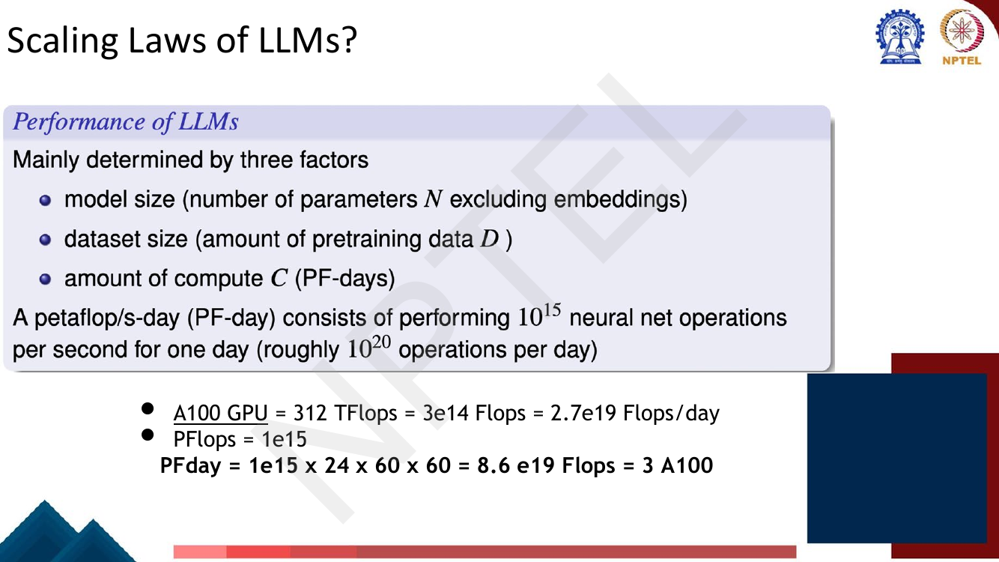
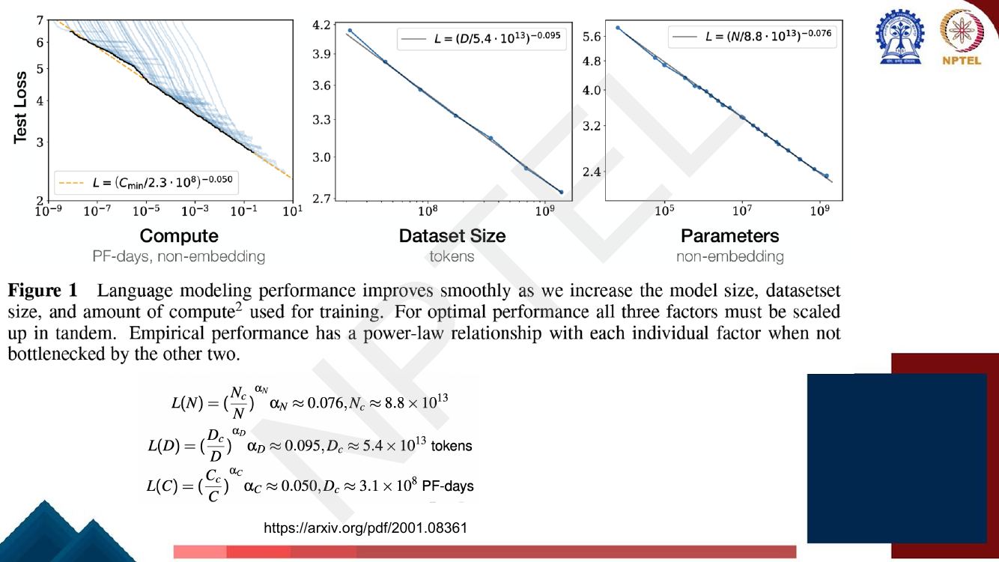
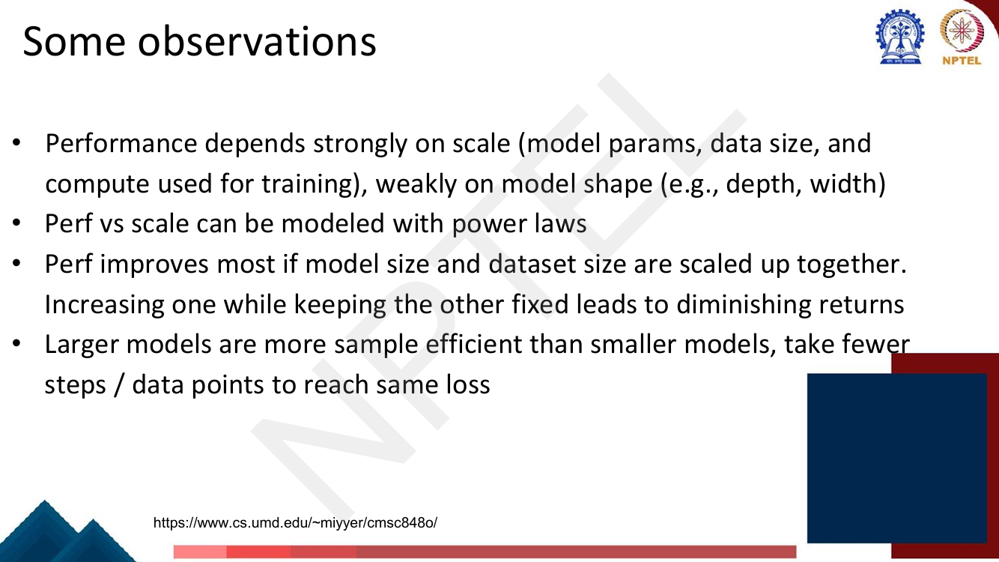
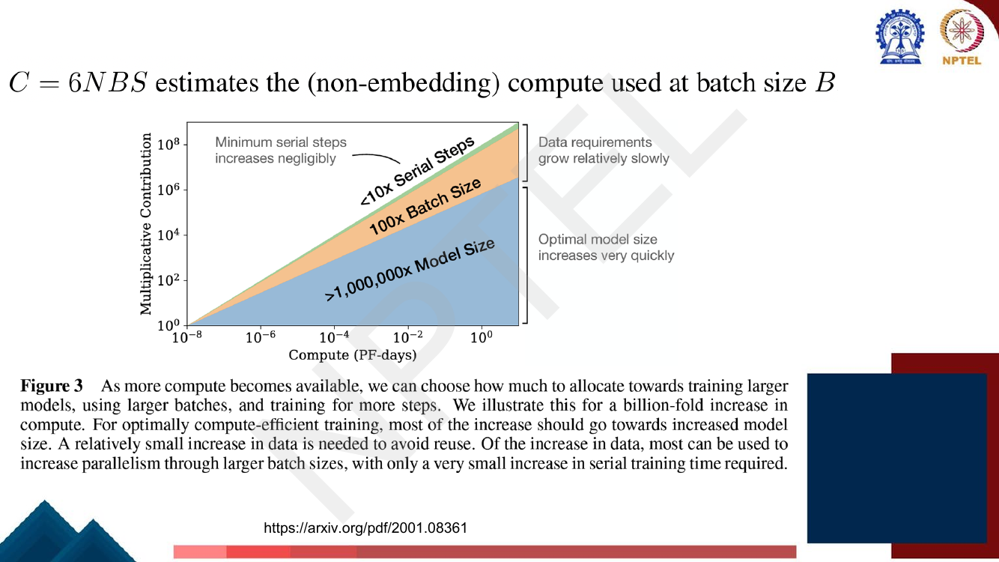

# Lec 51 — Scaling Laws of LLMs

> **Source:** `Week11.pdf` pp. 1–20 · **Week 11** · **Playlist:** Lec 51
> **Prereqs:** [Lec 29 — GPT and Decoder Pretraining](../week-06/29-gpt-decoder-pretraining.md), [Lec 10 — Gradient Descent and Initialization](../week-02/10-gradient-descent-and-init.md)
> **Feeds into:** [Lec 52 — Modern LLMs and Activations](52-modern-llms-and-activations.md)

## Why this lecture exists

By Lecture 29 you knew that GPT-3 has 175 billion parameters and that bigger models are better. What
you did not have was a way to *decide* anything. Given a fixed amount of GPU time — which is the only
situation anyone is ever actually in — should you train a big model on a little data, or a small model
on a lot? Until 2020 the honest answer was "nobody knows, try it". This lecture is the answer.

It turns out that test loss falls as a **power law** in model size, dataset size and compute, which
means the curves are *straight lines* on a log-log plot and can be extrapolated years ahead of the
hardware. The lecture gives you Kaplan et al.'s 2020 measurement of those lines, the arithmetic that
converts a GPU budget into a number of parameters and tokens, the methodological bug that made
Kaplan's conclusion wrong, and Hoffmann et al.'s 2022 correction — Chinchilla — which is the version
the field actually uses.

## The ideas

> **One boundary before we start.** [Lec 36](../week-08/36-instruction-finetuning-1.md) also has slides
> headed "Scaling Laws". Those are about *instruction-tuning data scaling* — how downstream task
> performance moves as you add more instruction-tuning tasks and examples. Same words, different
> subject. **This chapter owns the pretraining compute/parameter/data laws: Kaplan and Chinchilla.**

### The three knobs, and the unit compute is measured in

The deck opens by naming exactly three factors that determine how good a pretrained LM is:

| Symbol | Meaning | Note |
|---|---|---|
| $N$ | model size — number of parameters | **excluding embeddings** |
| $D$ | dataset size — amount of pretraining data, in tokens | |
| $C$ | compute used for training | measured in **PF-days** |


*Fig. — The "excluding embeddings" qualifier on $N$ is not decoration: embedding matrices are enormous and are touched once per token, so including them would distort the law. Note the hand-written conversion at the bottom — one PF-day ≈ three A100-days. Page 3.*

The **PF-day** (petaflop/s-day) is the deck's unit of compute: running at $10^{15}$ floating-point
operations per second for a full day.

$$1\ \text{PF-day} = 10^{15} \times 24 \times 60 \times 60 = 8.64 \times 10^{19}\ \text{FLOPs}$$

which the slide rounds to $8.6\times10^{19}$ and the box above it calls "roughly $10^{20}$ operations
per day". An NVIDIA A100 does 312 TFLOP/s, so one A100 for one day is $312\times10^{12}\times 86400
= 2.70\times10^{19}$ FLOPs, and one PF-day takes **about three A100s**. Those two numbers — $8.64
\times10^{19}$ and $2.7\times10^{19}$ — are the only hardware facts you need for every numerical below.

### Reading a log-log plot, which is the whole skill

A **power law** is a relationship of the form $y = a x^{-\alpha}$. Take $\log$ of both sides:

$$\log y = \log a - \alpha \log x$$

That is the equation of a **straight line** in the variables $\log x$ and $\log y$, with slope
$-\alpha$. So: *a power law is exactly a straight line on log-log axes, and the exponent is the
slope.* Every figure in this lecture has log-log axes for this reason, and nothing else in the lecture
makes sense until you can read them.

Three habits to build:

1. **One tick is a factor of 10, not a step of 10.** The gap from $10^7$ to $10^8$ on the $x$-axis is
   the same width as $10^8$ to $10^9$, and both mean "ten times more".
2. **Slope is read per decade.** Drop a decade on $x$ and see how far $y$ moves; the ratio of the two
   logs is $-\alpha$. A gentle-looking line can still be a strong law.
3. **Straightness is the claim.** The experimental content of "there is a scaling law" is that the
   points lie on a line across many decades. When a curve bends away from the line you have hit a
   bottleneck — a different resource ran out.

### Kaplan et al. (2020): the three power laws


*Fig. — The deck's single most important slide. Three log-log panels, three straight lines. The left panel's pale blue curves are individual training runs; the black line is their lower envelope, which is what the law fits. Notice the left panel spans **ten decades** of compute. Page 7.*

The paper is *Scaling Laws for Neural Language Models*, Kaplan, McCandlish et al., 2020,
[arXiv:2001.08361](https://arxiv.org/pdf/2001.08361) — the deck links it on four separate pages. Its
three fitted laws, exactly as the slide prints them:

$$L(N) = \left(\frac{N_c}{N}\right)^{\alpha_N}, \quad \alpha_N \approx 0.076,\ \ N_c \approx 8.8\times10^{13}$$

$$L(D) = \left(\frac{D_c}{D}\right)^{\alpha_D}, \quad \alpha_D \approx 0.095,\ \ D_c \approx 5.4\times10^{13}\ \text{tokens}$$

$$L(C) = \left(\frac{C_c}{C}\right)^{\alpha_C}, \quad \alpha_C \approx 0.050,\ \ C_c \approx 3.1\times10^{8}\ \text{PF-days}$$

Memorise the three exponents **0.076 / 0.095 / 0.050** and which one goes with which quantity; that
pairing is the single most likely MCQ in this lecture. The constants $N_c, D_c, C_c$ are the scale at
which the law predicts $L = 1$, so they are enormous and mostly serve to fix the intercept.

Two slide-level warnings:

- The third line of the equation block prints "$D_c \approx 3.1\times10^8$ PF-days" — a **typo for
  $C_c$**. PF-days are a unit of compute, not of tokens.
- The deck's own figure legend reads $L = (C_{\min}/2.3\cdot10^8)^{-0.050}$ while the equation block
  says $3.1\times10^8$. Both come from Kaplan's paper, which uses different constants for $L(C)$ and
  $L(C_{\min})$ (the optimally-allocated version). The exponent 0.050 is the same in both; if asked
  for a constant, quote the equation block's $3.1\times10^8$ and say which.

Note that the loss here is the cross-entropy of the language model in nats per token — the quantity
whose exponential is perplexity ([Lec 4](../week-01/04-ngram-lm-2-smoothing-perplexity.md)). **A
notation point:** this book writes the training objective $\mathcal{L}$, but Kaplan's laws are
universally written with a plain $L(N)$, $L(D)$, $L(C)$, and the deck follows that. This chapter keeps
$L(\cdot)$ for *the fitted test loss as a function of scale* and reserves $\mathcal{L}$ for the
objective you differentiate.

### The deck's four observations


*Fig. — Bullet 1 is the counterintuitive one and the deck's deepest claim: depth and width barely matter next to the total parameter count. Page 8.*

Reproduced faithfully, because each one is examinable on its own:

1. **Performance depends strongly on scale** (model parameters, data size, compute used for training)
   and **weakly on model shape** — depth, width, aspect ratio. Within a wide band, a 24-layer and a
   48-layer model with the same parameter count land in the same place.
2. **Performance versus scale can be modelled with power laws.**
3. **Performance improves most if model size and dataset size are scaled up together.** Increasing one
   while holding the other fixed leads to **diminishing returns** — the curve bends away from the line.
4. **Larger models are more sample efficient** than smaller ones: they reach the same loss in fewer
   optimisation steps and from fewer data points.


*Fig. — Every yellow (large-model) curve sits below and to the left of every purple (small-model) curve at matched tokens — that is observation 4 made visual. The right panel's callout, "compute-efficient training stops far short of convergence", is the one that justifies Kaplan's whole recommendation. Page 9.*

Page 10 repeats this with Kaplan's Figure 4 — loss against tokens in the dataset, one curve per model
size from 393.2K up to 708M parameters. Read it as observation 3: each model's curve **flattens** once
it has enough data. The 393.2K-parameter model is flat by $10^8$ tokens; more data buys it nothing,
because now the *model* is the bottleneck.

That flattening is the most useful thing on the page. A scaling law is a statement about what happens
**when the other factors are not the bottleneck**; Kaplan's own figure caption says so. The moment one
resource saturates, the straight line turns into a plateau.

### "One GPU for one day" — the deck's thought experiment


*Fig. — The deck gives no answers; the lecturer worked it live. All three options spend roughly the same compute, which is the point — they differ only in how they split it. Page 5.*

This is the whole lecture compressed into three questions, and it is worked in full as **N1** below.
Its purpose is to make you feel that $N$ and $D$ are not two independent dials you can both turn up:
with $C$ fixed, choosing $N$ *determines* $D$. Option 2 (500M parameters, one book) is the Kaplan
failure mode taken to absurdity — a huge model that sees so little text it memorises it. Option 3
(100k parameters, 5k books) is the opposite — endless data poured into a model with nowhere to put it,
which is the flat purple curve on page 10.

### FLOPs per token, and why the answer is 6

This is the most examinable arithmetic in the chapter. Build it in three steps.

**Step 1 — why 2 FLOPs per parameter in the forward pass.**


*Fig. — The deck's own answer, on the slide: one multiply and one add per weight. The text box is partly overlapped by the URL on the rendered page — the second step reads "The unit $j$ **adds** the unit $i$'s contribution to its total input $a(j)$". Page 13.*

Take one weight $w$ connecting unit $i$ to unit $j$. Computing $a(j) = \sum_i w_{ji}\, h(i)$ uses that
weight exactly twice:

1. **multiply** — $w_{ji} \times h(i)$;
2. **add** — accumulate that product into the running sum $a(j)$.

Two floating-point operations, per weight, per token. There is no third: the non-linearity, the bias
and the normalisation are $O(\text{units})$, not $O(\text{weights})$, and Kaplan's table explicitly
drops them as "sub-leading terms".

Concretely, for a matrix multiply $\mathbf{a} = \mathbf{W}\mathbf{h}$ with
$\mathbf{W}\in\mathbb{R}^{m\times n}$: the result has $m$ entries, each a dot product of length $n$,
costing $n$ multiplies and $n-1$ adds, so $m(2n-1) \approx 2mn = 2 \times (\text{number of weights})$.
The $-1$ is the only approximation and it vanishes for any real $n$.

**Step 2 — sum over the whole network.**


*Fig. — Every parameter-bearing row's FLOPs column is exactly twice its parameter column. The only row that breaks the pattern is "Attention: Mask", which has no parameters at all. Page 12.*

Read the table column against column: QKV has $n_{\text{layer}} d_{\text{model}} 3 d_{\text{attn}}$
parameters and $2 n_{\text{layer}} d_{\text{model}} 3 d_{\text{attn}}$ FLOPs; the feedforward block has
$n_{\text{layer}} 2 d_{\text{model}} d_{\text{ff}}$ parameters and twice that in FLOPs. Hence

$$C_{\text{forward}} = 2N + \underbrace{2\, n_{\text{layer}}\, n_{\text{ctx}}\, d_{\text{attn}}}_{\text{attention score/value matmuls}}$$

The second term is the $\mathbf{Q}\mathbf{K}^\top$ and $\alpha\mathbf{V}$ products, which use no
weights — they multiply activations by activations, so they scale with context length rather than
parameter count. The slide's condition $d_{\text{model}} \gg n_{\text{ctx}}/12$ is exactly the
statement that this term is negligible, and it holds for every model in this lecture. Drop it:
$C_{\text{forward}} \approx 2N$.

**Step 3 — add the backward pass.** The deck states it in one line: *"Accounting for the backwards
pass (approximately twice the compute as the forwards pass), we then define the estimated
non-embedding compute as $C \approx 6N$ floating point operators per training token."* The factor of 2
is because backprop computes two gradients per weight layer — the gradient with respect to the
*inputs* (to pass further back) and the gradient with respect to the *weights* — each costing about as
much as the forward matmul.

$$\boxed{\;C \approx 6ND\;}$$

**6 FLOPs per parameter per token: 2 forward + 4 backward.** The deck also prints the per-step form on
the facing page, $C = 6NBS$ at batch size $B$ for $S$ steps, which is the same statement with
$D = BS$ tokens.


*Fig. — This figure IS Kaplan's recommendation drawn as areas: of a $10^9\times$ compute increase, the overwhelming share goes to model size, a little to batch size, almost none to serial steps. Chinchilla is going to say the blue wedge is too big. Page 11.*

### What goes wrong with Kaplan's laws


*Fig. — A one-line methodological bug with a billion-dollar consequence. Page 14.*

The deck gives this a page, and the whole problem is the **learning-rate schedule**. Kaplan used one
cosine decay schedule, sized for a long run, across *all* training runs regardless of how many tokens
each actually saw. A cosine schedule only reaches its small final learning rate at the end of its
nominal length ([Lec 10](../week-02/10-gradient-descent-and-init.md)); a run that stops a tenth of the
way through stops while the learning rate is still high, and a high learning rate at the end of
training means the loss has not settled.

Which runs does that penalise? The ones that were stopped early relative to the schedule — i.e. **the
small models trained on a lot of tokens**. They were systematically *under-trained* and so posted
worse losses than they deserved. The fit therefore concluded that data was not buying much and that
the money should go into parameters. The deck's verdict is blunt: *"The resulting 'scaling laws' from
Kaplan et al. are flawed because of this!"*

### Chinchilla (Hoffmann et al., 2022): the correction

Page 15 is the DeepMind paper's title page: *Training Compute-Optimal Large Language Models*,
Hoffmann, Borgeaud, Mensch, Sifre et al., 2022. The title is the thesis — not "optimal models",
**compute-optimal** models. The question is always "best loss for a fixed $C$".

Hoffmann et al. re-ran the experiment with the schedule matched to each run's length, across more than
400 models from 70M to 16B parameters and 5B to 400B tokens. The straight lines came back with a
different slope.


*Fig. — The deck's own summary, and the cleanest comparison in the lecture. Check the arithmetic in each row: $5\times2 = 10$, $25\times4 = 100$, $3.1\times3.1 \approx 10$, $10\times10 = 100$ — all consistent with $C \propto ND$. Page 16.*

Reproduced exactly:

| | Kaplan et al., 2020 | Hoffmann et al., 2022 (Chinchilla) |
|---|---|---|
| **Rule** | prioritise increasing **model size** over data size | increase model and data size **at the same rate** |
| 10× more compute | model **5×**, data **2×** | model **3.1×**, data **3.1×** |
| 100× more compute | model **25×**, data **4×** | model **10×**, data **10×** |

In exponent form: write $N \propto C^{a}$ and $D \propto C^{b}$, with $a + b = 1$ forced by
$C = 6ND$. Kaplan gives $a = \log_{10} 5 = 0.70$, $b = \log_{10} 2 = 0.30$. Chinchilla gives
$a = \log_{10} 3.1 = 0.49 \approx b \approx 0.5$. **Chinchilla is the statement $a = b = 1/2$.**


*Fig. — Look at the Training Tokens column: every pre-Chinchilla model sits at roughly 300B tokens no matter its size, because nobody thought data was the lever. Chinchilla is below the rule because it is the answer, not a competitor. Page 17.*


*Fig. — The chapter's punchline, and the margin note matters as much as the table: modern models deliberately blow past 20:1 because they optimise **inference** cost, not training cost. Page 18.*

$$\boxed{D \approx 20N\ \ \text{tokens per parameter}}$$

Chinchilla itself is **70B parameters on 1.4T tokens** — four times smaller than Gopher, trained on
more than four times the data, for the *same* compute budget — and it beat Gopher, GPT-3, Jurassic and
MT-NLG across the board. GPT-3 at 175B/300B sits at **1.7 tokens per parameter**, about twelve times
under-fed.

The last point is the one students miss. "Over-trained" on page 18 is **not a criticism**. Llama 3 8B
at 1875 tokens/parameter is far from compute-optimal *for training* and is deliberately so: once you
intend to serve a model to millions of users, the cost that dominates is inference, and a smaller
model that is expensive to train is cheap forever after. Chinchilla answers "best loss per training
FLOP"; it does not answer "best model to deploy".

### Owned elsewhere

The modern model roll-call these ratios come from — Llama, Mistral, Qwen, GPT-4 — is
[Lec 52](52-modern-llms-and-activations.md). Counting a Transformer's parameters from
$d_{\text{model}}$ and $n_{\text{layer}}$ (the $12d^2$-per-block conventions) is
[Lec 24](../week-05/24-decoder-and-transformer-lm.md); the GPT-1/2/3 parameter table is
[Lec 29](../week-06/29-gpt-decoder-pretraining.md). Fitting a *trained* model into less memory by
quantization is [Lec 48](../week-10/48-quantization-qlora-1.md), and making attention itself cheaper
(sparse attention, MoE) is [Lec 25](../week-05/25-efficient-transformers.md) — both change the constant
in front of the law, not its slope.

## Worked numericals

### N1. The deck's "one GPU for one day" exercise (page 5)
**Given:** one A100 for one day $= 2.7\times10^{19}$ FLOPs. Three proposals: (a) 5M-parameter LM on
100 books; (b) 500M-parameter LM on one book; (c) 100k-parameter LM on 5k books. Take a book at
$\approx 100{,}000$ tokens. **The deck gives no answer.**
**Find:** the compute each needs, and which is the sane choice.

1. Token counts: (a) $100 \times 10^5 = 10^7$; (b) $1\times10^5 = 10^5$; (c) $5000\times10^5 = 5\times10^8$.
2. $C = 6ND$:
   (a) $6 \times 5\times10^6 \times 10^7 = 3.0\times10^{14}$ FLOPs.
   (b) $6 \times 5\times10^8 \times 10^5 = 3.0\times10^{14}$ FLOPs.
   (c) $6 \times 10^5 \times 5\times10^8 = 3.0\times10^{14}$ FLOPs.
3. **All three cost exactly the same** — $3\times10^{14}$ FLOPs, about $10^{-5}$ of the day's budget.
   They are three ways of splitting one compute budget, which is why the slide can compare them.
4. Tokens per parameter: (a) $10^7/5\times10^6 = \mathbf{2}$; (b) $10^5/5\times10^8 = \mathbf{0.0002}$;
   (c) $5\times10^8/10^5 = \mathbf{5000}$.
5. Chinchilla wants 20. Option (b) is off by a factor of $10^5$ — a 500M model would memorise one book
   in a few epochs and learn nothing general. Option (c) is off by 250× the other way — it is the flat
   purple curve on page 10, where extra data buys nothing. Option (a), at 2 tokens/parameter, is the
   only one within an order of magnitude; it is under-fed by 10×, which is roughly GPT-3's error.
6. The compute-optimal split of $3\times10^{14}$ FLOPs: $N = \sqrt{C/120} = \sqrt{2.5\times10^{12}}
   = 1.58\times10^6$ parameters on $3.16\times10^7$ tokens — about **1.6M parameters on 316 books**.

**Answer:** all three are the same compute; **(a) is the best of the three**, and the actual optimum is
≈1.6M parameters on ≈316 books. The deck provides no solution — this is derived from $C = 6ND$ and the
20:1 rule.

### N2. Two FLOPs per parameter, worked for one matrix multiply (page 13)
**Given:** a linear layer $\mathbf{a} = \mathbf{W}\mathbf{h}$ with $\mathbf{W} \in \mathbb{R}^{4\times3}$
(so 12 weights), applied to one token.
**Find:** the exact FLOP count, and the rule it generalises to.

1. Each output $a_j = \sum_{i=1}^{3} w_{ji} h_i$ needs 3 multiplies.
2. Summing 3 products needs 2 additions.
3. Per output: $3 + 2 = 5$ FLOPs. For 4 outputs: $4 \times 5 = \mathbf{20}$ FLOPs.
4. The approximation: $2 \times (\text{weights}) = 2 \times 12 = 24$. The gap is the $m$ missing
   additions ($4 \times 1$): $24 - 20 = 4$. ✓
5. Relative error $= 4/24 = 17\%$ here, but it is $1/(2n)$ in general — for $n = d_{\text{model}} = 4096$
   it is $0.012\%$. **So $2$ FLOPs per parameter per token is exact in the limit that matters.**
6. Forward $= 2N$. Backward computes $\partial\mathcal{L}/\partial\mathbf{h}$ (one matmul of the same
   size) and $\partial\mathcal{L}/\partial\mathbf{W}$ (another), so backward $\approx 2 \times$ forward
   $= 4N$.
7. Total per token $= 2N + 4N = 6N$. Over $D$ tokens: $C = 6ND$.

**Answer:** 20 exact FLOPs vs the $2mn = 24$ estimate; the rule is **2 forward + 4 backward = 6 FLOPs
per parameter per token**, i.e. $C \approx 6ND$.

### N3. GPT-3's training compute, in FLOPs, PF-days, GPU-days and dollars
**Given:** $N = 175\times10^9$ parameters, $D = 300\times10^9$ tokens. A100 $= 2.7\times10^{19}$
FLOPs/day; 1 PF-day $= 8.64\times10^{19}$ FLOPs; assume **30% model-FLOPs utilisation** and
**\$2 per GPU-hour**.
**Find:** $C$, the PF-day count, the A100-days, and the cost.

1. $C = 6ND = 6 \times 1.75\times10^{11} \times 3.0\times10^{11}$.
2. $6 \times 1.75 \times 3.0 = 31.5$, and $10^{11}\times10^{11} = 10^{22}$, so
   $C = 31.5\times10^{22} = \mathbf{3.15\times10^{23}}$ FLOPs.
   (Using the exact 174.6B count from [Lec 29](../week-06/29-gpt-decoder-pretraining.md) gives
   $3.14\times10^{23}$ — the usually-quoted figure.)
3. PF-days: $3.15\times10^{23} / 8.64\times10^{19} = \mathbf{3646}$ PF-days.
4. A100-days at 100% utilisation: $3.15\times10^{23}/2.7\times10^{19} = 11{,}667$ GPU-days.
5. At 30% utilisation: $11{,}667/0.30 = \mathbf{38{,}900}$ A100-days $= 933{,}600$ GPU-hours.
6. Cost: $933{,}600 \times \$2 = \mathbf{\$1.87\ \text{million}}$ of pure GPU time.
7. Wall-clock sanity check: on 1024 A100s that is $38{,}900/1024 = 38$ days.

**Answer:** $C = 3.15\times10^{23}$ FLOPs $=$ 3646 PF-days $\approx$ 38,900 A100-days at 30% MFU
$\approx$ **\$1.87M**. Page 4's slide quotes "O(1–10) \$M" for GPT-3 — consistent.

### N4. Chinchilla-optimal allocation of GPT-3's budget, versus Kaplan's
**Given:** budget $C = 3.15\times10^{23}$ FLOPs (N3). Chinchilla rule $D = 20N$.
**Find:** the compute-optimal $(N, D)$, and contrast with Kaplan's recipe.

1. Substitute into $C = 6ND$: $C = 6N(20N) = 120N^2$.
2. $N = \sqrt{C/120} = \sqrt{3.15\times10^{23}/120} = \sqrt{2.625\times10^{21}}$.
3. $\sqrt{2.625} = 1.6202$ and $\sqrt{10^{21}} = \sqrt{10}\times10^{10} = 3.1623\times10^{10}$, so
   $N = 1.6202 \times 3.1623\times10^{10} = \mathbf{5.12\times10^{10}}$ — about **51 billion parameters**.
4. $D = 20N = \mathbf{1.02\times10^{12}}$ — about **1.0 trillion tokens**.
5. Check: $6 \times 5.12\times10^{10} \times 1.02\times10^{12} = 3.15\times10^{23}$ ✓
6. Kaplan's recipe for the same budget: starting from a $10^{21}$-FLOP anchor at (2.89B, 57.7B tokens)
   and applying $N\propto C^{0.70}$, $D\propto C^{0.30}$ over the $315\times$ increase gives
   $N \approx 1.7\times10^{11}$ (170B) on $D\approx 3.1\times10^{11}$ (310B tokens) — **which is GPT-3,
   almost exactly.** That is not a coincidence; GPT-3 was sized by this reasoning.

**Answer:** compute-optimal is **51B parameters on 1.02T tokens**. OpenAI spent the same FLOPs on
175B/300B. Kaplan's rule picks a model 3.4× too big and a dataset 3.4× too small.

### N5. Tokens per parameter — GPT-3 against Chinchilla
**Given:** GPT-3 175B/300B; Chinchilla 70B/1.4T (page 18).
**Find:** both ratios, how many tokens GPT-3 should have had, and how big it should have been.

1. GPT-3: $300\times10^9 / 175\times10^9 = \mathbf{1.71}$ tokens per parameter.
2. Chinchilla: $1.4\times10^{12} / 70\times10^9 = \mathbf{20.0}$ tokens per parameter.
3. GPT-3 at 20:1 would need $20 \times 175\times10^9 = \mathbf{3.5\times10^{12}}$ tokens — **3.5
   trillion**, i.e. $3.5\times10^{12}/3\times10^{11} = 11.7\times$ what it got.
4. That would cost $C = 6 \times 1.75\times10^{11} \times 3.5\times10^{12} = 3.68\times10^{24}$ FLOPs
   — 11.7× GPT-3's actual budget. **Not an option at fixed compute.**
5. Holding the 300B tokens and fixing the model instead: $N = D/20 = 3\times10^{11}/20 =
   \mathbf{1.5\times10^{10}}$ — a 15B model would have been correctly fed by GPT-3's corpus.
6. Chinchilla's actual compute: $6\times7\times10^{10}\times1.4\times10^{12} = 5.88\times10^{23}$
   FLOPs, only 1.9× GPT-3's, for a model that beats it on every benchmark.

**Answer:** 1.71 vs 20.0 tokens/parameter; GPT-3 needed **3.5T tokens** to be compute-optimal at
175B, or should have been a **15B** model given the corpus it actually had.

### N6. Power-law extrapolation and diminishing returns
**Given:** $L(N) = (N_c/N)^{\alpha_N}$ with $\alpha_N = 0.076$, $N_c = 8.8\times10^{13}$ (page 7).
**Find:** $L$ at $N = 10^9$ and $N = 10^{10}$, the gain from one 10× scale-up, and the gain from the next.

1. $N = 10^9$: $N_c/N = 8.8\times10^{13}/10^9 = 8.8\times10^4$.
2. $L = (8.8\times10^4)^{0.076}$. Take logs: $\log_{10}(8.8\times10^4) = 4.9445$;
   $0.076 \times 4.9445 = 0.37578$; $10^{0.37578} = \mathbf{2.376}$.
3. $N = 10^{10}$: $N_c/N = 8800$, $\log_{10} = 3.9445$, $\times0.076 = 0.29978$,
   $10^{0.29978} = \mathbf{1.994}$.
4. **The general rule:** every 10× in $N$ multiplies the loss by $10^{-0.076} = \mathbf{0.8395}$ —
   a flat **16.1% reduction per decade**, forever. Check: $2.376 \times 0.8395 = 1.994$ ✓
5. Absolute gain from $10^9 \to 10^{10}$: $2.376 - 1.994 = \mathbf{0.382}$ nats.
6. Next decade, $10^{10}\to10^{11}$: $1.994 \times 0.8395 = 1.674$; gain $= \mathbf{0.320}$ nats.
7. **Diminishing returns in absolute terms, constant in relative terms.** This is the signature of a
   power law and the reason the plot is log-log: in *log* loss the drops are identical.

**Answer:** $L(10^9) = 2.376$, $L(10^{10}) = 1.994$; a 10× scale-up buys 0.382 nats, the next 10×
buys only 0.320. At $N = 175$B the law predicts $L = 1.604$.

### N7. Reading a point off a log-log plot, and recovering the exponent
**Given:** the middle panel of page 7 — test loss against dataset size. Two points on the fitted line
read off the axes: at $D = 10^8$ tokens the line sits at $L \approx 3.50$; just below $D = 10^9$ it
sits at $L \approx 2.82$.
**Find:** the slope, and hence $\alpha_D$; then convert back to linear scale.

1. Convert both to logs: $\log_{10} 3.50 = 0.5441$; $\log_{10} 2.82 = 0.4502$.
2. $x$ moved exactly one decade: $\log_{10} 10^9 - \log_{10} 10^8 = 1$.
3. Slope $= (0.4502 - 0.5441)/1 = \mathbf{-0.0939}$.
4. A power law reads $L \propto D^{-\alpha_D}$, so $\alpha_D = 0.0939 \approx \mathbf{0.095}$ — the
   deck's printed exponent, recovered from two points on the picture.
5. Back to linear: the ratio per decade is $10^{-0.095} = 0.8035$, i.e. **ten times the data removes
   20% of the loss.**
6. Extrapolate to $D = 10^{12}$ (three more decades): $2.82 \times 0.8035^3 = 2.82 \times 0.5187 =
   \mathbf{1.46}$.
7. Sanity check against the formula: $(5.4\times10^{13}/10^8)^{0.095} = 3.504$ ✓ and
   $(5.4\times10^{13}/10^9)^{0.095} = 2.816$ ✓ — the eyeballed readings were right.

**Answer:** slope $-0.094$, so $\alpha_D \approx 0.095$; each decade of data costs the loss a factor
$0.80$, predicting $L \approx 1.46$ at a trillion tokens.

### N8. The cost of the LLaMA-65B run, and what its throughput implies (page 4)
**Given:** the deck's page 4: LLaMA 65B, 1.4T tokens, 2048 A100 GPUs, 21 days, \$5M.
**Find:** the compute, the implied utilisation, the tokens/second/GPU, and the implied GPU-hour price.

1. $C = 6ND = 6 \times 6.52\times10^{10} \times 1.4\times10^{12} = \mathbf{5.48\times10^{23}}$ FLOPs
   (using the deck's exact 65.2B from the LLaMA table).
2. GPU-days available: $2048 \times 21 = \mathbf{43{,}008}$ A100-days.
3. Peak FLOPs available: $43{,}008 \times 2.7\times10^{19} = 1.16\times10^{24}$.
4. Utilisation: $5.48\times10^{23}/1.16\times10^{24} = \mathbf{47\%}$ — a plausible, well-engineered
   MFU, which confirms both the $6ND$ estimate and the deck's figures are mutually consistent.
5. Throughput: $1.4\times10^{12}$ tokens $/(2048 \times 21 \times 86400\ \text{s}) = \mathbf{377}$
   tokens/second/GPU. The LLaMA paper reports 380 — the model reproduces the paper.
6. GPU-hours: $43{,}008 \times 24 = 1{,}032{,}192$. At \$2/hour that is \$2.06M.
7. The deck's \$5M implies $5\times10^6/1{,}032{,}192 = \mathbf{\$4.84}$ per A100-hour — a 2023 cloud
   list price, and a reminder that the quoted dollar figure includes the markup, not just the silicon.

**Answer:** $5.48\times10^{23}$ FLOPs over 43,008 A100-days at 47% MFU and 377 tokens/s/GPU;
\$2.06M at \$2/GPU-hour, and the deck's \$5M corresponds to \$4.84/GPU-hour.

## Code

```python
import numpy as np

FLOPS_PER_PARAM_PER_TOKEN = 6          # 2 forward + 4 backward
PF_DAY = 1e15 * 24 * 60 * 60           # 8.64e19 FLOPs -- the deck's unit

def compute(N, D):
    """Training FLOPs for N parameters over D tokens:  C = 6ND."""
    return FLOPS_PER_PARAM_PER_TOKEN * N * D

def chinchilla_split(C, tokens_per_param=20.0):
    """C = 6*N*(r*N) = 6r N^2  ->  N = sqrt(C / (6r)),  D = r*N."""
    N = np.sqrt(C / (FLOPS_PER_PARAM_PER_TOKEN * tokens_per_param))
    return N, tokens_per_param * N

def kaplan_split(C, C0, N0, D0):
    """Kaplan: 10x compute -> 5x params, 2x data, i.e. N ~ C^0.70, D ~ C^0.30."""
    f = C / C0
    return N0 * f ** np.log10(5), D0 * f ** np.log10(2)

# --- 1. GPT-3's training compute (matches N3) ---------------------------
C_gpt3 = compute(175e9, 300e9)
print(f"GPT-3  C = 6 x 175e9 x 300e9 = {C_gpt3:.3e} FLOPs"
      f"  = {C_gpt3/PF_DAY:,.0f} PF-days")
print(f"       tokens/param = {300e9/175e9:.2f}"
      f"   Chinchilla wants {20*175e9:.1e} tokens ({20*175e9/300e9:.1f}x more)")

# --- 2. Chinchilla-optimal allocation across budgets (matches N4) -------
print("\n  budget C      N (params)     D (tokens)    check 6ND")
for C in (1e21, 1e22, 1e23, C_gpt3, 1e24, 1e25):
    N, D = chinchilla_split(C)
    print(f"  {C:.2e}   {N:12.3e}   {D:12.3e}   {compute(N,D):.3e}")

# --- 3. same budget, Kaplan's recipe vs Chinchilla's --------------------
C0 = 1e21
N0, D0 = chinchilla_split(C0)          # agree at the anchor, diverge after
print(f"\nanchored at C0={C0:.0e}: N0={N0:.2e}, D0={D0:.2e}")
for C in (1e22, 1e23, 1e24):
    Nk, Dk = kaplan_split(C, C0, N0, D0)
    Nc, Dc = chinchilla_split(C)
    print(f"  C={C:.0e}  Kaplan N={Nk:.2e} D={Dk:.2e} ({Dk/Nk:6.1f} tok/param)"
          f" | Chinchilla N={Nc:.2e} D={Dc:.2e} ({Dc/Nc:5.1f} tok/param)")

# --- 4. Kaplan's power law for the loss (matches N6) ---------------------
alpha_N, N_c = 0.076, 8.8e13
L = lambda N: (N_c / N) ** alpha_N
print(f"\nL(N) = (8.8e13 / N)^0.076")
for N in (1e8, 1e9, 1e10, 1e11):
    print(f"  N = {N:.0e}  ->  L = {L(N):.4f}")
print(f"  every 10x in N multiplies L by 10^-0.076 = {10**-alpha_N:.4f}"
      f"  ({(1-10**-alpha_N)*100:.1f}% off the loss)")
print(f"  absolute gain 1e9->1e10: {L(1e9)-L(1e10):.4f};"
      f"  1e10->1e11: {L(1e10)-L(1e11):.4f}   <- diminishing")
```

```
GPT-3  C = 6 x 175e9 x 300e9 = 3.150e+23 FLOPs  = 3,646 PF-days
       tokens/param = 1.71   Chinchilla wants 3.5e+12 tokens (11.7x more)

  budget C      N (params)     D (tokens)    check 6ND
  1.00e+21      2.887e+09      5.774e+10   1.000e+21
  1.00e+22      9.129e+09      1.826e+11   1.000e+22
  1.00e+23      2.887e+10      5.774e+11   1.000e+23
  3.15e+23      5.123e+10      1.025e+12   3.150e+23
  1.00e+24      9.129e+10      1.826e+12   1.000e+24
  1.00e+25      2.887e+11      5.774e+12   1.000e+25

anchored at C0=1e+21: N0=2.89e+09, D0=5.77e+10
  C=1e+22  Kaplan N=1.44e+10 D=1.15e+11 (   8.0 tok/param) | Chinchilla N=9.13e+09 D=1.83e+11 ( 20.0 tok/param)
  C=1e+23  Kaplan N=7.22e+10 D=2.31e+11 (   3.2 tok/param) | Chinchilla N=2.89e+10 D=5.77e+11 ( 20.0 tok/param)
  C=1e+24  Kaplan N=3.61e+11 D=4.62e+11 (   1.3 tok/param) | Chinchilla N=9.13e+10 D=1.83e+12 ( 20.0 tok/param)

L(N) = (8.8e13 / N)^0.076
  N = 1e+08  ->  L = 2.8300
  N = 1e+09  ->  L = 2.3756
  N = 1e+10  ->  L = 1.9943
  N = 1e+11  ->  L = 1.6741
  every 10x in N multiplies L by 10^-0.076 = 0.8395  (16.1% off the loss)
  absolute gain 1e9->1e10: 0.3814;  1e10->1e11: 0.3202   <- diminishing
```

The third block is the chapter in one table. Both recipes start from the same point, but Kaplan's
tokens-per-parameter ratio *collapses* as the budget grows — 8.0, then 3.2, then 1.3 — while
Chinchilla's stays pinned at 20. The 1.3 at $10^{24}$ FLOPs is GPT-3's 1.7 all over again: Kaplan's
rule does not merely under-feed large models, it under-feeds them **worse the larger they get**.

## Exam pack

### Must-memorise

| Item | Exactly this |
|---|---|
| The three factors | $N$ = parameters (**excluding embeddings**), $D$ = dataset size in tokens, $C$ = compute in PF-days |
| PF-day | $10^{15}$ ops/s for one day $= 8.64\times10^{19}$ FLOPs ("roughly $10^{20}$"); $\approx$ 3 A100-days |
| A100 | 312 TFLOP/s $= 2.7\times10^{19}$ FLOPs/day |
| $L(N)$ | $(N_c/N)^{\alpha_N}$, $\alpha_N \approx 0.076$, $N_c \approx 8.8\times10^{13}$ |
| $L(D)$ | $(D_c/D)^{\alpha_D}$, $\alpha_D \approx 0.095$, $D_c \approx 5.4\times10^{13}$ tokens |
| $L(C)$ | $(C_c/C)^{\alpha_C}$, $\alpha_C \approx 0.050$, $C_c \approx 3.1\times10^{8}$ PF-days |
| Power law on log-log | a straight line; **slope $= -\alpha$** |
| Forward FLOPs/parameter/token | **2** — one multiply, one add |
| Backward | $\approx 2\times$ forward $= 4N$ |
| **Training compute** | $\boxed{C \approx 6ND}$, equivalently $C = 6NBS$ at batch $B$ for $S$ steps |
| Kaplan's full forward count | $C_{\text{forward}} = 2N + 2 n_{\text{layer}} n_{\text{ctx}} d_{\text{attn}}$; second term negligible when $d_{\text{model}} \gg n_{\text{ctx}}/12$ |
| Kaplan's recipe | 10× compute → **5×** model, **2×** data; 100× → **25×** model, **4×** data |
| Chinchilla's recipe | 10× compute → **3.1×** both; 100× → **10×** both |
| Chinchilla TLDR | **~20 tokens per parameter** |
| Chinchilla-optimal split | $N = \sqrt{C/120}$, $D = 20N$ |
| Kaplan's bug | one **learning-rate schedule** for all runs → small/long runs under-trained → bias toward bigger models |
| Papers | Kaplan et al. **2020**, arXiv **2001.08361**; Hoffmann et al. **2022**, *Training Compute-Optimal Large Language Models* (DeepMind) |

### Numbers worth knowing

| Quantity | Value |
|---|---|
| Chinchilla | 70B params, 1.4T tokens, **20** tokens/param |
| GPT-3 | 175B params, 300B tokens, **1.71** tokens/param, $C = 3.15\times10^{23}$ FLOPs = 3646 PF-days |
| GPT-3's compute-optimal twin | **51B params on 1.02T tokens** |
| Tokens GPT-3 needed at 20:1 | **3.5T** (11.7× what it got) |
| Deck's page-17 table | LaMDA 137B/168B · GPT-3 175B/300B · Jurassic 178B/300B · Gopher 280B/300B · MT-NLG 530B/270B · Chinchilla 70B/1.4T |
| Deck's page-18 table | Chinchilla 20 · Llama 3 70B/14T = **200** · Phi-3 3.8B/3.3T = **875** · Llama 3 8B/14T = **1875** tokens/param |
| GPT-3 training (deck p. 4) | $O(1000{-}10{,}000)$ V100s, $O(1)$ month, $O(1{-}10)$ \$M; 50,257 vocab, 2048 context |
| LLaMA-65B training (deck p. 4) | 2048 A100s, 21 days, \$5M; 32,000 vocab, 2048 context, 1–1.4T tokens |
| Kaplan model range | $10^3$ to $10^9$ non-embedding parameters |
| Loss reduction per 10× params | factor $10^{-0.076} = 0.84$, i.e. **16%** |
| Loss reduction per 10× data | factor $10^{-0.095} = 0.80$, i.e. **20%** |

### Likely MCQ traps

- **"$C = 6ND$ means 6 FLOPs per token."** No — **6 per parameter per token**. The 6 is the sum
  $2 + 4$, and $N$ must appear in the product.
- **Mis-splitting the 6.** It is **2 forward + 4 backward**, not 3+3 and not 4+2. The backward pass is
  *twice* the forward, not equal to it.
- **Swapping the exponents.** $\alpha_N = 0.076$ goes with *parameters*; $\alpha_D = 0.095$ with
  *data*; $\alpha_C = 0.050$ with *compute*. The data exponent is the largest of the three.
- **Attributing "20 tokens per parameter" to Kaplan.** It is **Chinchilla / Hoffmann et al. 2022**.
  Kaplan's implied ratio shrinks as the budget grows.
- **"Kaplan said scale data and parameters equally."** That is Chinchilla. Kaplan said **prioritise
  model size** (5× model for 2× data at 10× compute).
- **Confusing this with Lec 36's "scaling laws".** Lec 36's are about *instruction-tuning data*;
  these are pretraining compute/parameter/data laws.
- **Including embeddings in $N$.** The deck says "excluding embeddings" on page 3 and Kaplan's Table 1
  labels its total "Non-Embedding".
- **"Over-trained models are badly trained."** Page 18's note is descriptive. Llama 3 at 1875
  tokens/param is optimising *inference* cost, not training cost.
- **"Larger models need more data to reach a given loss."** Backwards. Observation 4: larger models are
  **more sample efficient** — fewer steps and fewer data points for the same loss.
- **PF-day confusion.** $8.64\times10^{19}$ FLOPs, not $10^{15}$. $10^{15}$ is the *rate*.
- **"Model shape matters a lot."** Observation 1 says performance depends **weakly** on depth/width at
  fixed parameter count.
- **"A straight log-log line means linear growth."** It means a **power law**. Linear growth is a
  curve on log-log axes.

### Self-test

1. State $C \approx 6ND$ and say where each of the 6 FLOPs comes from.
2. Why 2 FLOPs per parameter in the forward pass? Name both operations.
3. A model has 7B parameters and is trained on 2T tokens. What is $C$, in FLOPs and in PF-days?
4. Give Kaplan's three power laws with their exponents.
5. You have $1.2\times10^{22}$ FLOPs. What are the Chinchilla-optimal $N$ and $D$?
6. What is GPT-3's tokens-per-parameter ratio, and what does Chinchilla say it should be?
7. What methodological error invalidated Kaplan's conclusion, and which models did it penalise?
8. By what factor does the test loss fall when you multiply $N$ by 10, under $\alpha_N = 0.076$?
9. A log-log plot of loss against data passes through $(10^7, 4.0)$ and $(10^9, 2.6)$. What is the exponent?
10. Chinchilla has 70B parameters and beat the 280B Gopher. How is that possible at equal compute?
11. Llama 3 8B used 1875 tokens per parameter. Is that a mistake? Explain.
12. One A100 for one day. Roughly how many parameters can you train compute-optimally?

<details><summary>Answers</summary>

1. $C \approx 6ND$: 2 FLOPs per parameter per token in the forward pass (one multiply, one add) plus
   about 4 in the backward pass (backprop costs roughly twice the forward, computing gradients with
   respect to both the inputs and the weights).
2. The weight is used once to **multiply** the sending unit's activation $h(i)$, and once when the
   receiving unit **adds** that product into its total input $a(j)$.
3. $C = 6 \times 7\times10^9 \times 2\times10^{12} = 8.4\times10^{22}$ FLOPs
   $= 8.4\times10^{22}/8.64\times10^{19} = 972$ PF-days.
4. $L(N) = (N_c/N)^{0.076}$, $N_c = 8.8\times10^{13}$; $L(D) = (D_c/D)^{0.095}$,
   $D_c = 5.4\times10^{13}$; $L(C) = (C_c/C)^{0.050}$, $C_c = 3.1\times10^{8}$ PF-days.
5. $N = \sqrt{1.2\times10^{22}/120} = \sqrt{10^{20}} = 10^{10}$ parameters; $D = 2\times10^{11}$ tokens.
   (10B on 200B tokens.)
6. $300/175 = 1.71$ tokens per parameter; Chinchilla says ~20, so GPT-3 was ~12× under-fed.
7. One fixed learning-rate schedule across runs of very different lengths. It penalised the runs that
   stopped early relative to the schedule — the **small models trained on many tokens** — making data
   look less valuable than it is and biasing the recommendation toward larger models.
8. By $10^{-0.076} = 0.8395$, i.e. a 16.1% reduction — and the *same* 16.1% for every further decade.
9. Slope $= (\log_{10}2.6 - \log_{10}4.0)/(9-7) = (0.4150 - 0.6021)/2 = -0.0936$, so $\alpha \approx 0.094$.
10. At equal compute, $C = 6ND$ lets you trade model size for tokens. Chinchilla spent the saving on
    data: 1.4T tokens against Gopher's 300B. Gopher was under-trained at 1.07 tokens/param; Chinchilla
    sat at the optimum of 20.
11. Not a mistake. It is deliberately **not compute-optimal for training** because the objective is
    cheap *inference*: a small model that is expensive to train is cheap to serve forever. Chinchilla
    optimises loss per training FLOP only.
12. $C = 2.7\times10^{19}$ FLOPs at 100% utilisation, so $N = \sqrt{C/120} = \sqrt{2.25\times10^{17}}
    = 4.7\times10^{8}$ — about 470M parameters on 9.5B tokens (and roughly 260M at a realistic 30% MFU).

</details>

## Beyond the slides

**Gap: the Chinchilla law has a closed form, not just a ratio.**
**Why it matters:** Hoffmann et al. fit $L(N,D) = E + A/N^{\alpha} + B/D^{\beta}$ with
$E = 1.69$, $A = 406.4$, $B = 410.7$, $\alpha = 0.34$, $\beta = 0.28$. The $E$ term is the
**irreducible loss** — the entropy of natural language itself, which no amount of scale removes.
Kaplan's single-term laws have no such floor and therefore predict loss $\to 0$, which is nonsense.
That the two exponents are nearly equal ($0.34 \approx 0.28$) is *why* $N$ and $D$ should scale
together; the 20:1 ratio is a consequence, not an axiom.

**Gap: the A100's "312 TFLOPS" is a BF16 tensor-core number.**
**Why it matters:** the same chip does only 19.5 TFLOP/s in FP32. Every compute budget in this lecture
silently assumes mixed-precision training. An exam question that quotes a different precision, or an
H100 (≈990 TFLOP/s BF16), changes every GPU-day answer by more than an order of magnitude — so always
state the precision you assumed.

**Gap: nobody ever hits peak FLOPS.**
**Why it matters:** real large-model training runs at 30–55% **model FLOPs utilisation** (MFU). N8
recovers 47% for LLaMA-65B from the deck's own numbers. If you divide $C$ by peak throughput you will
under-estimate the GPU-days by 2–3×, which is the difference between a plausible answer and a
nonsensical one.

**Gap: $C = 6ND$ ignores attention and activation recomputation.**
**Why it matters:** the dropped term $2n_{\text{layer}}n_{\text{ctx}}d_{\text{attn}}$ is negligible at
2048 context but not at 128k — long-context models ([Lec 54](54-long-sequence-modeling.md)) break the
formula. And gradient checkpointing, used in nearly every large run, re-runs the forward pass to save
memory, pushing the true constant from 6 toward 8.

**Gap: data runs out.**
**Why it matters:** the Chinchilla rule says a 1T-parameter model wants 20T tokens, which is of the
same order as the entire high-quality public web. "Scale the data" stops being free advice around
there, which is why repetition, synthetic data and data curation became research topics after 2023.
The slides stop at the law and never mention its ceiling.

## Cut from the slides

Pages 1, 2, 19 and 20 are the title, "Concepts Covered", the reference (Jurafsky & Martin, *SLP3*
3rd edition, August 2024, **Chapter 10**) and "Thank You" — folded into the front matter and this
paragraph. Page 6 is the Kaplan author list, reduced to the citation. Page 4's two example models
(GPT-3 and LLaMA, with their hyperparameter tables from the original papers) are a Karpathy *State of
GPT* slide: I kept its training-cost figures, which drive N8 and the Numbers table, but did not
reproduce the per-size architecture tables — [Lec 29](../week-06/29-gpt-decoder-pretraining.md) owns
the GPT-3 family table and [Lec 52](52-modern-llms-and-activations.md) owns the LLaMA roll-call. The
"Attention: Mask" and "De-embed" rows of Kaplan's Table 1 are shown in the figure but not re-derived,
since neither contributes to $6ND$. I added the Chinchilla closed-form fit, MFU, precision and
data-exhaustion material in *Beyond the slides* because the deck's 20 pages give the law without any
of the caveats that make it usable.
