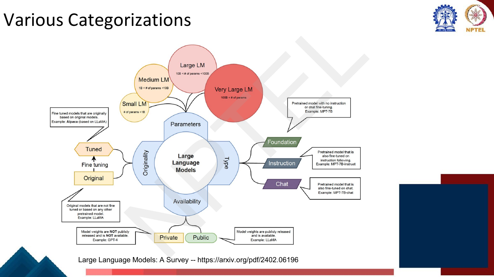
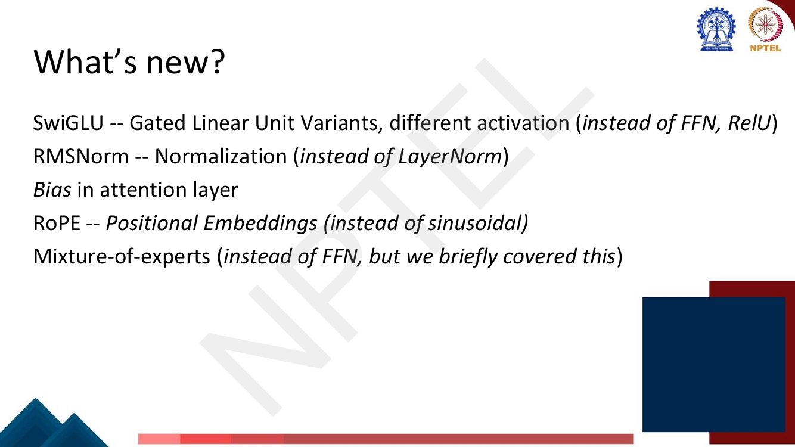
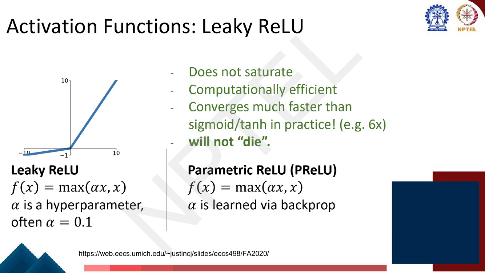
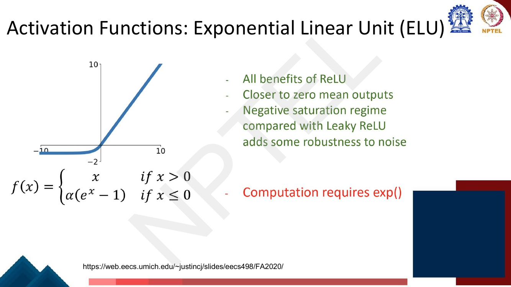
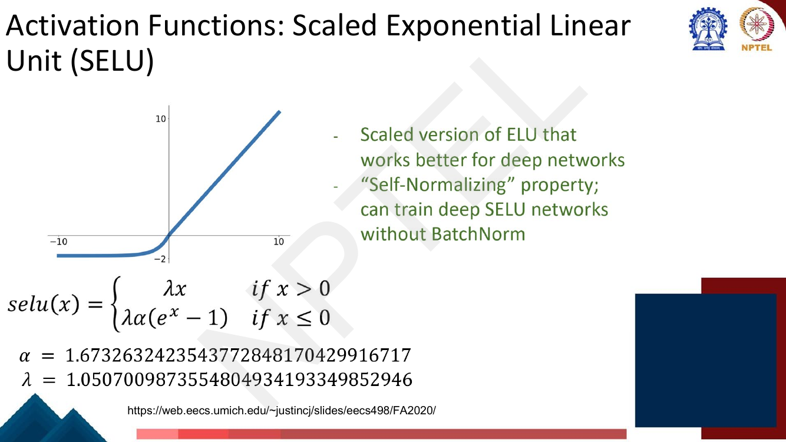
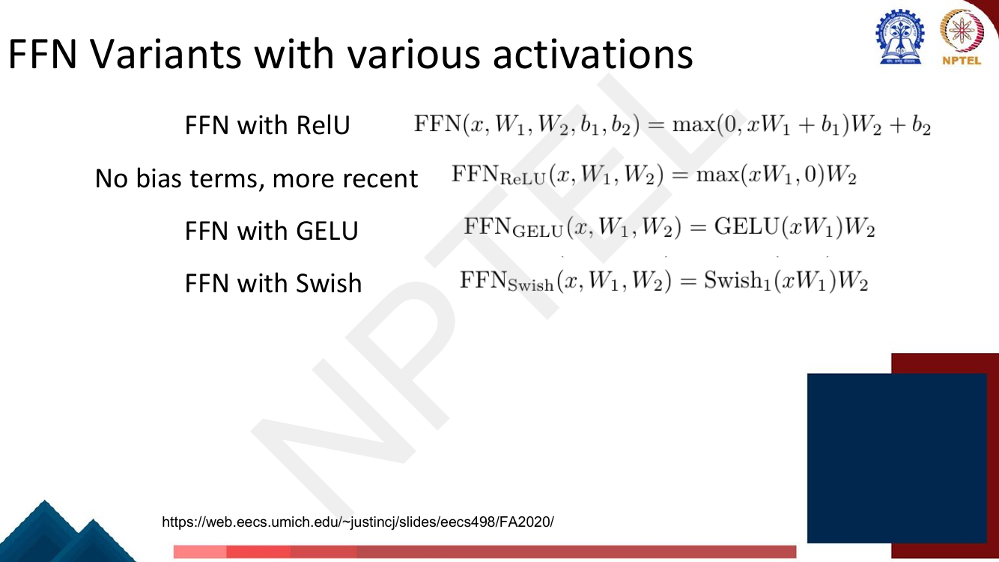
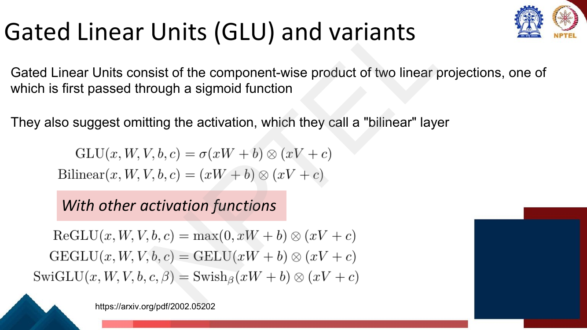
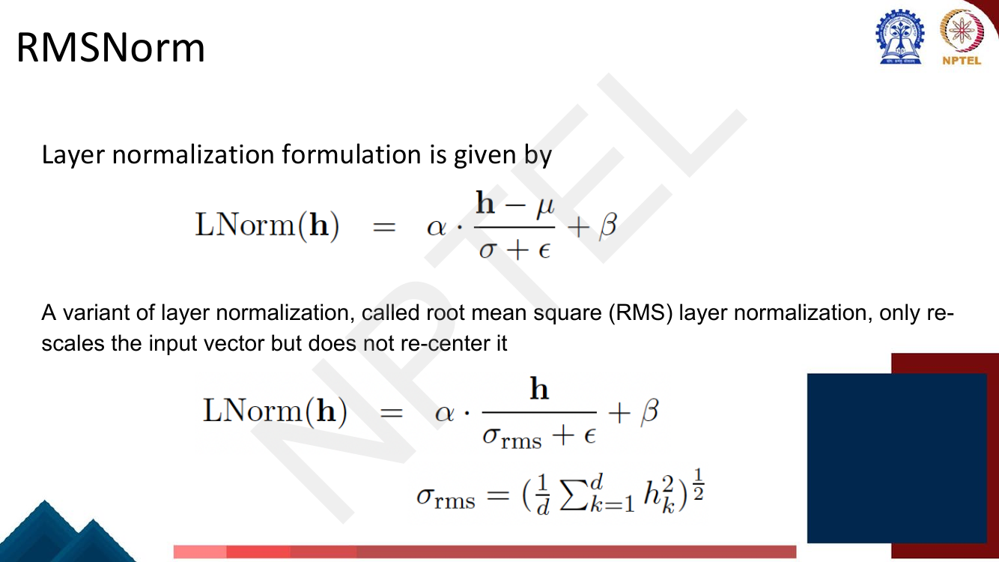

# Lec 52 — Modern LLMs and Architecture Variations I

> **Source:** `Week11.pdf` pp. 21–43 · **Week 11** · **Playlist:** Lec 52
> **Prereqs:** [Lec 51 — Scaling Laws of LLMs](51-scaling-laws.md), [Lec 22 — Self-Attention and Multi-Head](../week-05/22-self-attention-and-multihead.md)
> **Feeds into:** [Lec 53 — Positional Embeddings: RoPE and ALiBi](53-positional-embeddings-rope-alibi.md), [Lec 54 — Long-Sequence Modeling](54-long-sequence-modeling.md)

## Why this lecture exists

Lecture 51 told you *how big* to make a model and *how much* data to feed it. It said nothing about
what to actually build. This lecture answers that, in two halves that look unrelated and are not.

The first half is a census: which models exist, who made them, how many parameters, how many training
tokens, open or closed. That census is where the second half comes from — once you line up LLaMA,
Mistral, Qwen and PaLM side by side, the same five deviations from Vaswani et al.'s 2017 Transformer
appear in every row. None of them is a new idea about language. They are all cheapness: a gating
scheme that buys quality per FLOP, a normalisation that drops half its arithmetic, an activation that
is smooth where ReLU is not. A 2024 decoder block is the 2017 block with those substitutions made.
This chapter teaches the census so you can recognise the models, then the substitutions so you can
explain why a modern block looks the way it does.

## The ideas

### The roll-call

The deck opens with one dense table lifted from *Large Language Models: A Survey* (arXiv 2402.06196).
It is the single most MCQ-dense page in Week 11, so read the figures off it rather than trusting
memory.


*Fig. — Notice the grouping is by **architecture family first** (encoder-only / decoder-only / encoder-decoder) and then by **lineage** (GPT / LLaMA / PaLM / other). The "Base Models" column is what distinguishes an original model from a fine-tune. Page 23 of `Week11.pdf`.*

Here is every number the deck prints, transcribed. Learn the LLaMA, GPT and PaLM blocks; skim the rest.

| Group | Model | Parameters | Release | Base model | Open | Tokens | Training data |
|---|---|---|---|---|---|---|---|
| Encoder-only | BERT | 110M, 340M | 2018 | — | ✓ | 137B | BooksCorpus, English Wikipedia |
| | RoBERTa | 355M | 2019 | — | ✓ | 2.2T | BooksCorpus, Wikipedia, CC-NEWS, STORIES, Reddit |
| | ALBERT | 12M, 18M, 60M, 235M | 2019 | — | ✓ | 137B | BooksCorpus, English Wikipedia |
| | DeBERTa | — | 2020 | — | ✓ | — | BooksCorpus, Wikipedia, STORIES, Reddit |
| | XLNet | 110M, 340M | 2019 | — | ✓ | 32.89B | BooksCorpus, Wikipedia, Giga5, Common Crawl, ClueWeb 2012-B |
| Decoder-only | GPT-1 | 120M | 2018 | — | ✓ | 1.3B | BooksCorpus |
| | GPT-2 | 1.5B | 2019 | — | ✓ | 10B | Reddit outbound |
| Encoder-decoder | T5 (Base) | 223M | 2019 | — | ✓ | 156B | Common Crawl |
| | mT5 (Base) | 300M | 2020 | — | ✓ | — | Common Crawl, 101 languages |
| | BART (Base) | 139M | 2019 | — | ✓ | — | Corrupting text |
| GPT family | GPT-3 | 125M…175B (8 sizes) | 2020 | — | ✗ | 300B | Common Crawl (filtered), WebText2, Books1, Books2, Wikipedia |
| | CODEX | 12B | 2021 | GPT | ✓ | — | Public GitHub repositories |
| | WebGPT | 760M, 13B, 175B | 2021 | GPT-3 | ✗ | — | ELI5 |
| | **GPT-4** | **1.76T** | **2023** | — | **✗** | **13T** | — |
| LLaMA family | LLaMA1 | 7B, 13B, 33B, 65B | 2023 | — | ✓ | 1T, 1.4T | Online sources |
| | **LLaMA2** | **7B, 13B, 34B, 70B** | **2023** | — | **✓** | **2T** | Online sources |
| | Alpaca | 7B | 2023 | LLaMA1 | ✓ | — | GPT-3.5 |
| | Vicuna-13B | 13B | 2023 | LLaMA1 | ✓ | — | GPT-3.5 |
| | Koala | 13B | 2023 | LLaMA | ✓ | — | Dialogue data |
| | **Mistral-7B** | **7.3B** | **2023** | — | **✓** | — | — |
| | Code Llama | 34 | 2023 | LLaMA2 | ✓ | 500B | Publicly available code |
| | LongLLaMA | 3B, 7B | 2023 | OpenLLaMA | ✓ | 1T | — |
| | LLaMA-Pro-8B | 8.3B | 2024 | LLaMA2-7B | ✓ | 80B | Code and math corpora |
| | TinyLlama-1.1B | 1.1B | 2024 | LLaMA1.1B | ✓ | 3T | SlimPajama, Starcoderdata |
| PaLM family | PaLM | 8B, 62B, 540B | 2022 | — | ✗ | 780B | Web, books, Wikipedia, conversations, GitHub |
| | U-PaLM | 8B, 62B, 540B | 2022 | — | ✗ | 1.3B | same as PaLM |
| | PaLM-2 | 340B | 2023 | — | ✓ | 3.6T | Web, books, code, mathematics, conversational |
| | Med-PaLM | 540B | 2022 | PaLM | ✗ | 780B | HealthSearchQA, MedicationQA, LiveQA |
| | Med-PaLM 2 | — | 2023 | PaLM 2 | ✗ | — | MedQA, MedMCQA, HealthSearchQA, LiveQA |
| Other | FLAN | 137B | 2021 | LaMDA-PT | ✓ | — | Web, code, dialog, Wikipedia |
| | Gopher | 280B | 2021 | — | ✗ | 300B | MassiveText |
| | ERNIE 4.0 | 10B | 2023 | — | ✗ | 4TB | Chinese text |
| | Retro | 7.5B | 2021 | — | ✗ | 600B | MassiveText |
| | LaMDA | 137B | 2022 | — | ✗ | 168B | Public dialog data and web documents |
| | Chinchilla | 70B | 2022 | — | ✗ | 1.4T | MassiveText |
| | Galactica-120B | 120B | 2022 | — | — | 450B | — |
| | CodeGen | 16.1B | 2022 | — | ✓ | — | The Pile, BigQuery, BigPython |
| | BLOOM | 176B | 2022 | — | ✓ | 366B | ROOTS |
| | Zephyr | 7.24B | 2023 | Mistral-7B | ✓ | 800B | Synthetic data |
| | Grok-0 | 33B | 2023 | — | ✗ | — | Online source |
| | ORCA-2 | 13B | 2023 | LLaMA2 | — | 2001B | — |
| | StarCoder | 15.5B | 2023 | — | ✓ | 35B | GitHub |
| | MPT | 7B | 2023 | — | ✓ | 1T | RedPajama, mC4, S2ORC, Common Crawl |
| | Mixtral-8x7B | 46.7B | 2023 | — | ✓ | — | Instruction dataset |
| | Falcon 180B | 180B | 2023 | — | ✓ | 3.5T | RefinedWeb |
| | Gemini | 1.8B, 3.25B | 2023 | — | ✓ | — | Web, books, code, image, audio, video data |
| | DeepSeek-Coder | 1.3B, 6.7B, 33B | 2024 | — | ✓ | 2T | GitHub Markdown and StackExchange |
| | DocLLM | 1B, 7B | 2024 | — | ✗ | 2T | IIT-CDIP Test Collection 1.0, DocBank |

Three things on that table will catch you out and they are all the table's fault, not yours. **Gemini's
row carries an open-source tick** even though the deck's own next section files Gemini under *Closed
Models*, and the 1.8B / 3.25B figures are the on-device Nano variants, not the Pro or Ultra models
everyone means by "Gemini". **PaLM-2 is also ticked open**, which it is not. And a handful of cells are
typographically damaged — Code Llama's size reads "34" with no unit, ORCA-2's token count reads
"2001B", ERNIE's token column holds "4TB" (a storage size, not a token count). If an MCQ quotes any of
these, it is quoting the slide; answer with the slide.

### The categorization scheme

The deck gives a second organising figure: four independent axes along which any LLM can be filed.


*Fig. — Notice the parameter bands are **strict inequalities with hard cut-offs**: Small < 1B, Medium 1B–10B, Large 10B–100B, Very Large > 100B. The "Type" axis is about what was done after pretraining, and the "Originality" axis about whether weights descend from someone else's model. Page 24.*

| Axis | Categories | The deck's examples |
|---|---|---|
| **Parameters** | Small (< 1B) · Medium (1B–10B) · Large (10B–100B) · Very Large (> 100B) | — |
| **Type** | Foundation (pretrained, no instruction or chat tuning) · Instruction (fine-tuned to follow instructions) · Chat (fine-tuned on chat) | MPT-7B · MPT-7B-instruct · MPT-7B-chat |
| **Availability** | Private (weights not released) · Public (weights released) | GPT-4 · LLaMA |
| **Originality** | Original (not based on another pretrained model) · Tuned (fine-tuned from one) | LLaMA · Alpaca (based on LLaMA) |

These four axes are orthogonal: Alpaca is Medium, Instruction, Public and Tuned all at once. The exam
likes asking which band a named parameter count falls into — note that 10B is the boundary between
*Medium* and *Large*, and the inequalities are strict, so a 10B model is ambiguous on the slide as
printed.

### Open models, one profile each

Each profile slide has the same four fields: creator, goal, unique features, and an Arch/Data box.
Learn the Arch box — it is where the architecture half of the lecture comes from.


*Fig. — Every open-model profile in this deck shares the string "Transformer+RoPE+SwiGLU, context 4k, RMSNorm". What differs is the bit after it — here, sliding-window attention and the 8-expert Mixtral variant. Page 26.*

**Mistral** — Mistral AI. Goal: a *strong and somewhat multilingual open LM*. Unique features: **speed
optimizations, including GQA and Mixture of Experts**. Arch: Transformer + RoPE + SwiGLU, **context
4k**, RMSNorm, **sliding window attention**; **Mixtral has 8× experts in the feed-forward layer**.
Data: **not disclosed**, but includes English and European languages. (GQA, MoE and sliding-window
attention are [Lec 25](../week-05/25-efficient-transformers.md)'s; GQA is also already introduced in
[Lec 30](../week-06/30-domain-and-multilingual-pretraining.md).)

**LLaMA-2** — Meta. Goal: a *strong and safe open LM with base + chat versions*. Unique features: open
weights with strong safeguards and chat tuning, good performance. Arch: Transformer + RoPE + SwiGLU,
**context 4k**, RMSNorm — and nothing else; LLaMA-2 is the plainest of the three. Data: *"public
sources, up-sampling the most factual sources"*, **total 2T tokens**; the deck notes LLaMA-1's paper
has more detail.

**Qwen** — Alibaba. Goal: a *strong multilingual (especially English and Chinese) LM*. Unique features:
**large vocabulary for multilingual support**, strong performance. Arch: Transformer + RoPE + SwiGLU,
**context 4k**, RMSNorm, **bias in the attention layer** — the one model on the deck that keeps
attention biases, which is why "Bias in attention layer" is a bullet on the *What's new* slide. Data:
**multilingual data plus instruction data at pre-training time, 2–3T tokens**.

### Closed models, one profile each

These slides give no architecture box at all — closed models disclose nothing — so the examinable
content is capability claims and context lengths.

**GPT-4** — OpenAI. The *de-facto standard "strong" language model*; tuned to be good as a chat-based
assistant; **accepts image inputs**; **supports calling external tools through a "function calling"
interface** (tool use is [Lec 44](../week-09/44-tool-aided-lms.md)'s). From the survey table:
**1.76T parameters, 13T tokens, 2023**.

**Gemini** — Google DeepMind. *Performance competitive with the corresponding GPT models*, which the
deck pins precisely: **Gemini Pro 1.0 ≈ GPT-3.5, Gemini Ultra 1.0 ≈ GPT-4**. **Pro 1.5 supports very
long inputs, 1–10M tokens.** Supports image *and video* inputs, and **can generate images natively**.

**Claude 3** — Anthropic. **Context window up to 200k**; allows processing images; overall strong
results competitive with GPT-4.

So the deck's context-length ladder, which is exactly what an MCQ will key on, is: **Mistral / LLaMA-2
/ Qwen = 4k · Claude 3 = 200k · Gemini Pro 1.5 = 1–10M**. The deck gives no context length for GPT-4.

### What's new


*Fig. — The whole second half of the lecture is this list. Four of the five are replacements for a specific 2017 component; only "bias in attention layer" is an addition. Page 33.*

Five deltas from the original Transformer:

1. **SwiGLU** — gated linear unit variants, a different activation, *instead of* the ReLU FFN. **Yours.**
2. **RMSNorm** — normalisation, *instead of* LayerNorm. **Yours.**
3. **Bias in the attention layer** — Qwen's quirk, mentioned once.
4. **RoPE** — positional embeddings, *instead of* sinusoidal → [Lec 53](53-positional-embeddings-rope-alibi.md).
5. **Mixture-of-experts** — *instead of* the FFN; the deck says "we briefly covered this" →
   [Lec 25](../week-05/25-efficient-transformers.md).

### Activation functions, one page each

[Lec 7](../week-02/07-shallow-neural-networks.md) introduced $\text{ReLU}(x) = \max(0, x)$ as the
piecewise-linear building block that makes a network's function piecewise linear. Everything in this
section is a patch on one of ReLU's two defects:

- **Dying ReLU.** For any $x < 0$ the gradient is exactly 0. A unit whose pre-activation is negative
  for every training example receives no gradient ever and is dead for the rest of training.
- **Not differentiable at 0, and the output is never negative**, so activations drift positive and
  layer means are biased away from zero.

#### Leaky ReLU and PReLU


*Fig. — The deck writes $\alpha = 0.1$, **ten times the value most textbooks and libraries use** (PyTorch defaults to 0.01). Note the plot's y-axis reaches $-1$ at $x = -10$, consistent with $\alpha = 0.1$. Page 34.*

$$\text{LeakyReLU}(x) = \max(\alpha x,\ x), \qquad \alpha = 0.1 \ \text{(this deck)}$$

Equivalently $x$ if $x > 0$, $\alpha x$ otherwise. The deck's four claimed benefits, verbatim: **does
not saturate · computationally efficient · converges much faster than sigmoid/tanh in practice (e.g.
6×) · will not "die"**. That last one is the whole point — the negative branch has slope $\alpha \neq
0$, so a negative unit still passes gradient.

**PReLU (Parametric ReLU)** has the *identical* formula $f(x) = \max(\alpha x, x)$; the only difference
is that **$\alpha$ is learned via backprop** rather than fixed. That is the entire distinction and it
is a guaranteed MCQ.

> **Erratum flag.** This course uses $\alpha = 0.1$ for Leaky ReLU. If an exam option offers 0.01 and
> another offers 0.1, answer with the deck.

#### ELU


*Fig. — Notice ELU **saturates** on the left (flattens toward $-\alpha$) whereas Leaky ReLU keeps falling linearly. The deck lists that saturation as a *benefit* — robustness to noise — not a defect. Page 35.*

$$\text{ELU}(x) = \begin{cases} x & x > 0 \\ \alpha(e^x - 1) & x \le 0\end{cases}$$

Benefits per the deck: **all benefits of ReLU · closer to zero-mean outputs · a negative saturation
regime (compared with Leaky ReLU) that adds robustness to noise**. Cost, printed in red:
**computation requires `exp()`**. With $\alpha = 1$, ELU is continuous *and* differentiable at 0
(left derivative $e^0 = 1$, right derivative 1), unlike ReLU and Leaky ReLU.

#### SELU


*Fig. — The constants are printed to **twenty-plus digits** on the slide. You will not be asked to reproduce them, but you should recognise $\alpha \approx 1.6733$ and $\lambda \approx 1.0507$ and know which is which. Page 36.*

$$\text{SELU}(x) = \lambda\begin{cases} x & x > 0 \\ \alpha(e^x - 1) & x \le 0\end{cases}
\qquad \alpha = 1.6732632\ldots,\quad \lambda = 1.0507010\ldots$$

SELU is ELU scaled by $\lambda$ on *both* branches. Those two constants are not free
hyperparameters — they are the unique solution that makes the activation **self-normalising**: if the
inputs to a layer have mean 0 and variance 1, the outputs do too, and the property is a fixed point
across depth. The deck's claims: **a scaled version of ELU that works better for deep networks**, and
**"self-normalizing" property; can train deep SELU networks without BatchNorm**. The headline is
therefore *normalisation for free*, which is why SELU appears in a lecture otherwise about
normalisation and gating.

#### GELU — the one that matters

![GELU slide: plot over [-3,3] showing a smooth curve that dips below zero near x = -0.75 before rising, formula gelu(x) = x P(X <= x) = (x/2)(1 + erf(x/sqrt 2)) approximately x sigma(1.702 x), with the data-dependent-dropout intuition and 'Very common in Transformers (BERT, GPT, GPT-2, GPT-3)'](../../assets/pages/lec52/p-037.png)
*Fig. — The curve **dips below zero** around $x \approx -0.75$ and comes back up: GELU is **non-monotonic**, unlike every activation above it. That dip is the whole reason it is not just a smoothed ReLU. Page 37.*

The derivation the deck gives, and it is worth following because it explains the name. Suppose instead
of a deterministic activation you applied a **stochastic gate**: multiply the input by 0 or 1 at
random, where large values are more likely to be multiplied by 1 and small values more likely by 0 —
a *data-dependent dropout*. Concretely, draw a Bernoulli mask $m \sim \text{Bernoulli}(\Phi(x))$ where
$\Phi$ is the standard normal CDF, and output $m \cdot x$. Then **take the expectation over the
randomness**:

$$\mathbb{E}[m\,x] = x \cdot P(X \le x) = x\,\Phi(x), \qquad X \sim \mathcal{N}(0,1)$$

That expectation *is* GELU. Written out with the error function, and with the deck's approximation:

$$\text{GELU}(x) = x\,\Phi(x) = \frac{x}{2}\Big(1 + \text{erf}\big(x/\sqrt{2}\big)\Big) \;\approx\; x\,\sigma(1.702x)$$

Why "Gaussian error": $\Phi$ is written through $\text{erf}$, the Gaussian error function. The gate is
a *probability*, so it is smooth and lies in $(0,1)$ — large $x$ is almost surely passed, large
negative $x$ almost surely zeroed, and in between you get a soft fraction. Note what this is *not*: it
is not a gate computed from a different projection (that is GLU, below) — the gate here is the input
gating itself.

**Where used, per the deck: BERT, GPT, GPT-1/2/3** — "very common in Transformers". Citation on the
slide: **Hendrycks and Gimpel, 2016**.

#### Swish / SiLU

![Swish slide: three curves for beta = 0.1, 1.0 and 10.0 over x in [-5,3], with the definition x sigma(beta x), the note that beta is a constant or trainable, beta=1.72 behaves like GELU, beta to infinity behaves like ReLU](../../assets/pages/lec52/p-038.png)
*Fig. — Follow the three curves: $\beta = 0.1$ (yellow) is nearly linear, $\beta = 1$ (red) has the characteristic dip near $x=-1.3$, $\beta = 10$ (blue) is already almost ReLU. **$\beta$ interpolates between a linear function and ReLU.** Page 38.*

$$\text{Swish}_\beta(x) = x\cdot\sigma(\beta x), \qquad \sigma(z) = \frac{1}{1+e^{-z}}$$

The deck's three facts: **$\beta$ is either a constant or a trainable parameter**; **$\beta = 1.72$
behaves like GELU**; **$\beta \to \infty$ behaves like ReLU**. The last is easy to see — as $\beta$
grows, $\sigma(\beta x)$ approaches a step at 0, so $x\sigma(\beta x) \to x\cdot\mathbb{1}[x>0] =
\text{ReLU}(x)$. At the other end, $\beta \to 0$ gives $x/2$, a linear function. **Swish with $\beta =
1$ is also called SiLU** (Sigmoid Linear Unit); the deck writes $\text{Swish}_1$ in its FFN formulas.

Swish and GELU are structurally the same object: *input times a smooth gate on the input*. GELU's gate
is the Gaussian CDF, Swish's is the logistic sigmoid, and the two CDFs are so close in shape that
$\sigma(1.702x) \approx \Phi(x)$ — which is exactly the approximation the GELU slide prints, and the
reason $\beta = 1.72$ reproduces GELU. Both are therefore **smooth everywhere and non-monotonic**.

> **Symbol collision.** $\beta$ is Swish's sigmoid steepness here and LayerNorm's learned *shift* two
> slides later. Unrelated quantities, same letter, five pages apart.

#### Comparison

| Activation | Formula | Range | Smooth at 0? | Monotonic? | Where |
|---|---|---|---|---|---|
| ReLU | $\max(0,x)$ | $[0,\infty)$ | **no** (kink) | yes | original Transformer, most CNNs |
| Leaky ReLU | $\max(\alpha x, x)$, $\alpha = 0.1$ | $(-\infty,\infty)$ | **no** | yes | CV baselines |
| PReLU | same, $\alpha$ learned | $(-\infty,\infty)$ | **no** | yes | CV |
| ELU | $x$ / $\alpha(e^x-1)$ | $(-\alpha,\infty)$ | yes ($\alpha{=}1$) | yes | — |
| SELU | $\lambda x$ / $\lambda\alpha(e^x-1)$ | $(-\lambda\alpha,\infty)$ | yes | yes | self-normalising nets, no BatchNorm |
| **GELU** | $x\Phi(x) \approx x\sigma(1.702x)$ | $\approx[-0.17,\infty)$ | yes | **no** | **BERT, GPT, GPT-2, GPT-3** |
| **Swish/SiLU** | $x\sigma(\beta x)$ | $\approx[-0.28,\infty)$ at $\beta{=}1$ | yes | **no** | **inside SwiGLU: LLaMA, Mistral, PaLM** |

### From the FFN to gated linear units

Recall the Transformer's position-wise feed-forward network from
[Lec 22](../week-05/22-self-attention-and-multihead.md): a widening projection, an activation, a
narrowing projection. The deck restates it and then strips it.


*Fig. — The second line is the quiet modernisation: **modern LLMs drop the FFN bias terms entirely**. From there, changing the activation is a one-symbol edit. Page 39.*

$$\text{FFN}(\mathbf{x}, \mathbf{W}_1, \mathbf{W}_2, \mathbf{b}_1, \mathbf{b}_2) = \max(0,\ \mathbf{x}\mathbf{W}_1 + \mathbf{b}_1)\mathbf{W}_2 + \mathbf{b}_2$$
$$\text{FFN}_{\text{ReLU}}(\mathbf{x}, \mathbf{W}_1, \mathbf{W}_2) = \max(\mathbf{x}\mathbf{W}_1, 0)\mathbf{W}_2 \quad \text{(no biases, more recent)}$$
$$\text{FFN}_{\text{GELU}} = \text{GELU}(\mathbf{x}\mathbf{W}_1)\mathbf{W}_2, \qquad \text{FFN}_{\text{Swish}} = \text{Swish}_1(\mathbf{x}\mathbf{W}_1)\mathbf{W}_2$$

With $\mathbf{W}_1 \in \mathbb{R}^{d_{\text{model}}\times d_{ff}}$ and
$\mathbf{W}_2 \in \mathbb{R}^{d_{ff}\times d_{\text{model}}}$, that is **two** weight matrices and
$2\,d_{\text{model}}d_{ff}$ parameters.

#### The GLU idea


*Fig. — Every variant has the **same shape**: two independent projections of the same input, one activated, multiplied **component-wise**. Only the activation on the left factor changes. The $\otimes$ on the slide means elementwise product, not outer product. Page 40.*

The deck's definition, verbatim: *"Gated Linear Units consist of the component-wise product of two
linear projections, one of which is first passed through a sigmoid function."* So:

$$\text{GLU}(\mathbf{x},\mathbf{W},\mathbf{V},\mathbf{b},\mathbf{c}) = \sigma(\mathbf{x}\mathbf{W}+\mathbf{b}) \odot (\mathbf{x}\mathbf{V}+\mathbf{c})$$

Read it as two branches. The **value branch** $\mathbf{x}\mathbf{V}+\mathbf{c}$ carries the content.
The **gate branch** $\sigma(\mathbf{x}\mathbf{W}+\mathbf{b})$ produces a number in $(0,1)$ per channel
and multiplies it in. A channel whose gate is near 0 is suppressed no matter how large its value is; a
channel whose gate is near 1 passes untouched. This is *multiplicative*, not additive, and that is the
difference from everything above: a plain activation can only reshape a channel using its own value,
while a gate lets a **different learned projection of the same input** decide whether that channel is
relevant here.

The deck also gives the degenerate case: **omit the activation entirely and you get a "bilinear"
layer**,

$$\text{Bilinear}(\mathbf{x},\mathbf{W},\mathbf{V},\mathbf{b},\mathbf{c}) = (\mathbf{x}\mathbf{W}+\mathbf{b}) \odot (\mathbf{x}\mathbf{V}+\mathbf{c})$$

which is still nonlinear, because the product of two linear functions of $\mathbf{x}$ is quadratic
in $\mathbf{x}$.

#### The variants

Swap the sigmoid for any activation and rename:

| Variant | Gate activation | Formula |
|---|---|---|
| GLU | $\sigma$ | $\sigma(\mathbf{x}\mathbf{W}+\mathbf{b}) \odot (\mathbf{x}\mathbf{V}+\mathbf{c})$ |
| Bilinear | none | $(\mathbf{x}\mathbf{W}+\mathbf{b}) \odot (\mathbf{x}\mathbf{V}+\mathbf{c})$ |
| ReGLU | ReLU | $\max(0, \mathbf{x}\mathbf{W}+\mathbf{b}) \odot (\mathbf{x}\mathbf{V}+\mathbf{c})$ |
| GEGLU | GELU | $\text{GELU}(\mathbf{x}\mathbf{W}+\mathbf{b}) \odot (\mathbf{x}\mathbf{V}+\mathbf{c})$ |
| **SwiGLU** | **Swish$_\beta$** | $\text{Swish}_\beta(\mathbf{x}\mathbf{W}+\mathbf{b}) \odot (\mathbf{x}\mathbf{V}+\mathbf{c})$ |

**SwiGLU is what LLaMA, Mistral, Qwen and PaLM actually use** — it is the string in every open model's
Arch box. In practice the biases $\mathbf{b},\mathbf{c}$ are dropped, so a LLaMA FFN is literally
$\big(\text{Swish}_1(\mathbf{x}\mathbf{W}) \odot \mathbf{x}\mathbf{V}\big)\mathbf{W}_2$.

#### The parameter-count subtlety

This is the chapter's most examinable detail. A GLU block needs **three** weight matrices —
$\mathbf{W}$ and $\mathbf{V}$ going up, $\mathbf{W}_2$ coming back down — where the plain FFN needs
two. Dropping SwiGLU into an existing FFN at the same $d_{ff}$ therefore inflates the block by
**1.5×**, and any comparison against the baseline is then confounded: did the quality come from
gating, or from 50% more parameters?

The fix is to shrink the hidden width. Set the SwiGLU count equal to the FFN count:

$$3\,d_{\text{model}}\,d_{ff}' = 2\,d_{\text{model}}\,d_{ff} \quad\Longrightarrow\quad d_{ff}' = \tfrac{2}{3}\,d_{ff}$$

With the usual $d_{ff} = 4d_{\text{model}}$, the matched width is $\tfrac{2}{3}\times 4d =
\tfrac{8}{3}d \approx 2.667\,d_{\text{model}}$. **Memorise the $\tfrac{2}{3}$ and the reason for it.**
N2 works the arithmetic and shows that LLaMA-7B's real $d_{ff} = 11008$ sits exactly there.

### RMSNorm


*Fig. — Compare the two fractions. The numerator loses the $-\mu$ and the denominator's $\sigma$ becomes $\sigma_{\text{rms}}$. Everything else is identical. Note the deck labels **both** formulas "LNorm(h)" — the second is a copy-paste slip, it is RMSNorm. Page 41.*

**First, the standard LayerNorm**, because this course has not yet printed it correctly.
[Lec 22](../week-05/22-self-attention-and-multihead.md) owns LayerNorm as a Transformer training
trick, but the Lec 22 deck's version omits the learned parameters and puts $\epsilon$ outside the
square root. The standard form, for a hidden vector $\mathbf{h}\in\mathbb{R}^n$, is

$$\text{LayerNorm}(\mathbf{h}) = \gamma \odot \frac{\mathbf{h} - \mu}{\sqrt{\sigma^2 + \epsilon}} + \beta,
\qquad \mu = \frac{1}{n}\sum_{k=1}^{n} h_k, \qquad \sigma^2 = \frac{1}{n}\sum_{k=1}^{n}(h_k - \mu)^2$$

with **learned gain $\gamma$ and shift $\beta$**, both $\in\mathbb{R}^n$. Two operations are happening:
**re-centering** (subtract $\mu$) and **re-scaling** (divide by the sd). The Lec 52 deck writes it as
$\alpha\cdot\frac{\mathbf{h}-\mu}{\sigma+\epsilon} + \beta$ — it *does* include the learned parameters
(calling the gain $\alpha$, not $\gamma$) but it puts $\epsilon$ outside the root, exactly as the
Lec 22 deck does. Follow the deck when it is quoting itself; know the standard form for anything else.

**RMSNorm** (Zhang & Sennrich, 2019) asks: is the re-centering doing any work? Empirically, no. So
drop it and keep only the re-scaling, using the **root mean square** in place of the standard
deviation:

$$\text{RMSNorm}(\mathbf{h}) = \gamma \odot \frac{\mathbf{h}}{\sqrt{\frac{1}{n}\sum_{k=1}^{n} h_k^2 + \epsilon}}
\qquad\text{i.e.}\qquad \sigma_{\text{rms}} = \Big(\tfrac{1}{n}\textstyle\sum_{k=1}^{n} h_k^2\Big)^{1/2}$$

The deck's own line: *"A variant of layer normalization, called root mean square (RMS) layer
normalization, only re-scales the input vector but does not re-center it."*

What exactly is dropped, and what is kept:

| | LayerNorm | RMSNorm |
|---|---|---|
| Re-centering ($-\mu$) | **yes** | **no** |
| Re-scaling | by $\sigma$ (sd about the mean) | by $\sigma_{\text{rms}}$ (rms about **zero**) |
| Learned gain $\gamma$ | yes | yes |
| Learned shift $\beta$ | yes | **no** (standard RMSNorm) |
| Reduction passes over $\mathbf{h}$ | **two** ($\mu$, then $\sigma^2$) | **one** |
| Output mean | exactly 0 (before $\beta$) | $\mu/\sigma_{\text{rms}}$, generally **not** 0 |

Note $\sigma_{\text{rms}}^2 = \sigma^2 + \mu^2$, so the two coincide exactly when $\mu = 0$ —
RMSNorm is LayerNorm *assuming* the input is already centred. The saving is one full reduction pass
and the elementwise subtraction; in the regime where normalisation is memory-bandwidth bound that is
worth 7–15% of layer runtime, for no measured quality loss. Which is why **LLaMA, Mistral, Qwen and
most 2023+ models use RMSNorm**.

> **Flag.** The deck's printed RMSNorm keeps **both** $\alpha$ and $\beta$ and puts $\epsilon$ outside
> the root. The canonical RMSNorm, and every implementation in LLaMA, Mistral and Qwen, has **gain
> only, no shift**, with $\epsilon$ inside. If asked "what does RMSNorm drop relative to LayerNorm",
> the intended answer is **the mean-centering** — that is the sentence the deck itself writes.

## Worked numericals

> **No exercise page in this range.** All 23 pages (21–43) were opened as images: pp. 21–22 title and
> concepts, 23–24 survey tables, 25 and 29 section dividers, 26–28 and 30–32 model profiles, 33–41
> teaching slides, 42–43 references and thank-you. The deck poses no "Try this problem", and the
> re-swept exercise table lists no page for Lec 52. The six below are constructed.

### N1. Evaluating ReLU, GELU and Swish by hand
**Given:** $x \in \{-3, -1, -0.5, 0, 0.5, 1, 2\}$.
**Find:** $\text{ReLU}(x)$, $\text{GELU}(x) = x\Phi(x)$ and $\text{Swish}_1(x) = x\sigma(x)$, and say
which are smooth and which are monotonic.

1. You need two tables of standard values. $\Phi$ (normal CDF): $\Phi(-3) = 0.001350$,
   $\Phi(-1) = 0.158655$, $\Phi(-0.5) = 0.308538$, $\Phi(0) = 0.5$, $\Phi(0.5) = 0.691462$,
   $\Phi(1) = 0.841345$, $\Phi(2) = 0.977250$.
2. $\sigma(z) = 1/(1+e^{-z})$: $\sigma(-3) = 0.047426$, $\sigma(-1) = 0.268941$,
   $\sigma(-0.5) = 0.377541$, $\sigma(0) = 0.5$, $\sigma(0.5) = 0.622459$, $\sigma(1) = 0.731059$,
   $\sigma(2) = 0.880797$.
3. Multiply each by $x$:

| $x$ | ReLU | GELU $= x\Phi(x)$ | Swish$_1 = x\sigma(x)$ |
|---|---|---|---|
| $-3$ | 0 | $-3(0.001350) = -0.004050$ | $-3(0.047426) = -0.142278$ |
| $-1$ | 0 | $-1(0.158655) = -0.158655$ | $-1(0.268941) = -0.268941$ |
| $-0.5$ | 0 | $-0.5(0.308538) = -0.154269$ | $-0.5(0.377541) = -0.188770$ |
| $0$ | 0 | 0 | 0 |
| $0.5$ | 0.5 | $0.5(0.691462) = 0.345731$ | $0.5(0.622459) = 0.311230$ |
| $1$ | 1 | $1(0.841345) = 0.841345$ | $1(0.731059) = 0.731059$ |
| $2$ | 2 | $2(0.977250) = 1.954500$ | $2(0.880797) = 1.761594$ |

4. **Non-monotonicity, read off the table.** Going from $x = -1$ to $x = -0.5$, GELU *rises* from
   $-0.158655$ to $-0.154269$; going from $x = -3$ to $x = -1$ it *falls* from $-0.004050$ to
   $-0.158655$. A function that falls then rises is not monotonic. Swish does the same between
   $x = -3$ and $x = -0.5$. ReLU is flat then rising — monotonic throughout.
5. The actual minima (from the code block): **GELU bottoms at $-0.1700$ near $x = -0.752$; Swish$_1$
   bottoms at $-0.2785$ near $x = -1.279$.** These are the lower bounds of their ranges.
6. **Smoothness at 0.** ReLU's left derivative is 0 and right derivative is 1 — a kink.
   $\text{GELU}'(x) = \Phi(x) + x\varphi(x)$, which at $x=0$ equals $0.5 + 0 = 0.5$ from both sides —
   no kink. Swish$'(0) = \sigma(0) = 0.5$ likewise.

**Answer:** GELU and Swish are **smooth everywhere and non-monotonic** (both dip below zero for small
negative $x$ before returning); ReLU is **non-smooth at 0 and monotonic**. Both smooth functions have
derivative $\tfrac12$ at the origin, where ReLU's derivative is undefined.

### N2. SwiGLU vs standard FFN — the parameter match
**Given:** $d_{\text{model}} = 4096$, standard FFN width $d_{ff} = 4 \times d_{\text{model}}$, biases
dropped throughout.
**Find:** the standard FFN parameter count, the naive SwiGLU count at the same width, and the $d_{ff}'$
that matches the standard count.

1. $d_{ff} = 4 \times 4096 = 16{,}384$.
2. **Standard FFN**, two matrices: $\mathbf{W}_1 \in \mathbb{R}^{4096\times16384}$,
   $\mathbf{W}_2 \in \mathbb{R}^{16384\times4096}$.
   $$2 \times 4096 \times 16384 = 2 \times 67{,}108{,}864 = \mathbf{134{,}217{,}728}$$
3. **SwiGLU at the same width**, three matrices: $\mathbf{W}, \mathbf{V} \in \mathbb{R}^{4096\times16384}$
   and $\mathbf{W}_2 \in \mathbb{R}^{16384\times4096}$.
   $$3 \times 4096 \times 16384 = \mathbf{201{,}326{,}592}$$
4. Ratio: $201{,}326{,}592 / 134{,}217{,}728 = 1.5$. **Exactly 50% more** — as it must be, $3/2$.
5. **Match the counts.** Solve $3\,d_{\text{model}}\,d_{ff}' = 2\,d_{\text{model}}\,(4d_{\text{model}})$:
   $$d_{ff}' = \frac{8\,d_{\text{model}}}{3} = \frac{8 \times 4096}{3} = \frac{32768}{3} = 10{,}922.67$$
6. That is $\tfrac{2}{3} \times 16{,}384 = 10{,}922.67$ — the two-thirds rule.
7. Check at the floor: $3 \times 4096 \times 10{,}922 = 134{,}201{,}344$, which is
   $134{,}217{,}728 - 16{,}384$ — short by 0.01%. Confirmed.
8. **Reality check.** Real LLaMA-7B has $d_{\text{model}} = 4096$ and $d_{ff} = 11{,}008$ — not a round
   number, and not $16{,}384$. Why 11,008? It is 10,922.67 rounded *up* to the nearest multiple of
   256 for GPU tiling. Its count: $3 \times 4096 \times 11{,}008 = 135{,}266{,}304$, which is
   $+0.78\%$ against the standard FFN. **The odd-looking 11008 is the two-thirds rule plus hardware
   alignment.**

**Answer:** standard FFN **134,217,728**; naive SwiGLU **201,326,592** (1.5×); matched width
$d_{ff}' = \mathbf{10{,}922.67} = \tfrac{2}{3}\times 4d_{\text{model}}$, which LLaMA rounds to **11,008**.

### N3. RMSNorm vs LayerNorm on the same vector
**Given:** $\mathbf{h} = [1, 3, 5, 7]$, $n = 4$, $\gamma = \mathbf{1}$, $\beta = \mathbf{0}$,
$\epsilon$ negligible. (This is the same vector the Lec 22 deck normalises, so the LayerNorm half is
cross-checkable.)
**Find:** both outputs, and the operation count of each.

1. **Mean:** $\mu = (1+3+5+7)/4 = 16/4 = 4$.
2. **Deviations:** $[-3, -1, 1, 3]$. Squares: $[9, 1, 1, 9]$, sum 20.
3. **Variance (population, as the deck uses):** $\sigma^2 = 20/4 = 5$, so
   $\sigma = \sqrt{5} = 2.236068$. (Lec 22's deck prints 4 and 2.23 for this vector — matches.)
4. **LayerNorm:** $[-3, -1, 1, 3]/2.236068 = [-1.341641, -0.447214, 0.447214, 1.341641]$.
   Its mean is $0$ by construction; its sd is 1.
5. **Sum of squares:** $1 + 9 + 25 + 49 = 84$. **Mean square:** $84/4 = 21$.
6. **RMS:** $\sigma_{\text{rms}} = \sqrt{21} = 4.582576$.
7. **RMSNorm:** $[1,3,5,7]/4.582576 = [0.218218, 0.654654, 1.091089, 1.527525]$.
8. **Its mean is not zero:** $(0.218218+0.654654+1.091089+1.527525)/4 = 0.872872$. Sanity check:
   $\mu/\sigma_{\text{rms}} = 4/4.582576 = 0.872872$ ✓. **That non-zero mean is the thing RMSNorm
   chooses not to remove.**
9. Cross-check the identity $\sigma_{\text{rms}}^2 = \sigma^2 + \mu^2$: $5 + 16 = 21$ ✓.
10. **Operation count**, per vector of length $n$, counting adds/multiplies/divides:

| Step | LayerNorm | RMSNorm |
|---|---|---|
| sum for $\mu$ | $n-1$ adds | — |
| divide for $\mu$ | 1 | — |
| subtract $\mu$ | $n$ | — |
| square | $n$ | $n$ |
| sum of squares | $n-1$ | $n-1$ |
| divide by $n$ | 1 | 1 |
| sqrt | 1 | 1 |
| divide each element | $n$ | $n$ |
| multiply by $\gamma$ | $n$ | $n$ |
| add $\beta$ | $n$ | — |
| **total** | $\mathbf{6n}$ | $\mathbf{4n}$ |

11. At $n = 4$: 24 ops vs 16. At $n = 4096$: 24,576 vs 16,384.

**Answer:** LayerNorm $= [-1.3416, -0.4472, 0.4472, 1.3416]$ (mean 0); RMSNorm
$= [0.2182, 0.6547, 1.0911, 1.5275]$ (mean 0.8729). RMSNorm uses **$4n$ operations against $6n$ — a
one-third saving — and one reduction pass instead of two**, which is the part that matters on a GPU.

### N4. Tokens per parameter — checking the roll-call against Chinchilla
**Given:** from the deck's own table — LLaMA2: 70B parameters, 2T tokens. Chinchilla: 70B parameters,
1.4T tokens. GPT-3: 175B parameters, 300B tokens. GPT-4: 1.76T parameters, 13T tokens.
**Find:** tokens per parameter for each, and compare with Chinchilla's compute-optimal rule from
[Lec 51](51-scaling-laws.md).

1. **Chinchilla:** $1.4\times10^{12} / 70\times10^{9} = 1400/70 = \mathbf{20.0}$.
2. **LLaMA2-70B:** $2000/70 = \mathbf{28.57}$.
3. **GPT-3:** $300/175 = \mathbf{1.71}$.
4. **GPT-4:** $13{,}000/1760 = \mathbf{7.39}$.
5. Chinchilla's figure is 20.0 **exactly**, which is not a coincidence — the rule derived in Lec 51 is
   roughly 20 tokens per parameter at compute-optimality, and Chinchilla is the model built to
   demonstrate it. Same parameter count as Gopher's successor generation, far more data.
6. GPT-3 at 1.71 is **about 12× under-trained** relative to the rule, which is exactly the finding
   that motivated Chinchilla.
7. LLaMA2 at 28.57 *overshoots* the rule deliberately. Chinchilla optimises training compute;
   Meta optimised *inference* cost, which favours a smaller model trained longer.

**Answer:** Chinchilla **20.0**, LLaMA2-70B **28.6**, GPT-4 **7.4**, GPT-3 **1.7** tokens/parameter.
Chinchilla lands on the rule, GPT-3 is far below it, LLaMA2 deliberately above it.

### N5. KV-cache memory at the deck's context lengths
**Given:** fp16 (2 bytes). A LLaMA-2-7B-shaped model: 32 layers, $d_{\text{model}} = 4096$, standard
multi-head attention, **context 4k** as the deck states. A Claude-3-scale 70B-shaped model: 80 layers,
$d_{\text{model}} = 8192$, **context 200k** as the deck states.
**Find:** the KV-cache size in each case, and the effect of GQA.

1. The KV cache holds one key and one value vector per layer per token
   ([Lec 25](../week-05/25-efficient-transformers.md)), so
   $$\text{bytes} = 2 \times L \times T \times d_{\text{kv}} \times \text{bytes/elem}$$
   where the leading 2 is "K and V".
2. **LLaMA-2-7B @ 4096 tokens:** $2 \times 32 \times 4096 \times 4096 \times 2$.
3. $2\times32 = 64$; $64 \times 4096 = 262{,}144$; $\times 4096 = 1{,}073{,}741{,}824$;
   $\times 2 = 2{,}147{,}483{,}648$ bytes $= \mathbf{2.00\ \text{GiB}}$.
4. The weights themselves are ~13 GiB in fp16, so a full-context cache is **~15% of the weights** —
   large but liveable.
5. **70B-shaped @ 200,000 tokens with plain MHA:** $2 \times 80 \times 200{,}000 \times 8192 \times 2$.
6. $2\times80 = 160$; $\times 200{,}000 = 32{,}000{,}000$; $\times 8192 = 262{,}144{,}000{,}000$;
   $\times 2 = 524{,}288{,}000{,}000$ bytes $= \mathbf{488.3\ \text{GiB}}$ — **more than six 80 GB
   GPUs for the cache of one sequence.** A 200k context is impossible this way.
7. **With GQA at 8 key/value heads** (head dim 128, so $d_{\text{kv}} = 8 \times 128 = 1024$, an 8×
   reduction from 64 heads): $524{,}288{,}000{,}000 / 8 = 65{,}536{,}000{,}000$ bytes
   $= \mathbf{61.0\ \text{GiB}}$.

**Answer:** 2.00 GiB at 4k; **488.3 GiB at 200k with MHA, falling to 61.0 GiB with 8-way GQA**. This
is why every long-context model on the deck's roll-call lists GQA — Mistral's "speed optimizations,
including GQA" is a memory argument as much as a speed one.

### N6. GLU gating, numerically
**Given:** at one token position, the two branches evaluate to
$\mathbf{x}\mathbf{W}+\mathbf{b} = [2.0, -3.0, 0.5]$ (gate) and
$\mathbf{x}\mathbf{V}+\mathbf{c} = [1.0, 4.0, -2.0]$ (value).
**Find:** GLU, SwiGLU$_1$ and ReGLU outputs, and show what the gate does to channel 1.

1. Gate values: $\sigma(2.0) = 0.880797$, $\sigma(-3.0) = 0.047426$, $\sigma(0.5) = 0.622459$.
2. **GLU** $= \sigma(\mathbf{x}\mathbf{W}) \odot (\mathbf{x}\mathbf{V})$:
   - ch 0: $0.880797 \times 1.0 = 0.880797$
   - ch 1: $0.047426 \times 4.0 = 0.189703$
   - ch 2: $0.622459 \times (-2.0) = -1.244919$
3. **Channel 1 is the point.** Its value branch is $4.0$ — by far the largest magnitude of the three —
   yet the output is $0.19$. The gate suppressed it by $1 - 0.047426 = \mathbf{95.3\%}$, purely
   because a *different* projection of the same input said "not relevant here". No plain activation
   can do this: ReLU, GELU and Swish all see only the channel's own value.
4. Channel 0, by contrast, had gate $0.88$ and passed almost intact ($1.0 \to 0.88$).
5. **SwiGLU$_1$** $= \text{Swish}_1(\mathbf{x}\mathbf{W}) \odot (\mathbf{x}\mathbf{V})$, using
   $\text{Swish}_1(2.0) = 1.761594$, $\text{Swish}_1(-3.0) = -0.142278$,
   $\text{Swish}_1(0.5) = 0.311230$:
   - ch 0: $1.761594 \times 1.0 = 1.761594$
   - ch 1: $-0.142278 \times 4.0 = -0.569110$
   - ch 2: $0.311230 \times (-2.0) = -0.622459$
6. Note channel 1 **flipped sign** under SwiGLU ($+0.19 \to -0.57$). Swish's gate is *signed* and can
   go negative, so SwiGLU is not a contraction — unlike GLU, whose gate lives in $(0,1)$ and can only
   shrink.
7. **ReGLU** $= \max(0, [2,-3,0.5]) \odot [1,4,-2] = [2,0,0.5]\odot[1,4,-2] = [2.0, 0.0, -1.0]$.
   Channel 1 is **hard-zeroed** — ReGLU's gate kills it outright rather than shrinking it.

**Answer:** GLU $= [0.8808, 0.1897, -1.2449]$, SwiGLU$_1 = [1.7616, -0.5691, -0.6225]$,
ReGLU $= [2.0, 0.0, -1.0]$. The large value in channel 1 is **suppressed 95% by GLU, sign-flipped by
SwiGLU, and annihilated by ReGLU** — three different gating behaviours on identical inputs.

## Code

```python
import numpy as np
from math import erf

# ---------------------------------------------------------------- activations
def relu(x):         return np.maximum(0.0, x)
def leaky(x, a=0.1): return np.maximum(a*x, x)                      # deck's alpha = 0.1
def elu(x, a=1.0):   return np.where(x > 0, x, a*(np.exp(x)-1))
def selu(x):
    lam, a = 1.0507009873554804934193349852946, 1.6732632423543772848170429916717
    return np.where(x > 0, lam*x, lam*a*(np.exp(x)-1))
def Phi(x):          return 0.5*(1.0 + np.vectorize(erf)(x/np.sqrt(2.0)))
def gelu(x):         return x*Phi(x)                                # exact:  x * P(X <= x)
def sigmoid(x):      return 1.0/(1.0+np.exp(-x))
def gelu_approx(x):  return x*sigmoid(1.702*x)                      # the deck's approximation
def swish(x, b=1.0): return x*sigmoid(b*x)

xs = np.array([-3.0, -1.0, -0.5, 0.0, 0.5, 1.0, 2.0])
print("   x     ReLU  LeakyReLU   ELU    SELU     GELU  GELU~1.702  Swish(b=1)")
for x in xs:
    print(f"{x:5.1f} {relu(x):8.4f} {leaky(x):8.4f} {elu(x):8.4f} {selu(x):8.4f}"
          f" {gelu(x):8.4f} {gelu_approx(x):10.4f} {swish(x):10.4f}")

# the non-monotonic dip -- the thing ReLU and Leaky ReLU cannot do
grid = np.linspace(-3, 0, 300001)
print(f"\nGELU  minimum  {gelu(grid).min():.6f} at x = {grid[gelu(grid).argmin()]:.4f}")
print(f"Swish minimum  {swish(grid).min():.6f} at x = {grid[swish(grid).argmin()]:.4f}")
g = np.linspace(-5, 5, 10001)
print(f"max |Swish(b=1.72) - GELU| on [-5,5]: {np.abs(swish(g,1.72)-gelu(g)).max():.4f}")
```

```text
   x     ReLU  LeakyReLU   ELU    SELU     GELU  GELU~1.702  Swish(b=1)
 -3.0   0.0000  -0.3000  -0.9502  -1.6706  -0.0040    -0.0181    -0.1423
 -1.0   0.0000  -0.1000  -0.6321  -1.1113  -0.1587    -0.1542    -0.2689
 -0.5   0.0000  -0.0500  -0.3935  -0.6918  -0.1543    -0.1496    -0.1888
  0.0   0.0000   0.0000   0.0000   0.0000   0.0000     0.0000     0.0000
  0.5   0.5000   0.5000   0.5000   0.5254   0.3457     0.3504     0.3112
  1.0   1.0000   1.0000   1.0000   1.0507   0.8413     0.8458     0.7311
  2.0   2.0000   2.0000   2.0000   2.1014   1.9545     1.9357     1.7616

GELU  minimum  -0.169971 at x = -0.7518
Swish minimum  -0.278465 at x = -1.2785
max |Swish(b=1.72) - GELU| on [-5,5]: 0.0185
```

The last line is the deck's claim made concrete: **Swish at $\beta = 1.72$ never differs from GELU by
more than 0.019 anywhere on $[-5,5]$**. They are the same function to plotting accuracy.

```python
# ------------------------------------------- SwiGLU vs FFN parameter counting
def ffn_params(d, d_ff): return 2*d*d_ff      # W1, W2        (no biases)
def glu_params(d, d_ff): return 3*d*d_ff      # W, V, W2      (no biases)

d   = 4096
std = ffn_params(d, 4*d)
print(f"d_model={d}")
print(f"  standard FFN, d_ff = 4d = {4*d:>6} -> {std:,} weights")
print(f"  SwiGLU      , d_ff = 4d = {4*d:>6} -> {glu_params(d,4*d):,} weights"
      f"  ({glu_params(d,4*d)/std:.2f}x)")
d_ff_match = std/(3*d)                        # solve 3*d*d_ff' = 2*d*(4d)
print(f"  d_ff that MATCHES the count = {d_ff_match:.2f} = (2/3) x {4*d}")
for cand in (10922, 11008):                   # floor, and LLaMA-7B's real value
    print(f"  SwiGLU at d_ff={cand:>6} -> {glu_params(d,cand):,}"
          f"  ({glu_params(d,cand)/std - 1:+.2%} vs standard)")
```

```text
d_model=4096
  standard FFN, d_ff = 4d =  16384 -> 134,217,728 weights
  SwiGLU      , d_ff = 4d =  16384 -> 201,326,592 weights  (1.50x)
  d_ff that MATCHES the count = 10922.67 = (2/3) x 16384
  SwiGLU at d_ff= 10922 -> 134,209,536  (-0.01% vs standard)
  SwiGLU at d_ff= 11008 -> 135,266,304  (+0.78% vs standard)
```

```python
# ------------------------------------------------------- RMSNorm vs LayerNorm
h, eps = np.array([1.0, 3.0, 5.0, 7.0]), 1e-5
mu     = h.mean()
sigma  = np.sqrt(((h-mu)**2).mean())          # population sd, as the decks use
ln_std = (h-mu)/np.sqrt(sigma**2 + eps)       # standard LayerNorm, eps INSIDE the root
ln_dck = (h-mu)/(sigma + eps)                 # the deck's form,    eps OUTSIDE
rms    = np.sqrt((h**2).mean())
rmsn   = h/(rms + eps)
print(f"h = {h},  mu = {mu},  sigma = {sigma:.6f},  rms = {rms:.6f}")
print(f"  LayerNorm (standard) {np.round(ln_std,6)}   mean {ln_std.mean():+.6f}")
print(f"  LayerNorm (deck)     {np.round(ln_dck,6)}   mean {ln_dck.mean():+.6f}")
print(f"  RMSNorm              {np.round(rmsn,6)}   mean {rmsn.mean():+.6f}")
print(f"  RMSNorm's mean = mu/rms = {mu/rms:.6f}  (nonzero: no re-centering)")
print(f"  identity check  sigma^2 + mu^2 = {sigma**2 + mu**2:.1f}  vs  rms^2 = {rms**2:.1f}")

# --------------------------------------------------------------- GLU gating
xW = np.array([ 2.0, -3.0,  0.5])             # gate branch, pre-activation
xV = np.array([ 1.0,  4.0, -2.0])             # value branch, linear
print("\nch   gate xW  value xV  sigma(xW)      GLU     SwiGLU   ReGLU")
for i in range(3):
    print(f" {i}    {xW[i]:7.2f} {xV[i]:9.2f}  {sigmoid(xW[i]):9.6f}"
          f" {sigmoid(xW[i])*xV[i]:9.6f} {swish(xW[i])*xV[i]:9.6f} {relu(xW[i])*xV[i]:7.3f}")
```

```text
h = [1. 3. 5. 7.],  mu = 4.0,  sigma = 2.236068,  rms = 4.582576
  LayerNorm (standard) [-1.341639 -0.447213  0.447213  1.341639]   mean +0.000000
  LayerNorm (deck)     [-1.341635 -0.447212  0.447212  1.341635]   mean +0.000000
  RMSNorm              [0.218217 0.654652 1.091087 1.527522]   mean +0.872870
  RMSNorm's mean = mu/rms = 0.872872  (nonzero: no re-centering)
  identity check  sigma^2 + mu^2 = 21.0  vs  rms^2 = 21.0

ch   gate xW  value xV  sigma(xW)      GLU     SwiGLU   ReGLU
 0       2.00      1.00   0.880797  0.880797  1.761594   2.000
 1      -3.00      4.00   0.047426  0.189703 -0.569110   0.000
 2       0.50     -2.00   0.622459 -1.244919 -0.622459  -1.000
```

```python
# ------------------------------------------ KV cache and tokens-per-parameter
def kv_cache_bytes(layers, kv_dim, tokens, bytes_per=2):
    return 2*layers*kv_dim*tokens*bytes_per           # the leading 2 is K and V
GiB = 1024**3
print(f"LLaMA-2-7B (32L, kv_dim 4096, MHA)   @   4k tok: {kv_cache_bytes(32,4096,4096)/GiB:7.2f} GiB")
print(f"70B-class  (80L, kv_dim 8192, MHA)   @ 200k tok: {kv_cache_bytes(80,8192,200_000)/GiB:7.1f} GiB")
print(f"70B-class  (80L, kv_dim 1024, GQA-8) @ 200k tok: {kv_cache_bytes(80,1024,200_000)/GiB:7.1f} GiB")
for name, params, toks in [("GPT-4",1.76e12,13e12), ("LLaMA2-70B",70e9,2e12),
                           ("Chinchilla-70B",70e9,1.4e12), ("GPT-3-175B",175e9,300e9)]:
    print(f"  {name:<15} {toks/params:6.2f} tokens/parameter")
```

```text
LLaMA-2-7B (32L, kv_dim 4096, MHA)   @   4k tok:    2.00 GiB
70B-class  (80L, kv_dim 8192, MHA)   @ 200k tok:   488.3 GiB
70B-class  (80L, kv_dim 1024, GQA-8) @ 200k tok:    61.0 GiB
  GPT-4             7.39 tokens/parameter
  LLaMA2-70B       28.57 tokens/parameter
  Chinchilla-70B   20.00 tokens/parameter
  GPT-3-175B        1.71 tokens/parameter
```

## Exam pack

### Must-memorise

| Item | Exactly this |
|---|---|
| Leaky ReLU | $f(x) = \max(\alpha x, x)$, **$\alpha$ a hyperparameter, $\alpha = 0.1$ on this deck** |
| PReLU | **same formula**, $\alpha$ **learned via backprop** |
| ELU | $x$ if $x>0$, else $\alpha(e^x - 1)$; drawback: **requires `exp()`** |
| SELU | $\lambda x$ if $x>0$, else $\lambda\alpha(e^x-1)$; $\alpha = 1.67326\ldots$, $\lambda = 1.05070\ldots$ |
| SELU's selling point | **self-normalising — train deep nets without BatchNorm** |
| GELU | $x\,P(X \le x) = x\Phi(x) = \tfrac{x}{2}\big(1 + \text{erf}(x/\sqrt2)\big) \approx x\sigma(1.702x)$ |
| GELU's intuition | multiply by 0 or 1 at random, large values more likely by 1; **take the expectation** = data-dependent dropout |
| GELU used in | **BERT, GPT, GPT-2, GPT-3** (Hendrycks & Gimpel, 2016) |
| Swish | $x\cdot\sigma(\beta x)$; **$\beta=1.72 \Rightarrow$ GELU**, **$\beta\to\infty \Rightarrow$ ReLU**; $\beta$ fixed or trainable |
| Swish$_1$ | also called **SiLU** |
| FFN (original) | $\max(0, \mathbf{x}\mathbf{W}_1 + \mathbf{b}_1)\mathbf{W}_2 + \mathbf{b}_2$ |
| FFN (modern) | **no bias terms**: $\max(\mathbf{x}\mathbf{W}_1, 0)\mathbf{W}_2$ |
| GLU | $\sigma(\mathbf{x}\mathbf{W}+\mathbf{b}) \odot (\mathbf{x}\mathbf{V}+\mathbf{c})$ — **component-wise product of two linear projections, one through a sigmoid** |
| Bilinear | GLU with **no activation at all** |
| ReGLU / GEGLU / SwiGLU | same shape, gate activation ReLU / GELU / Swish$_\beta$ |
| SwiGLU used in | **LLaMA, Mistral, Qwen, PaLM** |
| GLU parameter cost | **three** matrices not two → 1.5× at equal $d_{ff}$ |
| The fix | $d_{ff}' = \tfrac{2}{3}d_{ff}$, i.e. $\tfrac{8}{3}d_{\text{model}}$ when $d_{ff} = 4d_{\text{model}}$ |
| LayerNorm (standard) | $\gamma\odot\dfrac{\mathbf{h}-\mu}{\sqrt{\sigma^2+\epsilon}} + \beta$ — re-centre **and** re-scale |
| LayerNorm (this deck) | $\alpha\cdot\dfrac{\mathbf{h}-\mu}{\sigma+\epsilon} + \beta$ — **$\epsilon$ outside the root** |
| RMSNorm | $\gamma\odot\dfrac{\mathbf{h}}{\sqrt{\frac1n\sum_k h_k^2 + \epsilon}}$, $\sigma_{\text{rms}} = \big(\tfrac1n\sum_k h_k^2\big)^{1/2}$ |
| RMSNorm drops | the **mean-centering** (and the $\beta$ shift); "only re-scales, does not re-center" |
| Identity | $\sigma_{\text{rms}}^2 = \sigma^2 + \mu^2$ |
| The five "what's new" | SwiGLU · RMSNorm · bias in attention layer · RoPE · Mixture-of-experts |

### Numbers worth knowing

| Quantity | Value |
|---|---|
| Leaky ReLU $\alpha$ (this deck) | **0.1** |
| Leaky ReLU convergence vs sigmoid/tanh | **~6×** faster |
| SELU $\alpha$ / $\lambda$ | 1.6732632423543772848… / 1.0507009873554804934… |
| GELU sigmoid approximation constant | **1.702** |
| Swish $\beta$ that reproduces GELU | **1.72** |
| GELU minimum / Swish$_1$ minimum | $-0.1700$ at $x \approx -0.752$ / $-0.2785$ at $x \approx -1.279$ |
| Mistral / LLaMA-2 / Qwen context | **4k** |
| Claude 3 context | **200k** |
| Gemini Pro 1.5 context | **1–10M tokens** |
| LLaMA-2 training tokens | **2T** |
| Qwen training tokens | **2–3T** |
| Mistral training data | **not disclosed** |
| Mistral-7B parameters | **7.3B** |
| Mixtral | **8× experts** in the FFN; 46.7B total |
| GPT-4 | **1.76T** params, **13T** tokens, 2023, closed |
| GPT-3 | 300B tokens, 175B max, 2020, closed |
| Chinchilla | 70B / 1.4T = **20 tokens/param exactly** |
| LLaMA2-70B | 2T/70B = **28.6 tokens/param** |
| Parameter bands | Small <1B · Medium 1–10B · Large 10–100B · Very Large >100B |
| Gemini equivalences | **Pro 1.0 ≈ GPT-3.5, Ultra 1.0 ≈ GPT-4** |
| SwiGLU at $d_{\text{model}}=4096$ | matched $d_{ff} = 10{,}922.67$; LLaMA-7B uses **11,008** |

### Likely MCQ traps

- **"Leaky ReLU uses $\alpha = 0.01$."** Every library does; **this deck says 0.1**. Answer with the deck.
- **"Leaky ReLU and PReLU have different formulas."** They have the **identical** formula
  $\max(\alpha x, x)$. The only difference is that PReLU **learns** $\alpha$.
- **"GELU is monotonic / is a smooth ReLU."** It is smooth but **not monotonic** — it dips to $-0.17$
  near $x = -0.75$. Same for Swish.
- **"GELU's gate is a sigmoid."** GELU's gate is the **Gaussian CDF $\Phi$**; $\sigma(1.702x)$ is only
  an *approximation* to it. The sigmoid gate is Swish's.
- **"$\beta \to \infty$ makes Swish linear."** Backwards: $\beta\to\infty$ gives **ReLU**; $\beta\to 0$
  gives the linear $x/2$.
- **"GLU's two projections are of different inputs."** Both $\mathbf{W}$ and $\mathbf{V}$ project the
  **same** $\mathbf{x}$. What makes gating work is that they are *different projections*, not
  different inputs.
- **"$\otimes$ in the GLU formulas is an outer or matrix product."** It is the **component-wise
  (Hadamard) product**; the deck says "component-wise" in its first sentence.
- **"A bilinear layer is linear."** No — it is the product of two linear maps, hence **quadratic** in
  $\mathbf{x}$, hence nonlinear. The deck calls it "omitting the activation", which is not the same as
  "removing the nonlinearity".
- **"SwiGLU costs the same as the FFN."** Only after you shrink $d_{ff}$ to $\tfrac23$. At equal
  $d_{ff}$ it costs **1.5×**, because it has **three** weight matrices.
- **"The $\tfrac23$ factor is $\tfrac23 \times d_{\text{model}}$."** It is $\tfrac23 \times d_{ff}$,
  i.e. $\tfrac83 d_{\text{model}}$ when $d_{ff} = 4d_{\text{model}}$.
- **"RMSNorm drops the learned gain."** It drops the **mean-centering** and the **shift $\beta$**; the
  gain $\gamma$ stays. The deck's printed formula even keeps $\beta$ — a slide inaccuracy.
- **"RMSNorm's output has zero mean."** It does not — that is precisely what it declines to enforce.
  Its mean is $\mu/\sigma_{\text{rms}}$.
- **"RMSNorm is a different normalisation axis from LayerNorm."** Both normalise **across the feature
  dimension of a single token**. Only the statistic changes.
- **"Gemini is open source."** The survey table ticks it, but the deck's own section files Gemini under
  **Closed Models** and the ticked row's 1.8B/3.25B are the Nano variants. If the question quotes the
  table, answer the table; if it quotes the lecture, answer closed.
- **"Mistral's training data is public."** Mistral's weights are open; the **data is not disclosed**.
  Open-weights $\neq$ open-data.
- **"Qwen is distinctive for sliding-window attention."** That is **Mistral**. Qwen's two named
  distinctives are a **large vocabulary** and **bias in the attention layer**.
- **"Mixture-of-experts replaces attention."** It replaces the **FFN**. Mixtral has 8 experts in the
  feed-forward layer.
- **"LLaMA-2's context is 8k / 32k."** The deck says **4k** for all three open models.

### Self-test

1. Write Leaky ReLU and PReLU. What is the only difference?
2. Give GELU in all three forms the deck prints, and name the distribution involved.
3. Which activations on the deck are non-monotonic, and roughly where is the dip?
4. What value of $\beta$ makes Swish behave like GELU? Like ReLU?
5. State the GLU definition in the deck's own words, then write ReGLU, GEGLU and SwiGLU.
6. A model has $d_{\text{model}} = 2048$ and $d_{ff} = 8192$. How many FFN weights (no biases)? What
   $d_{ff}$ should a SwiGLU block use to match?
7. Normalise $\mathbf{h} = [2, 4, 4, 6]$ with LayerNorm and with RMSNorm ($\gamma = 1$, $\beta = 0$).
8. Name the five changes on the "What's new?" slide and say which 2017 component each replaces.
9. Which of Mistral / LLaMA-2 / Qwen uses sliding-window attention? Which has bias in the attention
   layer? Which discloses no training data?
10. Give the context lengths of Claude 3 and Gemini Pro 1.5 as the deck states them.
11. Two models have 70B parameters; one trained on 1.4T tokens, one on 2T. Give tokens/parameter for
    each and say which matches Chinchilla's rule.
12. Why does RMSNorm need only one reduction pass over $\mathbf{h}$ where LayerNorm needs two?

<details><summary>Answers</summary>

1. Both $f(x) = \max(\alpha x, x)$. Leaky ReLU fixes $\alpha$ as a hyperparameter (0.1 on this deck);
   PReLU learns $\alpha$ by backprop.
2. $\text{gelu}(x) = xP(X\le x) = \frac{x}{2}(1+\text{erf}(x/\sqrt2)) \approx x\sigma(1.702x)$, with
   $X \sim \mathcal{N}(0,1)$ — the **standard normal**, hence "Gaussian error".
3. GELU and Swish. GELU bottoms at $\approx -0.17$ near $x = -0.75$; Swish$_1$ at $\approx -0.28$ near
   $x = -1.28$.
4. $\beta = 1.72$ gives GELU; $\beta \to \infty$ gives ReLU.
5. "The component-wise product of two linear projections, one of which is first passed through a
   sigmoid": $\text{GLU} = \sigma(\mathbf{xW}+\mathbf{b})\odot(\mathbf{xV}+\mathbf{c})$. Replace
   $\sigma$ with $\max(0,\cdot)$ for ReGLU, GELU for GEGLU, Swish$_\beta$ for SwiGLU.
6. FFN: $2 \times 2048 \times 8192 = 33{,}554{,}432$. Matched SwiGLU width:
   $\tfrac23 \times 8192 = 5461.33$ (and $3 \times 2048 \times 5461.33 = 33{,}554{,}432$ ✓).
7. $\mu = 4$, deviations $[-2,0,0,2]$, $\sigma^2 = 8/4 = 2$, $\sigma = 1.414214$ →
   LayerNorm $= [-1.414214, 0, 0, 1.414214]$. Mean square $= (4+16+16+36)/4 = 18$,
   $\sigma_{\text{rms}} = 4.242641$ → RMSNorm $= [0.471405, 0.942809, 0.942809, 1.414214]$.
   Check: $\sigma^2 + \mu^2 = 2 + 16 = 18$ ✓.
8. SwiGLU ← the ReLU FFN; RMSNorm ← LayerNorm; bias in the attention layer (an addition, not a
   replacement); RoPE ← sinusoidal positional embeddings; Mixture-of-experts ← the FFN.
9. Sliding-window attention: **Mistral**. Bias in the attention layer: **Qwen**. No disclosed training
   data: **Mistral**.
10. Claude 3: **up to 200k**. Gemini Pro 1.5: **1–10M tokens**.
11. $1.4\text{T}/70\text{B} = 20.0$ and $2\text{T}/70\text{B} = 28.6$. The **20.0** model
    (Chinchilla) matches the rule; LLaMA-2-70B deliberately over-trains past it.
12. LayerNorm needs the mean before it can compute deviations from the mean, so the variance pass
    cannot start until the mean pass finishes. RMSNorm's statistic $\frac1n\sum h_k^2$ depends on no
    prior statistic, so it accumulates in one sweep.

</details>

## Beyond the slides

**Gap: why SwiGLU actually helps is unknown.**
**Why it matters:** Shazeer's own paper (arXiv 2002.05202, the deck's citation) ends with the sentence
"We offer no explanation as to why these architectures seem to work; we attribute their success, as
all else, to divine benevolence." The GLU variants were found by a grid search over activations, not
derived. If an exam asks for the *theoretical justification* for SwiGLU, the honest answer is that the
originating paper declines to give one; the empirical case is that GEGLU and SwiGLU win on T5's
pretraining perplexity and on most downstream tasks at matched parameter count.

**Gap: pre-norm vs post-norm.**
**Why it matters:** [Lec 22](../week-05/22-self-attention-and-multihead.md)'s deck shows only
**post-norm** — $\text{LayerNorm}(\mathbf{x} + \text{Sublayer}(\mathbf{x}))$. Every model on this
lecture's roll-call uses **pre-norm** — $\mathbf{x} + \text{Sublayer}(\text{Norm}(\mathbf{x}))$ —
which is what makes them trainable without learning-rate warm-up, because the residual stream stays
un-normalised from input to output. The deck never mentions the switch, yet "RMSNorm" in a LLaMA block
always means *pre*-RMSNorm. Worth knowing if a question shows a block diagram.

**Gap: the deck never says where the activation goes.**
**Why it matters:** All five activations in this lecture live in the **FFN sublayer only**. Attention
uses softmax, which is not on this list and is not interchangeable with these. A question that asks
"which activation does LLaMA use" means the FFN; the answer is SwiGLU (gate activation Swish$_1$).

**Gap: GLU's history.**
**Why it matters:** Gated linear units are not a Transformer invention — Dauphin et al. introduced them
in 2017 for *convolutional* language models, a year before BERT. The lineage runs through LSTM gating
([Lec 20](../week-04/20-gru-and-lstm.md)): a learned sigmoid deciding how much of a signal to pass is
the same mechanism, applied across channels instead of across time. Seeing that connection makes GLU
far easier to remember than treating it as a new trick.

**Gap: Gemini's and GPT-4's architectures are not in the table because nobody knows them.**
**Why it matters:** The "1.76T parameters" for GPT-4 is a widely-repeated *rumour* (a reported 8×220B
MoE), not an OpenAI disclosure; the survey table prints it without hedging and the deck reproduces it.
Quote it for the exam; do not treat it as a published figure.

## Cut from the slides

Pages 21–22 (title, "Concepts Covered"), 25 and 29 (one-word section dividers "Open Models" / "Closed
Models"), and 42–43 (references, "Thank You") carry no teaching content and are not reproduced. From
the page-23 survey table I transcribed every row but discussed only the ones the lecture returns to —
the encoder-only and encoder-decoder blocks belong to [Lec 27](../week-06/27-bert-masked-lm.md) and
[Lec 28](../week-06/28-span-tasks-t5-bart.md), and the GPT family to
[Lec 29](../week-06/29-gpt-decoder-pretraining.md), whose own deck gives a more detailed GPT table. The
"Bias in attention layer" bullet from page 33 is stated and attributed to Qwen but not developed,
because the deck develops it nowhere either. RoPE (page 33, and the Arch box of all three open models)
and Mixture-of-Experts (page 33, and Mixtral's 8 experts) are named with links only —
[Lec 53](53-positional-embeddings-rope-alibi.md) and
[Lec 25](../week-05/25-efficient-transformers.md) own them. GQA and sliding-window attention get the
same treatment ([Lec 25](../week-05/25-efficient-transformers.md), with GQA already introduced in
[Lec 30](../week-06/30-domain-and-multilingual-pretraining.md)). The SELU constants are quoted to five
decimal places rather than the slide's twenty-plus.
